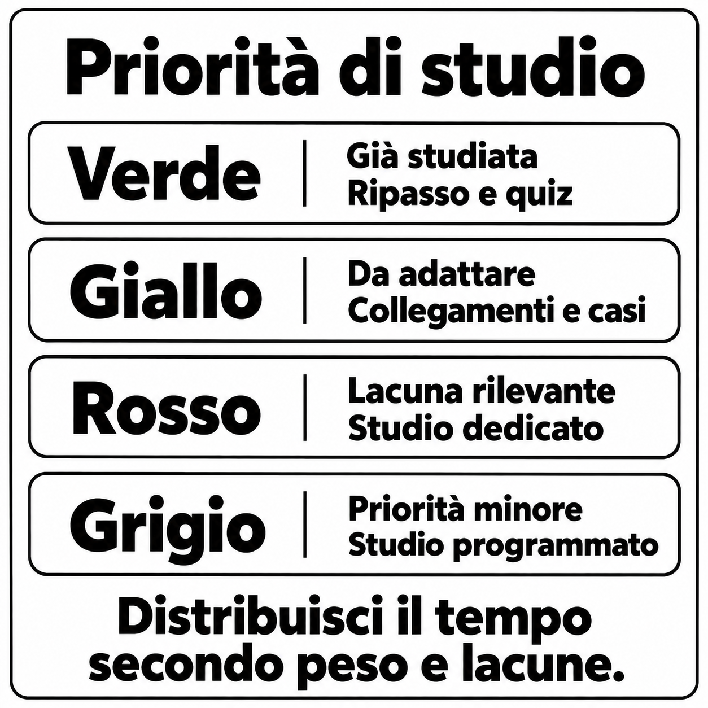

# Capitolo 20 - Mappe profilo: cosa resta comune e cosa cambia

Nel capitolo precedente hai imparato a riconoscere le famiglie dei concorsi pubblici. Ora devi fare il passaggio successivo: trasformare la famiglia in una mappa di studio.

Una mappa profilo risponde a una domanda pratica:

> Che cosa posso riutilizzare e che cosa devo cambiare per questo profilo?

Senza questa domanda, il candidato cade in due trappole. La prima è ripetere sempre lo stesso piano, anche quando il bando richiede un modulo specialistico. La seconda è abbandonare tutto ciò che ha già studiato, come se ogni concorso fosse un mondo nuovo.

La mappa profilo serve a mantenere continuità senza diventare rigidi.

Questa selezione comprende 13 mappe operative; le 15 famiglie del Capitolo 19 hanno un perimetro più ampio. Per i profili culturali, archivistici e bibliotecari usa il VOL-06, percorso M-IR04, confrontando il programma con l’indice specialistico. Per dirigenza, carriere speciali e corpi uniformati usa l’inquadramento del Capitolo 19, sezione “Famiglia 15 - Dirigenza, carriere speciali e corpi uniformati”, e costruisci la scheda sul programma specifico: i volumi qui elencati non promettono la copertura di tutte quelle carriere. Le indicazioni di frequenza sono orientamenti qualitativi, non percentuali ricavate da un campione rappresentativo.

## Obiettivo del capitolo

Alla fine del capitolo devi saper costruire una scheda rapida per qualunque profilo concorsuale, distinguendo:

- materie quasi sempre presenti;
- materie probabili;
- materie eventuali;
- materie da modulo specialistico;
- prove frequenti;
- difficoltà tipiche;
- rischio principale;
- strategia di studio;
- cosa studiare prima;
- cosa non approfondire troppo.

La mappa non offre una previsione perfetta; aiuta a prendere una decisione migliore.

## La regola base: core più modulo

Il Metodo BANDO usa una formula semplice:

> preparazione utile = nucleo comune + modulo profilo + allenamento sulla prova reale.

Il nucleo comune comprende ciò che ricorre spesso nei concorsi pubblici: amministrativo, pubblico impiego, trasparenza, digitale, inglese, logica, metodo di quiz, scritto, orale e casi.

Il modulo profilo comprende ciò che rende quel concorso diverso: enti locali, contabilità, tributario, giustizia, sanità, scuola, vigilanza, tecnico, ICT, codice della strada, fondi, appalti, settore specifico.

L’allenamento sulla prova reale adatta tutto al formato: quiz, risposta breve, caso, elaborato, orale, prova pratica, situazionale.

Se manca uno dei tre elementi, la preparazione si sbilancia.

## Mappa BANDO del capitolo

| Passaggio | Domanda | Azione |
|---|---|---|
| B - Bando | Quale profilo e quale prova? | Estrai dati da bando e allegati |
| A - Aree | Quali aree sono core e quali sono modulo? | Evidenzia con due colori |
| N - Nuclei | Dove posso prendere più punti? | Ordina le priorità |
| D - Diario | Sto studiando in proporzione al peso? | Controlla ore, errori e rinvii |
| O - Output | Che prodotto devo generare in prova? | Simula nel formato corretto |

### Schema 20.1 — La mappa del profilo orienta le scelte

Mappa BANDO delle mappe profilo

| Fase | Dati da usare |
|---|---|
| Bando | Profilo, prove e peso delle componenti. |
| Aree | Nucleo comune, modulo specifico e materie da verificare nel programma. |
| Nuclei | Argomenti prioritari e difficoltà che possono incidere sul risultato. |
| Diario | Ore, errori e rinvii. |
| Output | Quiz, caso, orale e altri prodotti richiesti. |

La mappa aiuta a decidere che cosa riusare e che cosa cambiare; i risultati del diario permettono di correggerla.

La mappa profilo non sostituisce il diario. Lo alimenta.

### Schema 20.2 — Nucleo comune + modulo di profilo + prova reale

Formula core, modulo profilo e prova reale

| Componente | Esempi da selezionare secondo il bando |
|---|---|
| Nucleo comune | Amministrativo, pubblico impiego, trasparenza, privacy, digitale, inglese e metodo di prova. |
| Modulo di profilo | Enti locali, contabilità, tributario, tecnico, ICT, sanità o scuola. |
| Prova reale | Quiz a tempo, risposta breve, caso pratico, orale o prova pratica. |

La preparazione utile nasce dall'integrazione delle tre componenti: conserva continuità e adatta i pesi senza ripartire automaticamente da zero.

## Il modello unico di mappa profilo

Usa questa struttura per ogni concorso.

| Campo | Come compilarlo |
|---|---|
| Profilo | Titolo del bando e mansioni descritte |
| Famiglia | Amministrativo, contabile, enti locali, ministero, fiscale, tecnico, ICT, sanità, scuola, ecc. |
| Core | Materie comuni da riutilizzare |
| Modulo | Materie specifiche che distinguono il profilo |
| Prove | Preselettiva, scritto, teorico-pratica, orale, pratica, situazionale |
| difficoltà | Tempo, volume programma, tecnicità, casi, orale, soglia |
| Rischio | Dove puoi perdere punti anche studiando molto |
| Prima cosa | Blocco da affrontare subito |
| Da non eccedere | Materia che non va approfondita oltre il bando |

### Schema 20.3 — Dalla scheda alla prima azione

Scheda unica di mappa profilo

Prima di aggiungere materiali, verifica i sette campi della mappa: **profilo** — titolo, mansioni e amministrazione; **famiglia** — contesto concorsuale; **core** — materie riutilizzabili; **modulo** — specificità del ruolo; **prove** — formato, tempo, soglia e penalità; **rischio** — dove puoi perdere punti; **prima cosa** — sessione da svolgere subito.

Da qui ricava tre decisioni: **che cosa studio oggi**, **che cosa approfondisco meno o rinvio motivatamente** e **quale output produco entro sette giorni**. La scheda deve cambiare il calendario, non restare un elenco.

Il campo più importante è “rischio”. Spesso il concorso non si perde per ciò che non si studia, ma per ciò che si studia nel peso sbagliato.

## Mappa 1 - Amministrativo generale

| Voce | Indicazione |
|---|---|
| Profili tipici | assistente, istruttore, funzionario, collaboratore amministrativo |
| Quasi sempre | amministrativo, pubblico impiego, trasparenza, procedimento, informatica, inglese |
| Probabili | costituzionale, privacy, anticorruzione, codice comportamento, documentazione amministrativa |
| Eventuali | contabilità, contratti, ordinamento ente, competenze trasversali |
| Da modulo | settore dell’amministrazione: università, sanità, ministero, ente locale, agenzia |
| Prove frequenti | quiz, scritto a risposta multipla, orale, situazionali |
| difficoltà | programma ampio e rischio di genericità |
| Rischio | sapere definizioni senza saperle usare in ufficio |
| Prima cosa | procedimento, provvedimento, accesso, pubblico impiego |
| Da non eccedere | manuali troppo specialistici non collegati al bando |

Strategia:

Parti dal nucleo comune. Costruisci una mappa dei procedimenti e collega ogni istituto a un esempio di lavoro amministrativo: istanza, protocollo, termine, responsabile, accesso, atto, comunicazione, errore, autotutela.

## Mappa 2 - Amministrativo-contabile

| Voce | Indicazione |
|---|---|
| Profili tipici | istruttore amministrativo-contabile, funzionario contabile, ragioneria, tributi, economato |
| Quasi sempre | amministrativo, contabilità pubblica, bilancio, atti, pubblico impiego |
| Probabili | enti locali, contratti pubblici, controlli, trasparenza, tributi locali |
| Eventuali | economato, patrimonio, rendicontazione, appalti, fondi |
| Da modulo | contabilità dell’ente specifico: comune, Stato, università, sanità |
| Prove frequenti | quiz, scritto teorico-pratico, orale con casi |
| difficoltà | materie tecniche e lessico contabile |
| Rischio | rimandare contabilità fino alla fine |
| Prima cosa | ciclo bilancio-entrata-spesa-controllo |
| Da non eccedere | contabilità avanzata non richiesta dal bando |

Strategia:

Non separare atto e copertura finanziaria. Ogni volta che studi una spesa chiediti: chi decide, con quale atto, su quale capitolo, con quale impegno, con quale controllo e con quale responsabilità?

## Mappa 3 - Enti locali

| Voce | Indicazione |
|---|---|
| Profili tipici | amministrativo, contabile, tecnico, polizia locale, servizi sociali, cultura, ambiente |
| Quasi sempre | ordinamento enti locali, amministrativo, pubblico impiego, trasparenza |
| Probabili | contabilità locale, contratti, privacy, servizi al cittadino |
| Eventuali | tributi locali, urbanistica, codice strada, regolamenti comunali |
| Da modulo | settore dell’ufficio: ragioneria, tecnico, vigilanza, sociale, cultura |
| Prove frequenti | quiz, scritto, orale, casi pratici |
| difficoltà | molte materie piccole ma collegate |
| Rischio | confondere organi politici e competenze gestionali |
| Prima cosa | organi, atti, competenze, procedimento, bilancio base |
| Da non eccedere | diritto costituzionale oltre la parte utile all’ente |

Strategia:

Studia il comune come macchina decisionale. Per ogni tema chiediti: consiglio, giunta, sindaco, dirigente/responsabile o ufficio? Questa domanda risolve molti quiz e casi pratici.

## Mappa 4 - Ministeri e funzioni centrali

| Voce | Indicazione |
|---|---|
| Profili tipici | assistente, funzionario, amministrativo, giuridico, contabile, tecnico |
| Quasi sempre | amministrativo, costituzionale, pubblico impiego, organizzazione PA |
| Probabili | ordinamento del ministero, trasparenza, digitale, inglese, competenze trasversali |
| Eventuali | contabilità di Stato, contratti, disciplina settoriale |
| Da modulo | funzione specifica: giustizia, interno, economia, cultura, ambiente, esteri |
| Prove frequenti | quiz, scritto, orale, situazionali |
| difficoltà | programmi ampi e profili multipli |
| Rischio | ignorare l’amministrazione specifica |
| Prima cosa | struttura dello Stato, amministrativo, pubblico impiego |
| Da non eccedere | ordinamenti settoriali non presenti nel bando |

Strategia:

Costruisci prima il core, poi dedica un blocco al ministero. Conoscere la “pubblica amministrazione” in generale non basta: devi capire la funzione dell’amministrazione che assume e il lessico del settore.

## Mappa 5 - Giustizia

| Voce | Indicazione |
|---|---|
| Profili tipici | assistente giudiziario, funzionario giudiziario, cancelliere, tecnico, amministrativo |
| Quasi sempre | amministrativo, pubblico impiego, organizzazione giustizia, servizi d’ufficio |
| Probabili | elementi di procedura, ordinamento giudiziario, digitale, privacy |
| Eventuali | procedura civile, procedura penale, servizi di cancelleria, informatica giudiziaria |
| Da modulo | materia processuale e ufficio giudiziario |
| Prove frequenti | quiz, scritto, orale |
| difficoltà | lessico tecnico e materie processuali |
| Rischio | studiare procedura in modo sproporzionato o troppo poco |
| Prima cosa | programma ufficiale e peso delle materie processuali |
| Da non eccedere | procedura avanzata se il bando chiede solo elementi |

Strategia:

Identifica se il bando richiede cultura amministrativa, cultura giuridica processuale o conoscenza operativa di ufficio. Sono tre piani diversi e vanno allenati con output diversi.

## Mappa 6 - Agenzie fiscali

| Voce | Indicazione |
|---|---|
| Profili tipici | funzionario tributario, giuridico-tributario, tecnico-catastale, economico, informatico |
| Quasi sempre | amministrativo, organizzazione agenzia, pubblico impiego, inglese / informatica se previste |
| Probabili | tributario, civile, commerciale, contabilità, economia |
| Eventuali | catasto, estimo, statistica, informatica, privacy, servizi digitali |
| Da modulo | tributario o tecnico-catastale |
| Prove frequenti | quiz o scritto selettivo, orale, prove tecniche in alcuni profili |
| difficoltà | materie specialistiche ad alto peso |
| Rischio | trattare tributario o catasto come materie secondarie |
| Prima cosa | modulo specialistico in parallelo al core |
| Da non eccedere | amministrativo generale oltre il peso del bando |

Strategia:

Qui il modulo non è accessorio. Se il profilo è giuridico-tributario, organizza da subito blocchi di tributario e quiz dedicati. Se è tecnico, separa amministrativo, catasto/estimo e casi tecnici.

### Schema 20.4 — Profili amministrativi e centrali: priorità e rischi

Profili amministrativi e centrali

| Contesto | Collegamento prioritario | Rischio |
|---|---|---|
| Amministrativo generale | Base comune solida. | Restare generici. |
| Amministrativo-contabile | Bilancio e atti. | Rinviare la contabilità. |
| Enti locali | Organi e competenze. | Confondere i ruoli. |
| Ministeri | Organizzazione dello Stato e funzione dell'amministrazione. | Ignorare l'ente. |
| Giustizia | Ufficio e procedura. | Assegnare pesi errati alle materie. |
| Agenzie fiscali | Tributario o catasto secondo il profilo. | Sottovalutare il modulo specialistico. |

Bilancia base amministrativa, amministrazione specifica e prova secondo i dati del bando.

## Mappa 7 - Previdenza, lavoro e vigilanza

| Voce | Indicazione |
|---|---|
| Profili tipici | consulente protezione sociale, ispettore vigilanza, funzionario lavoro, amministrativo previdenziale |
| Quasi sempre | amministrativo, pubblico impiego, servizi al cittadino, inglese / informatica se previste |
| Probabili | diritto del lavoro, legislazione sociale, previdenza, assicurazione sociale |
| Eventuali | civile, commerciale, penale, controlli, vigilanza |
| Da modulo | lavoro, previdenza, ispezione o servizi sociali dell’ente |
| Prove frequenti | quiz, scritto, orale, situazionali |
| difficoltà | programma specialistico e lessico tecnico |
| Rischio | restare sul diritto amministrativo e trascurare lavoro / previdenza |
| Prima cosa | glossario e nuclei del modulo specialistico |
| Da non eccedere | pubblico impiego oltre la quota richiesta |

Strategia:

Prepara una tabella di parole chiave: contributi, tutela, prestazione, vigilanza, lavoratore, datore, assicurazione, accertamento, servizio. Senza lessico, anche la risposta corretta sembra generica.

## Mappa 8 - Tecnico con prova amministrativa

| Voce | Indicazione |
|---|---|
| Profili tipici | istruttore tecnico, funzionario tecnico, ingegnere, architetto, geometra, ambiente, lavori pubblici |
| Quasi sempre | disciplina tecnica, procedimento, accesso, contratti, sicurezza, responsabilità |
| Probabili | urbanistica, edilizia, lavori pubblici, ambiente, patrimonio, appalti |
| Eventuali | contabilità, protezione civile, catasto, GIS, digitale |
| Da modulo | settore tecnico specifico |
| Prove frequenti | scritto tecnico, caso, relazione, orale, quiz |
| difficoltà | applicazione pratica e tempi |
| Rischio | sapere la tecnica ma non saperla tradurre in atto / procedimento |
| Prima cosa | collegare disciplina tecnica e procedimento |
| Da non eccedere | teoria tecnica non spendibile nella prova |

Strategia:

Per ogni argomento tecnico costruisci tre righe: problema, atto/procedura, responsabilità. Questo ti prepara a casi e domande orali.

## Mappa 9 - ICT e digitale

| Voce | Indicazione |
|---|---|
| Profili tipici | funzionario informatico, tecnico sistemi, data analyst, cybersecurity, transizione digitale |
| Quasi sempre | informatica, reti, basi dati, sicurezza, PA digitale |
| Probabili | CAD, identità digitale, protocollo, interoperabilità, privacy, cloud |
| Eventuali | programmazione, SQL, sistemi, project management, contratti ICT |
| Da modulo | tecnologia richiesta dal bando |
| Prove frequenti | quiz tecnico, scritto, prova pratica, orale |
| difficoltà | ampiezza tecnica e aggiornamento |
| Rischio | studiare informatica generica senza collegarla alla PA |
| Prima cosa | mappa sistemi-dati-servizi-sicurezza |
| Da non eccedere | strumenti non citati dal bando |

Strategia:

Allenati a spiegare l’informatica come servizio pubblico: autenticazione, documento, protocollo, sicurezza, accesso, dato, interoperabilità, conservazione, responsabilità.

## Mappa 10 - Polizia locale

| Voce | Indicazione |
|---|---|
| Profili tipici | agente, istruttore vigilanza, ufficiale, funzionario polizia locale |
| Quasi sempre | enti locali, amministrativo, codice strada se previsto, sanzioni, regolamenti |
| Probabili | sicurezza urbana, polizia amministrativa, elementi penali, privacy, comportamento |
| Eventuali | prove fisiche, guida, lingua, informatica, casi situazionali |
| Da modulo | codice della strada, sanzioni, sicurezza urbana |
| Prove frequenti | quiz, scritto, orale, prova pratica o fisica se prevista |
| difficoltà | volume di disciplina speciale |
| Rischio | prepararla come un normale concorso comunale |
| Prima cosa | leggere requisiti, prove e modulo di settore |
| Da non eccedere | amministrativo teorico non collegato a casi |

Strategia:

Costruisci casi: controllo, verbale, cittadino, ordinanza, regolamento, sanzione, sicurezza. La prova premia chi unisce regola, comportamento e competenza.

## Mappa 11 - Sanità amministrativa

| Voce | Indicazione |
|---|---|
| Profili tipici | assistente amministrativo, collaboratore amministrativo, funzionario, segreteria, personale, gare |
| Quasi sempre | amministrativo, pubblico impiego, privacy, servizi all’utenza, trasparenza |
| Probabili | organizzazione sanitaria, contabilità, acquisti, documentazione, anticorruzione |
| Eventuali | diritto sanitario, CUP, personale sanitario, contratti, bilancio sanitario |
| Da modulo | ordinamento sanitario e dati sanitari |
| Prove frequenti | quiz, scritto, orale, casi situazionali |
| difficoltà | bilanciamento servizio / privacy |
| Rischio | sottovalutare dati sensibili e organizzazione del servizio |
| Prima cosa | privacy, accesso, servizio al cittadino, organizzazione base |
| Da non eccedere | disciplina sanitaria clinica non richiesta |

Strategia:

Studia i casi di sportello e documentazione. In sanità amministrativa, dire troppo o comunicare dati senza titolo è un errore grave anche quando l’intenzione è aiutare.

## Mappa 12 - Scuola, ATA e università

| Voce | Indicazione |
|---|---|
| Profili tipici | assistente amministrativo, assistente tecnico, funzionario universitario, segreteria studenti |
| Quasi sempre | amministrativo, pubblico impiego, privacy, documentazione, informatica |
| Probabili | ordinamento scolastico / universitario, segreteria, personale, studenti, contabilità |
| Eventuali | didattica, ricerca, appalti, protocollo, gestione graduatorie |
| Da modulo | ordinamento del settore |
| Prove frequenti | quiz, scritto, orale, prova pratica informatica |
| difficoltà | norme settoriali e servizi a utenti diversi |
| Rischio | ignorare ordinamento e processi di segreteria |
| Prima cosa | capire se il bando chiede scuola, università o ricerca |
| Da non eccedere | diritto scolastico / universitario avanzato se non previsto |

Strategia:

Prepara esempi di segreteria: domanda, documenti, accesso, privacy, graduatoria, protocollo, comunicazione, servizio allo studente o alla famiglia.

## Mappa 13 - Appalti, PNRR, fondi e project support

| Voce | Indicazione |
|---|---|
| Profili tipici | gare, contratti, rendicontazione, project support, fondi UE, PNRR |
| Quasi sempre | contratti pubblici, amministrativo, trasparenza, controlli |
| Probabili | contabilità, rendicontazione, anticorruzione, digitalizzazione contratti |
| Eventuali | fondi UE, PNRR, project management, monitoraggio |
| Da modulo | ciclo progetto-finanziamento-controllo |
| Prove frequenti | scritto teorico-pratico, caso, orale |
| difficoltà | intreccio tra norme, documenti e scadenze |
| Rischio | studiare solo gara e non esecuzione / rendicontazione |
| Prima cosa | ciclo fabbisogno-affidamento-esecuzione-controllo |
| Da non eccedere | fondi UE avanzati se il bando non li chiede |

Strategia:

Usa un flow: programmazione, affidamento, stipula, esecuzione, pagamento, controllo, rendicontazione. Ogni domanda va collocata nel punto giusto del ciclo.

### Schema 20.5 — Profili specialistici: avviare presto il modulo

Profili specialistici e servizi

| Profilo o ambito | Lavoro specifico |
|---|---|
| Lavoro e previdenza | Glossario specialistico e modulo avviato fin dall'inizio. |
| Tecnico PA | Disciplina tecnica collegata a procedimento, casi e atti. |
| ICT e digitale | Sistemi, dati e sicurezza nel contesto della PA digitale. |
| Polizia locale | Codice della strada e casi di settore. |
| Amministrativo in sanità | Protezione dei dati, servizio e rapporto con l'utenza. |
| Scuola e università | Segreterie, ordinamento e processi concreti. |
| Appalti e fondi | Ciclo dal progetto al controllo e alla rendicontazione. |

Se il modulo richiesto è ancora debole, inseriscilo subito nel calendario insieme al nucleo comune.

## Come adattare la mappa al tuo bando

Le mappe del capitolo sono modelli. Il tuo bando può deviare. Per questo devi fare una verifica in cinque passaggi.

1. Leggi profilo e mansioni, non solo titolo del concorso.
2. Evidenzia le materie già presenti nel nucleo comune del libro.
3. Cerchia le materie specialistiche.
4. Segna prova, durata, punteggio, soglia e penalità.
5. Trasforma la mappa in calendario.

Se il bando dice “elementi di”, non significa automaticamente materia facile. Significa che devi capire quale livello chiede la commissione.

Se il bando dice “con particolare riferimento a”, quella parte va trattata come nucleo ad alto rendimento.

Se il bando prevede prova teorico-pratica, non basta leggere: devi produrre atti, risposte, casi o schemi.

## La griglia semaforo

Dopo aver compilato la mappa, assegna un colore alle materie.

| Colore | Significato | Azione |
|---|---|---|
| Verde | già studiata e riutilizzabile | Ripasso, quiz, richiamo attivo |
| Giallo | Conosciuta ma da adattare al profilo | Collegamenti, casi, domande orali |
| Rosso | Nuova o specialistica | Blocchi dedicati, fonti mirate, drill |
| Grigio | Presente ma marginale o incerta | Studio minimo fino a conferma |

Il rosso non va lasciato agli ultimi giorni. Il grigio non deve rubare tempo al rosso.

## Come distribuire il tempo

Una regola prudente per un bando nuovo è questa:

| Situazione | Core | Modulo profilo | Prove / output |
|---|---:|---:|---:|
| Profilo amministrativo generale | 55% | 20% | 25% |
| Profilo amministrativo-contabile | 40% | 35% | 25% |
| Profilo specialistico fiscale / lavoro / tecnico | 30% | 45% | 25% |
| Profilo con prova pratica o caso | 30% | 35% | 35% |
| Profilo già in parte studiato | 25% | 45% | 30% |

*Figura 20.6 - Semaforo delle materie e azioni di studio*

Le percentuali dell’esempio precedente non sono regole fisse. Servono a evitare una distorsione: continuare a studiare ciò che ti rassicura e rinviare ciò che ti seleziona.

## Caso guidato

Hai già preparato un concorso da istruttore amministrativo comunale. Ora trovi un bando per funzionario tecnico in un ente locale. Nel programma restano diritto amministrativo, pubblico impiego, trasparenza, privacy e contratti. Si aggiungono urbanistica, edilizia e lavori pubblici.

Reazione sbagliata:

“Riparto dal manuale tecnico e lascio amministrativo alla fine, tanto l’ho già studiato”.

Reazione corretta:

1. segna amministrativo, pubblico impiego, trasparenza e privacy come verde;
2. trasforma contratti pubblici da verde/giallo a materia applicativa, perché nei profili tecnici può pesare molto;
3. metti urbanistica, edilizia e lavori pubblici in rosso;
4. costruisci casi: permesso, autorizzazione, affidamento, verifica, responsabilità;
5. fai simulazioni nel formato previsto dal bando.

### Schema 20.7 — Convertire la preparazione: dall'amministrativo al tecnico

Caso guidato: convertire una preparazione

| Stato nell'esempio | Materie | Azione |
|---|---|---|
| Base già pronta | Amministrativo, pubblico impiego, trasparenza e privacy. | Mantieni e verifica con ripassi: «verde» descrive una padronanza da controllare. |
| Da adattare | Contratti, procedimento tecnico, responsabilità e linguaggio dell'ente. | Passa all'applicazione nei casi del nuovo profilo. |
| Nuovo lavoro prioritario | Urbanistica, edilizia, lavori pubblici e casi tecnici. | Avvia il modulo nel calendario e simula la prova richiesta. |

Conserva la base mentre costruisci la specializzazione: il cambio di profilo richiede conversione e verifica della preparazione.

La preparazione precedente non viene buttata. Viene convertita.

## Domanda da commissario

> Che cosa significa, nel Metodo BANDO, distinguere nucleo comune e modulo profilo?

Risposta modello:

Significa separare ciò che posso riutilizzare tra più concorsi da ciò che rende specifico il bando che sto preparando. Il nucleo comune comprende materie e competenze ricorrenti, come amministrativo, pubblico impiego, trasparenza, digitale, inglese e metodo di prova. Il modulo profilo comprende le materie che dipendono dall’amministrazione e dal ruolo: enti locali, contabilità, tributario, giustizia, sanità, tecnico, ICT, polizia locale o altro settore. La preparazione efficace nasce dal bilanciamento tra questi due blocchi e dall’allenamento sulla prova reale.

## Domanda-trappola

> Se ho già studiato diritto amministrativo per un concorso, posso considerarlo risolto per tutti gli altri?

No. Puoi riutilizzare la base, ma devi adattarla. In un ente locale amministrativo si collega ad atti, organi e servizi. In un profilo tecnico si collega a autorizzazioni, contratti e responsabilità. In un’agenzia fiscale si collega a procedimenti e funzioni dell’agenzia. La materia resta, ma cambia l’uso in prova.

## Errore tipico

L’errore tipico è compilare la mappa profilo e poi non usarla.

Molti candidati fanno tabelle, schemi e colori, ma il calendario resta identico: ore distribuite a sensazione, materiali aperti in base all’umore, quiz casuali.

La mappa profilo serve solo se produce decisioni:

- cosa studio oggi;
- cosa rinvio;
- cosa alleno con quiz;
- cosa alleno con risposte scritte;
- cosa porto all’orale;
- cosa entra nel diario errori.

## Mini-esercizio

Compila una mappa per il tuo bando.

| Campo | Risposta |
|---|---|
| Profilo e amministrazione | |
| Famiglia concorsuale | |
| Prova principale | |
| Materie verdi | |
| Materie gialle | |
| Materie rosse | |
| Materie grigie | |
| Modulo profilo | |
| Rischio principale | |
| Prima sessione da fare domani | |
| Output da produrre entro 7 giorni | |

Poi controlla il calendario. Se non cambia nulla, la mappa non è stata usata.

## Checklist operativa

Prima di iniziare un nuovo concorso, verifica:

- ho letto profilo e mansioni?
- ho distinto core e modulo?
- ho individuato la materia killer?
- conosco formato, durata e punteggio delle prove?
- ho capito se serve banca dati, quiz, casi, orale o prova pratica?
- ho segnato che cosa posso riutilizzare?
- ho segnato cosa devo studiare da zero?
- ho eliminato approfondimenti fuori bando?
- ho programmato output misurabili?

Se mancano tre o più risposte, non sei ancora nella fase di studio: sei ancora nella fase di decodifica.

## Da sapere in 5 righe

La mappa profilo traduce il bando in una strategia. Il nucleo comune evita di ricominciare da zero, mentre il modulo profilo dà precisione alla preparazione. Pesa ogni materia rispetto alla prova reale e rialloca il tempo dove il bando crea selezione.
