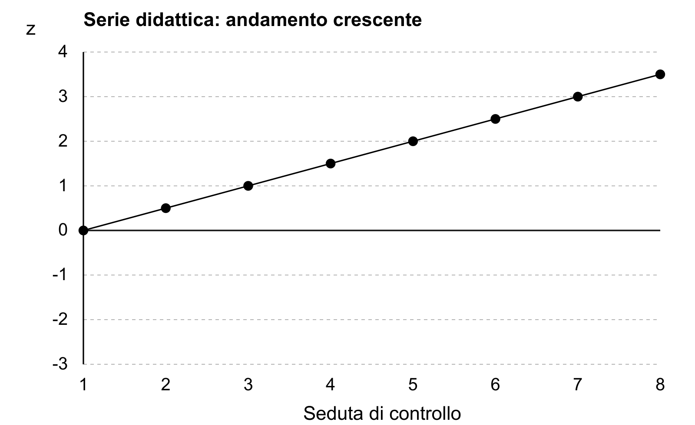

# TSLB: processo di laboratorio, qualità e biosicurezza

Un risultato di laboratorio non nasce nel momento in cui uno strumento produce un numero o un segnale. Comincia dal quesito che motiva l'esame, attraversa identificazione, raccolta, trasporto, accettazione, preparazione e analisi, quindi prosegue con controllo, validazione, comunicazione e conservazione delle informazioni. Un errore in uno solo di questi passaggi può rendere inutilizzabile anche un'analisi tecnicamente corretta.

Nei concorsi per tecnico sanitario di laboratorio biomedico (TSLB), la commissione verifica perciò una competenza più ampia della conoscenza di singole tecniche. Il candidato deve saper ricostruire il processo, riconoscere dove può fallire, collegare qualità e biosicurezza e proporre una risposta prudente quando i dati non permettono di applicare una procedura specifica.

## Obiettivo del capitolo

Al termine saprai:

- distinguere fase preanalitica, analitica e postanalitica;
- spiegare il ruolo della tracciabilità lungo il percorso del campione;
- distinguere dato analitico, validazione e refertazione senza attribuire responsabilità universali;
- orientarti tra biochimica, microbiologia, ematologia, immunologia e patologia;
- valutare a livello concettuale l'appropriatezza di un metodo rispetto al quesito;
- distinguere sistema di gestione della qualità, controllo qualità e valutazione esterna;
- impostare la gestione di una non conformità e di un'azione correttiva;
- applicare una valutazione di biosicurezza basata su pericolo, attività, esposizione, probabilità e conseguenze;
- strutturare una prova pratica illustrata senza inventare parametri o istruzioni operative.

## Mappa BANDO del laboratorio

| Passaggio | Domanda per il candidato | Prodotto di studio |
| --- | --- | --- |
| **B — Bando** | quali discipline, fasi, sistemi qualità e rischi compaiono nel programma? | scheda delle materie e delle prove |
| **A — Aree** | il nucleo riguarda processo, disciplina, qualità o biosicurezza? | mappa delle aree |
| **N — Nuclei** | quale definizione, distinzione o decisione deve essere dimostrata? | elenco prioritizzato |
| **D — Diario** | l'errore nasce da fase, identificazione, metodo, controllo, documento o rischio? | diario degli errori |
| **O — Output** | devo ricostruire un flusso, analizzare un evento, spiegare un controllo o valutare un rischio? | risposta o caso allenabile |

Nel campione di cinque bandi TSLB esaminati ricorrono tecniche di laboratorio, fasi preanalitica, analitica e postanalitica, qualità, biosicurezza e discipline come biochimica, microbiologia ed ematologia. La ricorrenza orienta lo studio; il programma effettivo resta quello del singolo bando.

> **Da sapere in 5 righe**
>
> Il processo di laboratorio è una catena e la qualità riguarda ogni anello. Il controllo qualità non coincide con l'intero sistema qualità. Una non conformità richiede contenimento, registrazione, analisi e verifica delle azioni. In biosicurezza il pericolo non è il rischio: contano anche attività, esposizione, probabilità e conseguenze. Parametri, DPI e procedure si scelgono sulla valutazione del setting, non per memoria astratta.

## Il ruolo del TSLB nel processo

Il D.M. 26 settembre 1994, n. 745 individua il TSLB e collega il profilo alle attività di analisi e ricerca biomedica e biotecnologica. Il tecnico è responsabile del corretto adempimento delle procedure analitiche e del proprio operato nell'ambito delle funzioni attribuite; verifica inoltre la corrispondenza delle prestazioni a indicatori e standard e controlla il funzionamento delle apparecchiature nei limiti di competenza.

Questa responsabilità non rende il TSLB responsabile di ogni passaggio che precede o segue l'analisi. Prelievo, indicazione clinica, interpretazione, rilascio, manutenzione specialistica e organizzazione del servizio possono coinvolgere soggetti diversi. Nella risposta concorsuale occorre quindi distinguere:

1. attività svolta dal TSLB;
2. procedura o criterio applicabile;
3. controllo di competenza;
4. collaborazione necessaria;
5. decisione che appartiene ad altro soggetto.

Il confine non riduce la responsabilità professionale. La rende precisa.

## Il percorso dal quesito al risultato

La suddivisione in fase preanalitica, analitica e postanalitica serve a localizzare attività, controlli ed errori. Le tre fasi sono collegate: una non conformità preanalitica può produrre un dato analiticamente stabile ma riferito al campione sbagliato; un errore postanalitico può compromettere la comunicazione di un dato tecnicamente corretto.

### Fase preanalitica

La fase preanalitica comprende ciò che prepara l'analisi. Inizia con il quesito e la richiesta, prosegue con identificazione, preparazione della persona quando prevista, raccolta, contenitore, etichettatura, trasporto, ricezione, accettazione e trattamento iniziale del campione.

Non tutte queste attività si svolgono nel laboratorio o sono compiute dal TSLB. Il laboratorio deve però governare i requisiti che rendono il campione utilizzabile e tracciabile. In prova, il candidato deve riconoscere almeno quattro gruppi di rischio:

- discordanza tra persona, richiesta e campione;
- campione raccolto, conservato o trasportato in condizioni non conformi ai requisiti applicabili;
- quantità, contenitore o integrità non adeguati;
- informazioni mancanti che impediscono una decisione sicura.

La risposta non deve inventare criteri di accettazione. Deve indicare che tali criteri derivano dal metodo, dalla procedura e dal tipo di campione; l'evento va riconosciuto, registrato e gestito prima della prosecuzione automatica.

### Fase analitica

La fase analitica trasforma il campione in un dato attraverso un metodo definito. Comprende preparazione prevista, esecuzione, controlli, gestione dei reagenti e dei materiali, funzionamento dell'apparecchiatura e verifica delle condizioni che rendono il risultato tecnicamente affidabile.

La qualità analitica non dipende da un solo controllo. Richiede personale competente, metodo adatto, apparecchiatura idonea, materiali gestiti, documentazione disponibile, registrazioni complete e risposta agli scostamenti. Un segnale anomalo non si gestisce ripetendo automaticamente l'analisi: prima si deve capire quale parte del sistema può averlo prodotto.

### Fase postanalitica

La fase postanalitica riguarda il passaggio dal dato prodotto alla sua disponibilità per l'uso previsto. Può comprendere revisione dei dati, livelli di validazione, rilascio o refertazione, comunicazione, gestione di risultati che richiedono un percorso specifico, archiviazione e conservazione delle informazioni.

Ruoli e firme non si deducono dalla parola «postanalitica». Dipendono da profilo, organizzazione, disciplina, procedura e sistema informativo. Il TSLB deve saper riconoscere la correttezza tecnica del proprio operato e segnalare ciò che esce dai limiti; non deve appropriarsi dell'interpretazione clinica o di attribuzioni assegnate ad altri.

### Tracciabilità

La tracciabilità permette di ricostruire chi ha fatto che cosa, su quale campione, con quale metodo, materiale, apparecchiatura, controllo, data e risultato. Non è una raccolta indiscriminata di dati. Registra le informazioni necessarie a collegare evento, decisione e responsabilità.

Una catena tracciabile consente di:

- seguire il campione lungo le tre fasi;
- delimitare i risultati potenzialmente interessati da un problema;
- ricostruire cause e fattori contribuenti;
- dimostrare che controlli e comunicazioni sono avvenuti;
- verificare l'efficacia di un'azione correttiva.

### Validazione e refertazione

Validazione e refertazione non sono sinonimi. La validazione indica il processo con cui si verifica che dati e condizioni soddisfino i criteri previsti prima del rilascio; può avere livelli tecnico-analitici e professionali differenti. La refertazione è la produzione e messa a disposizione del documento o risultato secondo regole, responsabilità e modalità del servizio.

La distinzione da usare in prova è questa:

| Passaggio | Domanda |
| --- | --- |
| dato | che cosa ha prodotto il metodo? |
| controllo tecnico | le condizioni analitiche e i controlli previsti sono accettabili? |
| validazione | chi può autorizzare il passaggio successivo e secondo quali criteri? |
| interpretazione | quale significato può essere attribuito e da quale professionista? |
| refertazione/comunicazione | come e da chi il risultato viene rilasciato secondo il sistema applicabile? |

La tabella impedisce di attribuire automaticamente al TSLB ogni livello di validazione o refertazione. Se la traccia non specifica il ruolo, la risposta deve indicare che l'attribuzione dipende dalla fonte organizzativa applicabile.

## Le discipline applicate: una mappa per orientarsi

Le discipline di laboratorio non sono un elenco di strumenti. Ognuna collega un quesito a una matrice biologica, a un principio di misura o identificazione, a controlli e a limiti. Nei bandi il livello di dettaglio cambia; la prima competenza consiste nel classificare correttamente il problema.

| Disciplina | Oggetto prevalente | Domanda iniziale del candidato |
| --- | --- | --- |
| biochimica clinica | componenti e processi chimico-biologici misurabili nelle matrici pertinenti | quale analita o processo si vuole valutare e con quale principio? |
| microbiologia | ricerca, rilevazione o caratterizzazione di microrganismi e loro componenti | quale agente o segnale si cerca, in quale campione e con quali limiti? |
| ematologia | cellule del sangue, parametri correlati ed emostasi nei limiti del programma | quale componente o funzione è oggetto dell'esame? |
| immunologia | componenti e reazioni del sistema immunitario, inclusi antigeni e anticorpi | il metodo rileva una componente, una risposta o un'interazione? |
| patologia, istologia e citologia | cellule e tessuti preparati per osservazione e valutazione nel percorso diagnostico | quali passaggi preservano identità, rappresentatività e qualità del preparato? |

Questa è una mappa di orientamento, non un criterio per scegliere una tecnica. Microbiologia non è sinonimo di coltura; immunologia non coincide con un solo tipo di reazione; patologia non attribuisce al TSLB la diagnosi. Metodo, responsabilità e profondità dipendono dalla traccia e dalle fonti della disciplina.

### Principi analitici da riconoscere

In **biochimica clinica** si misura un analita, per esempio glucosio o creatinina, collegando una proprietà osservabile alla sua quantità. Nella spettrofotometria il segnale è l'assorbimento di luce a una determinata lunghezza d'onda; entro le condizioni e l'intervallo del metodo, la relazione con la concentrazione consente la misura. Nei metodi elettrochimici il segnale deriva da proprietà elettriche, come la differenza di potenziale in un elettrodo selettivo. Il metodo non misura «la malattia»: produce un risultato che va interpretato nel contesto clinico. Emolisi, lipemia o ittero possono interferire in modo diverso secondo analita e tecnologia; non tutti i risultati dello stesso campione sono automaticamente invalidi.

In **microbiologia**, coltura, ricerca antigenica e amplificazione di acidi nucleici rispondono a domande diverse. La coltura dimostra crescita nelle condizioni adottate e può fornire un isolato per identificazione e studio della sensibilità agli antimicrobici. Un test molecolare cerca una sequenza bersaglio: rilevarla non prova da solo vitalità del microrganismo o malattia attiva. Un risultato negativo può dipendere da assenza del bersaglio, quantità sotto il limite di rilevazione, campione non rappresentativo o inibizione. Il controllo interno aiuta a distinguere alcune di queste condizioni; non rende irrilevante la qualità del prelievo. Nell'antibiogramma si interpreta la sensibilità rispetto a criteri aggiornati e al microrganismo, senza scegliere la terapia al posto del clinico.

In **ematologia**, l'emocromo quantifica popolazioni cellulari e parametri correlati. Conta mediante impedenza e analisi ottica sono principi differenti; la citometria a flusso studia cellule in sospensione attraverso segnali di diffusione della luce e, quando previsti, marcature fluorescenti. Uno striscio consente la valutazione morfologica e integra l'informazione numerica. Un flag strumentale indica un approfondimento previsto dal percorso, non equivale già a una diagnosi. Nell'emostasi, esami come PT e aPTT misurano tempi di formazione del coagulo in condizioni definite: la loro alterazione non identifica da sola una specifica causa e risente anche di problemi preanalitici.

In **immunologia**, molti saggi sfruttano il riconoscimento tra antigene e anticorpo, reso misurabile mediante un segnale enzimatico, luminoso o fluorescente. Si può cercare un antigene oppure la risposta anticorpale; una positività anticorpale non coincide sempre con un'infezione attiva. Cross-reattività e interferenze possono modificare il segnale. La soglia di positività, il periodo dall'esposizione e lo scopo del test incidono sull'interpretazione. La sensibilità analitica, cioè la capacità di rilevare piccole quantità del bersaglio, non coincide con la sensibilità diagnostica, cioè la quota di malati correttamente identificati.

In **istologia e citologia**, fissazione e preparazione conservano quanto possibile strutture e componenti da osservare. Nell'istologia si studia anche l'architettura del tessuto; nella citologia prevalgono le caratteristiche delle cellule. Un campione mal identificato, non rappresentativo o alterato nella preparazione può compromettere la successiva valutazione. Il TSLB assicura la qualità tecnica nel proprio ruolo; la diagnosi resta attribuita al professionista competente.

**Verifica.** Un test molecolare è positivo e la coltura è negativa: è necessariamente un errore? **No.** Le due tecniche rilevano proprietà diverse; occorre considerare vitalità, terapie precedenti, qualità del campione, quantità del bersaglio e condizioni di coltura. La discordanza va analizzata, non eliminata scegliendo il risultato preferito.

### La griglia quesito-campione-metodo-controlli-limiti

Per affrontare una domanda tecnica senza perdersi nei dettagli, usa cinque passaggi:

1. **quesito**: quale informazione deve produrre l'esame?
2. **campione o matrice**: è pertinente e adeguato allo scopo?
3. **metodo o principio**: che cosa rileva o misura e in quale intervallo di applicazione?
4. **controlli**: quali evidenze mostrano che il processo ha funzionato come previsto?
5. **limiti**: quali interferenze, incertezze o condizioni impediscono una conclusione automatica?

L'appropriatezza del metodo è la corrispondenza tra quesito, campione, prestazione richiesta e capacità del metodo. Non significa scegliere la tecnologia più complessa. Un metodo può essere accurato nel proprio campo e inadatto al quesito, al campione o alla tempestività richiesta.

In una prova pratica illustrata, il candidato può motivare il percorso senza fornire parametri:

- definisce il quesito;
- verifica campione e tracciabilità;
- identifica il principio pertinente;
- richiama controlli e criteri di accettabilità;
- dichiara limiti e dati mancanti;
- indica chi valida, interpreta o decide il passaggio successivo.

## Il sistema di gestione della qualità

La qualità di laboratorio è la capacità del sistema di produrre risultati accurati, affidabili e tempestivi, adatti all'uso previsto. Il sistema di gestione della qualità, spesso indicato con QMS, coordina persone, processi, risorse, informazioni e miglioramento. Non coincide con il controllo eseguito durante una singola analisi.

Il manuale dell'Organizzazione mondiale della sanità organizza il QMS in dodici elementi essenziali.

| Elemento essenziale | Funzione nel sistema |
| --- | --- |
| organizzazione | definisce governance, responsabilità, politiche e coordinamento |
| personale | assicura competenza, formazione, autorizzazioni e aggiornamento |
| apparecchiature | governa selezione, installazione, uso, controlli e gestione delle anomalie |
| acquisti e inventario | rende disponibili materiali idonei, identificati e gestiti |
| controllo dei processi | mantiene sotto controllo le attività preanalitiche, analitiche e postanalitiche |
| gestione delle informazioni | protegge integrità, disponibilità, correttezza e tracciabilità dei dati |
| documenti e registrazioni | distingue ciò che prescrive il lavoro da ciò che prova che è stato svolto |
| gestione delle non conformità | rileva, contiene, analizza e tratta gli scostamenti |
| valutazione | usa audit, riesami e altre verifiche per conoscere il funzionamento reale |
| miglioramento continuo | trasforma dati e problemi in azioni verificabili |
| attenzione all'utente | considera bisogni, comunicazioni, reclami e adeguatezza del servizio |
| strutture e sicurezza | collega ambienti, flussi, condizioni di lavoro e controllo dei rischi |

I dodici elementi funzionano come un sistema. Un controllo analitico può segnalare un problema, mentre la causa può trovarsi nella formazione, nell'inventario, nella manutenzione, nel documento usato o nel sistema informativo. Fermarsi al segnale significa trattare il sintomo.

### QMS, controllo qualità e valutazione esterna

| Strumento | Domanda alla quale risponde | Limite |
| --- | --- | --- |
| QMS | come si governa l'intero laboratorio e il suo miglioramento? | non è una singola prova o un singolo indicatore |
| controllo qualità interno, QC | il processo analitico mostra prestazioni accettabili durante l'attività? | non dimostra da solo che tutto il sistema sia efficace |
| valutazione esterna della qualità, EQA | come si colloca la prestazione rispetto a un esercizio o confronto esterno organizzato? | non sostituisce il controllo quotidiano né corregge automaticamente le cause |

QC ed EQA sono complementari. Il primo offre segnali vicini all'attività analitica; la seconda aggiunge un punto di confronto esterno. Un buon esito EQA non cancella una non conformità interna, e un QC accettabile non prova che identificazione, trasporto o comunicazione siano corretti.

### Precisione, esattezza e calibrazione

La **precisione** descrive quanto concordano misure ripetute nelle condizioni dichiarate. Una serie molto raccolta può essere precisa ma sistematicamente spostata rispetto al riferimento. L'**esattezza** riguarda la vicinanza della media di molte misure al valore di riferimento; lo scostamento sistematico è il bias. L'accuratezza esprime complessivamente la vicinanza del risultato al riferimento e non si dimostra con la sola ripetibilità. La deviazione standard descrive la dispersione; il coefficiente di variazione la rapporta alla media: CV = deviazione standard / media × 100, quando questo rapporto è appropriato.

La **calibrazione** stabilisce la relazione tra segnale e valori assegnati a materiali di riferimento o calibratori. Il **controllo qualità** verifica che il sistema continui a fornire prestazioni accettabili: usa materiali e criteri predisposti a questo scopo e non coincide con il calibratore. Ricalibrare per far rientrare un controllo, senza indagare la causa e senza seguire il metodo, può mascherare un problema.

Esempio: un materiale ha riferimento 100 unità. Misure ripetute 109, 110 e 111 sono vicine tra loro, ma la loro media 110 è spostata di +10. Non basta quindi dire «le repliche concordano». Vanno considerate sia dispersione sia scostamento dal riferimento, insieme all'incertezza e ai criteri del metodo.

### Leggere una serie di controllo

Un grafico di Levey–Jennings riporta in ascissa la successione delle sedute e in ordinata il risultato del controllo; linee orizzontali indicano media e multipli della deviazione standard. Per confrontare la posizione dei risultati possiamo usare z = (valore − media) / deviazione standard. La tabella seguente contiene dati interamente didattici, riferiti a un solo materiale con media 100 e deviazione standard 2.

| Seduta | Risultato | Posizione z |
| --- | --- | --- |
| 1 | 100 | 0 |
| 2 | 101 | +0,5 |
| 3 | 102 | +1 |
| 4 | 103 | +1,5 |
| 5 | 104 | +2 |
| 6 | 105 | +2,5 |
| 7 | 106 | +3 |
| 8 | 107 | +3,5 |

*Figura — Serie didattica di controllo: andamento crescente rispetto alla media. I valori standardizzati permettono di osservare il trend; le decisioni dipendono dalle regole del piano QC. Non sono risultati di un paziente.*

**Domanda.** La sesta seduta può essere considerata affidabile solo perché il risultato non supera ancora +3 deviazioni standard?

**Soluzione.** No: esiste già un andamento progressivamente crescente. Il trend suggerisce una variazione sistematica da indagare, per esempio nei reagenti, nella calibrazione o nel sistema, senza attribuire una causa certa dalla sola forma. Un improvviso assestamento su una nuova media sarebbe invece uno shift. Il singolo limite non sostituisce le regole del piano QC: queste devono essere definite per metodo e prestazioni richieste. Prima del rilascio dei risultati interessati si applica il percorso documentato di valutazione e gestione della non conformità; ripetere finché compare un valore favorevole non risolve il problema.

### Documenti e registrazioni

Un documento prescrive o guida: politica, procedura, istruzione, criterio o modulo. Una registrazione dimostra che un'attività o una decisione è avvenuta: risultato di controllo, manutenzione eseguita, formazione, non conformità, comunicazione o autorizzazione.

La distinzione ha conseguenze pratiche. Se una procedura cambia, occorre governarne versione, approvazione, distribuzione e ritiro delle copie superate. Se una registrazione è incompleta, manca un'evidenza del processo. Non basta affermare che «si è sempre fatto così».

### Indicatori e standard

Un indicatore trasforma un aspetto del processo in informazione osservabile nel tempo. Lo standard o criterio stabilisce il riferimento con cui interpretarlo. Il candidato deve distinguere numero, indicatore e decisione: un valore isolato non spiega una causa e non determina automaticamente un'azione.

Una risposta ordinata specifica:

1. che cosa viene misurato;
2. con quale popolazione o denominatore quando pertinente;
3. quale periodo e fonte dei dati;
4. quale criterio attiva l'analisi;
5. chi valuta e quale verifica segue l'intervento.

## Non conformità, azioni e miglioramento

Una non conformità è il mancato rispetto di un requisito. Può emergere in qualunque fase: richiesta incompleta, campione non idoneo, controllo fuori dai criteri, documento superato, registrazione mancante, comunicazione tardiva o condizione di sicurezza non rispettata.

La gestione segue una logica, non un modulo compilato per abitudine:

1. rilevare e descrivere i fatti;
2. contenere l'effetto e mettere in sicurezza processo, persone e risultati interessati;
3. correggere il problema immediato quando possibile e autorizzato;
4. valutare estensione, impatto e necessità di comunicazione;
5. analizzare causa e fattori contribuenti;
6. definire azione, responsabile, scadenza ed evidenza attesa;
7. verificare l'efficacia;
8. aggiornare rischio, documenti, formazione o controlli se necessario.

### Correzione e azione correttiva

La correzione tratta la non conformità osservata. L'azione correttiva interviene sulla causa per ridurre il rischio che il problema si ripeta. Sono due livelli diversi.

Se un modulo è stato compilato in modo errato, correggere il dato risolve il caso immediato. Se l'errore deriva da campi ambigui, versioni diverse o formazione insufficiente, occorre intervenire sulla causa e poi verificare se l'azione ha funzionato.

L'acronimo CAPA viene usato in molti sistemi per azioni correttive e preventive. Il candidato non deve però trasformarlo in una formula automatica. Prima si definiscono requisito, evento, causa e rischio; poi si sceglie l'azione coerente con il sistema applicabile.

### Analisi della causa

La causa non coincide sempre con l'ultima persona che ha toccato il campione. Possono contribuire progettazione del flusso, carico di lavoro, interfaccia informatica, documento, addestramento, ambiente, materiale o apparecchiatura.

Una buona analisi separa:

- fatto osservato;
- effetto reale o potenziale;
- condizioni presenti;
- causa o fattori contribuenti supportati da evidenze;
- barriere che hanno funzionato o fallito.

La finalità è migliorare il sistema, non anticipare una responsabilità giuridica senza istruttoria.

### Audit e verifica di efficacia

L'audit confronta evidenze del lavoro reale con criteri definiti. Non serve soltanto a trovare errori: verifica se il sistema è applicato e se produce le evidenze attese.

La chiusura amministrativa di un'azione non ne dimostra l'efficacia. Occorre stabilire prima quale risultato sarà osservato, per quanto tempo, su quali dati e da chi. Se l'evento si ripete o l'indicatore non cambia, l'azione va rivalutata.

## Biosicurezza: ragionare sul rischio

La biosicurezza applica principi, pratiche e misure per prevenire o ridurre esposizione e rilascio di agenti biologici durante le attività di laboratorio. Si integra con il sistema qualità e con la tutela della salute e sicurezza sul lavoro, ma conserva un oggetto specifico: il rischio biologico prodotto dall'incontro tra agente, attività e contesto.

La quarta edizione del *Laboratory Biosafety Manual* dell'Organizzazione mondiale della sanità usa un approccio basato su rischio ed evidenze. Non assegna automaticamente una misura a un microrganismo considerato in astratto. Valuta ciò che viene fatto, come può avvenire l'esposizione o il rilascio, quanto è probabile e quali conseguenze può produrre.

### Pericolo e rischio

Il pericolo è la capacità intrinseca di causare un danno. Il rischio considera la probabilità che il danno si verifichi e la gravità delle conseguenze nel contesto reale.

Lo stesso agente può generare rischi differenti se cambiano:

- quantità e caratteristiche del materiale;
- attività svolta e possibilità di aerosol, schizzi, tagli o dispersione;
- competenza del personale;
- apparecchiature e dispositivi di contenimento;
- ambiente, flussi e presenza di persone;
- misure già attive e capacità di risposta all'incidente.

In prova, pericolo e rischio vanno sempre separati. Il solo pericolo non permette di scegliere DPI, contenimento o decontaminazione.

### La valutazione del rischio

Una valutazione non esecutiva può essere ordinata così:

1. identificare il pericolo e il materiale;
2. descrivere l'attività, non solo il nome dell'agente;
3. individuare le vie plausibili di esposizione o rilascio;
4. stimare probabilità e conseguenze con le informazioni disponibili;
5. considerare i controlli già presenti;
6. selezionare ulteriori misure proporzionate;
7. valutare il rischio residuo e decidere se l'attività può iniziare o proseguire;
8. documentare, comunicare e riesaminare quando cambiano attività, dati o condizioni.

L'ordine aiuta a rispondere. La valutazione reale può essere iterativa e deve rispettare norme, requisiti nazionali e procedure dell'istituzione.

### Buone pratiche e procedure microbiologiche

Le buone pratiche e procedure microbiologiche, indicate dall'OMS con la sigla GMPP, costituiscono la base della biosicurezza. Comprendono comportamenti, organizzazione e tecniche professionali che proteggono personale, campioni e ambiente da esposizione o rilascio.

In un manuale concorsuale è corretto spiegare le funzioni generali:

- preparare l'attività e limitare ciò che non serve;
- mantenere identificazione e ordine del flusso;
- ridurre gesti o condizioni che favoriscono dispersione;
- usare correttamente dispositivi e contenimento previsti;
- segnalare subito incidenti, anomalie e malfunzionamenti;
- formarsi, esercitarsi e rispettare le procedure applicabili.

Le sequenze tecniche dipendono da agente, attività, attrezzatura e setting. Non si deducono dalla sola sigla GMPP.

### Contenimento e DPI

Il contenimento comprende misure fisiche, organizzative e operative che limitano esposizione o rilascio. Può riguardare progettazione degli spazi, dispositivi primari, flussi, accessi, procedure e comportamenti.

I dispositivi di protezione individuale sono una componente del sistema, non la risposta unica al rischio. La scelta richiede attività, via di esposizione, compatibilità, corretto uso, limiti, rimozione e smaltimento previsti. Indicare un DPI senza valutazione può essere tanto improprio quanto non indicarlo.

### Decontaminazione e rifiuti

La decontaminazione mira a rendere materiale, superficie o attrezzatura gestibili secondo lo scopo e il rischio. Metodo, agente, concentrazione, tempo di contatto, compatibilità e verifica non sono universali. Devono derivare dalla procedura validata e dalle istruzioni applicabili.

Anche i rifiuti seguono identificazione, separazione, contenimento, movimentazione e destino previsti dalla normativa e dall'organizzazione. «Rifiuto di laboratorio» non è una categoria sufficiente per decidere il trattamento.

### Incidenti ed esposizioni potenziali

Un incidente richiede una risposta prevista, non improvvisata. In termini generali il professionista deve interrompere ciò che aumenta il rischio, mettere in sicurezza nei limiti della competenza, avvisare i soggetti previsti, attivare il percorso dell'istituzione, registrare i fatti e collaborare alla valutazione e al follow-up.

La risposta sanitaria alla persona, la bonifica e la ripresa dell'attività dipendono dal tipo di evento e dalle procedure competenti. Il candidato deve riconoscere questi limiti e non trasformare una domanda d'esame in consiglio sanitario personale.

## Casi guidati

### Caso 1 — Campione con conformità non dimostrata

Un campione arriva al laboratorio con contenitore integro e identificazione leggibile, ma la documentazione non permette di verificare una condizione di trasporto richiesta dal metodo. L'analisi è programmata come urgente.

**Inquadramento.** Il problema è preanalitico. L'urgenza non elimina il requisito di affidabilità e non autorizza a considerare conforme un dato mancante.

**Risposta strutturata.**

1. identificare il requisito non dimostrato e la fonte che lo stabilisce;
2. evitare la prosecuzione automatica;
3. preservare campione e informazioni secondo la procedura;
4. verificare se il dato può essere recuperato in modo attendibile;
5. coinvolgere il responsabile previsto per accettazione, rigetto o eventuale gestione condizionata;
6. registrare non conformità, decisione e comunicazione;
7. valutare se il caso segnala un problema ricorrente di trasporto o documentazione.

Non servono temperature, tempi o criteri di rigetto inventati: questi dati dipendono dal campione e dal metodo.

### Caso 2 — Segnale di controllo fuori dai criteri

Durante l'attività analitica, un controllo non soddisfa i criteri previsti. Alcuni campioni sono già stati processati, ma i risultati non sono ancora stati rilasciati.

**Inquadramento.** Il segnale riguarda il controllo del processo analitico. Prima di ripetere o rilasciare risultati bisogna valutarne significato ed estensione.

**Risposta strutturata.**

1. contenere i risultati potenzialmente interessati;
2. confermare e documentare il segnale secondo la procedura;
3. esaminare metodo, materiali, apparecchiatura, controlli, ambiente, passaggi e registrazioni pertinenti;
4. identificare l'intervallo di attività che può essere coinvolto;
5. applicare la correzione autorizzata e verificare il ripristino dei criteri;
6. decidere con i soggetti previsti quali campioni richiedono ripetizione o altra gestione;
7. se emerge una causa sistemica, aprire un'azione correttiva e verificarne l'efficacia.

La semplice ripetizione non è una soluzione se non chiarisce perché il controllo si è discostato e quali risultati possono esserne influenzati.

### Caso 3 — Evento con potenziale esposizione

Durante un'attività, un contenitore si danneggia all'interno di un'apparecchiatura. Il tipo di materiale e l'operazione fanno ritenere plausibile un'esposizione o un rilascio. La procedura dell'istituzione è disponibile.

**Inquadramento.** Il candidato deve riconoscere un incidente di biosicurezza e attivare il sistema previsto, non improvvisare la bonifica.

**Risposta strutturata.**

1. interrompere i comportamenti che possono aumentare il rischio;
2. evitare l'apertura o la manipolazione non prevista;
3. delimitare e comunicare l'evento secondo il piano dell'istituzione;
4. attivare i soggetti competenti per valutazione, gestione dell'esposizione e decontaminazione;
5. registrare fatti, persone potenzialmente coinvolte e condizioni note;
6. riprendere l'attività solo dopo i controlli previsti e l'autorizzazione del soggetto competente individuato dalla procedura;
7. analizzare cause, barriere e necessità di azioni correttive.

La traccia non indica agente, apparecchiatura e procedura. Prescrivere un disinfettante, un tempo o un DPI specifico senza questi dati sarebbe arbitrario; occorre dichiarare il limite e attivare il percorso applicabile.

## Biosicurezza: obblighi nazionali e scelta delle barriere

Il Titolo X del D.Lgs. 81/2008 classifica gli agenti biologici in quattro gruppi. Il gruppo non coincide automaticamente con la valutazione di ogni attività: quantità, procedure, aerosol e vie di esposizione incidono sul rischio. La valutazione, però, non può disapplicare le misure minime previste dalla legge.

| Gruppo | Significato essenziale |
| --- | --- |
| 1 | Poco probabile che causi malattie nell'uomo. |
| 2 | Può causare malattie e rischio per i lavoratori; diffusione nella comunità poco probabile; normalmente disponibili misure profilattiche o terapeutiche efficaci. |
| 3 | Può causare malattie gravi e serio rischio per i lavoratori; può propagarsi nella comunità; normalmente disponibili misure profilattiche o terapeutiche efficaci. |
| 4 | Può causare malattie gravi e serio rischio; può presentare elevato rischio di diffusione; di norma mancano misure profilattiche o terapeutiche efficaci. |

L'art. 275 prevede, per l'uso deliberato in laboratorio, livelli di contenimento almeno 2, 3 e 4 per agenti dei rispettivi gruppi. Per materiali potenzialmente contaminati da patogeni per l'uomo, il minimo è il livello 2; per agenti non ancora classificati il cui uso può comportare grave rischio, almeno il livello 3. Classificazione e misure vanno lette con gli allegati XLVI e XLVII e con la valutazione specifica.

### Cappe: protezioni diverse

Una cappa di sicurezza biologica di classe I protegge operatore e ambiente, ma non garantisce la protezione del prodotto dall'aria in ingresso. La classe II protegge anche il prodotto mediante flussi e filtrazione progettati a questo scopo. La classe III costituisce un sistema chiuso con manipolazione attraverso guanti integrati. Tipo, installazione, manutenzione e impiego devono essere appropriati all'attività: il numero della cappa non coincide con il gruppo biologico dell'agente.

Un banco a flusso laminare destinato alla protezione del prodotto può convogliare aria verso l'operatore e non sostituisce una cappa biologica. La cappa chimica è progettata per captare contaminanti chimici secondo le sue caratteristiche; non si presume idonea al contenimento biologico. Analogamente, un filtro HEPA per particelle non trattiene automaticamente gas e vapori chimici.

### Detersione, disinfezione, sterilizzazione e rifiuti

La detersione rimuove sporco e materiale organico. La disinfezione inattiva microrganismi con efficacia dipendente da agente, prodotto, superficie e condizioni; non equivale necessariamente all'eliminazione delle spore. La sterilizzazione è un processo validato finalizzato a eliminare microrganismi vitali, comprese le spore. Per scegliere il processo occorrono compatibilità del materiale, efficacia attesa e verifica: non basta aumentare arbitrariamente concentrazione o tempo di contatto.

Il D.P.R. 254/2003 distingue rifiuti sanitari non pericolosi, pericolosi non a rischio infettivo, pericolosi a rischio infettivo e categorie con particolari sistemi di gestione. Un reagente chimico pericoloso non è automaticamente un rifiuto infettivo; un tagliente contaminato richiede attenzione sia al rischio biologico sia alla puntura; medicinali citotossici o citostatici seguono il proprio percorso. L'origine sanitaria, da sola, non assegna ogni rifiuto alla stessa categoria. Identificazione, separazione all'origine, contenitori idonei e tracciabilità precedono il conferimento al circuito previsto.

**Caso.** Un operatore propone di manipolare campioni potenzialmente infettivi su un banco che protegge soltanto il prodotto. La proposta è adeguata? **No.** Proteggere il campione dalla contaminazione non garantisce la protezione dell'operatore. Occorre verificare valutazione del rischio, contenimento minimo e idoneità della barriera prima di iniziare; non si corregge il problema aggiungendo soltanto guanti.

## Domanda da commissario

**Qual è la differenza tra sistema di gestione della qualità e controllo qualità in laboratorio?**

Il sistema di gestione della qualità governa l'intero laboratorio: organizzazione, personale, apparecchiature, acquisti, processi, informazioni, documenti, non conformità, valutazione, miglioramento, attenzione all'utente, strutture e sicurezza. Il controllo qualità è uno degli strumenti del controllo dei processi e fornisce evidenze sulla prestazione analitica durante l'attività. Un QC accettabile non dimostra che identificazione, trasporto, refertazione o gestione delle informazioni siano corretti. Il candidato deve quindi collocare il controllo dentro il sistema, non usarlo come sinonimo di qualità.

## Domanda-trappola

**Se il laboratorio ottiene un buon risultato in una valutazione esterna, può ridurre il controllo qualità interno?**

No. La valutazione esterna offre un confronto periodico secondo il programma applicabile; il controllo interno sorveglia il processo durante l'attività. Hanno finalità e tempi diversi. Nessuno dei due sostituisce il QMS, e un buon esito esterno non autorizza a ignorare segnali interni.

## Errore tipico: scegliere la misura dal nome dell'agente

Il candidato riconosce un agente biologico e indica subito livello di contenimento, DPI e decontaminante. Salta attività, quantità, via di esposizione, probabilità, conseguenze e misure già presenti.

Per correggere l'errore, usa questa sequenza:

**pericolo → attività → esposizione o rilascio → probabilità → conseguenze → controlli → rischio residuo**.

Solo dopo si può motivare una categoria di misura. La scelta operativa resta subordinata alla valutazione e alla procedura del laboratorio.

## Mini-esercizio: ricostruire flusso e barriere

Un risultato è stato rilasciato per un campione correttamente analizzato, ma associato a una richiesta duplicata nel sistema informativo. Ricostruisci il caso indicando:

1. fase nella quale nasce il problema;
2. fase nella quale viene rilevato;
3. risultati o comunicazioni da contenere;
4. registrazioni da consultare;
5. correzione immediata;
6. possibile azione correttiva;
7. indicatore per verificare l'efficacia.

### Soluzione ragionata

L'origine è preanalitica o informativa, mentre la rilevazione può avvenire in postanalitica. Occorre delimitare richieste, campioni, risultati e destinatari interessati; consultare tracciati del sistema, registrazioni di accettazione, validazione e comunicazione; correggere l'associazione secondo autorizzazioni e procedura; valutare le comunicazioni necessarie. L'azione correttiva dipende dalla causa: regola di identificazione, configurazione del sistema, flusso, formazione o altro fattore dimostrato. Un indicatore utile deve misurare il ripetersi delle duplicazioni su una popolazione e un periodo definiti, non il solo numero assoluto.

## Mini-esercizio: valutare il rischio

Una nuova attività manipola materiale potenzialmente infettivo con una fase che può generare aerosol. Non sono ancora definiti dispositivi, collocazione e addestramento.

Costruisci la valutazione senza scegliere una procedura:

| Passaggio | Contenuto atteso |
| --- | --- |
| pericolo | caratteristiche del materiale e informazioni mancanti |
| attività | operazioni, quantità, frequenza e condizioni |
| esposizione/rilascio | vie plausibili e persone o ambienti coinvolti |
| stima | probabilità e conseguenze prima dei nuovi controlli |
| controlli | GMPP, organizzazione, contenimento, apparecchiature, DPI, formazione e risposta |
| residuo | rischio dopo i controlli e decisione motivata su avvio o modifica |
| riesame | eventi che impongono una nuova valutazione |

La valutazione completa deve permettere al responsabile previsto di scegliere misure proporzionate e verificabili; il solo nome di un dispositivo non risolve il caso.

## Checklist del capitolo

Prima della prova, controlla:

- [ ] so ricostruire preanalitica, analitica e postanalitica;
- [ ] distinguo origine, rilevazione ed effetto di un errore;
- [ ] collego ogni passaggio a tracciabilità e responsabilità;
- [ ] distinguo dato, controllo tecnico, validazione, interpretazione e refertazione;
- [ ] so classificare le principali discipline senza confonderle con una singola tecnica;
- [ ] uso la griglia quesito-campione-metodo-controlli-limiti;
- [ ] conosco i dodici elementi essenziali del QMS;
- [ ] distinguo QMS, QC ed EQA;
- [ ] distinguo documento e registrazione;
- [ ] distinguo correzione e azione correttiva;
- [ ] collego audit, indicatore e verifica di efficacia;
- [ ] distinguo pericolo e rischio;
- [ ] valuto attività, esposizione, probabilità, conseguenze e rischio residuo;
- [ ] non prescrivo DPI, contenimento o decontaminazione senza il contesto necessario;
- [ ] nei casi indico fatti, azioni, responsabili, documenti, limiti e verifica.

## Riferimenti normativi e professionali essenziali

- D.M. 26 settembre 1994, n. 745, profilo professionale del tecnico sanitario di laboratorio biomedico.
- World Health Organization, *Laboratory quality management system: handbook*, 2011.
- World Health Organization, *Laboratory Biosafety Manual*, quarta edizione, 2020.
- World Health Organization, *A guide for the practical implementation of the WHO Laboratory Biosafety Manual Fourth Edition*, 2024.
- D.Lgs. 9 aprile 2008, n. 81, tutela della salute e della sicurezza nei luoghi di lavoro, nel testo vigente.

Il quadro è verificato al 31 luglio 2026. Metodi, valori, criteri di accettazione, materiali, apparecchiature, livelli di validazione, DPI, decontaminazione e gestione degli incidenti devono essere verificati sulle fonti tecniche vigenti, sul sistema qualità e sulle procedure del laboratorio. Il capitolo prepara il ragionamento concorsuale e non sostituisce addestramento o istruzioni operative.
