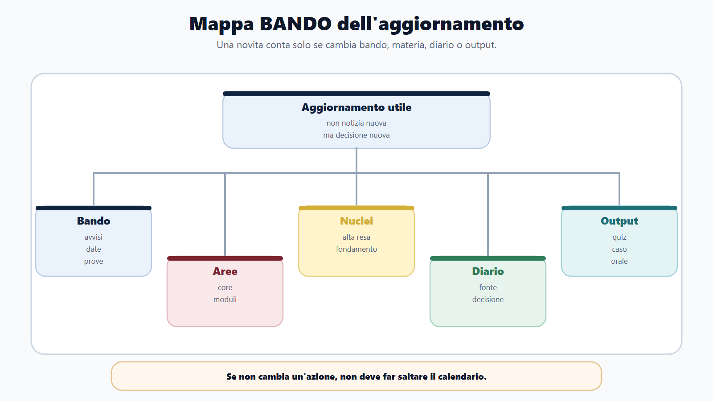
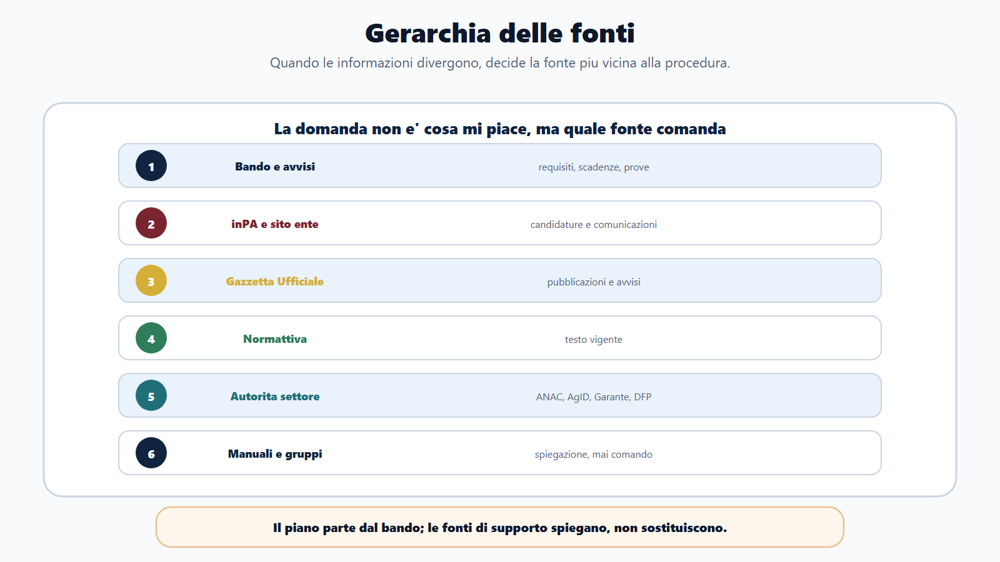
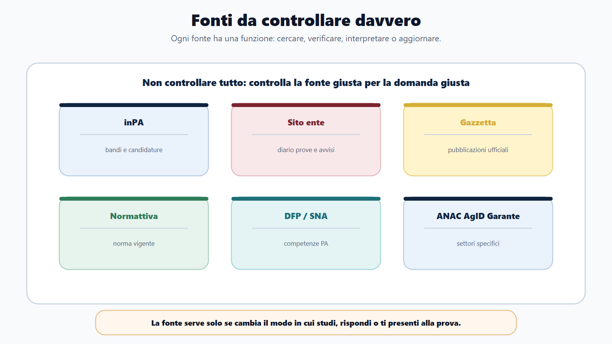
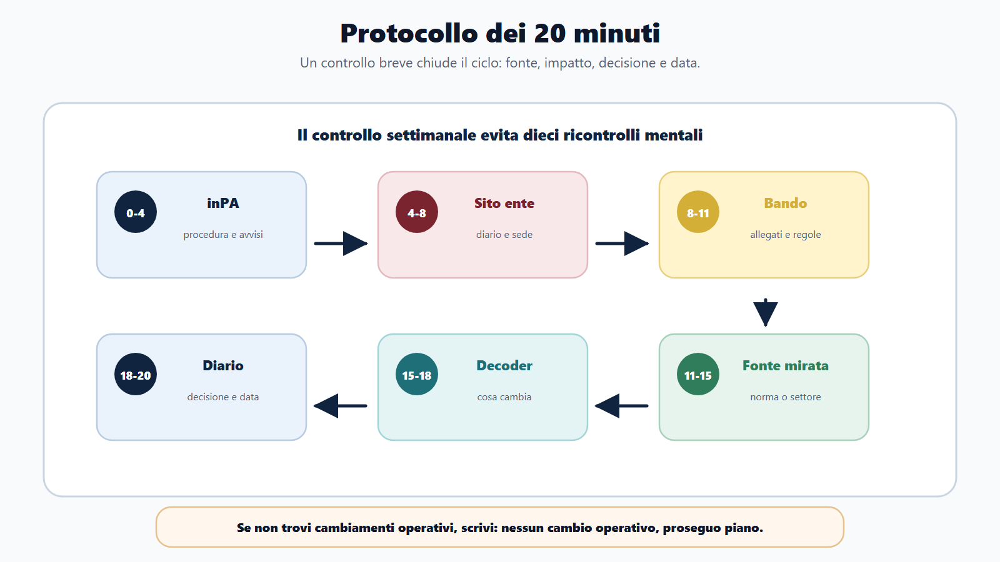
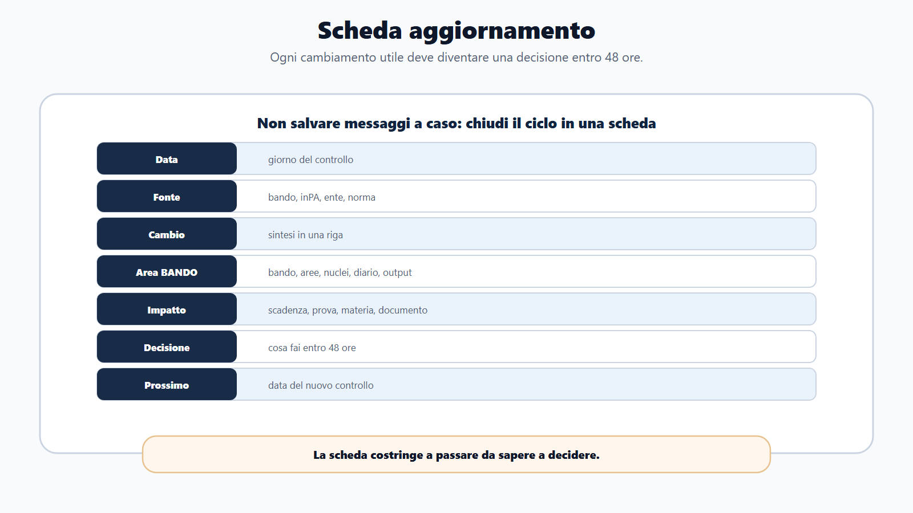
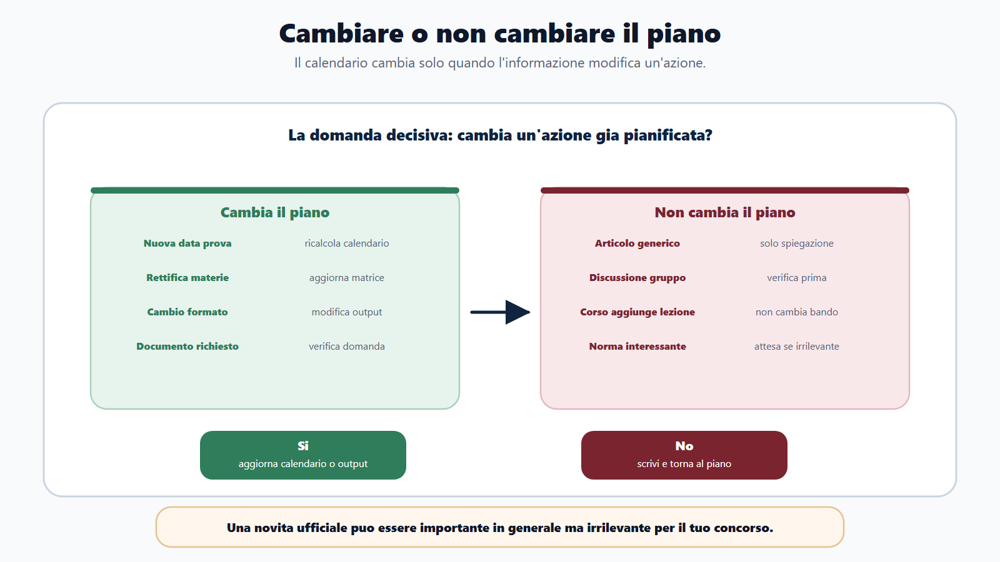
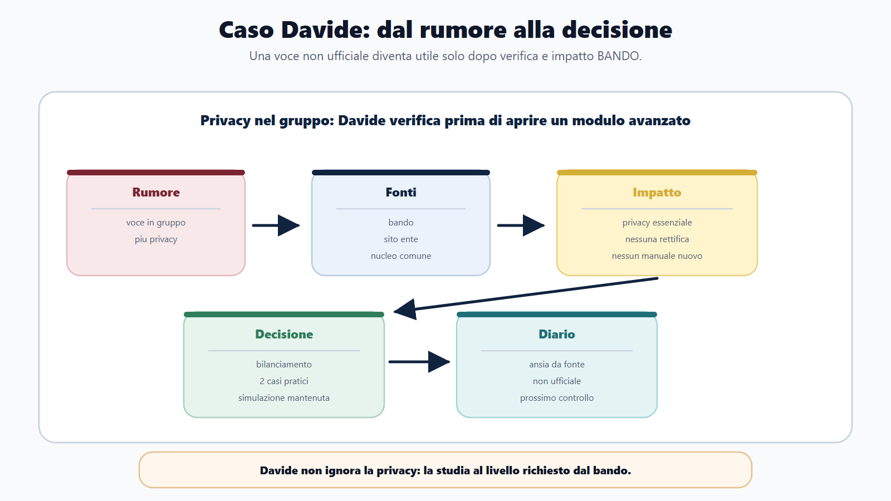

# Capitolo 25 - Aggiornare il metodo dopo il libro

> Modulo ricettario **R1** — Protocollo aggiornamenti e fonti ufficiali. Collega Introduzione, Cap. 2, Cap. 3 e [[books/il-metodo-bando/chapters/usare-il-digitale-senza-perdere-il-metodo|R4 Cap. 28]].

Questo libro non finisce quando arrivi all'ultima pagina.

Finisce la lettura, ma non finisce il metodo. I bandi cambiano, le amministrazioni pubblicano avvisi, le piattaforme aggiornano funzioni, le graduatorie seguono regole di pubblicazione, alcune materie entrano o escono dai programmi e certe parole diventano piu frequenti nelle prove.

Il rischio, pero, non e' solo restare indietro. Il rischio opposto e' inseguire ogni novita e perdere il piano.

Aggiornare il Metodo BANDO significa fare una cosa molto precisa: controllare le fonti ufficiali, capire se cambia qualcosa per il tuo concorso e trasformare quel cambiamento in una decisione di studio.

Non devi diventare un osservatorio normativo. Devi diventare un candidato che sa distinguere una notizia utile da un rumore.

## Obiettivo del capitolo

Alla fine del capitolo avrai un protocollo per:

- sapere quali fonti controllare;
- capire in che ordine valutarle;
- aggiornare Bando Decoder, piano e diario;
- non confondere notizia, norma, avviso e bando;
- decidere quando aprire un modulo integrativo;
- proteggere il calendario dall'ansia da aggiornamento;
- mantenere il metodo vivo anche per il concorso successivo.

Il principio e' semplice:

> un aggiornamento conta solo se cambia una decisione.

Se non cambia requisiti, scadenze, prove, materie, punteggi, soglie, documenti, calendario, modalita di comunicazione o output richiesto, non deve far saltare il piano.

## Mappa BANDO dell'aggiornamento

| Fase | Domanda di controllo | Azione |
|---|---|---|
| B - Bando | E' cambiato qualcosa nel bando, negli avvisi o nel portale? | Aggiorna requisiti, date, prove, documenti |
| A - Aree | L'aggiornamento tocca una materia o un modulo? | Riclassifica core, alta, modulo, verifica |
| N - Nuclei | Cambia cio che devo sapere davvero? | Isola i concetti ad alta resa |
| D - Diario | Dove registro dubbio, errore o cambio piano? | Scrivi fonte, decisione e data di controllo |
| O - Output | Cambia il tipo di prova o risposta da produrre? | Modifica quiz, caso, orale, simulazione |

La mappa evita due errori opposti: ignorare un avviso decisivo oppure trasformare una notizia generica in panico.

## La gerarchia delle fonti

Non tutte le fonti hanno lo stesso peso. Quando due informazioni sembrano diverse, non devi chiederti quale ti piace di piu. Devi chiederti quale fonte comanda.

| Livello | Fonte | Cosa controllare |
|---|---|---|
| 1 | Bando, avviso, allegati, sito dell'amministrazione | Requisiti, scadenze, prove, programma, documenti, convocazioni |
| 2 | inPA | Bandi, candidature, comunicazioni, profilo, stato procedura |
| 3 | Gazzetta Ufficiale | Pubblicazioni concorsuali e avvisi quando rilevanti |
| 4 | Normattiva | Testo vigente di atti normativi |
| 5 | Autorita e amministrazioni di settore | ANAC, AgID, Garante, DFP, SNA, ministeri competenti |
| 6 | Manuali, corsi, articoli, gruppi | Spiegazione e supporto, mai fonte decisiva |

La regola pratica:

> se il bando dice una cosa, il piano parte dal bando. Se una fonte esterna dice una cosa interessante ma il bando non la rende rilevante, la metti in attesa.

## Notizia, norma, avviso e bando: quattro livelli da non confondere

Il candidato confuso mescola quattro tipi di informazione diversi. Ognuno produce un'azione diversa.

| Tipo | Cosa e' | Esempio | Peso nel metodo | Errore tipico |
|---|---|---|---|---|
| Notizia | informazione generica su PA, concorsi o riforme | articolo su "nuove assunzioni" | Basso finche non tocca il tuo bando | aprire un modulo per un titolo di giornale |
| Norma | testo legislativo o regolamentare vigente | modifica al D.lgs. sui concorsi | Medio-alto se citata nel programma | studiare una versione non verificata |
| Avviso | comunicazione ufficiale della procedura | rettifica sede, diario prove, graduatoria | Alto se riguarda il concorso attivo | leggerlo tardi o non registrarlo |
| Bando | atto base della selezione con requisiti e prove | bando e allegati pubblicati | Massimo: comanda piano e output | leggerlo una sola volta all'inizio |

La domanda operativa e' sempre la stessa:

> questa informazione e' notizia, norma, avviso o bando — e quale decisione mi costringe?

Una notizia interessante non apre un modulo. Un avviso ufficiale si. Una norma conta se il programma la richiama o se cambia un nucleo che stai gia studiando. Il bando resta il filtro finale.

Regola pratica:

- **Notizia** → salva in "da verificare" solo se nomina il tuo ente, profilo o materia; altrimenti ignora.
- **Norma** → controlla su Normattiva; aggiorna nuclei solo se il bando o il programma la rendono rilevante.
- **Avviso** → compila subito la scheda aggiornamento e valuta impatto su calendario.
- **Bando** → rileggi requisiti, prove, punteggi, documenti; aggiorna Bando Decoder e matrice.

## Le fonti da controllare davvero

### 1. inPA

inPA e' la porta digitale del reclutamento pubblico. Serve per cercare bandi e avvisi, controllare procedure, leggere comunicazioni collegate e gestire candidature quando previsto.

Non usarlo come semplice motore di ricerca. Usalo con una domanda:

- e' uscito un avviso nuovo?
- e' cambiato lo stato della procedura?
- il bando rimanda a una pagina specifica?
- ci sono istruzioni su domanda, allegati, graduatorie o comunicazioni?

Ogni volta che trovi una novita, non copiarla soltanto. Scrivi che decisione produce.

### 2. Sito dell'amministrazione

Il sito dell'ente che bandisce resta essenziale. Spesso contiene avvisi, diario prove, convocazioni, comunicazioni operative, istruzioni logistiche, rettifiche e graduatorie.

Controllalo sempre quando:

- il bando lo indica come canale ufficiale;
- sei vicino a una prova;
- aspetti calendario, sede o istruzioni;
- hai dubbi su documenti o strumenti ammessi;
- ci sono rinvii ad allegati o comunicazioni successive.

Errore da evitare: leggere il bando una volta e poi non tornare piu sugli avvisi.

### 3. Gazzetta Ufficiale

La Gazzetta Ufficiale resta una fonte di pubblicazione e conoscenza ufficiale per atti e avvisi. Per i concorsi devi controllarla quando il bando, l'amministrazione o il percorso concreto la rendono rilevante.

Non devi leggerla ogni giorno senza scopo. Devi usarla per verificare:

- pubblicazioni concorsuali;
- avvisi collegati;
- atti ufficiali richiamati;
- eventuali differenze tra annuncio riassuntivo e pubblicazione.

### 4. Normattiva

Normattiva serve per controllare il testo vigente degli atti normativi nazionali. E' utile quando una materia cambia o quando devi verificare una norma citata nel programma.

Usala per domande mirate:

- qual e' il testo vigente del DPR sui concorsi?
- il decreto legislativo richiamato e' stato modificato?
- l'articolo che sto studiando e' ancora aggiornato?
- devo citare una norma in prova orale o scritta?

Non usare Normattiva per studiare tutto da zero. Usala per verificare il fondamento.

### 5. Dipartimento della Funzione Pubblica, Syllabus e SNA

Queste fonti aiutano a capire l'evoluzione delle competenze nella PA: formazione, soft skill, transizioni, valore pubblico, competenze digitali, competenze trasversali.

Nel Metodo BANDO servono soprattutto per:

- capire perche i bandi chiedono competenze oltre la memoria;
- leggere meglio quesiti situazionali e soft skill;
- collegare profilo, comportamenti e valore pubblico;
- costruire moduli di aggiornamento su competenze digitali, etica, trasparenza, sicurezza, inclusione.

Non trasformarle in un programma enciclopedico. Usale per capire la direzione della selezione pubblica.

### 6. ANAC, AgID e Garante Privacy

Alcune materie del nucleo comune cambiano per effetto di documenti, linee guida, FAQ o indicazioni istituzionali.

ANAC e' rilevante per anticorruzione, trasparenza, contratti pubblici e amministrazione trasparente.

AgID e' rilevante per PA digitale, documenti informatici, servizi digitali, accessibilita, interoperabilita e gestione documentale.

Il Garante Privacy e' rilevante per protezione dei dati, pubblicazione di graduatorie, trasparenza online, dati dei candidati e bilanciamento tra pubblicita e riservatezza.

La domanda giusta non e': "Devo leggere tutto?"

La domanda giusta e': "Questa fonte cambia il modo in cui rispondo a un quesito, risolvo un caso o leggo un avviso?"

## Il protocollo dei 20 minuti

Una volta a settimana, o piu spesso quando la prova e' vicina, usa questo controllo.

| Minuti | Controllo | Esito |
|---|---|---|
| 0-4 | inPA e pagina procedura | Nuovi avvisi, stato, comunicazioni |
| 4-8 | Sito dell'amministrazione | Diario prove, rettifiche, documenti, sede |
| 8-11 | Bando e allegati | Requisiti, materie, punteggi, soglie |
| 11-15 | Fonte normativa o settoriale se serve | Normattiva, ANAC, AgID, Garante, DFP, SNA |
| 15-18 | Bando Decoder | Cosa cambia nel quadro |
| 18-20 | Diario e piano | Decisione, data, prossima azione |

Se in 20 minuti non trovi cambiamenti operativi, scrivi:

| Data | Fonti controllate | Esito | Azione |
|---|---|---|---|
| | | Nessun cambio operativo | Proseguo piano |

Questo evita di ricontrollare mentalmente la stessa cosa dieci volte.

## La scheda aggiornamento

Ogni aggiornamento utile deve entrare in una scheda, non in un messaggio salvato a caso.

| Campo | Cosa scrivere |
|---|---|
| Data controllo | Giorno in cui hai verificato |
| Fonte | Bando, inPA, sito ente, Gazzetta, Normattiva, ANAC, AgID, Garante, DFP, SNA |
| Cosa e' cambiato | Sintesi in una riga |
| Area BANDO toccata | Bando, Aree, Nuclei, Diario, Output |
| Impatto | Scadenza, prova, materia, documento, modulo, ripasso |
| Decisione | Cosa fai entro 48 ore |
| Prossimo controllo | Data |

Esempio:

| Campo | Esempio compilato |
|---|---|
| Data controllo | 3 giugno |
| Fonte | Sito amministrazione |
| Cosa e' cambiato | Pubblicato diario prova scritta |
| Area BANDO | Output |
| Impatto | Serve simulazione con durata reale |
| Decisione | Sabato simulazione completa |
| Prossimo controllo | 10 giugno |

La scheda ti costringe a chiudere il ciclo. Non basta sapere. Devi decidere.

## Quando cambiare il piano

Non ogni aggiornamento cambia il piano. Usa questa griglia.

| Aggiornamento | Cambia il piano? | Cosa fare |
|---|---|---|
| Nuova data prova | Si | Ricalcola calendario e simulazioni |
| Rettifica materie | Si | Aggiorna matrice e moduli |
| Nuova sede | Non sempre | Aggiorna logistica e ultimi giorni |
| FAQ su modalita domanda | Si, se tocca requisiti/documenti | Verifica domanda e ricevute |
| Nuova linea guida settoriale | Solo se materia/prova la rende rilevante | Inserisci nucleo essenziale |
| Articolo di commento | No, se non rinvia a fonte ufficiale | Usa solo come spiegazione |
| Discussione in gruppo | No | Verifica su fonte ufficiale |

La domanda decisiva:

> questa informazione mi costringe a cambiare un'azione gia pianificata?

Se la risposta e' no, non toccare il calendario.

## Quando aprire un modulo integrativo

Un modulo integrativo non serve a "studiare di piu". Serve a colmare un vuoto verificato: materia nuova nel programma, profilo specialistico, prova diversa o nucleo settoriale reso obbligatorio da fonte ufficiale.

Apri o intensifica un modulo integrativo solo se almeno una condizione e' vera:

| Condizione | Segnale | Azione |
|---|---|---|
| Il bando aggiunge una materia non coperta dal nucleo comune | programma o allegato esplicito | inserisci modulo in matrice con priorita e output |
| La prova cambia formato | da quiz a scritto, da scritto a orale, caso pratico nuovo | attiva modulo di allenamento specifico |
| Una fonte ufficiale rende obbligatorio un nucleo settoriale | linea guida, FAQ istituzionale, rettifica | estrai nucleo essenziale, non enciclopedia |
| Il profilo richiede competenze non trasversali | modulo ministeriale, sanitario, tecnico, giuridico avanzato | collega al modulo profilo della famiglia concorsuale |
| Il diario segnala tre errori sulla stessa materia specialistica | errore ripetuto in simulazione | modulo mirato con casi e ripasso |

Non aprire un modulo integrativo quando:

- un articolo o un gruppo suggerisce "potrebbero chiedere";
- un corso aggiunge lezioni non previste dal bando;
- una norma e' interessante ma non citata nel programma;
- hai ansia da aggiornamento e cerchi sicurezza accumulando materiale.

In questi casi la decisione corretta e': verifica fonte, confronta con bando, registra "nessun cambio operativo" e torna al piano.

## Proteggere il calendario dall'ansia da aggiornamento

L'ansia da aggiornamento nasce quando ogni novita sembra urgente. Il metodo la riduce con tre regole.

**Regola 1 — Finestra fissa, non controllo continuo**

Controlla le fonti nel protocollo dei 20 minuti, non ogni volta che apri il telefono. Fuori dalla finestra, studia.

**Regola 2 — Decisione scritta o nessun cambio**

Se non compili la scheda aggiornamento, il piano non cambia. Un messaggio salvato, un link in chat o un PDF scaricato non sono decisioni.

**Regola 3 — Un aggiornamento, una modifica**

Non ricalcolare tutto il piano per un avviso logistico. Aggiorna solo lo strumento toccato: calendario, checklist, modulo, simulazione o diario.

| Segnale di ansia | Risposta metodo |
|---|---|
| "Devo controllare di nuovo" senza nuova fonte | scrivi ultimo controllo e prossima data |
| "Forse e' cambiato tutto" | rileggi solo bando e avvisi ufficiali |
| "Apro un manuale nuovo per sicurezza" | verifica se la materia e' nel programma |
| "Salto la simulazione per leggere novita" | simulazione prima, aggiornamento dopo |
| "Studio due ore di notizie generiche" | taglia a 20 minuti e torna all'output |

Il calendario e' il bene da proteggere. Le fonti servono a migliorarlo, non a sostituirlo ogni giorno.

## Aggiornare la matrice materie/profili

La matrice non e' una fotografia definitiva. E' uno strumento vivo.

Devi aggiornarla quando:

- il bando aggiunge o elimina una materia;
- una materia diventa oggetto di caso pratico;
- una prova passa da quiz a scritto o orale;
- il profilo rivela un modulo specialistico forte;
- un avviso chiarisce punteggi, soglie o durata;
- una fonte ufficiale modifica un nucleo veramente ricorrente.

Non devi aggiornarla quando:

- leggi un articolo generico;
- un altro candidato dice che "di solito chiedono";
- un corso aggiunge una lezione non prevista;
- trovi una norma interessante ma non collegata al tuo bando.

La matrice deve alleggerire le decisioni, non moltiplicarle.

## Aggiornare il diario degli errori

Il diario non serve solo per i quiz sbagliati. Serve anche per gli errori di aggiornamento.

Registra:

- fonte non controllata;
- avviso letto tardi;
- documento dimenticato;
- materia sottovalutata;
- cambio prova ignorato;
- tempo perso su novita irrilevante;
- norma studiata su versione non verificata;
- comunicazione salvata ma non trasformata in azione.

Formato:

| Errore | Fonte corretta | Causa | Azione |
|---|---|---|---|
| Ho studiato una materia non prevista | Bando e programma | Ansia da accumulo | Taglio modulo e recupero simulazione |
| Ho visto tardi l'avviso sulla sede | Sito amministrazione | Nessun controllo settimanale | Promemoria ogni venerdi |

Un candidato migliora quando non ripete lo stesso errore di aggiornamento nel concorso successivo.

## Da sapere in 5 righe

1. L'aggiornamento utile cambia una decisione: piano, materia, prova, documento o output.
2. Il bando e gli avvisi ufficiali vengono prima di manuali, corsi, gruppi e riassunti.
3. inPA, sito ente, Gazzetta Ufficiale e Normattiva hanno funzioni diverse: non usarli a caso.
4. Le fonti settoriali servono solo se toccano davvero il programma o la prova.
5. Ogni aggiornamento va registrato in Bando Decoder, matrice, diario o checklist.

## Caso guidato

Davide prepara un concorso amministrativo. Ha gia studiato procedimento, accesso, trasparenza, pubblico impiego e quiz.

Una settimana prima della prova legge in un gruppo che "potrebbero chiedere piu privacy". Si agita e apre un manuale specialistico da 500 pagine.

Con il protocollo BANDO fa invece tre controlli:

- rilegge il bando: privacy e' prevista come materia, ma in forma essenziale;
- controlla il sito dell'amministrazione: nessuna rettifica del programma;
- consulta le fonti consolidate del libro: trasparenza, accesso civico e protezione dati sono gia nel nucleo comune.

Decisione corretta:

- non apre un modulo avanzato;
- ripassa bilanciamento trasparenza/privacy;
- fa due casi pratici su accesso e dati personali;
- registra nel diario: "ansia da fonte non ufficiale";
- mantiene la simulazione prevista.

Davide non ignora la privacy. La studia al livello richiesto.

## Domanda da commissario

**Domanda:** Perche un candidato deve distinguere tra fonte ufficiale, manuale e commento?

**Risposta efficace:** perche la fonte ufficiale stabilisce il dato vincolante della procedura o della norma, mentre manuali e commenti servono a spiegare. Nel concorso il candidato deve partire da bando, avvisi, portali istituzionali e normativa vigente; poi puo usare strumenti didattici per comprendere e allenarsi. Se confonde questi livelli, rischia di studiare contenuti irrilevanti o di ignorare istruzioni decisive.

## Domanda-trappola

**Domanda:** Se una fonte ufficiale pubblica una novita, devo cambiare subito il piano?

No. Prima devi capire se la novita riguarda il tuo bando, la tua materia, la tua prova o il tuo output. Una novita ufficiale puo essere importante in generale ma irrilevante per il concorso che stai preparando.

## Digitale e fonti: collegamento con R4

Il controllo delle fonti puo fallire per due motivi opposti: non controlli abbastanza, oppure controlli in troppi posti senza metodo.

Nel modulo **R4** (Cap. 28) hai il protocollo per usare digitale, cartelle, promemoria e AI senza perdere il filo. Qui restano valide tre regole incrociate:

| Funzione digitale | Uso corretto per l'aggiornamento | Rischio |
|---|---|---|
| Catturare | salvare bando, avvisi, link ufficiali, ricevute | confondere riassunto e fonte |
| Decidere | aggiornare Bando Decoder dopo ogni avviso rilevante | compilare schede senza tagliare |
| Ricordare | promemoria settimanale "protocollo 20 minuti" | notifiche continue da gruppi e feed |

Non chiedere a un assistente AI se il bando e' cambiato: chiedigli di organizzare cio che hai gia verificato su inPA, sito ente o Normattiva. La verifica resta tua.

Se usi il ricettario digitale, tieni una cartella minima:

- `bando-e-allegati/` — versione e data ultimo download;
- `avvisi-ufficiali/` — PDF o screenshot con data;
- `schede-aggiornamento/` — una scheda per ogni decisione;
- `fonti-settoriali/` — solo documenti collegati al programma.

Ogni file deve avere data e fonte nell'intestazione. Senza data, non e' aggiornamento: e' rumore archiviato.

## Scheda workbook: Registro fonti settimanale

Compila questa scheda ogni settimana dopo il protocollo dei 20 minuti. Se non trovi cambiamenti, scrivi comunque "nessun cambio operativo": chiude il ciclo e libera la testa.

| Campo | Compilazione |
|---|---|
| Settimana / concorso | |
| Data controllo | |
| Fonti controllate (spunta) | inPA / sito ente / bando / Gazzetta / Normattiva / settoriale |
| Novita rilevata | Si / No |
| Tipo informazione | notizia / norma / avviso / bando |
| Impatto su piano | nessuno / logistico / materia / prova / documento |
| Strumento aggiornato | Bando Decoder / matrice / diario / checklist / modulo |
| Decisione entro 48 ore | |
| Prossimo controllo | |

Checklist rapida post-controllo:

| Voce | Fatto |
|---|---|
| Ho confrontato la novita con il bando | |
| Ho scritto la decisione, non solo la novita | |
| Ho evitato di aprire moduli non richiesti | |
| Ho protetto almeno un blocco di studio o output | |
| Ho registrato "nessun cambio" se non serve agire | |

## Mini-esercizio

Prendi il concorso che stai preparando e compila la tabella.

| Fonte da controllare | Link o posizione | Frequenza | Ultimo controllo | Azione se cambia |
|---|---|---|---|---|
| Bando/allegati | | | | |
| inPA | | | | |
| Sito amministrazione | | | | |
| Gazzetta Ufficiale | | | | |
| Normattiva | | | | |
| Autorita settoriale | | | | |
| Diario errori | | | | |

Poi scegli una sola azione:

| Cosa aggiorno oggi? | Bando Decoder / piano / matrice / diario / checklist |
|---|---|
| | |

Se non devi aggiornare nulla, scrivi "nessun cambio operativo" e torna a studiare.

## Errore tipico

L'errore tipico e' chiamare "aggiornamento" qualsiasi informazione nuova.

Una notizia nuova non e' sempre una decisione nuova. Un PDF nuovo non e' sempre una materia nuova. Una discussione in gruppo non e' una fonte. Un corso che aggiunge lezioni non modifica il bando.

Correzione:

- verifica la fonte;
- confronta con il bando;
- valuta l'impatto;
- scrivi la decisione;
- aggiorna solo lo strumento interessato.

## Chiusura operativa

Il Metodo BANDO serve a preparare piu concorsi senza ricominciare da zero.

Questo e' possibile solo se il tuo sistema resta aggiornato senza diventare instabile. Dopo ogni concorso, conserva:

- Bando Decoder compilato;
- matrice materie/profili;
- piano usato;
- diario errori;
- checklist finale;
- fonti controllate;
- decisioni che hanno funzionato;
- decisioni da correggere.

Prima del concorso successivo, verifica che il sistema di aggiornamento sia ancora vivo:

| Azione | Fatto |
|---|---|
| Ho definito frequenza del protocollo 20 minuti | |
| Ho indicato link o posizione di ogni fonte ufficiale | |
| So distinguere notizia, norma, avviso e bando | |
| Ho almeno una scheda aggiornamento compilata di prova | |
| Il digitale (R4) non sostituisce la verifica sulle fonti | |
| Il calendario e' protetto da controlli fuori finestra | |

Il prossimo concorso non parte da una pagina bianca. Parte da un sistema gia allenato che sa quando cambiare e quando continuare.

## Riferimenti consolidati

- [[sources/fonti-ufficiali-aggiornamento-metodo-bando-2026-06-03]]
- [[sources/metodo-bando-progetto-editoriale]]
- [[sources/struttura-madre-il-metodo-bando]]
- [[sources/checklist-operative-concorsi-metodo-bando]]
- [[sources/matrice-materie-profili-metodo-bando]]
- [[sources/formazione-competenze-pa-syllabus-direttiva-2025]]
- [[sources/framework-competenze-trasversali-pa-dm-28-giugno-2023]]
- [[sources/anac-piano-nazionale-anticorruzione-2025-delibera-n-19-del-28-gennaio-2026]]
- [[sources/agid-linee-guida-sulla-formazione-gestione-e-conservazione-dei-documenti-informatici]]
- [[sources/garante-privacy-trasparenza-pa-accesso-civico-e-dati-personali]]
- [[topics/aggiornamento-fonti-concorsi]]
- [[topics/checklist-concorsi]]
- [[topics/diario-errori]]
- [[topics/moduli-integrativi]]
- [[topics/matrice-materie-profili]]

## Note di review

- La struttura madre originaria arriva al Capitolo 24 e alle Appendici A-F. Questo capitolo e' un'estensione editoriale finale: in impaginazione decidere se mantenerlo come Capitolo 25 o trasformarlo in "Conclusione operativa".
- Prima della pubblicazione finale verificare di nuovo le pagine ufficiali citate, in particolare inPA, Gazzetta Ufficiale, Normattiva, DFP/Syllabus, ANAC, AgID e Garante Privacy.
- Evitare formule che promettono aggiornamento normativo completo: il capitolo insegna il metodo di verifica, non sostituisce le fonti ufficiali.
- Scheda workbook "Registro fonti settimanale" inserita nel capitolo; in impaginazione valutare estrazione come PDF compilabile autonomo.
- Coordinare rimandi con R4 (digitale), R2 (capitale di studio) e checklist operative del volume principale.
