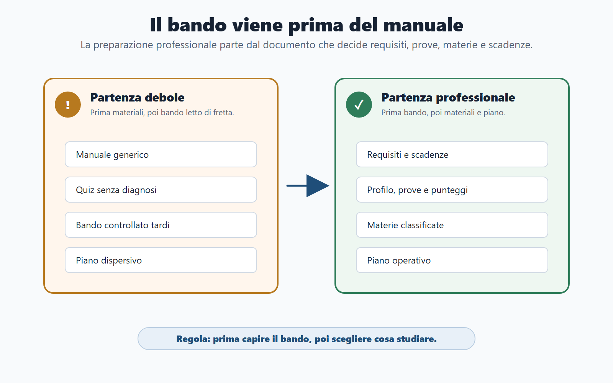
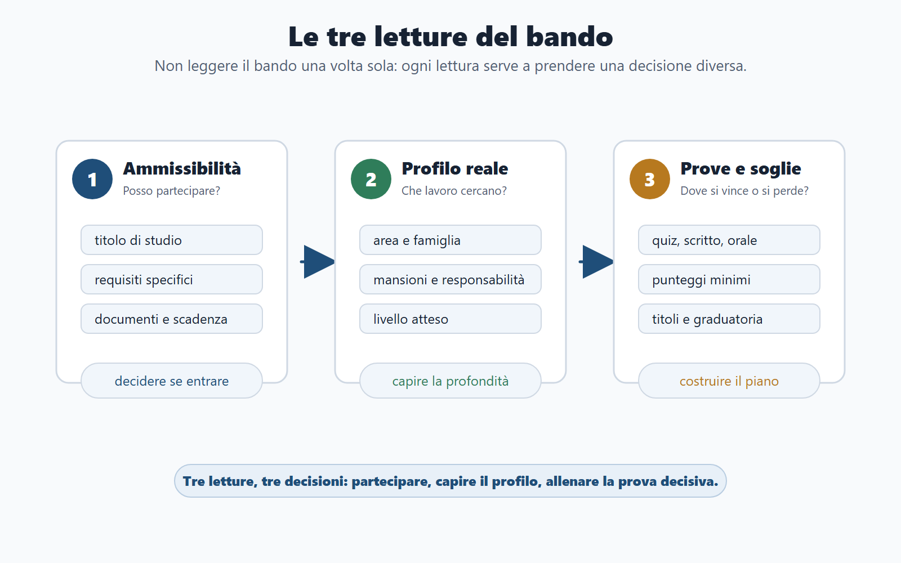
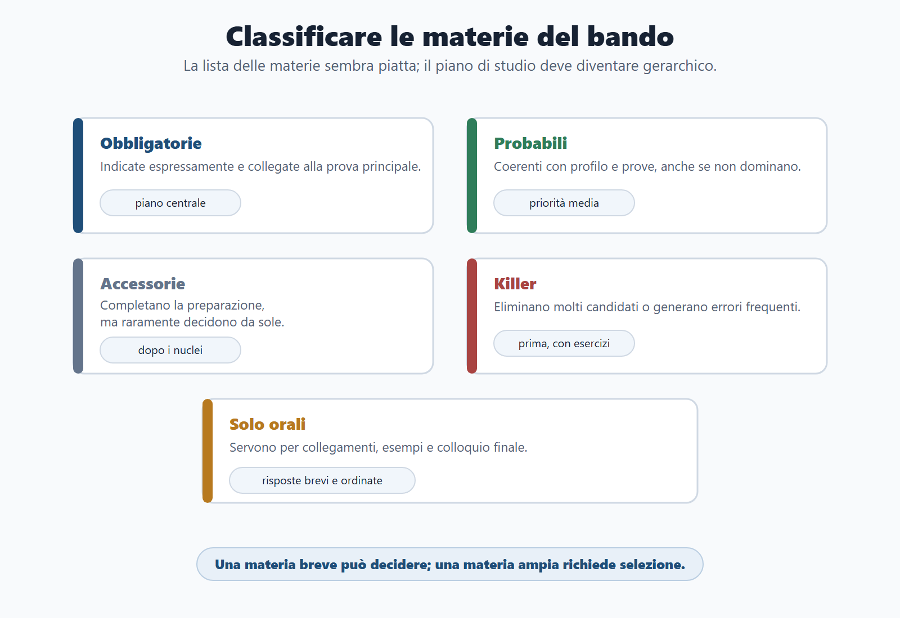
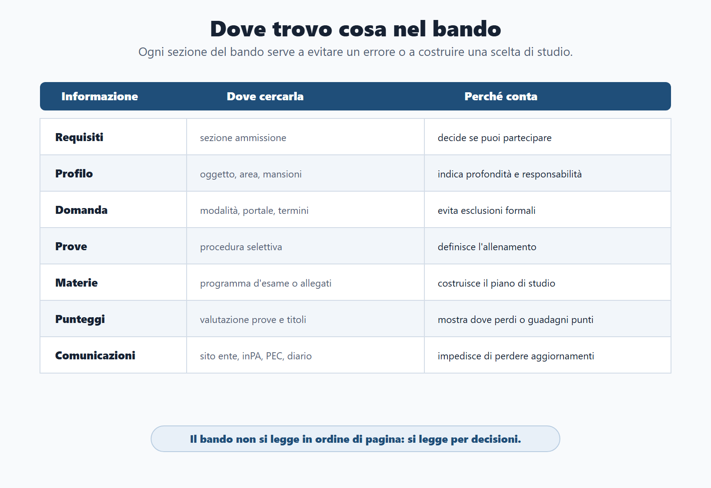
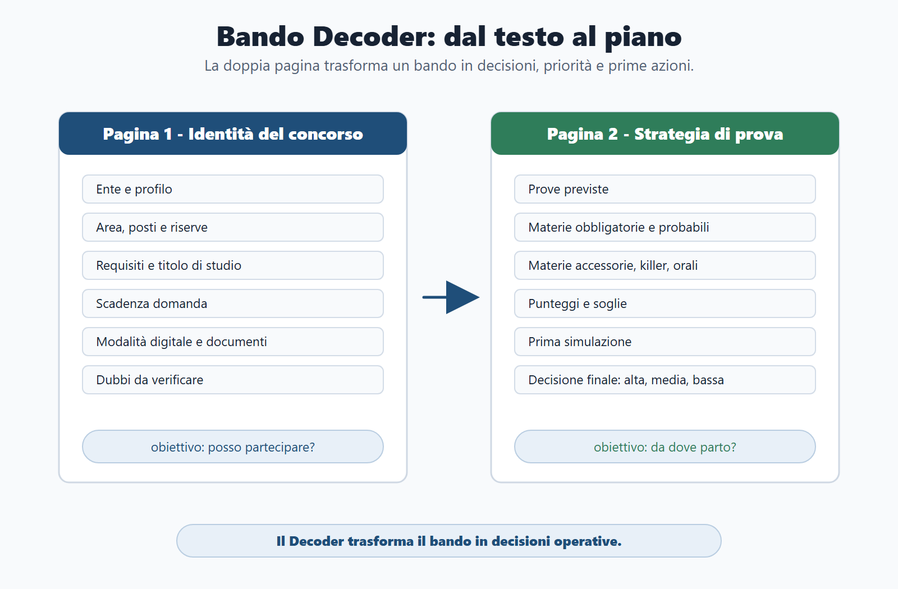

# Capitolo 2 - Anatomia del bando

## Perché il bando viene prima del manuale

Il bando è il documento più importante del concorso. Non perché sia il più semplice da leggere, ma perché decide ciò che viene dopo: se puoi partecipare, quanto tempo hai, quali prove affronterai, quali materie pesano, quali documenti devi preparare e quale strategia di studio ha senso.

Il candidato medio scarica il bando, lo scorre in fretta e cerca subito un manuale o una banca dati. Il candidato preparato fa il contrario: prima smonta il bando, poi decide come studiare. Qui si vede subito la differenza tra una preparazione generica e una preparazione professionale.

Il bando non è un testo da "capire più o meno". È una mappa di lavoro. Se lo leggi male, puoi studiare materie sbagliate, ignorare una soglia, sottovalutare l’orale, perdere una scadenza o candidarti a un profilo che non è coerente con il tuo tempo e con le tue competenze.

> *Figura 2.1 - Il bando viene prima del manuale perché decide requisiti, prove, materie e piano.*

## La domanda giusta non è "che cosa devo studiare?"

La prima domanda non è "quale manuale compro?". La prima domanda è: "che cosa mi chiede questo bando e quale decisione devo prendere?".

Un bando serve a rispondere a quattro domande operative:

1. **Posso partecipare?** Requisiti, titolo di studio, eventuali requisiti specifici, cittadinanza, idoneità, documenti e condizioni di accesso.
2. **Mi conviene partecipare?** Posti, riserve, profilo, livello, sedi, prove, tempi e rapporto con altri concorsi aperti.
3. **Che cosa devo studiare prima?** Materie, punteggi, soglie, prove selettive, argomenti killer e materie solo orali.
4. **Che cosa devo produrre?** Quiz, risposta sintetica, caso pratico, orale, prova digitale, documenti o titoli.

Solo dopo queste quattro risposte ha senso costruire il piano.

## Come usare il Metodo BANDO

| Fase | Che cosa cerchi nel bando | Decisione pratica |
|---|---|---|
| **Bando** | Requisiti, profilo, prove, scadenze, punteggi. | Capire se partecipare e che cosa conta. |
| **Aree** | Materie comuni, materie specifiche, materie accessorie. | Separare nucleo base e modulo del profilo. |
| **Nuclei** | Argomenti ad alta probabilità o alto rischio. | Decidere cosa studiare prima. |
| **Diario** | Scadenze, dubbi, documenti, errori, punti deboli. | Evitare dimenticanze e ripetere con criterio. |
| **Output** | Tipo di prova e prodotto richiesto. | Allenare quiz, scritto, caso, orale o documenti. |

> *Figura 2.2 - Ogni lettura del bando deve produrre una decisione operativa diversa.*

## Prima lettura: controllo di ammissibilità

La prima lettura del bando serve a non perdere tempo. Devi verificare subito se possiedi i requisiti. Il titolo di studio richiesto, gli eventuali requisiti professionali, l’esperienza, le abilitazioni, le condizioni soggettive e i termini di presentazione della domanda vengono prima di ogni scelta di studio.

Questo controllo deve essere freddo. Non devi innamorarti del concorso prima di sapere se puoi partecipare. Se un requisito è dubbio, lo segni come punto da verificare. Se la scadenza è troppo vicina, devi decidere se ha senso investire tempo oppure se il bando va archiviato.

**Checklist di ammissibilità**

| Controllo | Sì/No | Nota |
|---|---:|---|
| Possiedo il titolo di studio richiesto? |  |  |
| Ci sono requisiti specifici ulteriori? |  |  |
| Sono richiesti documenti, certificazioni o dichiarazioni particolari? |  |  |
| La domanda deve essere inviata tramite portale o procedura digitale? |  |  |
| La scadenza è compatibile con il tempo necessario per preparare domanda e studio? |  |  |
| Ci sono dubbi da verificare su fonte ufficiale o FAQ dell’ente? |  |  |

## Seconda lettura: profilo, lavoro reale e livello atteso

Il nome del concorso non basta. Devi capire quale figura l’amministrazione sta cercando. Un "istruttore amministrativo", un "funzionario amministrativo-contabile", un "assistente tecnico", un profilo digitale o una posizione dirigenziale non richiedono la stessa preparazione.

Il profilo ti dice come verranno usate le materie. Il diritto amministrativo può essere richiesto come base nozionistica, come capacità di gestire un procedimento o come capacità di risolvere un caso. Il pubblico impiego può comparire in un quiz, ma può anche diventare un problema situazionale su doveri, conflitto di interessi o responsabilità.

Per questo motivo, nella lettura del bando devi sempre collegare tre elementi:

- **profilo**: quale lavoro si svolgerà;
- **prove**: come verrà selezionato il candidato;
- **materie**: quali contenuti servono davvero per quella prova.

## Terza lettura: prove, punteggi e soglie

La sezione sulle prove è il cuore del bando. Qui capisci se devi preparare una preselettiva, uno scritto, una prova teorico-pratica, un orale, una valutazione dei titoli o una combinazione di passaggi.

Non basta sapere che ci sarà una prova. Devi leggere punteggi e soglie. Una materia può diventare decisiva non perché occupa molte pagine nel manuale, ma perché compare nella prova che elimina più candidati, oppure perché viene richiesta con precisione tecnica.

| Elemento | Domanda da farti | Conseguenza sul piano |
|---|---|---|
| Preselettiva | È prevista? È a quiz? Su quali materie? | Servono simulazioni a tempo e diario errori. |
| Scritto | È teorico, sintetico o pratico? | Servono schemi di risposta, non solo lettura. |
| Teorico-pratica | Ci sono casi, atti, problemi o scenari? | Servono esempi e griglie di soluzione. |
| Orale | Quali materie restano per il colloquio? | Servono esposizione, collegamenti e domande-trappola. |
| Punteggi | Qual è il minimo per superare? | Devi capire dove puoi guadagnare o perdere punti. |
| Titoli | Quanto pesano? Sono già documentabili? | Devi stimare il vantaggio o lo svantaggio iniziale. |

## Classificare le materie: obbligatorie, probabili, accessorie, killer, solo orali

Il Bando Decoder serve a trasformare la lista delle materie in una gerarchia. La lista del bando spesso sembra piatta: diritto amministrativo, Costituzione, enti locali, pubblico impiego, trasparenza, informatica, inglese. Nel piano di studio, però, queste materie non hanno tutte lo stesso peso.

| Tipo di materia | Come la riconosci | Come la studi |
|---|---|---|
| **Obbligatoria** | È espressamente indicata e collegata alla prova principale. | Entra nel piano centrale. |
| **Probabile** | È coerente con profilo e prove, anche se non domina il bando. | Va studiata con priorità media. |
| **Accessoria** | Completa la preparazione, ma raramente decide da sola. | Va programmata dopo i nuclei centrali. |
| **Killer** | Può eliminare molti candidati o generare errori frequenti. | Va affrontata presto, con esercizi e ripassi. |
| **Solo orale** | È più utile per collegamenti e colloquio finale. | Va preparata con risposte brevi e ordinate. |

Questa classificazione conta più della quantità di pagine. Una materia breve può essere killer. Una materia molto ampia può richiedere selezione, non studio enciclopedico.

> *Figura 2.3 - La lista delle materie diventa utile solo quando viene trasformata in gerarchia di studio.*

## Dove trovo cosa nel bando

| Informazione | Dove cercarla | Perché conta |
|---|---|---|
| Requisiti | Articoli iniziali o sezione requisiti di ammissione. | Decide se puoi partecipare. |
| Profilo | Oggetto del concorso, area, famiglia professionale, mansioni. | Indica la profondità richiesta. |
| Posti e riserve | Sezione posti, riserve, preferenze. | Incide sulla competizione effettiva. |
| Domanda | Modalità e termini di presentazione. | Evita esclusioni per errore formale. |
| Prove | Sezione procedura selettiva. | Definisce l’allenamento. |
| Materie | Programma d’esame o allegati. | Costruisce il piano di studio. |
| Punteggi e soglie | Valutazione prove e titoli. | Mostra dove si vince o si perde. |
| Graduatoria | Formazione, validità, scorrimento. | Aiuta a leggere l’esito e il rischio. |
| Comunicazioni | Portale, sito ente, inPA, PEC, diario prove. | Evita di perdere aggiornamenti ufficiali. |

> *Figura 2.4 - Il bando non si legge in ordine di pagina: si legge per decisioni da prendere.*

## Il Bando Decoder

Il Bando Decoder è la doppia pagina che trasforma il bando in piano. Non è una scheda decorativa. È il punto in cui decidi come userai il tempo.

**Bando Decoder - pagina 1**

| Campo | Da compilare |
|---|---|
| Ente |  |
| Profilo |  |
| Area/categoria |  |
| Posti disponibili |  |
| Riserve o preferenze |  |
| Requisiti |  |
| Scadenza domanda |  |
| Modalità domanda |  |
| Documenti o dichiarazioni |  |
| Dubbi da verificare |  |

**Bando Decoder - pagina 2**

| Campo | Da compilare |
|---|---|
| Prove previste |  |
| Materie obbligatorie |  |
| Materie probabili |  |
| Materie accessorie |  |
| Materie killer |  |
| Materie solo orali |  |
| Punteggi e soglie |  |
| Primo blocco di studio |  |
| Prima simulazione |  |
| Decisione finale: priorità alta/media/bassa |  |

> *Figura 2.5 - Il Bando Decoder trasforma il testo ufficiale in priorità, rischi e prime azioni.*

## Caso guidato: bando fittizio analizzato

Immagina un bando per istruttore amministrativo presso un Comune. Il bando prevede una prova scritta a quiz e una prova orale. Le materie indicate sono: diritto amministrativo, ordinamento degli enti locali, pubblico impiego, trasparenza e anticorruzione, informatica e inglese.

Il candidato debole parte da un manuale generale. Il candidato strategico compila il Bando Decoder.

Prima verifica il titolo di studio e la scadenza. Poi legge le prove: se lo scritto è a quiz, deve allenare rapidità, memoria e riconoscimento delle alternative sbagliate. Se è previsto l’orale, deve preparare anche risposte brevi e collegamenti. A questo punto classifica le materie: diritto amministrativo ed enti locali sono obbligatorie; trasparenza e anticorruzione possono diventare killer; informatica e inglese richiedono blocchi brevi ma costanti.

La decisione non è "studiare tutto". La decisione è partire dalle materie che decidono lo scritto, costruire un diario errori, preparare l’orale fin dall’inizio con risposte sintetiche e controllare ogni comunicazione ufficiale dell’ente.

## Checklist prima della domanda

Prima di inviare la domanda, controlla:

- requisiti e titolo di studio;
- scadenza esatta, compresa l’ora;
- modalità di accesso al portale o alla procedura digitale;
- eventuali documenti, dichiarazioni, ricevute o allegati;
- pagamento di eventuali contributi;
- recapiti e comunicazioni ufficiali;
- calendario delle prove o modalità con cui sarà pubblicato;
- ricevuta finale di invio.

Se un punto non è chiaro, non improvvisare. Segnalo nel diario e verifica su fonte ufficiale dell’ente o sulle istruzioni richiamate dal bando.

## Domanda da commissario

**Domanda:** Perché il bando deve essere letto prima del manuale?

**Risposta efficace:** perché il bando definisce il perimetro reale del concorso. Indica chi può partecipare, quali prove sono previste, quali materie contano, quali punteggi e soglie si applicano, quali scadenze vanno rispettate e quali documenti sono necessari. Senza questa lettura, il candidato rischia di studiare molto ma male.

## Domanda-trappola

**Domanda:** Se una materia occupa molte pagine nel manuale, significa che sarà la materia più importante del concorso?

**Risposta:** no. Il peso della materia dipende dal bando: prova in cui compare, punteggio, soglia, profilo e modalità di valutazione. Una materia breve può essere decisiva se genera molti errori o se compare in una prova selettiva.

## Mini-esercizio

Prendi un bando reale o fittizio e compila questa scheda in dieci minuti.

| Domanda | Risposta |
|---|---|
| Posso partecipare? Perché? |  |
| Qual è il profilo reale? |  |
| Qual è la prova che elimina più candidati? |  |
| Quali sono le tre materie obbligatorie? |  |
| Qual è la materia killer? |  |
| Quale documento potrei dimenticare? |  |
| Qual è il primo blocco di studio da fare? |  |
| Questo concorso ha priorità alta, media o bassa? |  |

## Errore tipico

L’errore tipico è leggere il bando come un ostacolo burocratico. In realtà il bando è già il primo strumento di selezione per il candidato: ti dice se vale la pena partecipare, come organizzare il tempo e dove rischi di sbagliare.

## Da sapere in 5 righe

1. Il bando viene prima del manuale.
2. Requisiti, scadenze e documenti evitano esclusioni inutili.
3. Prove, punteggi e soglie decidono la strategia.
4. Le materie vanno classificate, non solo elencate.
5. Il Bando Decoder trasforma un testo ufficiale in un piano di azione.
