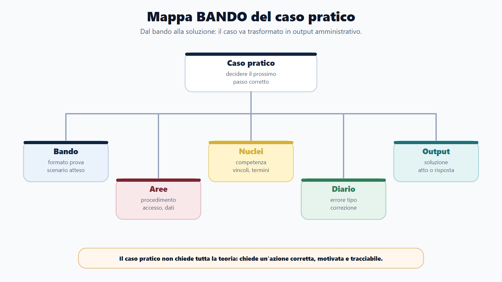
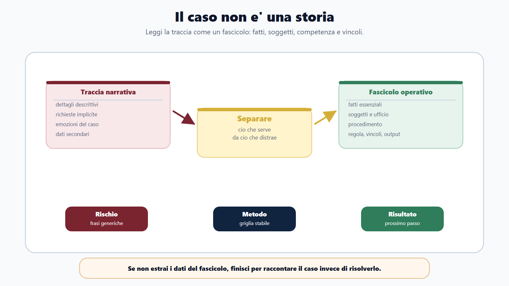
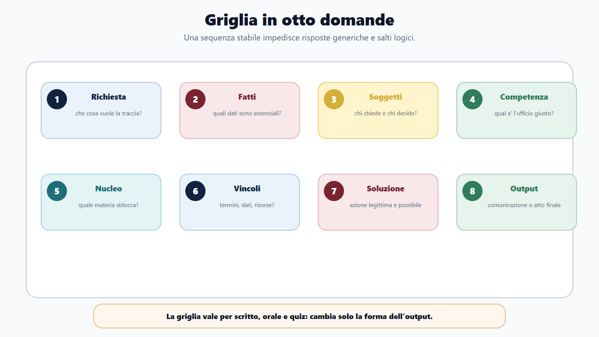
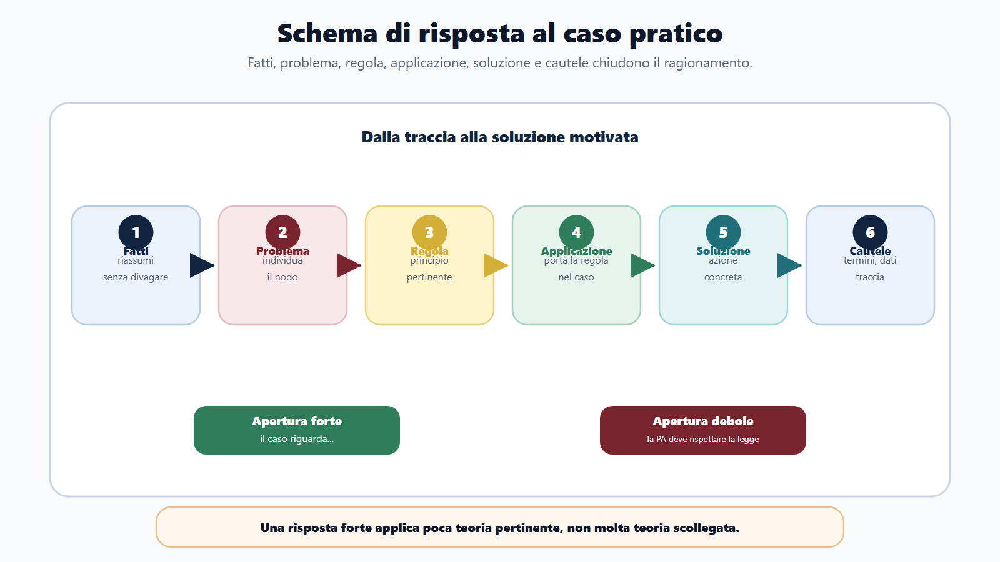
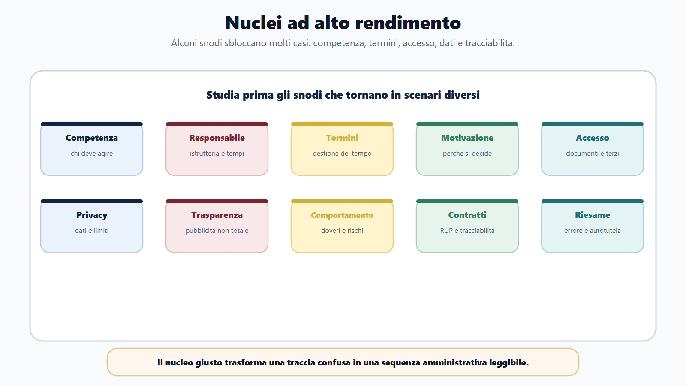
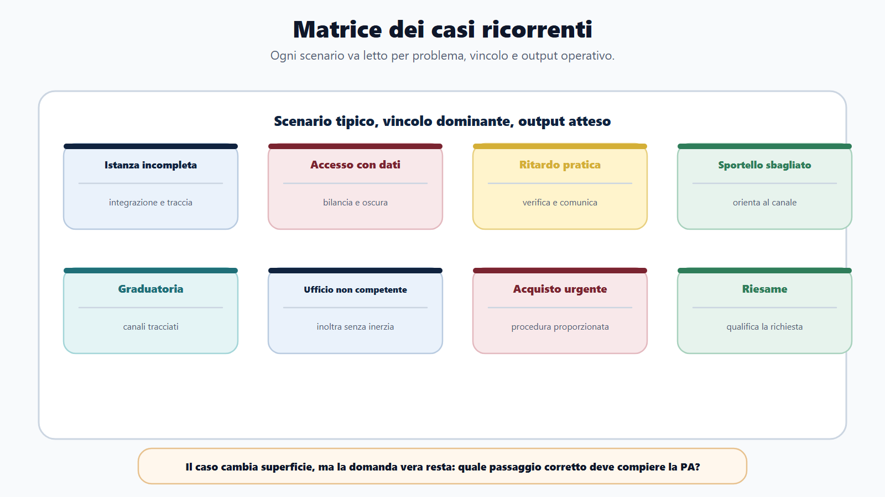
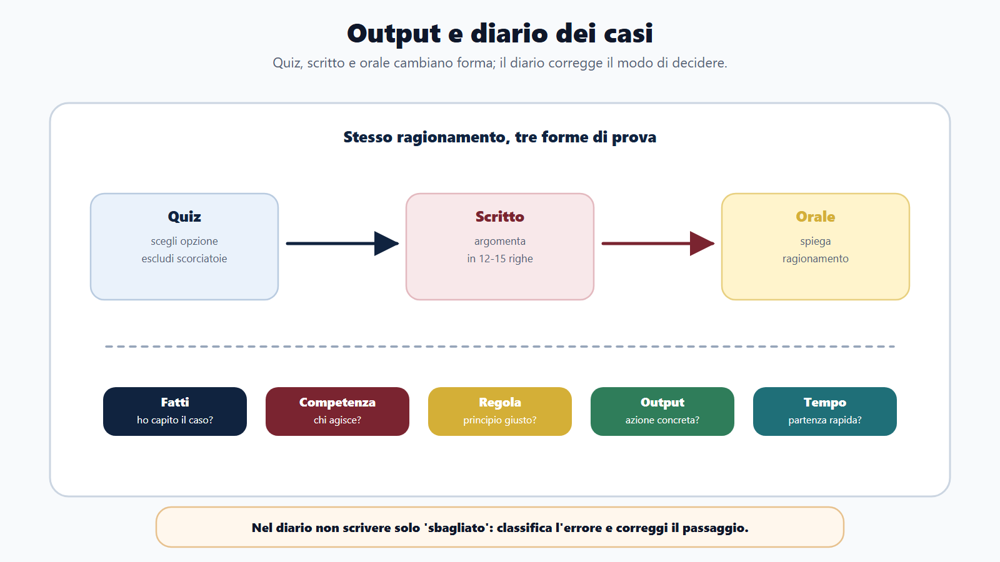

# Capitolo 17 - Casi pratici e problem solving amministrativo

## Perche il caso pratico seleziona davvero

Il caso pratico e' il momento in cui il concorso smette di chiedere solo "che cosa sai" e inizia a chiedere "che cosa faresti". Non basta ricordare una definizione. Devi leggere una situazione, capire chi e' competente, individuare il problema, rispettare termini e vincoli, scegliere una soluzione e motivarla in modo ordinato.

Questo tipo di prova mette in difficolta molti candidati per un motivo preciso: lo studio tradizionale prepara a ripetere argomenti, non a usarli. Un candidato puo conoscere il procedimento amministrativo, l'accesso agli atti, la privacy o il codice dei contratti, ma bloccarsi davanti a una traccia concreta: un cittadino presenta una domanda incompleta, un ufficio riceve una richiesta che non gli compete, un soggetto chiede documenti che contengono dati di terzi, una pratica e' in ritardo, un operatore economico sollecita una risposta.

In questi casi non vince chi scrive piu teoria. Vince chi ragiona come un funzionario pubblico.

Ragionare come un funzionario significa tenere insieme cinque dimensioni:

- la regola, perche la pubblica amministrazione non agisce a intuito;
- il procedimento, perche ogni decisione nasce da passaggi ordinati;
- la competenza, perche non tutti possono fare tutto;
- l'interesse pubblico, perche la risposta non e' un favore personale;
- l'utente, perche l'amministrazione deve comunicare in modo chiaro e responsabile.

Il caso pratico, quindi, non e' una domanda teorica mascherata. E' una prova di metodo.

## Obiettivo del capitolo

Questo capitolo ti insegna a scomporre e risolvere un caso pratico amministrativo. Alla fine dovrai saper:

- leggere la traccia senza farti distrarre dai dettagli inutili;
- individuare soggetti, ufficio competente e procedimento;
- distinguere fatti, regole, interessi e vincoli;
- costruire una risposta scritta o orale ordinata;
- proporre una soluzione realistica, motivata e proporzionata;
- correggere gli errori tipici nei casi pratici.

La regola di base e' questa:

> Nel caso pratico non devi dimostrare che hai studiato tutto. Devi dimostrare che sai decidere il prossimo passo corretto.

## Mappa BANDO del caso pratico

| Fase | Domanda guida | Prodotto concreto |
|---|---|---|
| **B - Bando** | Che tipo di caso puo uscire? Scritto, orale, quiz, risposta sintetica, atto, scenario? | Scheda formato caso. |
| **A - Aree** | Quali materie possono convergere nel caso? Procedimento, accesso, privacy, pubblico impiego, contratti? | Mappa aree coinvolte. |
| **N - Nuclei** | Quali nuclei sbloccano piu casi? Competenza, termini, motivazione, accesso, dati, responsabilita? | Lista nuclei ad alto rendimento. |
| **D - Diario** | Che errori ripeto nei casi? Fatti, regola, competenza, ordine, privacy, tempo? | Registro casi ed errori. |
| **O - Output** | So scrivere una soluzione? So spiegarla a voce? So scegliere l'opzione corretta? | Risposte, mini-casi, simulazioni. |

## Il caso non e' una storia

La traccia puo sembrare una piccola storia. Ma tu non devi leggerla come un racconto. Devi leggerla come un fascicolo amministrativo ridotto.

Ogni caso contiene elementi utili e elementi secondari. Il primo lavoro e' separare cio che serve da cio che distrae.

| Elemento | Domanda da farti |
|---|---|
| Fatti | Che cosa e' accaduto davvero? |
| Soggetti | Chi chiede, chi decide, chi e' coinvolto? |
| Ufficio | Quale ufficio o responsabile e' competente? |
| Procedimento | Esiste una domanda, una fase istruttoria, una decisione, un termine? |
| Regola | Quale principio o disciplina orienta la soluzione? |
| Interessi | Quali interessi pubblici e privati sono in gioco? |
| Vincoli | Ci sono privacy, trasparenza, imparzialita, risorse, urgenza, conflitto? |
| Output | Che cosa deve produrre l'amministrazione? |

Se non compili mentalmente questa tabella, rischi di rispondere con frasi generiche: "l'amministrazione deve provvedere", "bisogna rispettare la legge", "occorre tutelare il cittadino". Sono formule vere, ma non risolvono il caso.

## La griglia in otto domande

Usa questa griglia ogni volta che affronti un caso pratico.

1. **Che cosa chiede la traccia?** Una soluzione, una valutazione, una risposta al cittadino, una sequenza di atti?
2. **Quali sono i fatti essenziali?** Elimina dettagli emotivi o narrativi.
3. **Chi sono i soggetti?** Cittadino, ufficio, responsabile, dirigente, controinteressato, operatore economico.
4. **Chi e' competente?** L'ufficio che riceve non e' sempre quello che decide.
5. **Quale procedimento o nucleo e' coinvolto?** Accesso, istanza, silenzio, graduatoria, acquisto, dati, riesame.
6. **Quali vincoli limitano la soluzione?** Termini, motivazione, privacy, trasparenza, anticorruzione, risorse.
7. **Qual e' la soluzione corretta?** Deve essere possibile, legittima e proporzionata.
8. **Quale output finale serve?** Comunicazione, richiesta di integrazione, provvedimento, inoltro, segnalazione, istruttoria.

Questa griglia vale per scritto, orale e quiz. Cambia solo la forma dell'output.

## Lo schema di risposta

Per scrivere un caso pratico usa una struttura stabile:

1. **Fatti rilevanti**: riassumi il caso in due o tre righe.
2. **Problema**: indica la questione amministrativa.
3. **Regola o principio**: richiama il quadro essenziale senza divagare.
4. **Applicazione**: spiega come la regola opera nel caso.
5. **Soluzione**: indica il comportamento dell'amministrazione.
6. **Motivazione e cautele**: segnala termini, dati, tracciabilita, competenza.

Esempio di apertura efficace:

> Il caso riguarda una istanza incompleta presentata a un ufficio comunale. Il problema non e' respingere automaticamente la domanda, ma verificare se l'incompletezza impedisce l'istruttoria e quali integrazioni siano necessarie.

Esempio di apertura debole:

> Il procedimento amministrativo e' molto importante e la pubblica amministrazione deve sempre rispettare la legge.

La seconda frase non e' falsa, ma non entra nel caso.

## I nuclei che rendono di piu

Alcuni nuclei compaiono in molti casi pratici. Studiali prima.

| Nucleo | Perche rende |
|---|---|
| Competenza | Permette di capire chi deve agire e chi no. |
| Responsabile del procedimento | Collega istruttoria, comunicazioni, tempi e decisione. |
| Termini | Trasforma il caso in gestione del tempo e responsabilita. |
| Motivazione | Spiega perche l'amministrazione decide in un certo modo. |
| Accesso | Coinvolge documenti, interessati, controinteressati e dati. |
| Privacy | Impedisce risposte troppo aperte o diffusioni non dovute. |
| Trasparenza | Distingue pubblicazione, accesso civico e accesso documentale. |
| Codice di comportamento | Serve nei casi di regali, pressioni, dati, conflitti. |
| Contratti pubblici | Serve per acquisti, affidamenti, RUP, tracciabilita e rotazione. |
| Autotutela e riesame | Serve quando qualcuno chiede di correggere o rivedere un atto. |

## Caso 1 - Istanza incompleta

### Scenario

Un cittadino presenta al Comune una domanda per ottenere un beneficio, ma non allega un documento necessario. L'ufficio si accorge dell'incompletezza dopo alcuni giorni. La traccia chiede come deve comportarsi l'amministrazione.

### Lettura del caso

| Elemento | Risposta |
|---|---|
| Fatti | Domanda presentata, documento mancante. |
| Problema | Istruttoria non completa. |
| Soggetti | Cittadino, ufficio competente, responsabile del procedimento. |
| Nucleo | Procedimento, integrazione documentale, comunicazione. |
| Vincoli | Termine, collaborazione, completezza dell'istruttoria, tracciabilita. |

### Risposta modello

L'amministrazione non deve ignorare l'istanza ne' respingerla automaticamente senza verificare il quadro applicabile. Deve anzitutto individuare il documento mancante e stabilire se sia essenziale per l'istruttoria. Se l'integrazione e' possibile, l'ufficio competente deve comunicare al cittadino in modo chiaro quali elementi devono essere prodotti, entro quali termini e con quali modalita. La gestione deve essere tracciata nel fascicolo e collegata al responsabile del procedimento. Se il cittadino integra, l'istruttoria prosegue; se non integra o l'assenza del documento impedisce la valutazione, l'amministrazione adottera l'esito previsto, motivandolo.

### Errore da evitare

Dire solo: "la domanda e' incompleta, quindi va respinta". Nei casi pratici devi sempre verificare se esiste una fase di integrazione o regolarizzazione.

## Caso 2 - Richiesta di accesso con dati di terzi

### Scenario

Un cittadino chiede copia di documenti relativi a un procedimento che coinvolge anche un altro soggetto. I documenti contengono dati personali. La traccia chiede come gestire la richiesta.

### Lettura del caso

Qui il problema non e' scegliere tra accesso totale e rifiuto totale. Il punto e' bilanciare diritto di accesso, interesse conoscitivo, eventuali controinteressati e protezione dei dati.

### Risposta modello

L'ufficio deve qualificare la richiesta e verificare quale forma di accesso sia in gioco. Deve poi individuare i documenti richiesti, valutare la posizione del richiedente e verificare se esistano controinteressati o dati personali da proteggere. La presenza di dati non determina automaticamente il diniego, ma impone una valutazione attenta: possono essere necessari oscuramenti, comunicazioni ai soggetti interessati o limitazioni alla copia. La decisione deve essere motivata, coerente con la disciplina applicabile e tracciata nel procedimento. L'amministrazione deve evitare sia la chiusura immotivata sia la diffusione indiscriminata di dati.

### Errore da evitare

Confondere trasparenza con diffusione totale. La PA deve essere trasparente, ma deve anche proteggere dati e posizioni giuridiche.

## Caso 3 - Ritardo nel procedimento

### Scenario

Una pratica non viene conclusa nei tempi previsti. Il cittadino sollecita l'ufficio e chiede spiegazioni. La traccia chiede quale comportamento sia corretto.

### Lettura del caso

Il ritardo non e' solo un problema di cortesia. Coinvolge termini, organizzazione, responsabilita, comunicazione e possibile tutela dell'interessato.

### Risposta modello

L'ufficio deve verificare lo stato della pratica, individuare la causa del ritardo e informare il cittadino con comunicazione chiara e non evasiva. Il responsabile deve riattivare l'istruttoria, acquisire gli elementi mancanti e programmare la conclusione secondo le regole applicabili. Se il ritardo dipende da altri uffici, occorre coordinare le attivita senza scaricare il problema sull'utente. La gestione deve essere tracciata, per consentire il controllo interno e prevenire il ripetersi della disfunzione.

### Errore da evitare

Rispondere: "deve aspettare". Il cittadino non ha sempre diritto all'esito favorevole, ma ha diritto a una gestione corretta e comprensibile del procedimento.

## Caso 4 - Cittadino allo sportello sbagliato

### Scenario

Un cittadino si presenta a un ufficio per chiedere informazioni su una pratica che appartiene a un altro settore dell'ente. L'impiegato non ha competenza diretta.

### Lettura del caso

La risposta corretta non e' occuparsi di tutto fuori competenza, ma neppure liquidare l'utente senza orientarlo.

### Risposta modello

Il dipendente deve riconoscere il limite della propria competenza e indirizzare il cittadino verso l'ufficio corretto, fornendo informazioni verificate su canale, orari, modalita o riferimenti disponibili. Non deve promettere esiti, accedere a dati senza ragione di servizio o dare indicazioni improvvisate. Se l'ente prevede protocolli di instradamento o presa in carico, il dipendente deve seguirli. L'orientamento al cittadino consiste nel rendere comprensibile il percorso corretto, non nel sostituirsi all'ufficio competente.

### Errore da evitare

Confondere disponibilita con invasione di competenza. Aiutare non significa decidere al posto di chi e' competente.

## Caso 5 - Graduatoria e richiesta di chiarimenti

### Scenario

Un candidato contesta informalmente la propria posizione in graduatoria e chiede a un dipendente dell'ufficio personale di "controllare subito" la posizione di altri candidati.

### Lettura del caso

Il caso coinvolge trasparenza, accesso, dati personali, imparzialita e canali corretti.

### Risposta modello

Il dipendente deve evitare controlli informali e comunicazioni non tracciate su dati di altri candidati. Deve indicare al richiedente i canali corretti per chiedere chiarimenti, accesso o riesame, secondo le modalita previste dall'amministrazione. L'ufficio competente dovra verificare l'eventuale errore attraverso una procedura tracciata e, se necessario, adottare gli atti conseguenti. La tutela del candidato non giustifica la diffusione impropria di dati altrui o scorciatoie fuori procedimento.

### Errore da evitare

Dire: "per trasparenza gli faccio vedere tutto". Anche nelle graduatorie esiste un rapporto tra pubblicita, accesso e protezione dei dati.

## Caso 6 - Pratica arrivata all'ufficio non competente

### Scenario

Una richiesta viene inviata all'ufficio sbagliato dell'amministrazione. Il dipendente la riceve, capisce che non appartiene al proprio settore e non sa come procedere.

### Lettura del caso

Il punto e' evitare sia l'inerzia sia l'appropriazione indebita della competenza.

### Risposta modello

L'ufficio che riceve la richiesta deve verificare la competenza e, se la pratica appartiene ad altro settore, attivare l'inoltro o l'instradamento secondo le regole organizzative dell'ente. Se necessario, informa il cittadino del passaggio o del canale corretto, evitando formule generiche. Non deve trattenere la pratica senza titolo ne' decidere fuori competenza. La soluzione corretta e' garantire continuita del procedimento e chiarezza per l'utente, nel rispetto dell'organizzazione interna.

### Errore da evitare

Limitarsi a dire "non e' affare mio". Nel settore pubblico il limite di competenza non autorizza il disinteresse organizzativo.

## Caso 7 - Acquisto urgente di beni o servizi

### Scenario

Un ufficio ha bisogno rapidamente di un servizio di modesto valore. Un fornitore conosciuto si offre di iniziare subito, prima di qualsiasi formalizzazione, per "fare prima".

### Lettura del caso

Il caso coinvolge contratti pubblici, tracciabilita, competenza, programmazione, rotazione, integrita e responsabilita.

### Risposta modello

L'urgenza non consente di ignorare le regole dell'affidamento. L'ufficio deve verificare fabbisogno, valore, competenza, disponibilita delle risorse, strumenti di acquisto applicabili e procedure previste. Se esistono presupposti per una procedura semplificata, questa deve comunque essere formalizzata e tracciata. Il rapporto con un fornitore conosciuto non puo sostituire motivazione, trasparenza e rispetto delle regole. La soluzione corretta e' attivare il percorso di acquisto proporzionato al valore e al bisogno, coinvolgendo il responsabile competente.

### Errore da evitare

Pensare che "piccolo valore" significhi "assenza di regole". La proporzionalita semplifica, ma non elimina tracciabilita e competenza.

## Caso 8 - Richiesta di riesame

### Scenario

Un cittadino riceve un provvedimento sfavorevole e chiede all'amministrazione di rivederlo perche ritiene che ci sia un errore.

### Lettura del caso

La richiesta non va trattata come semplice lamentela. Deve essere qualificata: chiarimento, accesso, istanza di riesame, autotutela, ricorso.

### Risposta modello

L'amministrazione deve verificare il contenuto della richiesta e l'eventuale presenza di elementi nuovi o errori rilevanti. Se il cittadino chiede chiarimenti, l'ufficio deve spiegare il contenuto del provvedimento e i canali disponibili. Se chiede riesame, l'amministrazione valuta nei limiti della disciplina applicabile se sussistano presupposti per intervenire. Non esiste un obbligo generale di modificare l'atto solo perche il destinatario non lo condivide, ma esiste il dovere di gestire la richiesta in modo ordinato, motivato e tracciabile.

### Errore da evitare

Promettere la modifica dell'atto prima dell'istruttoria. Il funzionario non deve confondere ascolto con esito favorevole.

## Come cambiano quiz, scritto e orale

Lo stesso caso puo apparire in tre forme diverse.

| Forma | Che cosa devi fare |
|---|---|
| Quiz | Scegliere l'opzione piu coerente o escludere quelle scorrette. |
| Scritto | Costruire una soluzione motivata in poche righe o in forma piu ampia. |
| Orale | Spiegare il ragionamento, rispondere a domande e collegare materie. |

Nel quiz devi riconoscere rapidamente l'opzione che rispetta competenza, procedura e vincoli. Nello scritto devi argomentare. All'orale devi mostrare ragionamento: "partirei dai fatti, qualificherei la richiesta, verificherei competenza e poi...".

## I segnali di una risposta forte

Una risposta forte:

- parte dai fatti, non da un capitolo del manuale;
- individua l'ufficio competente;
- richiama solo principi pertinenti;
- distingue diritto dell'utente e limiti dell'amministrazione;
- considera privacy, trasparenza e tracciabilita;
- propone un'azione concreta;
- spiega perche quella azione e' corretta;
- non promette cio che non dipende dal funzionario.

Una risposta debole:

- resta generica;
- cita norme a caso;
- dimentica soggetti e competenza;
- scrive "la PA deve provvedere" senza dire come;
- confonde cortesia con deroga;
- ignora dati personali e controinteressati;
- non chiude con un output.

## Diario dei casi pratici

Dopo ogni esercizio, registra l'errore. Non basta dire "caso sbagliato".

| Categoria errore | Domanda di correzione |
|---|---|
| Fatti | Ho capito che cosa era accaduto? |
| Problema | Ho individuato il vero nodo amministrativo? |
| Competenza | Ho capito chi doveva agire? |
| Regola | Ho richiamato un principio pertinente? |
| Applicazione | Ho applicato la regola al caso o ho fatto teoria? |
| Privacy/trasparenza | Ho considerato dati, accesso e pubblicita? |
| Output | Ho indicato un'azione concreta? |
| Tempo | Ho impiegato troppo per iniziare? |

Se sbagli spesso la competenza, devi allenarti su organi, uffici e responsabili. Se sbagli privacy, devi fare casi di accesso e dati. Se scrivi troppa teoria, devi allenarti con limiti di 12-15 righe.

## Mini-simulazione

Risolvi questi tre casi in massimo 12 righe ciascuno.

| Caso | Output richiesto |
|---|---|
| Un cittadino chiede telefonicamente informazioni su una pratica intestata a un familiare. | Indica comportamento corretto e cautele. |
| Un ufficio riceve una domanda priva di un allegato essenziale. | Indica sequenza operativa. |
| Un collega propone di usare un fornitore "di fiducia" senza passaggi formali per un acquisto urgente. | Indica rischi e soluzione. |

Traccia di correzione:

- nel primo caso: identificazione, riservatezza, canali corretti, nessuna diffusione impropria;
- nel secondo: verifica, richiesta di integrazione, tracciabilita, termine, esito motivato;
- nel terzo: fabbisogno, competenza, procedura proporzionata, formalizzazione, tracciabilita.

## Domanda da commissario

**Domanda:** Come si affronta un caso pratico amministrativo?

**Risposta efficace:** si parte dai fatti rilevanti, si individua il problema amministrativo, si chiariscono soggetti e competenza, si richiama il principio o la regola applicabile, si valuta l'interesse pubblico e si propone una soluzione concreta, motivata e tracciabile. La risposta non deve essere un riassunto teorico, ma applicazione ordinata della teoria al caso.

## Domanda-trappola

**Domanda:** Se il cittadino ha ragione sul piano sostanziale, l'ufficio puo saltare alcuni passaggi per aiutarlo piu rapidamente?

No. L'amministrazione deve essere utile e orientata al servizio, ma non puo sostituire la procedura con scorciatoie informali. La soluzione corretta e' accelerare cio che e' legittimamente accelerabile, chiarire i passaggi, evitare ritardi inutili e rispettare competenza, tracciabilita e imparzialita.

## Da sapere in 5 righe

1. Il caso pratico misura applicazione, non memoria libera.
2. La traccia va scomposta in fatti, soggetti, competenza, regola, vincoli e output.
3. La soluzione deve essere legittima, proporzionata, motivata e tracciabile.
4. Privacy, trasparenza, accesso, termini e responsabilita sono vincoli ricorrenti.
5. Il diario deve classificare gli errori per correggere il modo di ragionare.

## Fonti consolidate

- [[sources/capitolo-17-18-corpus-casi-pratici-quesiti-situazionali-2026-05-30]]
- [[sources/legge-241-1990-procedimento-amministrativo]]
- [[sources/d-lgs-14-marzo-2013-n-33-trasparenza]]
- [[sources/regolamento-ue-2016-679-gdpr-protezione-dati-personali]]
- [[sources/d-lgs-31-marzo-2023-n-36-contratti-pubblici]]
- [[topics/casi-pratici]]
- [[topics/problem-solving-amministrativo]]
- [[topics/orientamento-al-cittadino]]

## Note di review

- Gli esempi sono originali e didattici; non riproducono prove ufficiali.
- Prima della pubblicazione finale verificare eventuali aggiornamenti normativi su accesso, privacy, contratti pubblici e procedimento amministrativo.
