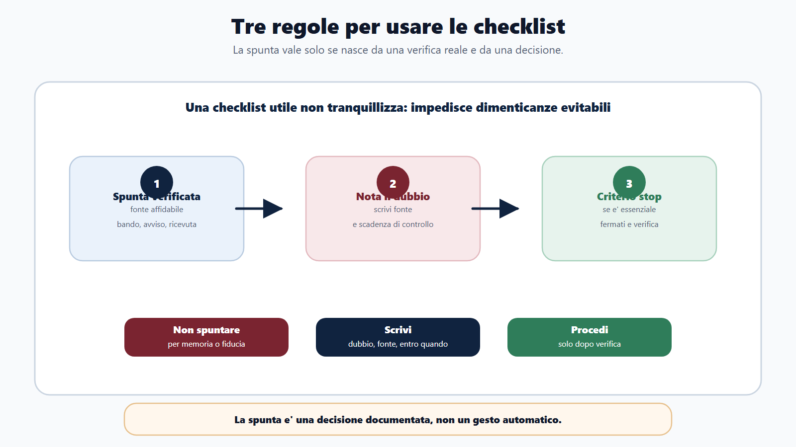
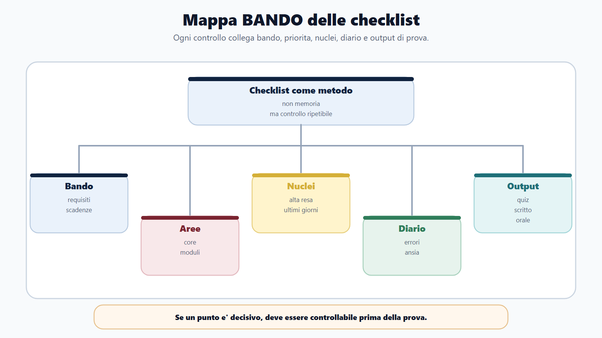
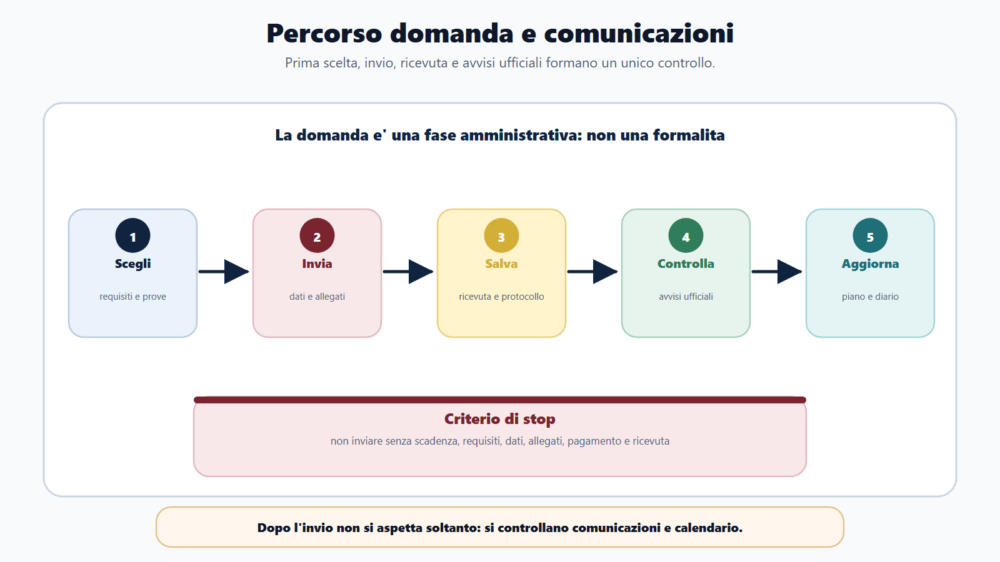
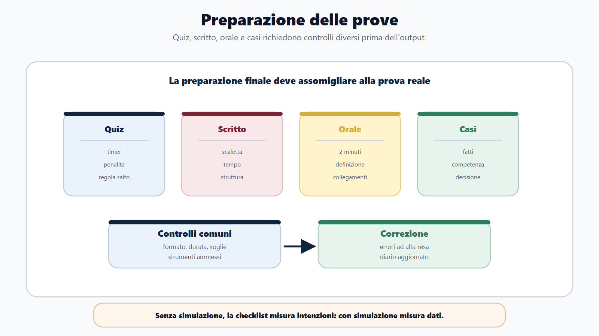
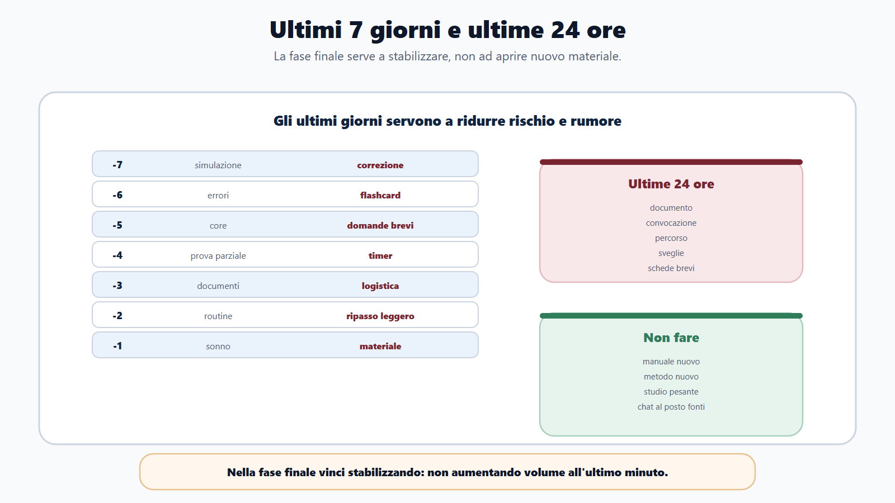
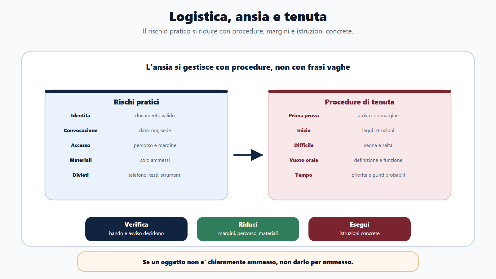
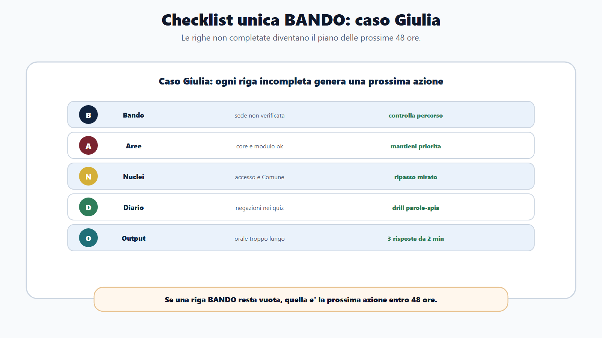

# Capitolo 24 - Checklist operative

Questo capitolo e' il kit finale del candidato.

Non introduce una nuova materia. Trasforma tutto cio che hai visto nel libro in controlli pratici: scegliere, verificare, inviare, studiare, simulare, arrivare alla prova, gestire gli ultimi giorni e imparare dal risultato.

Una checklist non serve a tranquillizzarti. Serve a impedirti di dimenticare cio che conta quando sei stanco, in ritardo o sotto pressione.

Nel Metodo BANDO la checklist e' un atto di metodo:

> se un punto e' decisivo, deve essere controllabile.

## Obiettivo del capitolo

Alla fine del capitolo avrai checklist pronte per:

- decidere se un concorso merita il tuo tempo;
- inviare la domanda senza errori evitabili;
- controllare ricevute, comunicazioni e calendario;
- preparare scritto, quiz, orale e casi;
- gestire ultimi 7 giorni e ultime 24 ore;
- organizzare documenti e logistica;
- proteggere lucidita e tenuta;
- usare il dopo prova per migliorare il prossimo concorso.

Le checklist sono pensate per carta e penna. Il digitale puo aiutare con promemoria, allegati e archiviazione, ma non deve essere indispensabile.

## Come usare le checklist

Usa tre regole.

### 1. Segna solo cio che hai verificato

Non mettere una spunta per memoria o per fiducia. Una spunta significa: ho controllato su fonte affidabile, bando, avviso, portale, ricevuta o documento.

### 2. Scrivi una nota se resta un dubbio

Il dubbio non va tenuto in testa. Va scritto.

Formato:

| Dubbio | Fonte da verificare | Entro quando |
|---|---|---|
| | | |

### 3. Usa il criterio di stop

Ogni checklist ha punti essenziali. Se un punto essenziale non e' chiaro, non procedere automaticamente. Fermati, verifica e poi decidi.

## Mappa BANDO delle checklist

| Fase | Checklist collegata | Scopo |
|---|---|---|
| B - Bando | Prima scelta, domanda, comunicazioni | Evitare esclusioni e letture incomplete |
| A - Aree | Materie, moduli, piano | Dare priorita |
| N - Nuclei | Prova, ultimi giorni | Concentrarsi su alta resa |
| D - Diario | Errori, ansia, dopo prova | Correggere |
| O - Output | Scritto, quiz, orale, caso | Allenare cio che verra chiesto |

Le checklist non sostituiscono il ragionamento. Lo rendono ripetibile.

## Checklist 1 - Prima di scegliere il concorso

Usala prima di iniziare davvero a studiare.

| Controllo | Si/No | Nota |
|---|---|---|
| Ho letto il bando o l'avviso ufficiale, non solo un articolo riassuntivo. | | |
| Ho verificato requisiti di accesso e titolo di studio. | | |
| Ho verificato eventuali requisiti specifici, abilitazioni o esperienza. | | |
| Ho capito profilo, mansioni e amministrazione. | | |
| Ho identificato prove previste e possibile calendario. | | |
| Ho letto materie, punteggi, soglie e criteri. | | |
| Ho stimato giorni disponibili e ore realistiche. | | |
| Ho individuato nucleo comune riutilizzabile. | | |
| Ho individuato eventuale modulo integrativo. | | |
| Ho capito quale prova elimina piu candidati. | | |
| Ho verificato se il concorso e' compatibile con altri concorsi che preparo. | | |
| Ho deciso cosa non studiare ora. | | |

### Criterio di stop

Non iniziare il piano se non sai:

- se puoi partecipare;
- quando scade la domanda;
- quali prove sono previste;
- quali materie contano;
- quale modulo integrativo serve.

## Checklist 2 - Prima di inviare la domanda

La domanda e' una fase amministrativa, non una formalita. Un candidato preparato puo perdere un concorso per una scadenza, un allegato, un pagamento o una ricevuta non controllata.

| Controllo | Si/No | Nota |
|---|---|---|
| Ho verificato data e ora esatta di scadenza. | | |
| Ho accesso al portale richiesto. | | |
| Ho controllato dati anagrafici e recapiti. | | |
| Ho letto tutte le dichiarazioni richieste. | | |
| Ho verificato titolo di studio e dati da inserire. | | |
| Ho controllato eventuali titoli valutabili. | | |
| Ho preparato allegati richiesti nel formato corretto. | | |
| Ho verificato eventuale pagamento o contributo. | | |
| Ho controllato indirizzo email/PEC o domicilio digitale indicato. | | |
| Ho riletto domanda prima dell'invio. | | |
| Ho salvato ricevuta, protocollo o conferma invio. | | |
| Ho annotato dove verranno pubblicate comunicazioni successive. | | |

### Criterio di stop

Non inviare se non hai verificato scadenza, requisiti, dati, allegati, pagamento e ricevuta generabile.

## Checklist 3 - Dopo l'invio della domanda

Dopo l'invio molti candidati si rilassano troppo. Invece inizia la fase di controllo.

| Controllo | Si/No | Nota |
|---|---|---|
| Ho salvato ricevuta in almeno due posti. | | |
| Ho annotato numero domanda/protocollo. | | |
| Ho salvato copia del bando e allegati. | | |
| Ho segnato pagina o portale per comunicazioni ufficiali. | | |
| Ho messo promemoria per controlli periodici. | | |
| Ho controllato se esiste banca dati o se verra pubblicata. | | |
| Ho aggiornato il piano 30/60/90. | | |
| Ho creato scheda concorso in una pagina. | | |
| Ho avviato diario errori. | | |
| Ho separato core e modulo. | | |

### Frequenza controllo comunicazioni

| Fase | Frequenza minima |
|---|---|
| Subito dopo domanda | Controllo ricevuta e bando |
| Prima della pubblicazione calendario | 1-2 volte a settimana |
| Dopo calendario o banca dati | Controllo ravvicinato |
| Ultimi 7 giorni | Ogni giorno sulle fonti ufficiali |

## Checklist 4 - Prima dello scritto o quiz

Questa checklist vale per quiz, prova scritta a risposta multipla, prova sintetica, scritto teorico-pratico e casi. Adattala al formato reale.

| Controllo | Si/No | Nota |
|---|---|---|
| Ho letto formato, durata, punteggio e soglie. | | |
| Ho verificato penalita o regole sulle risposte errate. | | |
| Ho verificato strumenti ammessi e vietati. | | |
| Ho fatto almeno una simulazione nel formato reale. | | |
| Ho corretto gli errori con categorie. | | |
| Ho ripassato errori ad alta resa. | | |
| Ho una strategia di gestione tempo. | | |
| Ho deciso quando saltare una domanda. | | |
| Ho schede finali per nuclei piu deboli. | | |
| Ho preparato routine per leggere consegne e negazioni. | | |
| Ho verificato sede, orario, convocazione e documenti. | | |
| Ho preparato piano ultime 24 ore. | | |

### Se la prova e' a quiz

| Controllo specifico | Si/No |
|---|---|
| So quanto tempo medio ho per domanda. | |
| Ho fatto simulazioni con timer. | |
| Ho classificato errori di memoria, concetto, lettura, tempo e strategia. | |
| Ho una regola per domande lunghe o incerte. | |
| Ho ripassato banca dati se ufficiale. | |

### Se la prova e' scritta o teorico-pratica

| Controllo specifico | Si/No |
|---|---|
| So il formato richiesto: sintetica, tema, caso, atto, risposta breve. | |
| Ho allenato scalette prima della risposta. | |
| Ho provato almeno una risposta con limite di tempo. | |
| Ho una struttura base: definizione, funzione, riferimento, esempio, chiusura. | |
| Ho corretto pertinenza, ordine, lessico e completezza. | |

## Checklist 5 - Prima dell'orale

L'orale non si prepara leggendo in silenzio. Si prepara parlando.

| Controllo | Si/No | Nota |
|---|---|---|
| Ho verificato materie orali e criteri. | | |
| Ho verificato inglese, informatica o prova pratica orale. | | |
| Ho preparato schede domanda-risposta. | | |
| Ho simulato risposte da 2 minuti. | | |
| Ho allenato definizione, funzione, esempio e collegamento. | | |
| Ho preparato domande su profilo e amministrazione. | | |
| Ho ripassato errori orali: vuoti, risposte lunghe, lessico, ordine. | | |
| Ho simulato domande incrociate. | | |
| Ho preparato apertura e chiusura delle risposte. | | |
| Ho verificato documenti, sede, orario e convocazione. | | |

### Griglia risposta orale

| Passaggio | Fatto |
|---|---|
| Inquadro la domanda. | |
| Definisco il concetto. | |
| Spiego funzione e conseguenza. | |
| Richiamo fonte/principio solo se sicuro. | |
| Faccio esempio o collegamento. | |
| Chiudo tornando alla domanda. | |

## Checklist 6 - Ultimi 7 giorni

Gli ultimi 7 giorni non servono ad aprire nuovi mondi. Servono a stabilizzare.

| Giorno | Priorita | Fatto |
|---|---|---|
| -7 | Simulazione o prova completa, correzione profonda. | |
| -6 | Ripasso errori principali, flashcard, modulo debole. | |
| -5 | Core ad alta resa, domande orali brevi. | |
| -4 | Seconda simulazione o prova parziale. | |
| -3 | Documenti, logistica, schede finali. | |
| -2 | Ripasso leggero, errori ricorrenti, routine. | |
| -1 | Solo rifinitura, sonno, materiale, orari. | |

### Cosa non fare negli ultimi 7 giorni

- Aprire un manuale nuovo.
- Cambiare metodo.
- Fare quiz senza correggere.
- Studiare solo la materia preferita.
- Ignorare documenti e logistica.
- Restare sveglio fino a tardi per recuperare.

## Checklist 7 - Ultime 24 ore

| Controllo | Si/No | Nota |
|---|---|---|
| Documento di identita valido. | | |
| Convocazione o avviso salvato/stampato se utile. | | |
| Ricevuta domanda se richiesta o prudente. | | |
| Indicazioni sede e percorso controllati. | | |
| Orario di partenza deciso con margine. | | |
| Materiale ammesso verificato. | | |
| Telefono/caricatore gestiti secondo regole sede. | | |
| Acqua/snack se ammessi. | | |
| Sveglia e seconda sveglia impostate. | | |
| Schede finali ridotte a poche pagine. | | |
| Niente studio pesante serale. | | |

### Regola ultime 24 ore

Nelle ultime 24 ore devi ridurre rischio, non aumentare volume. L'obiettivo e' arrivare lucido.

## Checklist 8 - Documenti e logistica

Verifica sempre il bando e l'avviso di convocazione. Questa checklist non sostituisce le istruzioni ufficiali.

| Area | Controllo | Fatto |
|---|---|---|
| Identita | Documento valido e leggibile. | |
| Domanda | Ricevuta, protocollo o conferma. | |
| Convocazione | Data, ora, sede, aula, turno. | |
| Accesso | Mezzi, parcheggio, tempi, eventuali controlli. | |
| Materiali | Penne, documenti, strumenti ammessi. | |
| Divieti | Smartphone, testi, calcolatrici o altro secondo avviso. | |
| Salute | Farmaci personali, acqua, necessita specifiche se ammesse. | |
| Emergenze | Numero ente, email, percorso alternativo. | |

### Nota prudenziale

Se un oggetto non e' chiaramente ammesso, non darlo per ammesso. Verifica nell'avviso o nelle istruzioni della commissione.

## Checklist 9 - Ansia e tenuta

L'ansia non si elimina con una frase motivazionale. Si gestisce con procedure.

| Situazione | Procedura |
|---|---|
| Prima della prova | Arriva con margine, evita discussioni, rivedi solo schede brevi. |
| Inizio prova | Leggi istruzioni, controlla tempo, respira, non partire in automatico. |
| Domanda difficile | Segna, salta se previsto, torna dopo. |
| Vuoto orale | Riparti da definizione, funzione, esempio. |
| Errore percepito | Non inseguire l'errore precedente. Torna al punto successivo. |
| Tempo che corre | Applica la regola di priorita: prima punti piu probabili. |

### Frasi operative

Non usare frasi vaghe come "devo stare calmo". Usa istruzioni:

- leggo la consegna due volte;
- cerchio negazioni ed eccezioni;
- parto dalla definizione;
- se non so, delimito il tema;
- se perdo tempo, salto;
- se sbaglio una domanda, torno al piano.

## Checklist 10 - Dopo la prova

Il dopo prova serve a migliorare, non solo ad aspettare.

| Controllo | Si/No | Nota |
|---|---|---|
| Ho annotato impressioni entro poche ore. | | |
| Ho scritto quali materie sono uscite. | | |
| Ho segnato errori probabili e cause. | | |
| Ho distinto problemi di contenuto, tempo, ansia, strategia. | | |
| Ho salvato eventuali avvisi successivi. | | |
| Ho controllato calendario di prove successive. | | |
| Ho aggiornato diario errori. | | |
| Ho aggiornato piano per prossimo concorso o orale. | | |
| Ho evitato di basarmi solo sulle chat o voci informali. | | |

### Scheda post-prova

| Domanda | Risposta |
|---|---|
| Che cosa e' andato bene? | |
| Che cosa ha fatto perdere tempo? | |
| Quale materia era piu presente del previsto? | |
| Quale errore si e' ripetuto? | |
| Che cosa devo correggere entro 7 giorni? | |
| Quale materiale e' stato davvero utile? | |
| Che cosa non usero piu? | |

Il candidato strategico non riparte da zero. Trasforma ogni prova in dati per la successiva.

## Checklist unica BANDO

Questa e' la checklist riassuntiva da usare per ogni concorso.

| BANDO | Domanda | Fatto |
|---|---|---|
| B - Bando | Posso partecipare e ho capito prove, scadenze, materie e regole? | |
| A - Aree | Ho diviso core, modulo e prova? | |
| N - Nuclei | Ho scelto priorita ad alta resa? | |
| D - Diario | Sto correggendo errori e piano? | |
| O - Output | Sto producendo quiz, risposte, casi, orale o simulazioni? | |

Se una riga resta vuota, quella e' la tua prossima azione.

## Da sapere in 5 righe

1. La checklist serve a evitare errori pratici, non a decorare il piano.
2. Ogni spunta deve corrispondere a una verifica reale.
3. Il bando e gli avvisi ufficiali prevalgono sempre sulla memoria.
4. Gli ultimi giorni servono a stabilizzare, non ad accumulare.
5. Dopo la prova, il diario trasforma l'esperienza in vantaggio per il prossimo concorso.

## Caso guidato

Giulia prepara un concorso con scritto a quiz e orale. Ha studiato molto, ma non ha una procedura finale.

Sette giorni prima compila la checklist:

- scopre che non ha controllato bene la sede;
- vede che non ha simulato il quiz con il tempo reale;
- nota che all'orale risponde troppo a lungo;
- trova tre errori ricorrenti nel diario: accesso, organi del Comune, negazioni nei quiz.

Il suo piano finale cambia:

- una simulazione con timer;
- ripasso mirato su accesso e organi;
- drill su parole-spia;
- tre risposte orali da due minuti;
- controllo documenti e percorso.

Non aggiunge un nuovo manuale. Riduce il rischio.

## Domanda da commissario

**Perche una checklist e' utile anche a un candidato ben preparato?**

Perche la preparazione non elimina il rischio pratico. Scadenze, documenti, formato prova, tempo, sede, comunicazioni, regole e gestione dell'ansia possono compromettere anche chi ha studiato. La checklist rende controllabili i passaggi essenziali.

## Domanda-trappola

**Se ho studiato bene, posso saltare la checklist degli ultimi giorni?**

No. Gli ultimi giorni non riguardano solo conoscenza. Riguardano stabilita, logistica, documenti, timer, ripasso errori e lucidita. Saltare questi controlli aumenta il rischio evitabile.

## Mini-esercizio

Scegli il concorso che stai preparando e compila la checklist unica BANDO. Poi scrivi una sola azione per ogni riga non completata.

| Fase | Punto incompleto | Azione entro 48 ore |
|---|---|---|
| Bando | | |
| Aree | | |
| Nuclei | | |
| Diario | | |
| Output | | |

Se non trovi nessun punto incompleto, fai una simulazione: spesso i punti incompleti emergono dall'output, non dalla sensazione.

## Errori tipici

- Fidarsi del ricordo invece di rileggere bando e avvisi.
- Inviare la domanda senza salvare ricevuta.
- Non controllare dove saranno pubblicate le comunicazioni.
- Preparare lo scritto senza conoscere durata e regole.
- Preparare l'orale solo leggendo.
- Aprire materiali nuovi negli ultimi giorni.
- Sottovalutare documenti, percorso e orario.
- Non aggiornare il diario dopo la prova.

## Riferimenti consolidati

- [[sources/checklist-operative-concorsi-metodo-bando]]
- [[sources/prove-concorsuali-quiz-scritto-orale-dpr-487-1994]]
- [[sources/capitoli-21-23-corpus-moduli-piano-diario-2026-06-01]]
- [[topics/checklist-concorsi]]
- [[topics/piano-30-60-90-giorni]]
- [[topics/diario-errori]]

## Note di review

- Prima della pubblicazione finale verificare se alcune checklist devono essere replicate nelle appendici come pagine stampabili.
- I punti su documenti, strumenti ammessi e sede devono restare formulati in modo prudente: il bando e gli avvisi ufficiali decidono sempre.
