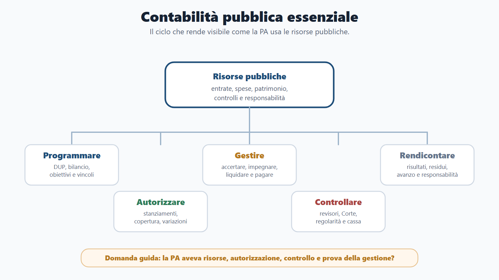
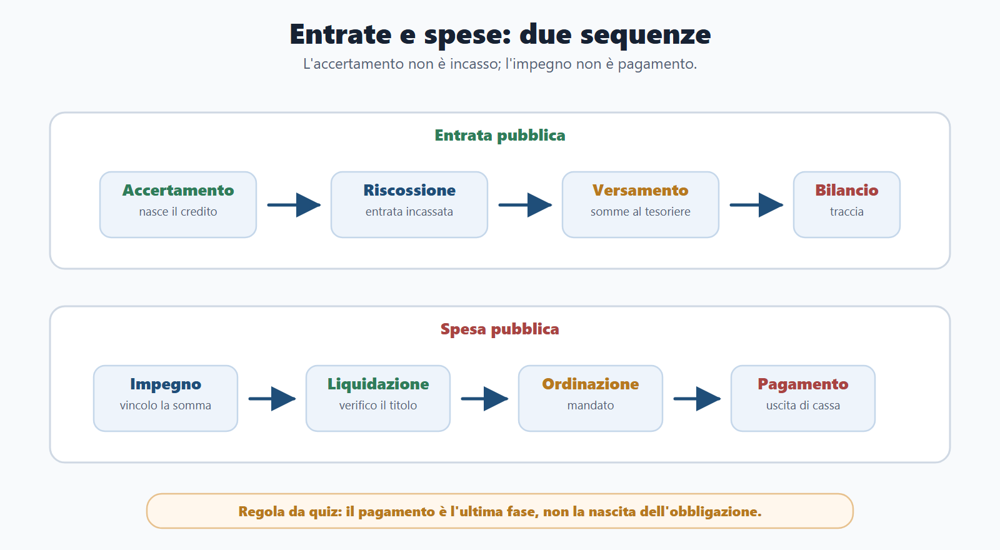
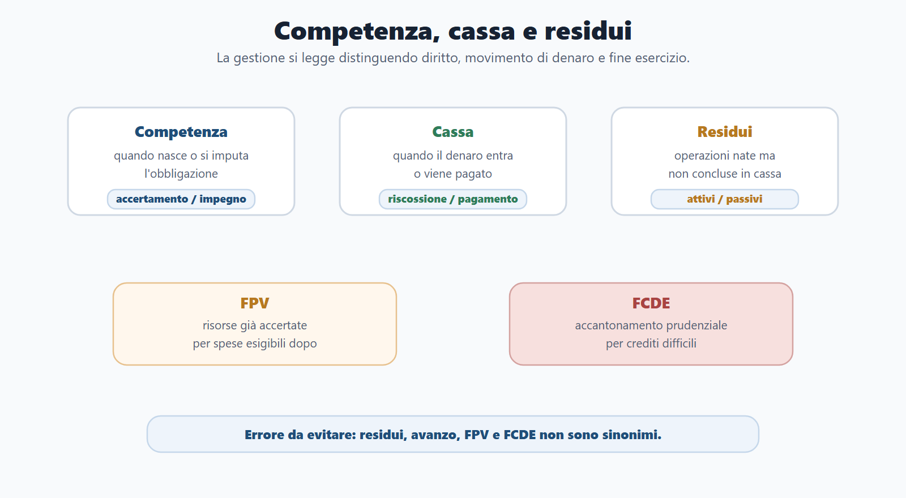
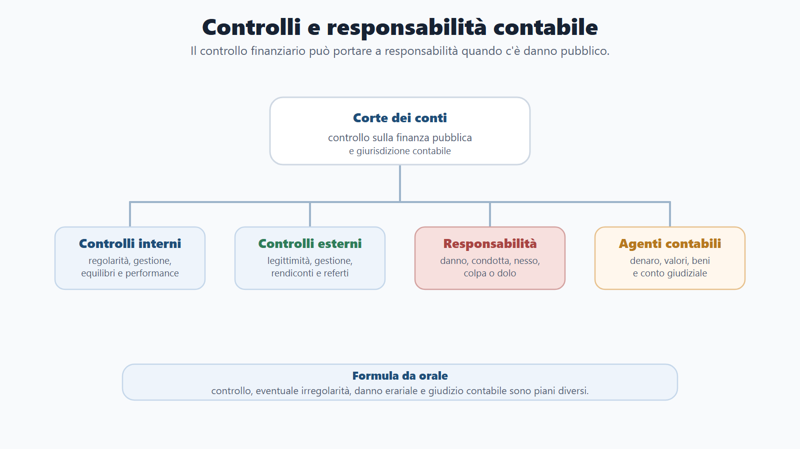
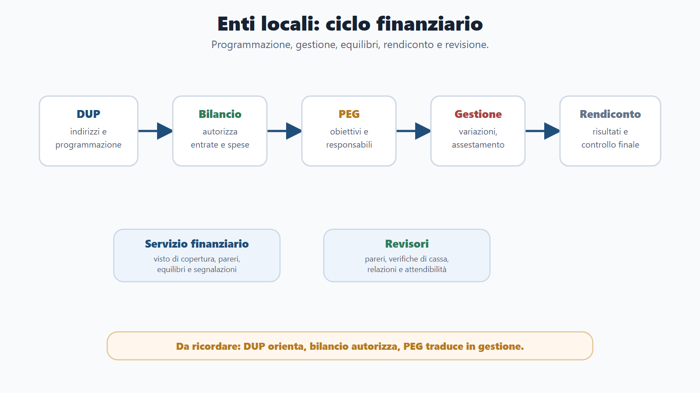
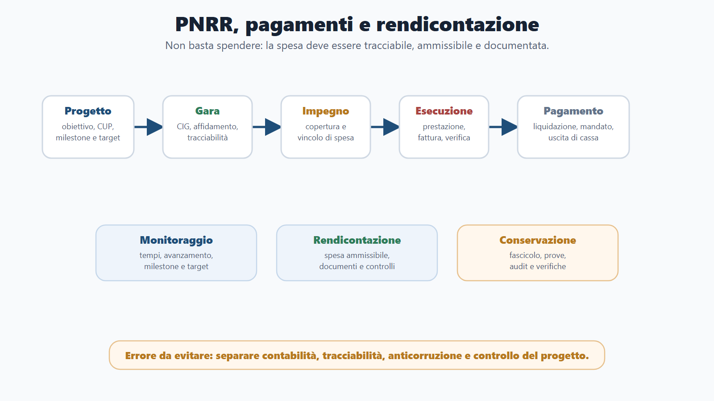

# Capitolo 8 - Contabilità pubblica essenziale

## Perché studiare la contabilità pubblica

La contabilità pubblica è il linguaggio con cui la pubblica amministrazione rende visibile una scelta fondamentale: come usa le risorse pubbliche. Non riguarda solo ragionieri, revisori o funzionari finanziari. Riguarda ogni dipendente pubblico che propone un acquisto, gestisce un procedimento con effetti di spesa, firma un provvedimento, controlla un servizio, partecipa a un progetto PNRR o risponde a un cittadino su bilanci, pagamenti e responsabilità.

Per questo nei concorsi la materia compare spesso anche nei profili amministrativi. Le domande non chiedono sempre calcoli complessi; più spesso verificano se il candidato sa distinguere bilancio di previsione e rendiconto, entrata e spesa, competenza e cassa, impegno e pagamento, residui e risultato di amministrazione, controlli interni e controlli della Corte dei conti.

La chiave è evitare di studiare la contabilità pubblica come un elenco di parole tecniche. Occorre vedere il ciclo: una risorsa viene prevista, accertata, riscossa, destinata; una spesa viene programmata, impegnata, liquidata, ordinata, pagata; alla fine la gestione viene rendicontata, controllata e, se vi sono irregolarità o danni, può generare responsabilità.

## Obiettivi del capitolo

Al termine del capitolo devi sapere:

- spiegare il collegamento tra artt. 81, 97 e 119 Cost., equilibrio di bilancio, copertura finanziaria e sostenibilità del debito;
- riconoscere le principali fonti della contabilità pubblica statale e locale;
- distinguere bilancio dello Stato, legge di bilancio, documenti programmatici, assestamento, variazioni e rendiconto;
- collocare correttamente missioni, programmi, capitoli e stati di previsione;
- descrivere le fasi dell'entrata e della spesa;
- distinguere competenza, cassa, residui, economie, avanzo, disavanzo, FPV e FCDE;
- comprendere tesoreria, servizio di cassa, SIOPE, anticipazioni, mutui, indebitamento e debito pubblico;
- collegare patrimonio, inventari, consegnatari ed economato alla responsabilità contabile;
- spiegare controlli interni, controlli della Corte dei conti, parifica e responsabilità erariale;
- individuare chi sono gli agenti contabili e perché rendono il conto;
- comprendere l'armonizzazione contabile del D.Lgs. 118/2011;
- leggere il ciclo finanziario degli enti locali: DUP, bilancio, PEG, variazioni, salvaguardia, rendiconto e revisione;
- distinguere contabilità finanziaria, economico-patrimoniale e analitica;
- richiamare la contabilità universitaria e degli enti pubblici senza confonderla con quella degli enti locali;
- collegare contratti pubblici, CIG, CUP, fatturazione elettronica, tempi di pagamento, tracciabilità, PNRR e fondi UE.

## Come usare il Metodo BANDO

| Fase | Come usare questo capitolo |
|---|---|
| **Bando** | Cerca voci come contabilità pubblica, bilancio, entrate, spese, rendiconto, Corte dei conti, responsabilità erariale, enti locali, armonizzazione, DUP, PEG, pagamenti, PNRR. |
| **Aree** | Collega la materia a diritto costituzionale, diritto amministrativo, enti locali, contratti pubblici, responsabilità, trasparenza e pubblico impiego. |
| **Nuclei** | Studia prima principi e ciclo di bilancio; poi fasi di entrata/spesa; quindi controlli, responsabilità, enti locali, armonizzazione, pagamenti e PNRR. |
| **Diario** | Registra gli errori ricorrenti: confondere impegno e pagamento, competenza e cassa, bilancio e rendiconto, FPV e avanzo, CIG e CUP. |
| **Output** | Produci una mappa del ciclo finanziario, una tabella entrate/spese, un caso guidato su acquisto comunale, una risposta orale su Corte dei conti e un mini-schema su PNRR. |

## Confini con gli altri capitoli

La contabilità pubblica incrocia molte materie già trattate, ma qui ha un punto di vista specifico.

| Tema | Dove compare anche | Qui come va usato |
|---|---|---|
| Principi costituzionali | Capitolo 4 | Applicazione finanziaria di equilibrio, copertura, debito e autonomia territoriale. |
| Organizzazione amministrativa | Capitolo 5 | Effetti contabili di competenze, uffici, responsabili e controlli. |
| Contratti pubblici | Capitolo 5 | Solo per copertura, impegno, CIG, CUP, fatture, liquidazione, pagamento e tracciabilità. |
| Pubblico impiego | Capitolo 6 | Solo per responsabilità, controlli, performance e gestione delle risorse. |
| Trasparenza e anticorruzione | Capitolo 7 | Solo per pubblicazione di dati contabili, controllo diffuso, tracciabilità e rischio corruttivo. |

## Quadro essenziale

### 1. Principi costituzionali e finanza pubblica

La contabilità pubblica ha una base costituzionale. L'art. 81 Cost. collega bilancio, equilibrio, copertura finanziaria e limiti all'indebitamento. Ogni legge che comporta nuovi o maggiori oneri deve indicare i mezzi per farvi fronte; lo Stato assicura equilibrio tra entrate e spese e tiene conto del ciclo economico e dei vincoli europei.

L'art. 97 Cost. inserisce il tema finanziario dentro l'organizzazione amministrativa: le pubbliche amministrazioni devono assicurare equilibrio dei bilanci, sostenibilità del debito, buon andamento e imparzialità. Quindi la corretta gestione contabile non è una formalità, ma una condizione del buon andamento.

L'art. 119 Cost. riconosce autonomia finanziaria a Comuni, Province, Città metropolitane e Regioni, ma entro il coordinamento della finanza pubblica. Gli enti territoriali possono avere risorse proprie, compartecipazioni, fondi perequativi e capacità di spesa, ma l'indebitamento è ammesso solo nei limiti previsti e, in linea generale, per finanziare investimenti.

La L. cost. 1/2012 ha rafforzato il principio dell'equilibrio di bilancio. La L. 243/2012 ne disciplina l'attuazione. Nei concorsi è importante non usare in modo approssimativo "pareggio" ed "equilibrio": il lessico costituzionale attuale ruota intorno all'equilibrio, alla sostenibilità e alla responsabilità finanziaria.

### 2. Fonti della contabilità pubblica

Le fonti della contabilità pubblica sono stratificate. Per lo Stato restano fondamentali il R.D. 2440/1923, sulla contabilità generale dello Stato, e il R.D. 827/1924, regolamento di contabilità. A queste fonti storiche si affianca la L. 196/2009, che disciplina contabilità e finanza pubblica nel quadro moderno, con successive riforme del bilancio statale, tra cui la L. 163/2016 e i decreti legislativi di riforma.

Per gli enti territoriali la fonte centrale è il D.Lgs. 118/2011, corretto e integrato dal D.Lgs. 126/2014, insieme al TUEL per gli enti locali. L'armonizzazione contabile serve a rendere confrontabili bilanci, rendiconti e dati finanziari tra amministrazioni diverse.

Per gli enti pubblici non territoriali e le università operano discipline specifiche: D.Lgs. 91/2011 per l'armonizzazione dei sistemi contabili delle amministrazioni pubbliche, D.P.R. 97/2003 per enti pubblici, D.Lgs. 18/2012 per la contabilità universitaria e normativa MUR di settore.

Il candidato deve ricordare una regola pratica: non tutte le amministrazioni usano identiche denominazioni e identiche regole, ma tutte devono rispettare legalità finanziaria, programmazione, autorizzazione, gestione, rendicontazione e controllo.

### 3. Bilancio dello Stato

Il bilancio dello Stato è il principale documento di autorizzazione e rappresentazione finanziaria statale. Consente al Parlamento di autorizzare entrate e spese e permette di verificare come le risorse pubbliche siano destinate alle politiche pubbliche.

La legge di bilancio è lo strumento legislativo con cui si approva la manovra finanziaria e si autorizza la gestione. Il bilancio di previsione guarda al futuro; il rendiconto guarda alla gestione già svolta. Confondere questi due documenti è uno degli errori più frequenti nei quiz.

Nel ciclo di bilancio rientrano anche documenti programmatici e di finanza pubblica. Nei quiz tradizionali compaiono spesso DEF e legge di bilancio; nel quadro aggiornato vanno riconosciuti anche Piano strutturale di bilancio di medio termine, Documento di finanza pubblica e Documento programmatico di finanza pubblica, secondo le fonti RGS/OpenBDAP 2025-2026.

Il bilancio statale è organizzato secondo classificazioni che aiutano a leggere la destinazione delle risorse:

- le **missioni** indicano le grandi finalità dell'azione pubblica;
- i **programmi** articolano le missioni in aree operative più specifiche;
- i **capitoli** hanno funzione gestionale e contabile;
- gli **stati di previsione** riguardano le singole amministrazioni o aree di gestione;
- assestamento e variazioni consentono di adeguare le previsioni durante l'esercizio.

La distinzione tra politica pubblica e gestione contabile è essenziale: missioni e programmi aiutano a capire "perché" si spende; capitoli e piani gestionali aiutano a capire "come" la spesa viene gestita.

### 4. Entrate pubbliche

Le entrate pubbliche sono le risorse che finanziano l'attività della pubblica amministrazione. Possono essere tributarie, extratributarie, derivanti da trasferimenti, alienazioni, riscossioni di crediti, accensione di prestiti o altre fonti previste.

Le fasi classiche dell'entrata sono:

| Fase | Significato |
|---|---|
| Accertamento | L'amministrazione verifica la ragione del credito, il soggetto debitore, l'importo e la scadenza. |
| Riscossione | Il debitore versa la somma al soggetto incaricato della riscossione o alla tesoreria. |
| Versamento | Le somme riscosse confluiscono nelle casse dell'ente o dello Stato secondo le regole contabili. |

Nei concorsi, l'accertamento è spesso la fase più importante da riconoscere: non coincide con l'incasso materiale, ma con la nascita contabile del credito dell'amministrazione.

Le reversali o ordinativi di incasso documentano l'acquisizione delle entrate nella gestione dell'ente. I ruoli rilevano in particolare per alcune forme di riscossione. La classificazione delle entrate serve a capire natura, provenienza, vincoli e destinazione delle risorse.

### 5. Spesa pubblica

La spesa pubblica è il lato più controllato della contabilità pubblica, perché incide direttamente sulle risorse collettive. La sequenza classica è:

| Fase | Significato |
|---|---|
| Impegno | L'amministrazione vincola una somma disponibile per una obbligazione giuridicamente perfezionata o per una spesa nei casi previsti. |
| Liquidazione | Si verifica che la prestazione sia stata eseguita, che il credito sia certo, liquido ed esigibile e che l'importo sia corretto. |
| Ordinazione | Si ordina al tesoriere o al cassiere di pagare, di regola tramite mandato. |
| Pagamento | Si estingue l'obbligazione mediante uscita effettiva di cassa. |

La prenotazione di impegno è un vincolo provvisorio, usato in vista di una spesa non ancora definitivamente perfezionata. Non va confusa con l'impegno definitivo.

Gli stanziamenti rappresentano le somme autorizzate in bilancio. I limiti di spesa impediscono di assumere obbligazioni oltre la disponibilità autorizzata, salvo specifiche variazioni o procedure previste. Il mandato di pagamento è il titolo con cui si dispone il pagamento.

**Regola da quiz:** l'impegno viene prima della liquidazione; il pagamento è l'ultima fase. Se una risposta identifica il pagamento come nascita dell'obbligazione, è sbagliata.

### 6. Gestione del bilancio: competenza, cassa, residui e risultati

La gestione del bilancio si comprende distinguendo competenza e cassa.

La **competenza** guarda alla imputazione giuridico-contabile dell'entrata o della spesa all'esercizio. La **cassa** guarda invece ai movimenti effettivi di denaro: incassi e pagamenti.

I **residui attivi** sono entrate accertate ma non riscosse entro la chiusura dell'esercizio. I **residui passivi** sono spese impegnate ma non pagate entro la chiusura dell'esercizio. Non sono sinonimi di avanzo o disavanzo.

Il **riaccertamento** verifica se i residui possono restare in bilancio. Serve a evitare che il bilancio conservi crediti non più esigibili o debiti non più dovuti.

Le **economie** sono risorse stanziate o impegnate in misura inferiore a quanto previsto, secondo le regole applicabili. L'**avanzo** è il risultato positivo della gestione; il **disavanzo** è il risultato negativo da ripianare secondo la disciplina vigente.

Negli enti armonizzati sono centrali il **FPV**, fondo pluriennale vincolato, che collega risorse già accertate a spese esigibili in esercizi futuri, e il **FCDE**, fondo crediti di dubbia esigibilità, che accantona risorse a tutela di entrate difficili da riscuotere.

FPV e FCDE sono frequenti nei quiz sugli enti locali. Il primo riguarda il tempo della spesa; il secondo riguarda la prudenza sulle entrate.

### 7. Tesoreria, cassa e debito pubblico

La tesoreria gestisce materialmente incassi, pagamenti e disponibilità liquide secondo le regole dell'ente. Per gli enti locali si parla spesso di tesoriere; per altri enti di cassiere o servizio di cassa.

La tesoreria unica è il sistema che accentra o coordina le disponibilità finanziarie di molte amministrazioni, con finalità di controllo e gestione della liquidità pubblica. SIOPE consente la rilevazione e il monitoraggio degli incassi e dei pagamenti delle amministrazioni pubbliche secondo codifiche omogenee.

Le anticipazioni di tesoreria servono a fronteggiare temporanee esigenze di cassa, non a finanziare stabilmente spese prive di copertura. Mutui e indebitamento devono rispettare limiti normativi e vincoli di sostenibilità.

Il debito pubblico rappresenta l'insieme delle obbligazioni finanziarie assunte dal settore pubblico secondo le classificazioni rilevanti. La Cassa depositi e prestiti ha storicamente un ruolo rilevante nel finanziamento degli investimenti pubblici e degli enti territoriali.

### 8. Patrimonio pubblico, inventari ed economato

La contabilità pubblica non riguarda solo denaro. Riguarda anche beni, valori e patrimonio.

Occorre distinguere, sul piano generale, tra beni demaniali, beni patrimoniali indisponibili e beni patrimoniali disponibili. In questo capitolo interessa soprattutto il profilo contabile: i beni devono essere inventariati, custoditi, gestiti, valorizzati e rendicontati.

I consegnatari sono soggetti responsabili della custodia e gestione di beni pubblici. Gli economi gestiscono minute spese o fondi economali secondo regole predeterminate. Cassieri, consegnatari ed economi possono assumere rilevanza come agenti contabili quando maneggiano denaro, valori o beni pubblici.

La gestione patrimoniale può generare responsabilità: perdita, uso improprio, mancata inventariazione, irregolare custodia o omessa resa del conto non sono semplici errori formali.

### 9. Rendiconto

Il rendiconto chiude il ciclo della gestione. Se il bilancio di previsione autorizza, il rendiconto dimostra che cosa è avvenuto.

Per lo Stato si parla di rendiconto generale dello Stato, collegato al controllo parlamentare e alla parificazione della Corte dei conti. Per gli enti locali il rendiconto rappresenta i risultati della gestione e comprende documenti contabili secondo la disciplina applicabile.

Nel linguaggio concorsuale, la distinzione essenziale è questa.

| Documento/concetto | Funzione |
|---|---|
| Conto del bilancio | Rappresenta la gestione finanziaria di entrate e spese. |
| Conto economico | Rappresenta componenti economici positivi e negativi. |
| Stato patrimoniale | Rappresenta attività, passività e patrimonio netto. |
| Risultato di amministrazione | Sintetizza l'esito della gestione finanziaria secondo le regole dell'ente. |
| Parificazione | Controllo della Corte dei conti sul rendiconto, con particolare rilievo per Stato e Regioni. |

Il rendiconto non è un nuovo bilancio preventivo. È il documento che consente controllo, responsabilità e valutazione della gestione.

### 10. Controlli interni

I controlli interni sono strumenti con cui l'amministrazione verifica legalità, regolarità, risultati e qualità della gestione. Non sono tutti uguali.

Il controllo di regolarità amministrativa e contabile verifica conformità dell'azione amministrativa e correttezza contabile. Il controllo di gestione misura efficienza, efficacia ed economicità dell'azione. Il controllo strategico verifica l'attuazione degli indirizzi politici o strategici. Altri controlli riguardano performance, equilibri finanziari, società partecipate o qualità dei servizi, secondo il tipo di amministrazione.

Gli indicatori sono importanti per tradurre la gestione in dati: costi, tempi, risultati, output, grado di raggiungimento degli obiettivi. Nei concorsi la triade efficienza, efficacia ed economicità è ricorrente:

- efficienza: rapporto tra risorse impiegate e risultati prodotti;
- efficacia: grado di raggiungimento degli obiettivi;
- economicità: uso corretto e conveniente delle risorse nel rispetto dei fini pubblici.

Questa triade va letta insieme: la regolarità contabile non basta se l'azione è inefficiente, inefficace o antieconomica; per questo i controlli collegano dati, risultati e responsabilità.

### 11. Corte dei conti

La Corte dei conti ha una doppia centralità: controlla la gestione finanziaria pubblica ed esercita giurisdizione nelle materie di contabilità pubblica.

Le principali funzioni da conoscere sono:

- controllo preventivo di legittimità sugli atti nei casi previsti;
- controllo successivo sulla gestione;
- controllo sui bilanci e sugli equilibri degli enti territoriali;
- parificazione dei rendiconti;
- referti al Parlamento o agli organi rappresentativi;
- giudizi di responsabilità e giudizi di conto;
- attività delle sezioni regionali di controllo.

Il visto e la registrazione sono collegati al controllo preventivo. Il controllo sulla gestione non serve solo a dire se un atto è formalmente valido, ma a valutare uso delle risorse, risultati, efficienza ed economicità.

**Da non sbagliare:** la Corte dei conti non è solo "giudice del danno erariale". Nei concorsi è altrettanto importante la funzione di controllo.

### 12. Responsabilità amministrativa, contabile ed erariale

La responsabilità amministrativa ed erariale riguarda il danno arrecato alle finanze pubbliche da soggetti legati all'amministrazione da un rapporto di servizio o comunque rientranti nel perimetro previsto. Gli elementi tipici sono condotta, danno, nesso causale ed elemento soggettivo.

Il danno erariale può derivare da spreco di risorse, perdita di beni, pagamenti non dovuti, mancata riscossione, violazione di regole di gara o di pagamento, gestione negligente di fondi, irregolare uso di risorse PNRR o mancato rispetto di obblighi di rendicontazione.

L'elemento soggettivo viene ricondotto, secondo la disciplina applicabile, a dolo o colpa grave. Il procedimento coinvolge la Procura contabile e può comprendere l'invito a dedurre, cioè la possibilità per il soggetto interessato di fornire chiarimenti prima dell'eventuale azione.

La responsabilità contabile in senso stretto riguarda chi maneggia denaro, beni o valori pubblici ed è collegata alla resa del conto. Il giudizio di conto verifica la regolarità della gestione dell'agente contabile.

Non bisogna confondere responsabilità erariale, disciplinare, civile e penale. Possono coesistere, ma hanno presupposti, finalità e autorità diverse.

### 13. Agenti contabili

L'agente contabile è il soggetto che ha maneggio di denaro, valori o beni pubblici. Può essere agente contabile di diritto, se formalmente incaricato, o di fatto, se gestisce concretamente risorse pubbliche pur senza regolare investitura.

Rientrano nella categoria, secondo le funzioni effettive, cassieri, tesorieri, economi, consegnatari di beni, agenti della riscossione e altri soggetti che gestiscono valori pubblici.

Il punto centrale è la resa del conto. L'agente contabile deve rendere conto della propria gestione, e il conto può essere sottoposto al giudizio della Corte dei conti.

Esempio: un economo comunale che gestisce un fondo per minute spese deve documentare entrate, uscite, giustificativi e rimanenze. Se mancano somme o documenti, il problema non è solo organizzativo: può diventare contabile e responsabilizzante.

### 14. Armonizzazione contabile

L'armonizzazione contabile, disciplinata in particolare dal D.Lgs. 118/2011 per Regioni ed enti locali, ha una funzione precisa: rendere i bilanci confrontabili, leggibili e raccordabili.

I suoi elementi principali sono:

- schemi di bilancio comuni;
- principi contabili generali e applicati;
- piano dei conti integrato;
- competenza finanziaria potenziata;
- contabilità economico-patrimoniale integrata;
- bilancio consolidato dove previsto;
- raccordo tra programmazione, gestione e rendicontazione.

La competenza finanziaria potenziata imputa entrate e spese all'esercizio in cui l'obbligazione è esigibile. Questo concetto spiega molti istituti degli enti locali: FPV, riaccertamento residui, cronoprogrammi di spesa, corretta imputazione degli impegni.

Il candidato deve memorizzare una formula operativa: negli enti armonizzati non basta chiedersi "quando nasce l'obbligazione?", occorre chiedersi anche "quando diventa esigibile?".

### 15. Ordinamento finanziario degli enti locali

Negli enti locali il riferimento centrale è il TUEL, coordinato con la disciplina armonizzata. Il sistema ruota intorno a programmazione, bilancio, gestione, equilibri, rendiconto e controlli.

Il responsabile del servizio finanziario ha un ruolo essenziale. Presidia gli equilibri di bilancio, esprime pareri di regolarità contabile quando dovuti, appone il visto di copertura finanziaria sugli atti che comportano spesa e segnala situazioni critiche.

Il parere di regolarità contabile non è un dettaglio burocratico: collega la decisione amministrativa alla sostenibilità finanziaria. Il visto di copertura finanziaria attesta che la spesa trova copertura nello stanziamento disponibile.

L'autonomia finanziaria degli enti locali deve sempre rispettare coordinamento della finanza pubblica, vincoli di bilancio, regole sull'indebitamento e disciplina dei trasferimenti.

In presenza di gravi squilibri possono rilevare istituti come dissesto finanziario e riequilibrio finanziario pluriennale. Non sono strumenti ordinari di gestione, ma rimedi straordinari a situazioni patologiche.

### 16. Programmazione degli enti locali: DUP, bilancio, PEG e salvaguardia

Il ciclo locale segue una sequenza precisa.

| Fase | Documento/strumento | Funzione |
|---|---|---|
| Programmazione | DUP | Definisce indirizzi strategici e operativi dell'ente. |
| Autorizzazione | Bilancio di previsione | Autorizza entrate e spese. |
| Gestione | PEG | Assegna obiettivi e risorse ai responsabili. |
| Correzione | Variazioni, assestamento, salvaguardia | Adegua la gestione e verifica gli equilibri. |
| Chiusura | Rendiconto | Dimostra i risultati della gestione. |
| Controllo | Revisori, controlli interni, Corte dei conti | Verifica regolarità, risultati ed equilibri. |

Il DUP precede e orienta il bilancio. Il PEG traduce gli obiettivi in responsabilità gestionali. Le variazioni modificano il bilancio entro i limiti e con le competenze previste. L'assestamento verifica l'adeguatezza generale delle previsioni. La salvaguardia degli equilibri controlla che entrate e spese restino compatibili durante l'esercizio.

Il piano degli indicatori consente una lettura più misurabile del bilancio, utile per valutare gestione, risultati e sostenibilità.

### 17. Entrate e spese degli enti locali

Gli enti locali hanno entrate tributarie, extratributarie, trasferimenti, entrate in conto capitale, entrate da riduzione di attività finanziarie, accensione di prestiti e anticipazioni. Le spese si distinguono, in modo essenziale, tra spese correnti e spese in conto capitale.

Le entrate vincolate devono essere usate per le finalità stabilite. Questo è importante nei progetti finanziati, negli investimenti e nei fondi PNRR o UE. Usare risorse vincolate per finalità diverse può generare irregolarità e responsabilità.

Mandati e reversali sono gli strumenti operativi di pagamento e incasso. La tesoreria locale gestisce i flussi secondo convenzione e regole dell'ente.

Nei quiz sugli enti locali bisogna tenere insieme tre piani: autorizzazione politica del bilancio, gestione tecnica dei responsabili e controllo finanziario del servizio finanziario e dei revisori.

### 18. Revisione economico-finanziaria

L'organo di revisione degli enti locali svolge un controllo tecnico-contabile sull'attività finanziaria dell'ente. Può essere monocratico o collegiale secondo la disciplina applicabile.

I revisori rilasciano pareri, verificano cassa e gestione, collaborano con il Consiglio nella funzione di controllo e redigono relazioni su bilancio e rendiconto. Non sostituiscono gli organi politici né i responsabili gestionali, ma presidiano regolarità, attendibilità e sostenibilità.

Le domande da concorso insistono spesso su tre aspetti:

- parere sul bilancio di previsione;
- relazione sul rendiconto;
- verifiche sugli equilibri e sulla gestione finanziaria.

L'organo di revisione è quindi un soggetto chiave nel sistema dei controlli locali, insieme a servizio finanziario, controlli interni e Corte dei conti.

### 19. Contabilità economico-patrimoniale e analitica

La contabilità finanziaria è centrale nella pubblica amministrazione, ma non esaurisce la rappresentazione della gestione. La contabilità economico-patrimoniale misura costi, ricavi, attività, passività e patrimonio; la contabilità analitica aiuta a leggere costi e risultati per servizi, centri di costo o attività.

| Sistema | Che cosa osserva | Parole chiave |
|---|---|---|
| Finanziario | Entrate, spese, autorizzazioni, incassi e pagamenti | Accertamento, impegno, residui, competenza, cassa. |
| Economico-patrimoniale | Costi, ricavi, attività, passività, patrimonio | Conto economico, stato patrimoniale, ammortamenti, ratei, risconti. |
| Analitico | Costi e risultati per struttura, servizio o processo | Centri di costo, efficienza, controllo di gestione. |

Il conto economico espone componenti positivi e negativi della gestione. Lo stato patrimoniale rappresenta attività, passività e patrimonio netto. Ammortamenti, ratei e risconti sono concetti di competenza economica: servono a imputare costi e ricavi all'esercizio corretto.

Per i concorsi non contabili è sufficiente comprendere la funzione: questi strumenti aiutano a valutare non solo se l'amministrazione ha speso entro i limiti, ma anche quanto costa un servizio, come evolve il patrimonio e se la gestione è economicamente sostenibile.

### 20. Contabilità universitaria ed enti pubblici

Le università e gli enti pubblici possono avere regole contabili specifiche. Per le università la fonte corretta è il D.Lgs. 18/2012, insieme alla normativa MUR. Il sistema ruota intorno a bilancio unico, budget economico, budget degli investimenti e principi contabili di settore.

Il bilancio unico consente una visione unitaria della gestione dell'ateneo. Il budget economico riguarda costi e proventi; il budget degli investimenti riguarda impieghi destinati a beni durevoli, infrastrutture, ricerca, edilizia o altri investimenti.

Per gli enti pubblici non territoriali occorre guardare alla disciplina propria dell'ente, alla normativa generale di armonizzazione e agli schemi applicabili. La regola da ricordare è che "pubblico" non significa sempre "TUEL": un Comune, una Regione, un'università e un ente pubblico nazionale possono avere regole diverse.

### 21. Contratti pubblici, pagamenti e tracciabilità

I contratti pubblici sono già stati trattati nel capitolo di diritto amministrativo. Qui interessano per il loro effetto contabile: un appalto produce programmazione, copertura, impegno, esecuzione, fatturazione, liquidazione, pagamento, collaudo o verifica, tracciabilità e possibile rendicontazione.

Il D.Lgs. 36/2023, aggiornato dal correttivo D.Lgs. 209/2024, è il riferimento principale per i contratti pubblici. Nel capitolo contabile non occorre ripetere tutte le procedure di gara, ma bisogna capire come l'affidamento si traduce in spesa.

Il **CIG** identifica la procedura o il contratto ai fini di tracciabilità e monitoraggio. Il **CUP** identifica un progetto di investimento pubblico. Confondere CIG e CUP è un errore frequente.

La fatturazione elettronica verso la PA incide su ricezione e gestione delle fatture. La liquidazione verifica titolo, prestazione, importo, regolarità e adempimenti; il pagamento rispetta tempi e regole sui debiti commerciali.

La tracciabilità dei flussi finanziari serve a rendere verificabili i pagamenti collegati a contratti pubblici e finanziamenti. Nei concorsi, la tracciabilità va collegata a legalità, anticorruzione, controllo e contabilità, non solo alla procedura di gara.

### 22. PNRR, fondi UE e rendicontazione

PNRR e fondi UE hanno rafforzato l'importanza della contabilità di progetto. Non basta spendere: occorre dimostrare che la spesa è ammissibile, tracciabile, collegata a un intervento, documentata e coerente con obiettivi, milestone e target.

I concetti essenziali sono:

- **monitoraggio finanziario**, cioè controllo dell'avanzamento della spesa;
- **milestone**, cioè traguardi qualitativi o procedurali;
- **target**, cioè risultati quantitativi misurabili;
- **cofinanziamento**, quando il progetto è sostenuto da più fonti;
- **rendicontazione**, cioè dimostrazione documentale della spesa e dei risultati;
- **vincoli di destinazione**, che impediscono l'uso libero delle risorse;
- **controlli**, interni, esterni, nazionali o europei.

La gestione PNRR richiede una catena ordinata: progetto, CUP, eventuale gara e CIG, impegno, esecuzione, fattura, liquidazione, pagamento, monitoraggio, rendicontazione e conservazione dei documenti.

**Da non sbagliare:** un progetto PNRR non è solo una spesa finanziata. È una gestione vincolata, misurata e controllata.

## Da sapere in 5 righe

La contabilità pubblica serve a programmare, autorizzare, gestire, controllare e rendicontare l'uso delle risorse pubbliche. Il bilancio di previsione guarda al futuro; il rendiconto verifica la gestione compiuta. Le entrate seguono accertamento, riscossione e versamento; le spese seguono impegno, liquidazione, ordinazione e pagamento. Negli enti locali sono centrali DUP, bilancio, PEG, variazioni, salvaguardia, rendiconto, revisori e armonizzazione D.Lgs. 118/2011. Corte dei conti, responsabilità erariale, agenti contabili, tracciabilità, PNRR e pagamenti completano il ciclo.

## Caso guidato

Un Comune deve acquistare un servizio di manutenzione software per gli uffici.

1. L'esigenza deve essere coerente con la programmazione e con gli obiettivi dell'ente.
2. L'ufficio verifica la disponibilità nello stanziamento di bilancio.
3. L'atto di affidamento richiede copertura finanziaria e impegno di spesa.
4. Se la disciplina dei contratti lo richiede, si acquisisce il CIG; se l'intervento è un progetto di investimento, può rilevare anche il CUP.
5. Il fornitore esegue la prestazione e trasmette fattura elettronica.
6. L'ufficio competente verifica la regolarità della prestazione.
7. Si procede alla liquidazione: titolo, importo e documenti devono essere corretti.
8. L'ordinazione dispone il pagamento tramite mandato.
9. Il tesoriere esegue il pagamento.
10. La spesa entra nella gestione da rendicontare e può essere controllata da revisori, controlli interni o Corte dei conti.

Se il servizio fosse finanziato da fondi PNRR o UE, si aggiungerebbero vincoli di destinazione, monitoraggio, milestone/target e rendicontazione specifica.

## Domanda da commissario

**Domanda:** Spieghi la differenza tra impegno, liquidazione, ordinazione e pagamento.

**Risposta modello:** L'impegno vincola una somma disponibile in bilancio a fronte di una obbligazione o di una spesa nei casi previsti. La liquidazione verifica che il creditore abbia titolo al pagamento, che la prestazione sia stata eseguita e che l'importo sia certo, liquido ed esigibile. L'ordinazione è l'atto con cui si dispone al tesoriere o cassiere di pagare, normalmente tramite mandato. Il pagamento è l'uscita effettiva di cassa con cui si estingue l'obbligazione.

## Domanda-trappola

**Domanda:** Il residuo passivo è un avanzo di amministrazione?

**Risposta:** No. Il residuo passivo è una spesa impegnata ma non pagata entro la chiusura dell'esercizio. L'avanzo di amministrazione è un risultato complessivo della gestione finanziaria, determinato secondo le regole applicabili. Sono concetti diversi.

## Errori tipici

- Dire che il bilancio di previsione "rendiconta" la gestione: il bilancio autorizza, il rendiconto consuntiva.
- Confondere accertamento con riscossione.
- Confondere impegno con pagamento.
- Usare competenza e cassa come sinonimi.
- Presentare il FPV come avanzo libero.
- Presentare il FCDE come perdita già realizzata.
- Applicare automaticamente regole statali agli enti locali senza richiamare TUEL e D.Lgs. 118/2011.
- Dimenticare che la Corte dei conti ha funzioni di controllo oltre che giurisdizionali.
- Considerare agente contabile qualunque dipendente pubblico.
- Confondere responsabilità disciplinare e responsabilità erariale.
- Confondere CIG e CUP.
- Parlare di PNRR senza rendicontazione, milestone, target e vincoli di destinazione.

## Mini-esercizio

Classifica ogni affermazione.

| Affermazione | Correzione |
|---|---|
| Il pagamento è la prima fase della spesa. | Falso: la sequenza è impegno, liquidazione, ordinazione, pagamento. |
| Il DUP orienta il bilancio dell'ente locale. | Vero. |
| Il CIG identifica un progetto di investimento pubblico. | Falso: questa è la funzione del CUP; il CIG identifica procedura/contratto. |
| Il FCDE tutela gli equilibri rispetto a crediti di dubbia riscossione. | Vero. |
| Il rendiconto generale dello Stato apre il ciclo di bilancio. | Falso: chiude e documenta la gestione svolta. |
| La responsabilità erariale riguarda solo i dirigenti. | Falso: dipende dal rapporto di servizio e dai presupposti del danno, non solo dalla qualifica dirigenziale. |

## Glossario minimo da ripasso

| Termine | Significato essenziale |
|---|---|
| Bilancio di previsione | Documento autorizzatorio che programma entrate e spese future. |
| Legge di bilancio | Legge con cui si approva la manovra e si autorizza la gestione statale. |
| Rendiconto | Documento che dimostra i risultati della gestione compiuta. |
| Accertamento | Fase dell'entrata che individua credito, debitore, importo e scadenza. |
| Impegno | Fase della spesa che vincola lo stanziamento. |
| Liquidazione | Verifica del diritto del creditore e dell'importo dovuto. |
| Mandato | Titolo con cui si dispone il pagamento. |
| Residuo attivo | Entrata accertata e non riscossa. |
| Residuo passivo | Spesa impegnata e non pagata. |
| FPV | Fondo che collega risorse già accertate a spese esigibili in esercizi futuri. |
| FCDE | Accantonamento prudenziale per entrate di dubbia riscossione. |
| DUP | Documento unico di programmazione degli enti locali. |
| PEG | Piano esecutivo di gestione: assegna obiettivi e risorse. |
| Parifica | Controllo della Corte dei conti sul rendiconto. |
| Agente contabile | Soggetto che maneggia denaro, beni o valori pubblici e rende il conto. |
| CIG | Codice identificativo gara/procedura/contratto. |
| CUP | Codice unico di progetto per investimenti pubblici. |
