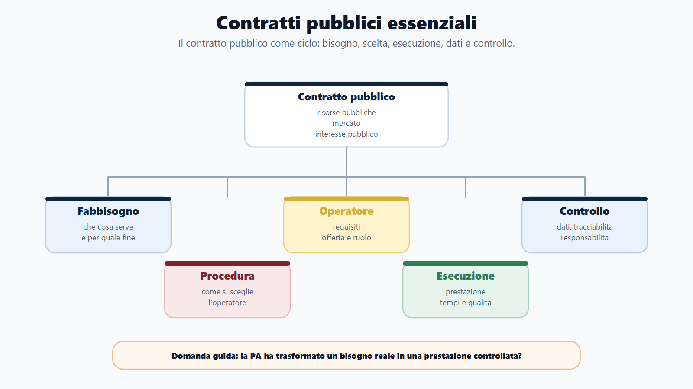
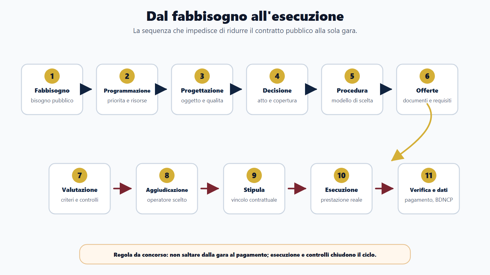
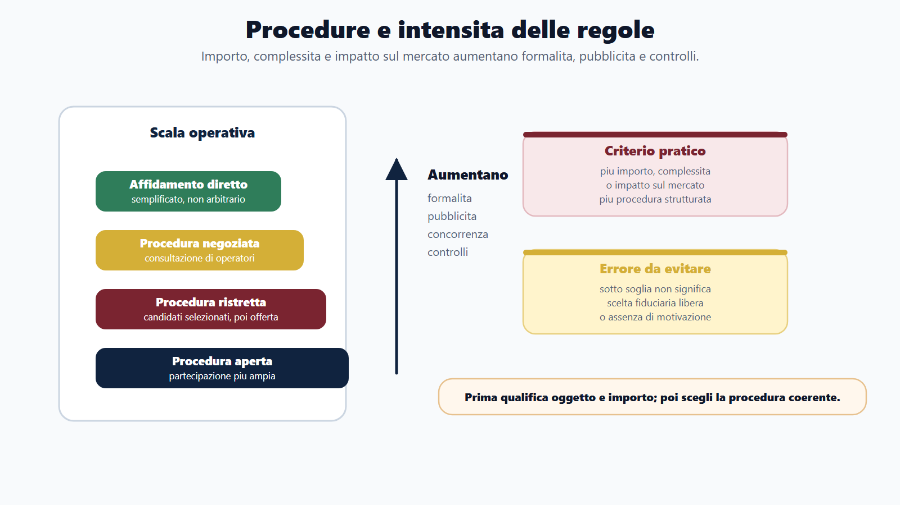
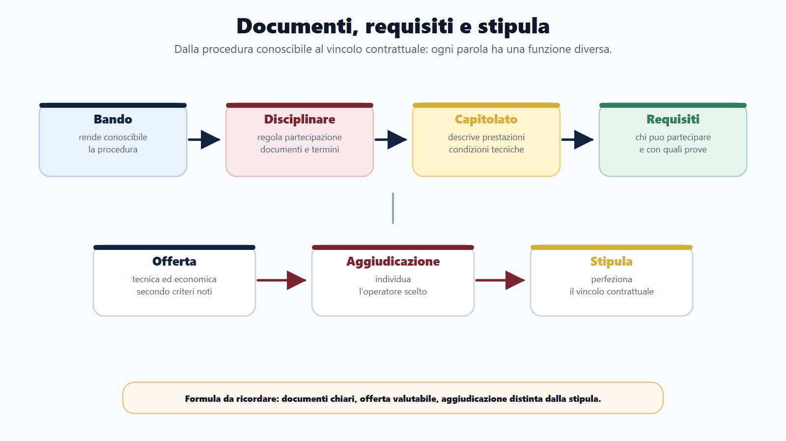
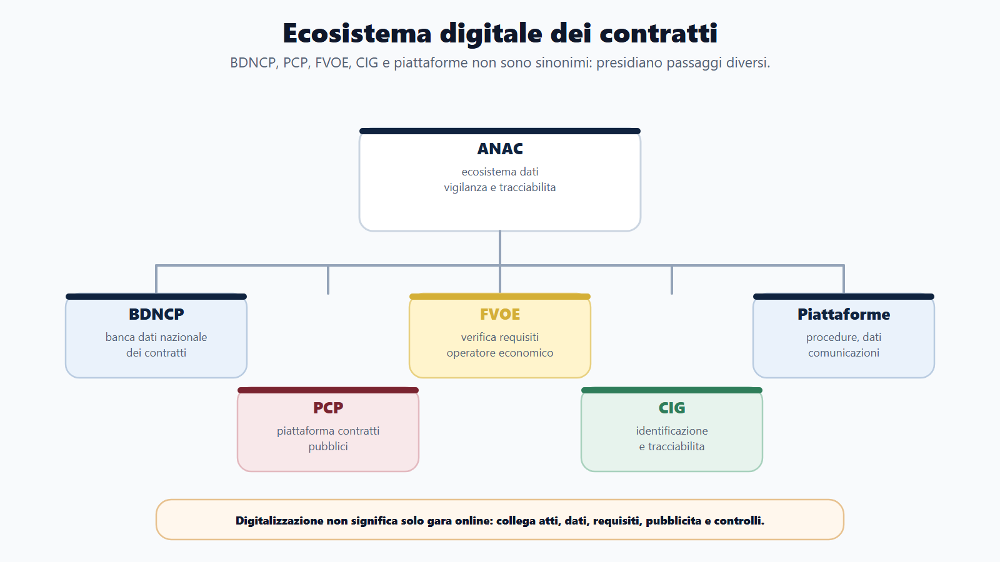
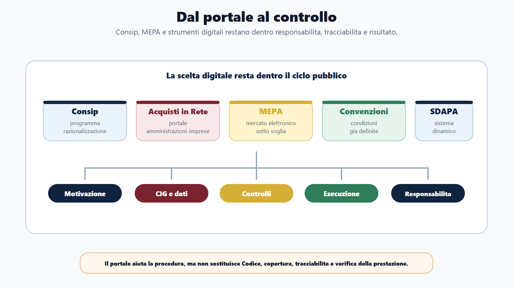

# Capitolo 9 - Contratti pubblici essenziali

## Perché studiare i contratti pubblici

I contratti pubblici sono il punto in cui l'amministrazione trasforma un fabbisogno in una prestazione concreta: un lavoro, un servizio, una fornitura o una concessione. Un Comune che acquista software, un ministero che affida un servizio di vigilanza, una Regione che realizza un'opera, un'università che stipula un contratto di manutenzione non stanno compiendo una semplice operazione commerciale. Stanno usando risorse pubbliche, secondo regole pubbliche, per realizzare un interesse pubblico.

Per questo la materia compare spesso nei concorsi, anche quando il profilo non è specialistico. La commissione non pretende sempre la conoscenza dettagliata di ogni articolo del Codice, ma verifica se il candidato sa riconoscere soggetti, principi, fasi, strumenti, responsabilità e controlli. La domanda tipica non è solo "che cos'è una gara?", ma "come passa la PA dal fabbisogno all'esecuzione corretta del contratto?".

La chiave di studio è quindi il ciclo: programmazione, progettazione, decisione a contrarre, scelta della procedura, pubblicità o invito, offerte, valutazione, aggiudicazione, stipula, esecuzione, verifica, pagamento, trasparenza e controllo. Studiare solo la fase di gara produce risposte incomplete. Un contratto pubblico non finisce quando si individua il vincitore: deve essere eseguito, controllato, pagato e reso tracciabile.

## Obiettivi del capitolo

Al termine del capitolo devi saper:

- spiegare perché la pubblica amministrazione stipula contratti e perché tali contratti non sono equivalenti a normali contratti privati;
- collocare il D.Lgs. 36/2023 e il correttivo D.Lgs. 209/2024 come quadro normativo essenziale;
- richiamare i principi del risultato, della fiducia e dell'accesso al mercato, collegandoli a legalità, concorrenza, trasparenza, imparzialità e buon andamento;
- distinguere stazione appaltante, ente concedente, operatore economico, RUP, centrale di committenza e soggetto aggregatore;
- descrivere il ciclo del contratto pubblico dal fabbisogno all'esecuzione;
- distinguere affidamento diretto, procedura aperta, procedura ristretta e procedura negoziata in forma essenziale;
- riconoscere bando, disciplinare, capitolato, requisiti, offerte, criteri di aggiudicazione, aggiudicazione e stipula;
- spiegare la differenza introduttiva tra appalto, concessione e affidamento;
- comprendere il ruolo di programmazione, qualificazione delle stazioni appaltanti, controlli e responsabilità;
- collegare contratti pubblici, digitalizzazione, BDNCP, FVOE, PCP, pubblicità legale e piattaforme digitali;
- distinguere Consip, Acquisti in Rete, MEPA, convenzioni, accordi quadro e SDAPA;
- richiamare il ruolo di ANAC, CIG, tracciabilità, trasparenza e anticorruzione senza duplicare il Capitolo 7;
- risolvere mini-casi da concorso su acquisti, affidamenti, gare e controlli.

## Come usare il Metodo BANDO

| Fase | Come usare questo capitolo |
|---|---|
| **Bando** | Cerca voci come contratti pubblici, appalti, concessioni, Codice dei contratti, RUP, MEPA, Consip, ANAC, affidamenti, gare, CIG, digitalizzazione. |
| **Aree** | Collega la materia a diritto amministrativo, contabilità pubblica, trasparenza, anticorruzione, PA digitale, enti locali e responsabilità. |
| **Nuclei** | Studia prima soggetti e ciclo; poi principi, procedure, documenti, esecuzione, MEPA/Consip, digitalizzazione e controlli. |
| **Diario** | Registra gli errori: confondere appalto e concessione, aggiudicazione e stipula, RUP e dirigente, MEPA e Consip, BDNCP e FVOE. |
| **Output** | Produci uno schema dal fabbisogno all'esecuzione, una tabella delle procedure, una risposta orale sul RUP e un caso guidato su acquisto di servizio informatico. |

## Confini con gli altri capitoli

Questo capitolo deve essere completo sul tema dei contratti, ma non ripetitivo. Alcuni concetti sono già stati trattati altrove e qui vanno richiamati solo quando servono al ciclo contrattuale.

| Tema | Dove compare anche | Qui come va usato |
|---|---|---|
| Procedimento amministrativo | Capitolo 5 | Solo per comprendere atti, responsabilità, motivazione, istruttoria e provvedimenti della fase di affidamento. |
| Trasparenza e anticorruzione | Capitolo 7 | Solo per contratti, pubblicità, BDNCP, ANAC, CIG, rischio corruttivo e obblighi specifici. |
| Contabilità pubblica | Capitolo 8 | Solo per copertura, impegno, fattura, liquidazione, pagamento, tracciabilità e controlli contabili. |
| PA digitale | Capitolo 10 | Solo per piattaforme di approvvigionamento, dati, interoperabilità, FVOE, BDNCP e gestione digitale del ciclo di vita. |
| Contenzioso | Moduli specialistici | Nel libro base basta sapere che esistono rimedi e giudice amministrativo; non serve sviluppare il processo appalti. |

La domanda guida è: "Questo elemento serve a capire come la PA compra, affida, controlla ed esegue?". Se sì, appartiene a questo capitolo. Se invece riguarda il dettaglio specialistico di soglie, contenzioso, PNRR avanzato o project management, va lasciato ai moduli.

## Quadro essenziale

### 1. Perché la PA stipula contratti

La pubblica amministrazione non produce sempre direttamente tutto ciò che serve all'interesse pubblico. Per costruire una scuola, acquistare computer, gestire un servizio di pulizia, manutenere un software o affidare la gestione di un servizio, può rivolgersi al mercato.

Il contratto pubblico è quindi uno strumento di azione amministrativa. Non è solo un accordo economico: è il risultato di una sequenza regolata, perché l'amministrazione usa risorse pubbliche e deve rispettare legalità, concorrenza, trasparenza, imparzialità, buon andamento e controllo.

Nei concorsi è utile distinguere tre livelli:

| Livello | Domanda da porsi |
|---|---|
| Fabbisogno | Che cosa serve all'amministrazione e per quale interesse pubblico? |
| Affidamento | Con quale procedura si sceglie l'operatore economico? |
| Esecuzione | La prestazione è stata svolta correttamente, nei tempi, nei costi e con la qualità richiesta? |

Una risposta corretta non riduce l'appalto alla "gara". La gara è una fase possibile e importante, ma il contratto pubblico comprende anche programmazione, documenti, controlli, esecuzione e tracciabilità.

### 2. Fonti essenziali: Codice 2023 e correttivo 2024

La fonte centrale è il Codice dei contratti pubblici, contenuto nel D.Lgs. 36/2023. Il D.Lgs. 209/2024 è il correttivo che aggiorna il quadro e deve essere considerato per una trattazione non superata.

Per un manuale da concorso non serve analizzare articolo per articolo. Serve invece comprendere la logica del sistema:

- principi generali;
- soggetti del ciclo contrattuale;
- programmazione e progettazione;
- procedure di affidamento;
- requisiti e selezione degli operatori;
- criteri di aggiudicazione;
- stipula ed esecuzione;
- digitalizzazione del ciclo di vita;
- trasparenza, controlli e responsabilità;
- disciplina di appalti e concessioni.

Gli allegati del Codice hanno rilievo pratico e normativo, ma nel libro base vanno richiamati solo quando servono a chiarire istituti ricorrenti, come RUP, esecuzione, progettazione o soglie. Non devi memorizzare l'intero apparato tecnico: devi saper collocare le parole chiave in una risposta ordinata.

### 3. Principi dei contratti pubblici

Il Codice 2023 mette i principi all'inizio. Questo è importante per i concorsi, perché molte domande chiedono di distinguere il nuovo impianto da una visione puramente formalistica.

I tre principi da fissare subito sono:

| Principio | Significato essenziale | Errore da evitare |
|---|---|---|
| Risultato | La PA deve conseguire l'interesse pubblico attraverso affidamento ed esecuzione corretti, tempestivi e convenienti. | Pensare che consenta di ignorare legalità, concorrenza o trasparenza. |
| Fiducia | L'ordinamento valorizza iniziativa, autonomia e responsabilità di funzionari e operatori. | Confonderla con assenza di controlli o responsabilità. |
| Accesso al mercato | Le procedure devono favorire concorrenza, imparzialità, non discriminazione, pubblicità e proporzionalità. | Ridurlo a generica apertura al mercato senza regole. |

Il principio del risultato non autorizza scorciatoie arbitrarie. Significa orientare le decisioni verso il risultato pubblico, rispettando le regole. La fiducia non elimina responsabilità amministrativa, contabile o disciplinare. L'accesso al mercato non impone sempre la stessa procedura, ma richiede che la scelta dell'operatore sia coerente con concorrenza, proporzionalità e trasparenza.

Accanto a questi principi restano centrali legalità, imparzialità, buon andamento, economicità, efficacia, efficienza, pubblicità, trasparenza, proporzionalità, buona fede e tutela dell'affidamento. Sono parole già viste nel diritto amministrativo, ma nei contratti diventano criteri per scegliere, motivare, controllare e pagare.

### 4. Soggetti: stazione appaltante, ente concedente e operatore economico

La **stazione appaltante** è il soggetto che affida un contratto di appalto. Può essere un'amministrazione o altro soggetto tenuto all'applicazione della disciplina dei contratti pubblici. L'**ente concedente** è il soggetto che affida una concessione.

L'**operatore economico** è il soggetto che offre sul mercato lavori, servizi o forniture. Può essere un'impresa individuale, una società, un raggruppamento, un consorzio o altro soggetto ammesso secondo la disciplina applicabile.

La distinzione è elementare ma spesso decisiva nei quiz:

| Soggetto | Funzione |
|---|---|
| Stazione appaltante | Decide di acquisire lavori, servizi o forniture e gestisce la procedura. |
| Ente concedente | Affida una concessione, trasferendo al concessionario il rischio operativo nei termini rilevanti. |
| Operatore economico | Partecipa alla procedura e, se selezionato, esegue la prestazione. |
| Centrale di committenza | Gestisce procedure o acquisti per altre amministrazioni o in forma aggregata. |
| Soggetto aggregatore | Favorisce aggregazione e razionalizzazione della domanda pubblica. |

Centrali di committenza e soggetti aggregatori servono a professionalizzare gli acquisti, ridurre frammentazione, aumentare competenze e migliorare controllo della spesa. Nei concorsi per enti locali e profili amministrativo-contabili il tema ritorna spesso insieme a Consip, convenzioni e MEPA.

### 5. Il RUP: responsabile unico del progetto

Nel Codice 2023 il RUP è il **responsabile unico del progetto**. Questa formula va usata con precisione. Non è un semplice "responsabile del procedimento" in senso generico e non va confuso automaticamente con il dirigente che firma l'atto finale.

Il RUP presidia il ciclo del contratto secondo la disciplina applicabile. Il suo ruolo collega programmazione, affidamento ed esecuzione. In termini concorsuali, il RUP è la figura che consente di vedere il contratto come progetto amministrativo complessivo.

Funzioni da ricordare in modo essenziale:

- raccorda esigenze dell'amministrazione e fasi operative;
- cura o coordina attività istruttorie e procedurali;
- verifica che la procedura proceda in modo coerente con tempi, atti e regole;
- interagisce con altri soggetti tecnici o amministrativi;
- assume rilievo anche nella fase di esecuzione, nei limiti del ruolo previsto;
- lavora in collegamento con direttore dei lavori, direttore dell'esecuzione, uffici finanziari e organi competenti.

**Box RUP:** in una risposta orale non dire soltanto "è il responsabile". Spiega che è il punto di coordinamento del progetto contrattuale, dal bisogno alla prestazione, e che non sostituisce tutti gli altri soggetti della procedura.

### 6. Programmazione e progettazione

La programmazione serve a evitare acquisti improvvisati, frazionamenti non corretti, spese non coerenti con il fabbisogno e procedure avviate senza copertura organizzativa o finanziaria.

Nel ciclo dei contratti pubblici, programmare significa chiedersi:

- quale bisogno pubblico deve essere soddisfatto;
- se la prestazione è necessaria, proporzionata e sostenibile;
- se esistono risorse finanziarie;
- quali tempi sono realistici;
- quale procedura è adeguata;
- se l'amministrazione ha competenze o deve ricorrere a strumenti aggregati;
- quali rischi di esecuzione, controllo e trasparenza devono essere presidiati.

La progettazione, in senso ampio, traduce il bisogno in contenuto tecnico, prestazionale ed economico. Nei lavori pubblici assume un rilievo strutturato; nei servizi e nelle forniture significa comunque definire oggetto, qualità attesa, tempi, importi, condizioni, obblighi dell'operatore e modalità di verifica.

Un capitolato scritto male genera problemi in gara e in esecuzione. Se la prestazione non è definita con sufficiente chiarezza, l'amministrazione rischia offerte non comparabili, contestazioni, varianti, ritardi, costi aggiuntivi o servizi non adeguati.

### 7. Schema dal fabbisogno all'esecuzione

Per studiare i contratti pubblici usa sempre questo schema operativo:

| Fase | Che cosa accade | Parole chiave |
|---|---|---|
| Fabbisogno | L'amministrazione individua una necessità pubblica. | Interesse pubblico, bisogno, utilità. |
| Programmazione | L'acquisto o l'opera viene collocato nella pianificazione. | Programmi, risorse, priorità. |
| Progettazione | La prestazione viene definita tecnicamente ed economicamente. | Oggetto, capitolato, importo, qualità. |
| Decisione a contrarre | L'amministrazione formalizza l'intenzione di affidare. | Atto, motivazione, procedura, copertura. |
| Scelta procedura | Si individua il modello di affidamento. | Aperta, ristretta, negoziata, affidamento diretto. |
| Pubblicità o invito | Si rende conoscibile la procedura o si invitano operatori. | Bando, avviso, invito, piattaforma. |
| Offerte | Gli operatori presentano la proposta. | Requisiti, documenti, offerta tecnica/economica. |
| Valutazione | L'amministrazione verifica requisiti e offerte. | Commissione, criteri, soccorso istruttorio. |
| Aggiudicazione | Viene individuato l'operatore prescelto. | Esito, controlli, efficacia. |
| Stipula | Si perfeziona il vincolo contrattuale. | Contratto, obblighi, termini. |
| Esecuzione | L'operatore realizza la prestazione. | Direzione, SAL, verifica, penali. |
| Verifica e pagamento | Si controlla la prestazione e si paga. | Collaudo, conformità, fattura, liquidazione. |
| Trasparenza e archiviazione | Dati e atti sono tracciati e controllabili. | BDNCP, CIG, Amministrazione trasparente. |

Questa tabella è il cuore del capitolo. Nei quiz, quando non ricordi un dettaglio, torna alla sequenza: bisogno, scelta, contratto, esecuzione, controllo.

### 8. Affidamento diretto e procedure di gara

L'affidamento è il procedimento con cui la stazione appaltante sceglie l'operatore economico. Non tutte le procedure hanno la stessa complessità. La disciplina varia anche in base a importo, oggetto, soglia e presupposti normativi. Nel libro base non conviene memorizzare numeri destinati a cambiare; conviene capire la funzione delle procedure.

| Procedura | Significato essenziale |
|---|---|
| Affidamento diretto | Modalità semplificata ammessa nei casi e limiti previsti; non significa scelta arbitraria. |
| Procedura aperta | Ogni operatore interessato può presentare offerta. |
| Procedura ristretta | Prima si selezionano i candidati, poi gli invitati presentano offerta. |
| Procedura negoziata | L'amministrazione consulta e negozia con operatori selezionati nei presupposti previsti. |

L'affidamento diretto è una delle fonti principali di errori. Non è "libertà assoluta" dell'ufficio. Anche quando la procedura è semplificata, restano principi, motivazione, tracciabilità, rotazione quando rilevante, controlli, corretta individuazione del fabbisogno e copertura finanziaria.

La procedura aperta è più competitiva per struttura, perché consente ampia partecipazione. La procedura ristretta distingue una fase di selezione dei candidati e una fase di offerta. La procedura negoziata richiede presupposti e modalità specifiche, e non va descritta come trattativa informale priva di regole.

### 9. Soglie e scelta della procedura

Le soglie distinguono regimi giuridici e livelli di formalità. In modo essenziale, occorre sapere che possono esistere:

- affidamenti sotto soglia, con regole semplificate;
- procedure sopra soglia UE, con maggiore formalizzazione e obblighi di pubblicità;
- discipline particolari per lavori, servizi, forniture e concessioni;
- obblighi specifici collegati a importi, oggetto e qualificazione della stazione appaltante.

Nel manuale base è preferibile non costruire lo studio su valori numerici, perché le soglie possono essere aggiornate. La regola da concorso è questa: più cresce importo, complessità o impatto sul mercato, più aumentano formalità, concorrenza, pubblicità e controlli.

Se una domanda chiede il valore puntuale di una soglia, occorre verificare la disciplina vigente nel momento del concorso. Se invece chiede la logica, la risposta è: le soglie servono a stabilire quale regime procedurale si applica e quale intensità di regole deve essere rispettata.

### 10. Documenti di gara: bando, disciplinare e capitolato

Tre documenti ricorrono spesso nei quiz:

| Documento | Funzione |
|---|---|
| Bando | Rende conoscibile la procedura e i suoi elementi essenziali. |
| Disciplinare | Regola modalità di partecipazione, documentazione, termini, criteri e svolgimento della gara. |
| Capitolato | Descrive prestazioni, condizioni tecniche, obblighi contrattuali e modalità esecutive. |

Confonderli produce risposte deboli. Il bando comunica l'esistenza e le coordinate della gara; il disciplinare spiega come partecipare; il capitolato dice che cosa deve essere eseguito e a quali condizioni.

Accanto a questi documenti possono comparire schema di contratto, modelli dichiarativi, specifiche tecniche, computi, elaborati progettuali, DGUE o altra documentazione secondo la procedura. Per il libro base il punto essenziale è che i documenti devono rendere la gara comprensibile, controllabile e coerente con l'oggetto da affidare.

### 11. Requisiti, offerte e soccorso istruttorio

Per partecipare a una procedura, l'operatore economico deve possedere requisiti. In forma essenziale, i requisiti possono riguardare:

- ordine generale, cioè affidabilità e assenza di cause ostative rilevanti;
- idoneita professionale;
- capacità economico-finanziaria;
- capacità tecnico-professionale.

L'offerta può contenere una componente tecnica e una economica, secondo il criterio di aggiudicazione. La parte tecnica descrive qualità, soluzioni, organizzazione, tempi o modalità di esecuzione. La parte economica riguarda prezzo, ribasso o condizioni economiche.

Il **soccorso istruttorio** consente, nei limiti previsti, di sanare o integrare elementi documentali o dichiarativi. Non serve a modificare l'offerta sostanziale né a rimediare a qualunque carenza. Nei quiz, se una risposta dice che il soccorso istruttorio permette di riscrivere l'offerta, normalmente è errata.

La logica è bilanciare due esigenze: evitare esclusioni inutilmente formalistiche e proteggere parità di trattamento, concorrenza e serietà dell'offerta.

### 12. Criteri di aggiudicazione, aggiudicazione e stipula

I criteri di aggiudicazione più ricorrenti nei concorsi sono:

| Criterio | Logica |
|---|---|
| Prezzo più basso | Conta principalmente il prezzo, nei casi in cui la prestazione è definita e comparabile. |
| Offerta economicamente più vantaggiosa | Si valuta il miglior rapporto qualità/prezzo o elementi qualitativi ed economici secondo criteri prestabiliti. |

L'offerta economicamente più vantaggiosa non significa scegliere "quella che piace di più". I criteri devono essere definiti, conoscibili e applicati in modo coerente.

L'**aggiudicazione** individua l'operatore prescelto. La **stipula** perfeziona il contratto secondo le regole applicabili. Aggiudicazione e stipula non sono sinonimi. La prima chiude la fase selettiva; la seconda crea il vincolo contrattuale nei termini previsti.

Formula da ricordare: prima si sceglie l'operatore, poi si stipula il contratto, poi si controlla l'esecuzione. Saltare mentalmente dalla gara al pagamento è un errore.

### 13. Appalto, concessione e affidamento

L'**appalto** ha per oggetto lavori, servizi o forniture, remunerati secondo il contratto dalla stazione appaltante. Esempi: manutenzione di edifici comunali, fornitura di computer, servizio di pulizia degli uffici.

La **concessione** riguarda lavori o servizi nei quali assume rilievo il trasferimento del rischio operativo al concessionario. Il concessionario può essere remunerato attraverso la gestione dell'opera o del servizio, eventualmente insieme a un prezzo, secondo la disciplina applicabile.

L'**affidamento** è invece il processo con cui l'amministrazione individua l'operatore. Non è una categoria identica ad appalto o concessione: indica la scelta del contraente.

| Termine | Che cosa indica |
|---|---|
| Appalto | Tipo di contratto per lavori, servizi o forniture. |
| Concessione | Contratto in cui rileva la gestione e il rischio operativo del concessionario. |
| Affidamento | Procedimento o esito della scelta dell'operatore. |

La trappola più frequente è usare "appalto" per qualunque contratto pubblico. In molti casi è una semplificazione tollerabile nel linguaggio comune, ma in una risposta tecnica devi distinguere appalto e concessione.

### 14. Esecuzione, subappalto, verifica e collaudo

L'esecuzione è la fase in cui il contratto produce la prestazione attesa. È qui che il risultato diventa reale: un servizio viene svolto, un bene viene consegnato, un lavoro viene realizzato.

Gli elementi da conoscere sono:

- avvio dell'esecuzione secondo contratto;
- controllo di tempi e qualità;
- direzione dei lavori nei lavori pubblici;
- direzione dell'esecuzione nei servizi e forniture quando prevista;
- gestione di eventuali variazioni o criticita;
- verifica di conformità o collaudo;
- liquidazione e pagamento dopo i controlli necessari;
- eventuali penali o rimedi se la prestazione non è corretta.

Il **subappalto** riguarda l'esecuzione da parte di terzi di prestazioni comprese nel contratto, nei limiti e con le condizioni previste. Non significa cessione libera e incontrollata dell'appalto. L'amministrazione deve conoscere e controllare i soggetti coinvolti, anche per ragioni di legalità, sicurezza, tracciabilità e responsabilità.

Nei concorsi, il punto è non fermarsi all'aggiudicazione. La fase esecutiva può generare danni, ritardi, pagamenti non dovuti, contestazioni, responsabilità contabile e problemi di qualità del servizio pubblico.

### 15. Digitalizzazione: BDNCP, PCP, FVOE e piattaforme

La digitalizzazione dei contratti pubblici non è un accessorio informatico. Dal 2024 è parte ordinaria del ciclo di vita dei contratti. Per i concorsi devi conoscere i concetti, non i passaggi operativi minuto per minuto.

| Strumento | Funzione essenziale |
|---|---|
| BDNCP | Banca dati nazionale dei contratti pubblici gestita da ANAC. |
| PCP | Piattaforma Contratti Pubblici, parte dell'ecosistema ANAC per la gestione digitale nei casi previsti. |
| FVOE | Fascicolo virtuale dell'operatore economico, rilevante per la verifica dei requisiti. |
| Piattaforme digitali | Strumenti di approvvigionamento che gestiscono procedure, dati, comunicazioni e interoperabilità. |

La BDNCP riguarda dati e informazioni sui contratti. Il FVOE riguarda la verifica dei requisiti dell'operatore economico. Confonderli è un errore tipico.

Digitalizzazione significa:

- tracciabilità delle fasi;
- interoperabilità tra sistemi;
- pubblicità legale;
- comunicazione dati;
- verifica dei requisiti;
- trasparenza;
- monitoraggio e controllo.

Non significa semplicemente "fare la gara online". La piattaforma digitale deve inserirsi nel ciclo giuridico e amministrativo del contratto.

### 16. Consip, Acquisti in Rete, MEPA, convenzioni e accordi quadro

Consip è il soggetto che opera nell'ambito del programma di razionalizzazione degli acquisti della pubblica amministrazione. Acquisti in Rete è il portale attraverso cui amministrazioni e imprese accedono a strumenti di acquisto e negoziazione. Il MEPA è uno degli strumenti, non un sinonimo di Consip.

| Strumento | Significato essenziale |
|---|---|
| Convenzioni | Iniziative centralizzate con condizioni già definite per l'acquisto di beni o servizi. |
| Accordi quadro | Definiscono condizioni generali per successivi ordini o appalti specifici. |
| MEPA | Mercato elettronico della pubblica amministrazione, usato per acquisti sotto soglia secondo le regole applicabili. |
| SDAPA | Sistema dinamico di acquisizione per procedure digitali relative a categorie abilitate. |
| Ordine diretto | Acquisto su condizioni già disponibili nello strumento. |
| Richiesta di offerta | Confronto tra operatori abilitati, secondo regole del portale e della procedura. |
| Trattativa diretta | Negoziazione con uno o più operatori nei casi consentiti. |

Il portale non sostituisce il Codice. Anche quando l'acquisto avviene su MEPA o tramite strumenti Consip, restano fabbisogno, competenza, copertura, motivazione, CIG quando dovuto, tracciabilità, controlli e corretta esecuzione.

Nei quiz devi distinguere:

- **Consip**: soggetto/struttura del programma di razionalizzazione;
- **Acquisti in Rete**: portale;
- **MEPA**: mercato elettronico;
- **convenzione**: condizioni già definite;
- **accordo quadro**: cornice per successivi affidamenti;
- **SDAPA**: sistema dinamico per acquisizioni digitali.

### 17. ANAC, trasparenza, anticorruzione e tracciabilità

ANAC ha un ruolo rilevante nei contratti pubblici: vigilanza, digitalizzazione, BDNCP, trasparenza, tracciabilità, atti tipo e supporto al sistema. Non va descritta solo come autorità anticorruzione in senso generale.

Il **CIG** identifica la procedura o il contratto ai fini di tracciabilità e monitoraggio. Nel Capitolo 8 lo hai visto dal punto di vista contabile; qui lo devi collegare al ciclo contrattuale e alla legalità dell'affidamento.

La tracciabilità dei flussi finanziari consente di seguire il percorso delle risorse pubbliche collegate ai contratti. Serve a prevenire opacità, infiltrazioni, pagamenti non controllabili e uso distorto del denaro pubblico.

La trasparenza nei contratti pubblici non consiste nel pubblicare tutto senza filtro. Significa rendere controllabili dati, atti e informazioni nei modi previsti, coordinando BDNCP, pubblicità legale, sezione "Amministrazione trasparente" e protezione dei dati personali.

Il rischio corruttivo nei contratti è alto perché la PA sceglie operatori, assegna risorse, valuta offerte, controlla prestazioni e paga. Per questo servono programmazione, rotazione quando applicabile, tracciabilità, motivazione, controlli, separazione di funzioni e gestione dei conflitti di interessi.

### 18. Controlli e responsabilità

I contratti pubblici sono attraversati da controlli interni ed esterni. I controlli possono riguardare:

- legittimita degli atti;
- regolarità amministrativa e contabile;
- coerenza con programmazione e copertura finanziaria;
- correttezza della procedura;
- verifica dei requisiti;
- qualità dell'esecuzione;
- rispetto di tempi, costi e prestazioni;
- tracciabilità dei pagamenti;
- trasparenza e obblighi informativi;
- eventuale danno erariale.

La responsabilità può essere amministrativa, contabile, disciplinare, civile o penale, secondo i casi. In questo capitolo interessa soprattutto il nesso tra cattiva gestione del contratto e danno pubblico: affidamento non motivato, prestazione non controllata, pagamento non dovuto, mancato collaudo, alterazione della concorrenza o omissione di controlli possono produrre conseguenze rilevanti.

Il candidato deve evitare due estremi: pensare che ogni irregolarità sia automaticamente reato, oppure pensare che la procedura sia solo forma senza effetti. Nei contratti pubblici forma e sostanza sono legate: le regole servono a proteggere concorrenza, risorse e risultato.

## Schema operativo di risposta

Quando una traccia riguarda un acquisto, un affidamento o una gara, usa questa sequenza:

1. **Individua il bisogno pubblico:** che cosa serve all'amministrazione e per quale finalità?
2. **Qualifica l'oggetto:** lavori, servizi, forniture o concessione?
3. **Individua i soggetti:** stazione appaltante, operatore economico, RUP, eventuale centrale di committenza.
4. **Verifica programmazione e copertura:** l'acquisto è previsto, sostenibile e autorizzato?
5. **Scegli la procedura:** affidamento diretto, aperta, ristretta, negoziata o altro istituto applicabile.
6. **Richiama i principi:** risultato, fiducia, accesso al mercato, concorrenza, trasparenza, proporzionalità.
7. **Considera documenti e requisiti:** bando, disciplinare, capitolato, requisiti, offerta, soccorso istruttorio.
8. **Distingui aggiudicazione e stipula:** prima scelta dell'operatore, poi perfezionamento del contratto.
9. **Controlla l'esecuzione:** qualità, tempi, collaudo o verifica di conformità.
10. **Chiudi con tracciabilità e trasparenza:** CIG, BDNCP, FVOE, obblighi pubblicativi, controlli e pagamento.

Questa sequenza funziona nei quiz, nell'orale e nei casi pratici. Evita risposte frammentate e dimostra che conosci il ciclo.

## Da sapere in 5 righe

I contratti pubblici servono alla PA per acquisire lavori, servizi e forniture o affidare concessioni nel rispetto dell'interesse pubblico. Il quadro essenziale è il D.Lgs. 36/2023, aggiornato dal D.Lgs. 209/2024, con principi di risultato, fiducia e accesso al mercato. Il ciclo va dal fabbisogno alla programmazione, procedura, aggiudicazione, stipula, esecuzione, verifica, pagamento e controllo. RUP, stazione appaltante, operatore economico, ANAC, BDNCP, FVOE, CIG, MEPA e Consip sono parole chiave da concorso. Non basta conoscere la gara: bisogna capire esecuzione, trasparenza, tracciabilità e responsabilità.

## Caso guidato

Un Comune deve acquistare un servizio informatico per la gestione delle prenotazioni online degli uffici. L'ufficio propone di "scegliere direttamente un fornitore conosciuto, perché è rapido".

Una risposta da concorso non deve dire subito si o no. Deve ricostruire il percorso.

1. **Fabbisogno:** il Comune deve motivare l'esigenza del servizio e collegarla a un interesse pubblico, per esempio migliorare accesso ai servizi e organizzazione degli sportelli.
2. **Oggetto:** si tratta di un servizio, eventualmente con componenti di fornitura o manutenzione.
3. **Programmazione e copertura:** occorre verificare se l'acquisto è programmato, se esiste stanziamento e se l'atto può impegnare spesa.
4. **RUP:** va individuato il responsabile unico del progetto o confermato il soggetto competente.
5. **Strumento di acquisto:** l'ente valuta se usare MEPA, convenzioni, accordi quadro o altra procedura coerente con importo e oggetto.
6. **Procedura:** se ricorrono i presupposti per affidamento diretto, la scelta resta motivata e tracciabile; se non ricorrono, occorre procedura competitiva adeguata.
7. **Principi:** anche la semplificazione deve rispettare risultato, concorrenza, trasparenza, proporzionalità e accesso al mercato.
8. **Documenti:** occorre descrivere prestazioni, livelli di servizio, sicurezza, tempi, assistenza, costi e condizioni contrattuali.
9. **CIG e tracciabilità:** la procedura deve essere identificabile e i flussi finanziari tracciabili secondo disciplina applicabile.
10. **Esecuzione:** il servizio va verificato prima della liquidazione e del pagamento.

Conclusione: rapidità e risultato sono importanti, ma non autorizzano scelta arbitraria. Il Comune può usare strumenti semplificati solo nei casi consentiti, mantenendo motivazione, tracciabilità, controllo ed esecuzione corretta.

## Domanda da commissario

**Domanda:** Spieghi il ruolo del RUP nel ciclo dei contratti pubblici.

**Risposta modello:** Nel Codice dei contratti pubblici il RUP è il responsabile unico del progetto. Non è un semplice firmatario, ma una figura di coordinamento del ciclo contrattuale, dalla programmazione e progettazione fino all'affidamento e, nei limiti previsti, all'esecuzione. Il RUP presidia il corretto svolgimento delle fasi, raccorda soggetti tecnici e amministrativi, contribuisce alla tracciabilità delle decisioni e opera nel rispetto dei principi di risultato, fiducia, accesso al mercato, trasparenza e legalità.

## Domanda-trappola

**Domanda:** L'affidamento diretto consente alla PA di scegliere liberamente qualsiasi operatore senza motivazione?

**Risposta:** No. L'affidamento diretto è una modalità semplificata ammessa nei casi e nei limiti previsti, ma non elimina principi, competenza, motivazione, tracciabilità, controlli e rispetto del risultato pubblico. Non è una scelta arbitraria né una zona fuori dal Codice.

## Errori tipici

- Studiare i contratti pubblici come se fossero solo "gara".
- Confondere stazione appaltante e operatore economico.
- Dire "responsabile unico del procedimento" senza aggiornare la formula a responsabile unico del progetto.
- Presentare il principio del risultato come autorizzazione a ignorare concorrenza e trasparenza.
- Confondere affidamento diretto con scelta fiduciaria priva di regole.
- Confondere bando, disciplinare e capitolato.
- Usare aggiudicazione e stipula come sinonimi.
- Confondere appalto e concessione, dimenticando il rischio operativo della concessione.
- Confondere Consip, Acquisti in Rete e MEPA.
- Confondere BDNCP e FVOE.
- Parlare di tracciabilità solo come tema contabile, senza collegarla a legalità e anticorruzione.
- Dimenticare la fase di esecuzione, collaudo o verifica di conformità.

## Mini-esercizio

Classifica le seguenti affermazioni.

| Affermazione | Correzione |
|---|---|
| Il contratto pubblico inizia e finisce con la gara. | Falso: comprende programmazione, affidamento, stipula, esecuzione, verifica, pagamento e controllo. |
| Il RUP è il responsabile unico del progetto. | Vero, nel lessico del Codice 2023. |
| Il capitolato descrive le modalità di partecipazione alla gara. | Falso: questa è funzione del disciplinare; il capitolato descrive prestazioni e condizioni tecniche/contrattuali. |
| L'aggiudicazione coincide sempre con la stipula. | Falso: l'aggiudicazione individua l'operatore; la stipula perfeziona il contratto. |
| Il MEPA è uno strumento di acquisto elettronico, non un sinonimo di Consip. | Vero. |
| Il FVOE serve alla verifica dei requisiti dell'operatore economico. | Vero. |
| La concessione si distingue anche per il rilievo del rischio operativo. | Vero. |
| L'affidamento diretto è privo di controlli. | Falso: è semplificato, ma resta soggetto a principi, tracciabilità e controlli. |

## Glossario minimo da ripasso

| Termine | Significato essenziale |
|---|---|
| Contratto pubblico | Strumento con cui la PA acquisisce lavori, servizi, forniture o affida concessioni. |
| Codice dei contratti pubblici | D.Lgs. 36/2023, aggiornato dal D.Lgs. 209/2024. |
| Stazione appaltante | Soggetto che affida un contratto di appalto. |
| Ente concedente | Soggetto che affida una concessione. |
| Operatore economico | Soggetto che offre lavori, servizi o forniture sul mercato. |
| RUP | Responsabile unico del progetto. |
| Affidamento diretto | Modalità semplificata di scelta dell'operatore nei casi consentiti. |
| Procedura aperta | Procedura in cui ogni operatore interessato può presentare offerta. |
| Procedura ristretta | Procedura con selezione dei candidati e successivo invito. |
| Procedura negoziata | Procedura con confronto con operatori selezionati nei presupposti previsti. |
| Bando | Atto che rende conoscibile la procedura. |
| Disciplinare | Documento che regola partecipazione e svolgimento della gara. |
| Capitolato | Documento che descrive prestazioni e condizioni tecniche/contrattuali. |
| Aggiudicazione | Individuazione dell'operatore prescelto. |
| Stipula | Perfezionamento del vincolo contrattuale. |
| Appalto | Contratto per lavori, servizi o forniture. |
| Concessione | Contratto in cui rileva il trasferimento del rischio operativo al concessionario. |
| BDNCP | Banca dati nazionale dei contratti pubblici. |
| FVOE | Fascicolo virtuale dell'operatore economico. |
| CIG | Codice identificativo collegato a gara/procedura/contratto. |
| MEPA | Mercato elettronico della pubblica amministrazione. |
| Consip | Soggetto del programma di razionalizzazione degli acquisti della PA. |

## Checkpoint finale

Prima di chiudere lo studio del capitolo, devi saper rispondere senza appunti:

- perché la PA stipula contratti pubblici?
- Qual è la fonte centrale dei contratti pubblici oggi?
- Che cosa significano principio del risultato, fiducia e accesso al mercato?
- Chi sono stazione appaltante, ente concedente e operatore economico?
- Che cosa fa il RUP?
- Quali sono le fasi dal fabbisogno all'esecuzione?
- Che differenza c'è tra affidamento diretto, procedura aperta, ristretta e negoziata?
- perché l'affidamento diretto non è scelta arbitraria?
- Che differenza c'è tra bando, disciplinare e capitolato?
- Che cosa sono requisiti, offerta tecnica, offerta economica e soccorso istruttorio?
- Che differenza c'è tra aggiudicazione e stipula?
- Che differenza c'è tra appalto e concessione?
- perché l'esecuzione è parte essenziale del contratto pubblico?
- Che cosa sono BDNCP, PCP e FVOE?
- Che differenza c'è tra Consip, Acquisti in Rete e MEPA?
- A cosa servono CIG e tracciabilità?
- Qual è il ruolo di ANAC nei contratti pubblici?
- Quali errori generano responsabilità o controlli?
