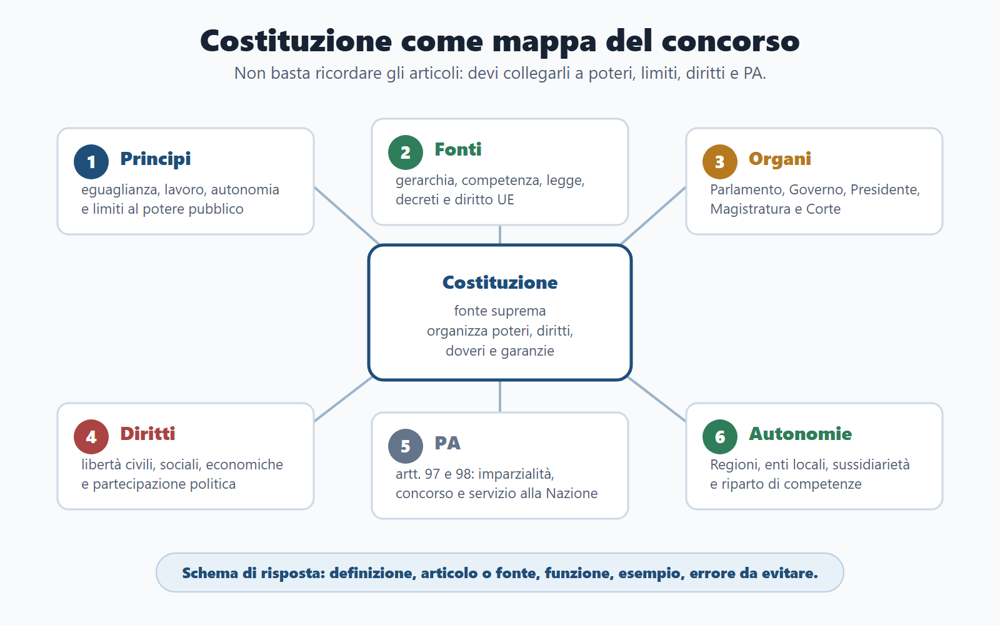
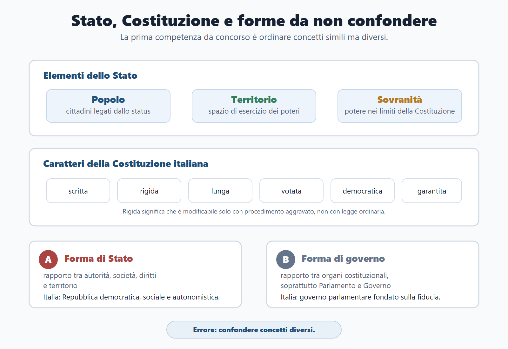
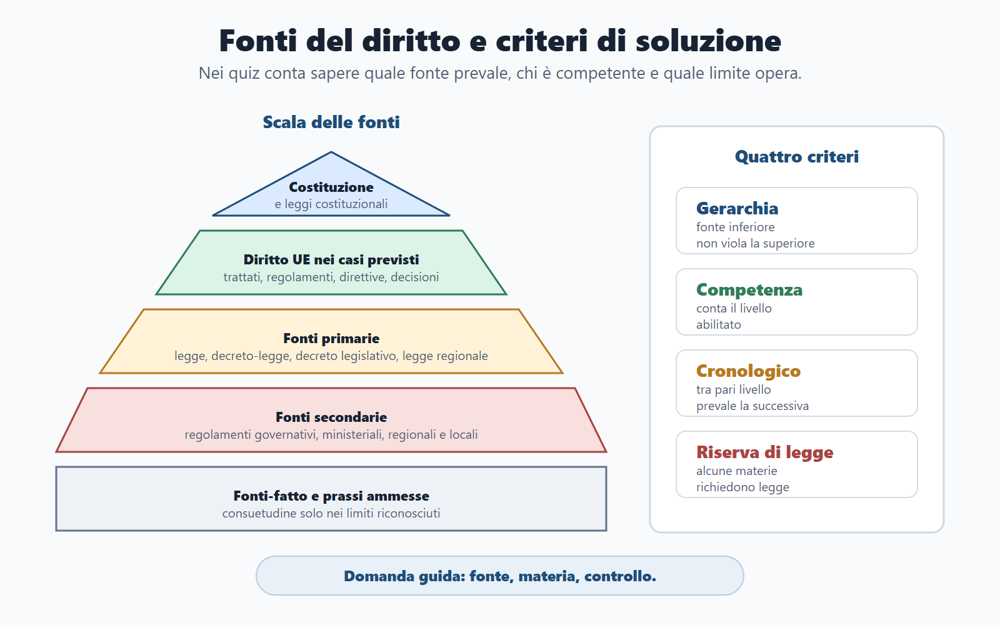
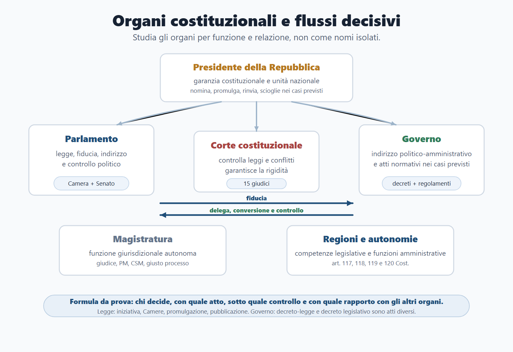
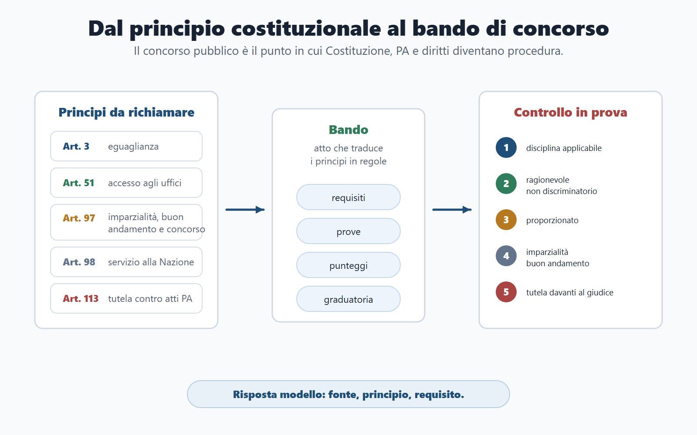

# Capitolo 4 - Costituzione e ordinamento dello Stato

## Perché studiare l'ordinamento costituzionale

Il diritto costituzionale è la grammatica comune dei concorsi pubblici. Non serve soltanto a ricordare articoli o organi. Aiuta a capire da dove nasce il potere pubblico, quali limiti incontra, come si producono le norme e come vengono garantiti i diritti. Spiega inoltre perché la pubblica amministrazione deve agire con legalità, imparzialità e buon andamento.

Per il candidato, la Costituzione è una mappa di collegamento. Una domanda può sembrare soltanto amministrativa, ma avere una base costituzionale. Accade per l'accesso agli impieghi pubblici, l'eguaglianza, la responsabilità dei funzionari, il riparto di competenze tra Stato e Regioni, le libertà, i poteri di Parlamento e Governo e la tutela contro gli atti della PA.

L'obiettivo non è trasformare questo capitolo in un compendio universitario. L'obiettivo è costruire una base solida, ordinata e spendibile in quiz, orale e risposte sintetiche.

## Obiettivi del capitolo

Al termine del capitolo devi saper:

- distinguere Stato, Costituzione e ordinamento costituzionale;
- spiegare popolo, territorio, sovranità e cittadinanza;
- riconoscere forme di Stato, forme di governo e separazione dei poteri;
- orientarti tra principi fondamentali, diritti, doveri e rapporti sociali;
- collocare correttamente Parlamento, Governo, Presidente della Repubblica, Magistratura, Corte costituzionale e organi ausiliari;
- descrivere fonti del diritto, procedimento legislativo, decreti-legge e decreti legislativi;
- collegare art. 97 e art. 98 Cost. alla pubblica amministrazione e al pubblico impiego;
- spiegare Regioni, autonomie locali e riparto di competenze;
- comprendere revisione costituzionale, Unione europea, CEDU e tutela multilivello dei diritti;
- costruire risposte da concorso con schema: definizione, articolo o fonte, funzione, esempio, errore da evitare.

## Come usare il Metodo BANDO

| Fase | Come usare questo capitolo |
|---|---|
| **Bando** | Cerca formule come Costituzione, ordinamento dello Stato, fonti, diritti e doveri, Parlamento, Governo, Presidente della Repubblica, Regioni, enti locali, magistratura, Corte costituzionale, Unione europea. |
| **Aree** | Collega il capitolo a diritto amministrativo, pubblico impiego, enti locali, trasparenza, responsabilità, concorsi pubblici, procedimento e giustizia amministrativa. |
| **Nuclei** | Studia prima organi costituzionali, procedimento legislativo, Governo, Presidente della Repubblica, Regioni, magistratura, Corte costituzionale, fonti e diritti. |
| **Diario** | Registra gli errori tipici: confondere forma di Stato e forma di governo, attribuire al Presidente poteri di indirizzo politico, confondere decreto-legge e decreto legislativo, dimenticare il riparto Stato-Regioni. |
| **Output** | Produci una mappa dello Stato, una tabella organo/funzione, dieci risposte orali e una griglia fonti/atti/controlli. |

## Priorità di studio per quiz

| Priorità | Argomenti | Come studiarli |
|---|---|---|
| Alta | Parlamento, procedimento legislativo, Governo, Presidente della Repubblica, Regioni e autonomie, magistratura, Corte costituzionale, diritti e libertà, rapporti politici. | Schemi articolo-funzione, tabelle comparative, domande-trappola. |
| Media | Fonti del diritto, principi fondamentali, rapporti etico-sociali, rapporti economici, PA nella Costituzione, organi ausiliari, revisione costituzionale. | Mappe e definizioni operative. |
| Da includere sempre | Unione europea, CEDU, cittadinanza, forme di Stato e governo, separazione dei poteri, doveri costituzionali. | Sintesi essenziale con collegamento ai casi. |

## Lo Stato in una pagina

| Nucleo | Cosa devi ricordare | Errore da evitare |
|---|---|---|
| Stato | Comunità organizzata su territorio, popolo e sovranità. | Confondere Stato, Repubblica e pubblica amministrazione. |
| Costituzione | Fonte suprema che organizza poteri, diritti, doveri e garanzie. | Trattarla come un semplice testo politico. |
| Forma di Stato | Rapporto tra potere, società, diritti e territorio. | Confonderla con la forma di governo. |
| Forma di governo | Rapporto tra organi costituzionali, soprattutto Parlamento e Governo. | Dire che il Presidente della Repubblica governa. |
| Fonti | Atti e fatti che producono norme giuridiche. | Pensare che tutte le fonti abbiano lo stesso valore. |
| Diritti | Posizioni protette della persona e del cittadino. | Studiarli senza limiti, garanzie e bilanciamento. |
| Autonomie | Regioni ed enti locali sono componenti della Repubblica. | Pensare che autonomia significhi separazione dallo Stato. |
| PA costituzionale | Art. 97 e 98 collegano uffici, concorsi, imparzialità e servizio alla Nazione. | Ridurre la PA a un tema solo amministrativo. |

## Percorso essenziale del programma di diritto costituzionale

Questa sezione segue i nuclei richiesti nei programmi estesi e nei quiz. La trattazione è selettiva: offre la teoria necessaria, l'uso in prova e gli errori da evitare, senza trasformare il capitolo in un commentario articolo per articolo.

### 1. Stato, Costituzione e ordinamento costituzionale

Lo Stato è un ordinamento politico-giuridico caratterizzato da popolo, territorio e sovranità. Il popolo è l'insieme dei cittadini legati allo Stato dal rapporto di cittadinanza; il territorio è lo spazio entro cui lo Stato esercita i propri poteri; la sovranità indica la posizione di supremazia dell'ordinamento statale, oggi esercitata nei limiti della Costituzione, dell'ordinamento internazionale e dell'ordinamento europeo.

La cittadinanza non va confusa con la residenza o con la semplice presenza sul territorio. È lo status che collega la persona alla comunità politica e consente l'esercizio pieno dei diritti politici, salvo discipline specifiche. Nei concorsi è sufficiente ricordare che la cittadinanza è regolata dalla legge e incide su diritti, doveri, elettorato e accesso ad alcune funzioni.

La Costituzione italiana è scritta, rigida, lunga, votata, democratica e garantita. È scritta perché contenuta in un testo formale; rigida perché non può essere modificata con legge ordinaria; lunga perché disciplina principi, diritti, doveri e organizzazione dei poteri; votata perché frutto dell'Assemblea costituente; democratica perché fondata sulla sovranità popolare; garantita perché esistono strumenti di controllo, tra cui la Corte costituzionale e il procedimento aggravato di revisione.

Le forme di Stato riguardano il rapporto tra autorità, cittadini, diritti e territorio. L'Italia è una Repubblica democratica, sociale, pluralista e autonomistica. Le forme di governo riguardano invece il rapporto tra gli organi costituzionali. L'Italia adotta una forma di governo parlamentare: il Governo deve ottenere e conservare la fiducia del Parlamento.

La separazione dei poteri non significa isolamento assoluto. Parlamento, Governo, Presidente della Repubblica, Magistratura e Corte costituzionale hanno funzioni distinte, ma entrano in relazione attraverso controlli, garanzie e bilanciamenti.

### 2. Principi fondamentali

Gli articoli 1-12 della Costituzione contengono i principi fondamentali. In prova non vanno recitati meccanicamente: vanno collegati alle conseguenze giuridiche e amministrative.

| Principio | Contenuto essenziale | Uso nei concorsi |
|---|---|---|
| Lavoro e democrazia | La Repubblica è fondata sul lavoro e la sovranità appartiene al popolo. | Collegamento con partecipazione, dignità sociale e sistema democratico. |
| Eguaglianza | Eguaglianza formale e sostanziale. | Requisiti nei bandi, pari trattamento, non discriminazione, ragionevolezza. |
| Solidarietà | Doveri inderogabili politici, economici e sociali. | Doveri del cittadino, coesione sociale, servizi pubblici. |
| Autonomie | Riconoscimento e promozione delle autonomie locali. | Regioni, Comuni, Province, Città metropolitane e decentramento. |
| Minoranze linguistiche | Tutela delle minoranze linguistiche. | Pluralismo e protezione delle identità. |
| Rapporti Stato-Chiesa | Distinzione tra Stato e confessioni religiose, Patti lateranensi, intese. | Laicità, libertà religiosa, rapporti istituzionali. |
| Ordinamento internazionale | Conformità al diritto internazionale generalmente riconosciuto e condizione dello straniero. | Asilo, straniero, limiti alla sovranità. |
| Ripudio della guerra | Rifiuto della guerra come strumento di offesa e risoluzione delle controversie. | Rapporti internazionali, art. 11, UE e organizzazioni internazionali. |
| Cultura, ricerca, paesaggio | Promozione della cultura e tutela di paesaggio, ambiente, biodiversità ed ecosistemi. | Beni culturali, ambiente, amministrazioni di tutela. |
| Sport | Riconoscimento del valore educativo, sociale e di promozione del benessere psicofisico dell'attività sportiva. | Aggiornamento costituzionale recente, da collegare a scuola, salute e politiche pubbliche. |
| Bandiera | Tricolore italiano. | Simbolo della Repubblica e dell'unità nazionale. |

Il principio più usato nei concorsi è spesso l'eguaglianza. Va spiegata in due livelli: eguaglianza formale, cioè pari dignità e pari trattamento davanti alla legge; eguaglianza sostanziale, cioè impegno della Repubblica a rimuovere ostacoli economici e sociali che limitano libertà e partecipazione.

### 3. Fonti del diritto

Le fonti del diritto sono atti o fatti idonei a produrre norme giuridiche. Nei concorsi il tema serve a risolvere tre domande: quale fonte prevale, chi può disciplinare una materia e quale atto può essere usato dalla pubblica amministrazione.

| Livello | Esempi | Funzione |
|---|---|---|
| Fonti costituzionali | Costituzione e leggi costituzionali. | Fondano e limitano l'ordinamento. |
| Fonti primarie | Legge ordinaria, decreto-legge, decreto legislativo, leggi regionali nei rispettivi ambiti. | Disciplinano materie centrali e vincolano le fonti secondarie. |
| Fonti secondarie | Regolamenti governativi, ministeriali, regionali e locali nei limiti previsti. | Attuano, integrano o organizzano la disciplina primaria. |
| Fonti europee | Trattati, regolamenti, direttive, decisioni. | Incidono sull'ordinamento interno secondo primato, competenza ed effetto diretto quando ricorrono i presupposti. |
| Fonti-fatto | Consuetudine nei casi ammessi. | Rilevano in via limitata e subordinata. |

La gerarchia delle fonti indica che una fonte inferiore non può violare una fonte superiore. Il criterio di competenza indica che alcune materie sono riservate a determinati soggetti o livelli di governo, per esempio Stato o Regioni. Il criterio cronologico opera tra fonti dello stesso livello: la fonte successiva può sostituire quella precedente quando disciplina la stessa materia in modo incompatibile.

La riserva di legge impone che una determinata materia sia disciplinata dalla legge, in modo assoluto, relativo o rinforzato a seconda dei casi. Serve a garantire che i limiti ai diritti e le scelte essenziali siano assunti da una fonte primaria e non lasciati alla discrezionalità amministrativa.

L'abrogazione può essere espressa, tacita o derivare da nuova disciplina dell'intera materia. La vacatio legis è il periodo tra pubblicazione ed entrata in vigore della legge; di regola è di quindici giorni, salvo diversa previsione.

### 4. Diritti e libertà civili

I rapporti civili sono disciplinati dagli articoli 13-28 Cost. e proteggono la persona contro interventi arbitrari del potere pubblico e contro lesioni dei diritti fondamentali.

| Libertà o garanzia | Contenuto da concorso | Attenzione |
|---|---|---|
| Libertà personale | La persona non può essere privata della libertà se non nei casi e modi previsti dalla legge e con garanzie giurisdizionali. | Collegare a riserva di legge e riserva di giurisdizione. |
| Domicilio | Il domicilio è protetto da intrusioni arbitrarie. | Le ispezioni e perquisizioni richiedono base normativa e garanzie. |
| Corrispondenza e comunicazioni | Segretezza e libertà delle comunicazioni. | Limiti solo con garanzie previste. |
| Circolazione e soggiorno | Libertà di muoversi e soggiornare nel territorio, nei limiti previsti. | Non confondere con libertà personale. |
| Riunione | Possibilità di riunirsi pacificamente e senz'armi. | In luogo pubblico può essere richiesto preavviso. |
| Associazione | Libertà di associarsi per fini non vietati. | Distinguere associazione, riunione e partito politico. |
| Religione | Libertà di professare la propria fede, individualmente o collettivamente. | Collegare a pluralismo confessionale. |
| Manifestazione del pensiero e stampa | Libertà di esprimere opinioni e diffondere idee. | Non è libertà senza limiti: restano responsabilità e tutela di altri diritti. |
| Difesa e giudice naturale | Tutti possono agire in giudizio; nessuno può essere distolto dal giudice naturale precostituito per legge. | Collegare a giusto processo. |
| Responsabilità penale | È personale; rilevano legalità penale, presunzione di non colpevolezza e funzione della pena. | Non trasformare ogni illecito in reato. |
| Estradizione | Ammessa solo nei casi e limiti previsti. | Tema da collegare a cittadinanza, straniero e garanzie costituzionali. |

Nei quiz, le libertà civili vengono spesso confuse tra loro. La chiave è individuare il bene protetto: corpo e libertà fisica, casa, comunicazioni, movimento, riunione, organizzazione collettiva, fede, parola, difesa processuale.

### 5. Rapporti etico-sociali

I rapporti etico-sociali riguardano famiglia, salute, scuola, istruzione, cultura, arte, scienza, paesaggio e patrimonio storico. Sono temi importanti perché mostrano la Costituzione come fonte di diritti sociali e di compiti pubblici.

La famiglia è riconosciuta come formazione sociale, con rilievo del matrimonio, dei rapporti tra coniugi e della tutela dei figli. Per il concorso non serve una trattazione civilistica: occorre capire che la Costituzione protegge relazioni familiari, responsabilità genitoriali e pari dignità dei figli.

La salute è diritto fondamentale dell'individuo e interesse della collettività. I trattamenti sanitari richiedono una base normativa e devono rispettare la persona umana. Questo tema ricorre nei concorsi sanitari, amministrativi e negli enti che gestiscono servizi alla persona.

Scuola, istruzione, università, arte e scienza riguardano libertà culturale e compiti pubblici di promozione. La Repubblica promuove cultura, ricerca e istruzione, ma deve anche rispettare autonomia e libertà dell'insegnamento e della ricerca.

Paesaggio, patrimonio storico e artistico, ambiente, biodiversità ed ecosistemi hanno rilievo costituzionale e spiegano l'esistenza di amministrazioni, vincoli, autorizzazioni e procedimenti di tutela.

### 6. Rapporti economici e sociali

I rapporti economici e sociali collegano lavoro, impresa, proprietà, risparmio e intervento pubblico. Sono centrali nei concorsi perché spiegano perché lo Stato non è neutrale rispetto a dignità del lavoro, sicurezza sociale e limiti dell'attività economica.

Il lavoro è tutelato in tutte le sue forme. La retribuzione deve essere proporzionata e sufficiente; previdenza e assistenza sociale rispondono a esigenze di tutela dei lavoratori e delle persone in condizioni di bisogno. Sindacati e sciopero appartengono alla dimensione collettiva del lavoro.

L'iniziativa economica privata è libera, ma incontra limiti quando contrasta con utilità sociale, sicurezza, libertà, dignità umana, salute e ambiente. La proprietà privata è riconosciuta e garantita dalla legge, ma può essere limitata per funzione sociale e può essere espropriata nei casi previsti, con indennizzo e per motivi di interesse generale.

Cooperazione, risparmio e credito mostrano che la Costituzione disciplina anche il sistema economico, promuovendo forme sociali dell'economia e tutelando il risparmio.

### 7. Rapporti politici

I rapporti politici riguardano partecipazione democratica e doveri verso la Repubblica.

Il voto è personale, eguale, libero e segreto. L'elettorato attivo riguarda il diritto di votare; l'elettorato passivo riguarda la possibilità di essere eletti. I partiti politici sono strumenti attraverso cui i cittadini concorrono con metodo democratico a determinare la politica nazionale.

Petizione, referendum e iniziativa legislativa popolare sono strumenti di partecipazione diretta o indiretta. Il referendum abrogativo elimina, in tutto o in parte, una legge o un atto avente forza di legge nei limiti costituzionali; il referendum costituzionale opera nel procedimento di revisione previsto dall'art. 138.

Tra i doveri rientrano difesa della patria, concorso alle spese pubbliche secondo capacità contributiva, fedeltà alla Repubblica e dovere di adempiere le funzioni pubbliche con disciplina e onore. In un concorso pubblico, questi ultimi concetti sono importanti perché collegano cittadinanza, pubblico impiego ed etica dell'amministrazione.

### 8. Parlamento

Il Parlamento è l'organo rappresentativo titolare della funzione legislativa e del rapporto fiduciario con il Governo. È composto da Camera dei deputati e Senato della Repubblica. Il sistema è di bicameralismo paritario: le due Camere hanno, in linea generale, le stesse funzioni legislative e partecipano entrambe al rapporto di fiducia con il Governo.

I parlamentari rappresentano la Nazione ed esercitano le funzioni senza vincolo di mandato. La Costituzione prevede garanzie come insindacabilità per opinioni espresse e voti dati nell'esercizio delle funzioni, e specifiche tutele rispetto a limitazioni della libertà personale nei casi previsti.

| Tema | Cosa ricordare |
|---|---|
| Composizione ed elezione | Camera e Senato, eletti secondo la disciplina costituzionale ed elettorale vigente. |
| Legislatura | Durata ordinaria di cinque anni, salvo scioglimento anticipato. |
| Gruppi | Organizzazione politica interna alle Camere. |
| Commissioni | Sedi di esame, istruttoria e, in alcuni casi, approvazione dei progetti di legge. |
| Quorum | Numero richiesto per validità o approvazione, secondo Costituzione e regolamenti. |
| Ineleggibilità e incompatibilità | Limiti stabiliti per garantire correttezza della rappresentanza e separazione di ruoli. |

Nei quiz, il Parlamento viene spesso confuso con il Governo. Il Parlamento approva leggi, controlla e indirizza politicamente; il Governo dirige l'indirizzo politico-amministrativo e risponde davanti alle Camere.

### 9. Procedimento legislativo

Il procedimento legislativo è il percorso con cui nasce la legge ordinaria. Le fasi essenziali sono iniziativa, esame, approvazione, promulgazione, pubblicazione ed entrata in vigore.

L'iniziativa legislativa può provenire, secondo la Costituzione, dal Governo, dai parlamentari, dal popolo, dal CNEL e dai Consigli regionali nei casi previsti. Il progetto deve essere approvato da entrambe le Camere nello stesso testo. Le commissioni possono operare in sede referente, redigente o deliberante secondo i regolamenti parlamentari e i limiti costituzionali.

Il Presidente della Repubblica promulga la legge. Prima della promulgazione può chiedere alle Camere una nuova deliberazione con messaggio motivato: è il rinvio presidenziale. Se le Camere approvano nuovamente, la legge deve essere promulgata. Dopo la promulgazione vi sono pubblicazione e vacatio legis.

I decreti legislativi derivano da legge delega: il Parlamento indica oggetto, principi e criteri direttivi, tempo e limiti della delega. I decreti-legge sono adottati dal Governo in casi straordinari di necessità e urgenza e devono essere convertiti in legge entro sessanta giorni, altrimenti perdono efficacia secondo il regime costituzionale. La Legge 400/1988 è la fonte ordinaria di riferimento per l'organizzazione del Governo e l'esercizio della potestà normativa governativa.

La legge di bilancio ha rilievo particolare perché collega Parlamento, Governo, risorse pubbliche e vincoli costituzionali sull'equilibrio di bilancio.

### 10. Presidente della Repubblica

Il Presidente della Repubblica rappresenta l'unità nazionale ed è organo di garanzia costituzionale. È eletto dal Parlamento in seduta comune, integrato dai delegati regionali secondo la Costituzione. Deve essere cittadino, avere almeno cinquanta anni e godere dei diritti civili e politici. La durata della carica è di sette anni.

In caso di impedimento, la supplenza spetta al Presidente del Senato. La responsabilità del Presidente è limitata ai casi costituzionalmente previsti, in particolare alto tradimento e attentato alla Costituzione. Gli atti presidenziali richiedono, di regola, controfirma ministeriale, che collega garanzia presidenziale e responsabilità politica del Governo.

| Potere | Uso da concorso |
|---|---|
| Nomina del Governo | Nomina Presidente del Consiglio e ministri secondo il procedimento costituzionale. |
| Promulgazione | Controllo di garanzia sul procedimento legislativo. |
| Rinvio alle Camere | Richiesta motivata di nuova deliberazione. |
| Scioglimento delle Camere | Potere di garanzia, esercitato nei limiti costituzionali. |
| Messaggi alle Camere | Comunicazione istituzionale su questioni di rilievo. |
| Grazia e onorificenze | Poteri presidenziali specifici. |
| Consiglio supremo di difesa | Presidenza dell'organo previsto in materia di difesa. |

Errore da evitare: descrivere il Presidente come capo dell'indirizzo politico. Nella forma parlamentare italiana l'indirizzo politico è espresso dal Governo con la fiducia delle Camere; il Presidente svolge una funzione di garanzia, equilibrio e rappresentanza.

### 11. Governo

Il Governo è composto dal Presidente del Consiglio dei ministri, dai ministri e dal Consiglio dei ministri. Esercita l'indirizzo politico-amministrativo e risponde politicamente davanti al Parlamento.

Il Presidente del Consiglio dirige la politica generale del Governo, mantiene l'unità dell'indirizzo politico e amministrativo e promuove e coordina l'attività dei ministri. I ministri dirigono i rispettivi dicasteri e partecipano al Consiglio dei ministri.

Il Governo deve ottenere la fiducia delle Camere e può cessare per crisi parlamentare o extraparlamentare. La mozione di sfiducia è lo strumento tipico con cui il Parlamento revoca il sostegno politico. La responsabilità ministeriale comprende profili politici e, nei casi previsti, responsabilità giuridiche.

Il Governo partecipa alla produzione normativa attraverso decreti-legge, decreti legislativi e regolamenti. In prova è essenziale distinguere:

- decreto legislativo: atto del Governo fondato su delega parlamentare;
- decreto-legge: atto provvisorio del Governo fondato su necessità e urgenza, da convertire;
- regolamento: fonte secondaria, subordinata alla legge.

### 12. Pubblica amministrazione nella Costituzione

La pubblica amministrazione nella Costituzione si fonda soprattutto sugli articoli 97 e 98, da leggere insieme ad altri articoli come 28, 51, 54 e 113.

L'art. 97 richiama buon andamento e imparzialità dell'amministrazione. Stabilisce inoltre il principio dell'accesso agli impieghi pubblici mediante concorso, salvo i casi stabiliti dalla legge. Questo principio spiega perché il concorso non è una formalità: tutela eguaglianza, imparzialità e qualità della selezione.

L'art. 98 afferma che i pubblici impiegati sono al servizio esclusivo della Nazione. Questo significa che il dipendente pubblico non lavora per interessi personali, di parte o dell'ufficio inteso come gruppo chiuso, ma per l'interesse pubblico secondo legge.

L'art. 28 riguarda la responsabilità dei funzionari e dipendenti pubblici per gli atti compiuti in violazione di diritti. L'art. 113 garantisce tutela giurisdizionale contro gli atti della pubblica amministrazione. Nei concorsi, questi articoli formano il ponte tra costituzionale, diritto amministrativo e pubblico impiego.

### 13. Organi ausiliari

Gli organi ausiliari collaborano con gli organi costituzionali e con l'amministrazione attraverso funzioni consultive, propositive o di controllo.

| Organo | Funzione essenziale | Parole chiave |
|---|---|---|
| CNEL | Consulenza in materia economica e sociale e iniziativa legislativa nei limiti previsti. | Economia, lavoro, società, proposta. |
| Consiglio di Stato | Consulenza giuridico-amministrativa e giustizia amministrativa. | Pareri, ricorsi, tutela contro PA. |
| Corte dei conti | Controllo contabile, controllo preventivo e successivo sulla gestione finanziaria pubblica e giurisdizione contabile. | Controllo, responsabilità, danno erariale. |

Il controllo della Corte dei conti può essere preventivo o successivo, a seconda degli atti e delle funzioni. Nei concorsi amministrativi, il punto centrale è il collegamento tra risorse pubbliche, legalità contabile, responsabilità erariale e buon andamento.

### 14. Magistratura

La Magistratura esercita la funzione giurisdizionale. I giudici sono soggetti soltanto alla legge, e l'autonomia e l'indipendenza della magistratura sono garanzie per i cittadini, non privilegi corporativi.

La Costituzione distingue giudici ordinari e giudici speciali. Non possono essere istituiti nuovi giudici straordinari o speciali, salvo le articolazioni consentite dall'ordinamento costituzionale. Consiglio di Stato e Corte dei conti hanno anche funzioni giurisdizionali speciali nelle materie previste.

Il Consiglio superiore della magistratura è l'organo di autogoverno della magistratura ordinaria e rileva per indipendenza, carriera e responsabilità disciplinare dei magistrati. Il pubblico ministero ha un ruolo centrale nell'esercizio dell'azione penale, che la Costituzione configura come obbligatoria.

Il giusto processo richiede contraddittorio, parità delle parti, terzietà e imparzialità del giudice, ragionevole durata e motivazione dei provvedimenti. I tribunali militari hanno ambiti limitati secondo la disciplina costituzionale.

### 15. Regioni ed enti locali

La Repubblica è composta da Comuni, Province, Città metropolitane, Regioni e Stato. Questa formula è decisiva: le autonomie territoriali non sono meri uffici periferici dello Stato, ma componenti della Repubblica.

Le Regioni hanno statuti regionali, organi e potestà legislative. Gli organi regionali principali sono Consiglio regionale, Giunta e Presidente della Regione. Le Regioni a statuto speciale hanno forme e condizioni particolari di autonomia.

L'art. 117 disciplina il riparto della potestà legislativa tra Stato e Regioni: materie di competenza esclusiva statale, materie di legislazione concorrente e competenza residuale regionale. L'art. 118 richiama sussidiarietà, differenziazione e adeguatezza nell'attribuzione delle funzioni amministrative. L'art. 119 riguarda l'autonomia finanziaria e, dopo la revisione costituzionale sull'insularità, richiama anche il riconoscimento delle peculiarità delle isole e il superamento degli svantaggi derivanti dall'insularità. L'art. 120 prevede poteri sostitutivi nei casi costituzionalmente rilevanti.

Gli enti locali sono disciplinati anche dal TUEL, D.Lgs. 267/2000. Per il candidato è essenziale collegare la base costituzionale agli organi locali: sindaco, consiglio, giunta, provincia, città metropolitana e statuto dell'ente.

Errore da evitare: dire che il Comune è "sotto" la Regione in senso gerarchico generale. Il rapporto va spiegato in termini di autonomia, competenze e coordinamento, non come gerarchia semplice.

### 16. Corte costituzionale

La Corte costituzionale garantisce la rigidità della Costituzione. È composta da quindici giudici: una parte nominata dal Presidente della Repubblica, una parte dal Parlamento in seduta comune e una parte dalle supreme magistrature. I giudici durano in carica nove anni e non sono rieleggibili.

Le funzioni principali sono:

- giudizio di legittimità costituzionale delle leggi e degli atti aventi forza di legge dello Stato e delle Regioni;
- conflitti di attribuzione tra poteri dello Stato, tra Stato e Regioni e tra Regioni;
- giudizio sulle accuse promosse contro il Presidente della Repubblica;
- giudizio di ammissibilità del referendum abrogativo, secondo la disciplina costituzionale e legislativa.

Gli effetti delle sentenze dipendono dal tipo di decisione. Le sentenze di accoglimento eliminano dall'ordinamento la norma dichiarata incostituzionale secondo gli effetti previsti. Le sentenze di rigetto non dichiarano la norma costituzionalmente illegittima, ma non impediscono che la questione possa essere riproposta con argomenti o contesti diversi.

Per il concorso basta dominare questa formula: la Corte non è un terzo ramo politico, ma un giudice costituzionale che garantisce il rispetto della Costituzione da parte delle fonti primarie e degli organi titolari di attribuzioni costituzionali.

### 17. Revisione costituzionale

La revisione costituzionale è disciplinata dall'art. 138 Cost. e richiede un procedimento aggravato. Le leggi di revisione costituzionale e le altre leggi costituzionali devono essere approvate da ciascuna Camera con due deliberazioni successive, separate da un intervallo non inferiore a tre mesi.

Nella seconda deliberazione è richiesta almeno la maggioranza assoluta dei componenti di ciascuna Camera. Se non si raggiunge la maggioranza dei due terzi, può essere richiesto referendum costituzionale da un quinto dei membri di una Camera, cinquecentomila elettori o cinque Consigli regionali. Se la legge è approvata da ciascuna Camera con maggioranza dei due terzi nella seconda votazione, non si fa luogo a referendum.

Il limite espresso alla revisione è l'art. 139: la forma repubblicana non può essere oggetto di revisione costituzionale. A questo limite espresso si collega, nella teoria costituzionale, il tema dei principi supremi dell'ordinamento, da trattare con prudenza nei concorsi ordinari: è sufficiente sapere che la revisione non equivale a potere costituente illimitato.

Le disposizioni transitorie e finali completano il testo costituzionale e collocano la Costituzione nel passaggio storico-istituzionale dalla precedente forma statale alla Repubblica.

Per un programma aggiornato, le revisioni recenti da ricordare sono almeno quattro: tutela dell'ambiente, della biodiversità e degli ecosistemi negli artt. 9 e 41; riconoscimento delle peculiarità delle isole nell'art. 119; valore dell'attività sportiva nell'art. 33; modifiche agli statuti speciali, tra cui quelle relative al Friuli-Venezia Giulia. Non serve memorizzare tutte le leggi costituzionali in ordine cronologico, ma devi sapere che il testo costituzionale vigente non coincide sempre con quello studiato in vecchi manuali.

### 18. Unione europea

L'Unione europea incide sull'ordinamento italiano attraverso istituzioni, fonti e principi. Le istituzioni da conoscere sono Parlamento europeo, Commissione europea, Consiglio europeo, Consiglio dell'Unione europea, Corte di giustizia dell'Unione europea e Banca centrale europea.

| Istituzione | Funzione essenziale |
|---|---|
| Parlamento europeo | Rappresentanza dei cittadini dell'Unione e funzione legislativa e di controllo insieme ad altre istituzioni. |
| Commissione europea | Iniziativa, vigilanza sull'applicazione del diritto UE e interesse generale dell'Unione. |
| Consiglio europeo | Definisce orientamenti e priorità politiche generali. |
| Consiglio dell'UE | Rappresenta i governi degli Stati membri e partecipa alla funzione legislativa. |
| Corte di giustizia UE | Garantisce interpretazione e applicazione uniforme del diritto UE. |
| BCE | Politica monetaria nell'area euro e funzioni collegate al sistema europeo delle banche centrali. |

Le fonti UE comprendono trattati, regolamenti, direttive, decisioni, raccomandazioni e pareri. Il regolamento è direttamente applicabile; la direttiva vincola gli Stati al risultato da raggiungere e richiede normalmente attuazione interna; la decisione è vincolante per i destinatari.

I rapporti tra ordinamento italiano e Unione europea si collegano agli artt. 11 e 117 Cost.: limitazioni di sovranità in condizioni di parità per un ordinamento che assicuri pace e giustizia fra le Nazioni, e obbligo della legislazione statale e regionale di rispettare i vincoli derivanti dall'ordinamento europeo.

### 19. CEDU e tutela sovranazionale

La CEDU è la Convenzione europea dei diritti dell'uomo. La Corte europea dei diritti dell'uomo, con sede a Strasburgo, giudica sui ricorsi relativi a violazioni convenzionali secondo le condizioni previste.

La Carta dei diritti fondamentali dell'Unione europea tutela diritti e principi nell'ambito di applicazione del diritto UE. Non va confusa con la CEDU: sono strumenti diversi, con sistemi istituzionali diversi, ma entrambi partecipano alla tutela multilivello dei diritti.

La tutela multilivello significa che i diritti possono essere protetti da Costituzione, diritto dell'Unione europea, CEDU e diritto internazionale, secondo rapporti non sempre gerarchici in senso semplice. Per il concorso ordinario devi ricordare tre idee:

1. la Costituzione resta il riferimento supremo dell'ordinamento interno;
2. il diritto UE può prevalere nei casi previsti dai principi di primato ed effetto diretto;
3. la CEDU rileva come parametro esterno che incide sull'interpretazione e sul controllo di compatibilità della legge interna, secondo la giurisprudenza costituzionale.

Nei casi sui concorsi, il richiamo alla CEDU può emergere per garanzie processuali e imparzialità degli organi decidenti, ma non va usato genericamente come formula risolutiva.

## Organi, funzioni e parole chiave

| Organo o livello | Funzione | Parole chiave da usare in prova |
|---|---|---|
| Parlamento | Legislazione, fiducia, indirizzo e controllo. | Bicameralismo, legge, fiducia, commissioni. |
| Governo | Indirizzo politico-amministrativo e potestà normativa nei casi previsti. | Presidente del Consiglio, ministri, fiducia, decreti. |
| Presidente della Repubblica | Garanzia costituzionale e rappresentanza dell'unità nazionale. | Promulgazione, nomina, scioglimento, messaggi, controfirma. |
| Magistratura | Funzione giurisdizionale autonoma e indipendente. | Giudice, PM, CSM, giusto processo. |
| Corte costituzionale | Garanzia della rigidità costituzionale. | Legittimità, conflitti, referendum, accuse. |
| Regioni | Autonomia politica, legislativa e amministrativa. | Art. 117, statuti, competenze, sussidiarietà. |
| Enti locali | Autonomia territoriale e amministrazione di prossimità. | Comune, Provincia, Città metropolitana, TUEL. |
| PA | Attuazione concreta dell'interesse pubblico secondo Costituzione e legge. | Art. 97, art. 98, concorso, imparzialità. |

## Come lo chiede la commissione

| Formula della domanda | Cosa devi fare |
|---|---|
| "Mi parli della forma di governo italiana" | Definisci forma parlamentare, fiducia, Parlamento, Governo e ruolo del Presidente della Repubblica. |
| "Qual è la differenza tra decreto-legge e decreto legislativo?" | Distingui necessità e urgenza da delega parlamentare, conversione da legge delega. |
| "Che cosa prevede l'art. 97 Cost.?" | Collega buon andamento, imparzialità, organizzazione degli uffici e concorso pubblico. |
| "Come funziona il procedimento legislativo?" | Descrivi iniziativa, esame, approvazione delle Camere, promulgazione, pubblicazione. |
| "Che cosa fa la Corte costituzionale?" | Indica controllo sulle leggi, conflitti, accuse al Presidente, referendum. |
| "Come si ripartiscono le competenze tra Stato e Regioni?" | Parti dall'art. 117 e aggiungi sussidiarietà, autonomia finanziaria e poteri sostitutivi. |
| "Che cosa significa tutela multilivello dei diritti?" | Collega Costituzione, UE, CEDU e Carta dei diritti fondamentali UE. |

## Da sapere in 5 righe

La Costituzione è la fonte suprema dell'ordinamento e organizza principi, diritti, doveri, poteri e garanzie.
La forma di governo italiana è parlamentare: il Governo deve avere la fiducia delle Camere.
Parlamento, Governo, Presidente della Repubblica, Magistratura e Corte costituzionale hanno funzioni diverse e bilanciate.
Le fonti vanno studiate con gerarchia, competenza, riserva di legge, abrogazione e rapporto con UE e CEDU.
La pubblica amministrazione ha base costituzionale: buon andamento, imparzialità, concorso, responsabilità e servizio alla Nazione.

## Caso guidato: requisito concorsuale e principi costituzionali

Un Comune bandisce un concorso per istruttori amministrativi. Il bando richiede un requisito molto specifico, non chiaramente collegato alle mansioni. Alcuni candidati sostengono che il requisito favorisca un gruppo ristretto di persone.

### 1. Qualifica il fatto

Il caso non riguarda solo il diritto amministrativo. Coinvolge principi costituzionali: eguaglianza, imparzialità, buon andamento, accesso agli uffici pubblici e concorso.

### 2. Collega Costituzione e PA

L'amministrazione può stabilire requisiti di accesso, ma devono essere previsti dalla disciplina applicabile, ragionevoli, proporzionati e coerenti con il profilo professionale. Un requisito arbitrario può violare parità di trattamento e imparzialità.

### 3. Risposta modello

Il requisito concorsuale deve essere valutato alla luce degli articoli 3, 51 e 97 Cost. La PA deve selezionare personale adeguato ai propri fabbisogni, ma non può introdurre requisiti irragionevoli o sproporzionati rispetto alle mansioni. Il concorso pubblico tutela imparzialità, buon andamento ed eguaglianza nell'accesso. Sul piano amministrativo, il bando deve quindi essere coerente con la legge, con il profilo messo a concorso e con l'interesse pubblico.

## Domanda da commissario

**Domanda:** Mi spieghi il rapporto tra forma di governo parlamentare, Governo e Presidente della Repubblica.

**Schema di risposta:**

- **Definizione:** la forma di governo parlamentare si fonda sul rapporto fiduciario tra Parlamento e Governo.
- **Governo:** dirige l'indirizzo politico-amministrativo e risponde politicamente davanti alle Camere.
- **Presidente della Repubblica:** rappresenta l'unità nazionale e svolge funzioni di garanzia, non di indirizzo politico ordinario.
- **Collegamento:** nomina del Governo, promulgazione, rinvio, scioglimento e messaggi si inseriscono nell'equilibrio costituzionale.
- **Conclusione:** il Presidente garantisce il funzionamento del sistema, ma non sostituisce Parlamento e Governo.

## Domanda-trappola

**Domanda:** Il decreto-legge e il decreto legislativo sono la stessa cosa perché entrambi sono atti del Governo con forza di legge?

**Risposta corretta:** no. Entrambi sono atti del Governo con forza di legge, ma hanno presupposti diversi. Il decreto legislativo nasce da una legge delega del Parlamento; il decreto-legge nasce da casi straordinari di necessità e urgenza e deve essere convertito in legge entro sessanta giorni.

**Perché è una trappola:** la domanda prende un elemento comune, la forza di legge, e nasconde la differenza decisiva: delega preventiva nel decreto legislativo, urgenza e conversione nel decreto-legge.

## Errore tipico

L'errore più frequente è studiare gli organi come nomi isolati. Il candidato ricorda Parlamento, Governo e Presidente della Repubblica, ma non sa dire chi dà la fiducia, chi promulga, chi emana decreti, chi scioglie le Camere, chi giudica sulla legittimità costituzionale.

Per correggere l'errore, usa sempre questa sequenza:

1. Qual è l'organo?
2. Quale funzione svolge?
3. Quale fonte o articolo lo disciplina?
4. Con quali altri organi entra in rapporto?
5. Quale domanda da concorso può nascere da questo tema?

## Mini-esercizio

Completa la tabella.

| Caso | Tema costituzionale | Risposta sintetica |
|---|---|---|
| Il Governo adotta un atto urgente con forza di legge. | | |
| Le Camere approvano una legge, ma il Presidente rinvia il testo. | | |
| Una Regione disciplina una materia riservata allo Stato. | | |
| Un cittadino contesta un limite alla libertà di riunione. | | |
| Una legge sembra violare la Costituzione. | | |
| Un ente locale invoca autonomia finanziaria. | | |

**Traccia di correzione:** collega decreto-legge, promulgazione e rinvio, art. 117, libertà costituzionali, Corte costituzionale, art. 119 e autonomie territoriali.

## 10 domande ragionate

1. Che differenza c'è tra forma di Stato e forma di governo?
2. Perché la Costituzione italiana è rigida?
3. Che cosa distingue legge ordinaria, decreto-legge e decreto legislativo?
4. Quali sono le fasi essenziali del procedimento legislativo?
5. Perché il Presidente della Repubblica è organo di garanzia?
6. Qual è il significato costituzionale della fiducia parlamentare?
7. Che cosa prevedono gli articoli 97 e 98 Cost. per la pubblica amministrazione?
8. Come si ripartisce la potestà legislativa tra Stato e Regioni?
9. Quali sono le funzioni principali della Corte costituzionale?
10. Che cosa significa tutela multilivello dei diritti?

## Checkpoint finale

Prima di passare al capitolo successivo, verifica se sai rispondere senza appunti:

- Quali sono gli elementi costitutivi dello Stato?
- Che cosa significa sovranità popolare?
- Quali sono i caratteri della Costituzione italiana?
- Quali principi sono contenuti negli articoli 1-12?
- Che differenza c'è tra libertà personale, domicilio e comunicazioni?
- Quali diritti rientrano nei rapporti etico-sociali?
- Che differenza c'è tra lavoro, iniziativa economica e proprietà nella Costituzione?
- Quali sono i principali strumenti di partecipazione politica?
- Come funziona il bicameralismo italiano?
- Qual è la differenza tra commissione referente, redigente e deliberante?
- Quali sono le funzioni essenziali del Presidente della Repubblica?
- Che cosa distingue fiducia, sfiducia e crisi di governo?
- Che cosa sono CNEL, Consiglio di Stato e Corte dei conti?
- Quali principi regolano la Magistratura?
- Come funzionano art. 117, 118, 119 e 120 Cost.?
- Quali giudizi spettano alla Corte costituzionale?
- Come si svolge la revisione costituzionale?
- Qual è la differenza tra regolamento UE e direttiva?
- Come si collegano Costituzione, UE, CEDU e Carta dei diritti fondamentali?
