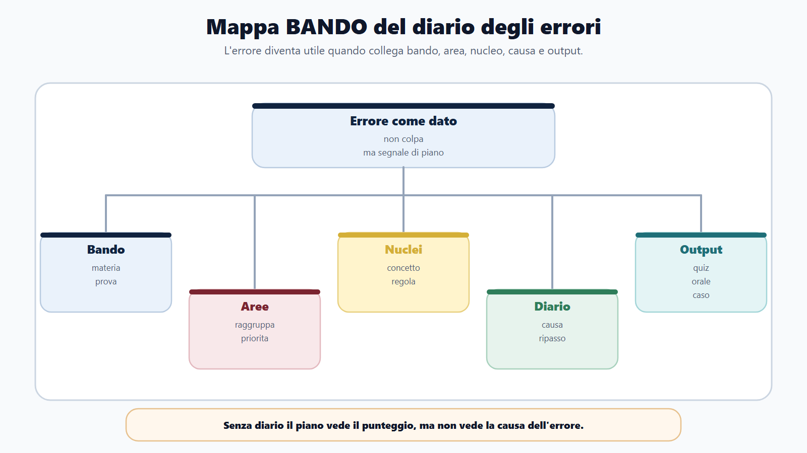
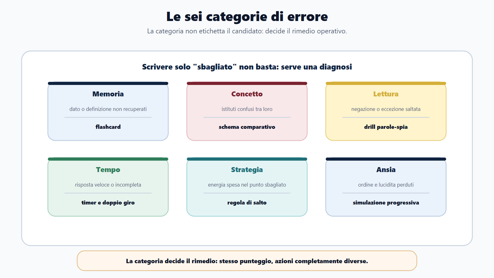
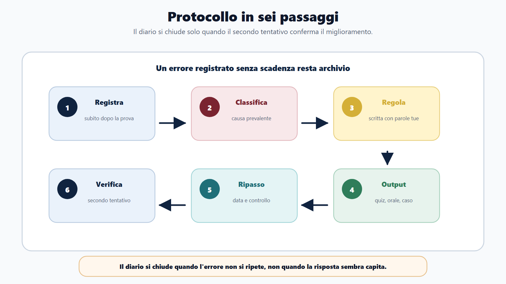
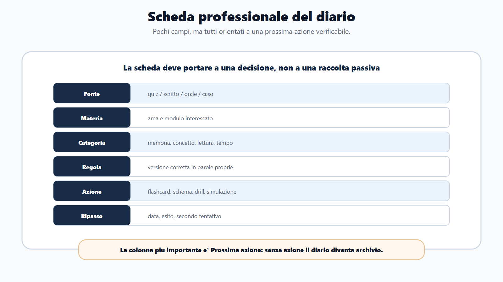
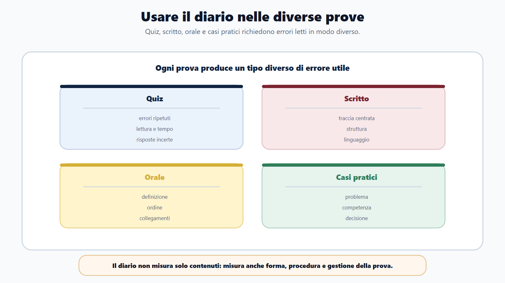
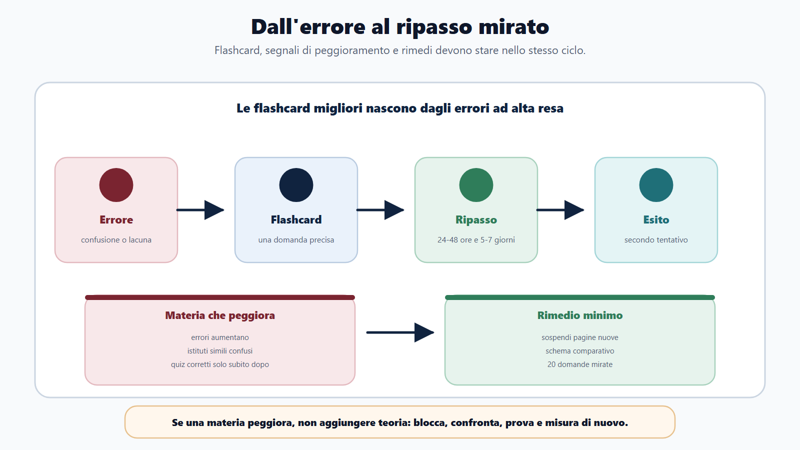
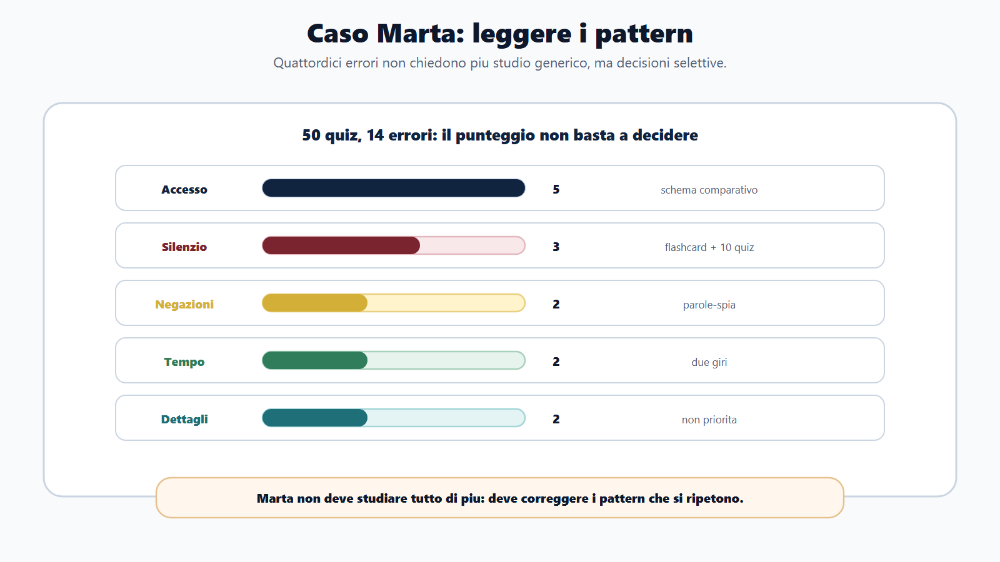

# Capitolo 23 - Il diario degli errori

Correggere non basta.

Molti candidati fanno quiz, guardano il punteggio, leggono la risposta giusta e passano oltre. Dopo qualche giorno sbagliano di nuovo la stessa cosa: una negazione, un termine, un soggetto competente, una differenza tra istituti, una domanda letta di fretta. Il problema non è l'errore. Il problema è non usarlo.

Nel Metodo BANDO l'errore è un dato. Dice dove il piano non sta funzionando, quale materia richiede ripasso, quale modulo è fragile, quale strategia va cambiata e quale output deve essere allenato.

Il diario degli errori serve a trasformare la correzione in decisione.

## Obiettivo del capitolo

Alla fine del capitolo devi saper:

- classificare gli errori;
- distinguere lacuna, confusione, distrazione, strategia e ansia;
- trasformare un errore in flashcard, ripasso o mini-esercizio;
- usare il diario per correggere il piano 30/60/90;
- capire quando una materia sta peggiorando;
- preparare gli ultimi giorni partendo dagli errori, non dall'umore.

Il diario non è una punizione. È il cruscotto del candidato.

## Mappa BANDO del diario

| Fase | Domanda | Uso del diario |
|---|---|---|
| B - Bando | L'errore riguarda una materia o prova prevista? | Dai peso |
| A - Aree | In quale area cade l'errore? | Raggruppa |
| N - Nuclei | Quale concetto manca? | Seleziona ripasso |
| D - Diario | perché ho sbagliato? | Classifica causa |
| O - Output | Che cosa devo rifare? | Quiz, caso, orale, flashcard |

Il diario collega studio e prova. Senza diario, il piano resta cieco.

## Le sei categorie di errore

Ogni errore deve entrare in una categoria. Se scrivi solo "sbagliato", non stai imparando abbastanza dall'errore.

| Categoria | Che cosa significa | Esempio | Azione |
|---|---|---|---|
| Memoria | Sapevi il tema ma non ricordavi dato, sequenza o definizione | Termine del procedimento, soglia, organo | Flashcard e ripasso |
| Concetto | Hai confuso istituti o rapporti | Accesso civico e documentale | Schema comparativo |
| Lettura | Hai letto male domanda, negazione o eccezione | "Non rientra", "salvo", "eccetto" | Drill parole-spia |
| Distrazione/tempo | Hai risposto troppo presto o sotto pressione | Hai saltato un dettaglio | Timer e doppio giro |
| Strategia | Hai investito tempo nel punto sbagliato | 5 minuti su domanda a bassa resa | Regola di salto |
| Ansia/tenuta | Hai perso ordine, lucidità o esposizione | Orale confuso, blocco in simulazione | Simulazione progressiva |

La categoria decide il rimedio.

## Protocollo in sei passaggi

### 1. Registra subito

Dopo una batteria, una simulazione o un orale, registra gli errori principali entro poche ore. Se aspetti troppo, ricorderai solo il punteggio, non il processo.

### 2. Classifica

Scrivi la categoria. Se un errore sembra appartenere a due categorie, scegli quella che produce l'azione più utile.

Esempio:

- "Ho sbagliato perché non ricordavo la differenza tra accesso civico semplice e generalizzato."
- Categoria: concetto.
- Azione: schema comparativo, non semplice flashcard.

### 3. Scrivi la regola corretta

Non limitarti a copiare la risposta. Scrivi la regola con parole tue.

Formato:

> La regola corretta è: ...

Se non riesci a scriverla, devi tornare alla fonte o al capitolo.

### 4. Trasforma in output

Ogni errore deve generare uno di questi output:

- flashcard;
- domanda orale;
- quiz mirato;
- schema comparativo;
- mini-caso;
- ripasso di pagina;
- simulazione breve;
- regola di strategia.

### 5. Programma il ripasso

Scrivi una data. Il ripasso non deve dipendere dal caso.

Usa tre livelli:

- ripasso breve entro 24-48 ore;
- secondo controllo dopo 5-7 giorni;
- controllo finale prima della simulazione.

### 6. Verifica il secondo tentativo

Il diario non si chiude quando capisci l'errore. Si chiude quando non lo ripeti.

Segna:

- corretto;
- ancora incerto;
- sbagliato di nuovo;
- da trasformare in mini-modulo.

## Scheda diario degli errori

| Data | Fonte errore | Materia | Domanda/caso | Categoria | Regola corretta | Prossima azione | Ripasso | Esito |
|---|---|---|---|---|---|---|---|---|
| | Quiz / scritto / orale / caso | | | Memoria / concetto / lettura / tempo / strategia / ansia | | | | |

La colonna più importante è "Prossima azione". Senza azione, il diario diventa archivio.

## Come usare il diario nei quiz

Dopo ogni batteria, non registrare tutte le domande. Registra gli errori che insegnano qualcosa.

priorità:

1. errori su materie ad alta resa;
2. errori ripetuti;
3. errori di lettura;
4. errori di tempo;
5. errori su modulo integrativo;
6. domande giuste ma risposte con incertezza.

Anche una risposta corretta può entrare nel diario se l'hai indovinata. Il concorso non premia la fortuna ripetuta.

## Come usare il diario nello scritto

Nello scritto l'errore non è solo contenuto. può riguardare struttura, ordine, esempi, proporzione, linguaggio e gestione del tempo.

Categorie utili:

| Errore | Segnale | Azione |
|---|---|---|
| Traccia non centrata | Risposta lunga ma fuori fuoco | Riscrivi scaletta |
| Mancanza struttura | Idee corrette ma confuse | Usa schema definizione-funzione-effetti-esempio |
| Troppa teoria | Nessun collegamento al caso | Aggiungi conseguenza pratica |
| Poca precisione | Termini generici | Glossario minimo |
| Tempo | Risposta incompleta | Simulazione con timer |

Il diario deve conservare anche le scalette sbagliate. Spesso il problema nasce prima della scrittura.

## Come usare il diario all'orale

All'orale gli errori più frequenti sono:

- partire senza definizione;
- saltare i passaggi;
- non collegare le materie;
- usare parole vaghe;
- non fare esempi;
- bloccarsi alla prima interruzione;
- parlare troppo o troppo poco.

Per ogni simulazione orale registra:

| Domanda | Tempo | Punto forte | Errore | Prossima risposta |
|---|---|---|---|---|
| | | | | |

La "prossima risposta" deve essere una versione migliorata in 5-7 righe. Non serve riscrivere un tema.

## Come usare il diario nei casi pratici

Nei casi pratici l'errore può essere:

- non individuare il problema;
- scegliere l'atto sbagliato;
- ignorare competenza o termine;
- non bilanciare interessi;
- dimenticare privacy, trasparenza o motivazione;
- proporre una soluzione non realistica.

Schema di correzione:

| Passaggio | Domanda |
|---|---|
| Fatti | Che cosa è successo? |
| Regola | Quale norma/istituto rileva? |
| Competenza | Chi deve agire? |
| Limite | Quali vincoli ci sono? |
| Decisione | Che cosa propongo? |
| Motivazione | perché è corretto? |

Se sbagli sempre lo stesso passaggio, quello diventa il tuo drill.

## Flashcard dagli errori

Le flashcard migliori non nascono da tutto il manuale. Nascono dagli errori.

Una flashcard utile deve avere:

- domanda precisa;
- risposta breve;
- un solo nucleo;
- esempio o contrasto se serve;
- data di ripasso.

Esempi:

| Errore | Flashcard |
|---|---|
| Confondo accesso civico semplice e generalizzato | Quando uso accesso civico semplice e quando generalizzato? |
| Dimentico organi del Comune | Quali funzioni essenziali hanno Consiglio, Giunta e dirigente/responsabile? |
| Sbaglio termini | qual è il termine ordinario del procedimento amministrativo se non previsto diversamente? |
| Leggo male negazioni | Quali parole-spia devo cerchiare prima di rispondere? |

Non trasformare ogni pagina in flashcard. Trasforma gli errori ad alta resa.

## Quando una materia peggiora

può succedere che una materia peggiori anche se la stai studiando. Il diario lo mostra prima del panico.

Segnali:

- errori aumentano dopo nuovi capitoli;
- confondi istituti simili;
- fai quiz corretti solo subito dopo lo studio;
- all'orale perdi ordine;
- le simulazioni peggiorano con il timer.

Cause possibili:

- stai aggiungendo teoria senza ripasso;
- non hai schemi comparativi;
- fai quiz troppo casuali;
- hai saltato il core;
- stai studiando materia troppo lunga senza output.

Rimedio:

1. sospendi nuove pagine per un blocco;
2. crea tabella comparativa;
3. fai 20 domande mirate;
4. registra errori;
5. ripeti dopo 48 ore.

## Diario e piano 30/60/90

Il diario corregge il piano. Ogni settimana chiediti:

| Domanda | Decisione |
|---|---|
| Quale errore si ripete? | Aggiungi drill |
| Quale materia è stabile? | Riduci tempo |
| Quale modulo resta fragile? | Aumenta output |
| Quale prova crea più ansia? | Simula prima |
| Quale contenuto non rende? | Taglia o abbassa profondità |

Il piano senza diario diventa rigido. Il diario senza piano diventa confuso. Devono lavorare insieme.

## Da sapere in 5 righe

1. L'errore è utile solo se produce una prossima azione.
2. Devi classificare la causa, non solo segnare la risposta giusta.
3. Gli errori ricorrenti valgono più degli errori isolati.
4. Flashcard, ripasso e simulazioni devono nascere dagli errori reali.
5. Il diario serve a cambiare il piano prima che sia troppo tardi.

## Caso guidato

Marta fa 50 quiz di diritto amministrativo. Ne sbaglia 14. Di solito guarderebbe il punteggio e passerebbe oltre.

Con il diario scopre:

- 5 errori sono su accesso;
- 3 sono su silenzio;
- 2 sono negazioni lette male;
- 2 sono domande lasciate per mancanza di tempo;
- 2 sono dettagli isolati.

Decisione:

- accesso: schema comparativo;
- silenzio: flashcard e 10 quiz mirati;
- negazioni: cerchiare parole-spia;
- tempo: simulazione a due giri;
- dettagli isolati: non priorità.

Marta non deve "studiare tutto di più". Deve correggere i pattern.

## Domanda da commissario

**perché il diario degli errori è più utile della semplice correzione della risposta?**

perché identifica la causa dell'errore e produce una decisione di studio. La risposta corretta dice che cosa era giusto; il diario dice che cosa devi fare dopo.

## Domanda-trappola

**Se sbaglio per distrazione, non serve studiare: basta stare più attento?**

No. Anche la distrazione va allenata. Se leggi male negazioni, eccezioni o dati, devi introdurre una procedura: cerchiare parole-spia, leggere due volte la consegna, usare il doppio giro, controllare prima di confermare.

## Mini-esercizio

Prendi gli ultimi 10 errori fatti e compila:

| Errore | Categoria | Causa | Azione | Data ripasso |
|---|---|---|---|---|
| 1 | | | | |
| 2 | | | | |
| 3 | | | | |
| 4 | | | | |
| 5 | | | | |
| 6 | | | | |
| 7 | | | | |
| 8 | | | | |
| 9 | | | | |
| 10 | | | | |

Poi conta le categorie. La categoria più frequente diventa il tuo prossimo blocco di lavoro.

## Errori tipici

- Registrare solo il punteggio.
- Scrivere "non sapevo" per ogni errore.
- Correggere senza programmare ripasso.
- Creare troppe flashcard e non ripeterle.
- Non distinguere errore di concetto da errore di lettura.
- Ignorare risposte corrette ma incerte.
- Non usare il diario per cambiare il calendario.
- Fare simulazioni senza analisi.

## Riferimenti consolidati

- [[sources/metodo-bando-capitolo-13-bozza-sito-2026-05-30]]
- [[sources/apprendimento-efficace-active-recall-ripasso-distribuito]]
- [[sources/scienze-apprendimento-pianificazione-metacognizione-errori]]
- [[sources/capitoli-21-23-corpus-moduli-piano-diario-2026-06-01]]
- [[topics/diario-errori]]
- [[topics/metodo-di-studio]]
- [[topics/piano-30-60-90-giorni]]

## Note di review

- Valutare in impaginazione se la scheda diario va ripetuta anche in appendice come tool compilabile.
- Per dashboard digitale futura, i campi minimi sono categoria, materia, causa, prossima azione, data ripasso ed esito secondo tentativo.
