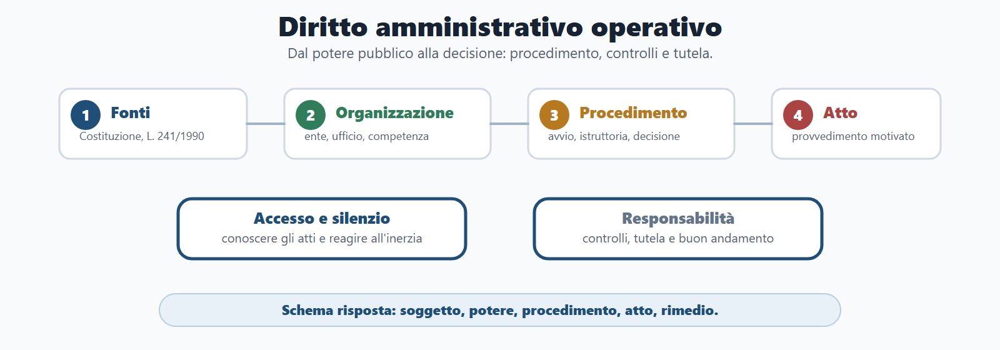
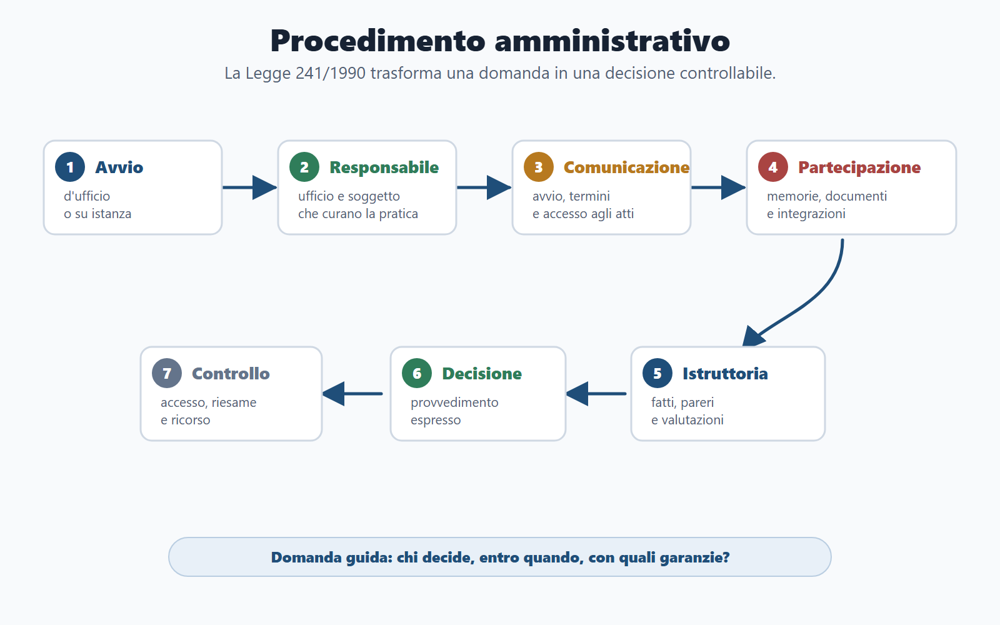
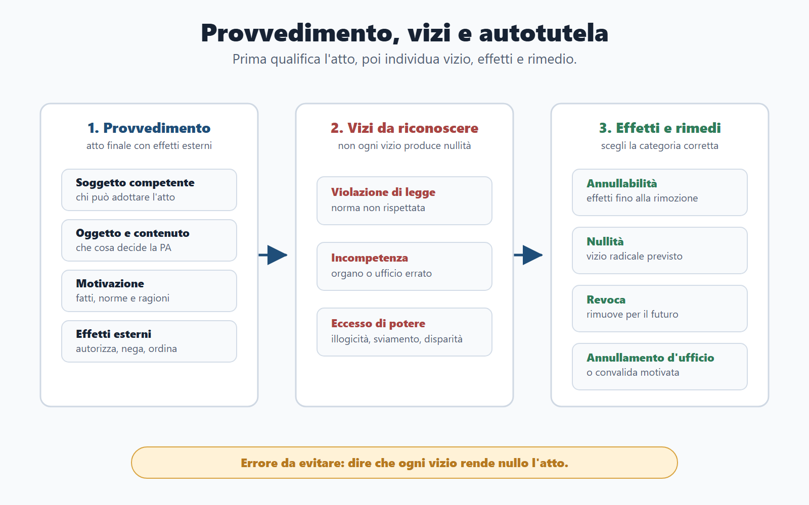
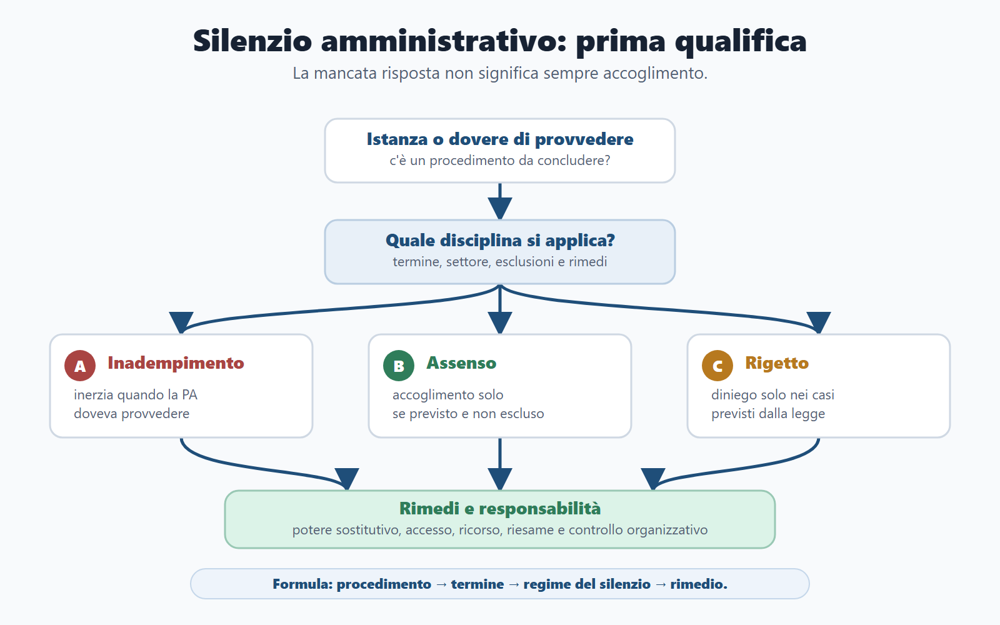

# Capitolo 5 - Diritto amministrativo operativo

## Perché studiare il diritto amministrativo operativo

Il diritto amministrativo è una materia comune in moltissimi concorsi pubblici, ma non va studiato come una raccolta di definizioni isolate. Per il candidato serve a rispondere a una domanda molto concreta: come decide la pubblica amministrazione e quali regole deve rispettare quando incide sulla posizione di cittadini, imprese, dipendenti o altri enti?

In una prova scritta o orale non basta dire che la pubblica amministrazione persegue l'interesse pubblico. Occorre mostrare come quell'interesse diventa azione amministrativa. Il procedimento viene avviato, il responsabile cura l'istruttoria e gli interessati possono partecipare. L'amministrazione rispetta termini e motivazione; il provvedimento produce effetti; vizi, silenzio, accesso e rimedi hanno conseguenze diverse.

La chiave del capitolo è questa: la pubblica amministrazione non agisce come un privato libero di scegliere secondo convenienza. Agisce in base alla legge, per fini pubblici, con procedimento, tracciabilità, imparzialità, trasparenza, responsabilità e possibilità di controllo.

## Obiettivi del capitolo

Al termine del capitolo devi saper:

- spiegare che cosa sono pubblica amministrazione, attività amministrativa e principio di legalità;
- riconoscere le fonti essenziali del diritto amministrativo e il rapporto tra disciplina generale e discipline speciali;
- distinguere organizzazione amministrativa, organi, uffici, competenza e responsabilità;
- comprendere diritti soggettivi, interessi legittimi e posizioni del cittadino di fronte al potere pubblico;
- distinguere attività vincolata, attività discrezionale, discrezionalità tecnica e merito amministrativo;
- collegare i principi dell'azione amministrativa a esempi concreti;
- descrivere il procedimento amministrativo secondo la Legge 241/1990;
- distinguere procedimento, provvedimento, accesso e silenzio;
- individuare il ruolo del responsabile del procedimento;
- riconoscere comunicazione di avvio, partecipazione e preavviso di rigetto;
- distinguere annullabilità, nullità, revoca, annullamento d'ufficio e convalida;
- distinguere accesso documentale, accesso civico semplice e accesso civico generalizzato;
- collegare semplificazione, conferenza di servizi e digitalizzazione;
- ragionare su responsabilità della PA, del dipendente e del dirigente;
- costruire una risposta da concorso con lo schema: definizione, norma, funzione, esempio, conclusione.

## Come usare il Metodo BANDO

| Fase | Come usare questo capitolo |
|---|---|
| **Bando** | Cerca nel programma parole come diritto amministrativo, procedimento, provvedimento, accesso, trasparenza, anticorruzione, silenzio, autotutela, responsabilità, digitalizzazione, conferenza di servizi. |
| **Aree** | Collega il capitolo a Costituzione, pubblico impiego, enti locali, trasparenza, anticorruzione, contratti pubblici, performance e responsabilità amministrativa. |
| **Nuclei** | Studia prima fonti, organizzazione, situazioni soggettive, principi, procedimento, responsabile, partecipazione, provvedimento, vizi, autotutela, silenzio, accessi, semplificazione e digitale. |
| **Diario** | Registra gli errori: confondere accesso documentale e accesso civico, dire sempre "silenzio-assenso", dimenticare il responsabile, parlare di trasparenza senza limiti. |
| **Output** | Produci una tabella comparativa, una risposta orale, una griglia di procedimento e un caso pratico su istanza senza risposta. |

## Quadro essenziale

Prima di applicare il diritto amministrativo ai casi, il candidato deve possedere una base teorica ordinata. La teoria non va imparata come definizione astratta, ma come mappa dei concetti che ricorrono nei bandi e nelle domande orali.

### Fonti del diritto amministrativo

Il diritto amministrativo nasce dall'incontro tra Costituzione, diritto dell'Unione europea, leggi statali e regionali, regolamenti, atti amministrativi generali, linee guida, piani, discipline di settore e principi generali. Nei concorsi, la fonte centrale per il procedimento è la Legge 241/1990, ma non esaurisce la materia. A seconda del profilo, possono rilevare anche pubblico impiego, trasparenza, anticorruzione, contratti pubblici, enti locali, amministrazione digitale, performance e responsabilità.

La regola da ricordare è questa: la disciplina generale offre lo schema, la disciplina speciale può modificarlo o integrarlo. Per esempio, il procedimento amministrativo ha regole generali, ma un concorso pubblico, una gara d'appalto, un procedimento edilizio o un procedimento disciplinare possono avere norme speciali.

| Fonte o livello | Funzione nel concorso | Esempio di uso |
|---|---|---|
| Costituzione | Fissa principi come imparzialità, buon andamento, uguaglianza, responsabilità e accesso per concorso. | Domande su art. 97 Cost., PA e pubblico impiego. |
| Legge 241/1990 | Disciplina procedimento, partecipazione, responsabile, accesso documentale, silenzio, conferenza di servizi, autotutela. | Casi su istanza, ritardo, provvedimento, accesso agli atti. |
| D.Lgs. 33/2013 e D.Lgs. 97/2016 | Regolano trasparenza, obblighi di pubblicazione e accesso civico. | Domande su accesso civico semplice e generalizzato. |
| Codice dell'amministrazione digitale | Collega procedimento, documenti, comunicazioni e servizi digitali. | Domande su fascicolo informatico, domicilio digitale, documenti informatici. |
| Norme di settore | Adattano le regole generali a materie specifiche. | Contratti pubblici, pubblico impiego, enti locali, ambiente, edilizia. |

### Organizzazione amministrativa

L'organizzazione amministrativa riguarda il modo in cui la PA si struttura per svolgere funzioni pubbliche. Il candidato deve distinguere almeno amministrazioni, organi, uffici, competenza e responsabilità.

L'amministrazione è il soggetto o apparato. L'organo è il centro che manifesta la volontà dell'ente. L'ufficio è la struttura organizzativa che svolge attività, istruttoria, supporto o gestione. La competenza indica quale organo o ufficio può agire in una determinata materia, territorio o grado.

Questa distinzione serve nei casi pratici. Se un provvedimento è adottato da un soggetto non competente, il problema non è solo organizzativo: può diventare un vizio dell'atto. Se un procedimento non ha un responsabile individuabile, il problema non è solo interno: incide su trasparenza, tempi, partecipazione e tutela dell'interessato.

Nei profili da funzionario è importante anche il rapporto tra indirizzo politico e gestione amministrativa. Gli organi politici definiscono indirizzi, obiettivi e priorità; i dirigenti e gli apparati amministrativi curano la gestione, adottano atti di competenza e rispondono dei risultati secondo le regole sull'organizzazione e sulla performance.

### Situazioni giuridiche soggettive

Il diritto amministrativo studia anche la posizione del cittadino di fronte al potere pubblico. Le categorie essenziali sono diritto soggettivo e interesse legittimo.

Il diritto soggettivo è una posizione di vantaggio piena riconosciuta dall'ordinamento. L'interesse legittimo è la posizione del privato rispetto all'esercizio di un potere amministrativo: il cittadino non pretende semplicemente un bene finale, ma pretende che il potere sia esercitato correttamente, secondo legge, competenza, procedimento, motivazione, imparzialità e proporzionalità.

Per il candidato non è necessario trasformare questa distinzione in teoria processuale avanzata. È però essenziale capirne l'uso pratico: quando la PA esercita un potere, il privato può contestare non solo il risultato, ma anche il modo in cui il potere è stato esercitato. Da qui nascono partecipazione, accesso, motivazione, tutela contro il silenzio, impugnazione dell'atto e risarcimento nei casi previsti.

### Potere amministrativo, discrezionalità e attività vincolata

L'amministrazione può agire con margini diversi.

Nell'attività vincolata, la norma predetermina in modo rigido presupposti e conseguenze: se ricorrono i presupposti, l'amministrazione deve adottare una certa decisione. Nell'attività discrezionale, la PA deve valutare interessi pubblici e privati, scegliere tra più soluzioni legittime e motivare la scelta. La discrezionalità tecnica riguarda valutazioni fondate su conoscenze specialistiche, come giudizi tecnici, sanitari, ambientali o progettuali.

Il merito amministrativo, invece, riguarda l'opportunità della scelta amministrativa entro i limiti della legge. In concorso devi evitare due errori: pensare che discrezionalità significhi libertà arbitraria, oppure pensare che il giudice possa sostituirsi sempre all'amministrazione nella scelta di opportunità. Il controllo riguarda legalità, ragionevolezza, proporzionalità, istruttoria, motivazione e assenza di sviamento.

### Atti amministrativi, provvedimenti e atti endoprocedimentali

Non tutti gli atti amministrativi sono provvedimenti. Gli atti endoprocedimentali preparano la decisione finale: pareri, comunicazioni, richieste di integrazione, verbali, valutazioni, proposte, atti istruttori. Il provvedimento è invece l'atto finale o comunque l'atto che produce effetti esterni diretti.

Questa distinzione è fondamentale nei quiz e nei casi. Se una commissione chiede "che differenza c'è tra procedimento e provvedimento?", la risposta deve chiarire che il procedimento è la sequenza, mentre il provvedimento è l'esito decisorio. Se chiede "che cosa sono gli atti endoprocedimentali?", la risposta deve collegarli alla fase istruttoria e alla preparazione della decisione.

### Moduli consensuali, SCIA e semplificazione

Il diritto amministrativo non è fatto solo di provvedimenti autoritativi. Esistono anche accordi, moduli consensuali, dichiarazioni, segnalazioni certificate e strumenti di semplificazione.

Gli accordi amministrativi consentono, nei limiti previsti, di determinare il contenuto del provvedimento o sostituirlo con un assetto concordato. La SCIA e altri modelli di semplificazione spostano il baricentro dal previo assenso espresso al controllo successivo, quando la legge lo consente. La conferenza di servizi coordina amministrazioni diverse. Il silenzio può avere effetti diversi a seconda della disciplina.

Il punto teorico da fissare è questo: semplificare non significa eliminare legalità e controlli. Significa rendere l'azione amministrativa più rapida e proporzionata, mantenendo responsabilità, verifiche e tutela degli interessi sensibili.

### Tutela amministrativa e giurisdizionale

Il candidato deve conoscere almeno il quadro generale delle tutele. Davanti a un atto illegittimo o a un'inerzia della PA possono rilevare rimedi amministrativi, accesso agli atti, istanze di riesame, potere sostitutivo, ricorso al giudice amministrativo, azione contro il silenzio e, nei casi previsti, tutela risarcitoria.

Non serve inserire in questo capitolo una trattazione processuale completa, che appartiene al processo amministrativo. Serve però capire il collegamento: procedimento, provvedimento, vizi e silenzio sono studiati anche perché determinano le forme di tutela del cittadino. Il Codice del processo amministrativo diventa rilevante quando il candidato deve spiegare come si reagisce a inerzia, diniego di accesso o provvedimento lesivo.

### Moduli speciali collegati

Alcuni argomenti appartengono anche ad altri capitoli, ma qui devono essere richiamati perché fanno parte del diritto amministrativo generale:

| Modulo | Perché rileva nel capitolo 5 | Dove si approfondisce |
|---|---|---|
| Pubblico impiego | Organizzazione, dirigenza, responsabilità, accesso per concorso e separazione tra indirizzo e gestione. | Capitolo 6. |
| Trasparenza e anticorruzione | Prevenzione del rischio, obblighi di pubblicazione, accesso civico, ruolo ANAC. | Capitolo 7. |
| Contratti pubblici | Procedimenti di affidamento, principi, responsabilità, digitalizzazione e trasparenza delle procedure. | Capitolo 9. |
| Amministrazione digitale | Fascicolo, documento informatico, comunicazioni, servizi digitali e conservazione. | Capitolo 10. |
| Responsabilità e controlli | Responsabilità amministrativa, contabile, disciplinare, dirigenziale e organizzativa. | Capitoli 6, 7, 8 e 17. |

Questi richiami non sostituiscono i capitoli dedicati. Servono a evitare una lacuna teorica: il candidato deve capire che il diritto amministrativo è la grammatica comune di molte materie concorsuali.

## Programma essenziale per i concorsi

Questa sezione integra gli argomenti che ricorrono nei quiz e nei programmi estesi. Non sostituisce i capitoli specialistici su contratti, contabilità, enti locali o digitale, ma garantisce che il Capitolo 5 contenga almeno la mappa teorica minima di tutti i nuclei ad alta, media e bassa priorità.

### 1. Principi e fonti del diritto amministrativo

I principi sono la base per risolvere domande teoriche e casi pratici. L'art. 97 Cost. richiama imparzialità e buon andamento come criteri fondamentali dell'organizzazione e dell'azione amministrativa. A questi si collegano legalità, economicità, efficacia, efficienza, pubblicità, trasparenza, ragionevolezza e proporzionalità.

| Principio | Significato da concorso | Errore da evitare |
|---|---|---|
| Legalità | La PA agisce nei casi, modi e fini previsti dall'ordinamento. | Pensare che l'interesse pubblico giustifichi qualunque scelta. |
| Imparzialità | La PA deve decidere senza favoritismi e con criteri oggettivi. | Confonderla con neutralità passiva. |
| Buon andamento | L'organizzazione deve funzionare in modo ordinato, efficiente e orientato ai risultati. | Ridurlo a rapidità senza garanzie. |
| Economicità, efficacia, efficienza | Le risorse vanno usate razionalmente per ottenere risultati utili. | Considerarle sinonimi perfetti. |
| Pubblicità e trasparenza | L'azione deve essere conoscibile nei modi e limiti previsti. | Dire che tutto deve essere sempre pubblicato. |
| Ragionevolezza e proporzionalità | La decisione deve essere coerente, non arbitraria e non eccessiva rispetto al fine. | Trascurare il bilanciamento tra interessi. |

Le fonti comprendono Costituzione, diritto dell'Unione europea, leggi statali e regionali, regolamenti, atti generali, principi giurisprudenziali e discipline settoriali. Nei quiz è frequente la domanda sul rapporto tra disciplina generale e disciplina speciale: la prima offre lo schema, la seconda può adattarlo alla materia concreta.

### 2. Organizzazione amministrativa

L'organizzazione amministrativa studia soggetti, strutture, organi, uffici, competenze, funzioni e responsabilità. La PA statale comprende Presidenza del Consiglio, ministeri, amministrazioni periferiche, agenzie, enti pubblici e altre strutture. Le autorità amministrative indipendenti sono soggetti dotati di autonomia e funzioni di regolazione, vigilanza o garanzia in settori sensibili.

Il candidato deve conoscere almeno queste distinzioni:

| Concetto | Spiegazione |
|---|---|
| Organo | Centro che esprime la volontà dell'ente verso l'esterno. |
| Ufficio | Struttura organizzativa che svolge attività istruttorie, tecniche, amministrative o di supporto. |
| Competenza | Ambito entro cui un organo o ufficio può agire per materia, territorio, valore o grado. |
| Ministeri | Apparati statali organizzati per settori di amministrazione. |
| Presidenza del Consiglio | Struttura di supporto e coordinamento dell'azione di governo. |
| Agenzie | Strutture con compiti tecnico-operativi o gestionali in specifici settori. |
| Enti pubblici | Soggetti distinti dallo Stato che perseguono fini pubblici. |
| Prefetture | Uffici territoriali del Governo con funzioni di rappresentanza, coordinamento e raccordo sul territorio. |

Il D.Lgs. 30 luglio 1999, n. 300 è il riferimento consolidato per la riforma dell'organizzazione del Governo, dei ministeri e delle agenzie. Per il concorso va usato per capire che l'amministrazione statale non coincide con un unico apparato indistinto: i ministeri curano settori di amministrazione, mentre le agenzie svolgono funzioni tecnico-operative o gestionali secondo il disegno organizzativo previsto dalla legge.

### 3. Potere amministrativo e situazioni giuridiche

Il potere amministrativo è la capacità attribuita alla PA di incidere unilateralmente su situazioni giuridiche per perseguire un interesse pubblico. Di fronte al potere possono emergere diritti soggettivi, interessi legittimi, interessi diffusi e interessi collettivi.

L'interesse legittimo è centrale perché riguarda la posizione del privato davanti all'esercizio del potere: il cittadino non pretende soltanto un risultato favorevole, ma pretende che il potere sia esercitato legittimamente. Gli interessi diffusi appartengono a una collettività indifferenziata; gli interessi collettivi sono riferibili a gruppi organizzati o enti rappresentativi.

La discrezionalità amministrativa è il margine di scelta della PA nel bilanciare interessi pubblici e privati. Il merito amministrativo riguarda l'opportunità della scelta entro i limiti della legge. Il giudice controlla la legittimità, non si sostituisce normalmente alla PA nelle valutazioni di pura opportunità.

### 4. Procedimento amministrativo

Il procedimento amministrativo è disciplinato in via generale dalla Legge 241/1990. I nuclei da padroneggiare sono avvio, responsabile del procedimento, istruttoria, pareri, partecipazione, termini, comunicazione di avvio e preavviso di rigetto.

I pareri e le valutazioni tecniche sono atti istruttori che aiutano la decisione. Possono avere peso diverso secondo la disciplina applicabile. In prova, non bisogna confondere il parere con il provvedimento finale: il parere prepara o orienta la decisione, il provvedimento produce gli effetti finali.

### 5. Semplificazione amministrativa

La semplificazione serve a ridurre passaggi inutili, tempi morti e duplicazioni senza eliminare legalità e controlli. Gli istituti principali sono conferenza di servizi, silenzio-assenso, silenzio-inadempimento, SCIA, accordi integrativi e sostitutivi, attività consultiva e acquisizione di assensi.

| Istituto | Funzione | Attenzione in quiz |
|---|---|---|
| Conferenza di servizi | Coordina più amministrazioni o interessi in procedimenti complessi. | Non è sempre una riunione fisica. |
| Silenzio-assenso | In alcuni casi il mancato diniego equivale ad accoglimento. | Non vale sempre e non vale in tutti i settori. |
| Silenzio-inadempimento | Inerzia della PA quando doveva provvedere. | Non coincide con accoglimento automatico. |
| SCIA | Consente avvio dell'attività sulla base di segnalazione, con controlli successivi. | Non elimina i poteri di verifica. |
| Accordi | Possono integrare o sostituire il provvedimento nei limiti previsti. | Non sacrificano il pubblico interesse. |

### 6. Atti e provvedimenti amministrativi

Gli atti amministrativi comprendono atti preparatori, istruttori, interni, generali e provvedimenti. Il provvedimento è l'atto con cui la PA esercita un potere e produce effetti esterni.

I temi da coprire sono elementi dell'atto, motivazione, efficacia, esecutività, esecutorietà, vizi, nullità, annullabilità, incompetenza, eccesso di potere, violazione di legge, autotutela, revoca, annullamento d'ufficio e convalida.

| Tema | Spiegazione essenziale |
|---|---|
| Motivazione | Espone presupposti di fatto e ragioni giuridiche della decisione. |
| Efficacia | Capacità dell'atto di produrre effetti. |
| Esecutività | Possibilità che l'atto efficace sia portato a esecuzione. |
| Esecutorietà | Potere della PA di dare esecuzione coattiva nei casi previsti. |
| Incompetenza | Vizio relativo al soggetto che ha adottato l'atto. |
| Eccesso di potere | Cattivo uso del potere, rilevabile tramite figure sintomatiche come illogicità, disparità, sviamento. |
| Nullità | Vizio radicale nei casi previsti. |
| Annullabilità | Illegittimità che rende l'atto annullabile ma produttivo di effetti finché non rimosso. |

### 7. Accesso, trasparenza, anticorruzione e privacy

Accesso documentale, accesso civico semplice e accesso civico generalizzato devono essere distinti con precisione. Il primo richiede un interesse diretto, concreto e attuale; il secondo riguarda obblighi di pubblicazione non rispettati; il terzo consente controllo diffuso nei limiti previsti.

La trasparenza si collega al D.Lgs. 33/2013, l'anticorruzione alla Legge 190/2012 e al ruolo di ANAC. Il whistleblowing, oggi ricondotto al D.Lgs. 10 marzo 2023, n. 24, appartiene alla prevenzione dell'illegalità e alla tutela del segnalante: non è una lamentela generica, ma una segnalazione qualificata da gestire con canali corretti, riservatezza e protezione da ritorsioni. La privacy impone di bilanciare conoscibilità dell'azione amministrativa e protezione dei dati personali. Il GDPR e la disciplina nazionale sui dati richiedono attenzione particolare per dati personali, categorie particolari di dati e informazioni idonee a incidere sulla riservatezza.

Regola da ricordare: trasparenza non significa diffusione indiscriminata; privacy non significa segreto generalizzato. Il concorso valuta la capacità di bilanciare.

### 8. Documentazione amministrativa

La documentazione amministrativa è regolata dal D.P.R. 445/2000. I temi principali sono certificati, autocertificazione, dichiarazioni sostitutive di certificazione, dichiarazioni sostitutive dell'atto di notorietà, autenticazione, copie conformi e responsabilità per dichiarazioni false.

Per il candidato, il punto operativo è che la PA deve semplificare i rapporti con cittadini e imprese, evitando richieste documentali inutili quando l'ordinamento consente dichiarazioni sostitutive o acquisizioni d'ufficio. Le dichiarazioni false non sono un errore innocuo: possono produrre decadenza dai benefici e responsabilità secondo la disciplina applicabile.

### 9. Amministrazione digitale

Il CAD, D.Lgs. 82/2005, disciplina il passaggio dall'amministrazione cartacea all'amministrazione digitale. I nuclei da conoscere sono documento informatico, firma digitale ed elettronica, PEC, SPID, CIE, domicilio digitale, protocollo informatico, istanze telematiche, fascicolo informatico e conservazione.

In prova non scrivere che amministrazione digitale significa "informatizzare". Significa garantire identità digitale, validità dei documenti, tracciabilità, sicurezza, accessibilità, interoperabilità e possibilità di gestire procedimenti in modo digitale.

### 10. Contratti pubblici e appalti

I contratti pubblici sono parte essenziale del diritto amministrativo perché traducono l'interesse pubblico in acquisti, lavori, servizi, forniture e concessioni. Il Codice dei contratti pubblici disciplina principi, programmazione, affidamenti, gare, procedure aperte, ristrette e negoziate, RUP, bando, capitolato, offerte, aggiudicazione, soglie, MEPA/Consip, subappalto, collaudo ed esecuzione.

Nel capitolo 5 basta fissare la mappa. L'approfondimento appartiene al capitolo sui contratti pubblici. Per i quiz, però, devi saper distinguere:

| Concetto | Significato |
|---|---|
| RUP | Figura di coordinamento del procedimento o progetto secondo la disciplina dei contratti. |
| Bando | Atto che rende conoscibile la gara e le sue regole. |
| Capitolato | Documento tecnico-amministrativo che definisce prestazioni e condizioni. |
| Aggiudicazione | Esito della procedura di scelta dell'operatore. |
| Concessione | Modello in cui il rischio operativo assume rilievo nella gestione del servizio o opera. |

### 11. Beni pubblici, demanio ed espropriazione

I beni pubblici comprendono beni demaniali, beni patrimoniali indisponibili e beni patrimoniali disponibili. Il demanio riguarda beni sottoposti a un regime pubblicistico intenso; il patrimonio indisponibile è vincolato a una destinazione pubblica; il patrimonio disponibile è gestito con maggiore vicinanza alle regole privatistiche, pur appartenendo a un soggetto pubblico. La base civilistica della distinzione va collegata alla destinazione del bene e al diverso regime di uso, circolazione e tutela.

Le concessioni consentono l'uso o la gestione di beni pubblici secondo regole e limiti. L'Agenzia del demanio rileva nella gestione del patrimonio immobiliare statale. L'espropriazione per pubblica utilità, disciplinata dal D.P.R. 8 giugno 2001, n. 327, è il procedimento con cui la PA acquisisce coattivamente un bene privato per un'opera o finalità pubblica, con base legale, garanzie procedimentali e indennità. In sintesi da concorso, il decreto di esproprio presuppone vincolo preordinato all'esproprio, dichiarazione di pubblica utilità e determinazione dell'indennità.

Il candidato deve ricordare tre parole: proprietà pubblica, destinazione pubblica, garanzie del privato.

### 12. Servizi pubblici

Il servizio pubblico è un'attività destinata a soddisfare bisogni della collettività. Può essere gestito direttamente, tramite affidamenti, società, concessioni o altri modelli previsti dall'ordinamento. Nei servizi pubblici locali rilevano ente affidante, gestore, utenti, qualità del servizio, carta dei servizi, tariffe e controlli.

La concessione di servizi si distingue perché il gestore assume un ruolo nella gestione del servizio verso l'utenza. La carta dei servizi serve a rendere conoscibili standard, diritti degli utenti e impegni del gestore.

### 13. Controlli e responsabilità

I controlli servono a verificare legalità, regolarità, efficienza, risultati e corretto uso delle risorse. Possono essere interni o esterni, preventivi o successivi, di regolarità, di gestione, strategici o contabili.

Le responsabilità da distinguere sono amministrativa, contabile, erariale, civile, penale e disciplinare. La Corte dei conti rileva per responsabilità amministrativo-contabile e danno erariale. L'agente contabile è il soggetto che maneggia denaro, valori o beni pubblici e deve rendere conto secondo le regole applicabili.

### 14. Ricorsi e giustizia amministrativa

La tutela può essere amministrativa o giurisdizionale. I ricorsi amministrativi comprendono ricorso gerarchico, ricorso in opposizione e ricorso straordinario al Presidente della Repubblica. La giustizia amministrativa riguarda TAR e Consiglio di Stato, giurisdizione amministrativa, tutela cautelare, ottemperanza e azioni contro silenzio o diniego di accesso nei casi previsti.

| Rimedio | Idea chiave |
|---|---|
| Ricorso gerarchico | Si propone all'autorità gerarchicamente superiore, quando prevista. |
| Ricorso in opposizione | Si propone alla stessa autorità che ha emanato l'atto, nei casi previsti. |
| Ricorso straordinario | Rimedio amministrativo alternativo al ricorso giurisdizionale, nei limiti previsti. |
| TAR | Giudice amministrativo di primo grado. |
| Consiglio di Stato | Giudice amministrativo d'appello e organo consultivo. |
| Ottemperanza | Serve ad assicurare esecuzione del giudicato amministrativo. |

### 15. Enti territoriali e autonomie locali

Regioni, Comuni, Province e Città metropolitane sono enti territoriali. Per gli enti locali rileva il TUEL, D.Lgs. 267/2000. Il candidato deve conoscere sindaco, giunta, consiglio, segretario comunale, statuto, regolamenti e servizi locali.

Negli enti locali la distinzione tra indirizzo politico e gestione amministrativa è decisiva: consiglio e giunta definiscono scelte politiche e indirizzi; dirigenti e responsabili curano gestione, atti, procedimenti e responsabilità. Il segretario comunale svolge funzioni di collaborazione, assistenza giuridico-amministrativa e garanzia secondo l'ordinamento dell'ente.

### 16. Sanzioni amministrative e polizia amministrativa

Le sanzioni amministrative riguardano illeciti non penali puniti con sanzioni amministrative. La Legge 24 novembre 1981, n. 689 è il riferimento generale consolidato per il regime degli illeciti amministrativi, per la logica della depenalizzazione e per istituti ricorrenti nei quiz come contestazione, pagamento in misura ridotta quando previsto e ordinanza-ingiunzione.

La polizia amministrativa comprende funzioni di prevenzione, controllo, autorizzazione e vigilanza. Nei quiz compaiono termini come autorizzazioni, licenze, nulla osta e porto d'armi. Il TULPS, approvato con R.D. 18 giugno 1931, n. 773, resta una fonte di riferimento per molti istituti di pubblica sicurezza: va studiato in forma essenziale, perché la disciplina è settoriale e spesso modificata. La logica comune è questa: alcune attività private possono essere subordinate a controllo pubblico preventivo o successivo per tutelare sicurezza, ordine, salute, ambiente o altri interessi pubblici.

## Priorità di studio per quiz

| Priorità | Argomenti | Come studiarli |
|---|---|---|
| Alta | Organizzazione PA, procedimento, provvedimenti, giustizia amministrativa, enti locali, documentazione, pubblico impiego, contratti pubblici. | Definizione, fonte, tabella comparativa, caso pratico, quiz. |
| Media | CAD, accesso/trasparenza/privacy, beni pubblici, controlli/responsabilità, semplificazione, dirigenza/performance, codice comportamento. | Mappe e domande-trappola. |
| Bassa ma da includere | Sicurezza lavoro, pari opportunità, benessere organizzativo, polizia amministrativa e licenze. | Schede sintetiche e riconoscimento nei quiz. |

## 1. Pubblica amministrazione e attività amministrativa

La pubblica amministrazione è l'insieme dei soggetti che curano interessi pubblici attraverso organizzazione, uffici, procedimenti, atti, servizi, controlli e responsabilità. In concorso conviene evitare una definizione puramente descrittiva: la PA va presentata come apparato che esercita funzioni pubbliche entro limiti giuridici.

L'attività amministrativa è l'attività con cui l'amministrazione persegue fini pubblici. Può assumere forme diverse: provvedimenti autoritativi, attività di servizio, contratti, controlli, atti organizzativi, attività materiale, gestione digitale di procedimenti e documenti.

Per una risposta efficace, usa sempre tre livelli:

| Livello | Domanda guida | Esempio |
|---|---|---|
| Soggetto | Chi agisce? | Comune, Ministero, ente pubblico, ufficio competente. |
| Potere o funzione | Per quale fine pubblico agisce? | Autorizzare, controllare, assumere, erogare un servizio, sanzionare. |
| Regola | Con quali limiti? | Legge, procedimento, motivazione, termini, trasparenza, responsabilità. |

## 2. Legalità, imparzialità e buon andamento

Il principio di legalità è la cornice dell'azione amministrativa. Significa che la PA può esercitare poteri pubblici nei casi, nei modi e per i fini previsti dall'ordinamento. Non è una formula astratta: serve a impedire decisioni arbitrarie e a rendere controllabile l'esercizio del potere.

Accanto alla legalità, il candidato deve padroneggiare almeno questi principi:

| Principio | Significato operativo | Come usarlo in prova |
|---|---|---|
| **Imparzialità** | L'amministrazione deve trattare gli interessi coinvolti senza favoritismi o discriminazioni. | Utile nei casi di concorso, autorizzazioni, graduatorie, controlli e accesso. |
| **Buon andamento** | L'azione amministrativa deve essere efficiente, ordinata, proporzionata e orientata al risultato pubblico. | Utile nei casi di ritardo, cattiva organizzazione, duplicazione di passaggi, mancata risposta. |
| **Economicità ed efficacia** | Le risorse e i tempi devono essere usati in modo razionale per raggiungere il fine pubblico. | Utile per spiegare semplificazione, digitalizzazione e misurazione dei tempi. |
| **Pubblicità e trasparenza** | L'azione amministrativa deve essere conoscibile nei modi previsti dalla legge. | Utile per distinguere pubblicazione, accesso documentale e accesso civico. |
| **Collaborazione e buona fede** | Il rapporto tra cittadino e amministrazione non deve essere costruito come ostacolo reciproco. | Utile nei casi di istanza incompleta, richiesta di integrazioni, comunicazioni e partecipazione. |

La Legge 241/1990 collega questi principi al procedimento amministrativo: l'amministrazione deve perseguire i fini determinati dalla legge, non può aggravare inutilmente il procedimento e deve concluderlo secondo regole conoscibili.

## 3. Procedimento amministrativo

Il procedimento amministrativo è la sequenza organizzata di atti e attività attraverso cui la PA forma la propria decisione. È il passaggio che trasforma un potere astratto in una decisione concreta.

Una risposta ordinata può seguire questa sequenza:

1. **Avvio**: il procedimento può iniziare d'ufficio o su istanza di parte.
2. **Unità organizzativa e responsabile**: l'amministrazione individua l'ufficio e il soggetto che curano l'istruttoria.
3. **Comunicazione di avvio**: gli interessati sono informati quando la legge lo prevede.
4. **Partecipazione**: i soggetti legittimati possono prendere visione degli atti e presentare memorie o documenti.
5. **Istruttoria**: l'amministrazione raccoglie fatti, pareri, valutazioni, documenti e informazioni.
6. **Decisione**: il procedimento si conclude con un provvedimento espresso, salvo discipline specifiche sul silenzio.
7. **Controllo e tutela**: l'atto può essere conosciuto, riesaminato, impugnato o corretto.

Il procedimento non è un formalismo. Serve a rendere l'azione amministrativa ordinata, motivata, partecipata e controllabile.

## 4. Responsabile del procedimento

Il responsabile del procedimento è una figura essenziale perché evita che la pratica resti anonima. Il candidato deve collegarlo a istruttoria, comunicazioni, tempi, completezza degli atti e coordinamento degli uffici.

Il responsabile:

- valuta condizioni di ammissibilità, requisiti e presupposti;
- accerta i fatti e cura l'istruttoria;
- può chiedere integrazioni o rettifiche;
- cura comunicazioni, pubblicazioni e notificazioni;
- propone o indice, quando ne ricorrono i presupposti, la conferenza di servizi;
- adotta il provvedimento finale se competente, oppure trasmette gli atti all'organo competente.

L'errore da evitare è scrivere che il responsabile "decide sempre". In molti procedimenti il responsabile cura l'istruttoria, mentre il provvedimento finale può spettare a un dirigente o a un altro organo competente. Se l'organo finale si discosta dalle risultanze dell'istruttoria, deve motivare tale scelta.

## 5. Comunicazione di avvio, partecipazione e preavviso di rigetto

La comunicazione di avvio informa gli interessati che il procedimento è iniziato. Di regola deve indicare amministrazione competente, oggetto, ufficio, responsabile, termine di conclusione, rimedi in caso di inerzia e modalità di accesso agli atti, anche in forma digitale quando disponibili.

La partecipazione consente agli interessati di incidere sull'istruttoria. Chi partecipa può prendere visione degli atti, nei limiti previsti, e presentare memorie o documenti che l'amministrazione deve valutare se pertinenti.

Il preavviso di rigetto, nei procedimenti a istanza di parte, impone all'amministrazione di comunicare i motivi ostativi prima di adottare un provvedimento negativo. L'interessato può presentare osservazioni e l'amministrazione deve motivare l'eventuale mancato accoglimento. È uno strumento importante perché evita rigetti improvvisi e migliora la qualità della decisione.

Questi istituti hanno una funzione comune: riducono l'opacità del procedimento e trasformano il cittadino da destinatario passivo a soggetto che può contribuire alla decisione.

## 6. Provvedimento amministrativo

Il provvedimento amministrativo è l'atto con cui la PA esercita un potere e produce effetti giuridici concreti su una situazione specifica. Può autorizzare, concedere, negare, ordinare, sanzionare, revocare, annullare, approvare, escludere da una procedura o aggiudicare una gara.

Per riconoscere un provvedimento, chiediti:

- quale amministrazione lo adotta?
- quale potere esercita?
- qual è il destinatario?
- quale effetto produce?
- qual è la motivazione?
- quale procedimento lo precede?

Gli elementi essenziali da considerare sono soggetto competente, oggetto, contenuto, forma quando richiesta, motivazione, finalità pubblica e collegamento con il procedimento. La motivazione è decisiva: spiega il percorso logico e giuridico che collega istruttoria, interesse pubblico e decisione finale.

## 7. Vizi, nullità, annullabilità e autotutela

Un provvedimento può essere valido, illegittimo, inefficace, nullo o annullabile. Nei concorsi ordinari devi padroneggiare soprattutto la differenza tra nullità e annullabilità.

| Istituto | Significato | Errore da evitare |
|---|---|---|
| **Annullabilità** | Riguarda il provvedimento adottato in violazione di legge, viziato da eccesso di potere o incompetenza. L'atto produce effetti finché non viene annullato. | Dire che ogni vizio rende l'atto nullo. |
| **Nullità** | Riguarda vizi radicali, come mancanza degli elementi essenziali, difetto assoluto di attribuzione, violazione o elusione del giudicato o altri casi previsti dalla legge. | Usare la nullità come categoria generica. |
| **Revoca** | Rimuove per il futuro un provvedimento per ragioni legate all'interesse pubblico, a mutamenti della situazione di fatto o a nuova valutazione consentita nei limiti di legge. | Confonderla con l'annullamento per illegittimità originaria. |
| **Annullamento d'ufficio** | La PA rimuove un proprio atto illegittimo, se vi sono ragioni di interesse pubblico e nel rispetto dei limiti temporali e degli interessi coinvolti. | Dire che la PA può annullare sempre e senza limiti. |
| **Convalida** | Corregge un atto annullabile quando sussistono ragioni di interesse pubblico ed entro un termine ragionevole. | Presentarla come sanatoria automatica di ogni vizio. |

L'autotutela non è libertà illimitata. È un potere di riesame che richiede motivazione, interesse pubblico, rispetto dell'affidamento e valutazione degli interessi dei destinatari e dei controinteressati.

## 8. Silenzio amministrativo

Il silenzio amministrativo è uno dei temi più insidiosi. Non ogni mancata risposta produce lo stesso effetto.

Devi distinguere:

- **dovere di concludere il procedimento**: l'amministrazione deve adottare un provvedimento espresso quando il procedimento deriva da istanza o deve essere iniziato d'ufficio;
- **silenzio-inadempimento**: l'amministrazione resta inerte quando avrebbe dovuto provvedere;
- **silenzio-assenso**: in determinati procedimenti a istanza di parte, il silenzio può equivalere ad accoglimento, salvo esclusioni;
- **silenzio-rigetto**: in casi previsti dalla legge, il silenzio equivale a rigetto;
- **potere sostitutivo e rimedi**: in caso di inerzia possono attivarsi strumenti interni o tutela davanti al giudice amministrativo.

La frase da memorizzare è: prima qualifico il procedimento, poi valuto il regime del silenzio. Dire automaticamente "silenzio-assenso" è un errore da concorso.

## 9. Accesso documentale, accesso civico e accesso generalizzato

L'accesso è il punto in cui trasparenza, partecipazione e controllo diventano strumenti pratici.

| Tipo di accesso | Fonte e funzione | Presupposto principale | Attenzione in prova |
|---|---|---|---|
| **Accesso documentale** | Legge 241/1990. Serve a prendere visione ed estrarre copia di documenti amministrativi. | Interesse diretto, concreto e attuale collegato a una situazione giuridicamente tutelata. | Non è uno strumento per controllare genericamente tutta l'attività della PA. |
| **Accesso civico semplice** | D.Lgs. 33/2013. Serve a ottenere la pubblicazione di dati, documenti o informazioni che l'amministrazione era obbligata a pubblicare. | Mancata pubblicazione di un obbligo previsto. | Non richiede lo stesso interesse qualificato dell'accesso documentale. |
| **Accesso civico generalizzato** | D.Lgs. 33/2013, come modificato dal D.Lgs. 97/2016. Serve a favorire controllo diffuso sull'attività amministrativa. | Richiesta di dati o documenti ulteriori rispetto agli obblighi di pubblicazione, nei limiti previsti. | Va bilanciato con interessi pubblici e privati, riservatezza, sicurezza, segreti e protezione dei dati. |

Trasparenza non significa pubblicare tutto. Significa rendere conoscibile ciò che deve essere conoscibile, con regole, limiti, responsabilità e bilanciamento.

## 10. Conferenza di servizi e semplificazione

La conferenza di servizi è uno strumento di coordinamento. Serve quando la decisione richiede pareri, intese, concerti, nulla osta o altri atti di assenso di più amministrazioni o uffici.

In termini semplici, la conferenza evita che il procedimento si blocchi perché ogni amministrazione decide separatamente, con tempi e logiche non coordinate. Può avere funzione istruttoria, decisoria o preliminare e può svolgersi anche in modalità semplificata e telematica.

La semplificazione non elimina le garanzie. Riduce passaggi inutili, duplicazioni, tempi morti e richieste non necessarie. In una risposta da concorso devi collegarla a buon andamento, proporzionalità, digitalizzazione, misurazione dei tempi e responsabilità organizzativa.

## 11. Digitalizzazione del procedimento

Digitalizzare il procedimento non significa soltanto "usare il computer". Significa gestire atti, comunicazioni, fascicoli, documenti, protocolli, accessi e conservazione in modo tracciabile, sicuro e accessibile.

Nel diritto amministrativo operativo, la digitalizzazione serve a:

- rendere più agevole la presentazione di istanze;
- tracciare protocollazione, stato della pratica e responsabile;
- consentire comunicazioni telematiche;
- permettere accesso al fascicolo informatico quando previsto;
- formare, gestire e conservare correttamente documenti informatici;
- migliorare tempi, controlli e qualità del servizio.

Il Codice dell'amministrazione digitale e le linee guida sui documenti informatici vanno studiati come strumenti di organizzazione amministrativa, non come semplice informatica.

## 12. Responsabilità della PA, del dipendente e del dirigente

La responsabilità amministrativa non riguarda solo l'atto sbagliato. Nei concorsi moderni è sempre più importante collegare responsabilità, organizzazione, performance, anticorruzione e governo del rischio.

Per il dipendente pubblico rilevano doveri di diligenza, correttezza, rispetto delle procedure, collaborazione, riservatezza, cura dell'interesse pubblico e prevenzione del conflitto di interessi.

Per il dirigente il livello è più ampio: non basta evitare l'errore personale. Il dirigente deve presidiare l'organizzazione, assegnare responsabilità, controllare tempi e flussi, prevenire rischi, garantire tracciabilità, promuovere performance e intervenire sulle disfunzioni.

Un ufficio che accumula pratiche senza responsabile, non comunica i termini, non monitora i ritardi, non distingue i tipi di accesso e non conserva correttamente i documenti non produce soltanto disagio per l'utente. Produce un problema di legalità organizzativa.

## 13. Tabella operativa: procedimento, provvedimento, accesso, silenzio

| Nucleo | Domanda guida | Output da concorso |
|---|---|---|
| **Procedimento** | Come arriva la PA alla decisione? | Avvio, responsabile, istruttoria, partecipazione, termine, decisione. |
| **Provvedimento** | Quale atto finale produce effetti? | Definizione, elementi, motivazione, effetti, eventuali vizi. |
| **Accesso** | Chi può conoscere cosa e perché? | Distinzione tra accesso documentale, civico semplice e civico generalizzato. |
| **Silenzio** | Che conseguenze ha la mancata risposta? | Verifica del dovere di concludere, della disciplina applicabile e dei rimedi. |

## Da sapere in 5 righe

Il diritto amministrativo studia fonti, organizzazione, attività, poteri, situazioni giuridiche soggettive, procedimenti, atti, controlli e responsabilità della PA.
La Legge 241/1990 è la base per principi, procedimento, responsabile, partecipazione, accesso documentale, conferenza di servizi, silenzio, invalidità e autotutela.
Il provvedimento è l'atto con cui la PA esercita un potere e produce effetti concreti; deve essere competente, motivato e collegato all'istruttoria.
Accesso documentale, accesso civico semplice e accesso civico generalizzato hanno presupposti, funzioni e limiti diversi.
La responsabilità amministrativa oggi riguarda anche organizzazione, performance, trasparenza, digitalizzazione, controlli e gestione del rischio.

## Caso guidato: istanza senza risposta

Un cittadino presenta al Comune un'istanza per ottenere un'autorizzazione. La domanda viene protocollata, ma dopo settimane il cittadino non riceve comunicazioni. Non conosce il responsabile del procedimento, non sa quale ufficio stia trattando la pratica e non riceve un provvedimento espresso.

### 1. Qualifica il fatto

Il caso non riguarda solo un ritardo. Devi verificare:

- se il procedimento è a istanza di parte;
- qual è l'amministrazione competente;
- quale termine si applica;
- se è stato individuato il responsabile;
- se la comunicazione di avvio era dovuta;
- se l'interessato poteva partecipare o integrare documenti;
- se l'amministrazione doveva adottare un provvedimento espresso;
- se il silenzio ha un significato specifico;
- quali rimedi può attivare il cittadino.

### 2. Collega norma e funzione

La disciplina del procedimento serve a evitare che l'istanza finisca in un'area opaca. Responsabile, termini, istruttoria, comunicazioni e decisione rendono l'azione amministrativa controllabile.

### 3. Risposta modello

In un caso di istanza senza risposta occorre anzitutto qualificare il procedimento e individuare amministrazione competente, termine di conclusione e responsabile. La disciplina generale del procedimento amministrativo impone una gestione ordinata dell'istruttoria e, di regola, la conclusione mediante provvedimento espresso, salvo specifiche ipotesi di silenzio significativo. Il cittadino può chiedere informazioni, esercitare l'accesso agli atti quando ne ricorrono i presupposti e attivare i rimedi previsti contro l'inerzia. Il caso evidenzia anche un possibile problema organizzativo, perché un ufficio che non traccia pratiche, tempi e responsabilità espone la PA a inefficienza e a possibili responsabilità.

### 4. Chiusura operativa

Non limitarti a scrivere: "la PA è inadempiente". In concorso devi mostrare il percorso completo: procedimento, responsabile, termine, partecipazione, provvedimento, silenzio, accesso, rimedi e responsabilità.

## Domanda da commissario

**Domanda:** Mi spieghi il procedimento amministrativo e il ruolo del responsabile del procedimento, facendo un esempio pratico?

**Schema di risposta:**

- **Definizione:** il procedimento amministrativo è la sequenza di atti e attività con cui la PA prepara e adotta una decisione.
- **Norma:** la disciplina generale è ricondotta alla Legge 241/1990, che regola principi, termini, responsabile, partecipazione, accesso e istituti di semplificazione.
- **Funzione:** il procedimento rende l'azione amministrativa ordinata, trasparente, partecipata e controllabile.
- **Esempio:** se un cittadino presenta un'istanza al Comune, l'ufficio deve gestire la pratica, individuare il responsabile, svolgere l'istruttoria, rispettare i termini e concludere secondo la disciplina applicabile.
- **Conclusione:** il responsabile del procedimento è il punto di coordinamento dell'istruttoria e aiuta a evitare inerzia, frammentazione e opacità.

## Domanda-trappola

**Domanda:** Se l'amministrazione non risponde entro il termine, la domanda del cittadino si considera sempre accolta?

**Risposta corretta:** no. La mancata risposta non produce sempre lo stesso effetto. Occorre verificare la disciplina applicabile al procedimento, distinguere il dovere di concludere, le ipotesi di silenzio significativo e i rimedi contro l'inerzia.

**Perché è una trappola:** la domanda confonde il fenomeno generale dell'inerzia amministrativa con il silenzio-assenso. In prova devi prima qualificare il procedimento, poi valutare il regime del silenzio.

## Errore tipico

L'errore più frequente è studiare il diritto amministrativo per definizioni e poi non saperlo applicare.

Esempio: il candidato sa definire il procedimento amministrativo, ma davanti a un'istanza senza risposta non cita responsabile, termini, partecipazione, provvedimento, silenzio, accesso e rimedi. Oppure parla di trasparenza senza distinguere accesso documentale, accesso civico semplice e accesso civico generalizzato.

Per correggere l'errore, usa questa sequenza:

1. Qualifico il fatto.
2. Individuo il procedimento.
3. Cerco amministrazione competente, ufficio e responsabile.
4. Verifico termini, partecipazione, istruttoria e provvedimento.
5. Distinguo accesso, silenzio e rimedi.
6. Chiudo con responsabilità e buona organizzazione.

## Mini-esercizio

Leggi il caso e completa la griglia.

Un'impresa chiede a un'amministrazione l'accesso a documenti relativi a una procedura che la riguarda. L'ufficio risponde che "per motivi di trasparenza tutti i dati saranno pubblicati online", ma non valuta la posizione dell'impresa, non indica quale tipo di accesso sia stato richiesto e non motiva eventuali limiti.

| Punto da verificare | La tua risposta |
|---|---|
| Che tipo di accesso potrebbe essere rilevante? | |
| L'impresa ha un interesse diretto, concreto e attuale? | |
| La pubblicazione online sostituisce sempre l'accesso? | |
| Ci sono controinteressati o dati riservati? | |
| Quale errore compie l'ufficio nella risposta? | |

**Traccia di correzione:** l'ufficio non deve usare genericamente la parola "trasparenza". Deve qualificare la richiesta, distinguere il tipo di accesso, valutare presupposti e limiti, motivare la risposta e considerare il bilanciamento tra conoscibilità, riservatezza e posizione del richiedente.

## Griglia di procedimento

Usa questa griglia ogni volta che incontri un caso pratico.

| Passaggio | Domanda da farti | Risposta nel caso |
|---|---|---|
| Istanza o avvio d'ufficio | Chi ha attivato il procedimento? | |
| Amministrazione competente | Quale ufficio deve procedere? | |
| Responsabile | È individuabile un responsabile del procedimento? | |
| Termine | Entro quando deve concludersi? | |
| Partecipazione | Chi deve essere informato o può intervenire? | |
| Istruttoria | Quali documenti, pareri o verifiche servono? | |
| Provvedimento | Quale decisione finale è attesa? | |
| Motivazione | Quali ragioni devono emergere? | |
| Accesso o trasparenza | Il cittadino può chiedere documenti o informazioni? | |
| Silenzio | Il mancato riscontro ha un significato previsto? | |
| Rimedio | Che cosa può fare in caso di inerzia o atto illegittimo? | |

## Checkpoint finale

Prima di passare al capitolo successivo, verifica se sai rispondere senza appunti:

- Che differenza c'è tra procedimento e provvedimento?
- Quali sono le fonti essenziali del diritto amministrativo?
- Che differenza c'è tra organo, ufficio e competenza?
- Che cosa distingue diritto soggettivo e interesse legittimo?
- Che differenza c'è tra attività vincolata e attività discrezionale?
- Perché il responsabile del procedimento non coincide sempre con il soggetto che adotta l'atto finale?
- Qual è la differenza tra annullabilità e nullità?
- Perché il silenzio dell'amministrazione non significa sempre accoglimento?
- Quali sono le differenze tra accesso documentale, civico semplice e civico generalizzato?
- Perché digitalizzazione e trasparenza sono anche temi di organizzazione amministrativa?
- Che differenza c'è tra demanio, patrimonio indisponibile e patrimonio disponibile?
- Qual è la logica dell'espropriazione per pubblica utilità?
- Come distingui ricorso gerarchico, ricorso straordinario, TAR e Consiglio di Stato?
- Quali sono gli organi principali di Comune, Provincia, Città metropolitana e Regione?
- Che cosa sono ordinanza-ingiunzione, autorizzazione, licenza e nulla osta?
