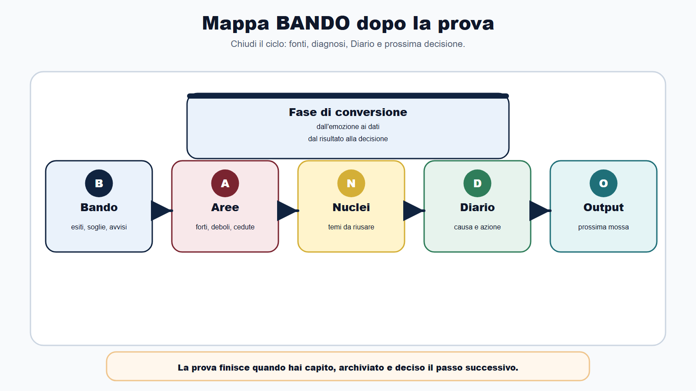
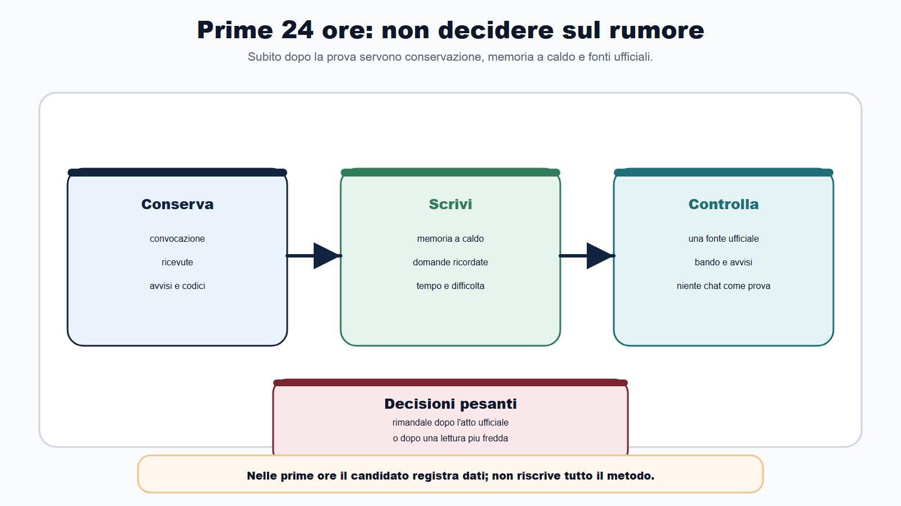
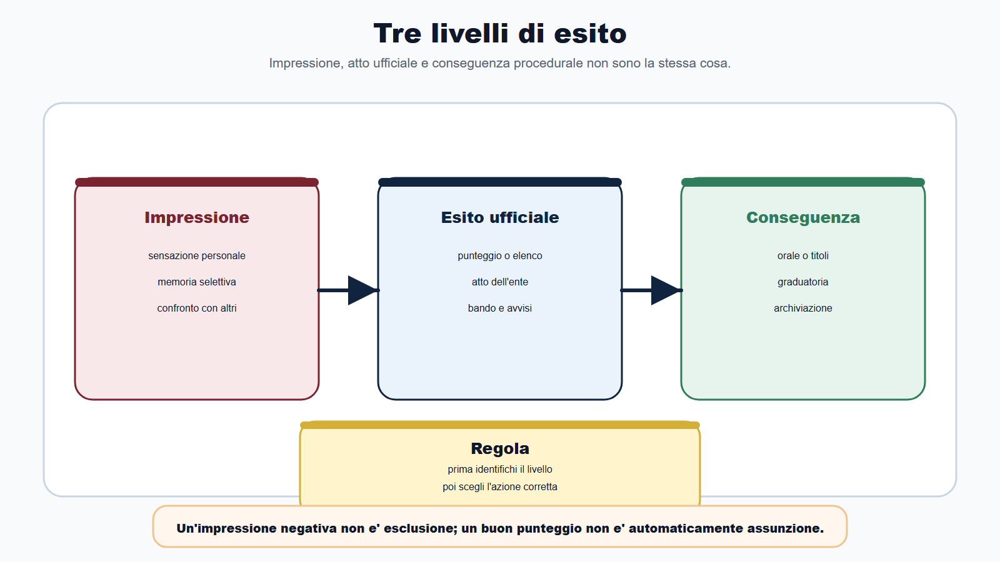
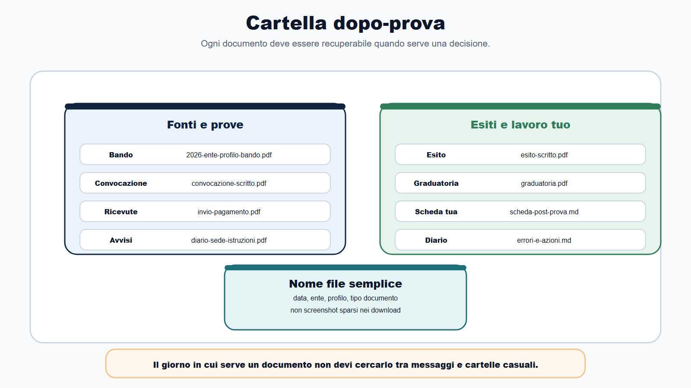
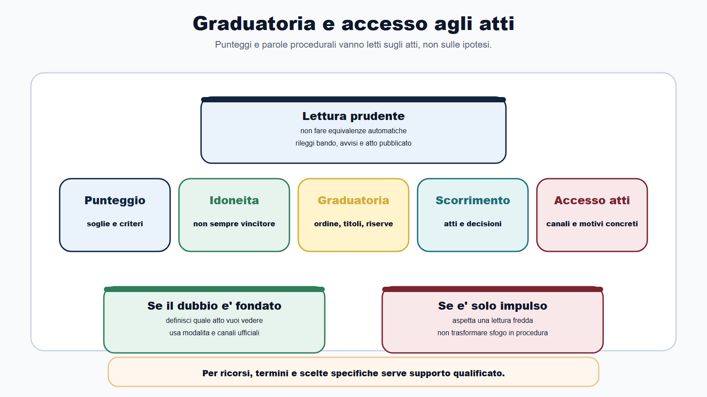
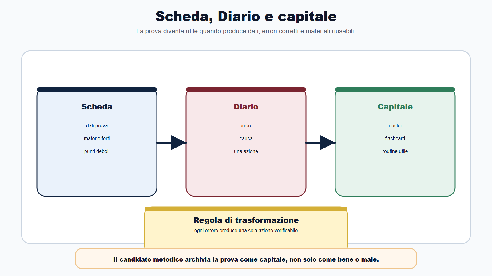
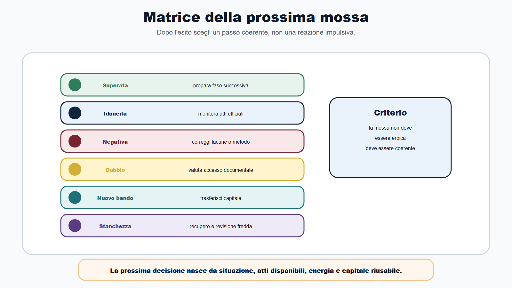

# Capitolo 30 - Dopo la prova: esiti, graduatoria e prossima mossa

> Modulo ricettario **R6** — Checklist post-prova. Collega [[books/il-metodo-bando/chapters/checklist-operative|Cap. 24]], [[books/il-metodo-bando/chapters/trasformare-ogni-concorso-in-capitale-di-studio|R2 Cap. 26]] e [[books/il-metodo-bando/chapters/aggiornare-il-metodo-dopo-il-libro|R1 Cap. 25]].

Molti candidati pensano che la prova finisca quando consegnano.

Non è così.

La prova finisce quando hai capito che cosa è successo, hai verificato gli atti ufficiali, hai trasformato l'esperienza in informazioni utili e hai deciso la prossima mossa.

Tra consegna ed esito c'è spesso una zona confusa. C'è chi dimentica tutto e aspetta. C'è chi controlla il portale ogni dieci minuti. C'è chi si convince di aver fallito per una domanda, chi si illude per una sensazione, chi butta via appunti che servirebbero ancora, chi riparte subito su un altro concorso senza correggere nulla.

Il Metodo BANDO chiude anche questa fase.

Il risultato di una prova non è soltanto un numero. È una diagnosi del tuo metodo, una fonte di capitale di studio e, in alcuni casi, l'inizio di una fase procedurale: orale, titoli, graduatoria, idoneità, scorrimento, accesso agli atti, aggiornamento del piano.

Questo capitolo serve a fare ordine.

## Obiettivo del capitolo

Alla fine del capitolo saprai:

- distinguere impressione personale, esito ufficiale e conseguenza procedurale;
- controllare le fonti corrette dopo una prova;
- leggere con prudenza avvisi, punteggi e graduatorie;
- conservare documenti e ricevute in modo utilizzabile;
- compilare una scheda post-prova in 30 minuti;
- usare il Diario degli errori anche dopo l'esame;
- capire quando valutare accesso agli atti o richieste di chiarimento;
- trasformare un risultato, positivo o negativo, nella prossima decisione di studio.

La regola è questa:

> dopo la prova non devi inseguire emozioni. Devi chiudere il ciclo.

## Mappa BANDO dopo la prova

| Fase | Domanda dopo la prova | Azione concreta |
|---|---|---|
| B - Bando | che cosa prevedono bando e avvisi per esiti, soglie e prove successive? | rileggi la sezione su comunicazioni, punteggi, graduatoria e convocazioni |
| A - Aree | quali aree hanno retto e quali hanno ceduto? | separa materie forti, materie deboli e errori di metodo |
| N - Nuclei | quali nuclei torneranno nel prossimo concorso o nell'orale? | salva schemi, domande, argomenti e definizioni riutilizzabili |
| D - Diario | perché ho perso punti, tempo o lucidità? | registra causa, prova e azione correttiva |
| O - Output | qual è il prossimo prodotto verificabile? | orale, accesso documentale, nuovo piano, simulazione o bando successivo |

Il dopo-prova non è pausa totale e non è studio casuale. È una fase di conversione: trasformi esperienza in dati.

## Le prime 24 ore: non decidere sul rumore

Nelle prime ore dopo una prova sei spesso poco affidabile come giudice di te stesso.

Puoi ricordare soltanto le domande sbagliate. Puoi sovrastimare quelle giuste. Puoi confondere difficoltà reale e stanchezza. Puoi leggere commenti online e cambiare umore dieci volte.

Per questo nelle prime 24 ore non devi prendere decisioni pesanti.

Fai solo tre cose:

1. conserva tutto ciò che hai: convocazione, ricevuta, documenti, eventuali codici, appunti consentiti, indicazioni ricevute;
2. scrivi una memoria a caldo breve: materie, domande ricordate, difficoltà, gestione tempo, problemi logistici;
3. controlla una sola volta le fonti ufficiali per capire se ci sono avvisi già pubblicati.

Non decidere di abbandonare un percorso. Non cambiare metodo. Non riscrivere tutto il piano mentre sei ancora dentro l'emozione della prova.

Aspetta l'atto ufficiale o, almeno, una lettura più fredda.

## Protocollo 24-72 ore: chiudere il ciclo senza fretta

Il dopo-prova funziona se ogni fascia temporale ha un compito preciso. Non mescolare conservazione documenti, analisi emotiva e decisioni strategiche nello stesso momento.

| Fascia | Cosa fare | Cosa non fare |
|---|---|---|
| 0-24 ore | salvare documenti, memoria a caldo breve, un solo controllo avvisi ufficiali | abbandonare il concorso, riscrivere il piano, confrontarsi con chat come fonte |
| 24-72 ore | scheda post-prova, Diario errori, classificazione capitale | aprire moduli nuovi, iscriversi a bandi a caso, refresh continuo del portale |
| 72 ore - 7 giorni | matrice prossima mossa, aggiornamento Bando Decoder se fase successiva, piano mirato | dimenticare la prova senza estrarre nulla, studiare a caso senza priorità |

Regola operativa:

- entro **24 ore** conservi e annoti;
- entro **72 ore** analizzi e registri;
- entro **7 giorni** decidi la mossa successiva con dati minimi: esito, errori, calendario, energie, concorsi compatibili.

Se la procedura è ancora aperta (orale, graduatoria, scorrimento), il protocollo non si ferma: passi in modalità monitoraggio controllato.

## Tre livelli di esito

Dopo una prova devi distinguere tre livelli.

| Livello | Che cos'è | Rischio |
|---|---|---|
| Impressione personale | ciò che pensi sia andato bene o male | può essere distorta da ansia, memoria selettiva o confronto con altri |
| Esito ufficiale | punteggio, elenco, ammissione, esclusione o comunicazione dell'ente | va letto secondo bando e avvisi, non per sentito dire |
| Conseguenza procedurale | orale, graduatoria, idoneità, scorrimento, archiviazione, ulteriori atti | dipende dalla procedura specifica |

Se confondi questi livelli, sbagli decisione.

Un'impressione negativa non significa esclusione. Un punteggio buono non significa automaticamente assunzione. Essere idoneo non equivale sempre a essere vincitore. Una graduatoria non si interpreta senza bando, riserve, titoli, soglie e avvisi.

Prima capisci il livello. Poi decidi.

## Dove controllare

Le fonti cambiano da procedura a procedura. Il candidato deve seguire ciò che indicano bando e avvisi.

In generale, dopo una prova controlla:

- il bando e le sue eventuali rettifiche;
- gli avvisi pubblicati dall'amministrazione;
- il portale inPA se la procedura passa da li;
- il sito istituzionale dell'ente o la pagina del concorso;
- eventuali comunicazioni personali previste dalla procedura;
- la Gazzetta Ufficiale o altri canali ufficiali quando il bando li richiama;
- le istruzioni ricevute in sede di prova.

Non usare chat, gruppi e commenti come fonte di decisione. Possono aiutarti a capire il clima, ma non sostituiscono l'atto ufficiale.

La domanda corretta non è: "Che cosa dicono gli altri candidati?".

La domanda corretta è: "Quale atto ufficiale devo leggere adesso?".

## La cartella dopo-prova

Ogni concorso deve avere una cartella ordinata. Non per mania archivistica, ma perché dopo la prova potresti dover recuperare in fretta un documento.

La cartella minima contiene:

- bando e rettifiche;
- domanda inviata;
- ricevute di invio e pagamento, se presenti;
- convocazioni;
- documenti di identità usati;
- avvisi su diario, sede, istruzioni e materiali ammessi;
- esiti pubblicati;
- graduatorie o elenchi;
- eventuali comunicazioni personali;
- tua scheda post-prova;
- Diario degli errori aggiornato.

Nomina i file in modo semplice:

| Tipo file | Esempio nome |
|---|---|
| Bando | 2026-ente-profilo-bando.pdf |
| Convocazione | 2026-ente-profilo-convocazione-scritto.pdf |
| Esito | 2026-ente-profilo-esito-scritto.pdf |
| Graduatoria | 2026-ente-profilo-graduatoria.pdf |
| Scheda tua | 2026-ente-profilo-scheda-post-prova.md |

Il giorno in cui ti serve un documento non devi cercarlo tra download, screenshot e messaggi.

## Graduatoria, idoneità, scorrimento: parole da trattare con prudenza

Nel linguaggio dei concorsi alcune parole sembrano semplici, ma producono effetti diversi a seconda della procedura.

| Parola | Lettura prudente |
|---|---|
| Punteggio | dato numerico da collegare a soglia, criteri e prove previste |
| Ammesso | puoi passare alla fase successiva, se prevista e secondo gli avvisi |
| Non ammesso | non passi alla fase successiva, salvo verifiche e tutele nei modi corretti |
| Vincitore | rientri nei posti messi a concorso secondo graduatoria e atti ufficiali |
| Idoneo | hai superato la soglia, ma potresti non rientrare subito nei posti |
| Graduatoria | atto da leggere considerando ordine, punteggi, titoli, riserve e avvisi |
| Scorrimento | possibilità legata a decisioni dell'amministrazione e regole applicabili |
| Riserva | condizione prevista dalla normativa o dal bando, da verificare sugli atti |
| Rinuncia | effetto su posti e posizioni in graduatoria; verificare su avvisi ufficiali |

Questa tabella non sostituisce il bando. Serve a impedirti di fare equivalenze automatiche.

Il candidato professionale non dice: "Sono idoneo, quindi è fatta".

Dice: "Sono idoneo; ora verifico posizione, posti, riserve, avvisi, validità della graduatoria e possibili passi successivi".

## Se l'esito è positivo

Un esito positivo non autorizza disordine.

Se hai superato una prova, devi preparare il passaggio successivo. Spesso il rischio è rilassarsi proprio quando serve convertire il risultato in vantaggio.

Fai subito quattro azioni:

1. salva l'esito ufficiale;
2. rileggi cosa prevede il bando dopo quella fase;
3. controlla calendario, convocazioni, documenti e prove successive;
4. aggiorna il piano con la nuova priorità.

Se c'è un orale, non aspettare la convocazione per cominciare. Parti dai nuclei già studiati, dal Diario degli errori e dalle domande più probabili per profilo.

Se c'è una valutazione titoli, verifica documenti e dichiarazioni.

Se sei in graduatoria, tieni sotto controllo solo le fonti ufficiali e non consumare energie in ipotesi quotidiane.

Il risultato positivo va gestito. Altrimenti diventa attesa.

## Se l'esito è negativo

Un esito negativo non deve diventare una sentenza sul tuo valore.

Deve diventare una diagnosi.

Chiediti:

- ho perso per contenuti che non conoscevo?
- ho perso per domande che avevo studiato ma non richiamato?
- ho perso per tempo?
- ho perso per lettura frettolosa?
- ho perso per gestione emotiva?
- ho perso per logistica o stanchezza?
- ho scelto un concorso troppo distante dal mio capitale attuale?

La risposta non serve a consolarti. Serve a decidere.

Se la perdita è di contenuto, aggiorni nuclei e ripassi. Se è di tempo, alleni simulazioni. Se è di lettura, lavori su consegne e distrattori. Se è di scelta strategica, rivedi il portafoglio concorsi.

Il candidato che perde una prova e non registra nulla paga due volte: con il risultato e con la perdita di informazione.

## Accesso agli atti: quando serve capire, non sfogarsi

In alcune situazioni può essere utile comprendere meglio elaborati, verbali, criteri o valutazioni. Il tema rientra nel quadro dell'accesso ai documenti amministrativi, che va trattato con attenzione, seguendo la disciplina applicabile, il bando e le indicazioni dell'amministrazione.

Nel Metodo BANDO l'accesso agli atti non è una reazione emotiva. È una decisione documentale.

Prima di muoverti, compila questa scheda:

| Domanda | Risposta |
|---|---|
| Quale atto voglio vedere? | |
| Per quale motivo concreto mi serve? | |
| Dove sono indicate modalità e canale? | |
| Quali documenti devo allegare? | |
| Quali termini o istruzioni ufficiali devo rispettare? | |
| Mi serve supporto qualificato? | |

Se vuoi solo sfogarti, aspetta.

Se invece hai bisogno di capire un punteggio, verificare un elaborato o ricostruire una valutazione, muoviti con ordine, usando canali ufficiali e conservando ogni comunicazione.

Per ricorsi, termini, sospensive, impugnazioni o valutazioni sulla convenienza di agire, non improvvisare: consulta fonti ufficiali e, se necessario, un professionista qualificato.

## La scheda post-prova in 30 minuti

Compila questa scheda entro uno o due giorni dalla prova, quando ricordi ancora abbastanza ma non sei più nel picco emotivo.

| Area | Domande guida |
|---|---|
| Dati prova | data, ente, profilo, tipo prova, durata, numero quesiti o tracce |
| Sensazione generale | facile, media, difficile, disordinata, prevedibile, inattesa |
| Materie forti | dove ho risposto con sicurezza? |
| Materie deboli | dove ho perso tempo o lucidità? |
| Errori di contenuto | quali argomenti non conoscevo? |
| Errori di metodo | lettura, tempo, distrattori, ordine, ansia, calcolo |
| Domande ricordate | parole chiave, temi, formule, casi, definizioni |
| Fonti da aggiornare | bando, avvisi, manuale, flashcard, schemi |
| Prossima azione | orale, ripasso, accesso, nuovo concorso, recupero |

Non scrivere un romanzo. Scrivi dati.

Questa scheda diventa ponte tra prova appena fatta e preparazione successiva.

## Scheda workbook: Post-prova in 30 minuti

Compila entro 72 ore dalla prova. Una riga per campo, niente racconti.

| Campo | Compilazione |
|---|---|
| Concorso / ente / profilo | |
| Data e tipo prova | |
| Durata e numero quesiti o tracce | |
| Impressione generale (1 riga) | |
| Materie forti (max 3) | |
| Materie deboli (max 3) | |
| Errore di contenuto principale | |
| Errore di metodo principale | |
| Domande o temi ricordati (parole chiave) | |
| Atto ufficiale da attendere o controllare | |
| Documenti salvati (spunta) | convocazione / ricevuta / avvisi / esito |
| Prossima azione entro 48 ore | |
| Collegamento Diario (categoria errore) | lacuna / richiamo / tempo / lettura / ansia / logistica |

Checklist rapida post-compilazione:

| Voce | Fatto |
|---|---|
| Ho distinto impressione ed esito ufficiale | |
| Ho scritto una sola azione correttiva per errore principale | |
| Ho indicato almeno un elemento riutilizzabile (nucleo, domanda, schema) | |
| Ho evitato decisioni pesanti nelle prime 24 ore | |
| Se la procedura continua, ho aggiornato il Bando Decoder | |

Se la procedura si chiude (esclusione definitiva o fine percorso), passa alla **scheda dopo concorso** del modulo R2 (Cap. 26) entro sette giorni.

## Registro avvisi post-prova

Quando la procedura resta aperta, gli avvisi si moltiplicano: convocazioni orali, pubblicazione graduatoria, rettifiche, comunicazioni su titoli o documenti integrativi.

Tieni un registro semplice, non un diario emotivo.

| Data | Fonte ufficiale | Tipo avviso | Cosa cambia per me | Azione entro 48 ore | Prossimo controllo |
|---|---|---|---|---|---|
| | | | | | |
| | | | | | |
| | | | | | |

Frequenza consigliata:

- **fase attiva** (orale vicino, graduatoria attesa): controllo fonti 2-3 volte a settimana, finestra da 15 minuti (protocollo R1);
- **monitoraggio passivo** (idoneità in attesa di scorrimento): controllo 1 volta a settimana;
- **procedura chiusa**: archivia cartella e passa a R2.

Non controllare il portale ogni ora: consuma energia senza produrre decisioni.

## Il Diario degli errori dopo la prova

Il Diario degli errori non serve solo durante lo studio. Serve soprattutto dopo le prove vere.

Usa queste categorie:

| Categoria | Esempio | Azione |
|---|---|---|
| Lacuna | non conoscevo l'argomento | studiare nucleo e creare domanda attiva |
| Richiamo debole | sapevo ma non ricordavo | ripasso distribuito e flashcard |
| Distrattore | ho scelto opzione simile ma sbagliata | analisi delle parole chiave |
| Tempo | ho lasciato domande facili | simulazione con timer |
| Lettura | ho saltato un "non", "sempre", "salvo" | routine di sottolineatura mentale |
| Ansia | ho cambiato risposte senza criterio | protocollo di revisione finale |
| Logistica | sono arrivato stanco o disordinato | checklist documenti e percorso |

Ogni errore deve produrre una sola azione.

Se scrivi dieci azioni per un errore, non le farai. Se ne scrivi una precisa, puoi verificarla.

## Trasformare risultato in capitale

Il capitale di studio non cresce solo quando vinci. Cresce quando riusi ciò che hai imparato.

Dopo ogni prova recupera:

- domande o temi ricordati;
- argomenti ricorrenti;
- definizioni che ti sono mancate;
- schemi che hanno funzionato;
- procedure che ti hanno fatto risparmiare tempo;
- errori da trasformare in flashcard;
- simulazioni da ripetere;
- materiali validi per profili simili.

Poi classifica ogni elemento:

| Elemento | Dove va |
|---|---|
| argomento comune | nucleo comune |
| argomento specialistico | modulo profilo |
| errore ricorrente | Diario degli errori |
| domanda orale possibile | archivio orale |
| caso pratico | banca casi |
| documento ufficiale | cartella fonti |
| routine utile | checklist |

Il candidato inesperto archivia la prova come "andata bene" o "andata male".

Il candidato metodico la archivia come capitale.

## La matrice della prossima mossa

Dopo l'esito, scegli con una matrice semplice.

| Situazione | Prossima mossa |
|---|---|
| prova superata e fase successiva vicina | concentrare il piano su orale, titoli o prova successiva |
| prova superata ma tempi incerti | mantenere controllo fonti e studiare concorso compatibile |
| idoneità o graduatoria | monitorare atti ufficiali senza bloccare tutto il resto |
| esito negativo con lacune chiare | aggiornare nuclei, ripassi e simulazioni |
| esito negativo per errore di metodo | correggere routine di prova prima di aggiungere materia |
| dubbio documentale fondato | valutare accesso agli atti con canali ufficiali |
| nuovo bando molto compatibile | trasferire capitale e aprire Bando Decoder |
| stanchezza alta dopo prova | recupero breve, poi revisione fredda |

La prossima mossa non deve essere eroica. Deve essere coerente.

Prima di scegliere, verifica cinque dati minimi (dalla source consolidata):

| Dato | Domanda |
|---|---|
| Esito | punteggio, ammissione, esclusione o idoneità secondo atto ufficiale |
| probabilità fase successiva | orale previsto, titoli, graduatoria, scorrimento plausibile |
| Calendario | date certe vs date incerte nella procedura |
| Capitale riutilizzabile | nuclei, schemi, simulazioni già pronti per il passo successivo |
| Energie reali | recupero necessario o studio attivo già possibile |

Se mancano due o più dati, la mossa è **monitoraggio + registrazione**, non un salto su un nuovo concorso.

## Caso guidato

Luca partecipa a una prova scritta per un profilo amministrativo. Esce convinto di essere andato male: ha perso tempo su cinque domande, ha cambiato due risposte e ricorda solo gli errori.

La sera vorrebbe cancellare quel concorso dal calendario e iscriversi a qualunque altro bando aperto.

Applica il Metodo BANDO.

Nelle prime 24 ore salva convocazione, ricevuta, avvisi e appunti a caldo. Il giorno dopo compila la scheda post-prova. Scopre tre cose:

- le domande di procedimento amministrativo erano prevedibili e le ha gestite bene;
- le domande di contabilità gli hanno fatto perdere tempo;
- il problema maggiore è stato cambiare risposte nell'ultimo minuto senza criterio.

Quando esce l'esito ufficiale, Luca non è tra i primi ma supera la soglia per la fase successiva. Se avesse deciso sulla sensazione, avrebbe perso due giorni e lucidità.

Aggiorna il piano:

- orale su procedimento e pubblico impiego;
- ripasso mirato di contabilità;
- routine finale: modificare una risposta solo se trova un errore certo;
- controllo settimanale degli avvisi ufficiali.

La prova non è stata solo un risultato. È diventata una mappa di lavoro.

## Da sapere in 5 righe

1. Dopo la prova distingui impressione, esito ufficiale e conseguenza procedurale.
2. Bando, avvisi, sito dell'ente e canali ufficiali prevalgono su chat e commenti.
3. Graduatoria, idoneità e scorrimento vanno letti con prudenza e sugli atti.
4. L'accesso agli atti serve a capire documenti e valutazioni, non a reagire d'impulso.
5. Ogni prova deve produrre capitale di studio: errori, nuclei, routine e prossima mossa.

## Domanda da commissario

**Domanda:** perché il candidato deve distinguere tra esito personale, esito ufficiale e conseguenza procedurale?

**Risposta efficace:** perché sono tre piani diversi. L'esito personale è una percezione e può essere distorto; l'esito ufficiale è il dato pubblicato o comunicato secondo bando e avvisi; la conseguenza procedurale indica cosa accade dopo, per esempio ammissione a una prova successiva, inserimento in graduatoria o chiusura della procedura per il candidato. Confondere questi piani porta a decisioni premature o a false certezze.

## Domanda-trappola

**Domanda:** Se risulto idoneo, posso considerare concluso il percorso?

**Risposta:** no. L'idoneità indica che hai raggiunto una soglia o superato una fase secondo la procedura, ma non coincide sempre con l'essere vincitore o con l'assunzione. Devi leggere bando, graduatoria, posizione, posti, riserve, avvisi e atti successivi.

## Errore tipico

L'errore tipico è buttare via una prova negativa.

Il candidato dice: "È andata male, passo oltre".

Ma se passa oltre senza analisi, porta gli stessi errori nel concorso successivo. La domanda giusta non è: "Come dimentico questa prova?". La domanda giusta è: "Che cosa devo estrarre prima di archiviarla?".

## Mini-esercizio

Compila questa scheda dopo la prossima prova o dopo l'ultima prova già sostenuta.

| Domanda | Risposta |
|---|---|
| Quale atto ufficiale devo attendere o controllare? | |
| Quali documenti ho salvato? | |
| Quali tre materie hanno retto meglio? | |
| Quali tre punti hanno prodotto difficoltà? | |
| Ho perso punti per contenuto, tempo, lettura, ansia o logistica? | |
| Quale errore devo trasformare in flashcard o domanda orale? | |
| Quale nucleo posso riusare nel prossimo concorso? | |
| Devo preparare una fase successiva? | |
| Serve valutare accesso agli atti o chiarimenti ufficiali? | |
| qual è la prossima mossa entro 48 ore? | |

La scheda è utile solo se produce un'azione concreta.

## Checklist dopo prova

Prima di archiviare una prova, verifica:

- ho salvato bando, avvisi, convocazione e ricevute;
- ho controllato i canali ufficiali indicati dalla procedura;
- ho distinto impressione personale ed esito ufficiale;
- ho letto soglie, punteggi e graduatoria senza automatismi;
- ho compilato la scheda post-prova;
- ho aggiornato il Diario degli errori;
- ho estratto almeno cinque elementi riutilizzabili;
- ho aggiornato il Bando Decoder se c'è una fase successiva;
- ho deciso se serve solo monitorare, riprendere studio o chiedere chiarimenti;
- ho definito la prossima azione entro 48 ore.

Se mancano più di tre voci, la prova non è ancora chiusa.

## Chiusura operativa

Il dopo-prova è chiuso quando hai convertito l'esperienza in sistema, non quando hai smesso di pensarci.

| Azione | Fatto |
|---|---|
| Ho applicato il protocollo 24-72 ore | |
| Ho distinto impressione, esito ufficiale e conseguenza procedurale | |
| La cartella dopo-prova è ordinata e nominata | |
| Ho compilato la scheda workbook post-prova | |
| Il Diario degli errori ha almeno un errore con azione unica | |
| Ho estratto almeno cinque elementi di capitale (R2) | |
| Ho definito la prossima mossa con la matrice decisionale | |
| Se serve, ho attivato registro avvisi con frequenza controllata (R1) | |
| Se la procedura è finita, ho aperto la scheda dopo concorso (R2) | |

Una prova chiusa bene alimenta la successiva. Una prova archiviata a caso ripete gli stessi errori.

## Riferimenti consolidati

- [[sources/dopo-prova-esiti-graduatoria-metodo-bando]]
- [[sources/prove-concorsuali-quiz-scritto-orale-dpr-487-1994]]
- [[sources/checklist-operative-concorsi-metodo-bando]]
- [[sources/capitale-studio-riutilizzabile-metodo-bando]]
- [[sources/fonti-ufficiali-aggiornamento-metodo-bando-2026-06-03]]
- [[sources/legge-241-1990-procedimento-amministrativo]]
- [[topics/dopo-prova-concorsi]]
- [[topics/concorsi-pubblici]]
- [[topics/diario-errori]]
- [[topics/capitale-studio-riutilizzabile]]
- [[topics/aggiornamento-fonti-concorsi]]

## Note di review

- La struttura madre originaria non prevedeva il Capitolo 30. Questo capitolo è un'estensione editoriale: in revisione decidere se mantenerlo numerato o trasformarlo in sezione conclusiva/tool.
- Le parti su accesso agli atti, graduatorie, idoneità, scorrimenti e tutele devono essere verificate in revisione legale prima della pubblicazione.
- Il capitolo mantiene taglio operativo e non fornisce consulenza legale: per termini, ricorsi e valutazioni specifiche rinvia a fonti ufficiali e supporto qualificato.
- Scheda workbook "Post-prova in 30 minuti" e registro avvisi inseriti nel capitolo; in impaginazione valutare estrazione come PDF compilabile autonomo.
- Coordinare rimandi con Cap. 24 (checklist operative), R2 (capitale e scheda dopo concorso), R1 (controllo fonti), R15 (tra una prova e l'altra).
