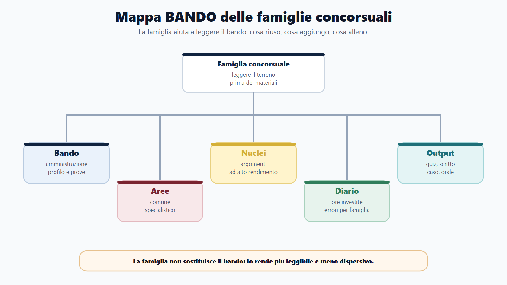
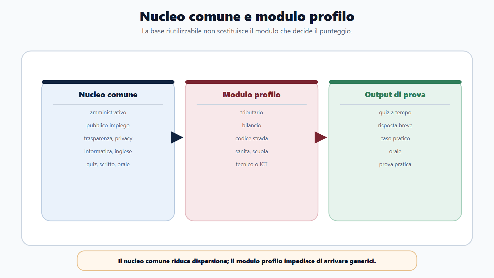
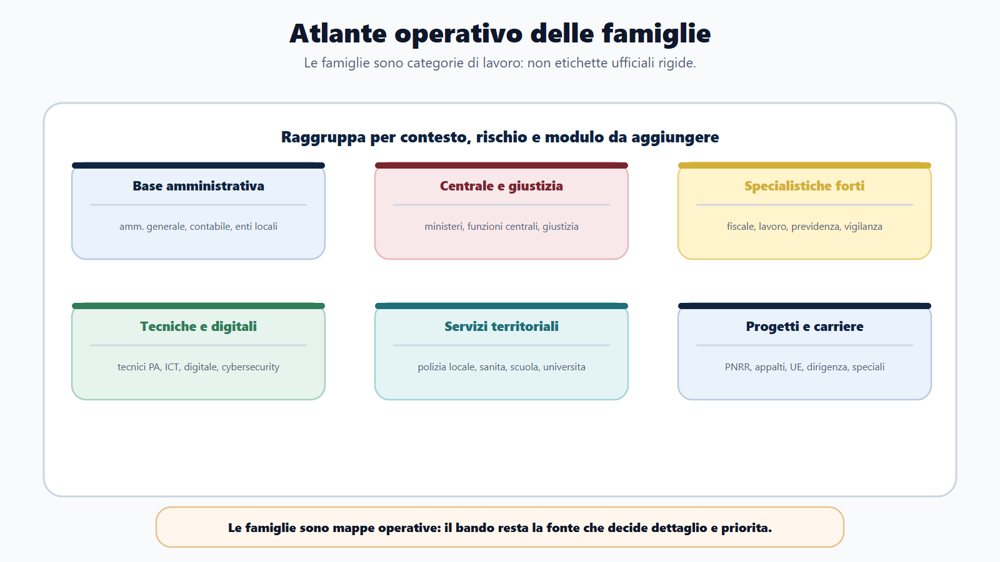
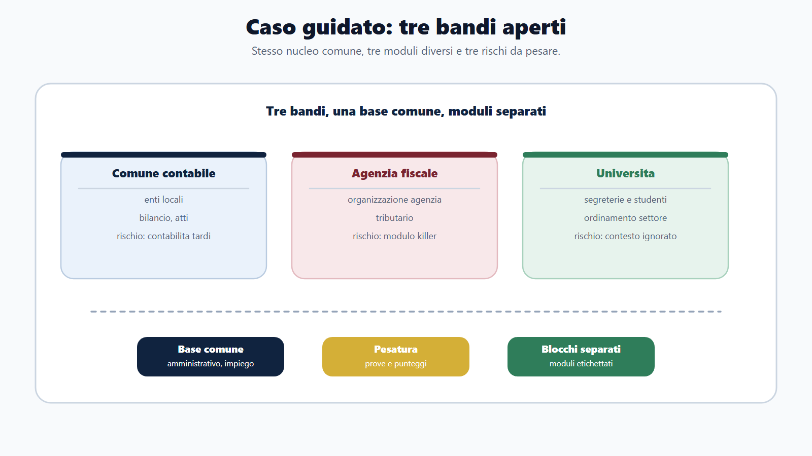

# Capitolo 19 - Le famiglie dei concorsi pubblici

Un candidato che prepara concorsi pubblici senza distinguere le famiglie concorsuali rischia di fare due errori opposti.

Il primo errore è pensare che tutti i concorsi siano uguali: stesso diritto amministrativo, stessa contabilità, stessi quiz, stesso orale. In questo modo si perde la parte specifica del profilo e si arriva alla prova con una preparazione generica.

Il secondo errore è pensare che ogni concorso sia completamente diverso dagli altri. In questo modo si ricomincia da zero ogni volta, si comprano nuovi manuali, si moltiplicano materiali e si disperde il capitale di studio già costruito.

La logica corretta sta in mezzo:

> molti concorsi condividono un nucleo comune, ma ogni famiglia cambia priorità, linguaggio, prove e rischio principale.

Questo capitolo serve a costruire la mappa. Non sostituisce il bando e non pretende di classificare ogni procedura possibile. Ti insegna a riconoscere il terreno su cui stai giocando.

## Obiettivo del capitolo

Alla fine del capitolo devi saper fare quattro cose:

1. riconoscere la famiglia concorsuale a cui appartiene un bando;
2. distinguere nucleo comune, materie di profilo e materie accessorie;
3. capire quali capitoli del libro riutilizzare subito;
4. evitare di studiare troppo ciò che pesa poco e troppo poco ciò che pesa molto.

La domanda guida è:

> Questo concorso a quale famiglia appartiene e che cosa cambia davvero nel mio piano?

## Mappa BANDO del capitolo

| Passaggio | Domanda operativa | Output |
|---|---|---|
| B - Bando | Quale amministrazione assume? Per quale profilo? Con quali prove? | Identikit del concorso |
| A - Aree | Quali materie sono comuni e quali sono specialistiche? | Divisione core/modulo |
| N - Nuclei | Quali argomenti danno più rendimento in questa famiglia? | Lista priorità |
| D - Diario | Dove sto investendo ore? Dove sto sbagliando? | Diario per famiglia |
| O - Output | Che cosa devo produrre in prova? Quiz, scritto, caso, orale, pratica? | Simulazione coerente |

La famiglia concorsuale non è una scorciatoia per saltare il bando. È un modo per leggerlo meglio.

## Che cosa significa famiglia concorsuale

Una famiglia concorsuale è un gruppo di concorsi che tende a condividere:

- tipo di amministrazione;
- profili professionali;
- materie ricorrenti;
- struttura delle prove;
- difficoltà tipiche;
- lessico amministrativo;
- errori frequenti dei candidati.

Per esempio, due concorsi possono chiedere entrambi diritto amministrativo. Ma un concorso comunale lo userà spesso per procedimento, accesso, atti dell'ente, competenze di organi e responsabili. Un concorso per agenzia fiscale lo collegherà più facilmente a poteri, procedimenti, accertamento, organizzazione dell'agenzia e disciplina tributaria. Un concorso tecnico lo può chiedere come cornice per autorizzazioni, contratti, responsabilità, gestione documentale e rapporto con cittadini o imprese.

La materia è la stessa. Il modo in cui rende punteggio cambia.

## Le quattro domande per riconoscere la famiglia

Quando apri un bando, non partire subito dall'elenco delle materie. Prima rispondi a queste domande.

| Domanda | perché conta |
|---|---|
| Chi assume? | Comune, ministero, agenzia, università, azienda sanitaria o ente previdenziale cambiano contesto e lessico. |
| Per quale profilo? | Assistente, istruttore, funzionario, tecnico, contabile, ispettivo o informatico non richiedono la stessa prestazione. |
| Quale funzione svolgerà il vincitore? | Sportello, segreteria, istruttoria, controllo, gestione fondi, bilancio, vigilanza, supporto tecnico, sistemi digitali. |
| Quale prova seleziona davvero? | Quiz a tempo, scritto teorico-pratico, orale, prova pratica o situazionale cambiano il modo di studiare. |

Solo dopo queste quattro domande il programma ha senso.

## Il nucleo comune

Il Metodo BANDO parte da un'idea pratica: una parte della preparazione è riutilizzabile.

Nei concorsi amministrativi e para-amministrativi ricorrono spesso:

- elementi di diritto costituzionale;
- diritto amministrativo;
- procedimento, provvedimento, accesso e trasparenza;
- pubblico impiego e codice di comportamento;
- anticorruzione, privacy e responsabilità;
- informatica, PA digitale e sicurezza di base;
- inglese;
- logica, comprensione e ragionamento;
- capacità di rispondere a quiz, scritto, casi e orale.

Questo è il capitale comune. Non significa che basti sempre. Significa che, se lo studi bene, non lo perdi quando cambi bando.

Il problema nasce quando il candidato confonde "comune" con "sufficiente". Nei profili fiscali serve il modulo tributario. Nei profili contabili serve il modulo bilancio. Nei profili tecnici serve il modulo tecnico. Nei profili di polizia locale serve il modulo di settore. Il nucleo comune è la base, non l'intera casa.

## Famiglia 1 - Amministrativo generale

È la famiglia più trasversale. Compare in comuni, ministeri, enti pubblici, università, aziende sanitarie, camere di commercio, agenzie e amministrazioni centrali.

Profili tipici:

- assistente amministrativo;
- istruttore amministrativo;
- funzionario amministrativo;
- collaboratore amministrativo;
- addetto a segreteria, protocollo, personale, servizi generali;
- profili di supporto amministrativo in enti specialistici.

Materie ricorrenti:

- diritto amministrativo;
- diritto costituzionale essenziale;
- pubblico impiego;
- trasparenza, anticorruzione e privacy;
- procedimento e accesso;
- documentazione amministrativa;
- elementi di contabilità o contratti, se indicati;
- informatica, inglese e logica.

Rischio principale:

> restare generici.

Il candidato studia molte definizioni ma non sa applicarle a un ufficio. Non basta dire "provvedimento amministrativo": bisogna capire chi lo adotta, come nasce, quali vizi può avere, come si comunica, come si impugna e come si collega al procedimento.

Strategia:

- costruisci prima una base forte di amministrativo e pubblico impiego;
- collega ogni istituto a un esempio di ufficio;
- allena quiz e risposte brevi;
- se il bando prevede orale, prepara collegamenti tra procedimento, trasparenza, privacy e comportamento del dipendente.

## Famiglia 2 - Amministrativo-contabile

Questa famiglia aggiunge alla base amministrativa una quota significativa di contabilità, bilancio, entrate, spese, programmazione, controlli e contratti.

Profili tipici:

- istruttore amministrativo-contabile;
- funzionario amministrativo-contabile;
- addetto ragioneria;
- collaboratore area finanziaria;
- profili di supporto a bilancio, tributi, economato, gare, rendicontazione.

Materie ricorrenti:

- diritto amministrativo;
- ordinamento dell'ente;
- contabilità pubblica;
- bilancio, programmazione, entrate e spese;
- contratti pubblici essenziali;
- controlli;
- trasparenza e anticorruzione;
- elementi di diritto tributario o tributi locali, se previsti.

Rischio principale:

> studiare contabilità troppo tardi.

Molti candidati arrivano da percorsi giuridici e rimandano bilancio e contabilità. Il risultato è che sanno parlare di procedimento ma inciampano su impegno, liquidazione, PEG, DUP, rendiconto, residui o controlli.

Strategia:

- non lasciare contabilità alla fine;
- costruisci una mappa del ciclo entrata-spesa;
- collega bilancio e atti amministrativi;
- allena domande pratiche: "quale atto serve?", "chi è competente?", "qual è il vincolo finanziario?".

## Famiglia 3 - Enti locali

I concorsi degli enti locali hanno una caratteristica: sono molto concreti. Il candidato non studia solo la PA in astratto, ma l'ente vicino al cittadino.

Profili tipici:

- istruttore amministrativo;
- istruttore contabile;
- funzionario amministrativo;
- funzionario tecnico;
- agente o istruttore di polizia locale;
- educatore, assistente sociale, bibliotecario, comunicatore, tecnico ambiente o protezione civile.

Materie ricorrenti:

- ordinamento degli enti locali;
- organi del comune;
- competenze di consiglio, giunta, sindaco, dirigenti e responsabili;
- procedimento amministrativo;
- accesso, trasparenza, privacy;
- pubblico impiego locale;
- contabilità degli enti locali;
- contratti pubblici;
- servizi al cittadino.

Rischio principale:

> non distinguere organi politici e gestione amministrativa.

Nei concorsi comunali, la commissione può chiedere chi decide, chi firma, chi gestisce, chi controlla, chi risponde. La distinzione tra indirizzo politico e gestione non è teoria: è la grammatica dell'ente locale.

Strategia:

- studia l'ente come organismo;
- fai schemi organo/funzione/atto;
- usa casi: accesso agli atti, richiesta del cittadino, impegno di spesa, determinazione, deliberazione, ordinanza;
- se il profilo è contabile o tecnico, non perdere la base amministrativa.

## Famiglia 4 - Ministeri e funzioni centrali

Questa famiglia comprende concorsi presso ministeri, presidenza, agenzie o strutture centrali. Il profilo può essere amministrativo, giuridico, contabile, tecnico, informatico, ispettivo o specialistico.

Profili tipici:

- assistente amministrativo;
- funzionario amministrativo;
- funzionario giuridico;
- funzionario contabile;
- funzionario tecnico;
- profili nei ministeri della giustizia, interno, economia, cultura, ambiente, esteri.

Materie ricorrenti:

- diritto costituzionale e organizzazione dello Stato;
- diritto amministrativo;
- pubblico impiego;
- ordinamento dell'amministrazione specifica;
- trasparenza, anticorruzione, privacy;
- contratti, contabilità o disciplina settoriale;
- inglese, informatica e competenze trasversali.

Rischio principale:

> preparare un ministero come se fosse un comune.

Il nucleo comune resta valido, ma il contesto cambia. In un ministero contano funzioni centrali, organizzazione, competenze, procedimenti nazionali, relazioni tra amministrazioni e settore specifico.

Strategia:

- dopo il nucleo comune, studia l'ordinamento dell'amministrazione;
- individua parole chiave del settore;
- prepara risposte che collegano funzione pubblica e servizio concreto;
- per i concorsi RIPAM o multi-amministrazione, leggi con attenzione profili e codici concorso.

## Famiglia 5 - Giustizia

I concorsi dell'area giustizia hanno una logica specifica. Anche quando il profilo non è magistratuale, l'ambiente di lavoro è fatto di uffici giudiziari, cancellerie, procedure, atti, notifiche, fascicoli, servizi di supporto e organizzazione.

Profili tipici:

- assistente giudiziario;
- funzionario giudiziario;
- cancelliere;
- operatore o assistente tecnico;
- profili amministrativi e tecnici del Ministero della giustizia.

Materie ricorrenti:

- diritto amministrativo e pubblico impiego;
- ordinamento giudiziario o dell'amministrazione della giustizia;
- elementi di procedura civile o penale, se previsti;
- servizi di cancelleria e gestione documentale;
- informatica e strumenti digitali;
- inglese e competenze trasversali.

Rischio principale:

> ignorare il contesto dell'ufficio giudiziario.

Non serve trasformare il libro base in un manuale di procedura civile o penale, ma il candidato deve capire che il profilo giustizia ha un lessico proprio.

Strategia:

- parti dal programma del bando;
- separa materie amministrative da materie processuali;
- non studiare procedura avanzata se il bando chiede solo elementi;
- prepara esempi di ufficio: fascicolo, comunicazione, scadenza, servizio all'utenza, riservatezza.

## Famiglia 6 - Agenzie fiscali

Le agenzie fiscali sono una famiglia ad alta specializzazione. Il nucleo comune serve, ma non basta.

Profili tipici:

- funzionario giuridico-tributario;
- funzionario tributario;
- funzionario tecnico-catastale;
- profili economico-finanziari;
- profili informatici e data oriented.

Materie ricorrenti:

- diritto tributario;
- diritto civile o commerciale, se previsto;
- contabilità aziendale o economia, se prevista;
- diritto amministrativo;
- organizzazione dell'agenzia;
- procedure, controlli, accertamento, servizi al contribuente;
- catasto, estimo o materie tecniche per profili tecnici.

Rischio principale:

> considerare il tributario una materia accessoria.

Se il bando è fiscale, il modulo fiscale può decidere il risultato. Il candidato che conosce solo il nucleo amministrativo resta incompleto.

Strategia:

- proteggi tempo per il modulo tributario o tecnico;
- usa il nucleo comune come supporto, non come sostituto;
- fai quiz e schemi sulle differenze tra istituti;
- allena domande che chiedono applicazione, non solo definizione.

## Famiglia 7 - Previdenza, lavoro e vigilanza

Questa famiglia comprende concorsi in enti previdenziali, assicurativi, lavoro, ispettorato e vigilanza.

Profili tipici:

- consulente protezione sociale;
- funzionario amministrativo previdenziale;
- ispettore di vigilanza;
- funzionario lavoro;
- profili di supporto a servizi per cittadini, imprese e lavoratori.

Materie ricorrenti:

- diritto del lavoro;
- legislazione sociale;
- previdenza e assicurazione sociale;
- diritto amministrativo;
- pubblico impiego;
- elementi di civile, commerciale o penale, se previsti;
- controlli, vigilanza, comunicazione con utenti e imprese.

Rischio principale:

> arrivare con una preparazione amministrativa ma senza linguaggio del lavoro e della previdenza.

Qui il candidato deve saper leggere situazioni che coinvolgono cittadini, aziende, contributi, tutele, controlli e servizi.

Strategia:

- studia il modulo specialistico presto;
- costruisci glossario di termini tecnici;
- collega norme e casi pratici;
- allena risposte con esempi: richiesta utente, controllo, documentazione, esito.

## Famiglia 8 - Tecnici con prova amministrativa

Molti candidati tecnici pensano che il concorso si giochi solo sulla disciplina tecnica. Spesso non è così.

Profili tipici:

- funzionario tecnico;
- istruttore tecnico;
- ingegnere, architetto, geometra;
- tecnico ambiente, urbanistica, edilizia, lavori pubblici;
- tecnico informatico o digitale;
- tecnico catastale.

Materie ricorrenti:

- disciplina tecnica di settore;
- procedimento amministrativo;
- accesso, trasparenza e privacy;
- contratti pubblici;
- sicurezza, responsabilità, controlli;
- elementi di PA digitale;
- ordinamento dell'ente.

Rischio principale:

> sapere la tecnica ma non saperla collocare dentro la PA.

Una risposta tecnica concorsuale deve rispettare competenza, procedimento, motivazione, documentazione, tracciabilità e responsabilità.

Strategia:

- non separare tecnica e amministrazione;
- studia casi: permesso, autorizzazione, affidamento, manutenzione, verifica, sopralluogo;
- prepara lessico amministrativo minimo;
- se c'è prova pratica, simula elaborati o relazioni.

## Famiglia 9 - ICT e digitale

I profili ICT nella PA non sono identici ai profili informatici privati. Oltre a sistemi, reti, dati, sicurezza e software, conta il contesto pubblico: servizi digitali, identità digitale, protocollo, interoperabilità, privacy, accessibilità, sicurezza e procurement.

Profili tipici:

- funzionario informatico;
- sistemista;
- data analyst;
- esperto transizione digitale;
- tecnico servizi digitali;
- profilo cybersecurity o infrastrutture.

Materie ricorrenti:

- informatica generale e reti;
- basi dati;
- sicurezza informatica;
- PA digitale e CAD;
- privacy e protezione dati;
- cloud, interoperabilità e servizi digitali;
- contratti ICT, se previsti;
- inglese tecnico.

Rischio principale:

> preparare informatica come materia scolastica e ignorare la PA digitale.

La domanda concorsuale può non chiedere solo "che cos'è un database", ma come si gestiscono dati, accessi, documenti, sicurezza e servizi in un'amministrazione.

Strategia:

- collega ogni tema ICT a un servizio pubblico;
- ripassa privacy e sicurezza;
- prepara esempi su PEC, firma digitale, protocollo, identità, cloud e accessibilità;
- se il bando è tecnico, separa teoria, strumenti e casi applicativi.

## Famiglia 10 - Polizia locale

La polizia locale è una famiglia autonoma dentro l'universo degli enti locali. Ha contatto diretto con cittadini, territorio, sicurezza, circolazione, sanzioni e regolamenti.

Profili tipici:

- agente di polizia locale;
- istruttore di vigilanza;
- ufficiale o funzionario di polizia locale;
- profili amministrativi di supporto alla vigilanza.

Materie ricorrenti:

- ordinamento enti locali;
- codice della strada, se previsto;
- sanzioni amministrative;
- polizia amministrativa;
- sicurezza urbana;
- regolamenti comunali;
- diritto amministrativo;
- elementi di penale o procedura, se previsti.

Rischio principale:

> trattare la polizia locale come un profilo amministrativo qualunque.

Il nucleo comune serve, ma il modulo di settore è forte. Nel libro base si indicano le priorità; l'approfondimento dettagliato del codice della strada resta modulo specialistico.

Strategia:

- leggi con precisione le materie del bando;
- separa parte comunale, parte sanzionatoria e parte di sicurezza;
- allena casi situazionali con cittadini;
- cura forma fisica o requisiti solo se previsti dal bando, senza presumere.

## Famiglia 11 - sanità amministrativa

La sanità amministrativa non coincide con le professioni sanitarie. Riguarda amministrazione, personale, acquisti, servizi, front office, CUP, documentazione, privacy, bilancio e organizzazione sanitaria.

Profili tipici:

- collaboratore amministrativo professionale;
- assistente amministrativo;
- funzionario amministrativo;
- addetto a segreteria, personale, gare, contabilità, servizi all'utenza.

Materie ricorrenti:

- diritto amministrativo;
- pubblico impiego;
- organizzazione del servizio sanitario;
- privacy e dati sanitari;
- trasparenza;
- contabilità o acquisti, se previsti;
- servizi al cittadino.

Rischio principale:

> sottovalutare privacy, organizzazione e lessico sanitario.

In sanità, il rapporto con dati personali e dati particolari è delicato. Il candidato deve evitare risposte approssimative su documenti, accesso e informazioni all'utente.

Strategia:

- studia bene privacy e riservatezza;
- collega amministrativo e servizi;
- prepara esempi di sportello e documentazione;
- se il bando chiede ordinamento sanitario, trattalo come modulo.

## Famiglia 12 - Scuola, ATA e università

Questa famiglia comprende personale amministrativo, tecnico e ausiliario della scuola, profili universitari e personale degli enti di ricerca. Ha regole proprie e un forte rapporto con studenti, docenti, famiglie, segreterie, didattica, personale e servizi.

Profili tipici:

- assistente amministrativo;
- assistente tecnico;
- funzionario amministrativo;
- personale universitario area amministrativa o tecnica;
- segreteria studenti;
- supporto didattico, ricerca, contabile o tecnico.

Materie ricorrenti:

- diritto amministrativo;
- pubblico impiego;
- ordinamento scolastico o universitario, se previsto;
- documentazione, privacy, trasparenza;
- contabilità e gestione, se previste;
- informatica e inglese.

Rischio principale:

> studiare solo amministrativo generale e ignorare l'ordinamento del settore.

Strategia:

- verifica se il bando chiede ordinamento scolastico, universitario o ricerca;
- studia casi di segreteria, accesso, privacy, documenti, graduatorie e servizi;
- per profili tecnici, non perdere la parte amministrativa.

## Famiglia 13 - Socio-educativo, cultura, comunicazione, ambiente e protezione civile

Queste famiglie sono meno standardizzate, ma ricorrenti. Hanno in comune una forte componente di servizio e di settore.

Profili tipici:

- educatore;
- assistente sociale;
- bibliotecario;
- istruttore comunicazione;
- tecnico ambiente;
- protezione civile;
- cultura, musei, archivio, turismo.

Materie ricorrenti:

- diritto amministrativo e ordinamento dell'ente;
- disciplina di settore;
- servizi pubblici;
- privacy e comunicazione;
- appalti o gestione progetti, se previsti;
- elementi di sicurezza o protezione, se richiesti.

Rischio principale:

> non capire quale parte del programma è veramente selettiva.

In questi profili la materia specialistica può pesare più della base giuridica. Ma senza base giuridica la risposta resta poco amministrativa.

Strategia:

- identifica il servizio concreto;
- separa norme generali e disciplina di settore;
- prepara esempi di relazione con utente, progetto, procedimento e responsabilità.

## Famiglia 14 - Appalti, PNRR, fondi UE e project support

Questa famiglia cresce quando le amministrazioni assumono personale per gare, progetti, rendicontazione, digitalizzazione, investimenti e controlli.

Profili tipici:

- esperto contratti;
- funzionario gare;
- project officer;
- rendicontatore;
- supporto PNRR o fondi europei;
- amministrativo tecnico di progetto.

Materie ricorrenti:

- contratti pubblici;
- contabilità e rendicontazione;
- trasparenza e anticorruzione;
- gestione documentale;
- controlli;
- elementi di fondi UE o PNRR, se previsti;
- project management pubblico.

Rischio principale:

> pensare che basti sapere il Codice dei contratti.

Spesso servono anche programmazione, atti, controlli, tracciabilità, rendicontazione e responsabilità.

Strategia:

- usa il ciclo: fabbisogno, programmazione, affidamento, esecuzione, controllo, pagamento, rendicontazione;
- collega contratti e contabilità;
- prepara casi su acquisto, urgenza, documentazione, errore e controllo.

## Famiglia 15 - Dirigenza, carriere speciali e corpi uniformati

Queste famiglie hanno regole, prove e requisiti spesso molto specifici. Nel libro base vanno riconosciute, non sviluppate in profondità.

Profili tipici:

- dirigente amministrativo;
- dirigente tecnico;
- carriera prefettizia;
- carriera diplomatica;
- corpi di polizia e forze armate;
- carriere speciali.

Materie ricorrenti:

- diritto pubblico avanzato;
- management pubblico;
- organizzazione, performance, responsabilità;
- prove scritte articolate;
- casi, temi, lingua, attitudinali o prove fisiche, se previste;
- disciplina speciale della carriera.

Rischio principale:

> applicare un metodo da concorso base a una selezione avanzata.

La logica BANDO resta valida, ma il volume base non può coprire tutto. Qui servono moduli dedicati.

Strategia:

- usa questo libro per metodo, nucleo e organizzazione;
- valuta subito requisiti, prove e tempi;
- aggiungi manuali specialistici;
- non sottovalutare orale, temi e assessment.

## La matrice comune-specialistico

Per ogni famiglia devi costruire una matrice semplice.

| Area | Domanda | Esempio |
|---|---|---|
| Comune | Che cosa posso riutilizzare da altri concorsi? | amministrativo, pubblico impiego, trasparenza |
| Profilo | Che cosa distingue questo ruolo? | tributario, bilancio, codice strada, sanità, catasto |
| Prova | Come verrà misurata la competenza? | quiz, orale, caso, elaborato, prova pratica |
| Rischio | Dove posso perdere punti anche studiando tanto? | modulo specialistico, tempo, lessico, casi |
| Taglio | Che cosa non devo approfondire ora? | materie fuori bando o troppo avanzate |

Questa matrice impedisce allo studio di diventare una raccolta disordinata di materiali.

## Caso guidato

Un candidato trova tre bandi aperti:

- istruttore amministrativo-contabile in un comune;
- funzionario giuridico-tributario in un'agenzia fiscale;
- assistente amministrativo in un'università.

Il programma contiene in tutti e tre diritto amministrativo, pubblico impiego, inglese e informatica. Il candidato pensa: "Preparo un blocco unico e poi faccio quiz".

Il ragionamento è incompleto.

La parte comune può essere studiata insieme, ma i moduli cambiano:

- comune amministrativo-contabile: ordinamento enti locali, contabilità, bilancio, atti, servizi;
- agenzia fiscale: diritto tributario, organizzazione agenzia, procedimenti e servizi fiscali;
- università: organizzazione universitaria, segreterie, studenti, personale, contabilità o ricerca se previste.

La scelta corretta è:

1. costruire una base comune;
2. pesare le tre prove;
3. scegliere il bando prioritario;
4. dedicare blocchi separati ai moduli;
5. non mescolare quiz di famiglie diverse senza etichettarli.

## Domanda da commissario

> perché un candidato non dovrebbe studiare allo stesso modo un concorso comunale, uno ministeriale e uno per agenzia fiscale, anche se alcune materie sono identiche?

Risposta modello:

Le materie comuni consentono di riutilizzare parte della preparazione, ma il profilo cambia contesto, priorità e prestazione richiesta. Nel concorso comunale il diritto amministrativo si collega spesso a organi, atti, servizi, procedimento e bilancio locale. Nel concorso ministeriale si collega all'organizzazione centrale e alla funzione dell'amministrazione. Nell'agenzia fiscale il modulo tributario può diventare determinante. Il bando resta la fonte decisiva per distribuire tempo e scegliere gli output di allenamento.

## Domanda-trappola

> Se un bando prevede diritto amministrativo, pubblico impiego, inglese e informatica, posso prepararlo con lo stesso piano usato per qualsiasi concorso amministrativo?

No. Puoi riutilizzare una parte del piano, ma devi verificare profilo, amministrazione, prove, punteggi e materie specialistiche. Due bandi con quattro materie comuni possono avere rischi completamente diversi.

## Errore tipico

L'errore tipico è scegliere il manuale prima della famiglia.

Il candidato compra "il manuale per concorsi pubblici", lo studia in ordine e poi scopre che il proprio bando richiede una materia specialistica pesante. A quel punto non ha tempo per costruire modulo, quiz, casi e ripasso.

Correzione:

- prima famiglia;
- poi profilo;
- poi programma;
- poi materiali;
- poi piano.

## Mini-esercizio

Prendi un bando reale e compila questa griglia.

| Voce | Risposta |
|---|---|
| Amministrazione che assume | |
| Profilo | |
| Famiglia concorsuale | |
| Prove previste | |
| Materie comuni | |
| Materie di profilo | |
| Materia killer | |
| Output principale da allenare | |
| Cosa posso riutilizzare da altri concorsi | |
| Cosa devo aggiungere come modulo | |

Se non sai compilare una riga, non hai ancora decodificato il bando.

## Da sapere in 5 righe

Una famiglia concorsuale è una mappa pratica, non una categoria ufficiale rigida. Serve a capire che cosa puoi riutilizzare e che cosa devi adattare. Il nucleo comune riduce la dispersione, ma il modulo di profilo decide spesso il risultato. Il bando resta sempre la fonte principale. Un candidato strategico non studia "per concorsi": studia per famiglia, profilo e prova.

## Fonti consolidate

- [[sources/struttura-madre-il-metodo-bando]]
- [[sources/metodo-bando-progetto-editoriale]]
- [[sources/capitolo-19-20-corpus-profili-concorsuali-2026-05-30]]
- [[sources/ccnl-comparti-aree-famiglie-professionali-pa]]
- [[sources/bandi-rappresentativi-profili-concorsuali-inpa-agenzie-enti-2025-2026]]
- [[sources/prove-concorsuali-quiz-scritto-orale-dpr-487-1994]]
- [[topics/famiglie-concorsuali]]
- [[topics/moduli-profilo]]
- [[topics/nucleo-comune-concorsi-pubblici]]

## Note di review

- Le famiglie sono categorie operative del Metodo BANDO, non classificazioni ufficiali esaustive.
- Per profili specialistici avanzati servono moduli dedicati: tributario, codice della strada, sanità, scuola/università, fondi UE, dirigenza e carriere speciali.
- Prima della pubblicazione finale verificare la persistenza dei link dei bandi inPA usati come esempi rappresentativi.
