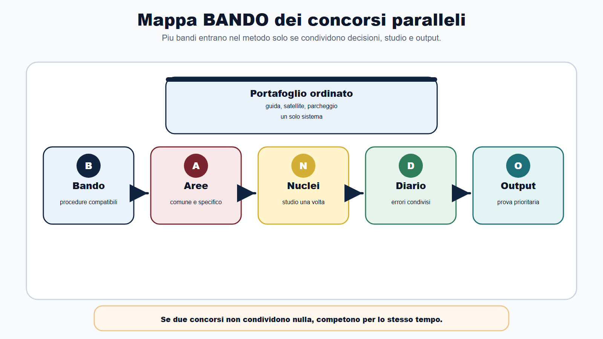
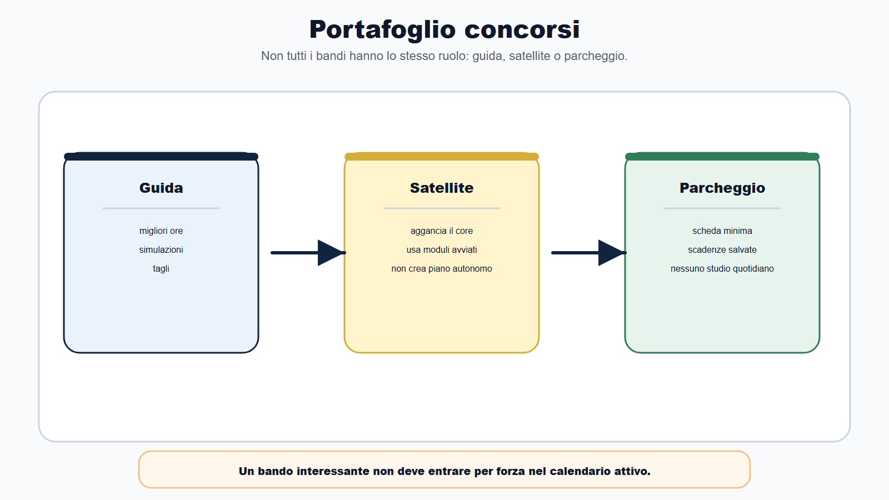
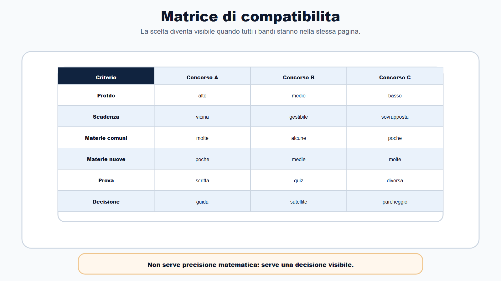
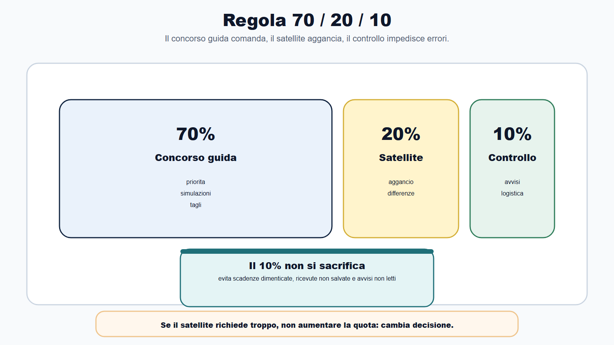
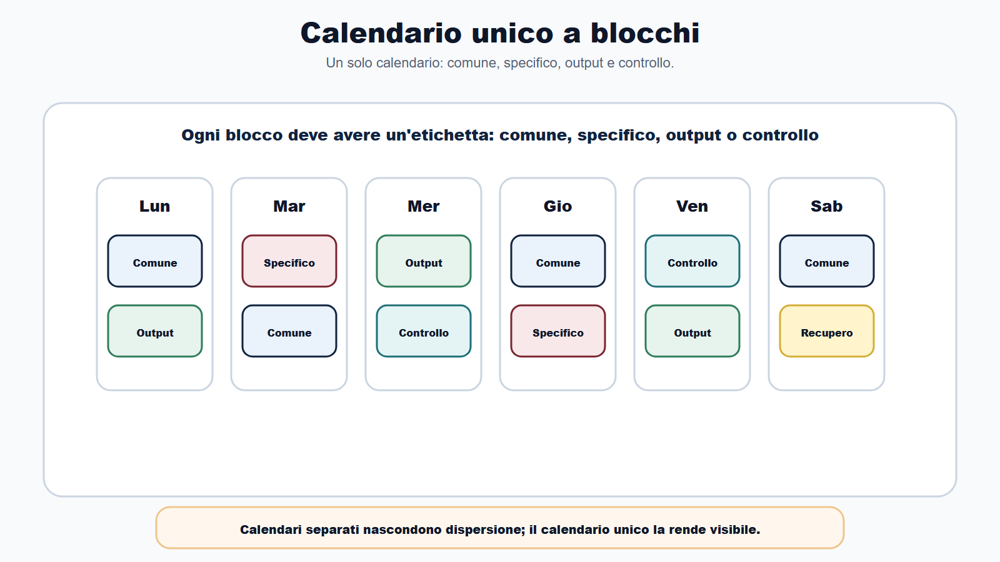
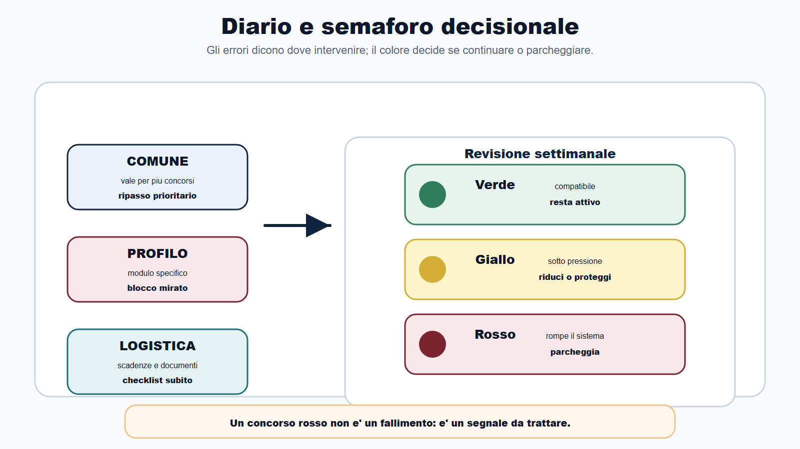
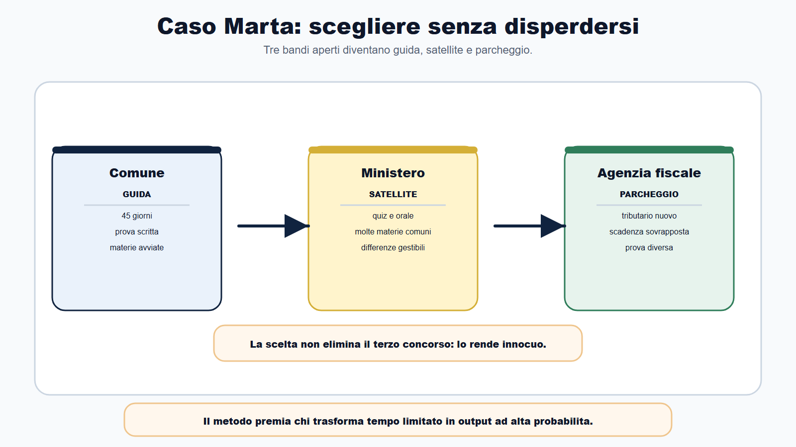

# Capitolo 27 - Gestire concorsi paralleli senza disperdersi

Il problema non e' avere un solo concorso da preparare.

Il problema vero arriva quando i bandi diventano due, tre, quattro. Uno scade tra venti giorni, uno ha materie simili ma una prova diversa, uno sembra piu vicino al tuo profilo, un altro ha piu posti. A quel punto molti candidati fanno una cosa pericolosa: aprono un calendario per ogni concorso, una cartella per ogni bando, un gruppo di appunti per ogni materia e iniziano a rincorrere tutto.

Il risultato e' prevedibile. Le ore aumentano sulla carta, ma diminuiscono nella realta. Il candidato legge molto, cambia priorita ogni giorno, salta simulazioni, accumula materiali e arriva alle prove con la sensazione di non aver chiuso nulla.

Il Metodo BANDO serve proprio qui: non per convincerti a tentare ogni procedura, ma per decidere quali concorsi possono convivere nello stesso sistema di studio.

Preparare concorsi paralleli non significa studiare tutto insieme. Significa costruire un portafoglio ordinato: un concorso guida, uno o due concorsi satellite e, se necessario, alcuni concorsi parcheggiati.

## Obiettivo del capitolo

Alla fine del capitolo saprai:

- distinguere un concorso guida da un concorso satellite;
- capire quando un bando va parcheggiato senza sensi di colpa;
- confrontare piu bandi con una matrice unica;
- distribuire il tempo senza frammentare lo studio;
- riusare nucleo comune e capitale di studio;
- attivare moduli integrativi solo quando servono davvero;
- proteggere simulazioni, ripasso e diario dagli imprevisti;
- decidere ogni settimana se continuare, ridurre o sospendere un concorso.

La regola base e' semplice:

> se due concorsi non condividono nulla, non sono paralleli: sono due preparazioni diverse che competono per lo stesso tempo.

## Mappa BANDO dei concorsi paralleli

| Fase | Domanda da farsi | Output da produrre |
|---|---|---|
| B - Bando | Quali procedure sono davvero aperte e compatibili? | Bando Decoder per ciascun concorso |
| A - Aree | Quali materie e prove si sovrappongono? | Matrice comune/specifico |
| N - Nuclei | Che cosa studio una volta sola? | Lista nuclei comuni riusabili |
| D - Diario | Quali errori valgono per piu concorsi? | Diario diviso in comune/profilo/logistica |
| O - Output | Quale prova devo allenare per prima? | Simulazioni e risposte per priorita |

Questa mappa evita l'errore piu frequente: decidere in base all'ansia. Non e' urgente cio che e' appena uscito. E' urgente cio che ha scadenza vicina, alta compatibilita con il tuo profilo, prove allenabili e un rapporto sostenibile tra tempo disponibile e materie richieste.

## Il portafoglio concorsi

Quando hai piu bandi davanti, non devi trattarli tutti allo stesso modo. Devi assegnare un ruolo.

### Concorso guida

Il concorso guida e' la procedura principale. Ha la priorita nel calendario, riceve le migliori ore della settimana, decide le simulazioni e orienta i tagli.

Di solito diventa concorso guida quando:

- il profilo e' coerente con il tuo percorso;
- le scadenze sono ravvicinate ma gestibili;
- il numero di materie nuove e' sostenibile;
- il nucleo comune gia studiato copre una parte rilevante;
- la prova e' chiara: quiz, scritto, orale, caso, prova pratica;
- puoi produrre output reali ogni settimana.

Il concorso guida non deve essere per forza quello con piu posti. Deve essere quello in cui il rapporto tra possibilita reale, tempo disponibile e capitale di studio e' piu forte.

### Concorso satellite

Il concorso satellite e' una procedura compatibile con il concorso guida. Non ha un calendario autonomo completo. Vive per aggancio: riusa il nucleo comune, condivide una parte delle prove o richiede un modulo che puoi integrare senza rompere il piano principale.

Un concorso satellite e' sostenibile se almeno due condizioni sono vere:

- condivide molte materie con il concorso guida;
- ha una prova simile;
- richiede un modulo gia avviato;
- ha scadenze che non schiacciano la prova principale;
- consente di riusare quiz, casi, risposte orali o mappe;
- non obbliga ad aprire tre nuove materie pesanti nello stesso mese.

Se il concorso satellite divora il piano del concorso guida, non e' piu satellite. E' un concorrente. E allora devi scegliere.

### Concorso parcheggiato

Parcheggiare un concorso non significa rinunciare per debolezza. Significa non permettere a un bando interessante ma poco sostenibile di distruggere una preparazione gia avviata.

Un concorso va parcheggiato quando:

- richiede troppe materie nuove;
- ha prove molto diverse da quelle che stai allenando;
- ha scadenze incompatibili con il concorso guida;
- e' poco coerente con il tuo profilo;
- aggiunge ansia ma non aumenta davvero le tue probabilita;
- ti costringerebbe a tagliare simulazioni e ripassi essenziali.

Il concorso parcheggiato resta nel sistema. Compili una scheda minima, salvi bando e scadenze, controlli eventuali aggiornamenti, ma non lo fai entrare nel calendario quotidiano.

## La matrice di compatibilita

Prima di scegliere, metti i bandi nella stessa pagina. Non in tre file diversi. Non in tre chat diverse. Una pagina unica.

| Criterio | Concorso A | Concorso B | Concorso C |
|---|---|---|---|
| Profilo coerente | Alto / medio / basso | Alto / medio / basso | Alto / medio / basso |
| Scadenza domanda | Data | Data | Data |
| Data prova nota | Si / no | Si / no | Si / no |
| Materie comuni | Numero e peso | Numero e peso | Numero e peso |
| Materie nuove | Poche / medie / molte | Poche / medie / molte | Poche / medie / molte |
| Prova principale | Quiz / scritto / orale / caso | Quiz / scritto / orale / caso | Quiz / scritto / orale / caso |
| Capitale riusabile | Alto / medio / basso | Alto / medio / basso | Alto / medio / basso |
| Moduli da attivare | Quali | Quali | Quali |
| Rischio dispersione | Basso / medio / alto | Basso / medio / alto | Basso / medio / alto |
| Decisione | Guida / satellite / parcheggio | Guida / satellite / parcheggio | Guida / satellite / parcheggio |

Non serve una precisione matematica. Serve una decisione visibile.

Se non riesci a compilare la matrice, non sei pronto a distribuire le ore. Prima decodifica i bandi, poi pianifica.

## La regola 70/20/10

Quando un concorso guida e un concorso satellite convivono, puoi partire da una distribuzione semplice:

- 70% del tempo al concorso guida;
- 20% al concorso satellite;
- 10% a monitoraggio, aggiornamenti, logistica, recupero e riordino.

Non e' una legge. E' un punto di partenza.

Se il concorso satellite condivide quasi tutto con il concorso guida, il 20% puo bastare. Se richiede molte materie nuove, non devi alzare automaticamente la quota: devi chiederti se e' ancora satellite.

Il 10% non va sacrificato. Serve a evitare errori banali: scadenze dimenticate, ricevute non salvate, avvisi non controllati, materiali duplicati, calendario non aggiornato. Nei concorsi paralleli la logistica non e' un dettaglio. E' una parte della prova.

## Calendario unico, non calendari separati

Il candidato disperso apre un calendario per ogni concorso.

Il candidato strategico costruisce un calendario unico.

La settimana deve contenere quattro tipi di blocchi:

| Blocco | Funzione | Esempio |
|---|---|---|
| Comune | Materie e abilita riusabili | amministrativo, pubblico impiego, logica, digitale |
| Specifico | Modulo di profilo o materia nuova | enti locali, tributario base, contabilita, informatica tecnica |
| Output | Prestazione da allenare | quiz, risposta sintetica, caso, orale |
| Controllo | Correzione e decisioni | diario errori, avvisi, tagli, recupero |

Questa struttura impedisce al concorso satellite di occupare spazio nascosto. Ogni blocco deve avere un'etichetta: comune, specifico, output o controllo. Se non sai che tipo di blocco stai facendo, probabilmente stai solo riempiendo tempo.

## Come trattare le materie comuni

Le materie comuni non vanno duplicate.

Se diritto amministrativo compare in due bandi, non devi creare due percorsi di amministrativo. Devi costruire un nucleo comune e poi aggiungere eventuali differenze di profilo.

Esempio:

- amministrativo generale: procedimento, provvedimento, accesso, autotutela, responsabilita;
- profilo enti locali: organi, competenze, atti, servizi, TUEL essenziale;
- profilo ministeriale: organizzazione centrale, procedimenti interni, funzione amministrativa;
- profilo contabile: programmazione, bilancio, controlli, spesa.

Il nucleo comune sta nel blocco comune. Le differenze stanno nel blocco specifico. Se mischi tutto, il piano diventa illeggibile.

## Come trattare i moduli integrativi

Un modulo integrativo non entra per interesse. Entra per necessita.

Prima di aprirlo, rispondi a cinque domande:

1. E' indicato nel bando?
2. Incide su prova, punteggio, soglia o mansioni?
3. Richiede un output specifico?
4. Si riusa anche in altri concorsi del portafoglio?
5. Quale contenuto taglio per fargli spazio?

La quinta domanda e' decisiva. Ogni modulo nuovo senza taglio compensativo crea debito di studio. All'inizio sembra solo un'aggiunta. Dopo due settimane diventa ritardo.

## Il Diario degli errori nei concorsi paralleli

Con piu concorsi attivi, il Diario degli errori deve diventare piu preciso. Non basta scrivere "errore in amministrativo" o "quiz sbagliato".

Usa tre etichette:

| Etichetta | Significato | Azione |
|---|---|---|
| COMUNE | Errore che vale per piu concorsi | ripasso prioritario e flashcard |
| PROFILO | Errore legato a un modulo specifico | blocco mirato nel calendario |
| LOGISTICA | Errore di scadenza, avviso, documento, organizzazione | checklist e controllo settimanale |

Gli errori comuni valgono doppio: correggerli migliora piu concorsi insieme. Gli errori di profilo vanno trattati, ma non devono rubare tutto il tempo al nucleo principale. Gli errori logistici vanno eliminati subito, perche non dipendono dalla preparazione teorica e possono compromettere la procedura.

## Il semaforo decisionale

Ogni settimana assegna un colore a ciascun concorso.

| Colore | Significato | Decisione |
|---|---|---|
| Verde | Compatibile e sostenibile | resta attivo |
| Giallo | Utile ma sotto pressione | riduci o proteggi il calendario |
| Rosso | Sta rompendo il sistema | parcheggia o rinvia |

Un concorso rosso non e' un fallimento. E' un segnale. Se continua a rubare ore, produce errori e impedisce simulazioni del concorso guida, sta diminuendo la qualita complessiva della preparazione.

Il Metodo BANDO non premia chi tenta tutto. Premia chi trasforma tempo limitato in output ad alta probabilita.

## Caso guidato

Marta sta preparando un concorso per istruttore amministrativo in un Comune. Ha 45 giorni alla prova scritta. Ha gia studiato procedimento amministrativo, accesso, pubblico impiego, trasparenza e contabilita base. Esce poi un bando per un ministero, profilo assistente amministrativo, con quiz e orale. Dopo una settimana esce anche un concorso in agenzia fiscale, con materie tributarie nuove.

Marta vorrebbe tentare tutto.

Applica la matrice:

- Comune: profilo coerente, prova vicina, molte materie gia avviate. Decisione: concorso guida.
- Ministero: molte materie comuni, prova a quiz compatibile, orale simile. Decisione: concorso satellite.
- Agenzia fiscale: profilo interessante, ma modulo tributario nuovo e pesante, scadenza sovrapposta, prova diversa. Decisione: parcheggio.

Nel calendario unico Marta assegna:

- quattro blocchi settimanali al concorso guida;
- un blocco satellite su quiz ministeriali e differenze di profilo;
- un blocco output comune, alternando quiz e risposta sintetica;
- un blocco controllo per avvisi, diario errori e aggiornamento Bando Decoder.

La scelta non elimina il terzo concorso. Lo rende innocuo. Marta salva bando, requisiti, scadenze e materie, ma non apre un modulo tributario mentre deve ancora consolidare lo scritto comunale.

## Da sapere in 5 righe

1. I concorsi paralleli vanno gestiti come portafoglio, non come calendari separati.
2. Il concorso guida decide priorita, simulazioni e tagli.
3. Il concorso satellite e' sostenibile solo se riusa una parte significativa del lavoro.
4. Il concorso parcheggiato non consuma studio quotidiano.
5. Ogni nuovo bando deve entrare solo dopo matrice di compatibilita e taglio compensativo.

## Domanda da commissario

**Domanda:** Come puo un candidato preparare piu concorsi pubblici senza disperdere lo studio?

**Risposta efficace:** deve partire dai bandi, non dalle impressioni. Per ogni procedura compila un Bando Decoder, confronta profilo, prove, materie, scadenze e capitale di studio gia disponibile. Poi assegna un ruolo: concorso guida, concorso satellite o concorso parcheggiato. Il calendario deve essere unico, con blocchi comuni, blocchi specifici, output e controllo. Le materie condivise si studiano una volta sola; i moduli integrativi si attivano solo se incidono davvero sulla prova e se viene deciso che cosa tagliare per farvi spazio.

## Domanda-trappola

**Domanda:** Se due concorsi hanno alcune materie uguali, conviene prepararli sempre insieme?

**Risposta:** no. La sovrapposizione di alcune materie non basta. Bisogna verificare anche scadenze, tipo di prova, peso delle materie nuove, coerenza del profilo, tempo disponibile e output richiesti. Due concorsi con amministrativo in comune ma prove, profili e moduli molto diversi possono diventare due preparazioni concorrenti. In quel caso uno va scelto come guida e l'altro va ridotto o parcheggiato.

## Errore tipico

L'errore tipico e' confondere opportunita con obbligo.

Ogni bando sembra un'occasione. Ma un'occasione non sostenibile puo rovinare una preparazione buona. Se aggiungi un concorso senza togliere qualcosa, non hai ampliato la strategia: hai aumentato il debito.

La domanda corretta non e': "Posso tentarlo?".

La domanda corretta e': "Che cosa devo togliere o riusare per tentarlo senza danneggiare il concorso guida?".

## Mini-esercizio

Scegli due o tre bandi reali o simulati e compila questa griglia.

| Passaggio | Risposta |
|---|---|
| Quale concorso e' guida? | |
| Perche e' guida? | |
| Quale concorso e' satellite? | |
| Che cosa riusa dal concorso guida? | |
| Quale concorso va parcheggiato? | |
| Quale modulo nuovo entrerebbe nel piano? | |
| Quale contenuto tagli per fargli spazio? | |
| Quale output alleni questa settimana? | |
| Quale controllo fai venerdi o domenica? | |

Se non riesci a indicare un taglio, il nuovo concorso non e' ancora sostenibile.

## Checklist operativa

Prima di aggiungere un concorso al piano, verifica:

- ho compilato il Bando Decoder;
- conosco scadenza domanda, prova, soglie e documenti;
- so quali materie sono comuni e quali nuove;
- so quale prova devo allenare;
- ho deciso se e' guida, satellite o parcheggio;
- ho aggiornato il calendario unico;
- ho inserito almeno un output verificabile;
- ho previsto il controllo avvisi;
- ho tagliato o ridotto qualcosa per fargli spazio;
- ho segnato nel diario gli errori comuni, di profilo e logistici.

Se tre voci restano vuote, il concorso non deve ancora entrare nel piano attivo.

## Riferimenti consolidati

- [[sources/gestione-concorsi-paralleli-metodo-bando]]
- [[sources/metodo-bando-progetto-editoriale]]
- [[sources/template-bando-decoder-metodo-bando]]
- [[sources/piano-studio-personale-metodo-bando]]
- [[sources/checklist-operative-concorsi-metodo-bando]]
- [[sources/matrice-materie-profili-metodo-bando]]
- [[sources/capitale-studio-riutilizzabile-metodo-bando]]
- [[topics/concorsi-paralleli]]
- [[topics/bando-decoder]]
- [[topics/piano-30-60-90-giorni]]
- [[topics/moduli-integrativi]]
- [[topics/diario-errori]]
- [[topics/capitale-studio-riutilizzabile]]

## Note di review

- La struttura madre originaria non prevedeva il Capitolo 27. Questo capitolo e' un'estensione editoriale: in revisione decidere se mantenerlo numerato, trasformarlo in epilogo operativo o integrarlo con Capitolo 26 e Appendice D.
- Il capitolo non introduce nuove fonti normative: usa conoscenza metodologica e source notes consolidate. Se in una versione futura si aggiungono esempi basati su bandi reali, verificare date, requisiti, prove e avvisi ufficiali.
- In impaginazione valutare una scheda workbook autonoma "Portafoglio concorsi" da estrarre anche come PDF compilabile.
