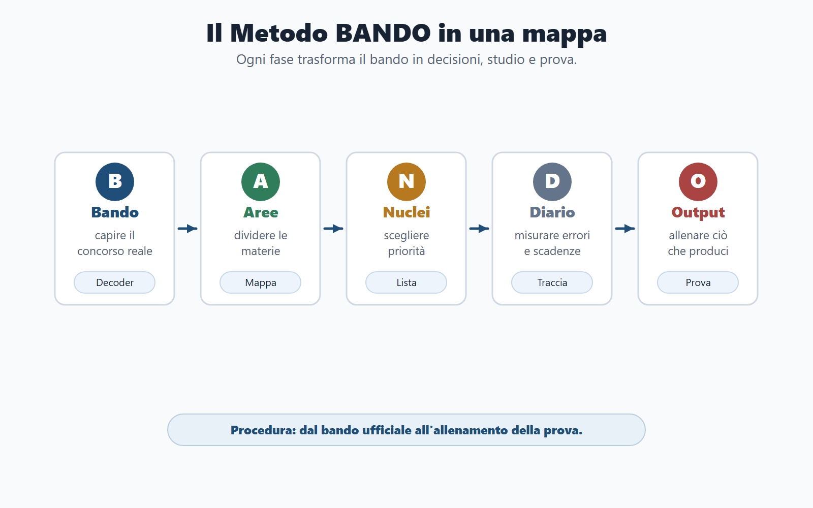
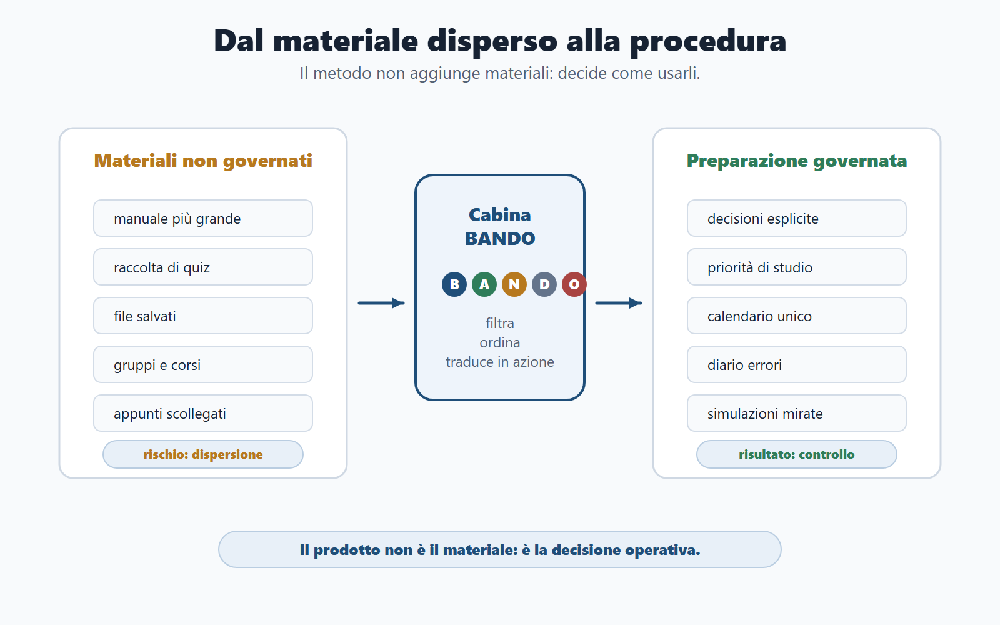
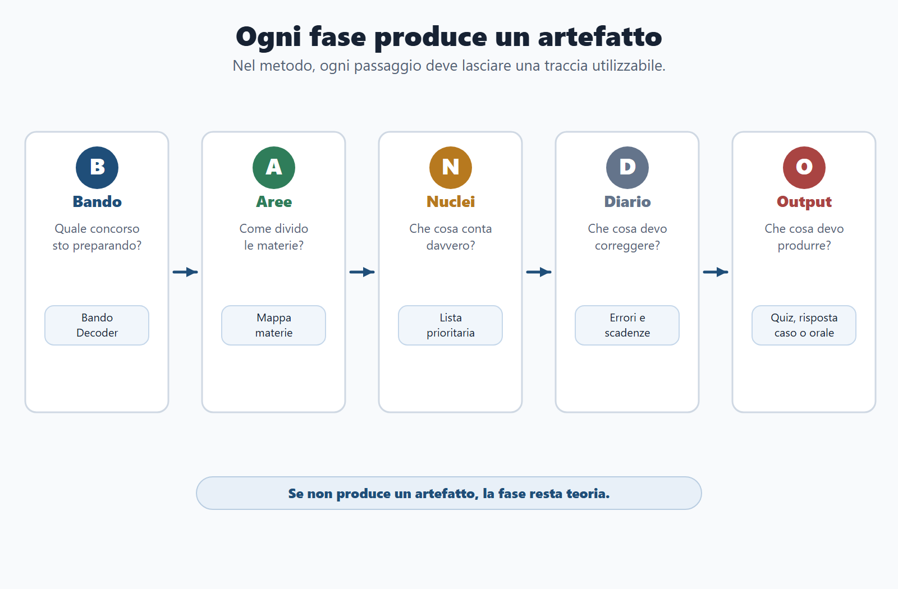
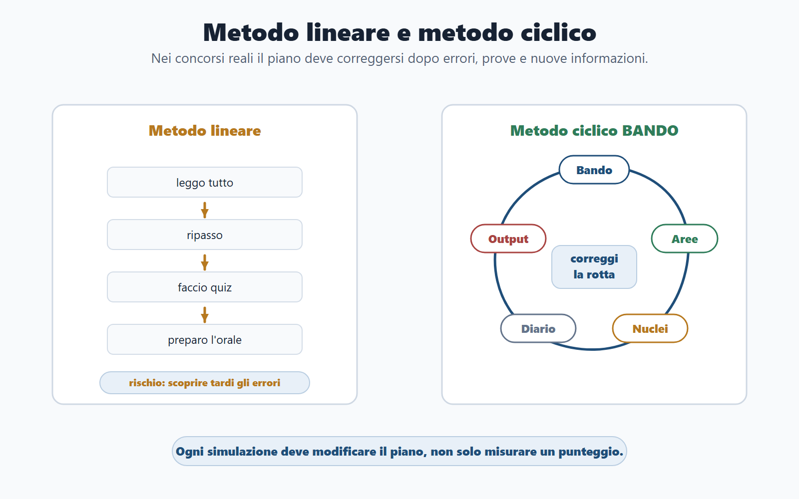
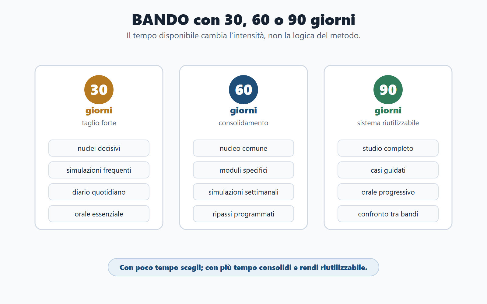

# Capitolo 3 - Il Metodo BANDO


## Perché serve un metodo

Il Metodo BANDO nasce da un problema semplice: molti candidati studiano, ma non governano la preparazione. Leggono pagine, fanno quiz, salvano file, seguono gruppi e corsi, ma non sempre sanno spiegare perché stanno studiando proprio quella materia, in quel modo, in quella settimana.

Un metodo serve a questo: trasformare una massa di materiali in una sequenza di decisioni. Il punto non è promettere che esista una scorciatoia. Il punto è evitare che ogni nuovo concorso ti costringa a ricominciare da zero.

BANDO significa:

- **Bando**: leggi e scomponi il concorso reale.
- **Aree**: dividi le materie in blocchi governabili.
- **Nuclei**: scegli i concetti che hanno più probabilità di contare.
- **Diario**: registra errori, ripassi, scadenze e decisioni.
- **Output**: allena ciò che la prova ti chiederà di produrre.

Questa non è una formula motivazionale. È una procedura di lavoro.



> *Figura 3.1 - Il Metodo BANDO trasforma il bando ufficiale in studio governato e allenamento della prova.*

## Perché il metodo è il prodotto

La concorrenza spesso offre tre cose: un manuale più grande, una raccolta di quiz più lunga o un corso più fitto. Tutte possono essere utili, ma nessuna risolve da sola il problema principale: decidere che cosa fare con il tempo che hai.

Il Metodo BANDO deve essere riconoscibile perché cambia la domanda di partenza. Non ti chiede: “quante pagine riesci a studiare?”. Ti chiede: “quale prova devi superare e quale output devi produrre?”.

Da questa domanda derivano tutte le altre:

- quali materie entrano nel nucleo comune;
- quali materie appartengono solo al profilo;
- quali argomenti hanno priorità;
- quali errori stanno rallentando il percorso;
- quale forma di allenamento serve davvero.



> *Figura 3.2 - Il valore del metodo non è accumulare materiali, ma decidere come usarli.*

## Lo schema generale

| Fase | Funzione | Prodotto concreto |
|---|---|---|
| **B - Bando** | Capire il concorso reale. | Bando Decoder compilato. |
| **A - Aree** | Separare nucleo comune e moduli specifici. | Mappa delle materie. |
| **N - Nuclei** | Scegliere i concetti decisivi. | Lista prioritaria di studio. |
| **D - Diario** | Rendere visibili errori, scadenze e ripassi. | Diario errori e calendario. |
| **O - Output** | Allenare la forma della prova. | Quiz, risposta, caso, orale o simulazione. |



> *Figura 3.3 - Ogni fase del metodo deve produrre un artefatto operativo, non solo un’intenzione.*

## B - Bando

La prima fase è leggere il bando come un documento strategico. Non basta sapere che il concorso esiste. Devi capire se puoi partecipare, quale profilo viene selezionato, quali prove affronterai, quali materie saranno valutate, quali punteggi contano, quali soglie devi superare e quali scadenze non puoi sbagliare.

Questa fase produce il Bando Decoder. Se non hai compilato almeno una scheda sintetica del concorso, non hai ancora iniziato davvero la preparazione. Hai solo raccolto materiali.

**Domande della fase B**

- Posso partecipare?
- Qual è il profilo reale?
- Quali prove sono previste?
- Quale prova elimina più candidati?
- Quali materie sono indicate in modo espresso?
- Quali punteggi e soglie modificano la strategia?
- Quali scadenze e documenti devo controllare?

## A - Aree

La seconda fase divide le materie in aree. Questo passaggio impedisce di trattare il programma come una lista piatta. Non tutte le materie hanno lo stesso ruolo.

In un concorso amministrativo, per esempio, puoi distinguere:

- area comune: Costituzione, diritto amministrativo, pubblico impiego, trasparenza, competenze digitali;
- area di profilo: enti locali, organizzazione ministeriale, sanità amministrativa, giustizia, agenzie fiscali o altro settore;
- area di prova: logica, quiz, scritto, caso pratico, orale, lingua, informatica;
- area di rischio: materie deboli, scadenze, documenti, ansia, tempo, errori ricorrenti.

Questa divisione permette di evitare due errori opposti: studiare tutto allo stesso modo oppure tagliare senza criterio.

## N - Nuclei

La terza fase seleziona i nuclei. Un nucleo è un concetto che ha alta probabilità di tornare, alta utilità trasversale o alto rischio di errore. Non coincide necessariamente con il capitolo più lungo del manuale.

Nel diritto amministrativo, per esempio, sono nuclei: procedimento, responsabile, provvedimento, accesso, silenzio, autotutela, responsabilità. Nel pubblico impiego sono nuclei: accesso tramite concorso, doveri, responsabilità, codice di comportamento, dirigenza, performance, conflitto di interessi. Nella prova a quiz sono nuclei: tempo, distrattori, errori ricorrenti e simulazioni.

Il nucleo è ciò che devi saper riconoscere, spiegare e usare.

**Regola pratica:** se un argomento non sai trasformarlo in una definizione, un esempio e una domanda da commissario, non lo possiedi ancora.

## D - Diario

La quarta fase è il diario. È la parte meno appariscente e spesso più decisiva. Il diario serve a non studiare al buio.

Un errore non registrato torna. Una scadenza non scritta si dimentica. Una materia debole non misurata sembra sempre “quasi pronta”. Il diario trasforma impressioni vaghe in dati di lavoro.

Il diario deve contenere almeno quattro elementi:

| Elemento | A cosa serve |
|---|---|
| Errori | Capire se sbagli per memoria, concetto, distrazione, tempo o strategia. |
| Ripassi | Programmare il ritorno sugli argomenti deboli. |
| Scadenze | Controllare domanda, prove, documenti e comunicazioni ufficiali. |
| Decisioni | Tracciare tagli, priorità e cambi di piano. |

Il diario non deve diventare un quaderno decorativo. Deve aiutarti a prendere decisioni migliori.

## O - Output

La quinta fase è l’output. Ogni concorso chiede al candidato di produrre qualcosa: una risposta a quiz, una risposta scritta, una soluzione a un caso, un’esposizione orale, una scelta situazionale, un documento, una griglia o una procedura.

Questo è il punto in cui molti candidati sbagliano. Confondono il possesso passivo dell’informazione con la capacità di usarla. Leggere una spiegazione sul procedimento amministrativo non equivale a rispondere a una domanda orale. Sapere che esiste il conflitto di interessi non equivale a risolvere un caso. Fare quiz senza analizzare gli errori non equivale ad allenarsi.

Nel Metodo BANDO ogni blocco di studio deve finire con un output.

| Studio | Output minimo |
|---|---|
| Ho studiato una definizione. | La spiego in cinque righe. |
| Ho letto un capitolo. | Creo tre domande possibili. |
| Ho fatto quiz. | Classifico gli errori. |
| Ho studiato un caso. | Scrivo una soluzione ordinata. |
| Ho preparato l’orale. | Rispondo ad alta voce in due minuti. |

## Metodo lineare e metodo ciclico

Il metodo tradizionale è spesso lineare: leggo tutto, poi ripasso, poi faccio quiz, poi preparo l’orale. Funziona solo se hai molto tempo, poche materie e una memoria stabile. Nei concorsi reali, spesso non è così.

Il Metodo BANDO è ciclico. Torni più volte sul bando, sulle aree, sui nuclei, sul diario e sugli output. Ogni simulazione modifica il piano. Ogni errore cambia il ripasso. Ogni nuova informazione del bando può spostare una priorità.

Il ciclo è questo:

```text
Bando -> Aree -> Nuclei -> Diario -> Output -> nuovo controllo del Bando
```

Il metodo non è rigido. È una struttura per correggere la rotta.



> *Figura 3.4 - Il Metodo BANDO è ciclico: ogni errore e ogni simulazione possono modificare il piano.*

## Esempio: concorso amministrativo comunale

Un candidato prepara un concorso per istruttore amministrativo comunale.

**Bando:** scopre che ci sono quiz e orale.
**Aree:** distingue nucleo comune, enti locali, pubblico impiego, trasparenza, informatica e inglese.
**Nuclei:** mette al centro procedimento amministrativo, organi comunali, accesso, anticorruzione, doveri del dipendente e quiz a tempo.
**Diario:** registra errori su competenze degli organi, termini procedimentali e accesso civico.
**Output:** fa simulazioni a quiz, prepara risposte orali di due minuti e risolve casi brevi su istanza del cittadino.

Il risultato non è “studiare enti locali”. Il risultato è trasformare enti locali, amministrativo e pubblico impiego in risposte da prova.

## Esempio: concorso ministeriale

Un candidato prepara un concorso per assistente amministrativo in un ente centrale.

**Bando:** nota che il profilo richiede base amministrativa, competenze digitali, inglese e organizzazione dell’amministrazione.
**Aree:** separa materie comuni e organizzazione specifica dell’ente.
**Nuclei:** privilegia diritto amministrativo di base, pubblico impiego, documenti digitali, trasparenza e quiz.
**Diario:** registra errori su definizioni, sigle, competenze e distrazioni nei quiz.
**Output:** alterna batterie a tempo, flashcard e risposte brevi.

Anche qui il metodo evita dispersione: non tutto ciò che è interessante è prioritario.

## Usare BANDO con 30, 60 o 90 giorni

Il metodo cambia intensità in base al tempo disponibile.

| Tempo disponibile | Strategia |
|---|---|
| **30 giorni** | Taglio forte. Solo nuclei decisivi, simulazioni frequenti, diario errori quotidiano, orale essenziale. |
| **60 giorni** | Nucleo comune solido, moduli specifici, simulazioni settimanali, ripassi programmati. |
| **90 giorni** | Studio più completo, casi guidati, orale progressivo, consolidamento e confronto tra bandi. |

Con 30 giorni non devi fingere di poter fare tutto. Devi scegliere. Con 60 giorni devi consolidare. Con 90 giorni devi trasformare la preparazione in sistema riutilizzabile.



> *Figura 3.5 - Il tempo disponibile cambia l’intensità del metodo: taglio, consolidamento o sistema riutilizzabile.*

## Più concorsi contemporaneamente

Molti candidati preparano più concorsi. Il rischio è duplicare tutto: un manuale per ogni bando, una cartella per ogni ente, un piano separato per ogni prova. È così che si perde controllo.

Il Metodo BANDO propone un’altra logica:

1. individua il nucleo comune;
2. costruisci un calendario unico;
3. aggiungi moduli specifici per profilo;
4. allena output diversi per prove diverse;
5. usa un solo diario errori, con etichette per concorso.

Se due bandi condividono diritto amministrativo, pubblico impiego, trasparenza e informatica, quelle materie devono diventare capitale comune. Le differenze vanno aggiunte come moduli, non come ripartenze complete.

## Il mio concorso in una pagina

Compila questa scheda dopo aver letto il bando.

| Campo | Risposta |
|---|---|
| Concorso |  |
| Ente |  |
| Profilo |  |
| Prove |  |
| Materie comuni |  |
| Materie specifiche |  |
| Materie killer |  |
| Scadenza domanda |  |
| Prima simulazione |  |
| Tre nuclei da studiare subito |  |
| Primo errore da monitorare |  |
| Output principale da allenare |  |

Questa pagina deve accompagnarti per tutto il percorso. Se non riesci a compilarla, significa che il bando non è ancora stato capito abbastanza.

## Domanda da commissario

**Domanda:** Che cosa distingue il Metodo BANDO da un normale piano di studio?

**Risposta efficace:** un piano di studio distribuisce il tempo; il Metodo BANDO parte dal bando e collega tempo, materie, nuclei, errori e output. Non dice solo “quando studiare”, ma decide che cosa ha priorità, come va allenato e quale risultato deve produrre.

## Domanda-trappola

**Domanda:** Se applico un metodo, posso evitare di studiare molte parti del programma?

**Risposta:** no. Il metodo non serve a giustificare superficialità. Serve a ordinare lo studio, scegliere le priorità e ridurre dispersione. Alcune parti potranno essere trattate in modo essenziale, altre in modo approfondito, ma la decisione deve derivare dal bando, non dalla voglia di tagliare.

## Errore tipico

L’errore tipico è usare BANDO come acronimo da ricordare e non come procedura da applicare. Se dopo aver letto questo capitolo non hai compilato un Bando Decoder, non hai diviso le aree, non hai scelto nuclei, non hai aperto un diario e non hai prodotto almeno un output, non stai ancora usando il metodo.

## Da sapere in 5 righe

1. BANDO è una procedura, non uno slogan.
2. Il bando decide il perimetro reale dello studio.
3. Le aree impediscono di confondere nucleo comune e moduli specifici.
4. I nuclei trasformano il programma in priorità.
5. Diario e output rendono misurabile il miglioramento.
