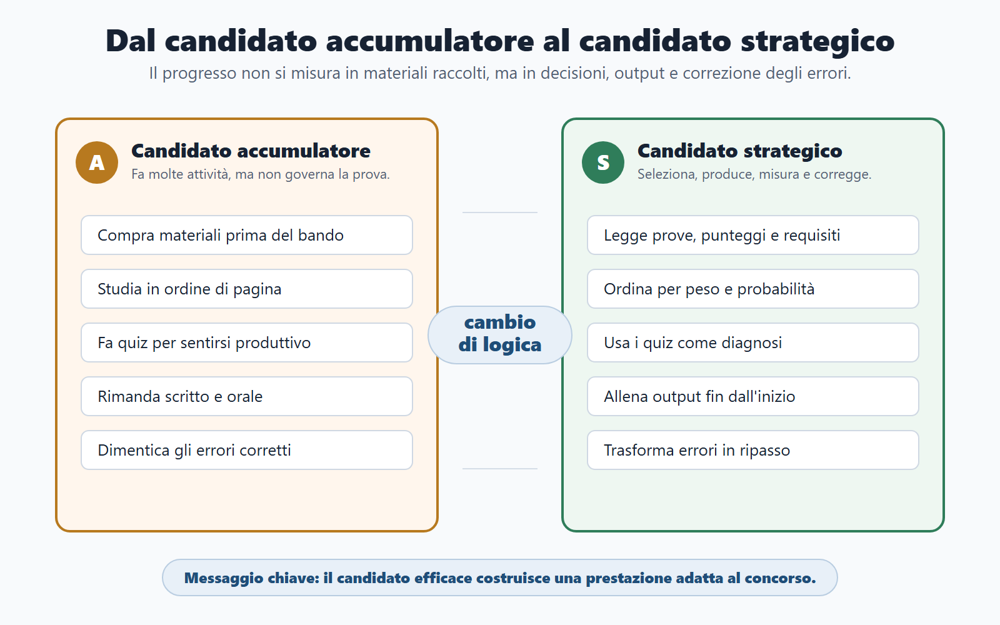
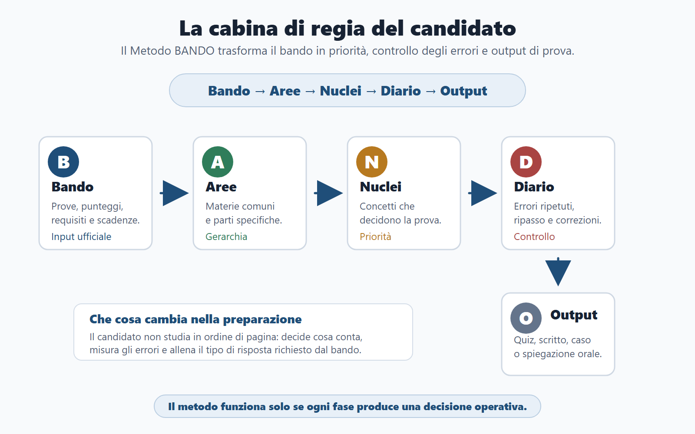
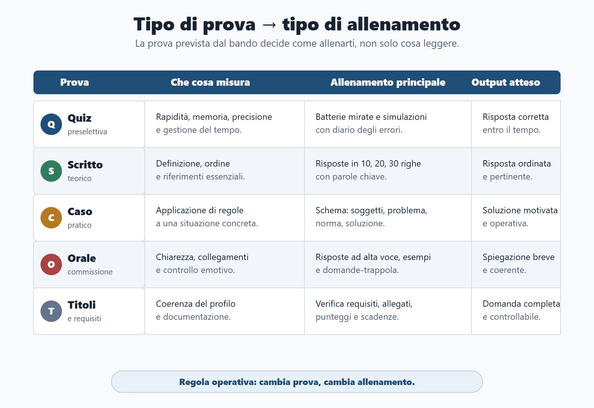
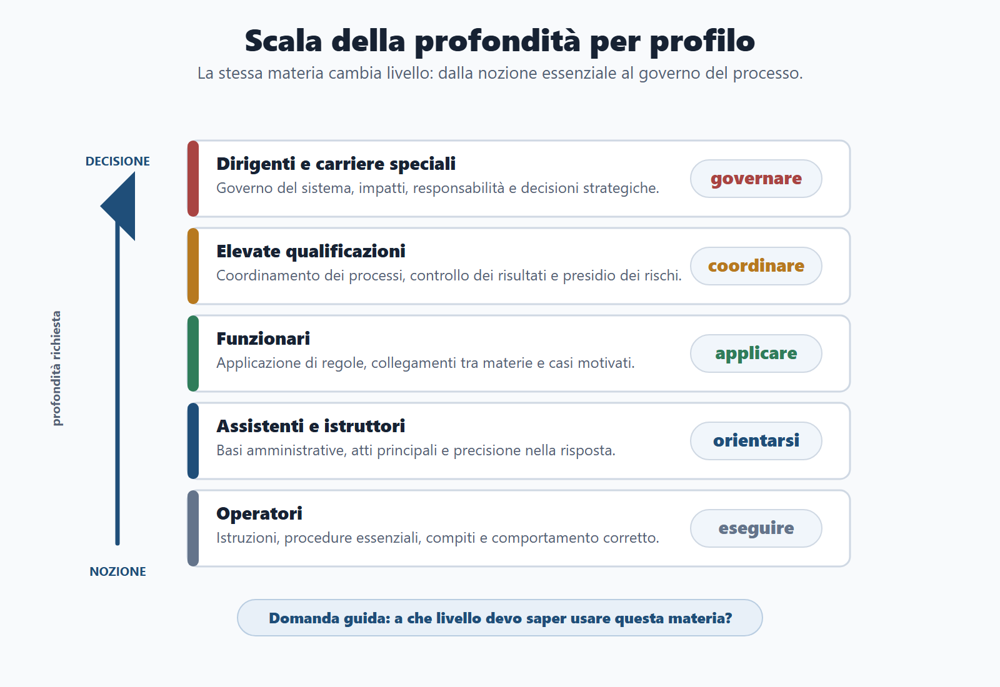
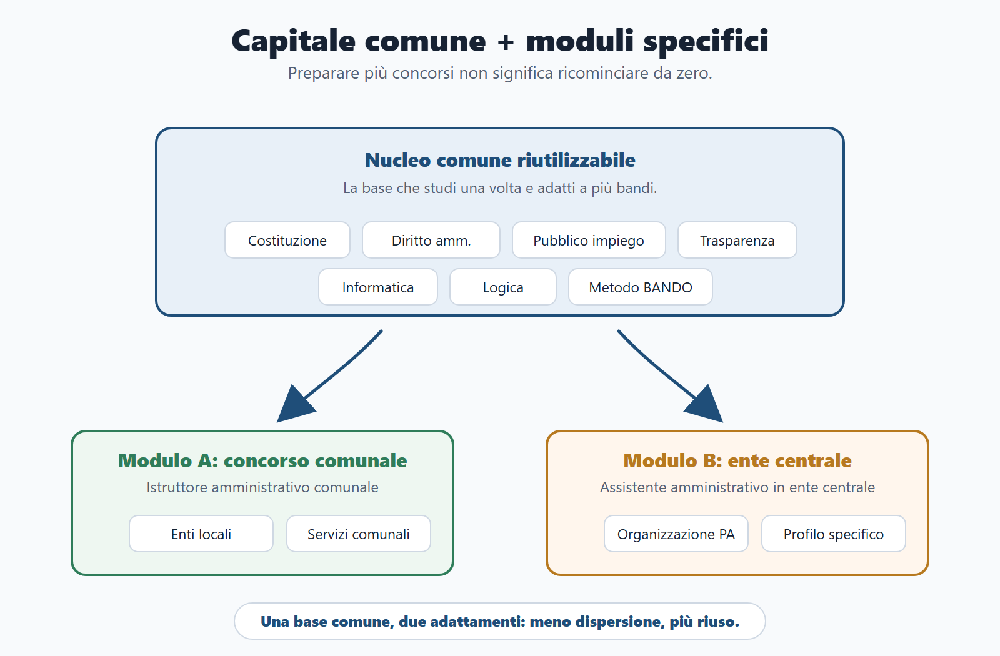

# Capitolo 1 - Il nuovo candidato pubblico

## Perché partire dal candidato

Il candidato pubblico di oggi non è soltanto una persona che studia molte pagine. Deve prendere decisioni: quale concorso scegliere, quali materie mettere al centro, quali prove allenare, quali materiali scartare e quali errori correggere prima che diventino abitudini.

La prima differenza rispetto alla preparazione tradizionale è qui. Molti manuali partono dalle materie. Questo libro parte dal candidato davanti al bando. Prima di studiare diritto amministrativo, Costituzione, pubblico impiego o logica, devi capire che tipo di gara stai affrontando e quale prestazione ti verrà richiesta.

Un concorso non premia chi possiede più file. Premia chi riesce a trasformare tempo limitato, informazioni ufficiali e studio in una risposta corretta nel momento giusto. Il nuovo candidato pubblico seleziona i materiali, produce risposte, registra gli errori e li usa per migliorare.

*Figura 1.1 - Il candidato efficace non accumula materiali: costruisce una prestazione adatta al bando.*

## Perché questo capitolo apre il libro

Se parti subito dai contenuti, rischi di comportarti come quasi tutti: compri un manuale, apri una banca dati, guardi qualche video, sottolinei molto e dopo una settimana non sai se stai avanzando davvero. Di solito non manca l’impegno. Manca una cabina di regia.

La cabina di regia è il metodo. In questo libro il metodo si chiama BANDO: leggere il bando, ordinare le aree, scegliere i nuclei, tenere un diario e allenare gli output. Prima di applicarlo, però, devi cambiare punto di vista. Non sei uno studente che deve "fare tutto". Sei un candidato che deve costruire una prestazione adeguata a un concorso specifico, senza perdere il capitale di studio che potrà servirgli anche in altri concorsi.

## Obiettivi del capitolo

Alla fine di questo capitolo devi saper fare quattro cose.

1. Distinguere il candidato che studia a caso dal candidato che studia con metodo.
2. Riconoscere le principali tipologie di concorso e capire che non richiedono lo stesso allenamento.
3. Capire perché profilo, area, prove e punteggi contano più della semplice lista delle materie.
4. Individuare i comportamenti che fanno perdere settimane: troppi materiali, quiz usati male, simulazioni rimandate ed errori non tracciati.

## Il Metodo BANDO in pratica

| Lettera | Domanda decisiva | Errore da evitare |
|---|---|---|
| **B - Bando** | Che cosa chiede davvero questo concorso? | Iniziare dal manuale senza aver letto prove, punteggi e requisiti. |
| **A - Aree** | Quali materie sono comuni e quali sono specifiche? | Trattare tutte le materie come se avessero lo stesso peso. |
| **N - Nuclei** | Quali concetti hanno più probabilità di decidere la prova? | Studiare in ordine di pagina, non in ordine di priorità. |
| **D - Diario** | Quali errori sto ripetendo? | Correggere un quiz senza capire perché è stato sbagliato. |
| **O - Output** | Che cosa devo saper produrre in prova? | Leggere molto senza allenare quiz, risposta scritta, caso o orale. |

*Figura 1.2 - Il Metodo BANDO funziona come cabina di regia: decide priorità, errori e output.*

## Come sono cambiati i concorsi pubblici

Il concorso pubblico non segue più un modello unico. Puoi trovare una preselettiva a quiz, una prova scritta unica, una prova teorico-pratica, una prova orale, una valutazione dei titoli, una prova digitale o una combinazione di più passaggi. In alcuni bandi conta molto la velocità; in altri conta la capacità di ragionare su un caso; in altri ancora serve un’esposizione orale ordinata.

Cambiano anche i profili. Un operatore, un istruttore, un assistente, un funzionario, una posizione di elevata qualificazione o un dirigente non affrontano la stessa profondità. Cambiano le responsabilità attese, il livello di autonomia, il tipo di domande e la qualità della risposta richiesta.

Il candidato debole non vede queste differenze. Si limita a dire: "devo studiare amministrativo, pubblico impiego, trasparenza, informatica". Il candidato strategico chiede prima: "come verranno usate queste materie nella mia prova?".

## Perché molti candidati studiano tanto ma male

La preparazione dispersiva nasce quasi sempre da una falsa partenza. Il candidato apre un manuale prima di aver scomposto il bando. Oppure comincia dai quiz perché danno subito la sensazione di muoversi. Oppure prepara due concorsi come se fossero due mondi separati, duplicando materiali e fatica.

Ci sono cinque segnali di studio debole:

- il candidato non sa dire quali materie sono decisive;
- non distingue tra prova a quiz, prova scritta, caso pratico e orale;
- misura il progresso in pagine lette, non in risposte prodotte;
- non registra gli errori, quindi li ripete;
- cambia metodo ogni volta che cambia concorso.

Uno studio efficace è leggibile. Se qualcuno ti chiede "che cosa stai facendo questa settimana e perché?", devi saper rispondere con precisione.

## Candidato principiante e candidato strategico

| Candidato principiante | Candidato strategico |
|---|---|
| Compra materiali prima di leggere bene il bando. | Legge il bando e poi sceglie i materiali. |
| Studia le materie nell’ordine del manuale. | Ordina le materie per peso, probabilità e tipo di prova. |
| Fa quiz per sentirsi produttivo. | Usa i quiz per diagnosticare memoria, concetto, distrazione e strategia. |
| Rimanda scritto e orale alla fine. | Allena da subito risposte brevi, esempi e collegamenti. |
| Cambia piano quando si sente in ritardo. | Taglia, concentra e riprogramma senza perdere la mappa. |
| Dimentica gli errori già corretti. | Trasforma ogni errore in ripasso o flashcard. |

## Le tipologie di concorso non si studiano allo stesso modo

Un concorso per soli esami richiede una strategia centrata sulle prove. Un concorso per titoli ed esami richiede anche attenzione ai titoli valutabili. Una preselettiva a quiz pretende velocità, esclusione delle alternative sbagliate e controllo dell’ansia. Una prova teorico-pratica richiede applicazione: non basta sapere la definizione, bisogna usarla. Un orale richiede esposizione, collegamenti e capacità di recuperare il ragionamento anche quando la domanda non è formulata come nel manuale.

Questa distinzione cambia il modo di studiare.

| Tipo di prova | Che cosa misura | Allenamento principale |
|---|---|---|
| Quiz o preselettiva | Rapidità, memoria, precisione, gestione del tempo. | Batterie mirate, diario errori, simulazioni a tempo. |
| Scritto teorico | Definizione, ordine, riferimenti essenziali. | Risposte in 10, 20 e 30 righe. |
| Teorico-pratica | Capacità di applicare regole a un caso. | Casi guidati, schemi soggetti-problema-soluzione. |
| Orale | Chiarezza, collegamenti, controllo emotivo. | Risposte ad alta voce, esempi, domande-trappola. |
| Titoli | Coerenza del profilo e documentazione. | Verifica dei requisiti, punteggi, allegati e scadenze. |

*Figura 1.3 - Ogni tipo di prova richiede un allenamento diverso.*

## Le aree di accesso cambiano la profondità

Il livello del profilo incide sulla profondità della risposta. Un argomento come il procedimento amministrativo può essere chiesto a un istruttore come nozione base, a un funzionario come strumento operativo e a un dirigente come problema di organizzazione, responsabilità e risultato.

Per questo il candidato non deve chiedersi soltanto "quali materie ci sono?". Deve chiedersi: "a che livello devo saperle usare?".

- **Operatori**: servono comprensione essenziale, procedure, compiti e comportamento corretto.
- **Assistenti e istruttori**: servono basi amministrative, precisione nei quiz e capacità di orientarsi negli atti.
- **Funzionari**: servono autonomia, ragionamento, casi, responsabilità e collegamenti tra materie.
- **Elevate qualificazioni**: servono organizzazione, controllo, risultato e gestione dei processi.
- **Dirigenti e carriere speciali**: servono visione sistemica, strategia amministrativa, responsabilità e capacità decisionale.

*Figura 1.4 - La stessa materia cambia profondità in base al profilo concorsuale.*

## Concorsi diversi, capitale comune

Un concorso comunale, un concorso ministeriale, un concorso in un’agenzia fiscale, un profilo amministrativo sanitario, un concorso scuola/università, un concorso tecnico e un concorso per la polizia locale hanno differenze reali. Trattarli come se fossero uguali sarebbe un errore.

Non tutto, però, cambia. Esiste un nucleo comune: metodo, lettura del bando, Costituzione, principi della pubblica amministrazione, diritto amministrativo, pubblico impiego, trasparenza, competenze digitali, logica, gestione della prova e capacità di spiegare.

Il candidato che ricomincia da zero a ogni bando disperde energia. Il candidato che costruisce capitale comune studia una volta e riusa più volte, adattando il modulo specifico al profilo.

*Figura 1.5 - Il nucleo comune si studia una volta e si adatta con moduli specifici.*

## Caso guidato

Marco vuole partecipare a due concorsi: istruttore amministrativo comunale e assistente amministrativo in un ente centrale. Il candidato principiante comprerebbe due percorsi separati, aprirebbe due manuali e avrebbe l’impressione di dover ripartire da capo.

Marco applica un’altra logica. Prima confronta i bandi. Trova una base comune: Costituzione, diritto amministrativo, pubblico impiego, trasparenza, informatica e logica. Poi separa le differenze: per il concorso comunale deve aggiungere enti locali; per l’ente centrale deve approfondire organizzazione amministrativa e profilo specifico.

In pratica, Marco non prepara due concorsi da zero. Prepara un nucleo riutilizzabile e due moduli di adattamento.

## Domanda da commissario

**Domanda:** Perché due candidati che studiano lo stesso numero di ore possono ottenere risultati molto diversi?

**Risposta efficace:** perché le ore non hanno tutte lo stesso valore. Conta il modo in cui sono collegate al bando, al tipo di prova, alle priorità, agli errori e all’output da produrre. Un candidato può leggere molto e allenarsi poco; un altro può leggere meno, ma trasformare ogni blocco di studio in quiz, risposta, caso o spiegazione orale.

## Domanda-trappola

**Domanda:** Fare molti quiz significa essere ben preparati?

**Risposta:** non necessariamente. Il quiz è utile se diventa diagnosi. Deve dirti se hai sbagliato per memoria, concetto, distrazione, fretta o strategia. Se fai quiz senza analizzare gli errori, stai solo accumulando movimento.

## Mini-test: che tipo di candidato sei?

Segna la risposta che ti rappresenta di più.

| Situazione | Risposta A | Risposta B |
|---|---|---|
| Trovi un nuovo bando. | Cerchi subito un manuale. | Leggi prima prove, materie, punteggi e requisiti. |
| Sbagli un quiz. | Guardi la risposta corretta e vai avanti. | Classifichi l’errore e programmi il ripasso. |
| Hai poco tempo. | Provi a fare tutto più velocemente. | Tagli le parti meno decisive e aumenti le simulazioni. |
| Prepari due concorsi. | Apri due percorsi separati. | Cerchi base comune e moduli specifici. |
| Devi preparare l’orale. | Aspetti di finire la teoria. | Alleni risposte brevi fin dall’inizio. |

Se prevale la colonna A, il primo obiettivo è smettere di confondere attività e avanzamento. Se prevale la colonna B, il metodo ti aiuterà a rendere più stabile ciò che già fai in modo intuitivo.

## Da sapere in 5 righe

1. Il candidato pubblico efficace non accumula materiali: costruisce un sistema.
2. Il bando viene prima del manuale, dei quiz e del calendario.
3. Ogni concorso ha una parte comune e una parte specifica.
4. Le prove richiedono allenamenti diversi: quiz, scritto, caso e orale non si preparano allo stesso modo.
5. Gli errori non sono incidenti: sono dati di lavoro.

## Errore tipico

Il primo errore è studiare per sentirsi tranquilli, non per produrre una prestazione. Leggere, sottolineare e fare quiz possono dare l’impressione di lavorare. Il progresso reale, però, si vede quando sai rispondere, spiegare, applicare, correggere e ripetere sotto vincolo di tempo.
