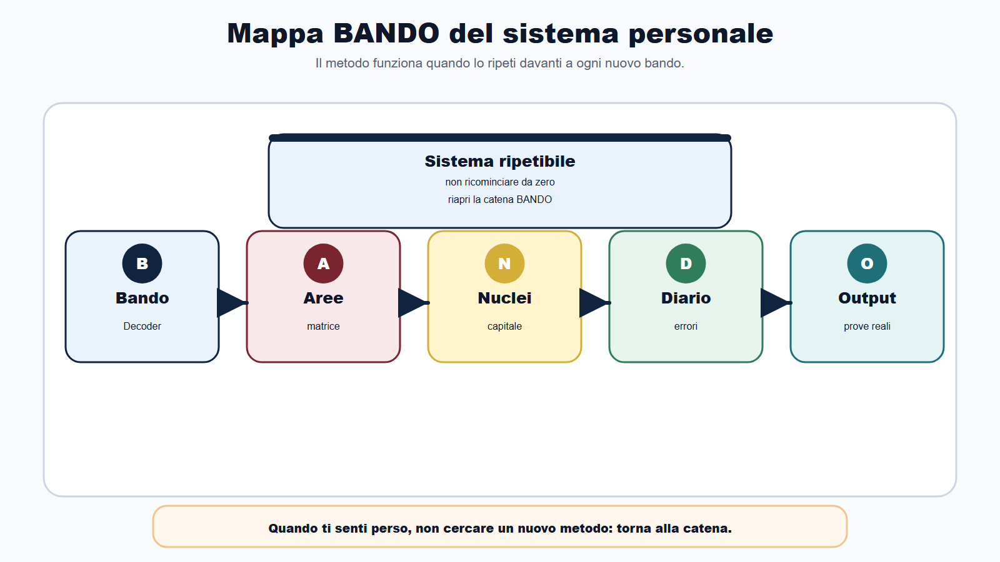
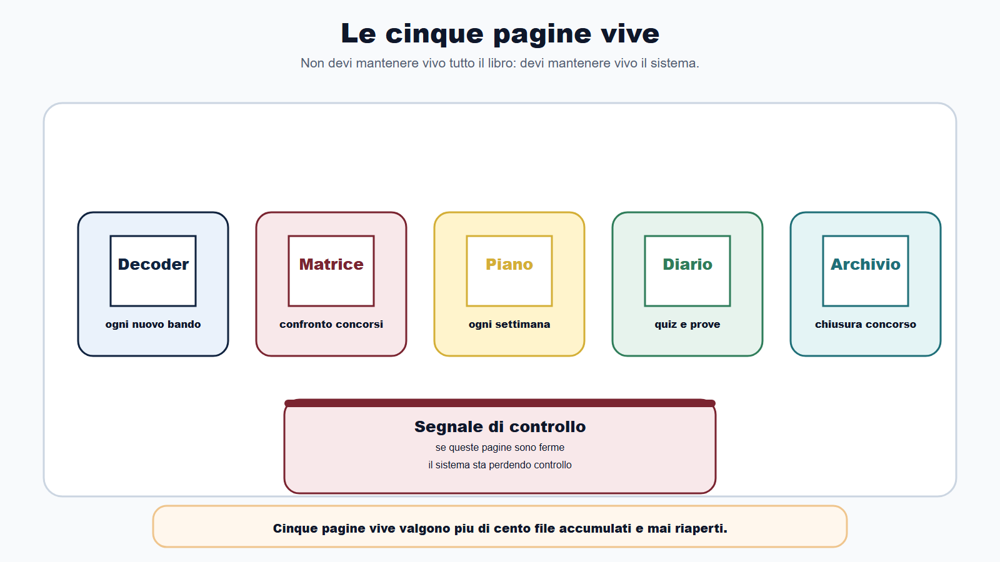
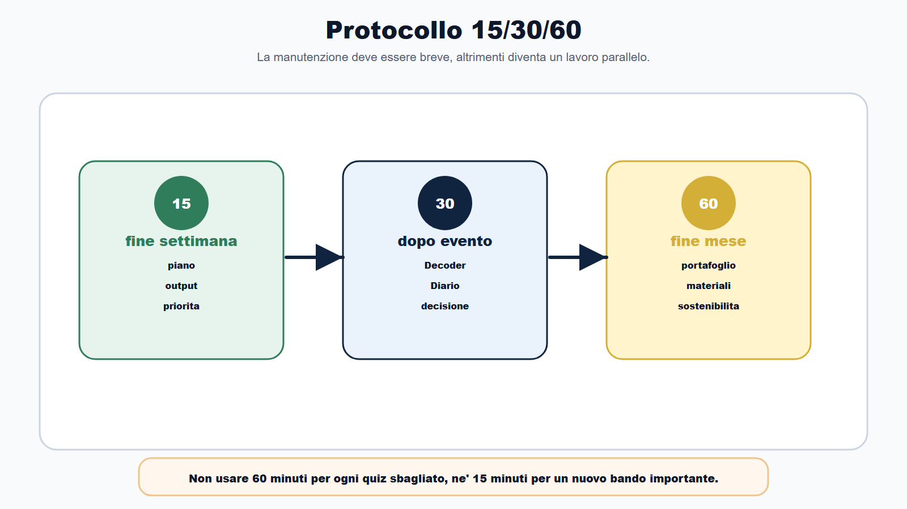
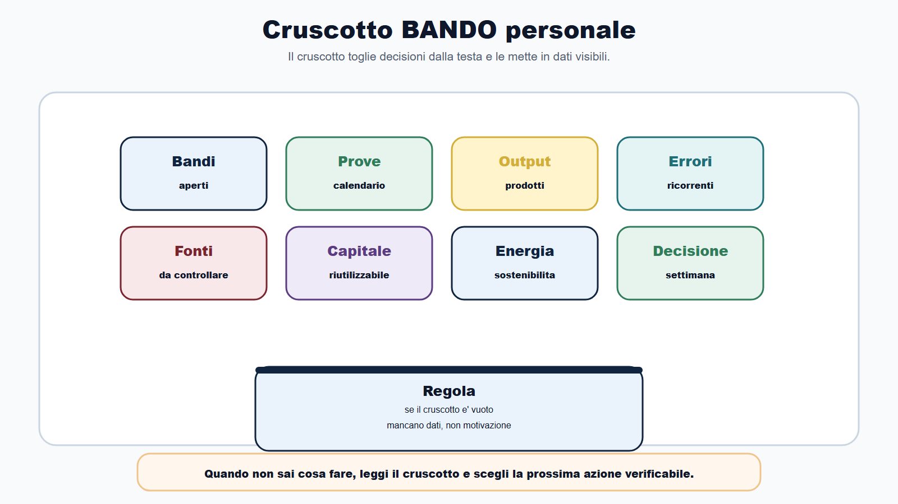
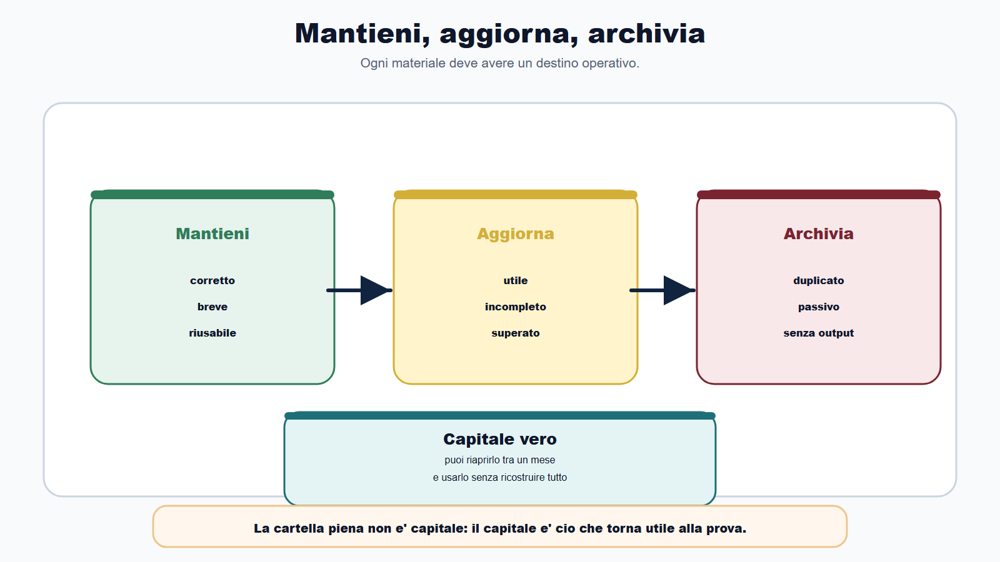
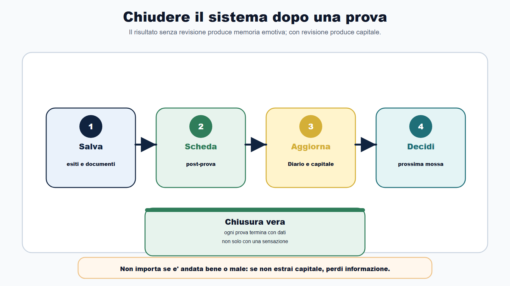
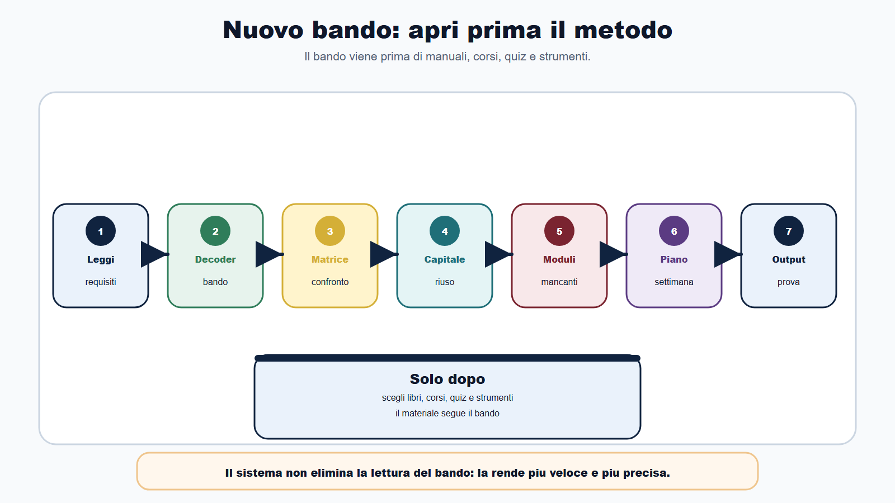

# Capitolo 32 - Il tuo sistema BANDO personale

> Modulo ricettario **R8** — Cruscotto personale BANDO. Collega [[books/il-metodo-bando/chapters/il-metodo-bando|Cap. 3]], [[books/il-metodo-bando/chapters/sistema-adattabile|Cap. 22]] e [[books/il-metodo-bando/chapters/diario-degli-errori|Cap. 23]]; incrocia [[books/il-metodo-bando/chapters/aggiornare-il-metodo-dopo-il-libro|R1]], [[books/il-metodo-bando/chapters/trasformare-ogni-concorso-in-capitale-di-studio|R2]], [[books/il-metodo-bando/chapters/usare-il-digitale-senza-perdere-il-metodo|R4]], [[books/il-metodo-bando/chapters/reggere-la-preparazione-energia-ansia-continuita|R5]], [[books/il-metodo-bando/chapters/dopo-la-prova-esiti-graduatoria-prossima-mossa|R6]] e [[books/il-metodo-bando/chapters/prendere-servizio-nella-pa-dal-concorso-al-ruolo|R7]].

Un libro di metodo fallisce quando viene letto e poi lasciato chiuso.

Funziona quando diventa un sistema.

Il Metodo BANDO non e' una sequenza di capitoli da ricordare. E' un modo di lavorare: leggere il bando, ordinare le aree, scegliere i nuclei, registrare errori, produrre output, aggiornare il piano, riusare capitale.

Se dopo aver chiuso questo libro riparti da zero al prossimo concorso, il libro non ha fatto il suo lavoro.

Se invece apri un nuovo bando e sai subito dove guardare, che cosa copiare, che cosa cambiare, che cosa tagliare e quale output produrre, allora il metodo e' diventato tuo.

Questo capitolo serve a costruire il tuo sistema BANDO personale: poche pagine vive, poche revisioni ricorrenti, poche regole per non disperdere cio che hai costruito.

Non e' una conclusione motivazionale.

E' una procedura di manutenzione.

## Obiettivo del capitolo

Alla fine del capitolo saprai:

- trasformare il libro in un sistema personale di preparazione;
- individuare le cinque pagine vive da mantenere aggiornate;
- usare il protocollo 15/30/60 per controllare il metodo;
- decidere che cosa mantenere, aggiornare o archiviare;
- evitare accumulo di file, appunti e strumenti non usati;
- chiudere ogni concorso senza perdere capitale;
- riaprire il sistema davanti a un nuovo bando;
- capire quando il metodo sta funzionando davvero.

La regola e' questa:

> il metodo non e' cio che hai letto. E' cio che sai ripetere quando arriva un nuovo bando.

## Mappa BANDO del sistema personale

| Fase | Domanda permanente | Strumento vivo |
|---|---|---|
| B - Bando | che cosa chiede davvero questa procedura? | Bando Decoder |
| A - Aree | quali materie e profili sono comuni o variabili? | Matrice materie/profili |
| N - Nuclei | quali concetti devo padroneggiare prima? | Archivio nuclei e capitale |
| D - Diario | quali errori tornano e che cosa li corregge? | Diario degli errori |
| O - Output | che cosa devo produrre per essere pronto? | Quiz, orale, caso, simulazione, checklist |

Ogni volta che ti senti perso, non cercare un nuovo metodo. Torna a questa tabella.

## Le cinque pagine vive

Non devi mantenere vivo tutto il libro.

Devi mantenere vive cinque pagine.

| Pagina | Funzione | Quando aggiornarla |
|---|---|---|
| Bando Decoder | capisce il concorso | ogni nuovo bando o avviso rilevante |
| Matrice materie/profili | distingue comune e specialistico | quando confronti due concorsi |
| Piano personale | trasforma tempo in output | ogni settimana |
| Diario degli errori | corregge il sistema | dopo quiz, simulazioni e prove |
| Archivio capitale | conserva cio che riusi | dopo ogni prova o chiusura concorso |

Se queste cinque pagine sono vive, il sistema respira.

Se sono ferme da settimane, anche se studi molte ore, il sistema sta perdendo controllo.

## Il protocollo 15/30/60

La manutenzione del Metodo BANDO deve essere breve. Se diventa un lavoro parallelo, non la farai.

Usa tre revisioni.

| Tempo | Quando | Cosa fai |
|---|---|---|
| 15 minuti | fine settimana | controlli piano, output, errori principali e prossima priorita |
| 30 minuti | dopo prova, nuovo bando o avviso importante | aggiorni Decoder, Diario, capitale e decisione |
| 60 minuti | fine mese o cambio strategico | rivedi portafoglio concorsi, materiali, moduli e sostenibilita |

La revisione da 15 minuti mantiene continuita.

La revisione da 30 minuti chiude un evento.

La revisione da 60 minuti corregge rotta.

Non usarle al contrario. Non serve fare una revisione strategica ogni volta che sbagli un quiz. Non basta un controllo di 15 minuti quando entra un nuovo bando importante.

## Il cruscotto personale

Il tuo sistema deve avere un cruscotto semplice.

Compila una tabella come questa.

| Area | Stato | Prossima azione |
|---|---|---|
| Bandi aperti | | |
| Prove in calendario | | |
| Materie comuni | | |
| Moduli specialistici | | |
| Output prodotti | | |
| Errori ricorrenti | | |
| Fonti da controllare | | |
| Capitale riutilizzabile | | |
| Energia e sostenibilita | | |
| Decisione della settimana | | |

Il cruscotto non serve a decorare il metodo. Serve a togliere decisioni dalla testa.

Quando non sai che cosa fare, leggi il cruscotto. Se e' vuoto, il problema non e' la motivazione. E' la mancanza di dati.

## Mantieni, aggiorna, archivia

Ogni materiale deve avere un destino.

| Decisione | Quando usarla | Esempio |
|---|---|---|
| Mantieni | materiale corretto, breve, verificato e riusabile | schema su procedimento amministrativo |
| Aggiorna | materiale utile ma superato o incompleto | tabella su fonti dopo nuovo avviso |
| Archivia | materiale duplicato, passivo o non collegato a output | riassunto copiato e mai usato |

La cartella piena non e' capitale.

Il capitale e' cio che puoi riaprire tra un mese e usare senza ricostruire tutto.

Ogni mese elimina almeno tre materiali inutili. Non per fare pulizia estetica, ma per proteggere attenzione.

## Quando cambiare davvero il piano

Il candidato disordinato cambia piano ogni volta che sente ansia.

Il candidato metodico cambia piano quando cambia un dato.

Aggiorna il piano se cambia almeno uno di questi elementi:

- bando;
- requisiti;
- scadenze;
- calendario prove;
- materie;
- formato della prova;
- punteggi o soglie;
- documenti richiesti;
- graduatoria o fase successiva;
- energia reale disponibile;
- errore ricorrente dimostrato da simulazioni.

Non aggiornare il piano per:

- un commento in chat;
- un consiglio generico;
- una paura improvvisa;
- un manuale nuovo comprato per ansia;
- una materia aperta senza collegamento al bando;
- un confronto non verificato con altri candidati.

Il metodo serve anche a dire no.

## Digitale minimo, carta sufficiente

Il sistema BANDO puo vivere su carta, su file o in una combinazione dei due.

La regola e' che deve essere esportabile e comprensibile anche senza l'app del momento.

Il digitale serve a:

- salvare fonti e avvisi;
- duplicare template;
- impostare promemoria;
- cercare rapidamente;
- fare backup;
- trasformare errori in domande;
- tracciare output prodotti.

Non serve a:

- moltiplicare app;
- sostituire il bando;
- produrre riassunti non verificati;
- spostare continuamente il sistema;
- studiare senza output.

Se uno strumento non aggiorna una delle cinque pagine vive, probabilmente e' rumore.

Per il protocollo digitale completo (catturare, decidere, ricordare, backup, AI sicura) vedi **R4** (Cap. 28). Qui resta la regola: il digitale alimenta le cinque pagine vive, non le sostituisce.

## Il sistema dopo una prova

Dopo ogni prova, il sistema va chiuso.

Non importa se e' andata bene o male. Devi fare quattro passaggi:

1. salva esiti, avvisi e documenti;
2. compila la scheda post-prova (modulo **R6**, Cap. 30);
3. aggiorna Diario e capitale (modulo **R2**, Cap. 26);
4. decidi la prossima mossa.

Il risultato senza revisione produce memoria emotiva.

Il risultato con revisione produce capitale.

## Il sistema davanti a un nuovo bando

Quando arriva un nuovo bando, non aprire subito tutti i materiali.

Apri prima il metodo.

Sequenza:

1. leggi requisiti, scadenze, prove e materie;
2. compila il Bando Decoder;
3. confronta con Matrice materie/profili;
4. recupera capitale gia valido;
5. individua moduli mancanti;
6. costruisci piano;
7. definisci output della prima settimana.

Solo dopo scegli libri, corsi, quiz e strumenti.

Il bando viene prima del materiale.

## Caso guidato

Elena ha chiuso questo libro e ha tre cartelle piene di appunti. Dopo due settimane esce un nuovo concorso per un profilo amministrativo-contabile. La prima reazione e' comprare un nuovo manuale e ricominciare da capo.

Poi applica il sistema BANDO personale.

In 30 minuti compila il Decoder:

- requisiti;
- scadenza domanda;
- prove;
- materie;
- punteggi;
- documenti;
- canali ufficiali.

Poi apre la Matrice materie/profili. Scopre che ha gia capitale su procedimento, pubblico impiego, trasparenza, privacy, PA digitale, logica e inglese. Le mancano contabilita e alcuni elementi specialistici del profilo.

Aggiorna il piano:

- non ristudia da zero amministrativo;
- trasforma gli errori vecchi in richiamo attivo;
- dedica tre blocchi settimanali al modulo specialistico;
- programma una simulazione a quiz;
- salva il nuovo bando e imposta promemoria ufficiali.

Elena non ha fatto meno lavoro. Ha fatto meno lavoro inutile.

## Da sapere in 5 righe

1. Il Metodo BANDO funziona se diventa una procedura ripetuta.
2. Mantieni vive cinque pagine: Decoder, Matrice, Piano, Diario, Archivio capitale.
3. Aggiorna il piano solo quando cambia un dato reale o un errore dimostrato.
4. Il digitale serve a sostenere il sistema, non a moltiplicarlo.
5. Ogni concorso deve finire con capitale riutilizzabile e una prossima mossa.

## Domanda da commissario

**Domanda:** Perche un candidato che prepara piu concorsi non dovrebbe ricominciare ogni volta da zero?

**Risposta efficace:** perche molti concorsi condividono nuclei comuni, strumenti di metodo, materie trasversali e formati di prova. Ricominciare da zero disperde tempo e impedisce di consolidare errori corretti, schemi, domande, simulazioni e fonti gia verificate. Il candidato deve distinguere cio che resta comune da cio che cambia per profilo, aggiornando il piano in base al bando e trasformando ogni esperienza in capitale di studio riutilizzabile.

## Domanda-trappola

**Domanda:** Se ho un sistema personale, posso evitare di leggere ogni nuovo bando con attenzione?

**Risposta:** no. Il sistema serve proprio a leggere meglio ogni nuovo bando. Nessun capitale precedente sostituisce requisiti, scadenze, prove, materie, punteggi, documenti e avvisi della procedura specifica. Il metodo riduce il caos, non autorizza automatismi.

## Errore tipico

L'errore tipico e' innamorarsi del proprio metodo.

Il metodo e' utile finche produce decisioni, output e correzioni. Se diventa un insieme di template compilati per abitudine, senza collegamento a bando, prove ed errori, smette di funzionare.

Ogni mese chiediti:

- mi ha fatto scegliere meglio?
- mi ha fatto tagliare qualcosa?
- mi ha fatto produrre output?
- mi ha fatto correggere errori?
- mi ha fatto riusare capitale?

Se la risposta e' no, non aggiungere strumenti. Semplifica.

## Mini-esercizio

Costruisci il tuo cruscotto BANDO personale.

| Voce | Risposta |
|---|---|
| Qual e' il mio concorso principale ora? | |
| Qual e' il mio concorso secondario, se esiste? | |
| Quale capitale comune possiedo gia? | |
| Quale modulo specialistico manca? | |
| Quale output devo produrre questa settimana? | |
| Quale errore ricorrente devo correggere? | |
| Quale fonte ufficiale devo controllare? | |
| Quale materiale devo archiviare o eliminare? | |
| Quale revisione devo fare: 15, 30 o 60 minuti? | |
| Qual e' la prossima mossa verificabile? | |

Non completare la tabella per fare ordine mentale. Completala per decidere un'azione.

## Checklist finale del sistema BANDO

Prima di chiudere il libro, verifica:

- ho un Bando Decoder pronto da duplicare;
- ho una Matrice materie/profili consultabile;
- ho un Piano personale aggiornabile;
- ho un Diario degli errori attivo;
- ho un Archivio capitale con materiali vivi;
- so dove controllare fonti ufficiali;
- so quando cambiare piano e quando non cambiarlo;
- ho una routine settimanale da 15 minuti;
- so chiudere una prova con una scheda post-prova;
- so aprire un nuovo bando senza ricominciare da zero.

Se hai queste dieci cose, non hai solo letto un libro.

Hai costruito un sistema.

## Scheda workbook: Revisione sistema in 15 minuti

Compila questa scheda ogni fine settimana, prima di aprire nuovi materiali o gruppi. Se non trovi nulla da aggiornare, scrivi comunque "nessun cambio operativo": chiude il ciclo e libera la testa.

| Domanda | Risposta |
|---|---|
| Quale revisione faccio oggi: 15, 30 o 60 minuti? | |
| Le cinque pagine vive sono aggiornate nell'ultima settimana? (Decoder / Matrice / Piano / Diario / Archivio) | |
| Quale output ho prodotto questa settimana? (quiz, simulazione, scheda, caso) | |
| Quale errore ricorrente devo correggere con una sola azione? | |
| Quale fonte ufficiale devo controllare (R1)? | |
| Quale materiale mantengo, aggiorno o archivio? | |
| Il cruscotto ha almeno una "prossima azione" per area attiva? | |
| Energia e sostenibilita: semaforo verde, giallo o rosso (R5)? | |
| Se c'e' un nuovo bando, ho aperto prima il metodo o i materiali? | |
| Qual e' la prossima mossa verificabile entro sette giorni? | |

La scheda e' utile solo se produce un'azione concreta: aggiornamento di una pagina viva, archiviazione di un duplicato, simulazione programmata o controllo fonti con data.

## Registro revisioni manutenzione

Il registro non e' un diario motivazionale. E' la traccia minima che dimostra che il sistema respira.

| Data | Tipo revisione (15/30/60) | Evento scatenante | Pagina viva toccata | Decisione presa | Prossimo controllo |
|---|---|---|---|---|---|
| | | | | | |
| | | | | | |
| | | | | | |

Frequenza consigliata:

- **15 minuti**: ogni fine settimana, anche senza novita;
- **30 minuti**: dopo prova, nuovo bando, avviso rilevante o chiusura concorso;
- **60 minuti**: fine mese, cambio portafoglio concorsi o segnale di sovraccarico (R3, R5).

Se il registro resta vuoto per piu di due settimane mentre studi molte ore, il problema non e' la motivazione: e' l'assenza di manutenzione.

## Cinque segnali che il sistema funziona

Verifica periodicamente se il metodo produce effetti misurabili:

1. **Apertura bando rapida**: davanti a un nuovo concorso compili il Decoder in meno di un'ora senza ricominciare da zero.
2. **Capitale riutilizzato**: almeno il 40-60% del piano del nuovo bando deriva da nuclei, schemi o simulazioni gia validi (R2).
3. **Errori che non tornano**: il Diario mostra correzioni verificate, non le stesse lacune per tre prove consecutive.
4. **Decisioni scritte**: ogni cambio di piano ha un dato reale (bando, prova, errore dimostrato), non ansia o commenti esterni.
5. **Chiusura prove**: dopo ogni prova hai scheda post-prova, capitale aggiornato e prossima mossa (R6), anche prima dell'esito ufficiale.

Se riconosci almeno quattro segnali su cinque, il sistema sta funzionando.

## Cinque segnali che il sistema non funziona

Intervieni subito se compaiono questi sintomi:

1. **Cartelle piene, pagine vive ferme**: molti file, ma Decoder, Piano o Diario non aggiornati da settimane.
2. **Nuovo bando = nuovo caos**: compri materiali prima di leggere requisiti, prove e materie.
3. **Piano che cambia senza dati**: ogni commento in chat o ogni manuale nuovo ricalcola tutto il calendario.
4. **Studio senza output**: ore di lettura ma zero quiz, simulazioni, schede o casi nella settimana.
5. **Prove senza chiusura**: dopo l'esame non aggiorni Diario, capitale o registro avvisi (R6).

La correzione non e' aggiungere strumenti. E' semplificare: una revisione da 30 minuti, un materiale da archiviare, un output da programmare, un controllo fonti con data (R1).

## Chiusura operativa

Il sistema BANDO personale e' costruito quando le cinque pagine vive sono operative e la manutenzione e' ripetibile, non quando hai finito di leggere il libro.

| Azione | Fatto |
|---|---|
| Ho individuato e duplicato le cinque pagine vive (Decoder, Matrice, Piano, Diario, Archivio) | |
| Ho compilato almeno una volta il cruscotto personale con prossime azioni | |
| So distinguere revisione 15, 30 e 60 minuti e quando usarle | |
| Applico la regola mantieni / aggiorna / archivia almeno una volta al mese | |
| Cambio il piano solo quando cambia un dato reale o un errore dimostrato | |
| Ho collegato digitale e backup al sistema senza moltiplicare app (R4) | |
| So chiudere ogni prova con scheda post-prova e capitale (R6, R2) | |
| So aprire un nuovo bando con il metodo prima dei materiali | |
| Ho compilato la scheda workbook "Revisione sistema in 15 minuti" almeno una volta | |
| Il registro revisioni manutenzione e' attivo o ho fissato la prima data di revisione | |

Il Metodo BANDO non termina con l'ultimo capitolo. Termina quando sai riaprirlo davanti a ogni nuovo bando, ogni prova e ogni fase successiva — compreso l'ingresso in PA (R7) — senza ricominciare da zero.

## Riferimenti consolidati

- [[sources/sistema-bando-personale-metodo-bando]]
- [[sources/metodo-bando-progetto-editoriale]]
- [[sources/struttura-madre-il-metodo-bando]]
- [[sources/capitale-studio-riutilizzabile-metodo-bando]]
- [[sources/fonti-ufficiali-aggiornamento-metodo-bando-2026-06-03]]
- [[sources/strumenti-digitali-metodo-bando]]
- [[sources/sostenibilita-preparazione-concorsi-metodo-bando]]
- [[topics/sistema-bando-personale]]
- [[topics/metodo-bando]]
- [[topics/capitale-studio-riutilizzabile]]
- [[topics/aggiornamento-fonti-concorsi]]
- [[topics/strumenti-digitali-metodo-bando]]
- [[topics/sostenibilita-preparazione-concorsi]]

## Note di review

- La struttura madre originaria non prevedeva il Capitolo 32. Questo capitolo e' un'estensione editoriale: in revisione decidere se mantenerlo numerato o trasformarlo in epilogo fuori numerazione.
- Coordinare il capitolo con Cap. 25 (R1), Cap. 26 (R2) e Appendici C-F per evitare ripetizioni sui template.
- Scheda workbook "Revisione sistema in 15 minuti", registro revisioni manutenzione e chiusura operativa inseriti nel capitolo; in impaginazione valutare estrazione come PDF compilabile autonomo ("Il mio cruscotto BANDO personale").
- Coordinare rimandi con Cap. 3 (metodo BANDO), Cap. 22 (piano 30/60/90), Cap. 23 (Diario), R4 (digitale), R5 (sostenibilita), R6 (dopo-prova), R7 (ingresso PA) e R3 (portafoglio concorsi).
