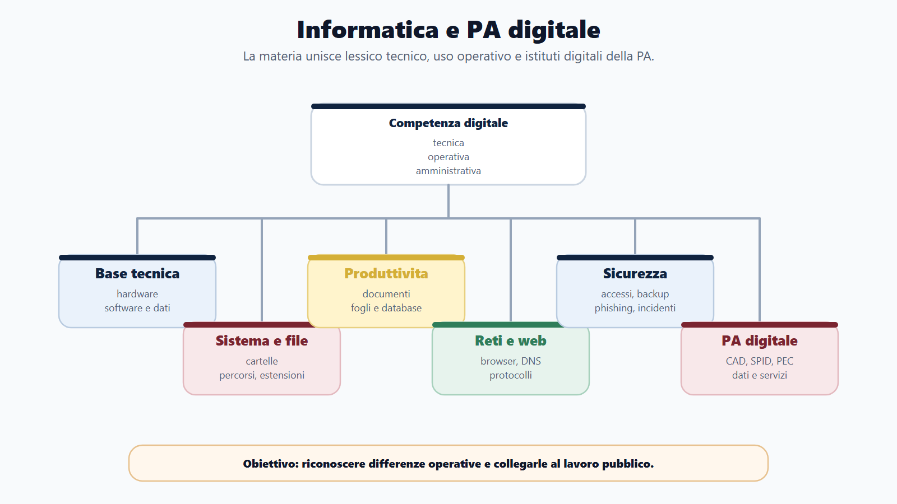
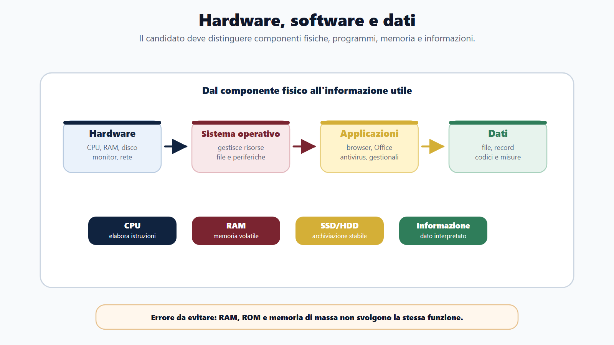
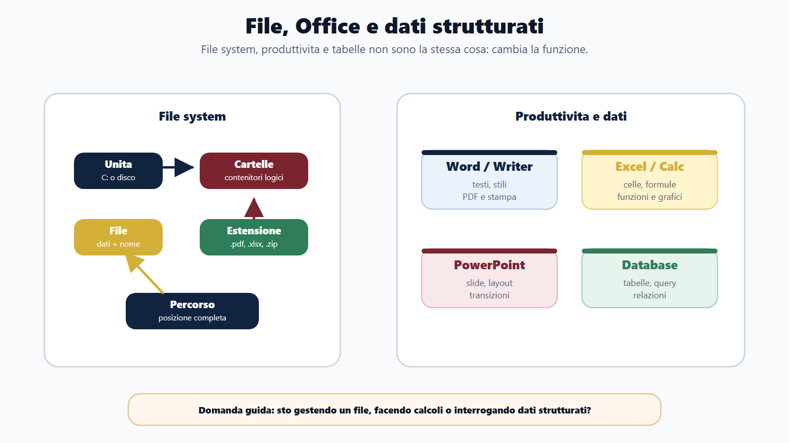
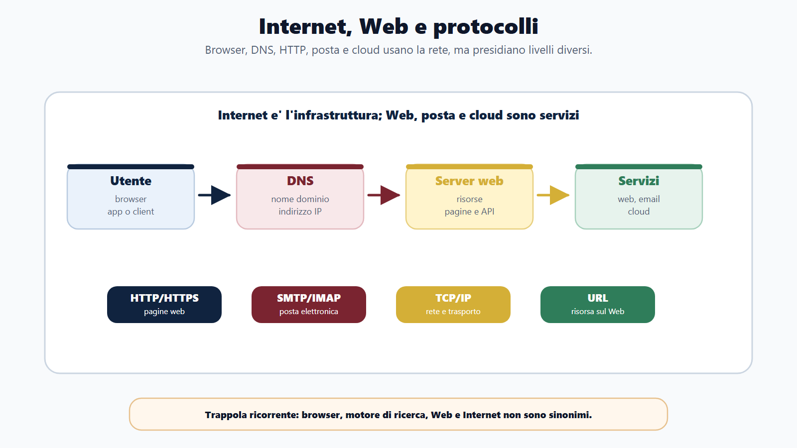
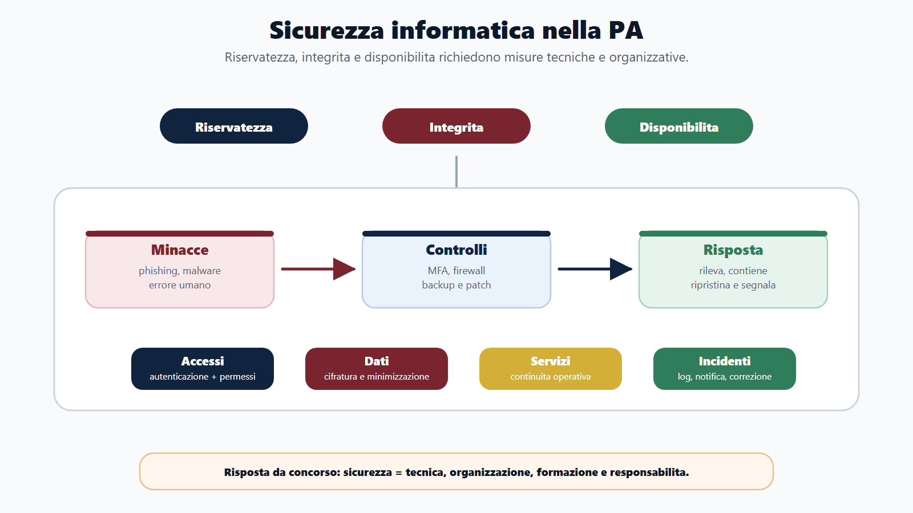
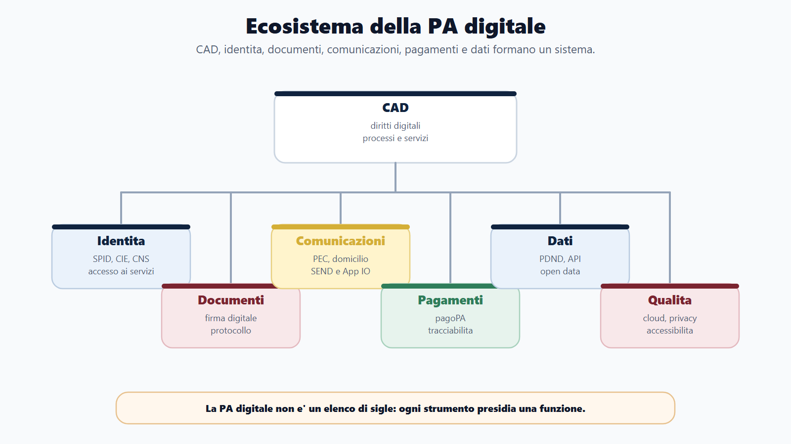
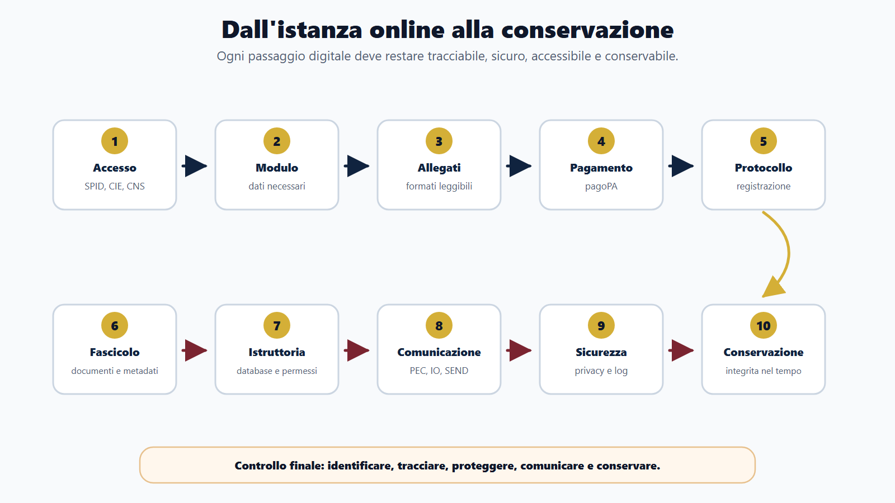

# Capitolo 10 - Informatica, PA digitale e competenze digitali

## Perché questo capitolo pesa nei concorsi

L'informatica nei concorsi pubblici non è una materia unica e compatta. È un blocco di competenze che va dall'uso quotidiano del computer alla normativa sulla PA digitale. Nelle banche dati compaiono domande molto pratiche, come la differenza tra file e cartella, il significato di una formula in un foglio elettronico o la funzione di un browser. Accanto a queste, però, compaiono quesiti su PEC, SPID, documento informatico, firma digitale, protezione dei dati, sicurezza e servizi digitali della pubblica amministrazione.

Il candidato efficace deve quindi evitare due errori opposti. Il primo è studiare solo la parte normativa, trascurando Word, Excel, sistemi operativi, posta elettronica e reti. Il secondo è trattare l'informatica come un insieme di nozioni tecniche isolate, dimenticando che nei concorsi pubblici la tecnologia viene spesso chiesta in relazione all'azione amministrativa: protocollare un documento, comunicare con un cittadino, conservare un atto, verificare un'identità, proteggere dati personali, pubblicare informazioni in formato accessibile e riutilizzabile.

Questo capitolo segue una logica progressiva. Prima costruisce il lessico tecnico essenziale. Poi collega quel lessico agli strumenti operativi più richiesti. Infine porta la materia nel contesto della PA digitale, dove informatica, procedimento amministrativo, privacy e organizzazione dei servizi si incontrano.

## Obiettivi del capitolo

Al termine del capitolo dovrai essere in grado di:

- distinguere hardware, software, sistema operativo, applicazioni e periferiche;
- riconoscere file, cartelle, percorsi, estensioni e principali operazioni di gestione;
- comprendere le funzioni essenziali di videoscrittura, fogli elettronici, presentazioni e database d'ufficio;
- interpretare le nozioni fondamentali di Internet, Web, browser, URL, posta elettronica, PEC, cloud e servizi online;
- distinguere reti LAN, WAN, Internet, intranet, client, server, router, switch, modem, indirizzo IP, DNS e protocolli;
- rispondere ai quesiti di base su sicurezza informatica, malware, password, autenticazione, backup, firewall, crittografia e continuità operativa;
- riconoscere database, tabelle, record, campi, chiavi, relazioni, query e comandi SQL elementari;
- orientarti tra programmazione, algoritmi, variabili, funzioni, HTML, XML, formati e codifica dei dati;
- collegare CAD, documento informatico, firme elettroniche, PEC, domicilio digitale, SPID, CIE, CNS, protocollo informatico e conservazione;
- comprendere il ruolo di ANPR, pagoPA, FatturaPA, App IO, PND/SEND, PDND, open data, cloud, accessibilità, GDPR e NIS2.

> [!NOTE]
> **Da sapere in 5 righe**
> Nei concorsi la parola "informatica" non indica solo computer e programmi. Comprende strumenti di produttività, sistemi operativi, reti, sicurezza, basi di dati, linguaggi, formati e servizi digitali della PA. Le domande più frequenti premiano chi conosce definizioni precise e differenze operative. La parte normativa digitale va studiata insieme agli strumenti: PEC, firma, SPID, protocollo e conservazione non sono slogan, ma funzioni amministrative. L'obiettivo non è diventare tecnico informatico, ma riconoscere concetti, errori e responsabilità nel lavoro pubblico.



## Come usare il Metodo BANDO

Il Metodo BANDO aiuta a non disperdere lo studio. In informatica e PA digitale la materia è ampia, ma le domande ruotano intorno a nuclei ricorrenti.

| Fase | Cosa fare | Risultato atteso |
|---|---|---|
| **B - Bando** | Individua se la traccia parla di informatica, competenze digitali, CAD, transizione digitale, privacy o sicurezza. | Capisci se la prova chiederà uso operativo, normativa digitale o entrambe. |
| **A - Aree** | Dividi lo studio in blocchi: Office, sistemi operativi, Web, reti, sicurezza, database, PA digitale. | Eviti di mescolare argomenti diversi e riduci la confusione terminologica. |
| **N - Nuclei** | Per ogni area impara 10-15 definizioni ad alto rendimento. | Riconosci le domande-trappola. |
| **D - Diario** | Segna le coppie che confondi: RAM/ROM, Internet/Web, PEC/email, firma digitale/scansione, file/cartella. | Correggi gli errori ripetuti prima della prova. |
| **O - Output** | Trasforma ogni argomento in risposta breve da concorso. | Sei pronto per quiz, orale e scritto sintetico. |

> [!TIP]
> **BANDO in pratica**
> Per studiare il capitolo non partire dai dettagli più rari. Parti dalle coppie concettuali che la commissione usa per verificare se conosci davvero la materia: hardware/software, file/cartella, RAM/ROM, Internet/Web, browser/motore di ricerca, email/PEC, autenticazione/autorizzazione, database/foglio elettronico, firma digitale/scansione, SPID/CIE/CNS, open data/semplice pubblicazione.

## Confini con gli altri capitoli

Questo capitolo dialoga con molte parti del manuale:

| Area collegata | Collegamento |
|---|---|
| Procedimento amministrativo | Il documento informatico, il protocollo, la comunicazione telematica e la conservazione incidono sulla gestione degli atti. |
| Trasparenza e anticorruzione | Pubblicazione online, accessibilità, dati aperti e protezione dei dati devono essere bilanciati. |
| Privacy | Sicurezza informatica, data breach, minimizzazione e responsabilità del titolare sono parte dell'organizzazione digitale. |
| Organizzazione della PA | Il responsabile per la transizione digitale, i servizi online e l'interoperabilità cambiano processi e competenze. |
| Contratti pubblici e gestione documentale | Piattaforme digitali, firme, comunicazioni elettroniche e conservazione hanno effetti procedurali. |

## Quadro di priorità per lo studio

La banca dati concorsuale mostra una distribuzione chiara: le domande di informatica diretta insistono soprattutto su produttività personale, sistemi operativi, gestione file, Internet, posta, hardware, reti e basi di sicurezza. Nei concorsi pubblici, però, la parte PA digitale pesa molto più di quanto sembri dal solo conteggio delle domande etichettate come informatica: CAD, PEC, SPID, privacy, open data, cloud e accessibilità entrano anche in materie amministrative, trasparenza, organizzazione e servizi al cittadino.

| Priorità | Argomenti | Perché contano |
|---|---|---|
| Molto alta | Word, Excel, file, cartelle, Windows, browser, email | Sono le domande più frequenti e più immediate. |
| Alta | Hardware, memoria, storage, reti TCP/IP, LAN/WAN, client-server | Verificano il lessico tecnico di base. |
| Media-alta | Sicurezza, password, malware, antivirus, firewall, backup | Collegano competenza digitale e responsabilità organizzativa. |
| Media | Database, SQL, Access, Oracle, tabelle, record, campi, chiavi | Ricorrono nei profili amministrativi e tecnici. |
| Strategica PA | CAD, PEC, firma digitale, SPID, CIE, CNS, documento informatico, protocollo, privacy, open data | Possono comparire anche fuori dalla materia informatica. |

> [!WARNING]
> **Errore tipico**
> Molti candidati trattano la PA digitale come "diritto amministrativo tecnologico" e l'informatica come "quiz facili da fare alla fine". È una strategia debole. Le domande semplici sono spesso trappole di definizione, mentre le domande sulla PA digitale richiedono di capire come gli strumenti incidono sui procedimenti.

## 1. Informatica di base: hardware, software e dati

L'informatica studia il trattamento automatico dell'informazione. Nei concorsi questa definizione astratta si traduce in tre parole chiave: dati, elaborazione e strumenti.

Il **dato** è una rappresentazione elementare di un fatto: un numero, una parola, una data, un codice fiscale, un'immagine, un file. L'**informazione** nasce quando il dato viene interpretato in un contesto. Il numero "27" da solo è un dato; "27 pratiche concluse nel mese" è un'informazione amministrativa.

L'**hardware** è la componente fisica del sistema informatico: computer, monitor, tastiera, mouse, stampante, disco, memoria, scheda di rete, server. Il **software** è l'insieme dei programmi e delle istruzioni che permettono all'hardware di funzionare e svolgere compiti.

I software si distinguono di solito in:

- **software di sistema**, come il sistema operativo e i driver;
- **software applicativo**, come videoscrittura, foglio elettronico, browser, posta elettronica, gestionale, programma di protocollo;
- **software di utilità**, come antivirus, strumenti di backup, compressione, diagnostica.

> [!NOTE]
> **Come lo chiede la commissione**
> Una domanda può chiedere quale tra le opzioni è hardware o software. "Mouse", "stampante" e "RAM" sono hardware. "Sistema operativo", "browser" e "foglio elettronico" sono software. "Driver" non è una periferica: è un software che permette al sistema operativo di comunicare con una periferica.



### Bit, byte e unità di misura

Il computer rappresenta i dati in forma binaria, usando bit. Il **bit** è l'unità minima di informazione e può assumere due valori, di norma 0 o 1. Il **byte** è composto da 8 bit ed è una misura più usata per file, memoria e spazio di archiviazione.

Le unità più frequenti nei quiz sono:

| Unità | Uso comune |
|---|---|
| bit | misura elementare dell'informazione; spesso usata anche per la velocità di trasmissione |
| byte | misura base della dimensione dei dati |
| KB, MB, GB, TB | dimensione di file, memoria e supporti di archiviazione |
| Mbps o Gbps | velocità di rete, di solito espressa in bit per secondo |

> [!WARNING]
> **Domanda-trappola**
> Byte e bit non sono sinonimi. Un byte è composto da 8 bit. Inoltre, la capacità di un disco viene normalmente indicata in byte e multipli; la velocità di una connessione viene spesso indicata in bit per secondo.

### CPU, RAM, ROM e memoria di massa

La **CPU** è l'unità centrale di elaborazione. Esegue istruzioni, coordina le operazioni e rappresenta il "processore" del sistema.

La **RAM** è memoria volatile: conserva temporaneamente dati e programmi in uso mentre il computer è acceso. Se manca alimentazione, il contenuto della RAM viene perso.

La **ROM** è memoria non volatile, destinata a contenere istruzioni di base non modificabili o modificabili solo con procedure specifiche. Nei quiz viene spesso contrapposta alla RAM.

La **memoria di massa** conserva dati e programmi in modo stabile: hard disk, SSD, chiavette USB, schede di memoria, supporti ottici e sistemi di archiviazione di rete.

| Elemento | Funzione | Trappola tipica |
|---|---|---|
| CPU | elabora istruzioni | non è memoria di archiviazione |
| RAM | memoria temporanea di lavoro | non conserva stabilmente i dati |
| ROM | memoria non volatile con istruzioni di base | non va confusa con RAM |
| SSD/HDD | archiviazione permanente | non aumenta direttamente la velocità della CPU |
| Scheda di rete | connette il computer a una rete | non è un browser |

### Periferiche di input, output e input/output

Le periferiche permettono al computer di comunicare con l'esterno.

| Tipo | Esempi | Funzione |
|---|---|---|
| Input | tastiera, mouse, scanner, microfono, webcam | inseriscono dati nel sistema |
| Output | monitor, stampante, altoparlanti, proiettore | restituiscono risultati all'utente |
| Input/output | touchscreen, modem, scheda di rete, memoria USB | possono inviare e ricevere dati |

> [!TIP]
> **Regola da quiz**
> Se il dispositivo porta dati verso il computer è input. Se porta dati dal computer verso l'utente è output. Se fa entrambe le cose, può essere classificato come input/output.

## 2. Sistema operativo, file e cartelle

Il **sistema operativo** è il software di base che gestisce le risorse del computer e permette all'utente e ai programmi applicativi di utilizzare hardware, memoria, processi, file, periferiche e rete. Esempi frequenti nei concorsi sono Windows, Linux, macOS, Android e iOS.

Le funzioni essenziali del sistema operativo sono:

- gestione dei processi e dei programmi in esecuzione;
- gestione della memoria;
- gestione di file e cartelle;
- gestione degli utenti e dei permessi;
- controllo delle periferiche;
- interfaccia con l'utente, grafica o testuale;
- gestione della rete e degli aggiornamenti.

### Interfaccia grafica e riga di comando

Nei sistemi operativi moderni l'utente può interagire tramite **interfaccia grafica**, con finestre, icone, menu e puntatore, oppure tramite **riga di comando**, digitando istruzioni testuali.

Windows è spesso associato all'interfaccia grafica desktop; Linux e Unix sono spesso richiamati nei quiz anche per la riga di comando, la struttura gerarchica del file system e la gestione dei permessi. Questo non significa che Linux non abbia interfacce grafiche o che Windows non abbia strumenti testuali: la domanda concorsuale di solito vuole verificare il concetto, non l'eccezione tecnica.

### File, cartella, directory e percorso

Un **file** è un contenitore di dati identificato da un nome e, di solito, da un'estensione. Una **cartella** o **directory** è un contenitore logico che organizza file e altre cartelle. Il **percorso** o **path** indica la posizione di un file o di una cartella nel file system.

Esempio:

```text
C:\Utenti\Mario\Documenti\relazione.docx
```

In questo percorso:

- `C:` identifica l'unità;
- `Utenti`, `Mario` e `Documenti` sono cartelle;
- `relazione.docx` è il file;
- `.docx` è l'estensione.

| Termine | Significato | Errore da evitare |
|---|---|---|
| File | unità logica che contiene dati | non è una cartella |
| Cartella/directory | contenitore di file e cartelle | non contiene necessariamente solo file dello stesso tipo |
| Estensione | parte finale del nome che suggerisce il formato | non garantisce da sola il contenuto reale |
| Percorso/path | posizione del file nel sistema | non è il contenuto del file |
| Collegamento | riferimento a un file o programma | eliminarlo non sempre elimina il file originale |

> [!WARNING]
> **Domanda-trappola**
> Cambiare l'estensione di un file non trasforma davvero il contenuto. Rinominare `relazione.txt` in `relazione.pdf` non crea un vero PDF. Il formato dipende dalla struttura interna del file, non solo dal nome.

### Operazioni sui file

Le operazioni più frequenti sono:

- creare;
- aprire;
- salvare;
- salvare con nome;
- copiare;
- spostare;
- rinominare;
- eliminare;
- ripristinare dal cestino, se disponibile;
- cercare;
- comprimere;
- esportare in altro formato.

La differenza tra **copiare** e **spostare** è centrale. Copiare crea un duplicato in un'altra posizione, lasciando l'originale. Spostare trasferisce l'elemento: alla fine il file si trova nella nuova posizione e non più in quella iniziale.

> [!TIP]
> **Mini-esercizio**
> Se copi un file da `Documenti` a una chiavetta USB, dove si trova il file? In entrambi i posti. Se lo sposti, dove si trova? Solo nella nuova posizione, salvo errori o copie precedenti.

### Estensioni comuni

| Estensione | Tipo di file |
|---|---|
| `.txt` | testo semplice |
| `.docx` | documento di videoscrittura moderno |
| `.xlsx` | foglio elettronico moderno |
| `.pptx` | presentazione moderna |
| `.pdf` | documento portabile, adatto alla distribuzione e alla stampa |
| `.csv` | dati tabellari separati da delimitatori |
| `.zip` | archivio compresso |
| `.jpg`, `.png` | immagini |
| `.html` | pagina o documento HTML |
| `.xml` | documento XML strutturato |

## 3. Produttività digitale e strumenti Office

Nei concorsi, la produttività personale è una delle aree più richieste. Non viene chiesto di usare davvero il programma durante il quiz, ma di conoscere funzioni, comandi, differenze e lessico.

Le suite più note sono Microsoft Office, LibreOffice e soluzioni cloud. I programmi cambiano interfaccia e nomi di menu, ma i concetti restano stabili.

| Area | Programmi tipici | Funzione |
|---|---|---|
| Videoscrittura | Word, Writer | creare e modificare documenti testuali |
| Foglio elettronico | Excel, Calc | elaborare dati in celle, formule, funzioni, tabelle e grafici |
| Presentazioni | PowerPoint, Impress | creare slide per esposizioni |
| Database d'ufficio | Access, Base | gestire dati strutturati in tabelle, query, maschere e report |
| Posta e calendario | Outlook, Thunderbird, webmail | gestire email, contatti, appuntamenti e messaggi |



### Videoscrittura: Word e programmi equivalenti

Un programma di videoscrittura serve a creare, modificare, formattare, salvare, stampare ed esportare documenti. Le funzioni ricorrenti sono:

- scelta di carattere, dimensione, grassetto, corsivo, sottolineato;
- allineamento del testo;
- margini, interlinea, rientri;
- intestazione, piè di pagina e numeri di pagina;
- elenchi puntati e numerati;
- tabelle e immagini;
- controllo ortografico;
- stili;
- stampa unione;
- esportazione in PDF.

> [!NOTE]
> **Come lo chiede la commissione**
> Se la domanda parla di "formattare un testo", di norma si riferisce all'aspetto del documento: carattere, dimensione, stile, allineamento, spaziatura, margini. Se parla di "salvare con nome", si riferisce alla creazione di una copia con nome, posizione o formato diverso.

### Fogli elettronici: Excel e programmi equivalenti

Il foglio elettronico organizza dati in **celle**, disposte in righe e colonne. Ogni cella ha un riferimento, come `A1`, `B2` o `C10`. Il foglio elettronico può contenere testi, numeri, date, formule, funzioni e grafici.

Le nozioni più richieste sono:

- cella, riga, colonna, intervallo;
- cartella di lavoro e foglio;
- formula;
- funzione;
- riferimento relativo, assoluto e misto;
- ordinamento;
- filtro;
- grafico;
- somma, media, minimo, massimo, conteggio;
- formato numero, valuta, data, percentuale.

Una **formula** è un'espressione inserita in una cella per calcolare un risultato. In molti fogli elettronici inizia con il segno `=`. Una **funzione** è una formula predefinita, come somma o media, che riceve argomenti e restituisce un risultato.

| Concetto | Esempio | Significato |
|---|---|---|
| Riferimento relativo | `A1` | cambia se copiato in altre celle |
| Riferimento assoluto | `$A$1` | resta bloccato su colonna e riga |
| Intervallo | `A1:A10` | insieme di celle |
| Formula | `=A1+B1` | calcolo scritto dall'utente |
| Funzione | `=SOMMA(A1:A10)` | calcolo predefinito |

> [!WARNING]
> **Domanda-trappola**
> Un foglio elettronico non è un database relazionale, anche se può contenere tabelle. Il foglio elettronico è forte nel calcolo e nella manipolazione rapida dei dati; il database è pensato per gestire dati strutturati, relazioni, interrogazioni, integrità e accessi.

### Presentazioni: PowerPoint e programmi equivalenti

Un programma di presentazione serve a creare **slide**. Ogni slide può contenere testo, immagini, tabelle, grafici, forme, collegamenti, audio o video. I concetti più frequenti sono layout, tema, transizione, animazione, visualizzazione relatore, note e modalità presentazione.

La differenza tra **transizione** e **animazione** è utile: la transizione riguarda il passaggio da una slide all'altra; l'animazione riguarda l'ingresso, l'uscita o il movimento di oggetti dentro una slide.

### Database d'ufficio: Access e Base

Access e strumenti analoghi servono a creare piccoli database d'ufficio. I componenti principali sono:

- **tabelle**, dove si memorizzano i dati;
- **query**, per interrogare o manipolare i dati;
- **maschere**, per inserire e visualizzare dati in modo più guidato;
- **report**, per stampare o presentare dati riepilogati;
- **relazioni**, per collegare tabelle.

Questa area si collega alla sezione sui database. Nei concorsi amministrativi e tecnici, Access compare spesso come esempio di programma per basi di dati, mentre Oracle viene citato come DBMS più strutturato e professionale.

## 4. Internet, Web, browser e posta elettronica

**Internet** è una rete mondiale di reti interconnesse. Il **World Wide Web** è uno dei servizi che funzionano su Internet e consente di accedere a pagine e risorse tramite browser, URL e protocolli come HTTP e HTTPS.

La distinzione è essenziale: Internet e Web non sono sinonimi. La posta elettronica, il trasferimento file, le videochiamate, i servizi cloud e molte applicazioni usano Internet, ma non coincidono necessariamente con il Web.

> [!WARNING]
> **Domanda-trappola**
> Il browser non è un motore di ricerca. Il browser è il programma con cui navighi, come Chrome, Edge, Firefox o Safari. Il motore di ricerca è un servizio che indicizza e cerca informazioni online.



### Browser, URL e navigazione

Il **browser** è il software che consente di visualizzare pagine web e interagire con servizi online. Tra le sue funzioni:

- inserire indirizzi URL;
- visualizzare pagine HTML;
- gestire schede e finestre;
- scaricare file;
- salvare preferiti;
- gestire cache e cookie;
- controllare certificati e connessioni sicure;
- compilare moduli online.

Un **URL** individua una risorsa sul Web. Può contenere:

- protocollo, come `https`;
- nome di dominio, come `www.example.it`;
- percorso della risorsa;
- eventuali parametri.

Esempio:

```text
https://www.comune.example.it/servizi/anagrafe
```

In un concorso, se una domanda chiede cosa indica `https`, la risposta corretta riguarda il protocollo di comunicazione sicura tra client e server, non il nome del sito.

### HTTP, HTTPS, DNS e domini

**HTTP** è il protocollo usato per trasferire pagine e risorse Web. **HTTPS** è HTTP protetto tramite meccanismi crittografici, utile per garantire riservatezza e integrità della comunicazione e per autenticare il sito tramite certificati.

Il **DNS** traduce nomi di dominio leggibili, come `www.ente.it`, in indirizzi IP utilizzabili dai sistemi di rete. Senza DNS, l'utente dovrebbe raggiungere molti servizi usando numeri difficili da ricordare.

Il **dominio** è un nome assegnato secondo regole gerarchiche. Nei quiz viene spesso chiesto il significato di estensioni come `.it`, `.eu`, `.com`, `.org`, oppure la differenza tra dominio, indirizzo IP e URL.

### Posta elettronica ordinaria

La posta elettronica consente di inviare e ricevere messaggi digitali. Gli elementi tipici sono:

- mittente;
- destinatario;
- oggetto;
- corpo del messaggio;
- allegati;
- campi `A`, `Cc` e `Ccn`;
- firma del messaggio;
- cartelle come posta in arrivo, inviata, bozze, spam e cestino.

Il campo **Cc** invia copia conoscenza visibile agli altri destinatari. Il campo **Ccn** invia copia conoscenza nascosta: gli altri destinatari non vedono chi è inserito in quel campo.

I protocolli citati nei quiz possono includere:

| Protocollo | Funzione generale |
|---|---|
| SMTP | invio dei messaggi di posta |
| POP3 | scaricamento dei messaggi sul client |
| IMAP | gestione dei messaggi mantenendoli sincronizzati sul server |

### PEC

La **posta elettronica certificata** è un sistema di trasmissione telematica che fornisce evidenze opponibili sull'invio e sulla consegna del messaggio, secondo la disciplina applicabile. Nei concorsi PA va studiata non come "email più sicura" in senso generico, ma come strumento giuridico-organizzativo per comunicazioni aventi valore.

La PEC è collegata a:

- domicilio digitale;
- comunicazioni tra PA, imprese, professionisti e cittadini che eleggono domicilio digitale;
- ricevute di accettazione e consegna;
- gestione documentale;
- protocollazione;
- conservazione.

> [!WARNING]
> **Domanda-trappola**
> Una PEC non coincide automaticamente con una firma digitale. La PEC riguarda il canale di trasmissione e le evidenze di invio e consegna. La firma digitale riguarda l'autenticità, l'integrità e la riconducibilità del documento informatico al firmatario.

### Servizi cloud e collaborazione online

Il **cloud computing** consente di usare risorse informatiche tramite rete: archiviazione, applicazioni, server, piattaforme e servizi. Per l'utente comune il cloud appare come spazio online o applicazione accessibile via browser; per la PA è anche un tema di qualificazione dei servizi, sicurezza, localizzazione, continuità e gestione del rischio.

Nei quiz di base, il cloud viene chiesto come archiviazione remota o servizio accessibile via Internet. Nei concorsi PA, invece, può essere collegato al Piano triennale per l'informatica nella pubblica amministrazione, alla classificazione dei dati e servizi, alla qualificazione dei fornitori e alle strategie nazionali di trasformazione digitale.

## 5. Reti e protocolli

Una **rete informatica** collega dispositivi per consentire comunicazione e condivisione di risorse. Le reti possono essere classificate per estensione, architettura, tecnologia e funzione.

| Tipo | Significato |
|---|---|
| LAN | rete locale, tipica di ufficio, edificio o sede |
| WAN | rete geografica, estesa su grandi distanze |
| WLAN | rete locale senza fili |
| Internet | rete mondiale di reti |
| Intranet | rete interna di un'organizzazione, basata su tecnologie Internet ma accessibile a utenti autorizzati |
| Extranet | estensione controllata della rete verso soggetti esterni autorizzati |

### Client, server e modello di comunicazione

Nel modello **client-server**, il client richiede un servizio e il server lo eroga. Il browser è client quando richiede una pagina a un server web. Un programma di posta può essere client quando si collega a un server di posta.

Nel modello **peer-to-peer**, i nodi possono comunicare tra loro in modo più paritario, senza un server centrale unico per ogni funzione.

### Indirizzo IP, TCP/IP e pacchetti

L'**indirizzo IP** identifica un dispositivo o un'interfaccia in una rete che usa il protocollo IP. Il protocollo IP si occupa dell'indirizzamento e dell'instradamento dei pacchetti. TCP contribuisce a rendere affidabile la trasmissione tra applicazioni, ordinando e controllando i dati trasmessi.

La famiglia **TCP/IP** è alla base del funzionamento di Internet e di molte reti moderne. Nei concorsi non serve di solito conoscere dettagli tecnici profondi, ma bisogna sapere che TCP/IP non è un singolo programma: è un insieme di protocolli.

### Router, switch, modem e firewall

| Dispositivo | Funzione |
|---|---|
| Router | instrada il traffico tra reti diverse |
| Switch | collega dispositivi all'interno di una rete locale e inoltra frame verso il destinatario corretto |
| Modem | modula/demodula o comunque consente l'accesso alla rete del fornitore secondo la tecnologia usata |
| Access point | permette a dispositivi wireless di connettersi a una rete |
| Firewall | filtra il traffico secondo regole di sicurezza |

> [!NOTE]
> **Come lo chiede la commissione**
> Se la domanda parla di collegare più reti, pensa al router. Se parla di collegare dispositivi nella stessa LAN, pensa allo switch. Se parla di protezione e filtraggio del traffico, pensa al firewall. Se parla di accesso alla linea o conversione del segnale secondo la tecnologia, pensa al modem.

### Protocolli ricorrenti

| Protocollo | Area | Idea chiave |
|---|---|---|
| IP | rete | indirizzamento e instradamento |
| TCP | trasporto | comunicazione affidabile tra applicazioni |
| UDP | trasporto | comunicazione più leggera, senza le stesse garanzie di TCP |
| HTTP | web | trasferimento di pagine e risorse |
| HTTPS | web sicuro | HTTP protetto |
| DNS | nomi | traduzione nomi di dominio e indirizzi |
| SMTP | posta | invio email |
| POP3/IMAP | posta | ricezione e gestione email |

## 6. Sicurezza informatica

La sicurezza informatica mira a proteggere dati, sistemi, reti e servizi. Nei concorsi va collegata a tre obiettivi classici:

- **riservatezza**, cioè accesso solo da parte di soggetti autorizzati;
- **integrità**, cioè correttezza e non alterazione indebita dei dati;
- **disponibilità**, cioè possibilità di usare sistemi e informazioni quando necessario.

Questi obiettivi sono spesso indicati come triade CIA, dall'inglese confidentiality, integrity, availability.

### Password, autenticazione e autorizzazione

L'**autenticazione** verifica l'identità di un soggetto. L'**autorizzazione** stabilisce cosa quel soggetto può fare dopo essere stato autenticato.

Una password efficace dovrebbe essere:

- sufficientemente lunga;
- non prevedibile;
- diversa tra servizi;
- non condivisa;
- protetta da sistemi di gestione adeguati;
- accompagnata, quando previsto, da autenticazione a più fattori.

La **MFA** o autenticazione multifattore richiede più fattori di verifica, ad esempio qualcosa che sai, qualcosa che possiedi e qualcosa che sei. Nei servizi pubblici digitali, il tema si collega anche ai livelli di sicurezza dell'identità digitale.

> [!WARNING]
> **Domanda-trappola**
> Autenticazione e autorizzazione non coincidono. Un dipendente può essere correttamente autenticato nel sistema, ma non essere autorizzato ad accedere a una determinata banca dati o a modificare uno specifico atto.

### Malware, virus, phishing e social engineering

Il **malware** è software malevolo. Il **virus** è un tipo di malware capace di replicarsi infettando altri file o programmi. Altri tipi di minacce includono ransomware, spyware, trojan e worm.

Il **phishing** è un tentativo di ingannare l'utente per ottenere credenziali, dati o azioni pericolose. Può arrivare via email, SMS, messaggi, siti falsi o telefonate. In ambito PA è particolarmente critico perché un errore può compromettere dati personali, servizi pubblici o sistemi interni.

Difese essenziali:

- formazione degli utenti;
- attenzione a mittente, link e allegati;
- aggiornamenti software;
- antivirus e protezioni endpoint;
- filtro antispam;
- backup;
- limitazione dei privilegi;
- autenticazione forte;
- procedure di segnalazione incidenti.

### Antivirus, firewall, backup e aggiornamenti

L'**antivirus** rileva, blocca o rimuove software malevolo. Il **firewall** filtra il traffico di rete in base a regole. Il **backup** crea copie di sicurezza dei dati, utili in caso di errore, guasto, cancellazione, attacco o disastro. Gli **aggiornamenti** correggono vulnerabilità, migliorano stabilità e introducono nuove funzioni.

Un backup è utile solo se:

- è eseguito con regolarità;
- è conservato in modo protetto;
- è separato dal sistema principale;
- è testato con procedure di ripristino;
- rispetta le regole su dati personali, conservazione e sicurezza.

> [!TIP]
> **Checklist operativa**
> In una postazione di lavoro pubblica devono essere curati almeno: password robuste, MFA dove prevista, aggiornamenti, antivirus, backup, blocco schermo, uso corretto della posta, attenzione agli allegati, classificazione dei dati, rispetto dei profili di accesso e segnalazione tempestiva degli incidenti.

### Crittografia, firma digitale e certificati

La **crittografia** protegge le informazioni trasformandole in una forma non leggibile senza chiave. Può essere usata per proteggere comunicazioni, archivi, dispositivi e documenti.

La **firma digitale** usa strumenti crittografici e certificati per garantire autenticità, integrità e non ripudio secondo la disciplina applicabile. Nei quiz, la firma digitale viene spesso collegata al documento informatico e non va confusa con una firma scansionata o con l'inserimento di un'immagine nel documento.

I **certificati digitali** servono ad associare chiavi e identità secondo regole tecniche e organizzative. Nel Web, il certificato di un sito contribuisce alla connessione HTTPS.

### Sicurezza nella PA e NIS2

Per la pubblica amministrazione, la sicurezza informatica non è solo una buona pratica tecnica. È parte della continuità dei servizi, della protezione dei dati personali, della fiducia dei cittadini e della capacità dell'ente di svolgere le proprie funzioni.

La disciplina europea e nazionale in materia di cybersicurezza ha rafforzato obblighi di gestione del rischio, prevenzione, governance, incident reporting e misure tecniche-organizzative per soggetti essenziali e importanti. In Italia il riferimento normativo di recepimento della direttiva NIS2 è il decreto legislativo 4 settembre 2024, n. 138.

> [!IMPORTANT]
> **Da ricordare**
> Per un concorso non basta dire "installare antivirus". La risposta completa sulla sicurezza deve citare misure tecniche, misure organizzative, formazione, controllo degli accessi, backup, gestione degli incidenti, protezione dei dati personali e continuità dei servizi.



## 7. Database e SQL

Un **database** è una raccolta organizzata di dati, gestita in modo da consentire inserimento, ricerca, aggiornamento, eliminazione, controllo degli accessi e conservazione coerente. Un **DBMS** è il sistema software che gestisce il database. Esempi ricorrenti sono Access, MySQL, PostgreSQL, SQL Server e Oracle.

Nel modello relazionale, i dati sono organizzati in tabelle.

| Concetto | Significato |
|---|---|
| Tabella | struttura che raccoglie dati omogenei |
| Record o riga | singola occorrenza nella tabella |
| Campo o colonna | attributo del record |
| Chiave primaria | campo o insieme di campi che identifica univocamente un record |
| Chiave esterna | campo che collega una tabella a un'altra |
| Relazione | collegamento logico tra tabelle |
| Query | interrogazione o operazione sui dati |

Esempio: una tabella `Cittadini` può avere campi come `ID`, `Nome`, `Cognome`, `CodiceFiscale`, `ComuneResidenza`. Ogni riga rappresenta un cittadino. Il campo `ID` può essere chiave primaria.

> [!WARNING]
> **Domanda-trappola**
> "Record" e "campo" non sono sinonimi. Il record è la riga completa relativa a un soggetto o evento. Il campo è una singola informazione, come cognome o data di nascita.

### SQL essenziale

SQL è un linguaggio usato per interrogare e gestire basi di dati relazionali. Nei concorsi generali si richiede soprattutto il riconoscimento dei comandi di base.

Una query di selezione può avere questa forma:

```sql
SELECT Cognome, Nome
FROM Dipendenti
WHERE Ufficio = 'Anagrafè;
```

Il significato è:

- `SELECT` indica i campi da visualizzare;
- `FROM` indica la tabella;
- `WHERE` indica la condizione.

Altri concetti frequenti:

| Clausola o comando | Funzione generale |
|---|---|
| `ORDER BY` | ordina i risultati |
| `GROUP BY` | raggruppa i risultati |
| `JOIN` | collega dati provenienti da più tabelle |
| `INSERT` | inserisce dati |
| `UPDATE` | aggiorna dati |
| `DELETE` | elimina dati |

> [!TIP]
> **Regola da quiz**
> Se la domanda chiede "quale istruzione SQL serve a interrogare una tabella", la risposta più probabile è `SELECT`. Se chiede "filtrare i record", cerca `WHERE`. Se chiede "ordinare", cerca `ORDER BY`.

### Database e amministrazione pubblica

La PA lavora continuamente con basi di dati: anagrafe, tributi, personale, protocollo, contabilità, appalti, servizi sociali, fascicoli procedimentali. La competenza richiesta non è progettare sistemi complessi, ma capire che i dati devono essere:

- corretti;
- aggiornati;
- coerenti;
- accessibili solo a chi è autorizzato;
- interoperabili quando previsto;
- protetti;
- conservati secondo regole;
- utilizzabili per servizi e decisioni.

## 8. Programmazione, linguaggi, HTML, XML e algoritmi

Un **programma** è un insieme di istruzioni eseguibili da un computer. Un **linguaggio di programmazione** consente di scrivere queste istruzioni secondo una sintassi. Nei concorsi possono comparire nomi come Java, Visual Basic, Python, C, JavaScript, HTML e XML. Attenzione: HTML e XML non sono di norma linguaggi di programmazione in senso stretto, ma linguaggi di marcatura.

### Algoritmo

Un **algoritmo** è una sequenza finita e ordinata di passi che risolve un problema o esegue un compito. Può essere espresso in linguaggio naturale, diagrammi di flusso, pseudocodice o codice.

Caratteristiche desiderabili:

- finitezza;
- non ambiguità;
- input definiti;
- output definiti;
- efficacia dei passi;
- ordine logico.

Esempio amministrativo: per protocollare un documento ricevuto si possono descrivere passi ordinati: ricezione, verifica, classificazione, registrazione, assegnazione, fascicolazione, comunicazione o conservazione. Non è programmazione in senso stretto, ma mostra il concetto di procedura ordinata.

### Variabili, funzioni, condizioni e cicli

Una **variabile** è un contenitore simbolico di un valore. Una **funzione** è un blocco di istruzioni che riceve input e restituisce o produce un risultato. Una **condizione** permette di eseguire istruzioni diverse in base al verificarsi di un caso. Un **ciclo** ripete istruzioni finché una condizione è vera o per un numero determinato di volte.

| Concetto | Idea chiave |
|---|---|
| Variabile | conserva un valore |
| Costante | conserva un valore non modificabile durante l'esecuzione |
| Funzione | raggruppa istruzioni riutilizzabili |
| Condizione | sceglie tra percorsi alternativi |
| Ciclo | ripete istruzioni |
| Debug | ricerca e correzione di errori |
| Compilatore/interprete | traduce o esegue codice secondo il linguaggio |

> [!NOTE]
> **Come lo chiede la commissione**
> Le domande non chiedono quasi mai di scrivere programmi complessi. Chiedono di riconoscere il significato di algoritmo, variabile, funzione, ciclo, condizione, codice sorgente, compilazione, interpretazione e linguaggio.

### HTML e XML

**HTML** è un linguaggio di marcatura usato per strutturare pagine web. Usa elementi e tag per indicare titoli, paragrafi, link, immagini, tabelle e moduli.

**XML** è un linguaggio di marcatura estensibile, usato per rappresentare dati strutturati con tag definiti secondo regole. Nei concorsi PA può comparire anche per il collegamento con interoperabilità, documenti strutturati, fatturazione elettronica e scambio dati.

Differenza essenziale:

| Linguaggio | Uso principale |
|---|---|
| HTML | presentare e strutturare contenuti web |
| XML | rappresentare e scambiare dati strutturati |

> [!WARNING]
> **Domanda-trappola**
> HTML non è il protocollo del Web. Il protocollo è HTTP/HTTPS. HTML è il linguaggio di marcatura del contenuto. Il browser usa HTTP/HTTPS per ottenere risorse e interpreta HTML per visualizzarle.

## 9. Formati, codifica e qualità dei dati

Il formato di un file stabilisce come i dati sono organizzati al suo interno. L'estensione aiuta a riconoscere il formato, ma non è garanzia assoluta.

### Dati analogici e digitali

Un dato **analogico** varia in modo continuo, come un segnale sonoro naturale. Un dato **digitale** è rappresentato mediante valori discreti, elaborabili da sistemi informatici. Digitalizzare significa trasformare un contenuto analogico in forma digitale, ad esempio scansionare un documento cartaceo o registrare un audio in formato digitale.

La scansione di un documento cartaceo produce un'immagine digitale del documento, ma non equivale automaticamente a creare un documento informatico firmato digitalmente o a rendere il testo ricercabile. Per rendere il testo ricercabile può servire il riconoscimento ottico dei caratteri, cioè OCR.

### Codifica dei caratteri

I computer devono rappresentare lettere, numeri e simboli con codici. La **codifica dei caratteri** stabilisce la corrispondenza tra caratteri e valori numerici. Unicode è uno standard pensato per rappresentare caratteri di molte lingue e sistemi di scrittura.

Nei concorsi il punto centrale è sapere che:

- i caratteri non sono "memorizzati magicamente", ma codificati;
- codifiche diverse possono causare visualizzazioni errate;
- Unicode mira a rappresentare in modo uniforme caratteri di lingue diverse.

### Compressione

La compressione riduce la dimensione dei dati. Può essere:

- **lossless**, senza perdita di informazione, come in molti archivi `.zip`;
- **lossy**, con perdita controllata di informazione, come in alcuni formati audio, video o immagine.

La compressione è utile per archiviazione, trasmissione e gestione documentale, ma nella PA bisogna considerare anche integrità, leggibilità, conservazione e formati ammessi dalle regole tecniche.

### Qualità del dato pubblico

Un dato utile per la PA deve essere accurato, aggiornato, comprensibile, interoperabile, protetto e, quando pubblicato, accessibile e riutilizzabile secondo le regole. Nei servizi digitali un dato errato può produrre errori amministrativi; un dato non interoperabile può impedire lo scambio tra sistemi; un dato pubblicato senza valutare la privacy può generare violazioni.

> [!TIP]
> **BANDO in pratica**
> Quando studi formati e dati, collega sempre tre domande: il dato è leggibile da persone? È elaborabile da macchine? È pubblicabile nel rispetto di sicurezza, privacy e trasparenza?

## 10. CAD e amministrazione digitale

Il **Codice dell'amministrazione digitale** è il riferimento centrale per i rapporti digitali tra cittadini, imprese e pubbliche amministrazioni e per l'uso delle tecnologie nei procedimenti amministrativi. Nei concorsi, il CAD viene chiesto soprattutto attraverso istituti concreti: documento informatico, firma digitale, PEC, domicilio digitale, identità digitale, pagamenti elettronici, interoperabilità, dati pubblici, servizi online, conservazione e accessibilità.

L'idea di fondo è che la PA digitale non è una PA che usa semplicemente il computer. È una PA che progetta servizi, documenti, comunicazioni, pagamenti e dati in modo digitale, sicuro, accessibile, interoperabile e orientato all'utente.

### Diritti digitali e servizi pubblici

Nel quadro della cittadinanza digitale, cittadini e imprese devono poter interagire con le amministrazioni attraverso strumenti digitali. Questo implica:

- accesso ai servizi online;
- uso di identità digitali;
- comunicazioni telematiche;
- pagamenti elettronici;
- disponibilità di informazioni chiare;
- accessibilità per persone con disabilità;
- protezione dei dati personali;
- possibilità di usare canali digitali senza discriminazioni.

> [!IMPORTANT]
> **Da sapere**
> La trasformazione digitale non elimina le garanzie amministrative. Le sposta dentro processi digitali: identificazione, protocollazione, tracciabilità, conservazione, accesso, trasparenza, sicurezza e responsabilità restano centrali.



### Responsabile per la transizione digitale

Il responsabile per la transizione digitale coordina il percorso dell'amministrazione verso l'uso coerente delle tecnologie digitali. Nei concorsi può essere collegato a organizzazione, interoperabilità, sicurezza, accessibilità, servizi online, gestione documentale e attuazione delle strategie nazionali.

Non è una figura meramente tecnica. Ha un ruolo organizzativo: promuove processi digitali, coordina uffici, favorisce standard, razionalizzazione, sicurezza e qualità dei servizi.

## 11. Documento informatico, protocollo e conservazione

Il **documento informatico** è la rappresentazione informatica di atti, fatti o dati giuridicamente rilevanti. Nei concorsi va distinto da una semplice scansione, da una copia informale e da un file privo di requisiti.

Un documento informatico rilevante per la PA deve essere valutato rispetto a:

- formazione;
- formato;
- sottoscrizione, se richiesta;
- integrità;
- immodificabilità;
- provenienza;
- metadatazione;
- registrazione di protocollo, se dovuta;
- fascicolazione;
- conservazione.

### Protocollo informatico

Il **protocollo informatico** registra documenti in entrata, in uscita o interni secondo regole organizzative e tecniche. La registrazione di protocollo rende tracciabile il documento e lo collega al sistema di gestione documentale.

Elementi tipici:

- numero di protocollo;
- data;
- mittente o destinatario;
- oggetto;
- impronta o riferimento al documento;
- classificazione;
- assegnazione;
- fascicolo.

Il protocollo non è un semplice timbro digitale. È parte del sistema di gestione documentale e consente tracciabilità, certezza organizzativa e collegamento al procedimento.

### Conservazione digitale

La **conservazione** mira a garantire nel tempo autenticità, integrità, affidabilità, leggibilità e reperibilità dei documenti informatici. Non basta salvare un file in una cartella o su un disco. La conservazione richiede processi, responsabilità, metadati, formati idonei, pacchetti di conservazione e regole.

> [!WARNING]
> **Errore tipico**
> Archiviazione e conservazione non sono sinonimi. Archiviare può significare mettere un file in una cartella. Conservare, nel senso della gestione documentale digitale, significa assicurare valore, reperibilità, integrità e leggibilità nel tempo secondo un processo regolato.

## 12. Firme elettroniche, firma digitale e validità del documento

Le firme elettroniche servono a collegare una persona a un documento o a una dichiarazione in ambiente digitale. Nei concorsi occorre conoscere la scala concettuale, senza confondere i termini.

| Strumento | Idea chiave |
|---|---|
| Firma elettronica | insieme ampio di dati in forma elettronica usati per firmare |
| Firma elettronica avanzata | firma con requisiti ulteriori di connessione al firmatario e controllo |
| Firma elettronica qualificata | firma avanzata basata su certificato qualificato e dispositivo qualificato |
| Firma digitale | particolare tipo di firma qualificata basata su crittografia a chiave pubblica, secondo la disciplina italiana |

La firma digitale garantisce:

- autenticità della provenienza;
- integrità del documento;
- non ripudio;
- collegamento al certificato del firmatario.

Non garantisce, da sola, che il contenuto sia vero in senso materiale. Garantisce che quel documento è riconducibile al firmatario e non è stato alterato dopo la firma, nei limiti del sistema.

> [!WARNING]
> **Domanda-trappola**
> Inserire un'immagine della firma autografa in un file non equivale a firma digitale. Scansionare un documento firmato a mano non trasforma automaticamente quel file in documento firmato digitalmente.

### Marca temporale

La marca temporale associa a un documento una data e un'ora opponibili secondo il sistema previsto. Serve a provare l'esistenza del documento in un determinato momento e può essere usata insieme alla firma digitale.

## 13. PEC, domicilio digitale e comunicazioni telematiche

La **PEC** è un canale di comunicazione certificata. Il **domicilio digitale** è l'indirizzo elettronico eletto presso un servizio qualificato, utilizzabile per comunicazioni aventi valore legale secondo la disciplina applicabile.

Gli indici e registri collegati al domicilio digitale possono riguardare:

- pubbliche amministrazioni e gestori di pubblici servizi;
- imprese e professionisti;
- persone fisiche che eleggono domicilio digitale.

Nei concorsi possono comparire acronimi e strumenti come IPA, INI-PEC e INAD. L'importante è capire la funzione: rendere reperibili indirizzi digitali qualificati per comunicazioni ufficiali.

| Concetto | Funzione |
|---|---|
| PEC | canale certificato di invio e consegna |
| Domicilio digitale | indirizzo elettronico eletto per comunicazioni digitali |
| IPA | indice delle pubbliche amministrazioni |
| INI-PEC | indice di PEC di imprese e professionisti |
| INAD | indice dei domicili digitali delle persone fisiche e altri enti previsti |

> [!NOTE]
> **Risposta modello**
> La PEC non è solo una normale email. È un sistema di trasmissione che produce ricevute e consente di attestare invio e consegna. Il domicilio digitale, invece, individua l'indirizzo elettronico presso cui un soggetto può ricevere comunicazioni aventi valore secondo la normativa.

## 14. Identità digitale: SPID, CIE e CNS

L'accesso ai servizi digitali della PA richiede strumenti di identificazione sicuri. I tre acronimi più richiesti sono **SPID**, **CIE** e **CNS**.

| Strumento | Che cos'è | Funzione |
|---|---|---|
| SPID | Sistema Pubblico di Identità Digitale | consente l'accesso ai servizi online con credenziali rilasciate da gestori accreditati |
| CIE | Carta d'Identità Elettronica | documento di identità fisico e digitale, utilizzabile anche per accesso ai servizi |
| CNS | Carta Nazionale dei Servizi | strumento per l'accesso ai servizi in rete, spesso basato su certificati |

Nei quiz, SPID, CIE e CNS vengono usati per verificare se il candidato distingue:

- identità digitale;
- documento di identità;
- certificato;
- autenticazione;
- firma digitale;
- accesso ai servizi.

> [!WARNING]
> **Domanda-trappola**
> SPID non è una PEC e non è una firma digitale. Serve all'identificazione e autenticazione per accedere ai servizi. La PEC serve alla trasmissione certificata. La firma digitale serve alla sottoscrizione del documento informatico.

### Livelli di sicurezza e accesso ai servizi

Gli strumenti di identità digitale possono prevedere livelli o modalità diverse di autenticazione, in base al rischio del servizio. Un servizio informativo semplice richiede garanzie diverse rispetto a un servizio che consente di consultare dati personali, presentare istanze o compiere operazioni con effetti giuridici.

La logica da ricordare è: più è delicato il servizio, più deve essere robusta l'identificazione dell'utente.

## 15. Servizi digitali della PA

La PA digitale si manifesta in servizi concreti. Nei concorsi è utile conoscere almeno la funzione dei principali strumenti nazionali.

### ANPR

L'**Anagrafe Nazionale della Popolazione Residente** è una banca dati nazionale che consente la gestione unitaria delle informazioni anagrafiche. Per il cittadino significa servizi anagrafici più accessibili e uniformi; per gli enti significa riduzione di duplicazioni e maggiore interoperabilità.

### pagoPA

**pagoPA** è la piattaforma per i pagamenti verso le pubbliche amministrazioni e altri soggetti aderenti. La sua funzione è rendere i pagamenti più standardizzati, tracciabili e integrati nei servizi digitali.

### FatturaPA e Sistema di Interscambio

La **FatturaPA** è il formato della fattura elettronica verso la pubblica amministrazione e, nel sistema nazionale, verso altri soggetti secondo la disciplina vigente. Il **Sistema di Interscambio** gestisce il transito e i controlli formali delle fatture elettroniche.

La domanda tipica non chiede di compilare una fattura, ma di sapere che la fatturazione elettronica è un processo digitale strutturato, basato su formati e canali definiti.

### App IO

L'**App IO** è un punto di accesso ai servizi pubblici digitali e alle comunicazioni tra enti e cittadini. Nei concorsi può essere collegata a notifiche, pagamenti, servizi e cittadinanza digitale.

### PND/SEND

La piattaforma per le notifiche digitali, nota anche come SEND, supporta la gestione delle notifiche a valore legale in modalità digitale. Va collegata al tema più ampio delle comunicazioni digitali, del domicilio digitale e della semplificazione dei rapporti tra PA e cittadini.

### PA Digitale 2026

Le misure di trasformazione digitale finanziate e coordinate a livello nazionale hanno spinto gli enti verso migrazione al cloud, servizi online, esperienza utente, pagoPA, App IO, identità digitale, notifiche digitali e interoperabilità. Ai fini concorsuali, il punto non è memorizzare bandi o scadenze mutevoli, ma capire la direzione: servizi più semplici, digitali, accessibili, sicuri e interoperabili.

> [!TIP]
> **Come lo chiede la commissione**
> Una domanda può descrivere un cittadino che deve pagare una sanzione, ricevere una comunicazione, scaricare un certificato o accedere a un servizio. Devi collegare il caso allo strumento: pagoPA per pagamenti, ANPR per dati anagrafici, App IO per accesso e comunicazioni, SPID/CIE per identità, PEC o domicilio digitale per comunicazioni certificate, SEND per notifiche digitali.

## 16. Interoperabilità, PDND, open data e API

L'**interoperabilità** è la capacità di sistemi, organizzazioni e banche dati di scambiare informazioni e usarle correttamente. Nella PA è decisiva per evitare che cittadini e imprese debbano fornire più volte dati già in possesso delle amministrazioni.

L'interoperabilità richiede:

- regole comuni;
- standard tecnici;
- sicurezza;
- basi giuridiche;
- qualità dei dati;
- identificazione dei soggetti;
- tracciabilità degli accessi;
- responsabilità delle amministrazioni coinvolte.

### PDND

La **Piattaforma Digitale Nazionale Dati** sostiene lo scambio di dati tra pubbliche amministrazioni e soggetti abilitati attraverso interfacce e regole comuni. Nei concorsi va collegata al principio di interoperabilità e alla riduzione degli oneri per cittadini e imprese.

Non significa che tutti vedono tutto. L'accesso ai dati deve rispettare finalità, autorizzazioni, sicurezza, protezione dei dati personali e regole di fruizione.

### API

Le **API** sono interfacce che permettono a sistemi software di comunicare. In ambito PA consentono, ad esempio, a un servizio di interrogare una banca dati o ricevere informazioni da un'altra amministrazione secondo modalità standardizzate.

> [!WARNING]
> **Domanda-trappola**
> Interoperabilità non significa pubblicare liberamente tutti i dati. Significa rendere possibile lo scambio corretto, sicuro e autorizzato. La pubblicazione aperta riguarda gli open data, che hanno regole e limiti propri.

### Open data

Gli **open data** sono dati resi disponibili in formato aperto, riutilizzabile e accessibile, secondo licenze e condizioni che ne consentono il riuso. Nella PA servono a trasparenza, innovazione, controllo diffuso e sviluppo di servizi.

Caratteristiche essenziali:

- formato aperto;
- leggibilità da macchina;
- disponibilità online;
- licenza di riuso;
- aggiornamento;
- qualità;
- rispetto di privacy, segreto, sicurezza e altri limiti.

> [!IMPORTANT]
> **Da ricordare**
> Pubblicare un PDF con una tabella scansionata non è il modello ideale di open data. Un dato aperto deve essere riutilizzabile e possibilmente elaborabile automaticamente.

## 17. Cloud, accessibilità e qualità dei servizi digitali

La trasformazione digitale della PA non si esaurisce nella messa online di moduli. Richiede servizi progettati per essere usabili, accessibili, sicuri, affidabili e coerenti.

### Cloud nella PA

Il cloud permette di usare risorse informatiche scalabili e gestite secondo modelli di servizio. I modelli più citati sono:

| Modello | Significato |
|---|---|
| IaaS | infrastruttura come servizio |
| PaaS | piattaforma come servizio |
| SaaS | software come servizio |

La PA deve valutare classificazione dei dati e servizi, sicurezza, continuità, qualificazione dei fornitori, protezione dei dati, localizzazione, reversibilità e dipendenza tecnologica.

### Accessibilità

Un servizio digitale pubblico deve essere accessibile anche alle persone con disabilità. L'accessibilità riguarda testi, contrasti, navigazione da tastiera, compatibilità con tecnologie assistive, struttura delle pagine, moduli, documenti e contenuti multimediali.

Nei concorsi, accessibilità non significa solo "sito bello" o "facile da usare". Significa rimozione di barriere digitali e rispetto di obblighi tecnici e organizzativi.

### Esperienza utente e linguaggio chiaro

I servizi digitali devono essere comprensibili. Un modulo online che chiede dati inutili, usa linguaggio oscuro, non salva le bozze o non comunica errori in modo chiaro produce inefficienza amministrativa. La qualità del servizio digitale è parte della qualità dell'azione pubblica.

> [!TIP]
> **BANDO in pratica**
> Quando una domanda parla di "digitalizzazione", chiediti sempre se riguarda infrastruttura, servizio, dato, documento, identità, pagamento, comunicazione, sicurezza o accessibilità. La parola è unica, ma gli istituti sono diversi.

## 18. Privacy, protezione dati e sicurezza nel digitale pubblico

Il GDPR e la normativa nazionale sulla protezione dei dati personali incidono su tutti i processi digitali della PA. Ogni volta che un ente raccoglie, conserva, consulta, comunica o pubblica dati personali deve rispettare principi, basi giuridiche, ruoli, misure di sicurezza e diritti degli interessati.

### Principi essenziali

I principi da ricordare sono:

- liceità, correttezza e trasparenza;
- limitazione della finalità;
- minimizzazione dei dati;
- esattezza;
- limitazione della conservazione;
- integrità e riservatezza;
- responsabilizzazione del titolare.

La **minimizzazione** è particolarmente importante nei servizi digitali: non bisogna chiedere o trattare più dati di quelli necessari. La **privacy by design** richiede di progettare i sistemi tenendo conto della protezione dati fin dall'inizio. La **privacy by default** impone impostazioni predefinite orientate alla protezione.

### Ruoli

| Ruolo | Funzione |
|---|---|
| Titolare del trattamento | decide finalità e mezzi del trattamento |
| Responsabile del trattamento | tratta dati per conto del titolare |
| Autorizzato/incaricato | opera sotto l'autorità del titolare o responsabile |
| DPO/RPD | supporta, informa, sorveglia e funge da punto di contatto in materia di protezione dati |
| Interessato | persona fisica cui si riferiscono i dati |

### Data breach

Un **data breach** è una violazione di sicurezza che comporta, accidentalmente o illecitamente, distruzione, perdita, modifica, divulgazione non autorizzata o accesso ai dati personali. Può derivare da attacco informatico, errore umano, invio al destinatario sbagliato, furto di dispositivo, configurazione errata o perdita di documenti.

La risposta organizzativa deve prevedere:

- rilevazione;
- contenimento;
- valutazione del rischio;
- documentazione;
- eventuale notifica all'autorità;
- eventuale comunicazione agli interessati;
- misure correttive.

> [!WARNING]
> **Errore tipico**
> La privacy non impedisce la digitalizzazione. Impone di digitalizzare con basi giuridiche, minimizzazione, sicurezza, trasparenza, controllo degli accessi, tempi di conservazione e responsabilità chiare.

## 19. Caso guidato: dall'istanza online alla conservazione

Un cittadino presenta online una domanda per ottenere un contributo comunale. Accede al portale con SPID o CIE, compila il modulo, allega documenti, paga eventuali diritti tramite pagoPA e riceve comunicazioni dall'ente.

Vediamo come si applicano i concetti del capitolo.

| Fase | Strumento o concetto | Cosa deve fare la PA |
|---|---|---|
| Accesso | SPID/CIE/CNS | identificare l'utente con livello adeguato al servizio |
| Compilazione | modulo online e dati | chiedere solo dati necessari e usare linguaggio chiaro |
| Allegati | documento informatico e formati | accettare formati idonei e controllare leggibilità |
| Pagamento | pagoPA | rendere il pagamento tracciabile e integrato |
| Ricezione | protocollo informatico | registrare il documento se dovuto |
| Istruttoria | database e gestione documentale | organizzare dati, fascicolo e permessi |
| Comunicazione | PEC, domicilio digitale, App IO o altri canali | usare il canale corretto in base al valore della comunicazione |
| Sicurezza | autenticazione, autorizzazione, log, backup | proteggere dati e sistemi |
| Privacy | GDPR | rispettare finalità, minimizzazione e tempi di conservazione |
| Conservazione | conservazione digitale | garantire integrità, leggibilità e reperibilità nel tempo |

> [!NOTE]
> **Risposta modello**
> In un procedimento digitale la PA non si limita a ricevere un file. Deve identificare l'utente, acquisire documenti informatici validi, protocollare e fascicolare quando previsto, proteggere i dati personali, consentire pagamenti digitali, comunicare con canali idonei e conservare correttamente gli atti. La qualità digitale è quindi insieme tecnica, giuridica e organizzativa.



## 20. Domande da commissario

### 1. Che differenza c'è tra hardware e software?

L'hardware è la componente fisica del sistema informatico, come CPU, RAM, disco, monitor, tastiera e stampante. Il software è l'insieme dei programmi e delle istruzioni, come sistema operativo, browser, videoscrittura, antivirus e gestionali. L'hardware esegue materialmente le operazioni, ma ha bisogno del software per essere utilizzato.

### 2. Che differenza c'è tra Internet e Web?

Internet è la rete mondiale di reti. Il Web è un servizio che usa Internet per rendere disponibili pagine e risorse tramite browser, URL e protocolli come HTTP e HTTPS. Email, cloud e altri servizi possono usare Internet senza coincidere con il Web.

### 3. Che cosa garantisce la firma digitale?

La firma digitale garantisce autenticità della provenienza, integrità del documento e non ripudio, secondo la disciplina applicabile. Non va confusa con una firma autografa scansionata o con l'immagine di una firma inserita in un file.

### 4. Che cosa è la PEC?

La PEC è un sistema di posta elettronica certificata che fornisce evidenze sull'invio e sulla consegna del messaggio. È usata per comunicazioni aventi valore giuridico secondo la disciplina applicabile. Non è una firma digitale e non sostituisce automaticamente la conservazione del documento.

### 5. Che differenza c'è tra autenticazione e autorizzazione?

L'autenticazione verifica chi è l'utente. L'autorizzazione stabilisce quali operazioni quell'utente può compiere. Un utente può essere autenticato nel sistema ma non autorizzato a consultare una specifica banca dati.

### 6. Che cosa è un database relazionale?

È una base di dati organizzata in tabelle collegate da relazioni. Ogni tabella contiene record e campi. Le chiavi primarie identificano i record, le chiavi esterne collegano tabelle diverse e SQL consente di interrogare e gestire i dati.

### 7. Che cosa significa open data?

Significa dati resi disponibili in formato aperto, riutilizzabile e, preferibilmente, leggibile da macchina, con condizioni che ne consentono il riuso. La pubblicazione deve rispettare privacy, sicurezza, segreti e altri limiti.

### 8. Che ruolo ha l'accessibilità nei servizi digitali pubblici?

L'accessibilità serve a rendere siti, applicazioni, documenti e servizi utilizzabili anche da persone con disabilità. Non riguarda solo l'estetica del sito, ma struttura, navigazione, compatibilità con tecnologie assistive, testi, moduli e documenti.

## 21. Domande-trappola ricorrenti

| Affermazione | Perché è sbagliata o incompleta |
|---|---|
| Internet e Web sono sinonimi. | Internet è l'infrastruttura di rete; il Web è un servizio su Internet. |
| Il browser è un motore di ricerca. | Il browser visualizza pagine; il motore di ricerca indicizza e trova contenuti. |
| Cambiare estensione cambia formato. | L'estensione suggerisce il formato, ma non trasforma il contenuto. |
| La RAM conserva stabilmente i file. | La RAM è volatile; i file si conservano su memoria di massa. |
| La PEC è una firma digitale. | La PEC riguarda trasmissione certificata; la firma digitale riguarda sottoscrizione e integrità. |
| Una scansione firmata a mano è sempre firma digitale. | La firma digitale richiede strumenti e certificati specifici. |
| Un foglio Excel è sempre un database. | Può contenere tabelle, ma non è di per sé un DBMS relazionale. |
| Open data significa pubblicare qualsiasi dato. | Devono essere rispettati privacy, sicurezza, segreti e limiti normativi. |
| Autenticazione e autorizzazione coincidono. | La prima verifica l'identità, la seconda stabilisce i permessi. |
| Conservare un documento significa metterlo in una cartella. | La conservazione digitale è un processo regolato con garanzie nel tempo. |

## 22. Schemi di ripasso ad alto rendimento

### Coppie da non confondere

| Coppia | Differenza essenziale |
|---|---|
| Hardware/software | fisico/programmi |
| RAM/ROM | volatile/non volatile |
| File/cartella | contenuto/contenitore |
| Copia/spostamento | duplicazione/trasferimento |
| Internet/Web | rete/servizio |
| Browser/motore di ricerca | programma/servizio di ricerca |
| HTTP/HTML | protocollo/linguaggio di marcatura |
| PEC/email ordinaria | trasmissione certificata/messaggio ordinario |
| Firma digitale/scansione | sottoscrizione crittografica/immagine digitale |
| Autenticazione/autorizzazione | identità/permessi |
| Database/foglio elettronico | gestione strutturata/calcolo e analisi tabellare |
| Open data/interoperabilità | riuso pubblico/scambio tra sistemi autorizzati |

### Mappa rapida della PA digitale

| Esigenza | Strumento o concetto |
|---|---|
| Accedere a un servizio online | SPID, CIE, CNS |
| Inviare una comunicazione certificata | PEC |
| Individuare un indirizzo digitale ufficiale | domicilio digitale, IPA, INI-PEC, INAD |
| Firmare un documento informatico | firma elettronica qualificata o firma digitale |
| Registrare un documento | protocollo informatico |
| Conservare nel tempo | conservazione digitale |
| Pagare la PA | pagoPA |
| Gestire dati anagrafici | ANPR |
| Scambiare dati tra PA | interoperabilità, PDND, API |
| Pubblicare dati riutilizzabili | open data |
| Rendere il servizio utilizzabile da tutti | accessibilità |
| Proteggere dati personali | GDPR, misure tecniche e organizzative |
| Gestire rischi cyber | sicurezza, NIS2, governance, incidenti |

## 23. Mini-esercizi

### Esercizio 1

Indica se gli elementi seguenti sono hardware, software o dati:

- CPU;
- browser;
- file PDF;
- RAM;
- sistema operativo;
- tabella anagrafica;
- antivirus;
- stampante.

**Soluzione guidata:** CPU, RAM e stampante sono hardware. Browser, sistema operativo e antivirus sono software. File PDF e tabella anagrafica sono dati organizzati in un formato o in una struttura.

### Esercizio 2

Associa ogni concetto alla funzione:

| Concetto | Funzione |
|---|---|
| DNS | traduce nomi di dominio in indirizzi utilizzabili dalla rete |
| Router | collega reti diverse |
| Firewall | filtra traffico secondo regole |
| HTTPS | protegge la comunicazione web |
| SMTP | invia messaggi email |

### Esercizio 3

Un cittadino invia una domanda tramite PEC allegando un PDF scansionato con firma autografa. Quali verifiche deve fare l'ente?

**Risposta attesa:** deve verificare il canale di ricezione e le ricevute PEC, la leggibilità dell'allegato, l'eventuale necessità di firma digitale o altra forma di sottoscrizione prevista, la protocollazione, la corretta fascicolazione, il trattamento dei dati personali e la conservazione. La scansione non deve essere automaticamente considerata firma digitale.

### Esercizio 4

Quale comando SQL useresti per estrarre solo i dipendenti dell'ufficio "Protocollo" da una tabella `Dipendenti`?

```sql
SELECT *
FROM Dipendenti
WHERE Ufficio = 'Protocollo';
```

La parte decisiva è `WHERE`, perché filtra i record in base a una condizione.

## 24. Checklist finale del capitolo

Prima di considerare concluso lo studio, verifica di saper rispondere senza esitazione a queste domande:

- Che cosa distingue hardware, software e dati?
- Che funzioni svolge il sistema operativo?
- Qual è la differenza tra file, cartella, estensione e percorso?
- Che cosa fanno Word, Excel, PowerPoint e Access?
- Che differenza c'è tra formula e funzione in un foglio elettronico?
- Che differenza c'è tra Internet, Web, browser e motore di ricerca?
- A cosa servono HTTP, HTTPS, DNS, SMTP, POP3, IMAP e TCP/IP?
- Che differenza c'è tra router, switch, modem e firewall?
- Che cosa sono malware, phishing, antivirus, backup e MFA?
- Che differenza c'è tra autenticazione e autorizzazione?
- Che cosa sono database, DBMS, tabella, record, campo, chiave e query?
- A cosa servono `SELECT`, `FROM`, `WHERE`, `ORDER BY` e `JOIN`?
- Che cosa sono algoritmo, variabile, funzione, condizione e ciclo?
- Che differenza c'è tra HTML e XML?
- Che cosa sono documento informatico, protocollo informatico e conservazione digitale?
- Che differenza c'è tra PEC, firma digitale e domicilio digitale?
- Che funzione hanno SPID, CIE e CNS?
- A cosa servono ANPR, pagoPA, FatturaPA, App IO, SEND e PDND?
- Che cosa sono open data, API, interoperabilità, cloud e accessibilità?
- Come si collegano GDPR, data breach, sicurezza informatica e servizi digitali?
