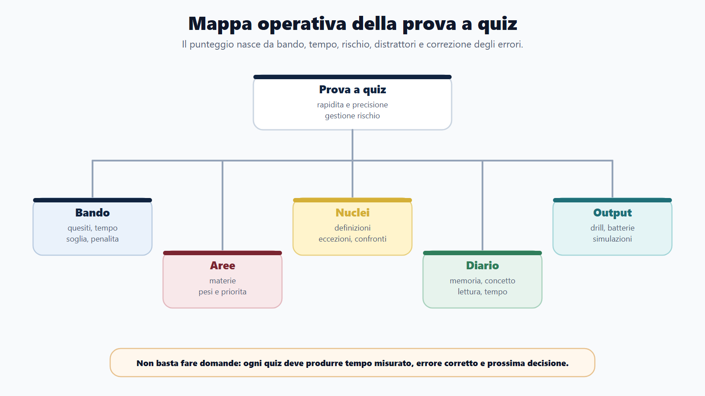
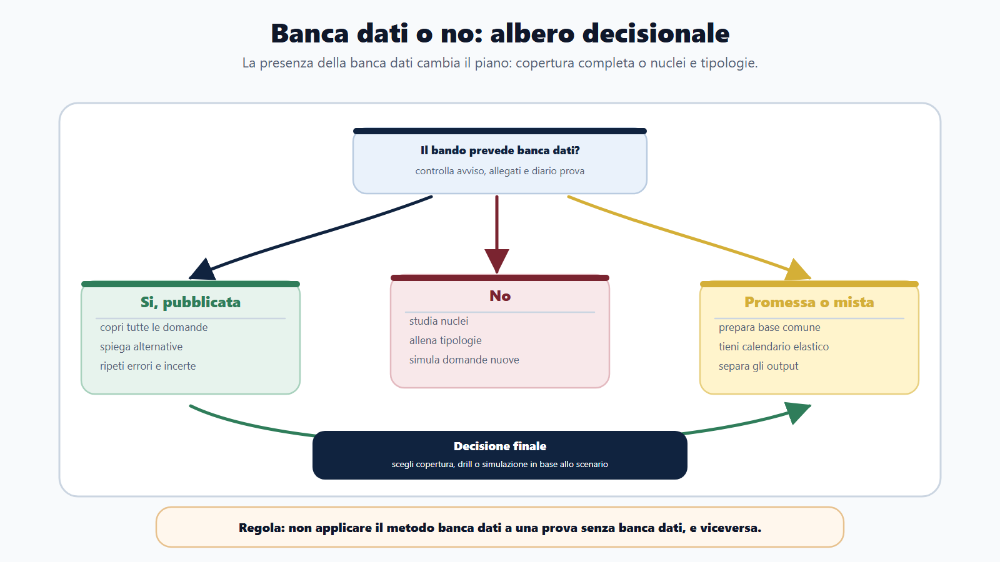
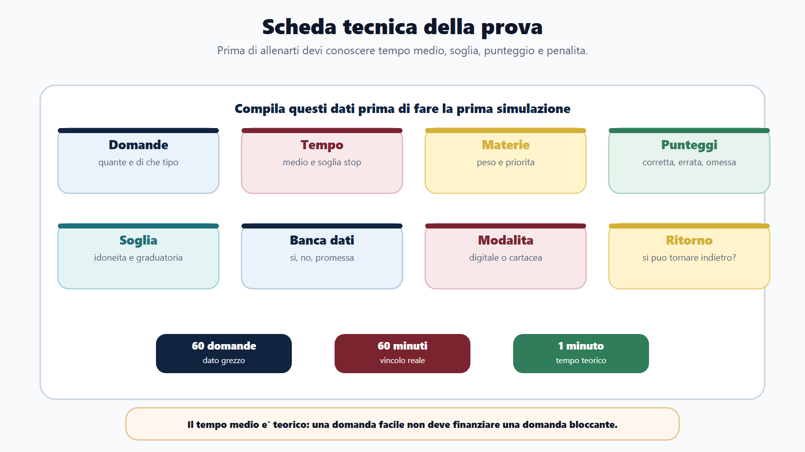
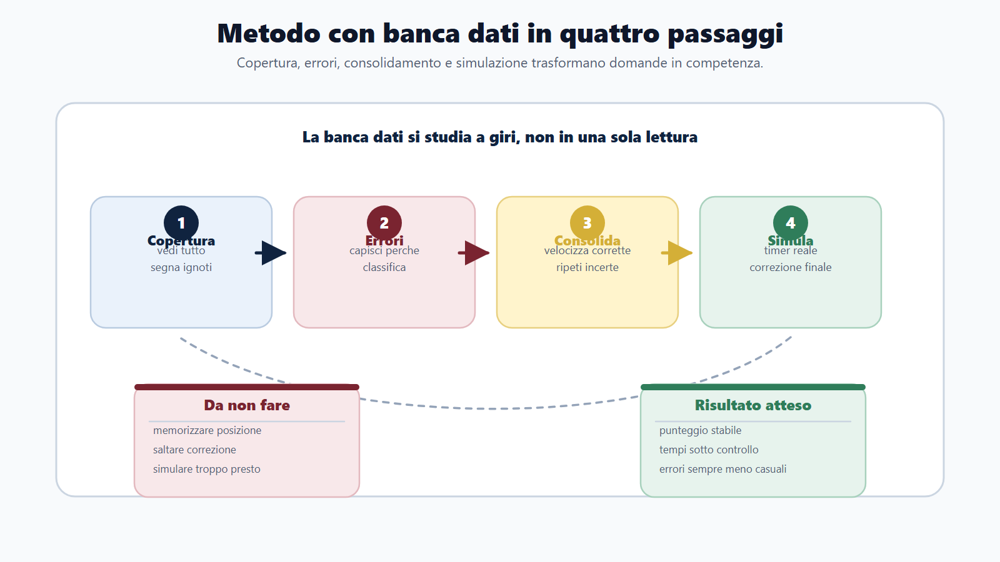
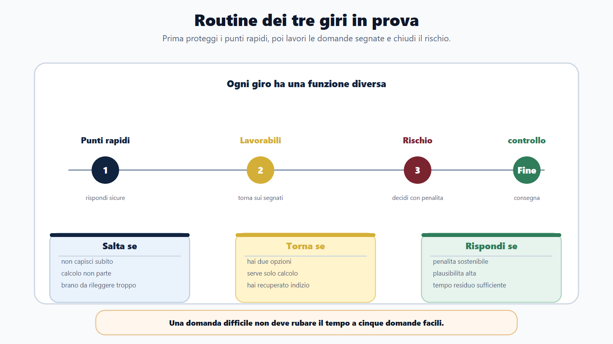
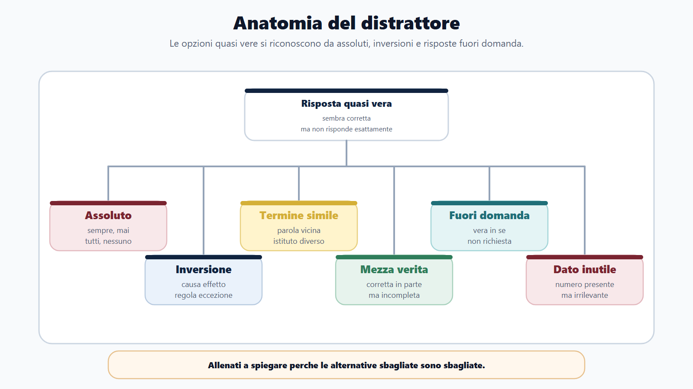
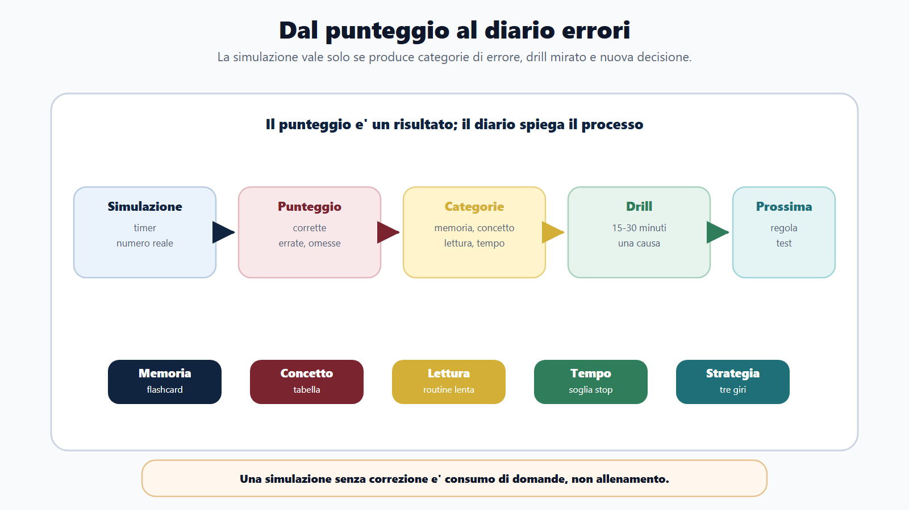

# Capitolo 14 - La prova a quiz

## Perché il quiz è una prova diversa dallo studio

La prova a quiz sembra semplice perché offre già le risposte. In realtà è una prova molto selettiva: misura conoscenza, rapidità, precisione di lettura e gestione del rischio. Una risposta può essere sbagliata non perché non conosci la materia, ma perché hai ignorato una negazione, confuso due istituti, letto una parola assoluta o perso troppo tempo su una domanda.

Il quiz non premia chi ha sottolineato di più. Premia chi riconosce il nucleo della domanda, elimina i distrattori e decide in pochi secondi se rispondere, segnare o saltare. Per questo va preparato come una prova specifica, non come un semplice accessorio alla teoria.

Nel Metodo BANDO la prova a quiz è un output. Ogni materia deve diventare domanda possibile. Ogni errore deve diventare dato. Ogni simulazione deve assomigliare alla prova reale: numero di quesiti, timer, regole di punteggio, penalità, soglia e assenza di pause.

## Obiettivo del capitolo

Questo capitolo ti insegna a preparare quiz con o senza banca dati, usare il tempo, decidere quando saltare, correggere gli errori e trasformare batterie e simulazioni in allenamento intelligente.

Alla fine dovrai saper rispondere a quattro domande:

- esiste una banca dati ufficiale?
- quanto tempo ho per domanda?
- che cosa succede se sbaglio?
- quali errori sto ripetendo?

Se non conosci queste quattro risposte, non stai ancora preparando la prova a quiz. Stai solo facendo domande a caso.

## Mappa BANDO della prova a quiz

| Fase | Cosa cercare | Prodotto concreto |
|---|---|---|
| **B - Bando** | Numero quesiti, materie, tempo, soglia, penalità, banca dati. | Scheda tecnica della prova. |
| **A - Aree** | Materie e tipologie: diritto, logica, inglese, informatica, profilo. | Tabella pesi e priorità. |
| **N - Nuclei** | Argomenti ricorrenti, definizioni, eccezioni, confronti, distrattori. | Lista nuclei da drillare. |
| **D - Diario** | Errori per memoria, concetto, lettura, tempo, strategia. | Registro errori quiz. |
| **O - Output** | Batterie, drill, simulazioni complete, correzioni ragionate. | Punteggio stabile e tempi sotto controllo. |

## Prima decisione: banca dati o no

La prima differenza è decisiva.

| Scenario | Metodo |
|---|---|
| Banca dati ufficiale pubblicata | Copertura completa, errori, ripassi, simulazioni, memorizzazione ragionata. |
| Banca dati non pubblicata | Studio dei nuclei, quiz per tipologia, simulazioni originali, correzione concettuale. |
| Banca dati promessa ma non ancora disponibile | Preparazione dei nuclei e calendario flessibile per assorbire la banca quando esce. |
| Prova mista | Separare quiz, risposta aperta, inglese, informatica e orale. |

Con banca dati ufficiale, il problema non è "trovare domande". È coprirle tutte senza memorizzare meccanicamente la posizione della risposta. Devi conoscere perché una risposta è corretta e perché le altre sono sbagliate.

Senza banca dati, il problema cambia: non puoi inseguire ogni raccolta online. Devi studiare nuclei e tipologie. Per diritto amministrativo, per esempio, non basta fare mille quiz casuali: devi capire procedimento, provvedimento, accesso, silenzio, responsabilità. Per logica devi distinguere brani, deduzioni, serie, percentuali e vincoli.

## Scheda tecnica della prova

Compila questa tabella per ogni concorso.

| Elemento | Risposta |
|---|---|
| Numero domande | |
| Tempo totale | |
| Tempo medio per domanda | |
| Materie incluse | |
| Peso delle materie | |
| Punteggio risposta corretta | |
| Punteggio risposta errata | |
| Punteggio risposta omessa | |
| Soglia minima | |
| Banca dati ufficiale | |
| Modalità digitale/cartacea | |
| Possibilità di tornare indietro | Da verificare |

La riga più importante è il tempo medio. Se hai 60 domande in 60 minuti, il tempo teorico è un minuto. Ma non tutte le domande valgono lo stesso investimento: alcune si risolvono in 20 secondi, altre possono assorbire tre minuti. La strategia nasce da questa differenza.

## Come studiare con banca dati ufficiale

La banca dati ufficiale va trattata in quattro passaggi.

### Primo passaggio: copertura

Nel primo giro devi vedere tutte le domande. Non cercare subito la perfezione. Devi capire:

- quali materie pesano di più;
- quali domande sono ripetitive;
- quali nuclei ritornano;
- quali formulazioni ti traggono in errore;
- quali argomenti non conosci affatto.

### Secondo passaggio: errori

Nel secondo giro lavori sugli errori. Non basta rifare la domanda sbagliata. Devi capire perché è sbagliata.

| Tipo errore | Esempio | Azione |
|---|---|---|
| Memoria | Non ricordavo una definizione. | Flashcard e richiamo. |
| Concetto | Ho confuso accesso civico e accesso documentale. | Tabella comparativa. |
| Lettura | Ho ignorato "non". | Routine di lettura lenta della domanda. |
| Distrattore | Ho scelto una risposta plausibile ma incompleta. | Analisi delle alternative. |
| Tempo | Ho impiegato troppo. | Soglia di abbandono. |

### Terzo passaggio: consolidamento

Nel terzo giro le domande corrette devono diventare rapide. Quelle sbagliate devono tornare spesso. Quelle incerte vanno segnate, anche se hai risposto bene. Una risposta corretta per fortuna non è una competenza stabile.

### Quarto passaggio: simulazione

Solo alla fine la banca dati diventa simulazione. La simulazione non è una batteria qualunque: è prova reale. Timer, numero domande, penalità, niente pause, correzione finale.

## Come studiare senza banca dati

Senza banca dati devi evitare due errori: fare quiz casuali e cambiare fonte ogni giorno. Il metodo corretto è costruire tipologie.

Per ogni materia, crea una griglia:

| Materia | Nuclei | Tipi di domanda |
|---|---|---|
| Diritto amministrativo | procedimento, provvedimento, accesso, silenzio | definizione, eccezione, confronto, caso breve |
| Pubblico impiego | doveri, responsabilità, codice comportamento | principio, comportamento, conseguenza |
| Informatica | file, rete, PEC, firma digitale, sicurezza | definizione, differenza, uso operativo |
| Inglese | grammatica, lessico, comprensione | completamento, sinonimo, brano |
| Logica | deduzioni, percentuali, brani, serie | schema, calcolo, esclusione |

Poi allena ogni tipologia. Se sbagli sempre domande di confronto, non serve fare cento domande nuove. Serve costruire tabelle comparative.

## La routine dei tre giri

In prova non devi affrontare tutte le domande nello stesso modo. Usa tre giri.

### Primo giro: punti rapidi

Rispondi alle domande che riconosci con sicurezza. Non restare bloccato. Se una domanda richiede calcolo lungo, brano difficile o ricordo incerto, segnala e vai avanti.

### Secondo giro: domande lavorabili

Torna sulle domande segnate. Ora investi più tempo su calcoli, brani, confronti e quesiti con due opzioni rimaste.

### Terzo giro: rischio controllato

Solo alla fine decidi sulle domande dubbie. Qui conta il bando: se c'è penalità, devi essere più selettivo; se non c'è penalità, la strategia cambia. Non applicare mai una regola generale senza leggere i criteri.

> [!IMPORTANT]
> **Regola operativa**
> Una domanda difficile non deve rubare il tempo a cinque domande facili. Il punteggio complessivo vale più dell'orgoglio sulla singola risposta.

## Quando saltare una domanda

Saltare non significa arrendersi. Significa proteggere il punteggio.

Salta temporaneamente quando:

- non capisci subito che cosa chiede;
- restano troppe informazioni da ordinare;
- devi rileggere un brano più di due volte;
- il calcolo non parte entro 30-40 secondi;
- senti che stai rispondendo per stanchezza;
- il dubbio riguarda una penalità rilevante.

Segna la domanda e torna dopo. Il salto è utile solo se esiste un secondo giro.

## Distrattori: come riconoscerli

I distrattori non sono risposte assurde. Spesso sono quasi vere.

| Distrattore | Segnale |
|---|---|
| Assoluto | sempre, mai, tutti, nessuno, solo. |
| Inversione | scambia causa ed effetto, regola ed eccezione. |
| Termine simile | usa parole vicine ma non equivalenti. |
| Mezza verità | corretta in parte, ma incompleta. |
| Fuori domanda | vera in sé, ma non risponde al quesito. |
| Dato non richiesto | usa un numero o dettaglio presente ma irrilevante. |

Allenati a spiegare perché le risposte sbagliate sono sbagliate. È uno dei modi più rapidi per migliorare.

## Correzione: il punteggio non basta

Dopo una simulazione non limitarti a dire "ho fatto 42 su 60". Il punteggio è il risultato. Tu devi leggere il processo.

Scheda di correzione:

| Domanda | Esito | Categoria errore | Correzione | Ripasso |
|---|---|---|---|---|
| | Corretta / Errata / Omessa / Incerta | Memoria / concetto / lettura / tempo / strategia | | Data |

Ogni simulazione deve produrre un piano di recupero:

- tre nuclei da ripassare;
- una tipologia da drillare;
- una regola di tempo da modificare;
- una flashcard o tabella da creare;
- una decisione per la prossima simulazione.

## Simulazioni: quando iniziare e come farle

Le simulazioni complete non devono arrivare solo negli ultimi giorni. Devono entrare quando hai basi minime, ma prima della rifinitura finale.

Una progressione utile:

1. **drill breve**: 10-15 domande su un nucleo;
2. **batteria tematica**: 30 domande su una materia;
3. **batteria mista**: materie diverse con tempo;
4. **simulazione parziale**: metà prova reale;
5. **simulazione completa**: prova reale con correzione.

Non fare simulazioni complete ogni giorno se poi non correggi. Una simulazione senza analisi è solo consumo di domande.

## Caso guidato

Luca prepara una preselettiva con 60 domande in 60 minuti. La prima settimana fa batterie casuali e guarda solo il punteggio. Migliora poco: passa da 37 a 39 risposte corrette.

Poi cambia metodo. Compila la scheda tecnica: scopre che non c'è banca dati, che alcune domande sono di logica e che la penalità per errore esiste. Divide gli errori in categorie. Nota che sbaglia soprattutto:

- domande con "non";
- differenze tra accesso civico e accesso documentale;
- percentuali;
- domande lasciate troppo tardi.

La settimana successiva non aumenta il numero di quiz. Fa drill mirati: 20 domande su accessi, 15 percentuali, 10 brani brevi, 30 domande miste a tempo. Alla simulazione successiva arriva a 46 risposte corrette, ma soprattutto riduce gli errori di lettura.

Il miglioramento nasce dalla correzione, non dalla quantità.

## Domanda da commissario

**Domanda:** Come si prepara una prova a quiz in modo efficace?

**Risposta efficace:** prima si legge il bando per capire numero di domande, materie, tempo, soglie, penalità e banca dati. Poi si studiano i nuclei, si fanno quiz per tipologia, si classificano gli errori e si passa a simulazioni sempre più simili alla prova reale. La correzione deve distinguere errore di memoria, concetto, lettura, tempo e strategia.

## Domanda-trappola

**Domanda:** Fare molti quiz basta per essere preparati?

No. Fare molti quiz senza capire gli errori può consolidare abitudini sbagliate. Il quiz diventa allenamento solo quando produce feedback: perché ho sbagliato, che cosa devo ripassare, quale distrattore mi ha preso, quale regola di tempo devo cambiare.

## Mini-esercizio

Prendi 20 quiz già svolti e classifica ogni errore.

| Categoria | Numero errori |
|---|---:|
| Memoria | |
| Concetto | |
| Lettura | |
| Tempo | |
| Strategia | |
| Stress/distrazione | |

Poi scegli la categoria più frequente e costruisci un drill da 15 minuti. Non passare a una nuova batteria prima di aver corretto il pattern principale.

## Da sapere in 5 righe

1. La prova a quiz va preparata leggendo il bando, non solo facendo batterie.
2. Con banca dati ufficiale serve copertura completa e ripasso degli errori.
3. Senza banca dati servono nuclei, tipologie e simulazioni miste.
4. Il tempo si gestisce con più giri e soglie di abbandono.
5. Ogni errore deve diventare una decisione di studio.

## Fonti consolidate

- [[sources/prove-concorsuali-quiz-scritto-orale-dpr-487-1994]]
- [[sources/apprendimento-efficace-active-recall-ripasso-distribuito]]
- [[sources/ripam-quesiti-attitudinali-logica-ragionamento-comprensione]]
- [[topics/prova-a-quiz]]
- [[topics/diario-errori]]
- [[topics/logica-concorsuale]]

## Note di review

- Prima della pubblicazione finale verificare eventuali aggiornamenti normativi e bandi recenti su soglie, penalità e modalità digitali.
- Gli esempi sono originali e metodologici; non riproducono banche dati ufficiali.
