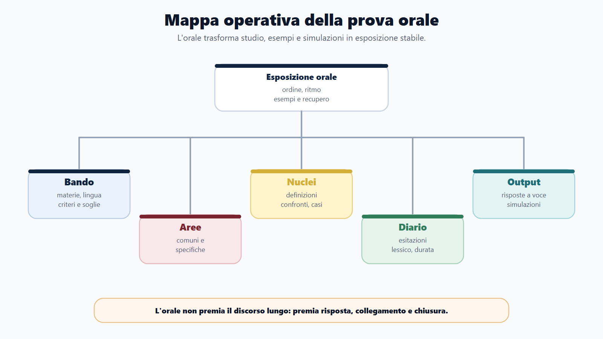
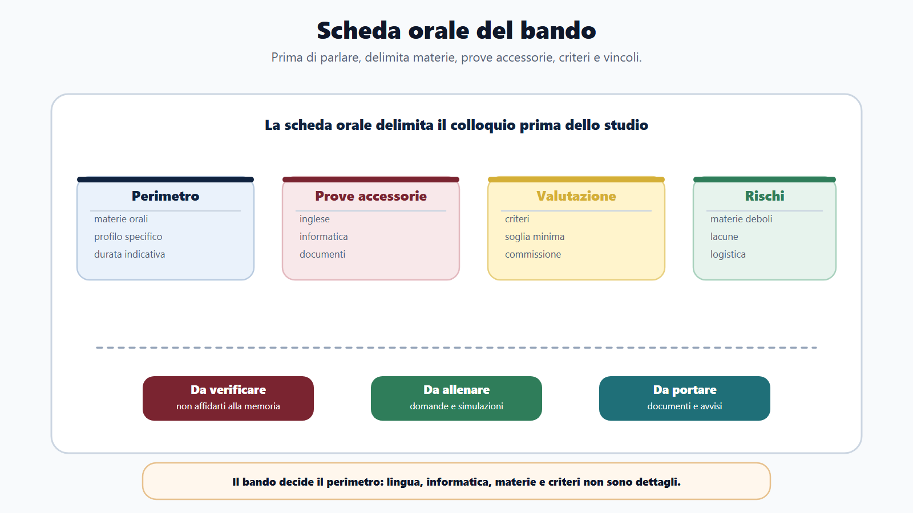
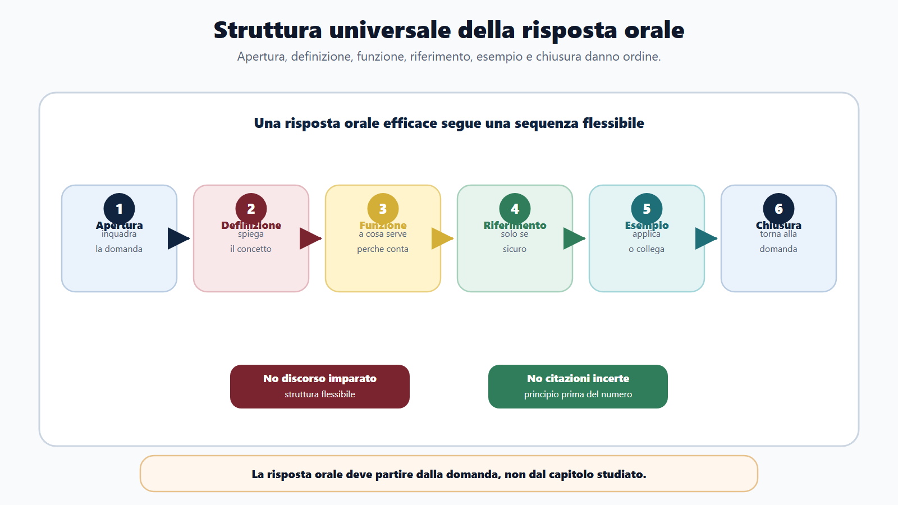
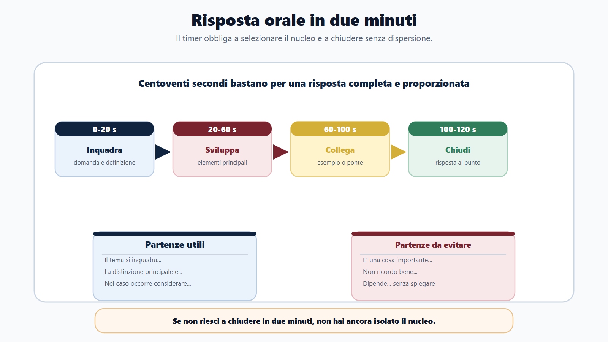
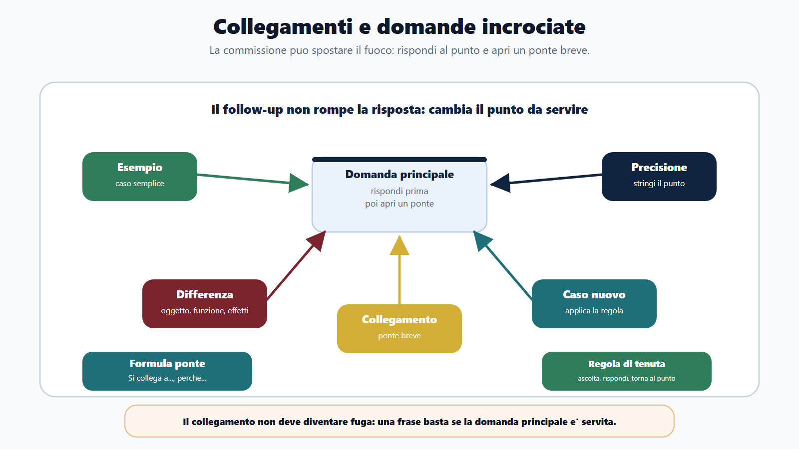
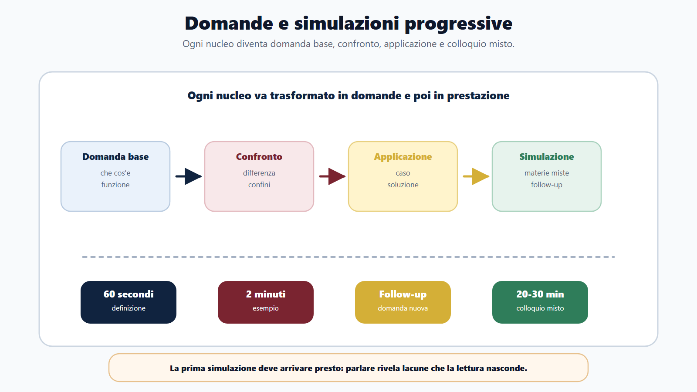
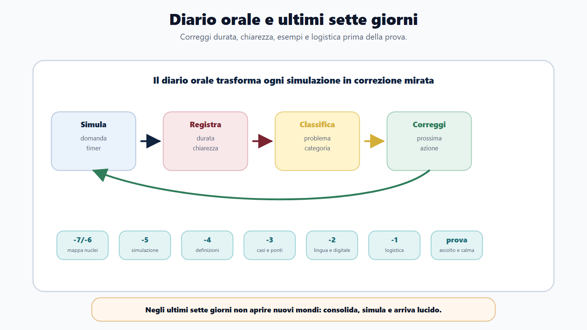

# Capitolo 16 - La prova orale

## Perché l'orale non è una ripetizione del manuale

La prova orale mette il candidato davanti a una commissione e trasforma lo studio in parola. Non basta "sapere". Bisogna iniziare, ordinare, collegare, scegliere esempi, correggersi se si parte male e restare lucidi quando arriva una domanda inattesa.

Molti candidati rimandano l'orale alla fine. Pensano: prima studio, poi ripeto. È un errore. L'orale va preparato mentre studi, perché parlare rivela subito le lacune: definizioni confuse, passaggi saltati, esempi assenti, collegamenti deboli, frasi troppo lunghe.

La prova orale non misura solo memoria. Misura padronanza. La differenza è semplice: la memoria ti permette di ricordare parole; la padronanza ti permette di spiegare un concetto anche se la domanda cambia forma.

## Obiettivo del capitolo

Questo capitolo ti insegna a preparare l'orale come output autonomo. Imparerai a costruire risposte ordinate, gestire i vuoti, affrontare domande incrociate, collegare materie e simulare il colloquio.

L'obiettivo non è imparare discorsi a memoria. È costruire una struttura flessibile che ti permetta di rispondere in modo chiaro anche sotto pressione.

## Mappa BANDO della prova orale

| Fase | Cosa controllare | Prodotto concreto |
|---|---|---|
| **B - Bando** | Materie orali, lingua, informatica, profilo, criteri e soglie. | Scheda orale del concorso. |
| **A - Aree** | Materie comuni, materie specifiche, collegamenti, domande trasversali. | Mappa orale per aree. |
| **N - Nuclei** | Definizioni, principi, procedure, confronti, casi, esempi. | Schede domanda-risposta. |
| **D - Diario** | Esitazioni, risposte troppo lunghe, lacune, lessico incerto. | Diario orale. |
| **O - Output** | Risposte a voce, simulazioni, domande incrociate, mini-colloqui. | Esposizione stabile. |

## La scheda orale del bando

Prima di preparare l'orale, compila questa scheda.

| Elemento | Risposta |
|---|---|
| Materie orali | |
| Inglese previsto | Sì / No / Da verificare |
| Informatica prevista | Sì / No / Da verificare |
| Profilo specifico | |
| Durata indicativa | Se nota |
| Criteri di valutazione | |
| Soglia minima | |
| Documenti da portare | |
| Data e sede | |
| Materie più deboli | |

La prova orale cambia molto da concorso a concorso. Alcuni colloqui sono brevi e nozionistici, altri chiedono ragionamento, collegamenti e casi. Alcuni includono lingua straniera e informatica. Il bando decide il perimetro.

## La struttura universale della risposta

Una risposta orale efficace ha sei passaggi:

1. **apertura**: inquadra la domanda;
2. **definizione**: spiega il concetto;
3. **funzione**: dice a che cosa serve;
4. **riferimento**: richiama principio o fonte, se sicuro;
5. **esempio o collegamento**: mostra applicazione;
6. **chiusura**: torna alla domanda.

Questa struttura non deve diventare meccanica. Deve darti ordine.

### Esempio

Domanda: "Che cosa si intende per buon andamento della pubblica amministrazione?"

Risposta ordinata:

> Il buon andamento è un principio costituzionale che richiede alla pubblica amministrazione di agire in modo efficiente, efficace, imparziale e orientato al corretto uso delle risorse. Non riguarda solo la velocità, ma la qualità complessiva dell'azione amministrativa. Si collega al procedimento, all'organizzazione degli uffici, alla responsabilità dei dipendenti, alla performance e alla trasparenza. Per esempio, un procedimento gestito con tempi ragionevoli, istruttoria completa e comunicazioni chiare al cittadino realizza meglio il buon andamento. In questo senso il principio è una guida concreta per l'attività amministrativa, non solo una formula astratta.

La risposta funziona perché non è una definizione isolata. Collega principio, funzione ed esempio.

## Come iniziare una risposta

L'inizio è il punto più delicato. Se parti troppo largo, perdi tempo. Se parti troppo secco, sembri insicuro. Usa formule semplici:

- "Il tema può essere inquadrato partendo da..."
- "L'istituto serve a..."
- "La distinzione principale è..."
- "Nel contesto della pubblica amministrazione, questo principio opera..."
- "Per rispondere al caso occorre considerare..."

Evita inizi vaghi:

- "Allora, in pratica..."
- "È una cosa molto importante..."
- "Non mi ricordo bene, però..."
- "Dipende..."

"Dipende" può essere una buona risposta solo se poi spieghi da che cosa dipende.

## Risposte da due minuti

Allenati a rispondere in due minuti. Due minuti sono abbastanza per dire qualcosa di ordinato e abbastanza pochi per obbligarti a selezionare.

Struttura:

| Tempo | Contenuto |
|---:|---|
| 0-20 secondi | Inquadramento e definizione. |
| 20-60 secondi | Elementi principali. |
| 60-100 secondi | Esempio o collegamento. |
| 100-120 secondi | Chiusura. |

Se non riesci a spiegare un argomento in due minuti, probabilmente non hai ancora isolato il nucleo. Se parli per cinque minuti senza chiudere, devi lavorare sulla struttura.

## Collegamenti tra materie

All'orale le materie non restano sempre separate. Una domanda sul procedimento può portare all'accesso, alla trasparenza, alla privacy, alla digitalizzazione, al pubblico impiego o alla responsabilità.

Esempi di collegamento:

| Domanda iniziale | Collegamenti possibili |
|---|---|
| Procedimento amministrativo | Responsabile, partecipazione, motivazione, accesso, silenzio. |
| Trasparenza | Accesso civico, privacy, anticorruzione, amministrazione trasparente. |
| Pubblico impiego | Doveri, codice comportamento, responsabilità, performance. |
| Contratti pubblici | RUP, programmazione, trasparenza, digitalizzazione, controlli. |
| PA digitale | Documento informatico, firma digitale, PEC, sicurezza, accessibilità. |

Il collegamento non deve diventare fuga. Devi rispondere alla domanda principale e poi, se utile, aprire un ponte.

Formula utile:

> Questo tema si collega anche a..., perché...

Una frase basta. Non devi trasformare ogni risposta in un capitolo.

## Vuoti di memoria

Il vuoto di memoria va gestito, non nascosto con parole casuali. Se non ricordi un dettaglio, torna a ciò che sai con sicurezza.

Strategie:

- riparti dalla definizione;
- distingui principio generale e dettaglio;
- dichiara il perimetro senza inventare;
- usa un esempio;
- chiedi mentalmente: "qual è la funzione dell'istituto?";
- evita articoli o numeri incerti.

Esempio:

> Non ricorderei in questo momento il numero esatto dell'articolo, ma il principio è che l'amministrazione deve concludere il procedimento e rendere comprensibili le ragioni della decisione. Questo si collega alla motivazione e alla tutela del cittadino.

Questa risposta è meglio di una citazione inventata.

## Domande incrociate

La commissione può interrompere, chiedere un esempio, spostare materia o chiedere una distinzione. Non viverlo come attacco. È parte del colloquio.

Tipi di follow-up:

| Follow-up | Come rispondere |
|---|---|
| "Mi faccia un esempio" | Usa un caso semplice di ufficio, cittadino, istanza, atto. |
| "Qual è la differenza?" | Costruisci tabella mentale: oggetto, funzione, effetti. |
| "E se invece..." | Applica la regola al caso nuovo. |
| "Mi colleghi questo tema a..." | Dai un ponte breve e torna al punto. |
| "Può essere più preciso?" | Stringi su definizione o passaggio mancante. |

Il segreto è non perdere l'ordine. Prima ascolti, poi rispondi al nuovo punto.

## Preparare le domande

Per ogni nucleo crea tre domande:

1. domanda base;
2. domanda di confronto;
3. domanda applicativa.

Esempio su accesso:

| Tipo | Domanda |
|---|---|
| Base | Che cos'è l'accesso documentale? |
| Confronto | Come si distingue dall'accesso civico generalizzato? |
| Applicativa | Che cosa deve valutare l'amministrazione se l'accesso coinvolge dati personali? |

Questa tecnica impedisce di preparare solo definizioni. L'orale reale spesso parte da una definizione e poi chiede differenza o applicazione.

## Simulazioni orali

La simulazione orale deve essere concreta. Non basta "ripetere mentalmente".

Regole:

- scegli domande casuali;
- rispondi a voce;
- usa timer;
- registra audio se possibile;
- non interromperti a ogni errore;
- correggi dopo;
- segna nel diario durata, chiarezza, lacune e parole incerte.

Progressione:

| Fase | Esercizio |
|---|---|
| Base | Risposta da 60 secondi su definizione. |
| Intermedia | Risposta da 2 minuti con esempio. |
| Avanzata | Domanda più follow-up. |
| Simulazione | 20-30 minuti con materie miste. |
| Rifinitura | Domande deboli, lingua, informatica, profilo. |

La prima simulazione deve arrivare presto. Se aspetti l'ultima settimana, scoprirai troppo tardi che non sai parlare del materiale che pensavi di conoscere.

## Diario orale

Dopo ogni simulazione compila questa scheda.

| Domanda | Durata | Esito | Problema | Correzione |
|---|---:|---|---|---|
| | | Chiara / lunga / confusa / incompleta | definizione, esempio, collegamento, lessico, memoria | |

Categorie utili:

- definizione incerta;
- risposta troppo lunga;
- mancanza di esempio;
- collegamento forzato;
- norma citata male;
- tono esitante;
- inglese o informatica trascurati;
- chiusura assente.

Il diario orale ti evita di ripetere sempre gli stessi difetti.

## Inglese e informatica all'orale

Se il bando prevede accertamento di inglese o informatica, non trattarli come dettagli. Preparali in modo proporzionato.

Per inglese:

- presentazione breve;
- lessico amministrativo essenziale;
- frasi su lavoro, ufficio, email, servizio pubblico;
- comprensione di un breve testo;
- risposte semplici e corrette.

Per informatica:

- definizioni chiare;
- differenze tra strumenti;
- esempi di uso nella PA;
- sicurezza di base;
- PEC, firma digitale, SPID, CIE, documento informatico se previsti dal programma.

Non serve parlare come uno specialista, a meno che il profilo lo richieda. Serve rispondere con ordine.

## Ultimi sette giorni

Negli ultimi sette giorni non devi aprire nuovi mondi. Devi consolidare.

| Giorno | Attività |
|---|---|
| -7 / -6 | Mappa materie e nuclei deboli. |
| -5 | Simulazione orale mista. |
| -4 | Ripasso definizioni e confronti. |
| -3 | Casi e collegamenti. |
| -2 | Inglese, informatica, profilo, documenti. |
| -1 | Ripasso leggero, logistica, sonno. |
| Giorno prova | Risposte brevi, calma, ascolto della domanda. |

L'ultimo giorno non serve dimostrare a te stesso che puoi studiare tutto. Serve arrivare lucido.

## Caso guidato

Marta ha superato la prova scritta e ha tre settimane per l'orale. All'inizio rilegge i manuali. Dopo cinque giorni si accorge che, se chiude il libro, non riesce a spiegare bene procedimento, accesso e pubblico impiego.

Cambia metodo. Per ogni materia crea domande base, confronto e applicazione. Ogni giorno registra tre risposte da due minuti. Il sabato fa una simulazione con domande casuali. Nel diario nota che le risposte sono troppo lunghe e senza esempi. La settimana successiva impone una struttura: definizione, funzione, esempio, chiusura.

All'orale non ricorda un dettaglio numerico, ma non si blocca. Torna al principio, spiega la funzione e usa un esempio. La risposta resta ordinata.

## Domanda da commissario

**Domanda:** Come si prepara in modo efficace una prova orale?

**Risposta efficace:** si parte dal bando, individuando materie, profilo, eventuale inglese e informatica. Poi si trasformano i nuclei in domande orali: definizione, confronto e applicazione. Ogni risposta va allenata a voce con una struttura chiara: inquadramento, definizione, funzione, esempio e chiusura. Le simulazioni devono essere progressive e gli errori registrati in un diario.

## Domanda-trappola

**Domanda:** All'orale è meglio parlare molto per mostrare preparazione?

No. Parlare molto può diventare dispersione. La commissione deve capire che sai rispondere alla domanda. Una risposta breve, ordinata e precisa è spesso più forte di una risposta lunga che perde il punto.

## Mini-esercizio

Scegli un argomento e prepara tre risposte:

| Tipo risposta | Vincolo |
|---|---|
| Base | 60 secondi: definizione e funzione. |
| Completa | 2 minuti: definizione, elementi, esempio, chiusura. |
| Incrociata | Risposta più collegamento con un'altra materia. |

Registrati. Poi valuta: si capisce l'inizio? C'è un esempio? La chiusura risponde alla domanda? Hai usato parole precise?

## Da sapere in 5 righe

1. L'orale va preparato a voce, non solo leggendo.
2. Ogni risposta deve avere struttura, esempio e chiusura.
3. I collegamenti servono, ma non devono far perdere la domanda principale.
4. I vuoti di memoria si gestiscono tornando a principi sicuri.
5. Simulazioni e diario orale trasformano lo studio in padronanza.

## Fonti consolidate

- [[sources/prove-concorsuali-quiz-scritto-orale-dpr-487-1994]]
- [[sources/apprendimento-efficace-active-recall-ripasso-distribuito]]
- [[topics/prova-orale]]
- [[topics/risposta-concorsuale]]
- [[topics/metodo-di-studio]]

## Note di review

- Prima della pubblicazione finale valutare raccordo con Appendice E, che dovrà contenere lo schema universale compilabile.
- Durata, lingua, informatica, materie e criteri devono sempre essere verificati nel bando specifico.
