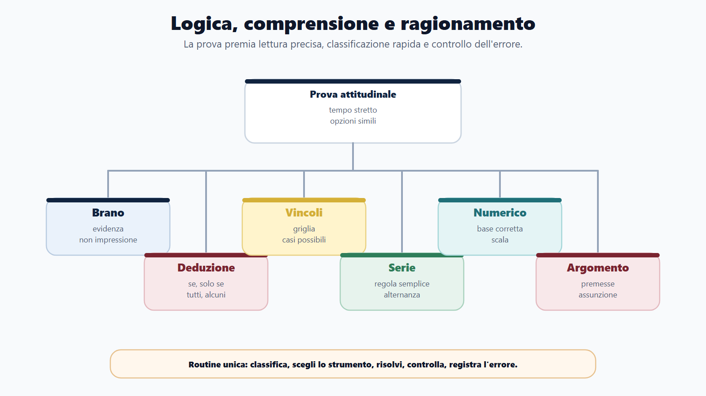
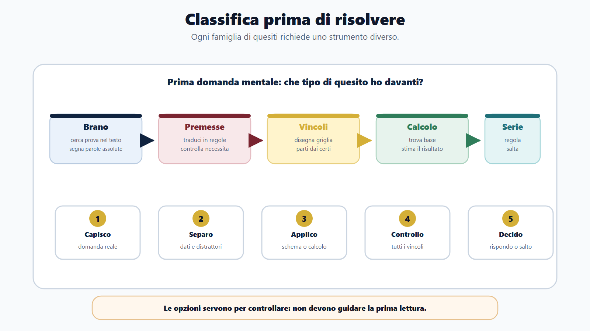
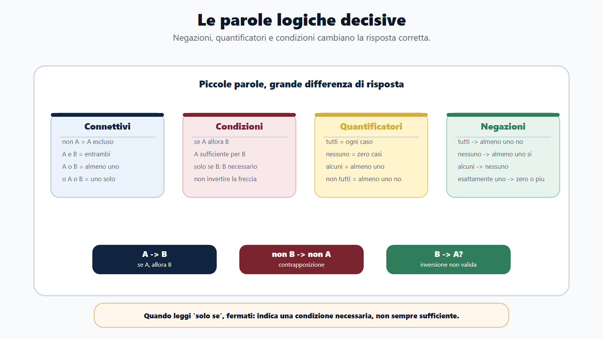
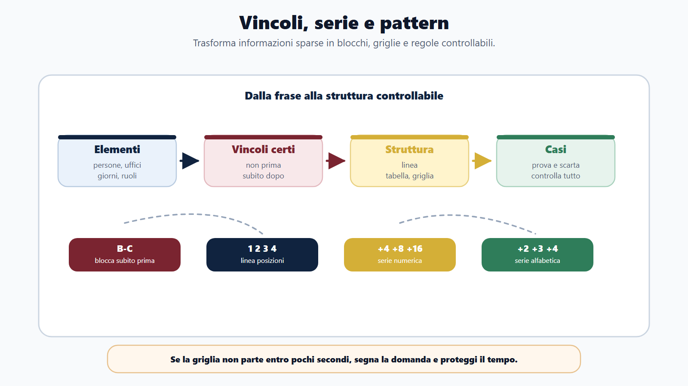
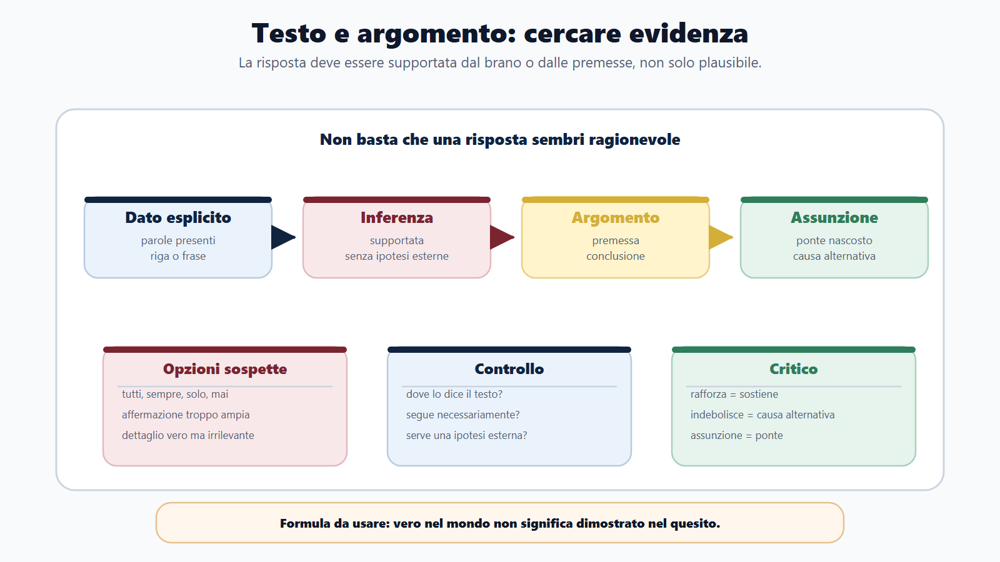
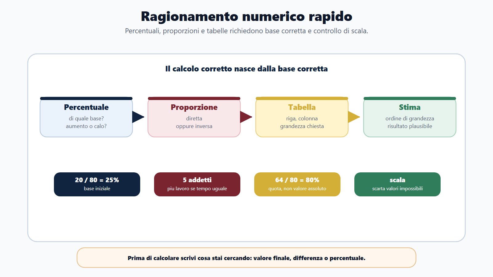
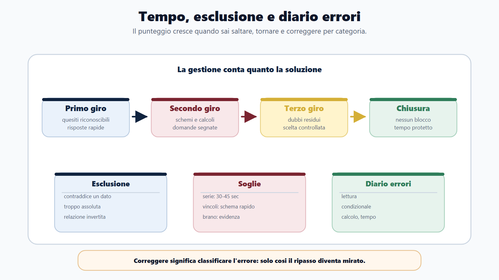

# Capitolo 12 - Logica, comprensione del testo e ragionamento

## Perché logica, comprensione e ragionamento decidono la prova

Logica, comprensione del testo e ragionamento sono le materie che più spesso fanno perdere punti a candidati preparati. Non perché siano impossibili, ma perché arrivano in prova con una forma diversa dalle materie giuridiche o amministrative: poche righe, tempo stretto, opzioni simili, distrattori costruiti sulla fretta.

In diritto amministrativo puoi recuperare con la memoria e con il ragionamento generale. In una domanda logica, invece, un "non", un "solo se", un "alcuni" o una percentuale letta male bastano a spostare la risposta corretta. Il candidato non viene valutato solo su ciò che sa, ma su come ragiona quando il tempo scorre.

Questo capitolo non è un trattato di logica. È una palestra. Ti insegna a riconoscere il tipo di quesito, scegliere lo strumento giusto, eliminare le opzioni sbagliate e registrare l'errore in modo utile. La promessa è semplice: non devi diventare un matematico o un filosofo della logica; devi diventare un candidato che legge bene, ragiona ordinatamente e non regala punti.

Le banche e le prove RIPAM confermano che questa area è composta da più famiglie: comprensione verbale, ragionamento verbale, ragionamento critico verbale, ragionamento numerico, ragionamento numerico-deduttivo e ragionamento critico numerico. A queste si aggiungono le formulazioni presenti nei bandi: logica deduttiva, quesiti attitudinali, ragionamento logico-matematico, comprensione del testo, capacità logico-critica. Cambiano le etichette, ma il lavoro del candidato resta lo stesso: capire la domanda prima di cercare la risposta.

> [!NOTE]
> **Da sapere in cinque righe**
> In questa materia vince chi classifica il quesito prima di risolverlo. Se è un brano, cerchi evidenza nel testo. Se è una deduzione, traduci le premesse in regole. Se è un vincolo, costruisci una griglia. Se è un calcolo, separi dati utili e distrattori. Se è un argomento, distingui premessa, conclusione e assunzione.

## Obiettivi del capitolo

Al termine del capitolo dovrai essere in grado di:

- capire dal bando se la prova contiene logica, comprensione, ragionamento critico, ragionamento numerico o test attitudinali;
- riconoscere i principali formati di quesito;
- tradurre connettivi, quantificatori e condizioni in regole operative;
- risolvere deduzioni, sillogismi, ordinamenti e vincoli senza affidarti all'intuizione;
- affrontare brani di comprensione distinguendo ciò che è scritto, deducibile o non deducibile;
- risolvere percentuali, proporzioni, tabelle e problemi numerici con controllo del risultato;
- distinguere premessa, conclusione, assunzione, rafforzamento e indebolimento;
- usare il metodo di esclusione senza cadere nelle opzioni plausibili;
- costruire un diario degli errori specifico per questa materia;
- fare una mini-simulazione a tempo con quesiti originali.

## Mappa BANDO

| Fase | Cosa fare | Risultato |
|---|---|---|
| **B - Bando** | Cerca parole come logica, ragionamento, attitudinale, comprensione, deduttivo, critico, numerico. | Capisci se devi allenare brani, calcoli, deduzioni o prove miste. |
| **A - Aree** | Dividi la materia in verbale, numerica, deduttiva, critica e comprensione. | Eviti di fare quiz casuali senza progressione. |
| **N - Nuclei** | Parti da connettivi, quantificatori, percentuali, proporzioni, brani e vincoli. | Copri i blocchi più ricorrenti. |
| **D - Diario** | Classifica ogni errore: lettura, logica, calcolo, tempo, distrazione, opzione trappola. | Trasformi gli errori in programma di ripasso. |
| **O - Output** | Produci schemi, griglie, soluzioni spiegate e simulazioni a tempo. | Ti alleni al formato reale della prova. |

> [!TIP]
> **BANDO in pratica**
> Se il bando parla genericamente di "capacità logico-deduttiva", non limitarti ai sillogismi. Prepara anche comprensione di brani, condizioni, quantificatori, ordinamenti, problemi numerici e ragionamento critico. Nei concorsi, le etichette sono spesso più strette del contenuto reale.

## Come viene chiesta in prova

La prima competenza è riconoscere il tipo di domanda. Senza questa classificazione, il candidato prova a risolvere tutto nello stesso modo e perde tempo.

| Tipo di quesito | Segnale | Strumento |
|---|---|---|
| Comprensione del testo | brano, titolo, affermazione coerente, "si deduce che" | evidenza testuale |
| Deduzione verbale | premesse, "se", "tutti", "alcuni", "necessariamente" | regole e casi |
| Sillogismo | categorie, insiemi, "nessuno", "ogni", "qualche" | Venn mentale o schema insiemi |
| Ordinamento | prima/dopo, più/meno, destra/sinistra, turni | linea o tabella |
| Vincoli multipli | persone, uffici, giorni, ruoli, condizioni | griglia |
| Serie | numeri, lettere, alternanze, progressioni | ricerca della regola |
| Analogia verbale | coppie di parole | relazione tra termini |
| Ragionamento numerico | percentuali, rapporti, dati, medie | formula breve e stima |
| Ragionamento critico | argomento, conclusione, rafforza, indebolisce | premessa-conclusione-assunzione |

La domanda non va letta una volta sola. Va letta in due passaggi: prima per capire cosa chiede, poi per risolvere. Molti errori nascono da una lettura unica, veloce e ansiosa.

## La regola madre: classifica prima di risolvere

Davanti a un quesito logico, usa sempre questa sequenza:

1. **Che tipo di domanda è?** Brano, deduzione, calcolo, serie, vincolo, argomento?
2. **Che cosa mi chiede davvero?** Una conclusione necessaria, una risposta plausibile, un titolo, un valore numerico?
3. **Quali dati sono vincoli e quali sono distrattori?**
4. **Quale strumento serve?** Testo, schema, tabella, calcolo, esclusione?
5. **La risposta è coerente con tutti i dati?**

Questa sequenza sembra lenta, ma diventa veloce con l'allenamento. Il candidato impreparato passa subito alle opzioni; il candidato strategico prima costruisce il criterio.

> [!WARNING]
> **Errore tipico**
> Leggere le opzioni prima di aver capito la domanda. Le opzioni sono progettate per attirare: una usa parole del testo, una è ragionevole ma non dimostrata, una contiene un errore minimo, una è corretta. Se non hai un criterio, scegli quella che "suona meglio".

## Logica essenziale: le parole che decidono il risultato

La logica concorsuale parte da parole piccole. Non servono formule complesse: serve sapere che una negazione, un quantificatore o un condizionale cambiano completamente la soluzione.

### Connettivi

| Formula | Significato operativo | Trappola |
|---|---|---|
| Non A | A è escluso | dimenticare la negazione |
| A e B | devono essere veri entrambi | scegliere una risposta con solo A |
| A o B | almeno uno dei due | interpretare sempre come esclusivo |
| O A o B | uno solo dei due | ammettere entrambi |
| Se A allora B | A è condizione sufficiente per B | invertire: se B allora A |
| Solo se B, A | B è condizione necessaria per A | leggere "solo se" come "se" |
| A se e solo se B | A e B stanno insieme | dimenticare una delle due direzioni |

Esempio:

> Se una domanda è protocollata, riceve un numero identificativo.

Conclusione sicura: una domanda protocollata ha un numero identificativo.

Conclusione non sicura: ogni domanda con numero identificativo è protocollata, a meno che la premessa non dica anche il contrario. Qui nasce uno degli errori più frequenti: invertire il condizionale.

### Necessario e sufficiente

Una condizione **sufficiente** basta a produrre un effetto. Una condizione **necessaria** deve esserci, ma da sola non basta.

| Frase | Lettura corretta |
|---|---|
| Se superi la prova scritta, sei ammesso all'orale. | Superare lo scritto è sufficiente per l'orale. |
| Sei ammesso all'orale solo se superi la prova scritta. | Superare lo scritto è necessario per l'orale. |
| Sei assunto se e solo se sei in graduatoria utile. | Le due condizioni coincidono. |

Nel linguaggio dei quiz, "solo se" è una sirena. Quando lo vedi, fermati. Non dice che quella condizione basta; dice che senza quella condizione non si va avanti.

### Quantificatori

| Espressione | Significato | Negazione corretta |
|---|---|---|
| Tutti | ogni elemento | almeno uno non |
| Nessuno | zero elementi | almeno uno sì |
| Alcuni | almeno uno, non per forza tutti | nessuno |
| Non tutti | almeno uno non | tutti |
| Almeno uno | uno o più | nessuno |
| Esattamente uno | uno e uno solo | zero oppure più di uno |

Esempio:

> Tutti gli uffici che ricevono domande online inviano una ricevuta.

La negazione corretta non è: "nessun ufficio invia ricevuta". La negazione corretta è: "almeno un ufficio che riceve domande online non invia ricevuta".

Questa distinzione è decisiva nei quiz. "Non tutti" non significa "nessuno". Significa che almeno un caso fa eccezione.

## Sillogismi e insiemi: non fidarti del buon senso

Un sillogismo chiede se una conclusione segue necessariamente da alcune premesse. La risposta non dipende da ciò che è realistico nel mondo, ma da ciò che le premesse autorizzano.

Esempio:

Premesse:

- Tutti i candidati ammessi hanno presentato domanda nei termini.
- Alcuni candidati ammessi sono laureati.

Conclusione proposta:

- Alcuni laureati hanno presentato domanda nei termini.

La conclusione segue. Se alcuni ammessi sono laureati, e tutti gli ammessi hanno presentato domanda nei termini, allora quei laureati ammessi hanno presentato domanda nei termini.

Ora cambia la conclusione:

- Tutti i laureati hanno presentato domanda nei termini.

Questa non segue. Le premesse parlano solo di alcuni laureati ammessi, non di tutti i laureati.

> [!NOTE]
> **Da sapere in cinque righe**
> Nei sillogismi non devi stabilire se una frase è vera nella vita reale. Devi stabilire se è obbligata dalle premesse. Se serve anche solo una informazione in più, la conclusione non è necessaria. Le parole "tutti", "alcuni" e "nessuno" vanno trattate come numeri logici, non come impressioni.

## Deduzioni, ordinamenti e vincoli

I quesiti con vincoli sembrano giochi, ma nei concorsi misurano una competenza molto concreta: trasformare informazioni sparse in struttura.

Metodo:

1. Individua gli elementi: persone, giorni, uffici, posizioni, ruoli.
2. Trasforma ogni frase in un vincolo.
3. Disegna una linea, una tabella o una griglia.
4. Inserisci prima i vincoli certi.
5. Usa le opzioni per controllare, non per iniziare.

### Caso guidato

Quattro candidati, Anna, Bruno, Carla e Davide, sostengono un colloquio in quattro turni consecutivi.

Premesse:

- Anna non è prima.
- Bruno è subito prima di Carla.
- Davide sostiene il colloquio dopo Anna.

Ragionamento:

Bruno e Carla formano un blocco: B-C. Il blocco può stare nelle posizioni 1-2, 2-3 o 3-4.

Se B-C sta in 3-4, restano 1 e 2 per Anna e Davide. Anna non è prima, quindi Anna sarebbe seconda e Davide primo, ma Davide deve essere dopo Anna. Impossibile.

Se B-C sta in 2-3, restano 1 e 4. Anna non può essere prima, quindi Anna è quarta e Davide primo, ma Davide dovrebbe essere dopo Anna. Impossibile.

Resta B-C in 1-2. Anna e Davide occupano 3-4 e Davide è dopo Anna. Ordine: Bruno, Carla, Anna, Davide.

La chiave non era indovinare. Era trattare "subito prima" come blocco e testare i casi.

## Serie e pattern: cerca la regola più semplice

Le serie numeriche e alfabetiche non chiedono fantasia. Chiedono disciplina: cercare una regola semplice prima di inventare costruzioni complicate.

Procedura:

1. Guarda le differenze tra termini.
2. Verifica se la regola è costante, alternata o progressiva.
3. Controlla se ci sono due serie intrecciate.
4. Nei numeri, prova addizione, sottrazione, moltiplicazione, divisione, quadrati.
5. Nelle lettere, traduci in posizioni alfabetiche.

Esempi:

| Serie | Regola | Termine successivo |
|---|---|---|
| 4, 7, 10, 13, ... | +3 | 16 |
| 2, 4, 8, 16, ... | x2 | 32 |
| 3, 6, 5, 10, 9, ... | x2, -1 alternati | 18 |
| A, C, F, J, ... | +2, +3, +4 | O |
| 1A, 2C, 3E, 4G, ... | numero +1, lettera +2 | 5I |

> [!WARNING]
> **Errore tipico**
> Se dopo 30-40 secondi non trovi una regola plausibile, segna la domanda e passa oltre. Le serie possono assorbire tempo in modo sproporzionato. Una domanda difficile non deve compromettere cinque domande facili.

## Comprensione del testo: non devi tradurre, devi provare

La comprensione del testo concorsuale non premia il lettore più colto. Premia chi sa trovare nel brano l'evidenza della risposta. Le fonti INVALSI e OECD/PISA aiutano a leggere questa competenza in modo ordinato: localizzare informazioni, comprendere il significato, fare inferenze supportate, valutare la coerenza.

Le domande più frequenti chiedono:

- idea principale;
- titolo più adatto;
- scopo del testo;
- affermazione coerente;
- informazione esplicita;
- inferenza;
- significato di una parola nel contesto;
- referente di un pronome;
- rapporto tra frasi tramite connettivi.

### Metodo in cinque mosse

1. Leggi prima la domanda.
2. Nel brano cerca soggetti, azioni, date, negazioni, condizioni.
3. Decidi se la domanda chiede un dato, una sintesi, una inferenza o un giudizio sul testo.
4. Elimina le opzioni troppo generiche, assolute o non supportate.
5. Scegli la risposta che richiede meno ipotesi esterne.

### Mini-brano guidato

Il Comune ha attivato un servizio online per la prenotazione degli appuntamenti con l'ufficio anagrafe. La prenotazione non è obbligatoria per le urgenze documentate, ma consente di ridurre i tempi di attesa negli altri casi. L'amministrazione precisa che l'accesso allo sportello resta possibile anche senza strumenti digitali, attraverso un numero telefonico dedicato.

Domanda: quale affermazione è coerente con il testo?

A. Tutti i cittadini devono prenotare online prima di recarsi all'anagrafe.
B. Le urgenze documentate possono essere gestite anche senza prenotazione.
C. Lo sportello fisico è stato sostituito dal servizio online.
D. Il numero telefonico è riservato alle sole urgenze.

Risposta corretta: B.

Perché: il testo dice che la prenotazione non è obbligatoria per le urgenze documentate. A è troppo assoluta, C contraddice il brano, D aggiunge un vincolo non presente.

> [!TIP]
> **BANDO in pratica**
> Nei brani amministrativi le opzioni trappola spesso esagerano: "tutti", "sempre", "solo", "mai", "obbligatoriamente". Se il testo è più prudente, l'opzione assoluta è sospetta.

## Ragionamento critico: premessa, conclusione, assunzione

Il ragionamento critico verbale non chiede se sei d'accordo con un argomento. Chiede se capisci come è costruito.

Ogni argomento ha:

- una **conclusione**, ciò che si vuole sostenere;
- una o più **premesse**, ciò che viene portato a sostegno;
- spesso una **assunzione nascosta**, ciò che deve essere vero perché il ragionamento regga.

Esempio:

> L'ente ha aumentato il numero di domande presentate online dopo aver semplificato il modulo. Dunque, la semplificazione del modulo ha favorito l'accesso al servizio.

Conclusione: la semplificazione ha favorito l'accesso.

Premessa: dopo la semplificazione sono aumentate le domande online.

Assunzione: l'aumento non dipende principalmente da un'altra causa, per esempio una campagna informativa o un obbligo nuovo.

Domanda possibile: quale informazione indebolisce l'argomento?

Risposta: nello stesso periodo l'ente ha reso obbligatoria la presentazione online. Questa informazione indebolisce, perché offre una causa alternativa all'aumento.

### Indicatori da riconoscere

| Segnale | Probabile funzione |
|---|---|
| quindi, dunque, pertanto | conclusione |
| perché, poiché, infatti | premessa |
| tuttavia, però, sebbene | contrasto o limite |
| a condizione che, solo se | vincolo |
| salvo che, a meno che | eccezione |

## Ragionamento numerico: pochi strumenti, usati bene

Il ragionamento numerico concorsuale non richiede matematica avanzata. Richiede lettura precisa, calcolo pulito e controllo della plausibilità.

I nuclei più frequenti sono:

- percentuali;
- frazioni;
- rapporti;
- proporzioni;
- medie;
- variazioni;
- tabelle;
- problemi di tempo, distanza, lavoro;
- distribuzioni e resti.

### Percentuali

Tre domande bastano per evitare molti errori:

1. Percentuale di che cosa?
2. Aumento o diminuzione?
3. Devo trovare il valore finale, la differenza o la percentuale?

Esempio:

In una prova sono iscritti 800 candidati. Il 15% non si presenta. Quanti candidati sostengono la prova?

15% di 800 = 120.
800 - 120 = 680.

Risposta: 680.

Errore tipico: calcolare 15 e sottrarre 15, oppure calcolare il 15% del valore sbagliato.

### Proporzioni

Esempio:

Tre operatori protocollano 180 domande in 2 ore. A parità di ritmo, quante domande protocollano 5 operatori in 2 ore?

Ogni operatore in 2 ore protocolla 60 domande.
5 operatori in 2 ore protocollano 300 domande.

Qui la proporzione è diretta: più operatori, più domande.

Attenzione ai casi inversi:

Se più operatori fanno lo stesso lavoro, il tempo diminuisce. Lì la proporzione non è diretta.

### Tabelle e dati

Quando una domanda contiene una tabella, non iniziare dal calcolo. Prima individua riga, colonna e grandezza richiesta.

| Ufficio | Domande ricevute | Domande complete |
|---|---:|---:|
| A | 120 | 90 |
| B | 150 | 105 |
| C | 80 | 64 |

Domanda: quale ufficio ha la percentuale più alta di domande complete?

A: 90/120 = 75%
B: 105/150 = 70%
C: 64/80 = 80%

Risposta: C.

La domanda non chiede chi ha più domande complete in valore assoluto. Chiede la percentuale. B ha 105 domande complete, ma non è la percentuale più alta.

## Metodo di esclusione

L'esclusione non è tirare a indovinare. È una tecnica razionale per ridurre le possibilità quando non conviene o non serve risolvere tutto.

Usala così:

1. Elimina le opzioni che contraddicono un dato.
2. Elimina le opzioni troppo forti rispetto al testo.
3. Elimina i risultati numerici fuori scala.
4. Elimina le risposte che usano una relazione invertita.
5. Tra le rimaste, scegli quella che soddisfa tutti i vincoli.

Esempio numerico:

Un costo aumenta da 80 a 100. Qual è l'aumento percentuale?

Opzioni: 10%, 20%, 25%, 30%.

La differenza è 20. La percentuale va calcolata sul valore iniziale: 20/80 = 25%. Se scegli 20%, stai confondendo differenza assoluta e percentuale.

## Gestione del tempo

In una prova a quiz, logica e ragionamento vanno governati con una regola chiara: non tutte le domande meritano subito lo stesso investimento.

| Tipo di domanda | Primo tentativo | Quando saltare |
|---|---:|---|
| Comprensione breve | 60-90 secondi | se devi rileggere tre volte il brano |
| Sillogismo semplice | 45-60 secondi | se non riesci a schematizzare le premesse |
| Vincolo multiplo | 90-120 secondi | se la griglia non parte entro 40 secondi |
| Serie | 30-45 secondi | se non vedi la regola iniziale |
| Percentuale/proporzione | 45-75 secondi | se hai dubbi sul dato base |
| Ragionamento critico | 60-90 secondi | se restano due opzioni e manca evidenza |

La prova non premia l'eroismo sulla singola domanda. Premia il punteggio complessivo. Saltare in modo intelligente non è rinunciare; è proteggere il tempo.

> [!IMPORTANT]
> **Regola operativa**
> Primo giro: fai le domande riconoscibili. Secondo giro: affronta quelle che richiedono schema o calcolo. Terzo giro: torna sulle domande segnate. Non lasciare che una serie difficile rovini un blocco di domande facili.

## Diario degli errori

Per questa materia, correggere "giusta/sbagliata" non basta. Devi registrare il tipo di errore.

| Categoria errore | Esempio | Correzione |
|---|---|---|
| Lettura | ignorata una negazione | cerchiare non, mai, solo, salvo |
| Condizionale | invertito se A allora B | scrivere A -> B |
| Quantificatore | non tutti letto come nessuno | tradurre in almeno uno non |
| Testo | scelta opzione plausibile ma non dimostrata | chiedere: dove lo dice il brano? |
| Calcolo | percentuale calcolata sulla base sbagliata | identificare sempre il valore iniziale |
| Vincolo | risolto a mente senza griglia | usare tabella anche per casi piccoli |
| Tempo | insistito troppo su una serie | fissare soglia di abbandono |
| Distrazione | scelta risposta prima del controllo | rileggere domanda e risposta finale |

Ogni settimana, guarda il diario e scegli un solo bersaglio: negazioni, percentuali, brani, vincoli, serie. Allenare tutto insieme è meno efficace che correggere il punto debole dominante.

## Domanda da commissario

**Come affronterebbe una prova con quesiti di logica e comprensione del testo?**

Una risposta ordinata potrebbe essere:

> Affronterei la prova distinguendo prima le famiglie di quesiti: brani di comprensione, deduzioni verbali, calcoli numerici, serie e ragionamento critico. Per i brani cercherei l'evidenza nel testo; per le deduzioni tradurrei le premesse in regole; per i calcoli individuerei il dato base e controllerei la plausibilità del risultato. Gestirei il tempo con più giri, evitando di bloccare la prova su una domanda lunga. Dopo l'allenamento, registrerei gli errori per categoria, così da correggere il metodo e non solo la singola risposta.

## Domanda-trappola

**Se una conclusione è plausibile, allora è corretta?**

No. Nei quesiti di logica e comprensione, la risposta corretta deve essere supportata dalle premesse o dal testo. Una conclusione può essere ragionevole nella vita reale, ma non necessaria nel quesito. La differenza tra plausibile e dimostrato è uno dei punti centrali della materia.

## Mini-esercizio guidato

> [!tip]
> Lavora sempre nello stesso ordine: prima leggi il quesito, poi scegli una risposta, infine confronta la soluzione. Le alternative non devono mai guidare la lettura del problema.

| Quesito guidato | Risposte |
|---|---|
| Premesse: 1. tutte le domande complete vengono protocollate; 2. alcune domande inviate online sono complete; 3. nessuna domanda protocollata viene esclusa per mancanza di firma. Quale conclusione segue necessariamente? | A. Tutte le domande inviate online vengono protocollate. B. Alcune domande inviate online vengono protocollate. C. Nessuna domanda inviata online viene esclusa. D. Tutte le domande protocollate sono complete. |

**Soluzione guidata.** La risposta corretta è **B**. Alcune domande online sono complete; tutte le complete sono protocollate; quindi alcune domande online sono protocollate. A estende "alcune" a "tutte". C aggiunge una esclusione generale non dimostrata. D inverte la prima premessa.

## Mini-simulazione a tempo

Questa simulazione contiene quesiti originali ispirati alle tipologie concorsuali. Tempo consigliato: 25 minuti. Prima rispondi senza guardare le soluzioni; poi classifica ogni errore.

### Quesiti

Ogni riga è una scheda di lavoro. La colonna **Quesito** viene sempre prima della colonna **Risposte**: leggi il problema, copri mentalmente le alternative, poi scegli.

#### Blocco 1 - Deduzioni, negazioni, quantificatori

| Quesito | Risposte |
|---|---|
| **1 - Condizionale.** Se un atto è pubblicato all'albo, è conoscibile dai cittadini. L'atto X non è conoscibile dai cittadini. Che cosa si può concludere? | A. L'atto X è pubblicato all'albo. B. L'atto X non è pubblicato all'albo. C. Tutti gli atti non pubblicati sono inconoscibili. D. Nessuna conclusione è possibile. |
| **2 - Negazione.** La negazione corretta di "tutti i candidati hanno consegnato il documento" è: | A. nessun candidato ha consegnato il documento. B. alcuni candidati non hanno consegnato il documento. C. tutti i candidati non hanno consegnato il documento. D. solo un candidato ha consegnato il documento. |
| **3 - Quantificatori.** Tutti i funzionari del settore A usano la piattaforma. Alcuni dipendenti che usano la piattaforma lavorano da remoto. Quale conclusione segue? | A. Tutti i funzionari del settore A lavorano da remoto. B. Alcuni funzionari del settore A lavorano da remoto. C. Alcuni dipendenti che lavorano da remoto usano la piattaforma. D. Nessuna delle precedenti segue necessariamente. |

#### Blocco 2 - Serie, vincoli, ordinamenti

| Quesito | Risposte |
|---|---|
| **4 - Serie numerica.** Serie: 5, 9, 17, 33, ... | A. 49. B. 57. C. 65. D. 66. |
| **5 - Serie alfabetica.** Serie alfabetica: B, D, G, K, ... | A. N. B. O. C. P. D. Q. |
| **6 - Ordinamento.** Quattro uffici A, B, C, D sono visitati in ordine. B è subito dopo A. D non è ultimo. C è dopo D. Qual è l'ordine? | A. A-B-D-C. B. D-A-B-C. C. A-D-B-C. D. D-C-A-B. |

#### Blocco 3 - Calcolo rapido

| Quesito | Risposte |
|---|---|
| **7 - Percentuale.** Un candidato ottiene 36 risposte corrette su 45. Qual è la percentuale di risposte corrette? | A. 75%. B. 80%. C. 82%. D. 85%. |
| **8 - Proporzione diretta.** Un ufficio evade 240 pratiche in 6 giorni. A ritmo costante, quante pratiche evade in 10 giorni? | A. 360. B. 380. C. 400. D. 420. |
| **9 - Variazione percentuale.** Il numero di domande passa da 500 a 600. L'aumento percentuale è: | A. 10%. B. 16,7%. C. 20%. D. 25%. |
| **10 - Proporzione inversa.** Tre addetti completano un lavoro in 12 ore. A parità di ritmo, sei addetti completano lo stesso lavoro in: | A. 3 ore. B. 6 ore. C. 12 ore. D. 24 ore. |
| **11 - Percentuale su totale.** In un archivio il 40% dei fascicoli è digitale. Se i fascicoli sono 750, quanti sono digitali? | A. 250. B. 280. C. 300. D. 350. |

#### Blocco 4 - Comprensione del testo e ragionamento critico

| Quesito | Risposte |
|---|---|
| **12 - Evidenza nel brano.** "Il servizio è accessibile online, ma resta disponibile uno sportello fisico per gli utenti che non dispongono di strumenti digitali." Quale affermazione è corretta? | A. Il servizio è solo online. B. Lo sportello fisico è disponibile per tutti gli utenti senza limiti. C. Esiste un canale fisico per chi non dispone di strumenti digitali. D. Gli utenti senza strumenti digitali sono esclusi dal servizio. |
| **13 - Connettivo logico.** Nel brano "L'ente ha rinviato la scadenza, pertanto i candidati possono integrare la domanda", la parola "pertanto" introduce: | A. una causa. B. una conclusione/conseguenza. C. una eccezione. D. un contrasto. |
| **14 - Indebolimento.** "Da quando è stato introdotto il promemoria via email, le assenze agli appuntamenti sono diminuite. Il promemoria ha ridotto le assenze." Quale informazione indebolisce l'argomento? | A. Il promemoria viene inviato due giorni prima. B. Nello stesso periodo è stata introdotta una sanzione per chi non si presenta. C. Molti utenti leggono la posta elettronica. D. Il servizio riguarda appuntamenti amministrativi. |
| **15 - Analogia.** Quale parola completa meglio l'analogia: bando : concorso = avviso : ? | A. comunicazione. B. protocollo. C. graduatoria. D. scadenza. |

#### Blocco 5 - Condizioni, graduatorie, deducibilità

| Quesito | Risposte |
|---|---|
| **16 - Condizione necessaria.** Se "solo chi possiede il requisito R può partecipare", quale affermazione è corretta? | A. Il requisito R basta sempre per vincere. B. Chi non possiede R non può partecipare. C. Chi possiede R partecipa necessariamente. D. Chi partecipa non possiede R. |
| **17 - Graduatoria.** In una graduatoria Marco è prima di Sara. Luca è dopo Sara. Elena è prima di Marco. Chi è sicuramente prima di Luca? | A. solo Sara. B. Marco e Sara. C. Elena, Marco e Sara. D. non si può sapere nulla. |
| **18 - Media.** Una media di 24 è ottenuta da tre punteggi: 20, 26 e x. Quanto vale x? | A. 24. B. 25. C. 26. D. 28. |
| **19 - Non deducibile.** Una domanda chiede quale affermazione "non è deducibile" da un brano. Devi scegliere: | A. una frase falsa secondo il testo. B. una frase vera secondo il testo. C. una frase plausibile ma non supportata dal testo. D. una frase identica al testo. |
| **20 - Contrapposizione.** Se nessun documento incompleto viene accettato, allora: | A. tutti i documenti completi vengono accettati. B. un documento accettato non è incompleto. C. tutti i documenti non accettati sono incompleti. D. nessun documento completo viene accettato. |

#### Blocco 6 - Serie miste, variazioni, brani brevi

| Quesito | Risposte |
|---|---|
| **21 - Serie mista.** Serie: 2A, 4C, 6E, 8G, ... | A. 9H. B. 10H. C. 10I. D. 12I. |
| **22 - Diminuzione percentuale.** Un prodotto passa da 120 a 90 unità. La diminuzione percentuale è: | A. 20%. B. 25%. C. 30%. D. 33,3%. |
| **23 - Coesistenza di canali.** "La misura non elimina il canale tradizionale, ma lo affianca a una procedura digitale più rapida." Il testo sostiene che: | A. il canale tradizionale viene sostituito. B. procedura digitale e canale tradizionale coesistono. C. il canale tradizionale è più rapido. D. la procedura digitale è obbligatoria. |
| **24 - Rafforzamento.** Quale informazione rafforza l'argomento: "La formazione ha migliorato la qualità delle risposte allo sportello"? | A. Dopo la formazione sono diminuiti gli errori nelle informazioni fornite agli utenti. B. La formazione si è svolta in aula. C. Alcuni dipendenti non hanno partecipato. D. Lo sportello è aperto anche il martedì. |
| **25 - Catena deduttiva.** Se alcune istanze urgenti sono trattate entro 48 ore e tutte le istanze trattate entro 48 ore ricevono una comunicazione automatica, quale conclusione segue? | A. Tutte le istanze urgenti ricevono una comunicazione automatica. B. Alcune istanze urgenti ricevono una comunicazione automatica. C. Nessuna istanza non urgente riceve comunicazione automatica. D. Tutte le comunicazioni automatiche riguardano istanze urgenti. |

### Soluzioni ragionate

| N. | Risposta | Ragione |
|---:|---|---|
| 1 | B | Modus tollens: se pubblicato allora conoscibile; se non conoscibile, non pubblicato. |
| 2 | B | La negazione di "tutti" è "almeno uno non". |
| 3 | D | Non sappiamo se i dipendenti da remoto siano funzionari del settore A. |
| 4 | C | +4, +8, +16, quindi +32: 65. |
| 5 | C | +2, +3, +4, quindi +5: P. |
| 6 | B | A-B è blocco; D non ultimo e C dopo D. Ordine possibile e coerente: D-A-B-C. |
| 7 | B | 36/45 = 0,8 = 80%. |
| 8 | C | 240/6 = 40 al giorno; in 10 giorni 400. |
| 9 | C | Aumento 100 su base 500: 20%. |
| 10 | B | Doppio degli addetti, metà del tempo: 6 ore. |
| 11 | C | 40% di 750 = 300. |
| 12 | C | Il testo conserva un canale fisico per chi non ha strumenti digitali. |
| 13 | B | "Pertanto" introduce conseguenza/conclusione. |
| 14 | B | La sanzione è una causa alternativa della diminuzione. |
| 15 | A | Il rapporto è documento/atto che comunica una selezione o informazione. |
| 16 | B | "Solo chi possiede R" rende R necessario per partecipare. |
| 17 | C | Elena prima di Marco, Marco prima di Sara, Sara prima di Luca. |
| 18 | C | Totale necessario 72; 20 + 26 = 46; x = 26. |
| 19 | C | Non deducibile significa plausibile ma non supportata. |
| 20 | B | Se incompleto implica non accettato, accettato implica non incompleto. |
| 21 | C | Numeri +2, lettere +2: 10I. |
| 22 | B | Diminuzione 30 su base 120: 25%. |
| 23 | B | "Affianca" indica coesistenza, non sostituzione. |
| 24 | A | Diminuzione degli errori è evidenza coerente con il miglioramento. |
| 25 | B | Alcune urgenti sono entro 48 ore; tutte quelle entro 48 ore ricevono comunicazione. |

## Checklist finale

Prima di considerare chiuso il ripasso di logica, comprensione e ragionamento, verifica di saper:

- classificare un quesito prima di risolverlo;
- tradurre "se", "solo se", "tutti", "alcuni", "nessuno";
- distinguere necessario e sufficiente;
- risolvere sillogismi senza usare conoscenze esterne;
- costruire una griglia per ordinamenti e vincoli;
- riconoscere serie semplici, alternate e miste;
- trovare in un brano l'evidenza della risposta;
- distinguere vero, falso e non deducibile;
- individuare premessa, conclusione e assunzione;
- calcolare percentuali, proporzioni, medie e variazioni;
- leggere tabelle senza confondere valori assoluti e percentuali;
- saltare una domanda quando il tempo investito non è più conveniente;
- classificare gli errori nel diario.
