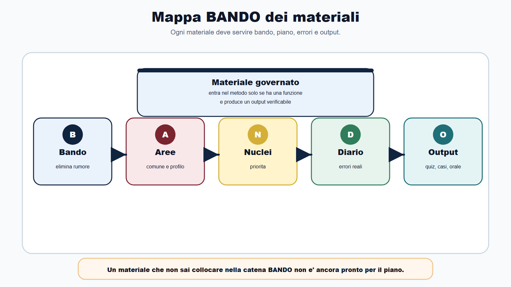
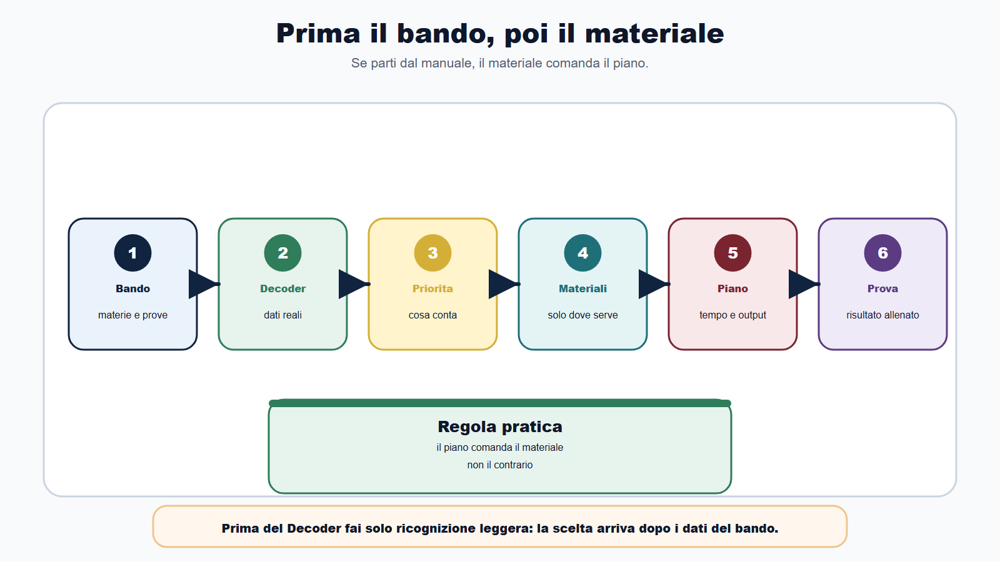
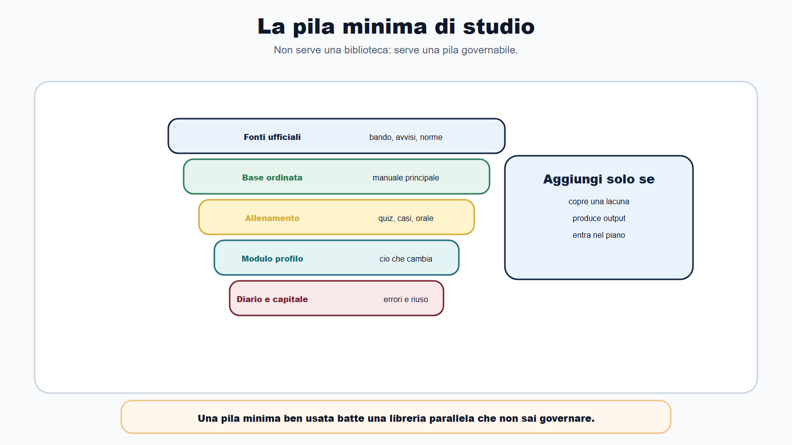
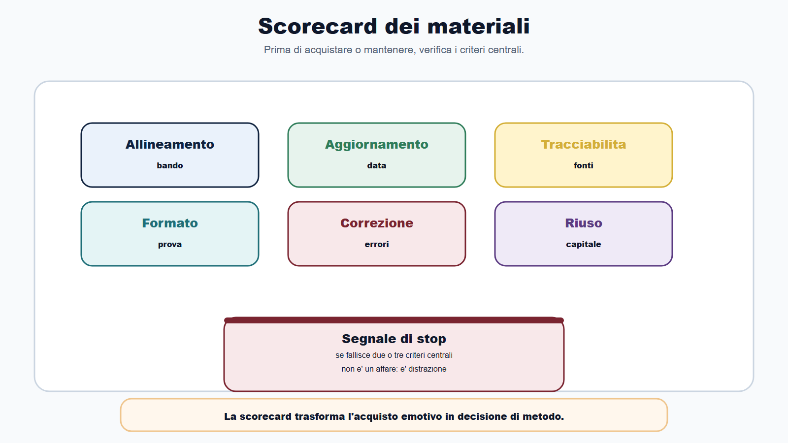
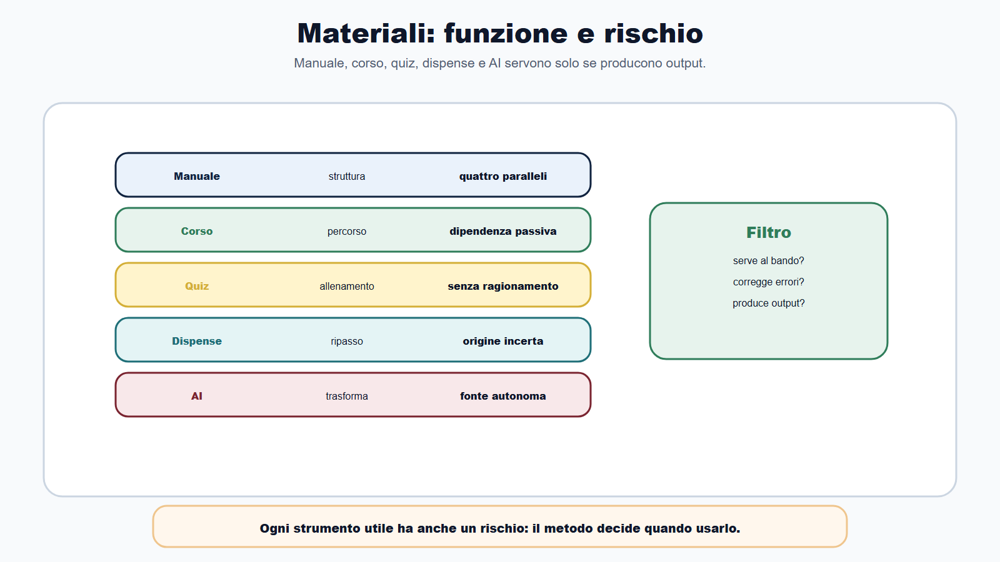
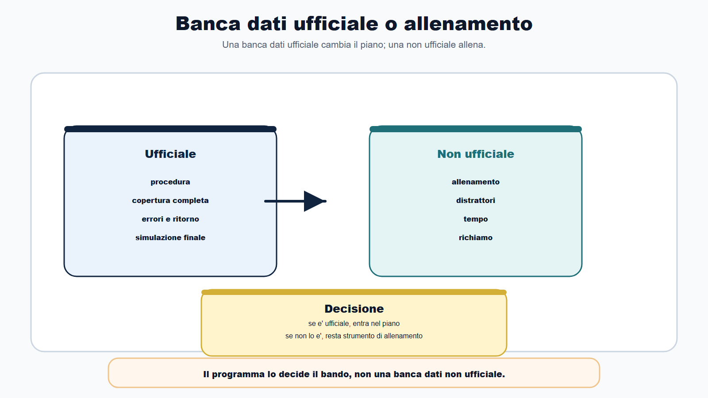
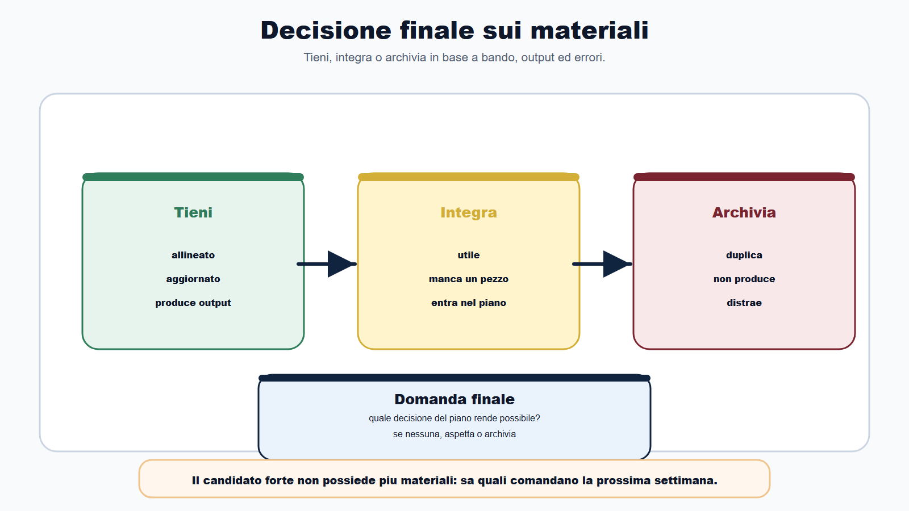

# Capitolo 33 - Manuali, corsi e banche dati: scegliere senza disperdersi

Molti candidati iniziano la preparazione con una domanda sbagliata:

> quale manuale devo comprare?

La domanda sembra concreta. In realta arriva troppo presto.

Prima di sapere che cosa chiede il bando, quale prova dovrai affrontare, quanto tempo hai, quali materie pesano davvero e quale capitale possiedi gia, nessun materiale puo essere valutato bene.

Un manuale puo essere ottimo e inutile per il tuo concorso.

Un corso puo essere serio e incompatibile con il tuo calendario.

Una banca dati puo contenere migliaia di quiz e non allenare il ragionamento che ti serve.

Il problema non e' avere pochi materiali. Il problema e' avere materiali non governati.

Questo capitolo ti insegna a scegliere senza accumulare.

Non troverai nomi di prodotti, editori o piattaforme. Troverai criteri. Perche i prodotti cambiano, i criteri restano.

## Obiettivo del capitolo

Alla fine del capitolo saprai:

- distinguere materiale utile, materiale accessorio e materiale dispersivo;
- scegliere manuali, corsi e banche dati dopo avere letto il bando;
- valutare un materiale con una scorecard semplice;
- capire quando una banca dati e' centrale e quando e' solo allenamento;
- usare riassunti, dispense e AI senza perdere controllo delle fonti;
- evitare acquisti duplicati;
- collegare ogni materiale al piano, al Diario degli errori e all'output della prova;
- costruire una pila minima di studio.

La regola e' questa:

> non scegli il materiale per sentirti preparato. Lo scegli per produrre l'output richiesto dal bando.

## La mappa BANDO dei materiali

Ogni materiale deve entrare nel Metodo BANDO. Se resta fuori, diventa rumore.

| Fase | Domanda | Effetto sulla scelta |
|---|---|---|
| B - Bando | che cosa chiede la procedura? | elimina materiali non allineati |
| A - Aree | quali materie e profili sono coinvolti? | distingue base comune e modulo specialistico |
| N - Nuclei | quali concetti sono davvero centrali? | evita letture troppo vaste |
| D - Diario | quali errori sto ripetendo? | decide se serve spiegazione, esercizio o ripasso |
| O - Output | che cosa devo produrre in prova? | sceglie quiz, casi, risposte brevi, orale o simulazioni |

Un materiale che non sai collocare in questa tabella non e' ancora pronto per entrare nel tuo piano.

## Prima il bando, poi il materiale

Il bando viene prima del materiale per una ragione semplice: il bando decide la partita.

Dal bando ricavi:

- requisiti;
- materie;
- prove;
- formato;
- punteggi;
- soglie;
- scadenze;
- eventuale banca dati;
- documenti;
- canali ufficiali di comunicazione.

Solo dopo puoi chiederti quali materiali servono.

Se parti dal manuale, studi secondo l'indice del manuale.

Se parti dal bando, usi il manuale solo dove serve.

La differenza e' enorme. Nel primo caso il materiale comanda il piano. Nel secondo caso il piano comanda il materiale.

## La pila minima

Non ti serve una biblioteca personale per ogni concorso.

Ti serve una pila minima.

| Livello | Funzione | Esempio operativo |
|---|---|---|
| Fonte ufficiale | verifica bando, avvisi, norme e aggiornamenti | bando, allegati, sito ente, inPA, Normattiva quando serve |
| Base ordinata | costruisce il quadro della materia | un manuale principale o appunti consolidati |
| Allenamento | produce output | quiz, casi, risposte, simulazioni, esposizioni orali |
| Modulo specialistico | copre cio che cambia per profilo | contabilita enti locali, tributi, ICT, scuola, sanita, vigilanza |
| Diario e capitale | corregge e riusa | errori, schede, mappe, domande, casi svolti |

Questa pila e' sufficiente per iniziare.

Puoi aggiungere materiali solo se rispondono a una mancanza precisa. Non perche "potrebbero servire".

## La scorecard prima di scegliere

Prima di acquistare, aprire o mantenere un materiale, compilane la scorecard.

| Criterio | Domanda | Segnale di rischio |
|---|---|---|
| Allineamento | copre proprio le materie del bando? | parla di "tutto" ma non del tuo profilo |
| Aggiornamento | indica data, edizione o base normativa? | non sai se e' vigente |
| Tracciabilita | rimanda a fonti ufficiali controllabili? | afferma senza mostrare origine |
| Profondita | e' proporzionato alla prova? | dettaglio eccessivo senza priorita |
| Formato | allena lo stesso output della prova? | solo teoria quando serve quiz o caso |
| Correzione | spiega perche una risposta e' giusta o sbagliata? | risposte secche, nessun ragionamento |
| Integrazione | entra nel tuo piano settimanale? | richiede tempo che non hai |
| Riuso | aumenta capitale riutilizzabile? | produce appunti isolati |

Se un materiale fallisce due o tre criteri centrali, non e' un affare. E' una distrazione ben confezionata.

## Manuali: uno principale, non quattro paralleli

Il manuale serve a costruire struttura.

Non serve a sostituire il bando.

Il candidato disperso apre quattro manuali sulla stessa materia, confronta capitoli, sottolinea definizioni diverse, cambia testo ogni settimana e ha la sensazione di studiare molto.

Il candidato metodico sceglie un manuale principale, lo usa come base e lo integra solo dove il bando o il Diario mostrano una lacuna.

Usa il manuale cosi:

1. leggi indice e capitoli rispetto al bando;
2. marca le parti necessarie, utili e superflue;
3. trasforma ogni sezione centrale in domande;
4. alterna lettura, richiamo attivo ed esercizi;
5. aggiorna il Diario quando sbagli;
6. evita di riscrivere il manuale nei tuoi appunti.

Il manuale migliore non e' quello piu pesante. E' quello che riesci a usare per produrre risposte, quiz corretti, casi e spiegazioni orali.

## Corsi: struttura o dipendenza

Un corso puo essere utile quando ti offre:

- percorso ordinato;
- spiegazione chiara di materie difficili;
- calendario;
- esercizi;
- simulazioni;
- correzioni;
- confronto controllato.

Ma un corso puo anche diventare una dipendenza passiva.

Succede quando guardi lezioni per sentirti in pari, ma non produci output.

Prima di seguire un corso, chiediti:

- copre il mio bando o un profilo troppo generico?
- mostra il programma prima dell'iscrizione?
- include esercizi nel formato della prova?
- prevede correzione o solo video?
- quanto tempo reale richiede ogni settimana?
- mi aiuta a colmare una lacuna o sostituisce decisioni che dovrei prendere io?

Un corso non deve diventare il nuovo bando.

Deve servire il tuo piano.

## Banche dati e quiz

Qui serve una distinzione netta.

Una banca dati ufficiale, quando prevista dalla procedura, cambia il piano di studio. Diventa un oggetto specifico da coprire, segmentare, ripetere, simulare e correggere.

Una banca dati non ufficiale, invece, e' uno strumento di allenamento. Puo essere utile, ma non e' fonte del diritto e non sostituisce bando, avvisi e fonti ufficiali.

### Se la banca dati e' ufficiale

Usa quattro passaggi:

1. copertura: passa tutta la banca dati almeno una volta;
2. errore: classifica gli errori per materia e causa;
3. ritorno: ripeti solo cio che sbagli o confondi;
4. simulazione: lavora a tempo, con condizioni vicine alla prova.

Non partire dalle simulazioni se non hai coperto la banca dati.

Non ripetere meccanicamente le risposte senza capire il perche degli errori.

### Se la banca dati non e' ufficiale

Usala per allenare:

- velocita;
- riconoscimento dei distrattori;
- attenzione al testo;
- gestione del tempo;
- richiamo delle nozioni;
- tenuta sotto pressione.

Ma non usarla per decidere che cosa e' importante nel concorso.

Quello lo decide il bando.

## Dispense, riassunti e materiali condivisi

Le dispense possono essere preziose quando sono brevi, ordinate, aggiornate e collegate a fonti.

Possono essere pericolose quando sono anonime, vecchie, non verificabili o troppo rassicuranti.

La regola e':

> un riassunto e' utile solo se sai che cosa riassume.

Prima di usarlo, controlla:

- data;
- materia;
- fonte di partenza;
- autore o origine;
- coerenza con il bando;
- eventuali aggiornamenti;
- presenza di errori gia noti.

Non trasformare ogni file trovato in materiale di studio. Ogni materiale che entra nel sistema deve avere un posto, una funzione e una revisione.

## AI e strumenti digitali

L'AI puo aiutarti a:

- trasformare un capitolo in domande;
- generare schede di ripasso;
- simulare domande orali;
- creare una checklist;
- confrontare due indici;
- riformulare una spiegazione;
- costruire esempi.

Ma non deve diventare fonte autonoma.

Ogni output importante deve essere verificato con bando, fonte ufficiale o materiale affidabile. Indica sempre data, fonte di partenza e uso previsto.

Una sintesi generata senza fonte puo sembrare chiara e contenere errori. Nel concorso, un errore chiaro resta un errore.

## Quando comprare

Compra o attiva un materiale solo dopo avere compilato il Bando Decoder.

Prima del Decoder puoi fare al massimo una ricognizione leggera.

Dopo il Decoder puoi decidere:

- materia coperta;
- output richiesto;
- tempo disponibile;
- lacune reali;
- capitale gia presente;
- costo di studio;
- priorita.

La domanda non e' "mi servira?".

La domanda e': "quale decisione del mio piano rende possibile?".

Se non rende possibile nessuna decisione, aspetta.

## Quando eliminare

Eliminare materiali e' parte del metodo.

Archivia o scarta un materiale quando:

- duplica cio che hai gia;
- non e' piu aggiornato;
- non si collega al bando;
- non produce domande, esercizi o risposte;
- ti fa cambiare piano senza motivo;
- richiede piu tempo di quello che restituisce;
- resta aperto da settimane senza uso reale.

Il candidato forte non e' quello che possiede piu materiali.

E' quello che sa quali materiali comandano davvero la prossima settimana.

## Caso guidato

Marco sta preparando un concorso amministrativo. Ha gia comprato due manuali generali, segue un corso online, usa tre app di quiz e ha salvato molte dispense.

Studia ogni giorno, ma non sa se sta avanzando.

Applica la scorecard.

Dal bando ricava:

- una prova scritta a quiz;
- un orale;
- materie comuni;
- un modulo su contabilita;
- nessuna banca dati ufficiale pubblicata;
- scadenza ravvicinata.

Poi valuta i materiali.

Tiene un manuale principale per amministrativo e pubblico impiego. Archivia il secondo manuale perche duplica quasi tutto. Mantiene il corso solo per contabilita, dove ha una lacuna reale. Riduce le app di quiz a una sola, scelta per spiegazioni e tracciamento errori. Usa le dispense solo per ripasso finale, dopo verifica della fonte. Trasforma gli errori dei quiz in domande nel Diario.

Marco non ha studiato meno.

Ha tolto cio che gli impediva di sapere che cosa stava studiando.

## Da sapere in 5 righe

1. Il bando viene prima di manuali, corsi, quiz e riassunti.
2. Ogni materiale deve coprire una parte del bando e produrre un output.
3. Una banca dati ufficiale e' procedura; una banca dati non ufficiale e' allenamento.
4. Un corso utile spiega, allena e corregge; un corso passivo consuma tempo.
5. Il materiale che non entra nel piano e nel Diario degli errori va archiviato.

## Domanda da commissario

**Domanda:** Perche in una preparazione concorsuale non basta scegliere un manuale completo?

**Risposta efficace:** perche il manuale non sostituisce il bando. Il bando definisce materie, prove, formato, punteggi, scadenze e priorita della procedura. Un manuale completo puo essere utile come base, ma deve essere selezionato e usato in funzione dell'output richiesto: quiz, risposta scritta, caso o orale. Senza questo filtro il candidato rischia di studiare molto, ma non nel modo richiesto dalla prova.

## Domanda-trappola

**Domanda:** Se una banca dati ha migliaia di quiz, posso usarla come programma di studio?

**Risposta:** solo se e' la banca dati ufficiale prevista dalla procedura, e comunque va letta insieme al bando. Se e' una banca dati non ufficiale, serve per allenamento, autovalutazione e gestione degli errori, ma non puo stabilire da sola il programma ne sostituire fonti ufficiali e avvisi.

## Errore tipico

L'errore tipico e' confondere accumulo e preparazione.

Una cartella piena, una libreria piena o una piattaforma piena non dimostrano avanzamento.

Dimostrano avanzamento solo:

- quiz corretti meglio;
- errori ricorrenti ridotti;
- risposte orali piu ordinate;
- casi svolti con struttura;
- fonti ufficiali controllate;
- piano aggiornato;
- capitale riutilizzabile.

Se un materiale non produce uno di questi effetti, sta occupando spazio mentale.

## Mini-esercizio

Scegli tre materiali che stai usando o vorresti usare.

Compila la tabella.

| Materiale | Parte del bando coperta | Output prodotto | Decisione |
|---|---|---|---|
| | | | tengo / integro / archivio |
| | | | tengo / integro / archivio |
| | | | tengo / integro / archivio |

Poi aggiungi un voto da 1 a 5 per ciascun criterio.

| Criterio | Materiale 1 | Materiale 2 | Materiale 3 |
|---|---:|---:|---:|
| Allineamento al bando | | | |
| Aggiornamento | | | |
| Tracciabilita | | | |
| Formato di prova | | | |
| Correzione degli errori | | | |
| Tempo sostenibile | | | |
| Riuso futuro | | | |

Non scegliere il materiale con il punteggio emotivo piu alto. Scegli quello che serve di piu alla prossima prova.

## Checklist finale

Prima di fissare il tuo set di materiali, verifica:

- ho compilato il Bando Decoder;
- so quale prova devo allenare;
- so se esiste una banca dati ufficiale;
- ho distinto fonti ufficiali, materiali didattici e strumenti di allenamento;
- ho scelto un manuale principale, non una pila parallela;
- ho valutato il corso rispetto a output e tempo;
- ho scelto quiz con spiegazioni e tracciamento errori;
- ho controllato data e origine di dispense e riassunti;
- ho deciso cosa eliminare;
- ho collegato ogni materiale al piano settimanale;
- ho collegato ogni materiale al Diario degli errori;
- ho verificato che il materiale produca capitale riutilizzabile.

Se non puoi collegare un materiale a bando, output o errore, non e' priorita.

## Riferimenti consolidati

- [[sources/scelta-materiali-studio-concorsi-metodo-bando]]
- [[sources/metodo-bando-progetto-editoriale]]
- [[sources/struttura-madre-il-metodo-bando]]
- [[sources/metodo-bando-capitolo-13-bozza-sito-2026-05-30]]
- [[sources/apprendimento-efficace-active-recall-ripasso-distribuito]]
- [[sources/prove-concorsuali-quiz-scritto-orale-dpr-487-1994]]
- [[sources/fonti-ufficiali-aggiornamento-metodo-bando-2026-06-03]]
- [[sources/strumenti-digitali-metodo-bando]]
- [[sources/capitale-studio-riutilizzabile-metodo-bando]]
- [[topics/scelta-materiali-studio-concorsi]]
- [[topics/metodo-bando]]
- [[topics/metodo-di-studio]]
- [[topics/prova-a-quiz]]
- [[topics/aggiornamento-fonti-concorsi]]
- [[topics/capitale-studio-riutilizzabile]]

## Note di review

- La struttura madre originaria non prevedeva il Capitolo 33. Questo capitolo e' un'estensione editoriale richiesta nel flusso di completamento del libro.
- In revisione finale valutare se spostarlo prima del Capitolo 32, cosi da lasciare "Il tuo sistema BANDO personale" come epilogo conclusivo.
- Evitare in futuro l'inserimento di nomi commerciali: il capitolo deve restare basato su criteri trasferibili e non su raccomandazioni soggette ad aggiornamento.
