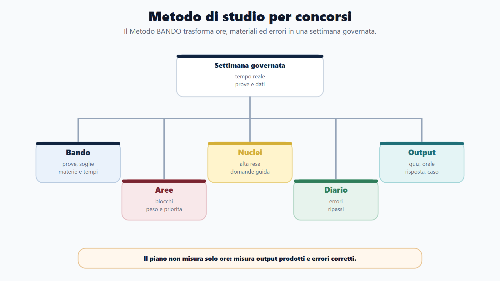
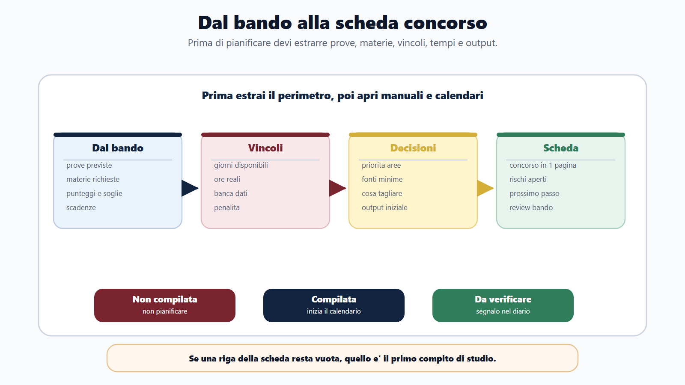
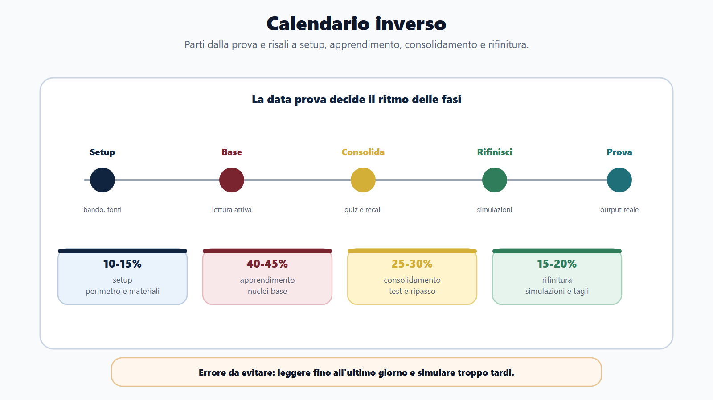
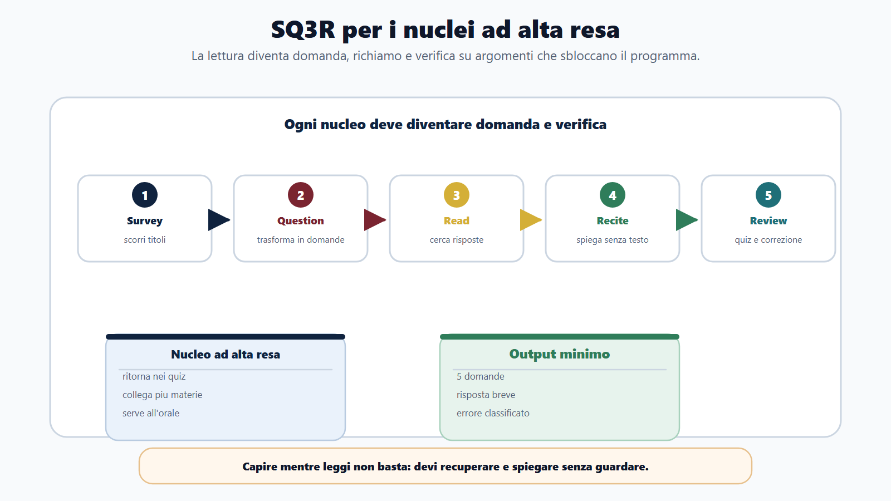
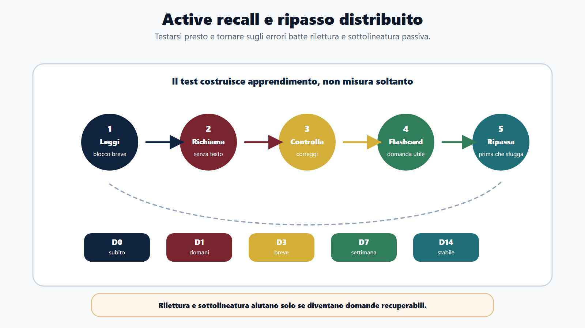
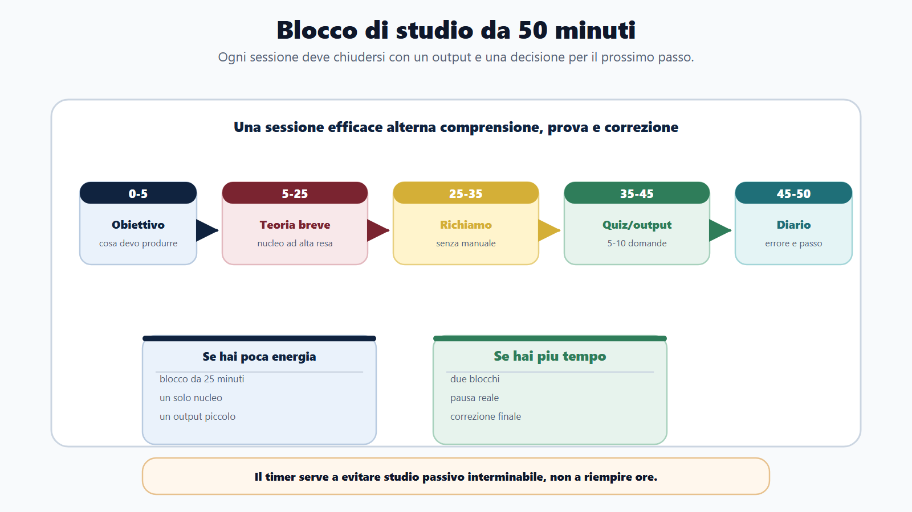
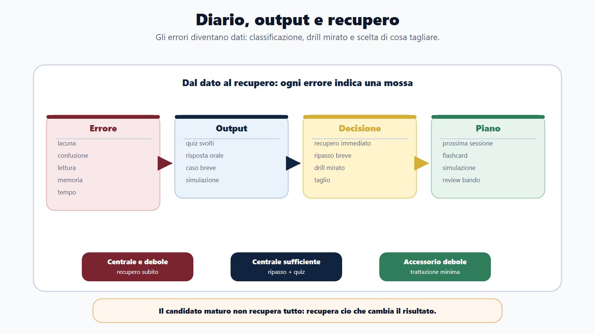

# Capitolo 13 - Metodo di studio per concorsi

## Perché studiare tanto non basta

Preparare un concorso pubblico non significa semplicemente studiare molte ore. Significa usare bene quelle ore. Un candidato può leggere centinaia di pagine, sottolineare interi capitoli, seguire video e fare qualche quiz, ma arrivare alla prova senza sapere che cosa conta davvero, quali errori ripete e quale tipo di risposta gli verrà chiesta.

Il problema non è la mancanza di materiali. Il problema è la mancanza di una sequenza. Molti candidati partono dal manuale perché è l'oggetto più visibile: si compra, si apre, si sottolinea. Nei primi giorni sembra di avanzare. Dopo qualche settimana, però, il programma resta enorme, le scadenze si avvicinano e i quiz mostrano lacune che non erano state previste.

Il punto di partenza corretto è diverso:

> Non si studia prima di aver capito che cosa il concorso richiede davvero.

Questo capitolo trasforma il Metodo BANDO in un metodo di studio quotidiano. Non sostituisce le materie già viste nella Parte II. Ti insegna a usarle: che cosa leggere, che cosa trasformare in domanda, quando ripassare, quando fare quiz, quando simulare, quando tagliare e quando recuperare.

## Obiettivo del capitolo

Alla fine del capitolo dovrai saper costruire una settimana di studio che non dipenda dall'umore del giorno. Dovrai saper leggere il bando, dividere il programma in aree, scegliere nuclei ad alta resa, studiare con richiamo attivo, registrare gli errori e produrre output simili alla prova.

L'obiettivo non è avere il piano perfetto. È avere un piano che si corregge con i dati: risultati dei quiz, risposte scritte, simulazioni orali, argomenti dimenticati, tempi reali, errori ricorrenti.

## Mappa BANDO del metodo di studio

| Fase | Domanda guida | Prodotto concreto |
|---|---|---|
| **B - Bando** | Che cosa devo saper fare il giorno della prova? | Scheda concorso in una pagina. |
| **A - Aree** | In quali blocchi posso dividere il programma? | Mappa aree, peso e priorità. |
| **N - Nuclei** | Quali argomenti rendono di più? | Lista nuclei ad alta resa. |
| **D - Diario** | Che cosa ho fatto, sbagliato e corretto? | Diario studio, errori e ripassi. |
| **O - Output** | Che cosa riesco a produrre senza guardare il testo? | Quiz, risposta, caso, orale, simulazione. |

Questa mappa va usata ogni settimana. Se ti senti bloccato, non aggiungere subito un altro manuale. Torna alla sequenza: bando, aree, nuclei, diario, output.

## B - Bando: decodificare prima di studiare

Il bando è il documento più importante della preparazione. Non è una formalità amministrativa: è la mappa del concorso. Prima di aprire un manuale devi estrarre almeno cinque informazioni:

1. requisiti di partecipazione;
2. scadenze e modalità di iscrizione;
3. tipologia delle prove;
4. materie richieste;
5. criteri di valutazione, punteggi, penalità e soglie.

Queste informazioni cambiano il metodo. Se il concorso prevede una preselettiva a quiz, uno scritto teorico-pratico e un orale, non puoi studiare come per un concorso solo per titoli o per una prova pratica. Se esiste una banca dati ufficiale, il piano cambia. Se sono previste penalità per risposta errata, cambia anche la strategia di simulazione. Se l'orale include inglese e informatica, devi allenare anche quelle parti come esposizione, non solo come quiz.

La domanda guida è:

> Che cosa devo saper fare il giorno della prova?

Non basta scrivere "diritto amministrativo". Devi capire se la prova chiede definizioni, articoli, procedure, casi pratici, collegamenti tra materie o rapidità nel riconoscere la risposta corretta.

### Scheda concorso in una pagina

Compila questa scheda prima di costruire il calendario.

| Campo | Risposta |
|---|---|
| Ente e profilo | |
| Data o finestra della prova | |
| Giorni disponibili | |
| Ore settimanali realistiche | |
| Prove previste | |
| Materie obbligatorie | |
| Materie ad alto peso | |
| Materie deboli | |
| Banca dati ufficiale | Sì / No / Non ancora pubblicata |
| Penalità per errore | Sì / No / Da verificare |
| Soglie e punteggi | |
| Materiali necessari | |
| Passaggi amministrativi aperti | |

Se non riesci a compilare questa pagina, non sei ancora pronto a pianificare. Devi tornare al bando.

## A - Aree: trasformare il programma in blocchi

Dopo aver decodificato il bando, il programma deve essere diviso in aree. Un'area è un blocco omogeneo di preparazione. In un concorso amministrativo potresti avere:

- diritto costituzionale;
- diritto amministrativo;
- pubblico impiego;
- trasparenza, anticorruzione e privacy;
- contabilità pubblica;
- contratti pubblici;
- informatica;
- inglese;
- logica e quiz;
- scritto o orale.

Questa divisione serve a impedire che il programma resti una lista indistinta. Ogni area deve avere un peso, una priorità e una funzione.

Non tutte le materie valgono allo stesso modo. Alcune generano più domande. Altre sono più difficili perché richiedono tempo di assimilazione. Altre sono strategiche perché collegano più parti del programma. Altre ancora sono accessorie, ma diventano decisive se hanno una soglia minima o se compaiono all'orale.

### Calendario inverso

La pianificazione parte dalla data della prova e torna indietro. Non chiederti solo "quanto devo studiare?". Chiediti: "quanto tempo resta per apprendere, consolidare, simulare e rifinire?".

Una distribuzione utile è questa:

| Fase | Quota indicativa | Obiettivo |
|---|---:|---|
| Setup | 10-15% | Bando, fonti, materiali, calendario, griglia aree. |
| Apprendimento base | 40-45% | Lettura attiva, appunti minimi, prime domande. |
| Consolidamento | 25-30% | Flashcard, richiamo attivo, quiz, ripasso distribuito. |
| Rifinitura | 15-20% | Simulazioni, drill mirati, recupero errori, orale. |

Queste percentuali non sono una legge. Servono a evitare due errori: restare troppo a lungo nella lettura o arrivare alle simulazioni senza basi.

## N - Nuclei: individuare ciò che rende davvero

Dentro ogni area devi individuare i nuclei ad alta resa. Un nucleo è un argomento che sblocca molti altri argomenti. Non è solo un capitolo importante: è un concetto che ritorna spesso, collega più materie o compare con frequenza nei quiz e negli orali.

Esempi:

- il procedimento amministrativo collega termini, responsabile, partecipazione, accesso, motivazione e provvedimento;
- le fonti del diritto aiutano a capire Costituzione, atti amministrativi, gerarchia e competenze;
- la responsabilità collega diritto amministrativo, pubblico impiego, contabilità e penale;
- i principi di imparzialità e buon andamento attraversano organizzazione, procedimento, performance e pubblico impiego;
- nella prova a quiz, distrattori, negazioni, eccezioni e parole assolute sono nuclei di metodo, non solo dettagli.

I nuclei vanno studiati con più attenzione degli argomenti isolati. Sono i punti in cui la preparazione diventa riutilizzabile.

### SQ3R: leggere in modo attivo

Per studiare i nuclei usa una sequenza semplice:

| Fase | Cosa fai | Output minimo |
|---|---|---|
| **Survey** | Scorri titoli, sottotitoli, parole chiave e struttura. | Mappa rapida del capitolo. |
| **Question** | Trasformi i titoli in domande. | Lista di domande. |
| **Read** | Leggi cercando risposte. | Risposte sintetiche. |
| **Recite** | Ripeti senza guardare il testo. | Spiegazione a voce o per iscritto. |
| **Review** | Verifichi con quiz, flashcard o mini-caso. | Errore classificato o risposta corretta. |

Il passaggio decisivo è trasformare lo studio in domande. Non basta leggere "il responsabile del procedimento". Devi chiederti:

- chi lo individua?
- quali funzioni svolge?
- che cosa accade se non è individuato?
- quali principi collega?
- come può essere chiesto in un quiz?
- come lo spiegherei all'orale?

Studiare così riduce l'illusione di competenza. Capire mentre leggi non significa ricordare durante la prova.

## Active recall: la verifica viene prima della sicurezza

Il richiamo attivo consiste nel provare a recuperare un'informazione senza guardare il testo. È scomodo perché mostra subito ciò che non sai. Proprio per questo funziona.

Un ciclo efficace è:

1. leggi un blocco breve;
2. chiudi il manuale;
3. scrivi o ripeti tre punti chiave;
4. controlla il testo;
5. correggi l'errore;
6. trasformalo in flashcard o domanda.

Non aspettare di sentirti pronto per testarti. Se aspetti, farai quiz troppo tardi. Il test non serve solo a misurare la preparazione: serve a costruirla.

> [!WARNING]
> **Errore tipico**
> Dire "prima studio tutto, poi faccio quiz". Nei concorsi questo ordine è rischioso. I quiz e le domande devono entrare presto, perché rivelano come il bando trasforma la materia in prova.

## Ripasso distribuito e flashcard

La memoria peggiora se lasci passare troppo tempo tra uno studio e il successivo. Il ripasso distribuito serve a tornare sull'informazione prima che diventi irrecuperabile.

Non devi ripassare tutto ogni volta. Devi ripassare ciò che rischi di dimenticare:

- definizioni lente;
- articoli o riferimenti incerti;
- differenze tra istituti simili;
- eccezioni;
- sequenze procedimentali;
- errori ripetuti nei quiz;
- domande orali a cui rispondi in modo confuso.

Una flashcard utile non chiede solo "che cos'è?". Può chiedere:

| Tipo | Esempio |
|---|---|
| Definizione | Che cos'è il provvedimento amministrativo? |
| Differenza | Accesso documentale e accesso civico generalizzato: differenza essenziale. |
| Sequenza | Quali passaggi compongono il procedimento? |
| Eccezione | Quando una regola non si applica? |
| Confronto | Nullità e annullabilità: come distinguerle? |
| Caso | Un cittadino chiede copia di atti con dati personali: quali controlli fai? |
| Orale | Spiega il principio di buon andamento in due minuti. |

Se una risposta è sbagliata o lenta, deve tornare presto. Se è corretta e rapida, può essere programmata più avanti.

## Blocchi di studio: teoria, quiz, ripasso, output

La sessione ideale non è sempre "leggo per due ore". Una sessione completa alterna quattro momenti:

1. **teoria breve**, per capire;
2. **richiamo attivo**, per verificare;
3. **quiz o domanda**, per vedere il formato;
4. **diario**, per decidere il prossimo passo.

Esempio di blocco da 50 minuti:

| Minuti | Attività |
|---:|---|
| 0-5 | Obiettivo della sessione. |
| 5-25 | Lettura attiva di un nucleo. |
| 25-35 | Richiamo senza testo. |
| 35-45 | 5-10 quiz o una risposta breve. |
| 45-50 | Diario: errore, ripasso, prossimo passo. |

Se hai poca energia, usa blocchi da 25 minuti. Se hai più tempo, unisci due blocchi con una pausa reale. Il punto non è idolatrare il timer: è evitare studio passivo interminabile.

## D - Diario: controllare il percorso giorno per giorno

Senza diario, lo studio resta una sensazione. Con il diario, diventa un sistema misurabile.

Il diario deve registrare almeno:

- data;
- materia;
- argomento;
- tempo effettivo;
- attività svolta;
- livello di difficoltà;
- errori emersi;
- prossimo passo.

Non serve scrivere pagine di riflessioni. Serve lasciare una traccia utile. Dopo una settimana devi poter rispondere a domande concrete:

- quante ore ho studiato davvero?
- quali materie sto trascurando?
- quali argomenti sbaglio più spesso?
- sto leggendo troppo e testandomi poco?
- ho rispettato il piano o sto andando a sensazione?

### Griglia minima del diario

| Data | Area | Nucleo | Attività | Tempo | Errore | Prossimo passo |
|---|---|---|---|---:|---|---|
| | | | Teoria / quiz / orale / scritto | | Memoria / concetto / lettura / tempo / stress | |

Il diario non è solo memoria del passato. È il ponte verso la prossima sessione.

## O - Output: verificare con prodotti concreti

Lo studio non è completo finché non produce output. Un capitolo letto non dimostra padronanza. Una risposta corretta senza guardare il testo sì. Una simulazione con tempo reale dice più di tre ore di sottolineatura.

Gli output principali sono:

- risposte scritte;
- ripetizioni orali;
- flashcard completate;
- quiz svolti;
- errori classificati;
- simulazioni concluse;
- mappe di collegamento;
- piani di recupero.

Ogni output dice qualcosa sulla qualità della preparazione. Se non riesci a produrre nulla, probabilmente hai studiato in modo troppo passivo.

## Errori come dati

Non basta segnare "ho sbagliato". Devi capire il tipo di errore.

| Errore | Segnale | Correzione |
|---|---|---|
| Lacuna | Non conoscevo l'argomento. | Studio mirato del nucleo. |
| Confusione | Ho scambiato due istituti. | Tabella comparativa. |
| Lettura | Ho letto male la domanda. | Routine di sottolineatura mentale. |
| Memoria | Sapevo ma non recuperavo. | Flashcard e richiamo attivo. |
| Tempo | Mi sono bloccato troppo. | Simulazioni con soglia di abbandono. |
| Stress | Ho cambiato risposta senza motivo. | Regola di revisione e respirazione. |

Quando un errore si ripete, diventa un'area debole. A quel punto non serve "studiare di più" in generale. Serve un drill mirato: poche domande, stesso nucleo, feedback immediato, ripetizione fino alla stabilità.

## Poco tempo: che cosa fare e che cosa tagliare

Quando resta poco tempo, il candidato tende a fare due cose sbagliate: aumenta le ore senza criterio oppure cambia materiali di continuo. In emergenza serve tagliare, non agitarsi.

Regola pratica:

1. rilegge il bando;
2. identifica prove e materie che danno più punti o eliminano;
3. elimina approfondimenti non richiesti;
4. concentra i nuclei comuni;
5. fa simulazioni brevi ogni giorno;
6. registra solo gli errori che può correggere prima della prova.

Con 15 giorni non costruisci una preparazione enciclopedica. Costruisci una preparazione difendibile: nuclei, quiz, errori, orale essenziale, logistica.

## Recuperare giorni persi

Perdere giorni non significa fallire il piano. Significa aggiornare il piano. Il recupero non si fa sommando ore impossibili alla settimana successiva. Si fa con tre decisioni:

- cosa resta indispensabile;
- cosa viene compresso;
- cosa viene rinviato o tagliato.

Usa questa griglia:

| Argomento | Stato | Decisione |
|---|---|---|
| Centrale e debole | Alto rischio | Recupero immediato. |
| Centrale ma sufficiente | Medio rischio | Ripasso breve e quiz. |
| Accessorio e debole | Basso rendimento | Trattazione essenziale. |
| Non richiesto dal bando | Fuori perimetro | Taglio. |

Il candidato maturo non recupera tutto. Recupera ciò che cambia il risultato.

## Caso guidato

sarà prepara un concorso per istruttore amministrativo comunale. All'inizio studia diritto amministrativo dal primo capitolo del manuale, due ore al giorno. Dopo tre settimane ha sottolineato molto, ma nei quiz sbaglia accesso, procedimento e organi comunali.

Con il Metodo BANDO riparte dal bando. Scopre che la prova è a quiz, con orale successivo, e che pesano molto diritto amministrativo, enti locali, pubblico impiego e trasparenza. Divide il programma in aree, sceglie nuclei ad alta resa, trasforma ogni capitolo in domande e apre un diario.

La settimana successiva non "studia di più". Studia meglio:

- lunedì: procedimento amministrativo e 20 quiz;
- martedì: enti locali e risposta orale da due minuti;
- mercoledì: accesso documentale/civico con tabella comparativa;
- giovedì: pubblico impiego e flashcard;
- venerdì: mini-simulazione mista;
- sabato: correzione errori e piano della settimana dopo.

Il risultato cambia perché ogni sessione produce un output.

## Domanda da commissario

**Domanda:** Perché la sola lettura del manuale non basta nella preparazione di un concorso?

**Risposta efficace:** perché la prova non chiede di riconoscere un testo già letto, ma di recuperare informazioni, applicarle, distinguere opzioni, scrivere risposte o esporre oralmente. La lettura serve, ma deve essere trasformata in domande, richiamo attivo, quiz, errori classificati e simulazioni.

## Domanda-trappola

**Domanda:** Se ho studiato molte ore, sono automaticamente migliorato?

No. Le ore contano solo se producono avanzamento misurabile. Se studi molte ore ma non fai quiz, non ripeti a voce, non scrivi risposte e non correggi errori, potresti aver aumentato familiarità con il materiale senza aumentare performance.

## Mini-esercizio

Scegli una materia del tuo bando e compila la griglia.

| Area | Tre nuclei | Primo output | Errore da monitorare |
|---|---|---|---|
| | 1. 2. 3. | Quiz / risposta / orale / caso | |

Poi trasforma uno dei tre nuclei in cinque domande. Se non riesci a formulare domande, significa che l'argomento è ancora troppo generico.

## Da sapere in 5 righe

1. Il bando decide che cosa conta.
2. Le aree trasformano il programma in blocchi governabili.
3. I nuclei danno priorità allo studio.
4. Il diario rende visibili errori, tempo e prossime azioni.
5. Gli output dimostrano se sei pronto.

## Fonti consolidate

- [[sources/metodo-bando-capitolo-13-bozza-sito-2026-05-30]]
- [[sources/apprendimento-efficace-active-recall-ripasso-distribuito]]
- [[sources/metodo-bando-progetto-editoriale]]
- [[sources/struttura-madre-il-metodo-bando]]
- [[topics/metodo-di-studio]]
- [[topics/diario-errori]]

## Note di review

- Verificare in revisione finale se mantenere la sezione "Fonti consolidate" visibile al lettore o spostarla in apparato interno.
- Il capitolo non contiene claim normativi puntuali: soglie, penalità e formati devono sempre essere ricondotti al bando specifico.
