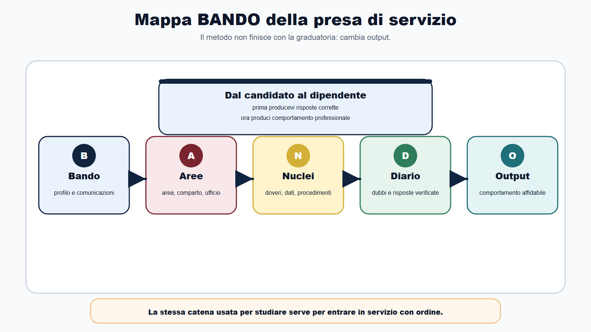
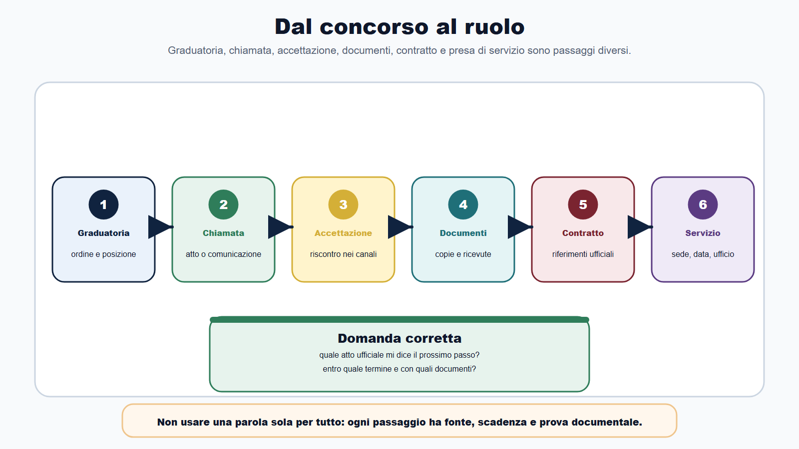
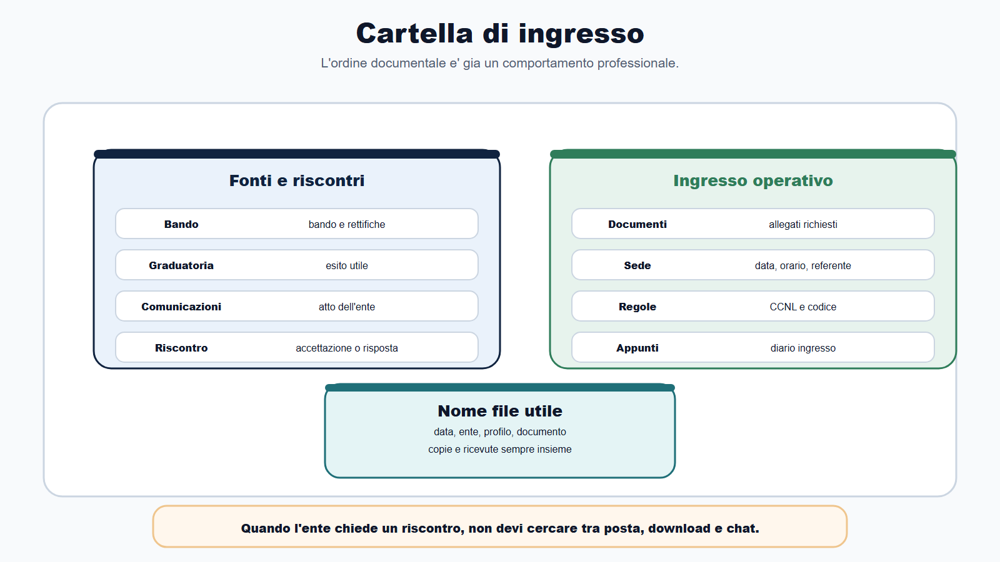
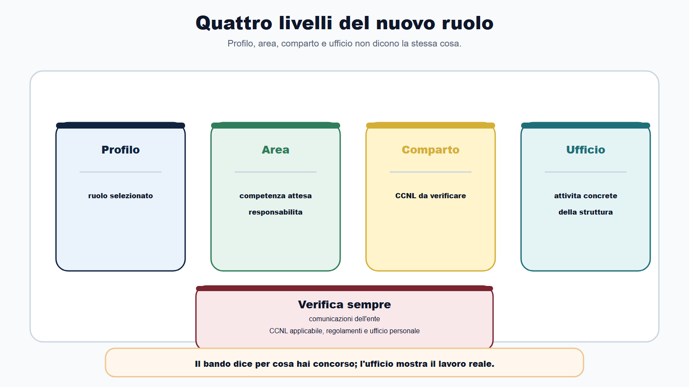
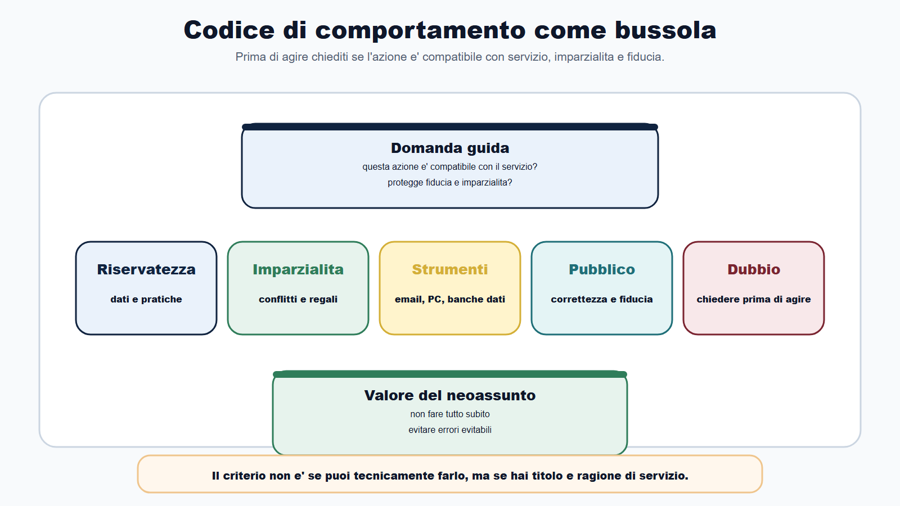
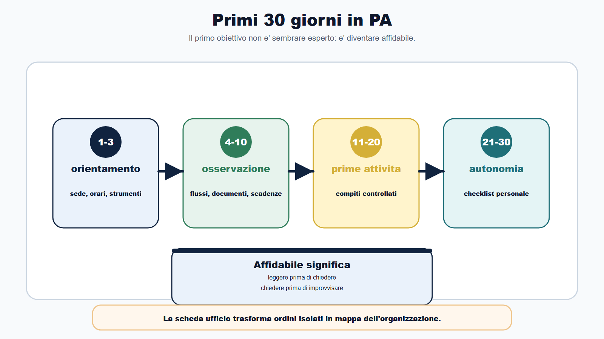
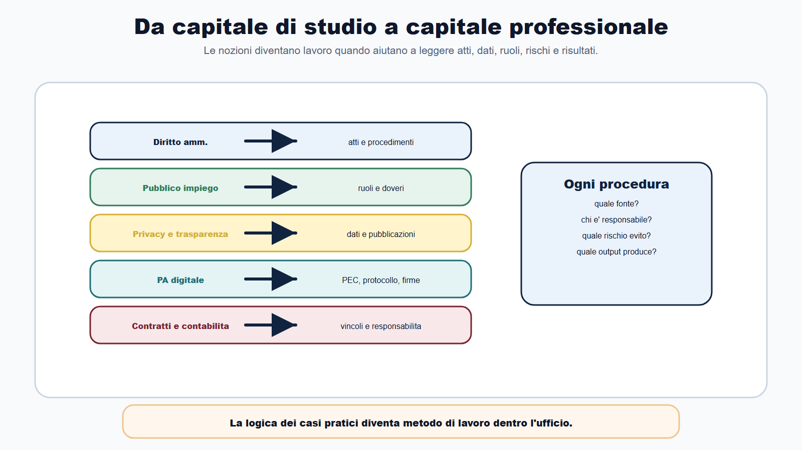

# Capitolo 31 - Prendere servizio nella PA: dal concorso al ruolo

> Modulo ricettario **R7** — Scheda dalla graduatoria al ruolo. Collega [[books/il-metodo-bando/chapters/pubblico-impiego-e-organizzazione-pa|Cap. 6]], [[books/il-metodo-bando/chapters/checklist-operative|Cap. 24]] e [[books/il-metodo-bando/chapters/dopo-la-prova-esiti-graduatoria-prossima-mossa|R6 Cap. 30]].

Il concorso non serve solo a superare una prova.

Serve a entrare in un ruolo pubblico.

Questa frase sembra ovvia, ma molti candidati arrivano alla fine del percorso con una preparazione fortissima sulle prove e una preparazione debole sul passaggio successivo: comunicazioni, documenti, presa di servizio, ufficio, codice di comportamento, rapporto con colleghi e utenti, apprendimento dei procedimenti.

Il rischio e' pensare che il metodo finisca con la graduatoria.

Non finisce li.

Finisce quando sai trasformare cio che hai studiato in comportamento professionale: leggere un atto, rispettare una scadenza, chiedere chiarimenti nel modo giusto, proteggere dati, riconoscere un conflitto di interessi, usare strumenti dell'ufficio per finalita di servizio, capire chi decide e chi esegue, imparare senza improvvisare.

Questo capitolo non e' una guida contrattuale. Non sostituisce bando, comunicazioni dell'ente, CCNL, ufficio personale o supporto qualificato. E' una guida di metodo per arrivare al primo giorno in PA con ordine.

## Obiettivo del capitolo

Alla fine del capitolo saprai:

- distinguere graduatoria, chiamata, accettazione, contratto e presa di servizio;
- organizzare la cartella documentale di ingresso;
- leggere profilo, area, comparto e ufficio senza confonderli;
- capire perche il CCNL applicabile va verificato sul comparto e sull'amministrazione;
- usare il codice di comportamento come bussola pratica;
- impostare i primi 30 giorni in ufficio;
- trasformare il capitale di studio in capitale professionale;
- fare domande precise al responsabile o all'ufficio personale;
- evitare gli errori tipici del neoassunto pubblico.

La regola e' questa:

> dopo il concorso non devi cambiare metodo. Devi cambiare output.

Prima l'output era una risposta corretta. Ora e' un comportamento affidabile dentro un ufficio pubblico.

## Mappa BANDO della presa di servizio

| Fase | Domanda di ingresso | Azione concreta |
|---|---|---|
| B - Bando | quale profilo ho vinto e quali comunicazioni ufficiali devo seguire? | rileggo bando, graduatoria, chiamata e istruzioni dell'ente |
| A - Aree | in quale area, comparto, ufficio o servizio entro? | collego profilo, CCNL, organizzazione e mansioni attese |
| N - Nuclei | quali nuclei di pubblico impiego devo usare subito? | codice di comportamento, riservatezza, procedimenti, dati, scadenze |
| D - Diario | quali dubbi, errori e domande emergono nei primi giorni? | tengo un diario di ingresso con domande e risposte verificate |
| O - Output | quale comportamento professionale devo produrre? | documenti corretti, comunicazioni ordinate, apprendimento, rispetto dei doveri |

La stessa catena usata per studiare serve per entrare in servizio.

## Graduatoria, chiamata, accettazione, presa di servizio

Non usare una parola sola per tutto.

Nel passaggio dal concorso al lavoro pubblico possono comparire atti e momenti diversi. La sequenza concreta dipende dalla procedura e dall'amministrazione, ma la distinzione concettuale e' utile.

| Momento | Cosa indica | Attenzione |
|---|---|---|
| Graduatoria | ordine dei candidati secondo esito della procedura | non coincide sempre con assunzione immediata |
| Chiamata o comunicazione | invito o istruzione dell'amministrazione | va letta integralmente, con termini e documenti richiesti |
| Accettazione o riscontro | risposta del candidato secondo le modalita indicate | non improvvisare canali o formule |
| Documentazione | dichiarazioni, certificazioni o dati richiesti | conservare copie e ricevute |
| Contratto o atto di instaurazione | fase di avvio del rapporto, secondo regole applicabili | verificare contenuto e riferimenti ufficiali |
| Presa di servizio | ingresso operativo secondo data, sede e istruzioni | preparare logistica, documenti, contatti e prime domande |

Questa tabella non sostituisce la comunicazione dell'ente. Serve a evitare confusione.

La domanda corretta non e': "Sono in graduatoria, quindi che succede?".

La domanda corretta e': "Quale atto ufficiale mi dice il prossimo passo, entro quale termine e con quali documenti?".

| Momento | Rischio tipico | Comportamento metodico |
|---|---|---|
| Rinuncia o mancata risposta | perdere il turno senza traccia | leggere termini, canale e conseguenze prima di decidere; conservare ogni risconto |
| Documenti incompleti | slittamento o sospensione | checklist documentale, copie, verifica con ufficio personale |
| Presa di servizio | arrivare impreparati | sede, orario, referente, strumenti, codice di comportamento |

Se arrivi da R6, non chiudere la cartella dopo-prova: trasformala in cartella di ingresso aggiungendo comunicazioni, riscontri e documenti richiesti.

## Protocollo ingresso: dalla comunicazione alla presa di servizio

Il passaggio al ruolo funziona se ogni fase ha un compito preciso. Non mescolare euforia, fretta e improvvisazione nello stesso momento.

| Fase | Cosa fare | Cosa non fare |
|---|---|---|
| Comunicazione ricevuta | leggere integralmente, segnare termini, canale, documenti, contatti | rispondere a caldo senza aver capito cosa e' richiesto |
| 0-48 ore | creare cartella ingresso, elenco documenti, domande per ufficio personale | chiedere a chat o forum regole che valgono solo per il tuo ente |
| Entro termine indicato | inviare risconto e documenti sul canale ufficiale, salvare ricevute | usare canali informali se il bando o l'avviso ne indicano altri |
| Prima del primo giorno | verificare sede, orario, profilo, CCNL da controllare, codice di comportamento | studiare istituti contrattuali generici senza fonte dell'ente |
| Giorni 1-30 | scheda ufficio, domande precise, diario ingresso, autonomia progressiva | dimostrare competenza improvvisando su dati, atti o applicativi |

Regola operativa:

- alla **comunicazione** rispondi con metodo, non con impulso;
- entro il **termine ufficiale** consegni cio che e' richiesto e conservi prove;
- **prima del primo giorno** sai dove andare, con chi parlare e cosa non fare;
- nei **primi 30 giorni** impari l'organizzazione prima di cercare velocita.

## La cartella di ingresso

La cartella dopo-prova diventa cartella di ingresso.

Non devi cercare documenti nella posta, nei download e nelle chat quando l'amministrazione ti chiede un riscontro.

Prepara una cartella con:

- bando e rettifiche;
- graduatoria o esito utile;
- comunicazioni dell'amministrazione;
- tua risposta o accettazione, se prevista;
- ricevute di invio;
- documenti richiesti;
- eventuali dichiarazioni rese;
- riferimenti dell'ufficio personale o del responsabile;
- indicazioni su sede, data, orario e modalita di presa di servizio;
- CCNL o riferimento contrattuale indicato;
- codice di comportamento generale e, se disponibile, codice integrativo dell'ente;
- appunti sui primi giorni.

Usa nomi semplici:

| Tipo file | Esempio nome |
|---|---|
| Comunicazione | 2026-ente-profilo-comunicazione-assunzione.pdf |
| Riscontro | 2026-ente-profilo-riscontro-candidato.pdf |
| Documenti | 2026-ente-profilo-documenti-ingresso.pdf |
| Sede | 2026-ente-profilo-presa-servizio-sede-orario.pdf |
| Appunti | 2026-ente-profilo-diario-ingresso.md |

L'ordine documentale e' gia un comportamento professionale.

## Registro comunicazioni di ingresso

Quando la procedura di assunzione e' in corso, le comunicazioni possono moltiplicarsi: integrazioni documentali, date, sedi, referenti, istruzioni su contratto o presa di servizio.

Tieni un registro operativo, non un diario emotivo.

| Data | Fonte ufficiale | Tipo comunicazione | Cosa devo fare | Termine | Prossimo controllo |
|---|---|---|---|---|---|
| | | | | | |
| | | | | | |
| | | | | | |

Frequenza consigliata:

- **fase attiva** (documenti o date in sospeso): controllo fonti 2-3 volte a settimana, finestra da 15 minuti (protocollo R1);
- **attesa presa di servizio** (data gia fissata): controllo 1 volta a settimana per eventuali aggiornamenti;
- **dopo il primo giorno**: archivia la cartella ingresso e passa al diario dei primi 30 giorni.

Non chiamare ogni giorno l'ufficio personale per ansia: prepara domande precise e rispetta i canali indicati.

## Da candidato a dipendente pubblico

Il passaggio piu importante non e' amministrativo. E' mentale.

Il candidato cerca la risposta giusta. Il dipendente pubblico deve produrre un'attivita corretta, tracciabile, utile e coerente con il servizio.

| Da candidato | A dipendente |
|---|---|
| studio per superare una prova | apprendo per svolgere una funzione |
| leggo il bando | leggo atti, procedure, regolamenti e istruzioni |
| cerco punteggio | cerco qualita, correttezza e risultato |
| difendo il mio tempo | rispetto tempi dell'ufficio e degli utenti |
| accumulo nozioni | trasformo conoscenza in azioni |
| rispondo da solo | lavoro dentro una catena organizzativa |
| controllo errori miei | prevengo errori del procedimento |

Questo non significa perdere autonomia. Significa capire dove sei entrato.

La PA non e' un'aula d'esame. E' un'organizzazione che tratta interessi, dati, risorse, procedimenti e persone.

## Profilo, area, comparto, ufficio

Quando entri in servizio devi leggere quattro livelli.

| Livello | Domanda |
|---|---|
| Profilo | per quale ruolo sono stato selezionato? |
| Area o famiglia professionale | quale livello di competenze e responsabilita e' atteso? |
| Comparto o CCNL | quale disciplina contrattuale di riferimento si applica? |
| Ufficio o servizio | quali attivita concrete svolge la struttura? |

Non confondere questi livelli.

Il profilo del bando ti dice per che cosa hai concorso. Il CCNL e il comparto aiutano a inquadrare il rapporto. L'ufficio ti mostra il lavoro reale: pratiche, utenti, applicativi, flussi documentali, responsabilita, tempi.

Per trattamento economico, orario, ferie, permessi, periodo di prova, sedi, lavoro agile, progressioni e istituti concreti non usare formule generiche. Verifica sempre comunicazioni dell'ente, CCNL applicabile, regolamenti interni e ufficio personale.

## Il codice di comportamento come bussola

Il codice di comportamento non e' un capitolo da ricordare solo per i quiz.

E' una bussola per il primo giorno.

Ti dice che il ruolo pubblico richiede diligenza, lealta, imparzialita, riservatezza, correttezza, cura delle risorse, attenzione ai conflitti di interessi e rapporti adeguati con il pubblico.

Usalo con questa domanda:

> questa azione e' compatibile con il servizio, con l'imparzialita e con la fiducia nell'amministrazione?

Esempi:

| Situazione | Domanda corretta |
|---|---|
| mi chiedono informazioni su una pratica | ho titolo e ragione di servizio per consultarla? |
| conosco personalmente un utente | devo segnalare un possibile conflitto o astenermi? |
| uso PC, email o telefono dell'ufficio | l'uso e' coerente con finalita di servizio? |
| ricevo un regalo o una utilita | puo compromettere imparzialita o apparenza di imparzialita? |
| pubblico online contenuti sul lavoro | rispetto riservatezza, immagine dell'ente e regole interne? |
| non so come procedere | chiedo al responsabile prima di improvvisare? |

Il neoassunto serio non dimostra valore facendo tutto subito. Dimostra valore evitando errori evitabili.

## I primi 30 giorni

Nei primi 30 giorni non devi sapere tutto. Devi imparare nel modo giusto.

Dividi il primo mese in quattro blocchi.

| Periodo | Obiettivo | Output |
|---|---|---|
| Giorni 1-3 | orientamento minimo | sede, responsabile, orari, strumenti, credenziali, regole di base |
| Giorni 4-10 | osservazione dei flussi | mappa di procedimenti, applicativi, documenti e scadenze |
| Giorni 11-20 | prime attivita controllate | compiti semplici, verifica con colleghi, correzione errori |
| Giorni 21-30 | autonomia progressiva | checklist personale e piano di apprendimento |

Il tuo obiettivo non e' sembrare esperto. E' diventare affidabile.

Affidabile significa:

- arrivi preparato;
- leggi prima di chiedere;
- chiedi prima di improvvisare;
- prendi appunti;
- distingui istruzioni informali e atti formali;
- proteggi dati e documenti;
- confermi le scadenze;
- restituisci un lavoro controllabile.

## La scheda ufficio

Compila questa scheda nei primi giorni.

| Domanda | Risposta |
|---|---|
| Qual e' il nome dell'ufficio o servizio? | |
| Chi e' il responsabile diretto? | |
| Quali sono i procedimenti principali? | |
| Quali utenti interni o esterni serviamo? | |
| Quali applicativi si usano? | |
| Quali dati trattiamo? | |
| Quali documenti produciamo o riceviamo? | |
| Quali scadenze sono ricorrenti? | |
| Quali rischi devo conoscere subito? | |
| Quali regole interne devo leggere? | |

Questa scheda ti impedisce di vivere il primo mese come una sequenza di ordini isolati.

Ti fa vedere l'organizzazione.

## Domande intelligenti da fare

Il neoassunto inesperto chiede: "Che devo fare?".

Il neoassunto metodico chiede meglio.

| Domanda generica | Domanda utile |
|---|---|
| Che devo fare? | Qual e' il risultato atteso di questa attivita? |
| Come si fa? | Esiste una procedura, un modello o un esempio gia validato? |
| A chi chiedo? | Chi e' il referente per questo flusso? |
| Entro quando? | Qual e' la scadenza interna e qual e' la scadenza esterna? |
| Posso aprire questa pratica? | Ho ragione di servizio e autorizzazione per accedere? |
| Va bene cosi? | Quale controllo devo fare prima di inviare o protocollare? |

Le domande precise fanno risparmiare tempo a tutti.

## Trasformare il capitale di studio in capitale professionale

Tutto quello che hai studiato puo servirti, ma non nello stesso formato.

| Capitale di studio | Capitale professionale |
|---|---|
| diritto amministrativo | leggere atti, procedimenti, competenze e termini |
| pubblico impiego | capire ruolo, doveri, responsabilita e organizzazione |
| trasparenza e privacy | trattare dati e pubblicazioni con prudenza |
| anticorruzione | riconoscere conflitti, rischi e misure di prevenzione |
| PA digitale | usare documenti, PEC, protocollo, firme e applicativi |
| contabilita | comprendere impegni, pagamenti, bilancio e vincoli |
| contratti pubblici | orientarsi in acquisti, CIG, procedure e responsabilita |
| inglese/logica | leggere testi, istruzioni, dashboard e documentazione |

Il Metodo BANDO ti ha insegnato a non studiare tutto allo stesso modo. Ora ti insegna a non imparare il lavoro in modo casuale.

Ogni volta che incontri una procedura, chiediti:

- quale fonte la regola?
- chi e' responsabile?
- quale documento entra?
- quale documento esce?
- quale controllo serve?
- quale rischio devo evitare?
- quale risultato atteso produce?

Questa e' la stessa logica dei casi pratici, applicata all'ufficio.

## Errori tipici del primo periodo

Il primo errore e' voler dimostrare competenza improvvisando.

Nel lavoro pubblico l'improvvisazione puo produrre errori su dati, atti, scadenze e responsabilita. Meglio chiedere una volta in piu che creare un problema documentale.

Il secondo errore e' trattare gli strumenti dell'ufficio come strumenti personali. Email, banche dati, cartelle, applicativi e documenti servono a finalita di servizio. Non si consultano pratiche per curiosita, non si condividono informazioni fuori dai canali corretti, non si usano risorse pubbliche per comodita privata.

Il terzo errore e' confondere informalita e fiducia. Un ufficio puo essere collaborativo e cordiale, ma resta un'organizzazione pubblica. Le decisioni rilevanti devono restare tracciabili e coerenti con procedure e ruoli.

## Caso guidato

Marta ha superato un concorso per profilo amministrativo in un ente locale. Riceve la comunicazione dell'ufficio personale con data di presa di servizio e documenti richiesti. E' felice, ma anche disorientata: non sa se rispondere subito con una email breve, se chiamare il responsabile, se preparare altri certificati, se rileggere il manuale di pubblico impiego.

Applica il Metodo BANDO.

Prima legge integralmente la comunicazione. Segna termini, canale di risposta, documenti richiesti e contatti. Poi crea la cartella di ingresso. Salva bando, graduatoria, comunicazione, riscontro e documenti.

Prima del primo giorno rilegge tre nuclei:

- codice di comportamento;
- riservatezza e uso dei dati;
- organizzazione dell'ente e ufficio di destinazione.

Nei primi giorni non cerca di mostrarsi brillante. Compila la scheda ufficio:

- chi e' il responsabile;
- quali procedimenti segue il servizio;
- quali applicativi si usano;
- quali dati si trattano;
- quali scadenze sono sensibili;
- quali modelli sono gia validati.

Quando riceve la prima attivita, non chiede solo "come faccio?". Chiede: "qual e' il modello corretto?", "quale controllo devo fare?", "chi valida prima dell'invio?".

Marta non ha ancora esperienza. Ma ha metodo. E questo riduce il rischio di errori.

## Da sapere in 5 righe

1. Graduatoria, chiamata, contratto e presa di servizio sono momenti diversi: segui sempre atti e comunicazioni ufficiali.
2. Il CCNL applicabile dipende da comparto, area, profilo e amministrazione: non usare regole generiche.
3. Il codice di comportamento e' una bussola pratica per imparzialita, riservatezza, conflitti e uso degli strumenti.
4. Nei primi 30 giorni devi diventare affidabile prima che veloce.
5. Il capitale di studio diventa capitale professionale quando ti aiuta a leggere atti, ruoli, procedimenti, dati e rischi.

## Domanda da commissario

**Domanda:** Perche l'accesso tramite concorso non esaurisce il tema del pubblico impiego?

**Risposta efficace:** perche il concorso e' la modalita ordinaria di selezione, collegata a imparzialita e buon andamento, ma dopo l'accesso si instaura un rapporto di lavoro pubblico inserito in una organizzazione amministrativa. Il dipendente opera secondo profilo, ufficio, CCNL applicabile, doveri di servizio, codice di comportamento, responsabilita e obiettivi dell'amministrazione. Il concorso seleziona; il ruolo richiede comportamento professionale e rispetto delle regole del lavoro pubblico.

## Domanda-trappola

**Domanda:** Una volta assunto, il dipendente puo usare le banche dati dell'ufficio per consultare informazioni che lo interessano, se non le diffonde?

**Risposta:** no. L'accesso a dati, pratiche e sistemi informativi deve essere collegato a ragioni di servizio e alle autorizzazioni previste. Anche una consultazione senza diffusione puo essere impropria se manca la finalita istituzionale. Il criterio non e' "non lo dico a nessuno", ma "ho titolo e ragione di servizio per farlo?".

## Errore tipico

L'errore tipico e' pensare: "Ho vinto, quindi adesso devo solo imparare il lavoro sul campo".

Il lavoro sul campo e' essenziale, ma senza metodo produce apprendimento casuale. Nei primi giorni devi osservare, chiedere, annotare, verificare fonti, capire ruoli e proteggere dati. L'esperienza diventa competenza solo se viene organizzata.

## Mini-esercizio

Completa la tabella.

| Situazione | Rischio | Comportamento corretto |
|---|---|---|
| Ricevi una comunicazione di presa di servizio con documenti richiesti. | | |
| Un collega ti chiede di consultare una pratica senza spiegare la ragione. | | |
| Un utente che conosci personalmente ti chiede informazioni sulla propria pratica. | | |
| Devi usare un applicativo che non conosci. | | |
| Ti assegnano un'attivita con scadenza non chiara. | | |
| Trovi un modello vecchio usato da un collega. | | |

Traccia di correzione: per ogni riga devi indicare fonte o referente, ragione di servizio, tracciabilita, controllo, scadenza e comportamento prudente.

## Checklist di ingresso nella PA

Prima del primo giorno, verifica:

- ho letto integralmente la comunicazione ufficiale;
- ho rispettato termini e canali indicati;
- ho salvato copie e ricevute;
- ho preparato i documenti richiesti;
- conosco sede, orario, referente e modalita di ingresso;
- so quale profilo e area riguardano il mio ruolo;
- ho individuato il CCNL o il comparto da verificare;
- ho riletto codice di comportamento e doveri essenziali;
- ho preparato una lista di domande pratiche;
- ho creato la scheda ufficio per i primi giorni.

Dopo i primi 30 giorni, verifica:

- so descrivere cosa fa il mio ufficio;
- conosco i procedimenti principali;
- so quali dati tratto e con quali cautele;
- so quali scadenze sono sensibili;
- conosco modelli, applicativi e referenti;
- ho capito quali attivita posso svolgere in autonomia e quali richiedono controllo;
- ho registrato dubbi ricorrenti e risposte verificate;
- ho individuato i miei primi gap formativi;
- ho evitato accessi, invii o decisioni improvvisate;
- ho trasformato il Metodo BANDO in metodo di lavoro.

Se molte risposte sono negative, non significa che sei inadeguato. Significa che devi chiedere orientamento e mettere ordine.

## Scheda workbook: Ingresso in PA in 30 minuti

Compila questa scheda quando ricevi una comunicazione utile o prima del primo giorno.

| Domanda | Risposta |
|---|---|
| Quale atto o comunicazione definisce il prossimo passo? | |
| Entro quale termine devo rispondere o consegnare documenti? | |
| Su quale canale ufficiale devo inviare risconti? | |
| Quali documenti sono richiesti e quali ho gia pronti? | |
| Chi e' il referente (ufficio personale, responsabile)? | |
| Data, sede e orario di presa di servizio? | |
| Profilo, area e CCNL o comparto da verificare? | |
| Tre doveri del codice di comportamento da rileggere subito? | |
| Tre domande intelligenti da fare il primo giorno? | |
| Quale rischio voglio evitare nei primi 30 giorni? | |

La scheda e' utile solo se produce un'azione concreta: riscontro inviato, cartella ordinata, domande scritte, primo giorno preparato.

## Cinque dati minimi prima del primo giorno

Prima di entrare in ufficio verifica di avere almeno questi cinque dati, ciascuno con fonte ufficiale o indicazione dell'ente:

1. **Atto o comunicazione** che fissa il passo successivo (non solo voce in graduatoria).
2. **Termine e canale** per riscontri e documenti (PEC, portale, modulo, sportello).
3. **Luogo e modalita** di ingresso (sede, orario, referente, eventuali credenziali).
4. **Profilo e comparto** da incrociare con CCNL e organigramma dell'ente.
5. **Primo referente operativo** (responsabile diretto o tutor di ingresso).

Se manca anche uno solo, non improvvisare: chiedi all'ufficio personale con domanda precisa e conserva la risposta nella cartella.

## Chiusura operativa

L'ingresso in PA e' chiuso metodologicamente quando hai trasformato l'esito del concorso in comportamento professionale verificabile, non quando hai solo firmato un documento.

| Azione | Fatto |
|---|---|
| Ho distinto graduatoria, chiamata, documenti, contratto e presa di servizio | |
| Ho applicato il protocollo ingresso senza risposte a caldo | |
| La cartella di ingresso e' ordinata e con ricevute | |
| Ho compilato la scheda workbook ingresso in 30 minuti | |
| Il registro comunicazioni e' attivo se la procedura e' ancora aperta | |
| Conosco i cinque dati minimi prima del primo giorno | |
| Ho riletto codice di comportamento e riservatezza (Cap. 6) | |
| Ho preparato scheda ufficio e domande intelligenti | |
| Il piano primi 30 giorni e' scritto (affidabilita prima di velocita) | |
| Ho collegato capitale di studio (R2) a procedimenti reali dell'ufficio | |

Il Metodo BANDO non termina con la graduatoria. Termina quando sai entrare in servizio con ordine, prudenza e capacita di imparare senza errori evitabili.

## Riferimenti consolidati

- [[sources/presa-servizio-pa-metodo-bando]]
- [[sources/d-lgs-30-marzo-2001-n-165-pubblico-impiego]]
- [[sources/aran-contrattazione-collettiva-comparti-aree-pubblico-impiego]]
- [[sources/ccnl-comparti-aree-famiglie-professionali-pa]]
- [[sources/d-p-r-16-aprile-2013-n-62-codice-comportamento-dipendenti-pubblici]]
- [[sources/d-p-r-13-giugno-2023-n-81-modifiche-codice-comportamento]]
- [[sources/formazione-competenze-pa-syllabus-direttiva-2025]]
- [[sources/dopo-prova-esiti-graduatoria-metodo-bando]]
- [[topics/presa-servizio-pa]]
- [[topics/pubblico-impiego]]
- [[topics/organizzazione-pubblica]]
- [[topics/capitale-studio-riutilizzabile]]

## Note di review

- La struttura madre originaria non prevedeva il Capitolo 31. Questo capitolo e' un'estensione editoriale: in revisione decidere se mantenerlo numerato o trasformarlo in chiusura del libro.
- Le parti su assunzione, contratto, periodo di prova, sedi, orario, trattamento economico, ferie, permessi e istituti contrattuali devono essere verificate su bando, comunicazioni ufficiali, CCNL applicabile e atti dell'amministrazione.
- Il capitolo non offre consulenza sul singolo rapporto di lavoro. Mantiene taglio metodologico e rinvia a ufficio personale, fonti ufficiali e supporto qualificato quando necessario.
- Scheda workbook "Ingresso in PA in 30 minuti", registro comunicazioni e protocollo ingresso inseriti nel capitolo; in impaginazione valutare estrazione come PDF compilabile autonomo.
- Coordinare rimandi con Cap. 6 (pubblico impiego), Cap. 24 (checklist operative), R6 (dopo-prova e graduatoria), R2 (capitale di studio) e R1 (controllo fonti su comunicazioni dell'ente).
