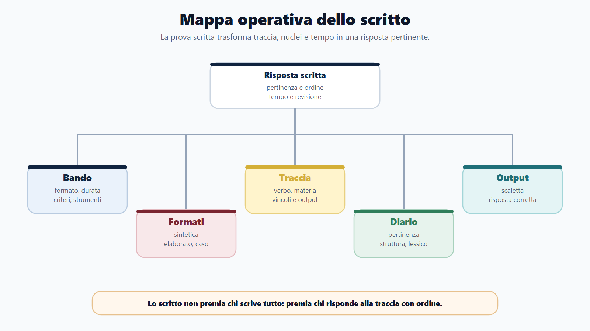
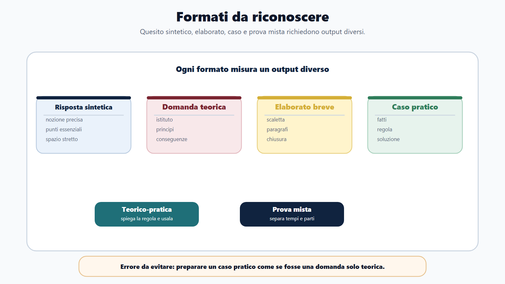
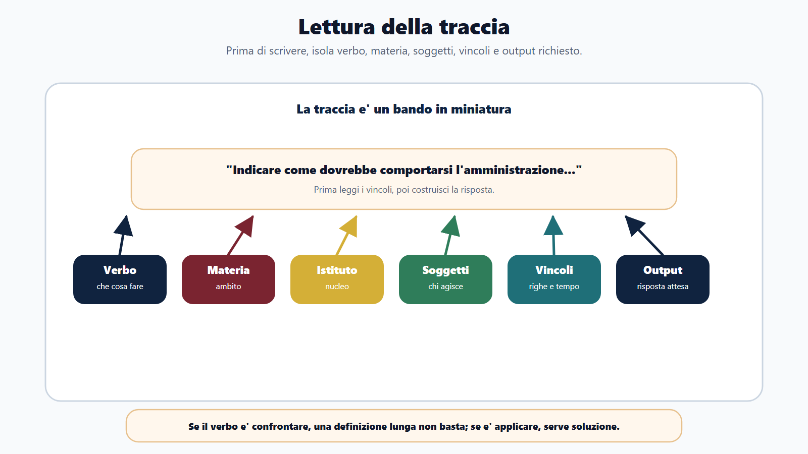
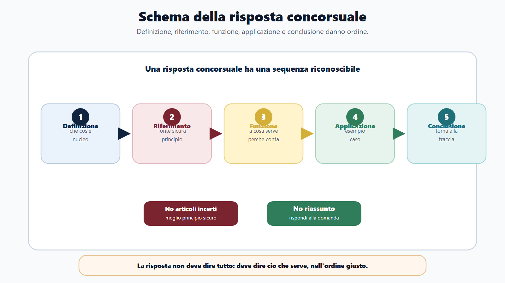
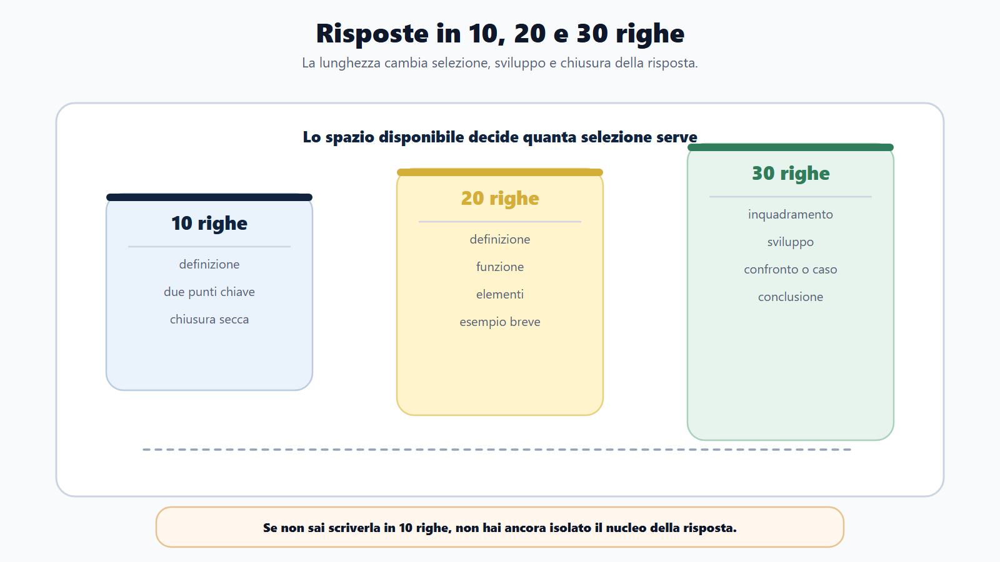
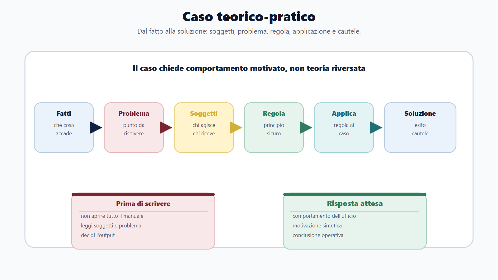
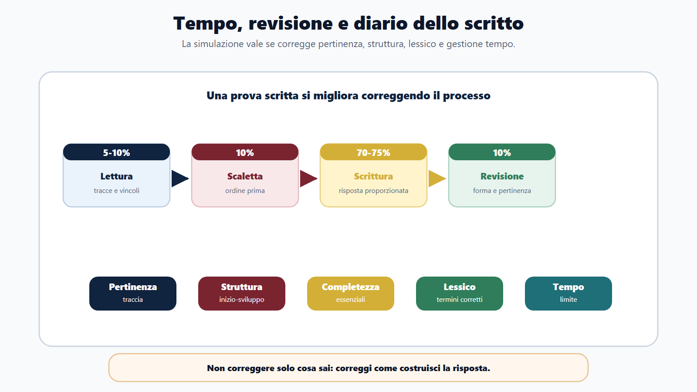

# Capitolo 15 - La prova scritta e teorico-pratica

## Perché lo scritto non è un tema libero

La prova scritta e teorico-pratica è il punto in cui lo studio deve diventare risposta. Non basta conoscere un istituto. Devi usarlo in una forma precisa: poche righe, quesito aperto, elaborato breve, caso amministrativo, risposta sintetica, soluzione motivata.

Molti candidati preparano lo scritto come se fosse un'estensione della lettura: studiano capitoli, memorizzano definizioni e sperano di ricordare abbastanza. Ma lo scritto non chiede solo memoria. Chiede selezione. Devi capire la traccia, delimitare il tema, scegliere le informazioni pertinenti, ordinarle e concludere.

Una risposta scritta efficace non è quella che contiene tutto. È quella che risponde alla domanda con chiarezza, usando ciò che serve e lasciando fuori ciò che disperde.

## Obiettivo del capitolo

Questo capitolo ti insegna a preparare la prova scritta e teorico-pratica come output. Imparerai a distinguere i formati, leggere la traccia, costruire una risposta in 10, 20 o 30 righe, affrontare un caso e correggere i tuoi elaborati con una griglia.

La regola è semplice:

> Prima capisci che cosa chiede la traccia, poi decidi che cosa scrivere.

Se fai il contrario, rischi di produrre una risposta ricca ma fuori bersaglio.

## Mappa BANDO dello scritto

| Fase | Cosa controllare | Prodotto concreto |
|---|---|---|
| **B - Bando** | Tipo di scritto, materie, durata, criteri, soglie, strumenti ammessi. | Scheda formato scritto. |
| **A - Aree** | Teoria, casi, atti, quesiti aperti, profilo specifico. | Mappa delle tracce possibili. |
| **N - Nuclei** | Definizioni, principi, procedure, confronti, casi ricorrenti. | Schemi risposta. |
| **D - Diario** | Errori di pertinenza, struttura, lessico, tempo, incompletezza. | Registro elaborati. |
| **O - Output** | Risposte in righe, casi risolti, scalette, simulazioni. | Elaborati corretti. |

## I formati da riconoscere

Il bando può usare formule diverse. Devi capire quale output ti viene chiesto.

| Formato | Che cosa misura | Metodo |
|---|---|---|
| Quesito a risposta sintetica | Conoscenza essenziale e precisione. | Definizione, funzione, punto chiave, esempio. |
| Domanda teorica | Capacità di spiegare un istituto. | Inquadramento, principi, disciplina, conseguenze. |
| Elaborato breve | Ordine e sviluppo argomentativo. | Scaletta, paragrafi, collegamenti, chiusura. |
| Caso pratico | Applicazione a una situazione. | Soggetti, competenza, fatti, regole, soluzione. |
| Prova teorico-pratica | Teoria più applicazione. | Spiegare la regola e usarla nel caso. |
| Prova mista | Più output insieme. | Gestire tempi e separare le parti. |

Preparare tutti questi formati nello stesso modo è un errore. La teoria va studiata, ma poi deve diventare forma.

## La lettura della traccia

La traccia va letta come un bando in miniatura. Contiene vincoli. Prima di scrivere, evidenzia mentalmente:

- il verbo operativo;
- la materia;
- l'istituto;
- i soggetti;
- il contesto;
- eventuali limiti di spazio;
- eventuali richieste pratiche;
- il criterio implicito di valutazione.

### I verbi operativi

| Verbo | Cosa vuole la traccia |
|---|---|
| Definire | Dare una nozione precisa e breve. |
| Illustrare | Spiegare struttura e funzione. |
| Confrontare | Mostrare differenze e somiglianze. |
| Distinguere | Evitare confusione tra istituti. |
| Applicare | Usare la regola in un caso. |
| Valutare | Motivare una scelta. |
| Indicare | Elencare elementi essenziali. |
| Redigere | Produrre un atto, schema o risposta operativa. |

Se il verbo è "confrontare", una definizione lunga non basta. Se il verbo è "applicare", un riassunto teorico non basta. Se il verbo è "indicare", non devi trasformare la risposta in trattato.

## Lo schema base: definizione, riferimento, funzione, esempio, conclusione

Per la maggior parte delle risposte concorsuali puoi usare questo schema:

1. **Definizione**: che cos'è il tema?
2. **Riferimento**: quale principio o fonte lo inquadra, se lo conosci con sicurezza?
3. **Funzione**: a che cosa serve?
4. **Applicazione o esempio**: come opera in un procedimento, ufficio o caso?
5. **Conclusione**: quale risposta dà alla traccia?

Non devi citare norme a caso. Un riferimento incerto può danneggiare la risposta. Meglio richiamare un principio sicuro che inventare un articolo.

### Esempio: risposta sintetica

Traccia: "Illustrare il ruolo del responsabile del procedimento."

Scaletta:

- definizione del responsabile;
- funzione di guida e coordinamento del procedimento;
- rapporto con istruttoria, comunicazioni e proposta/provvedimento;
- utilità per trasparenza, efficienza e individuazione del referente;
- chiusura sul valore operativo per cittadini e amministrazione.

Risposta modello breve:

> Il responsabile del procedimento è la figura che presidia l'istruttoria e assicura il coordinamento delle attività procedimentali. La sua individuazione rende più chiaro il rapporto tra cittadino e amministrazione, perché consente di sapere chi segue il procedimento e quali passaggi devono essere compiuti. Sul piano operativo cura l'acquisizione degli elementi necessari, coordina gli uffici coinvolti e prepara la decisione o la proposta. La sua funzione è quindi collegata ai principi di buon andamento, trasparenza e responsabilità amministrativa.

La risposta non dice tutto. Dice ciò che serve.

## Risposte in 10, 20 e 30 righe

La lunghezza cambia la strategia.

| Spazio | Strategia |
|---|---|
| 10 righe | Definizione, due punti chiave, chiusura. |
| 20 righe | Definizione, funzione, elementi, esempio breve. |
| 30 righe | Inquadramento, sviluppo, confronto o caso, conclusione. |

Allenati su tutte e tre. Un candidato che sa scrivere solo risposte lunghe rischia di non rispettare lo spazio. Un candidato che sa scrivere solo definizioni brevi rischia di non sviluppare.

## La prova teorico-pratica

La prova teorico-pratica chiede di usare la teoria. Può presentarsi come caso, scenario, quesito applicativo o richiesta di individuare passaggi operativi.

Metodo:

1. individua i fatti;
2. individua il problema giuridico-amministrativo;
3. individua i soggetti coinvolti;
4. richiama regola o principio;
5. applica la regola al caso;
6. proponi una soluzione ordinata;
7. segnala eventuali cautele.

### Caso guidato

Traccia: "Un cittadino presenta un'istanza incompleta a un ufficio comunale. Indicare come dovrebbe comportarsi l'amministrazione."

Prima non devi scrivere tutto sul procedimento. Devi leggere il caso.

| Elemento | Lettura |
|---|---|
| Soggetto | Cittadino e ufficio comunale. |
| Problema | Istanza incompleta. |
| Materia | Procedimento amministrativo, istruttoria, comunicazione. |
| Output | Comportamento dell'amministrazione. |

Scaletta:

- l'amministrazione non deve ignorare l'istanza;
- deve verificare la carenza;
- deve indicare al cittadino che cosa manca, se il procedimento lo consente;
- deve rispettare termini, competenza e principi di collaborazione;
- deve concludere con un provvedimento o atto coerente con la disciplina applicabile.

Risposta modello:

> In presenza di un'istanza incompleta, l'amministrazione deve anzitutto verificare quali elementi mancano e se tali elementi sono necessari per l'istruttoria. Non è corretto lasciare la domanda senza seguito. L'ufficio competente deve attivare i passaggi necessari per consentire l'integrazione, quando possibile, indicando in modo chiaro al cittadino la documentazione o le informazioni mancanti. La gestione del caso deve rispettare i principi di buon andamento, collaborazione, trasparenza e conclusione del procedimento. Se l'incompletezza non viene sanata o impedisce la valutazione, l'amministrazione adotterà l'esito previsto dalla disciplina applicabile, motivando la decisione.

La risposta è teorico-pratica perché unisce principio, comportamento e soluzione.

## Costruire una scaletta in tre minuti

Prima di scrivere, dedica pochi minuti alla scaletta. È tempo guadagnato.

Usa questa forma:

| Riga scaletta | Contenuto |
|---|---|
| 1 | Tema e definizione. |
| 2 | Regola/principio sicuro. |
| 3 | Due o tre elementi principali. |
| 4 | Applicazione, esempio o confronto. |
| 5 | Conclusione. |

La scaletta impedisce di partire bene e perdersi a metà. È particolarmente utile quando la traccia è ampia.

## Lessico: precisione senza rigidità

Una risposta concorsuale deve usare parole corrette. Non deve sembrare una sentenza. Evita formule vaghe:

- "la legge dice";
- "la pubblica amministrazione deve fare bene";
- "il cittadino ha diritto a tutto";
- "si procede normalmente";
- "è una cosa importante".

Preferisci formule più precise:

- "l'amministrazione deve rispettare il principio di buon andamento";
- "il procedimento deve essere gestito da un ufficio competente";
- "l'istanza richiede istruttoria";
- "la decisione deve essere motivata quando incide su interessi rilevanti";
- "il cittadino deve poter comprendere l'esito".

Precisione non significa lunghezza. Significa scegliere il termine giusto.

## Gestione del tempo nello scritto

Ogni prova scritta deve essere simulata con tempi reali. Una distribuzione possibile:

| Fase | Quota tempo |
|---|---:|
| Lettura tracce | 5-10% |
| Scaletta | 10% |
| Scrittura | 70-75% |
| Revisione | 10% |

La revisione non è un lusso. Serve a correggere errori di pertinenza, frasi incomplete, ripetizioni, termini impropri, salti logici.

Se la prova contiene più quesiti, non sacrificare tutto per il primo. Meglio risposte complete e proporzionate che un capolavoro iniziale e due risposte deboli.

## Diario dello scritto

Dopo ogni risposta, correggi con questa griglia.

| Criterio | Domanda di controllo |
|---|---|
| Pertinenza | Ho risposto proprio alla traccia? |
| Struttura | La risposta ha inizio, sviluppo e chiusura? |
| Completezza | Ho inserito gli elementi essenziali? |
| Precisione | Ho usato termini corretti? |
| Applicazione | Se c'è un caso, ho dato una soluzione? |
| Tempo | Ho rispettato il limite? |
| Revisione | Ho corretto forma e ripetizioni? |

Non correggere solo il contenuto. Correggi anche il modo in cui costruisci la risposta.

## Errori tipici

### Scrivere tutto ciò che si sa

È l'errore più comune. La traccia chiede un punto; il candidato apre il manuale mentale e svuota tutto. La commissione non valuta la quantità in sé. Valuta pertinenza, ordine e capacità di selezione.

### Citare riferimenti incerti

Se non ricordi un articolo, non inventarlo. Puoi scrivere "la disciplina sul procedimento amministrativo" o richiamare il principio, se è pertinente. La precisione falsa è peggiore della sobrietà.

### Non chiudere

Una risposta senza conclusione sembra sospesa. La chiusura deve riportare il discorso alla traccia: "Per queste ragioni...", "In sintesi...", "Nel caso prospettato...".

## Domanda da commissario

**Domanda:** Che cosa rende efficace una risposta scritta in un concorso?

**Risposta efficace:** una risposta efficace è pertinente, ordinata e proporzionata. Parte dalla traccia, definisce il tema, richiama solo riferimenti sicuri, spiega la funzione dell'istituto e, se richiesto, lo applica al caso. Deve essere chiara, leggibile e conclusa, non un elenco disordinato di nozioni.

## Domanda-trappola

**Domanda:** Una risposta più lunga è sempre migliore?

No. Una risposta lunga può essere debole se non risponde alla traccia. Nello scritto conta la selezione: inserire ciò che serve, nell'ordine giusto, entro il tempo e lo spazio disponibili.

## Mini-esercizio

Scegli un argomento studiato e scrivi tre versioni della risposta:

| Versione | Vincolo |
|---|---|
| 10 righe | Definizione e due punti essenziali. |
| 20 righe | Definizione, funzione, elementi, esempio. |
| 30 righe | Inquadramento, sviluppo, applicazione, chiusura. |

Poi confronta le tre versioni. Se la risposta da 10 righe non è chiara, non hai ancora isolato il nucleo. Se quella da 30 righe è dispersiva, devi lavorare sulla scaletta.

## Da sapere in 5 righe

1. Lo scritto non premia chi scrive tutto, ma chi risponde alla traccia.
2. Ogni risposta deve avere definizione, funzione, sviluppo e chiusura.
3. Nel caso pratico devi applicare la regola, non solo spiegarla.
4. I riferimenti normativi vanno usati solo se sicuri e pertinenti.
5. Scaletta, tempo e revisione sono parte della prova.

## Fonti consolidate

- [[sources/prove-concorsuali-quiz-scritto-orale-dpr-487-1994]]
- [[sources/apprendimento-efficace-active-recall-ripasso-distribuito]]
- [[topics/prova-scritta-teorico-pratica]]
- [[topics/risposta-concorsuale]]
- [[topics/metodo-di-studio]]

## Note di review

- Verificare in revisione finale se aggiungere esempi di tracce reali sintetizzate da bandi recenti.
- Non sono stati inseriti articoli specifici quando non necessari al metodo, per evitare falsa precisione.
