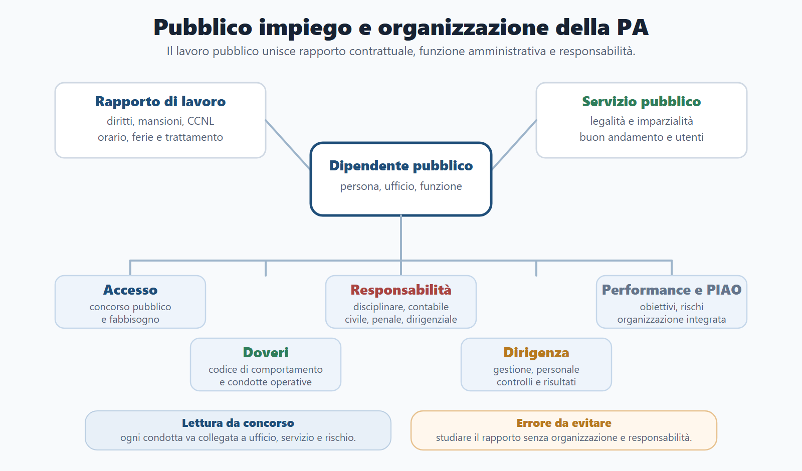
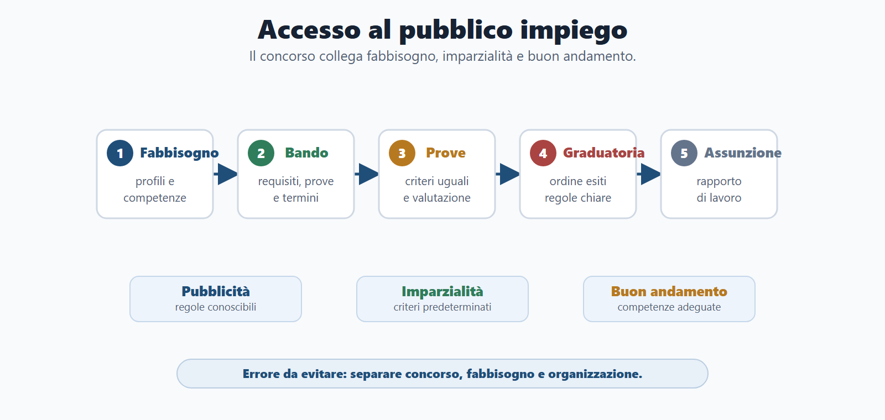
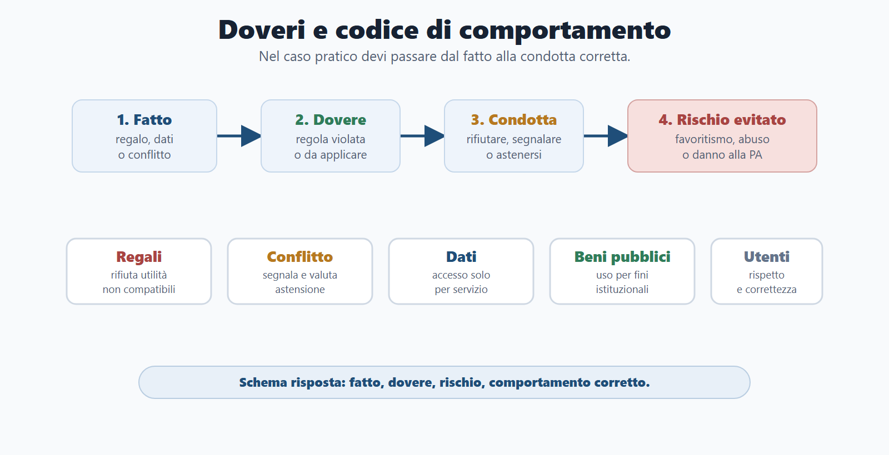
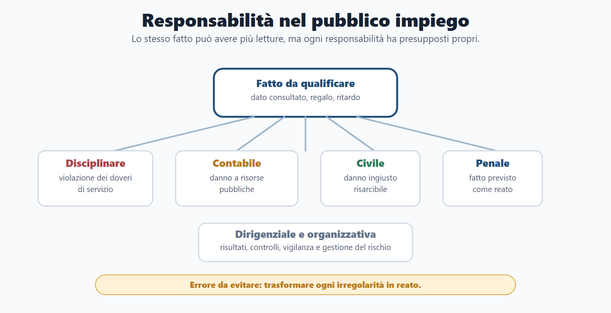
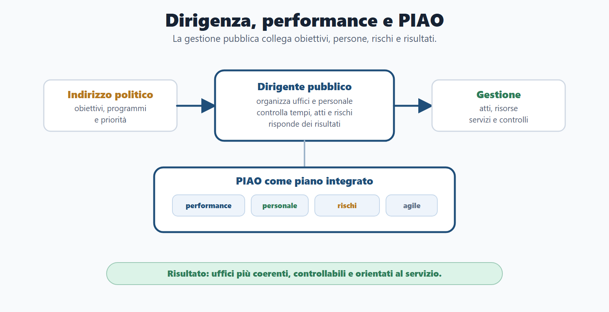

# Capitolo 6 - Pubblico impiego e organizzazione della PA

## Perché studiare il pubblico impiego

Il pubblico impiego non è soltanto una materia sul contratto di lavoro. È il punto in cui l'organizzazione della pubblica amministrazione incontra persone, competenze, responsabilità, etica pubblica e qualità dei servizi.

Il dipendente pubblico ha un rapporto di lavoro, riceve uno stipendio, svolge mansioni e ha diritti contrattuali. Ma opera anche dentro un apparato che persegue interessi pubblici. Per questo il lavoro pubblico ha una doppia natura: da un lato è rapporto di lavoro, dall'altro è servizio alla collettività, regolato da legalità, imparzialità, buon andamento, responsabilità, trasparenza e prevenzione del rischio.

In concorso questa materia compare spesso in forma diretta: "pubblico impiego", "ordinamento del personale", "responsabilità del dipendente", "codice di comportamento", "dirigenza", "performance", "PIAO", "anticorruzione", "conflitto di interessi", "whistleblowing", "lavoro agile". Può però comparire anche in forma pratica: un dipendente accede a dati senza ragione di servizio, riceve un regalo, ritarda una pratica, non dichiara un conflitto, usa mezzi dell'ufficio per fini privati o lavora in un ufficio privo di controlli.

La chiave del capitolo è questa: nel pubblico impiego il comportamento individuale e l'organizzazione dell'ufficio non sono separati. Un dipendente scorretto espone l'amministrazione a rischio; un'organizzazione disordinata aumenta la probabilità di errori, ritardi, favoritismi e responsabilità.

Per studiarlo bene, non partire da definizioni isolate. Usa sempre il collegamento tra profilo messo a bando, ufficio di destinazione, doveri di servizio e rischio amministrativo: è questo passaggio che trasforma la materia in una risposta da concorso.

## Obiettivi del capitolo

Al termine del capitolo devi saper:

- spiegare che cosa si intende per pubblico impiego e lavoro alle dipendenze della PA;
- distinguere rapporto contrattualizzato e regimi pubblicistici speciali;
- collegare accesso mediante concorso, imparzialità e buon andamento;
- riconoscere fonti, organizzazione, organi, uffici, personale e competenza;
- distinguere indirizzo politico e gestione amministrativa;
- spiegare ruolo e responsabilità del dirigente pubblico;
- individuare diritti, doveri e obblighi del dipendente pubblico;
- usare il codice di comportamento come strumento operativo;
- distinguere responsabilità disciplinare, amministrativo-contabile, civile, penale e dirigenziale;
- collegare performance, PIAO, anticorruzione, trasparenza e governo del rischio;
- comprendere conflitto di interessi, obbligo di astensione e whistleblowing;
- inquadrare il lavoro agile come modalità organizzativa orientata a obiettivi e risultati;
- risolvere casi situazionali su dati, regali, conflitti, ritardi e controlli.

**Lettura operativa.** Usa la mappa come indice: concorso, rapporto, doveri, responsabilità, performance e rischio. È l'ordine da seguire anche all'orale.

## Come usare il Metodo BANDO

| Fase | Come usare questo capitolo |
|---|---|
| **Bando** | Cerca voci come pubblico impiego, ordinamento del personale, organizzazione PA, codice di comportamento, responsabilità, dirigenza, performance, PIAO, anticorruzione, trasparenza, lavoro agile. |
| **Aree** | Collega il tema a diritto amministrativo, Costituzione, procedimento, trasparenza, anticorruzione, privacy, contabilità pubblica, contratti pubblici e organizzazione degli enti locali. |
| **Nuclei** | Studia prima accesso, contrattualizzazione, doveri, responsabilità, indirizzo politico/gestione, dirigenza, performance, PIAO, conflitto di interessi e whistleblowing. |
| **Diario** | Registra gli errori: confondere politico e dirigente, ridurre il codice di comportamento a regole formali, ignorare il conflitto potenziale, trattare il PIAO come burocrazia astratta. |
| **Output** | Produci una tabella dovere/comportamento/rischio, una risposta orale sulla dirigenza, un caso su dati/regali/conflitto, una mappa responsabilità. |

## Quadro essenziale

### Fonti del pubblico impiego

Il pubblico impiego si fonda su più livelli di fonti. La Costituzione orienta l'organizzazione amministrativa con i principi di imparzialità, buon andamento, responsabilità e accesso agli impieghi pubblici secondo regole selettive. Il D.Lgs. 165/2001 costituisce il riferimento generale per l'organizzazione del lavoro alle dipendenze delle amministrazioni pubbliche. Il D.Lgs. 150/2009 rileva per misurazione e valutazione della performance. La disciplina anticorruzione e trasparenza incide su comportamento, prevenzione del rischio, pubblicità e controlli.

Accanto alle norme generali operano contratti collettivi, codici di comportamento, regolamenti interni, piani organizzativi, discipline di settore e norme speciali per alcune categorie. Per il candidato è importante capire il rapporto tra regola generale e disciplina speciale: il lavoro pubblico ordinario è in larga parte contrattualizzato, ma resta inserito in un quadro pubblicistico.

| Fonte o livello | Funzione nel concorso | Esempio di domanda |
|---|---|---|
| Costituzione | Collega accesso, imparzialità, buon andamento e responsabilità. | Perché il concorso pubblico tutela l'imparzialità? |
| D.Lgs. 165/2001 | Regola organizzazione del lavoro pubblico, rapporto di lavoro, dirigenza e separazione tra indirizzo e gestione. | Qual è la differenza tra organo politico e dirigente? |
| Contratti collettivi | Disciplinano trattamento economico e normativo nei limiti previsti. | Qual è il ruolo della contrattazione nel pubblico impiego? |
| Codici di comportamento | Traducono i doveri in condotte operative. | Come deve comportarsi un dipendente in conflitto di interessi? |
| Performance e PIAO | Collegano organizzazione, obiettivi, risultati, rischi e personale. | Perché la performance non è solo valutazione individuale? |

### Contrattualizzazione e specialità del lavoro pubblico

La contrattualizzazione significa che gran parte del rapporto di lavoro pubblico è regolata secondo modelli privatistici e contrattuali. Questo non trasforma il dipendente pubblico in un lavoratore privato qualsiasi. Il datore di lavoro è una pubblica amministrazione, quindi il rapporto resta condizionato da finalità pubbliche, vincoli di legalità, selezione imparziale, trasparenza, responsabilità e controlli.

Nel manuale da concorso conviene usare questa formula: il rapporto è contrattualizzato nella gestione del lavoro, ma pubblicistico nella cornice dei fini, dell'organizzazione e delle responsabilità.

Alcune categorie possono avere regimi speciali. Il candidato non deve imparare un elenco fuori contesto, ma deve capire la logica: alcune funzioni richiedono regole particolari per status, autonomia, garanzie o disciplina di servizio.

### Organizzazione amministrativa, organi e uffici

L'organizzazione pubblica riguarda soggetti, organi, uffici, personale, risorse, procedimenti e responsabilità. L'organo esprime la volontà dell'ente; l'ufficio è la struttura che svolge attività amministrativa; il personale rende possibile l'esercizio delle funzioni.

Questa distinzione serve nei casi pratici. Se un ufficio non assegna le pratiche, non individua responsabili, non controlla gli accessi alle banche dati e non monitora i ritardi, non siamo davanti a un problema soltanto gestionale. Siamo davanti a una possibile disfunzione organizzativa rilevante per buon andamento, trasparenza, performance e responsabilità.

### Accesso al lavoro pubblico

L'accesso al pubblico impiego avviene ordinariamente mediante concorso o procedura selettiva pubblica. Il concorso tutela imparzialità, eguaglianza, buon andamento e qualità del reclutamento. Non è un rito formale: serve a scegliere personale coerente con il profilo professionale e con i compiti dell'amministrazione.

Per rispondere bene in concorso, devi collegare l'accesso a tre elementi:

| Elemento | Perché conta |
|---|---|
| Pubblicità | Il bando rende conoscibili requisiti, prove, termini e criteri. |
| Imparzialità | I candidati devono essere valutati secondo criteri predeterminati e uguali. |
| Buon andamento | L'amministrazione seleziona competenze adeguate ai propri fabbisogni. |

Le deroghe al concorso vanno trattate come eccezioni, non come regola parallela. Richiedono base normativa e giustificazione coerente con i principi costituzionali.

### Diritti del dipendente pubblico

Il dipendente pubblico ha diritti collegati al rapporto di lavoro: trattamento economico, ferie, permessi, tutela della salute e sicurezza, formazione, pari opportunità, partecipazione sindacale nei limiti previsti, tutela contro condotte discriminatorie o illegittime.

Questi diritti non vanno studiati come un elenco isolato. Devono essere collegati all'organizzazione. La formazione, ad esempio, non è solo un beneficio del lavoratore: migliora la capacità amministrativa. La tutela della salute non è solo protezione individuale: rende sostenibile l'organizzazione. Le pari opportunità non sono solo principio etico: incidono su imparzialità, accesso e qualità del lavoro pubblico.

### Doveri del dipendente pubblico

I doveri del dipendente pubblico derivano dalla funzione svolta. Il dipendente deve agire con diligenza, lealtà, imparzialità, correttezza, riservatezza, collaborazione, rispetto degli utenti, cura dei beni pubblici e protezione delle informazioni d'ufficio.

Il codice di comportamento traduce questi doveri in regole pratiche. Serve a prevenire condotte scorrette prima che diventino contenzioso, danno, abuso o perdita di fiducia nell'amministrazione.

| Dovere | Comportamento corretto | Rischio da evitare |
|---|---|---|
| Imparzialità | Trattare pratiche e utenti secondo criteri oggettivi. | Favoritismi, disparità di trattamento, apparenza di parzialità. |
| Diligenza | Rispettare procedure, tempi e compiti assegnati. | Ritardi, omissioni, disservizi, responsabilità disciplinare. |
| Riservatezza | Usare dati e documenti solo per finalità di servizio. | Accesso improprio a banche dati, diffusione non autorizzata. |
| Correttezza | Tenere rapporti professionali con utenti, colleghi e superiori. | Pressioni, conflitti, comportamenti lesivi dell'immagine dell'ente. |
| Astensione | Segnalare conflitti anche potenziali. | Decisioni sospette, parzialità reale o apparente. |
| Cura dei beni pubblici | Usare strumenti, locali, dispositivi e tempo di lavoro per fini istituzionali. | Uso privato di risorse pubbliche. |

### Etica pubblica

L'etica pubblica non è moralismo generico. È l'insieme di comportamenti che rende credibile l'amministrazione. Un dipendente che usa dati per curiosità, accetta favori, tratta diversamente utenti simili o confonde interessi privati e pubblici non viola soltanto una regola interna: indebolisce la fiducia nella PA.

In prova, l'etica va collegata a legalità, imparzialità, trasparenza, responsabilità e prevenzione della corruzione. La risposta migliore non dice solo "il comportamento è scorretto"; spiega quale dovere viene violato, quale rischio nasce e quale condotta avrebbe dovuto tenere il dipendente.

### Conflitto di interessi e obbligo di astensione

Il conflitto di interessi si verifica quando un interesse personale, familiare, economico, professionale o comunque particolare può interferire con l'imparzialità dell'attività amministrativa. Nei concorsi è importante sottolineare che il conflitto può essere anche potenziale o apparente.

La regola operativa è semplice: il dipendente segnala la situazione e si astiene quando la sua posizione può compromettere, o far apparire compromessa, la neutralità della decisione. Non bisogna attendere che il vantaggio sia certo o che il danno si sia già prodotto.

### Responsabilità del dipendente pubblico

Lo stesso fatto può produrre responsabilità diverse. Il candidato deve saperle distinguere.

| Tipo di responsabilità | Quando rileva | Esempio |
|---|---|---|
| Disciplinare | Violazione di doveri di servizio o codice di comportamento. | Accesso non autorizzato a una banca dati dell'ufficio. |
| Amministrativo-contabile | Danno alle risorse pubbliche o all'amministrazione nei presupposti previsti. | Uso improprio di beni pubblici con danno economico. |
| Civile | Danno ingiusto verso terzi o amministrazione secondo le regole applicabili. | Condotta che arreca pregiudizio risarcibile. |
| Penale | Fatto previsto dalla legge come reato. | Ipotesi gravi di abuso, falsità, corruzione o rivelazione illecita. |
| Dirigenziale | Mancato raggiungimento di risultati, cattiva organizzazione, omessa vigilanza o carente gestione del rischio. | Ufficio privo di controlli su procedimenti ad alta esposizione. |

Errore da evitare: trasformare ogni irregolarità in reato. La classificazione richiede prudenza: prima si qualifica il fatto, poi si individuano doveri violati, danni, intenzionalità, ruolo e conseguenze.

### Reati contro la pubblica amministrazione: il quadro essenziale

Quando il bando richiama i reati contro la pubblica amministrazione, non serve trasformare lo studio in un corso completo di diritto penale. Devi però riconoscere quando il fatto supera il piano disciplinare o organizzativo e può assumere rilievo penale.

Il primo passaggio è sempre lo stesso: individua il soggetto, la relazione con l'ufficio, la condotta e il vantaggio o danno in gioco. Distingui in particolare il **pubblico ufficiale**, che esercita una pubblica funzione, dall'**incaricato di pubblico servizio**, che presta un pubblico servizio senza i poteri tipici della pubblica funzione. La qualifica si ricava dall'attività concretamente svolta, non dal solo nome del posto. Evita poi di attribuire un nome al reato solo perché una condotta appare scorretta.

| Figura da riconoscere | Nucleo del fatto | Cosa ricordare in prova |
|---|---|---|
| Peculato | Il pubblico agente si appropria di denaro o altra cosa mobile altrui di cui dispone per ragioni d'ufficio o di servizio. | Il punto decisivo è l'appropriazione di risorse già nella disponibilità funzionale dell'ufficio. |
| Indebita destinazione di denaro o cose mobili | Il pubblico agente destina, nei presupposti dell'art. 314-bis c.p., denaro o cose mobili a un uso diverso da quello previsto dalla specifica disciplina vincolante. | Non confonderla con l'appropriazione: qui il nucleo è la destinazione indebita della risorsa. |
| Concussione | Il pubblico ufficiale, abusando della qualità o dei poteri, costringe qualcuno a dare o promettere un'utilità indebita. | La parola chiave è costringe: la pressione annulla la libertà di scelta del privato. |
| Corruzione per l'esercizio della funzione | Il pubblico ufficiale riceve o accetta la promessa di un'utilità indebita in relazione alle sue funzioni o poteri. | Il nucleo è l'accordo illecito, non la sola irregolarità dell'atto. |
| Corruzione per un atto contrario ai doveri d'ufficio | L'utilità indebita è collegata all'omissione, al ritardo o al compimento di un atto contrario ai doveri d'ufficio. | Collega accordo illecito e deviazione concreta dall'interesse pubblico. |
| Induzione indebita | Il pubblico agente induce, abusando della qualità o dei poteri, qualcuno a dare o promettere un'utilità indebita. | Non confonderla con la concussione: qui non c'è costrizione, ma una pressione che orienta la scelta. |

Altre figure ricorrenti nei programmi vanno almeno riconosciute: **istigazione alla corruzione**, **traffico di influenze illecite**, **rifiuto od omissione di atti d'ufficio** e **rivelazione o utilizzazione di segreti d'ufficio**. A livello base è sufficiente saper collegare ciascuna espressione al tipo di condotta; pene, concorsi di reati e questioni giurisprudenziali appartengono all'approfondimento specialistico.

> **Come lo chiede la commissione**
>
> La domanda non chiede quasi mai di recitare tutte le fattispecie. Più spesso presenta un fatto: un funzionario usa denaro dell'ufficio per fini propri, un privato è costretto a pagare, oppure un operatore offre un vantaggio per ottenere un trattamento favorevole. Rispondi qualificando prima il comportamento e distinguendo appropriazione, costrizione, induzione e accordo corruttivo.

#### Costrizione, induzione e corruzione: il confronto che evita errori

| Situazione | Dinamica | Errore da evitare |
|---|---|---|
| Il privato subisce una pressione irresistibile dal pubblico ufficiale. | Costrizione: il privato non negozia su un piano di libertà effettiva. | Chiamare automaticamente corruzione qualunque richiesta indebita. |
| Il privato è spinto o persuaso dall'abuso del pubblico agente. | Induzione: la condotta orienta la scelta senza costrizione. | Confondere induzione e concussione. |
| Pubblico agente e privato convergono su uno scambio illecito. | Accordo corruttivo: l'utilità è il corrispettivo illecito della funzione o dell'atto. | Dimenticare il rapporto tra utilità indebita e funzione pubblica. |

> **Domanda-trappola**
>
> Ogni comportamento scorretto del dipendente pubblico è un reato contro la PA?
>
> No. Una condotta può essere solo disciplinarmente rilevante, può generare un danno erariale, può richiedere una correzione organizzativa o può avere anche rilievo penale. La qualificazione dipende dalla fattispecie prevista dalla legge e dagli elementi concreti del fatto.

#### Attenzione all'abuso d'ufficio

Nel quadro normativo attuale non devi indicare l'abuso d'ufficio come reato vigente: l'art. 323 del codice penale è stato abrogato dalla legge 9 agosto 2024, n. 114. Per i concorsi di base è sufficiente ricordare questo dato e non sostituirlo con etichette improprie. Fatti anteriori, norme transitorie e profili specialistici richiedono invece una verifica giuridica puntuale.

#### Riferimenti essenziali per qualificare il fatto

| Nucleo | Riferimento | Operazione da concorso |
|---|---|---|
| Qualifica soggettiva | artt. 357 e 358 c.p. | Verificare funzione o servizio svolto in concreto. |
| Appropriazione e destinazione indebita | artt. 314 e 314-bis c.p. | Distinguere appropriazione della risorsa e uso contrario al vincolo di destinazione. |
| Costrizione, induzione e accordo | artt. 317, 319-quater, 318 e 319 c.p. | Ricostruire libertà del privato e struttura della relazione illecita. |
| Condotte ulteriori | artt. 319-quater, 322, 346-bis, 328 e 326 c.p. | Riconoscere l'area della fattispecie senza inventare qualificazioni. |
| Abuso d'ufficio | Legge 9 agosto 2024, n. 114 | Non indicare l'art. 323 c.p. come reato vigente per fatti attuali. |

## Riferimenti consolidati per B-PA04

- [[sources/delitti-contro-pa-codice-penale-2026]]
- [[sources/legge-6-novembre-2012-n-190-anticorruzione]]
- [[sources/legge-14-gennaio-1994-n-20-responsabilita-erariale]]

## Note di review B-PA04

L'audit P8 conferma la separazione didattica tra responsabilità disciplinare, amministrativo-contabile e penale. Pene, circostanze, successione di leggi nel tempo e singole qualificazioni richiedono revisione penalistica umana prima della pubblicazione.

#### Caso guidato: il vantaggio richiesto all'operatore economico

Un funzionario dice a un operatore economico che la sua pratica potrà essere esaminata più rapidamente se offrirà un'utilità personale. Il candidato non deve decidere il caso con una formula automatica. Deve spiegare che la situazione è incompatibile con imparzialità, doveri d'ufficio e prevenzione della corruzione; deve poi distinguere, in base ai fatti indicati dalla traccia, tra accordo corruttivo, costrizione o induzione.

La risposta prudente è: «Occorre interrompere la gestione informale, attivare i canali competenti, conservare la tracciabilità della pratica e qualificare i fatti secondo la disciplina applicabile. Non ogni pressione ha la stessa struttura giuridica: la traccia deve chiarire se vi sia accordo, induzione o costrizione».

> **Errore tipico**
>
> Usare “corruzione” come sinonimo di ogni favoritismo o “abuso d'ufficio” come etichetta universale. In prova conta mostrare metodo: fatti, soggetti, poteri, utilità, libertà del privato e norma applicabile.

**Mini-esercizio.** Collega ciascun fatto al nucleo corretto: a) un dipendente usa per sé somme che gestisce per servizio; b) un pubblico ufficiale costringe un cittadino a consegnare denaro; c) un operatore e un funzionario concordano un vantaggio per ottenere un atto favorevole. Poi scrivi per ogni caso una riga che spieghi perché non va confuso con un mero illecito disciplinare.

### Indirizzo politico e gestione amministrativa

La separazione tra indirizzo politico e gestione amministrativa è un nucleo centrale. Gli organi politici definiscono obiettivi, programmi, priorità e indirizzi. I dirigenti e i responsabili amministrativi curano la gestione concreta: personale, atti, procedimenti, risorse, controlli e risultati.

Questa separazione serve a garantire imparzialità e chiarezza delle responsabilità. Ai sensi dell'art. 4 del D.Lgs. 165/2001, gli organi di governo definiscono obiettivi e programmi e verificano i risultati; ai dirigenti spettano atti e provvedimenti amministrativi, compresi quelli che impegnano l'amministrazione verso l'esterno, nonché gestione finanziaria, tecnica e amministrativa nei limiti delle competenze attribuite. L'organo politico non deve gestire la singola pratica come se fosse un funzionario; il dirigente non decide l'indirizzo politico dell'ente, ma realizza gli obiettivi con atti gestionali e responsabilità proprie.

Esempio da orale: la giunta stabilisce di potenziare un servizio comunale; il dirigente organizza personale, tempi, atti, procedure e controlli necessari per attuare quell'obiettivo.

### Dirigenza pubblica

Il dirigente pubblico è il punto di collegamento tra organizzazione, personale, procedimenti, performance, controlli e risultati. Non è soltanto il soggetto che firma atti. È il responsabile della tenuta organizzativa del settore affidato.

La responsabilità dirigenziale va spiegata come responsabilità di sistema. Il dirigente deve assegnare compiti, prevenire rischi, garantire tracciabilità, controllare tempi, curare qualità dei processi, verificare risultati e correggere disfunzioni.

Nei casi pratici chiediti sempre:

- il dirigente ha assegnato responsabilità chiare?
- ha predisposto controlli minimi?
- ha monitorato tempi e carichi di lavoro?
- ha prevenuto rischi prevedibili?
- ha corretto ritardi o disfunzioni note?
- ha collegato obiettivi, risorse e risultati?

### Performance amministrativa

La performance amministrativa collega obiettivi, attività, indicatori, risultati, valutazione e accountability. Non coincide con un premio economico. Serve a capire se l'amministrazione usa risorse e personale per produrre risultati effettivi e servizi adeguati.

Il candidato deve distinguere:

| Livello | Significato |
|---|---|
| Performance organizzativa | Risultati dell'amministrazione, dell'area o dell'ufficio rispetto agli obiettivi. |
| Performance individuale | Contributo del dirigente o dipendente al raggiungimento degli obiettivi. |
| Valutazione | Misurazione ragionata di risultati, comportamenti e qualità della prestazione. |
| Accountability | Dovere di rendere conto dei risultati e dell'uso delle risorse. |

Un ufficio formalmente corretto ma sistematicamente lento, disorganizzato e incapace di misurare risultati presenta un problema di performance. Per questo performance, dirigenza e responsabilità organizzativa devono essere studiate insieme.

### PIAO essenziale

Il Piano integrato di attività e organizzazione va letto come strumento di programmazione integrata. Il quadro normativo essenziale è composto dall'art. 6 del D.L. 80/2021, dal D.P.R. 24 giugno 2022, n. 81 sugli adempimenti assorbiti e dal D.M. 30 giugno 2022, n. 132 sul Piano tipo. Collega obiettivi, performance, organizzazione, anticorruzione, trasparenza, personale, formazione e lavoro agile. Non è un semplice documento: serve a evitare che l'amministrazione pianifichi a compartimenti separati.

Per il livello base da concorso basta fissare tre idee:

1. integra programmazione, organizzazione e prevenzione del rischio;
2. collega personale, obiettivi e risultati;
3. aiuta a rendere coerenti performance, trasparenza, anticorruzione e fabbisogni.

Il PIAO è quindi un ponte tra questo capitolo e quelli su trasparenza, anticorruzione e metodo di studio dei profili amministrativi.

### Anticorruzione, trasparenza e governo del rischio

Anticorruzione e trasparenza non sono materie separate dal pubblico impiego. I comportamenti dei dipendenti, l'organizzazione degli uffici, la rotazione quando prevista, la formazione, la mappatura dei processi, la tracciabilità e gli obblighi di pubblicazione sono strumenti di prevenzione del rischio.

Il governo del rischio significa individuare processi esposti, prevedere misure organizzative, controllare l'attuazione e correggere le criticità. Un ufficio appalti, un ufficio personale, un ufficio autorizzazioni o un ufficio che gestisce contributi pubblici richiede particolare attenzione perché decisioni, dati e risorse possono incidere su interessi rilevanti.

### Whistleblowing

Il whistleblowing riguarda la segnalazione di violazioni conosciute nel contesto lavorativo, secondo le forme e tutele previste dal D.Lgs. 10 marzo 2023, n. 24. La funzione è proteggere l'interesse pubblico, far emergere condotte scorrette, garantire riservatezza e prevenire ritorsioni contro chi segnala.

In prova, non presentarlo come una denuncia generica o come conflitto personale tra colleghi. Va collegato a legalità, integrità, riservatezza del segnalante, canali corretti e divieto di ritorsione.

### Lavoro agile

Il lavoro agile nel pubblico impiego è una modalità organizzativa della prestazione. Non va descritto come privilegio individuale o semplice lavoro da casa. Richiede obiettivi, attività compatibili, strumenti adeguati, sicurezza, tutela dei dati, coordinamento con l'ufficio e misurazione dei risultati.

La domanda da farti è: il servizio pubblico resta garantito? Se la risposta è no, il lavoro agile non è organizzato correttamente. Se la risposta è sì, esso può contribuire a flessibilità, responsabilizzazione e miglioramento dell'organizzazione.

## Programma essenziale per i concorsi

Questa sezione rende espliciti i nuclei da trattare nei quiz e nei programmi estesi. Alcuni sono già sviluppati nel quadro teorico; qui vengono ordinati secondo la sequenza tipica delle prove concorsuali.

### 1. Accesso al pubblico impiego

L'accesso al pubblico impiego si collega all'art. 97 Cost. e al principio del concorso pubblico. I temi da conoscere sono reclutamento, assunzioni, graduatorie, mobilità, progressioni, riserve e fabbisogno di personale.

| Tema | Spiegazione essenziale | Errore da evitare |
|---|---|---|
| Concorso pubblico | Regola ordinaria di accesso, collegata a imparzialità e buon andamento. | Trattarlo come una formalità burocratica. |
| Reclutamento | Processo con cui la PA programma e seleziona personale. | Separarlo dal fabbisogno e dall'organizzazione. |
| Assunzione | Atto finale di instaurazione del rapporto, dopo la procedura e nei limiti previsti. | Confondere idoneità e diritto automatico all'assunzione. |
| Graduatoria | Ordine dei candidati secondo esito della selezione. | Pensare che lo scorrimento sia sempre obbligatorio. |
| Mobilità | Passaggio di personale secondo procedure e presupposti previsti. | Confonderla con nuova assunzione. |
| Progressioni | Sviluppi professionali o economici nei limiti della disciplina applicabile. | Presentarle come avanzamenti automatici. |
| Riserve | Quote o preferenze previste dalla legge per categorie determinate. | Ignorare che devono avere base normativa. |
| Fabbisogno | Programmazione delle esigenze di personale dell'amministrazione. | Studiare il concorso senza collegarlo all'organizzazione. |

Il candidato deve collegare sempre accesso, fabbisogno e competenze: la PA non assume in astratto, ma per coprire bisogni organizzativi coerenti con funzioni, servizi e risorse.

### 2. Rapporto di lavoro pubblico

Il rapporto di lavoro pubblico ordinario è privatizzato o contrattualizzato, ma inserito in una cornice pubblicistica. Il D.Lgs. 165/2001 è il riferimento generale. Il rapporto con il codice civile e con le leggi sul lavoro si combina con regole speciali del pubblico impiego.

I nuclei da coprire sono:

- CCNL e contrattazione collettiva;
- ARAN come soggetto centrale nella rappresentanza negoziale pubblica;
- comparti e aree di contrattazione;
- relazioni sindacali;
- poteri datoriali della PA;
- diritti e obblighi del lavoratore;
- disciplina speciale per organizzazione, accesso, responsabilità e incompatibilità.

La formula utile per l'orale è: il rapporto è gestito con strumenti privatistici, ma nasce e si svolge dentro una pubblica amministrazione, quindi resta condizionato da finalità pubbliche, imparzialità, buon andamento e responsabilità. Per CCNL, comparti, aree e relazioni sindacali il riferimento operativo è ARAN, nel quadro del D.Lgs. 165/2001: non esiste un unico contratto valido per tutti i dipendenti, perché il CCNL applicabile dipende da comparto, area, profilo e amministrazione.

### 3. Dirigenza, performance e PIAO

La dirigenza pubblica collega indirizzo politico e gestione amministrativa. I dirigenti curano organizzazione degli uffici, personale, obiettivi, procedimenti, controlli e risultati. Gli incarichi dirigenziali devono essere letti in rapporto a competenza, responsabilità e obiettivi.

Il ciclo della performance riguarda programmazione, misurazione, valutazione e rendicontazione dei risultati. L'OIV, Organismo indipendente di valutazione, rileva nel sistema di misurazione e valutazione. Premi e trattamento accessorio vanno collegati a risultati e regole di valutazione, non a automatismi.

Il PIAO integra obiettivi, organizzazione, anticorruzione, trasparenza, personale, formazione e lavoro agile. Nei quiz è frequente l'errore di trattarlo come documento solo formale: va invece spiegato come strumento di programmazione integrata.

### 4. Doveri del dipendente pubblico

Il codice di comportamento generale, contenuto nel D.P.R. 16 aprile 2013, n. 62 e integrato dai codici delle singole amministrazioni, traduce i doveri in condotte operative. I nuclei ricorrenti sono diligenza, lealtà, imparzialità, regali, conflitto di interessi, astensione, incompatibilità, inconferibilità, incarichi extraistituzionali, uso corretto delle tecnologie e rapporti con il pubblico.

| Tema | Regola di comportamento |
|---|---|
| Regali | Non accettare utilità che possano compromettere imparzialità o apparenza di imparzialità. |
| Conflitto di interessi | Segnalare il conflitto anche potenziale e astenersi quando necessario. |
| Incompatibilità | Evitare situazioni che non possono coesistere con il ruolo pubblico. |
| Inconferibilità | Non assumere incarichi quando la legge impedisce il conferimento. |
| Incarichi extraistituzionali | Verificare autorizzazioni, limiti e compatibilità con servizio e imparzialità. |
| Riservatezza | Usare informazioni e banche dati solo per ragioni d'ufficio. |

L'obiettivo non è memorizzare formule, ma riconoscere situazioni rischiose: regalo, favore, consultazione impropria, rapporto personale, attività esterna non autorizzata, uso privato di strumenti pubblici.

### 5. Responsabilità disciplinare

La responsabilità disciplinare riguarda la violazione dei doveri di servizio. Il procedimento disciplinare trova il proprio quadro generale negli artt. 55 e seguenti del D.Lgs. 165/2001 e deve essere letto insieme al codice di comportamento e al CCNL applicabile. Richiede contestazione degli addebiti, contraddittorio, valutazione del fatto e applicazione della sanzione secondo regole e competenze. L'UPD, ufficio per i procedimenti disciplinari, rileva nei casi in cui la competenza non resta al responsabile della struttura.

I temi da conoscere sono:

- contestazione degli addebiti;
- diritto di difesa e contraddittorio;
- sanzioni conservative;
- sospensione;
- licenziamento disciplinare;
- falsa attestazione della presenza;
- assenza ingiustificata;
- rapporto tra procedimento disciplinare e altri profili di responsabilità.

Errore da evitare: dire che ogni illecito disciplinare è automaticamente reato o danno erariale. Lo stesso fatto può generare più responsabilità, ma ciascuna ha presupposti propri.

### 6. Mansioni, orario e trattamento economico

Il rapporto di lavoro pubblico comprende mansioni, inquadramento, orario, ferie, permessi, malattia, reperibilità, part-time, lavoro agile, retribuzione e trattamento accessorio. La base generale è nel D.Lgs. 165/2001, ma molti istituti concreti sono regolati dal CCNL del comparto o dell'area applicabile.

Le mansioni individuano ciò che il dipendente è tenuto a svolgere secondo inquadramento e organizzazione. Le mansioni superiori vanno trattate con cautela, perché nel pubblico impiego non producono automaticamente gli stessi effetti che il candidato potrebbe immaginare nel lavoro privato.

L'orario di lavoro va collegato a servizio, organizzazione e controlli. Ferie e permessi sono diritti, ma devono essere gestiti compatibilmente con esigenze di servizio. La malattia comporta tutele ma anche obblighi di correttezza e controllabilità. La reperibilità serve a garantire continuità di funzioni o servizi quando prevista.

Il trattamento economico comprende componenti fondamentali e accessorie. Il trattamento accessorio deve essere collegato a regole, risorse, contrattazione, performance o condizioni previste, non a discrezionalità libera. In prova va evitata una risposta generica: occorre dire che la disciplina concreta dipende da legge, CCNL, contrattazione integrativa nei limiti consentiti e sistema di valutazione.

### 7. Sicurezza, pari opportunità e benessere

La sicurezza sul lavoro riguarda anche la pubblica amministrazione. Il D.Lgs. 9 aprile 2008, n. 81 è la fonte consolidata per ruoli, obblighi, prevenzione e RLS. Il candidato deve sapere che la tutela della salute e sicurezza non è solo un tema aziendale privato: riguarda uffici, scuole, ospedali, enti locali, laboratori, archivi, cantieri e attività esterne.

Pari opportunità, CUG, discriminazioni, mobbing, formazione e benessere organizzativo sono argomenti a priorità più bassa rispetto a procedimento, organizzazione e responsabilità, ma ricorrono nei quiz. Vanno trattati come strumenti per migliorare qualità del lavoro, prevenire discriminazioni, favorire inclusione e proteggere la dignità delle persone.

| Tema | Cosa ricordare |
|---|---|
| Sicurezza | Prevenzione, formazione, ruoli, valutazione dei rischi, segnalazione di criticità. |
| RLS | Rappresentante dei lavoratori per la sicurezza, collegato alla partecipazione alla prevenzione. |
| Pari opportunità | Uguaglianza sostanziale e contrasto alle discriminazioni. |
| CUG | Comitato unico di garanzia, collegato a pari opportunità e benessere. |
| Mobbing e discriminazioni | Condotte lesive della dignità e del benessere lavorativo. |
| Benessere organizzativo | Qualità dell'ambiente di lavoro, clima, carichi, comunicazione e prevenzione dei conflitti. |

## Riferimenti normativi essenziali

| Nucleo da concorso | Riferimento primario | Che cosa devi saper fare |
|---|---|---|
| Accesso e organizzazione del lavoro | D.Lgs. 165/2001, artt. 1-2 e 35 | Distinguere quadro pubblicistico, contrattualizzazione e accesso selettivo. |
| Indirizzo e gestione | D.Lgs. 165/2001, art. 4 | Attribuire obiettivi e controllo agli organi di governo; atti e gestione ai dirigenti. |
| Dirigenza | D.Lgs. 165/2001, artt. 4, 19 e 21 | Collegare incarico, risultati, organizzazione e responsabilità. |
| Disciplina | D.Lgs. 165/2001, artt. 55 e seguenti | Distinguere illecito disciplinare, contraddittorio, competenza e altri tipi di responsabilità. |
| Codice di comportamento | D.P.R. 62/2013, artt. 3, 6, 7 e 16 | Riconoscere doveri, conflitto, astensione e conseguenze disciplinari. |
| Performance e PIAO | D.Lgs. 150/2009; art. 6 D.L. 80/2021 | Spiegare il raccordo tra obiettivi, organizzazione, risultati e prevenzione del rischio. |

## Riferimenti consolidati

- [[sources/d-lgs-30-marzo-2001-n-165-pubblico-impiego]]
- [[sources/d-p-r-16-aprile-2013-n-62-codice-comportamento-dipendenti-pubblici]]
- [[sources/d-lgs-27-ottobre-2009-n-150-performance]]
- [[sources/d-l-14-marzo-2025-n-25-convertito-dalla-l-9-maggio-2025-n-69-capacita-amministrativa]]

## Note di review

L'audit P7 ha verificato il testo vigente del D.Lgs. 165/2001 e del D.P.R. 62/2013 su Normattiva. CCNL, codici integrativi e regole organizzative della singola amministrazione richiedono controllo umano sul bando e sul testo impaginato prima della pubblicazione.

## Da sapere in 5 righe

Il pubblico impiego è il lavoro alle dipendenze della PA, in larga parte contrattualizzato ma inserito in una cornice pubblicistica.
L'accesso mediante concorso tutela imparzialità, buon andamento e qualità del reclutamento.
Il dipendente pubblico ha diritti contrattuali, ma anche doveri di diligenza, imparzialità, riservatezza, correttezza, astensione e cura delle risorse pubbliche.
La dirigenza collega gestione, personale, procedimenti, obiettivi, controlli, performance e responsabilità organizzativa.
PIAO, anticorruzione, trasparenza, whistleblowing e lavoro agile sono strumenti di organizzazione, prevenzione del rischio e qualità del servizio.

## Tabella operativa: dovere, comportamento, rischio

| Dovere | Comportamento corretto | Rischio da prevenire |
|---|---|---|
| Imparzialità | Applicare criteri uguali a casi uguali. | Favoritismo, pressione esterna, perdita di fiducia. |
| Diligenza | Curare pratiche, scadenze e qualità dell'istruttoria. | Ritardo, omissione, responsabilità disciplinare. |
| Riservatezza | Accedere ai dati solo per ragioni di servizio. | Violazione dati, abuso di banca dati, danno reputazionale. |
| Astensione | Segnalare conflitti di interessi reali, potenziali o apparenti. | Decisione parziale o sospetta. |
| Collaborazione | Lavorare con uffici e colleghi in modo funzionale al servizio. | Frammentazione, scarico di responsabilità, disservizio. |
| Cura dei beni pubblici | Usare risorse pubbliche per finalità istituzionali. | Spreco, danno, uso privato di beni pubblici. |

## Caso guidato: regalo, dati e conflitto di interessi

Un funzionario comunale lavora nell'ufficio che cura autorizzazioni commerciali. Un imprenditore locale, che ha una pratica pendente presso lo stesso ufficio, gli offre un regalo "di cortesia". Il funzionario conosce personalmente l'imprenditore e, nei giorni successivi, consulta più volte la pratica senza una ragione di servizio effettiva. Il dirigente dell'area non ha mai adottato istruzioni interne sull'accesso alle banche dati e non controlla i log di consultazione.

### 1. Qualifica il fatto

Il caso coinvolge quattro piani:

- imparzialità, perché il regalo proviene da un soggetto interessato a una decisione;
- conflitto di interessi, perché esiste un rapporto personale con l'interessato;
- riservatezza e uso corretto dei dati, perché la pratica viene consultata senza necessità di servizio;
- organizzazione e vigilanza, perché mancano istruzioni e controlli.

### 2. Individua i comportamenti corretti

Il funzionario deve rifiutare il regalo, segnalare la situazione, astenersi se il conflitto compromette o può far apparire compromessa l'imparzialità, e consultare banche dati solo per finalità di servizio.

Il dirigente deve predisporre istruzioni chiare, controlli sugli accessi, tracciabilità, formazione e misure di prevenzione. Non basta intervenire dopo l'episodio: l'organizzazione deve ridurre il rischio prevedibile.

### 3. Risposta modello

Il caso riguarda doveri di imparzialità, riservatezza, astensione e corretto uso delle risorse informative dell'ente. Il regalo offerto da un soggetto interessato a una pratica non può essere trattato come gesto neutro; il dipendente deve rifiutarlo e segnalare la situazione. La consultazione della pratica per finalità non collegate al servizio viola il dovere di riservatezza e l'uso corretto delle banche dati. Inoltre, il dirigente deve garantire un assetto organizzativo idoneo, con istruzioni, controlli, tracciabilità e prevenzione del rischio. Possono emergere profili disciplinari per il dipendente e, se ricorrono ulteriori presupposti, altri profili di responsabilità; sul dirigente rileva il tema della vigilanza e dell'organizzazione.

## Domanda da commissario

**Domanda:** Qual è la differenza tra indirizzo politico e gestione amministrativa?

**Schema di risposta:**

- **Definizione:** l'indirizzo politico riguarda obiettivi, priorità e programmi; la gestione amministrativa riguarda atti, procedimenti, risorse e risultati.
- **Soggetti:** l'indirizzo spetta agli organi politici; la gestione spetta ai dirigenti o responsabili competenti.
- **Funzione:** la distinzione garantisce imparzialità, buon andamento e chiarezza delle responsabilità.
- **Esempio:** la giunta decide di potenziare un servizio; il dirigente organizza personale, procedure, tempi, controlli e atti.
- **Conclusione:** politica e amministrazione collaborano, ma non devono confondersi.

## Domanda-trappola

**Domanda:** Se il conflitto di interessi è solo potenziale, il dipendente può partecipare al procedimento finché non si dimostra un vantaggio concreto?

**Risposta corretta:** No. Il dipendente deve segnalare la situazione e astenersi quando il conflitto, anche potenziale o apparente, può compromettere l'imparzialità o la fiducia nell'azione amministrativa. Non occorre attendere un vantaggio certo o un danno già prodotto.

**Perché è una trappola:** la domanda confonde il danno effettivo con il rischio di parzialità. Nel pubblico impiego conta anche l'apparenza di imparzialità.

## Errore tipico

L'errore più frequente è trattare il pubblico impiego come semplice diritto del lavoro. È una lettura incompleta: il rapporto è contrattualizzato, ma si svolge dentro una pubblica amministrazione che deve rispettare legalità, imparzialità, buon andamento, trasparenza e responsabilità.

Un secondo errore consiste nel ridurre la dirigenza alla firma degli atti. Il dirigente deve governare organizzazione, persone, processi, obiettivi, controlli e rischi.

Un terzo errore è considerare il codice di comportamento come un elenco disciplinare da memorizzare. Va invece usato per risolvere casi concreti: regalo, dati, conflitto, astensione, rapporti con utenti, uso di beni pubblici.

## Mini-esercizio

Completa la tabella collegando situazione, dovere, rischio e comportamento corretto.

| Situazione | Dovere coinvolto | Rischio | Comportamento corretto |
|---|---|---|---|
| Un dipendente consulta la pratica di un conoscente senza ragioni di servizio. | | | |
| Un responsabile ritarda sistematicamente i procedimenti senza monitorare i carichi di lavoro. | | | |
| Un funzionario riceve un regalo da un operatore economico interessato a una decisione dell'ufficio. | | | |
| Un dirigente non assegna responsabilità chiare nei procedimenti più esposti a rischio. | | | |
| Un dipendente segnala un illecito conosciuto nel contesto lavorativo. | | | |

**Traccia di correzione:** richiama riservatezza, uso corretto dei dati, diligenza, imparzialità, astensione, prevenzione del rischio, responsabilità organizzativa e tutela del segnalante. Non basta nominare il dovere: devi indicare il comportamento corretto.

## Mappa responsabilità

| Fatto | Possibile lettura |
|---|---|
| Ritardo non giustificato nella pratica | Diligenza, organizzazione, performance, possibile responsabilità disciplinare. |
| Uso personale della banca dati | Riservatezza, finalità di servizio, responsabilità disciplinare e ulteriori profili se previsti. |
| Regalo da utente interessato | Imparzialità, etica pubblica, conflitto di interessi, astensione. |
| Mancanza di controlli del dirigente | Responsabilità organizzativa, omessa vigilanza, governo del rischio. |
| Segnalazione di illecito | Whistleblowing, tutela del segnalante, canali corretti, divieto di ritorsione. |
| Utilità indebita collegata alla funzione | Verificare soggetti, accordo, costrizione o induzione; non usare etichette penali automatiche. |

## Checkpoint finale

Prima di passare al capitolo successivo, verifica se sai rispondere senza appunti:

| Verifica concettuale | Verifica applicativa |
|---|---|
| Che cosa significa contrattualizzazione? | Perché il dipendente pubblico non è identico al privato? |
| Perché il concorso tutela imparzialità e buon andamento? | Qual è la differenza tra organo politico e dirigente? |
| Quali sono i doveri principali del dipendente pubblico? | Che funzione ha il codice di comportamento? |
| Come distingui responsabilità disciplinare, contabile e dirigenziale? | Perché il conflitto può essere potenziale o apparente? |
| Quali elementi distinguono peculato, concussione, corruzione e induzione indebita? | Perché non ogni comportamento scorretto integra un reato? |
| Perché la performance non è solo valutazione individuale? | Che funzione ha il PIAO? |
| Perché il lavoro agile è modalità organizzativa? | Qual è il ruolo di ARAN e dei CCNL? |
| Che differenza c'è tra mobilità, progressione e nuova assunzione? | Che funzione ha l'UPD nel procedimento disciplinare? |
| Quali nuclei su mansioni, orario, assenze e trattamento accessorio? | Perché sicurezza, pari opportunità, CUG e benessere rientrano nel pubblico impiego? |
