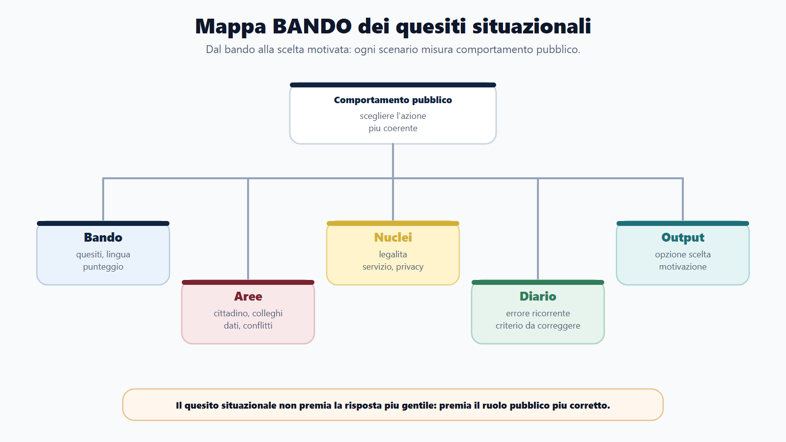
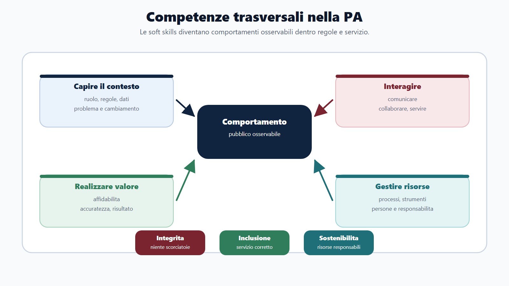
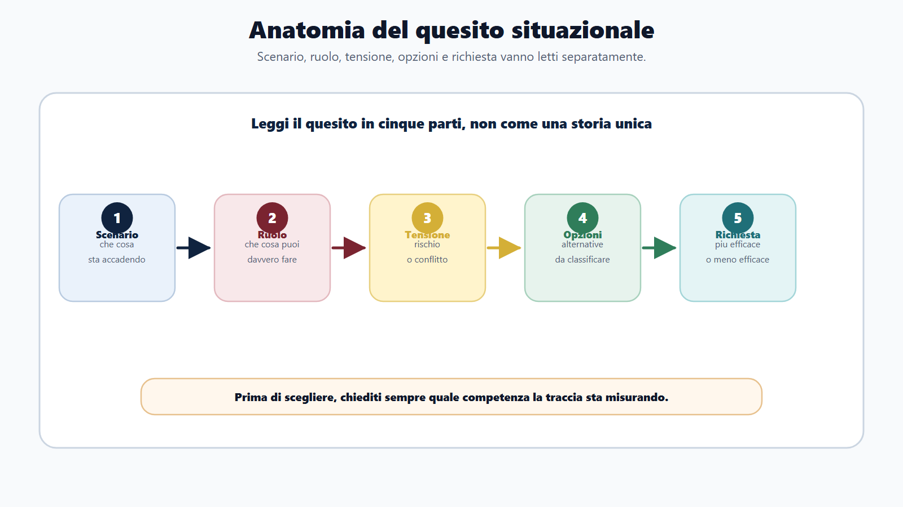
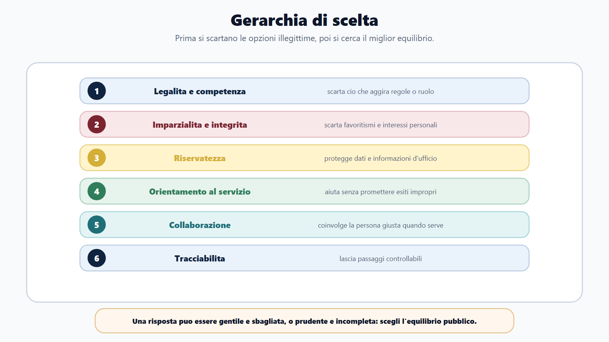
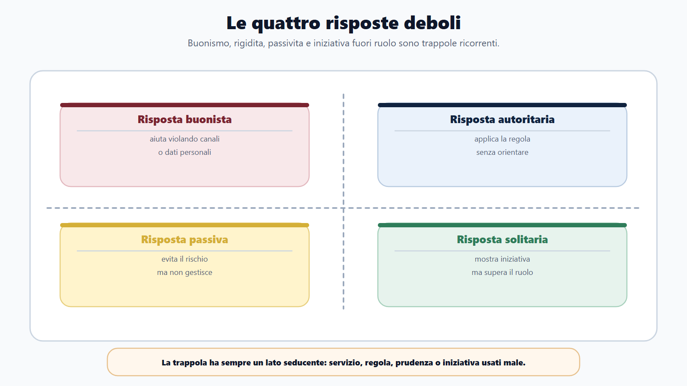
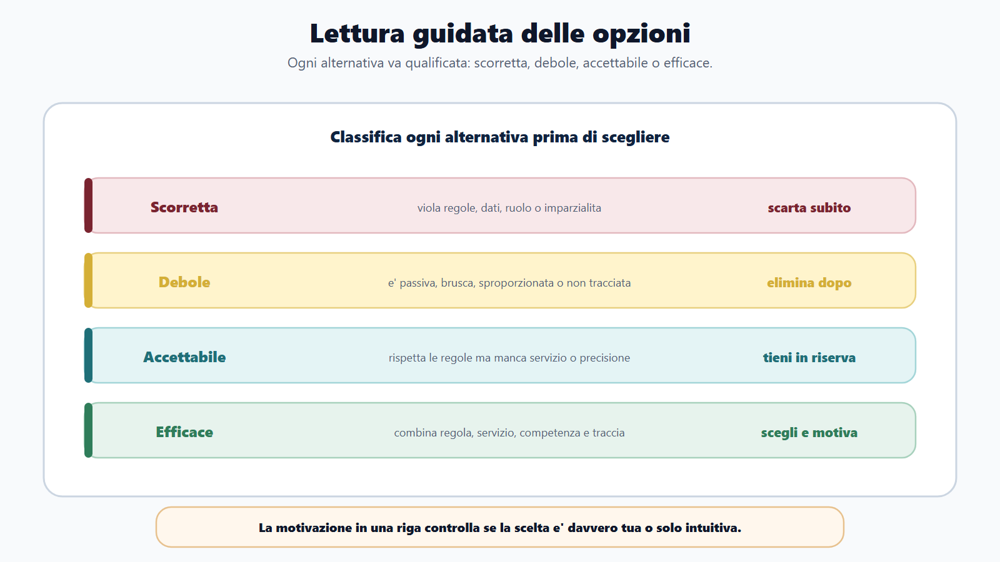
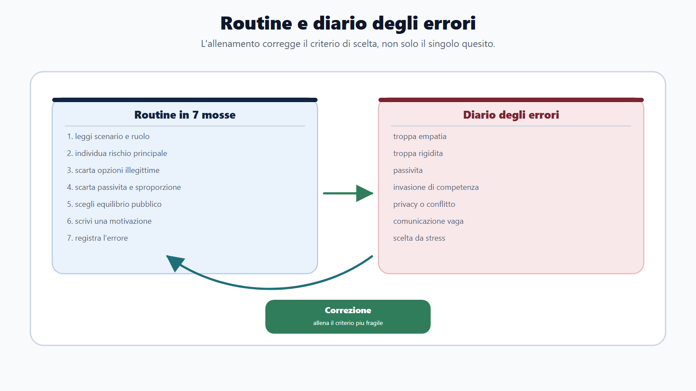

# Capitolo 18 - Quesiti situazionali e soft skills

## Perche non sono domande di buon senso

I quesiti situazionali sembrano facili. Raccontano una scena di lavoro e chiedono quale comportamento sia piu adeguato. Il candidato legge le opzioni e pensa: "Basta scegliere la risposta piu gentile" oppure "basta scegliere la risposta piu rigida". Entrambi gli approcci sono sbagliati.

Nel concorso pubblico, una risposta situazionale non misura simpatia, carattere o moralismo. Misura la capacita di agire dentro una pubblica amministrazione. Questo significa rispettare regole, competenza, imparzialita, riservatezza, collaborazione, servizio al cittadino, tracciabilita e responsabilita.

La risposta piu efficace non e' sempre quella piu veloce. Non e' sempre quella piu accomodante. Non e' sempre quella che "risolve tutto da soli". E' quella piu coerente con il ruolo pubblico.

Esempio: un cittadino chiede informazioni su una pratica intestata a un parente. La risposta empatica potrebbe essere "gliele do, cosi lo aiuto". Ma se quei dati non possono essere comunicati a quella persona, la risposta empatica e' sbagliata. La risposta corretta sara cortese, chiara, utile, ma rispettosa di privacy e canali corretti.

Questo e' il punto del capitolo:

> Nei quesiti situazionali vince il comportamento pubblico, non il buon senso generico.

## Obiettivo del capitolo

Questo capitolo ti insegna a riconoscere la logica dei quesiti situazionali, scegliere l'opzione piu efficace, evitare le trappole e allenare le competenze trasversali richieste nei concorsi.

Alla fine dovrai saper:

- capire quale competenza viene misurata;
- distinguere risposta efficace, neutra e debole;
- applicare una gerarchia di criteri;
- riconoscere opzioni apparentemente buone ma scorrette;
- allenare situazioni su cittadini, colleghi, responsabili, dati, stress e conflitti;
- usare il diario per correggere errori comportamentali.

## Le competenze trasversali nella PA

Le fonti istituzionali piu recenti hanno reso esplicito un passaggio importante: il reclutamento pubblico non riguarda solo conoscenze tecniche, ma anche competenze e comportamenti. Il framework delle competenze trasversali del personale non dirigenziale, approvato nel 2023, organizza queste competenze in quattro grandi aree:

| Area | Traduzione per il candidato |
|---|---|
| Capire il contesto pubblico | Comprendere ruolo, regole, procedura, cambiamento, dati e problemi. |
| Interagire nel contesto pubblico | Comunicare, collaborare, orientarsi al servizio, gestire emozioni. |
| Realizzare il valore pubblico | Essere affidabili, accurati, proattivi e orientati al risultato. |
| Gestire le risorse pubbliche | Usare processi, persone, strumenti e risorse in modo responsabile. |

Il modello richiama anche tre valori trasversali: integrita, inclusione e sostenibilita.

Per il concorso, non devi imparare questa lista come se fosse una poesia. Devi usarla per capire cosa rende una risposta migliore di un'altra.

## Mappa BANDO dei quesiti situazionali

| Fase | Cosa controllare | Prodotto concreto |
|---|---|---|
| **B - Bando** | Sono previsti quesiti situazionali? Quanti? In che lingua? Con quale punteggio? | Scheda prova situazionale. |
| **A - Aree** | Quali contesti: cittadino, collega, responsabile, dati, conflitto, urgenza, servizio? | Mappa scenari. |
| **N - Nuclei** | Legalita, imparzialita, privacy, collaborazione, orientamento al servizio, responsabilita. | Criteri di scelta. |
| **D - Diario** | Che errore commetto? Troppa rigidita, scorciatoia, passivita, violazione privacy, conflitto? | Registro errori situazionali. |
| **O - Output** | Quiz, mini-casi, spiegazioni delle opzioni, simulazioni a tempo. | Punteggio e razionali stabili. |

## Il formato tipico

Un quesito situazionale di solito ha questa struttura:

- scenario breve;
- ruolo del candidato;
- problema o tensione;
- quattro o piu opzioni;
- richiesta: comportamento piu efficace, meno efficace, piu appropriato o piu coerente.

Esempio di scenario:

> Sei assegnato a un ufficio che riceve molte richieste dal pubblico. Un cittadino irritato sostiene di non aver ricevuto risposta e chiede di parlare subito con il responsabile. Tu non hai accesso completo alla pratica.

Le opzioni possono essere:

- liquidarlo dicendo che deve aspettare;
- promettere che il responsabile risolvera entro la giornata;
- ascoltare, verificare cio che puoi verificare, indicare il canale corretto e informare il responsabile se necessario;
- accedere comunque alla pratica anche se non hai autorizzazione.

La risposta migliore e' quella che combina servizio, competenza, prudenza e tracciabilita.

## La gerarchia di scelta

Quando hai dubbi, usa questa gerarchia.

### 1. Legalita e competenza

Prima domanda: l'opzione rispetta regole, ruoli e competenza?

Se un'opzione propone di aggirare una procedura, usare dati senza titolo, promettere un esito o decidere fuori ruolo, di solito e' debole anche se sembra utile.

### 2. Imparzialita e integrita

Seconda domanda: l'opzione tratta persone e interessi in modo imparziale?

Scarta risposte che favoriscono amici, conoscenti, utenti insistenti o colleghi per convenienza personale.

### 3. Riservatezza

Terza domanda: l'opzione protegge dati e informazioni d'ufficio?

Un comportamento molto collaborativo ma indiscreto e' scorretto.

### 4. Orientamento al servizio

Quarta domanda: l'opzione aiuta l'utente o il collega a trovare il percorso corretto?

Legalita non significa freddezza. Una risposta corretta deve essere anche chiara, rispettosa e utile.

### 5. Collaborazione

Quinta domanda: l'opzione coinvolge la persona giusta quando serve?

Risolvere tutto da soli puo essere sbagliato se il problema supera il proprio ruolo. Scaricare tutto su altri puo essere altrettanto sbagliato.

### 6. Tracciabilita e responsabilita

Sesta domanda: l'opzione lascia traccia e consente controllo?

Nel pubblico, molte azioni corrette devono essere documentate: comunicazioni, segnalazioni, istruzioni, passaggi di pratica.

## Le quattro risposte deboli piu frequenti

### 1. La risposta "buonista"

Sembra orientata al cittadino, ma aggira regole o dati.

Esempio: "Gli fornisco subito tutte le informazioni sulla pratica del familiare per evitare disagi."

Problema: non verifica titolo, delega, privacy e canale corretto.

### 2. La risposta autoritaria

Sembra rispettare la regola, ma non offre servizio.

Esempio: "Dico al cittadino che non posso aiutarlo e chiudo la conversazione."

Problema: il dipendente deve almeno orientare verso l'ufficio o la procedura corretta.

### 3. La risposta passiva

Evita il rischio, ma non gestisce il problema.

Esempio: "Aspetto che il responsabile se ne accorga."

Problema: se il dipendente puo segnalare, verificare o instradare, deve farlo.

### 4. La risposta solitaria

Mostra iniziativa, ma supera ruolo o competenza.

Esempio: "Decido personalmente come trattare la pratica anche se non e' mia."

Problema: iniziativa non significa agire fuori perimetro.

## Esempi guidati

### Quesito 1 - Utente irritato

**Scenario.** Un cittadino si presenta allo sportello molto irritato per il ritardo di una pratica. Tu non sei il responsabile, ma puoi consultare alcune informazioni generali.

**Quale comportamento e' piu efficace?**

A. Dire che non dipende da te e chiedergli di tornare un altro giorno.
B. Promettere che la pratica sara conclusa entro domani.
C. Ascoltare la richiesta, verificare le informazioni accessibili, indicare il canale corretto e segnalare il sollecito al responsabile se necessario.
D. Dare al cittadino il numero personale del responsabile per chiudere rapidamente la questione.

**Risposta piu efficace: C.**

Perche: combina ascolto, servizio, competenza e tracciabilita. A e' passiva e non orienta. B promette cio che non dipende da te. D puo violare correttezza organizzativa e canali istituzionali.

### Quesito 2 - Dati di un familiare

**Scenario.** Una persona chiede telefonicamente informazioni su una pratica intestata al fratello. Dice di essere autorizzata, ma non invia documenti.

A. Fornire le informazioni, perche si tratta di un familiare.
B. Rifiutare in modo secco ogni contatto.
C. Spiegare che servono canali e verifiche corrette, indicando come presentare delega o richiesta secondo le regole dell'ente.
D. Chiedere al collega se conosce il fratello per confermare informalmente.

**Risposta piu efficace: C.**

Perche: tutela dati e servizio. Non chiude il rapporto, ma lo porta nel canale corretto. A e D sono rischiose; B e' troppo rigida e non orientata.

### Quesito 3 - Collega in difficolta

**Scenario.** Un collega nuovo commette un errore ricorrente nella protocollazione. Il ritardo inizia a incidere sul lavoro del gruppo.

A. Ignorare il problema per evitare tensioni.
B. Correggere di nascosto tutti i suoi errori.
C. Segnalare subito il collega al dirigente chiedendo una sanzione.
D. Confrontarsi in modo collaborativo, aiutare a individuare la procedura corretta e coinvolgere il responsabile se l'errore continua o ha impatti rilevanti.

**Risposta piu efficace: D.**

Perche: unisce collaborazione, accuratezza e responsabilita. A e' passiva. B nasconde il problema e crea dipendenza. C e' sproporzionata se non prima si chiarisce il fatto e si tenta una correzione organizzativa.

### Quesito 4 - Pressione di un conoscente

**Scenario.** Un conoscente ti chiede di "dare un'occhiata" alla sua pratica per sapere se puo essere velocizzata.

A. Consultare la pratica fuori dai canali normali, tanto e' solo una verifica.
B. Spiegare che non puoi trattare informalmente pratiche di conoscenti e indicare i canali ufficiali.
C. Chiedere a un collega di controllare al posto tuo.
D. Promettere che farai il possibile senza lasciare traccia.

**Risposta piu efficace: B.**

Perche: tutela imparzialita, riservatezza e tracciabilita. Le altre opzioni creano rischio di favoritismo, accesso improprio o opacita.

### Quesito 5 - Errore scoperto in ritardo

**Scenario.** Ti accorgi di aver inviato a un ufficio interno una comunicazione con un dato non necessario. Non sai se sia grave.

A. Non dire nulla, perche probabilmente nessuno se ne accorgera.
B. Cancellare l'email dal tuo computer.
C. Informare il responsabile secondo le procedure interne, descrivendo l'accaduto e collaborando alla correzione.
D. Chiedere al destinatario di far finta di nulla.

**Risposta piu efficace: C.**

Perche: riconosce l'errore, attiva la responsabilita organizzativa e consente valutazione corretta. Le altre opzioni coprono o minimizzano il problema.

### Quesito 6 - Carico di lavoro e scadenza

**Scenario.** Hai troppe pratiche e una scadenza ravvicinata. Un collega ti chiede aiuto su un'attivita non urgente.

A. Accettare comunque, anche se salterai la scadenza.
B. Rifiutare bruscamente.
C. Spiegare la priorita della scadenza, proporre un momento successivo o un supporto limitato, e informare il responsabile se il carico compromette il servizio.
D. Lasciare in sospeso entrambe le attivita per decidere dopo.

**Risposta piu efficace: C.**

Perche: gestisce priorita, collaborazione e responsabilita. A sacrifica un obbligo rilevante. B crea conflitto e non collabora. D e' inefficace.

### Quesito 7 - Regola non chiara

**Scenario.** Un utente chiede una risposta immediata su un requisito. Tu non sei sicuro dell'interpretazione corretta.

A. Dare una risposta a intuito, per non farlo aspettare.
B. Dire che non sai e chiudere la conversazione.
C. Chiarire che serve verifica, consultare fonte o responsabile competente e indicare tempi o canale per una risposta affidabile.
D. Invitare l'utente a cercare online.

**Risposta piu efficace: C.**

Perche: accuratezza e servizio valgono piu della risposta improvvisata. A e' rischiosa; B e D non orientano adeguatamente.

### Quesito 8 - Conflitto tra colleghi

**Scenario.** Due colleghi discutono davanti al pubblico su chi debba gestire una pratica.

A. Prendere posizione davanti agli utenti.
B. Ignorare la scena.
C. Invitare a spostare il confronto fuori dall'area pubblica, mantenere il servizio e chiarire poi competenza o procedura con il responsabile.
D. Dire agli utenti che l'ufficio e' disorganizzato.

**Risposta piu efficace: C.**

Perche: protegge il servizio, l'immagine dell'ente e la gestione organizzativa. A e D peggiorano il conflitto; B non interviene su un disservizio visibile.

## Come allenarsi

L'allenamento sui quesiti situazionali deve essere diverso dal ripasso teorico. Non basta leggere soluzioni. Devi spiegare perche un'opzione e' migliore.

Usa questa routine:

1. leggi lo scenario;
2. individua il ruolo;
3. segnala il rischio principale;
4. elimina opzioni illegittime o scorrette;
5. elimina opzioni passive o sproporzionate;
6. scegli l'opzione piu equilibrata;
7. scrivi una riga di motivazione.

Se non sai motivare la scelta, non hai davvero capito il quesito.

## Diario degli errori situazionali

Classifica ogni errore.

| Errore | Segnale |
|---|---|
| Troppa empatia | Aiuti l'utente violando canali, dati o procedure. |
| Troppa rigidita | Rispetti la regola ma non orienti nessuno. |
| Passivita | Aspetti che altri risolvano anche quando puoi segnalare o instradare. |
| Invasione di competenza | Agisci fuori ruolo per sembrare efficace. |
| Privacy | Comunichi o usi dati senza titolo. |
| Conflitto | Aiuti conoscenti, colleghi o utenti insistenti in modo non imparziale. |
| Comunicazione | Rispondi in modo brusco, vago o non verificato. |
| Stress | Scegli la risposta piu rapida invece della piu corretta. |

Dopo dieci quesiti, guarda la categoria piu frequente. Se sbagli per "troppa empatia", devi allenarti su privacy, imparzialita e canali. Se sbagli per "troppa rigidita", devi allenarti su orientamento al cittadino. Se sbagli per "invasione di competenza", devi ripassare ruoli e responsabilita.

## Mini-drill

Per ognuna delle seguenti situazioni, scrivi il comportamento piu efficace in due righe.

| Situazione | Comportamento |
|---|---|
| Un cittadino chiede una corsia preferenziale perche conosce un assessore. | |
| Un collega ti chiede la password per "fare prima". | |
| Un utente vuole sapere dati di un'altra persona. | |
| Il responsabile non e' presente e arriva una richiesta urgente. | |
| Ti accorgi di un errore in una comunicazione gia inviata. | |

Traccia di correzione:

- nessuna corsia preferenziale: canali ordinari e imparzialita;
- password mai condivisa: sicurezza e responsabilita personale;
- dati di terzi solo con titolo e canale corretto;
- urgenza da gestire secondo procedure e scala di responsabilita;
- errore da segnalare e correggere, non nascondere.

## Domanda da commissario

**Domanda:** Che cosa misurano i quesiti situazionali nei concorsi pubblici?

**Risposta efficace:** misurano la capacita di scegliere comportamenti coerenti con il ruolo pubblico. Non valutano solo gentilezza o carattere, ma competenze trasversali come consapevolezza del contesto, problem solving, comunicazione, collaborazione, orientamento al servizio, affidabilita, accuratezza e integrita. La risposta corretta deve rispettare legalita, imparzialita, privacy, competenza e servizio al cittadino.

## Domanda-trappola

**Domanda:** Nei quesiti situazionali bisogna sempre scegliere l'opzione piu disponibile verso il cittadino?

No. L'orientamento al cittadino e' essenziale, ma non puo violare regole, dati, competenze o imparzialita. La migliore risposta e' quella che aiuta l'utente nel percorso corretto, senza promettere esiti, senza favoritismi e senza scorciatoie informali.

## Da sapere in 5 righe

1. I quesiti situazionali valutano comportamento pubblico, non buon senso generico.
2. La prima selezione elimina opzioni illegittime, non tracciabili o fuori competenza.
3. Una risposta efficace unisce legalita, servizio, collaborazione, riservatezza e proporzionalita.
4. Le trappole piu comuni sono buonismo, rigidita, passivita e iniziativa fuori ruolo.
5. Ogni risposta deve poter essere motivata in una riga.

## Fonti consolidate

- [[sources/framework-competenze-trasversali-pa-dm-28-giugno-2023]]
- [[sources/prove-situazionali-concorsi-ripam-maeci-sna]]
- [[sources/capitolo-17-18-corpus-casi-pratici-quesiti-situazionali-2026-05-30]]
- [[sources/d-p-r-16-aprile-2013-n-62-codice-comportamento-dipendenti-pubblici]]
- [[topics/quesiti-situazionali]]
- [[topics/competenze-trasversali-pa]]
- [[topics/soft-skills-pa]]
- [[topics/etica-pubblica]]
- [[topics/orientamento-al-cittadino]]

## Note di review

- Gli esempi sono originali e non riproducono domande ufficiali.
- Prima della pubblicazione finale verificare eventuali aggiornamenti DFP/SNA sulle competenze trasversali e controllare il bando specifico per numero di quesiti, lingua, soglie e punteggi.
