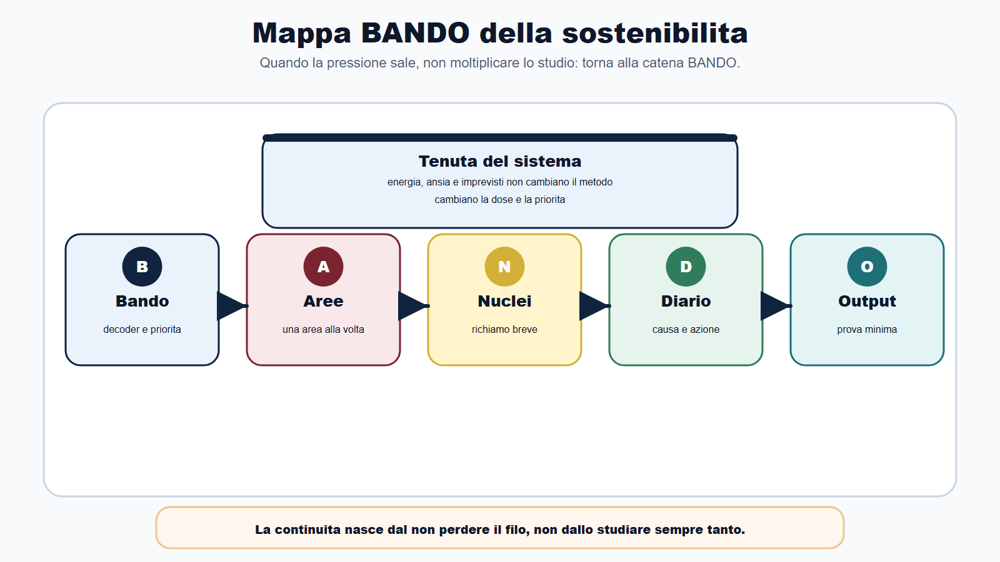
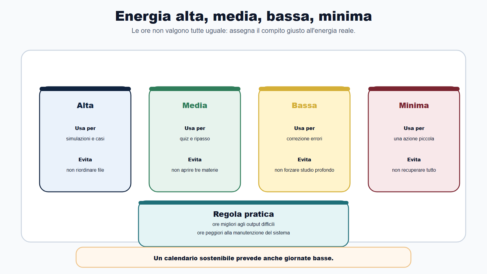
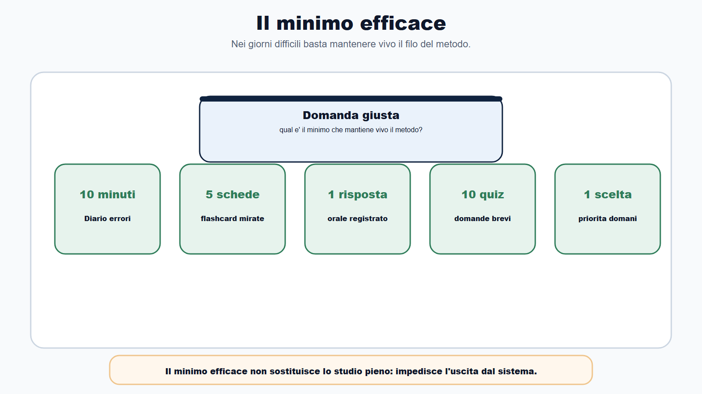
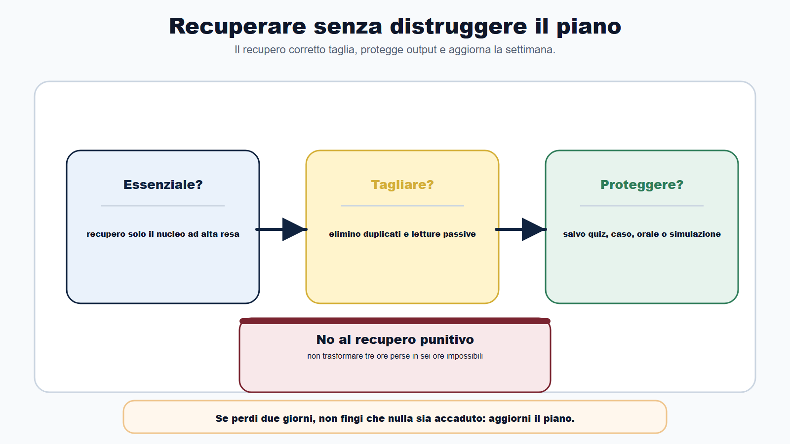
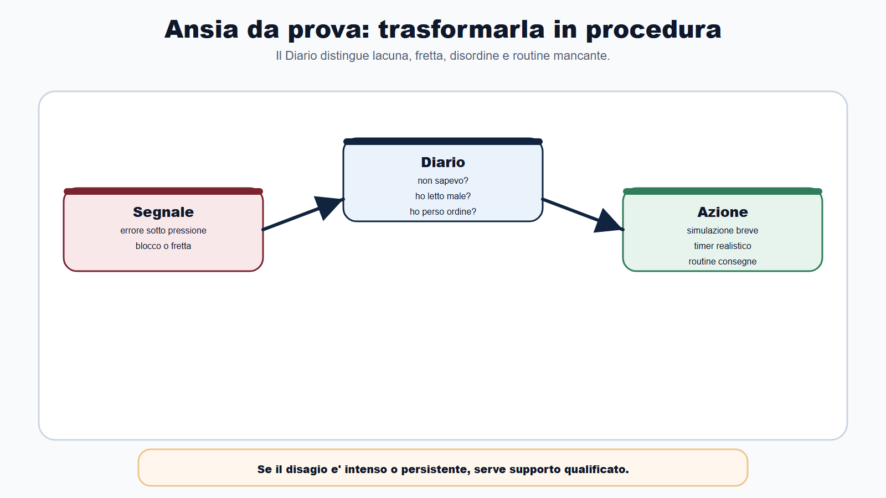
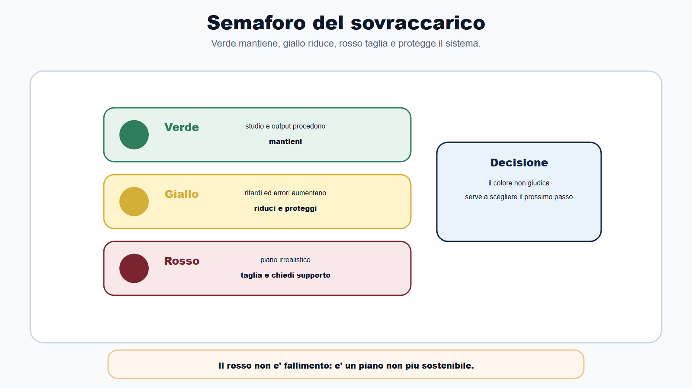
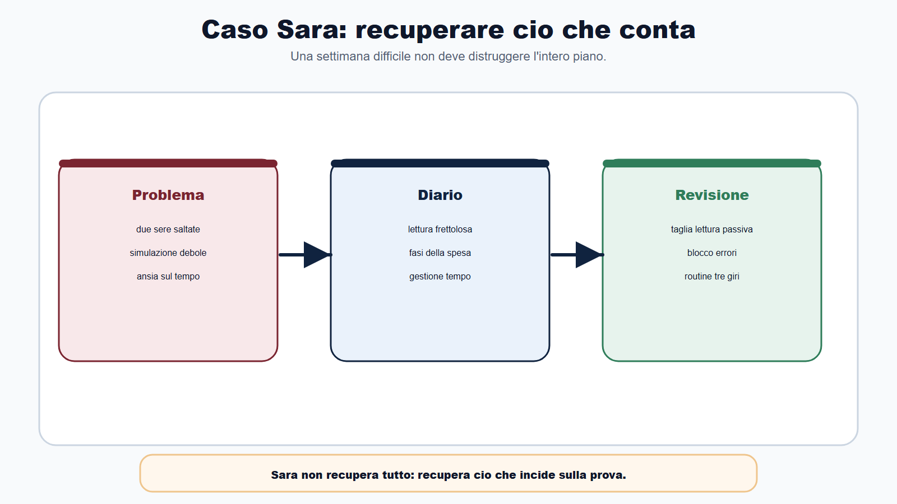

# Capitolo 29 - Reggere la preparazione: energia, ansia e continuita

La preparazione non si rompe quasi mai in un giorno.

Si rompe per accumulo.

Un giorno salti il ripasso. Il giorno dopo provi a recuperare studiando il doppio. Poi arrivi stanco alla simulazione, sbagli domande semplici, perdi fiducia e inizi a cambiare piano. A quel punto non e' piu solo un problema di contenuti. E' un problema di tenuta del sistema.

Il Metodo BANDO funziona se resta praticabile nei giorni reali, non solo nei calendari perfetti.

Questo capitolo serve a una cosa precisa: aiutarti a reggere la preparazione quando energia, ansia, lavoro, famiglia, ritardi e imprevisti iniziano a premere sul piano.

Non troverai frasi motivazionali. Troverai procedure.

## Obiettivo del capitolo

Alla fine del capitolo saprai:

- distinguere piano ideale e piano sostenibile;
- modulare lo studio in base all'energia reale;
- usare il minimo efficace nei giorni difficili;
- recuperare ritardi senza distruggere la settimana successiva;
- leggere l'ansia come segnale operativo;
- proteggere ripassi, simulazioni e Diario degli errori;
- costruire una routine pre-prova;
- capire quando serve alleggerire, tagliare o chiedere supporto.

La regola e' questa:

> la continuita non nasce dallo studiare sempre tanto, ma dal non perdere il filo del metodo.

## Mappa BANDO della sostenibilita

| Fase | Rischio quando sei sotto pressione | Azione di tenuta |
|---|---|---|
| B - Bando | dimenticare priorita, scadenze e prova reale | rileggere una pagina del Decoder |
| A - Aree | saltare tra materie senza criterio | scegliere una sola area prioritaria |
| N - Nuclei | rileggere troppo e ricordare poco | fare richiamo attivo breve |
| D - Diario | accumulare errori senza correggerli | registrare causa e prossima azione |
| O - Output | rimandare quiz, orale e simulazioni | produrre un output minimo |

Quando la pressione sale, non devi moltiplicare lo studio. Devi tornare alla catena BANDO.

## Energia alta, media, bassa, minima

Non tutte le ore valgono allo stesso modo.

Un'ora dopo una giornata ordinata non e' uguale a un'ora dopo lavoro, viaggio, imprevisti e sonno scarso. Il calendario deve prevederlo.

| Energia | Cosa puoi fare | Cosa evitare |
|---|---|---|
| Alta | simulazioni, casi, orale, argomenti nuovi difficili | sprecarla in riordino file |
| Media | quiz, ripasso, schemi, flashcard, domande | aprire tre materie insieme |
| Bassa | correzione errori, rilettura mirata, 10 domande brevi | pretendere studio profondo |
| Minima | controllare piano, salvare fonte, una flashcard, una domanda orale | recuperare tutto |

La preparazione sostenibile usa l'energia alta per gli output difficili e l'energia bassa per mantenere il sistema. Il candidato che usa le ore migliori per copiare appunti e le ore peggiori per simulare si mette da solo in difficolta.

## Il minimo efficace

Nei giorni difficili non devi chiederti: "Come recupero tutto?".

Devi chiederti: "Qual e' il minimo che mantiene vivo il metodo?".

Il minimo efficace puo essere:

- dieci minuti di Diario degli errori;
- cinque flashcard sugli errori ricorrenti;
- una domanda orale registrata;
- dieci quiz mirati;
- una tabella di confronto tra due concetti;
- il controllo di un avviso ufficiale;
- la scelta del blocco prioritario di domani.

Il minimo efficace non sostituisce lo studio pieno. Serve a non uscire dal sistema. Quando torni ad avere tempo, riparti da un filo ancora integro.

## Recuperare senza distruggere il piano

Il recupero sbagliato e' questo:

> "Ho perso tre ore, quindi domani ne faccio sei".

Di solito non funziona. Sposta il problema avanti, aumenta stanchezza e cancella ripassi o simulazioni.

Il recupero corretto usa tre domande:

| Domanda | Decisione possibile |
|---|---|
| Che cosa era davvero essenziale? | recupero solo il nucleo ad alta resa |
| Che cosa posso tagliare o ridurre? | elimino duplicati, letture passive, dettagli a bassa probabilita |
| Quale output devo proteggere? | salvo quiz, caso, orale o simulazione |

Se perdi due giorni, non devi ricostruire il piano come se nulla fosse. Devi aggiornare il piano.

La revisione settimanale serve proprio a questo: non a giudicarti, ma a decidere.

## Ansia da prova: trasformarla in procedura

L'ansia non si gestisce con una frase scritta in alto al quaderno.

Si gestisce rendendo prevedibili alcune azioni.

Nel Metodo BANDO l'ansia entra nel Diario degli errori come categoria operativa. Devi chiederti:

- ho sbagliato perche non sapevo?
- ho sbagliato perche ho letto male?
- ho sbagliato perche ho avuto fretta?
- ho sbagliato perche ho perso ordine?
- ho sbagliato perche non avevo una routine?

Se la causa e' ansia o tenuta, l'azione non e' "studiare tutto di piu". L'azione e':

- simulazione breve;
- timer realistico;
- routine di lettura consegne;
- prova orale progressiva;
- controllo documenti;
- piano degli ultimi 7 giorni;
- ripasso leggero prima della prova.

Se il disagio e' intenso, persistente o interferisce seriamente con vita quotidiana e studio, non trattarlo come semplice problema di calendario: cerca supporto qualificato.

## Routine pre-simulazione

La simulazione non deve iniziare nel caos.

Usa una routine breve:

1. preparo materiali ammessi;
2. imposto tempo realistico;
3. tolgo notifiche e interruzioni;
4. leggo le istruzioni prima delle domande;
5. faccio primo giro sulle domande sicure;
6. segno incerte e difficili;
7. correggo solo dopo la fine;
8. registro tre errori principali nel Diario.

Questa routine serve a separare competenza e disordine. Se sbagli perche non sai, studi. Se sbagli perche ti sei disorganizzato, correggi procedura.

## Routine pre-prova

Negli ultimi giorni il rischio e' voler riaprire tutto.

Di solito e' tardi per ricominciare. E' il momento di proteggere lucidita, documenti, errori ricorrenti e formato prova.

| Quando | Azione |
|---|---|
| -7 giorni | simulazione completa o prova orale strutturata |
| -5 giorni | revisione errori ricorrenti e nuclei ad alta resa |
| -3 giorni | controllo documenti, sede, orari, avvisi |
| -2 giorni | ripasso leggero, domande brevi, routine |
| -1 giorno | materiali, logistica, sonno, niente nuove materie pesanti |
| Giorno prova | lettura istruzioni, gestione tempo, doppio controllo |

Questa tabella non sostituisce il bando. Se l'avviso ufficiale dice altro, segui l'avviso. Ma una routine ti impedisce di arrivare alla prova con troppe decisioni aperte.

## Il semaforo del sovraccarico

Ogni settimana assegna un colore al tuo piano.

| Colore | Segnale | Decisione |
|---|---|---|
| Verde | studio, output e ripassi procedono | mantieni |
| Giallo | ritardi, errori in aumento, simulazioni saltate | riduci e proteggi output |
| Rosso | piano irrealistico, ansia alta, niente correzione | taglia, sospendi moduli, chiedi supporto se serve |

Il semaforo rosso non significa fallimento. Significa che il piano non e' piu sostenibile. Continuare uguale e' spesso la scelta meno razionale.

## Caso guidato

Sara prepara un concorso amministrativo-contabile. Ha costruito un piano da 60 giorni, ma alla quarta settimana accumula ritardo: lavoro intenso, due sere saltate, una simulazione andata male. La prima reazione e' aggiungere ore nel fine settimana e riaprire tutti i capitoli di contabilita.

Applica il Metodo BANDO.

Nel Diario vede che gli errori sono di tre tipi:

- lettura frettolosa nei quiz;
- confusione tra fasi della spesa;
- ansia nella gestione del tempo.

Aggiorna il piano:

- taglia una lettura passiva prevista;
- mantiene la simulazione breve;
- dedica un blocco agli errori di contabilita;
- introduce una routine di tre giri per i quiz;
- lascia domenica pomeriggio come recupero leggero;
- prepara documenti e avvisi in anticipo.

Sara non recupera tutto. Recupera cio che conta. E soprattutto evita che una settimana difficile distrugga l'intero piano.

## Da sapere in 5 righe

1. Un piano sostenibile nasce da ore reali, non da giornate ideali.
2. Nei giorni difficili usa il minimo efficace per non perdere il filo.
3. Il recupero non e' accumulo di ore: e' taglio, priorita e protezione degli output.
4. L'ansia va tradotta in routine, simulazioni progressive e checklist.
5. Se il disagio diventa intenso o persistente, serve supporto qualificato, non solo piu studio.

## Domanda da commissario

**Domanda:** Perche in una preparazione concorsuale e' importante distinguere studio, ripasso, simulazione e recupero?

**Risposta efficace:** perche hanno funzioni diverse. Lo studio introduce o chiarisce i contenuti; il ripasso distribuito mantiene disponibili le conoscenze; la simulazione verifica la prestazione in condizioni simili alla prova; il recupero corregge errori e ritardi senza moltiplicare ore irrealistiche. Se il candidato confonde queste funzioni, puo leggere molto ma allenarsi poco, oppure recuperare ritardi cancellando proprio gli output che servono in prova.

## Domanda-trappola

**Domanda:** Se sono in ritardo, la scelta migliore e' sempre aumentare le ore di studio?

**Risposta:** no. Aumentare ore puo servire solo se resta sostenibile. Spesso la scelta corretta e' tagliare contenuti a bassa resa, proteggere ripassi e simulazioni, correggere gli errori ricorrenti e aggiornare il piano. Un recupero costruito su ore impossibili produce altro ritardo.

## Errore tipico

L'errore tipico e' usare l'ansia come criterio di priorita.

La materia che spaventa di piu non e' automaticamente quella piu importante. Il bando, la prova, gli errori e il tempo disponibile devono guidare la decisione.

Quando senti urgenza, torna a tre domande:

- questa cosa e' nel bando?
- incide sulla prova?
- produce un output verificabile?

Se la risposta e' no, forse non e' priorita. E' rumore.

## Mini-esercizio

Compila questa scheda alla fine della settimana.

| Domanda | Risposta |
|---|---|
| Qual era il mio piano reale? | |
| Quali blocchi ho completato? | |
| Quali output ho prodotto? | |
| Quali errori sono tornati? | |
| Che cosa ha consumato piu energia? | |
| Quale contenuto posso tagliare o ridurre? | |
| Quale simulazione devo proteggere? | |
| Qual e' il minimo efficace per il prossimo giorno difficile? | |
| Il mio semaforo e' verde, giallo o rosso? | |

La scheda non serve a punirti. Serve a decidere il prossimo passo.

## Checklist settimanale di continuita

Prima di chiudere la settimana, verifica:

- ho controllato il bando o gli avvisi se necessario;
- ho prodotto almeno un output;
- ho registrato gli errori principali;
- ho programmato un ripasso;
- ho protetto una simulazione o prova orale;
- ho tagliato almeno un'attivita a bassa resa;
- ho previsto una finestra di recupero;
- ho distinto stanchezza, lacuna e ansia;
- ho preparato la priorita della prossima settimana;
- il piano resta sostenibile su ore reali.

Se mancano piu di quattro voci, non aggiungere materia. Riduci e rimetti ordine.

## Riferimenti consolidati

- [[sources/sostenibilita-preparazione-concorsi-metodo-bando]]
- [[sources/metodo-bando-progetto-editoriale]]
- [[sources/metodo-bando-capitolo-13-bozza-sito-2026-05-30]]
- [[sources/apprendimento-efficace-active-recall-ripasso-distribuito]]
- [[sources/scienze-apprendimento-pianificazione-metacognizione-errori]]
- [[sources/piano-studio-personale-metodo-bando]]
- [[sources/checklist-operative-concorsi-metodo-bando]]
- [[topics/sostenibilita-preparazione-concorsi]]
- [[topics/metodo-di-studio]]
- [[topics/piano-30-60-90-giorni]]
- [[topics/diario-errori]]
- [[topics/checklist-concorsi]]

## Note di review

- La struttura madre originaria non prevedeva il Capitolo 29. Questo capitolo e' un'estensione editoriale: in revisione decidere se mantenerlo numerato o trasformarlo in sezione conclusiva/tool.
- Il capitolo resta nel perimetro del metodo di studio e non offre consulenza medica o psicologica. Conservare la nota sul supporto qualificato nei casi di disagio intenso o persistente.
- In impaginazione valutare una scheda workbook autonoma "Semaforo settimanale della preparazione".
