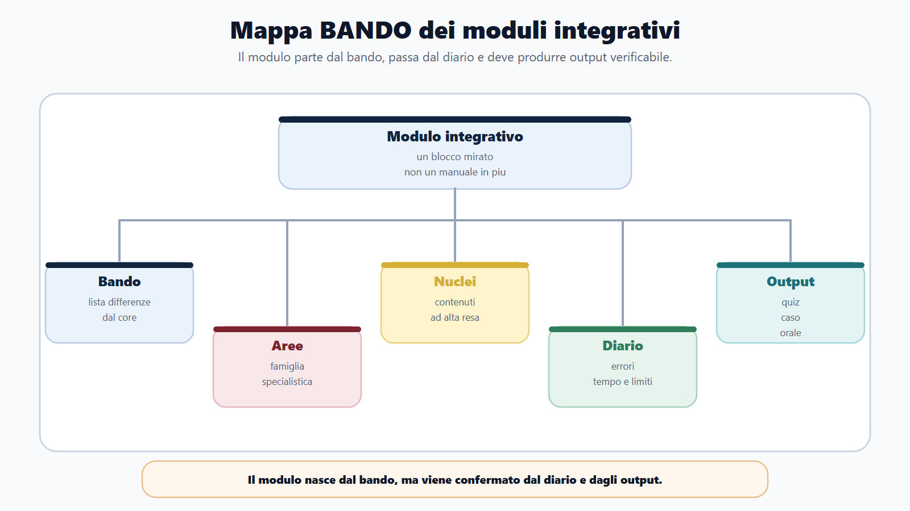
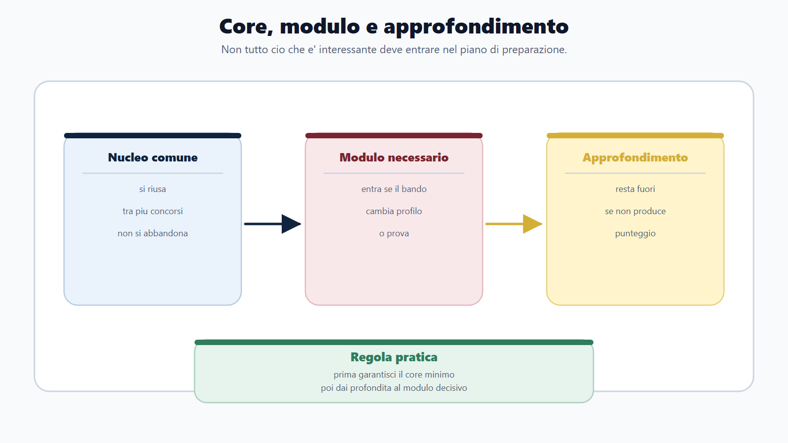
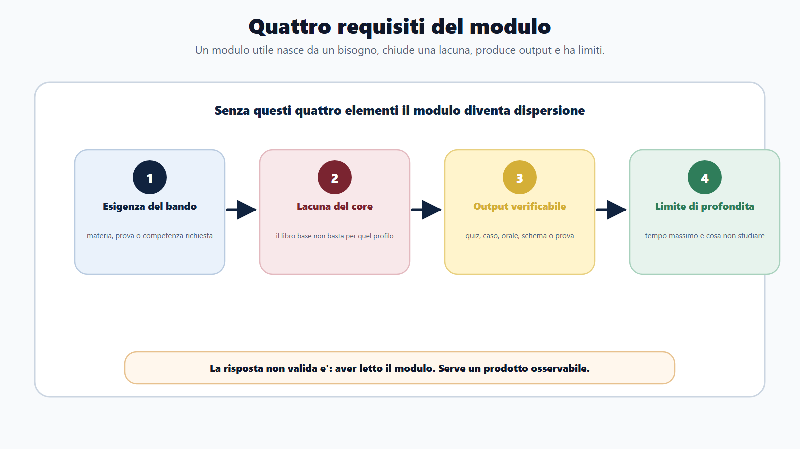
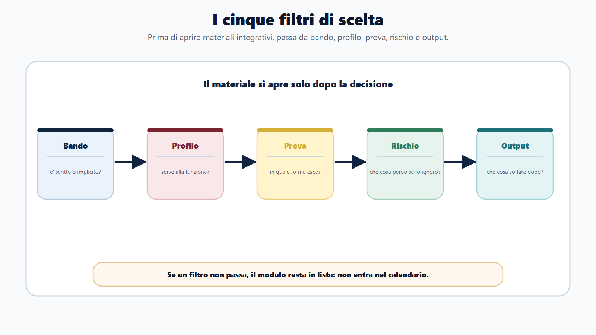
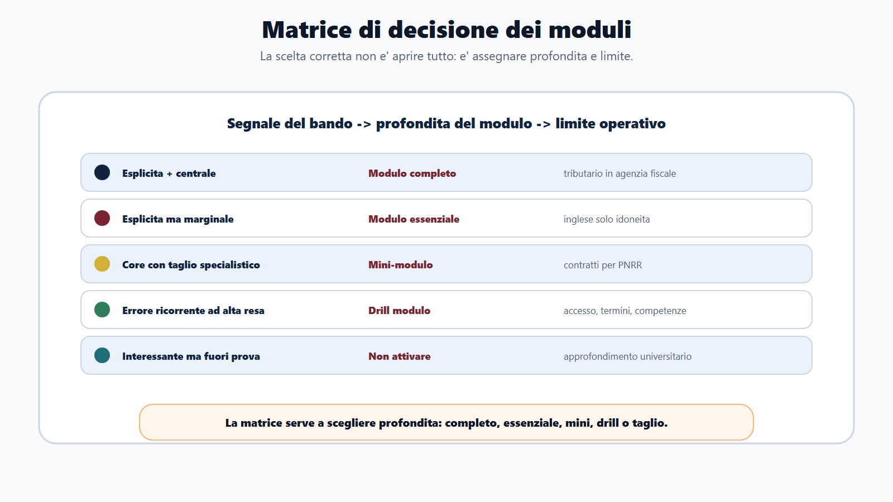
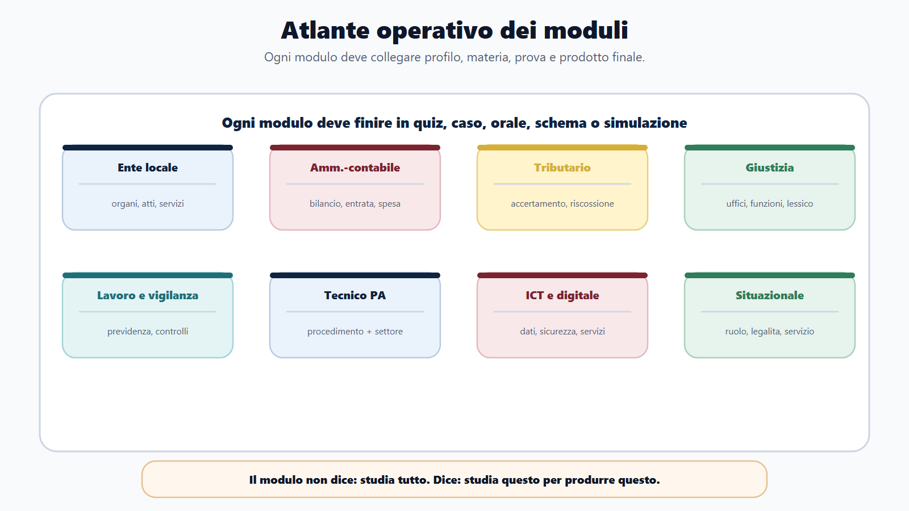
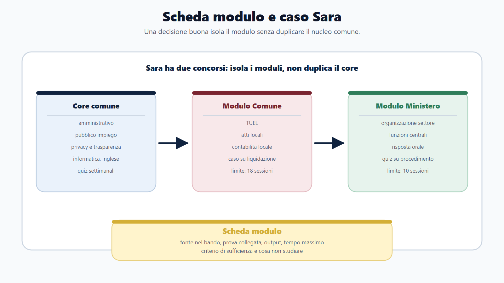

# Capitolo 21 - Come scegliere i moduli integrativi

Nei capitoli precedenti hai costruito due strumenti: la famiglia concorsuale e la mappa profilo. Ora devi prendere una decisione piu concreta:

> Che cosa devo aggiungere al libro base per questo concorso, e che cosa invece devo lasciare fuori?

Questa domanda sembra semplice, ma e' una delle piu importanti. Il candidato che non aggiunge nulla rischia di presentarsi a un concorso specialistico con una preparazione troppo generale. Il candidato che aggiunge tutto rischia di disperdersi, moltiplicare materiali, perdere tempo e arrivare alla prova senza output.

Il modulo integrativo serve proprio a evitare questi due errori. Non e' un manuale in piu da accumulare. E' un blocco mirato che completa il nucleo comune quando il bando lo richiede.

## Obiettivo del capitolo

Alla fine del capitolo devi saper:

- distinguere nucleo comune, modulo profilo e approfondimento non necessario;
- decidere quando attivare un modulo integrativo;
- scegliere il modulo in base a bando, profilo, prova e rischio;
- combinare libro base e modulo senza duplicare lo studio;
- costruire una scheda modulo con obiettivo, contenuti, output e tagli;
- evitare la trappola del "piu materiale = piu preparazione".

Il risultato atteso e' una decisione editoriale e personale: sapere che cosa studiare, con quale profondita, per quale prova e con quale limite.

## Perche il libro base non puo contenere tutto

Un libro base serio deve essere autonomo, ma non puo essere enciclopedico. Se provasse a coprire in profondita ogni profilo, diventerebbe ingestibile: tributario, codice della strada, fondi europei, sanita, scuola, universita, appalti avanzati, ambiente, protezione civile, ordinamento giudiziario, catasto, ICT specialistico, vigilanza lavoro, contabilita locale avanzata.

Il punto del Metodo BANDO e' diverso. Il libro base deve costruire il capitale comune:

- leggere il bando;
- capire le prove;
- studiare le materie trasversali;
- usare mappe profilo;
- allenare quiz, scritto, orale, casi e situazionali;
- usare diario e simulazioni.

Il modulo integrativo entra dopo, quando il bando mostra una differenza reale.

La regola e':

> Il modulo integra il core. Non lo sostituisce.

Se studi solo il modulo, perdi la base comune. Se studi solo il core, sottovaluti il profilo. La preparazione utile nasce dal bilanciamento.

## Che cos'e un modulo integrativo

Un modulo integrativo e' un blocco di preparazione con quattro caratteristiche:

1. nasce da un'esigenza del bando;
2. copre una materia, una prova o una competenza non sviluppata abbastanza nel libro base;
3. ha un output verificabile;
4. ha un limite di profondita.

Senza questi quattro elementi, non e' un modulo. E' dispersione.

Esempi:

| Situazione | Modulo utile | Output |
|---|---|---|
| Comune, istruttore amministrativo-contabile | Ordinamento enti locali + contabilita locale | Schema atto, quiz TUEL, mini-caso |
| Agenzia fiscale, funzionario giuridico-tributario | Tributario di base + accertamento + riscossione | Quiz e risposta sintetica |
| Polizia locale | Codice della strada + sanzioni amministrative + TULPS essenziale | Caso operativo |
| Profilo tecnico con prova amministrativa | Procedimento + contratti + sicurezza + settore tecnico | Caso tecnico-amministrativo |
| Concorso con prova situazionale | Competenze trasversali PA + etica pubblica | Scelta opzione e motivazione |
| Concorso ICT | PA digitale + sicurezza + dati + basi tecniche richieste | Quiz tecnico e spiegazione breve |

Il modulo non deve dire "studia tutto". Deve dire "studia questo, per ottenere questo risultato".

## Mappa BANDO del capitolo

| Passaggio | Domanda | Prodotto |
|---|---|---|
| B - Bando | Quale parte del programma non e' coperta dal core? | Lista differenze |
| A - Aree | A quale famiglia appartiene il modulo? | Area specialistica |
| N - Nuclei | Quali contenuti hanno resa alta? | Nuclei del modulo |
| D - Diario | Gli errori confermano che il modulo serve? | Decisione su tempo e profondita |
| O - Output | Che cosa devo saper produrre? | Quiz, caso, orale, schema, mini-prova |

Il modulo nasce dal bando, ma viene confermato dal diario. Se una materia sembra importante ma non produce errori, casi o domande probabili, va ridotta.

## I cinque filtri di scelta

Prima di comprare, scaricare o aprire materiale integrativo, passa da questi cinque filtri.

### 1. Filtro bando

La domanda e':

> Il bando nomina questa materia, questa competenza o questa prova?

Se la risposta e' no, il modulo non parte. Puo restare in lista, ma non entra nel piano.

Attenzione: il bando puo indicare il modulo in modo esplicito o implicito.

Esplicito:

- "diritto tributario";
- "ordinamento degli enti locali";
- "codice della strada";
- "contabilita pubblica";
- "contratti pubblici";
- "lingua inglese";
- "competenze digitali".

Implicito:

- profilo tecnico in ufficio lavori pubblici;
- istruttore amministrativo-contabile in Comune;
- funzionario in agenzia fiscale;
- ispettore di vigilanza;
- prova pratica su atti o casi.

Il bando resta la fonte principale. Il nome del profilo da solo non basta.

### 2. Filtro profilo

La domanda e':

> Questa materia serve alla funzione concreta del profilo?

Un modulo e' forte quando materia e funzione coincidono. Per esempio, contabilita locale per un istruttore amministrativo-contabile e' piu centrale di un approfondimento astratto sul diritto costituzionale. Tributario per agenzia fiscale e' piu centrale di un ripasso generico di tutte le materie amministrative.

Il profilo dice dove userai la conoscenza.

### 3. Filtro prova

La domanda e':

> In quale forma questa materia puo comparire in prova?

La stessa materia cambia metodo se appare in:

- quiz a risposta multipla;
- risposta aperta;
- caso teorico-pratico;
- prova pratica;
- orale;
- quesito situazionale.

Se il modulo non viene collegato a una forma di prova, resta studio passivo.

Esempio: "contratti pubblici" puo diventare:

- definizioni e principi nei quiz;
- ciclo dell'affidamento in una risposta breve;
- scelta procedurale in un caso;
- esposizione ordinata all'orale;
- rischio, trasparenza e tracciabilita in un quesito situazionale.

### 4. Filtro rischio

La domanda e':

> Se ignoro questo modulo, che cosa rischio?

Il rischio puo essere:

- perdere molte domande;
- non superare una soglia;
- sbagliare il caso pratico;
- non reggere l'orale sul profilo;
- confondere due istituti simili;
- arrivare alla prova senza lessico tecnico.

Il modulo e' prioritario quando il rischio e' alto e il tempo di recupero e' ragionevole.

### 5. Filtro output

La domanda e':

> Dopo questo modulo, che cosa devo saper fare senza guardare il materiale?

Risposte valide:

- risolvere 30 quiz mirati;
- spiegare un procedimento in tre minuti;
- scrivere uno schema di determina;
- distinguere accesso documentale, civico semplice e civico generalizzato;
- impostare un caso di affidamento;
- motivare una risposta situazionale;
- compilare una tabella di bilancio essenziale.

Risposta non valida:

- "aver letto il modulo".

Nel Metodo BANDO il modulo e' riuscito solo se genera output.

## Matrice di decisione

Usa questa tabella prima di attivare un modulo.

| Segnale | Decisione | Esempio |
|---|---|---|
| Materia esplicita nel bando e centrale per il profilo | Attiva modulo completo | Tributario in agenzia fiscale |
| Materia esplicita ma marginale nella prova | Attiva modulo essenziale | Inglese se verifica solo idoneita orale |
| Materia implicita nella funzione, ma non nel programma | Attiva solo se collegata a casi/prova | Organizzazione ufficio tecnico |
| Materia presente nel core ma con taglio specialistico | Integra con mini-modulo | Contratti pubblici per appalti/PNRR |
| Materia interessante ma non collegata a prova | Non attivare | Approfondimenti universitari non richiesti |
| Materia debole nel diario ma poco pesante | Ripasso mirato, non modulo | Dettaglio isolato di costituzionale |
| Errore ricorrente in area ad alta resa | Attiva drill modulo | Accesso, silenzio, termini, competenze |

La matrice impedisce due comportamenti opposti: ignorare il profilo o aprire troppi percorsi.

## Tipi di moduli integrativi

### Modulo ente locale

Serve quando il bando riguarda Comuni, Province, Unioni, Citta metropolitane o funzioni locali. Il candidato deve integrare:

- ordinamento enti locali;
- organi e competenze;
- atti: deliberazione, determinazione, ordinanza;
- procedimento e accesso in contesto locale;
- contabilita e bilancio locale se richiesti;
- servizi al cittadino;
- responsabilita, trasparenza e anticorruzione.

Output tipici:

- spiegare differenza tra Giunta, Consiglio, dirigente/responsabile;
- riconoscere l'atto corretto;
- impostare un mini-caso di ufficio;
- collegare bilancio, PEG, impegno, liquidazione.

### Modulo amministrativo-contabile

Serve quando il profilo combina ufficio amministrativo e gestione economico-finanziaria. Il rischio e' studiare solo diritto amministrativo e arrivare impreparati su entrate, spese, bilancio, residui, controlli e pagamenti.

Output:

- ciclo entrata/spesa;
- differenza tra competenza e cassa;
- lettura di un caso su impegno o liquidazione;
- collegamento tra provvedimento e copertura finanziaria.

### Modulo tributario/fiscale

Serve per agenzie fiscali, uffici tributi, accertamento, riscossione o profili giuridico-tributari. Non va confuso con un generico ripasso di diritto amministrativo.

Output:

- lessico tributario essenziale;
- soggetti, atti, termini, accertamento, riscossione;
- quiz e risposte sintetiche;
- collegamenti con procedimento, accesso, privacy e contenzioso.

### Modulo giustizia

Serve quando il profilo opera in ministero, uffici giudiziari, amministrazione della giustizia o supporto tecnico-amministrativo. Il modulo puo riguardare ordinamento giudiziario, servizi di cancelleria, organizzazione degli uffici, procedure o competenze tecniche indicate dal bando.

Output:

- mappa uffici e funzioni;
- lessico della giustizia;
- risposta orale ordinata;
- quiz su organizzazione e competenze.

### Modulo previdenza, lavoro e vigilanza

Serve per INPS, INAIL, ispettorati, lavoro, previdenza, sicurezza sociale, vigilanza. Il rischio e' usare solo il core amministrativo e sottovalutare la materia di settore.

Output:

- distinzione tra previdenza, assistenza, assicurazione, vigilanza;
- casi su rapporto di lavoro, contributi, infortuni o controlli;
- quiz tecnico-giuridici;
- esposizione orale con esempi.

### Modulo tecnico con prova amministrativa

Serve quando il candidato ha profilo tecnico ma la prova contiene anche diritto amministrativo, contratti, sicurezza, procedimento, digitale o casi di ufficio. Qui il modulo deve collegare tecnica e PA.

Output:

- mini-caso su lavori, servizio, autorizzazione o controllo;
- procedimento e responsabilita;
- lessico tecnico-amministrativo;
- scelta dell'atto o della sequenza.

### Modulo ICT e digitale

Serve quando il profilo e' informatico o quando il bando pesa molto PA digitale, sicurezza, dati, interoperabilita, servizi online, documenti informatici. Non basta sapere usare il computer.

Output:

- spiegare concetti tecnici in linguaggio amministrativo;
- collegare sicurezza, privacy e servizio digitale;
- risolvere quiz tecnici;
- distinguere strumenti, dati, reti, documenti e identita digitale.

### Modulo situazionale e competenze trasversali

Serve quando il bando prevede prove situazionali, assessment, soft skill, competenze trasversali, orientamento al cittadino, collaborazione, problem solving o integrita.

Output:

- scegliere l'opzione piu coerente con ruolo, legalita e servizio;
- motivare la scelta;
- evitare scorciatoie "gentili" ma illegittime;
- riconoscere conflitto, dato personale, urgenza, competenza, escalation.

## Come combinare core e modulo

Non esiste una percentuale valida per tutti, ma una regola pratica si puo usare:

> prima garantisci il core minimo, poi dai profondita al modulo decisivo, infine allena la prova.

In un concorso molto specialistico, il modulo puo occupare molto spazio. In un concorso amministrativo generale, il modulo puo essere breve. In un concorso con orale forte, il modulo deve diventare esposizione. In un concorso a quiz, deve diventare batteria e correzione.

### Schema di combinazione

| Fase | Core | Modulo | Prova |
|---|---|---|---|
| Avvio | Decodifica bando e nucleo comune | Identifica il modulo | Capisci formato |
| Studio | Materie trasversali | Nuclei specialistici | Quiz/casi/orale brevi |
| Consolidamento | Ripasso e collegamenti | Errori e lacune | Simulazioni |
| Rifinitura | Schemi finali | Solo punti deboli | Prova completa |

La sequenza evita di studiare il modulo in isolamento.

## Esempio 1 - Istruttore amministrativo-contabile in Comune

Il bando richiede diritto amministrativo, ordinamento enti locali, contabilita pubblica, trasparenza, anticorruzione, privacy, informatica e inglese.

Core:

- procedimento;
- provvedimento;
- accesso;
- pubblico impiego;
- trasparenza;
- informatica e inglese di base;
- metodo quiz/orale.

Modulo:

- TUEL essenziale;
- organi del Comune;
- atti locali;
- contabilita locale;
- ciclo entrata/spesa;
- controlli e responsabilita.

Output:

- spiegare una determinazione;
- risolvere quiz su organi e competenze;
- impostare un caso su accesso o liquidazione;
- esporre il ciclo della spesa.

Da non eccedere:

- manuali universitari di scienza delle finanze;
- contenzioso contabile avanzato se non richiesto;
- dettagli non collegati al profilo.

## Esempio 2 - Ministero o funzioni centrali

Il bando riguarda un profilo amministrativo in amministrazione centrale.

Core:

- diritto costituzionale;
- diritto amministrativo;
- pubblico impiego;
- procedimento;
- trasparenza e privacy;
- digitale;
- prove concorsuali.

Modulo:

- organizzazione del ministero se indicata;
- funzioni del settore;
- competenze trasversali;
- eventuale normativa speciale;
- inglese e informatica se pesano nella prova.

Output:

- risposta ordinata su funzioni e struttura;
- quiz su fonti, atti, procedimento;
- orale con collegamenti tra amministrazione e servizio pubblico.

Da non eccedere:

- storia istituzionale non richiesta;
- normativa di settore troppo profonda;
- lettura passiva di siti senza scheda.

## Esempio 3 - Agenzia fiscale

Il profilo e' giuridico-tributario. Qui il modulo non e' accessorio: e' centrale.

Core:

- amministrativo;
- pubblico impiego;
- trasparenza e privacy;
- digitale;
- metodo quiz e orale.

Modulo:

- diritto tributario;
- accertamento;
- riscossione;
- sanzioni tributarie se previste;
- procedura e atti dell'amministrazione finanziaria;
- lessico tecnico.

Output:

- quiz mirati;
- confronto tra istituti;
- risposta breve;
- orale con esempi di procedimento.

Da non eccedere:

- dottrina avanzata se la prova e' a quiz;
- dettagli processuali non richiesti;
- studio senza domande.

## Esempio 4 - Profilo tecnico con prova amministrativa

Il candidato tecnico spesso commette un errore: prepara solo la materia tecnica o solo la parte amministrativa. Deve invece unire le due.

Core:

- procedimento;
- atti;
- contratti pubblici essenziali;
- sicurezza e responsabilita se richieste;
- trasparenza;
- digitale.

Modulo:

- settore tecnico specifico;
- normativa di settore;
- casi pratici;
- documenti, autorizzazioni, controlli, lavori o servizi.

Output:

- caso tecnico-amministrativo;
- scelta dell'atto;
- sequenza procedurale;
- spiegazione all'orale.

Da non eccedere:

- manuali tecnici universitari non collegati al bando;
- calcoli o norme settoriali non richieste;
- glossari senza casi.

## Scheda modulo integrativo

Compila questa scheda per ogni modulo che vuoi attivare.

| Campo | Risposta |
|---|---|
| Concorso/profilo | |
| Fonte nel bando | |
| Materia o competenza | |
| Perche serve | |
| Prova collegata | Quiz / scritto / caso / orale / pratica / situazionale |
| Nuclei da studiare | |
| Materiali ammessi | |
| Output da produrre | |
| Tempo massimo | |
| Criterio di sufficienza | |
| Cosa non studiare | |
| Errori da monitorare | |
| Data di revisione | |

Il campo "tempo massimo" e' importante. Un modulo senza limite tende ad allargarsi.

## Da sapere in 5 righe

1. Il modulo integrativo serve solo se bando, profilo o prova lo giustificano.
2. Il core non va abbandonato: il modulo lo completa.
3. Ogni modulo deve avere un output: quiz, caso, orale, schema o simulazione.
4. Un modulo senza limite di profondita diventa dispersione.
5. Il diario decide se aumentare, ridurre o chiudere il modulo.

## Caso guidato

Sara prepara due concorsi: un Comune per istruttore amministrativo-contabile e un ministero per assistente amministrativo. Ha 60 giorni.

Se apre due percorsi separati, studiera tutto due volte. Se usa il Metodo BANDO, costruisce:

- core comune: amministrativo, pubblico impiego, trasparenza, privacy, informatica, inglese, quiz;
- modulo Comune: TUEL, atti locali, contabilita locale;
- modulo ministero: organizzazione del settore e funzioni centrali richieste dal bando;
- output: quiz settimanali, un caso locale, una risposta orale per il ministero.

La decisione non e' "quale concorso scelgo?". La decisione e':

> quale parte posso riutilizzare e quale parte devo isolare?

## Domanda da commissario

**Perche non e' corretto preparare ogni concorso come se fosse completamente nuovo?**

Risposta attesa: perche molti concorsi condividono un nucleo comune di materie e competenze. Il candidato deve riutilizzare quel capitale e aggiungere moduli mirati solo per le differenze rilevanti del bando e del profilo.

## Domanda-trappola

**Se il modulo e' specialistico, posso saltare il nucleo comune?**

No. Nei concorsi pubblici il modulo specialistico di solito vive dentro un contesto amministrativo: procedimento, responsabilita, trasparenza, pubblico impiego, digitale, prove. Saltare il core rende fragile anche il modulo.

## Mini-esercizio

Prendi un bando reale o simulato e compila questa griglia.

| Domanda | Risposta |
|---|---|
| Qual e' il nucleo comune? | |
| Qual e' il modulo principale? | |
| Qual e' il modulo secondario? | |
| Quale modulo posso ignorare? | |
| Quale prova verifica il modulo? | |
| Quale output produrro entro 7 giorni? | |
| Che cosa non studiero oltre il bando? | |

Se non riesci a scrivere l'output, il modulo non e' ancora definito.

## Errori tipici

- Attivare un modulo per ansia, non per bando.
- Studiare il modulo come materia isolata.
- Comprare troppi materiali e non chiuderne nessuno.
- Non fissare un limite di profondita.
- Confondere "materia presente" con "materia decisiva".
- Trascurare la prova: quiz, caso e orale richiedono moduli diversi.
- Non usare il diario per decidere se continuare o tagliare.

## Riferimenti consolidati

- [[sources/capitolo-19-20-corpus-profili-concorsuali-2026-05-30]]
- [[sources/bandi-rappresentativi-profili-concorsuali-inpa-agenzie-enti-2025-2026]]
- [[sources/formazione-competenze-pa-syllabus-direttiva-2025]]
- [[sources/capitoli-21-23-corpus-moduli-piano-diario-2026-06-01]]
- [[topics/moduli-integrativi]]
- [[topics/moduli-profilo]]

## Note di review

- Prima della pubblicazione finale verificare eventuali aggiornamenti dei bandi rappresentativi usati come esempi.
- I moduli specialistici completi restano materiali integrativi separati; questo capitolo insegna il criterio di scelta.
