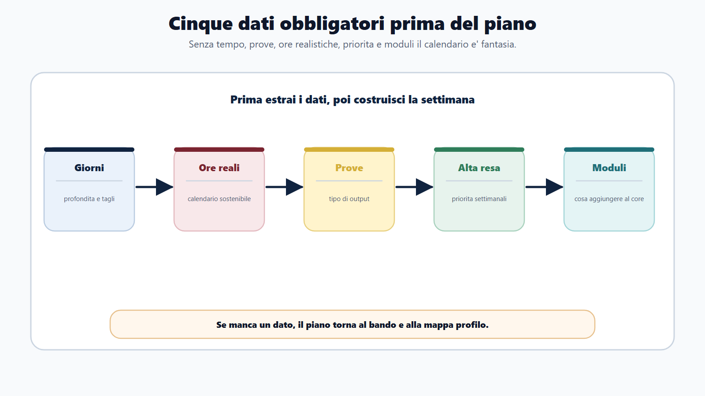
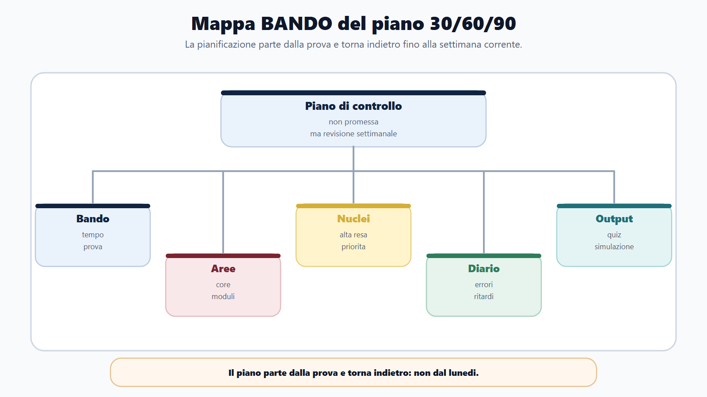
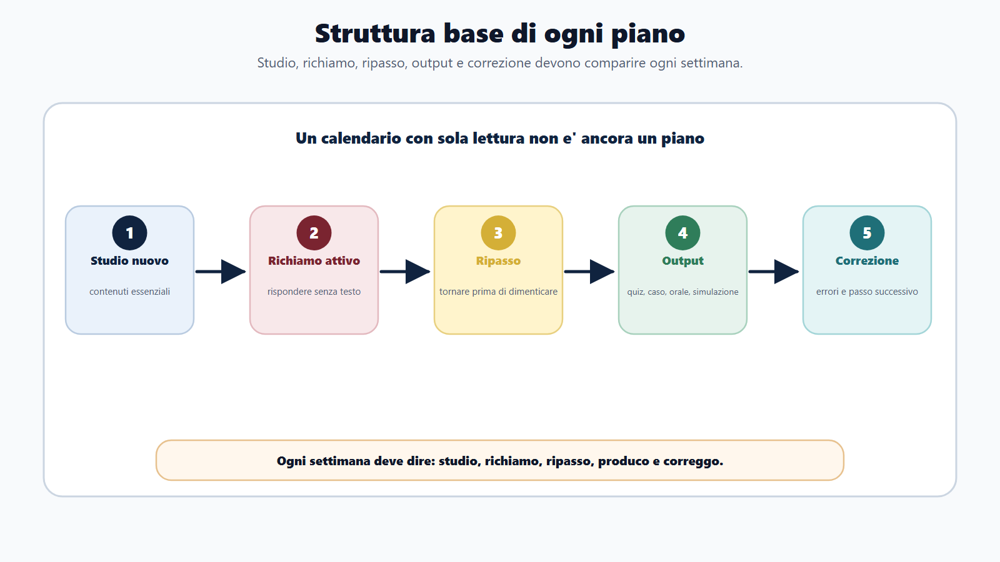
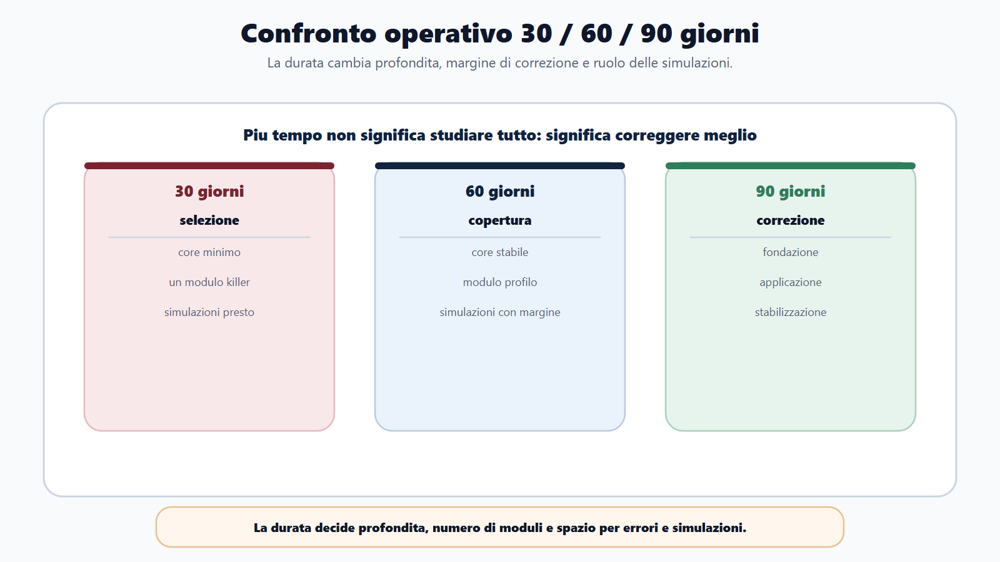
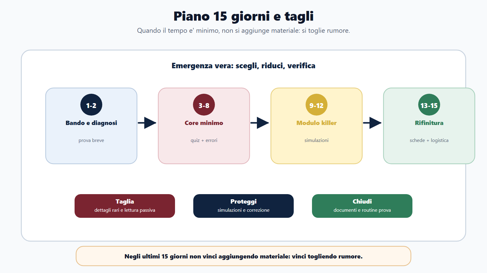
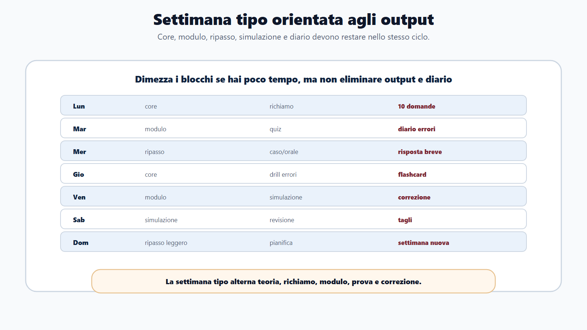
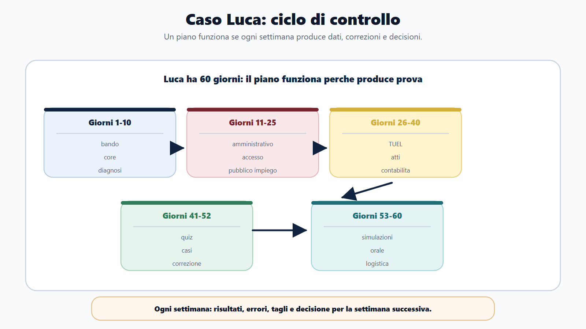

# Capitolo 22 - Piano 30/60/90 giorni

Un piano di studio non serve a riempire caselle. Serve a prendere decisioni quando il tempo è meno del programma.

Molti candidati costruiscono calendari irrealistici: dieci materie al giorno, pagine da leggere senza output, recuperi infiniti, ripassi rimandati all'ultima settimana. Il risultato è prevedibile: il piano si rompe, il candidato si sente in ritardo e prova a compensare aggiungendo ore, manuali e ansia.

Il Metodo BANDO usa il calendario in modo diverso. Il piano non è una promessa. È un sistema di controllo.

> Ogni settimana deve dire che cosa studi, che cosa richiami, che cosa produci e che cosa correggi.

## Obiettivo del capitolo

Alla fine del capitolo devi saper costruire:

- un piano da 30 giorni per preparazione breve;
- un piano da 60 giorni per preparazione intermedia;
- un piano da 90 giorni per preparazione solida;
- un piano di emergenza da 15 giorni;
- una settimana tipo con core, modulo, prova, ripasso e diario;
- criteri di taglio quando il tempo non basta.

Il piano non deve essere bello da vedere. Deve funzionare quando arriva il ritardo.

## Prima di pianificare: cinque dati obbligatori

Non puoi costruire un piano se non conosci questi dati:

| Dato | perché serve |
|---|---|
| Giorni disponibili | Determina profondità e tagli |
| Ore realistiche settimanali | Evita piani impossibili |
| Prove previste | Decide il tipo di output |
| Materie ad alta resa | Decide priorità |
| Moduli integrativi | Decide cosa aggiungere al core |

Se manca uno di questi dati, torna al bando e alla mappa profilo.

## Mappa BANDO del piano

| Fase | Domanda | Azione |
|---|---|---|
| B - Bando | Quanto tempo ho e che prova devo sostenere? | Scheda concorso |
| A - Aree | Quali blocchi devo coprire? | Mappa core + moduli |
| N - Nuclei | Quali argomenti hanno resa più alta? | priorità settimanali |
| D - Diario | Dove sto sbagliando o rallentando? | Correzione del piano |
| O - Output | Che cosa devo produrre ogni settimana? | Quiz, caso, orale, simulazione |

La pianificazione BANDO non parte dal lunedi. Parte dalla prova e torna indietro.

## La struttura base di ogni piano

Ogni piano, breve o lungo, deve contenere cinque tipi di blocchi.

| Blocco | Funzione |
|---|---|
| Studio nuovo | Acquisire contenuti essenziali |
| Richiamo attivo | Rispondere senza guardare il testo |
| Ripasso distribuito | Tornare prima di dimenticare |
| Output di prova | Quiz, scritto, caso, orale, simulazione |
| Correzione | Classificare errori e decidere il passo successivo |

Se un calendario contiene solo "leggere capitolo X", non è ancora un piano.

## Piano 30 giorni: emergenza ordinata

Il piano da 30 giorni serve quando la prova è vicina. Non permette perfezione. Permette selezione.

La domanda guida è:

> Che cosa devo sapere e saper fare per non arrivare disarmato alla prova?

### Settimana 1 - Bando, core minimo, prova

Obiettivi:

- leggere bando e allegati;
- compilare scheda concorso;
- identificare materie ad alta resa;
- scegliere un solo modulo principale;
- fare una prima mini-simulazione diagnostica.

Output:

- scheda concorso;
- mappa core + modulo;
- lista dei 20 nuclei prioritari;
- diario dei primi errori.

### Settimana 2 - Copertura dei nuclei

Obiettivi:

- studiare nuclei essenziali;
- trasformare ogni nucleo in domande;
- iniziare quiz o risposte brevi;
- costruire flashcard solo dagli errori.

Output:

- 3 blocchi quiz o 3 risposte brevi;
- 20 flashcard;
- tabella errori per categoria.

### Settimana 3 - Modulo e prova reale

Obiettivi:

- concentrarsi sul modulo decisivo;
- collegare modulo e core;
- simulare nel formato reale;
- correggere tempi e strategia.

Output:

- una simulazione completa o due mezze simulazioni;
- un caso o orale mirato se previsto;
- lista tagli finali.

### Settimana 4 - Rifinitura e stabilizzazione

Obiettivi:

- ripassare errori;
- chiudere nuclei deboli ad alta resa;
- fare simulazioni;
- preparare documenti e logistica.

Output:

- due simulazioni;
- schede finali;
- diario errori ripulito;
- piano ultime 48 ore.

### Cosa tagliare nel piano 30 giorni

Taglia:

- dettagli specialistici non richiesti;
- manuali doppi sulla stessa materia;
- lettura senza quiz;
- schemi decorativi;
- argomenti rari se il core non è stabile.

Non tagliare:

- bando;
- soglie e regole della prova;
- nucleo comune;
- modulo killer;
- simulazioni;
- correzione errori.

## Piano 60 giorni: copertura e consolidamento

Il piano da 60 giorni è il più comune. Permette di coprire il nucleo comune, inserire il modulo e fare simulazioni con margine di correzione.

### Fase 1 - Giorni 1-10: impostazione

Prodotti:

- scheda bando;
- mappa profilo;
- scelta moduli;
- calendario settimanale;
- prova diagnostica.

Domanda:

> Quali materie producono più punti o più rischio?

### Fase 2 - Giorni 11-30: core

Prodotti:

- diritto amministrativo essenziale;
- pubblico impiego;
- trasparenza, anticorruzione e privacy;
- informatica/inglese se previsti;
- quiz o domande su ogni blocco.

Metodo:

- studio breve;
- richiamo attivo;
- quiz;
- diario errori;
- ripasso dopo 2-3 giorni.

### Fase 3 - Giorni 31-45: modulo profilo

Prodotti:

- modulo integrativo principale;
- collegamenti con core;
- casi o quiz specialistici;
- orale su profilo.

Qui il candidato deve evitare un errore: studiare il modulo come se fosse separato. Ogni modulo deve rientrare nel sistema.

### Fase 4 - Giorni 46-55: simulazioni

Prodotti:

- simulazioni complete;
- correzione ragionata;
- lista errori ricorrenti;
- tagli finali.

La simulazione non serve solo a misurare punteggio. Serve a scoprire:

- dove perdi tempo;
- quali domande leggi male;
- quali concetti confondi;
- quale materia crolla sotto pressione.

### Fase 5 - Giorni 56-60: rifinitura

Prodotti:

- ripasso errori;
- schede finali;
- documenti;
- routine prova;
- piano ultimo giorno.

Negli ultimi cinque giorni non si apre un nuovo manuale. Si chiude.

## Piano 90 giorni: preparazione solida

Il piano da 90 giorni consente di studiare meglio, non di studiare tutto. La differenza è importante.

### Mese 1 - Fondazione

Obiettivi:

- decodifica bando;
- nucleo comune;
- metodo di studio;
- prime prove a bassa intensità;
- diario errori.

Output settimanali:

- 2 blocchi quiz;
- 1 risposta orale breve;
- 1 schema operativo;
- 1 revisione del diario.

### Mese 2 - Moduli e applicazione

Obiettivi:

- modulo principale;
- modulo secondario se serve;
- casi pratici o prove scritte;
- inglese/informatica se previsti;
- simulazioni parziali.

Output settimanali:

- 1 simulazione parziale;
- 1 caso o risposta;
- 1 orale;
- correzione errori e flashcard.

### Mese 3 - Prova e stabilizzazione

Obiettivi:

- simulazioni complete;
- ripasso distribuito;
- riduzione errori;
- gestione tempo;
- rifinitura orale e documenti.

Output settimanali:

- 1-2 simulazioni complete;
- correzione profonda;
- scheda tagli;
- piano ultimi 7 giorni.

Il vantaggio dei 90 giorni è la correzione. Hai tempo per sbagliare, classificare e migliorare.

## Piano 15 giorni: emergenza vera

Se restano 15 giorni, non devi recuperare tutto. Devi scegliere.

### Giorni 1-2

- bando;
- scheda prova;
- materie ad alta resa;
- modulo killer;
- simulazione diagnostica breve.

### Giorni 3-8

- core minimo;
- quiz o domande mirate;
- flashcard dagli errori;
- ripasso ogni 48 ore.

### Giorni 9-12

- modulo principale;
- simulazioni;
- correzione tempi;
- orale breve se previsto.

### Giorni 13-15

- errori ricorrenti;
- schede finali;
- documenti;
- sonno, logistica, routine.

Regola:

> Negli ultimi 15 giorni non vinci aggiungendo materiale. Vinci togliendo rumore.

## Settimana tipo

Adatta questa settimana a 30, 60 o 90 giorni.

| Giorno | Blocco 1 | Blocco 2 | Output |
|---|---|---|---|
| Lunedi | Studio core | Richiamo attivo | 10 domande |
| Martedi | Modulo | Quiz mirato | Diario errori |
| Mercoledi | Ripasso core | Caso/orale | Risposta breve |
| Giovedi | Studio core | Drill errori | Flashcard |
| Venerdi | Modulo | Simulazione parziale | Correzione |
| Sabato | Simulazione | Revisione | Tagli e priorità |
| Domenica | Ripasso leggero | Pianificazione | Settimana nuova |

Se lavori o hai poco tempo, dimezza i blocchi, non eliminare output e diario.

## Esempio - Profilo amministrativo generale

priorità:

1. bando e prova;
2. amministrativo;
3. pubblico impiego;
4. trasparenza/privacy/anticorruzione;
5. informatica e inglese se previsti;
6. quiz e orale.

Modulo:

- settore dell'ente solo se il bando lo richiede.

Output:

- quiz su procedimento, accesso, pubblico impiego;
- orale di 3 minuti su provvedimento;
- schema su trasparenza e privacy;
- simulazione settimanale.

## Esempio - Ente locale

priorità:

1. core amministrativo;
2. TUEL e organi;
3. atti locali;
4. contabilità locale se richiesta;
5. servizi al cittadino;
6. casi pratici.

Output:

- differenza tra delibera e determina;
- caso su accesso agli atti;
- quiz su organi e competenze;
- schema ciclo spesa.

## Esempio - Ministero/funzioni centrali

priorità:

1. costituzionale e amministrativo;
2. pubblico impiego;
3. organizzazione amministrativa;
4. settore ministeriale se richiesto;
5. inglese/informatica;
6. orale ordinato.

Output:

- risposta su fonti e PA;
- quiz su procedimento;
- esposizione su organizzazione;
- simulazione orale.

## Calendario compilabile

| Settimana | Core | Modulo | Prova | Ripasso | Simulazione | Decisione |
|---|---|---|---|---|---|---|
| 1 | | | | | | |
| 2 | | | | | | |
| 3 | | | | | | |
| 4 | | | | | | |
| 5 | | | | | | |
| 6 | | | | | | |
| 7 | | | | | | |
| 8 | | | | | | |
| 9 | | | | | | |
| 10 | | | | | | |
| 11 | | | | | | |
| 12 | | | | | | |

La colonna "Decisione" è obbligatoria. Ogni settimana devi decidere se continuare, tagliare, spostare tempo o cambiare metodo.

## Da sapere in 5 righe

1. Il piano parte dalla prova e torna indietro.
2. Ogni settimana deve produrre output, non solo lettura.
3. Il ripasso va distribuito, non lasciato all'ultima settimana.
4. Il diario corregge il piano con dati reali.
5. Se il tempo è poco, taglia contenuti a bassa resa, non simulazioni e correzione.

## Caso guidato

Luca ha 60 giorni per un concorso in Comune. Ha studiato amministrativo, ma è debole su enti locali e contabilità.

Piano corretto:

- primi 10 giorni: bando, core e prova diagnostica;
- giorni 11-25: amministrativo, accesso, pubblico impiego, trasparenza;
- giorni 26-40: TUEL, organi, atti, contabilità locale essenziale;
- giorni 41-52: quiz e casi;
- giorni 53-60: simulazioni, errori, orale e logistica.

Piano sbagliato:

- 30 giorni di lettura amministrativo;
- 20 giorni di TUEL;
- 10 giorni finali per tutto il resto.

Il secondo piano sembra ordinato, ma non produce prova.

## Domanda da commissario

**perché un piano di studio deve contenere simulazioni anche prima della fine del programma?**

perché la simulazione mostra se lo studio diventa output. Aspettare di "finire tutto" significa scoprire troppo tardi errori di tempo, lettura, memoria, strategia e formato.

## Domanda-trappola

**Se sono in ritardo, devo eliminare quiz e simulazioni per leggere più teoria?**

No. In ritardo devi ridurre teoria a bassa resa e aumentare verifica mirata. Senza quiz, casi o orale non sai cosa stai davvero imparando.

## Mini-esercizio

Scegli un concorso e compila:

| Campo | Risposta |
|---|---|
| Giorni disponibili | |
| Ore realistiche a settimana | |
| Prova principale | |
| Materie core | |
| Modulo principale | |
| Output settimanale minimo | |
| Giorno simulazione | |
| Giorno revisione diario | |
| Cosa taglio se resto indietro | |

Se non sai cosa tagliare, non hai ancora un piano. Hai solo una lista.

## Errori tipici

- Pianificare su ore ideali, non reali.
- Non lasciare giorni di recupero.
- Tenere il ripasso alla fine.
- Fare simulazioni senza correzione.
- Studiare il modulo prima del core minimo.
- Cambiare materiali ogni settimana.
- Non decidere cosa tagliare.
- Confondere "giorno occupato" con "giorno produttivo".

## Riferimenti consolidati

- [[sources/prove-concorsuali-quiz-scritto-orale-dpr-487-1994]]
- [[sources/apprendimento-efficace-active-recall-ripasso-distribuito]]
- [[sources/scienze-apprendimento-pianificazione-metacognizione-errori]]
- [[sources/formazione-competenze-pa-syllabus-direttiva-2025]]
- [[sources/capitoli-21-23-corpus-moduli-piano-diario-2026-06-01]]
- [[topics/piano-30-60-90-giorni]]
- [[topics/moduli-integrativi]]
- [[topics/diario-errori]]

## Note di review

- Prima della pubblicazione finale valutare se trasformare le tabelle in pagine workbook compilabili.
- Il piano 30/60/90 è un modello operativo: deve sempre essere adattato al bando reale.
