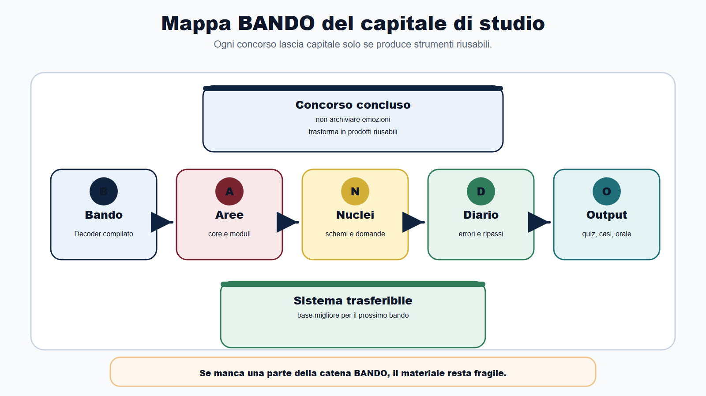
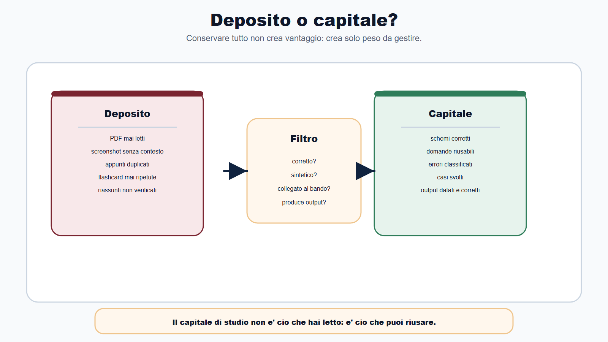
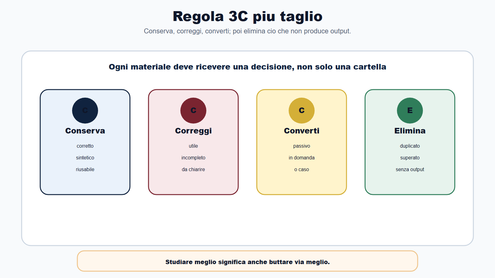
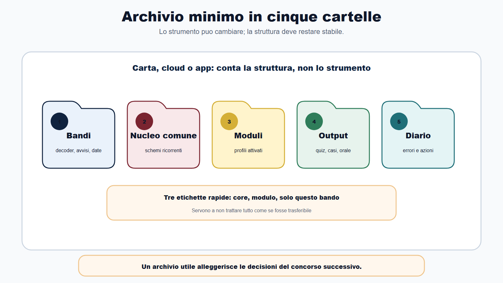
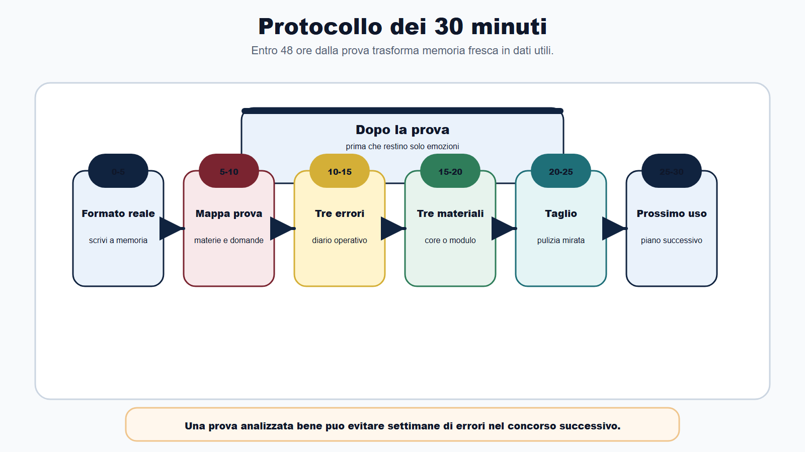
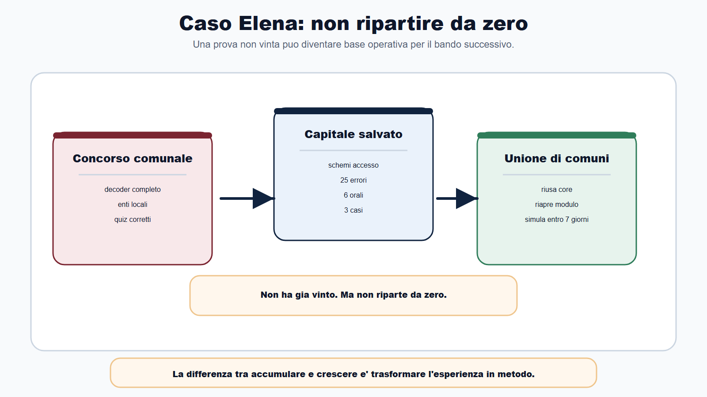

# Capitolo 26 - Trasformare ogni concorso in capitale di studio

> Modulo ricettario **R2** — Capitale di studio riutilizzabile. Collega Cap. 25, Cap. 22 e moduli profilo.

Il vero vantaggio non nasce quando finisci un concorso.

Nasce quando non butti via ciò che quel concorso ti ha insegnato.

Ogni bando letto, ogni quiz sbagliato, ogni risposta orale provata, ogni tabella compilata, ogni materia tagliata e ogni avviso controllato possono diventare capitale di studio. Ma diventano capitale solo se li trasformi in un sistema riutilizzabile.

Il candidato che ricomincia sempre da zero accumula fatica. Il candidato che costruisce capitale accumula vantaggio.

Questo capitolo serve a chiudere il cerchio del Metodo BANDO: non basta preparare bene un concorso. Devi far si che il concorso successivo parta da una base migliore.

## Obiettivo del capitolo

Alla fine del capitolo saprai:

- distinguere materiale utile da materiale solo accumulato;
- costruire un archivio minimo di studio;
- decidere cosa conservare, correggere, convertire o eliminare;
- trasformare errori e simulazioni in strumenti per il prossimo bando;
- riusare il nucleo comune senza ignorare i moduli di profilo;
- chiudere ogni concorso con una scheda di apprendimento;
- evitare di moltiplicare file, appunti e corsi senza metodo.

La regola è questa:

> il capitale di studio non è ciò che hai letto. È ciò che puoi riusare.

## Mappa BANDO del capitale di studio

| Fase | Cosa diventa capitale | Prodotto da conservare |
|---|---|---|
| B - Bando | Lettura della procedura | Bando Decoder compilato |
| A - Aree | Materie e moduli | Matrice core/modulo/profilo |
| N - Nuclei | Concetti ad alta resa | Schemi, mappe, domande |
| D - Diario | Errori e correzioni | Diario, flashcard, ripassi |
| O - Output | Prestazione reale | Quiz, casi, orali, simulazioni |

Se manca una di queste cinque parti, il materiale resta fragile. Potresti aver studiato molto, ma non hai ancora un sistema trasferibile.

## Che cos'e il capitale di studio

Il capitale di studio è il patrimonio ordinato che puoi portare da un concorso al successivo.

Comprende:

- concetti già capiti;
- schemi verificati;
- domande che sai usare per richiamare;
- errori classificati;
- casi svolti;
- risposte orali provate;
- fonti ufficiali controllate;
- moduli di profilo già avviati;
- decisioni di taglio che ti hanno fatto risparmiare tempo;
- routine che ti hanno aiutato a simulare meglio.

Non comprende automaticamente:

- PDF scaricati e mai letti;
- screenshot salvati senza contesto;
- appunti copiati da altri;
- riassunti non verificati;
- flashcard create e mai ripetute;
- tabelle compilate solo per sentirsi organizzati;
- materiali superati da un bando successivo.

Il capitale è selettivo. Se conservi tutto, non hai capitale: hai deposito.

## Materiale vivo, in attesa e da archiviare

Prima di riordinare cartelle, classifica ogni materiale in tre stati.

| Stato | Significato | Esempio | Azione |
|---|---|---|---|
| Vivo | lo usi entro 30 giorni o in un concorso attivo | schema accesso, flashcard corrette, simulazioni recenti | tieni in primo piano |
| In attesa | può servire in un concorso futuro vicino | modulo tributario non ancora attivato, Bando Decoder parcheggiato | archivia con etichetta chiara |
| Da archiviare | superato, duplicato o non verificato | PDF mai letti, appunti copiati, riassunti passivi | elimina o sposta fuori dal piano |

Il capitale cresce quando aumenti il materiale vivo e riduci deposito e attesa confusa. Un file "in attesa" senza data, bando o modulo associato diventa presto rumore.

## Inventario del capitale di studio

Una volta al mese, o alla chiusura di un concorso, compila un inventario rapido.

| Voce | Presente | qualità (alta/media/bassa) | Core / Modulo / Solo bando |
|---|---|---|---|
| Bando Decoder compilato | | | |
| Matrice materie-profili | | | |
| Schemi nucleo comune | | | |
| Moduli attivati | | | |
| Quiz corretti con data | | | |
| Casi svolti | | | |
| Risposte orali provate | | | |
| Diario errori aggiornato | | | |
| Fonti ufficiali controllate | | | |
| Materiali da eliminare | | | |

Se più di tre voci risultano assenti o a qualità bassa, non aprire un nuovo concorso: prima consolidi il capitale. Il inventario non serve a fare ordine estetico. Serve a capire cosa puoi riusare davvero.

## La regola 3C: conserva, correggi, converti

Dopo ogni blocco di studio importante, usa tre azioni.

| Azione | Quando usarla | Esempio |
|---|---|---|
| Conserva | Il materiale è corretto, sintetico e riusabile | Schema accesso documentale/civico/generalizzato |
| Correggi | Il materiale è utile ma incompleto o confuso | Flashcard su silenzio assenso e silenzio inadempimento |
| Converti | Il materiale è passivo e va trasformato in output | Appunto su trasparenza convertito in caso pratico |

La quarta azione, spesso la più difficile, è eliminare.

Elimina ciò che:

- non è collegato a un bando;
- non produce output;
- duplica un materiale migliore;
- è troppo lungo per essere ripassato;
- contiene dubbi non verificati;
- appartiene a un modulo che hai deciso di non attivare.

Studiare meglio significa anche buttare via meglio.

## L'archivio minimo in cinque cartelle

Puoi usare quaderni, cartelline, cloud, appunti digitali o un raccoglitore. Lo strumento non conta quanto la struttura.

Usa cinque contenitori.

| Cartella | Cosa contiene | Regola |
|---|---|---|
| 1. Bandi | Bando Decoder, avvisi, requisiti, calendario | Un file o scheda per concorso |
| 2. Nucleo comune | Schemi su materie ricorrenti | Solo materiali riusabili |
| 3. Moduli | Enti locali, contabilità, tributario, ICT, sanità, scuola, vigilanza | Solo moduli attivati da bandi reali |
| 4. Output | Quiz, casi, orale, simulazioni, risposte modello | Sempre con data e correzione |
| 5. Diario | Errori, cause, azioni, ripassi, fonti da verificare | Ogni errore deve avere prossima azione |

Se vuoi una versione ancora più semplice, usa tre etichette:

- **core**: torna spesso;
- **modulo**: torna in famiglie simili;
- **solo questo bando**: utile ora, non necessariamente dopo.

Queste tre etichette evitano un errore frequente: trattare tutto come se fosse riutilizzabile.

## Cosa conservare dopo una prova

Subito dopo una prova, il candidato tende a fare due cose sbagliate: dimenticare tutto oppure giudicarsi solo dal risultato.

Invece devi salvare dati utili.

| Domanda | Risposta da scrivere |
|---|---|
| Che tipo di prova era davvero? | Quiz, scritto, caso, orale, pratica, mix |
| Quali materie pesavano di più? | Core, modulo, dettagli, profilo |
| Quali errori sono tornati? | Memoria, concetto, lettura, tempo, ansia |
| Quale materiale ha funzionato? | Schema, flashcard, simulazione, caso |
| Cosa era inutile? | Manuale, appunto, corso, dettaglio, tabella |
| Cosa usero nel prossimo concorso? | Tre elementi riusabili |
| Cosa non ripetero? | Una decisione da correggere |

Questa scheda vale anche se la prova è andata male. Anzi, soprattutto in quel caso.

Una prova sbagliata ma analizzata bene può evitare due mesi di errori nel concorso successivo.

## Scheda workbook: dopo concorso

Compila entro 48 ore dalla prova, anche prima di conoscere l'esito.

| Sezione | Campo | Risposta |
|---|---|---|
| Identificazione | Concorso / data prova / tipo prova | |
| Prestazione | Tre punti forti osservati | |
| Prestazione | Tre errori ricorrenti | |
| Materiale | Tre strumenti che hanno funzionato | |
| Materiale | Tre strumenti inutili o da eliminare | |
| Capitale | Cosa riuso nel prossimo bando (core) | |
| Capitale | Cosa riuso solo in moduli simili | |
| Capitale | Cosa non ripeto nel metodo | |
| Aggiornamento | Fonti o avvisi da verificare | |
| Prossimo passo | Un ripasso leggero entro 7 giorni | |

La scheda chiude il ciclo del concorso e alimenta il protocollo dei 30 minuti. Senza questa chiusura, il capitale resta teorico.

## Matrice riuso e taglio

Quando passi da un concorso al successivo, non riusi tutto. Decidi cosa portare avanti e cosa tagliare.

| Materiale | Riuso (alto/medio/basso) | Azione (conserva/correggi/converti/elimina) | Motivo |
|---|---|---|---|
| Bando Decoder | | | |
| Schema principale | | | |
| Quiz corretti | | | |
| Errori ricorrenti | | | |
| Risposte orali | | | |
| Casi pratici | | | |
| Modulo profilo | | | |
| Fonte ufficiale | | | |
| Corso o manuale esterno | | | |

Regola pratica: riuso alto su core, output e Diario; riuso medio su moduli vicini; riuso basso su materiali legati a un solo bando o non verificati. Tutto ciò che resta a riuso basso senza conversione in output va eliminato o archiviato.

## Il protocollo dei 30 minuti

Entro 48 ore da una prova, fai una revisione breve.

| Minuti | Azione | Output |
|---|---|---|
| 0-5 | Scrivi a memoria come era la prova | Formato reale |
| 5-10 | Elenca materie e tipi di domanda | Mappa prova |
| 10-15 | Segna tre errori ricorrenti | Diario |
| 15-20 | Individua tre materiali utili | Archivio core/modulo |
| 20-25 | Taglia ciò che non serve più | Pulizia |
| 25-30 | Scrivi il prossimo uso | Piano per concorso successivo |

Non aspettare settimane. Dopo qualche giorno la memoria della prova diventa meno affidabile: restano emozioni, non dati.

## Capitale comune e moduli di profilo

Il Metodo BANDO non promette che tutti i concorsi siano uguali.

Promette che non tutto cambia.

Il capitale comune comprende ciò che puoi usare spesso: logica di bando, diritto amministrativo essenziale, procedimento, pubblico impiego, trasparenza/privacy, digitale, inglese, logica, metodo quiz, risposta orale, diario errori.

I moduli di profilo invece cambiano:

- enti locali;
- contabilità;
- tributario;
- previdenza e lavoro;
- ICT;
- sanità amministrativa;
- scuola e università;
- polizia locale;
- tecnico;
- appalti, PNRR e rendicontazione.

Il problema non è scegliere tra core e modulo. Il problema è sapere quando il modulo diventa decisivo.

Usa questa regola:

| Se il nuovo bando... | Allora... |
|---|---|
| mantiene lo stesso profilo | Riuso core e modulo |
| cambia ente ma non prova | Riuso output e adatto modulo |
| cambia prova | Riuso conoscenze ma cambio allenamento |
| cambia famiglia | Riuso core e apro nuovo modulo |
| cambia solo dettagli | Non riscrivo il piano |

Il capitale ti fa partire avanti, ma non ti autorizza a smettere di leggere il bando.

## Da sapere in 5 righe

1. Il capitale di studio è ciò che puoi riusare, non ciò che hai accumulato.
2. Ogni concorso deve lasciare Bando Decoder, matrice, output, diario e decisioni.
3. Core e modulo vanno separati: non tutto ha lo stesso grado di trasferibilità.
4. Dopo una prova servono 30 minuti di revisione prima che i dati si perdano.
5. Eliminare materiali inutili è parte del metodo, non una perdita.

## Caso guidato

Elena prepara un concorso da istruttore amministrativo comunale. Non vince, ma ha lavorato bene.

Alla fine possiede:

- Bando Decoder completo;
- schema procedimento/accesso;
- matrice con enti locali come modulo;
- 180 quiz corretti;
- 25 errori classificati;
- 6 risposte orali da due minuti;
- 3 casi su accesso, istanza incompleta e ritardo;
- checklist finale;
- nota su cosa ha funzionato e cosa no.

Due mesi dopo trova un concorso amministrativo in una unione di comuni.

Senza capitale, ripartirebbe da un nuovo manuale.

Con il capitale, fa così:

- riusa core amministrativo, accessi, pubblico impiego e trasparenza;
- riapre modulo enti locali;
- aggiorna Bando Decoder;
- controlla se cambia la prova;
- trasforma gli errori più frequenti in ripasso;
- fa una simulazione entro sette giorni.

Non ha già vinto. Ma non riparte da zero.

## Domanda da commissario

**Domanda:** perché il capitale di studio è diverso da un semplice archivio di materiali?

**Risposta efficace:** perché un archivio conserva tutto, mentre il capitale di studio conserva solo ciò che può essere riusato in modo controllato. Un materiale diventa capitale quando è corretto, sintetico, collegato a una fonte o a un bando, trasformabile in output e utile per una famiglia di concorsi. Appunti non verificati, file duplicati o riassunti passivi non sono capitale: possono persino rallentare la preparazione.

## Domanda-trappola

**Domanda:** Se ho già preparato un concorso simile, posso saltare il Bando Decoder?

No. Il capitale ti aiuta a partire avanti, ma ogni bando ha requisiti, prove, scadenze, soglie, materie, documenti e comunicazioni proprie. Puoi riusare materiali, non puoi riusare automaticamente la decisione.

## Mini-esercizio

Scegli l'ultimo concorso che hai preparato e compila.

| Materiale | Core / Modulo / Solo bando | Lo riuso? | Cosa devo fare |
|---|---|---|---|
| Bando Decoder | | | |
| Schema principale | | | |
| Quiz corretti | | | |
| Errori ricorrenti | | | |
| Risposte orali | | | |
| Casi pratici | | | |
| Fonte ufficiale controllata | | | |
| Materiale da eliminare | | | |

Poi scrivi tre righe:

| Prossimo concorso | Cosa riuso subito | Cosa devo verificare |
|---|---|---|
| | | |

Se non trovi nulla da riusare, probabilmente hai studiato senza lasciare tracce operative.

## Errore tipico

L'errore tipico è conservare per paura.

Il candidato tiene tutto perché pensa: "potrebbe servire". Dopo tre concorsi ha cartelle piene, appunti doppi, PDF superati, corsi iniziati e nessuna mappa affidabile.

Correzione:

- conserva solo ciò che useresti entro 30 giorni;
- trasforma appunti lunghi in domande;
- archivia i materiali superati;
- separa core e modulo;
- elimina duplicati;
- aggiorna solo ciò che è collegato a un bando o a un output.

Il disordine non è neutralità. Il disordine consuma tempo.

## Chiusura operativa

Alla fine di ogni concorso, anche prima di sapere il risultato, chiudi il ciclo.

| Azione | Fatto |
|---|---|
| Ho salvato il Bando Decoder compilato | |
| Ho aggiornato la matrice materie/profili | |
| Ho segnato gli errori più ricorrenti | |
| Ho indicato tre materiali riusabili | |
| Ho eliminato duplicati o materiali inutili | |
| Ho scritto cosa cambiero nel prossimo piano | |
| Ho programmato un ripasso leggero del core | |

Questa pagina è il ponte tra un concorso e il successivo.

La differenza tra accumulare e crescere è tutta qui: trasformare l'esperienza in metodo.

## Riferimenti consolidati

- [[sources/capitale-studio-riutilizzabile-metodo-bando]]
- [[sources/metodo-bando-progetto-editoriale]]
- [[sources/struttura-madre-il-metodo-bando]]
- [[sources/apprendimento-efficace-active-recall-ripasso-distribuito]]
- [[sources/scienze-apprendimento-pianificazione-metacognizione-errori]]
- [[sources/capitoli-21-23-corpus-moduli-piano-diario-2026-06-01]]
- [[sources/checklist-operative-concorsi-metodo-bando]]
- [[sources/matrice-materie-profili-metodo-bando]]
- [[sources/fonti-ufficiali-aggiornamento-metodo-bando-2026-06-03]]
- [[topics/capitale-studio-riutilizzabile]]
- [[topics/metodo-bando]]
- [[topics/nucleo-comune-concorsi-pubblici]]
- [[topics/moduli-integrativi]]
- [[topics/diario-errori]]

## Note di review

- La struttura madre originaria non prevedeva il Capitolo 26. Questo capitolo è un'estensione editoriale: in revisione decidere se mantenerlo numerato, unirlo al Capitolo 25 o trasformarlo in epilogo operativo.
- Schede workbook "Dopo concorso", inventario capitale e matrice riuso/taglio inserite nel capitolo; in impaginazione valutare estrazione come PDF compilabile autonomo.
- Coordinare il lessico con front matter e servizi digitali di Capitale Personale, evitando che il capitolo sembri dipendere dal digitale.
