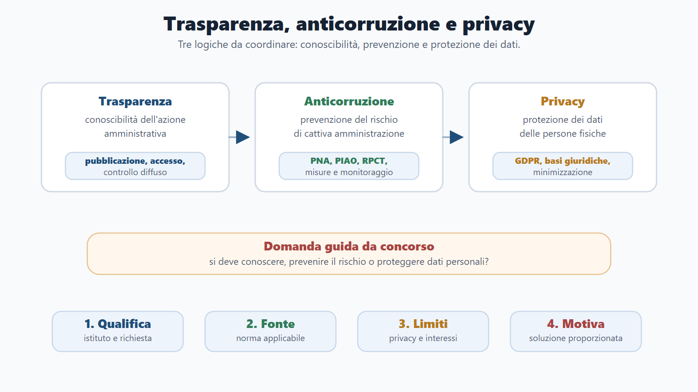
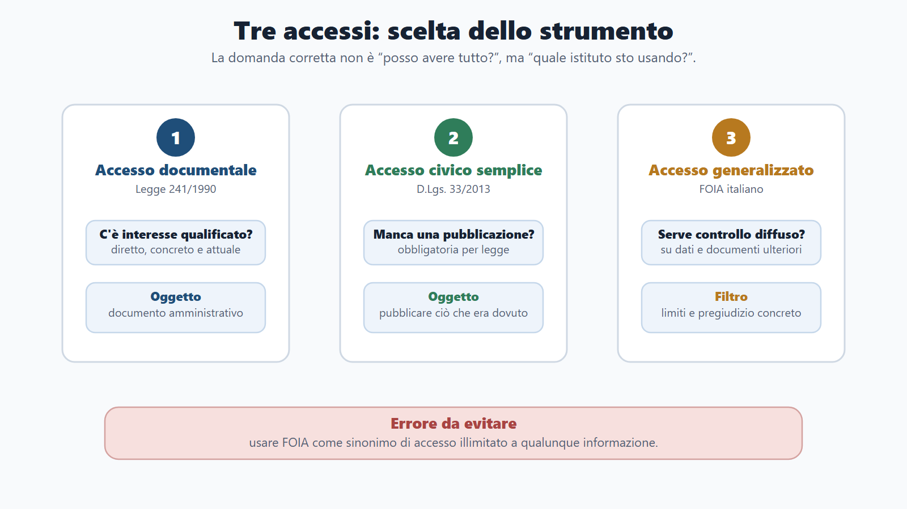
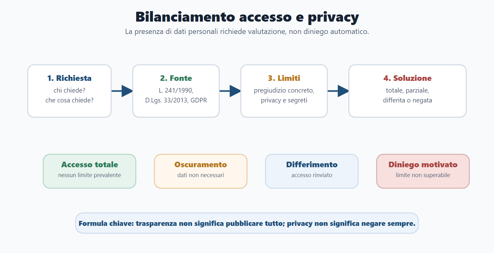
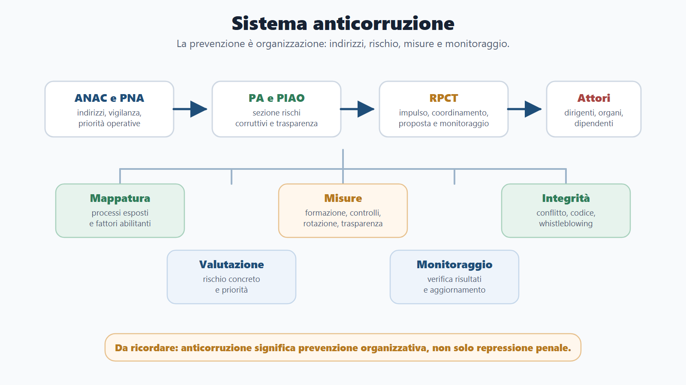
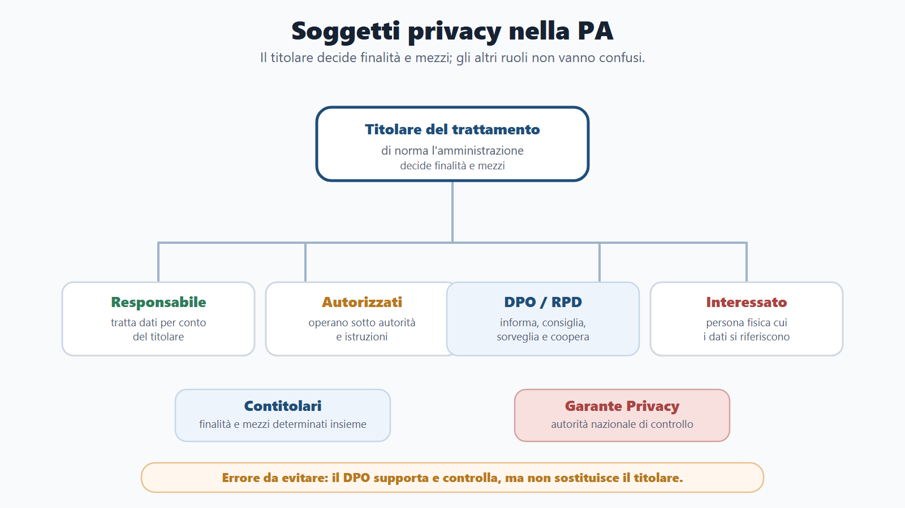

# Capitolo 7 - Trasparenza, anticorruzione e privacy

## Perché studiare trasparenza, anticorruzione e privacy

Trasparenza, anticorruzione e privacy compaiono spesso nei bandi come tre parole vicine. In realtà non sono sinonimi e non spingono sempre nella stessa direzione. La trasparenza rende conoscibile l'attività pubblica; l'anticorruzione prova a prevenire il cattivo uso del potere; la privacy protegge i dati personali quando l'amministrazione raccoglie, usa, comunica o pubblica informazioni su persone fisiche.

Per il candidato la regola è semplice ma decisiva: non basta dire che "la PA deve essere trasparente". Occorre sapere chi può chiedere cosa, con quale strumento, entro quali limiti, con quali cautele per i dati personali e con quali responsabilità organizzative.

Questo capitolo non ripete per intero il procedimento amministrativo già trattato nel Capitolo 5 né i doveri del dipendente già trattati nel Capitolo 6. Qui li richiama solo quando servono a risolvere le domande più frequenti: accesso documentale o accesso civico? Pubblicazione obbligatoria o diffusione illecita? Prevenzione della corruzione o sanzione disciplinare? Consenso privacy o obbligo legale della PA?

## Obiettivi del capitolo

Al termine del capitolo devi saper:

- spiegare trasparenza, obblighi di pubblicazione e sezione "Amministrazione trasparente";
- distinguere i tre accessi e qualificare richiesta, fonte, oggetto e richiedente;
- applicare limiti, controinteressati, oscuramento e bilanciamento con dati personali;
- collegare L. 190/2012, PNA, PIAO, RPCT, ANAC e misure di prevenzione;
- distinguere inconferibilità, incompatibilità, conflitto di interessi, codice di comportamento e whistleblowing;
- usare GDPR: basi giuridiche, informativa, diritti, soggetti e categorie particolari di dati;
- riconoscere data breach, DPIA, registro, sicurezza e risolvere casi trasparenza/privacy.

## Come usare il Metodo BANDO

| Fase | Come usare questo capitolo |
|---|---|
| **Bando** | Cerca voci come trasparenza, anticorruzione, accesso civico, FOIA, privacy, GDPR, codice di comportamento, RPCT, ANAC, whistleblowing, conflitto di interessi. |
| **Aree** | Collega il tema a diritto amministrativo, pubblico impiego, enti locali, contratti pubblici, digitalizzazione, responsabilità e prova situazionale. |
| **Nuclei** | Studia prima la tabella degli accessi, poi trasparenza/obblighi di pubblicazione, anticorruzione/RPCT, privacy/GDPR e bilanciamento. |
| **Diario** | Registra gli errori: confondere accesso civico e documentale, dire che il consenso serve sempre, pubblicare dati personali senza base normativa, trattare il RPCT come organo politico. |
| **Output** | Produci una tabella comparativa degli accessi, una risposta orale su trasparenza/privacy, un mini-caso su richiesta FOIA con dati personali e una mappa dei soggetti privacy. |

## Confini con i capitoli precedenti

Questo capitolo è costruito per evitare ripetizioni. Alcuni istituti sono già comparsi nei capitoli precedenti, ma qui assumono una funzione diversa.

| Tema | Dove è già stato trattato | Qui come va usato |
|---|---|---|
| Procedimento amministrativo | Capitolo 5 | Solo per qualificare istanze di accesso, termini, motivazione, controinteressati e rimedi. |
| Accesso documentale | Capitolo 5 | Richiamo selettivo per distinguerlo da accesso civico semplice e generalizzato. |
| PIAO | Capitolo 6 | Solo per la sezione rischi corruttivi e trasparenza, non per tutta la programmazione del personale. |
| Codice di comportamento | Capitolo 6 | Solo come presidio anticorruzione: conflitto di interessi, regali, astensione, uso corretto di dati e strumenti. |
| Responsabilità disciplinare | Capitolo 6 | Solo come conseguenza possibile di violazioni di doveri, privacy, accessi o misure di integrità. |
| Whistleblowing | Capitolo 6 | Qui rileva come misura di emersione del rischio e canale protetto nel sistema anticorruzione. |

La domanda guida è quindi: questo istituto serve a spiegare il lavoro pubblico in generale, oppure serve a capire trasparenza, controllo diffuso, prevenzione del rischio e protezione dei dati? Nel secondo caso appartiene a questo capitolo.

## Quadro essenziale

### 1. Trasparenza amministrativa

Nel diritto amministrativo la trasparenza indica conoscibilità dell'organizzazione e dell'attività amministrativa nei modi previsti dalla legge. Non coincide con curiosità generale né con pubblicazione indiscriminata di qualunque documento.

Il D.Lgs. 33/2013 riordina la disciplina degli obblighi di pubblicità, trasparenza e diffusione di informazioni da parte delle pubbliche amministrazioni. Dopo il D.Lgs. 97/2016, la trasparenza è collegata anche al diritto di accesso civico e alla logica del controllo diffuso.

Per i concorsi devi ricordare cinque elementi:

- la trasparenza è strumento di controllo democratico e prevenzione della corruzione;
- gli obblighi di pubblicazione riguardano dati, documenti e informazioni individuati dalla normativa;
- la sezione "Amministrazione trasparente" è il luogo ordinato in cui molti obblighi sono resi consultabili;
- le informazioni pubblicate devono essere comprensibili, aggiornate, complete, accessibili e riutilizzabili nei limiti previsti;
- la trasparenza incontra limiti, soprattutto quando sono coinvolti dati personali, segreti o interessi pubblici sensibili.

#### Obblighi di pubblicazione e qualità delle informazioni

Gli obblighi di pubblicazione non nascono da una scelta libera dell'ufficio: derivano da norme che individuano categorie di dati, documenti e informazioni da rendere pubbliche. Per il candidato non è necessario memorizzare ogni singola sotto-sezione, ma deve capire la logica: la sezione "Amministrazione trasparente" serve a rendere ordinatamente conoscibili organizzazione, attività, procedimenti, consulenti, personale, performance, provvedimenti, sovvenzioni, bilanci, controlli e altri dati previsti.

La qualità delle informazioni pubblicate è parte della trasparenza. Un dato formalmente pubblicato ma incomprensibile, non aggiornato, frammentato o non reperibile non realizza davvero la funzione di controllo. Nei quiz questo punto emerge quando si chiede se trasparenza significhi solo "mettere online": la risposta corretta è no, perché pubblicazione, accessibilità, aggiornamento, completezza e comprensibilità devono procedere insieme.

La pubblicazione deve inoltre rispettare il principio di proporzionalità. Se la norma impone di pubblicare un provvedimento o un'informazione, l'amministrazione deve evitare dati personali eccedenti, oscurare ciò che non è necessario e rispettare i tempi di pubblicazione previsti.

**Da non sbagliare:** se un dato non è soggetto a pubblicazione obbligatoria, non significa automaticamente che sia segreto. Potrebbe essere accessibile con accesso documentale o con accesso civico generalizzato, ma secondo presupposti diversi.

### 2. Accesso documentale

L'accesso documentale appartiene alla Legge 241/1990. Serve al soggetto che ha un interesse diretto, concreto e attuale, corrispondente a una situazione giuridicamente tutelata e collegata al documento richiesto.

Questo istituto è già stato trattato nel Capitolo 5. Qui va richiamato per distinguerlo dagli accessi civici:

- non spetta indistintamente a "chiunque";
- richiede un collegamento qualificato tra richiedente e documento;
- riguarda documenti amministrativi;
- può coinvolgere controinteressati, cioè soggetti che potrebbero subire una lesione della riservatezza;
- può essere accolto, respinto, limitato o differito;
- contro diniego, silenzio o differimento sono previsti rimedi amministrativi e giurisdizionali.

La domanda da quiz spesso usa una formula simile: "un soggetto chiede copia di documenti che incidono su una propria posizione". Se c'è interesse diretto, concreto e attuale, il riferimento è l'accesso documentale, non il FOIA.

### 3. Accesso civico semplice

L'accesso civico semplice è il rimedio contro l'omessa pubblicazione. Se la legge impone all'amministrazione di pubblicare un dato, un documento o un'informazione e la pubblicazione manca, chiunque può chiederne la pubblicazione.

Non serve dimostrare un interesse personale qualificato. Il punto non è la posizione individuale del richiedente, ma il mancato adempimento di un obbligo di trasparenza.

Formula da ricordare:

| Elemento | Accesso civico semplice |
|---|---|
| Presupposto | Omessa pubblicazione obbligatoria. |
| Titolare | Chiunque. |
| Oggetto | Dati, documenti, informazioni soggetti a pubblicazione obbligatoria. |
| Funzione | Far rispettare l'obbligo di pubblicazione. |
| Errore tipico | Usarlo per chiedere qualunque documento detenuto dalla PA. |

### 4. Accesso civico generalizzato e FOIA

L'accesso civico generalizzato, introdotto nel sistema della trasparenza dal D.Lgs. 97/2016, permette a chiunque di accedere a dati e documenti detenuti dalle pubbliche amministrazioni ulteriori rispetto a quelli oggetto di pubblicazione obbligatoria, nei limiti previsti dalla legge.

La sua funzione è favorire forme diffuse di controllo sul perseguimento delle funzioni istituzionali e sull'utilizzo delle risorse pubbliche. Per questo viene spesso chiamato FOIA, anche se va studiato nella disciplina italiana del D.Lgs. 33/2013.

Caratteri essenziali:

- spetta a chiunque;
- non richiede motivazione;
- riguarda dati e documenti ulteriori rispetto agli obblighi di pubblicazione;
- non serve a costringere l'amministrazione a creare nuovi documenti o rielaborare informazioni in modo sproporzionato;
- incontra limiti per tutelare interessi pubblici e privati;
- richiede motivazione del diniego, del differimento o dell'accoglimento parziale quando sono coinvolti limiti.

#### Procedura essenziale del FOIA italiano

Per i concorsi è utile conoscere la sequenza minima, senza trasformare il capitolo in un manuale procedurale:

1. il richiedente presenta istanza senza obbligo di motivazione;
2. l'amministrazione individua l'ufficio competente e verifica se i dati o documenti sono detenuti;
3. se vi sono controinteressati, li coinvolge secondo le regole applicabili;
4. valuta limiti assoluti, limiti relativi e possibile pregiudizio concreto;
5. decide con accoglimento, accoglimento parziale, differimento o diniego motivato;
6. in caso di diniego, differimento o mancata risposta, il richiedente può attivare i rimedi previsti, tra cui riesame e tutela giurisdizionale.

Il registro degli accessi è uno strumento organizzativo utile per tracciare le richieste, rendere più omogenee le risposte e consentire monitoraggio interno. Non è la fonte del diritto di accesso, ma aiuta l'amministrazione a gestire il controllo diffuso in modo ordinato.

### 5. Tabella comparativa degli accessi

| Istituto | Fonte | Chi può chiederlo | Oggetto | Presupposto | Errore da evitare |
|---|---|---|---|---|---|
| Accesso documentale | L. 241/1990 | Interessato qualificato | Documenti amministrativi | Interesse diretto, concreto e attuale | Dire che spetta a chiunque. |
| Accesso civico semplice | D.Lgs. 33/2013 | Chiunque | Dati, documenti o informazioni da pubblicare obbligatoriamente | Omessa pubblicazione | Usarlo per documenti non soggetti a pubblicazione. |
| Accesso civico generalizzato | D.Lgs. 33/2013 come modificato dal D.Lgs. 97/2016 | Chiunque | Dati e documenti ulteriori | Controllo diffuso, senza motivazione | Pensare che sia illimitato. |

La distinzione tra questi tre strumenti è una delle parti più richieste nei concorsi. Una risposta buona non recita soltanto le definizioni: qualifica la richiesta, individua la fonte, verifica i limiti e spiega la tutela.

### 6. Limiti all'accesso e bilanciamento

La trasparenza deve convivere con altri interessi giuridicamente rilevanti. Per questo l'accesso, soprattutto quello generalizzato, non è assoluto.

Tra gli interessi pubblici da proteggere possono rientrare:

- sicurezza pubblica e ordine pubblico;
- sicurezza nazionale;
- difesa e questioni militari;
- relazioni internazionali;
- politica e stabilità economico-finanziaria;
- conduzione di indagini e attività ispettive;
- regolare svolgimento di procedimenti sensibili.

Tra gli interessi privati possono rientrare:

- protezione dei dati personali;
- libertà e segretezza della corrispondenza;
- interessi economici e commerciali;
- proprietà intellettuale, diritto d'autore e segreti commerciali.

Il bilanciamento non si fa con formule astratte. L'amministrazione deve chiedersi: il rilascio produce un pregiudizio concreto? Esistono tecniche di oscuramento o accesso parziale? Il dato personale è necessario rispetto alla finalità di trasparenza? La tutela della riservatezza può convivere con l'accesso?

La distinzione tecnica da ricordare è questa:

| Tipo di limite | Logica | Effetto pratico |
|---|---|---|
| Esclusione o divieto | L'ordinamento impedisce la conoscibilità del dato o documento. | Diniego, salvo diversa base normativa. |
| Limite relativo | Occorre valutare se l'accesso produce un pregiudizio concreto. | Possibile accesso totale, parziale, differito o negato. |
| Protezione dati | Non basta dire "privacy": bisogna valutare pertinenza, necessità, minimizzazione e possibile oscuramento. | Bilanciamento caso per caso. |

**Regola operativa:** trasparenza non significa pubblicare tutto; privacy non significa negare sempre. Il concorso premia chi sa motivare il punto di equilibrio.

### 7. Prevenzione della corruzione

La Legge 190/2012 imposta l'anticorruzione in chiave preventiva. Non si limita a punire il reato già commesso, ma cerca di ridurre le occasioni di cattiva amministrazione, abuso, favoritismo, opacità e conflitto di interessi.

Per studiarla bene, pensa alla corruzione in senso amministrativo ampio: non solo scambio illecito di denaro, ma rischio che il potere pubblico sia usato in modo distorto, non imparziale o non controllabile.

Nuclei da conoscere:

- mappatura dei processi a rischio;
- valutazione del rischio corruttivo;
- misure organizzative di prevenzione;
- rotazione del personale quando prevista e sostenibile;
- formazione del personale;
- tracciabilità delle decisioni;
- trasparenza e obblighi di pubblicazione;
- gestione del conflitto di interessi;
- codici di comportamento;
- segnalazioni e whistleblowing;
- monitoraggio e aggiornamento delle misure.

La mappatura dei processi è il passaggio operativo centrale. L'amministrazione individua le attività più esposte, valuta eventi rischiosi, fattori abilitanti e misure già presenti, poi programma azioni proporzionate. In una risposta orale non conviene limitarsi a elencare "rotazione e formazione": bisogna spiegare che le misure devono essere coerenti con il rischio effettivo dell'ufficio.

Nei quiz, la parola chiave è "prevenzione": l'anticorruzione non coincide con il diritto penale.

### 8. PNA, PIAO e RPCT

Il Piano Nazionale Anticorruzione è l'atto di indirizzo dell'ANAC che orienta le amministrazioni nella prevenzione del rischio corruttivo. Il PNA non sostituisce la responsabilità della singola amministrazione: fornisce criteri, indicazioni e priorità.

Nel sistema attuale, per molte amministrazioni la programmazione anticorruzione e trasparenza è collocata nel PIAO, in particolare nella sezione dedicata ai rischi corruttivi e alla trasparenza. Il PIAO nel suo complesso è stato trattato nel Capitolo 6; qui rileva solo come contenitore di misure anticorruzione, trasparenza e monitoraggio.

Il RPCT, Responsabile della prevenzione della corruzione e della trasparenza, ha un ruolo centrale di impulso, coordinamento, proposta e monitoraggio. Non è il "capo" di tutti i procedimenti né l'unico responsabile dell'integrità dell'ente. La prevenzione è un sistema organizzativo: dirigenti, dipendenti, organi di indirizzo e strutture interne devono concorrere.

Nel capitolo non serve ripetere tutta la disciplina del PIAO. Serve invece saper dire che la sezione "Rischi corruttivi e trasparenza" collega analisi del rischio, misure preventive, obblighi di pubblicazione, responsabilità organizzative e monitoraggio. Questa è la parte che ritorna più spesso nei quiz.

### 9. ANAC

L'ANAC, Autorità nazionale anticorruzione, è un'autorità amministrativa indipendente con funzioni rilevanti in materia di prevenzione della corruzione, trasparenza, vigilanza e contratti pubblici. Nel Capitolo 7 interessa soprattutto per:

- PNA e indirizzi in materia di prevenzione della corruzione;
- vigilanza sull'attuazione degli obblighi di trasparenza;
- indicazioni operative sull'accesso civico generalizzato;
- poteri di intervento e monitoraggio;
- ruolo nel sistema dei contratti pubblici, richiamato qui solo per il collegamento con trasparenza e prevenzione del rischio;
- canale esterno e funzioni nel whistleblowing, secondo la disciplina vigente.

ANAC non sostituisce l'amministrazione nella gestione quotidiana del rischio. L'autorità indirizza, vigila, monitora e interviene nei casi previsti; la responsabilità di organizzare correttamente uffici, flussi, pubblicazioni, controlli e misure resta in capo alle amministrazioni.

La domanda-trappola è questa: "ANAC si occupa solo di appalti?" No. I contratti pubblici sono un'area importante, ma non esauriscono le sue funzioni.

### 10. Inconferibilità e incompatibilità

Il D.Lgs. 39/2013 disciplina inconferibilità e incompatibilità di incarichi presso pubbliche amministrazioni ed enti in controllo pubblico.

Per il candidato la distinzione essenziale è questa:

| Concetto | Significato pratico | Esempio di logica |
|---|---|---|
| Inconferibilità | L'incarico non può essere attribuito in presenza di determinate condizioni pregresse. | Evitare che chi si trova in una posizione incompatibile con imparzialità riceva l'incarico. |
| Incompatibilità | L'incarico può risultare non cumulabile con altre cariche o funzioni; occorre rimuovere la situazione incompatibile. | Evitare cumuli che alterano indipendenza, imparzialità o corretta gestione. |
| Conflitto di interessi | Situazione in cui un interesse personale può interferire con l'interesse pubblico affidato. | Richiede valutazione, comunicazione e spesso astensione. |

Non sono concetti identici. L'inconferibilità riguarda il conferimento; l'incompatibilità riguarda la coesistenza di incarichi o situazioni; il conflitto di interessi riguarda l'interferenza tra interesse personale e funzione pubblica.

### 11. Codice di comportamento

Il codice di comportamento dei dipendenti pubblici, contenuto nel D.P.R. 62/2013 e aggiornato dal D.P.R. 81/2023, appartiene anche al sistema anticorruzione. Nel Capitolo 6 è stato trattato come parte del pubblico impiego; qui va letto come presidio di integrità.

Nuclei da ricordare:

- diligenza, lealtà, imparzialità e servizio esclusivo dell'interesse pubblico;
- regali, compensi e altre utilità;
- comunicazione e gestione del conflitto di interessi;
- obbligo di astensione;
- comportamento nei rapporti con il pubblico;
- corretto uso di beni, informazioni, strumenti informatici e social media;
- collegamento con responsabilità disciplinare.

Domanda da orale: "Perché il codice di comportamento è uno strumento anticorruzione?" Risposta: perché rende prevedibili e controllabili le condotte, riduce le zone opache, obbliga a dichiarare conflitti e trasforma principi generali in regole operative.

### 12. Whistleblowing

Il whistleblowing è la segnalazione di violazioni conosciute nel contesto lavorativo, secondo canali e tutele previsti dal D.Lgs. 24/2023.

Elementi essenziali:

- possono esistere canali interni all'amministrazione;
- in determinati casi rileva il canale esterno presso ANAC;
- la segnalazione deve essere gestita con riservatezza;
- sono vietate ritorsioni contro il segnalante;
- la tutela non trasforma la segnalazione in uno strumento per lamentele personali prive di rilievo pubblico;
- l'istituto serve a far emergere violazioni e rischi per integrità, legalità e interesse pubblico.

Nel capitolo sul pubblico impiego hai visto il lato del dipendente. Qui devi memorizzare la funzione sistemica: il whistleblowing è una misura di prevenzione e controllo.

### 13. Privacy e GDPR

Il GDPR, Regolamento UE 2016/679, disciplina la protezione delle persone fisiche con riguardo al trattamento dei dati personali. Il quadro italiano comprende anche il D.Lgs. 196/2003, coordinato con il GDPR, e il D.Lgs. 101/2018 di adeguamento.

Per "trattamento" si intende qualunque operazione compiuta su dati personali: raccolta, registrazione, organizzazione, conservazione, consultazione, uso, comunicazione, diffusione, cancellazione e altre operazioni.

I principi da memorizzare sono:

| Principio | Significato per la PA |
|---|---|
| Liceità, correttezza e trasparenza | Il trattamento deve avere base giuridica, essere corretto e comprensibile. |
| Limitazione della finalità | I dati sono trattati per finalità determinate, esplicite e legittime. |
| Minimizzazione | Si usano solo i dati adeguati, pertinenti e necessari. |
| Esattezza | I dati devono essere corretti e aggiornati quando necessario. |
| Limitazione della conservazione | I dati non si conservano oltre il tempo necessario. |
| Integrità e riservatezza | Servono misure di sicurezza adeguate. |
| Accountability | Il titolare deve dimostrare la conformità delle proprie scelte. |

**Errore tipico:** dire che la PA deve sempre chiedere il consenso. Spesso è sbagliato: quando la PA agisce per obbligo legale, interesse pubblico o esercizio di pubblici poteri, la base giuridica non è il consenso.

### 14. Basi giuridiche e informativa

Ogni trattamento deve fondarsi su una base giuridica. Le principali basi da conoscere sono:

- consenso;
- esecuzione di un contratto;
- obbligo legale;
- salvaguardia di interessi vitali;
- compito di interesse pubblico o esercizio di pubblici poteri;
- legittimo interesse, nei casi in cui è applicabile.

Nelle pubbliche amministrazioni, le basi più ricorrenti sono obbligo legale, interesse pubblico ed esercizio di pubblici poteri. Il consenso può essere fragile quando il cittadino non è davvero libero di scegliere, perché si trova davanti a un potere pubblico.

L'informativa privacy serve a rendere conoscibile il trattamento. Deve indicare, in sintesi, chi è il titolare, quali dati sono trattati, per quali finalità, su quale base giuridica, a chi possono essere comunicati, per quanto tempo sono conservati, quali diritti può esercitare l'interessato e come proporre reclamo.

Schema pratico per le domande da quiz:

| Caso | Base giuridica più probabile |
|---|---|
| Gestione di una domanda di concorso | Obbligo legale o compito di interesse pubblico. |
| Protocollo e istruttoria di un'istanza amministrativa | Obbligo legale, interesse pubblico o esercizio di pubblici poteri. |
| Servizio facoltativo non imposto dalla legge | Può rilevare il consenso, il contratto o un'altra base giuridica adeguata al caso. |
| Pubblicazione in Amministrazione trasparente | Obbligo legale, nei limiti della norma di pubblicazione. |

### 15. Categorie particolari di dati e dati giudiziari

Il GDPR non usa più come categoria tecnica principale l'espressione "dati sensibili", anche se nei quiz può ancora comparire. La formula corretta è "categorie particolari di dati personali".

Rientrano tra le categorie particolari:

- dati relativi alla salute;
- dati genetici;
- dati biometrici usati per identificare in modo univoco una persona;
- origine razziale o etnica;
- opinioni politiche;
- convinzioni religiose o filosofiche;
- appartenenza sindacale;
- dati relativi alla vita sessuale o all'orientamento sessuale.

I dati relativi a condanne penali e reati hanno una disciplina specifica e richiedono base normativa e garanzie adeguate.

Nel contesto PA, questi dati possono comparire in procedimenti sociali, sanitari, scolastici, disciplinari, concorsuali, di polizia amministrativa o di gestione del personale. La regola pratica è minimizzare: usare e pubblicare solo ciò che è necessario e consentito.

### 16. Diritti dell'interessato

L'interessato è la persona fisica cui si riferiscono i dati personali. I principali diritti sono:

| Diritto | Funzione |
|---|---|
| Accesso | Sapere se dati personali sono trattati e ricevere informazioni sul trattamento. |
| Rettifica | Correggere dati inesatti o integrare dati incompleti. |
| Cancellazione/oblio | Ottenere la cancellazione nei casi previsti. |
| Limitazione | Limitare temporaneamente il trattamento in determinate situazioni. |
| Portabilità | Ricevere dati in formato strutturato nei casi previsti. |
| Opposizione | Opporsi al trattamento quando ricorrono i presupposti. |
| Decisioni automatizzate/profilazione | Ottenere tutele rispetto a decisioni basate unicamente su trattamenti automatizzati nei casi previsti. |

Questi diritti non sono assoluti. Possono incontrare limiti previsti dalla legge quando sono coinvolti interessi pubblici, obblighi normativi, sicurezza, controlli o altre esigenze legittime.

### 17. Soggetti privacy

| Soggetto | Ruolo |
|---|---|
| Titolare del trattamento | Decide finalità e mezzi del trattamento. In una PA è normalmente l'amministrazione, non il singolo impiegato. |
| Responsabile del trattamento | Tratta dati per conto del titolare sulla base di un rapporto regolato. |
| Autorizzati | Persone che trattano dati sotto l'autorità del titolare o del responsabile. |
| Contitolari | Due o più titolari che determinano congiuntamente finalità e mezzi. |
| DPO/RPD | Responsabile della protezione dei dati: informa, consiglia, sorveglia, coopera con il Garante, funge da punto di contatto. |
| Garante Privacy | Autorità nazionale di controllo per la protezione dei dati personali. |
| Interessato | Persona fisica cui i dati si riferiscono. |

La trappola frequente è attribuire al DPO la responsabilità decisionale del trattamento. Il DPO supporta e controlla, ma non sostituisce il titolare.

### 18. Sicurezza privacy

La sicurezza privacy richiede misure tecniche e organizzative adeguate al rischio. Non basta avere una password o una cartella riservata. Occorre valutare chi accede ai dati, per quali ragioni, con quali autorizzazioni, con quali registrazioni e con quali cautele.

Istituti da conoscere:

- **misure tecniche e organizzative:** strumenti, procedure e controlli per proteggere i dati;
- **data breach:** violazione di sicurezza che comporta perdita, distruzione, modifica, divulgazione non autorizzata o accesso non autorizzato a dati personali;
- **notifica del data breach:** comunicazione al Garante quando ricorrono i presupposti;
- **comunicazione all'interessato:** necessaria nei casi di rischio elevato per i diritti e le libertà delle persone;
- **DPIA:** valutazione d'impatto sulla protezione dei dati per trattamenti che presentano rischi elevati;
- **registro dei trattamenti:** mappa organizzativa delle attività di trattamento;
- **privacy by design:** protezione dati progettata fin dall'inizio;
- **privacy by default:** impostazioni predefinite orientate alla minimizzazione.

### 19. Comunicazione, diffusione e trasferimento dati

Nei concorsi la differenza tra comunicazione e diffusione è molto utile:

| Concetto | Significato |
|---|---|
| Comunicazione | Dare conoscenza dei dati a uno o più soggetti determinati. |
| Diffusione | Dare conoscenza dei dati a soggetti indeterminati, per esempio tramite pubblicazione online. |
| Trasferimento extra UE | Rendere dati personali oggetto di trasferimento verso Paesi terzi o organizzazioni internazionali, secondo garanzie e condizioni GDPR. |

La pubblicazione nella sezione "Amministrazione trasparente" è una forma di diffusione online. Per questo richiede particolare attenzione: durata della pubblicazione, pertinenza, dati non necessari, oscuramento, indicizzazione e riutilizzo possono incidere sui diritti delle persone.

Regola da risposta orale: se la legge impone la pubblicazione, si pubblica nei limiti previsti; se non la impone, occorre valutare se l'accesso possa essere soddisfatto con forme meno invasive, come accesso parziale o oscuramento.

## Schema operativo di risposta

Quando una traccia mette insieme trasparenza, accesso e dati personali, usa sempre questa sequenza:

1. **Qualifica la richiesta:** accesso documentale, accesso civico semplice, accesso civico generalizzato o semplice richiesta informativa.
2. **Individua la fonte:** L. 241/1990, D.Lgs. 33/2013, D.Lgs. 97/2016, GDPR, Codice privacy o disciplina speciale.
3. **Verifica il richiedente:** interessato qualificato o chiunque.
4. **Verifica l'oggetto:** documento amministrativo, dato da pubblicare, dato ulteriore, dato personale, categoria particolare o dato giudiziario.
5. **Valuta limiti e controinteressati:** segreti, sicurezza, privacy, interessi economici, corrispondenza, pregiudizio concreto.
6. **Scegli la soluzione proporzionata:** accoglimento, accesso parziale, oscuramento, differimento o diniego motivato.
7. **Indica la tutela:** riesame, difensore civico quando previsto, ricorso al giudice amministrativo o altri rimedi pertinenti.

Questo schema evita la ripetizione dei capitoli precedenti: non ricostruisce tutto il procedimento amministrativo, ma usa solo i passaggi necessari per risolvere il caso.

## Da sapere in 5 righe

Trasparenza significa conoscibilità dell'azione amministrativa nei modi previsti, non pubblicazione totale. L'accesso documentale richiede interesse diretto, concreto e attuale; l'accesso civico semplice reagisce all'omessa pubblicazione obbligatoria; l'accesso civico generalizzato consente controllo diffuso ma incontra limiti. L'anticorruzione è prevenzione organizzativa del rischio, fondata su L. 190/2012, PNA, PIAO, RPCT, misure e monitoraggio. Il GDPR impone principi, basi giuridiche, informativa, diritti, soggetti e sicurezza. La risposta corretta bilancia sempre trasparenza, riservatezza, interesse pubblico e proporzionalità.

## Caso guidato

Un cittadino chiede a un Comune copia di tutti i provvedimenti relativi ai contributi economici concessi nell'ultimo anno, compresi nominativi, indirizzi, condizioni familiari e motivazioni sanitarie. L'ufficio risponde che "per trasparenza tutto deve essere pubblicato".

La risposta dell'ufficio è sbagliata perché non qualifica l'istanza e non bilancia gli interessi.

Primo passaggio: capire che tipo di accesso è stato richiesto. Se il cittadino non dimostra un interesse qualificato personale, non siamo nell'accesso documentale. Potrebbe trattarsi di accesso civico generalizzato, oppure di verifica di obblighi di pubblicazione se esistono dati da pubblicare in "Amministrazione trasparente".

Secondo passaggio: verificare gli obblighi di pubblicazione. Alcune informazioni su contributi, sovvenzioni o vantaggi economici possono essere soggette a trasparenza, ma ciò non autorizza automaticamente la diffusione di ogni dettaglio personale.

Terzo passaggio: valutare privacy e dati particolari. Dati sanitari, condizioni familiari e informazioni idonee a rivelare fragilità personali richiedono cautele rafforzate.

Quarto passaggio: applicare accesso parziale, oscuramento o diniego motivato sulle parti non ostensibili. La PA deve consentire il controllo sull'uso delle risorse pubbliche senza diffondere dati personali eccedenti.

Risposta da concorso: l'amministrazione deve distinguere accesso civico semplice, generalizzato ed eventuale accesso documentale; verificare obblighi di pubblicazione; applicare i limiti dell'art. 5-bis; proteggere dati personali e categorie particolari; motivare eventuale accoglimento parziale, diniego o differimento.

## Domanda da commissario

**Domanda:** Qual è la differenza tra accesso documentale, accesso civico semplice e accesso civico generalizzato?

**Risposta modello:** L'accesso documentale, disciplinato dalla L. 241/1990, richiede un interesse diretto, concreto e attuale collegato al documento. L'accesso civico semplice consente a chiunque di chiedere la pubblicazione di dati, documenti o informazioni che la PA aveva l'obbligo di pubblicare. L'accesso civico generalizzato consente a chiunque di chiedere dati e documenti ulteriori rispetto agli obblighi di pubblicazione, senza motivazione, per favorire il controllo diffuso, ma nei limiti previsti dalla legge a tutela di interessi pubblici e privati.

## Domanda-trappola

**Domanda:** Se un documento contiene dati personali, l'accesso deve essere sempre negato?

**Risposta:** No. La presenza di dati personali impone una valutazione, non un automatismo. L'amministrazione deve verificare tipo di accesso, base normativa, finalità, pregiudizio concreto, presenza di controinteressati, possibilità di oscuramento o accesso parziale. La privacy può limitare l'accesso, ma non cancella in assoluto trasparenza e tutela delle posizioni giuridiche.

## Errore tipico

L'errore più frequente è usare "trasparenza" come parola magica. In una risposta da concorso non basta dire che la PA deve essere trasparente. Devi sempre specificare: quale istituto si applica, quale fonte lo disciplina, chi può attivarlo, qual è l'oggetto, quali sono i limiti e come si bilancia con privacy, segreti, buon andamento e interessi pubblici.

Secondo errore frequente: applicare il consenso privacy a qualunque trattamento della PA. Nel settore pubblico spesso il trattamento si fonda su obbligo legale, interesse pubblico o esercizio di pubblici poteri.

Terzo errore: confondere anticorruzione con repressione penale. La L. 190/2012 costruisce soprattutto un sistema preventivo fatto di organizzazione, mappatura del rischio, misure, formazione, rotazione, trasparenza e controlli.

## Mini-esercizio

Classifica le seguenti situazioni:

| Situazione | Istituto probabile | Attenzione |
|---|---|---|
| Un candidato chiede gli atti della procedura concorsuale che lo riguarda. | Accesso documentale. | Verificare interesse qualificato e controinteressati. |
| Un cittadino segnala che il sito dell'ente non pubblica il piano anticorruzione o la sezione prevista. | Accesso civico semplice. | Verificare obbligo di pubblicazione. |
| Un'associazione chiede dati sui tempi medi di conclusione di procedimenti comunali. | Accesso civico generalizzato. | Valutare limiti, dati personali, eventuale rielaborazione. |
| Un dipendente segnala tramite canale interno una violazione conosciuta in ufficio. | Whistleblowing. | Riservatezza e divieto di ritorsione. |
| Un ufficio pubblica online graduatorie con dati sanitari non necessari. | Problema privacy/trasparenza. | Minimizzazione, oscuramento, base normativa. |

## Checkpoint finale

Prima di chiudere lo studio del capitolo, devi saper rispondere senza consultare appunti:

- Che cosa disciplina il D.Lgs. 33/2013?
- Che differenza c'è tra pubblicità, trasparenza e accesso?
- Quando si usa l'accesso documentale?
- Quando si usa l'accesso civico semplice?
- Quando si usa l'accesso civico generalizzato?
- Quali sono i principali limiti dell'accesso generalizzato?
- Che funzione ha il RPCT?
- Perché PNA e PIAO non sono la stessa cosa?
- Quali funzioni ha ANAC in materia di trasparenza e anticorruzione?
- Che differenza c'è tra inconferibilità, incompatibilità e conflitto di interessi?
- Perché il codice di comportamento è rilevante per l'anticorruzione?
- Che cosa tutela il whistleblowing?
- Quali sono i principi fondamentali del GDPR?
- Quali basi giuridiche sono più frequenti nella PA?
- Chi sono titolare, responsabile, autorizzato, DPO e interessato?
- Che cosa sono data breach, DPIA e registro dei trattamenti?
- Quando una pubblicazione online può violare la privacy?
