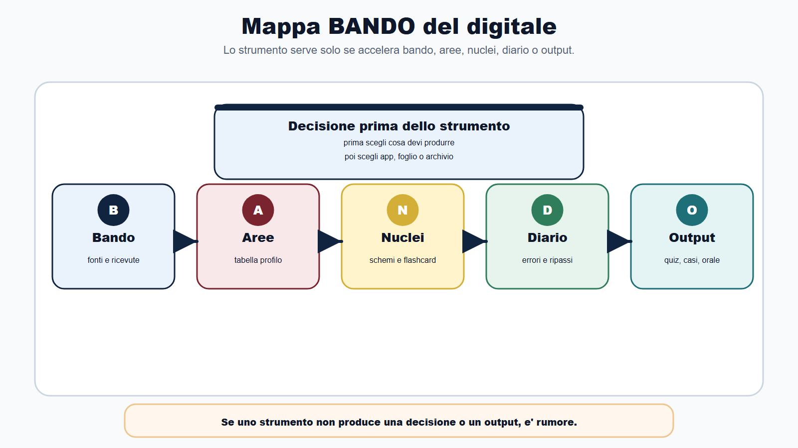
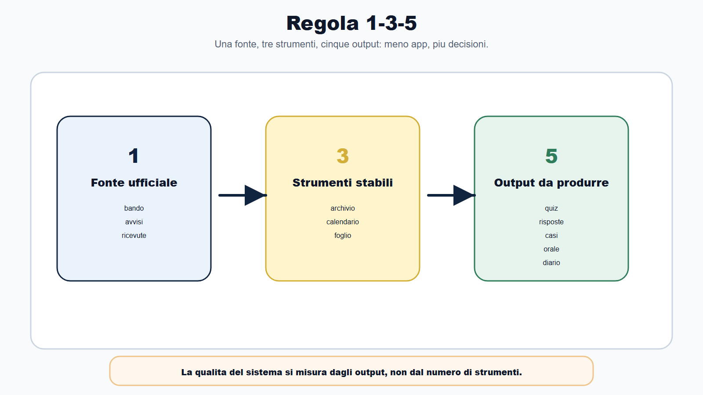
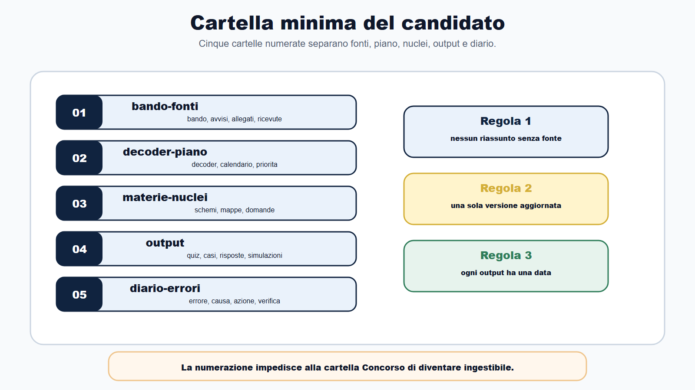
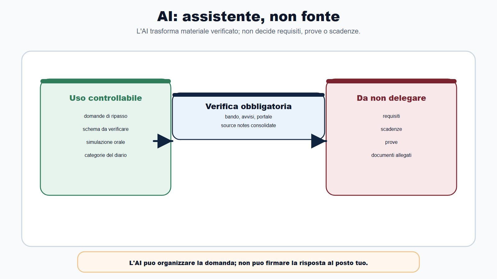
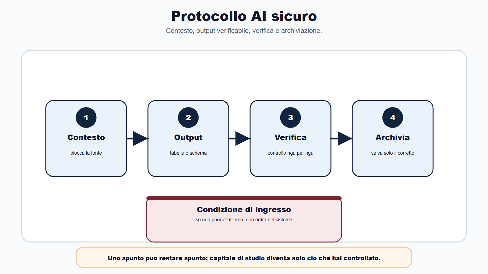
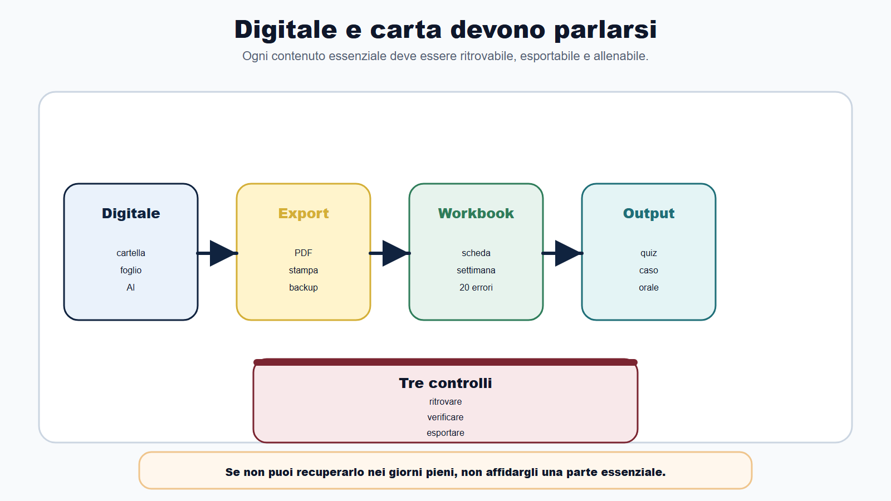
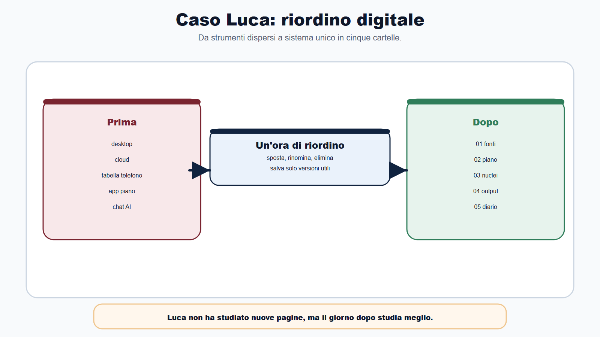

# Capitolo 28 - Usare il digitale senza perdere il metodo

Il digitale puo farti risparmiare settimane.

Puo anche farti perdere il controllo in tre giorni.

Dipende da come lo usi.

Un candidato apre il bando, salva il PDF, copia il programma in una nota, chiede a un assistente AI di fare un piano, scarica una app per flashcard, apre un calendario, entra in un gruppo, salva dieci messaggi, crea una cartella cloud, poi dimentica dove ha messo la versione corretta. Dopo una settimana ha piu strumenti che decisioni.

Questo capitolo serve a evitare proprio questo errore.

Il Metodo BANDO non e' contro il digitale. Al contrario: il digitale puo accelerare il Bando Decoder, i promemoria, il confronto tra bandi, il Diario degli errori, le simulazioni e la costruzione del capitale di studio. Ma il digitale deve restare al servizio del metodo.

La regola e' questa:

> prima viene la decisione di studio, poi lo strumento.

Se parti dallo strumento, rischi di organizzare benissimo il materiale sbagliato.

## Obiettivo del capitolo

Alla fine del capitolo saprai:

- scegliere pochi strumenti digitali utili;
- evitare cartelle, app e chat che aumentano confusione;
- usare AI e assistenti digitali senza delegare la verifica;
- distinguere fonte ufficiale, appunto, riassunto e output;
- costruire una cartella minima del candidato;
- esportare e proteggere i materiali essenziali;
- trasformare digitale e carta in un unico sistema;
- non perdere bando, scadenze, prove e diario dentro strumenti diversi.

Questo capitolo non ti dice quale app usare. Ti dice che funzione deve avere ogni strumento.

## Mappa BANDO del digitale

| Fase | Uso digitale corretto | Rischio da evitare |
|---|---|---|
| B - Bando | Salvare bando, avvisi, ricevute e link ufficiali | confondere fonte ufficiale e riassunto |
| A - Aree | Confrontare materie e profili in una tabella | duplicare programmi senza decidere priorita |
| N - Nuclei | Creare domande, flashcard, mappe e schemi | collezionare riassunti passivi |
| D - Diario | Tracciare errori, cause, ripassi e seconde verifiche | segnare errori senza azione correttiva |
| O - Output | Allenare quiz, casi, orale e simulazioni | studiare dentro l'app senza produrre prova |

Uno strumento digitale e' utile se rende piu rapido uno di questi passaggi. Se non lo fa, e' rumore.

## La regola 1-3-5

Per non disperderti, parti da una struttura minima:

- 1 fonte ufficiale principale per ogni procedura;
- 3 strumenti stabili;
- 5 output da produrre.

La fonte ufficiale principale e' il bando con i suoi avvisi. Se esistono portale, sito dell'amministrazione, Gazzetta Ufficiale o altre pagine richiamate dalla procedura, entrano nella scheda fonti, ma non sostituiscono il bando.

I tre strumenti possono essere semplici:

- una cartella o archivio;
- un calendario o promemoria;
- un foglio/template per Bando Decoder, piano e diario.

Gli output sono quelli che contano davvero:

- quiz svolti e corretti;
- risposte sintetiche;
- casi pratici;
- risposte orali;
- schede di errore o flashcard.

Se hai dieci strumenti ma nessun output, non stai studiando meglio. Stai amministrando il caos.

## La cartella minima del candidato

Il sistema digitale deve essere leggibile anche dopo un mese di stanchezza.

Usa una cartella per concorso, con cinque sotto-cartelle:

| Cartella | Contenuto | Regola |
|---|---|---|
| 01-bando-fonti | bando, avvisi, allegati, link ufficiali, ricevute | nessun riassunto senza fonte |
| 02-decoder-piano | Bando Decoder, calendario, priorita, tagli | una versione aggiornata |
| 03-materie-nuclei | schemi, mappe, domande, flashcard | solo materiale selezionato |
| 04-output | quiz, casi, risposte, simulazioni, orali | sempre con data |
| 05-diario-errori | errori, cause, azioni, seconde verifiche | ogni errore deve avere un'azione |

La numerazione serve a impedire che tutto finisca in una cartella generica chiamata "Concorso". Dopo due concorsi, quella cartella diventa inutilizzabile.

## AI: assistente, non fonte

Un assistente AI puo essere utile se gli chiedi lavori controllabili:

- trasformare una lista di argomenti in domande di ripasso;
- costruire una griglia di confronto tra due bandi gia letti;
- generare un esempio di risposta orale da migliorare;
- proporre categorie per il Diario degli errori;
- simulare una domanda da commissario;
- rendere piu chiaro un tuo schema.

Diventa pericoloso se gli chiedi di sostituire il bando:

- "Dimmi quali requisiti servono";
- "Qual e' la scadenza?";
- "Quali prove ci saranno?";
- "Questa norma e' aggiornata?";
- "Posso partecipare?";
- "Questo documento va allegato?".

Queste domande richiedono fonte ufficiale, lettura del bando e verifica umana. L'AI puo aiutarti a organizzare la domanda, non a firmare la risposta al posto tuo.

## Protocollo AI sicuro

Quando usi un assistente digitale, applica quattro passaggi.

| Passaggio | Azione | Domanda di controllo |
|---|---|---|
| 1. Fornisci contesto | incolla solo il blocco necessario o riassumi la fonte | da dove viene questa informazione? |
| 2. Chiedi output verificabile | tabella, domande, schema, checklist | posso controllarlo riga per riga? |
| 3. Verifica | confronta con bando, appunti e source notes | c'e qualcosa che cambia scadenza, prova o requisito? |
| 4. Archivia | salva solo la versione corretta | dove lo ritrovo tra due settimane? |

Se un output non e' verificabile, non entra nel tuo sistema. Puo restare come spunto, ma non diventa capitale di studio.

## Promemoria: pochi e decisivi

Il calendario digitale non deve diventare una lista infinita di notifiche.

Servono promemoria per:

- scadenza domanda;
- controllo avvisi;
- simulazioni;
- ripassi;
- verifica documenti;
- ultime 24 ore;
- eventuale prova orale.

Non servono notifiche per ogni micro-attivita. Se il telefono vibra dieci volte al giorno per ricordarti che devi studiare, dopo tre giorni smetti di ascoltarlo.

Il promemoria efficace segnala una decisione, non un senso di colpa.

## Digitale e carta devono parlarsi

Il libro resta completo anche senza sito, app o piattaforma. Per questo ogni strumento digitale deve avere una versione minima cartacea o esportabile.

Esempio:

- Bando Decoder digitale: esportabile in PDF o stampabile;
- Diario errori in foglio elettronico: riassunto settimanale su una pagina;
- flashcard digitali: lista dei 20 errori ricorrenti;
- calendario online: settimana stampabile;
- chat AI utile: output copiato, verificato e salvato nella cartella corretta.

Se non puoi esportare, stampare o ritrovare un contenuto, non affidargli una parte essenziale della preparazione.

## Tabella strumento/funzione/rischio

Prima di aggiungere un nuovo strumento, compila questa tabella.

| Strumento | Funzione nel Metodo BANDO | Rischio | Decisione |
|---|---|---|---|
| Cartella cloud | archiviare fonti e output | duplicati e versioni confuse | usare con nomi standard |
| Calendario | scadenze e simulazioni | troppe notifiche | solo eventi decisivi |
| Foglio elettronico | Bando Decoder, piano, diario | compilare senza studiare | revisioni settimanali |
| App flashcard | richiamo attivo | creare troppe schede | solo errori e nuclei |
| AI/chat | trasformare materiale in output | fidarsi senza verifica | usare con protocollo |
| Gruppi/social | segnalazioni e confronto | ansia, voci, informazioni non verificate | controllare sempre fonte |

La colonna piu importante e' "Decisione". Ogni strumento deve essere confermato, ridotto o eliminato.

## Caso guidato

Luca prepara un concorso amministrativo. Ha salvato il bando sul desktop, alcune lezioni in una cartella cloud, una tabella sul telefono, un piano in un'app, flashcard in un'altra app e risposte orali dentro una chat. Dopo dieci giorni non sa piu quale programma sia aggiornato.

Applica il Metodo BANDO:

1. crea una cartella unica del concorso;
2. sposta bando e avvisi in `01-bando-fonti`;
3. compila un solo Bando Decoder in `02-decoder-piano`;
4. salva schemi essenziali in `03-materie-nuclei`;
5. mette quiz e risposte in `04-output`;
6. trasforma gli errori in `05-diario-errori`;
7. elimina duplicati e app non necessarie;
8. usa l'AI solo per generare domande da verificare.

Dopo un'ora Luca non ha studiato nuove pagine, ma ha recuperato controllo. Il giorno dopo studia meglio perche sa dove si trova ogni decisione.

## Da sapere in 5 righe

1. Il digitale accelera il Metodo BANDO, ma non lo sostituisce.
2. Ogni strumento deve servire a bando, aree, nuclei, diario o output.
3. L'AI e' utile per trasformare materiale in esercizi verificabili, non per decidere requisiti e scadenze.
4. Le fonti ufficiali restano il riferimento per bando, avvisi, prove e documenti.
5. Se non puoi ritrovare, verificare o esportare un contenuto, non e' ancora capitale di studio.

## Domanda da commissario

**Domanda:** Come puo un candidato usare strumenti digitali e AI nella preparazione di un concorso pubblico senza perdere affidabilita?

**Risposta efficace:** deve distinguere fonte, strumento e output. La fonte ufficiale resta bando, avviso, portale o sito istituzionale. Lo strumento digitale serve a organizzare, ricordare, confrontare e trasformare il materiale. L'AI puo aiutare a creare domande, schemi, simulazioni e checklist, ma ogni informazione rilevante va verificata con la fonte. Il candidato deve mantenere un archivio ordinato, pochi strumenti stabili e output datati: quiz, casi, risposte orali, diario errori e schede di ripasso.

## Domanda-trappola

**Domanda:** Se un assistente AI produce un piano di studio chiaro, posso seguirlo direttamente?

**Risposta:** no, non direttamente. Un piano prodotto da AI puo essere una bozza, ma deve essere confrontato con bando, scadenze, prove, ore reali, materie prioritarie e Diario degli errori. Se non tiene conto del tuo tempo, del tuo profilo, delle prove e delle fonti ufficiali, e' un calendario elegante ma non necessariamente utile.

## Errore tipico

L'errore tipico e' cercare lo strumento perfetto.

Il candidato passa giorni a scegliere app, template, colori, cartelle e automazioni. Intanto non produce quiz corretti, risposte orali, casi o simulazioni.

Il digitale deve ridurre attrito, non creare un nuovo progetto.

La domanda corretta non e': "Qual e' l'app migliore?".

La domanda corretta e': "Quale output mi aiuta a produrre questa app entro questa settimana?".

## Mini-esercizio

Fai l'audit del tuo sistema digitale.

| Domanda | Risposta |
|---|---|
| Dove si trova il bando ufficiale? | |
| Dove si trova il Bando Decoder aggiornato? | |
| Dove segni scadenze e avvisi? | |
| Dove conservi quiz e simulazioni? | |
| Dove si trova il Diario degli errori? | |
| Quale app usi davvero ogni settimana? | |
| Quale strumento puoi eliminare? | |
| Quale contenuto devi esportare o stampare? | |
| Quale output produrrai con il digitale nei prossimi 7 giorni? | |

Se non sai rispondere alle prime cinque domande, il problema non e' studiare di piu. E' ricostruire il sistema.

## Checklist anti-dispersione digitale

Prima di aggiungere una nuova app, chat, foglio o piattaforma, verifica:

- risolve un problema reale;
- ha una funzione chiara nel Metodo BANDO;
- non duplica uno strumento gia esistente;
- permette esportazione o recupero;
- non nasconde la fonte ufficiale;
- produce un output allenabile;
- non aumenta notifiche inutili;
- puo essere mantenuta anche nei giorni pieni;
- ha una regola di revisione settimanale;
- puo essere abbandonata senza perdere il sistema.

Se la risposta e' negativa a tre voci, non aggiungere lo strumento.

## Riferimenti consolidati

- [[sources/strumenti-digitali-metodo-bando]]
- [[sources/metodo-bando-progetto-editoriale]]
- [[sources/struttura-madre-il-metodo-bando]]
- [[sources/template-bando-decoder-metodo-bando]]
- [[sources/piano-studio-personale-metodo-bando]]
- [[sources/checklist-operative-concorsi-metodo-bando]]
- [[sources/capitale-studio-riutilizzabile-metodo-bando]]
- [[sources/fonti-ufficiali-aggiornamento-metodo-bando-2026-06-03]]
- [[topics/strumenti-digitali-metodo-bando]]
- [[topics/bando-decoder]]
- [[topics/piano-30-60-90-giorni]]
- [[topics/diario-errori]]
- [[topics/capitale-studio-riutilizzabile]]
- [[topics/aggiornamento-fonti-concorsi]]

## Note di review

- La struttura madre originaria non prevedeva il Capitolo 28. Questo capitolo e' un'estensione editoriale: in revisione decidere se mantenerlo numerato, trasformarlo in bonus digitale o integrarlo nelle appendici.
- Il capitolo non deve essere letto come sostituzione digitale del libro-workbook. La promessa resta: il metodo funziona anche su carta.
- Eventuali esempi futuri di app, AI o piattaforme specifiche vanno verificati al momento della pubblicazione per evitare riferimenti obsoleti.
