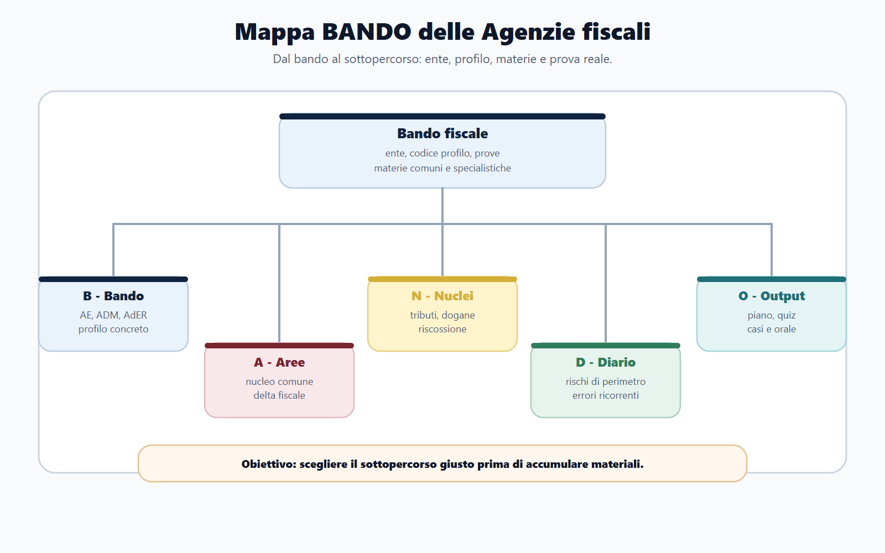
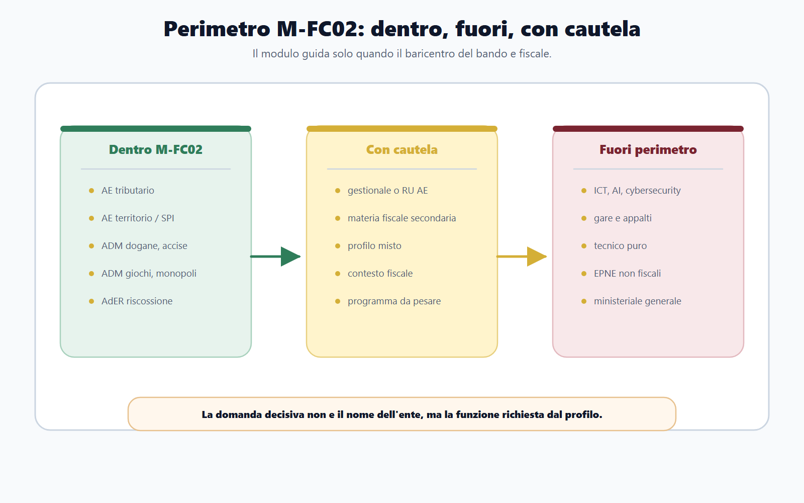
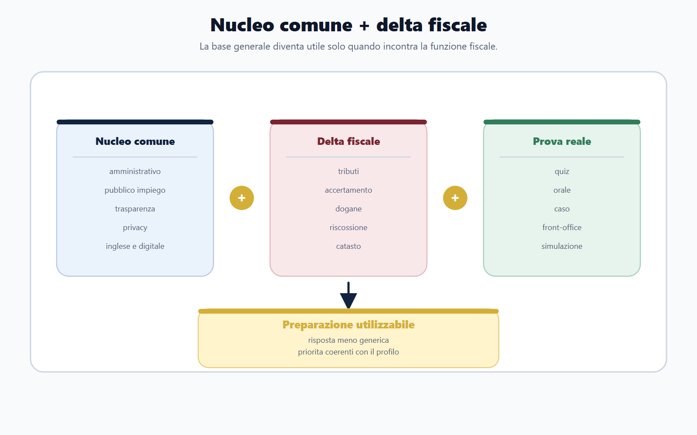

# Mappa delle Agenzie fiscali e dei profili concorsuali

## Apertura editoriale

Un concorso nelle Agenzie fiscali non e' un concorso amministrativo generico con qualche domanda in piu' di diritto tributario. E' un concorso nel quale l'ente, il profilo e il programma indicano una funzione pubblica precisa: gestione delle entrate, servizi fiscali, controllo, catasto, dogane, accise, giochi, monopoli o riscossione. Se questa funzione non viene riconosciuta subito, il candidato rischia di studiare molto, ma di studiare nel punto sbagliato.

Il primo errore nasce spesso da una lettura superficiale del bando. La presenza di diritto amministrativo, pubblico impiego, trasparenza, anticorruzione, inglese e informatica puo' far pensare a un impianto identico a quello dei concorsi ministeriali. In realta', nei profili fiscali il nucleo comune serve a sostenere la preparazione, non a sostituirla. La differenza concorsuale si gioca sul "delta fiscale": le materie e le attivita' che collegano l'amministrazione finanziaria al contribuente, all'operatore economico, al debitore iscritto a ruolo, all'immobile, alla merce, al tributo, all'accertamento e alla riscossione.

Questo capitolo costruisce la mappa di orientamento del modulo M-FC02. Prima di entrare nei singoli istituti, occorre sapere a quale famiglia appartiene il bando, quale sottopercorso attivare e quali materie vanno presidiate con priorita'. La mappa non serve a classificare per curiosita'. Serve a prendere decisioni operative: cosa studiare prima, cosa rinviare, quali moduli affiancare, quali rischi evitare.

## Obiettivo del capitolo

Al termine del capitolo devi saper fare quattro operazioni.

Prima: riconoscere se il bando rientra davvero nel modulo M-FC02 oppure se richiede un rinvio prevalente ad altro modulo specialistico.

Seconda: distinguere i tre grandi ingressi del perimetro fiscale: Agenzia delle Entrate, Agenzia delle Dogane e dei Monopoli, Agenzia delle Entrate-Riscossione.

Terza: collegare il profilo concorsuale alle materie che contano. Un funzionario tributario, un profilo catastale, un assistente amministrativo-tributario ADM e un addetto alla riscossione non richiedono lo stesso piano di studio, anche quando condividono alcune materie comuni.

Quarta: trasformare il bando in una scheda di lavoro. La scheda deve dirti dove si colloca il concorso, quali prove sono previste, quali materie sono comuni, quali sono specialistiche, quali moduli del Metodo BANDO devi affiancare e quale output devi produrre per non disperdere la preparazione.

## Come usare questo capitolo

Non leggere questo capitolo come una descrizione istituzionale delle Agenzie fiscali. Leggilo come una griglia di decisione. Ogni volta che incontri un bando, devi tornare a queste domande:

- l'ente e' Agenzia delle Entrate, Agenzia delle Dogane e dei Monopoli o Agenzia delle Entrate-Riscossione?
- il profilo lavora su tributi, controlli, servizi fiscali, territorio, dogane, accise, giochi, monopoli o riscossione?
- il programma contiene materie fiscali che non possono essere trattate come accessorie?
- il bando richiede anche un modulo esterno a M-FC02, per esempio digitale, gare, appalti, anticorruzione avanzata, bilancio o tecnico-ingegneristico?
- quale tipo di prova devo preparare: quiz, prova scritta tecnico-giuridica, quesiti situazionali, orale, casi pratici, front-office, simulazione finale?

La risposta a queste domande decide il piano. Il candidato che non le formula all'inizio finisce per accumulare materiali. Il candidato che le formula costruisce una preparazione selettiva.

## Mappa BANDO del capitolo

| Fase BANDO | Cosa devi osservare nel bando fiscale | Output del capitolo |
| --- | --- | --- |
| B - Bando | Ente, profilo, codice, prove, materie, sede, eventuali riserve o requisiti specifici. | Scheda di classificazione AE/ADM/AdER. |
| A - Analisi | Peso delle materie comuni e peso delle materie fiscali specialistiche. | Lista priorita': comune, fiscale, rinvii. |
| N - Nuclei | Tributi, accertamento, adempimenti, riscossione, dogane, accise, giochi, catasto, pubblicita' immobiliare. | Mappa ente/profilo/materia. |
| D - Domande | Tipologie di domanda prevedibili: definizioni, applicazioni, casi, differenze, procedimenti. | Diario rischi e domande-trappola. |
| O - Organizzazione | Sequenza di studio e moduli da affiancare. | Piano operativo per il sottopercorso scelto. |

Il metodo BANDO, qui, non parte dal manuale. Parte dal bando e ricostruisce il manuale necessario.

## Il perimetro di M-FC02

M-FC02 copre i concorsi che hanno come centro di gravita' le Agenzie fiscali e le funzioni fiscali in senso ampio. Il modulo comprende tre famiglie principali.

La prima e' l'Agenzia delle Entrate. Qui rientrano i profili collegati alle entrate tributarie, ai servizi fiscali, alla compliance, all'accertamento, ai controlli, ai servizi catastali, cartografici, estimativi e alla pubblicita' immobiliare.

La seconda e' l'Agenzia delle Dogane e dei Monopoli. Qui il baricentro si sposta su dogane, accise, giochi, monopoli, flussi economici regolati, operatori economici, controlli su merci e prodotti soggetti ad accisa.

La terza e' l'Agenzia delle Entrate-Riscossione. Qui il focus e' la riscossione nazionale: cartelle, pagamenti, rateizzazioni, sospensioni, rapporto con il contribuente-debitore, gestione del front-office e applicazione delle regole procedurali in un contesto ad alta esposizione con l'utenza.

Queste tre famiglie hanno un tratto comune: non basta sapere "diritto amministrativo". Occorre collegare amministrazione, procedimento, tributo e servizio. La dimensione fiscale modifica il linguaggio, le priorita' e anche il tipo di ragionamento richiesto in prova.

## Che cosa entra nel modulo

Entrano nel modulo M-FC02, in via principale:

- profili tributari e giuridico-tributari dell'Agenzia delle Entrate;
- profili collegati ai controlli fiscali e ai servizi fiscali;
- profili dell'Agenzia delle Entrate relativi a catasto, cartografia, estimo, osservatorio del mercato immobiliare e pubblicita' immobiliare;
- profili amministrativo-tributari dell'Agenzia delle Dogane e dei Monopoli;
- profili ADM su dogane, accise, giochi e monopoli;
- profili di assistente ADM quando il programma ha baricentro amministrativo-tributario;
- profili dell'Agenzia delle Entrate-Riscossione collegati alla riscossione, al rapporto con il contribuente e alle procedure operative di pagamento, rateizzazione e sospensione.

Questa lista non va interpretata come elenco chiuso. Il criterio decisivo non e' solo il nome del profilo, ma la funzione richiesta dal bando. Un profilo chiamato in modo generico puo' essere fiscale se il programma, le mansioni o le prove insistono su tributi, controlli, riscossione o dogane. Viceversa, un concorso bandito da una Agenzia fiscale puo' non essere davvero M-FC02 se il centro e' informatico, ingegneristico, appalti o gestione del personale.

## Che cosa resta fuori

Restano fuori dal perimetro principale di M-FC02, salvo richiami puntuali:

- profili ICT, cybersecurity, data science, intelligenza artificiale e sistemi informativi: rinvio prevalente a M-TR01 o al modulo digitale pertinente;
- profili su gare, contratti pubblici, procurement e appalti: rinvio prevalente al modulo sugli appalti e alla disciplina specialistica dei contratti pubblici;
- profili tecnico-ingegneristici puri, impiantistici, logistici o patrimoniali: rinvio al modulo tecnico corrispondente;
- concorsi di altri enti pubblici nazionali non fiscali, anche se contengono diritto tributario come materia secondaria;
- profili ministeriali generali, per i quali resta centrale M-FC01.

Il punto e' pratico: un modulo specialistico non deve attrarre tutto. Deve riconoscere il proprio campo. Studiare fiscalita' per un profilo informatico ADM puo' essere utile se il bando lo richiede, ma non trasforma quel concorso in un concorso fiscale in senso stretto. Lo stesso vale per un profilo appalti dell'Agenzia delle Entrate: l'ente e' fiscale, ma la funzione concorsuale puo' essere altra.

## Le tre porte di ingresso

### Agenzia delle Entrate

L'Agenzia delle Entrate e' la porta piu' ampia del modulo. Nei bandi rappresentativi degli ultimi anni compaiono profili numerosi e differenziati: funzionari tributari, profili giuridico-tributari, controlli fiscali, servizi fiscali, profili catastali, cartografici, estimativi e profili collegati alla pubblicita' immobiliare.

La caratteristica comune e' il rapporto tra disciplina tributaria e azione amministrativa. Il candidato deve saper leggere norme, procedimenti, adempimenti e servizi in modo integrato. Per un profilo tributario non basta memorizzare imposte, termini e definizioni. Occorre capire come l'Agenzia opera: orienta il contribuente, acquisisce dati, favorisce l'adempimento spontaneo, effettua controlli, gestisce atti, interpreta regole, applica procedure.

Nei profili territorio il centro cambia. Catasto, cartografia, estimo, mercato immobiliare e pubblicita' immobiliare richiedono un lessico tecnico diverso. Il candidato non puo' usare lo stesso piano del funzionario tributario puro. Deve riconoscere i collegamenti con la funzione fiscale, ma deve anche presidiare la parte tecnico-estimativa e immobiliare indicata dal bando.

### Agenzia delle Dogane e dei Monopoli

L'Agenzia delle Dogane e dei Monopoli introduce una fiscalita' diversa da quella piu' familiare al candidato medio. Qui contano dogane, accise, giochi, monopoli, controlli su flussi e operatori, circolazione delle merci, prodotti soggetti a imposizione specifica e mercati regolati.

Il candidato che prepara ADM con lo stesso schema usato per l'Agenzia delle Entrate sbaglia prospettiva. Il lessico cambia: dichiarazione doganale, controlli doganali, regimi, accise, autorizzazioni, operatori, giochi pubblici, monopoli. Anche il tipo di domanda cambia. Puo' essere piu' frequente il quesito applicativo: quale ufficio interviene, quale presupposto rileva, quale controllo si attiva, quale disciplina speciale prevale.

Questo non elimina il diritto amministrativo. Lo rende strumentale. Gli istituti generali servono a comprendere provvedimenti, controlli, procedimenti, responsabilita' e organizzazione. Ma il punteggio competitivo si costruisce sulla parte doganale, accise, giochi e monopoli quando il bando la pone al centro.

### Agenzia delle Entrate-Riscossione

Agenzia delle Entrate-Riscossione richiede una terza chiave. Il nucleo non e' l'accertamento in senso stretto e non e' la dogana. E' la riscossione. Il candidato incontra cartelle, pagamenti, rateizzazioni, sospensioni, strumenti di relazione con il contribuente-debitore e regole operative che incidono direttamente sull'utenza.

Qui la preparazione deve unire tre piani: norma, procedura e servizio. Una risposta astratta puo' essere corretta in teoria ma insufficiente in prova se non mostra consapevolezza del rapporto con il debitore, della documentazione, dei termini, dei canali di pagamento, delle richieste di rateizzazione o sospensione e della gestione ordinata del front-office.

Nel profilo AdER, la domanda-trappola tipica consiste nel confondere accertamento e riscossione. L'accertamento riguarda la determinazione e il controllo del tributo; la riscossione riguarda la fase in cui il credito viene portato a pagamento secondo le regole previste. Le due aree dialogano, ma non sono la stessa cosa.

## Profili e segnali da leggere nel bando

La seguente tabella serve come prima classificazione. Non sostituisce il bando, ma aiuta a leggerlo.

| Segnale nel bando | Classificazione probabile | Cosa studiare con priorita' |
| --- | --- | --- |
| Funzionario tributario, giuridico-tributario, controlli fiscali, servizi fiscali | AE tributario | Diritto tributario, accertamento, adempimenti, servizi fiscali, amministrativo applicato. |
| Catasto, cartografia, estimo, OMI, pubblicita' immobiliare | AE territorio/SPI | Catasto, estimo, pubblicita' immobiliare, elementi fiscali collegati, amministrativo applicato. |
| Funzionario amministrativo-tributario ADM | ADM fiscale | Dogane, accise, giochi, monopoli, controlli, amministrativo. |
| Assistente ADM con programma amministrativo-tributario | ADM assistenti | Nozioni amministrative, dogane/accise/giochi secondo bando, procedure operative. |
| Addetto riscossione, sportello, rapporto contribuente-debitore | AdER riscossione | Riscossione, cartelle, pagamenti, rateizzazioni, sospensioni, front-office. |
| Risorse umane, organizzazione interna, gestione personale | Profilo gestionale con cautela | M-FC02 solo se il programma fiscale e' significativo; altrimenti M-FC01 o modulo organizzativo. |
| ICT, AI, cybersecurity, dati, sistemi informativi | Fuori perimetro prevalente | Modulo digitale/tecnico; M-FC02 solo per contesto istituzionale. |
| Gare, appalti, contratti, procurement | Fuori perimetro prevalente | Modulo contratti pubblici; M-FC02 solo per inquadramento dell'ente. |
| Ingegneria, impianti, logistica tecnica, patrimonio immobiliare tecnico | Fuori perimetro prevalente | Modulo tecnico; eventuale fiscalita' solo accessoria. |

Questa tabella deve essere compilata a matita, non scolpita nella pietra. Ogni bando va letto nella sua formulazione effettiva. Il nome del profilo e' un indizio; il programma d'esame e' la prova.

## Il nucleo comune non basta

I concorsi delle Agenzie fiscali condividono spesso materie comuni con altri concorsi pubblici: diritto amministrativo, diritto costituzionale, pubblico impiego, trasparenza, anticorruzione, privacy, inglese, informatica, logica o competenze trasversali. Queste materie non vanno sottovalutate. Sono il pavimento minimo della preparazione.

Il problema nasce quando il candidato le trasforma nel soffitto. Nei concorsi fiscali il pavimento comune non produce da solo vantaggio competitivo. Il vantaggio nasce dalla capacita' di usare il nucleo comune dentro una funzione fiscale specifica.

Per esempio, il procedimento amministrativo va studiato anche per capire atti, controlli, comunicazioni, partecipazione, responsabilita' e accesso agli atti. Ma in un profilo tributario queste categorie devono poi incontrare l'accertamento e i servizi fiscali. In un profilo ADM devono incontrare dogane, accise e controlli. In AdER devono incontrare riscossione, istanze del contribuente, rateizzazioni e sospensioni.

La formula e' semplice:

> nucleo comune + delta fiscale = preparazione concorsuale utilizzabile.

Senza nucleo comune, la risposta e' fragile. Senza delta fiscale, la risposta e' generica.

## Le materie che spostano il piano

Non tutte le materie del programma hanno lo stesso effetto organizzativo. Alcune possono essere studiate con una scansione ordinaria; altre cambiano il piano settimanale.

| Materia o area | Perche' incide sul piano | Rischio se trattata tardi |
| --- | --- | --- |
| Diritto tributario | E' spesso il centro dei profili AE e di molti profili fiscali. | Memorizzazione frettolosa, scarsa capacita' applicativa. |
| Accertamento e controlli | Collega norma, potere amministrativo e rapporto con il contribuente. | Confusione tra definizioni, fasi e atti. |
| Adempimenti e servizi fiscali | Richiede concretezza operativa. | Risposte astratte, poco aderenti al lavoro reale. |
| Riscossione | E' il cuore dei profili AdER e dialoga con tributi e procedura. | Confusione tra accertamento, pagamento, cartella, rateizzazione e sospensione. |
| Dogane | E' area specialistica ADM, con lessico proprio. | Studio generico non trasferibile ai quesiti. |
| Accise, giochi e monopoli | Sono settori regolati con discipline specifiche. | Sottovalutazione di nozioni che possono decidere il punteggio. |
| Catasto, cartografia, estimo | Sono centrali nei profili territorio dell'AE. | Piano troppo giuridico e poco tecnico. |
| Contabilita' aziendale, civile e commerciale | Ricorrono in alcuni profili e vanno pesate sul bando. | Accumulo disordinato di manuali non selezionati. |

Il piano corretto non chiede di studiare tutto subito. Chiede di non rinviare cio' che definisce il profilo.

## Dentro o fuori: la tabella di perimetro

Quando il bando e' ambiguo, usa questa tabella.

| Domanda | Se la risposta e' si' | Decisione |
| --- | --- | --- |
| L'ente e' AE, ADM o AdER? | Il bando appartiene al mondo fiscale. | Procedi alla verifica del profilo. |
| Il profilo lavora su tributi, controlli, servizi fiscali, territorio, dogane, accise, giochi, monopoli o riscossione? | Il nucleo specialistico e' fiscale. | Attiva M-FC02 come modulo principale. |
| Le materie fiscali sono presenti ma secondarie? | Il bando usa il contesto fiscale, ma il ruolo puo' essere altro. | M-FC02 come supporto, non come modulo guida. |
| Il centro del programma e' ICT, appalti, tecnico-ingegneristico o risorse umane? | La funzione prevalente non e' fiscale. | Attiva il modulo specialistico corrispondente. |
| Il bando riguarda un ente non fiscale con una materia tributaria accessoria? | La fiscalita' e' materia singola, non profilo. | Studia tributario come materia, non come percorso M-FC02. |

Questa verifica evita due errori opposti: entrare nel modulo sbagliato e uscire dal modulo giusto. Entrambi costano tempo.

## Il Bando Decoder fiscale

Ogni bando M-FC02 deve essere trasformato in una scheda. La scheda minima contiene questi campi.

| Campo | Cosa scrivere |
| --- | --- |
| Ente | Agenzia delle Entrate, Agenzia delle Dogane e dei Monopoli, Agenzia delle Entrate-Riscossione. |
| Codice profilo | Sigla o denominazione esatta usata dal bando. |
| Famiglia | AE tributario, AE territorio/SPI, ADM amministrativo-tributario, AdER riscossione, fuori perimetro o perimetro misto. |
| Prove | Quiz, prova scritta, orale, prova tecnico-pratica, prova situazionale, colloquio, eventuali titoli. |
| Materie comuni | Amministrativo, costituzionale, pubblico impiego, trasparenza, anticorruzione, privacy, inglese, informatica, logica. |
| Materie M-FC02 | Tributario, accertamento, adempimenti, riscossione, dogane, accise, giochi, monopoli, catasto, estimo, pubblicita' immobiliare. |
| Moduli da affiancare | M-FC01, M-TR01, M-TR02, M-TR03, M-FC03 o altri moduli, solo se il bando lo richiede. |
| Rischio principale | Genericita', sottovalutazione del tributario, confusione accertamento/riscossione, uso del modulo sbagliato. |
| Output | Piano di studio, tabella materie, diario errori, simulazioni mirate, domande da commissario. |

Questa scheda deve essere prodotta prima di acquistare nuovi materiali o iniziare una programmazione settimanale. Un manuale scelto prima del decoder puo' essere buono in astratto e inutile per quel bando.

## Come cambia la risposta in base all'ente

La stessa parola puo' assumere peso diverso nei tre ambienti.

"Controllo", in Agenzia delle Entrate, puo' richiamare l'attivita' di verifica degli adempimenti tributari e l'accertamento. In ADM puo' riguardare flussi doganali, merci, accise, giochi e monopoli. In AdER puo' assumere una dimensione piu' procedurale e documentale collegata alla riscossione e alla posizione del contribuente-debitore.

"Servizio al cittadino" non e' una formula generica. In AE puo' significare assistenza fiscale, dichiarazioni, consultazioni, adempimenti e servizi catastali. In AdER puo' riguardare sportello, canali di pagamento, rateizzazione, sospensione e informazioni sulla posizione debitoria. In ADM puo' coinvolgere operatori economici e soggetti regolati.

"Procedimento" non va trattato come tema isolato. E' la grammatica con cui la pubblica amministrazione opera; nei concorsi fiscali deve essere declinato sul procedimento concreto che il profilo incontra.

Questa elasticita' e' la differenza tra una risposta scolastica e una risposta professionale.

## Cosa studiare prima

Nel primo ciclo di studio, il candidato deve proteggere tre blocchi.

Il primo blocco e' il nucleo comune. Diritto amministrativo, principi costituzionali, pubblico impiego, trasparenza e anticorruzione restano necessari. Non vanno abbandonati per inseguire solo le materie fiscali.

Il secondo blocco e' il nucleo fiscale del profilo. Per AE tributario sara' diritto tributario con accertamento, adempimenti e servizi fiscali. Per AE territorio saranno catasto, cartografia, estimo e pubblicita' immobiliare. Per ADM saranno dogane, accise, giochi e monopoli. Per AdER sara' riscossione.

Il terzo blocco e' la prova. Un programma identico cambia se la prova e' a quiz, scritta argomentativa, orale o situazionale. Il quiz richiede ripetizione, differenze secche e trappole. L'orale richiede definizioni ordinate e collegamenti. Il caso pratico richiede procedura, priorita', linguaggio e decisione.

La sequenza non e' "prima tutto il diritto amministrativo, poi tutto il tributario". E' alternanza controllata: comune, fiscale, domanda. Ogni settimana deve contenere almeno una verifica sul nucleo che decide il profilo.

## Esempio di lettura: bando AE tributario

Immagina un bando dell'Agenzia delle Entrate per funzionari tributari o giuridico-tributari. La prima tentazione e' aprire un manuale generale da concorsi pubblici e procedere per materie comuni. Questo approccio produce una base, ma non costruisce ancora il profilo.

La lettura corretta e' diversa:

- ente: Agenzia delle Entrate;
- famiglia: AE tributario;
- funzione: entrate, servizi fiscali, accertamento, rapporto con il contribuente;
- materie comuni: amministrativo, costituzionale, pubblico impiego e discipline generali indicate dal bando;
- materie specialistiche: tributario, adempimenti, controlli, accertamento, eventuali elementi di civile, commerciale, contabilita' o economia se indicati;
- rischio: trattare il tributario come capitolo finale;
- output: piano settimanale che inserisce subito tributario e domande applicative.

La domanda-guida diventa: "Come uso le categorie generali dell'amministrativo per rispondere a una funzione fiscale dell'Agenzia delle Entrate?". Se non sai rispondere, stai ancora studiando in modo generico.

## Esempio di lettura: bando ADM

Immagina un bando dell'Agenzia delle Dogane e dei Monopoli per funzionari o assistenti amministrativo-tributari. La presenza della parola "tributario" non autorizza a replicare automaticamente il piano AE.

La scheda deve evidenziare:

- ente: Agenzia delle Dogane e dei Monopoli;
- famiglia: ADM amministrativo-tributario;
- funzione: dogane, accise, giochi, monopoli, controlli su flussi e operatori;
- materie comuni: amministrativo e organizzazione pubblica secondo bando;
- materie specialistiche: dogane, accise, giochi, monopoli, eventuali riferimenti europei o settoriali;
- rischio: studiare solo tributario interno e ignorare il lessico doganale;
- output: glossario specialistico e simulazioni su differenze tra aree.

Qui il candidato deve costruire un vocabolario specifico. Senza vocabolario, anche una buona conoscenza generale si disperde.

## Esempio di lettura: bando AdER

Immagina un bando per addetti alla riscossione. La parola decisiva e' riscossione. Il candidato deve concentrarsi sul passaggio dal credito alla gestione del pagamento e del rapporto con il contribuente-debitore.

La scheda deve indicare:

- ente: Agenzia delle Entrate-Riscossione;
- famiglia: AdER riscossione;
- funzione: cartelle, pagamenti, rateizzazioni, sospensioni, canali di relazione con l'utenza;
- materie comuni: amministrativo, rapporto di lavoro, trasparenza, privacy e competenze trasversali secondo bando;
- materie specialistiche: riscossione e procedure operative;
- rischio: confondere riscossione e accertamento;
- output: mappe procedurali e casi di sportello.

In questo sottopercorso e' particolarmente importante il linguaggio. La risposta deve essere giuridicamente corretta, ma anche comprensibile in un contesto di servizio.

## Caso guidato

Un candidato trova tre bandi aperti nello stesso periodo.

Il primo riguarda funzionari tributari dell'Agenzia delle Entrate. Il secondo riguarda assistenti amministrativo-tributari dell'Agenzia delle Dogane e dei Monopoli. Il terzo riguarda un profilo ICT presso una Agenzia fiscale.

Se il candidato usa un solo piano, fallisce la classificazione. Deve invece procedere cosi'.

Per il primo bando attiva M-FC02 come modulo principale, sottopercorso AE tributario. Il piano deve proteggere diritto tributario, adempimenti, accertamento, servizi fiscali e materie comuni. Il rischio e' studiare tanto amministrativo e arrivare tardi sul tributario.

Per il secondo bando attiva M-FC02 come modulo principale, sottopercorso ADM. Il piano deve spostarsi su dogane, accise, giochi, monopoli e controlli. Il rischio e' pensare che "tributario" significhi sempre lo stesso programma.

Per il terzo bando non attiva M-FC02 come modulo principale. L'ente e' fiscale, ma il profilo e' ICT. Il modulo fiscale puo' servire per capire il contesto istituzionale, ma la preparazione vera richiede il modulo tecnico-digitale pertinente.

La decisione corretta non dipende dall'interesse personale del candidato. Dipende dalla funzione descritta dal bando.

## Da sapere in 5 righe

1. M-FC02 copre i concorsi con baricentro fiscale: AE, ADM e AdER.
2. Il nome dell'ente non basta: contano profilo, mansioni, prove e programma.
3. Il nucleo comune e' necessario, ma il vantaggio nasce dal delta fiscale.
4. AE, ADM e AdER richiedono lessico e priorita' diverse.
5. I profili ICT, appalti e tecnico-ingegneristici puri vanno rinviati al modulo specialistico corretto.

## Domanda da commissario

**Domanda.** Perche' un concorso presso una Agenzia fiscale non deve essere preparato automaticamente come un concorso amministrativo generale?

**Risposta guida.** Perche' il bando delle Agenzie fiscali collega le materie comuni a funzioni specialistiche. Il diritto amministrativo, il pubblico impiego e le regole generali restano importanti, ma devono essere applicati a tributi, controlli, servizi fiscali, dogane, accise, giochi, monopoli, catasto o riscossione. La preparazione corretta parte dall'ente e dal profilo, individua il nucleo comune, riconosce il delta fiscale e costruisce esercizi coerenti con le prove previste.

La risposta diventa piu' forte se aggiungi un esempio: Agenzia delle Entrate, ADM e AdER non usano lo stesso linguaggio operativo. Un profilo tributario AE, un profilo ADM e un addetto alla riscossione condividono categorie amministrative, ma non la stessa funzione.

## Domanda-trappola

**Domanda.** Se il bando e' pubblicato da una Agenzia fiscale, il modulo M-FC02 e' sempre il modulo principale?

**Risposta corretta.** No. L'ente e' un indizio, non la prova definitiva. Se il profilo e il programma sono fiscali, M-FC02 e' il modulo principale. Se invece il centro e' ICT, appalti, tecnico-ingegneristico, gestione del personale o altra area specialistica, M-FC02 puo' servire solo come inquadramento. Il modulo principale va scelto in base alla funzione concorsuale.

**Perche' e' una trappola.** La domanda confonde appartenenza istituzionale e contenuto del profilo. Nei concorsi pubblici conta il bando concreto, non l'etichetta esterna.

## Errore tipico

L'errore piu' frequente e' iniziare dal materiale disponibile invece che dal bando.

Il candidato ha un manuale di diritto amministrativo, una banca dati generale e qualche schema di tributario. Li usa in quest'ordine, perche' sono gia' pronti. Dopo alcune settimane conosce meglio le materie comuni, ma non ha ancora capito se il suo concorso e' AE tributario, AE territorio, ADM o AdER. Quando arriva alle materie specialistiche, le tratta come aggiunta finale.

La correzione e' semplice ma esigente: prima compili il Bando Decoder fiscale, poi scegli il materiale. Il materiale non guida il bando. Il bando guida il materiale.

## Mini-esercizio

Prendi un bando fiscale reale o simulato e compila questa scheda.

| Campo | Risposta |
| --- | --- |
| Ente |  |
| Codice profilo |  |
| Famiglia M-FC02 |  |
| Prove previste |  |
| Tre materie comuni |  |
| Tre materie specialistiche |  |
| Moduli da affiancare |  |
| Primo rischio di perimetro |  |
| Prima azione di studio entro 48 ore |  |

Poi controlla la coerenza con questa domanda finale:

> Se dovessi spiegare in un minuto che lavoro andrai a preparare, sapresti distinguere ente, funzione e materie decisive?

Se la risposta e' no, non iniziare ancora il piano settimanale. Torna al bando.

## Diario dei rischi di perimetro

Nel modulo M-FC02 devi tenere un diario breve dei rischi. Non e' un diario emotivo. E' uno strumento tecnico.

Scrivi una riga ogni volta che incontri uno di questi segnali:

- sto studiando una materia comune senza collegarla alla funzione fiscale;
- sto rinviando tributario, dogane, riscossione o catasto perche' mi sembrano piu' difficili;
- sto usando lo stesso piano per AE e ADM;
- sto confondendo accertamento e riscossione;
- sto preparando un profilo ICT, appalti o tecnico come se fosse fiscale;
- non so dire quale output produrra' la sessione di studio.

Accanto a ogni riga indica la correzione: tabella, glossario, caso, quiz mirato, ripasso comparativo, rinvio ad altro modulo. Il rischio non va solo riconosciuto. Va trasformato in azione.

## Checklist operativa finale

Prima di passare al capitolo successivo, verifica questi punti.

- Ho identificato l'ente: AE, ADM o AdER.
- Ho letto il profilo esatto, non solo il titolo del concorso.
- Ho distinto materie comuni e materie specialistiche.
- Ho capito se M-FC02 e' modulo principale o modulo di supporto.
- Ho individuato eventuali rinvii a moduli digitali, appalti, tecnici o ministeriali.
- Ho scritto il rischio principale del mio bando.
- Ho prodotto una scheda Bando Decoder fiscale.
- Ho fissato una prima sessione sul nucleo specialistico, non solo sulle materie comuni.

Se manca uno di questi punti, il capitolo non e' ancora stato usato. E' stato solo letto.

## Riferimenti consolidati

Questo capitolo e' costruito sulle note e sulle pagine consolidate del wiki del progetto:

- [[sources/m-fc02-dossier-redazionale-agenzie-fiscali]]
- [[sources/bandi-rappresentativi-m-fc02-agenzie-fiscali-2023-2026]]
- [[sources/agenzie-fiscali-organizzazione-ae-adm-ader]]
- [[sources/d-lgs-30-luglio-1999-n-300-organizzazione-governo]]
- [[topics/profili-agenzie-fiscali]]
- [[topics/bando-decoder-fiscale]]
- [[entities/agenzia-delle-entrate]]
- [[entities/agenzia-delle-dogane-e-dei-monopoli]]
- [[entities/agenzia-entrate-riscossione]]
- [[books/il-metodo-bando/chapters/famiglie-concorsi-pubblici]]

Le pagine ufficiali e i bandi rappresentativi sono stati usati per delimitare il perimetro, non per sostituire la lettura del singolo bando vigente. Prima della pubblicazione definitiva del modulo, restano da verificare statuti, regolamenti, organigrammi aggiornati e programmi dei bandi vivi.

## Note di review

- Verificare, in fase di pubblicazione, le pagine istituzionali aggiornate di Agenzia delle Entrate, Agenzia delle Dogane e dei Monopoli, Agenzia delle Entrate-Riscossione e MEF.
- Aggiornare eventuali esempi se nuovi bandi modificano famiglie di profili, denominazioni o prove.
- Mantenere il rinvio fuori perimetro per ICT, appalti e profili tecnico-ingegneristici quando il bando non ha baricentro fiscale.
- Controllare la coerenza terminologica tra "riscossione", "accertamento", "servizi fiscali", "dogane", "accise", "giochi", "monopoli", "catasto" e "pubblicita' immobiliare" nei capitoli successivi.
