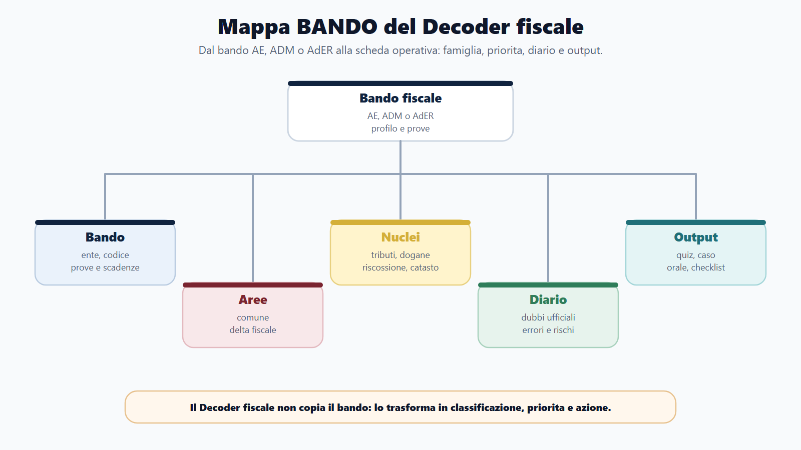
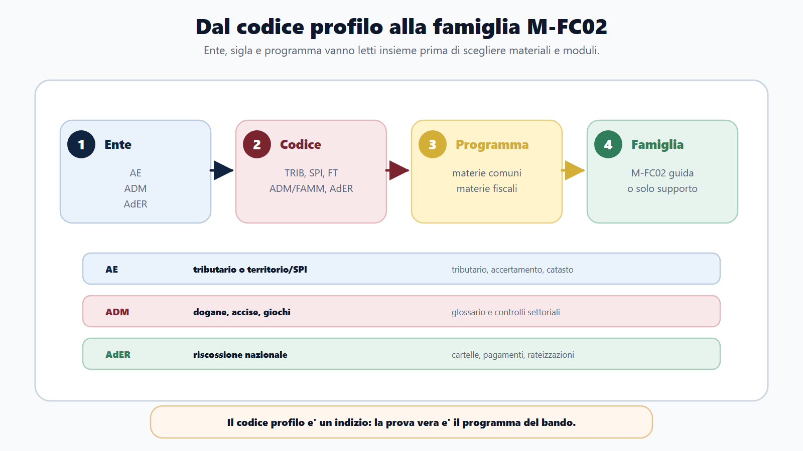
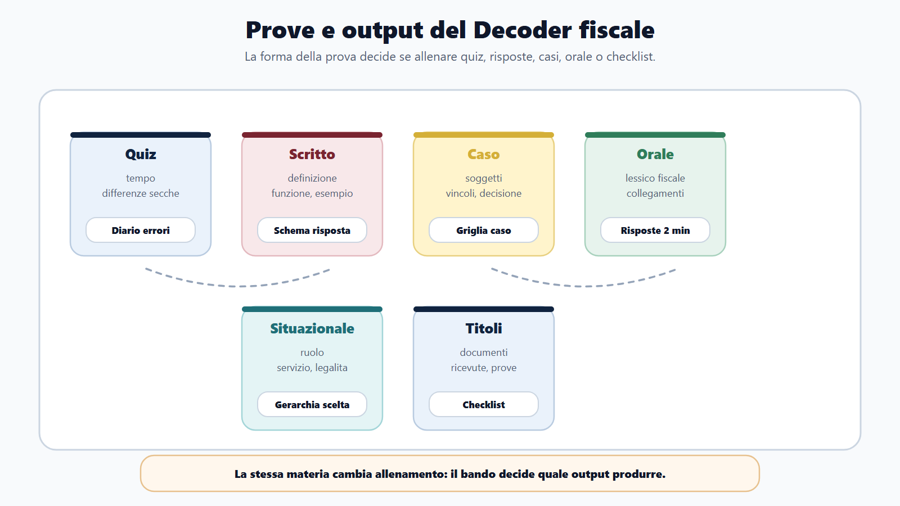
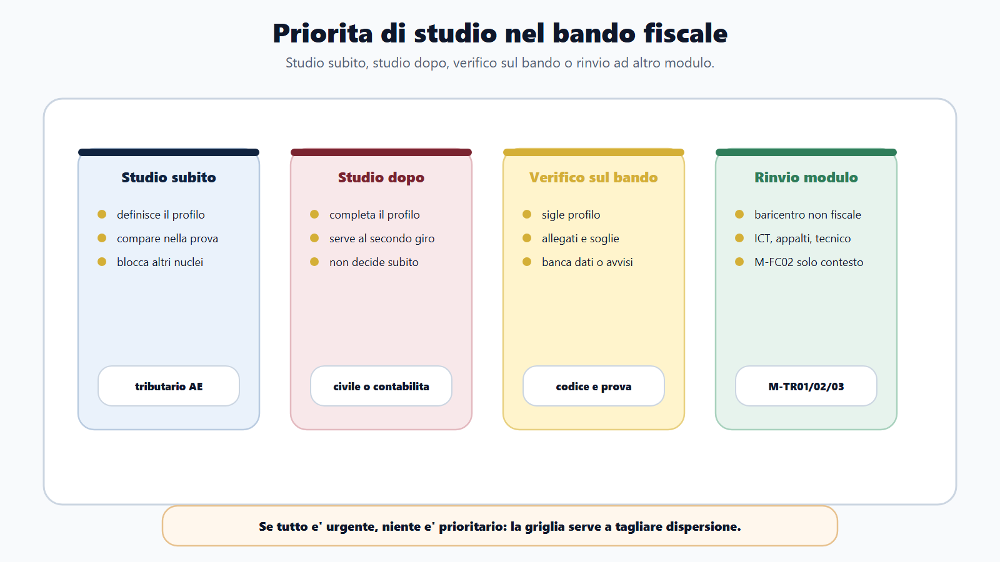
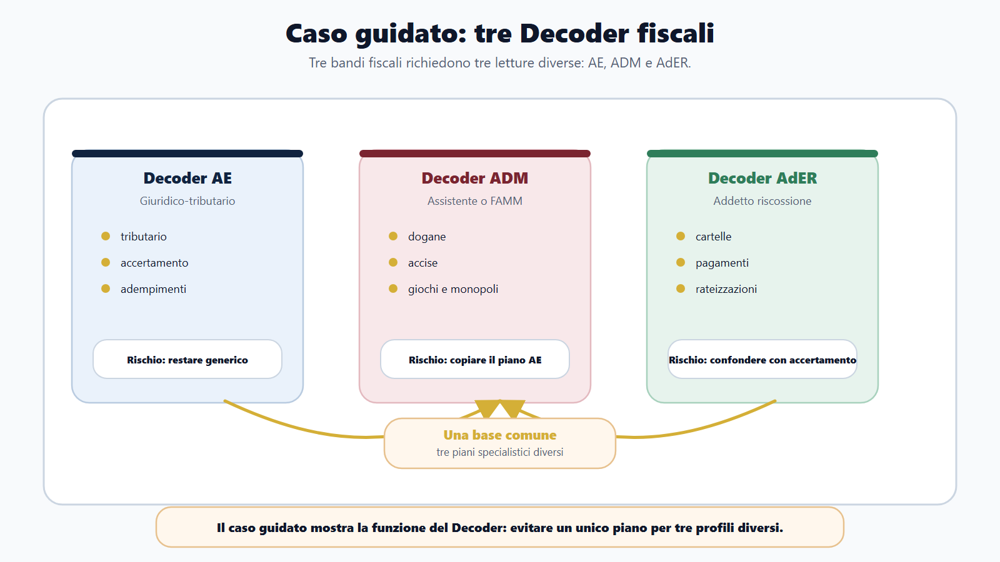

# Bando Decoder fiscale

## Specifica struttura madre

### Obiettivo
Trasformare un bando AE, ADM o AdER in piano di studio: codice profilo, prove, materie base, materie M-FC02, materie da rinviare e output di allenamento.

### Nuclei
- Lettura di ente, profilo, codice e prove.
- Identificazione di TRIB, SPI, FT, ADM/FAMM, assistenti ADM e AdER.
- Materie killer e materie accessorie.
- Rinvii a M-TR01, M-TR02, M-TR03 e M-FC03.

### Output operativo
Scheda Bando Decoder compilabile, griglia priorita, schema "studio subito/studio dopo/verifico sul bando".

### Riferimenti consolidati
- [[topics/bando-decoder-fiscale]]
- [[sources/bandi-rappresentativi-m-fc02-agenzie-fiscali-2023-2026]]

## Scheda di lavoro

Questa sezione conserva la traccia tecnica del capitolo. Il testo editoriale seguente sviluppa la scheda in forma di manuale-workbook, usando il Bando Decoder generale del Metodo BANDO e specializzandolo per Agenzia delle Entrate, Agenzia delle Dogane e dei Monopoli e Agenzia delle Entrate-Riscossione.

## Testo editoriale

### Apertura editoriale

Il capitolo precedente ti ha dato la mappa delle Agenzie fiscali. Questo capitolo fa un passo ulteriore: prende un bando concreto e lo trasforma in un piano di lavoro.

Nei concorsi fiscali il bando non e' solo un elenco di materie. E' una sequenza di segnali: ente, codice profilo, famiglia professionale, prove, soglie, programma, eventuali allegati, rinvii a portali ufficiali, titoli, sedi, comunicazioni successive. Se questi segnali vengono letti uno alla volta, il candidato accumula informazioni. Se vengono letti con metodo, diventano decisioni.

Il Bando Decoder fiscale serve esattamente a questo. Non sostituisce il bando e non pretende di indovinare il programma. Costringe il candidato a scrivere nero su bianco tre cose: che cosa il bando chiede, che cosa va studiato subito e che cosa deve essere verificato prima di investire tempo o denaro.

La differenza e' pratica. Un candidato generico legge "diritto tributario" e apre un manuale. Un candidato che usa il Decoder fiscale capisce prima se il profilo e' tributario, territorio/SPI, doganale, riscossione, assistente amministrativo-tributario, tecnico, digitale o fuori perimetro. Solo dopo sceglie materiali, esercizi e calendario.

### Obiettivo del capitolo

Al termine del capitolo devi saper compilare una scheda Bando Decoder fiscale per un bando AE, ADM o AdER.

In particolare, devi saper:

- individuare ente, codice profilo, famiglia M-FC02 e prove previste;
- distinguere materie comuni, materie fiscali specialistiche e materie da rinviare ad altri moduli;
- riconoscere i segnali tipici di profili TRIB, SPI, tecnici/territorio, ADM/FAMM, assistenti ADM e AdER;
- classificare le materie in "studio subito", "studio dopo" e "verifico sul bando";
- trasformare la lettura del bando in output: quiz, risposta scritta, caso, orale, glossario, diario errori o checklist.

Il risultato non e' una bella scheda compilata. Il risultato e' una prima settimana di studio piu' lucida.

### Cosa cambia rispetto al Decoder generale

Il Bando Decoder generale del Metodo BANDO, sviluppato nel libro principale, vale per qualsiasi concorso pubblico: requisiti, domanda, prove, materie, punteggi, calendario, rischi e decisione finale.

Il Decoder fiscale aggiunge un livello specialistico. Nei concorsi M-FC02 non basta scrivere "Agenzia fiscale" o "diritto tributario". Devi capire quale funzione fiscale viene selezionata.

La domanda operativa e' questa:

> questo bando mi sta chiedendo di preparare un profilo AE, ADM, AdER o un profilo bandito da una Agenzia fiscale ma centrato su altro?

Da questa risposta dipende il piano. Un profilo tributario AE, un profilo servizi di pubblicita immobiliare, un assistente ADM e un addetto alla riscossione possono condividere materie comuni, ma non hanno lo stesso baricentro. Il Decoder fiscale impedisce di appiattirli in un unico programma indistinto.

### Mappa BANDO del capitolo

| Fase BANDO | Domanda sul bando fiscale | Decisione prodotta |
| --- | --- | --- |
| B - Bando | Quale ente assume, quale profilo, con quale codice e quali prove? | Identita del concorso e famiglia M-FC02. |
| A - Aree | Quali aree comuni e quali aree fiscali compaiono nel programma? | Separazione tra nucleo base, delta fiscale e rinvii. |
| N - Nuclei | Quali nuclei decidono il punteggio per quel profilo? | Priorita: studio subito, studio dopo, verifica. |
| D - Diario | Quali dubbi, scadenze, comunicazioni e rischi devo monitorare? | Diario bando, diario errori e alert ufficiali. |
| O - Output | Che cosa devo produrre per allenarmi sulla prova? | Quiz, casi, risposte orali, schemi, glossario, simulazioni. |

Il Decoder fiscale non parte da quello che ti piace studiare. Parte da quello che il bando rende inevitabile.

### Le cinque regole di compilazione

#### 1. Usa sempre la fonte ufficiale

La scheda va compilata dal bando, dall'avviso, dagli allegati e dai canali ufficiali indicati. Le sintesi online possono aiutare a orientarti, ma non sono la base della decisione.

Se un dato non e' chiaro, non riempire il campo a memoria. Scrivi `da verificare` e indica dove andrai a controllare: bando, allegato, pagina concorsi dell'ente, portale inPA, comunicazione ufficiale successiva.

#### 2. Non dedurre il profilo solo dal nome dell'ente

Il fatto che il bando sia collegato ad AE, ADM o AdER non basta. Conta il profilo. Un concorso presso una Agenzia fiscale puo' avere baricentro tributario, doganale, riscossione, tecnico, digitale, gestionale, appalti o altro.

Il modulo M-FC02 e' principale quando il centro e' fiscale. Diventa supporto quando il centro e' un'altra funzione.

#### 3. Leggi codice e denominazione insieme

Nei bandi rappresentativi del perimetro M-FC02 ricorrono sigle, codici o denominazioni che orientano il candidato: profili tributari, giuridico-tributari, servizi di pubblicita immobiliare, funzioni tecniche, profili amministrativo-tributari ADM, assistenti ADM, addetti riscossione AdER.

Il codice non va interpretato da solo. Va sempre letto con la descrizione del profilo e con il programma. Se il bando usa sigle come TRIB, SPI, FT, ADM/FAMM o denominazioni equivalenti, il candidato deve trascrivere il significato esatto indicato dal bando e non affidarsi a memoria o passaparola.

#### 4. Classifica le materie per funzione, non per abitudine

Diritto amministrativo, costituzionale, pubblico impiego, trasparenza, anticorruzione, privacy, inglese e informatica possono comparire in molti concorsi. Nel Decoder fiscale vanno segnate come nucleo comune, non come unica preparazione.

Le materie M-FC02 sono quelle che danno forma al profilo: tributario, accertamento, adempimenti, riscossione, dogane, accise, giochi, monopoli, catasto, pubblicita immobiliare, estimo, contabilita aziendale, civile e commerciale quando il bando li richiede.

#### 5. Ogni riga deve produrre un output

Una riga del Decoder non e' completa finche' non genera un'azione. Se scrivi "prova a quiz", devi prevedere quiz a tempo e diario errori. Se scrivi "orale", devi prevedere risposte da due minuti. Se scrivi "dogane", devi prevedere glossario specialistico. Se scrivi "riscossione", devi prevedere mappe procedurali e casi di sportello.

### Pagina 1 - Identita fiscale del bando

Compila questa pagina appena apri il bando.

| Campo | Che cosa scrivere |
| --- | --- |
| Ente | AE, ADM, AdER o altra amministrazione collegata. |
| Fonte ufficiale | Bando, avviso, allegato, pagina ente, inPA o altro canale ufficiale. |
| Codice profilo | Sigla o codice esatto, senza abbreviazioni inventate. |
| Denominazione profilo | Formula completa usata dal bando. |
| Famiglia M-FC02 | AE tributario, AE territorio/SPI, ADM amministrativo-tributario, assistente ADM, AdER riscossione, perimetro misto, fuori perimetro. |
| Prove | Preselettiva, quiz, scritto, teorico-pratica, orale, situazionale, titoli. |
| Scadenze | Domanda, avvisi, calendario prove se disponibili. |
| Canali da monitorare | Sito ente, inPA, pagina concorsi, comunicazioni indicate nel bando. |

Il campo piu' importante e' "Famiglia M-FC02". Se resta vago, il piano sara' vago. Scrivi una classificazione provvisoria, poi correggila quando leggi programma e prove.

### Pagina 2 - Lettura del codice profilo

Il codice profilo e' spesso il punto in cui il bando diventa concreto. Non e' una decorazione amministrativa. Serve a distinguere percorsi che, letti superficialmente, sembrano uguali.

Segnali fiscali principali:

| Segnale nel bando | Famiglia probabile | Prima domanda da farti |
| --- | --- | --- |
| TRIB, tributario, giuridico-tributario, controlli fiscali, servizi fiscali | AE tributario | Il programma insiste su imposte, accertamento, adempimenti o servizi al contribuente? |
| SPI, pubblicita immobiliare, catasto, cartografia, estimo, OMI | AE territorio/SPI | Il profilo richiede competenze tecnico-immobiliari oltre al nucleo amministrativo? |
| FT o profili tecnici AE | AE tecnico/territorio o perimetro misto | Il centro e' fiscale-territoriale o tecnico puro? |
| ADM, FAMM, amministrativo-tributario, dogane, accise, giochi, monopoli | ADM fiscale | Il programma richiede lessico doganale, accise, giochi o monopoli? |
| Assistente ADM | ADM assistenti | Il bando chiede nozioni operative e amministrativo-tributarie o un profilo diverso? |
| AdER, addetto riscossione, rapporto contribuente-debitore | AdER riscossione | Il centro e' cartella, pagamento, rateizzazione, sospensione o front-office? |

Segnali di rinvio ad altro modulo:

| Segnale nel bando | Famiglia probabile | Prima domanda da farti |
| --- | --- | --- |
| ICT, AI, cybersecurity, sistemi informativi, dati | Fuori perimetro prevalente | Serve M-TR01 come modulo principale? |
| Gare, appalti, procurement, contratti | Fuori perimetro prevalente | Serve M-TR02 o il percorso contratti? |
| Ingegneria, impianti, logistica tecnica, sicurezza tecnica | Fuori perimetro prevalente | Serve M-TR03 o altro modulo tecnico? |

Questa tabella non sostituisce il bando. Ti impedisce pero' di saltare la domanda decisiva: il codice profilo che cosa seleziona davvero?

### Pagina 3 - Prove e conseguenze sullo studio

Nei concorsi fiscali, la forma della prova cambia il modo di studiare la stessa materia.

| Prova indicata | Conseguenza pratica | Output minimo |
| --- | --- | --- |
| Quiz o prova scritta a risposta chiusa | Servono ripetizione, esclusione delle alternative, differenze secche, gestione del tempo. | Sessioni a tempo e diario errori. |
| Scritto teorico o risposta sintetica | Serve costruire definizione, funzione, riferimento, esempio e chiusura. | Schemi di risposta per materie killer. |
| Teorico-pratica o caso | Serve ragionare su soggetti, procedimento, documento, vincolo e decisione. | Griglia caso fiscale. |
| Orale | Serve spiegare con ordine e collegare materia comune e funzione fiscale. | Risposte da due minuti e domande da commissario. |
| Prova situazionale o competenze trasversali | Serve rispondere con legalita, servizio, imparzialita, riservatezza e responsabilita. | Gerarchia di scelta e casi comportamentali. |
| Titoli o esperienze | Serve controllare documenti e dichiarazioni. | Checklist titoli e ricevute. |

Se la prova e' a quiz, non basta leggere tributario. Devi trasformarlo in domande, definizioni, differenze e trappole. Se la prova e' orale, non basta sapere la disciplina: devi saperla spiegare come funzionario o addetto che comprende il contesto dell'ente.

### Pagina 4 - Materie comuni, M-FC02 e rinvii

Questa e' la pagina che impedisce la dispersione.

| Tipo di materia | Esempi | Come trattarla nel piano |
| --- | --- | --- |
| Nucleo comune | Amministrativo, costituzionale, pubblico impiego, trasparenza, anticorruzione, privacy, inglese, informatica. | Base necessaria, da collegare al profilo fiscale. |
| M-FC02 centrale | Tributario, accertamento, adempimenti, riscossione, dogane, accise, giochi, monopoli, catasto, estimo, pubblicita immobiliare. | Studio subito se definisce il profilo. |
| M-FC02 di supporto | Civile, commerciale, contabilita aziendale, economia d'impresa, reati tributari, diritto UE fiscale, se indicati. | Studio dopo i nuclei centrali o in blocchi mirati. |
| Rinvio M-TR01 | ICT, AI, cybersecurity, big data, sistemi informativi. | Modulo digitale come guida; M-FC02 solo per contesto. |
| Rinvio M-TR02 | Gare, appalti, contratti, PNRR, fondi UE. | Modulo appalti/PNRR come guida. |
| Rinvio M-TR03 | Profili tecnico-ingegneristici puri, impianti, logistica tecnica. | Modulo tecnico come guida. |
| Rinvio M-FC03 o altro | EPNE non fiscali o funzioni centrali non fiscali. | M-FC02 non e' modulo principale. |

Il punto non e' ridurre lo studio. Il punto e' mettere ogni materia nel posto giusto.

### Pagina 5 - Griglia priorita

Dopo aver letto il programma, compila la griglia.

| Materia o blocco | Categoria | Motivo | Prima azione |
| --- | --- | --- | --- |
|  | Studio subito | Definisce il profilo o compare nella prova decisiva. |  |
|  | Studio subito |  |  |
|  | Studio dopo | Serve, ma non e' il baricentro iniziale. |  |
|  | Studio dopo |  |  |
|  | Verifico sul bando | Campo dubbio, rinvio, allegato o materia descritta in modo ambiguo. |  |
|  | Verifico sul bando |  |  |

La classificazione va fatta con severita. Se tutto e' "studio subito", il Decoder non sta funzionando. Studiare subito significa proteggere i nuclei che, senza una base iniziale, rendono fragile tutto il resto.

### Schema "studio subito / studio dopo / verifico sul bando"

Usa questo schema come filtro finale.

| Decisione | Quando usarla | Esempio nel perimetro M-FC02 |
| --- | --- | --- |
| Studio subito | La materia definisce il profilo o la prova principale. | Tributario per AE tributario; dogane/accise per ADM; riscossione per AdER; catasto/estimo per profili territorio. |
| Studio dopo | La materia completa il profilo ma non decide il primo ciclo. | Civile, commerciale, contabilita aziendale o economia, se presenti ma non centrali nella prima prova. |
| Verifico sul bando | Il dato dipende da allegati, codici profilo, comunicazioni o testo puntuale. | Sigle profilo, programmi separati per codice, banca dati, prova situazionale, titoli, date, soglie. |
| Rinvio ad altro modulo | Il baricentro non e' fiscale. | ICT, appalti, tecnico-ingegneristico puro, EPNE non fiscali. |

Questa tabella e' utile soprattutto quando il tempo e' poco. Non risolve il problema al posto tuo, ma ti impedisce di chiamare "priorita" tutto cio' che ti mette ansia.

### Come leggere un bando AE tributario

Nel sottopercorso AE tributario il Decoder deve far emergere tre dati: profilo, diritto tributario e rapporto con il contribuente.

Compila prima i campi di identificazione:

| Campo | Lettura operativa |
| --- | --- |
| Famiglia | AE tributario o giuridico-tributario. |
| Funzione | Entrate tributarie, servizi fiscali, compliance, controlli, accertamento, assistenza al contribuente. |
| Materie comuni | Amministrativo, costituzionale, pubblico impiego e discipline generali indicate dal bando. |

Poi traduci il profilo in priorita di studio:

| Campo | Lettura operativa |
| --- | --- |
| Materie M-FC02 | Tributario, accertamento, adempimenti, eventuali elementi di civile, commerciale, contabilita o economia se previsti. |
| Rischio | Studiare tanto amministrativo e arrivare tardi sul tributario. |
| Output | Quiz tributari, schemi su accertamento/adempimenti, risposte orali su funzione dell'Agenzia. |

La domanda guida e': "Sto preparando un funzionario generico o un profilo che lavora dentro la funzione fiscale dell'Agenzia delle Entrate?".

### Come leggere un bando AE territorio/SPI

Nei profili territorio, servizi di pubblicita immobiliare, catasto, cartografia, estimo o OMI, il rischio e' usare lo stesso piano del profilo tributario puro.

Il Decoder deve evidenziare:

- quale parte del programma e' giuridico-amministrativa;
- quale parte riguarda territorio, catasto, pubblicita immobiliare, estimo o mercato immobiliare;
- se il profilo richiede competenze tecniche o economico-estimative;
- quali materie vanno collegate al capitolo 10 del modulo M-FC02.

Il primo output non deve essere solo una lista di norme. Deve essere una mappa "immobile, dato, valore, pubblicita, servizio, funzione fiscale". Senza questa mappa, il candidato rischia di rispondere con categorie tributarie generiche a un profilo che chiede un linguaggio diverso.

### Come leggere un bando ADM

Nel sottopercorso ADM il candidato deve evitare un errore preciso: pensare che "tributario" significhi automaticamente programma AE.

Per ADM il Decoder deve chiedere:

| Campo | Lettura operativa |
| --- | --- |
| Funzione | Dogane, accise, giochi, monopoli, controlli su flussi e operatori. |
| Lessico da costruire | Merce, dichiarazione, operatore economico, accisa, gioco pubblico, monopolio, controllo, autorizzazione. |
| Materie comuni | Amministrativo e organizzazione pubblica nei limiti del bando. |
| Materie specialistiche | Dogane, accise, giochi, monopoli e disciplina settoriale indicata. |
| Rischio | Studiare diritto tributario interno ignorando il vocabolario doganale e regolatorio. |
| Output | Glossario ADM, schemi per differenze, quiz mirati, domande orali su funzione e controlli. |

L'output piu' utile nelle prime settimane e' spesso un glossario ragionato. Non un elenco di parole, ma una tabella con termine, funzione, esempio di domanda e rischio di confusione.

### Come leggere un bando per assistenti ADM

Per gli assistenti ADM il Decoder deve mantenere un taglio ancora piu' operativo. Il candidato deve chiedersi: il bando sta cercando un profilo amministrativo-tributario, un supporto operativo, un profilo tecnico o altro?

Se il programma ha baricentro amministrativo-tributario, M-FC02 resta modulo principale. Se invece il profilo e' tecnico, informatico o logistico, il modulo fiscale puo' diventare solo cornice.

Nel caso assistenti, il primo ciclo di studio deve essere molto concreto:

- nozioni amministrative richieste dal bando;
- lessico doganale, accise, giochi o monopoli se presenti;
- prove a quiz o scritte secondo programma;
- diario errori per termini simili;
- checklist su requisiti, domanda e comunicazioni ufficiali.

Il candidato deve uscire dal Decoder sapendo quale parte del programma richiede memoria e quale richiede comprensione del lavoro d'ufficio.

### Come leggere un bando AdER

Per Agenzia delle Entrate-Riscossione la parola centrale e' riscossione. Il Decoder deve impedire la confusione con l'accertamento.

| Campo | Lettura operativa |
| --- | --- |
| Famiglia | AdER riscossione. |
| Funzione | Cartelle, pagamenti, rateizzazioni, sospensioni, rapporto con contribuente/debitore, front-office. |
| Materie comuni | Amministrativo, pubblico impiego, privacy, trasparenza e competenze trasversali se previste. |
| Materie specialistiche | Riscossione e procedure operative collegate al rapporto con l'utenza. |
| Rischio | Rispondere come se il profilo fosse accertamento AE. |
| Output | Mappe procedurali, casi di sportello, risposte brevi su pagamento, rateizzazione e sospensione. |

Nel sottopercorso AdER la preparazione deve essere giuridica e di servizio. La risposta corretta non e' solo quella che conosce la regola, ma quella che sa collocarla in un rapporto ordinato con il contribuente-debitore.

### Quando M-FC02 non e' il modulo principale

Il Decoder fiscale deve anche dire quando fermarsi.

Se il bando riguarda ICT, cybersecurity, intelligenza artificiale, sistemi informativi o dati, il modulo principale e' digitale. Se riguarda gare, procurement, contratti o PNRR, il modulo principale e' quello su appalti e fondi. Se riguarda ingegneria, impianti o logistica tecnica, il modulo principale e' tecnico. Se riguarda un ente non fiscale e contiene solo una materia tributaria accessoria, M-FC02 non guida il percorso.

Questa decisione non svaluta il modulo. Lo protegge. Un modulo specialistico funziona quando sa riconoscere il proprio campo.

### Scheda Bando Decoder fiscale

Compila questa scheda per ogni bando M-FC02.

| Sezione | Campo | Risposta |
| --- | --- | --- |
| Identita | Ente |  |
| Identita | Fonte ufficiale consultata |  |
| Identita | Codice profilo |  |
| Identita | Denominazione esatta |  |
| Classificazione | Famiglia M-FC02 |  |
| Classificazione | M-FC02 principale o supporto |  |
| Prove | Prove previste |  |
| Prove | Prova che decide il piano |  |
| Materie | Tre materie comuni |  |
| Materie | Tre materie specialistiche |  |
| Materie | Materie da rinviare ad altri moduli |  |
| Priorita | Studio subito |  |
| Priorita | Studio dopo |  |
| Priorita | Verifico sul bando |  |
| Rischi | Rischio principale |  |
| Output | Primo output entro 72 ore |  |
| Diario | Canali da monitorare |  |

Questa scheda deve restare breve. Se diventa una copia del bando, hai perso lo scopo. Il Decoder non e' archivio. E' una macchina per decidere.

### Caso guidato

Luca trova tre procedure rappresentative del mondo fiscale.

La prima riguarda un profilo giuridico-tributario dell'Agenzia delle Entrate. La seconda riguarda assistenti dell'Agenzia delle Dogane e dei Monopoli. La terza riguarda addetti alla riscossione.

Luca non apre subito tre manuali. Compila tre Decoder.

Nel primo Decoder scrive: ente AE, famiglia AE tributario, nucleo fiscale centrale. Le materie comuni restano importanti, ma il primo ciclo deve includere subito diritto tributario, accertamento, adempimenti e domande applicative. Il rischio e' arrivare al tributario dopo settimane di studio generale.

Nel secondo Decoder scrive: ente ADM, famiglia da verificare tra amministrativo-tributario e assistenti ADM. Cerca nel bando se compaiono dogane, accise, giochi, monopoli e controlli. Se compaiono, il primo output e' un glossario specialistico piu' quiz mirati. Il rischio e' copiare il piano AE e ignorare il lessico ADM.

Nel terzo Decoder scrive: ente AdER, famiglia riscossione. Il nucleo non e' l'accertamento, ma la gestione del credito in fase di riscossione e il rapporto con il contribuente-debitore. Il primo output e' una mappa procedurale con cartella, pagamento, rateizzazione, sospensione e canali di relazione.

Dopo due ore Luca non ha ancora studiato pagine di teoria. Pero' ha evitato l'errore piu' costoso: trattare tre bandi fiscali come se fossero lo stesso concorso.

### Da sapere in 5 righe

1. Il Bando Decoder fiscale trasforma il bando AE, ADM o AdER in piano di studio.
2. Ente, codice profilo, prove e programma vanno letti insieme.
3. Le materie comuni sono base, ma il delta fiscale decide il profilo.
4. TRIB, SPI, FT, ADM/FAMM, assistenti ADM e AdER richiedono classificazioni diverse, sempre da verificare sul bando.
5. Ogni campo compilato deve produrre un output: quiz, caso, orale, glossario, diario o checklist.

### Domanda da commissario

**Domanda.** Perche' nei concorsi delle Agenzie fiscali non basta copiare l'elenco delle materie dal bando?

**Risposta guida.** Perche' l'elenco delle materie non mostra da solo il baricentro del profilo. Il candidato deve collegare ente, codice profilo, prove e programma. In Agenzia delle Entrate il profilo puo' essere tributario o territorio/SPI; in ADM puo' riguardare dogane, accise, giochi o monopoli; in AdER il centro e' la riscossione. Le materie comuni restano necessarie, ma devono essere integrate con il delta fiscale che il bando rende decisivo. Il Bando Decoder serve a trasformare questa lettura in priorita di studio e output di allenamento.

### Domanda-trappola

**Domanda.** Se nel bando compare diritto tributario, il concorso rientra sempre nel modulo M-FC02 come modulo principale?

**Risposta corretta.** No. Diritto tributario puo' essere materia centrale, materia di supporto o materia accessoria. M-FC02 e' modulo principale quando il profilo ha baricentro fiscale: AE tributario, territorio/SPI, ADM fiscale, assistenti ADM con programma amministrativo-tributario o AdER riscossione. Se il bando e' ICT, appalti, tecnico o di altro ente non fiscale, il tributario puo' essere un contenuto da studiare, ma non decide necessariamente il modulo guida.

**Perche' e' una trappola.** La domanda confonde una materia con una famiglia concorsuale. Il modulo si sceglie sulla funzione del profilo, non su una singola parola del programma.

### Errore tipico

L'errore tipico e' compilare il Decoder solo dopo aver iniziato a studiare.

Il candidato scarica il bando, riconosce qualche materia familiare e comincia dal materiale che possiede gia'. Dopo due settimane scopre che il codice profilo richiedeva un nucleo specialistico diverso, oppure che la prova decisiva non era quella immaginata, oppure che serviva un modulo tecnico/digitale/appalti come percorso principale.

La correzione e' netta: il Decoder fiscale si compila prima del piano settimanale. Non deve essere perfetto, ma deve essere scritto. Dove non sai, scrivi `da verificare`. Dove hai una certezza, trasformala in azione.

### Mini-esercizio

Prendi un bando reale o simulato di AE, ADM o AdER e compila solo questi dieci campi.

| Campo | Risposta |
| --- | --- |
| Ente |  |
| Codice profilo |  |
| Denominazione esatta del profilo |  |
| Famiglia M-FC02 |  |
| M-FC02 principale o supporto |  |
| Prova che decide il piano |  |
| Due materie comuni |  |
| Tre materie specialistiche |  |
| Un rinvio ad altro modulo, se necessario |  |
| Primo output entro 72 ore |  |

Poi scrivi una frase:

> In questo bando devo studiare subito _____ perche' _____; posso studiare dopo _____; devo verificare sul bando _____.

Se non riesci a completare la frase, il bando non e' ancora stato decodificato.

### Checklist operativa finale

Prima di passare al capitolo successivo, controlla:

- ho letto il bando o l'avviso ufficiale, non solo una sintesi;
- ho trascritto codice e denominazione esatta del profilo;
- ho classificato il profilo in AE tributario, AE territorio/SPI, ADM, assistente ADM, AdER, perimetro misto o fuori perimetro;
- ho distinto materie comuni, materie M-FC02 e rinvii ad altri moduli;
- ho individuato la prova che decide il piano;
- ho compilato "studio subito", "studio dopo" e "verifico sul bando";
- ho scritto il rischio principale;
- ho definito un output entro 72 ore;
- ho segnato i canali ufficiali da monitorare;
- ho aperto il diario errori collegato al bando.

Se una di queste risposte manca, non iniziare ancora un piano dettagliato. Prima chiudi il Decoder.

### Riferimenti consolidati

Questo capitolo e' costruito sulle note e sulle pagine consolidate del wiki del progetto:

- [[topics/bando-decoder-fiscale]]
- [[topics/profili-agenzie-fiscali]]
- [[sources/m-fc02-dossier-redazionale-agenzie-fiscali]]
- [[sources/bandi-rappresentativi-m-fc02-agenzie-fiscali-2023-2026]]
- [[sources/agenzie-fiscali-organizzazione-ae-adm-ader]]
- [[entities/agenzia-delle-entrate]]
- [[entities/agenzia-delle-dogane-e-dei-monopoli]]
- [[entities/agenzia-entrate-riscossione]]
- [[books/moduli/m-fc02-agenzie-fiscali/chapters/01-mappa-agenzie-fiscali-profili-concorsuali]]
- [[books/il-metodo-bando/chapters/appendice-c-template-bando-decoder]]

I bandi rappresentativi 2023-2026 sono usati per orientare profili, prove e perimetro del modulo. Prima della pubblicazione definitiva, i dati puntuali di un singolo bando vivo vanno sempre verificati sul testo ufficiale e sugli allegati aggiornati.

### Note di review

- Verificare sui bandi ufficiali vivi il significato puntuale delle sigle profilo, in particolare quando compaiono codici separati per area, sede, famiglia o prova.
- Controllare che gli esempi TRIB, SPI, FT, ADM/FAMM, assistenti ADM e AdER restino coerenti con le denominazioni effettive dei bandi piu' recenti prima della pubblicazione.
- Integrare, se disponibili in wiki, esempi compilati reali ma anonimizzati per AE, ADM e AdER.
- Mantenere il rinvio a M-TR01, M-TR02, M-TR03 e M-FC03 quando il bando fiscale ha baricentro digitale, appalti, tecnico o non fiscale.
- Valutare in impaginazione se la scheda Bando Decoder fiscale deve diventare una pagina workbook a piena larghezza o un allegato stampabile.
