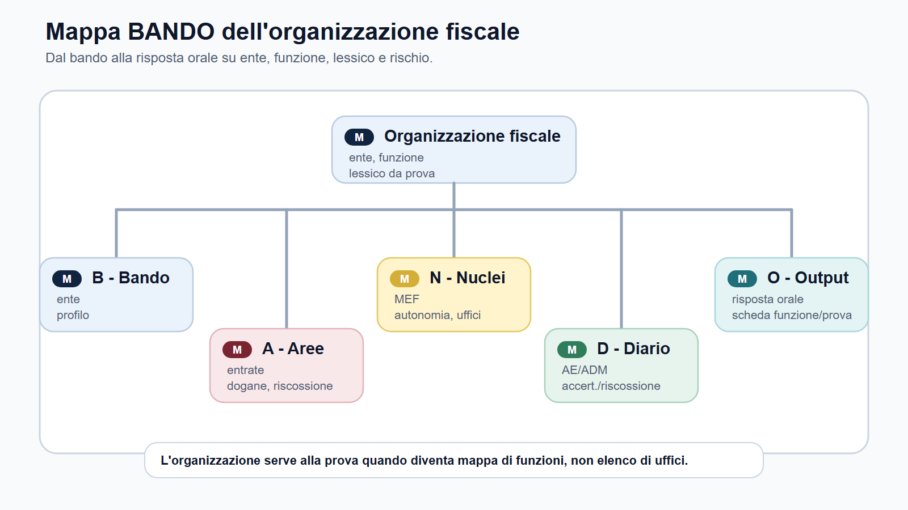
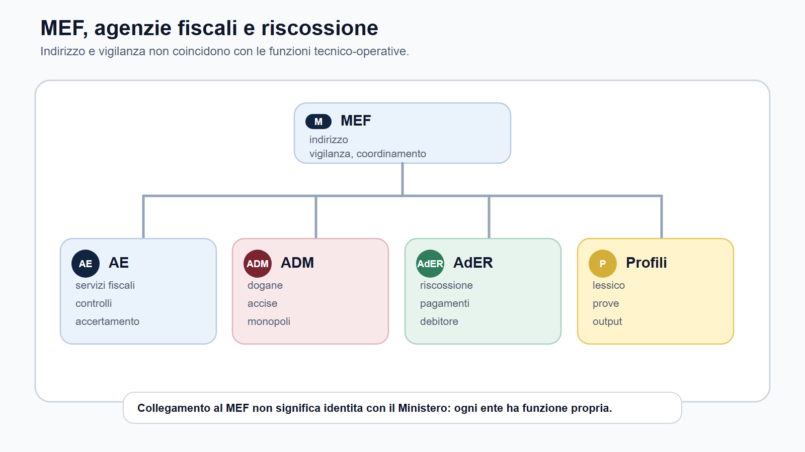
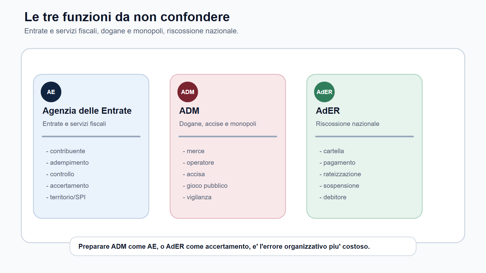
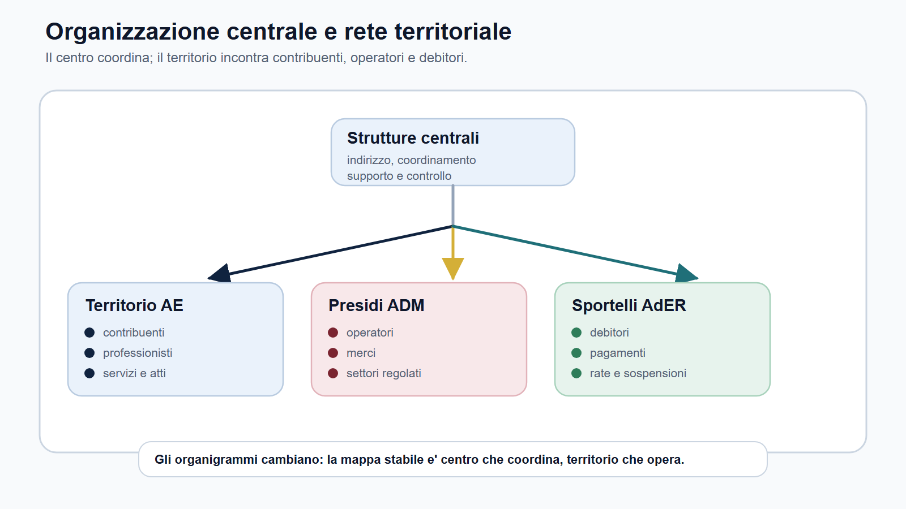
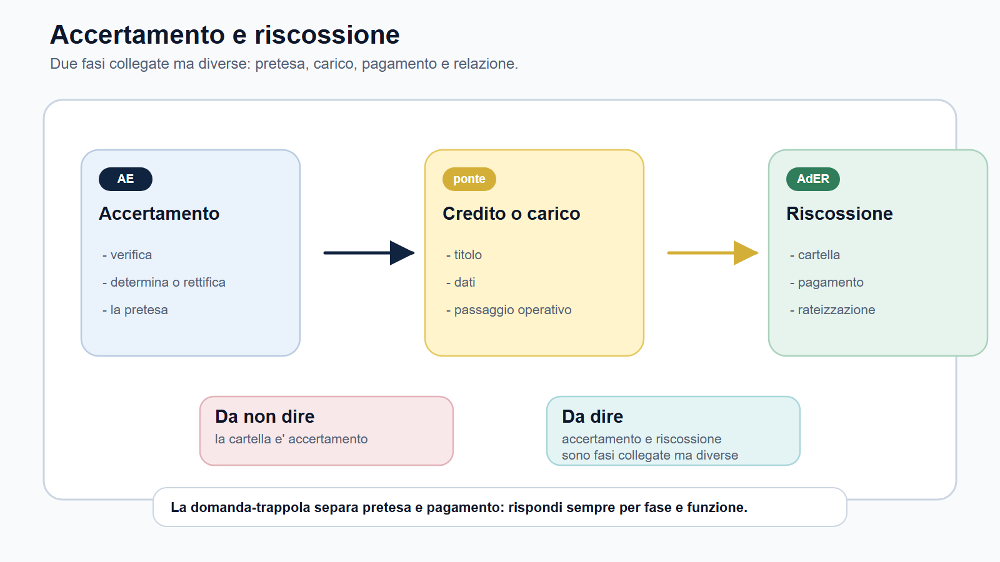

# Ordinamento e organizzazione di AE, ADM e AdER

## Apertura editoriale

Nei concorsi delle Agenzie fiscali l'organizzazione aiuta a capire dove si colloca il profilo, quale funzione pubblica andrà' a sostenere e quale linguaggio dovrà' usare il candidato in prova. La conoscenza del D.Lgs. 300/1999 acquista valore quando viene collegata a queste domande.

Un bando dell'Agenzia delle Entrate, dell'Agenzia delle Dogane e dei Monopoli o dell'Agenzia delle Entrate-Riscossione non seleziona soltanto persone che "conoscono il fisco". Seleziona candidati capaci di muoversi dentro una organizzazione: uffici centrali e territoriali, funzioni di indirizzo, servizi al contribuente, controlli, atti, procedure, front-office, canali digitali, rapporto con il Ministero dell'economia e delle finanze, coordinamento con altri soggetti pubblici.

Per questo l'ordinamento degli enti va studiato in modo operativo. Il candidato deve saper distinguere l'Agenzia delle Entrate da ADM e AdER, deve capire perché' l'Agenzia non è semplicemente un Ministero con un altro nome e deve evitare la confusione più' frequente: trattare accertamento, dogane e riscossione come se fossero tre capitoli dello stesso ufficio.

Memorizzare un organigramma non basta. Gli organigrammi cambiano e vanno sempre verificati sui siti istituzionali prima della pubblicazione o della prova. Occorre invece costruire una mappa stabile: quale ente fa che cosa, con quale funzione, con quale rapporto con il MEF, con quali parole chiave e con quali conseguenze sullo studio.

## Obiettivo del capitolo

Al termine del capitolo devi saper fare cinque operazioni.

Prima: spiegare perché' il D.Lgs. 300/1999 è la fonte di base per comprendere il modello delle agenzie fiscali, senza trasformare la risposta in una ricostruzione storica lunga.

Seconda: distinguere Ministero, agenzia fiscale ed ente pubblico economico della riscossione. Questa distinzione è decisiva per non confondere indirizzo politico, funzioni tecnico-operative e gestione della riscossione.

Terza: collocare Agenzia delle Entrate, Agenzia delle Dogane e dei Monopoli e Agenzia delle Entrate-Riscossione dentro una mappa funzionale: entrate tributarie e servizi fiscali, dogane e monopoli, riscossione nazionale.

Quarta: collegare l'organizzazione al profilo concorsuale. Un funzionario tributario, un profilo catastale, un funzionario ADM, un assistente ADM e un addetto alla riscossione richiedono risposte diverse anche quando condividono alcune materie generali.

Quinta: preparare una risposta orale breve, ordinata e non enciclopedica sull'organizzazione degli enti fiscali.

## Come usare questo capitolo

Leggi il capitolo con tre domande aperte accanto al bando.

- Quale ente assume o seleziona?
- Quale funzione pubblica è al centro del profilo?
- Quali parole organizzative devo saper usare in una risposta scritta o orale?

Se il bando riguarda Agenzia delle Entrate, la parola guida può' essere "adempimento", "accertamento", "servizi fiscali", "territorio", "catasto" o "pubblicità immobiliare". Se riguarda ADM, devi cercare "dogane", "accise", "giochi", "monopoli", "controlli", "operatori economici". Se riguarda AdER, devi pensare a "riscossione", "cartella", "pagamento", "rateizzazione", "sospensione", "contribuente-debitore".

Queste parole non sono etichette. Sono bussole. Ti dicono quali parti della teoria diventano prioritarie e quali esempi usare quando la commissione chiede: "Mi spieghi che cosa fa questo ente?".

## Mappa BANDO del capitolo

| Fase BANDO | Domanda organizzativa | Output di studio |
| --- | --- | --- |
| B - Bando | Quale ente e quale profilo compaiono nel bando? | Scheda ente/profilo/funzione. |
| A - Aree | L'ente lavora su entrate, dogane, monopoli o riscossione? | Mappa delle aree funzionali. |
| N - Nuclei | Quali nozioni organizzative devo padroneggiare? | Glossario MEF, agenzia, uffici, servizio, controllo. |
| D - Diario | Quali confusioni rischio di ripetere? | Diario errori: accertamento/riscossione, AE/ADM, Ministero/Agenzia. |
| O - Output | Che risposta devo saper produrre? | Risposta orale da due minuti e tabella funzione/profilo/prova. |

In questo capitolo il metodo BANDO non ti chiede di studiare tutta l'amministrazione finanziaria. Ti chiede di estrarre l'organizzazione che serve alla prova.

## Il punto di partenza: il D.Lgs. 300/1999

Il D.Lgs. 30 luglio 1999, n. 300 è la fonte di riferimento per capire la riorganizzazione del Governo e il modello delle agenzie. Nel modulo M-FC02 va usato con un taglio preciso: non come capitolo generale sui Ministeri, ma come chiave per spiegare perché' le agenzie fiscali hanno autonomia organizzativa e funzioni tecnico-operative collegate all'area economico-finanziaria dello Stato.

Per il candidato contano quattro idee.

La prima: Agenzia delle Entrate e Agenzia delle Dogane e dei Monopoli hanno personalità giuridica di diritto pubblico e dispongono delle autonomie riconosciute dal quadro normativo. Non sono direzioni interne del Ministero con una diversa denominazione.

La seconda: autonomia non significa isolamento. Le agenzie fiscali operano nel sistema dell'amministrazione finanziaria e il rapporto con il Ministero dell'economia e delle finanze si esprime attraverso indirizzo, vigilanza e approvazione degli atti generali nei casi previsti.

La terza: AdER appartiene allo stesso percorso didattico per la funzione esercitata, ma ha natura diversa. È un ente pubblico economico istituito dal D.L. 193/2016, convertito dalla L. 225/2016, ed è ente strumentale dell'Agenzia delle Entrate.

La quarta: nei concorsi l'organizzazione va collegata alla funzione. Una domanda su AE, ADM o AdER non richiede una lista di uffici. Verifica, piuttosto, se il candidato distingue entrate tributarie, dogane e monopoli, riscossione.

Se devi rispondere all'orale, evita due estremi. Non dire soltanto: "Sono enti collegati al MEF". E non recitare un organigramma minuto. La risposta efficace spiega il modello, poi lo applica ai tre enti.

## Ministero, agenzia, ente della riscossione

Il primo nodo da sciogliere è il rapporto tra Ministero e agenzie.

Il MEF è il riferimento istituzionale dell'area economico-finanziaria. Le agenzie fiscali operano in questo perimetro, ma non coincidono con il Ministero. Il Ministero esprime indirizzo, vigilanza e coordinamento secondo le regole dell'ordinamento. Le agenzie svolgono funzioni amministrative, tecniche e operative nei settori loro attribuiti.

Questa distinzione aiuta anche nei quiz. Se la domanda chiede "chi esercita la funzione di accertamento tributario?", non devi rispondere genericamente "il MEF". Devi collegare la funzione all'Agenzia delle Entrate, nei limiti e secondo il quadro normativo di riferimento. Se la domanda riguarda dogane e accise, il baricentro è ADM. Se riguarda riscossione nazionale, il baricentro diventa AdER.

AdER merita una cautela ulteriore. È un ente pubblico economico, distinto dall'Agenzia delle Entrate ma strumentale a essa, con autonomia organizzativa, patrimoniale, contabile e di gestione. Il portale istituzionale precisa che l'Agenzia delle Entrate esercita indirizzo operativo e controllo sull'ente. Questa relazione non autorizza a sovrapporre le rispettive funzioni: AE presidia amministrazione dei tributi, servizi e accertamento; AdER esercita la riscossione nazionale. Per lo studio del capitolo, la distinzione tra fase impositiva e fase di riscossione resta il passaggio decisivo.

## Le tre funzioni da non confondere

Nel modulo M-FC02 devi tenere distinte tre funzioni.

La prima è la funzione entrate/servizi fiscali. Qui trovi l'Agenzia delle Entrate: assistenza al contribuente, adempimento spontaneo, servizi fiscali, controlli, accertamento, gestione di atti e dati, funzioni collegate a catasto, cartografia, estimo e pubblicità immobiliare.

La seconda è la funzione dogane/accise/monopoli. Qui trovi ADM: controlli doganali, merci, operatori economici, accise, prodotti regolati, giochi, monopoli, vigilanza nei settori di competenza e rapporto con regole nazionali ed europee.

La terza è la funzione riscossione. Qui trovi AdER: gestione dei carichi affidati alla riscossione, cartelle, pagamenti, rateizzazioni, sospensioni, attività operative verso il contribuente-debitore e rapporto con gli enti creditori secondo le fonti specifiche.

La tabella seguente ti serve per fissare il nucleo.

| Ente | Funzione guida | Lessico da usare in prova | Rischio tipico |
| --- | --- | --- | --- |
| Agenzia delle Entrate | Entrate tributarie, servizi fiscali, accertamento, territorio/SPI. | Contribuente, adempimento, controllo, accertamento, servizi, catasto, pubblicità immobiliare. | Ridurre tutto a "diritto tributario" senza funzione amministrativa. |
| Agenzia delle Dogane e dei Monopoli | Dogane, accise, giochi, monopoli, controlli su flussi e operatori. | Merce, dichiarazione, operatore economico, accisa, gioco pubblico, monopolio, vigilanza. | Preparare ADM come se fosse AE. |
| Agenzia delle Entrate-Riscossione | Riscossione nazionale e rapporto con contribuente-debitore. | Cartella, ruolo, pagamento, rateizzazione, sospensione, debitore, front-office. | Confondere riscossione e accertamento. |

Questa tabella non sostituisce lo studio dei capitoli specialistici successivi. Serve a non sbagliare l'ingresso.

## Agenzia delle Entrate: servizi, controlli e territorio

L'Agenzia delle Entrate è l'ente che il candidato associa più' facilmente al fisco. Proprio per questo può' generare l'errore più' sottile: pensare che basti studiare diritto tributario in astratto.

In una risposta concorsuale l'Agenzia delle Entrate va presentata come amministrazione fiscale con funzioni collegate alle entrate tributarie, ai servizi ai contribuenti, alla compliance, agli adempimenti, ai controlli e all'accertamento. Nel perimetro M-FC02 rientrano anche i profili connessi ai servizi catastali, cartografici, estimativi e alla pubblicità immobiliare, quando il bando li pone al centro.

La parola "servizio" non deve essere sottovalutata. Molti candidati parlano solo di controlli ed evasione. In realtà', nei profili AE il lavoro può' riguardare anche informazione, assistenza, gestione delle dichiarazioni, lavorazione di istanze, canali digitali, supporto al contribuente, trattamento di dati e atti.

Per un profilo tributario, la risposta forte collega tre livelli:

- il quadro organizzativo: Agenzia collegata al MEF, con autonomia e funzioni fiscali;
- la funzione amministrativa: servizi, adempimenti, controlli, accertamento;
- l'uso concorsuale: quiz su definizioni, risposta orale sulla funzione, casi su contribuente, atto, ufficio e procedimento.

Per un profilo territorio/SPI, devi aggiungere il lessico immobiliare: catasto, pubblicità immobiliare, cartografia, estimo, mercato immobiliare. Non sono accessori. Se il bando li indica come nucleo, cambiano la preparazione.

## ADM: dogane, accise, giochi e monopoli

ADM richiede un cambio di lingua. Qui non basta portare dentro il capitolo la stessa struttura usata per AE. Il candidato deve entrare nella logica dei flussi, dei controlli, delle merci, dei prodotti soggetti ad accisa, del gioco pubblico e dei monopoli.

Nel modulo M-FC02 ADM va spiegata come agenzia fiscale con funzioni specialistiche su dogane, accise, giochi e monopoli. Questo significa che l'organizzazione è collegata a settori nei quali l'amministrazione non si limita a ricevere dichiarazioni o gestire servizi fiscali ordinari. Vigila, controlla, autorizza, presidia flussi economici regolati e applica discipline di settore.

Per il candidato la conseguenza è pratica. Una risposta su ADM deve contenere almeno un riferimento al suo perimetro proprio. Se dici solo "si occupa di tributi", la risposta è debole. Devi mostrare che sai distinguere tributi interni, dogane, accise, giochi e monopoli.

Questo vale soprattutto nei concorsi per funzionari e assistenti ADM. Il profilo può' contenere diritto amministrativo, pubblico impiego, anticorruzione, informatica e inglese. Ma se il programma richiama dogane, accise o monopoli, il piano di studio deve costruire subito un glossario specialistico. Senza glossario, il candidato risponde con categorie generiche a domande che chiedono un linguaggio tecnico.

## AdER: riscossione e rapporto con il contribuente-debitore

Agenzia delle Entrate-Riscossione è il terzo ingresso del modulo. Qui il candidato deve spostare il centro dalla fase impositiva alla fase di riscossione.

La distinzione base è questa: l'accertamento riguarda la verifica e la determinazione della pretesa tributaria; la riscossione riguarda la gestione del credito nella fase in cui deve essere portato a pagamento secondo le regole previste. Le due fasi sono collegate, ma non sono la stessa cosa.

Nei concorsi AdER il candidato deve saper parlare di cartella, pagamenti, rateizzazioni, sospensioni, canali di relazione, documentazione e rapporto con il contribuente-debitore. Il lessico è più' operativo e più' vicino al front-office. Proprio per questo, le risposte devono essere ordinate: soggetto, atto, richiesta, documento, termine, canale, possibile esito.

Il rischio tipico è studiare AdER come appendice dell'Agenzia delle Entrate. Il profilo di riscossione richiede invece un allenamento diverso. Una domanda orale può' chiedere il rapporto tra ruolo, cartella e pagamento; una prova situazionale può' presentare un utente che chiede una rateizzazione o una sospensione; un quiz può' verificare la differenza tra fase di accertamento e fase di riscossione.

Per questo nel diario errori devi avere una riga dedicata: "Sto confondendo accertamento e riscossione?". Se la risposta è si', torna alla mappa funzionale.

## Organizzazione centrale e rete territoriale

Le agenzie fiscali hanno strutture centrali e articolazioni territoriali. Per il candidato non serve memorizzare ogni ufficio aggiornato, salvo che il bando lo richieda. Serve capire la logica.

Le strutture centrali svolgono funzioni di indirizzo, coordinamento, gestione, supporto, regolazione interna e controllo. Le strutture territoriali sono il punto in cui l'azione amministrativa incontra contribuenti, operatori, imprese, utenti, professionisti, enti creditori e territorio.

Questa distinzione è utile in tre casi.

Nel quiz, aiuta a riconoscere se una domanda riguarda l'assetto istituzionale o l'attività' dell'ufficio.

Nell'orale, aiuta a costruire una risposta non piatta: "L'ente opera attraverso strutture centrali e territoriali; le prime orientano e coordinano, le seconde gestiscono attività e servizi sul territorio, secondo le competenze previste".

Nei casi pratici, aiuta a ragionare su dove nasce il problema: servizio al contribuente, controllo, procedimento, comunicazione, richiesta documentale, pagamento, sportello, canale telematico.

Attenzione: gli organigrammi cambiano. Prima della pubblicazione definitiva del modulo e prima di una prova reale, verifica sempre statuto, regolamento di amministrazione, amministrazione trasparente e pagine istituzionali aggiornate.

## Organi, regolamenti e responsabilità organizzativa

La conoscenza dell'organizzazione non coincide con la memorizzazione dell'organigramma. Il candidato deve riconoscere le fonti che rendono leggibile l'ente: legge istitutiva, statuto, regolamento di amministrazione, atti organizzativi, PIAO e sezioni di amministrazione trasparente. Questi documenti hanno funzioni diverse. La legge definisce il quadro; statuto e regolamenti disciplinano organi e funzionamento; gli atti organizzativi distribuiscono competenze e responsabilità; i documenti di programmazione collegano struttura, obiettivi e risorse.

Per AE e ADM il Direttore e il Comitato di gestione appartengono al lessico essenziale del modello agenziale. Non occorre imparare ogni direzione centrale, salvo espressa richiesta del bando. Occorre invece saper spiegare che l'organizzazione serve ad attribuire competenze, individuare responsabilità e coordinare strutture centrali e territoriali.

Per AdER la fonte istituzionale aggiornata indica tre organi: Direttore, Comitato di gestione e Collegio dei revisori dei conti. Il Direttore dell'ente coincide con il Direttore dell'Agenzia delle Entrate. Questo dato rende visibile il collegamento tra i due soggetti, ma non elimina la distinta natura giuridica e funzionale di AdER.

Gli assetti sono mobili. Il portale ADM, per esempio, registra un regolamento di amministrazione aggiornato nel 2026. La regola di studio è quindi selettiva: memorizza il modello e la funzione degli organi; verifica nomi, articolazioni e regolamenti vigenti quando esce il bando.

## Come lo chiede la commissione

La commissione può' chiedere l'organizzazione in quattro modi.

Il primo è il quesito definitorio: "Che cosa sono le agenzie fiscali?". Qui serve una risposta breve su D.Lgs. 300/1999, autonomia e rapporto con il MEF.

Il secondo è il quesito comparativo: "Che differenza c'è tra Agenzia delle Entrate, ADM e AdER?". Qui devi usare la mappa funzioni: entrate/servizi fiscali, dogane/monopoli, riscossione.

Il terzo è il quesito applicativo: "Perché' un profilo ADM non si prepara come un profilo AE?". Qui devi spiegare il diverso lessico operativo e le diverse materie specialistiche.

Il quarto è il quesito situazionale: "Un contribuente/debitore si presenta allo sportello con una richiesta; come inquadri il problema?". Qui devi mostrare ordine, competenza, rispetto del ruolo e consapevolezza dei canali ufficiali.

La qualità' della risposta dipende dalla capacità' di distinguere fonte, ente, funzione, ufficio, utente, atto e output, non dalla sua lunghezza.

## Glossario minimo del capitolo

| Termine | Significato operativo per il candidato |
| --- | --- |
| Agenzia fiscale | Soggetto pubblico collegato all'area economico-finanziaria, con funzioni tecnico-operative e autonomia secondo il quadro normativo. |
| MEF | Ministero di riferimento per indirizzo, vigilanza e coordinamento dell'area economico-finanziaria. |
| Autonomia | Capacità organizzativa e gestionale dell'ente nei limiti stabiliti dalle fonti. Non significa assenza di controllo. |
| Convenzione/rapporto istituzionale | Strumento o cornice con cui si regolano obiettivi, rapporti e risultati tra Ministero e agenzie, secondo il modello previsto. |
| Struttura centrale | Livello che indirizza, coordina, supporta e controlla l'attività dell'ente. |
| Struttura territoriale | Livello in cui si svolgono molte attività operative verso contribuenti, operatori, utenti o enti creditori. |
| Accertamento | Attività di controllo e determinazione della pretesa secondo le regole fiscali. |
| Riscossione | Fase di gestione del credito da portare a pagamento, con atti e procedure specifiche. |
| Dogane | Area collegata a merci, scambi, dichiarazioni, controlli e regole doganali. |
| Accise | Prelievi su specifici prodotti e settori, con controlli e procedure proprie. |

Se una parola del glossario non produce un esempio, non è ancora davvero studiata.

## Scheda funzione/profilo/prova

Usa questa scheda quando il bando richiama l'organizzazione degli enti.

| Campo | Domanda da compilare |
| --- | --- |
| Ente | AE, ADM o AdER? |
| Funzione principale | Entrate/servizi fiscali, dogane/monopoli, riscossione o territorio/SPI? |
| Profilo | Funzionario, assistente, addetto riscossione, tecnico, gestionale o altro? |
| Lessico obbligatorio | Quali 5 parole devo usare correttamente? |
| Materie collegate | Quali materie organizzative e specialistiche entrano nel piano? |
| Prova | Quiz, scritto, orale, caso, situazionale o titoli? |
| Output | Risposta orale, glossario, mappa procedurale, quiz mirati o caso guidato? |
| Rischio | Quale confusione devo evitare? |

Compilarla richiede pochi minuti. Evita settimane di studio generico.

## Risposta modello da due minuti

**Domanda.** Inquadri sinteticamente l'organizzazione delle Agenzie fiscali e distingua AE, ADM e AdER.

**Risposta guida.** L'Agenzia delle Entrate e l'Agenzia delle Dogane e dei Monopoli si collocano nel modello delle agenzie fiscali delineato dal D.Lgs. 300/1999. Hanno personalità giuridica di diritto pubblico, funzioni tecnico-operative e le autonomie riconosciute dalle fonti, nel quadro dei rapporti di indirizzo e vigilanza con il Ministero dell'economia e delle finanze. AdER va distinta: è un ente pubblico economico istituito dal D.L. 193/2016 ed è ente strumentale dell'Agenzia delle Entrate.

Nel modulo fiscale occorre distinguere le funzioni. L'Agenzia delle Entrate è il riferimento per entrate tributarie, servizi fiscali, adempimenti, controlli, accertamento e, per alcuni profili, servizi catastali, cartografici, estimativi e di pubblicità immobiliare. L'Agenzia delle Dogane e dei Monopoli opera su dogane, accise, giochi, monopoli e controlli su flussi e operatori economici. Agenzia delle Entrate-Riscossione riguarda invece la riscossione nazionale e il rapporto operativo con il contribuente-debitore.

La distinzione è importante anche nei concorsi. Un profilo AE, un profilo ADM e un profilo AdER possono condividere materie comuni, ma richiedono lessico, priorità e output diversi. Il candidato deve quindi collegare organizzazione, funzione e prova prevista dal bando.

Questa risposta può' essere adattata al profilo. Se il bando è ADM, aggiungi un esempio su dogane o accise. Se è AdER, aggiungi la distinzione tra accertamento e riscossione. Se è AE territorio, richiama catasto e pubblicità immobiliare.

## Caso guidato

Sarà sta preparando due procedure nello stesso mese.

La prima riguarda un profilo giuridico-tributario presso l'Agenzia delle Entrate. La seconda riguarda un concorso ADM con programma su dogane, accise e monopoli.

All'inizio Sarà pensa di usare lo stesso schema: D.Lgs. 300/1999, diritto amministrativo, pubblico impiego, tributario generale. Il piano sembra ordinato, ma ha un difetto: cancella la differenza tra gli enti.

Con la mappa del capitolo, Sarà corregge il piano.

Per AE scrive: funzione entrate/servizi fiscali, parole obbligatorie "contribuente, adempimento, controllo, accertamento, servizi". Il primo output è una risposta orale su Agenzia delle Entrate più' una mappa tra adempimento spontaneo, controllo e accertamento.

Per ADM scrive: funzione dogane/accise/monopoli, parole obbligatorie "merce, dichiarazione, operatore economico, accisa, vigilanza". Il primo output è un glossario ADM con esempi di domanda.

Sarà non ha studiato di più'. Ha studiato meglio. Ha capito che il D.Lgs. 300/1999 è la cornice, mentre la funzione dell'ente decide la preparazione.

## Da sapere in 5 righe

1. Il D.Lgs. 300/1999 è la fonte di base per inquadrare il modello delle agenzie.
2. Le agenzie fiscali operano con autonomia, ma nel perimetro di indirizzo e vigilanza del MEF.
3. Agenzia delle Entrate, ADM e AdER non svolgono la stessa funzione.
4. AE richiama entrate, servizi fiscali, accertamento e territorio; ADM dogane, accise, giochi e monopoli; AdER riscossione.
5. Nei concorsi l'organizzazione va studiata come mappa funzionale, non come elenco di uffici.

## Domanda da commissario

**Domanda.** Perché' è importante distinguere l'organizzazione dell'Agenzia delle Entrate da quella di ADM e AdER?

**Risposta guida.** Perché' nei concorsi la struttura dell'ente è collegata alla funzione del profilo. L'Agenzia delle Entrate opera su entrate tributarie, servizi fiscali, controlli, accertamento e anche su funzioni territoriali come catasto e pubblicità immobiliare. ADM ha un baricentro diverso: dogane, accise, giochi, monopoli e controlli su flussi e operatori economici. AdER riguarda la riscossione nazionale e il rapporto con il contribuente-debitore. Se il candidato non distingue queste funzioni, rischia di preparare materie comuni senza costruire il lessico specialistico richiesto dal bando.

## Domanda-trappola

**Domanda.** Le Agenzie fiscali sono semplici uffici del Ministero dell'economia e delle finanze?

**Risposta corretta.** No. Il MEF è il riferimento istituzionale dell'area economico-finanziaria e svolge funzioni di indirizzo e vigilanza secondo il quadro normativo. Le agenzie fiscali hanno invece funzioni tecnico-operative e autonomia nei limiti previsti dalle fonti. Dire che sono "semplici uffici del Ministero" appiattisce il modello e non spiega perché' i bandi selezionano profili specialistici.

**Perché' è una trappola.** La domanda confonde collegamento istituzionale e immedesimazione organizzativa. Collegamento al MEF non significa identità con il Ministero.

## Errore tipico

L'errore tipico è studiare l'organizzazione come una pagina da memorizzare.

Il candidato impara che esistono agenzie fiscali, MEF, direzioni centrali, uffici territoriali e regolamenti. Poi, davanti alla domanda, non sa spiegare che cosa cambia tra un controllo fiscale AE, un controllo doganale ADM e un'attività di riscossione AdER.

La correzione è semplice: ogni nozione organizzativa deve diventare una frase funzionale.

- AE: "serve a gestire entrate, servizi fiscali, adempimento e controlli".
- ADM: "serve a presidiare dogane, accise, giochi, monopoli e flussi regolati".
- AdER: "serve a gestire la riscossione e il rapporto operativo con il contribuente-debitore".

Se non sai completare queste frasi, hai studiato nomi, non funzioni.

## Mini-esercizio

Compila la tabella per il bando che stai preparando.

| Domanda | Risposta |
| --- | --- |
| Ente del bando |  |
| Funzione principale |  |
| Collegamento con il MEF da spiegare in una frase |  |
| Tre parole organizzative da usare all'orale |  |
| Due materie comuni collegate all'organizzazione |  |
| Due materie specialistiche collegate all'ente |  |
| Confusione da evitare |  |
| Output entro 48 ore |  |

Poi scrivi una risposta di massimo dieci righe a questa traccia:

> Inquadra l'ente del bando e spiega perché' la sua organizzazione incide sul piano di studio.

Rileggi la risposta. Se potrebbe valere identica per AE, ADM e AdER, è troppo generica.

## Diario errori organizzativi

Apri una sezione del diario con queste tre righe.

| Errore | Segnale | Correzione |
| --- | --- | --- |
| Confondo MEF e agenzia | Rispondo sempre "Ministero" anche quando la funzione è dell'ente. | Ripasso differenza tra indirizzo/vigilanza e funzione tecnico-operativa. |
| Confondo AE e ADM | Uso "tributario" come parola unica per tutto. | Costruisco tabella entrate/dogane/accise/giochi/monopoli. |
| Confondo accertamento e riscossione | Parlo di cartella come se fosse accertamento. | Ripasso sequenza pretesa, ruolo/carico, cartella, pagamento, rateizzazione, sospensione. |

Il diario non deve diventare lungo. Deve intercettare l'errore prima che entri nella risposta orale.

## Checklist operativa finale

Prima di passare al capitolo successivo, controlla questi punti.

- So spiegare il ruolo del D.Lgs. 300/1999 senza fare una lezione generale sui Ministeri.
- So distinguere MEF, agenzia fiscale e AdER.
- So indicare la funzione guida di Agenzia delle Entrate.
- So indicare la funzione guida di ADM.
- So indicare la funzione guida di AdER.
- So collegare organizzazione e profilo del bando.
- Ho scritto una risposta orale da due minuti.
- Ho compilato il glossario minimo.
- Ho segnato nel diario almeno una confusione da evitare.
- Ho indicato quali organigrammi/statuti vanno verificati su fonti ufficiali prima della pubblicazione o della prova.

Se manca uno di questi punti, non passare subito alle materie tecniche. Prima chiudi la mappa organizzativa.

## Riferimenti consolidati

Questo capitolo è costruito sulle note e sulle pagine consolidate del wiki del progetto:

- [[sources/agenzie-fiscali-organizzazione-ae-adm-ader]]
- [[sources/d-lgs-30-luglio-1999-n-300-organizzazione-governo]]
- [[sources/m-fc02-dossier-redazionale-agenzie-fiscali]]
- [[sources/bandi-rappresentativi-m-fc02-agenzie-fiscali-2023-2026]]
- [[sources/riscossione-agenzia-entrate-riscossione-m-fc02]]
- [[sources/dogane-accise-giochi-monopoli-adm-m-fc02]]
- [[sources/assetti-organizzativi-ae-adm-ader-verifica-2026-07-17]]
- [[topics/profili-agenzie-fiscali]]
- [[topics/bando-decoder-fiscale]]
- [[entities/agenzia-delle-entrate]]
- [[entities/agenzia-delle-dogane-e-dei-monopoli]]
- [[entities/agenzia-entrate-riscossione]]
- [[books/moduli/m-fc02-agenzie-fiscali/chapters/01-mappa-agenzie-fiscali-profili-concorsuali]]
- [[books/moduli/m-fc02-agenzie-fiscali/chapters/02-bando-decoder-fiscale]]

Le fonti consolidate sono sufficienti per una bozza professionale del capitolo. Per dati puntuali su statuti, regolamenti di amministrazione, organigrammi, direzioni centrali e articolazioni territoriali aggiornate, resta necessaria una verifica sulle pagine istituzionali ufficiali prima della pubblicazione.

## Note di review

- Verificare, prima della pubblicazione definitiva, statuti, regolamenti di amministrazione e sezioni "Amministrazione trasparente" di Agenzia delle Entrate, ADM e AdER.
- Evitare numeri di uffici, direzioni o personale se non sono stati confermati da fonte ufficiale aggiornata nel wiki.
- Le immagini inserite sono mappe didattiche leggibili e orientate al ripasso; non sostituiscono la verifica finale degli organigrammi ufficiali aggiornati.
- Coordinare questo capitolo con i capitoli 7, 8, 9 e 10, dove riscossione, dogane, accise, giochi, monopoli, catasto e pubblicità immobiliare verranno sviluppati in modo specialistico.
- Prima dell'export finale, controllare che la distinzione "accertamento/riscossione" sia coerente in tutto il modulo.
