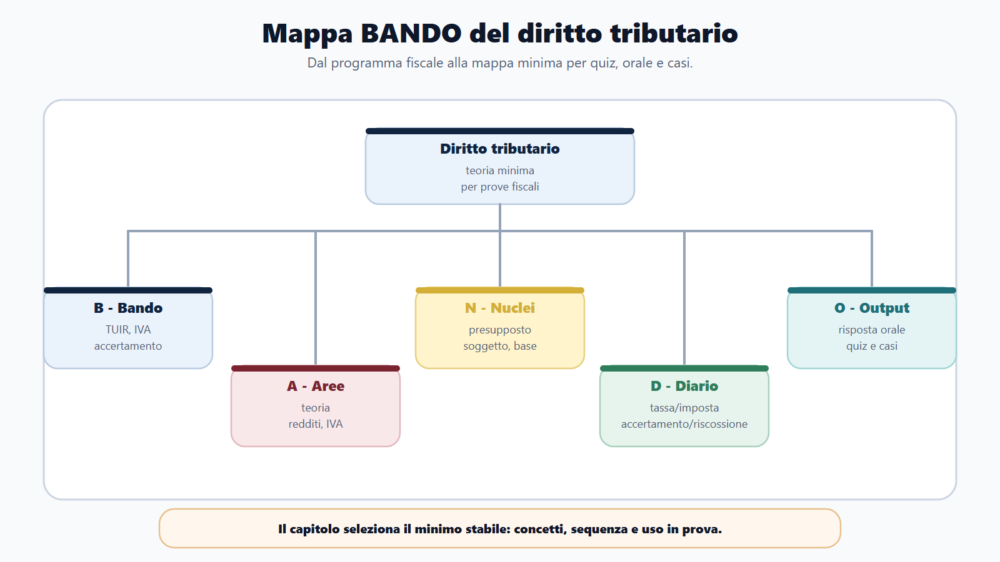
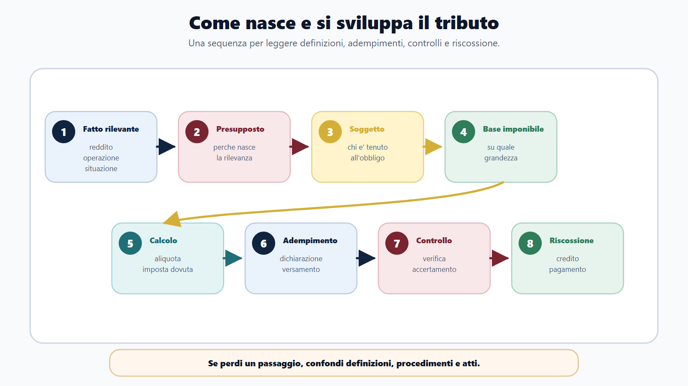
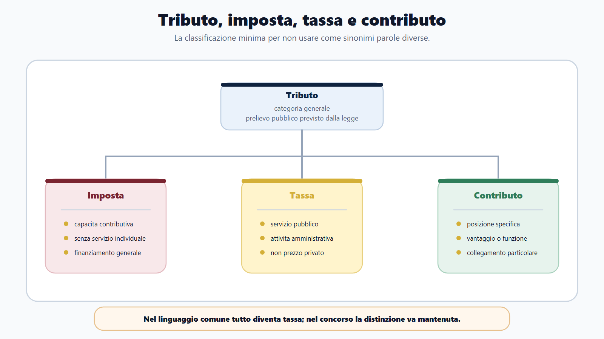
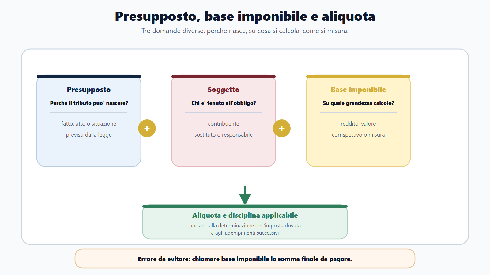
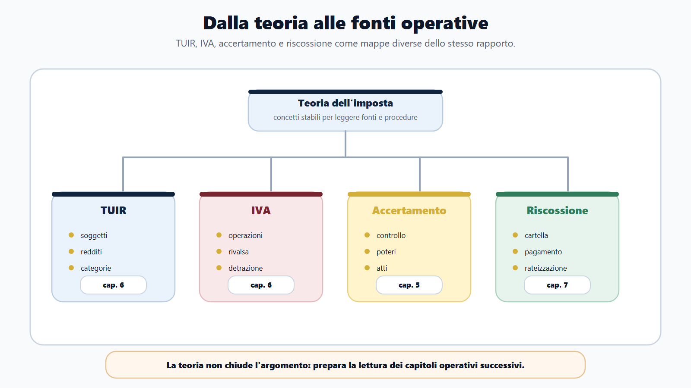

# Diritto tributario e teoria dell'imposta

## Apertura editoriale

Nel modulo Agenzie fiscali il diritto tributario non e' una materia da studiare come un blocco astratto. E' il linguaggio di lavoro dell'amministrazione fiscale. Serve a capire perche' nasce un'imposta, chi deve pagarla, su quale base si calcola, quale adempimento viene richiesto, quali controlli puo' svolgere l'amministrazione e come si passa dalla regola generale al caso concreto.

Il candidato che prepara un concorso dell'Agenzia delle Entrate, dell'Agenzia delle Dogane e dei Monopoli o dell'Agenzia delle Entrate-Riscossione non deve diventare un commentatore del TUIR. Deve pero' saper usare le categorie fondamentali senza confonderle. "Tributo", "imposta", "presupposto", "base imponibile", "soggetto passivo", "obbligazione tributaria", "dichiarazione", "accertamento" e "riscossione" non sono parole intercambiabili. Sono passaggi di una sequenza.

La teoria dell'imposta va quindi studiata come una grammatica. Prima si riconosce il fatto economicamente o giuridicamente rilevante. Poi si individua il presupposto d'imposta. Poi si cerca il soggetto passivo. Poi si determina la base imponibile. Solo dopo si ragiona su aliquota, imposta dovuta, adempimento, controllo e possibile atto dell'amministrazione.

Questa impostazione evita due errori frequenti. Il primo e' imparare definizioni isolate che non aiutano a risolvere un quiz. Il secondo e' saltare subito alle procedure, alle dichiarazioni o alla riscossione senza aver capito la struttura della pretesa tributaria. Nei concorsi fiscali entrambi gli errori pesano: il quiz punisce la confusione terminologica, l'orale punisce la risposta disordinata, il caso pratico punisce l'incapacita di collegare norma, fatto e funzione dell'ufficio.

## Obiettivo del capitolo

Al termine del capitolo devi saper fare cinque operazioni.

Prima: distinguere tributo, imposta, tassa e contributo, usando una definizione breve ma funzionale alla prova.

Seconda: spiegare che cosa sono presupposto, soggetto passivo, base imponibile, aliquota e obbligazione tributaria, senza sovrapporre i concetti.

Terza: leggere TUIR e IVA come fonti di classificazione e di metodo, non come elenchi da memorizzare integralmente in questa fase.

Quarta: collegare la teoria dell'imposta ai capitoli successivi su accertamento, adempimenti, riscossione e casi pratici.

Quinta: produrre una risposta orale chiara su "come nasce e come si sviluppa il rapporto tributario".

## Come usare questo capitolo

Leggi il capitolo con il bando aperto. Ogni volta che incontri una parola tecnica, chiediti dove compare nella prova:

- in un quiz definitorio;
- in una traccia orale;
- in un caso pratico;
- in una domanda su dichiarazioni, controlli, accertamento o riscossione;
- in una tabella di confronto tra Agenzia delle Entrate, ADM e AdER.

Il capitolo non sostituisce lo studio specialistico dei capitoli 5, 6 e 7. Prepara il terreno. Se non distingui presupposto, base imponibile e obbligazione, farai fatica a comprendere accertamento e adempimenti. Se confondi accertamento e riscossione, leggerai male i profili AdER. Se parli di IVA o imposte sui redditi senza sapere qual e' la logica del tributo, rischi una preparazione mnemonica e fragile.

La regola pratica e' questa: ogni definizione deve diventare una frase operativa. Non basta sapere "che cosa e'". Devi saper dire "a che cosa serve in un procedimento fiscale".

## Mappa BANDO del capitolo

| Fase BANDO | Domanda tributaria | Output di studio |
| --- | --- | --- |
| B - Bando | Il programma chiede diritto tributario generale, TUIR, IVA, accertamento o riscossione? | Evidenzia le parole fiscali del bando e collegale ai capitoli del modulo. |
| A - Aree | Quale area e' coinvolta: teoria, redditi, IVA, adempimenti, controlli, riscossione? | Costruisci una mappa area/fonte/funzione. |
| N - Nuclei | Quali concetti devo padroneggiare prima delle procedure? | Schede su tributo, imposta, presupposto, soggetto passivo, base imponibile. |
| D - Diario | Quali confusioni ricorrono nei miei errori? | Diario errori: tassa/imposta, base/presupposto, accertamento/riscossione. |
| O - Output | Che risposta devo saper produrre? | Risposta orale da due minuti, tabella concetti e quiz ragionati. |

In questo capitolo il metodo BANDO serve a non perdersi. Il diritto tributario e' vasto; il bando lo rende selettivo.



## Perche' la teoria dell'imposta serve nei concorsi fiscali

La teoria dell'imposta non e' una premessa decorativa. E' la parte che consente di leggere correttamente tutte le altre.

Quando il bando cita "diritto tributario", la commissione puo' verificare nozioni molto diverse. Puo' chiedere una distinzione teorica tra imposta e tassa. Puo' proporre un quiz sul soggetto passivo. Puo' chiedere che cos'e' la base imponibile. Puo' domandare come si collega la dichiarazione al controllo. Puo' chiedere perche' l'Agenzia delle Entrate ha un ruolo centrale nell'accertamento, mentre AdER opera nella fase della riscossione.

In tutti questi casi la risposta efficace non e' quella piu' lunga. E' quella che ordina i passaggi.

La sequenza base e':

```text
fatto rilevante -> presupposto -> soggetto passivo -> base imponibile -> aliquota -> imposta dovuta -> adempimento -> controllo -> eventuale accertamento -> riscossione
```

Questa sequenza non descrive ogni tributo in modo completo. Serve come mappa mentale. Nei singoli tributi cambiano le regole, le fonti, le dichiarazioni, le detrazioni, i termini, gli atti e le procedure. Ma la logica resta utile: prima si capisce perche' la pretesa puo' nascere, poi si segue il suo percorso amministrativo.



## Legalita, capacita contributiva e progressivita

Il diritto tributario opera entro una cornice costituzionale. Il prelievo non nasce da una decisione discrezionale dell'ufficio: richiede una base normativa e deve rispettare i criteri che governano il concorso alle spese pubbliche.

L'art. 23 della Costituzione stabilisce che nessuna prestazione personale o patrimoniale puo essere imposta se non in base alla legge. In materia tributaria questa riserva impedisce all'amministrazione di creare autonomamente presupposti, soggetti o prelievi. La fonte primaria deve definire gli elementi essenziali; regolamenti e atti amministrativi operano nello spazio che la legge assegna loro.

L'art. 53 aggiunge due coordinate. Tutti sono tenuti a concorrere alle spese pubbliche in ragione della propria capacita contributiva. Il sistema tributario, considerato nel suo complesso, e' informato a criteri di progressivita. Quest'ultima precisazione evita una risposta frequente ma inesatta: la Costituzione non impone che ogni singolo tributo sia progressivo; richiede che la progressivita caratterizzi il sistema.

Per il candidato, i tre principi hanno una funzione distinta:

- la riserva di legge risponde alla domanda: quale fonte puo imporre la prestazione patrimoniale?;
- la capacita contributiva risponde alla domanda: quale manifestazione economicamente apprezzabile giustifica il concorso alle spese pubbliche?;
- la progressivita orienta la valutazione dell'assetto complessivo del sistema tributario.

La formula da ricordare e' questa:

> Il tributo e' una prestazione patrimoniale imposta in base alla legge; il prelievo deve riferirsi a una manifestazione di capacita contributiva e inserirsi in un sistema complessivamente informato a progressivita.

Legalita tributaria e legalita amministrativa, quindi, non coincidono ma si completano. La prima fonda e delimita il prelievo. La seconda governa l'esercizio concreto dei poteri, imponendo competenza, procedimento, motivazione, termini e garanzie.

## Le fonti: una gerarchia da usare, non da recitare

La Costituzione e' il punto di partenza. Seguono le fonti primarie che disciplinano i singoli tributi e i procedimenti: leggi, decreti legislativi e decreti-legge convertiti. Nel settore fiscale assumono rilievo anche le fonti dell'Unione europea, soprattutto quando la materia e' armonizzata o direttamente regolata a livello unionale.

Regolamenti, decreti ministeriali e provvedimenti amministrativi completano la disciplina nei limiti consentiti dalla fonte primaria. Prassi e documenti interpretativi orientano l'attivita degli uffici e dei contribuenti, ma non possono essere trattati come se avessero la stessa forza della legge. La giurisprudenza interpreta le norme e risolve controversie; non sostituisce la fonte impositiva.

Lo Statuto dei diritti del contribuente, contenuto nella L. 212/2000, appartiene alla mappa essenziale per comprendere il rapporto tra contribuente e amministrazione. In questo capitolo interessa come raccordo tra teoria dell'imposta e garanzie; motivazione, contraddittorio, interpello e autotutela richiedono poi lo studio puntuale delle disposizioni vigenti nei capitoli dedicati.

In prova conviene applicare una sequenza semplice: individua la fonte, verifica il suo rango, collega la regola al tributo o al procedimento, infine distingue norma, atto amministrativo e documento di prassi. Questa sequenza vale piu' di un elenco mnemonico.

## Tributo, imposta, tassa e contributo

"Tributo" e' la categoria generale. "Imposta", "tassa" e "contributo" sono classificazioni utili per lo studio, ma la denominazione scelta dal legislatore non basta da sola: natura, presupposto e funzione del prelievo devono essere letti nella disciplina concreta.

L'imposta e' il tributo per eccellenza nei concorsi fiscali. Si collega a un presupposto che manifesta capacita contributiva e non richiede, come elemento essenziale, una controprestazione individuale diretta. Chi paga un'imposta non paga il prezzo di un servizio specifico ricevuto in quel momento. Partecipa al finanziamento generale delle funzioni pubbliche secondo la disciplina stabilita.

La tassa e' collegata allo svolgimento di un servizio pubblico o di un'attivita amministrativa riferibile al soggetto. Non va pero' confusa con il prezzo di mercato. Anche la tassa resta dentro il diritto pubblico e segue regole proprie.

Il contributo e' una categoria da usare con cautela: indica prelievi collegati a una situazione, a un vantaggio, a una categoria di soggetti o a una funzione specifica. Nei quiz la parola puo' comparire per verificare se il candidato distingue la logica generale dell'imposta da prelievi con un collegamento piu' particolare.

La tabella seguente serve per fissare la differenza.

| Categoria | Domanda da farsi | Funzione nello studio | Errore tipico |
| --- | --- | --- | --- |
| Tributo | Sono davanti a un prelievo pubblico previsto dalla legge? | Categoria generale. | Usarlo come sinonimo indistinto di imposta. |
| Imposta | Il prelievo si collega a un indice di capacita contributiva senza servizio individuale diretto? | Categoria centrale per redditi, IVA e fiscalita generale. | Cercare sempre una prestazione specifica in cambio. |
| Tassa | Il prelievo e' collegato a un servizio pubblico o a un'attivita amministrativa riferibile al soggetto? | Utile nei quiz definitori e nei confronti. | Trattarla come prezzo privato. |
| Contributo | Il prelievo e' collegato a una posizione, un vantaggio o una funzione specifica? | Serve a completare la classificazione. | Confonderlo con ogni pagamento dovuto alla PA. |

La risposta orale non deve diventare scolastica. Una buona formula e':

> Il tributo e' la categoria generale dei prelievi pubblici previsti dalla legge. L'imposta si fonda su un presupposto di capacita contributiva e non richiede una controprestazione individuale; la tassa si collega a un servizio o a un'attivita amministrativa; il contributo riguarda prelievi con un collegamento specifico a una posizione o a un vantaggio.



## Classificazioni utili: dirette, indirette, personali, reali

Le classificazioni tributarie sono utili solo se aiutano a orientarsi. Non vanno accumulate come etichette.

Le imposte dirette colpiscono manifestazioni immediate di ricchezza, come il reddito o il patrimonio. Le imposte indirette colpiscono manifestazioni mediate, come consumi, scambi o trasferimenti. Questa distinzione e' utile quando il bando contrappone imposte sui redditi e IVA: le prime guardano al reddito, l'IVA opera nella logica delle operazioni e dei consumi.

Le imposte personali considerano la situazione complessiva del soggetto secondo la disciplina applicabile. Le imposte reali guardano maggiormente al bene, all'operazione o al fatto imponibile, con minore attenzione alla condizione personale del contribuente.

Le imposte proporzionali applicano un'aliquota costante alla base imponibile. Le imposte progressive crescono in modo piu' che proporzionale rispetto alla base, secondo il meccanismo previsto dalla legge.

Per il concorso, il punto non e' recitare tutte le classificazioni. Il punto e' saperle usare in una risposta:

- se parli di reddito, pensa a reddito, periodo, soggetto, base imponibile, categoria;
- se parli di IVA, pensa a operazione, soggetto, rivalsa, detrazione, liquidazione, adempimento;
- se parli di accertamento, pensa a dichiarazione, controllo, potere istruttorio, atto;
- se parli di riscossione, pensa a credito, carico, pagamento, rateizzazione, eventuale procedura.

## Il presupposto d'imposta

Il presupposto e' il fatto, l'atto o la situazione al cui verificarsi la legge collega la nascita del tributo. E' la porta di ingresso della pretesa tributaria.

Se non individui il presupposto, non sai ancora perche' il tributo puo' essere richiesto. Puoi conoscere il nome dell'imposta, ma non stai ragionando giuridicamente.

In una risposta concorsuale puoi dire:

> Il presupposto d'imposta e' la situazione prevista dalla legge che manifesta il collegamento tra il soggetto e il tributo. Al suo verificarsi si apre la possibilita di determinare l'obbligazione tributaria secondo le regole applicabili.

Attenzione alla differenza tra presupposto e base imponibile. Il presupposto risponde alla domanda: "Perche' questo tributo puo' nascere?". La base imponibile risponde alla domanda: "Su quale valore o grandezza lo calcolo?". Se confondi le due domande, sbagli sia il quiz sia il caso.

Esempio di ragionamento, senza entrare in norme puntuali: nel sistema delle imposte sui redditi il presupposto ruota intorno alla produzione o al possesso di reddito secondo le categorie e le regole del TUIR; nell'IVA il ragionamento si sposta sulle operazioni rilevanti, sui soggetti e sul meccanismo di applicazione dell'imposta.

## Il soggetto passivo

Il soggetto passivo e' il soggetto al quale la legge collega l'obbligo tributario. Non sempre coincide con la persona che materialmente esegue un versamento, compila una dichiarazione o subisce un controllo. Proprio per questo la categoria va maneggiata con attenzione.

Nel linguaggio concorsuale devi distinguere almeno quattro posizioni:

- il soggetto attivo, cioe' l'ente titolare della pretesa tributaria secondo l'ordinamento;
- il soggetto passivo, cioe' il contribuente o il soggetto obbligato al tributo;
- il sostituto d'imposta, che adempie obblighi fiscali al posto o per conto di altri nei casi previsti;
- il responsabile d'imposta, che puo' essere chiamato a rispondere del tributo in base a una specifica previsione.

Questa distinzione non va approfondita qui in modo specialistico. Va pero' capita. Nei concorsi delle Agenzie fiscali il rapporto tributario coinvolge persone fisiche, societa, enti, sostituti, professionisti, intermediari, uffici e amministrazioni. Se dici genericamente "chi paga", perdi precisione.

Una risposta efficace e':

> Il soggetto passivo e' il soggetto cui la legge riferisce l'obbligazione tributaria. Va distinto dal soggetto attivo, che e' titolare della pretesa, e da figure come sostituto o responsabile d'imposta, che intervengono secondo regole specifiche.

## Base imponibile, aliquota e imposta dovuta

La base imponibile e' la grandezza sulla quale si applica il tributo. Puo' essere un reddito, un valore, un corrispettivo, una quantita o un'altra misura prevista dalla disciplina del singolo tributo.

L'aliquota e' il criterio percentuale o la misura che consente di calcolare l'imposta sulla base imponibile, salvo i casi in cui la legge preveda meccanismi diversi.

L'imposta dovuta e' il risultato del calcolo, tenendo conto delle regole applicabili: base imponibile, aliquota, eventuali deduzioni, detrazioni, crediti, acconti, versamenti, compensazioni e rettifiche. Non tutti questi elementi servono in questo capitolo; servono pero' a capire che il calcolo tributario non e' mai una semplice moltiplicazione isolata se la disciplina prevede correttivi.

La sequenza minima e':

```text
presupposto -> soggetto -> base imponibile -> aliquota -> imposta lorda/dovuta -> adempimento
```

Il candidato deve evitare una scorciatoia: pensare che la base imponibile sia "la tassa da pagare". No. La base imponibile e' la grandezza su cui si calcola. L'imposta e' il risultato della disciplina applicata a quella grandezza.



## Obbligazione tributaria

L'obbligazione tributaria e' il rapporto giuridico in forza del quale il soggetto passivo e' tenuto al pagamento del tributo secondo la legge. E' una obbligazione pubblicistica: nasce e si disciplina nel perimetro delle fonti tributarie e dell'azione amministrativa.

Per il concorso e' importante non descriverla come un normale debito privato. Il contribuente non contratta liberamente il tributo con l'amministrazione. La legge individua presupposto, soggetti, misura, adempimenti, poteri di controllo e strumenti di tutela.

Allo stesso tempo, l'obbligazione tributaria non va studiata come un'idea astratta separata dalla pratica. Nella vita amministrativa essa incontra dichiarazioni, comunicazioni, versamenti, controlli, accertamenti, riscossione, istanze, rimborsi, autotutela, contenzioso e servizi digitali. Il candidato deve imparare a vedere il passaggio dalla categoria teorica al procedimento.

Una formula utile:

> L'obbligazione tributaria nasce dalla legge al verificarsi del presupposto e si sviluppa attraverso regole di determinazione, adempimento, controllo ed eventuale riscossione.

Questa frase collega il capitolo 4 ai capitoli successivi.

## Rapporto tributario e procedimento amministrativo

Il rapporto tributario non e' solo "pagare un'imposta". E' un rapporto tra contribuente e amministrazione che puo' assumere forme diverse: adempimento spontaneo, dichiarazione, liquidazione, controllo automatizzato, richiesta di documenti, contraddittorio quando previsto, avviso, pagamento, rimborso, iscrizione a ruolo, riscossione.

Per questo il diritto tributario va letto insieme al procedimento amministrativo. L'amministrazione finanziaria agisce con poteri pubblici, ma deve rispettare regole, competenze, forme, motivazione, termini e garanzie. Il candidato non deve fondere diritto amministrativo e diritto tributario, ma deve sapere che nella pratica si incontrano.

Nel modulo M-FC02 questa connessione e' decisiva:

- Agenzia delle Entrate: servizi fiscali, adempimenti, controlli e accertamento;
- ADM: controlli doganali, accise, giochi, monopoli e rapporto con operatori economici;
- AdER: riscossione, pagamenti, rateizzazioni, sospensioni e rapporto con il contribuente-debitore.

La teoria dell'imposta e' quindi la base. Il procedimento e' il modo in cui la pretesa entra nell'azione amministrativa.

## TUIR: come usarlo senza perdersi

Il TUIR e' una fonte centrale per le imposte sui redditi. In questo capitolo non va usato come un codice da attraversare articolo per articolo. Va usato per capire il metodo.

La prima funzione del TUIR e' classificare. Le imposte sui redditi richiedono di distinguere soggetti, categorie reddituali, periodo d'imposta, regole di determinazione e componenti rilevanti. Per il candidato, questo significa costruire una mappa:

```text
soggetto -> reddito -> categoria -> periodo -> base imponibile -> imposta -> dichiarazione/versamento -> controllo
```

La seconda funzione e' dare lessico. Termini come reddito, periodo d'imposta, categoria, deduzione, detrazione, sostituto, dichiarazione e acconto devono diventare parole familiari, anche quando il capitolo specialistico sugli adempimenti arrivera' dopo.

La terza funzione e' selezionare. Non tutti i dettagli del TUIR hanno la stessa resa concorsuale. Nei profili Agenzia delle Entrate hanno peso maggiore le categorie che consentono di ragionare su contribuente, dichiarazione, controllo e accertamento. Nei profili non strettamente tributari, il livello richiesto puo' essere piu' generale. Il bando decide la profondita.

Per non perdersi, usa tre domande:

- quale soggetto e' coinvolto?
- quale reddito o componente rileva?
- quale conseguenza produce sul piano dichiarativo o di controllo?

Se non sai rispondere, stai leggendo il TUIR come un elenco e non come una mappa.

## IRPEF e IRES: il quadro sistematico

Le imposte sui redditi si affrontano partendo dal soggetto, non dall'aliquota. La prima domanda e': chi realizza o possiede il reddito? La risposta orienta verso l'IRPEF o l'IRES e permette di scegliere le regole successive senza confondere qualificazione, determinazione e adempimento.

### Soggetti IRPEF e soggetti IRES

Sono soggetti passivi IRPEF le persone fisiche. La residenza fiscale incide sull'estensione del reddito rilevante: in termini generali, per il residente si considera il reddito secondo il criterio mondiale, mentre per il non residente rilevano i redditi collegati al territorio dello Stato secondo le regole applicabili. La sola cittadinanza non risolve la qualificazione e la residenza va verificata sul testo vigente e sui fatti del periodo.

L'IRES riguarda le categorie di societa ed enti individuate dal TUIR: societa di capitali ed enti commerciali residenti, enti non commerciali residenti, societa ed enti non residenti. Questa mappa non rende identico il modo di determinare la base imponibile. Prima si identificano tipo di soggetto, residenza e natura commerciale o non commerciale; poi si applica la disciplina propria. Per le societa commerciali residenti, il reddito complessivo e' qualificato come reddito d'impresa.

La distinzione essenziale e' quindi questa:

| Domanda | IRPEF | IRES |
|---|---|---|
| Chi e' il soggetto? | Persona fisica | Societa o ente appartenente a una categoria dell'art. 73 TUIR |
| Quale verifica viene prima? | Residenza e fonte del reddito | Tipo di ente, residenza e natura commerciale |
| Come si costruisce il reddito? | Qualificazione nelle categorie e aggregazione secondo le regole applicabili | Disciplina della categoria di soggetto; per le societa commerciali residenti, reddito complessivo d'impresa |

### La sequenza dell'IRPEF

Per l'IRPEF, il calcolo si comprende come una successione di grandezze diverse:

```text
redditi delle categorie
-> reddito complessivo
-> oneri deducibili
-> reddito imponibile
-> imposta lorda
-> detrazioni e altri scomputi applicabili
-> imposta netta
```

Il **reddito complessivo** deriva dall'aggregazione dei redditi determinati nelle rispettive categorie, tenendo conto delle regole sulle perdite e delle esclusioni previste. Gli **oneri deducibili** riducono la grandezza reddituale e conducono al **reddito imponibile**. Sul reddito imponibile si determina l'**imposta lorda**. Le **detrazioni** operano invece sull'imposta lorda; crediti, ritenute e altri scomputi hanno funzioni proprie e devono essere collocati nel passaggio corretto.

La formula da ricordare non e' numerica ma logica: la deduzione riduce il reddito, la detrazione riduce l'imposta. Aliquote, scaglioni, importi, limiti e regimi sostitutivi sono dati mobili: non appartengono a questo nucleo stabile e vanno controllati sulla disciplina vigente.

### Le sei categorie dell'art. 6 TUIR

L'art. 6 ordina i redditi in sei categorie:

1. redditi fondiari;
2. redditi di capitale;
3. redditi di lavoro dipendente;
4. redditi di lavoro autonomo;
5. redditi d'impresa;
6. redditi diversi.

La categoria non e' un'etichetta descrittiva. Serve a selezionare le regole di determinazione, imputazione temporale, trattamento delle perdite e concorso al reddito complessivo. Per questo si qualifica prima e si calcola dopo. I redditi diversi, in particolare, non sono un contenitore libero per tutto cio' che non si riconosce: raccolgono fattispecie residuali tipizzate dalla legge.

Questo capitolo non sviluppa la determinazione analitica delle singole categorie. Fissa invece il metodo necessario per affrontarle:

```text
fonte e causa del provento -> categoria -> criterio di determinazione e imputazione
```

La **fonte o il provento** e' il fatto economico da qualificare: un immobile, un investimento, un rapporto di lavoro, un'attivita professionale o imprenditoriale. La **categoria** e' la qualificazione tributaria risultante dai presupposti normativi. Il **criterio di determinazione** stabilisce come e quando la grandezza concorre al reddito. I tre piani non coincidono: un provento immobiliare, per esempio, non e' automaticamente reddito fondiario; puo' assumere altra qualificazione se mancano i requisiti della categoria o se il bene e' attratto nell'attivita d'impresa.

Per la sequenza dichiarativa e il passaggio da imponibile a dichiarazione, liquidazione e versamento, la destinazione responsabile e' il [[books/moduli/m-fc02-agenzie-fiscali/chapters/06-adempimenti-fiscali-redditi-iva-dichiarazioni#Il ciclo dell'adempimento fiscale|capitolo 6, Il ciclo dell'adempimento fiscale]].

### IRES e primo raccordo con il reddito d'impresa

Nel caso paradigmatico della societa commerciale residente, il reddito complessivo e' reddito d'impresa. La sua determinazione muove dal risultato del conto economico e applica le variazioni in aumento o in diminuzione previste dalla disciplina fiscale. Il risultato civilistico e il reddito fiscale hanno dunque una relazione, ma non sono identici.

Il bilancio rappresenta il risultato secondo le regole civilistiche e contabili. Il TUIR qualifica fiscalmente i componenti e puo' modificarne rilevanza, misura o periodo di imputazione. Un costo correttamente contabilizzato puo' essere indeducibile, deducibile solo in parte o in un periodo diverso; la conseguenza non e' riscrivere il bilancio, ma operare il raccordo fiscale previsto.

La sequenza introduttiva e':

```text
risultato civilistico -> qualificazione fiscale dei componenti
-> variazioni in aumento o in diminuzione -> reddito imponibile
```

Questo capitolo spiega perche' il raccordo esiste. La meccanica contabile e gli esercizi sulle variazioni competono al [[books/moduli/m-fc02-agenzie-fiscali/chapters/11-contabilita-aziendale-economia-impresa-fisco#14. Dal bilancio al reddito imponibile|capitolo 11, Dal bilancio al reddito imponibile]].

### Verifica risolta

**Caso.** Una persona fisica riceve nello stesso periodo un compenso da lavoro dipendente, il provento di un investimento e una somma per una prestazione occasionale. Da quale importo deve partire per calcolare subito l'IRPEF?

**Soluzione.** Non si parte dalla somma aritmetica degli incassi ne' dall'aliquota. Si identificano fonte e causa di ciascun provento, si verifica la categoria applicabile, si determina ogni reddito con le regole proprie e solo dopo si forma il reddito complessivo nei limiti previsti. Seguono oneri deducibili, imponibile, imposta lorda, detrazioni e altri scomputi. La prestazione occasionale non diventa lavoro autonomo abituale per il solo fatto di essere remunerata e neppure confluisce automaticamente nei redditi diversi senza verificare la fattispecie normativa.

### Errore tipico

Confondere il denaro ricevuto con il reddito imponibile. L'incasso e' un fatto finanziario; il reddito e' una grandezza qualificata e determinata dalla disciplina tributaria. Prima di calcolare occorre rispondere, nell'ordine: chi e' il soggetto, quale fonte ha prodotto il provento, in quale categoria rientra, quale criterio di determinazione e imputazione si applica.

## IVA: operazioni, soggetti, detrazione e adempimenti

L'IVA richiede un ragionamento diverso dalle imposte sui redditi. Il candidato deve spostare l'attenzione sulle operazioni, sui soggetti e sul meccanismo applicativo dell'imposta.

Nel modulo M-FC02 l'IVA va studiata in modo operativo. Le parole guida sono: operazione, soggetto passivo, rivalsa, detrazione, liquidazione, dichiarazione, fatturazione, registrazione, controllo. Non serve anticipare qui tutto il capitolo sugli adempimenti, ma serve capire che l'IVA non si riduce a "una percentuale sul prezzo".

La logica base e':

```text
operazione rilevante -> soggetto -> applicazione dell'imposta -> documentazione -> detrazione/liquidazione -> dichiarazione -> controllo
```

Questa sequenza aiuta a risolvere quiz e casi. Se una domanda riguarda l'IVA, chiediti sempre: qual e' l'operazione? chi e' il soggetto? quale documento entra in gioco? quale adempimento segue? quale controllo potrebbe svolgere l'amministrazione?

L'errore tipico e' studiare l'IVA solo come aliquota. L'aliquota conta, ma nel concorso conta anche il meccanismo. L'amministrazione fiscale non guarda solo al numero finale; guarda al comportamento del soggetto, alla documentazione, alla liquidazione, alla coerenza dei dati e agli adempimenti.

## Livello 3 - Quadro UE fiscale, IVA e dogane

### Attribuzione e principi di esercizio

L'Unione europea agisce soltanto nei limiti delle competenze che gli Stati membri le hanno attribuito. Il principio di attribuzione risponde quindi alla prima domanda: l'Unione puo' intervenire in questa materia e con quale fondamento? Nelle competenze non esclusive opera anche la sussidiarieta: l'intervento unionale deve risultare giustificato rispetto a obiettivi che gli Stati non possono conseguire in misura sufficiente. La proporzionalita impone inoltre che contenuto e forma dell'azione non eccedano quanto necessario per raggiungere gli obiettivi dei Trattati.

La cooperazione leale completa il quadro: Unione e Stati membri devono assistersi reciprocamente nell'adempimento dei compiti derivanti dai Trattati. Per il candidato questi principi non sono formule isolate. Servono a spiegare perche' una materia possa essere disciplinata in modo uniforme, armonizzata oppure lasciata, entro determinati limiti, alla normativa nazionale.

### Competenze: unione doganale, mercato interno e imposte indirette

L'unione doganale appartiene alle competenze esclusive dell'Unione. Il mercato interno rientra invece nelle competenze concorrenti. Questa differenza chiarisce perche' il settore doganale presenti una disciplina unionale direttamente regolata, mentre in campo tributario non esista una competenza generale dell'Unione su ogni imposta nazionale.

L'art. 113 TFUE consente l'armonizzazione delle legislazioni relative alle imposte sulla cifra d'affari, alle accise e alle altre imposte indirette nella misura necessaria ad assicurare il funzionamento del mercato interno ed evitare distorsioni della concorrenza. Non autorizza, dunque, la conclusione generica secondo cui l'Unione potrebbe istituire o disciplinare indistintamente ogni tributo interno.

### Regolamento, direttiva ed eventuale efficacia diretta

| Fonte | Effetto ordinario | Passaggio nazionale | Errore da evitare |
| --- | --- | --- | --- |
| Regolamento | Ha portata generale, e' obbligatorio in tutti i suoi elementi ed e' direttamente applicabile. | Non richiede recepimento; il diritto nazionale puo' completarlo soltanto negli spazi consentiti. | Confondere il complemento nazionale con una trasposizione del regolamento. |
| Direttiva | Vincola lo Stato destinatario quanto al risultato da raggiungere. | Richiede attuazione attraverso forme e mezzi nazionali. | Trattarla come se sostituisse automaticamente la legge nazionale. |

La diretta applicabilita del regolamento, l'attuazione della direttiva e l'eventuale efficacia diretta di una sua disposizione sono concetti diversi. Per valutare quest'ultima occorre una verifica puntuale.

| Condizione o limite | Domanda di controllo |
| --- | --- |
| Chiarezza, precisione e incondizionatezza | La disposizione esprime un obbligo sufficientemente determinato e non subordinato a ulteriori scelte discrezionali? |
| Termine di attuazione | Il termine assegnato allo Stato e' scaduto e la direttiva non e' stata attuata, oppure e' stata attuata in modo inadeguato rispetto alla disposizione considerata? |
| Dimensione verticale | La disposizione e' invocata nei confronti dello Stato o di un soggetto riconducibile allo Stato secondo i criteri del diritto UE? |
| Limite orizzontale | La direttiva, da sola, non puo' imporre obblighi a un altro soggetto privato in una controversia tra privati. |

Queste condizioni non autorizzano automatismi. Occorre identificare la disposizione, il destinatario della pretesa e il rapporto concreto; vanno inoltre considerati primato e interpretazione conforme. Prima della pubblicazione o dell'uso su una fattispecie reale resta necessaria una review giuridica specifica.

### IVA armonizzata: direttiva europea e D.P.R. 633/1972

La direttiva 2006/112/CE costruisce il sistema comune dell'IVA: operazioni rilevanti, soggetti passivi, fatto generatore, esigibilita, base imponibile, detrazione, obblighi e regimi speciali appartengono a un'architettura armonizzata. Il D.P.R. 633/1972 resta la disciplina nazionale di attuazione da applicare nel quadro della direttiva. Non e' una fonte isolata dal diritto UE, ma neppure una semplice copia che il candidato possa ignorare.

Il metodo corretto e' tripartito: individua l'istituto armonizzato, ricerca la disposizione unionale pertinente, poi verifica la norma nazionale che lo attua. Per presupposti, operazioni, rivalsa, detrazione e liquidazione prosegui con [[books/moduli/m-fc02-agenzie-fiscali/chapters/06-adempimenti-fiscali-redditi-iva-dichiarazioni#IVA: la mappa essenziale]].

### Il sistema doganale multilivello

Il Regolamento (UE) n. 952/2013 istituisce il Codice doganale dell'Unione e fissa il quadro generale su merci, soggetti, decisioni, dichiarazioni, controlli, classificazione, origine, valore, obbligazione doganale e regimi. Il Regolamento delegato (UE) 2015/2446 integra il CDU nei limiti della delega; il Regolamento di esecuzione (UE) 2015/2447 stabilisce condizioni uniformi di applicazione. I tre atti formano un sistema, ma svolgono funzioni differenti.

Il diritto nazionale, compreso il D.Lgs. 141/2024, disciplina i profili rimessi allo Stato e completa il quadro negli spazi consentiti: non sostituisce il CDU e non puo' contraddirlo. Per la sequenza operativa delle procedure doganali rinvia a [[books/moduli/m-fc02-agenzie-fiscali/chapters/08-dogane-procedure-doganali-adm#1. Le fonti: prima l'Unione, poi il complemento nazionale]].

### Metodo del caso: importazione e vendita interna

Una societa importa una merce da un Paese terzo e poi la vende in Italia. Il caso contiene due sequenze da tenere separate.

1. **Fase doganale:** si parte dal CDU e si verificano classificazione, origine, valore, regime, dichiarazione ed eventuale obbligazione doganale.
2. **Regole di dettaglio:** si individua se il punto concreto e' disciplinato dall'atto delegato o dall'atto di esecuzione.
3. **Complemento nazionale:** si controllano le disposizioni interne applicabili senza attribuire loro la funzione di sostituire il diritto unionale.
4. **Vendita interna:** si applica il sistema IVA armonizzato attraverso la direttiva e la normativa nazionale di attuazione.
5. **Controllo finale:** prezzo contrattuale, valore in dogana e base imponibile IVA non coincidono automaticamente; ciascuna grandezza va ricostruita secondo la propria disciplina.

### Conseguenze per la prova

| Tipo di prova | Operazione richiesta |
| --- | --- |
| Quiz | Distinguere competenza esclusiva e concorrente, regolamento e direttiva, fonte UE e complemento nazionale. |
| Orale | Esporre nell'ordine competenza, tipo di atto, regola unionale, attuazione o complemento interno. |
| Caso pratico | Separare la fase doganale dalla successiva operazione IVA e associare a ciascun problema la fonte pertinente. |

### Verifica risolta

**Domanda.** Poiche' la direttiva 2006/112/CE armonizza l'IVA, il contribuente puo' ignorare il D.P.R. 633/1972 e applicare la direttiva come un regolamento?

**Risposta.** No, non in via generale. La direttiva vincola quanto al risultato e richiede attuazione nazionale; il D.P.R. 633/1972 resta il riferimento interno immediato, da leggere nel quadro del diritto UE. L'eventuale efficacia diretta di una specifica disposizione e' un problema distinto: non deriva automaticamente dall'armonizzazione e richiede la verifica puntuale della norma, delle condizioni applicabili e del rapporto controverso.

### Errori da evitare

- affermare che l'Unione dispone di una competenza fiscale generale;
- applicare la sussidiarieta alla competenza esclusiva doganale come se operasse nello stesso modo delle competenze non esclusive;
- usare come sinonimi diretta applicabilita, attuazione ed efficacia diretta;
- studiare il D.P.R. 633/1972 senza la cornice armonizzata o, all'opposto, ignorare la disciplina nazionale;
- trattare CDU, regolamento delegato e regolamento di esecuzione come fonti intercambiabili;
- confondere importazione doganale e vendita interna IVA oppure assumere che valore in dogana e base imponibile IVA coincidano sempre.

Il quadro e il metodo derivano da [[sources/diritto-ue-fiscale-doganale-iva-cdu-2026-07-18]]. Aliquote, soglie, termini, deroghe e regimi speciali richiedono invece una verifica puntuale sulla disciplina vigente.

## Accertamento e riscossione: due passaggi da separare

Il capitolo 5 sviluppera' accertamento, controlli e compliance. Il capitolo 7 sviluppera' la riscossione. Qui devi fissare la distinzione base.

L'accertamento riguarda la verifica della corretta applicazione della disciplina tributaria e, nei casi previsti, la determinazione o rettifica della pretesa. Il suo lessico e': controllo, dichiarazione, potere istruttorio, documenti, elementi, avviso, motivazione, pretesa.

La riscossione riguarda la fase in cui il credito tributario o il carico affidato deve essere portato a pagamento secondo le regole previste. Il suo lessico e': ruolo, cartella, pagamento, rateizzazione, sospensione, debitore, agente della riscossione, canale di relazione.

Se il bando e' Agenzia delle Entrate, la sequenza adempimento-controllo-accertamento e' centrale. Se il bando e' AdER, il centro si sposta su riscossione e rapporto con il contribuente-debitore. Se il bando e' ADM, il lessico dei controlli va collegato a dogane, accise, giochi e monopoli.

La domanda-trappola e' semplice: "La cartella di pagamento e' accertamento?". La risposta deve separare i piani. La cartella si colloca nella riscossione, anche se presuppone un credito o un titolo formato secondo il percorso previsto. Non e' la stessa cosa dell'attivita di accertamento.



## Tabella definizione, funzione, errore tipico

| Concetto | Definizione operativa | Funzione nella prova | Errore da evitare |
| --- | --- | --- | --- |
| Tributo | Prelievo pubblico previsto dalla legge. | Inquadra la materia. | Usarlo come sinonimo generico di imposta. |
| Imposta | Tributo collegato a capacita contributiva senza controprestazione individuale diretta. | Base per redditi, IVA e fiscalita generale. | Cercare sempre un servizio specifico in cambio. |
| Tassa | Prelievo collegato a un servizio pubblico o a un'attivita amministrativa riferibile al soggetto. | Confronti teorici e quiz definitori. | Assimilarla a un prezzo privato. |
| Contributo | Prelievo collegato a una posizione, un vantaggio o una funzione specifica. | Completa la classificazione dei tributi. | Usarlo per qualunque somma dovuta. |
| Presupposto | Fatto o situazione cui la legge collega il tributo. | Spiega perche' la pretesa puo' nascere. | Confonderlo con la base imponibile. |
| Soggetto passivo | Soggetto cui la legge riferisce l'obbligo tributario. | Individua chi e' tenuto all'obbligo. | Dire solo "chi paga" senza precisione. |
| Base imponibile | Grandezza sulla quale si applica il tributo. | Serve per calcolo e casi. | Confonderla con l'imposta dovuta. |
| Aliquota | Misura applicata alla base imponibile. | Collega base e imposta. | Studiare solo percentuali senza meccanismo. |
| Obbligazione tributaria | Rapporto giuridico pubblico tra ente impositore e soggetto obbligato. | Collega teoria, adempimento e controllo. | Trattarla come debito privato ordinario. |
| Dichiarazione | Atto/adempimento con cui il contribuente comunica dati fiscalmente rilevanti. | Ponte verso adempimenti e controlli. | Pensarla come semplice modulo burocratico. |
| Accertamento | Attivita di verifica e determinazione/rettifica della pretesa nei casi previsti. | Centrale per AE. | Confonderlo con riscossione. |
| Riscossione | Fase di gestione del credito da portare a pagamento. | Centrale per AdER. | Confonderla con il controllo fiscale. |

Questa tabella va ripassata prima dei quiz. Se una definizione non si trasforma in esempio, non e' ancora pronta.

## Da sapere in 5 righe

1. Il tributo e' la categoria generale; imposta, tassa e contributo non sono sinonimi.
2. Il presupposto spiega perche' il tributo nasce; la base imponibile spiega su che cosa si calcola.
3. Il soggetto passivo e' individuato dalla legge e va distinto da soggetto attivo, sostituto e responsabile.
4. TUIR e IVA vanno letti come mappe operative: soggetti, categorie, operazioni, adempimenti e controlli.
5. Accertamento e riscossione sono collegati, ma non coincidono.

## Caso guidato: profilo AE tributario

Marco sta preparando un concorso per un profilo giuridico-tributario dell'Agenzia delle Entrate. Nel programma trova diritto tributario, imposte sui redditi, IVA, accertamento e adempimenti.

All'inizio apre il TUIR e prova a leggere tutto in ordine. Dopo pochi giorni ha molte sottolineature e poche idee. Sa ripetere alcune definizioni, ma non sa risolvere una domanda del tipo: "Spieghi il rapporto tra presupposto, soggetto passivo e base imponibile".

Con il metodo del capitolo, Marco ricostruisce la mappa.

Primo passaggio: scrive la sequenza generale.

```text
fatto rilevante -> presupposto -> soggetto passivo -> base imponibile -> imposta -> dichiarazione -> controllo -> accertamento
```

Secondo passaggio: collega le fonti.

| Fonte/area | Uso concorsuale |
| --- | --- |
| TUIR | Classificare redditi, soggetti, periodo, base e regole di determinazione. |
| IVA | Ragionare su operazioni, soggetti, documentazione, detrazione e liquidazione. |
| Accertamento | Collegare dichiarazione, controllo, poteri dell'ufficio e atti. |
| Adempimenti | Trasformare il tributo in dichiarazione, versamento, comunicazione e servizio. |

Terzo passaggio: costruisce tre risposte orali brevi.

- "Che cos'e' il presupposto d'imposta?"
- "Che differenza c'e' tra base imponibile e imposta dovuta?"
- "Perche' l'accertamento non coincide con la riscossione?"

Marco non ha ancora studiato ogni dettaglio. Ma ha una struttura. Da questo momento le norme non sono piu' una massa indistinta: entrano in una mappa.

## Domanda da commissario

**Domanda.** Mi spieghi presupposto, soggetto passivo e base imponibile e perche' non sono sinonimi.

**Risposta guida.** Il presupposto e' il fatto, l'atto o la situazione cui la legge collega la nascita del tributo. Risponde alla domanda: perche' il tributo puo' essere richiesto? Il soggetto passivo e' il soggetto al quale la legge riferisce l'obbligo tributario. Risponde alla domanda: chi e' tenuto all'obbligazione? La base imponibile e' la grandezza su cui il tributo viene calcolato. Risponde alla domanda: su quale valore, reddito o misura applico la disciplina? I tre concetti sono collegati, ma distinti: il presupposto attiva la rilevanza fiscale, il soggetto individua il debitore tributario o obbligato, la base consente la determinazione quantitativa.

**Come migliorare la risposta.** Dopo la definizione, aggiungi una frase di collegamento: "Questi concetti sono necessari anche per comprendere dichiarazione, controllo e accertamento, perche' l'amministrazione verifica se il contribuente ha correttamente individuato il presupposto, dichiarato la base e assolto l'obbligo".

## Domanda-trappola

**Domanda.** Imposta, tassa e contributo sono sinonimi?

**Risposta corretta.** No. Sono categorie diverse dentro l'area dei tributi. L'imposta si collega a un presupposto di capacita contributiva e non richiede una controprestazione individuale diretta. La tassa si collega a un servizio pubblico o a un'attivita amministrativa riferibile al soggetto. Il contributo ha un collegamento specifico con una posizione, un vantaggio o una funzione. Nei concorsi la distinzione serve a evitare risposte generiche.

**Perche' e' una trappola.** Nel linguaggio comune si dice spesso "tasse" per indicare qualunque prelievo. Nel linguaggio giuridico-concorsuale questa approssimazione puo' far perdere punti.

## Errore tipico

L'errore tipico e' studiare il diritto tributario dal fondo.

Il candidato parte da dichiarazioni, modelli, cartelle, rateizzazioni o percentuali, ma non sa spiegare che cosa accade prima. Alla domanda "qual e' il presupposto?" risponde con la base imponibile. Alla domanda "chi e' il soggetto passivo?" risponde con l'ufficio. Alla domanda "che cos'e' la riscossione?" parla di accertamento.

La correzione e' tornare alla sequenza.

```text
presupposto -> soggetto -> base -> calcolo -> adempimento -> controllo -> accertamento -> riscossione
```

Ogni volta che sbagli un quiz, segna quale anello hai confuso. Il diario non deve contenere frasi lunghe. Deve contenere diagnosi precise:

- ho confuso presupposto e base;
- ho confuso imposta e tassa;
- ho confuso accertamento e riscossione;
- ho studiato l'IVA come aliquota e non come meccanismo;
- ho letto il TUIR senza distinguere soggetti e categorie.

## Mini-esercizio

Compila la tabella senza guardare il testo. Poi confronta le risposte con il capitolo.

| Traccia | Risposta sintetica |
| --- | --- |
| Definisci tributo in una frase. |  |
| Distingui imposta e tassa. |  |
| Spiega che cos'e' il presupposto. |  |
| Spiega che cos'e' la base imponibile. |  |
| Indica perche' TUIR e IVA richiedono mappe diverse. |  |
| Distingui accertamento e riscossione. |  |
| Scrivi una domanda-trappola che potresti trovare in un quiz. |  |

Ora trasforma una riga in risposta orale da otto righe. Non usare formule vaghe come "e' una cosa che riguarda le tasse". Usa soggetto, funzione e conseguenza.

## Quiz ragionati

**1. Quale affermazione descrive meglio il presupposto d'imposta?**

A. La somma finale che il contribuente deve pagare.
B. Il fatto o la situazione cui la legge collega la nascita del tributo.
C. L'ufficio competente a ricevere la dichiarazione.
D. Il documento con cui si chiede un pagamento.

**Risposta corretta: B.** La somma finale riguarda l'imposta dovuta; l'ufficio e il documento appartengono al piano amministrativo. Il presupposto e' il fatto fiscalmente rilevante.

**2. La base imponibile e':**

A. La grandezza sulla quale si applica il tributo.
B. La sanzione prevista in caso di errore.
C. Il servizio pubblico ricevuto dal contribuente.
D. La fase di riscossione coattiva.

**Risposta corretta: A.** La base imponibile serve al calcolo. Non coincide con sanzione, servizio o riscossione.

**3. Perche' imposta e tassa non sono sinonimi?**

A. Perche' l'imposta e' sempre facoltativa.
B. Perche' la tassa non e' mai prevista dalla legge.
C. Perche' l'imposta non richiede una controprestazione individuale diretta, mentre la tassa e' collegata a un servizio o attivita amministrativa.
D. Perche' la tassa e' sempre un prezzo privato.

**Risposta corretta: C.** Le altre opzioni sono scorrette: imposta e tassa appartengono al diritto pubblico e sono regolate da fonti normative.

**4. Quale sequenza e' piu' corretta per ragionare su un tributo?**

A. Riscossione -> aliquota -> presupposto -> soggetto.
B. Presupposto -> soggetto passivo -> base imponibile -> calcolo -> adempimento.
C. Ufficio -> cartella -> servizio -> prezzo.
D. Sanzione -> tassa -> domanda -> rimborso.

**Risposta corretta: B.** La sequenza ordina nascita, soggetto, misura e adempimento.

**5. In un profilo AdER, quale distinzione e' particolarmente importante?**

A. La distinzione tra accertamento e riscossione.
B. La distinzione tra organigramma e logo istituzionale.
C. La distinzione tra inglese e informatica.
D. La distinzione tra quiz e banca dati come sinonimi.

**Risposta corretta: A.** AdER lavora sul baricentro della riscossione; confonderla con l'accertamento produce risposte deboli.

## Diario degli errori

Usa questa tabella dopo ogni sessione di quiz.

| Errore | Segnale | Correzione |
| --- | --- | --- |
| Imposta/tassa confuse | Uso "tassa" per tutto. | Ripasso categorie del tributo e scrivo un esempio per ciascuna. |
| Presupposto/base confuse | Dico "base imponibile" quando la domanda chiede perche' il tributo nasce. | Riscrivo la sequenza fatto -> presupposto -> base. |
| Soggetto/ufficio confusi | Rispondo con Agenzia o ufficio quando la domanda chiede il soggetto passivo. | Distinguo soggetto attivo, soggetto passivo, sostituto, responsabile. |
| IVA ridotta ad aliquota | Mi concentro solo sulla percentuale. | Ripasso operazione, soggetto, documentazione, detrazione, liquidazione. |
| Accertamento/riscossione confuse | Parlo di cartella come se fosse controllo dell'Agenzia delle Entrate. | Segno: accertamento = verifica/pretesa; riscossione = pagamento/carico. |

Il diario e' efficace solo se lo compili subito. Dopo una settimana, l'errore diventa generico e non ti aiuta piu'.

## Checklist operativa finale

Prima di passare al capitolo 5, verifica questi punti.

- So definire tributo, imposta, tassa e contributo.
- So spiegare presupposto, soggetto passivo, base imponibile e aliquota.
- So distinguere base imponibile e imposta dovuta.
- So descrivere l'obbligazione tributaria come rapporto pubblicistico fondato sulla legge.
- So usare TUIR e IVA come mappe, non come elenchi.
- So collegare dichiarazione, controllo, accertamento e riscossione.
- So adattare la risposta a un profilo AE, ADM o AdER.
- Ho scritto una risposta orale da due minuti.
- Ho svolto almeno cinque quiz ragionati.
- Ho registrato nel diario almeno un errore reale.

Se manca uno di questi punti, il rischio e' portare nei capitoli successivi una confusione di base. Meglio correggerla qui.

## Riferimenti consolidati

Questo capitolo e' costruito sulle note e sulle pagine consolidate del wiki del progetto:

- [[sources/normativa-tributaria-tuir-iva-accertamento-m-fc02]]
- [[sources/irpef-ires-categorie-reddito-impresa-aggiornamento-2026-07-18]]
- [[topics/diritto-tributario-concorsi-agenzie-fiscali]]
- [[entities/agenzia-delle-entrate]]
- [[sources/bandi-rappresentativi-m-fc02-agenzie-fiscali-2023-2026]]
- [[sources/costituzione-repubblica-italiana-testo-vigente]]
- [[sources/diritto-ue-fiscale-doganale-iva-cdu-2026-07-18]]
- [[sources/vol-03-fonti-specialistiche-fisco-dogane-previdenza-ispettivo]]
- [[sources/m-fc02-corpus-ufficiale-integrativo-2026-07-17]]
- [[books/moduli/m-fc02-agenzie-fiscali/chapters/01-mappa-agenzie-fiscali-profili-concorsuali]]
- [[books/moduli/m-fc02-agenzie-fiscali/chapters/02-bando-decoder-fiscale]]
- [[books/moduli/m-fc02-agenzie-fiscali/chapters/03-ordinamento-organizzazione-ae-adm-ader]]
- [[books/moduli/m-fc02-agenzie-fiscali/chapters/06-adempimenti-fiscali-redditi-iva-dichiarazioni]]
- [[books/moduli/m-fc02-agenzie-fiscali/chapters/11-contabilita-aziendale-economia-impresa-fisco]]

Le fonti consolidate sostengono il nucleo teorico e concorsuale del capitolo. Per citazioni articolo-per-articolo e per dettagli su TUIR, IVA, accertamento, riscossione, riforma fiscale e decreti attuativi, resta necessaria una verifica su Normattiva e sulle fonti istituzionali aggiornate prima della pubblicazione.

## Note di review

- Verificare su Normattiva il testo vigente del D.P.R. 917/1986, del D.P.R. 633/1972, del D.P.R. 600/1973 e della L. 111/2023 prima di inserire articoli, commi, soglie, date o esempi numerici.
- Il quadro IRPEF/IRES consolida l'architettura stabile, non aliquote, scaglioni, soglie, importi, percentuali, termini o regimi mobili: verificarli sulla fonte ufficiale vigente prima della pubblicazione.
- Sottoporre a review normativa articolo per articolo soggetti, residenza, categorie, formazione del reddito complessivo e raccordo civilistico-fiscale; verificare separatamente derivazione rafforzata ed eccezioni quando il bando richiede dettaglio.
- Coordinare la terminologia con i capitoli 5, 6 e 7, cosi' che accertamento, adempimenti e riscossione mantengano lo stesso significato in tutto il modulo.
- Integrare eventuali riferimenti allo Statuto dei diritti del contribuente solo dopo una source note consolidata dedicata, per evitare richiami non tracciati.
- I quiz presenti in questa bozza sono didattici e non articolo-specifici; prima dell'export finale possono essere ampliati con quesiti normativi puntuali dopo review umana.
- Il capitolo ha taglio concorsuale e non costituisce consulenza fiscale.
