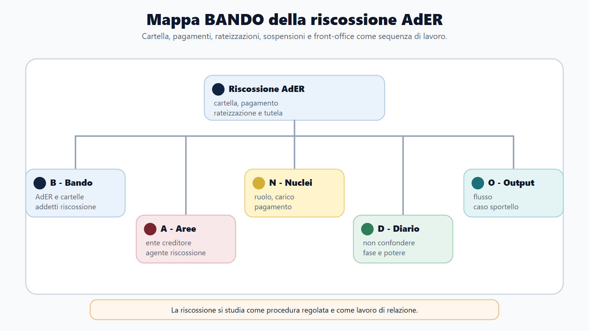
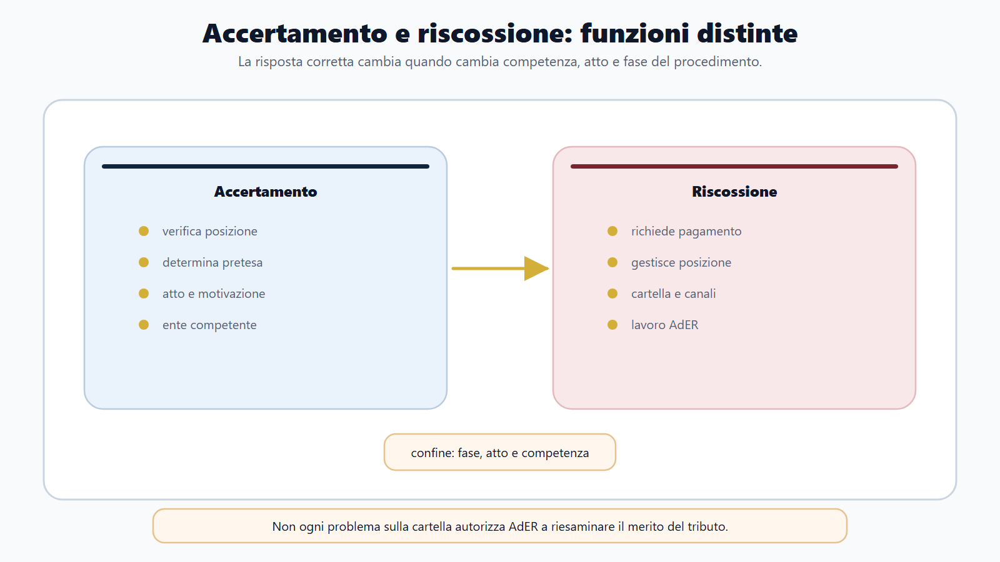
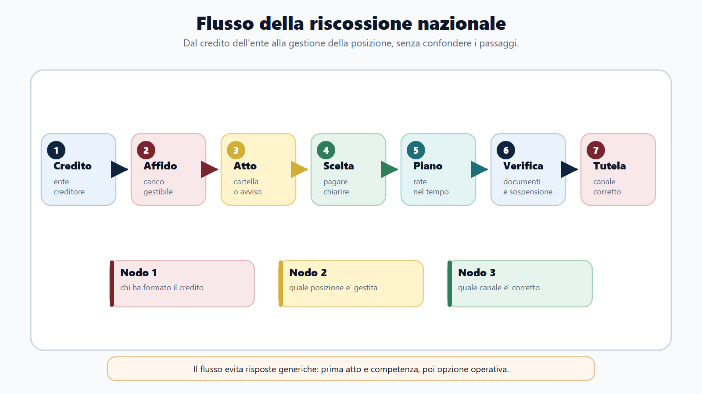
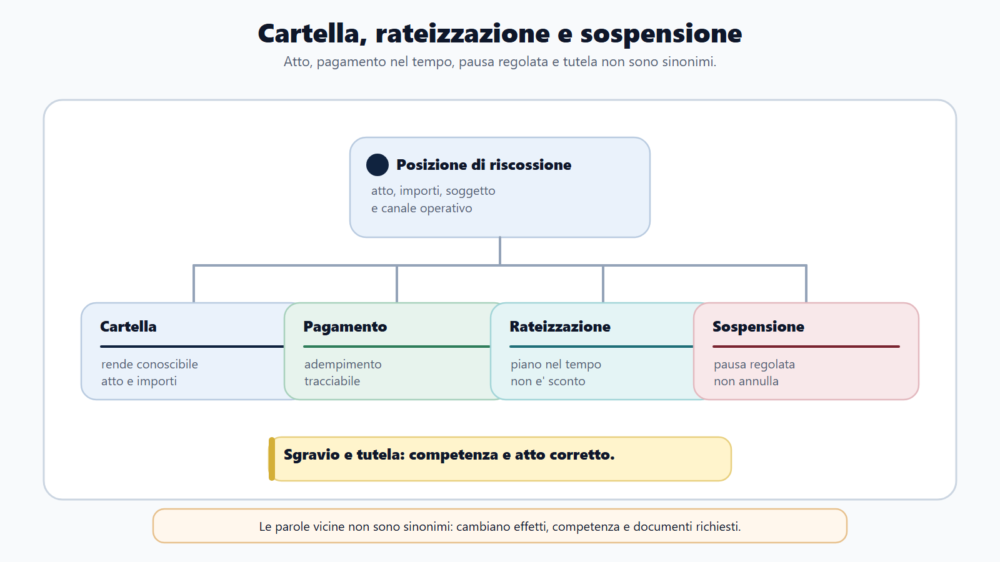
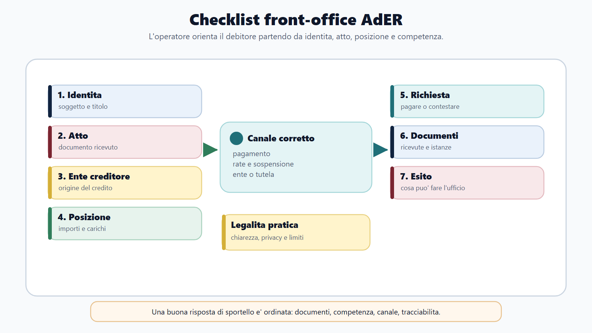

# Riscossione nazionale e lavoro in AdER

## Apertura editoriale

La riscossione comincia quando un credito pubblico deve essere incassato, ma non coincide con la decisione che quel credito esiste. Questa distinzione governa l'intero capitolo. L'ente creditore accerta o liquida la somma, forma il titolo o affida il carico; Agenzia delle entrate-Riscossione gestisce gli atti e i servizi che conducono al pagamento e, se necessario, al recupero coattivo.

In un concorso AdER non basta conoscere la modulistica. Il lavoro amministrativo comincia dalla corretta classificazione della richiesta. Il cittadino può contestare il merito del tributo, chiedere una rateizzazione, documentare un pagamento già eseguito, domandare la sospensione o chiedere chiarimenti su una procedura. Sono situazioni diverse, con competenze, termini ed effetti diversi.

Un addetto preparato non promette ciò che l'ente non può concedere, ma neppure respinge una richiesta soltanto perché è formulata in modo impreciso. Ricostruisce il carico, identifica l'ente creditore, verifica lo stato della procedura, informa sugli strumenti disponibili e registra correttamente ogni passaggio. La qualità del servizio dipende dal rispetto della legalità.

## Obiettivo del capitolo

Al termine del capitolo devi saper:

1. distinguere imposizione, accertamento e riscossione;
2. ricostruire il percorso dal ruolo alla cartella e quello dell'accertamento esecutivo;
3. separare pagamento, rateizzazione, sospensione, sgravio e ricorso;
4. individuare la competenza dell'ente creditore e quella di AdER;
5. descrivere il lavoro di front-office e back-office secondo correttezza, riservatezza e tracciabilità;
6. risolvere un caso pratico senza confondere assistenza al contribuente e decisione sul credito.

## Mappa BANDO

| Passaggio | Applicazione al capitolo |
|---|---|
| **Bando** | Cerca richiami a riscossione mediante ruolo, D.P.R. 602/1973, AdER, cartella, rateizzazione, sospensione e procedure cautelari o esecutive. |
| **Aree** | Collega diritto tributario, procedimento amministrativo, servizi digitali, protezione dei dati, contabilità e relazione con l'utenza. |
| **Nuclei** | Ente creditore, ruolo, carico, cartella, accertamento esecutivo, pagamento, dilazione, sospensione, sgravio, tutela. |
| **Diario** | Registra gli errori di competenza: chi decide sul tributo, chi riscuote, chi sospende, chi annulla. |
| **Output** | Produci un flusso della riscossione e una risposta orale di due minuti su un caso di cartella contestata. |

## 1. AdER nel sistema della riscossione nazionale

Agenzia delle entrate-Riscossione è un ente pubblico economico istituito dall'art. 1 del D.L. 193/2016, convertito dalla L. 225/2016. Svolge le funzioni relative alla riscossione nazionale ed è sottoposto all'indirizzo operativo e al controllo dell'Agenzia delle Entrate. Ha autonomia organizzativa, patrimoniale, contabile e di gestione.

Questa qualificazione ha conseguenze concrete. AdER non è una direzione interna dell'Agenzia delle Entrate, ne una delle agenzie fiscali disciplinate dal D.Lgs. 300/1999 nello stesso senso di AE e ADM. È un ente strumentale distinto, con propri organi e una specifica missione istituzionale. Il Direttore coincide con il Direttore dell'Agenzia delle Entrate; completano la governance il Comitato di gestione e il Collegio dei revisori dei conti.

L'espressione "riscossione nazionale" indica una funzione esercitata per crediti affidati da amministrazioni ed enti diversi. Dietro una cartella può esserci un tributo erariale, un'entrata locale, una sanzione amministrativa o un'altra entrata prevista dalla legge. Per questo l'operatore deve sempre leggere il campo relativo all'ente creditore: la natura del credito orienta competenza, tutela e autorità cui rivolgere la contestazione.

## 2. Accertamento e riscossione: la separazione essenziale

L'accertamento determina, nei casi previsti, l'esistenza e la misura dell'obbligazione tributaria. La riscossione mira invece all'incasso di una somma ormai affidata secondo un titolo previsto dalla legge. Le due fasi possono susseguirsi, ma non sono intercambiabili.

Nella pratica, questa distinzione orienta subito la risposta. Se il debitore sostiene che l'imposta è stata calcolata male, il problema riguarda di regola l'ente titolare del credito o l'atto impositivo. Se chiede come pagare, come ottenere una dilazione o quale sia lo stato di una procedura gestita dall'agente della riscossione, il suo interlocutore è AdER. Una richiesta può contenere entrambe le questioni: l'addetto deve scomporla e indicare per ciascuna il percorso corretto.

| Questione | Soggetto normalmente competente | Risposta operativa |
|---|---|---|
| Fondatezza e misura del tributo | Ente creditore | Verificare atto originario, eventuale istanza o tutela prevista. |
| Dati del ruolo e somme affidate | Ente creditore e AdER secondo le rispettive attribuzioni | Ricostruire il carico e distinguere dati del credito da dati della riscossione. |
| Modalità di pagamento | AdER | Fornire canali, importi aggiornati e riferimenti dell'atto. |
| Rateizzazione | AdER, quando la legge le attribuisce il potere | Verificare requisiti, importo, documentazione e piano applicabile. |
| Sgravio del credito | Ente creditore | Acquisire o attendere il provvedimento dell'ente titolare. |
| Sospensione legale | AdER riceve e trasmette; l'ente creditore verifica | Controllare termine, causa invocata e documenti. |

## 3. Il percorso ordinario: ruolo, cartella e pagamento

Nel modello tradizionale l'ente creditore forma il ruolo. Il ruolo è un elenco nel quale sono iscritti i debitori e le somme dovute; una volta reso esecutivo, viene consegnato all'agente della riscossione. AdER prende in carico le posizioni, elabora la cartella e la notifica al destinatario.

La cartella di pagamento non crea dal nulla il credito. Comunica al debitore le somme iscritte a ruolo e lo invita a pagare entro il termine previsto. Deve consentire di identificare almeno il destinatario, gli enti creditori, la causale e gli importi, le indicazioni sul responsabile, le modalità di pagamento e gli strumenti di tutela o regolarizzazione.

Dopo la notifica, il destinatario può pagare, chiedere una rateizzazione, attivare la sospensione nei casi previsti oppure proporre la tutela pertinente. Se non interviene alcuna iniziativa idonea e il debito rimane insoluto, AdER può procedere secondo legge. L'operatore non deve descrivere questo passaggio come automatico e indiscriminato: ogni misura richiede presupposti, adempimenti e limiti specifici.

Il pagamento chiude o riduce la posizione per la parte versata. AdER riversa le somme agli enti creditori. La corretta imputazione è decisiva, soprattutto quando il debitore ha più carichi: prima di dare indicazioni occorre verificare identificativo dell'atto, posizione, importo aggiornato ed eventuale piano in corso.

## 4. L'accertamento esecutivo e l'avviso di presa in carico

Non tutti i crediti passano attraverso una cartella. Per gli atti ai quali la legge attribuisce efficacia esecutiva, l'avviso contiene già l'intimazione a pagare e diventa titolo per la riscossione dopo i passaggi previsti. L'ente creditore affida quindi il carico ad AdER senza una successiva iscrizione a ruolo seguita da cartella.

L'avviso di presa in carico informa il debitore che AdER ha ricevuto il carico. Non è un nuovo accertamento e non sostituisce l'atto originario. All'orale, la distinzione può essere espressa così: "cartella e accertamento esecutivo sono due percorsi di formazione della pretesa esecutiva; non sono due atti consecutivi necessari per lo stesso credito".

Al front-office si parte dunque da una domanda: quale atto ha ricevuto l'utente? Leggere solo la parola "Agenzia" o l'importo porta facilmente a fornire informazioni riferite al procedimento sbagliato.

## 5. Rateizzazione: pagare nel tempo senza cancellare il debito

La rateizzazione consente di distribuire il pagamento quando ricorrono i presupposti di legge. Non annulla il carico, non ne modifica il fondamento e non equivale a uno sgravio. Con l'accoglimento nasce un piano che il debitore deve rispettare; il mancato pagamento delle rate rilevanti può determinare la decadenza secondo il regime applicabile.

L'art. 19 del D.P.R. 602/1973 è la disposizione centrale. Il D.Lgs. 110/2024 ha modificato requisiti e durata dei piani con una progressione temporale. Per le richieste presentate nel 2025 e 2026, i debiti fino a 120.000 euro compresi in ciascuna domanda possono essere dilazionati, su semplice richiesta accompagnata dalla dichiarazione di temporanea difficoltà, fino a 84 rate mensili. Piani più lunghi o importi superiori richiedono la documentazione stabilità dalla disciplina e dai provvedimenti attuativi.

> **Dato mobile 2026**
> Soglie, numero di rate e cause di decadenza devono essere verificate alla data del bando. Il candidato deve conoscere il meccanismo e poi aggiornare i valori sul portale AdER e sul testo vigente dell'art. 19.

L'ufficio controlla quali carichi rientrano nella domanda, se la dilazione compete ad AdER, quali documenti servono e se esistono piani precedenti. Una risposta generica come "può sempre rateizzare" è scorretta: la decisione dipende dalla disciplina vigente e dalla posizione concreta.

## 6. Sospensione, sgravio e ricorso non sono sinonimi

La sospensione arresta temporaneamente la riscossione; lo sgravio elimina in tutto o in parte il carico per effetto di un provvedimento dell'ente creditore; il ricorso chiede al giudice competente di decidere una controversia. Confondere questi istituti significa confondere effetti e autorità competenti.

La sospensione legale della riscossione, disciplinata dalla L. 228/2012, può essere chiesta ad AdER entro sessanta giorni dalla notifica dell'atto nei casi tassativi. Tra questi rientrano, secondo la disciplina e la modulistica istituzionale, il pagamento effettuato prima della formazione del ruolo, lo sgravio già disposto, la prescrizione o decadenza maturata prima dell'esecutivita del ruolo, la sospensione amministrativa o giudiziale e la sentenza di annullamento resa in un giudizio cui l'agente della riscossione non ha partecipato.

AdER riceve la dichiarazione, sospende le attività nei limiti previsti e trasmette la documentazione all'ente creditore. È quest'ultimo a verificare il fondamento della richiesta. Questo passaggio mostra bene la ripartizione dei ruoli: l'agente della riscossione gestisce la procedura, ma non decide autonomamente se il tributo originario fosse dovuto.

La sospensione amministrativa può inoltre derivare da un provvedimento dell'ente creditore; quella giudiziale da una decisione dell'autorità competente. Il ricorso non sospende sempre e per il solo fatto di essere stato proposto: occorre verificare la disciplina della controversia e l'eventuale provvedimento di sospensione.

## 7. Misure cautelari ed esecuzione forzata

Se il debito non viene pagato e non opera una causa di sospensione, AdER può avviare le attività previste per il recupero. Il sistema distingue misure cautelari, che proteggono la possibilità di riscossione, e procedure esecutive, dirette a soddisfare il credito sul patrimonio del debitore.

Le misure cautelari non servono a punire il debitore: servono a conservare la garanzia patrimoniale del credito quando ricorrono i presupposti di legge. Le procedure esecutive, invece, intervengono quando la riscossione deve tradursi in un prelievo forzoso nei limiti consentiti dal titolo e dalle notifiche effettuate. La distinzione incide sul momento procedurale, sul bene coinvolto e sulla risposta da dare all'utente.

Tra gli istituti più ricorrenti nello studio figurano fermo amministrativo, ipoteca e pignoramento. Non basta memorizzarne i nomi. Per ciascuno occorre associare presupposto, bene interessato, comunicazioni preventive, limiti e rimedi. Le soglie quantitative e le esclusioni sono soggette a modifiche: vanno studiate sul testo vigente, non su riassunti non datati.

| Istituto | Funzione pratica | Cosa colpisce | Errore da evitare |
|---|---|---|---|
| Fermo amministrativo | Impedisce la libera disponibilita del veicolo fino alla regolarizzazione o alla definizione del debito | Beni mobili registrati | Pensare che coincida sempre con il pignoramento |
| Ipoteca | Rafforza la garanzia sul bene immobile secondo i presupposti di legge | Immobili | Confonderla con la vendita forzata |
| Pignoramento | Avvia la fase esecutiva sui beni o sui crediti del debitore | Beni mobili, immobili o crediti | Trattarlo come semplice sollecito di pagamento |

Per ricostruire la procedura, bisogna partire dall'atto e dalla notifica, verificare il decorso del termine e l'eventuale pagamento o tutela, quindi esaminare le misure successive previste. Se manca un passaggio, la risposta non può saltare direttamente alla misura più forte. Il candidato deve quindi domandarsi: il debito è certo nei limiti della procedura? Il termine è decorso? Esistono sospensioni, rateazioni o contestazioni che incidono sul corso della riscossione?

L'azione di riscossione deve restare tracciabile, proporzionata e conforme alla sequenza legale. L'addetto verifica notifiche, decorso dei termini, pagamenti, sospensioni e vincoli prima di trattare la pratica. Una procedura basata su dati incompleti produce costi per l'ente e un danno immediato per il cittadino.

### Cosa deve saper dire il candidato

In un orale il candidato deve saper spiegare che:

- le misure cautelari tutelano la futura riscossione;
- le procedure esecutive servono al recupero coattivo vero e proprio;
- non ogni atto di AdER apre subito l'esecuzione;
- prima di applicare una misura occorre verificare notifica, termini, importi e cause ostative;
- la risposta all'utenza deve distinguere informazione, preavviso, misura e rimedio.

### Caso guidato

Un contribuente riceve un preavviso relativo a un veicolo e sostiene che, avendo appena presentato una domanda di rateizzazione, "non può più succedere nulla". L'operatore non deve dare una risposta automatica. Prima verifica lo stato della richiesta, la posizione del carico, gli eventuali effetti sospensivi e la disciplina applicabile alla fattispecie. Solo dopo chiarisce se il procedimento cautelare può proseguire, se è sospeso o se deve essere rielaborato.

### Domanda-trappola

**Le misure cautelari e le procedure esecutive sono la stessa cosa?**

No. Le prime servono a preservare la garanzia del credito; le seconde realizzano il recupero coattivo secondo la procedura prevista. Mescolarle significa perdere la sequenza logica della riscossione e rischiare una risposta errata al commissario.

## 8. Il lavoro in AdER: pratica, servizio e responsabilità

Il lavoro in AdER combina attività giuridico-amministrativa, gestione documentale, uso di applicativi, trattamento di dati personali e relazione con l'utenza. La concreta distribuzione delle mansioni dipende dal profilo e dall'organizzazione vigente, ma alcune competenze sono trasversali.

Nel front-office l'operatore identifica l'utente secondo le regole del canale, acquisisce la richiesta, consulta la posizione nei limiti dell'autorizzazione, spiega gli atti in linguaggio comprensibile e indirizza verso il servizio corretto. Non svolge consulenza privata e non anticipa l'esito di istanze che richiedono istruttoria.

Nel back-office ricostruisce carichi, notifiche, pagamenti e provvedimenti; tratta istanze; aggiorna i sistemi; comunica con enti creditori e altre strutture; conserva la documentazione secondo le regole applicabili. Qui la precisione formale tutela anche la sostanza: una data errata o un documento associato alla posizione sbagliata può incidere su termini, procedure e diritti.

AdER, quale ente pubblico economico, adotta regole proprie per selezione e gestione del personale nel rispetto dei principi applicabili. Il rapporto di lavoro non va confuso con quello dei dipendenti ministeriali. In ogni concorso fanno fede l'avviso, il regolamento di selezione e il contratto collettivo indicato; il manuale offre la cornice, non sostituisce questi documenti.

### Competenze professionali ricorrenti

- lettura giuridica dell'atto e individuazione della fase procedimentale;
- uso corretto delle banche dati e verifica incrociata delle informazioni;
- comunicazione chiara anche in situazioni conflittuali;
- tutela della riservatezza e accesso ai soli dati necessari;
- tracciatura delle operazioni e gestione ordinata dei documenti;
- capacità di distinguere informazione, istruttoria e decisione.

## 9. Front-office: una checklist che evita errori

Prima di rispondere a un utente, l'addetto dovrebbe seguire una sequenza stabile:

1. identificare la persona e verificare eventuale delega o rappresentanza;
2. individuare l'atto mediante numero, ente creditore e data di notifica;
3. chiarire la domanda effettiva: pagamento, rate, sospensione, sgravio, ricorso o informazioni;
4. controllare stato del carico, pagamenti e procedure in corso;
5. separare ciò che compete ad AdER da ciò che compete all'ente creditore o al giudice;
6. indicare servizio, modulo, documenti e termine applicabili;
7. registrare l'attività e consegnare riferimenti verificabili;
8. evitare valutazioni sul merito non rientranti nelle attribuzioni dell'ufficio.

La risposta non deve essere evasiva. Se il cittadino è davanti all'ufficio sbagliato, deve capire perché e a chi rivolgersi. Se manca un documento, deve sapere quale e quale funzione svolge. La chiarezza riduce accessi ripetuti e contenzioso evitabile.
### Mappa anti-confusione

| Confusione | Perché è sbagliata | Formula corretta |
|---|---|---|
| Riscossione = accertamento | Scambia la determinazione del credito con la gestione del pagamento. | L'accertamento forma o verifica la pretesa; la riscossione la porta a pagamento. |
| Cartella = debito in senso sostanziale | Riduce il documento alla sola cifra richiesta. | La cartella comunica e gestisce una posizione iscritta a ruolo. |
| Rateizzazione = sconto | Confonde una modalità di adempimento con la riduzione del credito. | La rateizzazione distribuisce il pagamento secondo le regole vigenti. |
| Sospensione = annullamento | Confonde un arresto della procedura con la rimozione della pretesa. | La sospensione non elimina automaticamente il credito. |
| Sportello = giudice o ente creditore | Attribuisce all'operatore poteri che non possiede. | Lo sportello informa, gestisce le procedure di competenza e indirizza al soggetto corretto. |

## Caso guidato: cartella per una somma già pagata

Una cittadina presenta una cartella relativa a una sanzione comunale e mostra una ricevuta di pagamento anteriore alla formazione del ruolo. Chiede all'operatore AdER di "cancellare subito la multa".

**1. Classificazione.** La contestazione riguarda il permanere del credito, ma la documentazione indica uno dei casi che possono fondare la sospensione legale.

**2. Competenza.** AdER non annulla autonomamente il credito del Comune. Può ricevere la dichiarazione di sospensione entro il termine previsto e trasmetterla all'ente creditore.

**3. Istruttoria minima.** L'operatore identifica la contribuente, verifica l'atto, la data di notifica, la riferibilita della ricevuta al debito e la completezza del modulo.

**4. Effetto.** La riscossione viene sospesa secondo la disciplina mentre il Comune verifica. Se il Comune riconosce il pagamento, dispone lo sgravio; se respinge, comunica l'esito e la riscossione può riprendere.

**5. Comunicazione.** L'operatore spiega che sospensione e cancellazione sono diverse. Non promette l'annullamento, ma indica con precisione il procedimento attivato e conserva la prova della presentazione.

## Da sapere in 5 righe

1. L'ente creditore determina il credito; AdER ne cura la riscossione.
2. Nel percorso a ruolo, AdER elabora e notifica la cartella dopo la consegna del ruolo.
3. L'accertamento esecutivo non richiede una successiva cartella per lo stesso carico.
4. Rateizzazione, sospensione, sgravio e ricorso hanno presupposti ed effetti diversi.
5. Nel lavoro AdER, classificare correttamente la richiesta viene prima della risposta.

## Domanda da commissario

**Qual è la funzione della cartella di pagamento e quale rapporto intercorre tra ente creditore e AdER?**

Traccia di risposta: definire ruolo e cartella; precisare che il ruolo è formato dall'ente creditore; descrivere notifica, pagamento e servizi gestiti da AdER; distinguere contestazione del merito, sgravio e strumenti propri della riscossione; chiudere con il percorso alternativo dell'accertamento esecutivo.

## Domanda-trappola

**Se il contribuente contesta l'importo della cartella, AdER può ridurre il tributo in autotutela?**

No, non in via generale. AdER gestisce la riscossione e può intervenire sugli aspetti di propria competenza. La correzione del fondamento o dell'ammontare del credito spetta normalmente all'ente creditore, che può emettere il provvedimento di sgravio. Vanno comunque distinti vizi dell'attività di riscossione e vizi dell'atto presupposto.

## Errore tipico

Pensare che ogni richiesta di aiuto blocchi la riscossione. Una domanda di informazioni, un'istanza all'ente creditore o un ricorso non producono automaticamente lo stesso effetto. L'operatore deve individuare il titolo giuridico della sospensione e verificarne l'efficacia sulla procedura concreta.

## Mini-esercizio

Per ciascuna situazione indica: soggetto competente, strumento e primo controllo da eseguire.

1. Il debitore chiede di pagare in 72 rate.
2. L'ente creditore ha già emesso un provvedimento di sgravio.
3. Il contribuente afferma che l'imposta è stata calcolata male.
4. Un delegato chiede l'estratto della posizione di un familiare.
5. L'utente ha ricevuto un avviso di presa in carico e pretende la cartella.

### Soluzione ragionata

1. AdER: domanda di rateizzazione; verificare importo, regime temporale, carichi e requisiti.
2. Ente creditore e AdER: acquisizione/allineamento dello sgravio; verificare autenticita, riferibilita e stato del carico.
3. Ente creditore o giudice secondo il caso: contestazione dell'atto; identificare atto originario e termini.
4. AdER: accesso documentale o servizio informativo; verificare identità, delega e poteri del richiedente.
5. AdER per la fase di riscossione: spiegare il percorso dell'accertamento esecutivo; verificare atto presupposto e affidamento.

## Quiz di verifica

**1. Chi forma il ruolo?**
A. AdER.
B. L'ente creditore.
C. Il giudice tributario.
D. Il contribuente.
**Risposta corretta: B.** AdER riceve il ruolo e cura la riscossione secondo la disciplina applicabile.

**2. La rateizzazione:**
A. annulla il debito;
B. sostituisce sempre il ricorso;
C. distribuisce il pagamento secondo un piano;
D. obbliga l'ente creditore allo sgravio.
**Risposta corretta: C.** Il credito resta dovuto, salvo successivi provvedimenti che incidano sul carico.

**3. Nella sospensione legale, la verifica sul merito del credito compete:**
A. all'ente creditore;
B. esclusivamente al contribuente;
C. alla banca;
D. al datore di lavoro.
**Risposta corretta: A.** AdER riceve e trasmette la dichiarazione e sospende nei limiti previsti.

**4. L'avviso di presa in carico:**
A. è sempre seguito da una nuova cartella;
B. comunica l'affidamento ad AdER di un carico derivante da atto esecutivo;
C. annulla l'accertamento;
D. concede automaticamente 120 rate.
**Risposta corretta: B.** Non è un nuovo accertamento ne una cartella necessaria.

## Diario degli errori

| Errore commesso | Regola corretta | Azione di recupero |
|---|---|---|
| Ho attribuito ad AdER la decisione sul tributo | Il merito compete normalmente all'ente creditore | Ripetere la tabella delle competenze |
| Ho confuso sospensione e sgravio | La prima arresta; il secondo elimina il carico | Costruire due esempi distinti |
| Ho dato per obbligatoria la cartella | Esistono atti esecutivi affidati senza cartella | Ripassare i due flussi |
| Ho memorizzato una soglia senza data | Le regole di rateizzazione sono mobili | Annotare fonte e data di verifica |

## Checklist finale

- [ ] So distinguere accertamento e riscossione.
- [ ] So spiegare ruolo, cartella e accertamento esecutivo.
- [ ] Individuo l'ente creditore in un caso concreto.
- [ ] Non confondo pagamento, rateizzazione, sospensione, sgravio e ricorso.
- [ ] Conosco la logica delle misure cautelari ed esecutive.
- [ ] So gestire identificazione, delega, documenti e riservatezza al front-office.
- [ ] Verifico soglie e termini mobili sulla fonte vigente.
- [ ] So esporre il caso guidato in due minuti.

## Riferimenti consolidati

- [[books/il-metodo-bando/chapters/diritto-amministrativo-per-candidati]]
- [[books/il-metodo-bando/chapters/pubblico-impiego-e-organizzazione-pa]]
- [[books/il-metodo-bando/chapters/trasparenza-anticorruzione-privacy]]
- [[books/il-metodo-bando/chapters/casi-pratici-problem-solving-amministrativo]]

## Note di review

- Verificare prima della pubblicazione il testo vigente del D.P.R. 602/1973, del D.Lgs. 112/1999 e del D.Lgs. 110/2024.
- Aggiornare il box rateizzazione in base all'anno del bando e ai provvedimenti attuativi.
- Verificare soglie, termini ed esclusioni delle singole procedure cautelari ed esecutive.
- Allineare la sezione sul lavoro al regolamento di selezione, al CCNL e allo specifico avviso AdER usato nell'edizione.
