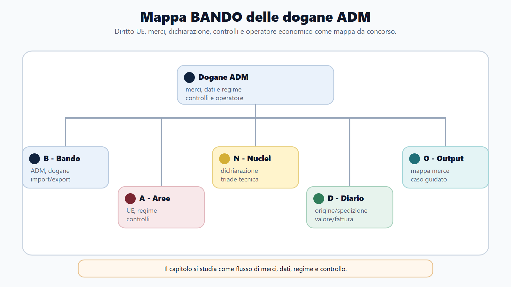
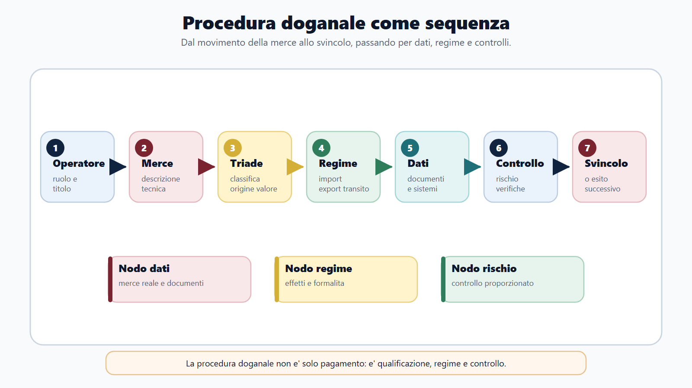
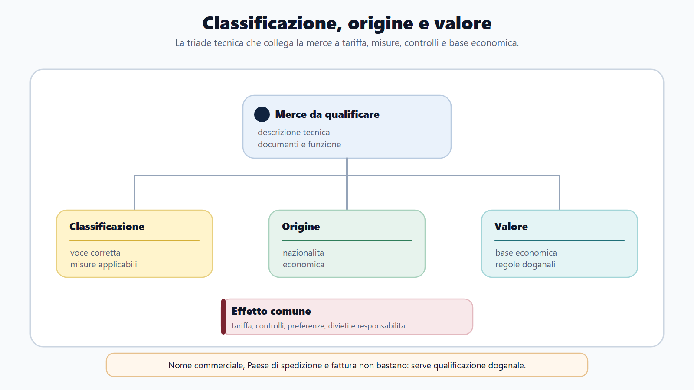
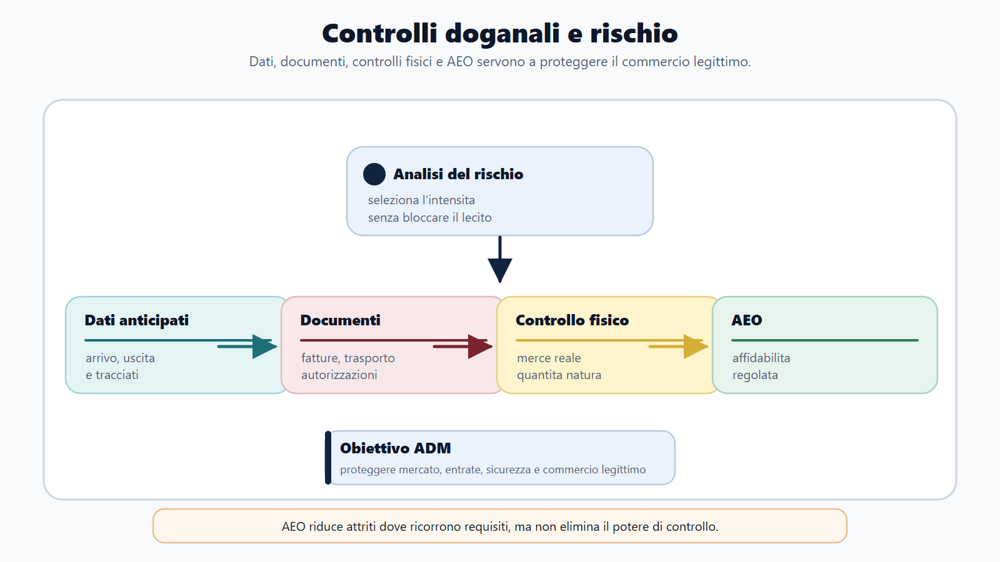
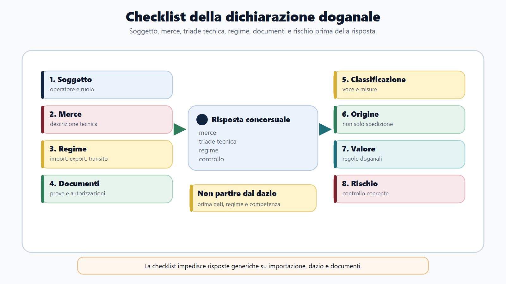

# Dogane e procedure doganali ADM

## Apertura editoriale

Una merce che attraversa il confine doganale non viene valutata soltanto per ciò che sembra. Occorre stabilire che cosa sia secondo la tariffa, quale origine possieda, quale valore debba essere dichiarato e quale regime l'operatore intenda applicare. Da queste coordinate dipendono dazi, misure di politica commerciale, divieti, controlli e documenti.

Nel lavoro doganale, fiscalità e sicurezza devono convivere con la regolarità degli scambi. ADM protegge le risorse finanziarie dell'Unione e dello Stato, contrasta i movimenti irregolari di merci e limita gli ostacoli per gli operatori corretti. Il controllo non è quindi un passaggio separato dalla procedura: accompagna la dichiarazione, l'analisi del rischio e lo svincolo.

La prima difficoltà, nello studio, è il lessico. Introduzione, presentazione, dichiarazione, accettazione e svincolo descrivono momenti diversi. Origine, provenienza e spedizione non coincidono. Prezzo di fattura e valore in dogana possono divergere. Il capitolo ordina questi concetti in un unico flusso operativo.

## Obiettivo del capitolo

Al termine del capitolo devi saper:

1. collocare il Codice doganale dell'Unione e le norme nazionali complementari;
2. ricostruire la sequenza dall'arrivo della merce allo svincolo;
3. distinguere classificazione, origine e valore;
4. riconoscere i principali regimi doganali;
5. spiegare dichiarazione, rappresentanza e responsabilità dell'operatore;
6. descrivere controlli documentali e fisici secondo analisi del rischio;
7. risolvere un caso doganale con metodo, senza saltare direttamente al calcolo del dazio.

## Mappa BANDO

| Passaggio | Applicazione al capitolo |
|---|---|
| **Bando** | Cerca CDU, normativa doganale, importazione, esportazione, transito, dichiarazione, controlli, origine, valore e tariffa. |
| **Aree** | Collega diritto UE, diritto tributario, procedimento amministrativo, commercio internazionale, controlli e sanzioni. |
| **Nuclei** | Territorio doganale, status delle merci, dichiarante, regime, debito, origine, valore, classificazione, svincolo. |
| **Diario** | Registra le coppie da non confondere: origine/provenienza, introduzione/importazione, accettazione/svincolo. |
| **Output** | Disegna il flusso di una dichiarazione e risolvi un caso indicando documenti, rischio e possibile controllo. |

## 1. Le fonti: prima l'Unione, poi il complemento nazionale

Il nucleo della disciplina è il Regolamento (UE) n. 952/2013, che istituisce il Codice doganale dell'Unione, o CDU. Essendo un regolamento, opera direttamente negli Stati membri. Lo completano soprattutto il Regolamento delegato (UE) 2015/2446 e il Regolamento di esecuzione (UE) 2015/2447, che precisano condizioni, dati, procedure e modalità applicative.

In Italia il D.Lgs. 26 settembre 2024, n. 141 reca le disposizioni nazionali complementari al CDU e riorganizza anche il sistema sanzionatorio doganale. Il D.P.R. 43/1973 conserva rilievo storico e per le disposizioni non superate, ma non può più essere trattato come unica architrave del sistema.

La dogana italiana applica un diritto comune unionale, integrato dalle norme nazionali negli spazi consentiti. L'interpretazione deve quindi preservare uniformità e primato del diritto dell'Unione.
### Perché ADM non è AE

ADM e Agenzia delle Entrate appartengono alla stessa famiglia istituzionale, ma non svolgono lo stesso lavoro. Nel settore doganale l'oggetto immediato sono merci, operatori, regimi, dati commerciali e controlli alla frontiera o successivi. Per questo cambiano lessico, documenti e sequenza operativa. Il quadro generale dell'organizzazione resta nel capitolo 3; qui interessa la funzione doganale concreta.

## 2. Territorio doganale e status delle merci

Il territorio doganale dell'Unione è lo spazio nel quale si applica il sistema doganale comune, secondo le inclusioni ed esclusioni previste dal CDU. Non coincide in modo perfetto con il territorio geografico o fiscale degli Stati membri. Questa differenza spiega perché alcune movimentazioni richiedano formalita anche se coinvolgono territori politicamente collegati all'Unione.

Le merci si distinguono anzitutto in unionali e non unionali. Le merci unionali possono circolare nel territorio doganale dell'Unione secondo le regole del mercato interno, salvo discipline specifiche. Le merci non unionali restano sotto vigilanza doganale finche non acquistano lo status unionale, vengono vincolate a un altro regime o escono dal territorio.

La provenienza indica il luogo dal quale la merce è spedita; l'origine è invece una qualificazione giuridica fondata sulle regole di produzione o trasformazione. Un bene spedito dalla Svizzera può avere origine cinese. Per il quiz, cambiare il Paese di spedizione non cambia automaticamente l'origine.

## 3. I soggetti della dichiarazione

L'operatore economico interagisce con la dogana direttamente o tramite un rappresentante. Il dichiarante presenta la dichiarazione in nome proprio oppure è la persona nel cui nome essa viene presentata. La rappresentanza può essere diretta, quando il rappresentante agisce in nome e per conto di un'altra persona, o indiretta, quando agisce in nome proprio ma per conto altrui.

La distinzione incide sulle responsabilità e, nei casi previsti, sulla posizione debitoria. L'ufficio verifica percio i poteri di rappresentanza, l'identità dell'operatore e il codice EORI. L'EORI è l'identificativo usato nei rapporti doganali nell'Unione e consente di collegare dichiarazioni, autorizzazioni e controlli al soggetto corretto.

L'operatore economico autorizzato, AEO, è un soggetto riconosciuto affidabile sulla base dei requisiti previsti. Lo status può dare accesso a semplificazioni o agevolazioni nei controlli, secondo il tipo di autorizzazione. Non elimina i controlli e non equivale a un'immunita doganale.

## 4. Dall'arrivo allo svincolo

La procedura può essere letta come una catena:

1. informazioni preventive di sicurezza, quando richieste;
2. introduzione delle merci e arrivo presso il luogo o ufficio competente;
3. presentazione in dogana;
4. eventuale custodia temporanea;
5. dichiarazione per un regime doganale o riesportazione;
6. accettazione della dichiarazione;
7. analisi del rischio ed eventuale controllo;
8. determinazione e contabilizzazione dei diritti, se dovuti;
9. svincolo delle merci;
10. eventuale controllo successivo.

La custodia temporanea non è un regime scelto liberamente per conservare merci a tempo indefinito. È la condizione delle merci non unionali presentate in dogana in attesa di essere vincolate a un regime o riesportate, entro il termine stabilito dal CDU.

La dichiarazione manifesta la volonta di vincolare le merci al regime prescelto. La data di accettazione è rilevante per applicare le disposizioni che governano quel regime. Lo svincolo è invece l'atto con il quale la dogana rende le merci disponibili per i fini del regime. Accettare la dichiarazione non significa aver già concluso ogni controllo.

## 5. La dichiarazione doganale

La dichiarazione è normalmente elettronica e contiene i dati necessari per applicare il regime. Deve essere accompagnata, o supportata nei sistemi, dai documenti richiesti: fattura, documenti di trasporto, autorizzazioni, licenze, prove di origine e certificazioni legate a divieti o restrizioni.

Il dichiarante risponde dell'esattezza e completezza dei dati, dell'autenticita e validità dei documenti e del rispetto degli obblighi connessi al regime. Il controllo automatizzato non trasferisce la responsabilità all'amministrazione. Un dato accettato dal sistema può essere verificato successivamente.

Prima dello svincolo, la dichiarazione può essere rettificata nei casi e nei limiti del CDU. L'invalidamento elimina gli effetti della dichiarazione quando ricorrono i presupposti specifici. Rettifica e invalidamento non sono strumenti intercambiabili, ne possono essere usati per sottrarsi a un controllo già annunciato.
### Checklist della dichiarazione doganale

| Passaggio | Domanda operativa | Perché serve |
|---|---|---|
| Soggetto | Chi è l'operatore e con quale ruolo interviene? | Individua responsabilità e titolo. |
| Merce | Che cosa viene importato, esportato o movimentato? | Evita descrizioni commerciali vaghe. |
| Classificazione | Quale voce o sottovoce rileva? | Collega tariffa e misure applicabili. |
| Origine | Qual è l'origine doganale della merce? | Incide su preferenze e misure commerciali. |
| Valore | Quale valore rileva ai fini doganali? | Incide sulla base economica e sui controlli. |
| Regime | Quale regime doganale è richiesto? | Determina formalità, effetti e vincoli. |
| Documenti | Quali prove, autorizzazioni o certificati accompagnano l'operazione? | Consente il controllo documentale. |
| Rischio | Ci sono elementi che richiedono approfondimento? | Orienta selezione e controllo. |

## 6. Classificazione tariffaria: che cosa è la merce

Classificare significa attribuire alla merce il codice corretto della nomenclatura combinata e, nel sistema TARIC, considerare le ulteriori misure unionali applicabili. Il codice orienta aliquota daziaria, sospensioni, contingenti, misure antidumping, divieti, licenze e dati statistici.

La classificazione non dipende dal nome commerciale scelto dall'importatore. Si fonda sulle caratteristiche oggettive della merce, sulla composizione, sulla funzione, sul grado di lavorazione e sulle regole generali di interpretazione. Una "parte di macchina" può essere classificata altrove se possiede una funzione autonoma prevista dalla tariffa.

Quando l'operatore necessità di certezza preventiva può ricorrere, secondo il CDU, all'informazione tariffaria vincolante. Il provvedimento vincola autorità e titolare nei limiti, per le merci e per il periodo previsti; non sana dichiarazioni inesatte relative a prodotti diversi.

## 7. Origine: il legame economico con un Paese

L'origine non preferenziale serve, tra l'altro, per misure di politica commerciale, dazi antidumping, contingenti, marcatura e statistiche. Una merce interamente ottenuta in un Paese ne ha l'origine; quando intervengono più Paesi, rileva la trasformazione sostanziale secondo le regole applicabili.

L'origine preferenziale consente un trattamento daziario ridotto o nullo quando esiste un accordo o un regime autonomo e la merce soddisfa le regole previste. Occorre inoltre una prova valida dell'origine. Non basta che il venditore abbia sede in un Paese partner: contano lavorazioni, materiali e regola specifica del prodotto.

Il funzionario ricostruisce quattro elementi: la natura preferenziale o non preferenziale della regola, la voce tariffaria, la lavorazione effettuata e la prova presentata. Senza questa sequenza, la valutazione dell'origine diventa intuitiva e quindi inaffidabile.

## 8. Valore in dogana: quanto vale ai fini doganali

Per i dazi ad valorem la base primaria è il valore di transazione: il prezzo effettivamente pagato o da pagare per le merci vendute per l'esportazione verso l'Unione, rettificato secondo gli elementi da aggiungere o escludere previsti dal CDU.

Il prezzo di fattura apre la verifica, ma non sempre coincide con il valore finale. Possono rilevare trasporto e assicurazione fino al luogo previsto, commissioni, imballaggi, apporti forniti dal compratore, royalties o proventi spettanti al venditore, secondo le condizioni di legge. Rapporti tra compratore e venditore richiedono di verificare se abbiano influenzato il prezzo.

Se il valore di transazione non è utilizzabile, si applicano i metodi secondari nell'ordine previsto: valore di merci identiche o similari, metodo deduttivo, valore calcolato e metodo residuale. Il candidato deve ricordare la logica gerarchica; non può scegliere il metodo più conveniente.

## 9. I principali regimi doganali

Il regime doganale è la destinazione giuridica scelta per la merce e determina diritti, obblighi, controlli e appuramento finale. Occorre riconoscere la funzione di ciascun regime e il suo effetto sulla merce, non limitarsi a memorizzarne il nome.

| Regime | Funzione | Condizione essenziale | Errore da evitare |
|---|---|---|---|
| Immissione in libera pratica | Attribuisce alle merci non unionali lo status unionale. | Assolvimento dei dazi e delle altre misure applicabili. | Confonderla con la semplice immissione nel mercato. |
| Esportazione | Regola l'uscita delle merci unionali dal territorio doganale. | Dichiarazione e prova dell'uscita effettiva. | Pensare che basti la sola fattura estera. |
| Transito | Consente la circolazione sotto controllo doganale con sospensione dei diritti. | Presa in carico del movimento e rispetto del percorso autorizzato. | Scambiarlo per una vendita o per un'importazione. |
| Deposito | Consente di tenere merci sotto vigilanza senza assolvere subito i diritti dovuti. | Regime autorizzato e corretta custodia/appuramento. | Trattarlo come magazzino libero da regole. |
| Uso particolare | Permette un utilizzo specifico della merce alle condizioni del CDU. | Rispetto della finalità autorizzata e delle limitazioni. | Crederlo un regime generico senza vincoli. |
| Perfezionamento | Consente lavorazioni e riesportazione o reintroduzione secondo la disciplina prevista. | Autorizzazione, operazioni ammesse e appuramento. | Ridurlo a un semplice conto lavorazione. |

Immissione in libera pratica e esportazione sono i due poli più facilmente richiamati ai concorsi, ma non esauriscono la materia. Il transito protegge la circolazione; il deposito sospende l'impatto immediato dei diritti; l'uso particolare e il perfezionamento collegano il regime doganale alla finalità economica concreta. La scelta dipende dalla destinazione concreta: ingresso definitivo nel mercato, attraversamento, custodia o lavorazione.

Questi regimi differiscono per funzione, condizioni e appuramento. Spesso richiedono autorizzazione, garanzia, registrazioni e rispetto di un termine. Il vantaggio finanziario non è definitivo finche la procedura non è regolarmente conclusa.

### Cosa deve saper dire il candidato

In un orale il candidato deve saper spiegare che il regime doganale:

- orienta il destino giuridico della merce;
- determina quali dazi e misure si applicano o si sospendono;
- richiede condizioni formali e sostanziali diverse;
- non si identifica con la sola spedizione o con il solo trasporto;
- deve essere concluso correttamente con l'appuramento o con l'uscita del bene dal circuito previsto.

### Caso guidato

Un'impresa importa merci non unionali e chiede di tenerle in un magazzino interno in attesa di una successiva lavorazione. L'operatore deve prima chiedersi se l'impresa sta descrivendo un deposito doganale, un transito, un'immissione in libera pratica o un perfezionamento. La risposta non dipende dal linguaggio commerciale usato dall'utente, ma dalla finalità giuridica e dalle condizioni che la disciplina consente.

## 10. Debito doganale e garanzia

Il debito doganale è l'obbligo di pagare i dazi all'importazione o all'esportazione applicabili a una determinata merce. Può sorgere per regolare vincolo a un regime oppure per inosservanza degli obblighi doganali. Il debitore e il momento di insorgenza dipendono dalla fattispecie.

Il debito doganale non coincide con il valore della merce ne con la semplice dichiarazione. È l'obbligazione pubblicistica che nasce quando ricorrono i presupposti previsti dal CDU. Se il regime è corretto, il debito nasce e si quantifica secondo le regole del sistema; se vi è violazione, possono sorgere conseguenze ulteriori previste dalla disciplina.

La garanzia tutela l'adempimento di un debito esistente o potenziale. Può essere isolata o globale e, nei casi previsti, beneficiare di riduzioni o esoneri. Non sostituisce il debito: assicura che l'amministrazione possa riscuoterlo se l'obbligazione diventa esigibile.

| Concetto | Funzione | Domanda da farsi | Errore da evitare |
|---|---|---|---|
| Debito doganale | Obbligo di pagamento dei diritti dovuti. | Esiste un presupposto normativo per farlo nascere? | Ridurlo a un semplice importo da fattura. |
| Garanzia | Copre il rischio di mancato pagamento o di obbligazioni potenziali. | La procedura richiede una garanzia e quale tipo? | Considerarla una sanzione o un costo accessorio. |
| Sgravio | Evita o elimina l'esazione nei casi previsti. | C'e un motivo legale per non riscuotere? | Confonderlo con il rimborso. |
| Rimborso | Restituisce quanto già pagato. | La somma è stata versata e poi deve tornare indietro? | Usarlo per ogni ipotesi di annullamento. |

L'obbligazione può estinguersi nei casi disciplinati dal CDU, tra cui pagamento, sgravio, rimborso o altre cause tipiche. Anche qui il lessico conta: rimborso restituisce un importo pagato; sgravio evita la contabilizzazione o l'esazione nei presupposti normativi.

### Cosa deve saper dire il candidato

In un orale il candidato deve distinguere tre piani:

- il regime doganale scelto per la merce;
- il sorgere del debito doganale;
- la garanzia o la diversa causa di estinzione o non esazione.

### Domanda-trappola

**Se una merce è vincolata a un regime speciale, il debito doganale non può mai sorgere?**

No. Il regime speciale può sospendere o modulare l'impatto dei diritti, ma il debito può comunque sorgere se i presupposti legali lo prevedono o se vi è inosservanza degli obblighi del regime. La risposta deve separare la funzione del regime, l'insorgenza del debito e l'eventuale appuramento.

### Errore tipico

L'errore più comune è usare "regime", "debito" e "garanzia" come sinonimi. Il regime è il contenitore procedurale, il debito è l'obbligazione di pagamento e la garanzia tutela l'amministrazione. Se il commissario chiede uno di questi tre piani, la risposta deve restare sul piano corretto.

## 11. Controlli doganali e analisi del rischio

Le autorità doganali possono verificare dichiarazioni, documenti, contabilità e merci; prelevare campioni; controllare mezzi di trasporto, bagagli e luoghi nei limiti di legge. La selezione si fonda sull'analisi del rischio, integrata da controlli casuali e obblighi derivanti da normative specifiche.

Un controllo documentale confronta dichiarazione, fattura, trasporto, origine, autorizzazioni e altri elementi. Il controllo fisico verifica natura, quantità, marchi, confezioni e corrispondenza con quanto dichiarato. Le analisi di laboratorio aiutano a determinare composizione e classificazione.

Lo svincolo non impedisce il controllo successivo. La dogana può riesaminare dichiarazioni e documenti entro i termini applicabili. Per questo l'operatore conserva dati e prove: la regolarità non si esaurisce quando la merce lascia il terminal.

Il contraddittorio e il diritto di essere ascoltati operano secondo il CDU e i principi unionali prima di decisioni sfavorevoli, salve le eccezioni previste. L'interessato deve poter conoscere i motivi e presentare osservazioni utili; l'amministrazione deve valutarle nella decisione.

## 12. Il lavoro in ADM

Il funzionario o assistente ADM può operare su dichiarazioni, controlli documentali, verifiche fisiche, campionamenti, autorizzazioni, contenzioso, analisi dei rischi e servizi agli operatori, secondo profilo e ufficio. Le attività richiedono conoscenza giuridica, capacità di leggere documenti commerciali e dimestichezza con sistemi telematici.

Il rapporto con l'impresa deve essere fermo e comprensibile. Il funzionario non suggerisce come eludere un obbligo e non trasforma un dubbio classificatorio in un'accusa. Chiede documenti pertinenti, verbalizza le operazioni, protegge informazioni commerciali e motiva le conclusioni.

Il lavoro ha una dimensione europea quotidiana: dati, autorizzazioni e rischi possono interessare più Stati membri. L'unione doganale richiede uniformità applicativa e cooperazione.
### Mappa anti-confusione

| Confusione | Perché è sbagliata | Formula corretta |
|---|---|---|
| Dogana = pagamento di un dazio | Riduce la dogana al solo incasso. | La dogana applica regole su merci, regimi, controlli, sicurezza e misure commerciali. |
| Origine = Paese di spedizione | Ignora la qualificazione economica della merce. | L'origine si determina secondo regole doganali. |
| Valore doganale = prezzo di fattura | Ignora condizioni e rettifiche previste. | La fattura è il punto di partenza; il valore segue i criteri del CDU. |
| Classificazione = descrizione commerciale | Il nome comune non identifica sempre la voce tariffaria. | La classificazione dipende dalle caratteristiche oggettive e dalla nomenclatura. |
| AEO = assenza di controlli | Confonde facilitazione e immunità. | AEO indica affidabilità regolata, non esclusione assoluta dai controlli. |
| Svincolo = fine di ogni verifica | Dimentica i controlli successivi. | Lo svincolo consente la disponibilità secondo il regime, ma non elimina ogni potere di controllo. |

## Caso guidato: componenti elettronici importati

Una società italiana importa da un fornitore turco componenti prodotti in Cina. La fattura li descrive come "accessori elettronici", applica un prezzo molto basso rispetto a merci comparabili e allega una dichiarazione che indica origine preferenziale turca.

**1. Regime.** La società chiede l'immissione in libera pratica. Occorre verificare dichiarazione, soggetto, documenti e misure applicabili.

**2. Classificazione.** La descrizione commerciale non basta. Si acquisiscono schede tecniche, composizione e funzione per individuare il codice tariffario.

**3. Origine.** Spedizione dalla Turchia e origine non coincidono. Va verificata la lavorazione effettuata e la prova invocata; la produzione cinese può escludere l'origine preferenziale se non ricorrono le regole dell'accordo.

**4. Valore.** Il prezzo basso non viene sostituito automaticamente. Si chiedono contratto, pagamenti, rapporti tra le parti e costi da includere; se il valore di transazione non è accettabile, si passa ai metodi secondari nell'ordine legale.

**5. Controllo.** Il rischio interessa tre elementi distinti. Il campionamento può chiarire la classificazione; l'istruttoria documentale riguarda origine e valore. Solo dopo la verifica si determinano dazio, altre misure e possibilità di svincolo.

## Da sapere in 5 righe

1. Il CDU è la fonte primaria comune; il D.Lgs. 141/2024 contiene il complemento nazionale.
2. Dichiarazione, accettazione, controllo e svincolo sono fasi diverse.
3. Classificazione, origine e valore determinano aspetti distinti del trattamento doganale.
4. Immissione in libera pratica, esportazione e regimi speciali hanno funzioni diverse.
5. Il controllo doganale continua anche dopo lo svincolo mediante verifiche successive.

## Domanda da commissario

**Quali sono gli elementi fondamentali dell'accertamento doganale?**

Traccia: partire da classificazione, origine e valore; spiegare l'effetto di ciascuno su dazi e misure; collegare dichiarazione e documenti; descrivere analisi del rischio, controllo e svincolo; chiudere con rettifica o controllo successivo.

## Domanda-trappola

**Una merce spedita da un Paese con accordo preferenziale beneficia sempre del dazio ridotto?**

No. La provenienza fisica non prova l'origine preferenziale. Occorre che la merce rispetti la regola di origine dell'accordo e che sia presentata una prova valida, oltre alle altre condizioni previste.

## Errore tipico

Calcolare subito il dazio partendo dal prezzo di fattura. Prima bisogna identificare la voce tariffaria, verificare origine e regime, stabilire il valore in dogana e controllare eventuali misure aggiuntive. Un calcolo numericamente corretto su dati giuridicamente sbagliati resta un accertamento errato.

## Mini-esercizio

Associa ogni situazione all'elemento da verificare per primo:

1. Il prodotto è definito in fattura "ricambio universale".
2. La merce arriva dal Vietnam ma è stata fabbricata in Cina.
3. Il compratore ha fornito gratuitamente uno stampo al produttore.
4. Merci non unionali devono raggiungere l'ufficio interno di destinazione senza pagamento immediato dei dazi.
5. L'impresa vuole lavorare materie prime extra-UE e riesportare i prodotti.

### Soluzione ragionata

1. Classificazione: servono caratteristiche oggettive e funzione.
2. Origine: provenienza e origine vanno separate.
3. Valore: l'apporto può richiedere un'aggiunta al prezzo.
4. Transito: consente la circolazione sotto controllo con sospensione.
5. Perfezionamento attivo: verificare autorizzazione, garanzia e appuramento.

## Quiz di verifica

**1. Lo svincolo:**
A. coincide sempre con l'accettazione;
B. rende la merce disponibile per il regime dichiarato;
C. attribuisce origine preferenziale;
D. elimina ogni controllo successivo.
**Risposta corretta: B.**

**2. Il metodo primario di determinazione del valore è:**
A. il valore di transazione rettificato;
B. il prezzo medio nazionale;
C. il valore scelto dall'importatore;
D. il solo costo di produzione.
**Risposta corretta: A.**

**3. La rappresentanza indiretta ricorre quando il rappresentante agisce:**
A. in nome e per conto altrui;
B. in nome proprio e per conto altrui;
C. senza alcun potere;
D. per conto dell'autorità doganale.
**Risposta corretta: B.**

**4. Il transito consente:**
A. la circolazione sotto controllo doganale con sospensione dei diritti;
B. l'origine automatica dell'Unione;
C. la vendita senza dichiarazione;
D. l'esenzione definitiva da ogni obbligo.
**Risposta corretta: A.**

## Glossario operativo

| Termine | Significato essenziale |
|---|---|
| Accettazione | Atto con cui la dogana ammette formalmente la dichiarazione. |
| AEO | Operatore riconosciuto affidabile secondo i requisiti del CDU. |
| Classificazione | Attribuzione del codice tariffario alla merce. |
| EORI | Identificativo dell'operatore nei rapporti doganali unionali. |
| Origine | Legame giuridico della merce con un Paese. |
| Regime | Destinazione procedurale cui la merce viene vincolata. |
| Svincolo | Messa a disposizione della merce per i fini del regime. |
| Valore | Base doganale determinata con i metodi del CDU. |

## Diario degli errori

| Errore | Regola corretta | Recupero |
|---|---|---|
| Ho confuso origine e provenienza | L'origine dipende dalle regole di produzione | Risolvere due casi con spedizione da Paese terzo |
| Ho equiparato fattura e valore | Il prezzo può richiedere rettifiche | Ripassare aggiunte e metodi secondari |
| Ho confuso accettazione e svincolo | Sono momenti procedurali distinti | Ridisegnare il flusso |
| Ho trattato AEO come esenzione | AEO offre benefici, non immunita | Elencare requisiti e controlli residui |

## Checklist finale

- [ ] So collocare CDU, regolamenti attuativi e D.Lgs. 141/2024.
- [ ] Distinguo merci unionali e non unionali.
- [ ] Ricostruisco il flusso dall'arrivo allo svincolo.
- [ ] Distinguo classificazione, origine e valore.
- [ ] Conosco immissione in libera pratica, esportazione e regimi speciali.
- [ ] Distinguo rappresentanza diretta e indiretta.
- [ ] So spiegare debito, garanzia e controllo successivo.
- [ ] So risolvere il caso guidato senza saltare fasi.

## Riferimenti consolidati

- [[sources/dogane-accise-giochi-monopoli-adm-m-fc02]]
- [[sources/codice-doganale-unione-procedure-adm-aggiornamento-2026-07-17]]
- [[sources/m-fc02-corpus-ufficiale-integrativo-2026-07-17]]
- [[sources/bandi-rappresentativi-m-fc02-agenzie-fiscali-2023-2026]]
- [[sources/codice-doganale-unione-procedure-doganali-m-fc02]]
- [[topics/dogane-accise-monopoli-adm]]
- [[entities/agenzia-delle-dogane-e-dei-monopoli]]

## Note di review

- Verificare la versione consolidata corrente del CDU e dei regolamenti delegato ed esecutivo.
- Allineare le disposizioni nazionali al D.Lgs. 141/2024 e agli eventuali correttivi.
- Verificare sistemi, tracciati telematici, canali di controllo e procedure ADM alla data del bando.
- Aggiornare esempi su origine preferenziale, TARIC e misure commerciali senza trasformarli in regole generali.
