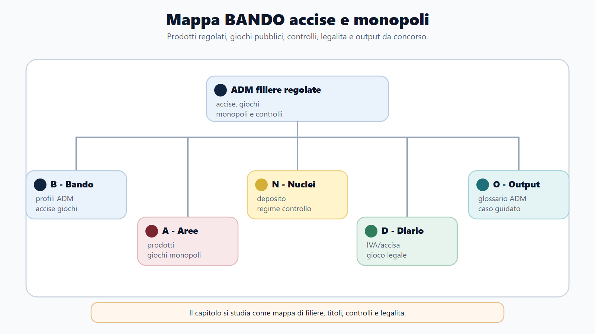
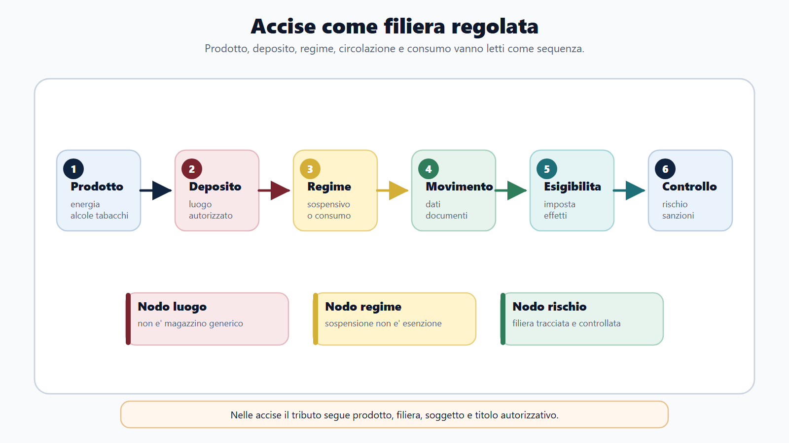
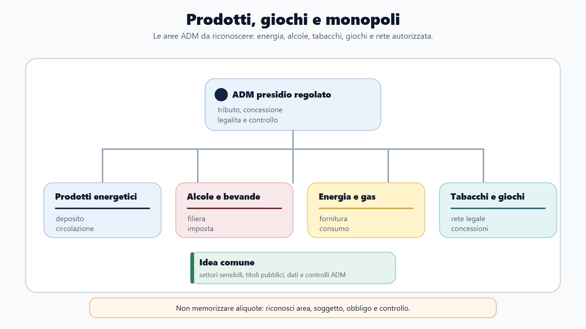
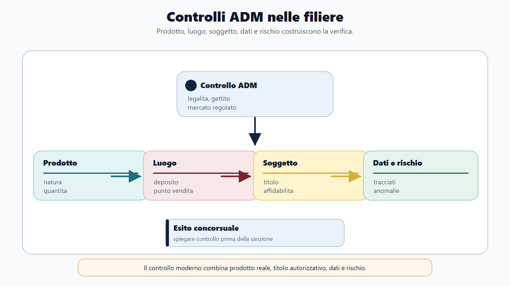
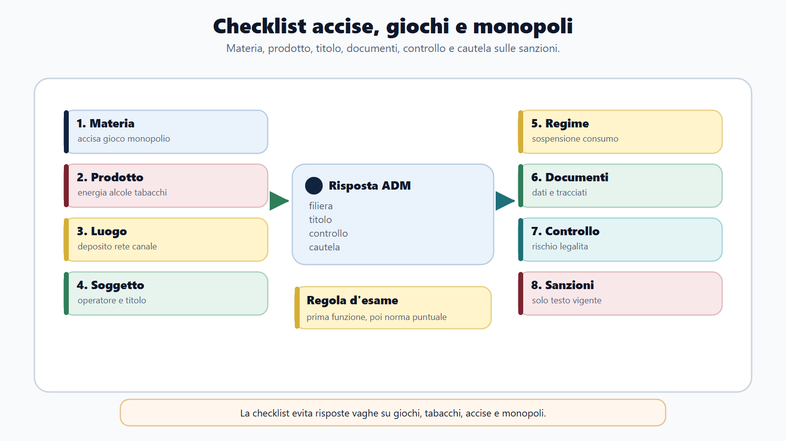

# Accise, giochi e monopoli

## Apertura editoriale

Studiare ADM come una semplice variante dell'Agenzia delle Entrate porta fuori strada. Nelle accise il tributo segue quantità e impiego dei prodotti; nei giochi e nei monopoli entrano in campo anche autorizzazioni, concessioni, reti telematiche e tutela dell'ordine pubblico.

Nel settore delle accise, l'amministrazione segue la merce dalla produzione al consumo. Contabilità di magazzino, misurazioni, cauzioni e documenti di circolazione servono a determinare quando il tributo diventa esigibile e chi deve pagarlo. Nel settore dei giochi, ADM non si limita a incassare un prelievo: regola l'offerta legale, controlla concessionari e apparecchi, tutela i minori e contrasta le reti abusive.

Per comprendere il lavoro di ADM servono tre lessici che ricorrono insieme. Quello fiscale comprende prodotto, fatto generatore, esigibilità e aliquota; quello autorizzatorio deposito, licenza, concessione e rivendita; quello operativo registri, flussi telematici, inventari, controlli e verbalizzazione.

## Obiettivo del capitolo

Al termine del capitolo devi saper:

1. definire l'accisa e distinguerla da IVA e imposta di consumo;
2. spiegare fatto generatore ed esigibilità;
3. descrivere deposito fiscale e regime sospensivo;
4. ricostruire la circolazione dei prodotti mediante EMCS ed e-AD;
5. individuare i principali settori soggetti ad accisa;
6. spiegare riserva statale e modello concessorio dei giochi;
7. collegare controlli ADM, tutela del giocatore e contrasto all'illegalita;
8. distinguere monopolio fiscale, concessione e gestione diretta.

## Mappa BANDO

| Passaggio | Applicazione al capitolo |
|---|---|
| **Bando** | Cerca TUA, accise, prodotti energetici, alcoli, tabacchi, deposito fiscale, giochi pubblici, concessioni e monopoli. |
| **Aree** | Collega diritto tributario, diritto UE, amministrativo, autorizzazioni, sanzioni e controlli economico-finanziari. |
| **Nuclei** | Esigibilità, regime sospensivo, depositario, destinatario registrato, e-AD, rete legale, concessionario, tutela dei minori. |
| **Diario** | Annota le distinzioni: accisa/IVA, fatto generatore/esigibilita, concessione/autorizzazione, legalita/assenza di rischio. |
| **Output** | Ricostruisci una movimentazione in sospensione e una verifica presso un punto di gioco. |

## 1. Accisa: struttura del tributo

L'accisa è un'imposta indiretta sulla produzione o sul consumo di prodotti specifici. La fonte nazionale centrale è il D.Lgs. 26 ottobre 1995, n. 504, Testo unico delle accise, coordinato con il diritto dell'Unione e con le successive riforme, tra cui il D.Lgs. 141/2024 per i profili interessati.

L'accisa differisce dall'IVA. Quest'ultima colpisce il valore aggiunto nelle operazioni economiche e si applica in via generale secondo il relativo sistema. L'accisa interessa categorie determinate e spesso si calcola sulla quantità fisica, sul contenuto energetico, sul titolo alcolometrico o su altri parametri stabiliti dalla legge. I due tributi possono concorrere sullo stesso prodotto.

Occorre distinguere anche l'accisa dall'imposta di consumo. Nel linguaggio comune le due espressioni vengono sovrapposte, ma la legislazione nazionale assoggetta alcuni prodotti a specifiche imposte di consumo che non appartengono necessariamente al nucleo armonizzato delle accise. Prima di qualificare il prelievo si deve quindi leggere la norma relativa al prodotto.

### Perché questa materia è ADM

Le imposte dichiarative ordinarie partono spesso dal contribuente e dalla dichiarazione. Le accise partono anche dal prodotto, dal luogo in cui si trova, dalla destinazione d'uso e dalla fase della filiera. Giochi e monopoli aggiungono titoli concessori, reti e controlli tecnici. Per orientarsi, usa sempre la stessa sequenza: **prodotto o attività → luogo o canale → soggetto e titolo → documento o dato → controllo**.

## 2. Fatto generatore ed esigibilità

Il fatto generatore indica l'evento che fa nascere l'obbligazione tributaria secondo la disciplina del prodotto. L'esigibilità individua invece il momento nel quale l'amministrazione può pretendere il pagamento. Nel sistema delle accise i due momenti possono non coincidere.

La fabbricazione o l'importazione collocano il prodotto nell'ambito fiscale; il pagamento può essere differito finche il prodotto resta in regime sospensivo. L'immissione in consumo rende normalmente esigibile l'accisa. Anche irregolarita quali ammanchi non giustificati, svincoli irregolari o inosservanze nella circolazione possono produrre effetti impositivi e sanzionatori.

La distanza tra fatto generatore ed esigibilità chiarisce la funzione del deposito fiscale. Si tratta di un impianto nel quale i prodotti sottoposti ad accisa possono essere fabbricati, trasformati, detenuti, ricevuti o spediti in sospensione, alle condizioni stabilite dall'amministrazione; non è un luogo esente da imposta.

## 3. Deposito fiscale, depositario e garanzia

L'esercizio di un deposito fiscale richiede autorizzazione e, nei casi previsti, licenza. L'amministrazione attribuisce il codice di accisa e verifica requisiti soggettivi, impianti, sistemi di misura, contabilità, cauzione e capacità di garantire gli interessi erariali.

Il depositario autorizzato gestisce il deposito e risponde degli obblighi connessi. Deve tenere registri di carico e scarico, documentare produzioni e movimenti, consentire le verifiche, prestare garanzia e comunicare le anomalie. L'autorizzazione consente di operare nel regime, ma lascia intatti gli obblighi del depositario e richiede affidabilità nel tempo.

Il destinatario registrato può ricevere, alle condizioni dell'autorizzazione, prodotti provenienti da un altro Stato membro in sospensione, ma non per questo può fabbricarli o detenerli indefinitamente in sospensione come un depositario. Lo speditore registrato opera invece nei casi previsti per la spedizione di prodotti importati immessi nel circuito sospensivo.

## 4. Circolazione in sospensione: EMCS ed e-AD

La circolazione unionale dei prodotti sottoposti ad accisa in regime sospensivo è monitorata mediante l'Excise Movement and Control System, EMCS. Lo speditore presenta il documento amministrativo elettronico, e-AD; il sistema attribuisce un codice amministrativo di riferimento e rende disponibili i dati alle autorità e ai soggetti coinvolti.

Il destinatario, dopo aver ricevuto e verificato la merce, trasmette la nota di ricevimento. Eventuali differenze di quantità, mancanze o irregolarita devono essere rilevate e trattate secondo la disciplina applicabile. L'appuramento regolare chiude la responsabilità collegata a quella movimentazione nei limiti previsti.

Il documento elettronico consente di seguire il movimento, ma il riscontro materiale resta necessario. Quantità, qualità, sigilli, mezzi e tempi devono corrispondere ai dati trasmessi. Il funzionario confronta sistema, registri, documenti commerciali e risultanze fisiche.

## 5. Prodotti energetici ed energia elettrica

I prodotti energetici comprendono categorie individuate dalla nomenclatura e dal TUA. Il trattamento dipende non soltanto dal prodotto, ma anche dall'uso: carburazione, combustione, produzione di energia, impieghi agevolati o esenti. Lo stesso bene può quindi subire regimi diversi a seconda della destinazione comprovata.

Nel controllo di un deposito energetico assumono rilievo misurazioni dei serbatoi, bilanci di materia, densita, temperatura, cali tecnici, registri e corrispondenza tra ingressi, lavorazioni e uscite. Una differenza inventariale non è automaticamente evasione, ma richiede spiegazione tecnica e giuridica.

Per gas naturale ed energia elettrica la struttura del prelievo si lega anche alla fornitura e al consumo. I soggetti obbligati presentano dichiarazioni, tengono dati e versano secondo le modalità previste. Aliquote e agevolazioni variano per impiego, categoria di utente e disposizioni vigenti: vanno sempre verificate alla data del bando.

Il nome commerciale, da solo, non consente di qualificare il caso. Occorre identificare la categoria prevista dalla disciplina, il parametro fisico rilevante, l'uso dichiarato e quello effettivo, il soggetto obbligato e la documentazione che prova un'agevolazione o un'esenzione. Il controllo mette quindi in relazione quantità, destinazione e titolo.

| Elemento | Domanda operativa | Conseguenza |
|---|---|---|
| Prodotto | In quale categoria normativa rientra? | Individua il regime applicabile. |
| Impiego | Carburazione, combustione, produzione o altro uso? | Può cambiare trattamento fiscale. |
| Soggetto | Chi fornisce, detiene o consuma? | Individua obblighi e dichiarazioni. |
| Prova | Quali registri e documenti attestano la destinazione? | Consente o esclude il trattamento invocato. |
| Riscontro | Dati e quantità fisiche coincidono? | Orienta recupero, approfondimento o chiusura. |

## 6. Alcole e bevande alcoliche

Il settore comprende alcole etilico, birra, vino, bevande fermentate e prodotti intermedi, con discipline differenziate. Base imponibile, aliquota ed eventuali regimi agevolati dipendono dalla categoria e dai parametri fissati dalla legge.

La produzione richiede impianti autorizzati, strumenti di misurazione e contabilità. ADM controlla materie prime, rese, titolo alcolometrico, denaturazione, perdite e destinazioni esenti. Il rischio tipico è che prodotto contabilizzato per un uso agevolato venga impiegato o ceduto per un uso diverso.

Le regole europee permettono la circolazione in sospensione e disciplinano anche i prodotti già immessi in consumo che si muovono tra Stati membri per fini commerciali. Il candidato non deve applicare automaticamente l'e-AD a ogni bottiglia trasportata: identifica prima status fiscale, soggetti e tipo di movimento.

Nel settore alcolico la categoria determina il parametro di misurazione e gli obblighi applicabili; non è una semplice etichetta descrittiva. L'esame deve perciò seguire una catena precisa: classificazione del prodotto, titolo alcolometrico o altro parametro pertinente, impianto e soggetto autorizzato, registrazioni, eventuale denaturazione o destinazione agevolata, circolazione e riscontro delle perdite.

## 7. Tabacchi e prodotti collegati

I tabacchi lavorati sono soggetti ad accisa e a una rete distributiva regolata. Produzione, deposito, circolazione e vendita richiedono titoli e adempimenti specifici. I depositi fiscali riforniscono le rivendite autorizzate, tengono registri di magazzino e rendicontano i movimenti ad ADM.

La funzione «monopoli» emerge con particolare chiarezza nella rete delle rivendite di generi di monopolio. L'amministrazione disciplina istituzione, assegnazione, trasferimento e funzionamento delle rivendite secondo le norme vigenti. Il rivenditore non acquista una libertà commerciale illimitata: esercita un'attività sottoposta a concessione o autorizzazione e a controlli.

Nel lessico operativo del modulo, «monopolio fiscale» non indica un unico modello di gestione. Nei tabacchi richiama la regolazione pubblica della produzione, della distribuzione e della vendita, insieme alla fiscalità applicabile; nei giochi richiama invece la riserva statale e il modello concessorio. La concessione è il titolo che abilita il privato a operare entro condizioni e controlli pubblici. La gestione diretta ricorre quando l'attività è esercitata dall'amministrazione stessa: non deriva automaticamente dalla presenza di un monopolio o di una riserva.

Prodotti liquidi da inalazione, prodotti contenenti nicotina e altri prodotti collegati possono essere soggetti a imposte di consumo e procedure dedicate. La disciplina cambia rapidamente; il manuale ne fissa la logica e rinvia alla fonte vigente per categorie, aliquote e contrassegni.

Il controllo deve distinguere almeno tre piani. Il primo è fiscale: categoria del prodotto e prelievo applicabile. Il secondo è distributivo: deposito, approvvigionamento e rivendita autorizzata. Il terzo è materiale: confezioni, contrassegni quando richiesti, giacenze e provenienza. Un'anomalia in uno di questi piani non autorizza a dare per scontata la qualificazione degli altri.

## 8. Giochi pubblici: riserva statale e concessione

Il gioco pubblico legale opera entro una riserva statale. Lo Stato definisce quali giochi possano essere offerti, ne stabilisce regole e condizioni e affida la gestione a soggetti selezionati mediante concessione e altri titoli previsti. Il concessionario organizza il servizio nei limiti dell'atto e sotto il controllo pubblico.

Il D.Lgs. 25 marzo 2024, n. 41 ha riordinato il settore, con particolare riferimento ai giochi a distanza. Il quadro per la rete fisica resta composto da fonti stratificate e dagli ulteriori interventi di riordino. Per questo una risposta corretta deve indicare l'ambito della norma, evitando di attribuire al decreto sui giochi a distanza la disciplina completa di ogni gioco terrestre.

Con la concessione il privato esercita l'attività entro il titolo ricevuto, mentre ADM conserva regolazione, vigilanza e poteri di controllo. Il concessionario deve garantire tracciabilità delle operazioni, sicurezza tecnica, corretto pagamento delle vincite, adempimenti fiscali, protezione del giocatore e rispetto del divieto di partecipazione dei minori.

## 9. Rete fisica, rete a distanza e filiera

Nella rete fisica intervengono concessionari, gestori, esercenti e altri soggetti, con ruoli variabili secondo il gioco. Apparecchi, terminali e punti vendita devono essere collegati e identificati secondo le regole applicabili. Il controllo riguarda titolo, ubicazione, conformita tecnica, flussi di gioco e rispetto dei divieti.

Nel gioco a distanza assumono rilievo identificazione del giocatore, conto di gioco, tracciabilità dei versamenti e delle vincite, sicurezza della piattaforma, limiti e strumenti di tutela. Il dominio o l'applicazione attraverso cui si gioca deve appartenere alla rete autorizzata; l'offerta da siti privi di concessione viene contrastata con gli strumenti previsti.

La presenza di più soggetti nella filiera non attenua la responsabilità del concessionario. I contratti con fornitori e gestori devono restare coerenti con la concessione, le regole tecniche e i controlli. ADM ricostruisce ruoli e flussi per individuare il punto nel quale si è verificata l'irregolarita.

## 10. Tutela del giocatore e contrasto al gioco illegale

L'offerta legale tutela il gettito e l'ordine pubblico, ma anche il consumatore. ADM verifica il divieto di gioco ai minori, le caratteristiche degli apparecchi, la correttezza delle vincite, la pubblicità nei limiti consentiti, le procedure di identificazione e gli strumenti di gioco responsabile.

«Gioco legale» non significa «gioco sicuro per chiunque». La regolazione riduce rischi di frode e infiltra l'offerta con controlli pubblici, ma deve anche prevenire comportamenti problematici. Limiti, autoesclusione, avvertenze e tracciabilità hanno una funzione di tutela oltre che amministrativa.

Il gioco illegale comprende offerta senza titolo, apparecchi alterati, raccolta su reti abusive, intermediazione vietata e altre condotte tipizzate. ADM coopera con Guardia di finanza, forze di polizia e altre autorità. La qualificazione penale o amministrativa dipende dalla fattispecie concreta: il funzionario descrive i fatti e applica la corretta procedura senza improvvisare la sanzione.

## 11. Prelievi sui giochi e controllo dei flussi

I giochi pubblici generano entrate secondo regimi differenti: prelievi erariali, imposte uniche, canoni concessori e altre entrate previste. Non esiste una sola «tassa sul gioco» applicabile allo stesso modo a ogni prodotto.

Il modello del gioco determina il percorso del controllo. L'ufficio ricostruisce raccolta, somme restituite in vincite, base del prelievo, aliquota, compensi della filiera e flussi telematici. I dati di rete devono corrispondere a contabilità, versamenti e caratteristiche tecniche degli apparecchi o della piattaforma.

Aliquote e basi imponibili sono dati mobili. In un concorso, prima si studia la struttura del prelievo indicato dal programma; poi si aggiornano valori e decorrenze sulle norme e sui provvedimenti ADM richiamati dal bando.

La struttura può essere ricostruita senza memorizzare un tariffario:

| Passaggio | Che cosa individuare | Controllo |
|---|---|---|
| Gioco | Famiglia e canale di offerta | Titolo e regole applicabili |
| Raccolta | Somme acquisite dal sistema | Dati di rete e contabilità |
| Vincite | Somme restituite secondo le regole | Coerenza dei flussi |
| Base | Grandezza sulla quale opera il prelievo | Norma vigente per quel gioco |
| Filiera | Concessionario e altri soggetti | Compensi, versamenti e responsabilità |

Questa griglia impedisce due errori: applicare il prelievo di un gioco a un altro e confondere entrata tributaria, canone concessorio e compenso della filiera. Nell'orale si espone prima la struttura; aliquota e decorrenza si citano soltanto quando sono state verificate.

## 12. Il lavoro di controllo in ADM

Nel settore accise il controllo può iniziare dall'autorizzazione, proseguire con sopralluogo e misurazioni e concludersi con riconciliazione di registri e dichiarazioni. Nel settore giochi può riguardare concessioni, sistemi centrali, punti vendita, apparecchi, conti di gioco e movimenti finanziari.

Una verifica efficace segue una sequenza: identificare soggetto e titolo; delimitare periodo e prodotto; acquisire dati; confrontare elementi contabili, telematici e fisici; verbalizzare; consentire il contraddittorio previsto; qualificare l'eventuale irregolarita.

Il funzionario tratta informazioni commerciali e personali sensibili. Consulta solo i dati necessari, registra gli accessi, evita anticipazioni sull'esito e mantiene separati accertamento tecnico, decisione amministrativa ed eventuale notizia di reato.

Un solo dato non basta per formulare l'esito. Nei giochi occorre verificare titolo, identificativi, caratteristiche tecniche, flussi di raccolta e vincita, versamenti, divieto ai minori e strumenti di tutela. Nelle accise occorre riconciliare autorizzazioni, registri, documenti di circolazione, dichiarazioni e quantità fisiche. Solo dopo il riscontro l'ufficio verbalizza i fatti e qualifica l'eventuale irregolarità.

## Mappa anti-confusione

| Confusione | Perché è sbagliata | Formula corretta |
|---|---|---|
| Accisa = IVA | Sono entrambe indirette, ma hanno presupposti e basi differenti. | L'accisa segue prodotti, impieghi e filiere regolati. |
| Deposito fiscale = magazzino | Manca la dimensione autorizzatoria e fiscale. | È un impianto autorizzato nel quale operano regole di sospensione e controllo. |
| Regime sospensivo = esenzione | La sospensione differisce l'esigibilità; non elimina il tributo. | Verificare immissione in consumo, appuramento e irregolarità. |
| Concessione = gestione diretta ADM | Il concessionario esercita entro un titolo; ADM conserva la funzione pubblica. | Separare regolazione, esercizio e controllo. |
| Gioco legale = gioco senza rischi | La legalità riguarda titolo e rete, non elimina i rischi per la persona. | Collegare offerta legale e strumenti di tutela. |
| Prelievo = unica tassa sul gioco | I regimi cambiano secondo gioco e canale. | Individuare gioco, base, flusso, soggetto e fonte vigente. |

## Caso guidato: ammanco in un deposito di prodotti energetici

Durante una verifica ADM emerge che la giacenza fisica di un prodotto energetico è inferiore a quella contabile. Il depositario sostiene che la differenza dipenda da cali naturali e da un errore di misurazione.

**1. Perimetro.** Si identificano prodotto, periodo, serbatoio e regime fiscale.

**2. Dati.** Si acquisiscono registri, e-AD, note di ricevimento, fatture, tarature e misurazioni.

**3. Riscontro tecnico.** Si verificano temperatura, densita, tolleranze, movimentazioni e metodo di calcolo.

**4. Qualificazione.** Solo la parte non giustificata secondo le regole può produrre conseguenze d'imposta e sanzionatorie. L'ammanco contabile non prova da solo una sottrazione fraudolenta.

**5. Procedura.** Le operazioni sono verbalizzate; il depositario può presentare documenti e osservazioni; l'ufficio distingue recupero del tributo, sanzione amministrativa ed eventuale profilo penale.

## Da sapere in 5 righe

1. L'accisa colpisce prodotti determinati; fatto generatore ed esigibilità possono non coincidere.
2. Il deposito fiscale consente operazioni in sospensione, non in esenzione definitiva.
3. EMCS ed e-AD tracciano le movimentazioni unionali in regime sospensivo.
4. Il gioco pubblico è riservato allo Stato e normalmente esercitato tramite concessione.
5. ADM controlla tributo, titoli, reti, prodotti e tutela degli utenti.

## Domanda da commissario

**Che cosa si intende per regime sospensivo delle accise?**

Traccia: definire accisa; distinguere fatto generatore ed esigibilità; spiegare deposito fiscale, depositario e garanzia; descrivere e-AD, ricevimento e appuramento; chiudere con immissione in consumo e irregolarita.

## Domanda-trappola

**Un concessionario di gioco può introdurre liberamente un nuovo gioco perché opera per conto dello Stato?**

No. La concessione abilita soltanto alle attività e alle condizioni previste. Tipologia di gioco, regole tecniche, raccolta e canali devono essere autorizzati secondo la disciplina pubblica.

## Errore tipico

Confondere sospensione ed esenzione. Nel regime sospensivo il pagamento è differito e il prodotto resta sottoposto a obblighi e garanzie. Nell'esenzione, se ne ricorrono le condizioni, il tributo non è dovuto per una specifica destinazione o fattispecie.

## Mini-esercizio

Indica istituto e primo controllo:

1. Birra spedita tra due depositi fiscali di Stati membri.
2. Carburante destinato a un uso agevolato ma ceduto a terzi.
3. Sito estero offre scommesse in Italia senza titolo ADM.
4. Apparecchio di gioco registra dati diversi dal sistema centrale.
5. Rivendita di tabacchi trasferita senza il necessario provvedimento.

### Soluzione ragionata

1. Circolazione sospensiva: verificare soggetti, e-AD e nota di ricevimento.
2. Mutamento di destinazione: verificare tracciabilità, imposta e condizioni dell'agevolazione.
3. Offerta illegale: verificare dominio, operatore, concessione e utenza italiana.
4. Controllo tecnico e fiscale: confrontare identificativo, contatori, raccolta e flussi.
5. Regime concessorio della rivendita: verificare titolo, soggetti e autorizzazione al trasferimento.

## Quiz di verifica

**1. Il regime sospensivo:**
A. elimina definitivamente l'accisa;
B. differisce l'esigibilità alle condizioni di legge;
C. vale per ogni merce;
D. esclude i controlli ADM.
**Risposta corretta: B.**

**2. L'e-AD:**
A. documenta la movimentazione in EMCS;
B. sostituisce la concessione di gioco;
C. certifica l'origine doganale;
D. è una fattura commerciale.
**Risposta corretta: A.**

**3. Nel gioco pubblico il concessionario:**
A. diventa titolare della funzione regolatoria;
B. opera entro concessione e regole pubbliche;
C. può ammettere minori con consenso;
D. determina liberamente ogni prelievo.
**Risposta corretta: B.**

**4. Gioco legale significa:**
A. offerta autorizzata e controllata;
B. assenza di qualsiasi rischio;
C. esenzione da prelievi;
D. gestione diretta obbligatoria di ADM.
**Risposta corretta: A.**

## Glossario operativo

| Termine | Significato essenziale |
|---|---|
| Accisa | Imposta indiretta su prodotti determinati. |
| Deposito fiscale | Impianto autorizzato per operazioni in sospensione. |
| e-AD | Documento amministrativo elettronico della movimentazione. |
| EMCS | Sistema unionale di controllo dei movimenti in accisa. |
| Immissione in consumo | Evento che rende normalmente esigibile l'accisa. |
| Concessionario | Soggetto abilitato a esercitare il gioco nei limiti del titolo. |
| Rete legale | Insieme dei canali autorizzati e controllati per la raccolta. |
| Rivendita | Punto autorizzato alla vendita di generi di monopolio. |

## Diario degli errori

| Errore | Regola corretta | Recupero |
|---|---|---|
| Ho confuso accisa e IVA | Possono concorrere ma hanno struttura diversa | Confrontare presupposto e base |
| Ho chiamato esente il deposito | Il deposito opera in sospensione | Disegnare la linea dell'esigibilità |
| Ho equiparato concessione e libertà d'impresa | Il titolo impone condizioni e controlli | Leggere un capitolato di concessione |
| Ho memorizzato un'aliquota senza data | Aliquote e prelievi cambiano | Annotare fonte e decorrenza |

## Checklist finale

- [ ] Distinguo accisa, IVA e imposta di consumo.
- [ ] Spiego fatto generatore ed esigibilità.
- [ ] Conosco deposito fiscale, depositario e destinatario registrato.
- [ ] Ricostruisco un movimento EMCS con e-AD.
- [ ] Distinguo prodotti energetici, alcoli, tabacchi e prodotti collegati.
- [ ] Spiego riserva statale e concessione dei giochi.
- [ ] Distinguo rete fisica e gioco a distanza.
- [ ] Collego controllo fiscale, tecnico e tutela del giocatore.
- [ ] Verifico sempre aliquote e regole mobili sulla fonte vigente.

## Riferimenti consolidati

## Note di review

- Verificare il TUA vigente e le modifiche successive al D.Lgs. 141/2024.
- Aggiornare aliquote, categorie di prodotto, agevolazioni e tracciati EMCS alla data del bando.
- Verificare lo stato del riordino della rete fisica dei giochi e i provvedimenti attuativi del D.Lgs. 41/2024.
- Allineare concessioni, prelievi e regole tecniche ai provvedimenti ADM vigenti senza appesantire il nucleo stabile.
