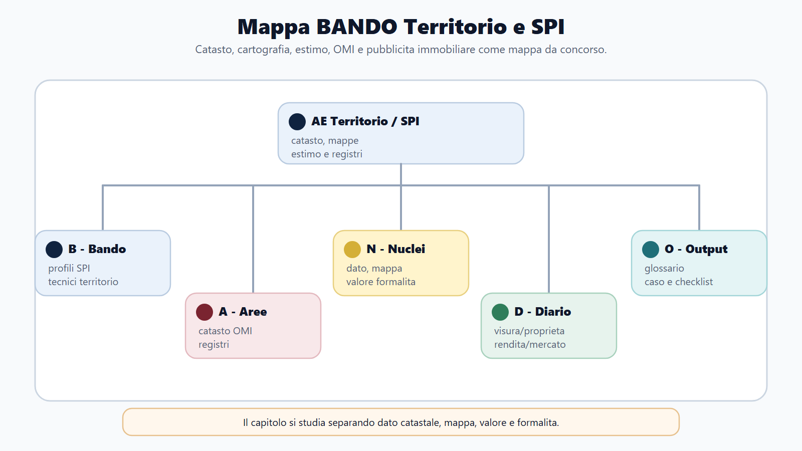
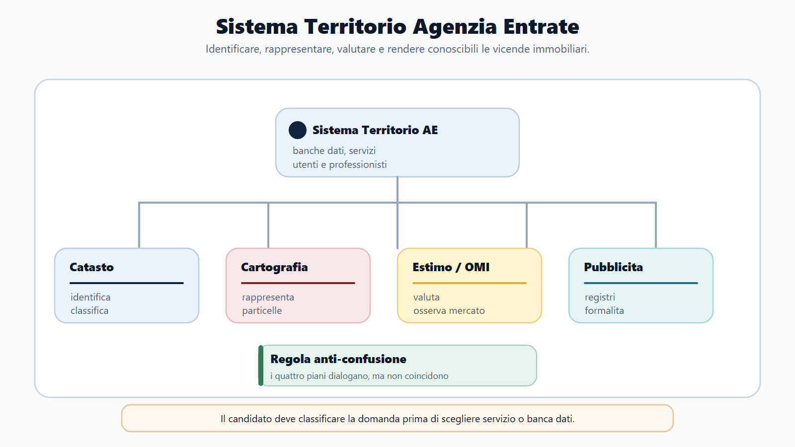
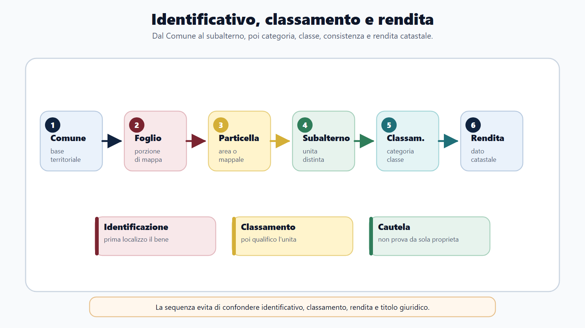
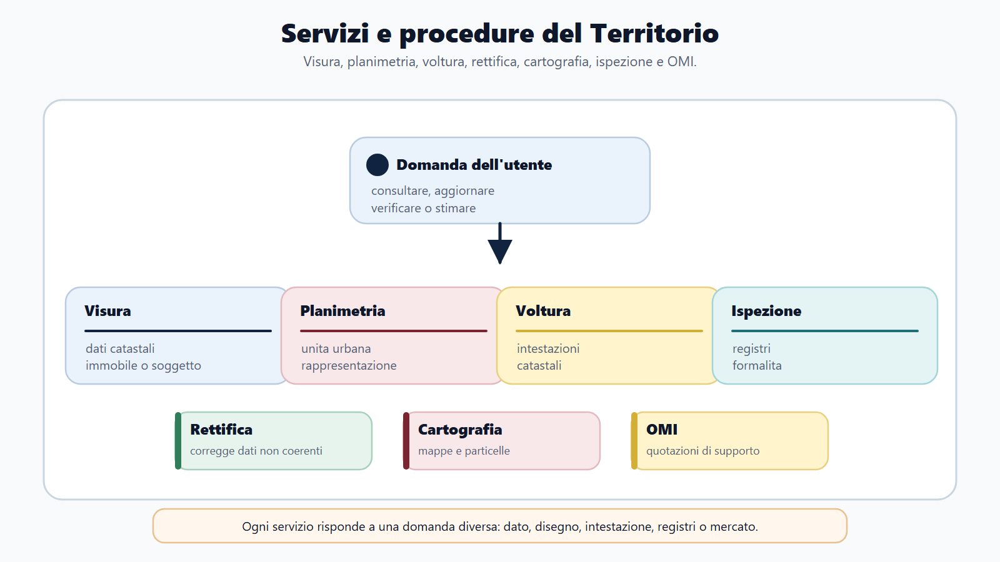
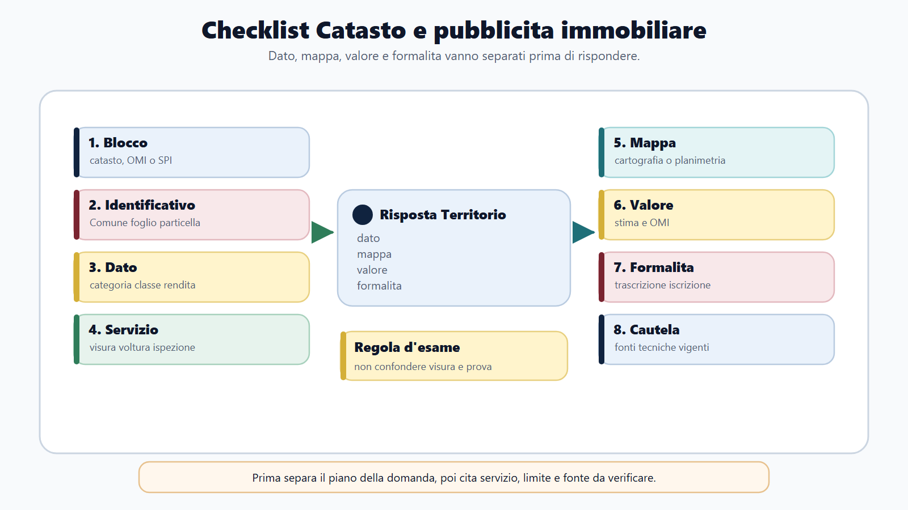

# Catasto, cartografia, estimo e pubblicita immobiliare

## Specifica struttura madre

### Obiettivo
Coprire il sottoprofilo AE Territorio/SPI distinguendo catasto, cartografia, estimo, OMI e pubblicita immobiliare.

### Nuclei
- Catasto edilizio urbano e procedure catastali.
- Pubblicita immobiliare e formalita.
- Cartografia, estimo e OMI.
- Differenza tra profilo fiscale generale e profilo tecnico/territorio.

### Output operativo
Mappa procedimento catastale, caso classamento, schema risposta orale e glossario SPI/territorio.

### Riferimenti consolidati
- [[sources/catasto-pubblicita-immobiliare-estimo-m-fc02]]
- [[topics/catasto-pubblicita-immobiliare-concorsi]]

## Scheda di lavoro

Questo capitolo sviluppa il blocco AE Territorio e SPI. Il candidato deve distinguere il profilo tributario generale dal profilo legato a catasto, cartografia, estimo, OMI e pubblicita immobiliare. Nei bandi Agenzia delle Entrate queste materie non sono un semplice dettaglio: possono definire codici concorso, mansioni, prove e lessico tecnico.

La base consolidata e' sufficiente per una bozza professionale da concorso: include fonti normative catastali, bandi rappresentativi, pagine ufficiali AE su servizi catastali e ipotecari, cartografia catastale, OMI, volture e ispezioni ipotecarie. Restano da verificare, prima della pubblicazione finale, testi tecnici vigenti, specifiche DOCFA/PREGEO, provvedimenti AE, istruzioni operative e aggiornamenti OMI.

## Testo editoriale

### Apertura editoriale

Catasto, cartografia, estimo e pubblicita immobiliare sono il punto in cui l'Agenzia delle Entrate smette di apparire soltanto come amministrazione dei tributi dichiarativi. Qui il candidato incontra immobili, mappe, particelle, rendite, planimetrie, volture, registri immobiliari, ispezioni ipotecarie e quotazioni OMI.

La difficolta non sta solo nella quantita di termini tecnici. Sta nel fatto che il blocco "Territorio" mette insieme funzioni diverse: identificare un immobile, aggiornare dati catastali, leggere una mappa, stimare valori, consultare formalita immobiliari, dare servizi a cittadini e professionisti. Se studi tutto come un elenco, confondi catasto e pubblicita immobiliare. Se studi solo le definizioni, non sai gestire il caso pratico.

La regola del capitolo e' semplice: separa i piani, poi collegali. Il catasto identifica e classifica; la cartografia rappresenta il territorio; l'estimo valuta; l'OMI osserva il mercato immobiliare; la pubblicita immobiliare rende conoscibili formalita e vicende giuridiche nei registri. In concorso vince chi sa spiegare questa architettura senza perdersi in dettagli tecnici non verificati.

### Obiettivo del capitolo

Al termine del capitolo devi saper fare sette operazioni:

1. spiegare perche' catasto, cartografia, estimo e pubblicita immobiliare sono materie tipiche dei profili AE Territorio e SPI;
2. distinguere catasto terreni, catasto fabbricati, cartografia catastale e servizi di pubblicita immobiliare;
3. usare correttamente parole come foglio, particella, subalterno, categoria, classe, consistenza, rendita e voltura;
4. capire la funzione delle procedure catastali senza trasformare il capitolo in manuale tecnico DOCFA o PREGEO;
5. collegare estimo e OMI a valutazioni, quotazioni e mercato immobiliare;
6. spiegare le formalita principali della pubblicita immobiliare: trascrizione, iscrizione e annotazione;
7. costruire una risposta orale che distingua dato catastale, mappa, stima e vicenda giuridica dell'immobile.

### Come usare questo capitolo

Studia il capitolo come una mappa di ufficio, non come un codice da memorizzare articolo per articolo. Prima fissa le funzioni: catasto, cartografia, estimo, OMI, pubblicita immobiliare. Poi collega ogni funzione ai suoi documenti e servizi: visura, planimetria, mappa, voltura, ispezione ipotecaria, quotazione OMI.

Il dettaglio tecnico e' importante nei profili specialistici, ma va controllato su fonti vive. In questa fase devi costruire una risposta robusta da quiz e orale: definizione, funzione, procedimento, errore da evitare, caso applicativo.

Quando incontri un quesito, chiediti sempre: sto parlando di identificazione catastale, rappresentazione cartografica, valutazione estimativa o pubblicita immobiliare? Questa domanda evita quasi tutte le confusioni.

### Mappa BANDO del capitolo

| Passaggio | Domanda guida | Applicazione al capitolo |
|---|---|---|
| B - Bando | Dove compare la materia? | Nei profili AE Territorio, SPI, funzionari tecnici catastali, cartografici, estimativi e OMI. |
| A - Aree | Quali blocchi separare? | Catasto terreni, catasto fabbricati, cartografia, estimo/OMI, pubblicita immobiliare. |
| N - Nuclei | Quali concetti reggono la materia? | Immobile, identificativo catastale, classamento, rendita, mappa, formalita, registri, quotazioni. |
| D - Diario | Quali errori annotare? | Confondere catasto e prova della proprieta, visura e ispezione ipotecaria, rendita e valore di mercato. |
| O - Output | Che cosa devo produrre? | Mappa procedimento catastale, schema SPI, caso classamento, glossario territorio, checklist orale. |

### Perche' questa materia e' Agenzia delle Entrate

Le fonti consolidate sul modulo M-FC02 collocano l'Agenzia delle Entrate anche nell'area dei servizi catastali, cartografici, estimativi, OMI e di pubblicita immobiliare. I bandi rappresentativi confermano due direttrici: da un lato i servizi di pubblicita immobiliare, dall'altro i profili tecnici per catasto, cartografia, estimo e osservatorio del mercato immobiliare.

Questa parte del modulo serve quindi a evitare un errore di prospettiva. Agenzia delle Entrate non e' solo dichiarazioni, IVA, redditi, accertamento e compliance. E' anche amministrazione che gestisce dati territoriali e immobiliari rilevanti per cittadini, professionisti, mercato e fiscalita.

Per il candidato la conseguenza e' pratica: se il bando parla di SPI, territorio o profili tecnici, non puoi prepararti solo con il diritto tributario generale. Devi saper leggere una materia ibrida, fatta di diritto, servizi, procedure, dati, mappe e valutazioni.

### Catasto: funzione, limiti e parole chiave

Il catasto e' un sistema pubblico di identificazione, descrizione e classificazione dei beni immobili. In taglio concorsuale devi ricordare tre funzioni: censire l'immobile, attribuire dati tecnici e reddituali, supportare attivita fiscali e amministrative.

La parola "catasto" non deve farti pensare solo a un archivio. Il catasto vive attraverso dati, atti di aggiornamento, mappe, visure, intestazioni, rendite e procedure. La sua utilita e' evidente quando un cittadino deve consultare un immobile, quando un professionista deve aggiornare una planimetria o quando un ufficio deve collegare un bene a un dato fiscale.

Il limite da fissare subito e' altrettanto importante: in linea generale, il catasto non sostituisce la pubblicita immobiliare e non e' da solo prova piena della proprieta. Serve a identificare e qualificare il bene sul piano catastale e fiscale. Le vicende giuridiche dell'immobile si verificano attraverso altri strumenti, in particolare i registri immobiliari e le formalita di pubblicita immobiliare.

### Catasto terreni e catasto fabbricati

Per rispondere bene devi distinguere almeno due grandi aree.

| Area | Oggetto | Parole chiave | Uso concorsuale |
|---|---|---|---|
| Catasto terreni | Particelle di terreno e qualita colturali. | foglio, particella, qualita, classe, superficie, reddito dominicale, reddito agrario | Serve per mappe, identificazione fondiaria, variazioni colturali e atti tecnici. |
| Catasto fabbricati | Unita immobiliari urbane. | categoria, classe, consistenza, rendita, subalterno, planimetria | Serve per classamento, rendita, visure, planimetrie e aggiornamenti edilizi/catastali. |

Questa distinzione non e' solo nozionistica. Cambia la domanda che devi porti. Per un terreno chiedi: quale particella, quale qualita, quale superficie, quale reddito? Per un fabbricato chiedi: quale unita immobiliare, quale categoria, quale classe, quale consistenza, quale rendita?

Quando il bando e' tecnico, questa differenza puo' aprire capitoli molto specialistici. In una risposta generale da orale, invece, basta mostrare ordine: il catasto terreni guarda alla rappresentazione e qualificazione dei terreni; il catasto fabbricati guarda alle unita immobiliari urbane e alla loro rendita catastale.

### Identificare un immobile: foglio, particella, subalterno

La prima abilita operativa e' leggere l'identificativo catastale. Le parole base sono tre:

| Termine | Funzione |
|---|---|
| Foglio | Porzione cartografica del territorio comunale. |
| Particella o mappale | Porzione di terreno o area individuata nella mappa catastale. |
| Subalterno | Identificativo che distingue singole unita immobiliari o porzioni all'interno di una particella. |

La sequenza e' utile anche per le prove pratiche. Se ti chiedono come individuare un immobile, non partire dalla rendita o dal valore. Parti dall'identificazione: Comune, sezione se presente, foglio, particella, subalterno. Solo dopo puoi ragionare su categoria, classe, consistenza, rendita, intestazione o formalita.

Questo ordine ti protegge da un errore frequente: usare parole catastali come se fossero sinonimi. La particella non e' la rendita. Il subalterno non e' la categoria. La planimetria non e' il titolo di proprieta. Ogni parola serve a un passaggio diverso.

### Rendita, classamento e consistenza

Nel catasto fabbricati il concorso spesso ruota intorno a tre parole: classamento, consistenza e rendita.

Il classamento e' l'operazione con cui l'unita immobiliare viene collocata in una categoria e in una classe coerenti con le sue caratteristiche. La categoria dice, in modo sintetico, la destinazione e il tipo di unita immobiliare. La classe misura il livello relativo, entro quella categoria, rispetto al contesto e alle caratteristiche considerate. La consistenza esprime la dimensione catastale secondo le regole applicabili alla categoria.

La rendita catastale e' il risultato reddituale attribuito all'unita immobiliare secondo il sistema catastale. Non va confusa con il prezzo di vendita, con il canone di locazione o con il valore di mercato. Ha funzione fiscale e amministrativa, e proprio per questo e' centrale nei servizi catastali.

Una risposta corretta deve dire: il classamento attribuisce categoria e classe, la consistenza misura l'unita secondo criteri catastali, la rendita e' il dato reddituale catastale che ne deriva. Se aggiungi che questi elementi devono essere aggiornati quando mutano le condizioni rilevanti dell'immobile, la risposta diventa gia professionale.

### Procedure catastali: aggiornamento, voltura, rettifica

Le procedure catastali servono a mantenere coerente la banca dati con la situazione degli immobili. Non devi memorizzare ogni istruzione tecnica, ma devi sapere a che cosa servono gli strumenti principali.

| Procedura o servizio | Funzione da concorso | Errore da evitare |
|---|---|---|
| Visura catastale | Consultare dati catastali di immobile o soggetto. | Trattarla come prova piena della proprieta. |
| Planimetria catastale | Rappresentare graficamente l'unita immobiliare urbana. | Scambiarla per titolo edilizio o certificato di conformita. |
| Voltura catastale | Aggiornare le intestazioni catastali dopo una variazione soggettiva. | Pensare che produca da sola il trasferimento del diritto. |
| Rettifica dati | Correggere dati catastali non coerenti o errati. | Usarla per risolvere questioni giuridiche che richiedono altri atti. |
| Atti tecnici | Aggiornare mappa, geometrie, unita o classamento secondo regole tecniche. | Inventare procedure senza verificare le specifiche vigenti. |

Le pagine ufficiali AE richiamano servizi online per consultazione e aggiornamento: visure, mappe, planimetrie, volture, rettifiche, variazioni colturali e strumenti di lavoro territoriale. Questo dato e' utile per capire il profilo professionale: il funzionario non studia soltanto norme, ma opera dentro sistemi informativi, banche dati e procedimenti.

Nei profili tecnici incontrerai parole come DOCFA, PREGEO e Docte. Nel capitolo vanno trattate come segnali di procedura tecnica: DOCFA per dichiarazioni e aggiornamenti del catasto fabbricati, PREGEO per atti di aggiornamento cartografico e geometrico, Docte per variazioni colturali. Prima di pubblicare schede di dettaglio serve pero' verifica sulle specifiche vigenti.

### Cartografia catastale e Geoportale

La cartografia catastale rappresenta graficamente il territorio attraverso mappe e particelle. Serve a localizzare e individuare i beni, a collegare dati geometrici e catastali, a supportare atti tecnici e consultazioni.

La pagina ufficiale AE sul Geoportale cartografico catastale conferma che il servizio consente la consultazione libera della cartografia catastale e la visualizzazione dinamica delle particelle presenti nella mappa. La stessa fonte segnala che l'aggiornamento avviene tramite atti tecnici predisposti e trasmessi telematicamente da professionisti abilitati.

Per il concorso il punto e' doppio. Primo: la cartografia e' una componente del sistema catastale, non un disegno accessorio. Secondo: la mappa non va confusa con il valore dell'immobile o con il titolo giuridico. La mappa aiuta a localizzare e rappresentare; altre funzioni servono a classificare, valutare o rendere conoscibili atti giuridici.

Formula da orale: la cartografia catastale consente la rappresentazione del territorio in particelle e costituisce il supporto grafico del catasto; oggi e' consultabile anche tramite servizi digitali come il Geoportale, ferma la necessita di verificare le condizioni, i limiti territoriali e gli usi consentiti dei dati.

### Estimo e OMI

L'estimo riguarda i criteri e i metodi di valutazione dei beni. Nel profilo AE Territorio non devi ridurlo a "quanto vale una casa". Devi collegarlo alla stima di beni immobili, all'analisi del mercato, alle caratteristiche del bene, alla comparazione e alla coerenza del dato.

L'OMI, Osservatorio del Mercato Immobiliare, e' un presidio informativo dell'Agenzia delle Entrate sul mercato immobiliare. In chiave concorsuale devi leggerlo come banca dati e strumento di osservazione: zone, tipologie, quotazioni, dinamiche di mercato e supporto alle analisi.

La cautela e' fondamentale. Le quotazioni OMI non vanno usate come automatismo assoluto. Non sostituiscono la valutazione concreta del bene, non cancellano le caratteristiche specifiche dell'immobile e non trasformano da sole una stima in prova definitiva. Servono come riferimento e supporto, da usare con metodo.

Una risposta solida collega tre elementi: il bene da stimare, il metodo estimativo, il dato di mercato. Se manca uno dei tre, la risposta diventa fragile. Dire solo "prendo il valore OMI" e' una scorciatoia sbagliata; dire "uso anche i dati OMI come supporto entro una valutazione coerente" e' molto piu corretto.

### Pubblicita immobiliare: formalita e registri

La pubblicita immobiliare ha una funzione diversa dal catasto. Serve a rendere conoscibili atti e vicende giuridiche relative agli immobili attraverso registri e formalita. Nel lessico da concorso devi conoscere almeno tre parole: trascrizione, iscrizione, annotazione.

| Formalita | Idea essenziale | Esempio di funzione |
|---|---|---|
| Trascrizione | Rende conoscibili determinati atti relativi a diritti immobiliari. | Collegare un trasferimento o altro atto rilevante ai registri immobiliari. |
| Iscrizione | Riguarda, in particolare, garanzie reali come l'ipoteca. | Rendere pubblica una garanzia ipotecaria. |
| Annotazione | Collega modifiche o vicende successive a formalita gia eseguite. | Segnalare cancellazioni, modifiche o eventi collegati. |

Le pagine AE su ispezione ipotecaria online confermano il collegamento operativo con la consultazione dei registri immobiliari, delle note e dei titoli. Questo e' il mondo SPI: non stai leggendo una rendita catastale, stai interrogando formalita che raccontano vicende giuridiche dell'immobile.

Il collegamento con il diritto civile e' evidente, ma il capitolo non deve trasformarsi in un trattato sulla trascrizione. Per il candidato M-FC02 conta saper dire che la pubblicita immobiliare presidia conoscibilita, opponibilita e sicurezza dei traffici immobiliari, mentre il catasto presidia identificazione e dati fiscali/territoriali.

### SPI: lavoro di sportello, controllo e qualita del dato

SPI significa servizi di pubblicita immobiliare. Nei bandi AE questa sigla puo' indicare un profilo autonomo o una destinazione specifica. Il lavoro non e' solo "rilasciare certificati". E' gestione di dati, atti, utenti, consultazioni, richieste, controlli formali e qualita del servizio.

Il candidato deve immaginare un front-office tecnico-giuridico. Arrivano cittadini, professionisti, notai, intermediari, richieste di consultazione, domande di certificati, verifiche su formalita, problemi di dati non allineati. L'operatore deve capire se la domanda riguarda catasto, registri immobiliari, voltura, ispezione, planimetria o altra procedura.

Qui torna il Metodo BANDO: davanti alla richiesta devi classificare. Se il cittadino chiede "a chi risulta intestato l'immobile al catasto", siamo nel dato catastale. Se chiede se su un immobile esiste un'ipoteca, entriamo nei registri immobiliari. Se chiede di aggiornare un'intestazione catastale dopo una successione o un atto, ragioniamo sulla voltura, fermo il collegamento con l'atto giuridico.

### Differenze da non confondere

| Coppia | Differenza essenziale | Formula corretta |
|---|---|---|
| Catasto / pubblicita immobiliare | Il catasto identifica e classifica; la pubblicita immobiliare rende conoscibili vicende giuridiche. | Dati catastali e registri immobiliari dialogano, ma non coincidono. |
| Visura catastale / ispezione ipotecaria | La visura riguarda dati catastali; l'ispezione riguarda registri immobiliari e formalita. | Prima capisco quale banca dati devo consultare. |
| Rendita / valore di mercato | La rendita e' dato catastale; il valore di mercato dipende da stima e mercato. | OMI e estimo aiutano, ma non annullano la valutazione concreta. |
| Mappa / planimetria | La mappa rappresenta particelle; la planimetria rappresenta l'unita immobiliare. | Cartografia e planimetria non sono sinonimi. |
| Voltura / trasferimento del diritto | La voltura aggiorna intestazioni catastali; il trasferimento dipende dall'atto giuridico. | Non attribuire alla procedura catastale effetti civilistici che non ha. |

### Da sapere in 5 righe

Catasto, cartografia, estimo, OMI e pubblicita immobiliare sono il nucleo del profilo AE Territorio/SPI.
Il catasto identifica e classifica immobili, attribuendo dati come categoria, classe, consistenza e rendita.
La cartografia catastale rappresenta particelle e territorio; l'estimo e l'OMI supportano valutazioni e analisi del mercato immobiliare.
La pubblicita immobiliare riguarda registri, formalita, trascrizioni, iscrizioni, annotazioni e ispezioni ipotecarie.
L'errore da evitare e' confondere dato catastale, mappa, valore e vicenda giuridica dell'immobile.

### Caso guidato: appartamento ristrutturato e dati non allineati

**Traccia.** Un contribuente segnala che, dopo lavori interni e successivo atto di trasferimento, i dati catastali dell'appartamento non sembrano aggiornati. Chiede all'ufficio se la visura dimostra la proprieta, se la planimetria e' sufficiente per provare la regolarita dell'immobile e come verificare l'eventuale presenza di formalita.

**Passaggio 1: separare le domande.** La richiesta contiene tre piani: dato catastale, situazione giuridica e documentazione tecnica. Vanno distinti prima di rispondere.

**Passaggio 2: verificare il dato catastale.** La visura permette di leggere identificativi, intestazione catastale, categoria, classe, consistenza e rendita. Se l'intestazione non e' aggiornata, puo' rilevare una voltura da esaminare.

**Passaggio 3: non trasformare la visura in prova assoluta.** La visura catastale non va presentata come prova piena della proprieta. Per le vicende giuridiche rilevano atti e pubblicita immobiliare.

**Passaggio 4: trattare la planimetria con cautela.** La planimetria rappresenta l'unita immobiliare sul piano catastale. Non e' automaticamente un titolo edilizio ne' una certificazione generale di conformita.

**Passaggio 5: usare l'ispezione ipotecaria.** Per verificare formalita come trascrizioni, iscrizioni o annotazioni occorre consultare i registri immobiliari tramite gli strumenti di pubblicita immobiliare.

**Risposta sintetica da concorso.** Il caso va risolto distinguendo catasto e pubblicita immobiliare. La visura serve a leggere i dati catastali e puo' evidenziare intestazioni o rendite; la voltura aggiorna le intestazioni catastali; la planimetria descrive l'unita; le formalita giuridiche vanno verificate con ispezione ipotecaria nei registri immobiliari. Non bisogna confondere dato catastale, titolo edilizio e prova della proprieta.

### Domanda da commissario

**Domanda.** Mi spieghi la differenza tra catasto e pubblicita immobiliare.

**Risposta modello.** Il catasto e' il sistema di identificazione, descrizione e classificazione degli immobili, con dati come foglio, particella, subalterno, categoria, classe, consistenza e rendita. Ha funzione fiscale, amministrativa e territoriale. La pubblicita immobiliare, invece, riguarda registri e formalita che rendono conoscibili atti e vicende giuridiche sugli immobili, come trascrizioni, iscrizioni e annotazioni. I due sistemi dialogano, ma non coincidono: il catasto identifica e classifica, la pubblicita immobiliare presidia la conoscibilita giuridica.

### Domanda-trappola

**Domanda.** Se nella visura catastale risulta un soggetto intestatario, posso dire che quella visura prova sempre e definitivamente la proprieta?

**Risposta.** No. La visura catastale e' uno strumento di consultazione dei dati catastali e puo' indicare l'intestazione catastale, ma non va confusa con la prova piena della proprieta. Le vicende giuridiche dell'immobile devono essere verificate attraverso atti e pubblicita immobiliare, con le cautele previste dall'ordinamento.

### Seconda domanda-trappola

**Domanda.** Le quotazioni OMI permettono di determinare automaticamente il valore esatto di un immobile?

**Risposta.** No. L'OMI fornisce dati e quotazioni utili come supporto all'analisi del mercato immobiliare. Non sostituisce una valutazione estimativa concreta, che deve considerare caratteristiche specifiche del bene, contesto, stato, destinazione, comparazione e metodo adottato.

### Errore tipico

L'errore piu frequente e' usare una sola parola per mondi diversi: "catasto" per ogni dato sull'immobile, "mappa" per ogni rappresentazione, "visura" per ogni consultazione, "valore OMI" per ogni stima, "voltura" per ogni trasferimento.

La correzione e' usare una griglia a quattro colonne: dato catastale, rappresentazione cartografica, valutazione estimativa, formalita immobiliare. Ogni domanda va collocata in una colonna prima di rispondere.

Un secondo errore e' entrare in dettagli tecnici non aggiornati. DOCFA, PREGEO, Docte, specifiche telematiche e istruzioni AE cambiano e richiedono controllo puntuale. In una risposta generale devi spiegare funzione e metodo, non inventare campi, versioni o passaggi procedurali.

### Mini-esercizio

Leggi le situazioni e associa ciascuna al blocco corretto.

| Situazione | Blocco corretto |
|---|---|
| Il candidato deve indicare foglio, particella e subalterno. | Identificazione catastale |
| Un professionista aggiorna la mappa dopo un frazionamento. | Cartografia/atto tecnico |
| Un cittadino chiede se esiste un'ipoteca sull'immobile. | Pubblicita immobiliare/ispezione ipotecaria |
| L'ufficio deve ragionare su categoria, classe e rendita. | Classamento catastale |
| Si confrontano quotazioni di una zona per analisi del mercato. | OMI/estimo |

Ora scrivi una risposta di 8 righe seguendo questo schema:

1. identifica il blocco;
2. indica la banca dati o il servizio coinvolto;
3. chiarisci il documento o la formalita;
4. segnala il limite dello strumento;
5. chiudi con la cautela su fonti tecniche aggiornate.

### Quiz ragionati

**1. Quale affermazione descrive meglio il catasto?**

A. Un registro che prova sempre e definitivamente la proprieta.
B. Un sistema pubblico di identificazione, descrizione e classificazione degli immobili.
C. Una banca dati dedicata solo ai contratti di locazione.
D. Un sistema usato esclusivamente dai Comuni per le multe.

**Risposta corretta: B.** Il catasto identifica e classifica immobili e attribuisce dati rilevanti anche sul piano fiscale. Non coincide con la prova piena della proprieta.

**2. Quale sequenza e' piu corretta per individuare un immobile in catasto?**

A. Prezzo, acquirente, notaio.
B. Comune, foglio, particella, subalterno.
C. Ipoteca, banca, contratto.
D. OMI, zona, valore massimo.

**Risposta corretta: B.** L'identificazione catastale passa dagli identificativi catastali, non dal prezzo o dalla garanzia.

**3. Che cosa indica la rendita catastale?**

A. Il prezzo di mercato dell'immobile.
B. Il canone di locazione effettivo.
C. Un dato reddituale catastale attribuito all'unita immobiliare.
D. La presenza di ipoteche.

**Risposta corretta: C.** La rendita e' un dato catastale. Non coincide automaticamente con prezzo, canone o valore OMI.

**4. Quale formalita e' tipica della pubblicita immobiliare?**

A. Trascrizione.
B. Classamento.
C. Consistenza.
D. Foglio di mappa.

**Risposta corretta: A.** Trascrizione, iscrizione e annotazione appartengono al lessico delle formalita immobiliari. Classamento e consistenza sono parole catastali.

**5. Perche' le quotazioni OMI vanno usate con cautela?**

A. Perche' non hanno alcuna utilita.
B. Perche' sostituiscono sempre la stima professionale.
C. Perche' sono dati di supporto e non automatismi assoluti di valutazione.
D. Perche' riguardano soltanto terreni agricoli.

**Risposta corretta: C.** OMI e' utile per il mercato immobiliare, ma non elimina la valutazione concreta del bene.

### Glossario essenziale Territorio/SPI

| Voce | Definizione operativa |
|---|---|
| Catasto | Sistema di identificazione, descrizione e classificazione degli immobili. |
| Catasto terreni | Area catastale relativa a terreni, particelle, qualita, classi e redditi fondiari. |
| Catasto fabbricati | Area catastale relativa alle unita immobiliari urbane. |
| Foglio | Porzione della mappa catastale comunale. |
| Particella | Porzione di terreno o area individuata nella mappa catastale. |
| Subalterno | Identificativo della singola unita immobiliare o porzione collegata a una particella. |
| Categoria catastale | Classificazione dell'unita immobiliare secondo tipologia/destinazione. |
| Classe | Livello relativo dell'unita dentro la categoria catastale. |
| Consistenza | Misura catastale dell'unita secondo criteri propri della categoria. |
| Rendita catastale | Dato reddituale catastale attribuito all'unita immobiliare. |
| Voltura catastale | Procedura di aggiornamento delle intestazioni catastali. |
| Planimetria | Rappresentazione grafica dell'unita immobiliare urbana. |
| Cartografia catastale | Rappresentazione grafica del territorio in mappe e particelle. |
| OMI | Osservatorio del Mercato Immobiliare, fonte di dati e quotazioni di supporto. |
| Estimo | Disciplina dei criteri e metodi di valutazione dei beni. |
| Pubblicita immobiliare | Sistema di formalita e registri per rendere conoscibili vicende giuridiche immobiliari. |
| Ispezione ipotecaria | Consultazione dei registri immobiliari e delle formalita. |
| Trascrizione | Formalita che rende conoscibili determinati atti relativi a diritti immobiliari. |
| Iscrizione | Formalita collegata in particolare a garanzie reali come l'ipoteca. |
| Annotazione | Formalita che collega modifiche o eventi successivi a formalita gia presenti. |

### Diario degli errori

| Errore commesso | Correzione da memorizzare |
|---|---|
| Ho scritto che la visura catastale prova sempre la proprieta. | La visura mostra dati catastali; le vicende giuridiche richiedono atti e pubblicita immobiliare. |
| Ho confuso foglio, particella e subalterno. | Sono livelli diversi dell'identificazione catastale. |
| Ho trattato la planimetria come titolo edilizio. | La planimetria e' rappresentazione catastale dell'unita immobiliare. |
| Ho usato OMI come valore automatico. | OMI e' supporto informativo, non sostituto della stima concreta. |
| Ho confuso voltura e trasferimento del diritto. | La voltura aggiorna intestazioni catastali; il trasferimento dipende dall'atto giuridico. |
| Ho parlato di pubblicita immobiliare come se fosse catasto. | Pubblicita immobiliare significa registri e formalita, non classamento. |

### Checklist operativa finale

Prima di chiudere lo studio del capitolo, verifica di saper rispondere a queste domande:

| Controllo | Domanda |
|---|---|
| Perimetro AE | So spiegare perche' questa materia appartiene ai profili Territorio/SPI? |
| Catasto | So definire catasto senza confonderlo con pubblicita immobiliare? |
| Identificativi | So usare foglio, particella e subalterno nel giusto ordine? |
| Classamento | So collegare categoria, classe, consistenza e rendita? |
| Procedure | So spiegare visura, planimetria, voltura e rettifica senza inventare dettagli tecnici? |
| Cartografia | So dire a cosa serve la mappa catastale e cosa non prova? |
| Estimo/OMI | So usare OMI come supporto e non come automatismo? |
| SPI | So distinguere trascrizione, iscrizione, annotazione e ispezione ipotecaria? |
| Orale | So costruire una risposta in 60-90 secondi distinguendo dato, mappa, valore e formalita? |

### Riferimenti consolidati

- [[sources/catasto-pubblicita-immobiliare-estimo-m-fc02]]
- [[sources/bandi-rappresentativi-m-fc02-agenzie-fiscali-2023-2026]]
- [[sources/agenzie-fiscali-organizzazione-ae-adm-ader]]
- [[topics/catasto-pubblicita-immobiliare-concorsi]]
- [[entities/agenzia-delle-entrate]]

### Note di review

- Verificare su Normattiva il testo vigente di R.D.L. 652/1939, D.P.R. 650/1972, D.M. 701/1994, D.Lgs. 347/1990 e norme civilistiche sulla pubblicita immobiliare prima della pubblicazione finale.
- Integrare una source note specialistica se il modulo dovra includere schede tecniche DOCFA, PREGEO, Docte, volture o servizi telematici con passaggi procedurali dettagliati.
- Verificare sul portale AE aggiornato le pagine "Fabbricati e terreni", "Consultazione dati catastali e ipotecari", "Aggiornamento dati catastali e ipotecari", "Geoportale cartografico catastale", "OMI", "Ispezione ipotecaria" e "Voltura Catastale Web".
- Controllare i limiti territoriali e ordinamentali dei dati catastali, inclusi i territori a gestione catastale autonoma.
- Non pubblicare formule su valore immobiliare, prova della proprieta, conformita edilizia o effetti delle formalita senza revisione tecnico-giuridica.
