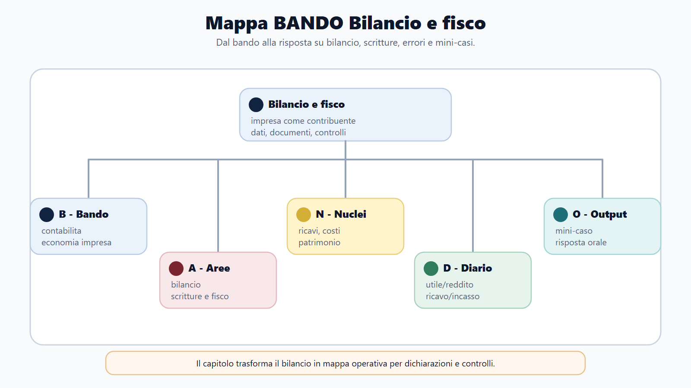
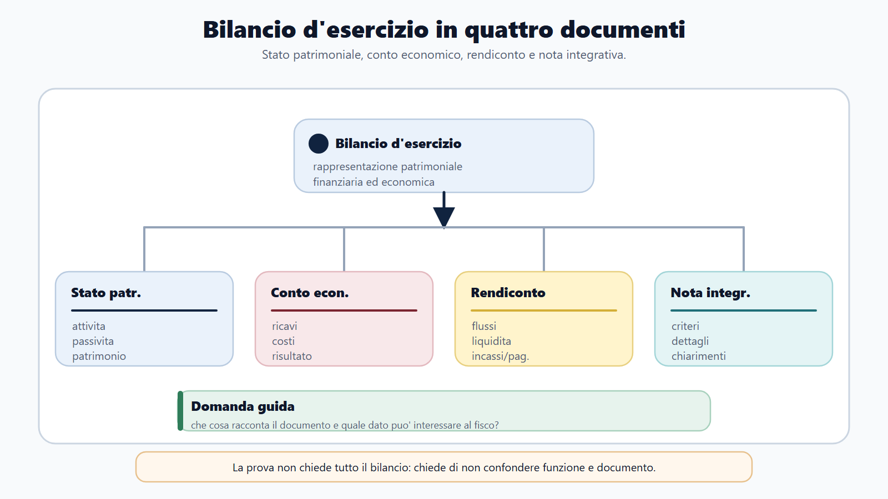
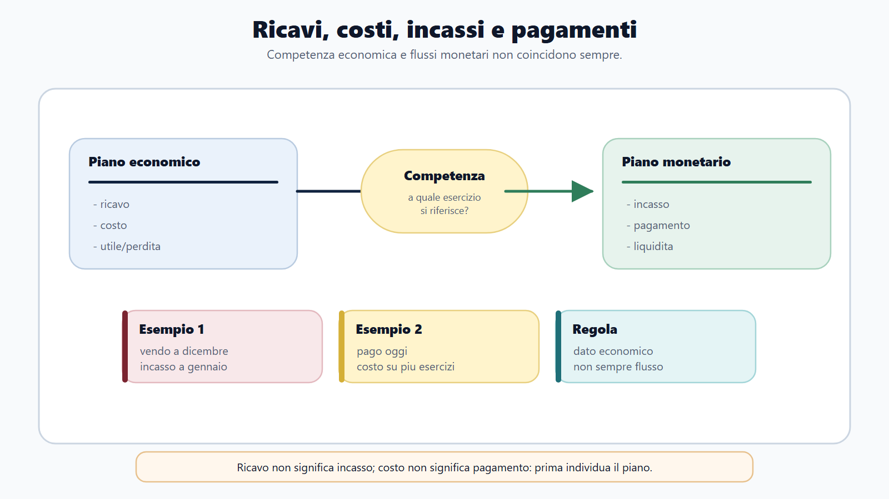
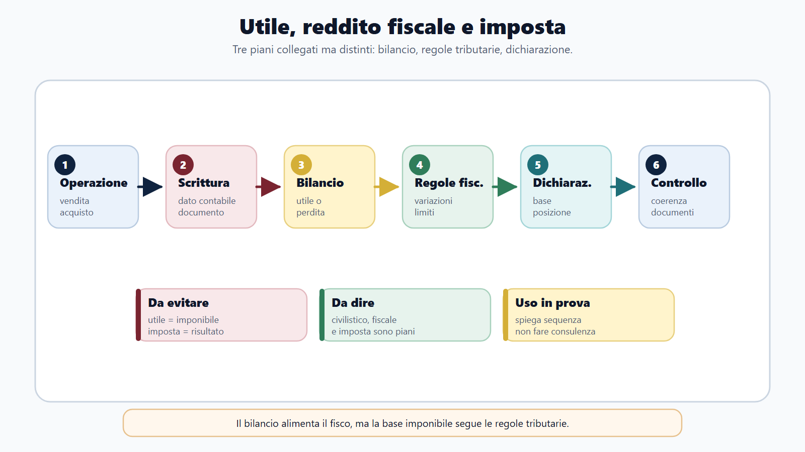
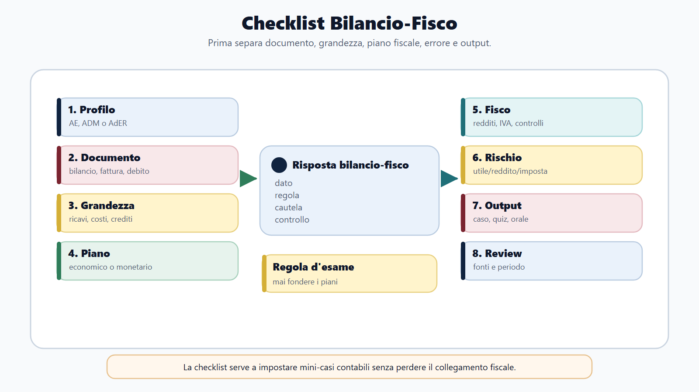

# Contabilita aziendale ed economia d'impresa per il fisco

## Specifica struttura madre

### Obiettivo
Fornire la contabilita aziendale minima per leggere bilancio, costi, ricavi, scritture essenziali e segnali economici rilevanti per profili fiscali.

### Nuclei
- Bilancio civilistico in taglio concorsuale.
- Costi, ricavi, patrimonio e risultato economico.
- Collegamento con controlli fiscali, dichiarazioni e impresa.
- Differenza tra contabilita pubblica del libro base e contabilita aziendale M-FC02.

### Output operativo
Mappa bilancio, mini-caso conto economico, quiz essenziali e diario errori.

### Riferimenti consolidati
- [[sources/adempimenti-contabilita-civile-commerciale-m-fc02]]
- [[sources/bilancio-civilistico-principi-contabili-oic-m-fc02]]
- [[sources/contabilita-economico-patrimoniale-universita-enti-pubblici]]
- [[sources/normativa-tributaria-tuir-iva-accertamento-m-fc02]]

## Scheda di lavoro

Questo capitolo sviluppa la contabilita aziendale e l'economia d'impresa in taglio M-FC02. Non e' un corso completo di ragioneria e non sostituisce un manuale specialistico di bilancio. Serve al candidato per leggere ricavi, costi, patrimonio, debiti, crediti, risultato economico, flussi e segnali di coerenza che interessano l'amministrazione fiscale.

La fonte consolidata sul modulo collega contabilita aziendale, dichiarazioni, versamenti, compensazioni, diritto civile/commerciale e crisi d'impresa. La fonte OIC di supporto consente di richiamare, in modo controllato, il bilancio d'esercizio, i suoi documenti principali e i postulati essenziali. La fonte sulla contabilita economico-patrimoniale del libro base aiuta a distinguere questa materia dalla contabilita pubblica.

Il capitolo resta volutamente selettivo: prima costruisce la mappa contabile, poi mostra come il dato contabile diventa dato fiscale, infine prepara il candidato a quiz, orale e mini-casi.

## Testo editoriale

### Apertura editoriale

Nei concorsi delle Agenzie fiscali la contabilita aziendale non va studiata come una materia isolata. Non interessa per dimostrare di saper tenere tutti i libri contabili di un'impresa, ne' per trasformare il candidato in revisore. Interessa per una ragione piu concreta: il fisco incontra l'impresa attraverso dati economici, documenti, dichiarazioni, bilanci, scritture, costi, ricavi, crediti, debiti, rimanenze e operazioni.

Un candidato che conosce il diritto tributario ma non sa leggere il linguaggio minimo dell'impresa rischia di restare in superficie. Sa parlare di imposta, base imponibile e accertamento, ma non capisce da dove arrivano i numeri. Al contrario, un candidato che studia solo tecnica contabile senza collegarla al fisco rischia di preparare un capitolo troppo pesante e poco utile alla prova.

Il punto di equilibrio e' questo: devi saper leggere la contabilita come mappa dell'attivita economica. Ricavi e costi raccontano la gestione; attivita e passivita raccontano la struttura patrimoniale; crediti e debiti raccontano rapporti ancora aperti; il risultato economico sintetizza un periodo; il bilancio comunica all'esterno una rappresentazione ordinata dell'impresa. Il fisco usa questi dati, li confronta, li collega alle dichiarazioni e puo' verificarne la coerenza.

### Obiettivo del capitolo

Al termine del capitolo devi saper fare sette operazioni:

1. distinguere contabilita aziendale, contabilita pubblica e contabilita economico-patrimoniale;
2. spiegare a che cosa serve il bilancio d'esercizio in una risposta concorsuale;
3. riconoscere stato patrimoniale, conto economico, rendiconto finanziario e nota integrativa;
4. distinguere costi, ricavi, attivita, passivita, patrimonio netto e risultato d'esercizio;
5. leggere un mini-caso di impresa senza confondere utile civilistico, reddito fiscale e imposta dovuta;
6. collegare dati contabili, dichiarazioni, controlli e compliance fiscale;
7. costruire una risposta orale breve su contabilita aziendale ed economia d'impresa applicate al fisco.

### Come usare questo capitolo

Studia il capitolo dopo diritto tributario, accertamento e adempimenti fiscali. Qui quei blocchi incontrano l'impresa.

Nella prima lettura concentrati sulle parole: bilancio, patrimonio, costi, ricavi, competenza, prudenza, continuita, crediti, debiti, ammortamenti, rimanenze, imposte. Nella seconda lettura usa le tabelle per separare i piani. Nella terza lettura lavora sui mini-casi: una impresa vende, acquista, sostiene costi, incassa, paga, matura crediti e debiti, chiude l'esercizio e presenta dati fiscali.

Non usare questo capitolo come guida professionale per redigere bilanci o dichiarazioni. La finalita e' concorsuale. I dettagli sugli schemi civilistici, sulle voci OIC, sulle variazioni fiscali e sulle imposte differite richiedono sempre verifica aggiornata sulle fonti ufficiali e sul bando.

### Mappa BANDO del capitolo

| Passaggio | Domanda guida | Applicazione al capitolo |
|---|---|---|
| B - Bando | Dove compare la materia? | Nei profili AE, AdER e fiscali in cui il programma richiama contabilita aziendale, economia d'impresa, bilancio, impresa, societa o adempimenti. |
| A - Aree | Quali blocchi devo separare? | Bilancio, scritture essenziali, costi/ricavi, patrimonio, reddito fiscale, dichiarazioni e controlli. |
| N - Nuclei | Quali concetti reggono la materia? | Competenza economica, prudenza, continuita, risultato, patrimonio netto, crediti, debiti, ammortamenti, rimanenze. |
| D - Diario | Quali confusioni devo annotare? | Utile non e' automaticamente reddito imponibile; ricavo non e' incasso; costo non e' sempre deduzione immediata; bilancio non e' dichiarazione fiscale. |
| O - Output | Che cosa devo produrre? | Mappa bilancio, mini-caso conto economico, schema utile/reddito/imposta, glossario e risposta orale da due minuti. |

### Perche' la contabilita aziendale serve al fisco

Il fisco non osserva l'impresa solo attraverso norme astratte. La osserva attraverso dati. Una dichiarazione fiscale non nasce nel vuoto: nasce da operazioni economiche, documenti, registrazioni, fatture, corrispettivi, costi, ammortamenti, crediti, debiti, rimanenze e risultati.

Per questo la contabilita aziendale e' materia di supporto nei concorsi fiscali. Non sempre decide da sola la prova, ma puo' diventare decisiva quando il bando chiede economia aziendale, contabilita, bilancio, dichiarazioni, accertamento, controlli o casi pratici su imprese.

La domanda da portare sempre con te e':

> quale dato economico sta dietro il dato fiscale?

Se un'impresa dichiara ricavi, il candidato deve chiedersi da quali operazioni derivano. Se sostiene costi, deve capire se sono documentati, inerenti, di competenza e fiscalmente rilevanti secondo la disciplina applicabile. Se espone crediti e debiti, deve distinguere rapporti commerciali, rapporti finanziari e posizioni tributarie. Se chiude con un utile, deve evitare di trasformarlo automaticamente in imposta.

### Contabilita aziendale e contabilita pubblica: la distinzione iniziale

Nel libro base hai incontrato la contabilita pubblica. Qui il punto di vista cambia.

| Sistema | Domanda centrale | Parole chiave | Uso nel modulo |
|---|---|---|---|
| Contabilita pubblica | Come la PA programma, autorizza, gestisce e rendiconta entrate e spese? | bilancio di previsione, impegno, accertamento, pagamento, rendiconto, equilibri | Serve per concorsi ministeriali, enti, controlli pubblici e gestione della spesa. |
| Contabilita aziendale | Come l'impresa rappresenta gestione, patrimonio e risultato? | ricavi, costi, attivita, passivita, patrimonio netto, utile, perdita | Serve per leggere impresa, bilancio, dichiarazioni e controlli fiscali. |
| Contabilita economico-patrimoniale pubblica | Come alcuni enti pubblici rappresentano costi, ricavi, patrimonio e risultato accanto o dentro sistemi pubblici specifici? | conto economico, stato patrimoniale, ammortamenti, ratei, risconti | Serve per distinguere linguaggi contabili senza confondere PA e impresa. |

Questa distinzione evita un errore frequente: applicare alla contabilita aziendale parole della contabilita pubblica o, viceversa, usare il bilancio d'impresa per spiegare il bilancio di una amministrazione. Nei concorsi M-FC02 devi guardare soprattutto all'impresa come contribuente, operatore economico o debitore.

### Il bilancio d'esercizio in taglio concorsuale

Il bilancio d'esercizio e' il documento con cui l'impresa rappresenta la propria situazione patrimoniale, finanziaria e il risultato economico dell'esercizio. Nel modello civilistico ordinario, la fonte OIC di supporto richiama quattro documenti fondamentali: stato patrimoniale, conto economico, rendiconto finanziario e nota integrativa, con cautele per forme abbreviate e micro-imprese.

Per il candidato la funzione non e' memorizzare ogni voce dello schema. La funzione e' capire che cosa racconta ciascun documento.

| Documento | Che cosa mostra | Domanda da concorso |
|---|---|---|
| Stato patrimoniale | Attivita, passivita e patrimonio netto a una certa data. | Quali risorse ha l'impresa e come sono finanziate? |
| Conto economico | Costi, ricavi e risultato dell'esercizio. | La gestione del periodo produce utile o perdita? |
| Rendiconto finanziario | Flussi di disponibilita liquide. | Da dove arrivano e dove vanno i flussi monetari? |
| Nota integrativa | Informazioni di dettaglio e spiegazioni. | Quali criteri, dati e chiarimenti servono per comprendere i prospetti? |

Questa mappa basta per molti quiz e per una buona risposta orale. Se il bando chiede contabilita aziendale in modo approfondito, dovrai aggiungere schemi, voci, criteri di valutazione e principi contabili. Ma senza questa mappa iniziale ogni dettaglio diventa fragile.

### Stato patrimoniale: attivita, passivita e patrimonio netto

Lo stato patrimoniale fotografa la struttura dell'impresa a una certa data. Non descrive solo "quanto vale" l'impresa in modo generico. Separa cio' che l'impresa possiede o controlla da cio' che deve a terzi e da cio' che resta come patrimonio netto.

In taglio concorsuale puoi usare questa formula:

> attivita = passivita + patrimonio netto.

Le attivita comprendono, in modo semplificato, immobilizzazioni, rimanenze, crediti, disponibilita liquide e altri elementi positivi. Le passivita comprendono debiti, fondi, obbligazioni verso terzi e altri elementi negativi. Il patrimonio netto rappresenta la parte riferibile ai mezzi propri, con capitale, riserve e risultato.

Per il fisco questi dati non sono neutrali. Crediti, debiti, rimanenze, immobilizzazioni, fondi e disponibilita possono diventare indicatori di coerenza, oggetto di analisi, base di confronto o punto di partenza per verifiche. Il candidato non deve trasformarsi in ispettore contabile, ma deve capire che dietro una dichiarazione ci sono grandezze patrimoniali leggibili.

### Conto economico: costi, ricavi e risultato

Il conto economico racconta la gestione dell'esercizio. Qui entrano ricavi, costi e risultato.

I ricavi rappresentano componenti positivi collegati all'attivita dell'impresa. I costi rappresentano componenti negativi sostenuti per produrre, vendere, amministrare, finanziare o comunque svolgere l'attivita. La differenza, secondo le regole contabili applicabili, conduce al risultato dell'esercizio: utile o perdita.

Il concorso puo' chiedere una distinzione semplice ma decisiva:

| Termine | Significato operativo | Errore da evitare |
|---|---|---|
| Ricavo | Componente positivo di reddito. | Confonderlo con l'incasso immediato. |
| Incasso | Entrata monetaria. | Pensare che ogni ricavo sia gia denaro in cassa. |
| Costo | Componente negativo di reddito. | Confonderlo con il pagamento immediato. |
| Pagamento | Uscita monetaria. | Pensare che ogni costo sia gia stato pagato. |
| Utile | Risultato positivo civilistico dell'esercizio. | Trattarlo come sinonimo di reddito imponibile o imposta. |

Questa tabella e' piu importante di molte formule. Nei casi pratici le trappole nascono proprio qui: ricavo senza incasso, costo senza pagamento, debito verso fornitore, credito verso cliente, utile civilistico e imponibile fiscale.

### Competenza economica: il passaggio che cambia tutto

La competenza economica e' uno dei concetti che piu spesso separa chi capisce la contabilita da chi memorizza parole. In modo essenziale, significa attribuire costi e ricavi all'esercizio cui si riferiscono, non semplicemente al momento in cui avviene l'incasso o il pagamento.

Esempio semplice: un'impresa presta un servizio a dicembre e incassa a gennaio. Il dato economico e il flusso monetario non coincidono nello stesso momento. Altro esempio: un'impresa paga un costo anticipato che riguarda anche l'esercizio successivo. La registrazione economica deve rispettare il periodo di competenza.

Per il candidato, il concetto serve a evitare una risposta ingenua. Non basta chiedere "quando e' stato pagato?". Occorre chiedere anche "a quale periodo economico si riferisce?". Questo e' il motivo per cui compaiono parole come ratei, risconti, ammortamenti e rimanenze.

### Prudenza, continuita e sostanza

La fonte OIC di supporto richiama alcuni postulati fondamentali del bilancio. Nel capitolo non devi studiarli come formule astratte, ma come criteri di lettura.

| Postulato | Idea essenziale | Uso da concorso |
|---|---|---|
| Prudenza | Le stime devono essere caute, soprattutto in condizioni di incertezza. | Aiuta a capire svalutazioni, rischi, perdite e utili non realizzati. |
| Continuita aziendale | Il bilancio presuppone l'impresa come complesso funzionante, salvo situazioni diverse da evidenziare. | Aiuta a leggere crisi, rischio e prospettive dell'impresa. |
| Sostanza dell'operazione | Conta la realta economica dell'operazione, non solo la sua forma esterna. | Aiuta a collegare contabilita, controlli e abuso di schemi formali. |
| Competenza | Costi e ricavi vanno attribuiti al periodo corretto. | Aiuta a distinguere risultato economico e flussi monetari. |
| Comparabilita | I dati devono consentire confronto nel tempo e nello spazio. | Aiuta a leggere trend, anomalie e scostamenti. |

Una risposta orale ben costruita puo' dire: "Il bilancio e' redatto secondo criteri che mirano a rappresentare in modo chiaro, veritiero e corretto la situazione dell'impresa; tra i criteri rilevano prudenza, competenza, continuita, sostanza e comparabilita".

### Scritture essenziali: che cosa deve sapere il candidato

La contabilita aziendale vive anche di scritture. Ma il capitolo M-FC02 non deve diventare un eserciziario completo di partita doppia. Devi conoscere la logica minima.

La partita doppia registra ogni operazione guardando almeno due aspetti: da dove viene la risorsa e dove va, quale valore aumenta e quale diminuisce, quale componente economica o patrimoniale viene toccata. Per il concorso, l'obiettivo e' riconoscere l'effetto dell'operazione, non compilare decine di mastrini.

| Operazione | Effetto contabile semplificato | Collegamento fiscale |
|---|---|---|
| Vendita con fattura | Ricavo e credito verso cliente o incasso. | Puo' generare ricavo rilevante e operazione IVA secondo le regole applicabili. |
| Acquisto di beni o servizi | Costo e debito verso fornitore o pagamento. | Puo' rilevare come costo e, se previsto, come IVA detraibile. |
| Acquisto di bene durevole | Immobilizzazione e debito o pagamento. | Il costo puo' essere ripartito nel tempo tramite ammortamento. |
| Incasso da cliente | Aumenta la liquidita e si riduce il credito. | Non coincide necessariamente con il momento di rilevazione del ricavo. |
| Pagamento a fornitore | Diminuisce la liquidita e si riduce il debito. | Non coincide necessariamente con il momento di rilevazione del costo. |

Questa e' la soglia utile per molti profili fiscali. Se il bando richiede contabilita generale in modo analitico, dovrai fare esercizi tecnici. Ma il primo livello e' capire l'effetto economico, patrimoniale e fiscale dell'operazione.

### Immobilizzazioni e ammortamenti

Le immobilizzazioni sono beni o risorse destinati a essere utilizzati durevolmente nell'attivita dell'impresa. Possono essere materiali, immateriali o finanziarie, secondo le classificazioni applicabili.

L'ammortamento e' il meccanismo con cui il costo di un bene durevole viene ripartito lungo il periodo di utilita economica. In taglio concorsuale, l'idea e' semplice: se un bene serve per piu esercizi, non e' logico attribuire tutto il costo a un solo esercizio, salvo regole specifiche. Il costo viene distribuito nel tempo secondo criteri contabili e, sul piano fiscale, secondo regole proprie.

Qui nasce una trappola importante: ammortamento civilistico e deduzione fiscale non coincidono sempre automaticamente. Per la prova basta fissare il principio: la contabilita rappresenta l'utilizzo economico del bene; il fisco stabilisce quando e in che misura il costo rileva ai fini tributari.

### Rimanenze, crediti e debiti

Tre voci sono particolarmente utili nei casi fiscali: rimanenze, crediti e debiti.

Le rimanenze rappresentano beni non ancora venduti o utilizzati alla fine dell'esercizio. Incidono sul risultato perche' collegano acquisti, produzione, vendite e magazzino. Nei casi di impresa, ignorare le rimanenze puo' alterare la lettura dei costi e del risultato.

I crediti indicano somme che l'impresa deve incassare da clienti o altri soggetti. Non sono denaro gia disponibile. Possono presentare rischi di inesigibilita e richiedere valutazioni.

I debiti indicano obbligazioni verso fornitori, banche, erario, enti previdenziali o altri soggetti. Non sono tutti uguali. Un debito commerciale e un debito tributario hanno natura e conseguenze diverse.

| Voce | Domanda da porsi | Rilevanza fiscale |
|---|---|---|
| Rimanenze | Che cosa resta alla fine del periodo? | Incidono sulla corretta determinazione del risultato e possono essere oggetto di verifica. |
| Crediti | Chi deve pagare l'impresa e con quale grado di recuperabilita? | Rilevano per coerenza dei dati, svalutazioni e incassi. |
| Debiti | Verso chi l'impresa deve adempiere? | Possono includere debiti commerciali, finanziari, fiscali e contributivi. |

### Dal risultato civilistico al reddito fiscale

Questo e' il cuore del capitolo per M-FC02.

Il risultato civilistico nasce dal bilancio. Il reddito fiscale nasce dall'applicazione delle regole tributarie. I due piani dialogano, ma non coincidono automaticamente. Il candidato deve saper dire che il bilancio fornisce una base informativa, mentre la normativa fiscale puo' richiedere variazioni, limiti, esclusioni, indeducibilita, deduzioni, regimi specifici e controlli.

La sequenza da ricordare e':

1. l'impresa rileva operazioni nella contabilita;
2. le operazioni confluiscono nel bilancio o nelle scritture;
3. il bilancio produce un risultato civilistico;
4. la normativa fiscale stabilisce come determinare la base imponibile;
5. la dichiarazione rappresenta la posizione fiscale;
6. l'amministrazione puo' controllare coerenza, documentazione e correttezza.

La frase da evitare e': "l'utile e' il reddito imponibile". La frase corretta e': "l'utile civilistico e' un dato di partenza importante, ma la determinazione del reddito fiscale segue le regole tributarie applicabili".

### Costi deducibili, inerenza e documentazione

Nei concorsi fiscali i costi sono terreno di trappola. Un costo presente in contabilita non e' automaticamente deducibile in ogni misura e in ogni periodo. Il candidato deve ragionare almeno su tre domande:

1. il costo e' collegato all'attivita dell'impresa?
2. il costo e' documentato e correttamente rilevato?
3. il costo e' fiscalmente rilevante secondo le regole applicabili?

Questa impostazione non sostituisce la disciplina analitica del TUIR o dell'IVA. Serve pero' a dare ordine alla risposta. Nei casi pratici non devi dire subito "si deduce" o "non si deduce". Devi prima qualificare il costo, collegarlo all'attivita, verificare documentazione e periodo, poi richiamare la disciplina fiscale.

Lo stesso vale per i ricavi. Un ricavo contabilizzato, una fattura emessa, un corrispettivo incassato, una operazione IVA e un reddito fiscalmente rilevante sono piani collegati, ma non sempre identici nella stessa forma.

### IVA e contabilita: due logiche da non fondere

Il capitolo sugli adempimenti fiscali ha gia chiarito che l'IVA non e' una imposta sul profitto. Qui aggiungiamo il raccordo contabile.

Le operazioni attive e passive dell'impresa generano dati contabili e dati IVA. Una vendita puo' produrre un ricavo e, se l'operazione e' rilevante secondo la disciplina IVA, anche imposta a debito. Un acquisto puo' produrre un costo o una immobilizzazione e, se ricorrono i presupposti, IVA detraibile.

Per il candidato la regola e':

| Piano | Domanda | Esempio di errore |
|---|---|---|
| Contabile | Quale costo, ricavo, credito, debito o immobilizzazione nasce? | Trattare l'IVA come ricavo dell'impresa. |
| IVA | L'operazione e' rilevante? quale regime si applica? nasce IVA a debito o a credito? | Dire che l'IVA misura il guadagno. |
| Fiscale sui redditi | Il componente incide sulla base imponibile secondo quali regole? | Confondere risultato civilistico e imponibile. |

Questa separazione e' decisiva nei quiz, perche' molte risposte sbagliate fondono parole diverse: fattura, ricavo, incasso, IVA, reddito, utile, imposta.

### Economia d'impresa: cosa serve davvero

L'economia d'impresa studia l'impresa come organizzazione che combina fattori produttivi, sostiene costi, realizza ricavi, assume rischi, investe, finanzia la propria attivita e produce risultati. Nel modulo M-FC02 va selezionata con taglio fiscale.

Non devi scrivere un trattato su strategie aziendali, marketing o organizzazione industriale. Devi capire alcune relazioni:

- ricavi e volumi di attivita;
- costi fissi, costi variabili e margini;
- investimenti e ammortamenti;
- liquidita, incassi e pagamenti;
- capitale proprio e capitale di terzi;
- equilibrio economico, patrimoniale e finanziario;
- rischio d'impresa e continuita aziendale.

Queste relazioni aiutano a leggere casi e controlli. Un'impresa puo' essere in utile ma avere tensione di liquidita. Puo' crescere nei ricavi ma peggiorare nei margini. Puo' avere debiti elevati e patrimonio netto debole. Puo' presentare dati dichiarativi formalmente completi ma economicamente incoerenti.

### Indicatori e segnali: usarli senza esagerare

Nei concorsi puo' capitare che il candidato debba interpretare segnali economici: aumento dei ricavi, calo dei margini, crescita dei debiti, rimanenze anomale, crediti non incassati, perdita ripetuta, costi non coerenti con l'attivita.

Non serve calcolare indici complessi se il bando non lo chiede. Serve pero' una grammatica minima.

| Segnale | Possibile lettura | Cautela |
|---|---|---|
| Ricavi in crescita e utile in calo | Aumento dei costi, margini piu bassi, investimenti o inefficienze. | Non concludere automaticamente evasione o crisi. |
| Crediti elevati | Vendite non incassate o tempi di pagamento lunghi. | Verificare natura dei crediti e rischio di incasso. |
| Debiti fiscali o contributivi | Posizioni verso erario o enti. | Distinguere debito fisiologico, ritardo, rateazione o contenzioso. |
| Rimanenze elevate | Magazzino importante o vendite rallentate. | Verificare settore, ciclo produttivo e criteri di valutazione. |
| Perdite ripetute | Possibile squilibrio economico. | Collegare a continuita aziendale, capitale, finanziamenti e contesto. |

La cautela e' parte della competenza. Un dato contabile e' un indizio, non una sentenza. L'amministrazione deve procedere secondo regole, poteri, garanzie e istruttoria.

### Bilancio, dichiarazioni e controlli

Il collegamento con l'Agenzia delle Entrate diventa chiaro quando un dato di bilancio entra in una dichiarazione o in un controllo.

Esempio: ricavi e costi concorrono, secondo le regole applicabili, alla determinazione della posizione fiscale. Crediti e debiti possono emergere da rapporti commerciali, finanziari o tributari. Ammortamenti e rimanenze incidono sul risultato. Operazioni IVA producono dati dichiarativi e liquidazioni. I dati trasmessi o dichiarati possono essere incrociati, controllati, verificati o usati per comunicazioni di compliance.

La funzione del candidato non e' anticipare ogni procedura di accertamento. E' saper spiegare il percorso:

> operazione economica -> documento -> registrazione -> bilancio/scrittura -> dichiarazione -> eventuale controllo.

Questo percorso e' il ponte tra capitolo 6 sugli adempimenti e capitolo 5 su accertamento, controlli e compliance.

### AdER e contabilita: debiti, pagamenti e situazione economica

La contabilita aziendale interessa anche i profili AdER, ma con un taglio diverso. Qui il centro non e' la determinazione della pretesa tributaria, ma la comprensione di debiti, pagamenti, rateizzazioni, posizioni del contribuente-debitore e documentazione.

Un addetto alla riscossione o un profilo orientato al front-office puo' incontrare imprese che presentano debiti fiscali, richieste di rateazione, difficolta di pagamento, documenti contabili o situazioni patrimoniali complesse. Il candidato deve mantenere ordine:

- distinguere debito commerciale, debito finanziario, debito fiscale e debito contributivo;
- distinguere accertamento, dichiarazione, cartella, pagamento e rateazione;
- non promettere soluzioni fuori competenza;
- usare canali e procedure ufficiali;
- trattare dati economici e documenti con riservatezza.

La contabilita qui serve come linguaggio minimo per capire la posizione del soggetto, non per sostituire consulente, commercialista o ufficio competente.

### ADM e contabilita: operatori economici, merci e flussi

Per ADM la contabilita aziendale entra soprattutto attraverso operatori economici, importazioni, esportazioni, merci, accise, giochi e settori regolati. Non e' il cuore del capitolo doganale, ma aiuta a leggere fatture, valore delle merci, documenti commerciali, flussi, costi e ricavi connessi agli scambi.

Il candidato deve evitare di studiare ADM come se fosse una replica di AE. Nei profili doganali il dato economico puo' servire a ricostruire valore, operazioni, documenti e rapporti con operatori. Nei profili fiscali interni, invece, il baricentro e' piu vicino a redditi, IVA, dichiarazioni e controlli.

La stessa parola "impresa" cambia contesto: per AE e' spesso contribuente; per ADM e' anche operatore economico inserito in flussi di merci e regole doganali; per AdER puo' essere debitore con posizioni da gestire nella riscossione.

### Glossario minimo del capitolo

| Termine | Significato operativo per il candidato |
|---|---|
| Bilancio d'esercizio | Documento che rappresenta situazione patrimoniale, finanziaria e risultato economico dell'impresa. |
| Stato patrimoniale | Prospetto che mostra attivita, passivita e patrimonio netto a una data. |
| Conto economico | Prospetto che mostra costi, ricavi e risultato dell'esercizio. |
| Rendiconto finanziario | Prospetto dei flussi di disponibilita liquide. |
| Nota integrativa | Documento che spiega criteri, informazioni e dettagli dei prospetti. |
| Ricavo | Componente positivo di reddito. Non coincide sempre con incasso. |
| Costo | Componente negativo di reddito. Non coincide sempre con pagamento. |
| Credito | Diritto a ricevere somme o prestazioni da terzi. |
| Debito | Obbligazione verso terzi, fornitori, banche, erario o altri soggetti. |
| Patrimonio netto | Differenza tra attivita e passivita, secondo le regole di bilancio. |
| Competenza economica | Criterio che collega costi e ricavi all'esercizio di riferimento. |
| Ammortamento | Ripartizione del costo di un bene durevole lungo la sua vita utile. |
| Rimanenze | Beni non ancora venduti o utilizzati alla chiusura dell'esercizio. |
| Risultato civilistico | Utile o perdita derivante dal bilancio. |
| Reddito fiscale | Grandezza determinata secondo le regole tributarie applicabili. |

Se una parola del glossario non produce un esempio, non e' ancora stabilizzata.

### Scheda bilancio/fisco

Usa questa scheda quando il bando richiama contabilita aziendale o economia d'impresa.

| Campo | Domanda da compilare |
|---|---|
| Profilo | AE, ADM, AdER o altro profilo fiscale? |
| Materia indicata | Contabilita aziendale, bilancio, economia d'impresa, diritto commerciale, adempimenti o controlli? |
| Documento chiave | Bilancio, dichiarazione, fattura, registro, situazione debitoria o altra documentazione? |
| Grandezza economica | Ricavi, costi, utile, perdita, margine, rimanenze, ammortamenti? |
| Grandezza patrimoniale | Crediti, debiti, immobilizzazioni, liquidita, patrimonio netto? |
| Collegamento fiscale | Redditi, IVA, dichiarazione, accertamento, riscossione o compliance? |
| Errore da evitare | Quale confusione e' piu probabile? |
| Output | Risposta orale, mini-caso, tabella, quiz o diario errori? |

Compilarla richiede pochi minuti e impedisce di studiare contabilita in modo generico.

### Risposta modello da due minuti

**Domanda.** Spieghi il ruolo della contabilita aziendale nei concorsi fiscali e il rapporto tra bilancio e fisco.

**Risposta guida.** Nei concorsi fiscali la contabilita aziendale serve a leggere l'impresa come soggetto economico e contribuente. Non va studiata solo come tecnica di registrazione, ma come linguaggio che rappresenta operazioni, costi, ricavi, crediti, debiti, patrimonio e risultato economico.

Il bilancio d'esercizio, in taglio civilistico, rappresenta la situazione patrimoniale, finanziaria e il risultato economico dell'impresa attraverso documenti come stato patrimoniale, conto economico, rendiconto finanziario e nota integrativa, secondo le regole applicabili. Per il candidato e' essenziale distinguere il conto economico, che mostra costi e ricavi, dallo stato patrimoniale, che mostra attivita, passivita e patrimonio netto.

Il collegamento con il fisco e' decisivo: i dati contabili alimentano dichiarazioni e controlli, ma il risultato civilistico non coincide automaticamente con il reddito fiscale. La normativa tributaria puo' prevedere variazioni, limiti e criteri propri. Per questo la risposta corretta distingue operazione economica, registrazione contabile, bilancio, dichiarazione e possibile controllo dell'amministrazione.

### Caso guidato

**Traccia.** Una piccola societa vende beni per 120.000 euro nell'esercizio. Ha costi documentati per acquisti e servizi pari a 75.000 euro. Acquista inoltre un macchinario da utilizzare per piu anni, per 30.000 euro. A fine esercizio alcuni clienti non hanno ancora pagato e l'impresa ha debiti verso fornitori. Il candidato deve spiegare come leggere la situazione in taglio contabile e fiscale, senza calcolare imposte puntuali.

**Passaggio 1: separare ricavi e incassi.** I 120.000 euro sono ricavi se riferiti a vendite dell'esercizio secondo le regole contabili. Non significa necessariamente che tutto sia gia stato incassato. Se alcuni clienti non hanno pagato, l'impresa avra crediti verso clienti.

**Passaggio 2: separare costi e pagamenti.** I 75.000 euro sono costi documentati. Non significa necessariamente che siano stati tutti pagati. Se restano fatture da saldare, ci saranno debiti verso fornitori.

**Passaggio 3: trattare il macchinario.** Il macchinario e' un bene durevole. In contabilita non va letto come semplice costo corrente dell'esercizio: puo' essere iscritto tra le immobilizzazioni e il costo viene ripartito nel tempo mediante ammortamento secondo le regole applicabili.

**Passaggio 4: non confondere utile e imposta.** Il risultato economico civilistico nasce dal confronto tra ricavi e costi di competenza, considerando anche ammortamenti e altre voci. Il reddito fiscale e l'imposta richiedono l'applicazione delle norme tributarie. Non si puo' dire che l'utile sia automaticamente la base imponibile.

**Passaggio 5: collegare al fisco.** I dati contabili alimentano dichiarazioni, IVA, redditi e possibili controlli. L'amministrazione puo' verificare coerenza, documentazione, corretta imputazione dei componenti e rispetto delle regole fiscali.

La risposta non fornisce consulenza fiscale. Mostra metodo: qualificare l'operazione, collocarla in contabilita, distinguere il piano fiscale, indicare le cautele.

### Da sapere in 5 righe

1. La contabilita aziendale serve al candidato fiscale per leggere dati economici e patrimoniali dell'impresa.
2. Stato patrimoniale, conto economico, rendiconto finanziario e nota integrativa hanno funzioni diverse.
3. Ricavo non significa sempre incasso; costo non significa sempre pagamento.
4. Utile civilistico e reddito fiscale non coincidono automaticamente.
5. Nei concorsi il dato contabile va collegato a dichiarazioni, controlli, compliance e, per AdER, posizioni debitorie.

### Domanda da commissario

**Domanda.** Perche' un candidato dell'Agenzia delle Entrate deve conoscere almeno le basi del bilancio d'impresa?

**Risposta guida.** Perche' molte informazioni rilevanti per il fisco nascono dall'attivita economica dell'impresa e dalla sua rappresentazione contabile. Il bilancio e le scritture consentono di leggere ricavi, costi, crediti, debiti, rimanenze, ammortamenti, patrimonio e risultato. Questi dati possono confluire nelle dichiarazioni fiscali, nelle comunicazioni, nei controlli e nelle attivita di compliance. Il candidato deve pero' distinguere il piano civilistico da quello fiscale: il risultato di bilancio e' un dato importante, ma la base imponibile si determina secondo le regole tributarie applicabili.

### Domanda-trappola

**Domanda.** Se una societa chiude il bilancio con un utile, quell'utile coincide con il reddito imponibile e l'imposta da versare?

**Risposta corretta.** No. L'utile civilistico non coincide automaticamente ne' con il reddito imponibile ne' con l'imposta. Il bilancio rappresenta il risultato secondo regole civilistiche e contabili. La determinazione della base imponibile fiscale richiede l'applicazione delle norme tributarie, che possono prevedere variazioni, limiti, deduzioni, esclusioni o criteri specifici. L'imposta si determina poi applicando le regole fiscali alla base imponibile.

**Perche' e' una trappola.** La domanda confonde tre piani: risultato contabile, reddito fiscale e imposta. Nei concorsi fiscali questa confusione e' grave perche' cancella il rapporto tra contabilita e diritto tributario.

### Errore tipico

L'errore tipico e' studiare contabilita aziendale come elenco di definizioni.

Il candidato memorizza stato patrimoniale, conto economico, ricavi, costi, crediti e debiti. Poi, davanti a un caso, non sa dire che cosa cambia se un ricavo non e' incassato, se un costo non e' pagato, se un bene e' durevole, se un credito e' dubbio o se un utile civilistico deve essere trasformato in reddito fiscale.

La correzione e' semplice: ogni parola contabile deve diventare una domanda operativa.

- Ricavo: da quale operazione nasce?
- Costo: a quale attivita si collega?
- Incasso: il cliente ha pagato?
- Pagamento: il debito e' stato estinto?
- Immobilizzazione: il bene serve per piu esercizi?
- Ammortamento: come si ripartisce il costo nel tempo?
- Utile: e' risultato civilistico o reddito fiscale?
- Debito: verso fornitore, banca, erario o altro soggetto?

Se non sai trasformare il termine in domanda, non lo sai ancora usare in concorso.

### Mini-esercizio

Compila la tabella partendo da una impresa immaginaria.

| Dato | Informazione da inserire |
|---|---|
| Attivita svolta |  |
| Ricavi dell'esercizio |  |
| Costi principali |  |
| Crediti verso clienti |  |
| Debiti verso fornitori |  |
| Beni durevoli o immobilizzazioni |  |
| Rimanenze finali |  |
| Possibili dati IVA |  |
| Collegamento con dichiarazione fiscale |  |
| Errore da evitare |  |

Poi scrivi una risposta di massimo dieci righe a questa traccia:

> Spiega perche' il risultato di bilancio non deve essere confuso con il reddito fiscale.

Rileggi la risposta. Se usi le parole "utile", "reddito" e "imposta" come sinonimi, devi riscriverla.

### Quiz essenziali

**1. Quale documento mostra costi, ricavi e risultato dell'esercizio?**

A. Stato patrimoniale.
B. Conto economico.
C. Rendiconto finanziario.
D. Nota integrativa.

**Risposta corretta: B.** Il conto economico mostra costi, ricavi e risultato dell'esercizio.

**2. Quale affermazione e' corretta?**

A. Ogni ricavo coincide sempre con un incasso.
B. Ogni costo coincide sempre con un pagamento.
C. Ricavi e incassi sono concetti collegati ma distinti.
D. Il pagamento determina sempre l'utile.

**Risposta corretta: C.** La competenza economica impone di distinguere componenti economiche e movimenti monetari.

**3. L'utile civilistico coincide automaticamente con il reddito imponibile?**

A. Si, sempre.
B. No, perche' il reddito fiscale si determina secondo regole tributarie.
C. Si, ma solo per le imprese individuali.
D. Si, se il bilancio e' approvato.

**Risposta corretta: B.** Il risultato civilistico e' un dato di partenza, ma la base imponibile segue la disciplina fiscale.

**4. L'ammortamento serve, in termini essenziali, a:**

A. trasformare un debito in credito;
B. ripartire nel tempo il costo di un bene durevole;
C. eliminare l'IVA sugli acquisti;
D. calcolare sempre il reddito imponibile in modo automatico.

**Risposta corretta: B.** L'ammortamento ripartisce il costo di un bene durevole lungo la sua vita utile, secondo regole contabili e fiscali applicabili.

### Diario errori contabili

Apri una sezione del diario con queste righe.

| Errore | Segnale | Correzione |
|---|---|---|
| Confondo ricavo e incasso | Dico "ha ricavato, quindi ha incassato". | Distinguo componente economica e movimento monetario. |
| Confondo costo e pagamento | Dico "ha pagato, quindi e' costo dell'esercizio". | Verifico competenza e natura dell'operazione. |
| Confondo utile e reddito fiscale | Uso utile, imponibile e imposta come sinonimi. | Separare risultato civilistico, base imponibile e imposta. |
| Confondo bilancio e dichiarazione | Tratto il bilancio come se fosse la dichiarazione fiscale. | Ricostruisco il flusso bilancio/scritture -> regole fiscali -> dichiarazione. |
| Studio OIC in modo enciclopedico | Memorizzo sigle senza casi. | Studio solo i principi utili al bando e ai mini-casi. |

Il diario deve restare breve. Serve a intercettare l'errore prima della prova.

### Checklist operativa finale

Prima di passare al capitolo successivo, controlla questi punti.

- So distinguere contabilita aziendale e contabilita pubblica.
- So spiegare la funzione del bilancio d'esercizio.
- So distinguere stato patrimoniale, conto economico, rendiconto finanziario e nota integrativa.
- So spiegare ricavi, costi, crediti, debiti e patrimonio netto con un esempio.
- So distinguere ricavo e incasso.
- So distinguere costo e pagamento.
- So spiegare competenza economica, prudenza e continuita aziendale in modo essenziale.
- So dire perche' utile civilistico e reddito fiscale non coincidono automaticamente.
- So collegare bilancio, dichiarazioni, controlli e compliance.
- Ho scritto una risposta orale da due minuti.
- Ho compilato il diario errori con almeno due confusioni personali.

Se manca uno di questi punti, non passare subito ai casi pratici. Prima chiudi la mappa bilancio/fisco.

### Riferimenti consolidati

Questo capitolo e' costruito sulle note e sulle pagine consolidate del wiki del progetto:

- [[sources/adempimenti-contabilita-civile-commerciale-m-fc02]]
- [[sources/bilancio-civilistico-principi-contabili-oic-m-fc02]]
- [[sources/contabilita-economico-patrimoniale-universita-enti-pubblici]]
- [[sources/normativa-tributaria-tuir-iva-accertamento-m-fc02]]
- [[books/moduli/m-fc02-agenzie-fiscali/chapters/04-diritto-tributario-teoria-imposta]]
- [[books/moduli/m-fc02-agenzie-fiscali/chapters/05-accertamento-controlli-compliance-fiscale]]
- [[books/moduli/m-fc02-agenzie-fiscali/chapters/06-adempimenti-fiscali-redditi-iva-dichiarazioni]]

Le fonti consolidate sono sufficienti per una bozza professionale del capitolo. Per esempi numerici puntuali, casi fiscali completi, schemi civilistici dettagliati, principi OIC specifici e variazioni fiscali, resta necessaria una verifica aggiornata sulle fonti ufficiali prima della pubblicazione.

### Note di review

- Verificare prima della pubblicazione finale il testo vigente del Codice civile in materia di bilancio e gli aggiornamenti OIC applicabili.
- Integrare eventuali esempi numerici solo dopo revisione tecnica: evitare calcoli fiscali se non sono collegati a fonte e periodo d'imposta.
- Le immagini inserite sono mappe didattiche e schemi anti-confusione; mantenere il taglio operativo, senza sostituirle a schemi di bilancio completi.
- Coordinare il capitolo con il capitolo 12 su civile/commerciale, evitando duplicazioni su impresa, societa e crisi.
- Coordinare il capitolo con il capitolo 13 per trasformare mini-casi contabili in quiz, orale e casi pratici.
- Mantenere il taglio concorsuale: contabilita aziendale come linguaggio per leggere impresa e fisco, non come manuale completo di ragioneria.
