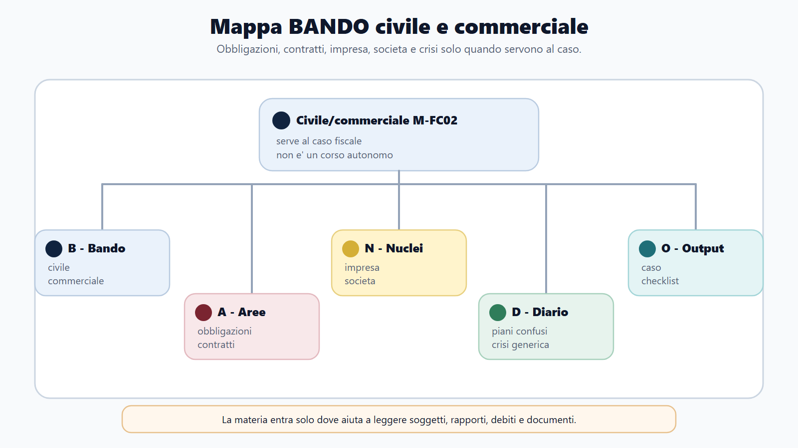
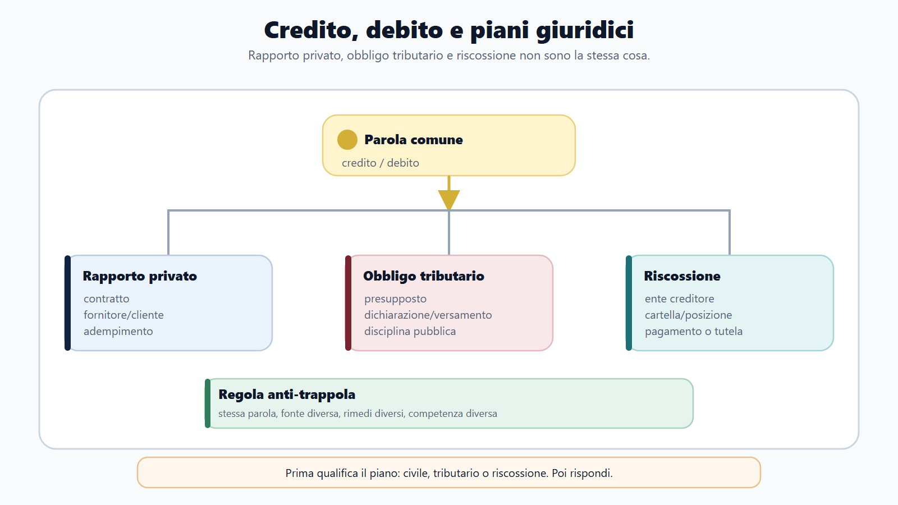
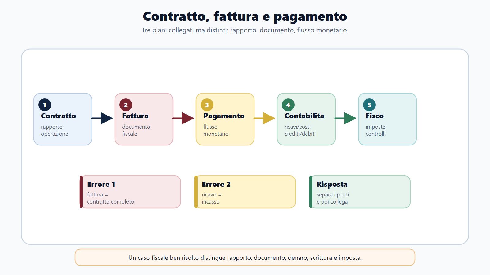
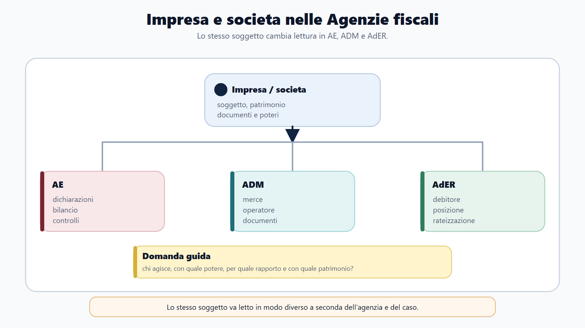
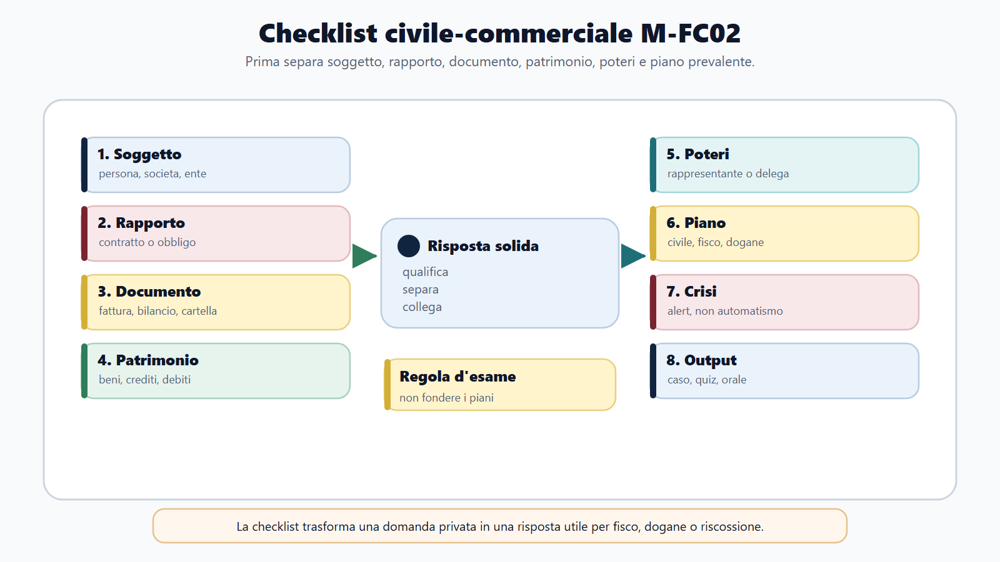

# Civile e commerciale applicati a fisco, dogane e riscossione

## Apertura editoriale

Un'impresa importa componenti, li trasforma e vende il prodotto finito. Dietro questa operazione si trovano molti rapporti: il contratto con il fornitore, l'obbligo di pagare, il trasferimento dei beni, il trasporto, le garanzie offerte, i crediti verso i clienti e la responsabilità patrimoniale. A questi rapporti si sovrappongono gli effetti fiscali e doganali e, se i debiti non vengono adempiuti, le regole della riscossione.

Il diritto civile e commerciale fornisce il lessico con cui ricostruire l'operazione prima di applicare la disciplina pubblicistica. Chi è il soggetto obbligato? Qual è la fonte del debito? Il contratto è efficace? Il credito è stato ceduto? Esiste una garanzia? Il debitore agisce personalmente oppure attraverso una società?

Qui non serve ripercorrere un intero corso di diritto privato. Serve invece riconoscere gli istituti che spiegano la struttura economica e giuridica dei fatti esaminati da AE, ADM e AdER.

## Obiettivo del capitolo

Al termine del capitolo devi saper:

1. distinguere soggetto, rapporto giuridico, obbligo e responsabilità;
2. riconoscere fonti, oggetto e soggetti dell'obbligazione;
3. spiegare adempimento, inadempimento, mora e modi essenziali di estinzione;
4. distinguere modificazioni del credito e del debito;
5. separare responsabilità contrattuale ed extracontrattuale;
6. ricostruire formazione, effetti, invalidita e scioglimento del contratto;
7. confrontare garanzie reali, personali e tutela patrimoniale;
8. distinguere imprenditore, impresa, azienda e società;
9. confrontare società di persone e di capitali;
10. riconoscere una situazione di crisi senza confonderla con una perdita isolata.

## Mappa BANDO

| Passaggio | Applicazione al capitolo |
|---|---|
| **Bando** | Cerca diritto civile, obbligazioni, contratti, responsabilità, diritto commerciale, impresa, società e crisi d'impresa. |
| **Aree** | Collega diritto privato, contabilità, tributi, dogane, riscossione, catasto e pubblicità immobiliare. |
| **Nuclei** | Debitore, creditore, adempimento, mora, contratto, garanzia patrimoniale, impresa, azienda, società. |
| **Diario** | Registra le coppie da non confondere: debito/responsabilita, impresa/azienda, nullita/annullabilita, credito/garanzia, crisi/insolvenza. |
| **Output** | Qualifica un'operazione, individua soggetti e garanzie e costruisci una risposta orale ordinata. |

## 1. Rapporto giuridico e soggetti

Il rapporto giuridico è una relazione tra soggetti regolata dall'ordinamento. A una situazione attiva, come un diritto, corrisponde una situazione passiva, come un obbligo. Il primo controllo consiste nell'identificare chi sia titolare del rapporto: una persona agisce in proprio, per una società o per conto di un altro soggetto?

La capacità giuridica è l'idoneita a essere titolare di situazioni giuridiche; la capacità di agire riguarda il compimento valido di atti. Gli enti operano attraverso organi e rappresentanti. Attribuire il rapporto alla persona che materialmente firma, senza verificare i poteri, può assegnare ricavi, debiti o garanzie al soggetto sbagliato.

## 2. L'obbligazione

L'obbligazione vincola un debitore a una prestazione nell'interesse di un creditore. La prestazione deve avere contenuto patrimoniale ed essere possibile, lecita e determinata o determinabile. Può consistere nel dare, fare o non fare.

Le obbligazioni derivano dal contratto, dal fatto illecito o da altri atti e fatti riconosciuti dall'ordinamento. La fonte identifica la ragione del vincolo. Non ogni uscita è un pagamento ne ogni entrata è una vendita: possono esistere restituzioni, finanziamenti, risarcimenti, conferimenti e anticipazioni.

In presenza di più debitori va chiarito se l'obbligazione sia solidale o parziaria. Nella solidarieta passiva il creditore può chiedere l'intera prestazione a uno dei condebitori, ferma la regolazione interna; nella parziarieta ciascuno risponde della propria quota. L'applicazione della solidarieta richiede sempre un fondamento.

## 3. Adempimento, inadempimento e mora

Adempiere significa eseguire esattamente la prestazione dovuta. La verifica riguarda soggetto, destinatario, oggetto, luogo e tempo. Se esistono più debiti, l'imputazione chiarisce quale rapporto venga estinto. Questo evita di associare automaticamente un bonifico alla fattura più vicina nel tempo.

L'inadempimento ricorre quando la prestazione manca, è tardiva o inesatta. La conseguenza tipica è la responsabilità del debitore, salvo la prova della causa non imputabile secondo la disciplina applicabile. La mora qualifica il ritardo e produce effetti specifici; non coincide in ogni caso con il semplice superamento della scadenza.

Il danno risarcibile richiede un collegamento con l'inadempimento. La clausola penale predetermina la prestazione dovuta per inadempimento o ritardo; la caparra svolge una funzione diversa e non ne è sinonimo.

## 4. Modificazioni ed estinzione

Nella cessione del credito cambia il creditore, mentre il rapporto prosegue. La verifica riguarda il soggetto al quale il debitore può pagare con effetto liberatorio e le eccezioni che può opporre. Il rapporto non nasce di nuovo, come accadrebbe con una novazione.

Delegazione, espromissione e accollo intervengono sul lato passivo con strutture differenti. Bisogna quindi stabilire se il debitore originario sia liberato o resti obbligato insieme al nuovo soggetto.

L'obbligazione si estingue normalmente con l'adempimento. Può estinguersi anche mediante compensazione, confusione, novazione, remissione o impossibilita sopravvenuta non imputabile, se ne ricorrono i presupposti. La compensazione civilistica non va confusa con quella tributaria, sottoposta a regole proprie.

## 5. Responsabilità civile

La responsabilità contrattuale nasce dalla violazione di un'obbligazione preesistente. Il termine è ampio: il vincolo non deve necessariamente derivare da un contratto. La responsabilità extracontrattuale deriva invece dalla lesione ingiusta arrecata al di fuori di uno specifico rapporto obbligatorio.

I due regimi differiscono per struttura, prova, criteri d'imputazione e prescrizione, e una stessa vicenda può coinvolgerli entrambi. Per qualificare il fatto si parte dal rapporto tra le parti, non dall'etichetta attribuita al danno.

## 6. Contratto: formazione ed effetti

Il contratto è l'accordo con cui le parti costituiscono, regolano o estinguono un rapporto patrimoniale. I suoi elementi essenziali riguardano accordo, causa, oggetto e forma quando richiesta. La conclusione può avvenire attraverso proposta e accettazione o altre sequenze ammesse.

Il contratto produce effetti tra le parti e deve essere eseguito secondo buona fede. L'interpretazione ricostruisce la comune intenzione e coordina le clausole. La forma può essere richiesta per validità, prova o pubblicità: i tre piani non coincidono. La registrazione fiscale non sana da sola un vizio civilistico.

### Rappresentanza e imputazione degli effetti

La rappresentanza consente a un soggetto di concludere un contratto con effetti diretti nella sfera del rappresentato. Questo accade quando il rappresentante agisce entro i poteri ricevuti e rende riconoscibile che opera in nome altrui. La verifica riguarda il potere rappresentativo, i suoi limiti e la spendita del nome.

La firma materiale, da sola, non permette di imputare l'operazione. Se un responsabile acquista beni per una società, bisogna accertare che abbia agito in suo nome e con poteri adeguati. Altrimenti si possono confondere l'autore della dichiarazione con la parte contrattuale o con il soggetto cui competono gli effetti fiscali.

Per i beni immobili vanno tenuti distinti titolo, forma, trascrizione e voltura catastale. Il capitolo 10 approfondisce pubblicità immobiliare e catasto.

## 7. Invalidita e scioglimento

La nullita colpisce il contratto per vizi gravi individuati dall'ordinamento. L'annullabilita tutela interessi diversi e l'atto produce effetti finche non intervenga l'annullamento. La rescissione reagisce a specifiche alterazioni originarie; la risoluzione riguarda problemi sopravvenuti nell'attuazione di un contratto valido.

Il recesso è il potere unilaterale di sciogliere il rapporto quando legge o contratto lo consentono. Nei quiz la sequenza utile è: vizio originario, problema sopravvenuto o potere di uscita?

## 8. Contratti dell'impresa

La vendita trasferisce un diritto verso il prezzo. La somministrazione soddisfa bisogni periodici o continuativi. L'appalto organizza mezzi e gestione a rischio dell'appaltatore per un'opera o un servizio. Il mandato riguarda atti giuridici per conto altrui; la rappresentanza determina se gli effetti si producano direttamente per il rappresentato.

Nel deposito prevalgono custodia e restituzione; nel trasporto il trasferimento di persone o cose; nella locazione il godimento di un bene verso corrispettivo. Per fisco e dogane la qualificazione contrattuale aiuta a leggere l'operazione, ma non sostituisce la relativa disciplina pubblicistica. Il nome scelto dalle parti non prevale automaticamente sulla struttura concreta.

## 9. Garanzia patrimoniale e garanzie specifiche

In linea generale il debitore risponde con il proprio patrimonio. La garanzia generica non attribuisce al creditore un diritto immediato su un bene determinato.

Privilegio, pegno e ipoteca attribuiscono prelazione secondo presupposti differenti. Il pegno riguarda tipicamente mobili o crediti; l'ipoteca immobili o altri beni registrati ammessi. La fideiussione è invece personale: un terzo garantisce il debito altrui.

L'azione surrogatoria reagisce all'inerzia patrimoniale del debitore; la revocatoria mira all'inefficacia verso il creditore di determinati atti pregiudizievoli; il sequestro conservativo vincola cautelarmente beni. Questi strumenti non coincidono con la riscossione pubblica e non trasferiscono automaticamente i beni al creditore.

## 10. Imprenditore, impresa e azienda

L'imprenditore esercita professionalmente un'attività economica organizzata diretta alla produzione o allo scambio di beni o servizi. L'impresa è l'attività; l'azienda è il complesso dei beni organizzati per esercitarla.

La nozione generale va affiancata alle qualificazioni specifiche. Il piccolo imprenditore si caratterizza per la prevalenza del lavoro proprio e familiare secondo la disciplina applicabile. L'imprenditore agricolo svolge le attività agricole e connesse previste dalla legge; quello commerciale è collegato alle categorie di attività e al relativo statuto. Dimensione economica, settore e forma societaria rispondono a criteri diversi.

La cessione dell'azienda non coincide con la cessione delle partecipazioni societarie. Il valore aziendale non è la semplice somma dei beni: organizzazione, clientela, procedure e capacità reddituale concorrono all'avviamento.

Il trasferimento d'azienda coinvolge forma e pubblicità, concorrenza dell'alienante, contratti in corso, crediti e debiti. Gli effetti variano secondo il rapporto: vanno controllati i presupposti, la conoscenza dei terzi, le risultanze contabili e le norme speciali. Al trattamento civilistico si affiancano poi le regole tributarie e doganali.

Le scritture contabili sostengono informazione e controllo. Il capitolo 11 ne approfondisce la logica economica; qui rilevano come documentazione dell'organizzazione e dei rapporti. Chi firma per l'impresa deve inoltre disporre di poteri adeguati: qualifica interna, procura e pubblicità non sono dati intercambiabili.

Nell'impresa commerciale la rappresentanza può essere collegata anche alla funzione esercitata. Institore, procuratore e commesso non hanno la stessa posizione: per imputare l'atto bisogna riconoscere ruolo, poteri, eventuali limiti e pubblicità.

## 11. Società e autonomia patrimoniale

La società organizza l'esercizio comune di un'attività economica secondo il tipo scelto. Nelle società di persone sono centrali il rapporto tra soci e, secondo il tipo, la responsabilità personale. Nelle società di capitali il patrimonio sociale è maggiormente separato da quello dei partecipanti.

Le società di persone comprendono società semplice, società in nome collettivo e società in accomandita semplice. Sono società di capitali la società per azioni, la società in accomandita per azioni e la società a responsabilità limitata. La classificazione orienta la risposta, ma non la conclude: nella società in accomandita, per esempio, contano anche la categoria del socio e il relativo regime.

| Profilo | Società di persone | Società di capitali |
|---|---|---|
| Centralita | Rapporto personale tra soci | Organizzazione e capitale |
| Autonomia patrimoniale | Imperfetta, con regimi diversi | Perfetta in linea generale |
| Responsabilità dei soci | Può essere personale e illimitata | Di regola limitata al conferimento |
| Organizzazione | Tendenzialmente semplice | Organi e regole articolati |

Responsabilità limitata non significa assenza di responsabilità. La società risponde col proprio patrimonio; soci e amministratori rispondono personalmente nei casi previsti. Il debito sociale non può essere trasferito automaticamente al socio.

### Conferimenti, governance e rappresentanza

I conferimenti forniscono alla società le risorse iniziali secondo le regole del tipo. Denaro, beni, crediti e prestazioni non sono ammessi o valutati allo stesso modo in ogni società. Il capitale che ne deriva è una grandezza giuridico-contabile: non coincide con liquidita disponibile, valore dell'azienda o patrimonio netto.

La governance distribuisce funzioni diverse. I soci o l'assemblea assumono le decisioni loro riservate, mentre gli amministratori gestiscono. Chi ha il potere di rappresentanza manifesta all'esterno la volonta sociale. Organi di controllo e revisore svolgono invece i compiti previsti per il tipo societario e per i presupposti applicabili. Per questo socio, amministratore, rappresentante e controllore indicano ruoli diversi.

Capitale sociale, patrimonio e patrimonio netto sono grandezze diverse. Il bilancio informa sulla situazione e sul risultato, ma non coincide con la dichiarazione fiscale. Redazione, approvazione, controllo e pubblicità del bilancio spettano a soggetti e fasi differenti.

## 12. Crisi d'impresa: box di allerta

> **Da ricordare**
>
> Una perdita, un ritardo o un indice negativo non equivalgono automaticamente a crisi o insolvenza. La crisi riguarda la prospettica inadeguatezza dei flussi rispetto alle obbligazioni; l'insolvenza si manifesta nell'incapacita di adempiere regolarmente. Servono andamento, scadenze e dati attendibili.

L'imprenditore che opera in forma societaria o collettiva deve predisporre assetti organizzativi, amministrativi e contabili adeguati anche a rilevare tempestivamente la crisi. Contabilità, tesoreria, scadenzario e previsioni finanziarie permettono di intercettare il deterioramento. Il Codice della crisi offre strumenti differenziati: in questo capitolo se ne ricorda soltanto la funzione generale. Definizioni operative, requisiti ed effetti delle procedure richiedono una fonte ufficiale dedicata e aggiornata al bando.

## 13. Applicazioni ad AE, ADM e AdER

**AE.** Gli istituti civilistici qualificano vendita o finanziamento, cessione d'azienda o di beni, rapporto societario, titolarita di crediti e rappresentanza. La conseguenza fiscale deriva poi dalla disciplina tributaria.

**ADM.** Rilevano titolarita delle merci, vendita, trasporto, rappresentanza e garanzie. Le clausole commerciali distribuiscono costi e rischi, ma l'obbligazione doganale segue la normativa doganale.

**AdER.** Obbligazione, coobbligazione, successione, garanzia patrimoniale, pegno, ipoteca e fideiussione costituiscono il lessico di base. La riscossione pubblica conserva pero atti, poteri e limiti propri, sviluppati nel capitolo 7.

## Caso guidato: importazione e tensione finanziaria

Beta Srl importa componenti, incarica un rappresentante per le formalita, vende con pagamento differito e ottiene credito bancario garantito. Gli incassi rallentano e la società non rispetta alcune scadenze.

**1. Soggetto.** La parte è Beta Srl, non automaticamente il socio o l'amministratore che firma. Vanno verificati i poteri.

**2. Rapporti.** Acquisto, trasporto, vendita e finanziamento generano obbligazioni distinte.

**3. Crediti.** Le vendite differite producono crediti; l'incasso successivo estingue il credito senza creare una seconda vendita.

**4. Garanzia.** La fideiussione è personale; l'ipoteca è reale e riguarda il bene indicato.

**5. Crisi.** Il ritardo è un segnale, non una diagnosi. La valutazione considera flussi, scadenze, patrimonio e continuità.

**6. Agenzie.** AE verifica gli effetti fiscali, ADM applica la disciplina doganale e AdER riscuote i carichi affidati secondo regole proprie.

## Da sapere in 5 righe

1. L'obbligazione lega debitore, creditore e prestazione sulla base di una fonte.
2. Adempimento, inadempimento e mora descrivono fasi diverse.
3. Il contratto va distinto dai suoi effetti fiscali, doganali e pubblicitari.
4. Impresa, azienda e società non sono sinonimi.
5. Crisi e insolvenza non derivano da un solo indice.

## Domanda da commissario

**Qual è il rapporto tra garanzia patrimoniale generica e garanzie specifiche?**

Traccia: responsabilità patrimoniale del debitore; assenza di diritto immediato del creditore ordinario su un singolo bene; privilegio, pegno e ipoteca; fideiussione come garanzia personale; mezzi di conservazione; differenza rispetto alla riscossione pubblica.

## Domanda-trappola

**Il socio di una società di capitali risponde sempre dei debiti tributari della società?**

No. Società e socio sono posizioni distinte. La responsabilità personale deve derivare dalla disciplina applicabile e dai fatti accertati; la partecipazione non trasferisce automaticamente ogni debito sociale.

## Errore tipico

Partire dall'effetto fiscale senza qualificare il rapporto. Prima di decidere se una somma sia ricavo, finanziamento, restituzione o risarcimento bisogna ricostruire soggetti, titolo, documenti ed esecuzione concreta.

## Mini-esercizio

Classifica le situazioni:

1. Un terzo garantisce personalmente il debito dell'impresa.
2. Due crediti reciproci si estinguono nei limiti corrispondenti.
3. Il creditore reagisce a un atto che pregiudica il patrimonio del debitore.
4. I soci vendono tutte le quote di una Srl che conserva la propria azienda.

### Soluzione ragionata

1. Fideiussione o altra garanzia personale secondo il titolo.
2. Compensazione civilistica, distinta da quella tributaria.
3. Possibile azione revocatoria, se ne ricorrono i presupposti.
4. Cessione di partecipazioni, non cessione dell'azienda.

## Quiz di verifica

**1. Nella cessione del credito:** A. cambia il debitore; B. cambia il creditore; C. il debito si estingue sempre; D. nasce una società. **Risposta: B.**

**2. La fideiussione è:** A. garanzia personale; B. trascrizione; C. società; D. azienda. **Risposta: A.**

**3. L'azienda è:** A. l'imprenditore; B. ogni società; C. il complesso organizzato per l'impresa; D. il patrimonio netto. **Risposta: C.**

**4. La risoluzione riguarda tipicamente:** A. un problema nell'attuazione di un contratto valido; B. la capacità giuridica; C. l'ipoteca; D. la costituzione societaria. **Risposta: A.**

**5. Una perdita:** A. prova l'insolvenza; B. non rileva mai; C. va letta con flussi, scadenze e patrimonio; D. estingue i debiti. **Risposta: C.**

## Glossario operativo

| Termine | Significato essenziale |
|---|---|
| Adempimento | Esecuzione esatta della prestazione. |
| Azienda | Complesso organizzato per l'esercizio dell'impresa. |
| Cessione del credito | Trasferimento della posizione creditoria. |
| Fideiussione | Garanzia personale per un debito altrui. |
| Impresa | Attività economica organizzata esercitata professionalmente. |
| Inadempimento | Mancata o inesatta esecuzione della prestazione. |
| Ipoteca | Garanzia reale soggetta alla pubblicità prevista. |
| Mora | Ritardo qualificato con specifici effetti. |

## Diario degli errori

| Errore | Regola corretta | Recupero |
|---|---|---|
| Confondo impresa e azienda | Attività e complesso organizzato sono distinti | Riscrivere le definizioni |
| Attribuisco il debito al socio | Società e socio sono distinti | Verificare tipo e titolo |
| Equiparo fideiussione e ipoteca | Una è personale, l'altra reale | Tabella delle garanzie |
| Chiamo nullita ogni vizio | Nullita e annullabilita sono diverse | Classificare il vizio |
| Deduco la crisi da una perdita | Servono flussi e prospettiva | Ripetere il caso Beta |

## Checklist finale

- [ ] Distinguo soggetto, rapporto, obbligo e responsabilità.
- [ ] Ricostruisco fonte, soggetti e prestazione.
- [ ] Distinguo adempimento, inadempimento e mora.
- [ ] Riconosco cessione del credito e modificazioni del debito.
- [ ] Distinguo responsabilità contrattuale ed extracontrattuale.
- [ ] Distinguo nullita, annullabilita, rescissione, risoluzione e recesso.
- [ ] Confronto garanzie reali e personali.
- [ ] Distinguo imprenditore, impresa, azienda e società.
- [ ] Confronto società di persone e di capitali.
- [ ] Leggo la crisi attraverso flussi, scadenze e patrimonio.
- [ ] Collego gli istituti ad AE, ADM e AdER senza confondere le discipline.

## Riferimenti consolidati

- [[sources/adempimenti-contabilita-civile-commerciale-m-fc02]]
- [[sources/codice-civile-beni-pubblici-demanio-patrimonio]]
- [[sources/diritto-civile-obbligazioni-contratti-m-fc02-2026-07-17]]
- [[sources/diritto-commerciale-impresa-societa-m-fc02-2026-07-17]]
- [[books/moduli/m-fc02-agenzie-fiscali/chapters/07-riscossione-nazionale-lavoro-ader]]
- [[books/moduli/m-fc02-agenzie-fiscali/chapters/08-dogane-procedure-doganali-adm]]
- [[books/moduli/m-fc02-agenzie-fiscali/chapters/10-catasto-cartografia-estimo-pubblicita-immobiliare]]
- [[books/moduli/m-fc02-agenzie-fiscali/chapters/11-contabilita-aziendale-economia-impresa-fisco]]

## Note di review

- Le source note specialistiche sul Codice civile per obbligazioni, contratti, garanzie, impresa e società sono consolidate; verificarne vigenza puntuale e coordinamento con le discipline speciali al cut-off editoriale.
- Verificare con revisore giuridico terminologia e regimi vigenti di invalidita, responsabilità, solidarieta e rappresentanza.
- Aggiornare il box sul Codice della crisi alla data del bando, con attenzione a definizioni, assetti, strumenti e procedure.
- Verificare i raccordi tra garanzie civilistiche, obbligazione doganale e riscossione pubblica senza estendere per analogia regole settoriali.
- Inserire titoli di credito e proprietà industriale solo se richiesti dal programma del singolo concorso.
- Verificare sul Codice civile vigente gli articoli su capacità, rappresentanza, obbligazioni, garanzie, contratto, impresa e società prima di inserire citazioni puntuali.
- Consolidare una source note ufficiale dedicata al Codice della crisi vigente prima di ampliare procedure, misure protettive, effetti sui creditori e trattamento dei crediti pubblici.
- Sottoporre responsabilità societaria, garanzie e crisi a review giuridica umana prima della pubblicazione.
- Il capitolo fornisce categorie concorsuali e non costituisce consulenza civile, societaria, fiscale o sulla crisi d'impresa.
