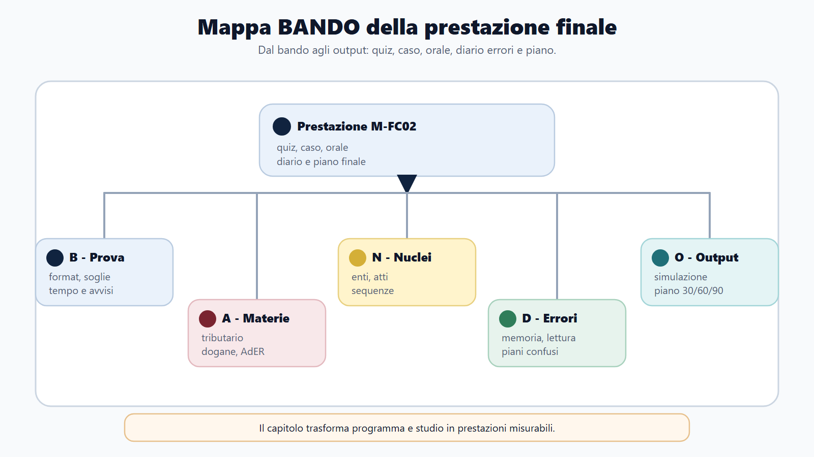
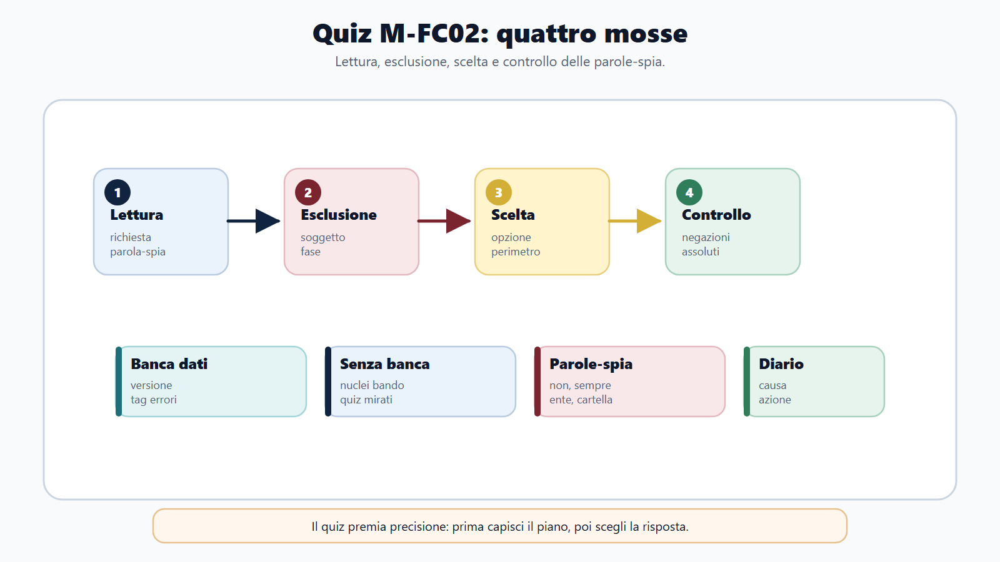
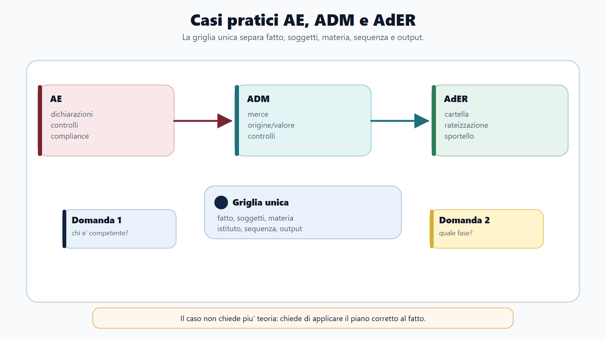
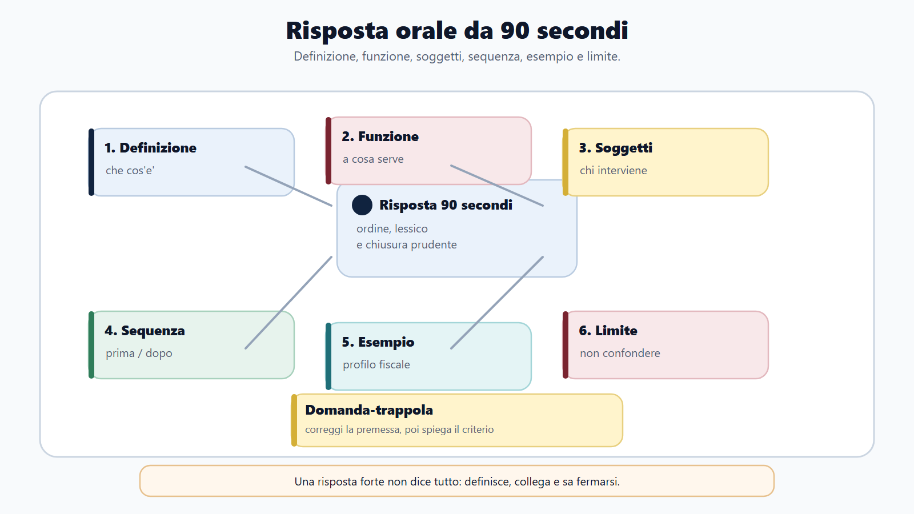
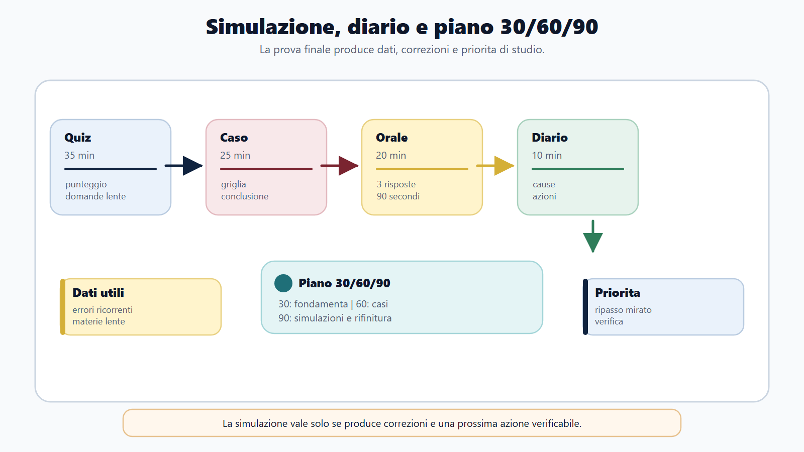

# Casi pratici, quiz e orale nelle Agenzie fiscali

## Apertura editoriale

Conoscere una norma e saperla usare sotto tempo sono competenze diverse. Nel quiz bisogna riconoscere il dettaglio decisivo e scartare distrattori plausibili. Nel caso pratico occorre trasformare fatti incompleti in una sequenza amministrativa corretta. All'orale bisogna esporre con ordine, rispondere ai rilanci e fermarsi prima di introdurre errori.

Questo laboratorio conclude il percorso M-FC02. Le esercitazioni attraversano Agenzia delle Entrate, ADM e AdER, ma mantengono distinte competenze e procedure. Un problema sul merito del tributo non si risolve come una rateizzazione; una dichiarazione doganale non si tratta come una dichiarazione dei redditi; una visura catastale non equivale a un'ispezione ipotecaria.

Le domande sono originali e servono per allenamento. Il formato reale della prova, le materie, il punteggio, le penalita e l'eventuale banca dati ufficiale dipendono dal bando e dagli avvisi della procedura. Prima di usare questo capitolo come simulazione, il candidato deve impostare timer e regole sul concorso concreto.

## Obiettivo del capitolo

Al termine del laboratorio devi saper:

1. classificare una traccia prima di rispondere;
2. risolvere un caso con fatti, competenza, regola, istruttoria e output;
3. riconoscere i distrattori tipici nei quiz fiscali e doganali;
4. costruire una risposta orale di due o quattro minuti;
5. gestire un riferimento normativo non sicuro senza inventarlo;
6. distinguere errore di conoscenza, lettura, competenza, processo e strategia;
7. trasformare ogni errore in un'attivita di recupero;
8. programmare simulazioni progressive a 30, 60 e 90 giorni.

## Mappa BANDO della performance

| Passaggio | Applicazione |
|---|---|
| **Bando** | Ricava formato, durata, materie, soglie, penalita, titoli e strumenti consentiti. |
| **Aree** | Raggruppa tributario, riscossione, dogane, accise-giochi, territorio, contabilita e civile-commerciale. |
| **Nuclei** | Seleziona definizioni, competenze, sequenze, differenze e casi ad alta probabilita. |
| **Diario** | Registra causa dell'errore, regola corretta, fonte e data di ripasso. |
| **Output** | Produci quiz cronometrati, soluzioni scritte, esposizioni orali e simulazioni complete. |

## 1. Prima regola: riconoscere il tipo di prova

Una domanda definitoria chiede che cosa sia un istituto. Una domanda comparativa pretende differenze. Una domanda procedurale richiede una sequenza. Il caso pratico chiede una decisione operativa. Il quesito situazionale valuta la condotta piu adeguata. Confondere il genere produce risposte formalmente corrette ma non pertinenti.

Prima di iniziare, formula in dieci secondi una frase: «Mi viene chiesto di...». Se la traccia domanda chi sia competente, non partire dalla storia dell'ente. Se chiede cosa fare dopo la notifica, individua atto, termine e opzioni. Se propone un conflitto con l'utente, combina legalita, servizio, riservatezza e tracciabilita.

## 2. Griglia universale del caso fiscale

Usa la sequenza F-C-R-I-O:

1. **Fatti:** quali dati sono certi e quali mancano?
2. **Competenza:** quale ente, ufficio o soggetto deve intervenire?
3. **Regola:** quale istituto governa il problema?
4. **Istruttoria:** quali documenti, controlli e comunicazioni servono?
5. **Output:** quale atto, servizio, sospensione, rettifica o rinvio conclude il passaggio?

La soluzione non deve inventare fatti. Se manca la data di notifica, scrivi che va verificata per individuare il termine. Se non e' chiaro il tipo di atto, distingui le alternative. Una risposta condizionata e ben motivata vale piu di una conclusione netta costruita su presupposti inesistenti.

## 3. Caso AE: anomalia tra fatture, ricavi e banca

Beta Srl dichiara ricavi per 800.000 euro. Le fatture elettroniche emesse nell'anno ammontano a 910.000 euro e gli accrediti bancari a 760.000. L'ufficio ritiene che la differenza provi ricavi omessi.

### Svolgimento guidato

**Fatti.** I tre aggregati non hanno necessariamente lo stesso perimetro. Fatture e bilancio seguono regole temporali; la banca registra incassi, anticipi, finanziamenti e regolamenti di crediti pregressi.

**Competenza.** L'Agenzia delle Entrate puo analizzare e controllare la posizione con i poteri previsti. Occorre individuare ufficio, periodo e procedimento.

**Regola.** Il reddito d'impresa parte dal risultato contabile corretto dalle regole fiscali; ricavo e incasso non coincidono. Note di credito, fatture anticipate, operazioni fuori campo, cessioni di cespiti e competenza possono spiegare scostamenti.

**Istruttoria.** Riconciliare registro fatture, mastri clienti, conto economico, note di credito, contratti e movimenti bancari. Chiedere spiegazioni puntuali, non generiche.

**Output.** Se le differenze sono documentate, l'anomalia viene archiviata o ridimensionata. Se restano operazioni non contabilizzate, l'ufficio procede secondo la disciplina applicabile, motivando la ricostruzione e valutando le osservazioni.

### Errore da evitare

Sottrarre gli accrediti bancari dalle fatture e chiamare il risultato «evasione». Lo scostamento e' un segnale, non una prova autosufficiente.

## 4. Caso ADM: origine preferenziale non dimostrata

Un importatore dichiara componenti spediti dalla Corea come originari del Paese e chiede il trattamento preferenziale. La fattura riporta una formula generica, ma non contiene una prova conforme; parte della produzione risulta svolta in un Paese terzo.

### Svolgimento guidato

**Fatti.** Provenienza e origine sono distinte. Servono codice tariffario, regola specifica, lavorazioni e prova prevista dall'accordo.

**Competenza.** ADM verifica dichiarazione, documenti, origine, valore e classificazione.

**Regola.** Il beneficio richiede origine preferenziale sostanziale e prova valida. La sede del venditore o il luogo di spedizione non bastano.

**Istruttoria.** Acquisire dichiarazione, documentazione del produttore, distinta materiali, processo di lavorazione e prova di origine. Valutare il diritto dell'operatore a essere ascoltato prima della decisione sfavorevole.

**Output.** Se i requisiti non sono dimostrati, il trattamento preferenziale non viene applicato e si determinano i diritti secondo le regole ordinarie, ferme le ulteriori conseguenze previste.

### Rilancio orale

«Che differenza c'e tra informazione tariffaria vincolante e prova di origine?» La prima riguarda la classificazione; la seconda dimostra l'origine secondo il regime invocato.

## 5. Caso AdER: cartella contestata e richiesta di rate

Un contribuente riceve una cartella per tributo comunale. Afferma di aver gia pagato una parte prima della formazione del ruolo e, per il residuo, chiede una dilazione.

### Svolgimento guidato

**Fatti.** Separare importo gia pagato e debito residuo; verificare cartella, data di notifica, ricevuta e carichi inclusi.

**Competenza.** Il Comune decide sul merito e sullo sgravio. AdER gestisce la riscossione, riceve la sospensione legale nei casi previsti e tratta la rateizzazione di propria competenza.

**Regola.** Il pagamento anteriore alla formazione del ruolo puo rientrare nella sospensione legale se sono soddisfatti requisiti e termine. La rateizzazione non annulla il debito.

**Istruttoria.** Presentare documentazione per la sospensione della parte contestata; verificare importo, difficolta, piano e regime temporale per il residuo.

**Output.** Le due richieste seguono percorsi distinti. AdER trasmette la verifica all'ente creditore e istruisce la dilazione secondo la disciplina vigente.

### Errore da evitare

Promettere che AdER cancellera il tributo oppure subordinare la sospensione alla richiesta di rateizzazione dell'intero importo.

## 6. Caso Territorio: planimetria e proprieta

Una cittadina chiede all'ufficio di certificare che e' proprietaria di un appartamento perche la visura catastale e' intestata a lei. La planimetria, pero, non corrisponde allo stato dei luoghi.

**Soluzione.** L'operatore distingue titolarita civilistica, dato catastale e conformita della rappresentazione. La visura non costituisce ordinariamente titolo di proprieta. Per il diritto occorrono titolo e formalita immobiliari; per la difformita catastale serve verificare la causa e la procedura tecnica, senza confonderla con la regolarita urbanistica.

## 7. Caso situazionale: utente aggressivo allo sportello

Un utente alza la voce e pretende l'accesso immediato ai dati fiscali del fratello, sostenendo di avere una delega «a casa». La sala e' affollata.

| Condotta | Valutazione | Motivo |
|---|---|---|
| Mostrare i dati per calmare l'utente | Inadeguata | Viola identificazione e riservatezza. |
| Interrompere senza spiegazioni e chiamare subito la sicurezza | Eccessiva, salvo rischio concreto | Non tenta una gestione proporzionata. |
| Spiegare requisiti, spostare il confronto in modo riservato e indicare come presentare la delega | Adeguata | Unisce legalita, servizio e protezione dei dati. |
| Chiedere a un collega di usare le proprie credenziali | Gravemente inadeguata | Viola sicurezza e responsabilita degli accessi. |

La condotta migliore non e' la piu accomodante. E' quella che tutela dati e persone, riduce il conflitto e lascia una via operativa lecita.

## 8. Metodo per i quiz: leggere prima di ricordare

Nel quiz sottolinea mentalmente soggetto, verbo, negazione, tempo e ambito. Molti distrattori usano un istituto corretto nel procedimento sbagliato: AdER al posto dell'ente creditore, voltura al posto della trascrizione, provenienza al posto dell'origine.

Classifica la sicurezza:

- **S:** risposta sicura e spiegabile;
- **I:** incerta tra due opzioni;
- **L:** lenta, richiede ricostruzione;
- **E:** errore accertato;
- **F:** risposta fortunata, corretta senza ragionamento.

Le risposte F devono tornare nel ripasso come gli errori. Il punteggio da solo nasconde le lacune.

## 9. Batteria di quiz trasversali

**1. Il contraddittorio preventivo serve principalmente a:**
A. sostituire ogni controllo; B. consentire osservazioni prima dell'atto nei casi previsti; C. trasferire la competenza al giudice; D. sospendere sempre la riscossione.
**Risposta: B.** Partecipazione e decisione finale restano fasi distinte.

**2. Nell'accertamento esecutivo:**
A. e' sempre necessaria una successiva cartella; B. l'atto puo costituire titolo per la riscossione; C. AdER determina l'imposta; D. il pagamento e' facoltativo.
**Risposta: B.** L'affidamento segue il percorso stabilito senza cartella per lo stesso carico.

**3. La rateizzazione AdER:**
A. annulla il credito; B. modifica il titolo; C. distribuisce il pagamento; D. decide il merito tributario.
**Risposta: C.** Soglie e durata vanno verificate nel regime vigente.

**4. In dogana, l'origine indica:**
A. sempre il luogo di spedizione; B. il legame giuridico produttivo con un Paese; C. il valore; D. il regime.
**Risposta: B.** Provenienza e origine possono divergere.

**5. Il valore di transazione:**
A. e' il metodo primario, con le rettifiche previste; B. e' sempre il prezzo non verificabile; C. coincide con la tariffa; D. dipende dall'origine preferenziale.
**Risposta: A.**

**6. Il deposito fiscale delle accise:**
A. rende i prodotti esenti; B. consente operazioni in sospensione; C. elimina la garanzia; D. e' un deposito doganale ordinario.
**Risposta: B.** Sospensione ed esenzione non coincidono.

**7. Nel gioco pubblico, il concessionario:**
A. opera entro il titolo; B. sostituisce ADM; C. crea liberamente giochi; D. puo derogare al divieto per minori.
**Risposta: A.**

**8. Il DOCFA riguarda principalmente:**
A. formalita ipotecarie; B. dichiarazioni urbane; C. dazi; D. accise.
**Risposta: B.**

**9. L'iscrizione nei registri immobiliari riguarda tipicamente:**
A. l'ipoteca; B. il classamento; C. l'OMI; D. la voltura.
**Risposta: A.**

**10. L'incasso di un credito gia contabilizzato:**
A. genera sempre un nuovo ricavo; B. trasforma il credito in liquidita; C. aumenta il debito; D. e' una variazione fiscale.
**Risposta: B.**

**11. Il reddito imponibile d'impresa:**
A. coincide sempre con l'utile; B. deriva dal risultato corretto fiscalmente; C. coincide con la cassa; D. e' la somma dei crediti.
**Risposta: B.**

**12. Una domanda di informazioni ad AdER:**
A. sospende automaticamente la procedura; B. annulla la cartella; C. non produce da sola gli effetti di un provvedimento di sospensione; D. sostituisce il ricorso.
**Risposta: C.**

## 10. Correggere un quiz in modo utile

Per ogni errore compila quattro campi:

| Campo | Domanda da porsi |
|---|---|
| Regola | Qual e' la proposizione corretta in una frase? |
| Causa | Non sapevo, ho letto male, ho confuso competenza o sono andato di fretta? |
| Distrattore | Perche l'opzione scelta sembrava plausibile? |
| Recupero | Quale pagina, flashcard, confronto o esercizio devo fare? |

Non copiare l'intero commento. Una correzione efficace e' breve e riutilizzabile: «La voltura aggiorna il catasto; la trascrizione pubblicizza l'atto».

## 11. Struttura della risposta orale

Usa sei passaggi, adattandoli alla domanda:

1. inquadramento in una frase;
2. definizione dell'istituto;
3. funzione;
4. soggetti e sequenza;
5. distinzione o esempio;
6. chiusura che torna alla domanda.

Per «Che cos'e la sospensione legale della riscossione?» una risposta efficace definisce l'istituto, indica casi e termine in modo prudente, distingue AdER ed ente creditore, descrive trasmissione e verifica, chiude separando sospensione e sgravio.

## 12. Risposte da due e quattro minuti

La versione da due minuti contiene definizione, tre nuclei e un esempio. Quella da quattro aggiunge fonte, procedimento, distinzione e criticita. Allenare entrambe evita risposte troppo brevi o incontrollate.

| Criterio | 0 | 1 | 2 |
|---|---:|---:|---:|
| Pertinenza | Fuori tema | Parziale | Diretta |
| Correttezza | Errori gravi | Imprecisioni | Solida |
| Struttura | Disordinata | Comprensibile | Nitida |
| Linguaggio | Improprio | Generico | Tecnico e chiaro |
| Esempio | Assente/errato | Debole | Funzionale |
| Chiusura | Manca | Ripetitiva | Torna alla domanda |

Punteggio massimo: 12. Sotto 8, la risposta va rifatta dopo il recupero mirato.

## 13. Domande da commissario e rilanci

- AE: «Differenza tra controllo formale e accertamento sostanziale». Rilancio: «Quale ruolo ha il contraddittorio?»
- AdER: «Ruolo e cartella». Rilancio: «Chi decide lo sgravio?»
- ADM: «Classificazione, origine e valore». Rilancio: «Che cosa controllerebbe per primo?»
- Accise: «Regime sospensivo». Rilancio: «Come si appura il movimento?»
- Territorio: «Catasto e pubblicita immobiliare». Rilancio: «La visura prova la proprieta?»
- Contabilita: «Utile e liquidita». Rilancio: «Come passa dall'utile all'imponibile?»

Il rilancio verifica se il candidato comprende i confini. Non ripetere l'inizio: rispondi al nuovo punto e collega solo quanto serve.

## 14. Domande impreviste: protocollo anti-invenzione

Quando non ricordi un articolo o una soglia:

1. delimita: «Il dato puntuale va verificato nel testo vigente»;
2. enuncia il nucleo sicuro;
3. sviluppa soggetto, funzione, fase ed effetto;
4. usa un esempio prudente;
5. chiudi senza aggiungere numeri casuali.

Non trasformare la prudenza in evasione. Se non ricordi il numero massimo di rate, puoi spiegare presupposti, domanda, effetti e natura mobile del limite. Se non conosci neppure l'istituto, dichiarare il vuoto e non inventare resta preferibile a una norma falsa.

## 15. Mini-simulazione finale

### Blocco A: quiz

Rispondi ai 12 quiz in 9 minuti. Applica penalita e regole solo se previste dal tuo bando. Registra S, I, L, E o F.

### Blocco B: caso

In 20 minuti risolvi: «Un operatore riceve una cartella relativa a un accertamento che dichiara di non aver mai ricevuto. Chiede contemporaneamente rateizzazione e annullamento». Usa F-C-R-I-O e indica le verifiche senza presumere l'esito della notifica.

### Blocco C: orale

Estrai tre domande, una per ente. Preparazione: 30 secondi. Risposta: due minuti. Rilancio: un minuto. Registra audio e valuta con la griglia su 12.

## 16. Diario degli errori M-FC02

| Data | Materia | Errore | Causa | Regola corretta | Recupero | Riesame |
|---|---|---|---|---|---|---|
| | | | concetto/lettura/competenza/tempo | | pagina + esercizio | 2-7-21 giorni |

Distribuisci gli errori in sette cartelle: tributario, accertamento, riscossione, dogane, accise-giochi, territorio, contabilita-civile. Una categoria «varie» troppo grande segnala che non stai diagnosticando.

## 17. Piano 30/60/90 giorni

### Entro 30 giorni: copertura

- mappa tutti i capitoli e verifica il bando;
- costruisci 20 confronti tra istituti simili;
- esegui quiz per materia senza ossessione per il punteggio;
- svolgi un caso per AE, ADM e AdER;
- registra due risposte orali a settimana.

### Entro 60 giorni: integrazione

- alterna quiz misti e casi;
- ripassa gli errori a intervalli;
- porta le risposte orali a quattro minuti;
- inserisci rilanci e domande impreviste;
- aggiorna norme e dati mobili sulle fonti ufficiali.

### Entro 90 giorni: simulazione

- replica durata e regole della prova;
- riduci le lacune ad alta frequenza;
- esegui almeno tre simulazioni complete;
- prepara una settimana finale senza nuovi manuali;
- conserva energia e routine per il giorno della prova.

## Errore tipico

Fare cento quiz casuali e chiamarlo studio. Senza classificazione degli errori, una risposta fortunata consolida un'illusione e una domanda sbagliata viene presto dimenticata. Ogni sessione deve produrre un delta: regola corretta, confronto o esercizio da ripetere.

## Checklist finale

- [ ] Ho verificato formato e regole nel bando.
- [ ] Classifico la domanda prima di rispondere.
- [ ] Uso F-C-R-I-O nei casi.
- [ ] Distinguo competenze di AE, ADM e AdER.
- [ ] Correggo anche risposte fortunate e lente.
- [ ] Espongo risposte da due e quattro minuti.
- [ ] Gestisco i rilanci senza ricominciare da capo.
- [ ] Non invento articoli, soglie o termini.
- [ ] Registro gli errori per causa e materia.
- [ ] Eseguo simulazioni con timer e revisione.

## Riferimenti consolidati

- [[sources/m-fc02-dossier-redazionale-agenzie-fiscali]]
- [[sources/bandi-rappresentativi-m-fc02-agenzie-fiscali-2023-2026]]
- [[sources/prove-concorsuali-quiz-scritto-orale-dpr-487-1994]]
- [[sources/capitolo-17-18-corpus-casi-pratici-quesiti-situazionali-2026-05-30]]
- [[sources/banca-dati-ufficiale-quiz-metodo-bando]]
- [[sources/domande-impreviste-risposta-sicura-metodo-bando]]
- [[topics/prova-a-quiz]]
- [[topics/prova-orale]]
- [[topics/casi-pratici]]
- [[books/il-metodo-bando/ricettario-digitale]]

## Note di review

- Verificare formato, durata, penalita, soglie e materie sul bando concreto.
- Aggiornare le regole mobili richiamate nei casi prima dell'impaginazione.
- Sottoporre casi e quiz a revisione incrociata tributaria, doganale, catastale e contabile.
- Mantenere le domande originali; non presentarle come quesiti ufficiali o predittivi.
- [[sources/d-p-r-9-maggio-1994-n-487-accesso-agli-impieghi-pubblici-e-concorsi]]
- [[sources/d-p-r-16-giugno-2023-n-82-modifiche-al-d-p-r-487-1994-sui-concorsi]]
- [[books/il-metodo-bando/ricettario-digitale]]

## Scheda di lavoro
Questo capitolo chiude il modulo M-FC02 con un obiettivo pratico: trasformare lo studio delle Agenzie fiscali in prova concorsuale. I capitoli precedenti hanno costruito il perimetro: profili, organizzazione, diritto tributario, accertamento, dichiarazioni, riscossione, dogane, accise, catasto, contabilita, diritto civile e commerciale applicato. Ora quelle conoscenze devono diventare risposte sotto vincolo di tempo, davanti a quiz, casi sintetici, domande orali e situazioni di front-office.

Il capitolo e' costruito come laboratorio finale. Non aggiunge una nuova materia; insegna a usare le materie gia' studiate nel modo in cui possono comparire in una procedura selettiva. La forma effettiva della prova resta sempre quella indicata dal bando e dagli avvisi della singola procedura [[sources/prove-concorsuali-quiz-scritto-orale-dpr-487-1994]]. Per questo il metodo qui proposto non sostituisce la lettura del bando: la rende operativa.

## Testo editoriale

### Apertura editoriale
Nei concorsi delle Agenzie fiscali il candidato non viene valutato solo per la quantita di nozioni che ricorda. Viene valutato per la capacita di riconoscere un problema, scegliere il piano giuridico corretto, usare il lessico dell'ente e restare ordinato quando il tempo e' poco.

Questa e' la differenza tra "sapere tributario" e "prestazione concorsuale tributaria". La prima riguarda lo studio; la seconda riguarda l'uso dello studio davanti a un quesito, a una traccia o a una commissione. Un candidato puo' conoscere l'IVA, l'accertamento, la riscossione o le procedure doganali, ma perdere punti se confonde il soggetto competente, salta una fase procedimentale, usa parole generiche o risponde come se tutte le Agenzie facessero lo stesso lavoro.

Il modulo M-FC02 richiede una disciplina particolare: ogni risposta deve tenere insieme ente, funzione, materia e profilo. L'Agenzia delle Entrate non chiede lo stesso tipo di ragionamento dell'Agenzia delle Dogane e dei Monopoli; Agenzia delle Entrate-Riscossione non coincide con l'ente impositore; un caso di front-office non si risolve come un tema teorico; una domanda orale non si affronta come una sequenza di definizioni imparate a memoria [[sources/m-fc02-dossier-redazionale-agenzie-fiscali]].

Il lavoro finale consiste quindi in quattro trasformazioni:

- dal programma al quesito;
- dal quesito al ragionamento;
- dal ragionamento alla risposta;
- dalla risposta all'errore corretto.

Il Diario errori fiscale, la griglia orale e il piano 30/60/90 servono proprio a questo: impedire che lo studio resti disperso e portarlo dentro una routine misurabile.

### Obiettivo del capitolo
Al termine del capitolo il candidato deve saper fare sette operazioni.

1. Leggere il bando e distinguere prova a quiz, prova scritta, prova teorico-pratica, orale, idoneita linguistiche o informatiche, titoli, soglie e criteri di valutazione.
2. Trasformare le materie M-FC02 in domande probabili, senza inventare contenuti non previsti dal bando.
3. Allenare quiz tributari, doganali e amministrativi con una procedura stabile: lettura, esclusione, scelta, controllo, diario.
4. Risolvere un caso sintetico distinguendo fatto, soggetto competente, istituto, sequenza procedimentale e risposta conclusiva.
5. Rispondere oralmente in modo ordinato, con definizione, funzione, passaggi essenziali, esempio e cautela finale.
6. Gestire domande di front-office e comunicazione istituzionale senza promettere cio' che l'amministrazione non puo' promettere.
7. Costruire un piano 30/60/90 coerente con il calendario reale della procedura.

Queste operazioni sono coerenti con il Metodo BANDO: prima si delimita la richiesta, poi si traduce il programma in prestazioni, infine si corregge il metodo sulla base degli errori effettivi.

### Come usare questo capitolo
Questo capitolo non va letto come una lezione finale da sottolineare. Va usato come banco di prova.

La prima lettura serve a capire la struttura: quiz, casi, orale, diario, piano. La seconda lettura deve essere operativa: il candidato compila le tabelle con il proprio bando, il proprio profilo e le proprie materie. La terza lettura avviene dopo una simulazione: si torna al capitolo solo per correggere gli errori.

Il criterio e' semplice: se una pagina non produce una domanda, una risposta, una scheda o una decisione di studio, non e' ancora stata usata bene.

### Mappa BANDO del capitolo

| Passaggio | Domanda guida | Applicazione al capitolo |
|---|---|---|
| B - Bando | Che prova devo sostenere davvero? | Quiz, scritto, teorico-pratico, orale, idoneita, titoli, soglie e penalita vanno ricavati dal bando e dagli avvisi ufficiali. |
| A - Aree | Quali materie pesano nel profilo? | Tributario, dogane, riscossione, contabilita, civile/commerciale, organizzazione, amministrativo e competenze digitali vanno gerarchizzati. |
| N - Nuclei | Quali concetti tornano in piu' prove? | Soggetti, competenze, atti, termini, procedimenti, poteri, garanzie, controlli, pagamento, impugnazione, front-office. |
| D - Domande | In quale forma puo' comparire il contenuto? | Quiz secco, quesito situazionale, caso breve, domanda orale, confronto tra istituti, errore da riconoscere. |
| O - Output | Che prodotto devo allenare? | Simulazione, scheda caso, risposta da 90 secondi, diario errori, piano 30/60/90. |

La mappa va compilata per il concorso specifico. I bandi rappresentativi del perimetro M-FC02 mostrano profili e materie differenti tra Agenzia delle Entrate, Agenzia delle Dogane e dei Monopoli e Agenzia delle Entrate-Riscossione [[sources/bandi-rappresentativi-m-fc02-agenzie-fiscali-2023-2026]]. Per questo non esiste una simulazione unica valida per tutti: esiste una struttura comune da adattare.

### Dalla materia alla prestazione
Lo studio concorsuale diventa fragile quando resta organizzato solo per capitoli. In prova, pero', il candidato non incontra un capitolo: incontra un compito.

Una stessa materia puo' generare prestazioni diverse.

| Materia | Quiz | Caso pratico | Orale |
|---|---|---|---|
| Diritto tributario | Definizione, soggetto, presupposto, differenza tra istituti. | Individuare il potere dell'amministrazione e la posizione del contribuente. | Spiegare funzione del tributo, rapporto d'imposta, garanzie e limiti. |
| Accertamento e controlli | Termine, atto, controllo, fase procedimentale. | Ricostruire un controllo documentale o un invito alla compliance. | Collegare potere di controllo, partecipazione e motivazione. |
| Dichiarazioni e IVA | Adempimento, versamento, compensazione, dichiarazione. | Distinguere errore dichiarativo, omesso versamento, credito, documentazione. | Spiegare perche' dichiarazione e pagamento non sono la stessa cosa. |
| Riscossione | Cartella, avviso, pagamento, rateazione, sospensione. | Orientare un contribuente rispetto a cartella, scadenza, istanza o sportello. | Distinguere ente creditore, agente della riscossione e contribuente. |
| Dogane | Merce, dichiarazione, classificazione, origine, valore, controllo. | Gestire un flusso import/export o un controllo su operatore economico. | Spiegare il ruolo di ADM tra fiscalita, controlli e tutela degli interessi pubblici. |
| Accise, giochi e monopoli | Presupposto, prodotto, autorizzazione, controllo. | Riconoscere il piano fiscale e quello regolatorio. | Collegare gettito, vigilanza e legalita economica. |
| Catasto e pubblicita immobiliare | Rendita, classamento, voltura, registri, dati immobiliari. | Leggere il problema immobiliare senza confondere catasto e proprieta. | Spiegare funzione informativa e fiscale del sistema. |
| Contabilita e impresa | Bilancio, costi, ricavi, crediti, debiti, documentazione. | Interpretare dati d'impresa utili a controllo, riscossione o dogane. | Collegare bilancio civilistico e rilevanza fiscale senza sovrapporli. |

La prestazione cambia anche il linguaggio. Nel quiz serve precisione; nel caso serve sequenza; all'orale serve esposizione. La preparazione finale deve allenare tutte e tre le forme.

### Quiz tributari e doganali
Il quiz non e' una domanda "piccola". E' una domanda compressa. In poche righe puo' verificare una distinzione che, se studiata male, porta a risposte sbagliate anche nello scritto e nell'orale.

Nei concorsi pubblici la forma concreta della prova dipende dal bando e dagli avvisi della procedura. La prova puo' includere quesiti a risposta multipla, prova scritta, prova teorico-pratica, orale, accertamenti linguistici o informatici e ulteriori elementi indicati dal bando [[sources/prove-concorsuali-quiz-scritto-orale-dpr-487-1994]]. Il candidato deve quindi partire da quattro dati:

- numero dei quesiti;
- materie incluse;
- tempo disponibile;
- punteggio, soglia, penalita e criteri di idoneita.

Senza questi dati non si puo' costruire una simulazione fedele. Si puo' studiare, ma non si puo' ancora simulare.

Nel perimetro M-FC02 i quiz piu' insidiosi non sono sempre quelli nozionistici. Spesso sono quelli che chiedono di distinguere:

- ente impositore e agente della riscossione;
- controllo formale, accertamento e attivita di assistenza;
- dichiarazione, liquidazione e versamento;
- tributi diretti, IVA, imposte indirette e tributi locali non pertinenti al profilo;
- dichiarazione doganale, controllo doganale e adempimento dell'operatore;
- catasto, pubblicita immobiliare e titolarita civilistica;
- bilancio civilistico, risultato economico e reddito imponibile.

Il candidato deve allenarsi a riconoscere il "piano" della domanda prima di scegliere l'opzione.

### Con banca dati e senza banca dati
La presenza di una banca dati ufficiale cambia la strategia, ma non elimina il ragionamento. Una banca dati ufficiale e' materiale di procedura: va verificata nella fonte, nella data, nella versione e negli eventuali avvisi di aggiornamento [[topics/banca-dati-ufficiale-quiz]].

Se la banca dati e' pubblicata, il percorso consigliato e':

1. verificare che sia quella ufficiale della procedura;
2. registrare versione, data, materie e numero di quesiti;
3. fare una prima copertura completa senza cercare subito la perfezione;
4. taggare ogni domanda come sicura, incerta, sbagliata, lenta, indovinata o da spiegare;
5. ripassare in modo distribuito le domande sbagliate, lente e indovinate;
6. trasformare i quesiti centrali in micro-spiegazioni orali;
7. simulare con timer, punteggio e penalita del bando.

Se la banca dati non e' pubblicata, il percorso cambia:

1. si ricostruiscono i nuclei dal bando;
2. si usano quiz di allenamento solo come strumento, non come previsione;
3. si privilegiano definizioni, distinzioni, sequenze e casi brevi;
4. si registra l'errore per causa, non solo per materia;
5. si alternano quiz e spiegazioni orali per evitare memoria meccanica.

La domanda decisiva non e' "quanti quiz ho fatto?", ma "quali errori continuano a tornare e che cosa mi stanno dicendo del mio metodo?".

### Procedura in quattro mosse per il quiz
Ogni quiz va trattato con una procedura fissa.

**1. Lettura.** Prima si individua la richiesta. La domanda chiede definizione, competenza, termine, eccezione, sequenza, esclusione, confronto o caso?

**2. Esclusione.** Si eliminano le opzioni incompatibili con soggetto, materia o fase. Nei quiz fiscali molte risposte sbagliate sono plausibili solo se si confondono piani diversi.

**3. Scelta.** Si sceglie l'opzione coerente con la domanda, non quella che "suona piu' completa". In un quiz, una risposta troppo ampia puo' essere sbagliata perche' non risponde al perimetro.

**4. Controllo.** Prima di confermare si rilegge la parola-spia: non, salvo, esclusivamente, sempre, puo', deve, competente, termine, principale, falsa.

La procedura deve diventare automatica. Non serve solo a prendere punti; serve a evitare che la pressione del tempo trasformi una conoscenza corretta in una risposta sbagliata.

### Parole-spia nei quiz M-FC02

| Parola-spia | Rischio | Controllo da fare |
|---|---|---|
| Sempre | Risposta assoluta: spesso falsa se l'istituto ammette eccezioni. | Chiedersi se esistono casi, limiti o condizioni. |
| Esclusivamente | Riduzione eccessiva della competenza o della funzione. | Verificare se altri soggetti partecipano al procedimento. |
| Non | Inversione della domanda. | Rileggere prima di scegliere. |
| Ente competente | Confusione tra AE, ADM, AdER o altri enti. | Identificare materia e funzione. |
| Versamento | Confusione tra dichiarazione, liquidazione, pagamento e riscossione. | Separare adempimento, debito e fase di recupero. |
| Controllo | Confusione tra controllo, accertamento, assistenza e vigilanza. | Chiedersi quale potere e quale fase sono coinvolti. |
| Operatore | Nei casi doganali puo' indicare importatore, esportatore, dichiarante, intermediario o soggetto autorizzato. | Ricostruire il ruolo prima della risposta. |
| Cartella | Rischio di attribuire ad AdER il potere impositivo. | Distinguere credito, titolo, notifica, pagamento e strumenti di tutela. |

### Casi pratici nelle Agenzie fiscali
Il caso pratico verifica una competenza diversa dal quiz. Non chiede solo "che cosa sai?", ma "che cosa fai con cio' che sai?". Un caso puo' essere lungo o molto breve; puo' chiedere una soluzione, una sequenza, un parere sintetico, una risposta al cittadino, una classificazione di problemi o un confronto tra strumenti.

Nel perimetro M-FC02 conviene usare una griglia unica.

| Passaggio | Domanda | Perche' conta |
|---|---|---|
| Fatto | Che cosa e' accaduto? | Evita di rispondere a una domanda diversa. |
| Soggetti | Chi sono contribuente, operatore, ente, ufficio o agente? | Impedisce confusione tra amministrazioni. |
| Materia | Siamo in tributario, dogane, riscossione, catasto, contabile, civile/commerciale? | Delimita il campo. |
| Istituto | Quale atto, potere, adempimento o procedura e' rilevante? | Distingue nozione e applicazione. |
| Sequenza | Quali passaggi vengono prima e dopo? | Mostra ordine giuridico e amministrativo. |
| Garanzie | Quali limiti, partecipazione, informazione o tutela vanno ricordati? | Evita risposte autoritative o incomplete. |
| Output | Che risposta deve produrre il candidato? | Conclude in modo utile e valutabile. |

La griglia aiuta soprattutto quando il caso e' ibrido. Ad esempio, una societa puo' comparire in un caso di IVA, bilancio, riscossione o dogane. Il nome "societa" non basta a capire la materia; bisogna individuare il problema.

### Caso AE: dichiarazione, controllo e compliance
**Scenario.** Un contribuente riceve una comunicazione relativa a dati dichiarativi non coerenti con informazioni gia' disponibili all'amministrazione. Chiede all'ufficio se deve pagare subito e se la comunicazione equivale a un accertamento definitivo.

**Lettura corretta.** Il caso va affrontato distinguendo assistenza, controllo, compliance, eventuale liquidazione e accertamento. Non bisogna trasformare ogni contatto dell'amministrazione con il contribuente in un atto definitivo. L'Agenzia delle Entrate opera su dichiarazioni, versamenti, controlli, accertamento e servizi al contribuente; il candidato deve riconoscere la fase e non usare un linguaggio generico [[sources/m-fc02-dossier-redazionale-agenzie-fiscali]].

**Risposta modello.** In una risposta concorsuale occorre prima qualificare la comunicazione, poi spiegare che il contribuente deve verificare i dati indicati, confrontarli con la propria dichiarazione e con la documentazione disponibile, e valutare gli strumenti indicati nella comunicazione e negli avvisi ufficiali. Se emergono errori o elementi da chiarire, la risposta corretta non e' "pagare sempre", ma verificare il contenuto dell'atto, i termini, le modalita di interlocuzione e le eventuali conseguenze. La conclusione deve restare prudente: il candidato non promette esiti, ma descrive il percorso amministrativo.

**Errore da evitare.** Dire che ogni comunicazione dell'Agenzia delle Entrate e' automaticamente un accertamento definitivo. Questo errore rivela una confusione tra funzione di assistenza, controllo e potere impositivo.

### Caso ADM: merce, dichiarazione e controllo
**Scenario.** Un operatore importa merci e segnala dubbi sulla classificazione del prodotto, sull'origine e sulla documentazione da presentare. La traccia chiede quali profili deve considerare l'ufficio in un controllo.

**Lettura corretta.** Il caso riguarda il rapporto tra merce, dichiarazione doganale, elementi dell'obbligazione doganale e funzione di controllo. Non e' un caso IVA generico e non e' solo un problema commerciale. L'Agenzia delle Dogane e dei Monopoli presidia un'area in cui fiscalita, controlli, traffici, accise, giochi e monopoli possono intrecciarsi, secondo il profilo previsto dal bando [[sources/bandi-rappresentativi-m-fc02-agenzie-fiscali-2023-2026]].

**Risposta modello.** Il candidato deve partire dall'identificazione della merce e dalla documentazione disponibile. Deve poi richiamare i profili essenziali: classificazione, origine, valore, regime o destinazione doganale, eventuali autorizzazioni o controlli specifici. La risposta deve mostrare che l'ufficio non valuta solo un dato isolato, ma la coerenza del flusso dichiarato con la disciplina applicabile. Se il bando include materie doganali, questo tipo di caso va allenato con schede brevi, non solo con definizioni.

**Errore da evitare.** Rispondere come se il caso riguardasse solo il prezzo della merce o solo l'IVA. Nelle procedure doganali il candidato deve tenere insieme dato economico, dichiarazione, controllo e ruolo dell'operatore.

### Caso AdER: cartella, pagamento e orientamento dell'utente
**Scenario.** Un cittadino si presenta allo sportello per una cartella. Dice di non capire se il debito sia dovuto, chiede una rateazione e domanda all'operatore di "annullare tutto".

**Lettura corretta.** Il caso richiede la distinzione tra ente creditore, titolo, agente della riscossione, pagamento, rateazione, sospensione e tutela. Agenzia delle Entrate-Riscossione non coincide con l'ente impositore e non va descritta come se decidesse sempre il merito del tributo. Nel modulo M-FC02 questa distinzione e' centrale [[topics/profili-agenzie-fiscali]].

**Risposta modello.** Una risposta corretta deve orientare l'utente senza sostituirsi alla decisione dell'amministrazione competente. L'operatore deve verificare la posizione, spiegare quali informazioni risultano dall'atto, indicare i canali e gli strumenti previsti per pagamento, rateazione o istanze, e chiarire quando occorre rivolgersi all'ente creditore o seguire le forme di tutela previste. La comunicazione deve essere chiara, ma non deve promettere annullamenti o soluzioni non verificate.

**Errore da evitare.** Dire al cittadino che AdER puo' cancellare liberamente il debito se il contribuente lo contesta. Il punto concorsuale e' distinguere gestione della riscossione, merito del credito e strumenti di tutela.

### Casi ibridi: dove molti candidati perdono ordine
I casi piu' realistici non rispettano sempre i confini dei capitoli. Possono unire contabilita, IVA, riscossione e diritto commerciale; oppure dogane, accise, controlli e autorizzazioni; oppure catasto, imposte indirette e front-office.

In questi casi il candidato deve evitare due errori opposti:

- rispondere a tutto, perdendo il centro;
- scegliere una sola materia e ignorare i collegamenti necessari.

La soluzione consiste nel dichiarare il perimetro. Una buona apertura puo' essere:

> Il caso va distinto su tre piani: il piano soggettivo, per individuare l'amministrazione e il contribuente; il piano procedimentale, per collocare l'atto o l'adempimento; il piano sostanziale, per capire quale obbligo o potere e' coinvolto.

Questa apertura non e' una formula vuota. Serve a proteggere la risposta dalla confusione. Dopo averla usata, pero', il candidato deve applicarla al caso concreto.

### Griglia di risposta per casi pratici

| Sezione | Contenuto massimo | Esempio di frase utile |
|---|---|---|
| Inquadramento | Una o due frasi sul problema. | "Il caso riguarda una fase di controllo su dati dichiarativi, non ancora una ricostruzione completa del contenzioso." |
| Soggetti | Chi fa che cosa. | "Va distinto l'ente titolare del credito dal soggetto che cura la riscossione." |
| Norma/perimetro | Fonte o materia, senza eccesso di citazioni. | "Nel perimetro del bando, il tema rientra negli adempimenti fiscali e nei controlli." |
| Sequenza | Passaggi logici. | "Prima si verifica l'atto, poi la documentazione, poi i termini e gli strumenti disponibili." |
| Garanzie | Limiti, comunicazione, tutela. | "L'utente va orientato in modo chiaro, senza anticipare esiti non verificati." |
| Conclusione | Risposta pratica. | "La soluzione non e' automatica: dipende dalla qualificazione dell'atto e dal canale previsto." |

La griglia non deve rendere la risposta burocratica. Deve renderla leggibile.

### L'orale: non una recita, ma una prova di governo della materia
All'orale la commissione osserva tre elementi: se il candidato conosce il tema, se lo organizza e se sa fermarsi. L'errore tipico e' parlare molto senza costruire una risposta.

Una risposta orale efficace dura spesso meno di quanto il candidato immagina. La struttura consigliata e' la risposta da 90 secondi:

1. definizione essenziale;
2. funzione dell'istituto;
3. soggetti e competenza;
4. sequenza o elementi principali;
5. esempio applicato al profilo;
6. cautela finale o distinzione.

Esempio su riscossione:

> La riscossione riguarda la fase in cui il credito pubblico viene portato a pagamento secondo gli strumenti previsti. Nei concorsi fiscali va distinta dall'accertamento e dalla fase dichiarativa. Occorre individuare l'ente titolare del credito, l'atto o il titolo, il ruolo dell'agente della riscossione e le possibilita di pagamento, rateazione, sospensione o tutela. In un caso di sportello, la risposta corretta non e' promettere l'annullamento, ma orientare l'utente sui canali previsti e sui soggetti competenti.

Questa risposta non esaurisce tutta la materia, ma mostra governo del tema. Se la commissione vuole approfondire, potra' farlo su un punto specifico.

### Risposta orale: schema universale M-FC02

| Passaggio | Domanda interna | Formula di avvio |
|---|---|---|
| Definizione | Che cos'e'? | "L'istituto puo' essere definito come..." |
| Funzione | A cosa serve? | "La funzione e'..." |
| Soggetti | Chi interviene? | "Occorre distinguere..." |
| Procedura | Quali passaggi essenziali? | "Sul piano procedimentale..." |
| Esempio | Come appare in un concorso fiscale? | "Nel contesto delle Agenzie fiscali..." |
| Limite | Che cosa non devo confondere? | "Non va pero' confuso con..." |

La formula non va imparata a memoria. Va usata per dare ordine quando la domanda e' ampia o improvvisa.

### Domande da commissario
Le domande da commissario non sempre cercano la nozione piu' rara. Spesso cercano la capacita di distinguere.

Ecco alcuni esempi da allenare.

| Domanda | Nucleo della risposta | Errore da evitare |
|---|---|---|
| Perche' l'Agenzia delle Entrate non coincide con Agenzia delle Entrate-Riscossione? | Distinguere funzione impositiva, gestione del credito e riscossione. | Dire che sono lo stesso ente perche' entrambe operano in ambito fiscale. |
| In che cosa un caso doganale e' diverso da un caso IVA ordinario? | Merce, dichiarazione doganale, classificazione, origine, valore, controlli. | Ridurre tutto al pagamento dell'imposta. |
| Perche' la contabilita e' utile in un concorso fiscale? | Dati economici, bilancio, documentazione, controlli, reddito fiscale. | Dire che il bilancio coincide con l'imposta. |
| Come si risponde a un contribuente che chiede una soluzione immediata allo sportello? | Ascolto, verifica dell'atto, canali previsti, limiti di competenza, chiarezza. | Promettere un esito non verificato. |
| Che rapporto c'e' tra bando e prova? | Il bando definisce materie, prove, criteri, soglie e regole operative. | Prepararsi su un modello generico ignorando la procedura. |

Queste domande vanno registrate in una scheda orale. Ogni scheda deve avere tre righe: definizione, distinzione, esempio.

### Domande-trappola
La domanda-trappola non e' una domanda scorretta. E' una domanda che contiene una scorciatoia pericolosa. Il candidato deve riconoscerla e correggerla con calma.

| Domanda-trappola | Perche' e' pericolosa | Risposta sicura |
|---|---|---|
| Se c'e' un debito fiscale, l'Agenzia delle Entrate-Riscossione decide se il tributo e' dovuto? | Confusione tra ente creditore, merito del tributo e riscossione. | AdER cura la riscossione secondo gli atti e le regole applicabili; il merito del credito e gli strumenti di tutela vanno distinti. |
| Una comunicazione dell'Agenzia delle Entrate e' sempre un accertamento? | Confonde comunicazioni, controlli, compliance e atti impositivi. | Va qualificato l'atto: non ogni comunicazione ha la stessa funzione o gli stessi effetti. |
| In dogana conta solo il valore della merce? | Riduce il caso al prezzo. | Contano anche classificazione, origine, dichiarazione, regime, documentazione e controlli. |
| Se un bilancio mostra utile, allora l'imposta e' gia' determinata? | Sovrappone risultato civilistico e reddito imponibile. | Il bilancio e' un punto di partenza; il reddito fiscale segue regole proprie. |
| Il catasto prova sempre la proprieta? | Confonde funzione catastale e titolarita civilistica. | Il catasto ha funzione informativa e fiscale; la proprieta richiede attenzione ai titoli e alla pubblicita immobiliare. |

La risposta a una trappola deve essere breve. Prima si corregge la premessa, poi si spiega il criterio. Se il candidato si irrita o si difende, perde ordine; se corregge con metodo, guadagna credibilita.

### Front-office e comunicazione corretta
Le Agenzie fiscali non sono solo luoghi di atti e procedure. Sono anche amministrazioni che interagiscono con cittadini, imprese, professionisti e operatori economici. Per questo nei concorsi puo' emergere il tema del front-office, della comunicazione chiara e della condotta corretta.

La regola fondamentale e': orientare senza sostituirsi al procedimento.

Una risposta di front-office deve contenere:

- ascolto del problema;
- verifica dell'atto o della richiesta;
- individuazione dell'ente e dell'ufficio competente;
- spiegazione dei canali ufficiali;
- indicazione dei documenti o delle informazioni necessarie;
- rispetto della riservatezza e dei limiti di accesso ai dati;
- linguaggio comprensibile;
- nessuna promessa di esito non verificato.

Il candidato deve evitare frasi come "non si preoccupi, risolviamo tutto" oppure "deve pagare e basta". Sono entrambe scorrette in un contesto concorsuale: la prima promette troppo, la seconda semplifica troppo.

Una frase piu' professionale e':

> Dobbiamo prima verificare l'atto, il soggetto competente e i termini indicati. Posso orientarla sui canali previsti e sulla documentazione necessaria, ma l'esito dipende dalla verifica della posizione e dagli strumenti applicabili.

Questa impostazione mostra equilibrio amministrativo: legalita, chiarezza e rispetto del cittadino.

### Diario errori fiscale
Il Diario errori fiscale e' lo strumento che trasforma la simulazione in miglioramento. Non basta scrivere "ho sbagliato IVA" o "devo ripassare dogane". Una nota cosi' non produce azione.

Ogni errore deve essere classificato per causa.

| Categoria | Segnale | Azione correttiva |
|---|---|---|
| Memoria | Ricordavo il tema ma non il dato, la sequenza o la definizione. | Flashcard breve e ripasso distribuito. |
| Concetto | Ho confuso istituti, soggetti, effetti o competenze. | Schema comparativo e risposta orale da 90 secondi. |
| Lettura | Ho ignorato una negazione, una parola-spia o il perimetro della domanda. | Drill su parole-spia e rilettura obbligatoria. |
| Procedura | Ho saltato una fase del caso pratico. | Ricompilare la griglia fatto-soggetti-materia-istituto-sequenza-output. |
| Lessico | Ho usato termini generici o impropri. | Glossario personale con tre definizioni corrette. |
| Tempo | Ho impiegato troppo o ho risposto senza controllo. | Simulazione con timer e regola di salto. |
| Strategia | Ho studiato una materia a bassa resa ignorando il profilo. | Rilettura del bando e ribilanciamento del piano. |
| Front-office | Ho promesso esiti o ho dato una risposta troppo brusca. | Riscrivere la risposta con canali, limiti e verifica dell'atto. |

Un errore e' risolto solo quando viene verificato una seconda volta. Se sbaglio oggi una domanda sulla differenza tra accertamento e riscossione, non basta leggere la soluzione: devo rispondere di nuovo domani, poi inserirla in una domanda orale e infine riconoscerla in un caso.

### Scheda diario errori fiscale

| Campo | Da compilare |
|---|---|
| Data | Quando ho svolto la prova o la simulazione. |
| Fonte | Banca dati ufficiale, quiz di allenamento, caso, orale, simulazione mista. |
| Profilo | AE, ADM, AdER o profilo specifico del bando. |
| Materia | Tributario, dogane, riscossione, contabilita, civile/commerciale, catasto, organizzazione. |
| Errore | Che cosa ho sbagliato in una frase. |
| Causa | Memoria, concetto, lettura, procedura, lessico, tempo, strategia, front-office. |
| Regola corretta | La regola riscritta in massimo tre righe. |
| Azione | Flashcard, schema, risposta orale, caso, simulazione breve. |
| Verifica | Data del secondo tentativo e risultato. |

Questa scheda deve restare breve. Se diventa un quaderno parallelo, il candidato smette di usarla. La sua forza e' la ripetizione.

### Mini-simulazione finale M-FC02
La simulazione finale deve imitare la pressione della prova, ma anche produrre dati utili. Una buona struttura base dura 90 minuti e si divide in quattro blocchi.

| Blocco | Durata | Attivita | Output |
|---|---:|---|---|
| Quiz | 35 minuti | 30 quesiti misti su materie del bando o banca dati ufficiale. | Punteggio, errori, domande lente. |
| Caso pratico | 25 minuti | Un caso AE, ADM o AdER in base al profilo. | Risposta in 25-35 righe o schema completo. |
| Orale | 20 minuti | Tre risposte da 90 secondi registrate o esposte ad alta voce. | Griglia: definizione, funzione, soggetti, procedura, esempio, limite. |
| Diario | 10 minuti | Classificazione errori e prossima azione. | Tre errori prioritari e un piano di recupero. |

La simulazione non deve essere perfetta; deve essere fedele. Se il bando prevede criteri diversi, la struttura va adattata. Se la prova e' solo a quiz, il caso e l'orale diventano strumenti di consolidamento. Se e' previsto l'orale, il candidato deve registrarsi o farsi interrogare: leggere mentalmente non basta.

### Griglia di valutazione della simulazione

| Area | Indicatore | Soglia di attenzione |
|---|---|---|
| Quiz | Percentuale corretta e tempo medio. | Molti errori concentrati nella stessa materia o risposte corrette ma lente. |
| Lettura | Errori da negazione, eccezione o parola-spia. | Piu' di due errori di lettura in una simulazione. |
| Caso | Presenza di fatto, soggetti, materia, sequenza e conclusione. | Risposta teorica senza applicazione al caso. |
| Orale | Ordine, lessico, esempi e capacita di fermarsi. | Risposte lunghe senza struttura o definizioni isolate. |
| Front-office | Chiarezza e limiti della comunicazione. | Promesse di esito, toni imprecisi, confusione di competenza. |
| Diario | Errore trasformato in azione. | Diario compilato solo per materia, senza causa e verifica. |

La soglia non ha valore legale o concorsuale. Serve al candidato per decidere dove intervenire.

### Piano 30/60/90 M-FC02
Il piano 30/60/90 e' utile quando il concorso non e' immediato o quando il candidato deve costruire una preparazione completa. Va sempre corretto con il calendario ufficiale.

**Primi 30 giorni: perimetro e fondamenta.**

- Leggere bando, profilo, materie, prove, criteri e avvisi.
- Costruire la mappa BANDO personale.
- Ripassare organizzazione delle Agenzie fiscali e distinzione AE/ADM/AdER.
- Consolidare diritto tributario generale, dichiarazioni, accertamento e riscossione.
- Avviare quiz brevi quotidiani.
- Aprire il Diario errori fiscale.

Obiettivo: sapere che cosa studiare, in quale ordine e con quale prova finale.

**Entro 60 giorni: applicazione e casi.**

- Aumentare il numero di quiz e introdurre timer.
- Preparare schede su dogane, accise, catasto, contabilita, civile e commerciale applicato.
- Svolgere almeno due casi a settimana sul profilo prevalente.
- Registrare risposte orali da 90 secondi.
- Trasformare gli errori ricorrenti in schemi comparativi.

Obiettivo: passare dalla lettura alla prestazione.

**Entro 90 giorni: simulazione e rifinitura.**

- Svolgere simulazioni complete con regole del bando.
- Ripetere solo gli errori ancora vivi e i nuclei ad alta resa.
- Allenare domande-trappola e confronti tra istituti.
- Curare front-office, comunicazione e risposte situazionali.
- Preparare un fascicolo finale: mappe, errori, risposte orali, casi corretti.

Obiettivo: arrivare alla prova con una routine gia' provata.

### Piano breve 14/7 giorni
Se il tempo e' poco, il candidato non deve tentare di rifare tutto il manuale. Deve ridurre e scegliere.

Negli ultimi 14 giorni:

- leggere bando e avvisi ogni volta che si programma una simulazione;
- fare quiz o domande ogni giorno;
- correggere solo gli errori prioritari;
- preparare una risposta orale per ciascun nucleo ad alta resa;
- svolgere almeno due casi sintetici;
- dormire e recuperare in modo compatibile con la prova.

Negli ultimi 7 giorni:

- niente nuovi materiali voluminosi;
- ripasso del Diario errori;
- simulazioni brevi con timer;
- controllo di documenti, sede, orari, piattaforma e istruzioni;
- ripasso di definizioni, distinzioni e parole-spia.

Il piano breve non crea miracoli. Riduce il disordine.

### Da sapere in 5 righe
1. La forma della prova non si deduce dal nome del concorso: si legge nel bando e negli avvisi.
2. Nei concorsi delle Agenzie fiscali la distinzione tra AE, ADM e AdER e' parte della risposta, non un dettaglio.
3. Il quiz verifica precisione; il caso verifica applicazione; l'orale verifica ordine, lessico e collegamenti.
4. Ogni errore deve diventare un'azione: flashcard, schema, caso, risposta orale o nuova simulazione.
5. Il piano 30/60/90 funziona solo se viene adattato al profilo e aggiornato dopo ogni simulazione.

### Caso guidato
**Traccia.** Una candidata prepara un concorso M-FC02 per un profilo fiscale. Ha completato i capitoli teorici, ma nelle simulazioni sbaglia molte domande su riscossione, controlli e dogane. All'orale tende a parlare a lungo e a confondere Agenzia delle Entrate e Agenzia delle Entrate-Riscossione. Deve organizzare gli ultimi 30 giorni.

**Passaggio 1: diagnosi.** Il problema non e' solo contenutistico. Ci sono almeno tre cause:

- confusione concettuale tra accertamento, comunicazioni, riscossione e tutela;
- debolezza nelle distinzioni tra enti;
- esposizione orale non governata.

**Passaggio 2: intervento.** La candidata deve smettere di ripassare tutto allo stesso modo. Deve costruire tre schede comparative:

| Scheda | Domanda centrale | Output |
|---|---|---|
| AE/AdER | Chi fa che cosa nel ciclo del credito fiscale? | Tabella ente-funzione-atto-errore tipico. |
| Controlli/riscossione | Quando sono nella fase di controllo e quando nella fase di pagamento? | Sequenza procedimentale semplificata. |
| Dogane/IVA | Quando il problema e' doganale e quando e' tributario interno? | Caso breve con merce, operatore, documento, controllo. |

**Passaggio 3: allenamento.** Ogni giorno deve fare:

- 25 quiz con timer;
- 10 minuti di correzione nel Diario errori;
- una risposta orale da 90 secondi;
- un micro-caso ogni due giorni.

**Passaggio 4: verifica.** Dopo una settimana non deve chiedersi "ho studiato di piu'?", ma:

- sbaglio ancora la stessa distinzione?
- so spiegare AE/ADM/AdER senza confonderle?
- riesco a chiudere una risposta orale in 90 secondi?
- il Diario errori contiene azioni verificate o solo appunti?

**Soluzione.** Gli ultimi 30 giorni non vanno usati per accumulare materiali. Vanno usati per trasformare gli errori ricorrenti in risposte stabili.

### Come lo chiede la commissione
La commissione puo' chiedere lo stesso nucleo in tre modi.

**Quiz.** Quale soggetto cura la riscossione nazionale secondo il perimetro dell'ente indicato?

**Caso.** Un contribuente contesta una cartella e chiede allo sportello l'annullamento immediato. Come va orientato?

**Orale.** Spieghi la differenza tra fase impositiva e fase della riscossione, con riferimento alle Agenzie fiscali.

La risposta corretta cambia forma, ma non cambia nucleo. Il candidato deve riconoscere che sta lavorando sempre sulla stessa distinzione.

### Domanda da commissario
**Domanda.** Perche' nel modulo M-FC02 non basta studiare le singole materie, ma occorre allenare quiz, casi e orale?

**Risposta modello.** Perche' le materie concorsuali diventano prova solo quando vengono trasformate in prestazioni. Il quiz richiede precisione e controllo delle parole-spia; il caso pratico richiede applicazione al fatto, ai soggetti e alla sequenza procedimentale; l'orale richiede ordine espositivo, lessico corretto e capacita di collegare istituti. Nei concorsi delle Agenzie fiscali questa trasformazione e' particolarmente importante perche' i profili possono riguardare Agenzia delle Entrate, Agenzia delle Dogane e dei Monopoli o Agenzia delle Entrate-Riscossione, con funzioni differenti. Il bando resta la fonte operativa per sapere quali prove sono previste e come devono essere preparate.

### Domanda-trappola
**Domanda.** Se conosco bene il diritto tributario, posso affrontare allo stesso modo tutte le prove delle Agenzie fiscali?

**Risposta.** No. Il diritto tributario e' centrale, ma non esaurisce il perimetro. Un concorso per Agenzia delle Entrate puo' richiedere un taglio diverso da un concorso ADM o AdER; un quiz richiede precisione diversa da un caso; una risposta orale richiede sintesi e collegamenti. Inoltre il bando puo' includere materie amministrative, contabili, doganali, civilistiche, informatiche o linguistiche. La preparazione deve quindi partire dal bando e trasformare le materie nel formato della prova.

### Errore tipico
L'errore tipico del capitolo e' confondere studio completo e preparazione efficace.

Uno studio completo accumula capitoli, schemi, video e quiz. Una preparazione efficace produce risposte misurabili. Il candidato deve chiedersi:

- so rispondere in 90 secondi?
- so risolvere un caso in 25 minuti?
- so riconoscere la competenza dell'ente?
- so correggere un errore senza ripeterlo tre giorni dopo?
- so adattare la simulazione al bando?

Se la risposta e' no, non serve aggiungere altro materiale. Serve cambiare il modo in cui si usa il materiale.

### Mini-esercizio
Compila la tabella usando il tuo bando.

| Campo | Risposta del candidato |
|---|---|
| Ente e profilo |  |
| Prove previste |  |
| Materie principali |  |
| Materie da non sovrastudiare |  |
| Numero/durata prova a quiz |  |
| Soglia, punteggio e penalita |  |
| Banca dati ufficiale presente? |  |
| Tre nuclei ad alta resa |  |
| Tre errori ricorrenti |  |
| Prima simulazione completa |  |
| Piano di recupero dei prossimi 7 giorni |  |

Poi trasforma tre errori in azioni.

| Errore | Causa | Azione entro 48 ore | Verifica |
|---|---|---|---|
|  |  |  |  |
|  |  |  |  |
|  |  |  |  |

L'esercizio e' completato solo quando e' fissata una data di verifica.

### Checklist operativa finale
Prima di considerare concluso il modulo M-FC02, il candidato dovrebbe poter spuntare queste voci.

- Ho letto il bando e gli avvisi ufficiali della procedura.
- Ho distinto ente, profilo, materie, prove e criteri.
- Ho una mappa AE/ADM/AdER con funzioni e rischi di confusione.
- Ho svolto quiz con timer e regole coerenti con il bando.
- Ho classificato gli errori per causa, non solo per materia.
- Ho risolto casi almeno su AE, ADM e AdER, adattandoli al mio profilo.
- Ho una griglia orale da 90 secondi.
- So rispondere a domande-trappola senza irrigidirmi.
- So orientare un utente in front-office senza promettere esiti.
- Ho un piano 30/60/90 o, se il tempo e' poco, un piano 14/7.

Se mancano piu' di tre voci, la priorita non e' studiare nuove pagine. E' consolidare il metodo.

### Riferimenti consolidati
- [[sources/m-fc02-dossier-redazionale-agenzie-fiscali]]
- [[sources/bandi-rappresentativi-m-fc02-agenzie-fiscali-2023-2026]]
- [[sources/prove-concorsuali-quiz-scritto-orale-dpr-487-1994]]
- [[sources/d-p-r-9-maggio-1994-n-487-accesso-agli-impieghi-pubblici-e-concorsi]]
- [[sources/d-p-r-16-giugno-2023-n-82-modifiche-al-d-p-r-487-1994-sui-concorsi]]
- [[topics/profili-agenzie-fiscali]]
- [[topics/bando-decoder-fiscale]]
- [[topics/banca-dati-ufficiale-quiz]]
- [[topics/casi-pratici]]
- [[topics/collegamenti-materie-concorsuali]]
- [[topics/diario-errori]]
- [[books/il-metodo-bando/ricettario-digitale]]

### Note di review
Prima della pubblicazione finale verificare, per ogni concorso richiamato o usato come esempio, il bando ufficiale, gli avvisi successivi, la piattaforma di candidatura, il calendario, la composizione delle prove, l'eventuale banca dati ufficiale, i criteri di valutazione, le soglie, le penalita, le idoneita linguistiche/informatiche e l'eventuale valutazione dei titoli. Il capitolo usa bandi rappresentativi e fonti consolidate per costruire metodo e simulazioni, ma non deve essere letto come sintesi sostitutiva del bando della singola procedura.
