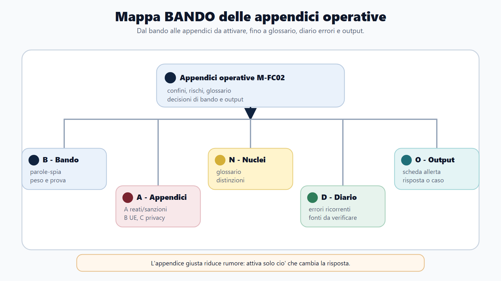
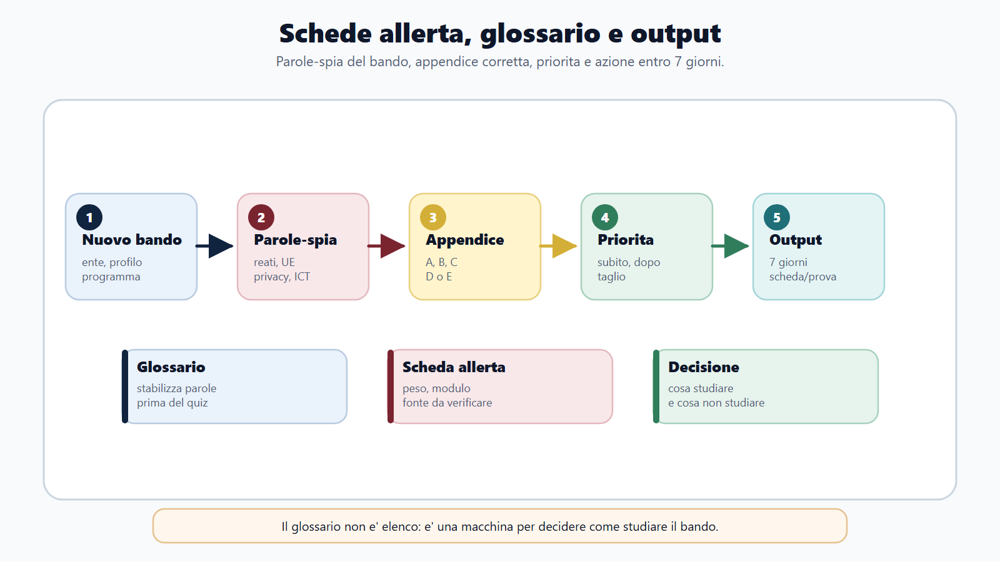
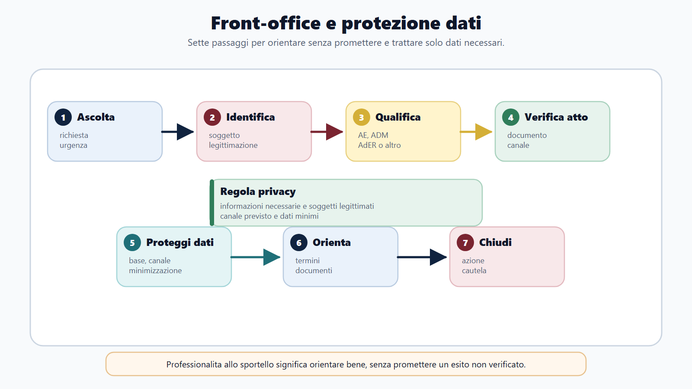
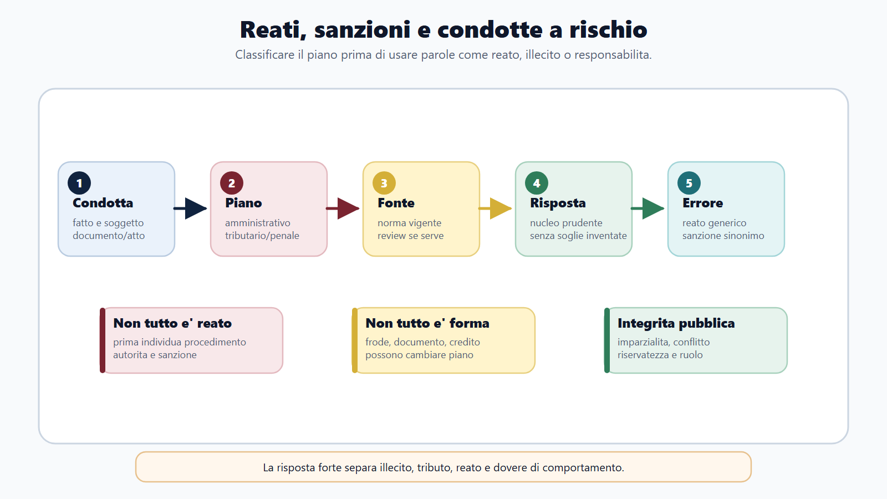
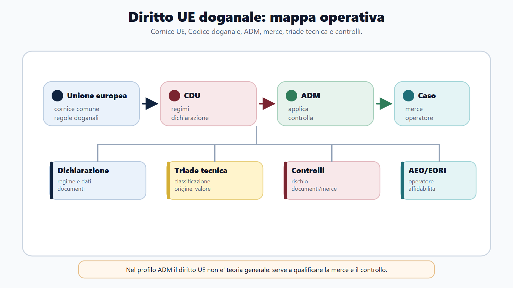

# Appendici operative

## Apertura editoriale

Le appendici raccolgono gli strumenti di lavoro di M-FC02. Usale dopo aver studiato il paragrafo indicato: compila lo strumento e registra gli errori emersi. Per termini, soglie, modelli, software e scadenze mobili annota sempre la fonte ufficiale e la data del controllo.

## Obiettivo del blocco

Al termine saprai richiamare il lessico specialistico e distinguere istituti vicini. Saprai anche ordinare adempimenti e processi, compilare i canvas per i casi e l'orale e programmare il ripasso a partire dagli errori.

## Mappa BANDO

| Passaggio | Domanda | Strumento |
| --- | --- | --- |
| Bando | Che cosa è richiesto e con quale profondità? | Scheda allerta |
| Aree | In quale ciclo si colloca? | Tavole e flussi |
| Nuclei | Quali definizioni e distinzioni? | Glossario |
| Diario | Quale errore devo recuperare? | Piano 1-3-7-14-30 |
| Output | Che cosa devo produrre? | Canvas e checklist orale |

## Protocollo d'uso

1. Leggi il rinvio teorico.
2. Compila senza appunti.
3. Confronta con l'esempio.
4. Registra errore e nuovo tentativo.

**Errore tipico:** trattare il workbook come un riassunto autosufficiente. Se non sai spiegare il motivo di una casella, torna al capitolo.

## Appendice A - Glossario ragionato

### Istruzioni

Per ogni voce spiega che cos'è, a che cosa serve e da quale istituto va distinta. Poi copri la colonna "distinzione" e ricostruiscila a voce.

### Fisco, adempimento e controllo

| Voce | Significato operativo | Distinzione | Rinvio preciso |
| --- | --- | --- | --- |
| Tributo | Genere delle prestazioni tributarie. | Imposta, tassa e contributo sono specie distinte. | [[books/moduli/m-fc02-agenzie-fiscali/chapters/04-diritto-tributario-teoria-imposta#Tributo, imposta, tassa e contributo]] |
| Presupposto | Fatto cui la legge collega il tributo. | Non è la base imponibile. | [[books/moduli/m-fc02-agenzie-fiscali/chapters/04-diritto-tributario-teoria-imposta#Il presupposto d'imposta]] |
| Soggetto passivo | Soggetto cui si riferisce l'obbligazione. | Distinguere da sostituto e responsabile. | [[books/moduli/m-fc02-agenzie-fiscali/chapters/04-diritto-tributario-teoria-imposta#Il soggetto passivo]] |
| Base imponibile | Grandezza cui si applica l'aliquota. | Non è l'imposta dovuta. | [[books/moduli/m-fc02-agenzie-fiscali/chapters/04-diritto-tributario-teoria-imposta#Base imponibile, aliquota e imposta dovuta]] |
| Dichiarazione | Rappresentazione di dati fiscalmente rilevanti. | Non è pagamento. | [[books/moduli/m-fc02-agenzie-fiscali/chapters/06-adempimenti-fiscali-redditi-iva-dichiarazioni#Dichiarazione originaria, correttiva, integrativa e omessa]] |
| Liquidazione | Determinazione periodica del saldo. | Non è accertamento. | [[books/moduli/m-fc02-agenzie-fiscali/chapters/06-adempimenti-fiscali-redditi-iva-dichiarazioni#7. Documento, registri e liquidazione]] |
| Compensazione | Uso di un credito alle condizioni vigenti. | Non è rimborso. | [[books/moduli/m-fc02-agenzie-fiscali/chapters/06-adempimenti-fiscali-redditi-iva-dichiarazioni#Compensazione: gate in sei controlli]] |
| Rivalsa IVA | Addebito dell'imposta secondo il sistema IVA. | Non è detrazione. | [[books/moduli/m-fc02-agenzie-fiscali/chapters/06-adempimenti-fiscali-redditi-iva-dichiarazioni#6. Rivalsa, detrazione e liquidazione]] |
| Detrazione IVA | Meccanismo collegato alla neutralita. | Non è deduzione dal reddito. | [[books/moduli/m-fc02-agenzie-fiscali/chapters/06-adempimenti-fiscali-redditi-iva-dichiarazioni#6. Rivalsa, detrazione e liquidazione]] |
| Controllo automatico | Riscontro automatizzato di dati dichiarati e versati. | Non è controllo sostanziale. | [[books/moduli/m-fc02-agenzie-fiscali/chapters/05-accertamento-controlli-compliance-fiscale#Controllo automatico, formale e sostanziale]] |
| Accertamento | Formazione e motivazione della pretesa. | Non è riscossione. | [[books/moduli/m-fc02-agenzie-fiscali/chapters/05-accertamento-controlli-compliance-fiscale#Accertamento e riscossione non coincidono]] |
| Contraddittorio | Confronto procedimentale nei casi e modi vigenti. | Non è cortesia informativa. | [[books/moduli/m-fc02-agenzie-fiscali/chapters/05-accertamento-controlli-compliance-fiscale#Il contraddittorio informato ed effettivo]] |
| Compliance | Strumenti per corretto adempimento e gestione del rischio. | Non significa assenza di controlli. | [[books/moduli/m-fc02-agenzie-fiscali/chapters/05-accertamento-controlli-compliance-fiscale#Compliance fiscale ordinaria]] |
| Ruolo | Titolo/elenco del percorso ordinario di riscossione. | Non è la cartella notificata. | [[books/moduli/m-fc02-agenzie-fiscali/chapters/07-riscossione-nazionale-lavoro-ader#3. Il percorso ordinario: ruolo, cartella e pagamento]] |
| Rateizzazione | Pagamento dilazionato. | Non cancella il debito. | [[books/moduli/m-fc02-agenzie-fiscali/chapters/07-riscossione-nazionale-lavoro-ader#5. Rateizzazione: pagare nel tempo senza cancellare il debito]] |
| Sospensione | Arresto temporaneo degli effetti. | Non è sgravio. | [[books/moduli/m-fc02-agenzie-fiscali/chapters/07-riscossione-nazionale-lavoro-ader#6. Sospensione, sgravio e ricorso non sono sinonimi]] |

### Dogane, accise e giochi

| Voce | Significato operativo | Distinzione | Rinvio preciso |
| --- | --- | --- | --- |
| Status unionale | Qualificazione doganale della merce. | Non è origine. | [[books/moduli/m-fc02-agenzie-fiscali/chapters/08-dogane-procedure-doganali-adm#2. Territorio doganale e status delle merci]] |
| Dichiarazione doganale | Atto che vincola la merce a un regime. | Non è la fattura. | [[books/moduli/m-fc02-agenzie-fiscali/chapters/08-dogane-procedure-doganali-adm#5. La dichiarazione doganale]] |
| Classificazione | Individuazione della voce tariffaria. | Non è origine o valore. | [[books/moduli/m-fc02-agenzie-fiscali/chapters/08-dogane-procedure-doganali-adm#6. Classificazione tariffaria: che cosa è la merce]] |
| Origine | Legame economico della merce con un Paese. | Non è provenienza fisica. | [[books/moduli/m-fc02-agenzie-fiscali/chapters/08-dogane-procedure-doganali-adm#7. Origine: il legame economico con un Paese]] |
| Valore in dogana | Valore determinato secondo regole doganali. | Non è sempre il prezzo in fattura. | [[books/moduli/m-fc02-agenzie-fiscali/chapters/08-dogane-procedure-doganali-adm#8. Valore in dogana: quanto vale ai fini doganali]] |
| Regime doganale | Destinazione giuridico-procedurale della merce. | Non è mera ubicazione. | [[books/moduli/m-fc02-agenzie-fiscali/chapters/08-dogane-procedure-doganali-adm#9. I principali regimi doganali]] |
| Debito doganale | Obbligazione relativa ai dazi. | Non è ogni costo d'importazione. | [[books/moduli/m-fc02-agenzie-fiscali/chapters/08-dogane-procedure-doganali-adm#10. Debito doganale e garanzia]] |
| Accisa | Tributo indiretto su prodotti e consumi disciplinati. | Separare fatto generatore ed esigibilità. | [[books/moduli/m-fc02-agenzie-fiscali/chapters/09-accise-giochi-monopoli#1. Accisa: struttura del tributo]] |
| Deposito fiscale | Luogo autorizzato per operazioni su prodotti soggetti ad accisa. | Non è un deposito comune. | [[books/moduli/m-fc02-agenzie-fiscali/chapters/09-accise-giochi-monopoli#3. Deposito fiscale, depositario e garanzia]] |
| EMCS | Sistema di controllo della circolazione in sospensione. | Dati operativi da aggiornare. | [[books/moduli/m-fc02-agenzie-fiscali/chapters/09-accise-giochi-monopoli#4. Circolazione in sospensione: EMCS ed e-AD]] |
| Concessione di gioco | Titolo che abilita l'operatore secondo regole e controlli. | Non è autorizzazione generica. | [[books/moduli/m-fc02-agenzie-fiscali/chapters/09-accise-giochi-monopoli#8. Giochi pubblici: riserva statale e concessione]] |

### Catasto e contabilità

| Voce | Significato operativo | Distinzione | Rinvio preciso |
| --- | --- | --- | --- |
| Catasto | Inventario amministrativo degli immobili. | Non prova da solo la proprietà. | [[books/moduli/m-fc02-agenzie-fiscali/chapters/10-catasto-cartografia-estimo-pubblicita-immobiliare#1. Funzione e natura del catasto]] |
| Classamento | Attribuzione di categoria e classe. | Non è stima di mercato. | [[books/moduli/m-fc02-agenzie-fiscali/chapters/10-catasto-cartografia-estimo-pubblicita-immobiliare#4. Classamento e rendita catastale]] |
| DOCFA | Procedura per il catasto fabbricati. | Non è PREGEO. | [[books/moduli/m-fc02-agenzie-fiscali/chapters/10-catasto-cartografia-estimo-pubblicita-immobiliare#5. DOCFA: nuove costruzioni e variazioni urbane]] |
| PREGEO | Procedura di aggiornamento geometrico dei terreni. | Non sostituisce la pubblicità immobiliare. | [[books/moduli/m-fc02-agenzie-fiscali/chapters/10-catasto-cartografia-estimo-pubblicita-immobiliare#6. PREGEO e aggiornamento geometrico]] |
| Patrimonio | Attività e passivita riferite all'azienda. | Non è reddito di periodo. | [[books/moduli/m-fc02-agenzie-fiscali/chapters/11-contabilita-aziendale-economia-impresa-fisco#2. Patrimonio, reddito e finanza]] |
| Partita doppia | Rilevazione dell'operazione sotto due aspetti. | Non è duplicazione del valore. | [[books/moduli/m-fc02-agenzie-fiscali/chapters/11-contabilita-aziendale-economia-impresa-fisco#3. Conti e partita doppia]] |
| Competenza | Imputazione di costi e ricavi al periodo. | Non è cassa. | [[books/moduli/m-fc02-agenzie-fiscali/chapters/11-contabilita-aziendale-economia-impresa-fisco#5. Competenza economica e assestamento]] |
| Reddito imponibile | Grandezza determinata dalle regole fiscali. | Non coincide automaticamente con utile civilistico. | [[books/moduli/m-fc02-agenzie-fiscali/chapters/11-contabilita-aziendale-economia-impresa-fisco#14. Dal bilancio al reddito imponibile]] |

### Integrazione fiscale, accertamento e riscossione

| Voce | Significato operativo | Distinzione | Rinvio preciso |
| --- | --- | --- | --- |
| Imposta | Prelievo collegato a un presupposto economico senza controprestazione individuale. | Non è tassa. | [[books/moduli/m-fc02-agenzie-fiscali/chapters/04-diritto-tributario-teoria-imposta#Tributo, imposta, tassa e contributo]] |
| Tassa | Prelievo collegato a un servizio o attività pubblica riferibile al soggetto. | Non è il prezzo privatistico del servizio. | [[books/moduli/m-fc02-agenzie-fiscali/chapters/04-diritto-tributario-teoria-imposta#Tributo, imposta, tassa e contributo]] |
| Contributo | Prelievo connesso a un vantaggio particolare o a una specifica finalità. | Non coincide con ogni tributo. | [[books/moduli/m-fc02-agenzie-fiscali/chapters/04-diritto-tributario-teoria-imposta#Tributo, imposta, tassa e contributo]] |
| Aliquota | Percentuale o misura applicata alla base imponibile. | Non è la base imponibile. | [[books/moduli/m-fc02-agenzie-fiscali/chapters/04-diritto-tributario-teoria-imposta#Base imponibile, aliquota e imposta dovuta]] |
| Obbligazione tributaria | Vincolo giuridico relativo alla prestazione tributaria. | Non esaurisce l'intero procedimento amministrativo. | [[books/moduli/m-fc02-agenzie-fiscali/chapters/04-diritto-tributario-teoria-imposta#Obbligazione tributaria]] |
| Potere istruttorio | Potere di acquisire elementi rilevanti nei limiti di legge. | Non anticipa automaticamente l'esito. | [[books/moduli/m-fc02-agenzie-fiscali/chapters/05-accertamento-controlli-compliance-fiscale#I poteri istruttori]] |
| Motivazione | Esposizione dei presupposti e delle ragioni dell'atto. | Non è una formula di stile. | [[books/moduli/m-fc02-agenzie-fiscali/chapters/05-accertamento-controlli-compliance-fiscale#La prova e la motivazione]] |
| Autotutela | Riesame amministrativo dell'atto secondo presupposti e limiti vigenti. | Non è ricorso giurisdizionale. | [[books/moduli/m-fc02-agenzie-fiscali/chapters/05-accertamento-controlli-compliance-fiscale#Autotutela, definizione e tutela giurisdizionale]] |
| Definizione | Chiusura del rapporto mediante uno strumento previsto dall'ordinamento. | Non coincide con autotutela. | [[books/moduli/m-fc02-agenzie-fiscali/chapters/05-accertamento-controlli-compliance-fiscale#Autotutela, definizione e tutela giurisdizionale]] |
| Tax control framework | Sistema interno di governo e controllo del rischio fiscale. | Non è un singolo controllo dell'ufficio. | [[books/moduli/m-fc02-agenzie-fiscali/chapters/05-accertamento-controlli-compliance-fiscale#Adempimento collaborativo e tax control framework]] |
| Cartella di pagamento | Atto notificato nel percorso ordinario di riscossione. | Non è il ruolo. | [[books/moduli/m-fc02-agenzie-fiscali/chapters/07-riscossione-nazionale-lavoro-ader#3. Il percorso ordinario: ruolo, cartella e pagamento]] |
| Accertamento esecutivo | Atto che concentra accertamento e titolo per la riscossione nei casi previsti. | Non elimina la distinzione funzionale tra enti e fasi. | [[books/moduli/m-fc02-agenzie-fiscali/chapters/07-riscossione-nazionale-lavoro-ader#4. L'accertamento esecutivo e l'avviso di presa in carico]] |
| Presa in carico | Comunicazione con cui AdER informa il debitore di avere ricevuto in affidamento il carico. | È successiva all'affidamento del carico: non coincide con esso ne' con una nuova liquidazione del tributo. | [[books/moduli/m-fc02-agenzie-fiscali/chapters/07-riscossione-nazionale-lavoro-ader#4. L'accertamento esecutivo e l'avviso di presa in carico]] |
| Sgravio | Eliminazione totale o parziale del carico da parte dell'ente competente. | Non è sospensione temporanea. | [[books/moduli/m-fc02-agenzie-fiscali/chapters/07-riscossione-nazionale-lavoro-ader#6. Sospensione, sgravio e ricorso non sono sinonimi]] |
| Misura cautelare | Presidio del credito prima o fuori dall'espropriazione nei casi previsti. | Non è esecuzione forzata. | [[books/moduli/m-fc02-agenzie-fiscali/chapters/07-riscossione-nazionale-lavoro-ader#7. Misure cautelari ed esecuzione forzata]] |
### Integrazione dogane, accise, giochi e catasto

| Voce | Significato operativo | Distinzione | Rinvio preciso |
| --- | --- | --- | --- |
| Dichiarante doganale | Soggetto che presenta la dichiarazione in proprio nome o per conto altrui. | Non coincide sempre con l'importatore. | [[books/moduli/m-fc02-agenzie-fiscali/chapters/08-dogane-procedure-doganali-adm#3. I soggetti della dichiarazione]] |
| Svincolo | Atto che rende la merce disponibile per il regime dichiarato. | Non è il mero arrivo fisico. | [[books/moduli/m-fc02-agenzie-fiscali/chapters/08-dogane-procedure-doganali-adm#4. Dall'arrivo allo svincolo]] |
| Immissione in libera pratica | Regime che attribuisce alle merci non unionali lo status unionale dopo gli adempimenti dovuti. | Non equivale sempre all'immissione in consumo fiscale. | [[books/moduli/m-fc02-agenzie-fiscali/chapters/08-dogane-procedure-doganali-adm#9. I principali regimi doganali]] |
| Esportazione | Regime applicabile all'uscita di merci unionali secondo le regole doganali. | Non è una semplice spedizione commerciale. | [[books/moduli/m-fc02-agenzie-fiscali/chapters/08-dogane-procedure-doganali-adm#9. I principali regimi doganali]] |
| Garanzia doganale | Presidio del pagamento potenziale o sorto del debito doganale. | Non è il debito stesso. | [[books/moduli/m-fc02-agenzie-fiscali/chapters/08-dogane-procedure-doganali-adm#10. Debito doganale e garanzia]] |
| Fatto generatore dell'accisa | Evento che fa nascere il rapporto impositivo. | Non coincide necessariamente con l'esigibilità. | [[books/moduli/m-fc02-agenzie-fiscali/chapters/09-accise-giochi-monopoli#2. Fatto generatore ed esigibilità]] |
| Esigibilità dell'accisa | Momento in cui l'accisa deve essere pagata. | Non è il fatto generatore. | [[books/moduli/m-fc02-agenzie-fiscali/chapters/09-accise-giochi-monopoli#2. Fatto generatore ed esigibilità]] |
| Regime sospensivo | Assetto nel quale l'accisa non è ancora esigibile alle condizioni previste. | Non è un'esenzione definitiva. | [[books/moduli/m-fc02-agenzie-fiscali/chapters/09-accise-giochi-monopoli#4. Circolazione in sospensione: EMCS ed e-AD]] |
| e-AD | Documento amministrativo elettronico della circolazione in sospensione. | Non è una fattura commerciale. | [[books/moduli/m-fc02-agenzie-fiscali/chapters/09-accise-giochi-monopoli#4. Circolazione in sospensione: EMCS ed e-AD]] |
| Filiera del gioco | Insieme dei soggetti e passaggi della raccolta e del controllo. | Non coincide con il solo concessionario. | [[books/moduli/m-fc02-agenzie-fiscali/chapters/09-accise-giochi-monopoli#9. Rete fisica, rete a distanza e filiera]] |
| Rendita catastale | Valore fiscale-amministrativo derivante dal classamento dei fabbricati. | Non è il prezzo di mercato. | [[books/moduli/m-fc02-agenzie-fiscali/chapters/10-catasto-cartografia-estimo-pubblicita-immobiliare#4. Classamento e rendita catastale]] |
| Visura catastale | Documento informativo su identificativi, intestazioni e dati censuari. | Non prova da sola la titolarita giuridica. | [[books/moduli/m-fc02-agenzie-fiscali/chapters/10-catasto-cartografia-estimo-pubblicita-immobiliare#3. Identificativi e lettura della visura]] |
| Voltura catastale | Aggiornamento delle intestazioni catastali conseguente a una vicenda rilevante. | Non è trascrizione immobiliare. | [[books/moduli/m-fc02-agenzie-fiscali/chapters/10-catasto-cartografia-estimo-pubblicita-immobiliare#7. Voltura e intestazioni catastali]] |
| Trascrizione | Formalita di pubblicità relativa agli atti soggetti a trascrizione. | Non è iscrizione ipotecaria. | [[books/moduli/m-fc02-agenzie-fiscali/chapters/10-catasto-cartografia-estimo-pubblicita-immobiliare#12. Trascrizione, iscrizione e annotazione]] |
| Ispezione ipotecaria | Consultazione dei registri di pubblicità immobiliare. | Non è una visura catastale. | [[books/moduli/m-fc02-agenzie-fiscali/chapters/10-catasto-cartografia-estimo-pubblicita-immobiliare#13. Ispezione ipotecaria e continuità]] |
### Integrazione contabilità, civile e commerciale

| Voce | Significato operativo | Distinzione | Rinvio preciso |
| --- | --- | --- | --- |
| Azienda | Complesso dei beni organizzati per l'esercizio dell'impresa. | Non è l'imprenditore. | [[books/moduli/m-fc02-agenzie-fiscali/chapters/11-contabilita-aziendale-economia-impresa-fisco#1. Azienda, impresa e gestione]] |
| Ricavo | Componente positivo economico di periodo. | Non coincide necessariamente con l'incasso. | [[books/moduli/m-fc02-agenzie-fiscali/chapters/11-contabilita-aziendale-economia-impresa-fisco#4. Ricavo e incasso, costo e pagamento]] |
| Costo | Componente negativo economico di periodo. | Non coincide necessariamente con il pagamento. | [[books/moduli/m-fc02-agenzie-fiscali/chapters/11-contabilita-aziendale-economia-impresa-fisco#4. Ricavo e incasso, costo e pagamento]] |
| Stato patrimoniale | Prospetto della situazione patrimoniale e finanziaria alla data di bilancio. | Non rappresenta il risultato di periodo. | [[books/moduli/m-fc02-agenzie-fiscali/chapters/11-contabilita-aziendale-economia-impresa-fisco#8. Stato patrimoniale]] |
| Conto economico | Prospetto di costi, ricavi e risultato del periodo. | Non descrive da solo i flussi di cassa. | [[books/moduli/m-fc02-agenzie-fiscali/chapters/11-contabilita-aziendale-economia-impresa-fisco#9. Conto economico e margini]] |
| Rendiconto finanziario | Prospetto dei flussi finanziari e della variazione di liquidita. | Non è il conto economico. | [[books/moduli/m-fc02-agenzie-fiscali/chapters/11-contabilita-aziendale-economia-impresa-fisco#10. Rendiconto finanziario e liquidita]] |
| Immobilizzazione | Fattore destinato a utilità pluriennale secondo la sua classificazione. | Non è rimanenza destinata al ciclo corrente. | [[books/moduli/m-fc02-agenzie-fiscali/chapters/11-contabilita-aziendale-economia-impresa-fisco#11. Rimanenze, immobilizzazioni, crediti e fondi]] |
| Fondo rischi e oneri | Posta riferita a passivita di natura determinata, incerte nell'importo o nella data. | Non è una riserva di patrimonio netto. | [[books/moduli/m-fc02-agenzie-fiscali/chapters/11-contabilita-aziendale-economia-impresa-fisco#11. Rimanenze, immobilizzazioni, crediti e fondi]] |
| Capacità giuridica | Attitudine a essere titolare di situazioni giuridiche. | Non è capacità di agire. | [[books/moduli/m-fc02-agenzie-fiscali/chapters/12-civile-commerciale-applicati-fisco-dogane-riscossione#1. Rapporto giuridico e soggetti]] |
| Rappresentanza | Potere di produrre effetti nella sfera giuridica altrui. | Non è mera assistenza materiale. | [[books/moduli/m-fc02-agenzie-fiscali/chapters/12-civile-commerciale-applicati-fisco-dogane-riscossione#1. Rapporto giuridico e soggetti]] |
| Adempimento | Esecuzione esatta della prestazione dovuta. | Non è qualunque comportamento del debitore. | [[books/moduli/m-fc02-agenzie-fiscali/chapters/12-civile-commerciale-applicati-fisco-dogane-riscossione#3. Adempimento, inadempimento e mora]] |
| Responsabilità patrimoniale | Assoggettamento del patrimonio del debitore alla garanzia delle obbligazioni. | Non coincide con una specifica garanzia reale. | [[books/moduli/m-fc02-agenzie-fiscali/chapters/12-civile-commerciale-applicati-fisco-dogane-riscossione#9. Garanzia patrimoniale e garanzie specifiche]] |
| Contratto | Accordo diretto a costituire, regolare o estinguere un rapporto patrimoniale. | Non è un atto amministrativo. | [[books/moduli/m-fc02-agenzie-fiscali/chapters/12-civile-commerciale-applicati-fisco-dogane-riscossione#6. Contratto: formazione ed effetti]] |
| Autonomia patrimoniale | Separazione, di intensita variabile, tra patrimonio sociale e personale. | Non è identica in tutte le società. | [[books/moduli/m-fc02-agenzie-fiscali/chapters/12-civile-commerciale-applicati-fisco-dogane-riscossione#11. Società e autonomia patrimoniale]] |
| Insolvenza | Incapacita di soddisfare regolarmente le obbligazioni, manifestata da inadempimenti o da altri fatti esteriori. | Non coincide con una singola difficoltà di liquidita. | [[books/moduli/m-fc02-agenzie-fiscali/chapters/12-civile-commerciale-applicati-fisco-dogane-riscossione#12. Crisi d'impresa: box di allerta]] |
**Esempio compilato:** origine = legame economico con un Paese; funzione = trattamento doganale; distinzione = provenienza; rinvio = capitolo 8, paragrafo 7.

**Errore tipico:** recitare una definizione senza la distinzione, dove spesso nasce il distrattore.

## Appendice B - Tavole di confronto

### Adempimento, accertamento e riscossione

| Fase | Domanda | Output | Rinvio |
| --- | --- | --- | --- |
| Adempimento | Che cosa dichiara/liquida/versa il contribuente? | dichiarazione e pagamento | [[books/moduli/m-fc02-agenzie-fiscali/chapters/06-adempimenti-fiscali-redditi-iva-dichiarazioni#Il ciclo dell'adempimento fiscale]] |
| Controllo | Quale anomalia e quale potere? | esito istruttorio | [[books/moduli/m-fc02-agenzie-fiscali/chapters/05-accertamento-controlli-compliance-fiscale#Dal dato al controllo]] |
| Accertamento | Come si forma la pretesa? | atto motivato | [[books/moduli/m-fc02-agenzie-fiscali/chapters/05-accertamento-controlli-compliance-fiscale#Lo schema di atto e l'atto finale]] |
| Riscossione | Come si recupera il dovuto? | carico/cartella/seguito | [[books/moduli/m-fc02-agenzie-fiscali/chapters/07-riscossione-nazionale-lavoro-ader#2. Accertamento e riscossione: la separazione essenziale]] |

**Istruzioni:** per un caso indica fatto, soggetto, documento ed esito di ogni fase.

**Esempio:** una differenza dichiarazione-versamento apre prima una verifica; non produce da sola una cartella.

**Errore tipico:** saltare direttamente da anomalia a esecuzione.

### Classificazione, origine e valore

| Domanda | Concetto | Rinvio |
| --- | --- | --- |
| Che cosa è? | classificazione | [[books/moduli/m-fc02-agenzie-fiscali/chapters/08-dogane-procedure-doganali-adm#6. Classificazione tariffaria: che cosa è la merce]] |
| Dove è originaria secondo le regole? | origine | [[books/moduli/m-fc02-agenzie-fiscali/chapters/08-dogane-procedure-doganali-adm#7. Origine: il legame economico con un Paese]] |
| Quanto vale ai fini doganali? | valore | [[books/moduli/m-fc02-agenzie-fiscali/chapters/08-dogane-procedure-doganali-adm#8. Valore in dogana: quanto vale ai fini doganali]] |

**Istruzioni:** scrivi tre risposte autonome.

**Esempio:** merce spedita da A, lavorata in B e importata: spedizione, origine, classificazione e valore non coincidono.

**Errore tipico:** usare il Paese di spedizione come origine.

### Catasto e pubblicità immobiliare

| Area | Risponde a | Non dimostra | Rinvio |
| --- | --- | --- | --- |
| Catasto | identificativi, classamento, rendita | proprietà | [[books/moduli/m-fc02-agenzie-fiscali/chapters/10-catasto-cartografia-estimo-pubblicita-immobiliare#1. Funzione e natura del catasto]] |
| Pubblicità | formalita e vicende giuridiche | correttezza catastale | [[books/moduli/m-fc02-agenzie-fiscali/chapters/10-catasto-cartografia-estimo-pubblicita-immobiliare#11. Pubblicità immobiliare: funzione civilistica]] |

**Istruzioni:** classifica la domanda prima di scegliere documento e ufficio.

**Esempio:** visura catastale e ispezione ipotecaria rispondono a domande diverse.

**Errore tipico:** trattare l'intestazione catastale come prova definitiva della proprietà.

## Appendice C - Scadenziario dichiarazioni, IVA e redditi

| Campo | Compilazione |
| --- | --- |
| Adempimento e soggetto | |
| Periodo di riferimento | |
| Evento iniziale | |
| Termine vigente | |
| Fonte/paragrafo | |
| Data del controllo | |
| Modello/canale | |
| Esito atteso | |
| Correzione/rimedio | |

**Istruzioni:** compila evento, soggetto e fonte prima della data. Rinvio: [[books/moduli/m-fc02-agenzie-fiscali/chapters/06-adempimenti-fiscali-redditi-iva-dichiarazioni#Il ciclo dell'adempimento fiscale]].

**Esempio:** "liquidazione IVA periodica"; periodo e termine = da verificare per il soggetto; fonte consultata il __/__/____; esito = liquidazione e versamento secondo disciplina vigente.

**Errore tipico:** ricordare una data senza soggetto, periodo e fonte.

### Checklist redditi e dichiarazioni

- [ ] Ho identificato soggetto e categoria reddituale?
- [ ] Ho distinto utile, reddito imponibile e imposta?
- [ ] Ho separato dichiarazione, liquidazione e versamento?
- [ ] Ho verificato modello, canale e periodo?
- [ ] Ho identificato correzione o rimedio applicabile?

**Rinvii:** [[books/moduli/m-fc02-agenzie-fiscali/chapters/06-adempimenti-fiscali-redditi-iva-dichiarazioni#Imposte sui redditi: qualificare prima di calcolare]]; [[books/moduli/m-fc02-agenzie-fiscali/chapters/06-adempimenti-fiscali-redditi-iva-dichiarazioni#Compensazione: gate in sei controlli]].

**Esempio:** un credito dichiarato non è automaticamente utilizzabile: natura, disponibilita e limiti vanno verificati.

**Errore tipico:** confondere credito esposto, compensazione e rimborso.

### Checklist IVA

- [ ] Presupposti e territorialità?
- [ ] Natura dell'operazione?
- [ ] Rivalsa e condizioni della detrazione?
- [ ] Documento e registrazione?
- [ ] Liquidazione e fonte del termine?

**Rinvio:** [[books/moduli/m-fc02-agenzie-fiscali/chapters/06-adempimenti-fiscali-redditi-iva-dichiarazioni#Operazioni IVA e ciclo degli adempimenti]].

**Esempio:** IVA esposta su un acquisto non implica automaticamente detraibilita.

**Errore tipico:** confondere addebito e diritto alla detrazione.
## Appendice D - Schemi di processo

### Accertamento

`dato -> selezione -> potere -> evidenze -> contraddittorio -> motivazione -> atto -> tutela`

**Istruzioni:** su ogni freccia annota fatto, fonte, competenza e documento.

**Esempio:** uno scostamento apre una verifica; non dimostra da solo la pretesa.

**Errore tipico:** trasformare un indicatore di rischio in prova conclusiva.

**Rinvio:** [[books/moduli/m-fc02-agenzie-fiscali/chapters/05-accertamento-controlli-compliance-fiscale#Dal dato al controllo]].

### Riscossione

`titolo -> carico -> comunicazione/cartella -> pagamento/rate -> sospensione/sgravio -> cautela/esecuzione`

**Istruzioni:** indica chi è competente per ciascun nodo.

**Esempio:** pagamento già eseguito: identificare carico, prova, ente competente e canale senza promettere subito lo sgravio.

**Errore tipico:** usare come sinonimi rateizzazione, sospensione, sgravio e ricorso.

**Rinvio:** [[books/moduli/m-fc02-agenzie-fiscali/chapters/07-riscossione-nazionale-lavoro-ader#6. Sospensione, sgravio e ricorso non sono sinonimi]].

### Dogane

`arrivo -> custodia -> dichiarazione -> controlli -> classificazione/origine/valore -> regime -> debito/garanzia -> svincolo`

**Istruzioni:** annota soggetti e documenti; se un dato manca, scrivi "da verificare".

**Esempio:** per componenti importati motivare separatamente classificazione, origine e valore.

**Errore tipico:** scegliere il regime prima di identificare merce e operazione.

**Rinvio:** [[books/moduli/m-fc02-agenzie-fiscali/chapters/08-dogane-procedure-doganali-adm#4. Dall'arrivo allo svincolo]].

### Accise e giochi

`prodotto/gioco -> fatto generatore -> esigibilità -> soggetto -> regime -> documento/sistema -> controllo`

**Istruzioni:** per i giochi verifica titolo, filiera, canale e tutela; per le accise prodotto, regime ed EMCS.

**Esempio:** ammanco in deposito: ricostruire regime, contabilità, evento, esigibilità ed evidenze.

**Errore tipico:** confondere fatto generatore ed esigibilità.

**Rinvii:** [[books/moduli/m-fc02-agenzie-fiscali/chapters/09-accise-giochi-monopoli#2. Fatto generatore ed esigibilità]]; [[books/moduli/m-fc02-agenzie-fiscali/chapters/09-accise-giochi-monopoli#8. Giochi pubblici: riserva statale e concessione]].

### Catasto

`immobile -> identificativi -> evento tecnico/giuridico -> procedura -> documento -> controllo -> esito`

**Istruzioni:** scegli DOCFA, PREGEO, voltura o formalita solo dopo aver classificato l'evento.

**Esempio:** frazionamento e vendita richiedono verifiche geometriche, catastali e immobiliari distinte.

**Errore tipico:** cercare una sola pratica che risolva ogni profilo.

**Rinvio:** [[books/moduli/m-fc02-agenzie-fiscali/chapters/10-catasto-cartografia-estimo-pubblicita-immobiliare#14. Il lavoro nei servizi Territorio e SPI]].

## Verticale tecnico ADM — merceologia, chimica e accise energetiche

Questo verticale si attiva quando il bando richiede conoscenze tecniche, chimiche o industriali connesse alle funzioni ADM. Negli altri profili serve come quadro di orientamento: non sostituisce il programma specialistico indicato dal bando.

### Dalla merce reale alla classificazione

La **merceologia** studia la merce per ciò che è concretamente: materiali e composizione, funzione, stato di lavorazione, modalità di presentazione e, quando la disciplina lo rende rilevante, impiego o destinazione. Questi elementi permettono di passare dalla descrizione commerciale alla classificazione giuridica. Il nome riportato in fattura è un indizio, non una conclusione.

| Dimensione | Domanda tecnica | Conseguenza nel ragionamento |
| --- | --- | --- |
| composizione | di quali sostanze o materiali è formato il prodotto? | restringe le possibili voci e segnala se occorre un accertamento analitico |
| funzione | che cosa fa il prodotto secondo caratteristiche oggettive? | distingue merci simili per aspetto ma diverse per impiego |
| lavorazione | è materia prima, semilavorato o prodotto finito? | può cambiare la posizione nella nomenclatura |
| presentazione | come è confezionato, dosato o assemblato? | può incidere sulla qualificazione del bene |
| uso rilevante | quale destinazione è documentata e ammessa? | può incidere sul trattamento d'accisa, senza sostituire l'identificazione del prodotto |

La classificazione tariffaria resta distinta da origine e valore. È distinta anche dalla qualificazione ai fini dell'accisa: lo stesso dato tecnico può essere rilevante in entrambi i piani, ma non produce automaticamente la stessa conseguenza.

### Chimica e laboratori: dal fatto tecnico alla decisione

L'analisi chimica serve ad accertare proprietà che documenti e osservazione non chiariscono con sufficiente affidabilità. I laboratori chimici ADM supportano, tra l'altro, classificazione doganale, trattamento fiscale dei prodotti soggetti ad accisa e contrasto alle frodi. Il rapporto analitico descrive un risultato tecnico; la decisione giuridico-fiscale integra quel risultato con nomenclatura, regole applicabili, documenti e fatti del caso.

`descrizione dichiarata -> documentazione tecnica -> caratteristiche osservabili -> eventuale analisi competente -> risultanza tecnica -> classificazione motivata -> conseguenza fiscale`

Questa è una mappa di ragionamento, non un protocollo di campionamento o di laboratorio. In prova non si inventano metodi, quantità, soglie o valori. Si indica quale fatto manca, perché è rilevante e quale accertamento competente può colmarlo.

**Distinzione decisiva:** osservazione, documento e risultato analitico sono fonti di prova; la classificazione è la conclusione motivata che se ne ricava applicando la regola pertinente.

### Mappa minima delle accise energetiche

Per un prodotto energetico non basta domandare «quanto si paga». Prima occorre ricostruire sei elementi:

1. identità e caratteristiche del prodotto;
2. classificazione fiscale applicabile;
3. uso o destinazione documentati;
4. posizione del prodotto, per esempio in regime sospensivo o con accisa assolta;
5. soggetto e luogo autorizzati coinvolti nella fabbricazione, detenzione o circolazione;
6. quantità, documenti ed evento che rende l'accisa esigibile.

La natura del prodotto e il suo uso non coincidono. Un bene tecnicamente identico può richiedere verifiche diverse in ragione della destinazione prevista dalla disciplina; viceversa, dichiarare un uso non modifica da solo la realtà merceologica. Aliquote, esenzioni, codici e condizioni sono dati mobili: si controllano sul Testo unico delle accise e sulle fonti ADM vigenti alla data richiesta.

### Caso guidato

Una partita è dichiarata genericamente come «solvente industriale». La scheda tecnica è incompleta e alcuni dati non concordano con l'aspetto del prodotto. Una risposta corretta non indovina codice e aliquota. Identifica prima composizione, funzione, stato e presentazione; confronta dichiarazione e documenti; segnala l'eventuale necessità di un'analisi competente; separa classificazione doganale e trattamento d'accisa; verifica uso dichiarato, posizione fiscale, soggetti, luogo e documentazione. Solo dopo collega i fatti accertati alla conseguenza giuridica.

**Domanda da commissario:** perché il nome commerciale non basta? Perché può non rappresentare composizione, funzione e lavorazione richieste dalle regole di classificazione; occorrono caratteristiche oggettive verificabili.

**Domanda-trappola:** il certificato di analisi assegna automaticamente la voce tariffaria? No. Accerta proprietà tecniche; la classificazione richiede l'applicazione motivata delle regole giuridiche e della nomenclatura.

**Errore tipico:** saltare dal prodotto descritto all'aliquota, confondendo identità merceologica, classificazione, uso ed esigibilità.

**Mini-esercizio:** per un olio presentato come «lubrificante», scrivi cinque dati tecnici o documentali da verificare e ordinali nella catena fatto-prova-classificazione-conseguenza. Non indicare codice o aliquota se la traccia non offre elementi sufficienti.

**Verifica rapida:** sai distinguere merceologia, analisi e classificazione? Sai spiegare perché classificazione doganale e trattamento d'accisa non coincidono? Sai ricostruire i sei elementi minimi senza inventare dati mobili?
## Appendice E - Canvas compilabili

### Canvas del caso specialistico

| Campo | Compilazione |
| --- | --- |
| Ente e profilo | |
| Fatti certi/dati mancanti | |
| Fase del ciclo | |
| Soggetti e competenze | |
| Fonte e regola | |
| Procedura | |
| Decisione motivata | |
| Errore da evitare | |
| Output e verifica | |

**Istruzioni:** compila i fatti prima della regola. Rinvio: [[books/moduli/m-fc02-agenzie-fiscali/chapters/13-casi-pratici-quiz-orale-agenzie-fiscali#Griglia di risposta per casi pratici]].

**Esempio:** cartella contestata per pagamento: separare fatto da provare, competenza e possibile seguito.

**Errore tipico:** iniziare citando una norma non collegata ai fatti.

### Protocollo di routing "se compare nel bando"

La scheda chiarisce se la materia richiede una breve integrazione del profilo fiscale o il passaggio a un'altra famiglia professionale. La sola presenza della materia nel bando non basta ad aggiungerla a M-FC02.

1. trascrivi la materia con le parole del bando e registra prova, peso e profondità richiesta;
2. collega la materia alle attività effettive del profilo, non soltanto al nome dell'ente;
3. verifica se il nucleo è già completo in M-FC02 o nel volume base;
4. se la materia caratterizza un'altra famiglia, usa il modulo dedicato come destinazione principale;
5. se nessuna destinazione consolidata è pronta, registra un gap editoriale: non sostituirlo con un rinvio generico.

| Segnale nel bando | Decisione di perimetro | Destinazione precisa |
| --- | --- | --- |
| crisi d'impresa essenziale | resta in M-FC02 per distinzione crisi/insolvenza, assetti e segnali; le procedure avanzate richiedono una fonte dedicata | [[books/moduli/m-fc02-agenzie-fiscali/chapters/12-civile-commerciale-applicati-fisco-dogane-riscossione#12. Crisi d'impresa: box di allerta]] |
| organizzazione e gestione del personale | applica il nucleo comune del VOL-01; se il profilo è amministrativo ministeriale, integra il percorso Funzioni centrali | [[books/il-metodo-bando/chapters/pubblico-impiego-e-organizzazione-pa]]; [[books/moduli/m-fc01-ministeri/index]] |
| gare, contratti pubblici, procurement o PNRR | non duplicare la materia in M-FC02 quando ha peso specialistico | [[books/moduli/m-tr02-appalti-pnrr-fondi-ue/index]] |
| ICT, trasformazione digitale o cybersecurity | se la prova tecnica è prevalente, il percorso principale è il modulo digitale | [[books/moduli/m-tr01-ict-trasformazione-digitale/index]] |
| statistica o data analysis | per un richiamo strumentale usa il nucleo indicato dal bando; se la prova è tecnico-statistica, apri un gap di copertura e abbina una fonte dedicata prima della scrittura | [[books/moduli/architettura-moduli-specialistici#Regola madre di copertura v4 - vincolante]] |
| territorio, catasto o servizi di pubblicità immobiliare | resta in M-FC02 quando il profilo appartiene a Territorio/SPI | [[books/moduli/m-fc02-agenzie-fiscali/chapters/10-catasto-cartografia-estimo-pubblicita-immobiliare]] |

**Esempio:** in un profilo ADM informatico con prova tecnica prevalente, M-FC02 fornisce il contesto dell'ente, mentre il percorso specialistico è M-TR01.

**Verifica:** per ogni voce scrivi `materia - peso - prova - famiglia - destinazione`. Se manca una destinazione consolidata, annota `gap da consolidare` e non promettere copertura.

**Errore tipico:** accumulare appendici quando è cambiata la famiglia professionale.

**Rinvio:** [[books/moduli/m-fc02-agenzie-fiscali/chapters/02-bando-decoder-fiscale#Quando M-FC02 non è il modulo principale]].

### Protocollo front-office e protezione dati

Nel front-office il servizio all'utente deve rispettare la protezione dei dati. Prima di rispondere occorre verificare identità e titolo del richiedente, competenza dell'ufficio, finalità, necessità dei dati e sicurezza del canale. Le procedure interne dell'ente restano vincolanti; questa griglia indica quando rispondere, orientare l'utente o chiedere l'intervento di un altro ufficio.

| Passaggio | Domanda | Azione osservabile |
| --- | --- | --- |
| Identificazione | Chi chiede e con quale titolo? | verifica identità e poteri di rappresentanza secondo il canale previsto |
| Competenza | L'ufficio può trattare la richiesta? | separa informazione generale, pratica individuale e competenza di altro ufficio |
| Finalità e dati | Quali dati sono necessari per quella finalità? | usa soltanto i dati pertinenti e non espone informazioni di terzi |
| Canale | Il canale consente identificazione e comunicazione sicura? | interrompe la comunicazione se il canale è inidoneo e indica quello corretto |
| Linguaggio | La risposta è comprensibile e prudente? | distingue fatti verificati, passaggi successivi e aspetti non ancora accertati |
| Tracciabilità | Che cosa deve restare registrato? | documenta richiesta, verifica svolta, risposta o inoltro secondo le regole interne |
| Escalation | Esiste un dubbio su titolo, rischio o competenza? | coinvolge responsabile, ufficio competente o presidio privacy senza improvvisare |

**Caso guidato:** una persona telefona per conoscere la posizione fiscale di un familiare. L'operatore non conferma alcun dato. Accertato che mancano un titolo adeguato e un canale idoneo, spiega la procedura corretta e, quando previsto, registra l'orientamento fornito. Assistere l'utente non significa divulgare informazioni.

**Autoverifica:** prima di chiudere il caso, rispondi a sette domande: identità verificata? titolo sufficiente? ufficio competente? finalità chiara? dati minimizzati? canale idoneo? decisione tracciata?

**Errore tipico:** promettere un esito o comunicare un dato per fare prima. Una risposta chiara descrive il percorso corretto senza anticipare decisioni che l'ufficio non ha ancora adottato.

**Riferimenti:**; [[books/moduli/m-fc02-agenzie-fiscali/chapters/07-riscossione-nazionale-lavoro-ader#9. Front-office: una checklist che evita errori]]; [[books/moduli/m-fc02-agenzie-fiscali/chapters/13-casi-pratici-quiz-orale-agenzie-fiscali#Caso situazionale: utente aggressivo allo sportello]].

## Appendice F - Sanzioni, reati, processo e diritto UE

La tavola aiuta a riconoscere il piano giuridico pertinente e rinvia alla relativa trattazione. La teoria completa si trova nei capitoli 4, 5A, 5B e 8.

| Area | Domanda | Distinzione | Fonte e rinvio |
| --- | --- | --- | --- |
| Sanzione tributaria | Quale violazione, autore, elemento soggettivo e conseguenza? | illecito amministrativo, recupero del tributo e reato sono piani distinti |; [[books/moduli/m-fc02-agenzie-fiscali/chapters/05a-sanzioni-amministrative-reati-tributari]] |
| Reato tributario | Quale condotta, dolo e fattispecie vengono in rilievo? | il rilievo penale richiede presupposti propri e non deriva dal solo debito fiscale |; [[books/moduli/m-fc02-agenzie-fiscali/chapters/05a-sanzioni-amministrative-reati-tributari]] |
| Tutela e processo | Quale atto, rimedio, giudice e fase? | tutela amministrativa, deflazione e processo non coincidono |; [[books/moduli/m-fc02-agenzie-fiscali/chapters/05b-tutela-processo-tributario]] |
| Diritto UE fiscale | Quale fonte UE opera e come si coordina con il diritto interno? | regolamento, direttiva e disciplina nazionale producono effetti diversi |; [[books/moduli/m-fc02-agenzie-fiscali/chapters/04-diritto-tributario-teoria-imposta#Livello 3 - Quadro UE fiscale, IVA e dogane]] |
| Diritto UE doganale | Quale regola unionale e quale complemento nazionale governano la fase? | fonte UE e integrazione nazionale vanno lette nella corretta gerarchia |; [[books/moduli/m-fc02-agenzie-fiscali/chapters/08-dogane-procedure-doganali-adm#1. Le fonti: prima l'Unione, poi il complemento nazionale]] |

**Istruzioni:** chiarisci anzitutto la natura dell'illecito, dell'atto o della fonte. Identifica quindi soggetti, presupposti, fase e conseguenze. Se il quesito coinvolge più piani, esaminali separatamente e nell'ordine in cui operano.

**Esempio:** un'irregolarita dichiarativa può determinare recupero del tributo e conseguenze amministrative; l'eventuale rilievo penale richiede la verifica dei suoi presupposti. La tutela contro l'atto segue ancora un piano distinto.

**Errore tipico:** chiamare "reato" ogni violazione fiscale o usare "ricorso" senza indicare atto, autorità e fase.

Usa la prima mappa per qualificare correttamente la condotta; passa poi alla seconda per individuare la fonte applicabile e il raccordo tra disciplina unionale e nazionale.

## Appendice G - Checklist orale

- [ ] Definizione in una frase.
- [ ] Funzione e fase del ciclo.
- [ ] Distinzione da un istituto vicino.
- [ ] Soggetti e competenze.
- [ ] Conseguenza pratica.
- [ ] Esempio coerente.
- [ ] Dato mobile segnalato, non inventato.
- [ ] Collegamento al profilo.

**Istruzioni:** prepara versioni da 60, 120 e 240 secondi e registrale.

**Esempio:** "accertamento e riscossione": definisci le fasi, distingui atto e titolo, collega soggetti e caso.

**Errore tipico:** elencare norme e sigle senza ragionamento.

**Rinvio:** [[books/moduli/m-fc02-agenzie-fiscali/chapters/13-casi-pratici-quiz-orale-agenzie-fiscali#Struttura della risposta orale]].

| Criterio | 0 | 1 | 2 |
| --- | --- | --- | --- |
| Definizione | assente | incompleta | chiara |
| Distinzione | confusa | implicita | esplicita |
| Sequenza | disordinata | quasi lineare | lineare |
| Esempio | assente | generico | pertinente |
| Prudenza | inventa dati | segnala dubbio | indica fonte |

## Appendice H - Piano di ripasso

| Nucleo | Capitolo | Stato | Giorno 1 | 3 | 7 | 14 | 30 | Errore | Nuovo output |
| --- | --- | --- | --- | --- | --- | --- | --- | --- | --- |
| | | rosso/giallo/verde | | | | | | | |

**Istruzioni:** giorno 1 mappa; giorno 3 quiz/micro-caso; giorno 7 orale; giorno 14 collegamento; giorno 30 simulazione.

**Esempio:** origine doganale: definizione e provenienza; caso; orale; collegamento con classificazione/valore; caso completo.

**Errore tipico:** segnare il ripasso dopo una rilettura passiva.

**Rinvio:** [[books/moduli/m-fc02-agenzie-fiscali/chapters/13-casi-pratici-quiz-orale-agenzie-fiscali#Diario errori fiscale]].

### Piano settimanale compilabile

| Giorno | Richiamo | Applicazione | Output | Correzione |
| --- | --- | --- | --- | --- |
| Lunedi | teoria imposta | classificazioni | quiz | diario |
| Martedi | IVA/redditi | scadenziario | orale | fonte vigente |
| Mercoledi | accertamento | micro-caso | scritto | griglia |
| Giovedi | riscossione | front-office | situazionale | diario |
| Venerdi | dogane/accise | flusso | quiz + orale | glossario |
| Sabato | catasto/contabilita | caso | simulazione | correzione |
| Domenica | errori rossi | recupero | test misto | nuovo piano |
## Da sapere in 5 righe

Usa le appendici dopo aver studiato la teoria. Colloca ogni concetto nella fase corretta e distinguilo dagli istituti vicini. Per scadenze e dati mobili registra fonte e data del controllo. Il canvas deve portare a una decisione verificabile; gli errori emersi guidano i successivi quiz, casi e allenamenti orali.

## Caso guidato integrato

Una traccia presenta dati IVA incoerenti, una merce importata collegata alle operazioni e un successivo problema di pagamento.

1. separa adempimento, controllo, accertamento e riscossione;
2. ricostruisci classificazione, origine e valore;
3. compila il canvas distinguendo fatti certi e mancanti;
4. prepara un orale da 120 secondi;
5. registra l'errore nel piano 1-3-7-14-30.

Una semplice lista di IVA, dogane e riscossione non risolve la traccia. Occorre ricostruire per ciascun piano fonte, soggetto, fase e output, quindi coordinare le sequenze.

## Domanda da commissario

**Come distingue accertamento e riscossione?**

L'accertamento ricostruisce e formalizza la pretesa; la riscossione riguarda pagamento o recupero sulla base del titolo pertinente. Nel caso vanno identificati atto, soggetto competente, fase, garanzie e seguiti.

## Domanda-trappola

**Una scadenza memorizzata l'anno scorso può essere riportata senza verifica?**

No. Va verificata sulla fonte vigente e collegata a soggetto, periodo, modello e data del controllo.

## Errore tipico

Compilare le caselle con parole generiche come "controllo" o "ricorso". Ogni casella deve identificare almeno un fatto, una fonte, una competenza, un documento o una decisione.

## Mini-esercizio

Scegli un nucleo rosso e produci una voce di glossario, una tavola, un canvas, un orale da 120 secondi e la prima riga del piano di ripasso. Se compare un dato mobile, aggiungi fonte e data.

## Note di review

- Verificare prima della pubblicazione termini, modelli, sistemi, aliquote, soglie, concessioni, prassi e procedure telematiche.
- Le tavole dell'appendice F sono presidi di riconoscimento; la completezza dipende dai capitoli 4, 5A, 5B e 8 e dalle relative review specialistiche.
- DOCFA, PREGEO, procedure doganali e strumenti contabili richiedono review specialistica umana.
- Il protocollo front-office applica il nucleo comune senza duplicarlo; prima della pubblicazione vanno verificati GDPR, procedure interne dell'ente e anchor verso il VOL-01.
- Non inserire giurisprudenza puntuale finche' non esiste una banca giurisprudenziale consolidata nel wiki.
