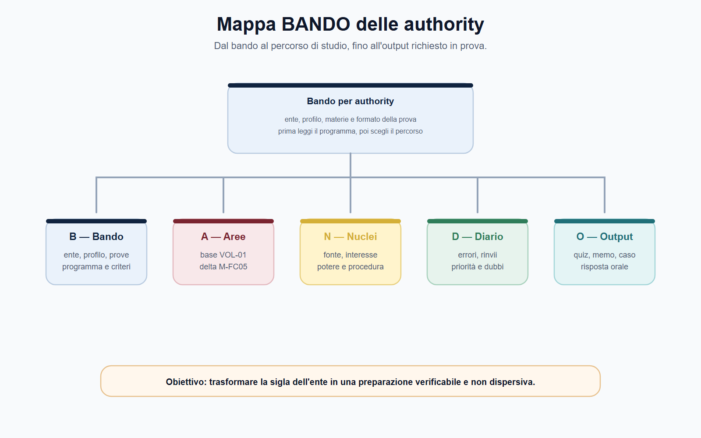
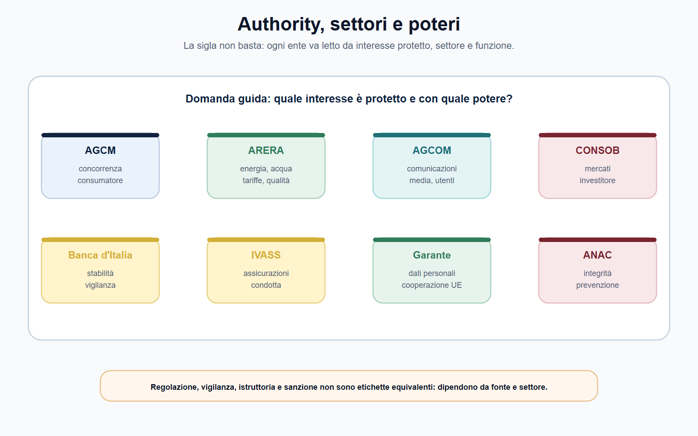
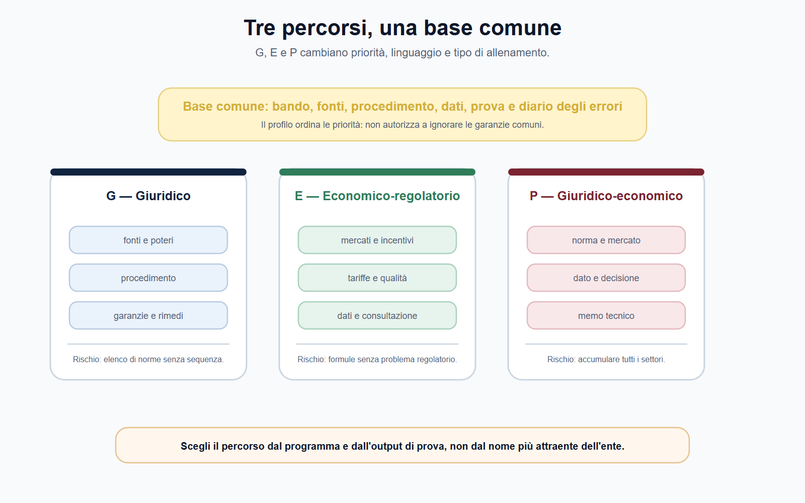
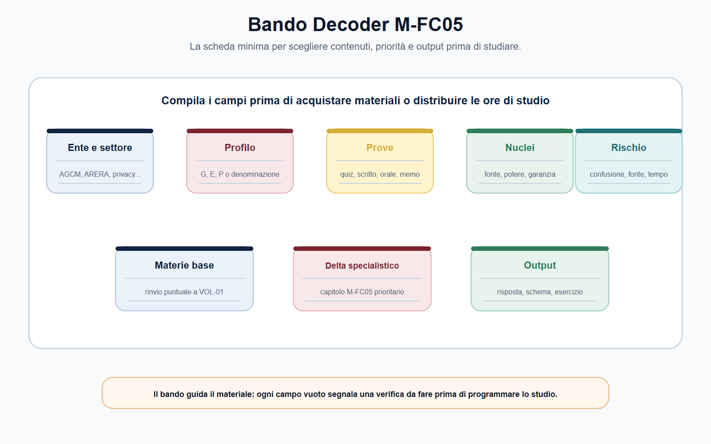
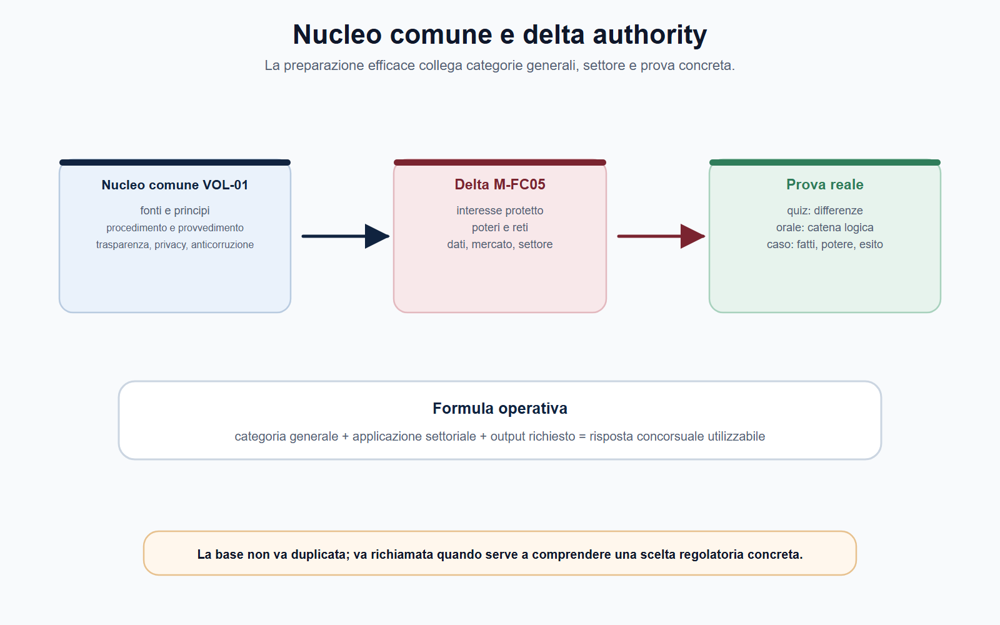

# Le authority viste dal candidato

## Specifica struttura madre

### Obiettivo

Costruire la mappa iniziale del VOL-05: distinguere autorità, settore, fonte del potere, profilo concorsuale, prova e output richiesto. Il capitolo non anticipa la disciplina analitica dei singoli comparti; insegna a scegliere il percorso di studio corretto.

### Nuclei

- Funzione delle authority e differenza rispetto a ministero, ente pubblico e amministrazione ordinaria.
- Catena di lettura: fonte attributiva, interesse protetto, potere, procedimento, decisione e controllo.
- Profili G, E e P e relativi percorsi.
- Lettura dei bandi e separazione tra materie comuni VOL-01 e contenuti specialistici VOL-05.
- Metodo BANDO applicato alle prove delle authority.

### Output operativo

Mappa authority–settore–potere; Bando Decoder M-FC05; risposta orale introduttiva; griglia di priorità del piano di studio.

### Riferimenti consolidati

- [[sources/vol-05-dossier-editoriale-authority-regolazione-v4]]
- [[sources/vol-05-bandi-authority-2022-2025]]
- [[sources/authority-indipendenti-leggi-istitutive]]
- [[sources/regolazione-ue-digitale-e-finanziaria-vol-05]]
- [[topics/authority-indipendenti-regolazione]]
- [[entities/agcm]], [[entities/arera]], [[entities/agcom]], [[entities/consob]]

## Scheda di lavoro

Il candidato che legge la parola *authority* tende a commettere uno di due errori. Il primo è considerare tutte le autorità identiche e studiare un elenco di sigle. Il secondo è isolarsi in un solo settore senza capire quale parte del metodo, del procedimento e dell'economia della regolazione sia riutilizzabile. Entrambi gli errori fanno perdere tempo.

La domanda che orienta il capitolo è questa:

> quale interesse tutela l'autorità indicata dal bando, con quali poteri e attraverso quale tipo di lavoro dovrò dimostrare di ragionare?

## Testo editoriale

### Apertura editoriale

Un concorso in un'autorità indipendente non richiede soltanto di ricordare una legge istitutiva o di riconoscere il nome di un ente. Richiede di entrare nel punto di vista di chi regola, vigila, raccoglie dati, istruisce procedimenti, valuta evidenze, ascolta soggetti interessati e adotta o prepara decisioni.

Per questo il primo capitolo non è una rassegna di sigle. È una mappa di lavoro. AGCM, ARERA, AGCOM, CONSOB, Banca d'Italia, IVASS, Garante per la protezione dei dati personali e ANAC operano in settori differenti e dispongono di fonti, organi e poteri non sovrapponibili. Tuttavia, il candidato può riconoscere una struttura ricorrente: una norma attribuisce competenze; un interesse collettivo richiede protezione; un procedimento raccoglie elementi e garantisce il contraddittorio; un provvedimento o un atto di regolazione produce effetti; un giudice o altra sede di controllo verifica la legittimità dell'azione.

Studiare questa struttura consente di non iniziare dal capitolo sbagliato. Un profilo giuridico AGCM deve mettere al centro concorrenza, tutela del consumatore, istruttoria e decisione. Un profilo economico-regolatorio ARERA deve collegare mercato, tariffa, qualità del servizio, dati e consultazione. Un profilo misto AGCOM, CONSOB, Banca d'Italia o IVASS deve saper unire fonti, poteri, analisi e comunicazione tecnica. La stessa base metodologica serve a tutti; la selezione delle materie, invece, dipende dal bando.

### Obiettivo operativo del capitolo

Al termine del capitolo devi saper:

1. distinguere il ruolo di un'autorità da quello di un ministero o di un ente che gestisce direttamente un servizio;
2. leggere un bando individuando settore, profilo, prove, materie e output;
3. collegare ciascuna autorità alla sua fonte attributiva, all'interesse protetto e ai principali poteri;
4. separare le materie comuni da riprendere nel VOL-01 dai contenuti specialistici da studiare nel VOL-05;
5. scegliere il percorso G, E o P senza sommare indiscriminatamente tutti i programmi;
6. costruire una risposta orale introduttiva ordinata e verificabile;
7. compilare il Bando Decoder M-FC05 prima di programmare lo studio.

L'obiettivo non è conoscere già tutte le norme dei capitoli successivi. È sapere dove collocarle e quale uso farne in prova.

*Figura 1.1 — La mappa iniziale serve a trasformare il programma del bando in scelte di studio e di prova verificabili.*

### Che cosa osserva un candidato quando incontra un'autorità

La parola *indipendente* non significa che l'autorità agisca fuori dall'ordinamento né che possa decidere senza limiti. L'indipendenza riguarda il modo in cui la legge costruisce l'ente e protegge l'esercizio delle sue funzioni; legalità, competenza, motivazione, trasparenza, garanzie procedimentali e controllo restano essenziali.

Per prepararti, non chiederti subito: «Quali articoli devo memorizzare?». Parti da sei domande.

| Domanda | Che cosa individua | Utilità in prova |
|---|---|---|
| Qual è la fonte attributiva? | La legge o la fonte UE che definisce competenze e confini. | Evita di attribuire poteri generici all'ente. |
| Quale interesse è protetto? | Concorrenza, utenti, investitori, stabilità, dati personali, integrità pubblica. | Dà senso alla risposta e al caso pratico. |
| Quale mercato o attività è coinvolta? | Servizi pubblici, comunicazioni, mercati finanziari, trattamenti di dati, contratti. | Permette di riconoscere il settore. |
| Quali poteri sono rilevanti? | Regolazione, vigilanza, richiesta di informazioni, ispezione, sanzione, consultazione. | Trasforma una definizione in un'azione amministrativa. |
| Quale procedimento entra in gioco? | Consultazione, istruttoria, reclamo, segnalazione, controllo o procedura sanzionatoria. | Guida l'ordine della risposta scritta. |
| Quale output chiede il bando? | Quesito, caso, schema di atto, analisi, memo o colloquio. | Decide come allenarti. |

Questa sequenza è il filo conduttore dell'intero volume:

> fonte → interesse protetto → potere → procedimento → decisione o rimedio → controllo.

Non tutte le authority svolgono ogni attività nello stesso modo. Per esempio, l'AGCM è il riferimento per concorrenza e tutela del consumatore; ARERA opera nella regolazione e nel controllo dei servizi di pubblica utilità; AGCOM presidia comunicazioni, media e utenti; CONSOB, Banca d'Italia e IVASS hanno ruoli distinti nel sistema finanziario e assicurativo. Il Garante e ANAC proteggono interessi diversi, rispettivamente dati personali e integrità dell'azione pubblica. Ciò che il candidato deve fare è evitare le analogie automatiche: una stessa parola, come *vigilanza* o *sanzione*, assume contenuti concreti solo dopo avere individuato la fonte e il settore.

### Authority, ministero, ente pubblico: una distinzione utile

Una domanda orale può chiedere perché esistano autorità specializzate. La risposta non deve diventare una formula astratta sull'indipendenza. Occorre spiegare la funzione.

Un ministero partecipa all'indirizzo politico-amministrativo e organizza l'azione governativa nel settore di competenza. Un ente pubblico può svolgere servizi, amministrare risorse, erogare prestazioni o curare interessi definiti dalla legge. Un'autorità di regolazione o vigilanza, invece, è chiamata a presidiare un mercato, un servizio o un interesse sensibile mediante poteri tecnici e giuridici attribuiti dalla legge, con garanzie di autonomia e procedure che rendono controllabile la decisione.

La distinzione non è assoluta e non va trasformata in uno slogan. Nella pratica, le competenze si intrecciano con quelle del legislatore, del Governo, della Commissione europea, delle reti sovranazionali, delle amministrazioni di settore e del giudice. In prova, tuttavia, questa griglia aiuta a esporre la differenza fra chi definisce l'indirizzo generale, chi gestisce attività o servizi e chi esercita funzioni di regolazione, controllo o garanzia.

> **Da sapere in 5 righe**
>
> Un'autorità non è un ministero senza ministro e non è un ente pubblico qualsiasi. Va studiata partendo dalla fonte che le attribuisce competenze. Poi si individua l'interesse protetto, il settore, il potere esercitato e il procedimento. L'indipendenza non elimina legalità, motivazione, garanzie e controllo. In concorso la risposta migliore collega sempre regola, funzione ed effetto pratico.

### La mappa degli enti: non una lista, ma una scelta di percorso

La tabella seguente serve a orientare lo studio. Non sostituisce le pagine istituzionali né il programma di concorso, che restano decisivi per il bando target.

| Autorità o area | Domanda guida | Materie che diventeranno centrali | Percorso prevalente |
|---|---|---|---|
| AGCM | Il comportamento d'impresa altera concorrenza o tutela del consumatore? | Intese, abuso, concentrazioni, pratiche scorrette, istruttoria e impegni. | G, P |
| ARERA | Come si regolano qualità, tariffe e tutela degli utenti in servizi pubblici? | Energia, reti, ambiente, tariffazione, dati, consultazione e contabilità regolatoria. | E, P |
| AGCOM | Quali regole presidiano comunicazioni, media, utenti e piattaforme? | Comunicazioni elettroniche, audiovisivo, pluralismo, utenti, mercati digitali. | G, E, P |
| CONSOB | Come si proteggono trasparenza e correttezza dei mercati? | Emittenti, intermediari, mercati, abusi, tutela dell'investitore e sanzioni. | G, E, P |
| Banca d'Italia e IVASS | Come opera la vigilanza prudenziale e di settore? | Stabilità, rischi, governance, pagamenti, assicurazioni, tutela della clientela. | E, P |
| Garante privacy | Come si protegge il dato personale attraverso poteri di controllo e cooperazione? | Reclami, ispezioni, misure correttive, sanzioni, EDPB e bilanciamento. | G, P |
| ANAC | Come si prevengono rischi corruttivi e si vigila su integrità e contratti? | PNA, trasparenza, whistleblowing, vigilanza e contratti pubblici. | G, P |

La funzione della tabella è selettiva. Se il bando riguarda un funzionario giuridico AGCM, non devi iniziare da Solvency II. Se il profilo è economico-regolatorio ARERA, non puoi rinviare economia della regolazione alla fine dello studio. Se il concorso è AGCOM con prova su nuove tecnologie e lingua, devi aggiungere piattaforme e memo tecnico, ma non trasformare il percorso in un corso di ingegneria informatica. Il volume ti aiuta a fare queste scelte; il bando le rende obbligatorie.

*Figura 1.2 — La sigla dell'ente è solo il punto di partenza: la preparazione nasce dalla relazione tra settore, interesse e potere.*

### I tre profili del modulo M-FC05

Il dossier editoriale individua tre percorsi. Non sono qualifiche universali né sostituiscono le denominazioni dei bandi: sono strumenti per ordinare lo studio.

| Profilo | Identità di studio | Priorità | Rischio da evitare |
|---|---|---|---|
| G — giuridico | Funzionario giuridico AGCM o authority con forte componente procedimentale. | Fonti, poteri, garanzie, istruttoria, rimedi, sanzioni, tutela di utenti e destinatari. | Ridurre tutto a un elenco di norme senza ricostruire il procedimento. |
| E — economico-regolatorio | Funzionario ARERA o profilo con analisi di mercati, tariffe, dati e incentivi. | Economia industriale, regolazione, indicatori, dati, consultazione e qualità. | Studiare formule senza legarle a un problema regolatorio. |
| P — giuridico-economico | Profilo premium cross-authority. | Integrazione tra fonti, istituzioni, mercato, poteri e comunicazione tecnica. | Tentare di imparare tutti i settori allo stesso livello di profondità. |

Un candidato P non è un candidato che accumula programmi. È un candidato che sa passare dalla norma al mercato, dal dato al procedimento e dalla decisione alla sua motivazione. Per questa ragione, il percorso premium richiede più disciplina: prima nucleo comune, poi una verticale principale, infine confronti ragionati con gli altri enti.

*Figura 1.3 — I tre percorsi condividono le basi, ma richiedono pesi diversi per fonti, dati, mercato e output di prova.*

### Mappa BANDO: dal bando al piano di studio

Il Metodo BANDO impedisce di usare il volume come un'enciclopedia. Applica le cinque lettere al tuo concorso.

| Passaggio | Domanda operativa | Azione concreta |
|---|---|---|
| **B — Bando** | Quale ente, profilo, prova e programma sono indicati? | Evidenzia parole del settore, allegati, criteri e forma delle prove. |
| **A — Aree** | Quali aree sono comuni e quali specialistiche? | Separa VOL-01, Modulo 1 comune e verticale settoriale. |
| **N — Nuclei** | Quali concetti non posso confondere? | Scrivi sei parole-chiave: potere, procedimento, garanzia, rimedio, rete, dato. |
| **D — Diario** | Dove rischio errori o dispersione? | Registra confusione fra enti, fonti non verificate e casi non conclusi. |
| **O — Output** | Che cosa devo saper produrre? | Allenati con risposta orale, schema di istruttoria, memo o caso, secondo il bando. |

Compila il Decoder prima di dividere le ore di studio. Un piano corretto non dice soltanto «lunedì diritto, martedì economia». Dice, per esempio: «per il bando ARERA studio tariffa e qualità; verifico il potere dell'Autorità; preparo una mini-analisi di consultazione; registro gli errori sui rapporti tra costo, incentivo e tutela dell'utente».

*Figura 1.4 — Compila la scheda prima di programmare lo studio: un campo vuoto indica una verifica ancora necessaria.*

### Materie comuni e contenuti specialistici

Il VOL-05 è complementare ai capitoli del [[books/il-metodo-bando/index|VOL-01]] su [[books/il-metodo-bando/chapters/costituzione-e-ordinamento-dello-stato|costituzione e ordinamento dello Stato]], [[books/il-metodo-bando/chapters/diritto-amministrativo-per-candidati|diritto amministrativo operativo]], [[books/il-metodo-bando/chapters/pubblico-impiego-e-organizzazione-pa|pubblico impiego e organizzazione della PA]], [[books/il-metodo-bando/chapters/trasparenza-anticorruzione-privacy|trasparenza, anticorruzione e privacy]], [[books/il-metodo-bando/chapters/informatica-pa-digitale-competenze-digitali|informatica e PA digitale]], [[books/il-metodo-bando/chapters/inglese-concorsuale-essenziale|inglese concorsuale essenziale]] e [[books/il-metodo-bando/chapters/logica-comprensione-ragionamento|logica, comprensione e ragionamento]]. Non ripete queste materie nella loro parte fondativa, ma le richiama quando servono per capire un'autorità.

| Base da richiamare nel VOL-01 | Delta specialistico nel VOL-05 |
|---|---|
| Fonti, principi costituzionali e diritto UE introduttivo | Fonti UE di settore, reti e cooperazione tra autorità. |
| Procedimento, provvedimento e tutela amministrativa | Consultazione regolatoria, istruttoria tecnica, impegni, rimedi e controllo della decisione. |
| Pubblico impiego e responsabilità | Regolamenti del personale e specificità organizzative dell'ente, da verificare al cut-off. |
| Privacy, trasparenza e anticorruzione | Garante e ANAC come autorità; bilanciamento, poteri, vigilanza e procedimenti. |
| Inglese e informatica di base | Lessico regolatorio, memo tecnico e lettura di fonti UE; nessuna duplicazione di grammatica o ICT tecnico. |

La regola è semplice: la base risponde alla domanda «che cos'è un procedimento?». Il volume specialistico risponde alla domanda «come funziona un procedimento quando l'autorità raccoglie evidenze, consulta il mercato, istruisce una violazione o adotta una misura nel proprio settore?». Se una spiegazione di base è già completa nel VOL-01, il capitolo rinvia; se il bando chiede l'applicazione settoriale, il capitolo la sviluppa.

*Figura 1.5 — La risposta concorsuale utile nasce dal collegamento tra categoria generale, applicazione settoriale e richiesta concreta della prova.*

### Caso guidato: scegliere il percorso prima di studiare

**Traccia.** Un candidato trova un bando per un profilo economico-regolatorio. Nel programma compaiono energia, mercati, tariffe, regolazione, analisi dei dati, diritto UE e inglese. Decide di acquistare un manuale generale di diritto amministrativo e di ripassare soltanto definizioni di economia.

**Analisi.** Il candidato ha riconosciuto alcune aree, ma non ha costruito il profilo. Diritto amministrativo e inglese sono basi necessarie, ma non sono il centro del programma. Il bando chiede di collegare servizi regolati, incentivi, tariffa, qualità, evidenze e decisione. Il percorso corretto è E: ripasso selettivo dei capitoli del VOL-01 su [[books/il-metodo-bando/chapters/diritto-amministrativo-per-candidati|procedimento]], [[books/il-metodo-bando/chapters/costituzione-e-ordinamento-dello-stato|fonti UE]] e [[books/il-metodo-bando/chapters/inglese-concorsuale-essenziale|inglese]]; [[books/moduli/m-fc05-authority-indipendenti/chapters/04-ciclo-regolatorio-consultazione-air-vir|Capitolo 4]] per il ciclo regolatorio e [[books/moduli/m-fc05-authority-indipendenti/chapters/07-economia-industriale-regolazione-econometria-contabilita|Capitolo 7]] per l'economia; [[books/moduli/m-fc05-authority-indipendenti/chapters/09-arera-energia-gas-acqua-rifiuti-tariffe|Capitolo 9]] per ARERA; [[books/moduli/m-fc05-authority-indipendenti/chapters/15-laboratorio-prove-authority|laboratorio]] su consultazione e analisi tariffaria.

**Soluzione operativa.** Nel Bando Decoder il candidato annota: settore = servizi pubblici regolati; poteri = regolazione e controllo; prova = output analitico da verificare nel bando; nuclei = tariffa, qualità, dati, incentivi, consultazione; esercizio = nota di duecento parole che distingua costo, qualità del servizio e tutela dell'utente. Solo dopo stabilisce il calendario.

### Domanda da commissario

**«Perché nei concorsi delle authority non è sufficiente studiare diritto amministrativo generale?»**

Una risposta efficace può seguire questo ordine: il diritto amministrativo generale fornisce categorie indispensabili — competenza, procedimento, provvedimento, motivazione, partecipazione e tutela — ma l'autorità applica tali categorie in un settore determinato, con poteri, fonti europee, dati e garanzie propri. Il candidato deve quindi conoscere la base e saperla usare per ricostruire il rapporto fra interesse protetto, mercato o attività, istruttoria, decisione e controllo. La differenza non è tra teoria e pratica: è tra regola generale e applicazione specialistica verificabile.

### Domanda-trappola

**«Poiché sono indipendenti, le authority non rispondono a nessuno?»**

No. L'indipendenza non esclude legalità, competenza, trasparenza, motivazione, garanzie procedimentali, rendicontazione e controllo giurisdizionale. La risposta va sempre completata con la fonte e con l'autorità concreta considerata.

### Errore tipico

Confondere la conoscenza di una sigla con la conoscenza di un'autorità. Sapere che ARERA riguarda energia e ambiente o che CONSOB riguarda i mercati non basta. In prova occorre spiegare quale interesse viene protetto, quale potere è esercitato, quale procedimento lo rende legittimo e quale risultato deve essere prodotto.

### Mini-esercizio

Scegli il bando che stai preparando e completa in dieci minuti questa scheda:

1. ente e settore;
2. profilo G, E o P, con una motivazione;
3. tre materie base da recuperare nel VOL-01;
4. tre nuclei specialistici del VOL-05;
5. una fonte primaria da verificare;
6. l'output più probabile della prova;
7. un errore personale da registrare nel Diario.

Poi esponi a voce, in novanta secondi, la catena «fonte, interesse, potere, procedimento, decisione, controllo». Se non riesci a completarla senza saltare dal nome dell'ente alla sanzione, il nucleo del capitolo deve essere ripassato.

### Riferimenti consolidati

- [[sources/vol-05-dossier-editoriale-authority-regolazione-v4]]
- [[sources/vol-05-bandi-authority-2022-2025]]
- [[sources/authority-indipendenti-leggi-istitutive]]
- [[sources/regolazione-ue-digitale-e-finanziaria-vol-05]]
- [[topics/authority-indipendenti-regolazione]]
- [[topics/concorrenza-servizi-comunicazioni-regolati]]
- [[topics/vigilanza-finanziaria-privacy-integrita]]
- [[entities/agcm]], [[entities/arera]], [[entities/agcom]], [[entities/consob]], [[entities/banca-ditalia]], [[entities/ivass]], [[entities/garante-protezione-dati-personali]], [[entities/anac]]

### Note di review

- Verificare, per il bando effettivamente scelto, programma, allegati, forma delle prove, titoli e criteri di valutazione: il campione non è una fonte sostitutiva.
- Aggiornare al cut-off i regolamenti del personale e l'assetto degli organi di ciascuna autorità.
- Acquisire dal portale ufficiale il programma dei bandi Banca d'Italia e ANAC prima di redigere le relative simulazioni specifiche.
