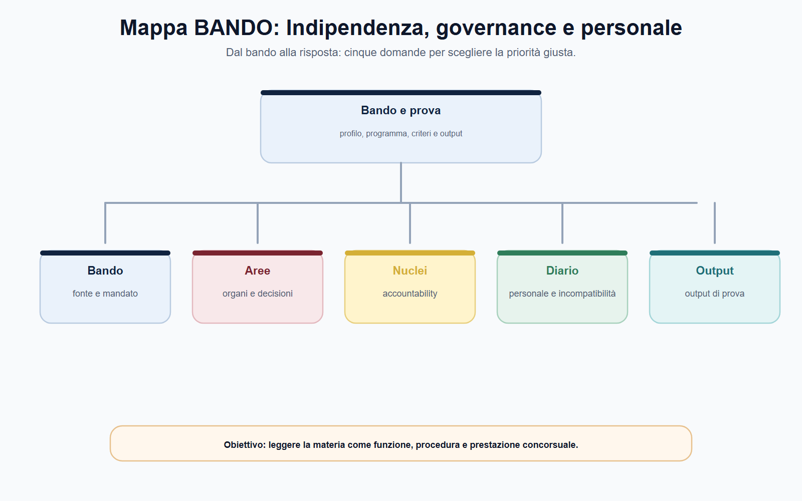
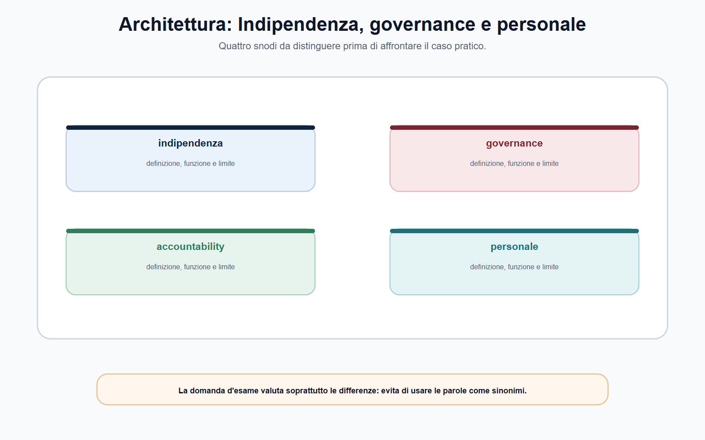
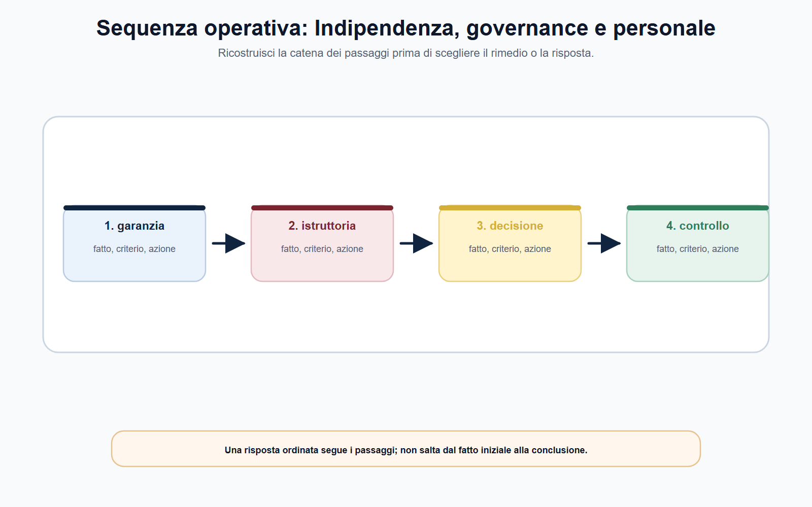
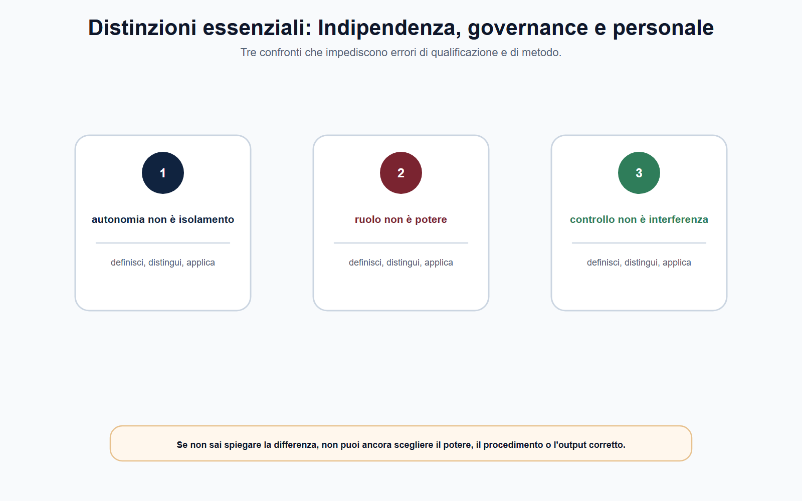
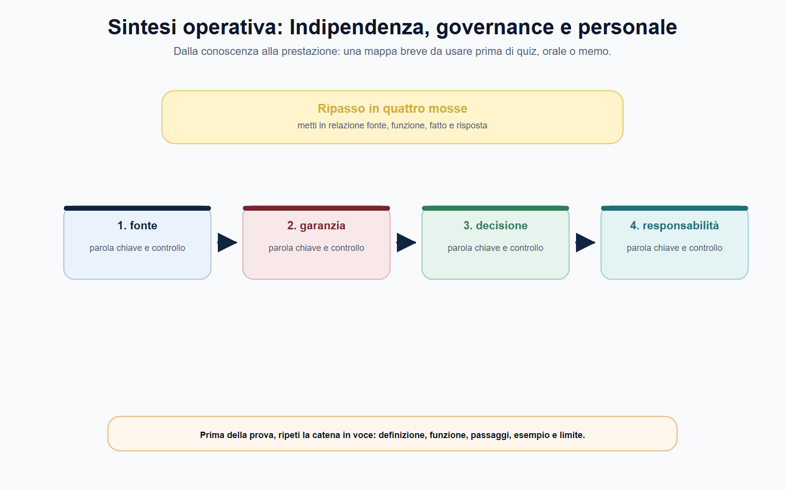

# Indipendenza, governance, accountability e personale

## Scheda di lavoro

**Obiettivo.** Distinguere l'indipendenza funzionale, organizzativa e di giudizio; leggere gli organi, le garanzie, i controlli e le fonti del rapporto di lavoro senza attribuire alle autorità un modello uniforme.

**Domanda guida.** In che modo un'autorità può decidere con autonomia e, nello stesso tempo, restare pienamente responsabile delle proprie decisioni?

**Output operativo.** Una matrice per ricostruire ente, organi, poteri, responsabilità e fonte applicabile al personale; una risposta orale strutturata sul rapporto tra indipendenza e accountability.

> **Regola di metodo.** Per ogni autorità, la sequenza corretta è: fonte istitutiva → organi e poteri → regolamenti interni → trasparenza e controlli → bando e profilo. L'analogia tra enti viene dopo, non prima.

## Testo editoriale

### Apertura editoriale

Quando si parla di autorità indipendenti, il rischio più frequente è trasformare l'aggettivo *indipendente* in una formula generica. Non significa che l'ente sia libero da regole, che possa agire senza motivare o che i suoi funzionari siano sottratti alle responsabilità proprie dell'amministrazione pubblica. Significa, più precisamente, che l'esercizio di determinate funzioni deve essere protetto da interferenze indebite e collocato entro un disegno di garanzie stabilito dalla legge.

Il candidato deve quindi evitare due errori speculari. Il primo consiste nel descrivere l'autorità come un'amministrazione ordinaria, ignorando le particolari garanzie che ne proteggono il giudizio tecnico e regolatorio. Il secondo consiste nel rappresentarla come un soggetto privo di vincoli istituzionali. La lettura corretta tiene insieme autonomia e legalità: l'autorità esercita competenze attribuite, segue procedimenti, motiva le decisioni, rende conoscibile la propria azione e resta soggetta alle forme di controllo previste dall'ordinamento.

Questo equilibrio è decisivo anche nella pratica professionale. Un'istruttoria su un mercato regolato, un provvedimento sanzionatorio, una consultazione pubblica o un atto di vigilanza possono incidere su interessi economici e collettivi rilevanti. Per questo l'indipendenza non è un privilegio dell'ente: è una garanzia per i destinatari delle decisioni, per gli utenti e per il corretto funzionamento del mercato o del servizio interessato.

### Obiettivo operativo del capitolo

Alla fine del capitolo il lettore deve saper fare quattro operazioni:

1. definire l'indipendenza come garanzia dell'azione amministrativa, non come assenza di controllo;
2. ricostruire l'assetto di governance dalla fonte propria di ciascuna autorità;
3. spiegare perché autonomia e accountability sono complementari;
4. individuare la fonte corretta per il personale senza presumere l'applicazione di un unico contratto collettivo o di un unico modello organizzativo.

*Figura 2.1 — Schema di ripasso: usa la mappa per collegare regola, funzione e output di prova.*

### Indipendenza: una garanzia, non un privilegio

La nozione di indipendenza va scomposta. In una risposta d'esame è utile distinguere almeno tre piani, ricordando che la loro disciplina concreta varia secondo l'ente e secondo la relativa legge istitutiva.

Il primo è l'**indipendenza di giudizio**. Le decisioni devono essere assunte sulla base delle competenze attribuite, degli elementi istruttori, delle regole procedimentali e della motivazione. La decisione non può essere sostituita da preferenze estranee al procedimento o da pressioni dei soggetti regolati. Non si tratta di una qualità psicologica del singolo componente: è una garanzia costruita mediante regole su nomine, mandato, incompatibilità, astensione e funzionamento degli organi.

Il secondo è l'**indipendenza funzionale**. L'autorità deve poter svolgere i compiti che la legge le attribuisce — regolazione, vigilanza, accertamento, tutela o sanzione, secondo il proprio perimetro — senza che l'esercizio concreto del potere venga diretto dall'interesse del soggetto vigilato o regolato. L'autonomia, dunque, è sempre finalizzata alla funzione: non esiste come valore astratto e non consente di oltrepassare la competenza attribuita.

Il terzo è l'**indipendenza organizzativa e amministrativa**. Le autorità possono disporre di regole e strutture interne proprie, stabilite nei limiti della fonte istitutiva e degli atti applicabili. Essa non comporta uniformità fra gli enti: organi, uffici, procedure di reclutamento, disciplina del personale e modalità di finanziamento devono essere verificati nel singolo ordinamento settoriale. Proprio per questo una risposta tecnicamente corretta usa espressioni come «secondo la disciplina dell'ente» e indica la fonte da controllare, anziché estendere meccanicamente il modello di un'autorità a tutte le altre.

Le leggi istitutive di AGCM, ARERA e AGCOM mostrano, con configurazioni differenti, che l'indipendenza è inserita in un sistema di competenze definite e di garanzie istituzionali. Le fonti organizzative delle autorità confermano inoltre che l'autonomia di decisione convive con una struttura amministrativa disciplinata e con regole interne di funzionamento. Il punto non è memorizzare un numero di componenti o una denominazione d'ufficio: questi elementi possono cambiare o essere diversi da ente a ente. Il punto è ricostruire la funzione della garanzia e verificarne l'attuale configurazione nella fonte vigente.

*Figura 2.2 — Schema di ripasso: usa la mappa per collegare regola, funzione e output di prova.*

### Governance: chi decide e chi istruisce

Per *governance* si intende l'insieme delle regole che distribuiscono funzioni, responsabilità e flussi decisionali all'interno dell'autorità. Non coincide con il solo organigramma. Comprende, tra l'altro, la composizione degli organi, il regime delle nomine, la durata dell'incarico, le incompatibilità, le attribuzioni decisorie, il ruolo delle strutture e il rapporto tra indirizzo, istruttoria, gestione e controllo.

La prima fonte da esaminare è la legge istitutiva. Da essa si ricavano la natura dell'ente, gli organi essenziali e le garanzie principali. In un secondo momento devono essere letti il regolamento di organizzazione e funzionamento, gli atti di delega e, quando pertinenti, i regolamenti procedimentali. Questo ordine evita un errore ricorrente: dedurre la struttura di un'autorità dalla sola pagina web istituzionale o, al contrario, dal solo bando di concorso. Il bando descrive una selezione e un profilo; non sostituisce la fonte che attribuisce poteri e definisce gli organi.

Un assetto di governance ben letto consente di distinguere le responsabilità. L'organo di vertice, spesso collegiale ma non per questo identico in tutte le autorità, esprime le funzioni che la fonte gli attribuisce: indirizzo, decisione, approvazione di atti generali o provvedimenti, controllo sull'azione dell'ente. Le strutture amministrative curano invece, secondo le competenze assegnate, analisi, istruttoria, supporto tecnico, gestione documentale e attuazione. La separazione non è soltanto formale: permette di capire chi è titolare della decisione e chi contribuisce, con responsabilità proprie, alla preparazione e all'esecuzione dell'atto.

L'esempio ARERA è utile per comprendere il metodo, non per applicare automaticamente il suo modello ad altri enti: il suo regolamento di organizzazione distingue le attribuzioni strategiche e di controllo da quelle di gestione amministrativa. Il candidato deve trarne una lezione generale: ogni volta che studia una governance, individua l'organo competente, l'ufficio istruttore, l'eventuale responsabile del procedimento e l'atto che stabilisce il percorso decisionale.

Anche nomine, durata dell'incarico e incompatibilità vanno lette in chiave funzionale. Le relative garanzie mirano a preservare l'imparzialità e la credibilità delle decisioni, prevenendo sovrapposizioni indebite tra chi decide e interessi che potrebbero condizionarne l'azione. Tuttavia non è corretto trasformare questa finalità in un elenco indifferenziato di divieti: i requisiti, le cause di incompatibilità, gli obblighi di astensione e le relative conseguenze dipendono dalla disciplina specifica. In un concorso, la risposta migliore dichiara la regola generale e rinvia alla fonte dell'ente per il dettaglio applicativo.

*Figura 2.3 — Schema di ripasso: usa la mappa per collegare regola, funzione e output di prova.*

### Accountability: autonomia controllabile

L'indipendenza non riduce l'accountability; la rende ancora più necessaria. Con questo termine si indica la capacità dell'autorità di rendere comprensibile, verificabile e contestabile l'esercizio delle proprie funzioni. Chi dispone di garanzie di autonomia deve infatti dimostrare che le decisioni sono state adottate entro la competenza, sulla base di un'istruttoria adeguata, con motivazione coerente e nel rispetto delle garanzie procedimentali.

L'accountability non si esaurisce in un documento annuale né coincide con la sola pubblicazione di dati. È un sistema composto da più elementi, la cui presenza e intensità dipendono dalla disciplina applicabile:

- la tracciabilità del procedimento e l'individuazione delle competenze;
- la motivazione degli atti e la conoscibilità delle ragioni della decisione;
- gli obblighi di pubblicità e trasparenza previsti per l'ente;
- le relazioni istituzionali e le forme di rendicontazione stabilite dalla legge;
- i controlli amministrativi, contabili o istituzionali previsti;
- la possibilità di tutela davanti al giudice nei casi e nei modi disciplinati dall'ordinamento.

Questi elementi rispondono a una medesima esigenza: rendere l'autonomia compatibile con il principio di legalità e con la tutela delle posizioni giuridiche coinvolte. È quindi improprio dire che un'autorità «risponde solo a se stessa». L'autorità agisce nel quadro della legge e le sue decisioni possono essere sottoposte alle verifiche previste. Ugualmente improprio sarebbe affermare che ogni atto di un'autorità segue lo stesso identico procedimento o la stessa forma di controllo: la disciplina cambia in base al potere esercitato e all'ente competente.

Per il funzionario, accountability significa anche qualità del lavoro quotidiano. Una nota istruttoria deve distinguere fatti, dati, fonti, valutazioni e proposta; un fascicolo deve consentire di ricostruire le attività svolte; una comunicazione esterna deve rispettare competenza, riservatezza e canali formali. Queste attenzioni non sono meri adempimenti burocratici: proteggono l'ente, il decisore e il destinatario dell'atto.

*Figura 2.4 — Schema di ripasso: usa la mappa per collegare regola, funzione e output di prova.*

### Personale: perché non esiste una scorciatoia unica

Nel linguaggio dei concorsi si incontra spesso l'espressione «personale delle autorità» come se indicasse un regime omogeneo. È una semplificazione pericolosa. Le autorità sono diverse per fonte istitutiva, funzioni, organizzazione, modalità di reclutamento, regolamenti interni e disciplina del rapporto di lavoro. Il candidato non deve presumere né un unico contratto collettivo né l'applicazione automatica della disciplina utilizzata da un'altra amministrazione.

La verifica deve seguire una gerarchia pratica di quattro fonti.

| Elemento da verificare | Domanda operativa | Fonte prioritaria |
| --- | --- | --- |
| Base del rapporto | Quale autonomia o quale rinvio disciplina il personale dell'ente? | Legge istitutiva e norme speciali |
| Organizzazione | Quali uffici, ruoli, responsabilità e procedure interne sono previsti? | Regolamento di organizzazione e del personale |
| Trattamento applicabile | Quale disciplina contrattuale o regolamentare governa il rapporto? | Contratto, accordo o regolamento vigente dell'ente |
| Selezione | Quali requisiti, prove e profilo professionale sono richiesti? | Bando, allegati e atti richiamati |

Le fonti ARAN restano importanti per conoscere il lavoro pubblico contrattualizzato e per orientarsi quando la disciplina dell'ente vi rinvia o quando il bando lo richiede. Non sono però una chiave universale. Il loro impiego deve essere motivato dalla pertinenza: prima si individua il regime applicabile, poi si consulta la fonte corrispondente.

Dal punto di vista professionale, il personale concorre a rendere effettive indipendenza e accountability. Chi svolge compiti istruttori o di supporto deve preservare correttezza, riservatezza, imparzialità, tracciabilità e separazione dei ruoli. Ciò vale in particolare quando l'attività riguarda soggetti regolati, informazioni economicamente sensibili, dati personali, procedimenti sanzionatori o decisioni con impatto sul mercato. Le regole specifiche vanno sempre cercate nell'atto applicabile; la competenza richiesta al candidato è saper impostare correttamente questa ricerca.

*Figura 2.5 — Schema di ripasso: usa la mappa per collegare regola, funzione e output di prova.*

### Mappa BANDO

Quando il bando richiama «ordinamento dell'autorità», «organizzazione», «contabilità», «trasparenza», «personale» o «codice di comportamento», non basta studiare una definizione generale. Occorre collegare la voce al documento giusto.

| Voce del bando | Cosa preparare | Errore da evitare |
| --- | --- | --- |
| Indipendenza e organi | Fonte istitutiva, competenze, garanzie di nomina e incompatibilità | Confondere autonomia con assenza di controlli |
| Organizzazione | Regolamento vigente, uffici, attribuzioni e flussi decisionali | Usare un organigramma non aggiornato come fonte normativa |
| Trasparenza e accountability | Pubblicità degli atti, relazioni e forme di tutela previste | Applicare indistintamente gli stessi obblighi a ogni procedimento |
| Personale | Regolamento dell'ente, disciplina del rapporto e bando | Presumere un CCNL unico o un rinvio automatico ad ARAN |

> **Da sapere in cinque righe.** L'autorità indipendente non è priva di vincoli: opera entro competenze legali e con garanzie che proteggono il giudizio. La governance distribuisce decisione, istruttoria, gestione e controllo secondo le fonti dell'ente. L'accountability rende l'autonomia verificabile mediante motivazione, trasparenza, rendicontazione e tutele. Il personale non segue necessariamente una disciplina uniforme: la fonte va individuata ente per ente. Il bando integra, ma non sostituisce, legge e regolamenti.

### Caso guidato: la richiesta informale del soggetto regolato

Un funzionario partecipa alla predisposizione di un'analisi istruttoria relativa a un settore regolato. Un rappresentante di un'impresa interessata, conosciuto in un precedente contesto professionale, chiede informalmente di ricevere una bozza dell'analisi «per segnalare subito eventuali inesattezze» e propone un incontro non verbalizzato.

La richiesta non va affrontata come un semplice problema di cortesia. Il funzionario deve prima verificare se esista un canale procedimentale per interlocuzioni, osservazioni o accesso agli atti e quale sia la fase del procedimento. In assenza di una base formale, non trasmette documenti né anticipa valutazioni istruttorie. Riferisce al responsabile competente secondo le procedure interne, conserva la tracciabilità della comunicazione e usa i canali istituzionali.

Se il rapporto personale con il richiedente può far sorgere un dubbio di imparzialità, il funzionario non decide autonomamente la propria posizione: segnala la circostanza secondo la disciplina applicabile, affinché siano valutati astensione, riassegnazione o altri rimedi previsti. La soluzione non consiste nell'isolarsi dall'interlocuzione legittima, ma nel ricondurla a regole uguali per tutti i destinatari.

Il caso mostra il legame tra i quattro concetti del capitolo. L'indipendenza richiede che l'istruttoria non sia condizionata; la governance identifica chi è competente a gestire il fascicolo; l'accountability impone tracciabilità e correttezza; la disciplina del personale fornisce le regole operative su comportamento, riservatezza e conflitti di interesse.

### Domanda da commissario

**Spieghi il rapporto tra indipendenza e accountability in un'autorità amministrativa indipendente.**

### Risposta orale modello

«L'indipendenza delle autorità non equivale a sottrazione ai vincoli dell'ordinamento. È una garanzia funzionale che protegge l'esercizio delle competenze attribuite dalla legge, attraverso regole su organi, nomine, incompatibilità, organizzazione e procedure. La governance va ricostruita dalla fonte istitutiva e dai regolamenti dell'ente, distinguendo le funzioni decisorie e di indirizzo da quelle istruttorie e gestionali. Proprio perché l'autorità è autonoma, la sua azione deve essere motivata, trasparente e verificabile secondo le forme di accountability e tutela previste. Anche il personale va studiato sulla disciplina della singola autorità: non è corretto presumere un contratto o un regolamento unico per tutti gli enti.»

### Domanda-trappola

**Se l'autorità è indipendente, il Governo può annullarne nel merito un provvedimento con una direttiva politica?**

No. L'indipendenza protegge l'esercizio delle competenze attribuite all'autorità da interferenze di merito estranee alla disciplina applicabile. Ciò non elimina controlli, rimedi e forme di responsabilità previste dall'ordinamento; questi devono essere individuati nella fonte pertinente, non confusi con un potere generale di sostituzione politica.

### Errore tipico

**Errore:** «Le autorità indipendenti non dipendono da nessuno e il loro personale segue il normale contratto delle pubbliche amministrazioni.»

**Correzione:** l'indipendenza è delimitata da legge, competenza, procedimento e controlli. Il regime del personale deve essere accertato nella fonte istitutiva, nei regolamenti e nella disciplina contrattuale o regolamentare propria dell'ente.

### Mini-esercizio di consolidamento

Scegli l'autorità indicata dal tuo bando e completa la matrice seguente, riportando per ogni riga un collegamento o un riferimento puntuale alla fonte vigente:

| Campo | Dato da ricostruire |
| --- | --- |
| Fonte istitutiva | Denominazione, articolo o disposizione rilevante |
| Organo o organi | Composizione e attribuzioni da verificare |
| Regolamento organizzativo | Titolo, data e sede di pubblicazione |
| Accountability | Relazione, pubblicità, controllo o tutela applicabili |
| Personale | Regolamento/accordo/bando da cui ricavare la disciplina |

L'esercizio è svolto correttamente solo quando ogni informazione deriva dalla propria fonte e la data di verifica è annotata. Questa precauzione evita di studiare assetti superati e trasforma la preparazione in una competenza direttamente spendibile nel lavoro.

### Riferimenti consolidati

[[sources/authority-indipendenti-leggi-istitutive]], [[sources/authority-indipendenti-governance-personale-2026-07-24]], [[sources/vol-05-bandi-authority-2022-2025]], [[topics/governance-accountability-personale-authority]].

### Note di review editoriale

Prima della chiusura del volume, verificare alla data di cut-off: composizione effettiva degli organi, regolamenti organizzativi e del personale vigenti, disciplina contrattuale applicabile e bando di destinazione. Il capitolo evita volutamente di indicare dati contingenti non necessari alla comprensione del modello.
