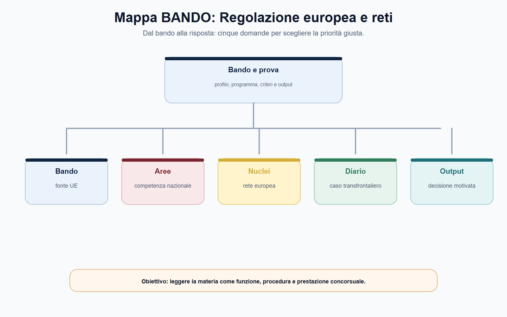
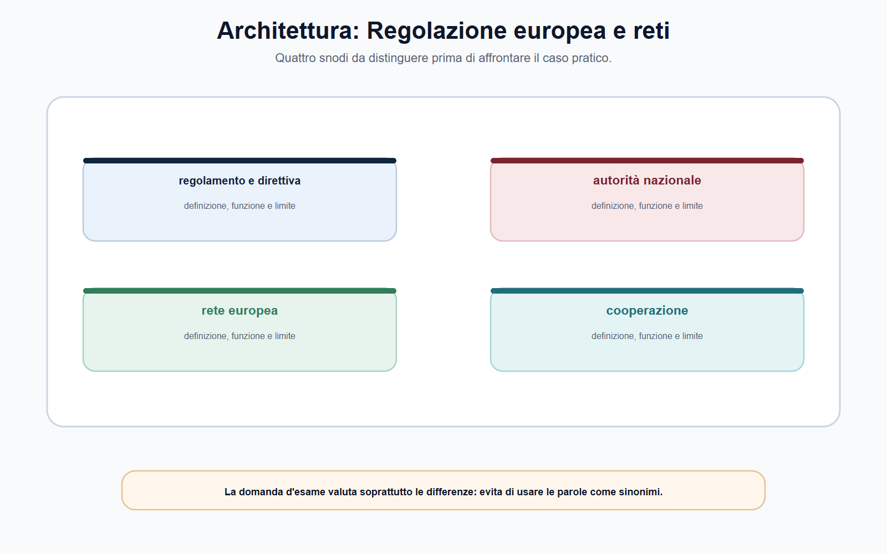
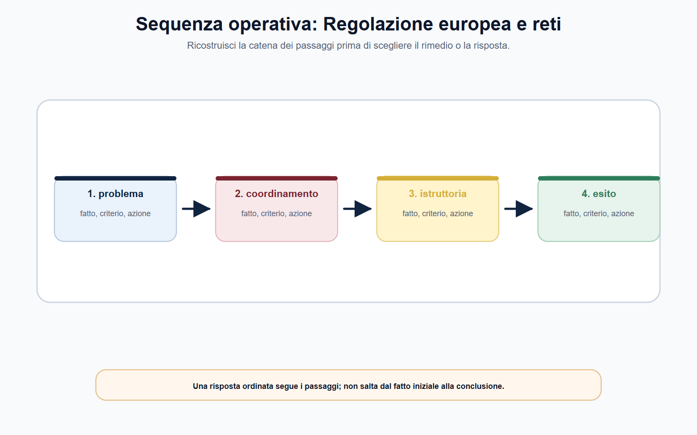
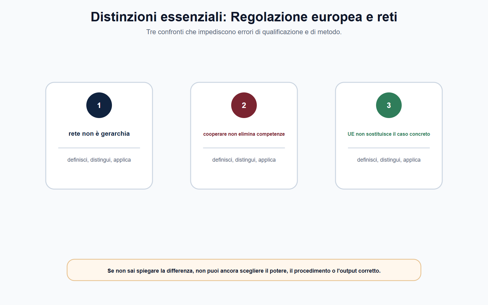
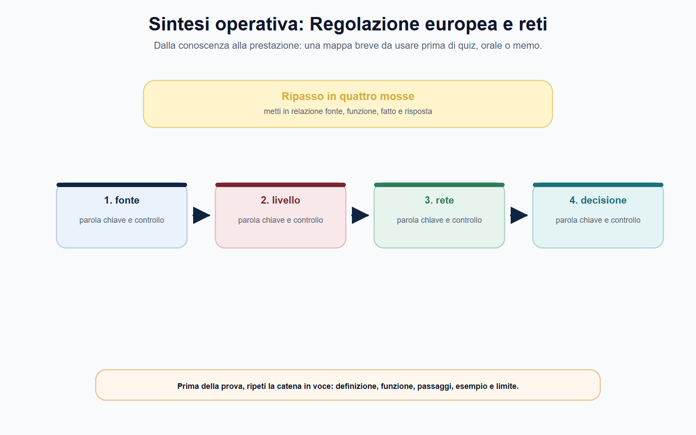

# Regolazione europea multilivello e reti delle autorità

## N-MF05-03-01 · Quadro e criterio di lettura

**Obiettivo.** Ricostruire il rapporto tra fonte dell'Unione, Autorità nazionale, istituzione o organismo europeo e rete di cooperazione, senza sovrapporre competenze nazionali e sovranazionali.

**Domanda guida.** Quando un problema ha dimensione europea, chi decide: la Commissione, l'agenzia o board europeo, l'Autorità italiana, oppure più soggetti secondo un procedimento coordinato?

**Output operativo.** Una mappa «UE–Italia» per individuare fonte, potere, autorità competente, rete applicabile, flusso informativo e rimedio.

> **Regola di metodo.** Non partire dal nome della rete. Parti dall'atto che disciplina il caso: solo dopo puoi stabilire se e come la rete collega le Autorità competenti.

### Apertura editoriale

La regolazione delle Autorità indipendenti non si esaurisce nei confini nazionali. Mercati finanziari, comunicazioni elettroniche, piattaforme, energia, concorrenza e protezione dei dati attraversano stabilmente più Stati membri. Un provvedimento adottato in Italia può incidere su operatori presenti in altri Paesi; un'informazione raccolta in un procedimento nazionale può essere utile in un'indagine coordinata; un regolamento dell'Unione può imporre regole comuni che l'Autorità italiana è chiamata ad applicare entro il proprio perimetro.

Di fronte a questa complessità, la formula «l'Unione decide e l'Italia esegue» è insufficiente. Anche la formula opposta — «l'Autorità nazionale decide sempre da sola» — è errata. Il modello europeo è multilivello: fonti, istituzioni, agenzie, reti e Autorità nazionali operano secondo competenze distribuite. La distribuzione non è identica in tutti i settori; dipende dall'atto applicabile, dal tipo di potere e dalla fase del procedimento.

Il candidato deve quindi imparare a leggere il sistema come una catena di responsabilità. Prima individua la fonte; poi chiarisce quale soggetto esercita il potere; quindi verifica se il caso richiede cooperazione e con quali garanzie; infine ricostruisce l'atto conclusivo e le forme di tutela. Questo metodo evita sia l'eccessiva semplificazione sia il tecnicismo dispersivo.

### Obiettivo operativo del capitolo

Al termine del capitolo il lettore deve saper:

1. distinguere regolamenti, direttive e altri atti dell'Unione per la loro funzione essenziale;
2. spiegare il significato di «regolazione multilivello» senza ridurla a una gerarchia indistinta;
3. riconoscere la funzione delle reti di cooperazione nei principali comparti regolati;
4. impostare correttamente un caso transfrontaliero, individuando competenza, canale di cooperazione, riservatezza e atto finale.



*Figura 3.1 — La tavola orienta la lettura di fonti europee e separa il perimetro dalle eccezioni.*

### Dalla fonte UE al potere concreto

Il primo passaggio è giuridico, non organizzativo. L'articolo 288 del Trattato sul funzionamento dell'Unione europea elenca, tra gli atti dell'Unione, regolamenti, direttive, decisioni, raccomandazioni e pareri. Per la preparazione concorsuale non serve una lezione completa sulle fonti del diritto dell'Unione; serve cogliere una distinzione operativa.

Il **regolamento** ha portata generale, è obbligatorio in tutti i suoi elementi ed è direttamente applicabile in ciascuno Stato membro. Ciò non significa che basti richiamarne il titolo per risolvere qualunque caso. Occorre verificare l'ambito materiale, i destinatari, le disposizioni che attribuiscono compiti alle Autorità, le eventuali misure nazionali di organizzazione o sanzione e gli atti secondari richiamati.

La **direttiva**, invece, vincola lo Stato membro quanto al risultato da raggiungere, lasciando alle autorità nazionali la competenza in ordine a forma e mezzi. In sede di studio, la domanda corretta è: «Quale atto nazionale ha dato attuazione alla direttiva e a quale Autorità attribuisce il compito di applicarla o vigilarne il rispetto?». Non è sufficiente sapere che una materia deriva dal diritto UE; bisogna ricostruire come quella fonte entra nell'ordinamento nazionale.

Le **decisioni** e gli atti di soft law possono essere rilevanti secondo il settore. Linee guida, orientamenti, pareri e standard tecnici non hanno tutti la stessa efficacia né producono automaticamente gli stessi effetti. Per questo, in una prova scritta, è preferibile parlare di «atto applicabile» e specificarne natura e funzione, anziché usare genericamente l'espressione «normativa europea».

La regolazione multilivello nasce proprio da questo intreccio. Un regolamento può disciplinare direttamente obblighi e meccanismi di cooperazione; una direttiva può richiedere un recepimento nazionale; un'agenzia europea può contribuire alla convergenza; un'Autorità italiana può adottare l'atto istruttorio, regolatorio o sanzionatorio previsto dalla propria competenza. Non esiste, dunque, una risposta valida per tutti i settori: la fonte è il punto di partenza che ordina il resto.



*Figura 3.2 — La tavola mette a confronto riparto multilivello e reti di regolatori senza sovrapporli.*

### Multilivello non significa gerarchia indistinta

## N-MF05-03-02 · Istituti e distinzioni

Parlare di sistema multilivello non significa immaginare una scala uniforme, con l'Unione sempre al vertice e le Autorità nazionali sempre in posizione esecutiva. In molti ambiti, il diritto UE distribuisce competenze parallele o complementari. In altri, individua un'autorità capofila, attribuisce poteri diretti a un organismo europeo o impone forme di consultazione e coordinamento. In altri ancora, l'applicazione concreta resta nazionale, ma deve rispettare criteri comuni e canali di cooperazione.

Una risposta ben costruita separa almeno cinque domande:

| Domanda | Che cosa occorre verificare |
| --- | --- |
| Qual è la fonte? | Regolamento, direttiva, decisione o disciplina nazionale di attuazione |
| Qual è il potere? | Regolazione, vigilanza, raccolta dati, istruttoria, decisione, sanzione o coordinamento |
| Chi è competente? | Commissione, organismo UE, Autorità nazionale, giudice o più soggetti secondo il procedimento |
| Quale cooperazione è prevista? | Rete, consultazione, scambio informativo, assistenza reciproca, attività congiunta o meccanismo di coerenza |
| Qual è l'atto finale e il rimedio? | Provvedimento, decisione, parere, misura nazionale o europea; tutela prevista dalla disciplina applicabile |

La tabella non è un esercizio astratto. Aiuta a non confondere l'autorità che coordina con quella che sanziona, il soggetto che emette una linea guida con quello che adotta il provvedimento individuale, la fonte europea con il regolamento interno dell'Autorità. Sono differenze essenziali per leggere un bando e per svolgere un'attività istruttoria corretta.

La stessa cautela vale per il rapporto con il giudice. Il fatto che una questione sia regolata a livello UE non elimina le forme di tutela previste dall'ordinamento nazionale o dall'ordinamento dell'Unione. Il rimedio, il giudice competente e il percorso di impugnazione dipendono dall'atto contestato e dalla disciplina che lo regola. In un tema concorsuale, è sufficiente dichiarare questo principio e rinviare alla fonte settoriale, evitando ricostruzioni processuali non richieste dalla traccia.



*Figura 3.3 — La tavola ricostruisce il passaggio dai fatti alla competenza e alla decisione.*

### Le reti: funzione, non etichetta

Le reti delle Autorità non sono un semplice luogo di incontro. Sono dispositivi di cooperazione costruiti per rendere più coerente l'applicazione delle regole in mercati e servizi che non si fermano alle frontiere nazionali. A seconda del settore, possono consentire o organizzare lo scambio di informazioni, il coordinamento delle indagini, l'allocazione dei casi, l'assistenza reciproca, la definizione di prassi comuni, l'elaborazione di orientamenti o il confronto tecnico.

La rete, però, non cancella la base legale del singolo potere. Un funzionario non può trasmettere dati, anticipare valutazioni o avviare un'attività congiunta solo perché esiste una relazione di collaborazione tra Autorità. Deve verificare il procedimento, il soggetto competente, il canale previsto, il regime di riservatezza e le limitazioni all'uso delle informazioni. La cooperazione efficace non è informale: è documentata, proporzionata e riconducibile alla fonte applicabile.

Nel settore della concorrenza, l'**European Competition Network (ECN)** collega la Commissione europea e le Autorità nazionali della concorrenza. La rete favorisce l'applicazione efficace e coerente delle regole antitrust UE attraverso informazione reciproca su casi e decisioni ipotizzate, coordinamento delle indagini, assistenza e scambio di informazioni. Il suo insegnamento metodologico è particolarmente importante: l'esistenza di competenze parallele non produce sovrapposizione casuale, ma richiede coordinamento e un criterio di adeguata collocazione del caso.

Nelle comunicazioni elettroniche, **BEREC** contribuisce alla coerenza dell'applicazione del quadro UE e assiste Commissione e autorità nazionali di regolazione. Il suo ruolo non deve essere confuso con quello della singola Autorità nazionale: opera a livello europeo per favorire convergenza e funzionamento del mercato interno, mentre le competenze concrete derivano dal quadro normativo e dall'ordinamento dell'Autorità interessata. Per un candidato AGCOM, l'utile domanda non è «BEREC sostituisce AGCOM?», ma «quale atto attribuisce il potere e quale funzione di supporto o coordinamento svolge BEREC?».

Nel settore energetico, **ACER** sostiene e coordina il contributo delle autorità nazionali di regolazione alla realizzazione del mercato interno dell'energia. L'esempio REMIT evidenzia bene la distribuzione dei compiti: ACER raccoglie e analizza dati, monitora il mercato e coopera nei casi transfrontalieri; l'enforcement resta, secondo la disciplina applicabile, in capo alle autorità nazionali che monitorano, indagano e applicano i rimedi previsti nei rispettivi ordinamenti. Il candidato non deve ricordare ogni strumento tecnico: deve comprendere che l'integrazione del mercato richiede dati, cooperazione e responsabilità differenziate.

## N-MF05-03-03 · Poteri, procedura e conseguenze

Nel settore finanziario, il **Sistema europeo di vigilanza finanziaria** collega le Autorità europee di vigilanza — EBA, ESMA ed EIOPA —, il Comitato europeo per il rischio sistemico, il Comitato congiunto e le autorità nazionali competenti. Le Autorità nazionali continuano, in via generale, a vigilare sui singoli intermediari secondo il rispettivo perimetro; le Autorità europee concorrono alla qualità, all'efficienza e all'armonizzazione della regolazione e della vigilanza. Anche qui la formula utile è «ruoli differenziati e coordinati», non «competenza europea che assorbe automaticamente quella nazionale».

Infine, nella protezione dei dati, il **Comitato europeo per la protezione dei dati (EDPB)** sostiene il funzionamento dei meccanismi di cooperazione e coerenza che collegano le Autorità di controllo nazionali. Nei casi transfrontalieri, il GDPR prevede il meccanismo dello sportello unico: l'autorità capofila coopera con le autorità interessate; se il consenso non è raggiunto, la questione può essere deferita all'EDPB per la decisione vincolante prevista dalla disciplina europea. Questo esempio è prezioso perché mostra che cooperazione non significa soltanto scambio di informazioni: può incidere sulla sequenza del procedimento e sulla formazione della decisione.



*Figura 3.4 — La tavola evidenzia le distinzioni da controllare prima di rispondere.*

### Schema di sintesi: dal problema transfrontaliero alla decisione

```text
Fatto o mercato con dimensione UE
                ↓
Fonte UE e disciplina nazionale applicabile
                ↓
Potere da esercitare e Autorità competente
                ↓
Rete o meccanismo di cooperazione previsto
                ↓
Istruttoria tracciata: dati, riservatezza, confronto, assistenza
                ↓
Atto finale del soggetto competente + rimedio previsto
```

**Come usare lo schema.** Se non riesci a indicare la fonte e il titolare del potere, non passare direttamente alla rete. La rete aiuta a svolgere un compito; non crea da sola quel compito.

### Il metodo operativo per il funzionario

Quando un fascicolo presenta elementi transfrontalieri, il funzionario non deve cercare una scorciatoia nell'esperienza informale di altri uffici. Deve costruire una breve nota di inquadramento. Una sequenza essenziale può essere la seguente:

1. descrivere il fatto rilevante e il mercato o servizio coinvolto;
2. individuare la fonte UE e la disciplina nazionale pertinente;
3. qualificare il potere da esercitare e l'Autorità che ne è titolare;
4. verificare l'eventuale rete, il meccanismo di cooperazione o l'obbligo di consultazione;
5. delimitare le informazioni scambiabili, la base procedurale, i destinatari e la riservatezza;
6. documentare contatti, richieste, risposte e impatto sull'istruttoria;
7. predisporre l'atto o la proposta per il soggetto competente, senza confondere cooperazione e trasferimento della decisione.

Questa impostazione è utile anche per l'esame. Trasforma una domanda ampia — «parli delle reti delle Autorità» — in una risposta ordinata: definizione, funzione, esempi, garanzie e applicazione al caso. Il candidato dimostra così di conoscere il sistema senza recitare elenchi di sigle.



*Figura 3.5 — La tavola chiude il percorso collegando REMIT e poteri ACER a caso transfrontaliero.*

### REMIT dopo la riforma del 2024

Il mercato energetico all'ingrosso offre un esempio utile di amministrazione composita. Il regolamento REMIT vieta abuso di informazioni privilegiate e manipolazione del mercato e organizza raccolta, analisi e scambio dei dati. Dopo il regolamento (UE) 2024/1106, tuttavia, non è più corretto presentare ACER come un soggetto che si limita a coordinare le autorità nazionali. Quando la sospetta violazione ha una chiara dimensione transfrontaliera, l'Agenzia può condurre proprie indagini: può chiedere informazioni, raccogliere dichiarazioni ed effettuare ispezioni secondo presupposti, limiti e garanzie fissati dalla disciplina europea.

Il potere investigativo europeo non elimina il livello nazionale. Il rapporto di ACER viene trasmesso alle autorità nazionali interessate; resta a queste ultime la competenza esclusiva a stabilire se la violazione si sia verificata e ad adottare le misure di enforcement, comprese le sanzioni consentite dall'ordinamento applicabile. In una risposta d'esame occorre dunque usare due verbi diversi: ACER **indaga** nei casi transfrontalieri previsti e coopera; l'autorità nazionale **accerta ed esegue** nel proprio sistema. Dire che «decide tutto ACER» è tanto impreciso quanto affermare che «ACER raccoglie soltanto dati».

Un caso si risolve con quattro controlli. Primo, verificare se il prodotto e la condotta rientrano nel mercato energetico all'ingrosso. Secondo, individuare la dimensione nazionale o transfrontaliera del fatto. Terzo, distinguere acquisizione della prova, relazione investigativa e decisione finale. Quarto, ricostruire cooperazione, garanzie procedurali e rimedio. Questa sequenza vale anche fuori dal REMIT: impedisce di confondere una rete amministrativa con una gerarchia e mostra come più autorità possano contribuire allo stesso risultato senza esercitare il medesimo potere.
### Mappa BANDO

## N-MF05-03-04 · Applicazione alla prova

Le formule che seguono nel bando segnalano, di regola, una richiesta di ragionamento multilivello.

| Voce del programma | Nucleo da padroneggiare | Output da allenare |
| --- | --- | --- |
| Diritto UE e regolazione | Forma dell'atto, competenza, attuazione e applicazione | Risposta in dieci righe su regolamento e direttiva |
| Cooperazione europea | Funzione della rete, non elenco di acronimi | Mappa ente–rete–potere–fonte |
| Vigilanza transfrontaliera | Autorità competente, flusso informativo, riservatezza | Memo istruttorio di una pagina |
| Settore dell'Autorità | ECN, BEREC, ACER, ESFS o EDPB, se pertinenti | Caso guidato con distinzione dei ruoli |

> **Da sapere in cinque righe.** La regolazione UE multilivello si studia partendo dalla fonte e dal potere, non dalla sigla della rete. Il regolamento è direttamente applicabile; la direttiva richiede di verificare l'attuazione nazionale. Le reti favoriscono coerenza, coordinamento e scambio di informazioni, ma non attribuiscono automaticamente poteri decisori. Commissione, organismi UE e Autorità nazionali hanno ruoli che cambiano secondo il settore. In ogni caso transfrontaliero occorre preservare competenza, procedura, riservatezza e tracciabilità.

### Caso guidato: reclamo privacy con dimensione transfrontaliera

Un cittadino italiano presenta un reclamo per un trattamento di dati svolto da una piattaforma digitale che opera in più Stati membri e ha lo stabilimento principale dichiarato in un altro Paese dell'Unione. L'ufficio che riceve il reclamo ritiene che l'attività riguardi anche interessati residenti in Italia e chiede se possa definire autonomamente il caso.

Il primo errore sarebbe rispondere soltanto in base al luogo in cui è stato presentato il reclamo. Il funzionario deve verificare se il caso rientri nella disciplina transfrontaliera prevista dal GDPR, quale Autorità sia potenzialmente capofila e quali Autorità siano interessate. Deve poi utilizzare il meccanismo di cooperazione previsto, mantenendo il reclamo, i dati e gli atti istruttori nei canali e nelle forme stabiliti.

L'Autorità nazionale non perde rilevanza perché il caso ha dimensione europea: partecipa secondo il ruolo attribuito dalla disciplina di cooperazione. Al tempo stesso, non può sostituire il meccanismo previsto con scambi informali o con una decisione che prescinda dalla sua competenza. Se tra le Autorità interessate non si raggiunge un accordo, il sistema contempla il ricorso ai meccanismi di coerenza e, nei casi previsti, all'EDPB.

Il caso insegna una regola generale: la dimensione transfrontaliera modifica il percorso procedimentale, non autorizza a ignorarlo. La soluzione corretta nasce dall'unione di fonte, competenza, cooperazione e documentazione.

### Domanda da commissario

**Spieghi che cosa si intende per regolazione europea multilivello e quale funzione svolgono le reti delle Autorità.**

### Risposta orale modello

«La regolazione europea multilivello è il sistema nel quale il diritto dell'Unione, le istituzioni e gli organismi europei, le Autorità nazionali e i giudici concorrono, secondo competenze definite dalle fonti, alla disciplina e all'applicazione di regole comuni. Non coincide con una gerarchia indistinta: occorre verificare, per ogni settore, l'atto applicabile e il potere esercitato. Le reti delle Autorità favoriscono applicazione coerente, coordinamento dei casi, assistenza e scambio informativo. Esempi sono ECN nella concorrenza, BEREC nelle comunicazioni, ACER nell'energia, il sistema europeo di vigilanza finanziaria e i meccanismi EDPB in materia di dati. La rete non sostituisce l'Autorità competente: rende possibile una cooperazione disciplinata, tracciabile e rispettosa della riservatezza.»

### Domanda-trappola

**Un regolamento UE rende sempre superfluo ogni atto nazionale e attribuisce automaticamente il potere sanzionatorio a tutte le Autorità nazionali?**

No. Il regolamento è direttamente applicabile, ma bisogna sempre verificare il suo ambito, le competenze che attribuisce, le eventuali misure nazionali richieste e l'Autorità individuata per l'applicazione o l'enforcement. La diretta applicabilità non elimina l'analisi della competenza.

### Errore tipico

**Errore:** «Le reti europee sono Autorità sovraordinate che decidono al posto delle Autorità italiane.»

**Correzione:** una rete può coordinare, assistere, favorire coerenza o attivare meccanismi previsti dalla disciplina settoriale. Il titolare del singolo potere e l'atto finale devono essere individuati nella fonte applicabile.

### Mini-esercizio di consolidamento

Scegli uno dei cinque esempi del capitolo — ECN, BEREC, ACER, ESFS o EDPB — e completa la griglia. Non usare fonti generiche: inserisci il riferimento puntuale alla fonte ufficiale verificata.

| Campo | Risposta da costruire |
| --- | --- |
| Settore e problema regolatorio |  |
| Fonte UE di base |  |
| Autorità italiana potenzialmente coinvolta |  |
| Rete o meccanismo di cooperazione |  |
| Attività che la rete consente o organizza |  |
| Limite procedurale o di riservatezza da verificare |  |
| Atto finale e soggetto competente |  |

L'esercizio è completo solo se distingue chiaramente chi coordina, chi istruisce e chi decide. Se una riga resta generica, occorre tornare alla fonte: è il segnale che stai ricordando un acronimo ma non il sistema di competenze.

### Checklist per una nota d'ufficio

## N-MF05-03-05 · Consolidamento e verifica

Una nota professionale su fonti europee deve consentire al decisore di capire che cosa è noto, quale regola si applica e che cosa resta da verificare. L'apertura contiene il quesito in una frase; il quadro distingue riparto multilivello da reti di regolatori; l'analisi collega ogni fatto a un documento. Le citazioni normative sostengono il ragionamento, ma non lo sostituiscono. Se due fonti sembrano divergere, controlla data, rango, ambito e disciplina transitoria prima di parlare di conflitto.

La sezione operativa descrive cooperazione in ordine cronologico e assegna ogni attività al soggetto competente. La parte su REMIT e poteri ACER espone rischio e alternativa, evitando verbi assoluti quando l'istruttoria è incompleta. La conclusione su caso transfrontaliero propone il passo successivo, il controllo da svolgere e, se utile, un termine interno di riesame che non venga confuso con un termine legale. Riletta da sola, la nota deve mostrare perché l'opzione scelta è preferibile e quali nuovi elementi potrebbero modificarla.

### Controllo incrociato

Rileggi ora il risultato da tre prospettive. Come candidato, verifica di avere definito fonti europee senza dilungarti su nozioni estranee. Come istruttore, controlla che la distinzione fra riparto multilivello e reti di regolatori poggi su documenti e non su supposizioni. Come decisore, chiediti se il passaggio dedicato a cooperazione giustifichi davvero l'esito proposto. Se una prospettiva non trova risposta, riapri l'analisi nel punto preciso invece di aggiungere una conclusione generica.

Completa il controllo con una riga dedicata alle alternative. Spiega quale diversa qualificazione sarebbe possibile se cambiasse un fatto decisivo, quale fonte farebbe mutare il perimetro di REMIT e poteri ACER e quale conseguenza produrrebbe su caso transfrontaliero. L'esercizio allena a riconoscere le opzioni quasi corrette: nei concorsi l'errore più insidioso non è sempre una regola falsa, ma una regola vera applicata al soggetto, al tempo o al procedimento sbagliato. La risposta finale deve perciò contenere anche il proprio limite di validità.

### ▣ Verifica ragionata

**Quesito 1.** Qual è il primo controllo quando la traccia richiama fonti europee?

**Risposta corretta:** individuare il fatto rilevante, la fonte e il perimetro della competenza prima di scegliere l'istituto. La parola usata nella traccia può orientare, ma non dimostra da sola quale autorità o quale potere siano applicabili. Una risposta efficace espone il criterio e poi lo applica ai dati disponibili.

**Quesito 2.** riparto multilivello e reti di regolatori possono essere trattati come espressioni equivalenti?

**Risposta corretta:** no. Devono essere distinti per funzione, presupposti, soggetti ed effetti. Dopo la distinzione si può spiegare il loro coordinamento. Nei quiz, l'opzione errata spesso contiene una definizione plausibile ma trasferisce a un istituto la funzione dell'altro.

**Quesito 3.** Un dato tratto da un bando storico o da una pagina operativa vale per ogni procedura successiva?

**Risposta corretta:** no. Il dato è utile come esempio datato; requisiti, termini, soglie, composizione delle prove e modalità di ricorso devono essere ricontrollati nella fonte vigente e nel bando applicabile. La regola stabile va separata dal dato mobile.

**Quesito 4.** Come va usato cooperazione nel caso proposto?

**Risposta corretta:** va collegato a fatti, competenza, sequenza procedurale e conseguenza. Limitarsi a una definizione non dimostra capacità applicativa; anticipare l'esito senza istruttoria produce invece una conclusione non sostenuta. La motivazione deve rendere visibile il passaggio compiuto.

**Quesito 5.** La finalità generale di tutela attribuisce automaticamente qualsiasi potere in materia di REMIT e poteri ACER?

**Risposta corretta:** no. Ogni potere richiede una fonte attributiva, un oggetto e un procedimento. La missione istituzionale aiuta a interpretare il sistema, ma non sostituisce la verifica della competenza concreta né consente di confondere vigilanza, rimedio individuale e sanzione.

**Quesito 6.** Quale controllo conclusivo riduce gli errori su caso transfrontaliero?

**Risposta corretta:** confrontare la conclusione con la domanda, la fonte e i fatti effettivamente disponibili. Se manca un elemento, la risposta deve indicare quale documento o accertamento serve. Dichiarare il limite informativo è più professionale che colmarlo con un automatismo.

### Caso ragionato di chiusura

Un ufficio riceve una segnalazione che usa formule generiche, richiama fonti europee e chiede un intervento immediato su caso transfrontaliero. Il fascicolo contiene una schermata, una comunicazione non datata e il riferimento a un bando precedente. La soluzione non consiste nello scegliere subito una sanzione. Occorre qualificare il fatto, verificare autenticità e data dei documenti, individuare la fonte vigente, distinguere riparto multilivello da reti di regolatori e stabilire quale amministrazione possa acquisire gli elementi mancanti. Solo allora si valuta cooperazione, si collega REMIT e poteri ACER al potere pertinente e si motiva il passo successivo. Il caso è risolto correttamente quando la conclusione resta proporzionata alle prove e separa la regola stabile dai dati da aggiornare.
