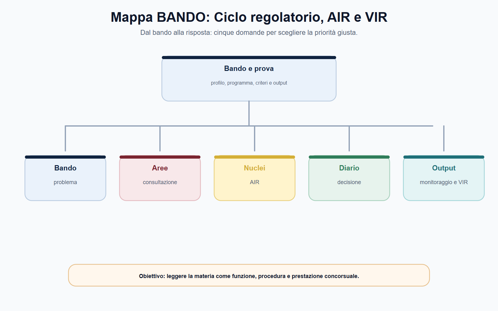
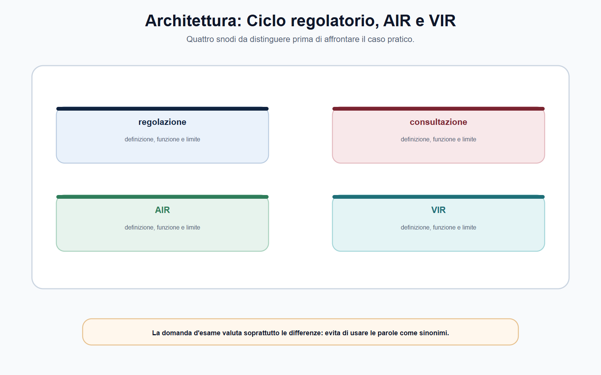
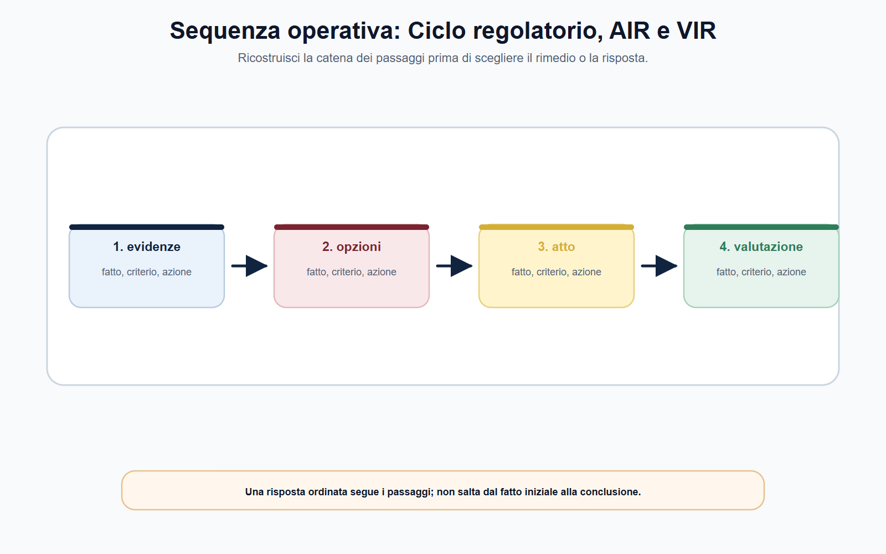
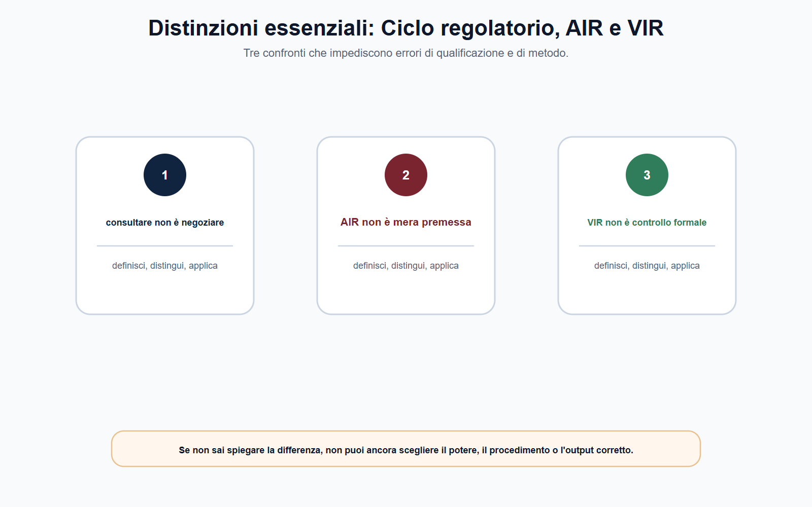
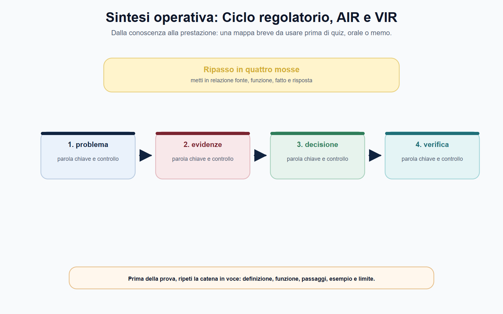

# Ciclo regolatorio, consultazione, AIR e VIR

## N-MF05-04-01 · Quadro e criterio di lettura

**Obiettivo.** Trasformare il ciclo regolatorio in una sequenza di lavoro: problema, evidenze, opzioni, consultazione, decisione, attuazione, monitoraggio e valutazione degli effetti.

**Domanda guida.** Come dimostra un'Autorità che una misura regolatoria è necessaria, proporzionata, comprensibile e verificabile nel tempo?

**Output operativo.** Mini-AIR, matrice degli stakeholder, traccia di documento di consultazione e checklist per distinguere monitoraggio e VIR.

> **Regola di metodo.** Una delibera finale non è il punto di partenza del ragionamento regolatorio: è l'esito di un percorso che deve restare leggibile, motivato e controllabile.

### Apertura editoriale

Una misura regolatoria non è soltanto una regola da pubblicare. Può incidere sui prezzi, sulla qualità di un servizio, sulle informazioni offerte agli utenti, sugli obblighi degli operatori, sulle condizioni di accesso a un mercato e sugli investimenti necessari per rispettare nuovi standard. Per questo la decisione dell'Autorità deve essere preceduta da una domanda più esigente della semplice formula «quale testo adottiamo?»: qual è il problema, quali evidenze lo dimostrano, quali soluzioni sono realistiche e come si potrà verificare se la scelta ha funzionato?

Il ciclo regolatorio organizza queste domande in un percorso. Non è una formula rigida uguale per tutte le Autorità, né una successione di adempimenti da compilare meccanicamente. È il metodo che collega potere attribuito, istruttoria, partecipazione, motivazione, attuazione e valutazione. In termini professionali, serve a trasformare una decisione potenzialmente discrezionale in una scelta ragionata, trasparente e verificabile.

Consultazione, AIR e VIR sono tre strumenti diversi ma collegati. La consultazione acquisisce contributi e dati; l'AIR analizza ex ante problema, opzioni e impatti; la VIR osserva ex post utilità, efficacia, efficienza ed effetti della regolazione. Nessuno dei tre sostituisce gli altri. Una consultazione senza analisi può raccogliere opinioni senza costruire un confronto tra alternative; un'AIR senza interlocuzione può ignorare informazioni rilevanti; una decisione priva di monitoraggio e verifica rischia di restare immune dall'esperienza applicativa.

### Obiettivo operativo del capitolo

Al termine del capitolo il lettore deve essere in grado di:

1. ricostruire le fasi essenziali del ciclo regolatorio;
2. distinguere consultazione, AIR, monitoraggio e VIR;
3. spiegare perché la partecipazione non coincide con un referendum sulla misura;
4. impostare una mini-AIR proporzionata, senza inventare dati o risultati;
5. verificare la fonte procedimentale della singola Autorità prima di applicare un modello generale.

*Figura 4.1 — La tavola orienta la lettura di problema regolatorio e separa il perimetro dalle eccezioni.*

### Il ciclo regolatorio: una sequenza, non una formalità

La rappresentazione più utile del ciclo regolatorio è circolare. L'Autorità individua un problema, raccoglie elementi, confronta opzioni e consulta gli interessati; adotta poi una decisione motivata, ne segue l'attuazione e verifica gli effetti. Da questa verifica può nascere una manutenzione della regola, una correzione, una semplificazione o, se necessario, un nuovo procedimento.

| Fase | Domanda da porre | Prodotto di lavoro atteso |
| --- | --- | --- |
| Individuazione del problema | Quale disfunzione, rischio o fallimento di mercato/servizio richiede intervento? | Nota di inquadramento e base di competenza |
| Evidenze | Quali dati, segnalazioni, analisi e fonti rendono il problema verificabile? | Fascicolo istruttorio e quadro informativo |
| Opzioni | Quali alternative regolatorie e non regolatorie sono possibili? | Opzioni comparate, inclusa l'ipotesi di non intervento quando pertinente |
| Consultazione | Quali informazioni o osservazioni occorre acquisire dagli interessati? | Documento di consultazione, contributi e sintesi istruttoria |
| Decisione | Perché l'opzione scelta è coerente con competenza, obiettivi e proporzionalità? | Atto motivato e pubblicato secondo la disciplina applicabile |
| Attuazione e monitoraggio | La regola è applicabile? I dati mostrano criticità o scostamenti? | Indicatori, flussi informativi, attività di vigilanza o follow-up |
| VIR e revisione | Gli effetti corrispondono agli obiettivi? Resta utile ed efficiente la misura? | Valutazione ex post e proposta di mantenimento, modifica o superamento |

La sequenza deve essere adattata alla natura del potere. Un atto generale di regolazione, un provvedimento individuale, un atto urgente, una misura tecnica attuativa o un parere non richiedono necessariamente lo stesso percorso. L'errore non sta nell'adattare il metodo; sta nel non motivare l'adattamento o nell'ignorare il regolamento che disciplina il procedimento dell'ente.

È importante, inoltre, non trasferire automaticamente alle Autorità indipendenti la disciplina prevista per le amministrazioni statali. Il D.P.C.M. 15 settembre 2017, n. 169 disciplina AIR, VIR e consultazioni per le amministrazioni statali e ne esclude espressamente le Autorità amministrative indipendenti. Il suo valore, in questo modulo, è soprattutto metodologico: aiuta a comprendere la logica ex ante ed ex post della qualità della regolazione. Per applicare la procedura concreta occorre invece consultare la legge istitutiva, il regolamento procedimentale e gli atti organizzativi dell'Autorità competente.

## N-MF05-04-02 · Istituti e distinzioni

*Figura 4.2 — La tavola mette a confronto consultazione e AIR senza sovrapporli.*

### Consultazione: ascoltare per decidere meglio

La consultazione pubblica è un passaggio istruttorio orientato alla qualità della decisione. Consente all'Autorità di acquisire informazioni su costi di adeguamento, effetti sugli utenti, criticità tecniche, condizioni di mercato, alternative praticabili e possibili conseguenze non previste. Operatori, associazioni dei consumatori, professionisti, altre amministrazioni, esperti e soggetti interessati possono offrire dati ed esperienze che l'ufficio non possiede o che meritano verifica.

La consultazione non è, tuttavia, una delega della decisione. L'Autorità non è tenuta a seguire la posizione più numerosa o più influente; deve valutare i contributi rilevanti secondo competenza, istruttoria, interesse pubblico e criteri stabiliti dalla disciplina applicabile. Per questa ragione la consultazione non è un referendum. Il suo risultato è un patrimonio informativo e argomentativo che deve essere trattato con trasparenza, non un voto che sostituisce la motivazione dell'atto.

Un documento di consultazione efficace non deve essere lungo per apparire autorevole. Deve rendere comprensibile il problema, indicare la base del procedimento, presentare gli orientamenti o le opzioni, formulare quesiti pertinenti, specificare le modalità di invio dei contributi e delimitare correttamente il perimetro della discussione. L'Autorità deve rendere possibile una partecipazione informata; i partecipanti devono comprendere su quali questioni sono chiamati a intervenire.

| Elemento | Funzione pratica | Controllo del funzionario |
| --- | --- | --- |
| Oggetto e presupposti | Delimitano il problema regolatorio | Il problema è formulato in modo verificabile? |
| Base di competenza | Collega l'iniziativa al potere dell'Autorità | Sono indicate le fonti rilevanti? |
| Evidenze disponibili | Rendono controllabile il ragionamento | Dati e limiti conoscitivi sono distinguibili? |
| Opzioni o orientamenti | Consentono contributi mirati | È chiaro che cosa può cambiare? |
| Quesiti | Trasformano la consultazione in istruttoria | Le domande raccolgono informazioni utili? |
| Modalità e termini | Garantiscono ordine e parità di accesso | Canale, scadenza e formato sono indicati? |
| Trattamento dei contributi | Protegge trasparenza e riservatezza | È previsto come acquisire, classificare e valutare le osservazioni? |

L'esempio ARERA mostra la concretezza di questo impianto. Nei suoi procedimenti di regolazione, la documentazione di consultazione è utilizzata per sottoporre orientamenti e questioni agli interessati; l'Autorità ha inoltre aggiornato nel 2025 la propria disciplina AIR dopo un processo di consultazione. Questo dato non autorizza a estendere contenuti, termini o moduli ARERA a ogni Autorità. Conferma però una regola generale: consultazione e analisi di impatto sono strumenti di istruttoria e accountability, non ornamenti della decisione.

*Figura 4.3 — La tavola ricostruisce il passaggio dai fatti alla competenza e alla decisione.*

### AIR: valutare prima di regolare

L'**Analisi di impatto della regolazione (AIR)** è una metodologia ex ante. Serve a capire se e come intervenire, mettendo a confronto alternative e ricadute attese in termini qualitativi e, quando possibile e proporzionato, quantitativi. Un'AIR seria non parte dalla soluzione già scelta per cercare argomenti a sostegno; parte dal problema e rende confrontabili le possibili risposte.

La forma dell'AIR dipende dalla rilevanza, dalla complessità e dal quadro regolamentare dell'ente. Non ogni provvedimento richiede la stessa profondità di analisi. Ma anche un'AIR semplificata deve conservare un nucleo logico: problema, obiettivi, opzioni, destinatari, impatti, criteri di confronto e ragioni della scelta. Se mancano questi passaggi, il documento rischia di essere una relazione descrittiva anziché uno strumento decisionale.

Una mini-AIR può essere costruita con otto campi:

1. **Problema:** quale comportamento, ostacolo o rischio giustifica l'intervento?
2. **Obiettivo:** quale risultato concreto, compatibile con il potere attribuito, si intende raggiungere?
3. **Destinatari:** chi sostiene obblighi, costi, benefici o rischi della misura?
4. **Opzioni:** quali alternative sono disponibili, compresa la conferma della disciplina vigente se ragionevole?
5. **Impatti:** quali effetti attesi si producono su utenti, operatori, concorrenza, organizzazione e controlli?
6. **Evidenze e limiti:** da quali dati o fonti derivano le valutazioni e quali incertezze restano?
7. **Consultazione:** quali informazioni mancanti devono essere richieste agli interessati?
8. **Scelta e monitoraggio:** quale opzione è preferibile e con quali indicatori sarà seguita?

## N-MF05-04-03 · Poteri, procedura e conseguenze

Questo schema chiarisce anche il rapporto tra AIR e proporzionalità. Proporzionalità non significa scegliere sempre la misura meno onerosa in astratto. Significa verificare che la misura sia adeguata all'obiettivo, necessaria rispetto alle alternative disponibili e non eccessiva rispetto agli effetti che produce. L'AIR fornisce la struttura informativa per compiere e motivare questa valutazione; la decisione resta dell'Autorità competente.

*Figura 4.4 — La tavola evidenzia le distinzioni da controllare prima di rispondere.*

### Monitoraggio e VIR: ciò che accade dopo la decisione

Una regolazione può essere ben progettata e produrre effetti diversi da quelli attesi. Gli operatori possono adeguarsi in modi imprevisti, i costi possono rivelarsi superiori, un'innovazione può rendere la misura inadeguata o un obiettivo può essere raggiunto con strumenti più semplici. Per questo il ciclo non termina con la pubblicazione dell'atto.

Il **monitoraggio** raccoglie e interpreta, nel tempo, dati sull'attuazione: adesione alle regole, tempi, reclami, qualità del servizio, effetti economici, andamento del mercato o altri indicatori pertinenti. Non è ancora, da solo, una VIR. Produce la base conoscitiva necessaria per valutare la regolazione e per intercettare precocemente criticità applicative.

La **Verifica di impatto della regolazione (VIR)** è una valutazione ex post. Domanda se la regolazione sia ancora utile, efficace ed efficiente e quali effetti, anche inattesi, abbia prodotto. La VIR può condurre a confermare una misura, modificarla, semplificarla, coordinarla con nuove fonti o superarla. Non ha come scopo dimostrare che la decisione originaria era corretta; ha lo scopo di apprendere dall'applicazione della regola.

| Strumento | Tempo | Domanda centrale | Rischio da evitare |
| --- | --- | --- | --- |
| AIR | Prima della decisione | Quale opzione produce l'effetto atteso con impatti ragionevoli? | Giustificare una scelta già decisa |
| Monitoraggio | Durante l'attuazione | Che cosa sta accadendo dopo l'entrata in vigore? | Raccogliere dati senza usarli |
| VIR | Dopo un periodo significativo | La misura è ancora utile, efficace ed efficiente? | Limitarsi a riepilogare l'attività svolta |

La distinzione è particolarmente importante nelle risposte d'esame. Dire che «la VIR misura gli impatti prima di adottare l'atto» significa invertire il ciclo. Dire che «l'AIR verifica a posteriori se la regolazione funziona» è ugualmente errato. La risposta essenziale è: AIR ex ante; monitoraggio durante l'attuazione; VIR ex post.

### Trasparenza, motivazione e tracciabilità

Consultazione, AIR e VIR sono anche strumenti di accountability. Rendono più chiaro perché l'Autorità abbia scelto una certa misura, quali informazioni abbia considerato, quali osservazioni abbia accolto o superato e come intenda controllare l'attuazione. Questo non impone di pubblicare indiscriminatamente ogni documento o ogni dato: pubblicità, accesso, riservatezza e protezione delle informazioni sensibili restano disciplinati dalle fonti applicabili.

Per il funzionario, tracciabilità significa distinguere sempre quattro piani nel fascicolo: i fatti e i dati disponibili; le osservazioni ricevute; le valutazioni tecniche dell'ufficio; la proposta e la decisione dell'organo competente. Confondere questi piani genera opacità. Tenerli separati consente invece di motivare, rispondere alle osservazioni rilevanti e difendere la coerenza della decisione nelle sedi previste.

*Figura 4.5 — La tavola chiude il percorso collegando monitoraggio e VIR a tracciabilità.*

### Mappa BANDO

Quando il programma di concorso richiama «regolazione», «consultazione», «qualità della regolazione», «analisi di impatto» o «accountability», prepara una risposta che unisca metodo e fonte.

| Voce del bando | Nucleo da padroneggiare | Output da allenare |
| --- | --- | --- |
| Procedimenti regolatori | Fasi, competenza, partecipazione e decisione | Schema del ciclo in sette passaggi |
| Consultazione | Funzione istruttoria, quesiti, contributi e motivazione | Matrice stakeholder–informazione richiesta |
| AIR | Problema, opzioni, impatti, proporzionalità e scelta | Mini-AIR in una pagina |
| VIR e monitoraggio | Effetti ex post, indicatori, revisione della misura | Tabella obiettivi–indicatori–esiti |
| Ordinamento dell'Autorità | Regolamento interno e atti applicabili | Checklist delle fonti dell'ente target |

> **Da sapere in cinque righe.** Il ciclo regolatorio parte dal problema e termina con la verifica degli effetti, non con la sola adozione della delibera. La consultazione acquisisce contributi utili ma non sostituisce la decisione motivata dell'Autorità. L'AIR valuta ex ante opzioni e impatti; il monitoraggio segue l'attuazione; la VIR valuta ex post utilità, efficacia ed efficienza. Il D.P.C.M. n. 169/2017 è un riferimento metodologico, ma esclude le Autorità indipendenti dal proprio ambito soggettivo. Per la procedura concreta occorre sempre leggere le regole dell'ente competente.

## N-MF05-04-04 · Applicazione alla prova

### Caso guidato: nuova qualità minima del servizio regolato

L'Autorità valuta l'introduzione di un nuovo standard minimo di qualità per un servizio regolato. Alcune segnalazioni degli utenti evidenziano ritardi e informazioni poco comprensibili; gli operatori sostengono che un obbligo uniforme avrebbe costi elevati e non terrebbe conto delle differenze territoriali.

L'ufficio non deve partire dalla formula «introduciamo il nuovo standard» né limitarsi a raccogliere le lettere ricevute. La prima attività consiste nel definire il problema con evidenze: frequenza dei ritardi, tipologia delle segnalazioni, utenti coinvolti, andamento per categoria di servizio e limiti dei dati disponibili. Occorre poi individuare l'obiettivo: ridurre i ritardi, migliorare l'informazione o entrambi?

La mini-AIR confronta almeno tre opzioni: mantenere la disciplina vigente con maggiore vigilanza; introdurre obblighi informativi graduati; fissare uno standard minimo accompagnato da misure di monitoraggio e da eventuali correttivi. La consultazione domanda agli interessati dati sui costi, sulle modalità tecniche di adeguamento, sugli effetti per gli utenti vulnerabili e sugli indicatori concretamente misurabili. Non chiede semplicemente: «Siete favorevoli?». Una domanda binaria produrrebbe una risposta povera e poco utilizzabile.

Terminata l'istruttoria, l'Autorità sceglie e motiva l'opzione ritenuta proporzionata secondo la propria disciplina. Nell'atto o nella documentazione collegata stabilisce come seguirne l'attuazione: ad esempio, indicatori sui tempi, reclami, correttezza delle informazioni e costi dichiarati. Dopo un periodo idoneo, il monitoraggio alimenta una VIR: la misura ha migliorato il servizio? Ha prodotto oneri non giustificati? Occorre modificarla? Il caso mostra che consultazione, AIR e VIR non sono tre documenti separati, ma tre momenti di una stessa responsabilità regolatoria.

### Domanda da commissario

**Distingua consultazione, AIR e VIR e ne spieghi il ruolo nel ciclo regolatorio di un'Autorità indipendente.**

### Risposta orale modello

«Il ciclo regolatorio è il percorso che collega individuazione del problema, raccolta delle evidenze, confronto tra opzioni, consultazione, decisione, attuazione, monitoraggio e valutazione degli effetti. La consultazione ha funzione istruttoria: consente di acquisire dati, criticità e proposte dagli interessati, ma non sostituisce la decisione motivata dell'Autorità. L'AIR è uno strumento ex ante che analizza problema, alternative e impatti attesi, anche in chiave di proporzionalità. Il monitoraggio segue l'applicazione della misura; la VIR è invece ex post e verifica utilità, efficacia, efficienza ed effetti della regolazione. La procedura concreta non va presunta: per le Autorità indipendenti occorre leggere la fonte istitutiva e i regolamenti dell'ente.»

### Domanda-trappola

**Se la maggioranza dei partecipanti alla consultazione respinge l'opzione proposta, l'Autorità non può più adottarla?**

No. La consultazione non è un voto. L'Autorità deve valutare seriamente i contributi pertinenti, acquisire le informazioni utili e motivare la scelta secondo competenza, evidenze, interesse pubblico e disciplina applicabile. L'eventuale dissenso maggioritario è un elemento istruttorio rilevante, non un potere sostitutivo della decisione.

### Errore tipico

**Errore:** «AIR e VIR sono due nomi per la stessa analisi di impatto.»

**Correzione:** l'AIR è ex ante e confronta opzioni e impatti attesi; la VIR è ex post e valuta risultati ed effetti della regolazione già applicata. Fra le due si colloca il monitoraggio dell'attuazione.

### Mini-esercizio di consolidamento

Redigi una mini-AIR di dieci righe sul seguente problema: «Gli utenti segnalano difficoltà nel comprendere le informazioni contrattuali di un servizio regolato». Usa questa traccia:

| Campo | Appunto da completare |
| --- | --- |
| Problema ed evidenze da acquisire |  |
| Obiettivo regolatorio |  |
| Destinatari e stakeholder |  |
| Opzione 1: mantenere la disciplina vigente |  |
| Opzione 2: obblighi informativi semplificati |  |
| Opzione 3: standard minimi + monitoraggio |  |
| Impatti e dati mancanti |  |
| Quesiti per la consultazione |  |
| Indicatore per il monitoraggio |  |
| Domanda per la VIR |  |

Controlla il risultato con una domanda finale: «Ho spiegato perché una certa opzione potrebbe essere preferibile, oppure ho soltanto descritto la mia soluzione?». Nel secondo caso, torna alle alternative e agli impatti.

### Laboratorio di qualificazione

Per allenare problema regolatorio, parti da un fascicolo minimo: una richiesta, due documenti non perfettamente coerenti e una fonte che attribuisce il potere. Scrivi in colonne separate i fatti provati, le allegazioni e gli elementi ancora da acquisire. Poi confronta consultazione con AIR: annota soggetto, presupposto, funzione ed effetto di ciascun istituto. Il confronto impedisce di scegliere la soluzione soltanto perché una parola della traccia ricorda una definizione studiata.

## N-MF05-04-05 · Consolidamento e verifica

Passa quindi a decisione e motivazione. Indica chi avvia l'attività, quali garanzie devono essere rispettate e quale atto può chiuderla. Se la fonte lascia un margine di valutazione, rendi espliciti i criteri: gravità, durata, diffusione, rischio, collaborazione e proporzionalità, secondo il settore applicabile. Collega monitoraggio e VIR al documento che ne permette la verifica e tratta tracciabilità come una conclusione da motivare, non come un'etichetta. La scheda è completa quando un secondo lettore può ricostruire il percorso senza conoscere l'intenzione di chi l'ha compilata.

### Controllo incrociato

Rileggi ora il risultato da tre prospettive. Come candidato, verifica di avere definito problema regolatorio senza dilungarti su nozioni estranee. Come istruttore, controlla che la distinzione fra consultazione e AIR poggi su documenti e non su supposizioni. Come decisore, chiediti se il passaggio dedicato a decisione e motivazione giustifichi davvero l'esito proposto. Se una prospettiva non trova risposta, riapri l'analisi nel punto preciso invece di aggiungere una conclusione generica.

Completa il controllo con una riga dedicata alle alternative. Spiega quale diversa qualificazione sarebbe possibile se cambiasse un fatto decisivo, quale fonte farebbe mutare il perimetro di monitoraggio e VIR e quale conseguenza produrrebbe su tracciabilità. L'esercizio allena a riconoscere le opzioni quasi corrette: nei concorsi l'errore più insidioso non è sempre una regola falsa, ma una regola vera applicata al soggetto, al tempo o al procedimento sbagliato. La risposta finale deve perciò contenere anche il proprio limite di validità.

### ▣ Verifica ragionata

**Quesito 1.** Qual è il primo controllo quando la traccia richiama problema regolatorio?

**Risposta corretta:** individuare il fatto rilevante, la fonte e il perimetro della competenza prima di scegliere l'istituto. La parola usata nella traccia può orientare, ma non dimostra da sola quale autorità o quale potere siano applicabili. Una risposta efficace espone il criterio e poi lo applica ai dati disponibili.

**Quesito 2.** consultazione e AIR possono essere trattati come espressioni equivalenti?

**Risposta corretta:** no. Devono essere distinti per funzione, presupposti, soggetti ed effetti. Dopo la distinzione si può spiegare il loro coordinamento. Nei quiz, l'opzione errata spesso contiene una definizione plausibile ma trasferisce a un istituto la funzione dell'altro.

**Quesito 3.** Un dato tratto da un bando storico o da una pagina operativa vale per ogni procedura successiva?

**Risposta corretta:** no. Il dato è utile come esempio datato; requisiti, termini, soglie, composizione delle prove e modalità di ricorso devono essere ricontrollati nella fonte vigente e nel bando applicabile. La regola stabile va separata dal dato mobile.

**Quesito 4.** Come va usato decisione e motivazione nel caso proposto?

**Risposta corretta:** va collegato a fatti, competenza, sequenza procedurale e conseguenza. Limitarsi a una definizione non dimostra capacità applicativa; anticipare l'esito senza istruttoria produce invece una conclusione non sostenuta. La motivazione deve rendere visibile il passaggio compiuto.

**Quesito 5.** La finalità generale di tutela attribuisce automaticamente qualsiasi potere in materia di monitoraggio e VIR?

**Risposta corretta:** no. Ogni potere richiede una fonte attributiva, un oggetto e un procedimento. La missione istituzionale aiuta a interpretare il sistema, ma non sostituisce la verifica della competenza concreta né consente di confondere vigilanza, rimedio individuale e sanzione.

**Quesito 6.** Quale controllo conclusivo riduce gli errori su tracciabilità?

**Risposta corretta:** confrontare la conclusione con la domanda, la fonte e i fatti effettivamente disponibili. Se manca un elemento, la risposta deve indicare quale documento o accertamento serve. Dichiarare il limite informativo è più professionale che colmarlo con un automatismo.

### Caso ragionato di chiusura

Un ufficio riceve una segnalazione che usa formule generiche, richiama problema regolatorio e chiede un intervento immediato su tracciabilità. Il fascicolo contiene una schermata, una comunicazione non datata e il riferimento a un bando precedente. La soluzione non consiste nello scegliere subito una sanzione. Occorre qualificare il fatto, verificare autenticità e data dei documenti, individuare la fonte vigente, distinguere consultazione da AIR e stabilire quale amministrazione possa acquisire gli elementi mancanti. Solo allora si valuta decisione e motivazione, si collega monitoraggio e VIR al potere pertinente e si motiva il passo successivo. Il caso è risolto correttamente quando la conclusione resta proporzionata alle prove e separa la regola stabile dai dati da aggiornare.
