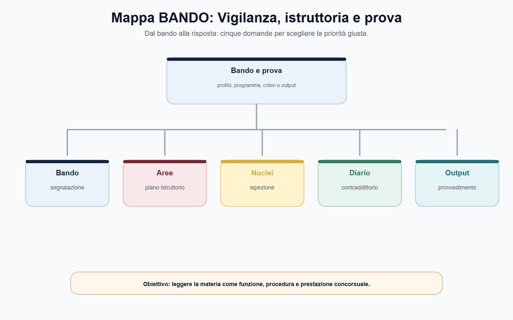
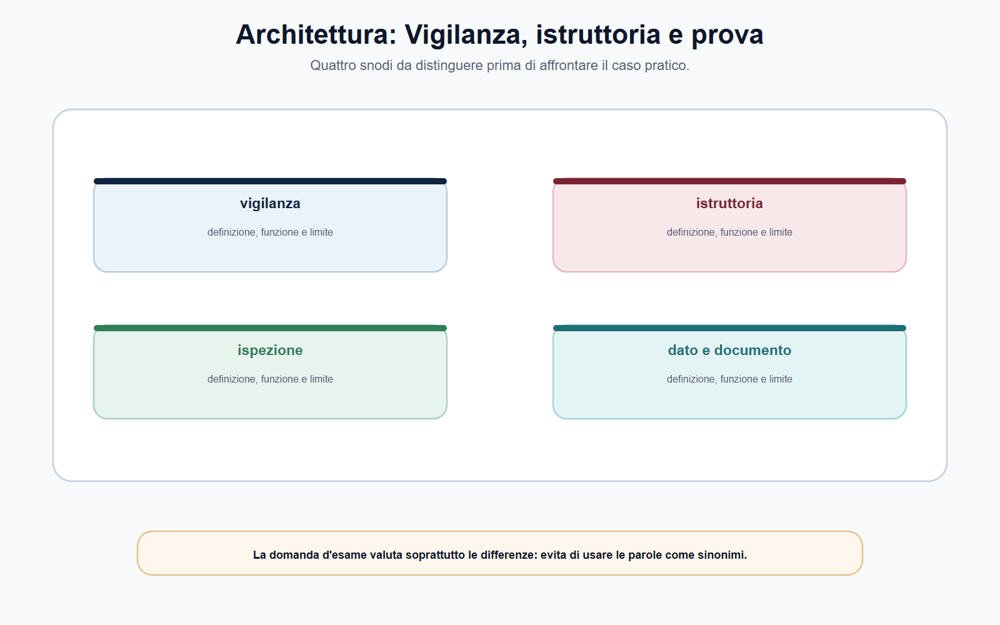
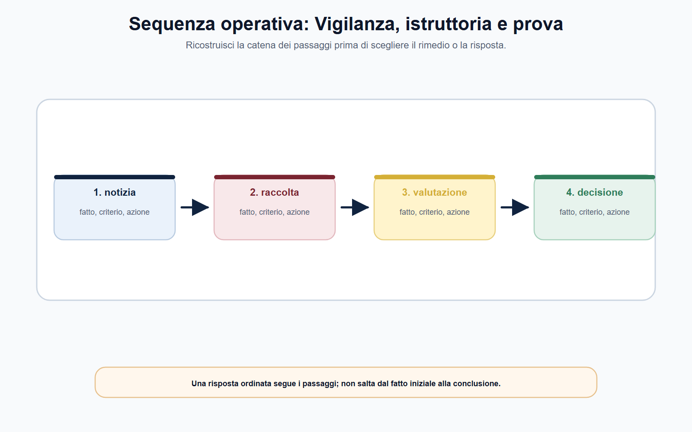
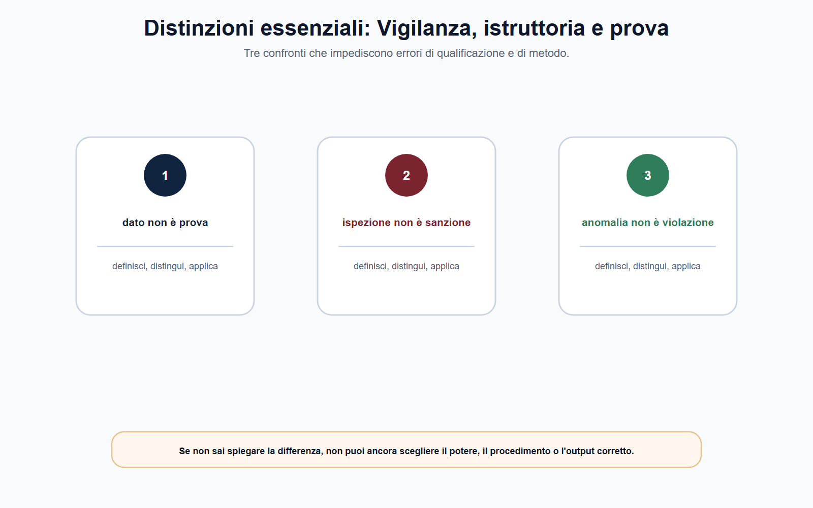
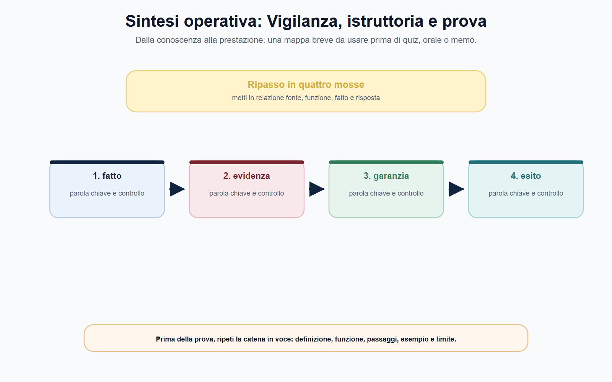

# Vigilanza, istruttoria, ispezioni, dati e prova

## Scheda di lavoro

**Obiettivo.** Ricostruire un fascicolo di vigilanza dalla segnalazione alla valutazione dell'evidenza, preservando competenza, riservatezza, contraddittorio e tracciabilità.

**Domanda guida.** Come si trasforma un'informazione iniziale — una segnalazione, un dato anomalo o un esposto — in un accertamento che possa sostenere una decisione dell'Autorità?

**Output operativo.** Piano istruttorio, richiesta di informazioni, indice ragionato del fascicolo e griglia per valutare la qualità di un dato o documento.

> **Regola di metodo.** Non chiederti prima «quale sanzione applicare?». Chiediti: quale potere è attribuito, quale fatto deve essere accertato e quali elementi sono necessari per provarlo secondo il procedimento applicabile?

## Testo editoriale

### Apertura editoriale

Nelle Autorità indipendenti, la qualità della decisione dipende dalla qualità dell'istruttoria. Un provvedimento può essere tecnicamente sofisticato e giuridicamente ben formulato, ma resta fragile se i fatti non sono stati ricostruiti con metodo, se i dati non sono pertinenti o se le osservazioni dei soggetti coinvolti non sono state considerate secondo le garanzie previste.

Vigilanza, istruttoria, richiesta di informazioni, audizione, analisi economica, acquisizione documentale e ispezione sono strumenti diversi. Hanno funzioni differenti e non possono essere usati come se fossero equivalenti. La vigilanza consente di osservare il rispetto delle regole e di individuare aree di rischio; l'istruttoria ordina gli elementi utili a una decisione; l'ispezione è una forma di accertamento che può essere esercitata soltanto nei casi, con le modalità e dalle persone indicate dalla fonte applicabile.

Il candidato deve evitare due semplificazioni. La prima è pensare che ogni segnalazione provi una violazione. Una segnalazione può essere un impulso conoscitivo, non una conclusione. La seconda è immaginare che il funzionario possa acquisire qualsiasi informazione ritenuta potenzialmente utile. Anche quando l'Autorità dispone di poteri informativi e ispettivi incisivi, questi devono essere esercitati entro oggetto, competenza, proporzionalità, riservatezza e garanzie procedimentali.

### Obiettivo operativo del capitolo

Al termine del capitolo il lettore deve saper:

1. distinguere vigilanza, istruttoria e ispezione;
2. definire il perimetro di un accertamento prima di acquisire dati o documenti;
3. valutare pertinenza, provenienza, integrità, riservatezza e utilizzabilità dell'evidenza;
4. spiegare il ruolo del contraddittorio nella qualità della prova amministrativa;
5. impostare un fascicolo leggibile per chi istruisce, decide, controlla o riesamina l'atto.

*Figura 5.1 — Schema di ripasso: usa la mappa per collegare regola, funzione e output di prova.*

### Vigilanza e istruttoria: dalla notizia al fatto accertato

La **vigilanza** è l'attività con cui l'Autorità osserva e controlla, nel proprio perimetro, il rispetto delle regole, l'andamento del mercato o del servizio e l'emersione di rischi. Può essere alimentata da segnalazioni, reclami, flussi informativi, controlli periodici, analisi di dati, cooperazione con altre Autorità o notizie provenienti da fonti attendibili. La sua funzione non è anticipare il giudizio finale: è mettere l'ente nella condizione di comprendere se occorra approfondire un fatto.

L'**istruttoria** è il percorso ordinato con cui si raccolgono, verificano e valutano gli elementi necessari per l'esercizio di un potere. Inizia solo dopo che l'ufficio abbia chiarito, nei limiti della disciplina applicabile, quale problema debba essere esaminato, quale norma o regola possa rilevare, quale soggetto sia coinvolto e quale Autorità sia competente. In questo senso, l'istruttoria non è un deposito di documenti: è una costruzione razionale del fascicolo.

Nella disciplina antitrust, l'articolo 14 della legge n. 287/1990 offre un esempio concreto di questa logica: l'apertura dell'istruttoria è notificata alle imprese e agli enti interessati; sono previste possibilità di essere sentiti e di presentare deduzioni; le richieste di informazioni devono essere proporzionate; possono essere disposte audizioni, perizie e analisi economiche o statistiche. L'esempio non va trapiantato negli altri settori, ma chiarisce un principio generale: poteri di acquisizione e garanzie di partecipazione concorrono alla formazione di una decisione affidabile.

Per impostare bene un'attività istruttoria è utile redigere una scheda iniziale.

| Campo | Domanda operativa | Errore da evitare |
| --- | --- | --- |
| Oggetto | Quale fatto, condotta o situazione deve essere verificata? | Indagini esplorative senza perimetro |
| Fonte di competenza | Quale norma o regolamento attribuisce il potere? | Usare un potere per una finalità estranea |
| Soggetti e mercato/servizio | Chi è coinvolto e quale ambito è interessato? | Confondere segnalante, destinatario e terzo informato |
| Ipotesi da verificare | Quali elementi confermerebbero o smentirebbero l'ipotesi? | Trattare l'ipotesi come fatto provato |
| Fonti di evidenza | Quali documenti, dati, dichiarazioni o analisi sono necessari? | Acquisire tutto «per sicurezza» |
| Garanzie | Quali comunicazioni, termini e forme di contraddittorio sono previste? | Rinviare le garanzie alla fase finale |

Questo schema aiuta il funzionario a mantenere una distinzione decisiva: tra **notizia**, **ipotesi**, **evidenza** e **valutazione**. La notizia segnala un possibile problema; l'ipotesi orienta la ricerca; l'evidenza è un elemento acquisito e verificato nel fascicolo; la valutazione collega gli elementi alle conclusioni. Quando questi piani sono confusi, la motivazione rischia di presentare una supposizione come prova o un dato grezzo come conclusione.

*Figura 5.2 — Schema di ripasso: usa la mappa per collegare regola, funzione e output di prova.*

### Il piano istruttorio: chiedere ciò che serve

Un piano istruttorio è una mappa di lavoro, non un atto conclusivo. Serve a stabilire quali informazioni acquisire, da chi, con quale finalità e in quale ordine. La sua qualità si misura dalla capacità di essere selettivo: chiede gli elementi necessari, evita duplicazioni e rende visibile il rapporto fra fatto da accertare e fonte probatoria.

Una richiesta di informazioni ben impostata contiene normalmente l'oggetto del procedimento o dell'approfondimento, il fondamento del potere, l'elenco dei dati o documenti richiesti, il periodo di riferimento, il formato di trasmissione, il termine e le indicazioni sulla riservatezza o sulle modalità di interlocuzione previste dall'ente. Il contenuto concreto non può essere standardizzato al di fuori della disciplina settoriale, ma una regola è costante: il destinatario deve poter comprendere che cosa viene richiesto e perché.

La proporzionalità svolge qui una funzione pratica. Non impone all'Autorità di rinunciare a dati rilevanti, né richiede che l'ufficio possieda già la prova prima di chiedere informazioni. Impone, invece, di collegare ogni richiesta a un oggetto istruttorio e di evitare acquisizioni indifferenziate, ridondanti o non giustificate. Nel procedimento AGCM, la legge n. 287/1990 qualifica espressamente come proporzionate le richieste informative e richiede che siano utili ai fini dell'istruttoria. Questo criterio è un buon orientamento metodologico anche quando la fonte dell'ente prevede regole differenti.

| Domanda da porre prima della richiesta | Utilità |
| --- | --- |
| Il dato serve a verificare un fatto o soltanto a completare il fascicolo? | Distingue necessità da curiosità istruttoria |
| Il periodo richiesto è coerente con la condotta esaminata? | Riduce eccedenze e costi di acquisizione |
| Esiste una fonte meno invasiva o già disponibile? | Evita duplicazioni e ritardi |
| Il formato consente controllo e riuso corretto del dato? | Favorisce integrità e confrontabilità |
| Occorrono cautele su segreto, dati personali o informazioni riservate? | Protegge la legittima circolazione delle informazioni |

Il piano deve poter cambiare quando emergono nuovi elementi. Modificarlo non è un difetto se la modifica è motivata e tracciata. È invece un problema quando l'istruttoria cambia oggetto in modo implicito, senza aggiornare competenza, garanzie e necessità delle acquisizioni successive.

*Figura 5.3 — Schema di ripasso: usa la mappa per collegare regola, funzione e output di prova.*

### Ispezioni: potere incisivo, perimetro rigoroso

L'ispezione è un accertamento svolto secondo i presupposti e le regole fissate dalla fonte di settore. Può servire a verificare luoghi, documenti, archivi, processi o informazioni che non risultano adeguatamente acquisibili con strumenti collaborativi. Proprio per la sua incisività, non è corretto descriverla come un potere uniforme di tutte le Autorità.

L'articolo 14 della legge n. 287/1990 attribuisce all'AGCM, nel proprio settore, poteri ispettivi dettagliati: accesso presso imprese e associazioni, controllo di libri e documenti su qualunque supporto, acquisizione di copie o estratti e altre attività nei limiti indicati dalla disposizione. La stessa norma prevede regole specifiche per accertamenti in luoghi diversi dai locali d'impresa, comprese garanzie autorizzative. Il messaggio da ricavare non è un elenco da estendere a ogni Autorità; è il contrario: più incisivo è il potere, più strettamente vanno verificati fonte, oggetto, presupposti e garanzie.

Anche il Garante per la protezione dei dati personali offre un esempio utile. La sua disciplina organizzativa individua, per l'attività ispettiva, un ordine di servizio che delimita destinatario del controllo, poteri utilizzati, ambito, luogo e responsabili dell'attività. Le deliberazioni periodiche di programmazione mostrano inoltre che l'attività ispettiva può essere organizzata secondo priorità e criteri, anche con la collaborazione della Guardia di finanza nei limiti della disciplina applicabile. Non si tratta di un protocollo trasferibile a CONSOB, IVASS, ARERA o AGCOM, ma di una conferma della necessità di perimetrare e documentare l'accesso.

Per il funzionario, la check-list essenziale prima di un'attività ispettiva è questa:

1. qual è la fonte del potere e quale ufficio o soggetto è competente?
2. qual è l'oggetto dell'accertamento e quali elementi si cercano?
3. quali atti di avvio, ordini, deleghe o autorizzazioni sono richiesti?
4. quali limiti valgono per luoghi, documenti, dati personali, segreti e informazioni riservate?
5. come vengono verbalizzate le attività, le acquisizioni, le dichiarazioni e le eventuali osservazioni del soggetto controllato?
6. come sono custoditi, indicizzati e resi disponibili gli elementi acquisiti nel fascicolo?

Questa lista non sostituisce la procedura dell'ente. Serve a ricordare che un'ispezione corretta non è solo efficace nel trovare informazioni: deve essere anche leggibile e controllabile a posteriori.

*Figura 5.4 — Schema di ripasso: usa la mappa per collegare regola, funzione e output di prova.*

### Dati e documenti: dalla raccolta alla qualità dell'evidenza

Nei procedimenti delle Autorità, il dato può essere economico, tecnico, contabile, contrattuale, digitale, personale o proveniente da un sistema informativo. Un documento può essere una comunicazione, un registro, un verbale, un report, una dichiarazione, una serie storica o l'esito di un'analisi. La varietà delle fonti non riduce l'esigenza di metodo; la aumenta.

Prima di utilizzare un elemento nel ragionamento istruttorio, occorre porre almeno cinque domande:

| Criterio | Domanda di controllo |
| --- | --- |
| Pertinenza | Il dato è collegato al fatto e al potere oggetto dell'istruttoria? |
| Provenienza | Si può ricostruire da chi, quando e con quale modalità è stato acquisito? |
| Integrità | Il documento o dataset è completo, leggibile e non alterato nel percorso di acquisizione? |
| Affidabilità | Quali limiti, errori, definizioni o distorsioni possono incidere sull'interpretazione? |
| Riservatezza e utilizzabilità | Esistono limiti di segreto, tutela di dati personali, finalità o circolazione? |

La protezione dei dati personali entra nel fascicolo non come ostacolo generico alla vigilanza, ma come criterio di corretta gestione. I principi di liceità, minimizzazione, esattezza, integrità, riservatezza e responsabilizzazione orientano il trattamento dei dati anche quando l'Autorità esercita compiti di interesse pubblico o pubblici poteri. Il dato necessario all'istruttoria non diventa per questo pubblicabile senza limiti, né utilizzabile per finalità ulteriori non compatibili con la base giuridica e con il procedimento.

È altrettanto importante distinguere il dato grezzo dall'elaborazione. Una tabella di valori, un log informatico o un elenco di contratti possono essere elementi istruttori; l'affermazione che essi dimostrino una violazione è una conclusione che richiede metodo, confronto con la regola applicabile, eventuale analisi tecnica e motivazione. L'ufficio deve poter spiegare il passaggio dai dati alla valutazione, indicando assunzioni, limiti e alternative interpretative rilevanti.

### Prova, contraddittorio e fascicolo

Nel linguaggio del capitolo, «prova» indica l'insieme degli elementi che sostengono l'accertamento di un fatto o una conclusione tecnica all'interno del procedimento. Non è una parola magica: un documento acquisito non è automaticamente decisivo, una dichiarazione non è automaticamente inattendibile, un modello economico non è automaticamente neutrale. Ogni elemento deve essere collocato nel suo contesto e valutato insieme agli altri.

Il **contraddittorio** migliora questa valutazione. Consentire, nelle forme previste, deduzioni, chiarimenti, produzione di documenti, audizioni o osservazioni non significa indebolire l'istruttoria. Significa sottoporre i suoi elementi a controllo, far emergere errori materiali, verificare spiegazioni alternative e rafforzare la motivazione della decisione. La disciplina AGCM dell'istruttoria riconosce espressamente la possibilità per i soggetti interessati di essere sentiti e di presentare deduzioni; altre Autorità possono prevedere modalità e tempi diversi, che devono essere verificati nella relativa fonte.

Un fascicolo di qualità consente di ricostruire il percorso senza affidarsi alla memoria dei singoli. Un indice essenziale può contenere:

1. atto o nota di avvio, oggetto e fonte di competenza;
2. segnalazioni, reclami o evidenze iniziali, con indicazione del loro valore informativo;
3. richieste di informazioni, risposte e documenti acquisiti;
4. verbali, atti ispettivi, deleghe o autorizzazioni quando previste;
5. dati grezzi, metadati, elaborazioni, perizie e note tecniche;
6. comunicazioni e contributi dei soggetti interessati;
7. nota di valutazione dei fatti e proposta di decisione;
8. atto conclusivo, pubblicità, comunicazioni e attività successive.

Questo ordine rende visibile la catena **fatto → fonte → analisi → valutazione → decisione**. È la migliore difesa contro due rischi opposti: il fascicolo opaco, in cui non si capisce come si sia arrivati alla conclusione, e il fascicolo sovraccarico, in cui l'accumulo di materiali sostituisce il ragionamento.

*Figura 5.5 — Schema di ripasso: usa la mappa per collegare regola, funzione e output di prova.*

### Mappa BANDO

Nei bandi delle Autorità, le parole «vigilanza», «istruttoria», «poteri informativi», «ispezioni», «dati», «analisi economica» e «procedimenti» richiedono di collegare sempre potere e garanzia.

| Voce del bando | Nucleo da padroneggiare | Output da allenare |
| --- | --- | --- |
| Vigilanza | Rischio, controllo, segnalazione e perimetro del potere | Scheda da segnalazione a piano istruttorio |
| Istruttoria | Fatti, fonti, richieste, analisi e proposta | Indice ragionato del fascicolo |
| Ispezioni | Fonte, oggetto, atti, limiti e verbalizzazione | Check-list «prima dell'accesso» |
| Dati e prova | Pertinenza, integrità, affidabilità e riservatezza | Griglia di valutazione di un dataset |
| Contraddittorio | Deduzioni, audizioni e valutazione delle osservazioni | Risposta orale in dieci righe |

> **Da sapere in cinque righe.** La vigilanza individua rischi e possibili criticità; l'istruttoria verifica fatti e costruisce il materiale per decidere. Le richieste di informazioni devono essere pertinenti e proporzionate. L'ispezione è un potere settoriale, non un modello valido per ogni Autorità. Dati e documenti richiedono provenienza, integrità, riservatezza e interpretazione motivata. Il contraddittorio non rallenta automaticamente il procedimento: migliora la qualità dell'accertamento e della decisione.

### Caso guidato: il dato anomalo non è ancora una violazione

Durante il monitoraggio di un servizio regolato, l'ufficio rileva che un operatore presenta per tre trimestri consecutivi tempi di risposta molto superiori alla media degli altri operatori. Un'associazione di utenti invia inoltre alcune segnalazioni su mancati riscontri. Il dirigente chiede di predisporre subito una proposta sanzionatoria.

La richiesta non può trasformare il dato anomalo in una violazione già accertata. Il funzionario deve prima ricostruire il perimetro: quale regola fissa, se la fissa, uno standard o un obbligo rilevante? I dati confrontano popolazioni omogenee? Esistono periodi eccezionali, modifiche nei criteri di rilevazione o errori di trasmissione? Le segnalazioni si riferiscono allo stesso fenomeno? Solo dopo queste verifiche si può definire un piano istruttorio proporzionato.

La prima richiesta può riguardare dati disaggregati, metodologia di calcolo, documentazione sulle procedure interne e spiegazioni su eventuali scostamenti. Se la disciplina dell'Autorità lo consente e l'acquisizione documentale non è sufficiente, potranno essere valutati ulteriori strumenti istruttori; non è corretto anticiparne l'uso senza aver verificato la fonte, i presupposti e le garanzie. I contributi dell'operatore, le osservazioni dell'associazione e gli elementi tecnici vanno mantenuti distinti nel fascicolo.

All'esito, la nota istruttoria deve indicare ciò che è accertato, ciò che resta incerto, le fonti utilizzate e la ragione per cui la condotta rientra o non rientra nella fattispecie applicabile. Se viene proposta una misura, la proposta segue l'accertamento; non lo precede. Il caso dimostra che la qualità della prova non dipende dalla quantità dei dati, ma dalla loro relazione trasparente con il fatto da dimostrare.

### Domanda da commissario

**Spieghi il rapporto tra poteri istruttori, dati e contraddittorio in un procedimento di vigilanza di un'Autorità indipendente.**

### Risposta orale modello

«Nel procedimento di vigilanza l'Autorità deve prima individuare il fatto da verificare e la fonte che le attribuisce il potere. L'istruttoria raccoglie e valuta dati, documenti, dichiarazioni e analisi in modo pertinente e proporzionato; l'ispezione è uno strumento eventuale, esercitabile solo nei presupposti e con le garanzie della disciplina settoriale. I dati devono essere tracciabili, integri, affidabili e gestiti nel rispetto della riservatezza e della protezione dei dati personali. Il contraddittorio consente ai soggetti interessati di fornire deduzioni e chiarimenti nelle forme previste, migliorando l'accertamento e la motivazione. La decisione deve rendere comprensibile il percorso dai fatti alle conclusioni.»

### Domanda-trappola

**Poiché un'Autorità svolge funzioni di vigilanza, può acquisire qualsiasi dato disponibile e trattarlo come prova della violazione?**

No. Ogni acquisizione deve essere collegata alla fonte del potere, all'oggetto dell'istruttoria e ai criteri di pertinenza e proporzionalità. Il dato deve inoltre essere valutato per provenienza, integrità, affidabilità, riservatezza e relazione con il fatto da accertare. La disponibilità tecnica di un'informazione non sostituisce la sua legittima e corretta utilizzazione.

### Errore tipico

**Errore:** «L'ispezione serve a trovare prove, quindi può essere disposta ogni volta che l'ufficio ha un sospetto.»

**Correzione:** l'ispezione è un potere incisivo soggetto a fonte, presupposti, oggetto, competenza e garanzie specifiche. Il sospetto può orientare l'istruttoria, ma non sostituisce la verifica della disciplina che consente l'accesso.

### Mini-esercizio di consolidamento

Un operatore invia dati aggregati che sembrano incompatibili con gli obblighi informativi del settore. Compila la griglia prima di proporre qualsiasi conclusione.

| Campo | Appunto da completare |
| --- | --- |
| Fatto o obbligo da verificare |  |
| Fonte del potere istruttorio |  |
| Dato o documento necessario |  |
| Periodo e destinatario della richiesta |  |
| Controllo di provenienza e integrità |  |
| Possibili spiegazioni alternative |  |
| Cautele di riservatezza o protezione dati |  |
| Forma di contraddittorio da verificare |  |
| Elementi per la nota conclusiva |  |

L'esercizio è corretto se la conclusione non compare prima dei fatti e se ogni richiesta è collegata a una domanda istruttoria precisa. Se hai scritto «acquisire tutta la documentazione», torna alla prima riga: probabilmente il perimetro non è ancora definito.

### Riferimenti consolidati

[[sources/vigilanza-istruttoria-ispezioni-dati-prova-authority-2026-07-24]], [[sources/authority-indipendenti-leggi-istitutive]], [[sources/regolamento-ue-2016-679-gdpr-protezione-dati-personali]], [[topics/vigilanza-istruttoria-ispezioni-dati-prova-authority]].

### Note di review editoriale

Prima della chiusura del volume, verificare alla data di cut-off: poteri informativi e ispettivi, regole sul contraddittorio, accesso al fascicolo, segreto e riservatezza, modelli di verbale e disciplina dei dati dell'Autorità indicata dal bando. Il capitolo non attribuisce a un ente poteri o procedure ricavati da un altro ordinamento settoriale.
